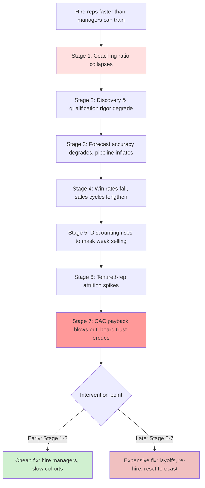

### Direct Answer

When you hire reps faster than you can train them, the first thing that breaks is **not your headcount plan and not your pipeline — it is the quality of every deal currently in flight and the credibility of your forecast.** Untrained reps do not fail loudly on day one; they fail silently over the following 90 to 180 days by mis-qualifying opportunities, anchoring on the wrong buyer, skipping discovery, discounting to compensate for weak value articulation, and feeding optimistic garbage into the CRM that your forecast then inherits. The visible symptoms — missed quota, high ramp-time, attrition — are lagging indicators that surface a quarter or two later. The leading breakage is invisible: a manager span-of-control that silently exceeds the coaching capacity of your front line, which means nobody is inspecting the deals, nobody is correcting the bad habits, and the new reps quietly calcify around whatever they guessed in week three.

**TLDR**

- **The single point of failure is coaching capacity, not seats.** A sales org can absorb almost unlimited recruiting, onboarding logistics, and tooling — but it cannot absorb more reps than its front-line managers can actually inspect, coach, and correct each week. When you cross that line, the org keeps *looking* fine and quietly stops *being* fine.
- **The breakage order is predictable.** (1) Manager coaching ratio collapses → (2) deal quality and discovery rigor degrade → (3) forecast accuracy degrades and pipeline inflates → (4) win rates and sales cycles worsen → (5) discounting rises to mask weak selling → (6) tenured-rep attrition spikes from territory cannibalization and quota inflation → (7) CAC payback blows out and the board loses trust. Each stage is a lagging indicator of the one before it.
- **The numbers that matter:** keep front-line manager span at 5–8 reps (never above 10), keep new-hire cohorts to roughly 20–25% of the existing team per quarter, budget 90 days of full-time-equivalent ramp before a rep carries full quota, and never let unramped reps exceed ~30% of the team.
- **Named operators who got this right or wrong:** Frank Slootman at Snowflake (SNOW) and ServiceNow (NOW) is famous for hiring *behind* demand and over-investing in enablement; Mark Roberge at HubSpot (HUBT, now part of the public HubSpot Inc. ticker HUBS) built a metrics-driven ramp model precisely to make hiring speed safe; the cautionary tales are the 2021–2022 cohort of venture-funded SaaS companies that doubled sales headcount on cheap capital, watched productivity per rep crater, and spent 2023–2024 in painful layoffs.
- **The fix is sequencing, not slowing down.** You do not have to stop hiring. You have to hire managers and enablement *ahead* of reps, instrument ramp as a funnel, gate quota on demonstrated competency rather than calendar days, and treat coaching capacity as the true governor on growth.

---

## 1. The Core Mental Model: Coaching Capacity Is the Real Constraint

### 1.1 Why "headcount" is the wrong unit of measurement

Most revenue leaders plan growth in units of *seats*. The board approves a hiring plan, recruiting fills a req pipeline, and onboarding spins up a logistics checklist — laptop, CRM login, territory assignment, comp plan. All of that scales beautifully. You can hire fifty reps in a quarter if your recruiting machine is good enough. The trap is that **none of those scalable systems is the actual constraint.** The constraint is the number of human coaching conversations your front-line managers can have, at depth, every single week.

A new rep does not become productive because they attended onboarding. They become productive because, over their first 90 to 180 days, a competent manager listened to their calls, reviewed their deals, corrected their qualification, role-played their objection handling, and held them accountable to a defined activity and skill standard. That is a high-touch, irreducibly human process. It does not scale with software. It scales linearly with the number of capable managers — and capable managers are the slowest hire in the entire system.

When you hire reps faster than you can train them, what you have actually done is **hire reps faster than you can hire and develop the managers who train them.** The rep shortage is a symptom. The manager shortage is the disease.

### 1.2 The span-of-control math

The single most useful number in this entire discipline is front-line manager span of control: how many direct-report reps one manager owns.

| Span of control | Coaching reality | Outcome |
|---|---|---|
| 3–4 reps | Over-managed; managers under-utilized | Wasteful, but reps are well-coached |
| 5–6 reps | Ideal for complex / enterprise sales | Deep deal inspection, weekly 1:1s hold |
| 7–8 reps | Workable for transactional / velocity sales | Coaching gets thinner; still functional |
| 9–10 reps | Stretched; coaching becomes triage | Only the loudest deals get attention |
| 11+ reps | Coaching collapses into administration | Managers become forecast-scrapers, not coaches |

The brutal arithmetic: a front-line manager has roughly **20 to 25 hours per week** of genuinely coachable time after their own forecast calls, leadership meetings, recruiting interviews, escalations, and travel. If meaningful coaching for one rep — call reviews, deal inspection, a real 1:1, pipeline scrubbing — costs 2.5 to 3.5 hours per week, then **one manager can truly develop 6 to 8 reps and no more.** Push to 12 reps and each rep gets 20 minutes of attention disguised as a 1:1. The manager is now a status-meeting host, not a coach.

The reason this breaks *first* and *invisibly* is that span-of-control degradation produces no immediate alarm. The org chart still looks balanced. The 1:1s still happen on the calendar. The CRM still gets updated. Nothing flashes red. But the *content* of those interactions has quietly hollowed out, and the new reps — who do not know what good coaching feels like because they have never had it — assume this is normal.

### 1.3 The "silent ramp" problem

Here is the mechanism that makes this so dangerous. A new rep in an under-coached environment does not announce that they are confused. They make a decision. In week three, faced with ambiguity about which buyer to target or how to qualify, they *guess*. Then they repeat the guess. By week ten, that guess has become a habit. By month four, the habit is load-bearing — it is wired into how they run every single deal — and unwinding it requires re-teaching, which the manager does not have capacity for, which is why the rep was guessing in the first place.

This is why the damage from over-hiring is not linear and not recoverable on the original timeline. You are not just delaying productivity. You are **manufacturing a cohort of reps with miscalibrated instincts**, and miscalibrated instincts are far more expensive to fix than ignorance is to fill.

> Related reading in this library: see **q170 — "What's the right way to onboard 10 reps in 30 days?"**, **q171 — "When should I introduce specialized roles (SDR / AE / CSM / SE)?"**, and **q164 — "How do I scale from 5 reps to 25 without losing culture?"** for the operational counterparts to this diagnosis.

---

## 2. The Breakage Sequence: What Fails, In Order

The most important insight for a revenue leader is that over-hiring does not cause one big visible failure. It causes a **cascade** in a fixed, predictable order. If you can recognize which stage you are in, you can intervene before the expensive stages hit. Below is the full sequence with the leading indicator for each.

### 2.1 Stage one — Coaching ratio collapse (week 0–4)

The first thing to break, as established, is manager span. The leading indicator is trivially easy to measure and almost never measured: **average coaching hours per rep per week.** Pull it from manager calendars or call-review logs. The moment it drops below ~2 hours per rep, you are in stage one.

### 2.2 Stage two — Discovery and qualification rigor degrade (week 4–10)

Under-coached new reps skip discovery. They do it because discovery is hard, it is uncomfortable, it does not feel like "progress," and nobody is inspecting whether they did it. They jump to demo, they pitch features, they fail to find compelling events, and they fail to map the buying committee. The leading indicator: **percentage of opportunities with a documented metric, economic buyer, decision criteria, and decision process** — i.e., a qualification framework completeness score. New-cohort deals score dramatically lower than tenured-cohort deals.

### 2.3 Stage three — Forecast accuracy degrades, pipeline inflates (week 8–16)

Mis-qualified deals enter the CRM at optimistic stages with optimistic close dates. Because nobody is inspecting them, they persist. The forecast — which is just a weighted sum of CRM opportunities — inherits the optimism. The leading indicator: **forecast accuracy variance** (committed vs. actual) and **stage-conversion rates by rep tenure cohort.** New-rep deals convert from stage 3 to closed-won at a fraction of the tenured rate, but they sit in the pipeline at full weight until they slip.

### 2.4 Stage four — Win rates fall and sales cycles lengthen (month 3–6)

The mis-qualified deals do not close. They stall, they slip, they go dark, they lose to "no decision." Aggregate win rate falls and average sales cycle lengthens — not because the market changed, but because a growing share of the pipeline is junk. The leading indicator: **win rate and cycle length segmented by rep tenure.** If your blended win rate is falling but your tenured-rep win rate is flat, you have a ramp problem, not a market problem.

### 2.5 Stage five — Discounting rises (month 4–7)

A rep who cannot articulate value has exactly one tool left: price. Under-trained reps discount to compensate for weak selling, and they do it late in the quarter under pressure. The leading indicator: **average discount depth by rep tenure** and **share of deals with end-of-quarter discount escalations.** Rising discount depth concentrated in the new cohort is a near-perfect tell.

### 2.6 Stage six — Tenured-rep attrition spikes (month 5–9)

This is the stage that surprises leaders. Over-hiring damages your *best* reps. New cohorts mean territory carve-outs (your tenured reps lose accounts), quota inflation (the board's number gets spread thin and then re-concentrated when new reps miss), and culture dilution (the bar drops). Your A-players — the most mobile, most recruitable people in the building — leave. The leading indicator: **regretted attrition among reps in the top two performance quartiles.**

### 2.7 Stage seven — CAC payback blows out, board trust erodes (month 6–12)

Finally the financial reality surfaces. You paid full salary, benefits, ramp cost, and management overhead for a cohort that under-produced; you discounted to compensate; and you lost tenured producers. Customer acquisition cost rises, CAC payback period extends, magic number falls below 1.0, and the board — which approved the aggressive plan — loses confidence in the revenue leader who executed it. The leading indicator: **CAC payback period and net-new ARR per fully-ramped rep.**

The diagram makes the central point: **every stage is a lagging indicator of the stage above it, and the cost of fixing the problem rises monotonically the further down you discover it.** The entire discipline of safe scaling is about catching the cascade at stage one or two — where the fix is cheap — instead of stage six or seven, where the fix is layoffs.

| Stage | What breaks | Leading indicator to watch | Typical lag from over-hire | Cost to fix |
|---|---|---|---|---|
| 1 | Coaching ratio | Coaching hours per rep per week | 0–4 weeks | Low |
| 2 | Discovery rigor | Qualification completeness score | 4–10 weeks | Low–Medium |
| 3 | Forecast accuracy | Forecast variance, stage conversion by cohort | 8–16 weeks | Medium |
| 4 | Win rate / cycle | Win rate & cycle length by tenure | 3–6 months | Medium–High |
| 5 | Discounting | Discount depth by tenure | 4–7 months | High |
| 6 | Tenured attrition | Regretted attrition, top-quartile | 5–9 months | Very High |
| 7 | Unit economics | CAC payback, magic number | 6–12 months | Severe |

---

## 3. Why Deal Quality Is the True First Casualty

### 3.1 The difference between "no deals" and "bad deals"

A naive leader expects that an untrained rep simply produces *fewer* deals — a slower ramp, an empty calendar. That is not what happens, and the misunderstanding is dangerous. An untrained rep with a quota and a comp plan is highly motivated to produce *activity* and *pipeline*. They will book meetings. They will create opportunities. They will report pipeline coverage. What they will not do is produce **good** deals.

The output of an under-coached rep is not absence. It is **contamination.** Their deals enter the same CRM, the same forecast, the same pipeline-coverage calculation as everyone else's. From the dashboard, a 3x-coverage pipeline built half from junk looks identical to a 3x-coverage pipeline built from real opportunities. The leader cannot tell the difference until the deals fail to convert — which is stage three or four, a quarter later.

This is why deal quality breaks *before* the forecast: the forecast is downstream of deal quality, and the forecast is what leaders actually watch. By the time the forecast breaks, the deal-quality damage was done weeks earlier and is already baked into the pipeline.

### 3.2 The seven specific ways untrained reps degrade deals

| # | Failure mode | What it looks like | Downstream cost |
|---|---|---|---|
| 1 | **Skipped discovery** | Jump to demo; no compelling event found | Deal stalls with no urgency; "no decision" loss |
| 2 | **Wrong-buyer anchoring** | Sell to a champion with no budget authority | Deal dies at procurement; champion can't close |
| 3 | **Single-threading** | One contact, no buying committee map | Champion leaves → deal vanishes |
| 4 | **Feature-pitching** | Demo features, never tie to business metric | Buyer can't build internal business case |
| 5 | **Premature commit** | Opportunity placed at stage 3+ on optimism | Forecast inflation; slip when reality hits |
| 6 | **Discount-led closing** | Lead with price to create urgency | Margin erosion; trains buyer to expect discounts |
| 7 | **Weak mutual close plan** | No documented steps to signature | Cycle drags; deal slips quarter to quarter |

Each of these is a *coachable* error. A manager with capacity catches every one of them in a deal review or a call listen-back within the first month. A manager at 12-rep span catches none of them, because they are not listening to calls — they are scraping the forecast.

### 3.3 The compounding effect on the pipeline

Here is the part leaders consistently underestimate. Bad deals do not just fail — they **consume capacity while failing.** A junk opportunity occupies a rep's calendar, a sales engineer's demo time, a manager's deal-review slot, and a slot in the pipeline-coverage math. It crowds out the real deals. So an over-hired org does not merely under-produce; it produces *negative* leverage, because the bad deals are actively stealing attention and resources from the good ones.

This is the mechanism behind the counter-intuitive observation that **a smaller, fully-ramped team frequently out-produces a larger, half-ramped team in absolute net-new ARR.** The larger team's marginal reps are not contributing zero — they are contributing *negative*, by polluting the pipeline and consuming the coaching and SE capacity that would otherwise lift the producers.

> Related reading: **q172 — "What do I do when the board wants 200% growth but my team is at 40%?"** addresses the board-pressure dimension of exactly this trade-off, and **q161 — "What new SaaS metrics are board members asking about in 2026?"** covers how to instrument and report it upward.

---

## 4. The Forecast Failure: How Bad Ramp Poisons Predictability

### 4.1 The forecast is a derived quantity

A revenue leader's forecast is not an independent artifact. It is a **function of CRM hygiene, qualification discipline, and stage-definition adherence.** If the inputs are contaminated, the forecast is contaminated, and no amount of forecasting methodology — weighted pipeline, AI scoring, commit/best-case/pipeline categories — can rescue a forecast built on mis-qualified opportunities. Garbage in, confidently-presented garbage out.

When you over-hire, you inject a large cohort of reps who do not yet understand your stage definitions, your qualification bar, or your close-plan standard. They place deals at the wrong stages with the wrong dates and the wrong amounts. Because the deals are uninspected, the errors persist. The forecast then aggregates those errors, and the revenue leader presents a number to the board that is **structurally optimistic by an unknown margin.**

### 4.2 The asymmetry that makes this a trust problem

Forecast errors from over-hiring are not random — they are **biased optimistic.** New reps over-stage and over-date because the comp plan and the manager pressure reward pipeline creation, not pipeline honesty. So the misses are one-directional: you commit a number, you miss low, you commit again, you miss low again. Two or three quarters of one-directional misses and the board concludes — correctly — that the revenue leader does not have visibility into their own business. That is the moment a CRO's tenure starts its countdown.

| Forecast symptom | Root cause in over-hired org | What the board concludes |
|---|---|---|
| Committed > actual, 2+ quarters | New-cohort deals over-staged | "CRO lacks visibility" |
| Large quarter-end "slip" pile | No mutual close plans | "Reps aren't closing" |
| Pipeline coverage high, conversion low | Junk opportunities at full weight | "Pipeline is fake" |
| Wild swings between calls | No deal inspection cadence | "No process discipline" |
| Best-case never converts | New reps can't read deal signals | "Sandbagging or hopium" |

### 4.3 Why this is hard to fix mid-flight

Once the forecast is poisoned, the leader cannot simply "be more conservative." The contamination is *uneven* — some new-cohort deals are real and some are junk, and without deal-level inspection (which requires the very coaching capacity that is missing) the leader cannot tell which is which. The only honest move is a **pipeline scrub**: every new-cohort deal re-inspected against a strict qualification bar, re-staged, re-dated, or removed. That is enormous manager labor, and it has to happen *while* the same managers are also trying to coach the cohort. This is why stage three is meaningfully more expensive than stage one: at stage one you prevent the contamination; at stage three you have to manually remediate it.

---

## 5. Named Operators: Who Got This Right, Who Got It Wrong

The discipline of hiring within coaching capacity has well-documented real-world examples on both sides. Studying named operators is more instructive than abstract principle because it shows the *decisions* leaders made under pressure.

### 5.1 The operators who hired behind demand on purpose

**Frank Slootman — ServiceNow (NOW) and Snowflake (SNOW).** Slootman is the canonical example of a leader who treats sales hiring as a *capacity-gated* exercise. His public writing and interviews emphasize hiring "amplifiers" — people who are net-positive immediately — and ruthlessly limiting how many unramped people the org carries at once. At Snowflake he scaled revenue at a historic rate, but the enablement and management infrastructure was deliberately built ahead of the rep count. The lesson is not "hire slowly"; it is "hire the management and enablement layer first, then the reps can come fast and safely."

**Mark Roberge — HubSpot (HUBS).** Roberge built HubSpot's sales org from near-zero and then wrote "The Sales Acceleration Formula," which is, at its heart, a manual for making hiring speed *safe* through measurement. His core contribution: turn ramp into a metrics funnel so that a rep's competency is *observed* rather than *assumed*. Roberge's model — a defined hiring scorecard, a classroom-plus-field certification, and quota gated on demonstrated skill — exists precisely to solve the problem in this question.

**Carl Eschenbach — and the operator culture at companies that scaled durably.** Eschenbach (VMware, later CEO of Workday (WDAY)) is associated with the discipline of "inspect what you expect" — a culture where deal inspection and forecast rigor are non-negotiable. Workday's reputation for predictable enterprise execution is downstream of exactly this: the org never let coaching and inspection capacity fall behind headcount.

| Operator | Company (ticker) | What they did right | The transferable principle |
|---|---|---|---|
| Frank Slootman | ServiceNow (NOW), Snowflake (SNOW) | Built enablement/management ahead of reps | Capacity-gate the hiring plan |
| Mark Roberge | HubSpot (HUBS) | Metrics-driven ramp & competency gating | Observe competency, don't assume it |
| Carl Eschenbach | VMware, Workday (WDAY) | "Inspect what you expect" deal culture | Inspection cadence is non-negotiable |
| Aaron Ross | Salesforce (CRM) era | Role specialization to make ramp simpler | Narrow the job to shorten the ramp |

### 5.2 The cautionary cohort: 2021–2022 SaaS over-hiring

The most powerful negative example is not one company but an entire era. In 2021 and into early 2022, cheap capital and "growth at all costs" mandates drove a wave of SaaS companies to double or triple sales headcount in a single year. The pattern was nearly universal: headcount grew far faster than management and enablement, productivity per rep cratered, pipeline inflated, and the forecasts looked great right up until they did not.

The correction came in 2023 and 2024 as a series of large, public sales-org layoffs. Companies across the SaaS landscape cut 10–30% of go-to-market headcount — and a striking share of those cuts were the *over-hired cohort that never ramped*. The financial signature was textbook: magic number falling below 1.0, CAC payback periods stretching from sub-12-months to 24-plus, and net revenue retention compressing as under-coached reps also did poor expansion selling. The era is the single best macro-scale demonstration that **hiring speed without coaching capacity does not produce growth — it produces a delayed, more expensive contraction.**

### 5.3 The honest read on Salesforce's "predictable revenue" model

Aaron Ross's "Predictable Revenue" — built during his time around Salesforce (CRM) — is often cited as a hiring accelerant, and it is, but the under-appreciated point is *why* it worked. By splitting the SDR and AE roles, Ross made each job *narrower*, and a narrower job has a *shorter, more inspectable ramp*. An SDR has perhaps a dozen behaviors to master; a full-cycle AE has fifty. Specialization is, in effect, a way to **shrink the coaching surface per rep**, which raises the number of reps a manager can develop. This is the connective tissue between this question and **q171 — "When should I introduce specialized roles?"**: role design is a lever on coaching capacity.

---

## 6. The Quantitative Guardrails: Numbers That Keep Hiring Safe

Principles are necessary but insufficient. A revenue leader needs *defensible numbers* to put in a hiring plan and to defend to a board. The following are field-tested guardrails.

### 6.1 The four governing ratios

| Guardrail | Recommended value | Failure threshold | Why it matters |
|---|---|---|---|
| **Front-line manager span** | 5–8 reps | >10 reps | Above 10, coaching becomes triage |
| **New-hire cohort size** | 20–25% of existing team per quarter | >33% per quarter | Bigger cohorts overwhelm onboarding |
| **Unramped reps as % of team** | <30% at any time | >40% | Too few producers carry the number |
| **Ramp budget (full quota)** | 90 days FTE for mid-market; 6–9 mo for enterprise | Gating quota on calendar alone | Calendar ≠ competency |

### 6.2 The "hire the manager first" sequencing rule

The most important operational rule that follows from the coaching-capacity model: **for every block of roughly 5–8 reps you intend to add, you must first add (or promote and develop) one front-line manager — and that manager needs their own ramp time.** A newly promoted manager is themselves an unramped asset for a quarter or two. So the real sequencing is:

1. **Two quarters ahead:** identify and begin developing the next front-line manager.
2. **One quarter ahead:** the manager is in seat, ramping, building their playbook and cadence.
3. **Hiring quarter:** the manager — now functional — receives a cohort of 5–8 reps.

Skip the lead time and you get the failure in this question: reps land in a span that has no coach.

### 6.3 Ramp instrumentation: treat ramp as a funnel

Roberge's central insight operationalized. Define ramp as a sequence of *gates*, each with an objective, observable pass criterion:

| Ramp gate | Timing | Pass criterion (observable) |
|---|---|---|
| Gate 1 — Knowledge | End week 2 | Passes product, persona, and qualification certification |
| Gate 2 — Skill | End week 4–6 | Passes recorded mock discovery + demo + objection handling |
| Gate 3 — Live activity | End week 8 | Hits activity & meeting-set standard with quality scoring |
| Gate 4 — First deals | End week 10–12 | First opportunities pass a manager qualification audit |
| Gate 5 — Competency quota | End week 12–13 | Carries full quota only after Gates 1–4 pass |

The point of gating is that **a rep who has not passed Gate 2 should not be on live deals contaminating the pipeline.** Calendar-based ramp ("you carry full quota on day 91 regardless") is the policy that produces the breakage in this question. Competency-based ramp is the antidote.

### 6.4 The leading-indicator dashboard

To catch the cascade at stage one or two, instrument these and review them weekly, **segmented by rep tenure cohort**:

- **Coaching hours per rep per week** — the stage-one indicator. Below 2 hours = alarm.
- **Qualification completeness score** — % of opps with metric, economic buyer, decision criteria/process documented.
- **Stage conversion by cohort** — new-cohort vs. tenured conversion at each stage.
- **Forecast variance** — committed vs. actual, tracked per cohort.
- **Discount depth by cohort** — average and end-of-quarter escalations.
- **Regretted attrition, top quartile** — the stage-six early warning.
- **Net-new ARR per fully-ramped rep** — the productivity denominator that strips out the unramped noise.

If you measure only blended numbers, the healthy tenured cohort masks the sick new cohort and you discover the problem at stage five. Cohort segmentation is what makes the cascade visible early.

---

## 7. The Diagnostic: How to Tell Which Stage You Are In

A revenue leader inheriting a possibly-over-hired org needs a fast triage. Use this decision sequence.

### 7.1 The five-question triage

1. **What is your average front-line manager span right now?** If above 10, you are at minimum in stage one regardless of what other metrics say.
2. **What share of your reps are unramped (under ~90 days FTE or pre-Gate-5)?** Above 30–40% means the producers are carrying an unsustainable load.
3. **Is your win rate falling while your *tenured-cohort* win rate is flat?** If yes, you are at stage four — the blended decline is a ramp artifact.
4. **Is discount depth rising and concentrated in the new cohort?** If yes, stage five.
5. **Have you lost any top-quartile tenured reps in the last two quarters to regretted attrition?** If yes, stage six — and the clock on board trust is running.

### 7.2 The triage table

| If you see... | You are at stage... | Do this immediately |
|---|---|---|
| Manager span >10, coaching <2 hrs/rep | 1 | Freeze net-new reqs; promote/hire managers |
| New-cohort qualification scores low | 2 | Mandatory deal audits for all sub-Gate-5 reps |
| Forecast missing low 2+ quarters | 3 | Full pipeline scrub of new-cohort deals |
| Blended win rate down, tenured flat | 4 | Pull weakest unramped reps off live deals |
| Discount depth rising in new cohort | 5 | Re-certify value selling; tighten discount approval |
| Top-quartile reps leaving | 6 | Retention intervention; re-balance territories |
| CAC payback >24 mo, magic number <1 | 7 | Restructure: managed exits, reset plan to board |

### 7.3 The honest conversation with the board

If you are at stage three or beyond, the single highest-leverage action is *not* a metric — it is a candid reset conversation with the board. The message: "We hired ahead of our ability to coach. Here is the cohort data showing it. Here is the corrected plan: we are gating quota on competency, we are hiring managers ahead of reps, and the productivity-per-ramped-rep number — which is healthy — is the one to hold me to." Boards forgive a diagnosed problem with a credible plan. They do not forgive a fourth consecutive optimistic miss with no explanation. See **q172 — "What do I do when the board wants 200% growth but my team is at 40%?"** for how to frame this without losing the room.

---

## 8. The Fix: How to Hire Fast Without Breaking Things

The thesis of this entire answer is *not* "hire slowly." Hiring slowly is itself a failure mode — it cedes the market to faster competitors and starves the pipeline. The correct frame is **hire fast, but sequence correctly and gate on competency.** Here is the operating model.

### 8.1 Build the management and enablement layer ahead of the reps

Everything in section 6.2 applies. The non-negotiable: the manager exists, in seat, and functional *before* their cohort lands. In parallel, the enablement function — onboarding curriculum, certification, playbooks, call-library — must be built and staffed ahead of the hiring wave. Enablement is the *scalable* part of training; it is what lets a manager spend their scarce coaching hours on the high-judgment work (deal strategy, objection nuance) instead of teaching the product from scratch.

### 8.2 Stagger cohorts; never hire in one giant batch

A single 40-rep cohort overwhelms every system at once. Four staggered cohorts of 10, one per month, lets onboarding, enablement, and managers absorb each wave, debrief, and improve before the next. Staggering also de-risks the hire-quality bet: if cohort one shows a sourcing or screening problem, you fix it before cohorts two through four.

### 8.3 Gate quota on competency, not calendar

Re-state of section 6.3. A rep carries full quota when they pass Gate 5, not on day 91. This protects the pipeline (no sub-competent reps on live deals), protects the rep (no demoralizing miss against a quota they were never equipped to hit), and protects the forecast (the committed number reflects only competent capacity).

### 8.4 Protect the tenured core deliberately

Because stage six destroys your best people, the fix must include explicit retention design: avoid carving tenured territories to feed new reps (give new reps green-field or under-penetrated patches instead), avoid spreading the board number so thin that a new-cohort miss silently re-loads onto tenured quotas, and keep your best reps' comp and accounts *stable* through the scaling event. The cost of replacing a top-quartile rep dwarfs the cost of protecting them.

### 8.5 Instrument and review weekly with cohort segmentation

Section 6.4's dashboard, reviewed every week. The leader's job during a scaling event is to watch the *leading* indicators — coaching hours, qualification scores, cohort conversion — not the *lagging* ones — quota attainment, CAC payback. By the time the lagging indicators move, the cheap intervention window has closed.

| Fix lever | What it protects | Stage it prevents |
|---|---|---|
| Manager-first sequencing | Coaching capacity | Stage 1 |
| Enablement built ahead | Manager coaching time | Stage 1–2 |
| Staggered cohorts | Onboarding throughput | Stage 1–2 |
| Competency-gated quota | Pipeline & forecast integrity | Stage 2–4 |
| Tenured-core retention design | A-player retention | Stage 6 |
| Weekly cohort dashboard | Early detection | All stages |

### 8.6 Build a manager bench before you need it

The constraint analysis in section 1 has an uncomfortable implication that most revenue leaders avoid: because the front-line manager is the slowest, highest-leverage hire in the system, **the time to build your manager bench is twelve to eighteen months before you need them.** A front-line manager cannot be sourced like a rep. A great manager is either developed internally — which means you must have identified player-coaches and given them stretch assignments quarters in advance — or recruited externally, which means a sourcing pipeline that runs continuously rather than reactively.

The two-track manager bench works as follows. **Track one is internal development.** Identify the two or three reps in your org who exhibit player-coach instincts — they already mentor peers, they win without hero-balling, they think in systems — and give them progressively larger responsibilities: owning a piece of onboarding, running a deal-review pod, mentoring a new hire formally. By the time you need a manager, you have a candidate who already knows the product, the playbook, and the culture, and whose ramp is therefore a fraction of an external hire's. **Track two is external sourcing.** Even with a strong internal pipeline, you will sometimes need to import management capacity faster than you can grow it. Keep a warm bench of two or three external front-line manager candidates per region, sourced continuously, so that when a hiring wave is approved you are filling a known pipeline rather than starting a six-month search.

| Manager-bench track | Lead time | Ramp time once in seat | Best for |
|---|---|---|---|
| Internal player-coach development | 12–18 months of stretch assignments | 1 quarter (knows product/culture) | Steady-state, culture-critical scaling |
| External warm-bench recruiting | 3–6 month continuous pipeline | 2 quarters (learning product/culture) | Faster waves, new segments/geographies |
| Reactive external search | 4–8 months from req to productive | 2–3 quarters | The failure mode — avoid this |

The reactive external search — the third row — is the default behavior of an over-hired org, and it is precisely why the breakage in this question happens. The org approves a rep hiring plan, realizes too late it has no manager for the cohort, and starts a panicked search. By the time the manager arrives the cohort has already calcified around bad habits. The fix is to treat manager-bench depth as a *standing* metric on the revenue leader's dashboard, reviewed quarterly, never allowed to reach zero.

### 8.7 Make enablement a force multiplier, not a content library

There is a subtle but consequential failure mode inside the "build enablement ahead" advice: many organizations interpret enablement as *content* — slide decks, a learning-management system, a recorded onboarding curriculum — and stop there. Content is necessary but it is not what protects coaching capacity. **What protects coaching capacity is enablement that absorbs the repetitive, low-judgment teaching so that the manager's scarce hours go only to high-judgment coaching.**

Concretely, a force-multiplier enablement function does four things. **It owns certification, not just delivery** — it does not merely teach the product, it tests and certifies competency at each ramp gate, which means the manager inherits a rep whose baseline knowledge is *verified* rather than *assumed*. **It maintains a living call library** — a curated set of exemplar discovery calls, demos, and objection-handling moments, segmented by scenario, so a new rep can self-serve the "what does good look like" question without burning a manager's hour. **It runs structured practice** — recorded mock calls, peer role-play pods, certification scoring — so that the rep arrives at their first live deal having already failed safely a dozen times. **It feeds the manager a coaching agenda** — enablement instruments the ramp funnel and hands the manager a per-rep readout of where each new hire is weak, so the manager's coaching is targeted rather than exploratory.

| Enablement maturity level | What it produces | Effect on manager coaching capacity |
|---|---|---|
| Level 0 — Ad hoc | Whatever the manager improvises | None; manager does all teaching |
| Level 1 — Content library | Slides, LMS, recorded onboarding | Marginal; manager still teaches and tests |
| Level 2 — Certification | Verified competency at each gate | Significant; manager inherits verified baseline |
| Level 3 — Force multiplier | Certification + call library + practice + coaching agenda | Large; manager hours go only to high-judgment work |

The practical takeaway: a Level 3 enablement function can effectively raise a manager's safe span — not because it changes the coaching math directly, but because it removes the low-judgment teaching load from the manager's plate, freeing those hours for genuine deal and skill coaching. Investing in enablement maturity is, in a real sense, investing in coaching capacity by another route.

---

## 9. Industry Benchmarks and the Cost Model

### 9.1 What the ramp numbers actually look like

Revenue leaders argue about ramp time as if it were a matter of opinion. It is largely a matter of motion. The ramp-to-full-productivity timeline is a function of deal complexity, average contract value, and sales-cycle length — and it is reasonably well benchmarked across the industry.

| Sales motion | Typical ramp to full productivity | Realistic first-year attainment | Manager span that holds |
|---|---|---|---|
| Transactional inside sales (low ACV, short cycle) | 1–2 months | 70–90% | 10–15 reps |
| SMB / velocity SaaS | 2–4 months | 60–80% | 7–10 reps |
| Mid-market SaaS | 4–6 months | 50–70% | 6–8 reps |
| Enterprise / complex SaaS | 6–9+ months | 30–50% | 5–7 reps |
| Strategic / platform / multi-year deals | 9–12+ months | 20–40% | 4–6 reps |

Two things matter about this table. First, **ramp time and safe manager span move together** — the longer and more judgment-intensive the ramp, the smaller the span, because each rep consumes more coaching. Second, the first-year attainment column is the one boards forget: a brand-new enterprise rep is *expected* to deliver 30–50% of a tenured rep's number in year one. If your hiring plan models new reps at 100% of quota, the plan is fictional before anyone is hired. A safe plan models new reps on a ramp curve and counts only the *ramped* capacity toward the committed number.

### 9.2 The fully-loaded cost of an unramped rep

The financial case for hiring within coaching capacity is concrete. An under-ramped rep is not free while they learn — they are one of the most expensive line items in the go-to-market budget, and the cost has several components that leaders routinely under-count.

| Cost component | What it includes | Why it is under-counted |
|---|---|---|
| Direct compensation | Base salary + benefits during ramp | Counted, but the ramp period is underestimated |
| Recruiting cost | Agency fees, recruiter time, interview hours | Often expensed and forgotten |
| Onboarding cost | Enablement staff time, curriculum, tooling | Treated as fixed overhead, not per-rep |
| Manager coaching cost | The manager hours consumed (and diverted from producers) | Almost never quantified |
| Opportunity cost of bad deals | SE time, pipeline slots, forecast pollution | Invisible until deals fail |
| Lost-tenured-rep cost | Replacement cost when A-players leave | Attributed to "the market," not over-hiring |

The single most important and most-ignored line is the manager coaching cost — and specifically its *diversion* effect. When a manager is forced past safe span, the coaching hours that go to the new cohort are not created from nothing; they are *taken from* the tenured producers. So over-hiring does not merely cost the price of the new reps — it suppresses the output of the reps you already have. That second-order cost is why the productivity-per-ramped-rep metric so reliably falls during a botched scaling event: the denominator (ramped reps) is being actively under-coached to subsidize the over-hire.

### 9.3 The break-even logic that should govern the hiring decision

Combine the two tables above and the hiring decision becomes a clear financial test rather than a gut call. A new rep is a positive investment only if the net-new ARR they will produce — *discounted by the ramp curve and net of the coaching-diversion cost imposed on tenured reps* — exceeds their fully-loaded cost over the payback window. Stated as a rule a board can hold:

- **If adding the rep keeps manager span at or below 8, model them on a ramp curve, count only ramped capacity, and the math usually works.**
- **If adding the rep pushes manager span above 10, the coaching-diversion cost is now suppressing tenured output, and the marginal rep is frequently net-negative even though the spreadsheet shows positive pipeline.**

This is the quantitative restatement of the entire answer: the break-even point of a sales hire is not a property of the rep — it is a property of whether a coach exists to make that rep productive without robbing the producers.

---

## 10. The First 90 Days: An Operating Playbook for a New Cohort

To make the principles concrete, here is a week-by-week operating model for safely absorbing a new cohort, written from the front-line manager's seat. This is the execution layer beneath sections 6 and 8.

### 10.1 Weeks 1–2: Knowledge and culture

The first two weeks are owned primarily by enablement, not the manager — by design, this is the low-judgment teaching that should not consume coaching hours. The rep completes product, persona, market, and qualification-framework training and must pass the Gate 1 certification at the end of week two. The manager's job in this window is narrow and high-value: establish the relationship, communicate standards explicitly, and begin the cultural transmission that no curriculum can deliver. The manager should also, in this window, complete their own preparation — a documented coaching plan for each new rep, a 1:1 cadence locked on the calendar, and a deal-audit checklist ready.

### 10.2 Weeks 3–6: Skill building under observation

This is the highest-leverage coaching window in the entire ramp, and it is the window an over-hired manager does not have time for. The rep moves from knowledge to skill: recorded mock discovery calls, mock demos, objection-handling role-play, all scored against a rubric. The manager — or an enablement coach feeding the manager a readout — observes every one and corrects in real time. The Gate 2 certification at the end of this window is the single most important gate, because **a rep who passes Gate 2 has demonstrated the judgment that prevents the section 3.2 failure modes; a rep who is rushed past Gate 2 will commit every one of them on live deals.** No rep touches a real opportunity until Gate 2 is cleared.

### 10.3 Weeks 7–10: Live activity with tight inspection

The rep begins live prospecting and live discovery, but every opportunity they create is subject to a mandatory manager qualification audit before it is allowed to advance past the first stage. This is the inspection cadence that protects the pipeline and the forecast. The manager listens to at least two live calls per week per new rep, reviews every new opportunity, and corrects qualification and stage discipline immediately, before the bad habit calcifies. Gate 3 — hitting an activity and meeting-quality standard — and Gate 4 — first opportunities passing the qualification audit — are cleared in this window.

### 10.4 Weeks 11–13: Competency quota and graduation

Only now, having cleared Gates 1 through 4, does the rep move to full quota at Gate 5. The graduation is competency-based: a rep who has not cleared the gates does not graduate on the calendar, full stop. Post-graduation the inspection cadence relaxes but does not vanish — the rep moves into the standard tenured deal-review and coaching rhythm.

| Window | Owner | Primary work | Gate cleared | Pipeline exposure |
|---|---|---|---|---|
| Weeks 1–2 | Enablement | Knowledge + culture | Gate 1 | None |
| Weeks 3–6 | Manager + enablement coach | Skill building, mock calls | Gate 2 | None |
| Weeks 7–10 | Manager | Live activity, tight audits | Gates 3–4 | Audited only |
| Weeks 11–13 | Manager | Full quota graduation | Gate 5 | Full, standard cadence |

### 10.5 What the manager must protect throughout

Across all four windows, the manager is holding a line that the rest of the organization will constantly pressure them to cross. Sales leadership will want the new reps on live deals sooner because the quarter is short. The new reps themselves will want to skip ahead because they are eager and comp-motivated. The forecast will look thin and tempt everyone to count unramped pipeline. **The manager's single most important job during a scaling event is to refuse all of that — to hold the gates, hold the inspection cadence, and hold the line that an uncertified rep does not contaminate the pipeline.** A revenue leader who wants safe scaling must back that manager explicitly, publicly, and every single time, because the manager cannot hold the line alone against the whole organization's short-term incentives.

---

## 11. Counter-Case: When This Advice Does NOT Apply

Every operating principle has boundary conditions, and a leader who applies the coaching-capacity model rigidly in the wrong context will make a different mistake. Here are the situations where the advice in this answer should be relaxed or overridden.

### 11.1 Highly transactional, low-complexity sales motions

The coaching-capacity model assumes a sale with real discovery, a buying committee, and a multi-week cycle — i.e., a sale where a rep's *judgment* materially changes the outcome. If your motion is genuinely transactional — short cycle, single buyer, self-evident value, heavily scripted — then the coaching surface per rep is small, ramp is days not months, and a manager can safely run a much larger span (12–15+). In that world, the constraint shifts from coaching capacity to lead supply and tooling. Do not impose a 6-rep span on a transactional inside-sales floor; you will over-staff management and waste money.

### 11.2 Product-led growth where reps are an overlay, not the engine

In a true PLG company, the product acquires and often expands customers; sales reps are an *assist* layer (handling expansions, enterprise upgrades, high-intent inbound). Here, a temporarily under-coached rep does far less damage because the product, not the rep, is carrying the qualification and value-delivery load. The forecast is anchored in product usage signals, not rep-entered opportunities. You can hire the sales overlay faster and more loosely. The breakage cascade in section 2 is muted because the rep is not the single point of contact for deal quality.

### 11.3 Acquihire or full-team lift-out of an already-trained team

If you "hire fast" by acquiring an intact, already-high-performing sales team — a lift-out from a competitor or an acquisition — the people are not unramped in the *skill* sense. They need product and process onboarding, which is real, but they are not making the rookie errors in section 3.2. The coaching-capacity math still applies to *process* ramp but the timeline is compressed and the deal-quality risk is much lower. Treat them as a fast-ramp cohort, not a green cohort.

### 11.4 Deliberate, board-aligned land-grab in a winner-take-most market

There are genuine moments — a brief category-defining window, a competitor stumbling, a platform shift — where the cost of *not* capturing the market exceeds the cost of an inefficient scaling event. In those moments a board may consciously choose to over-hire, eat the productivity hit, and accept a worse CAC payback for 12–18 months as the price of market position. This is a legitimate strategic choice **if and only if it is explicit, board-sanctioned, capital-funded, and time-boxed.** The failure mode this answer addresses is the *accidental, undiagnosed* version. A deliberate, well-funded land-grab with eyes open is a different decision — though even then, the manager-first sequencing and competency gating still reduce the damage and should not be abandoned.

### 11.5 Very small teams (under ~8 reps total)

The span-of-control and cohort-percentage guardrails assume an org large enough for the ratios to be meaningful. If you are going from 4 reps to 8, the founder or VP Sales is still the coach, the cohort *is* the team, and the discipline is simply: do not let the founder's coaching attention get diluted past the point of usefulness. The model still holds in spirit — coaching capacity is the constraint — but the formal ratios are overkill. See **q164 — "How do I scale from 5 reps to 25 without losing culture?"** for the small-team version.

| Counter-case context | Why the standard advice relaxes | What still holds |
|---|---|---|
| Transactional, low-complexity sales | Small coaching surface; ramp is days | Lead supply becomes the new constraint |
| Product-led growth, reps as overlay | Product carries qualification load | Forecast must anchor in usage signals |
| Acquihire of trained team | Skill already exists | Process onboarding still needed |
| Deliberate funded land-grab | Strategic value > efficiency, time-boxed | Must be explicit & board-sanctioned |
| Very small team (<8 reps) | Ratios not yet meaningful | Founder coaching attention is the limit |

---

## 12. Putting It Together: The Revenue Leader's Operating Checklist

### 12.1 Before you approve a hiring plan

- **Pressure-test the manager math.** For every 5–8 reps in the plan, is there a named, in-seat-or-ramping manager? If not, the plan is broken before it starts.
- **Check the unramped ratio.** Will the plan push unramped reps above 30% of the team at any point? If so, stagger it.
- **Confirm enablement is funded.** Is there a certification curriculum and a staffed enablement function ready *before* cohort one?
- **Time-box and label the strategy.** Is this a steady-state scale or a deliberate land-grab? Name it, and if it is a land-grab, get explicit board sign-off on the temporary efficiency hit.

### 12.2 During the scaling event

- **Review leading indicators weekly, cohort-segmented.** Coaching hours, qualification scores, cohort conversion — not just quota attainment.
- **Hold the competency gates.** No sub-Gate-5 rep carries full quota; no sub-Gate-2 rep is on live deals.
- **Audit new-cohort deals.** Mandatory manager qualification audits on every opportunity from a ramping rep until they clear Gate 5.
- **Protect the tenured core.** No territory carve-outs from A-players; stable comp and accounts through the event.

### 12.3 If you discover you are already over-hired

- **Diagnose the stage** using the section 7 triage. Be honest about how far the cascade has run, and price the over-hire using the section 9 cost model.
- **Scrub the pipeline** if you are at stage three or later — every new-cohort deal re-inspected, re-staged, or removed.
- **Reset with the board** candidly: diagnosed cause, cohort data, corrected plan, productivity-per-ramped-rep as the metric to hold you to.
- **Fix the sequencing for the next wave** so the same cascade does not repeat — manager-first, staggered cohorts, competency gates.

### 12.4 The one-sentence summary to remember

**You can hire as fast as you can coach — and not one rep faster.** Coaching capacity, governed by front-line manager span, is the true constraint on safe revenue scaling. Everything else — recruiting throughput, onboarding logistics, tooling, comp design — can scale around it, but nothing can substitute for it. The leaders who scale durably (Slootman, Roberge, Eschenbach) all, in their own vocabulary, hired the coaching layer ahead of the rep layer. The leaders and the entire 2021–2022 cohort who did not, discovered the breakage sequence in section 2 — and paid for it in section 7.

> Related library entries to read next: **q168** connects directly to **q170 (onboarding 10 reps in 30 days)**, **q171 (when to specialize roles)**, **q172 (board wants 200% growth)**, **q164 (scaling 5 to 25 without losing culture)**, and **q161 (2026 board metrics)**. Together these form the team-scaling cluster of the Pulse RevOps library.

---

## Sources

1. Roberge, Mark. *The Sales Acceleration Formula: Using Data, Technology, and Inbound Selling to go from $0 to $100 Million.* Wiley, 2015.
2. Slootman, Frank. *Amp It Up: Leading for Hypergrowth by Raising Expectations, Increasing Urgency, and Elevating Intensity.* Wiley, 2022.
3. Slootman, Frank. *Tape Sucks: Inside Data Domain, A Silicon Valley Growth Story.* 2011.
4. Ross, Aaron and Marylou Tyler. *Predictable Revenue: Turn Your Business Into a Sales Machine.* PebbleStorm, 2011.
5. Weinberg, Mike. *Sales Management. Simplified.* AMACOM, 2015.
6. SaaStr — "The Sales Hiring Math: Why Most Plans Fail in Year One." saastr.com.
7. SaaStr — Jason Lemkin, "Why You Need to Hire Sales Managers Before You Think You Do."
8. Bessemer Venture Partners — "State of the Cloud" annual reports, 2021–2024 editions.
9. Bessemer Venture Partners — "The BVP Nasdaq Emerging Cloud Index" methodology and commentary.
10. OpenView Partners — "SaaS Benchmarks Report," 2021, 2022, and 2023 editions.
11. KeyBanc Capital Markets — "SaaS Survey" (annual), 2021–2023 editions.
12. ICONIQ Growth — "Topline Growth and Operational Efficiency" go-to-market benchmark reports.
13. The Bridge Group — "SaaS AE Metrics & Compensation Report," recent editions.
14. The Bridge Group — "Sales Development Metrics & Compensation Report."
15. CSO Insights / Korn Ferry — "Sales Talent Study" and rep ramp-time benchmarks.
16. Gartner — "Sales Onboarding and Ramp-Time Best Practices" research notes.
17. Forrester — "B2B Sales Enablement and Ramp Effectiveness" research.
18. Harvard Business Review — "The New Science of Sales Force Productivity," Ledingham, Kovac, Simon.
19. Harvard Business Review — "Dismantling the Sales Machine," Adamson, Dixon, Toman.
20. Dixon, Matthew and Brent Adamson. *The Challenger Sale.* Portfolio/Penguin, 2011.
21. MEDDIC / MEDDPICC qualification framework — primary practitioner materials and the MEDDICC organization's published guidance.
22. Command of the Message / Force Management — value-selling and qualification methodology materials.
23. Winning by Design — "The SaaS Sales Method" and bowtie revenue-architecture frameworks.
24. Pavilion (formerly Revenue Collective) — CRO community benchmarks on manager span of control.
25. Gong Labs — published research on discovery, talk-track, and deal-inspection signals.
26. Clari — research and commentary on forecast accuracy and pipeline inspection.
27. McKinsey & Company — "Sales Growth: Five Proven Strategies from the World's Sales Leaders."
28. Bain & Company — go-to-market productivity and sales-capacity analyses.
29. SVB / Silicon Valley Bank — "State of SaaS" go-to-market efficiency commentary, 2021–2023.
30. Public SaaS company investor communications, 2023–2024 — disclosures on go-to-market headcount reductions, magic number, and CAC payback trends across the post-2021 correction.
31. ServiceNow (NOW) and Snowflake (SNOW) investor-day and earnings materials referencing go-to-market scaling discipline.
32. HubSpot (HUBS) investor materials and Mark Roberge's published interviews on metrics-driven sales hiring.
33. Workday (WDAY) commentary on predictable enterprise sales execution and inspection culture.
34. Pulse RevOps Library — internal cross-reference entries q161, q164, q170, q171, and q172.
