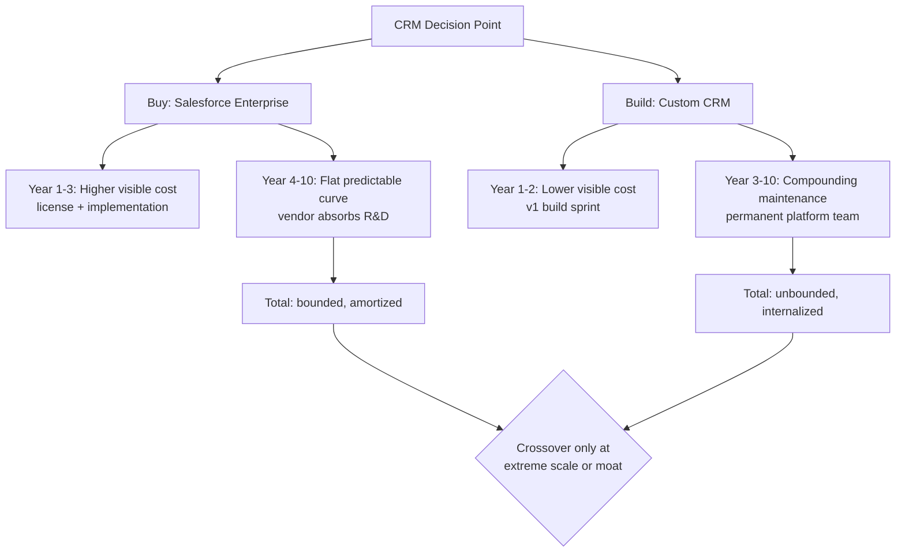
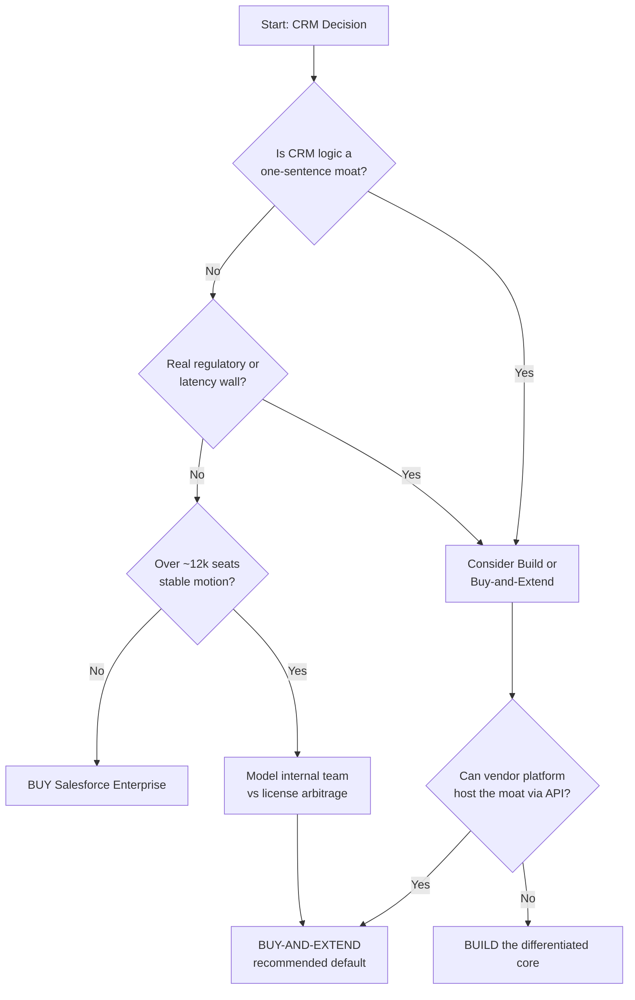

### Direct Answer

For a company between roughly 100 and 5,000 employees with a standard B2B revenue motion, **buying Salesforce Enterprise is almost always cheaper over a 7-to-10-year horizon than building a custom CRM**, once you load fully-burdened engineering cost, opportunity cost, security and compliance overhead, and key-person risk into the model. The headline subscription fee — $165 per user per month for Enterprise list price — is the visible 30 to 40 percent of true total cost of ownership (TCO); the buried 60 to 70 percent (admin, integration, training, change management) exists in *both* options, but a custom build adds an uncapped, compounding maintenance liability that a vendor amortizes across tens of thousands of customers. Build only when CRM logic is a genuine, defensible competitive moat, when your data residency or latency constraints make SaaS structurally impossible, or when you are large enough (15,000+ seats) that platform fees cross the threshold where a dedicated internal product team is cheaper than license arbitrage.

> **TLDR**
> - **The real delta is not license vs. salaries.** It is a *bounded, externalized* cost curve (buy) versus an *unbounded, internalized* one (build). Vendors amortize R&D across their entire customer base; you cannot.
> - **10-year TCO for ~500 seats:** Salesforce Enterprise lands near $14M–$22M fully loaded. A genuinely competitive custom build lands near $28M–$52M once you include the 3–6 FTE permanent platform team that never goes away.
> - **The "we'll build it cheaper" estimate is wrong by 3–8x** in nearly every case study, because teams price the v1 sprint, not the 10-year operating company a CRM actually is.
> - **Buy-and-extend is the dominant strategy.** Buy the platform of record; build thin, differentiated surfaces (pricing engines, proprietary scoring) on top via API. This captures moat value without owning the commodity core.
> - **Build wins in three narrow cases:** true product moat, hard regulatory/latency walls, or extreme scale where seat fees exceed an internal team's cost.
> - **The most expensive mistake is reversibility:** a failed custom CRM costs 2–4 years of GTM velocity. A wrong SaaS choice costs a migration project.

---

## I. Framing The Question Correctly

### 1. Why "cost delta" is the wrong first question

Most build-vs-buy debates die because they are framed as a price comparison: "Salesforce costs $X per seat per year, our engineers cost $Y, so if X times seats is bigger than Y we should build." This framing is not merely imprecise — it is structurally misleading, because it compares a *fully operational, supported, road-mapped product* against a *cost line item*. The honest comparison is between two operating companies: one you rent, and one you become.

When you buy Salesforce Enterprise you are not buying software. You are buying the amortized output of roughly 15,000+ R&D engineers, a 99.9 percent uptime SLA, SOC 2 / ISO 27001 / FedRAMP attestations, a partner ecosystem of hundreds of thousands of certified consultants, three major releases a year, and a 25-year-deep backlog of edge cases already solved. When you build, you are committing to *reproduce a meaningful fraction of that* and then sustain it forever. The cost delta question only becomes answerable once both sides are modeled as ongoing concerns rather than purchases.

The correct first question is therefore: **"Is CRM functionality a source of durable competitive advantage for us, or is it commodity infrastructure?"** Cost follows strategy; it does not lead it. If CRM is commodity infrastructure — and for 90 percent plus of companies it is — then the entire exercise reduces to procurement, and you should buy. If CRM logic is a genuine moat, then cost is a secondary consideration and you may rationally build even at a premium. The teams that lose money are the ones that treat a commodity as a moat.

### 2. The two cost curves, visualized

The fundamental shape of the decision is a divergence between a **bounded externalized curve** and an **unbounded internalized curve**.

The visible cost of buying is front-loaded and then flattens. The visible cost of building is low at first and then rises and never stops, because a CRM is not a project — it is an operating company you have agreed to run inside your operating company. Most build estimates capture the descending-left portion of the build curve (the cheap v1) and never the ascending-right portion (the decade of operation).

### 3. What "the real long-term cost delta" actually contains

When a CFO or RevOps leader asks for "the real long-term cost delta," they almost always mean the *defensible, board-ready number*, not the sticker comparison. That number has six components on each side, and the asymmetry between the two sides is the entire answer:

| TCO Component | Buy (Salesforce Enterprise) | Build (Custom CRM) | Asymmetry |
|---|---|---|---|
| **Core platform R&D** | Amortized in license; ~$165/user/mo list | Fully internalized; 3–6 FTE forever | Massive — vendor spreads across 150k+ customers |
| **Implementation** | $1–$3 per $1 of year-1 license | One-time but typically 2–3x estimate | Build estimate error is larger |
| **Ongoing admin** | 1 admin per 30–100 users | Same, plus app maintenance | Roughly equal |
| **Integration** | Pre-built connectors + MuleSoft | Every integration hand-built | Buy wins; ecosystem leverage |
| **Security & compliance** | Inherited attestations | You own every audit | Buy wins decisively |
| **Innovation / roadmap** | 3 releases/yr included | You fund every feature | Buy wins; this is the silent killer |

The rest of this answer prices each of these and then assembles a defensible 10-year model.

### 4. The amortization principle in detail

The single concept that resolves the entire debate is **amortization of fixed costs across a customer base.** It is worth stating precisely, because once it is understood, most of the build case collapses on its own.

Software has an unusual cost structure. The marginal cost of serving one more customer is near zero, but the fixed cost of *building and maintaining* the software is enormous and recurring. A vendor like Salesforce spends on the order of several billion dollars per year on research and development. That spend produces the platform — every customer of the platform receives the benefit of the full spend, and every customer pays only a fraction of it. With more than 150,000 customers, each customer's *share* of the R&D burden is minuscule relative to the total. This is the economic engine of SaaS, and it is the reason a license fee is not "markup" — it is your fractional contribution to a shared, continuously-funded engineering effort that no single buyer could afford alone.

When you build a custom CRM, you become a software vendor with exactly one customer: yourself. You bear 100 percent of the fixed cost — the build, the maintenance, the security, the roadmap — and you amortize it across a customer base of one. The R&D you fund benefits only you. There is no spreading, no sharing, no leverage. This is why the build curve is structurally unbounded: you have voluntarily entered the most expensive possible position in the software-economics landscape, the single-customer vendor, and you are competing on capability against a vendor amortizing the identical fight across six orders of magnitude more customers.

The amortization principle has a precise corollary that defines the *only* legitimate exit from buying. Building becomes economically rational only when one of two things is true. Either (a) the software produces value that is *unique to you* — a moat — so that the absence of amortization is irrelevant because no vendor could sell you the differentiated capability anyway; or (b) you have grown large enough that your own internal "customer base" (tens of thousands of seats) is big enough to make in-house amortization competitive with the license you would otherwise pay. Outside those two conditions, buying always wins on cost, because the math of amortization is not a preference — it is arithmetic.

### 5. A glossary of the terms that matter

Because build-vs-buy debates frequently founder on imprecise language, it is worth fixing definitions before pricing anything:

| Term | Precise Meaning In This Analysis |
|---|---|
| **TCO** | Total Cost of Ownership — every cost, visible and buried, over the full horizon, including people, infrastructure, opportunity cost, and risk-adjusted contingency |
| **Fully-loaded headcount** | Salary multiplied by 1.4–1.6x to capture benefits, equity, payroll tax, management overhead, equipment, and facilities |
| **Opportunity cost** | The value of the product features *not* shipped because engineers were assigned to internal CRM work instead |
| **System of record** | The single authoritative store for an entity (accounts, contacts, opportunities) that all other systems defer to |
| **Buy-and-extend** | Buying the commodity platform of record and building only the thin, proprietary, differentiating surface on top of it via API |
| **Software entropy** | The continuous decay of software as dependencies break, threats evolve, and expectations rise — the force that makes maintenance permanent |
| **Crossover seat count** | The user count at which buy-side license cost exceeds the cost of a dedicated internal product team |

With language fixed, the rest of this answer prices each component rigorously.

---

## II. The True Cost Of Buying Salesforce Enterprise

### 1. Decomposing the license

Salesforce Enterprise Edition lists at **$165 per user per month, billed annually** — roughly $1,980 per user per year before any negotiation. That is the number everyone quotes, and it is the number that is least relevant to TCO, because:

- **Nobody pays list.** Enterprise discounts of 15 to 40 percent are routine at 100+ seats; 3-year prepay and competitive pressure (Microsoft Dynamics 365, HubSpot) push deeper. A realistic blended rate for a 500-seat company after negotiation is $110–$135 per user per month.
- **Add-ons multiply the base.** A bare Enterprise license is rarely sufficient. Sales Engagement, CPQ (Configure-Price-Quote), Sandbox tiers, additional API call capacity, Data Cloud, Einstein/Agentforce credits, and Service Cloud each carry their own per-user or consumption fee. A realistically equipped Enterprise seat lands at $200–$320 per user per month all-in.
- **Storage and consumption creep.** Data storage, file storage, and increasingly AI-credit consumption are metered. As your install ages and accumulates records, this line grows quietly.

For a 500-seat company, a defensible blended fully-equipped figure is **$2,400–$3,800 per user per year**, or roughly **$1.2M–$1.9M annually** in pure subscription.

### 2. Implementation: the 1:1 to 1:3 rule

Industry experience across thousands of Salesforce rollouts produces a durable heuristic: **for every $1 of first-year license, expect $1 to $3 of implementation cost.** This covers solution design, configuration, data migration from the legacy system, custom development of objects and flows, integration wiring, testing, and user training.

Where you land in that 1:1–1:3 band depends on:

- **Process complexity.** A clean, single-motion SaaS company lands near 1:1. A multi-entity, multi-currency, channel-plus-direct enterprise with heavy CPQ lands near 1:3 or beyond.
- **Data quality at the source.** Dirty legacy data is the single largest implementation cost overrun. Deduplication and normalization routinely consume 20 to 30 percent of an implementation budget.
- **Internal vs. SI delivery.** A Systems Integrator (Accenture, Deloitte Digital, Slalom, or a boutique) charges $150–$300 per hour. A capable internal admin team is cheaper per hour but slower and carries opportunity cost.

For our 500-seat reference company at ~$1.5M year-one license, implementation realistically costs **$1.5M–$3.5M one-time**, spread over 6 to 14 months.

### 3. The ongoing operating layer

After go-live, Salesforce still costs money to *run*, and this is where buy-side TCO is routinely underestimated:

| Ongoing Buy-Side Cost | Typical Sizing (500 seats) | Annual Estimate |
|---|---|---|
| **Salesforce admins** | 1 admin per 30–100 users; ~3–5 FTE | $450K–$900K |
| **Declarative developers** | Flows, Apex light, LWC; 1–3 FTE | $200K–$600K |
| **Premier Success Plan** | ~30% uplift on license (optional) | $360K–$570K |
| **Managed services / SI retainer** | Periodic enhancement work | $150K–$400K |
| **Add-on creep** | New seats, new clouds, AI credits | $100K–$300K |
| **Training & enablement** | Onboarding, certs, change mgmt | $80K–$200K |

The crucial point: **a Salesforce admin team is not optional, and it does not disappear in the build scenario.** Whether you buy or build, you need people who own the system, configure it, train users, and manage change. This admin layer is roughly cost-neutral between the two options, which means it should arguably be excluded from the *delta* — but it must be included in any absolute TCO figure presented to a board.

### 4. The buy-side 10-year model

Assembling the components for a 500-seat company over 10 years (light inflation assumed, seat growth to ~650 by year 10):

| Buy Component | 10-Year Total (Low) | 10-Year Total (High) |
|---|---|---|
| Subscription (license + add-ons) | $13.0M | $19.5M |
| Implementation (one-time) | $1.5M | $3.5M |
| Premier Success / support | $0 (opt out) | $5.0M |
| Periodic re-implementation / major projects | $1.0M | $3.0M |
| **Buy subtotal (excl. shared admin)** | **$15.5M** | **$31.0M** |

Excluding the shared admin layer (because it appears on both sides), a realistic mid-case buy figure for this profile is **$14M–$22M over 10 years**. The number is *bounded*: you can forecast it within a reasonable band because the vendor controls the cost curve and prices are contractually visible.

### 5. The buy-side risks that are real and must be priced

Buying is not free of risk, and an honest analysis names the buy-side risks rather than pretending the vendor relationship is frictionless. There are four that genuinely matter:

- **Price escalation at renewal.** Salesforce, like every enterprise SaaS vendor, holds renewal leverage once a customer is deeply embedded. Renewal uplifts of 7 to 15 percent are common, and customers who failed to negotiate price-protection caps in the original contract can face steeper increases. The mitigation is contractual: negotiate multi-year price caps, ramp schedules, and renewal-uplift ceilings *before* the first signature, when your leverage is highest.
- **Add-on and consumption creep.** The base Enterprise license is a foothold; revenue expansion through CPQ, Data Cloud, Agentforce/Einstein credits, additional sandboxes, and API capacity is the vendor's deliberate growth motion. A bought platform's cost can drift upward 5 to 10 percent per year through add-on creep alone if it is not governed. The mitigation is a quarterly license-utilization review and a procurement gate on new add-ons.
- **Vendor lock-in.** Deep customization, accumulated data, and embedded integrations raise switching costs over time. This is real, but it is *bounded* lock-in: a migration to another platform is a costed, time-boxed project with a well-trodden path and a large pool of consultants who do it for a living. Compare that to the build scenario, where the "lock-in" is into a system only your departing engineers fully understood.
- **Roadmap misalignment.** The vendor's roadmap serves its whole customer base, not you specifically. A capability you urgently need may sit low on Salesforce's priority list. The mitigation is the buy-and-extend pattern — build the urgent, differentiated piece yourself on the platform rather than waiting on the vendor.

The crucial framing: every one of these buy-side risks is *bounded and mitigable through contract and governance*. None of them is unbounded. That is the structural distinction from the build side, where the dominant risk — an unbounded, compounding maintenance and entropy liability — cannot be contracted away because there is no counterparty. You are the counterparty.

### 6. Why the buy number is forecastable

A board can sign off on the buy number with reasonable confidence because three things make it predictable. First, the dominant cost — subscription — is contractual and visible; you know the per-seat rate and the renewal terms. Second, the implementation cost, while it carries an estimation band, follows a well-characterized 1:1 to 1:3 ratio drawn from thousands of comparable rollouts, so the *range* is known even when the point is not. Third, the operating layer (admins, support) scales with seat count along documented industry ratios. The result is a TCO that can be stated as a band — $14M to $22M for the reference company — with genuine confidence that reality will land inside it. The build number, as the next section shows, has no such property.

---

## III. The True Cost Of Building A Custom CRM

### 1. Why the build estimate is always wrong

The single most reliable finding in build-vs-buy analysis is that **internal build estimates underestimate true cost by a factor of 3 to 8.** This is not because engineers are dishonest; it is structural, and the structure has named causes:

- **The planning fallacy.** Estimates are built from the imagined happy path and systematically exclude integration friction, rework, and edge cases. This is a documented cognitive bias, not a team failing.
- **Scope is invisible at estimation time.** A CRM looks like "accounts, contacts, opportunities, a pipeline view." It is actually territory management, forecasting hierarchies, role-based sharing rules, audit trails, deduplication, mobile, offline sync, reporting engines, bulk data tools, sandbox environments, and an API surface — each of which Salesforce has spent two decades hardening.
- **The v1 fallacy.** Teams price the first shippable version and mentally file the rest as "iteration." But a CRM's cost is dominated by the *decade after v1*, not the build sprint.
- **Opportunity cost is omitted.** Every engineer building internal CRM plumbing is an engineer not building the actual product. For a software company, this is the most expensive line and it never appears in the spreadsheet.

### 2. The v1 build cost

A genuinely usable custom CRM — not a toy, but something a 500-person revenue org can run on — is a substantial software product. Realistic v1 scope and cost:

| Build Phase | Scope | Duration | Cost (Fully Loaded) |
|---|---|---|---|
| **Discovery & architecture** | Data model, infra, security design | 2–4 months | $300K–$600K |
| **Core CRM engine** | Accounts, contacts, opps, activities, pipeline | 6–12 months | $1.5M–$3.5M |
| **Reporting & dashboards** | Query layer, viz, scheduled reports | 3–6 months | $600K–$1.4M |
| **Integrations** | Email, calendar, marketing, billing, data | 4–8 months | $800K–$2.0M |
| **Admin tooling & permissions** | Roles, sharing, config UI, audit | 3–6 months | $500K–$1.2M |
| **Mobile & offline** | iOS/Android or responsive PWA | 3–6 months | $400K–$1.0M |
| **QA, security, hardening** | Pen test, SOC 2 prep, load testing | ongoing | $400K–$900K |
| **v1 total** | | **18–30 months** | **$4.5M–$10.6M** |

Note that this is *only v1*, it takes 18 to 30 months during which your GTM team is running on the legacy system, and the high end is conservative — a fully featured CRM build can run far higher. Already, the v1 build alone consumes a third to half of the *entire 10-year buy budget*, and you have not run it for a single day.

### 3. The permanent platform team — the cost nobody models

Here is the line that decides almost every honest analysis: **a custom CRM requires a dedicated, permanent platform team that never goes away.** Software does not stand still. Once built, it requires:

- **Maintenance:** dependency upgrades, security patches, browser/OS compatibility, infrastructure scaling.
- **Operations:** uptime, on-call, incident response, backups, disaster recovery.
- **Roadmap:** the business *will* ask for new features — and unlike Salesforce, where new capability arrives three times a year for free, every feature on a custom CRM is funded by you.
- **Compliance:** SOC 2, GDPR, CCPA, and industry attestations are recurring annual obligations, not one-time events.

A realistic steady-state team for a custom CRM serving 500+ users:

| Role | Headcount | Fully-Loaded Cost Each | Annual |
|---|---|---|---|
| **Backend / platform engineers** | 2–3 | $220K | $440K–$660K |
| **Frontend engineer** | 1 | $200K | $200K |
| **DevOps / SRE** | 0.5–1 | $230K | $115K–$230K |
| **Product manager** | 0.5–1 | $230K | $115K–$230K |
| **QA engineer** | 0.5–1 | $170K | $85K–$170K |
| **Platform team total** | **4.5–7 FTE** | | **$1.05M–$1.49M/yr** |

Over a 10-year horizon, this permanent team alone costs **$10.5M–$15M+** — and that is *before* infrastructure, before the v1 build, and before any of the catastrophe scenarios. Critically, this team can never be fully disbanded without the CRM rotting; it is a structural, permanent fixed cost.

### 4. Infrastructure and the build-side 10-year model

A custom CRM also carries direct hosting cost: cloud compute, managed databases, search infrastructure, object storage, CDN, monitoring, and logging. For a 500-user transactional system this realistically runs $150K–$500K per year and grows with data volume.

Assembling the full build-side model over 10 years:

| Build Component | 10-Year Total (Low) | 10-Year Total (High) |
|---|---|---|
| v1 build (one-time) | $4.5M | $10.6M |
| Permanent platform team (4.5–7 FTE) | $10.5M | $15.0M |
| Infrastructure / hosting | $1.5M | $5.0M |
| Major version 2 / re-platform | $3.0M | $8.0M |
| Security / compliance / audit | $1.0M | $3.0M |
| Contingency for overrun (the 3–8x reality) | $7.0M | $10.0M |
| **Build subtotal (excl. shared admin)** | **$27.5M** | **$51.6M** |

The honest build figure for our 500-seat reference company is **$28M–$52M over 10 years** — and unlike the buy number, it is *unbounded*: the high end can go further, because you control none of the forces that make software expensive.

### 5. The opportunity cost that dwarfs everything else

For a software company, there is a build-side cost that does not appear in any of the tables above and is frequently the largest number in the entire analysis: **opportunity cost.** Every engineer assigned to building and maintaining an internal CRM is an engineer not building the company's actual product — the thing customers pay for, the thing that drives revenue and valuation.

Consider the reference company's permanent platform team of 4.5 to 7 engineers. Those are not generic costs; they are senior product engineers who could otherwise be shipping revenue-generating features. If each engineer, deployed on the core product, would contribute even a conservative multiple of their fully-loaded cost in enterprise value — a reasonable assumption for a growth-stage software company, where engineering capacity is the binding constraint on the roadmap — then the *true* economic cost of the platform team is not its $1.05M–$1.49M salary line. It is that figure plus the foregone product value, which can easily double or triple the effective cost.

This is why building a custom CRM is most dangerous precisely for the companies most tempted to do it: software companies, who reason "we have great engineers, they could just build this." They could. But the question is never "can our engineers build a CRM" — they almost certainly can. The question is "is internal CRM plumbing the highest-value use of the scarcest resource in the company." For a software business it essentially never is, and the opportunity-cost line on the model should make that visible in dollars.

For a non-software company — a manufacturer, a distributor, a services firm — the opportunity-cost argument is weaker, because engineering capacity is not the core revenue engine. But such companies are also the *least* likely to have the deep product-engineering bench, the SRE discipline, and the security maturity needed to run a custom CRM well. The opportunity cost is lower, but the execution risk is higher. There is no profile for which the build comes free.

### 6. The catastrophe scenarios

Beyond the modeled steady state, the build side carries tail risks — low-probability, high-severity events — that the buy side has largely externalized to the vendor:

- **The security breach.** A custom CRM holds the company's entire customer and pipeline dataset. If the internal team's security practices lag — and a small platform team is structurally more likely to lag than a vendor with a dedicated security organization — a breach is possible. The cost of a serious breach (regulatory penalty, notification, remediation, litigation, reputational damage) routinely runs into the millions and can be existential. Salesforce, by contrast, carries a dedicated security organization, a bug-bounty program, and a stack of third-party attestations as part of the subscription.
- **The key-person departure.** A custom CRM built by a small team accumulates undocumented institutional knowledge in a few heads. When a lead architect leaves, velocity collapses and risk spikes until the knowledge is rebuilt. A bought platform has no equivalent single point of failure.
- **The compliance miss.** As the company expands into new geographies or sells into regulated industries, new compliance obligations appear. A bought platform usually already holds the relevant attestations. A custom build must achieve each one on its own timeline and budget — and a compliance gap can block a market entirely.
- **The failed re-platform.** Around year 5 to 7, the v1 architecture typically shows its age and a "version 2" re-platform is proposed. Re-platforms are themselves high-risk projects with their own overrun profile; a failed re-platform can leave the company stranded on aging software with no clean path forward.

None of these tail risks is certain. But a rigorous model assigns them a probability-weighted expected cost, and when that is done, the build-side figure rises further. The buy side has effectively purchased insurance against most of these scenarios as part of the subscription — that, too, is part of what the license fee buys.

---

## IV. The Head-To-Head Delta

### 1. The reference comparison

| Metric | Buy: Salesforce Enterprise | Build: Custom CRM | Delta |
|---|---|---|---|
| **10-year TCO (mid-case)** | $14M–$22M | $28M–$52M | Build costs ~2–2.5x more |
| **Time to value** | 6–14 months | 18–30 months (v1) | Build is ~2x slower |
| **Cost predictability** | High (contractual) | Low (unbounded) | Buy is forecastable |
| **Innovation velocity** | 3 releases/yr free | Self-funded | Buy compounds for free |
| **Key-person risk** | Low (vendor-owned) | High (your team) | Build concentrates risk |
| **Ecosystem leverage** | Huge (AppExchange, SIs) | None | Buy wins decisively |
| **Exit / reversibility** | Migration project | 2–4 yr GTM loss if it fails | Buy is reversible |

### 2. The asymmetry that drives the delta

The delta is not really about dollars per seat. It is about **who absorbs the cost of software entropy.** Software decays: dependencies break, threats evolve, expectations rise. Someone must pay to fight that entropy continuously.

When you buy, the vendor fights entropy and spreads the cost across its entire customer base — for Salesforce (CRM), under CEO Marc Benioff, that is over 150,000 customers. Your share of their multi-billion-dollar annual R&D spend is a rounding error embedded in your license. When you build, you fight entropy alone, and you pay 100 percent of the cost with zero amortization. That is the structural reason the build curve is unbounded: you have signed up to be a single-customer software vendor competing against a vendor with 150,000 customers funding the same fight.

It is worth grounding this in named operators, because the build-vs-buy instinct often comes from admiration of companies that *did* build. The honest read of the public record is that even the most engineering-rich firms overwhelmingly buy their CRM and reserve building for genuine product moats. Snowflake (SNOW), under former CEO Frank Slootman, ran a famously disciplined go-to-market machine — and ran it on a bought CRM, not a homegrown one, because Snowflake's moat was its data-warehouse architecture, not its pipeline tooling. ServiceNow (NOW), led by Bill McDermott — himself a former Salesforce-era SAP CEO — sells a platform on which others build, yet still treats commercial CRM as commodity infrastructure for its own revenue org. HubSpot (HUBS), co-founded by Brian Halligan and Dharmesh Shah, is itself a CRM *vendor* precisely because building and amortizing CRM across many customers is a business; doing it for one customer is a cost. Microsoft (MSFT), under Satya Nadella, sells Dynamics 365 as a CRM and has the engineering depth to build anything — and still productizes rather than internalizes. Adobe (ADBE), under Shantanu Narayen, anchors its revenue motion on platform tooling rather than a bespoke internal CRM. The pattern across these named, public operators is unambiguous: build where you have a moat, buy where you do not, and CRM is a moat for almost none of them.

### 3. Where the naive analysis goes wrong

| Naive Claim | Why It's Wrong |
|---|---|
| "License fees are pure markup; we'd skip them by building" | The "markup" funds R&D, security, uptime, and roadmap you must now self-fund |
| "Our engineers are cheaper than $165/seat" | True for v1, false over 10 years once the permanent team is priced |
| "We'll build exactly what we need, no bloat" | You will also rebuild the unglamorous 80% Salesforce already solved |
| "We'll own our data and our destiny" | You also own every outage, breach, and compliance audit |
| "It's a one-time cost" | A CRM is an operating company, not a project — there is no "one-time" |

---

## V. The Counter-Case: When Building Is The Right Call

The honest analyst must steelman the build. There are three genuine scenarios — and a fourth hybrid — where building is defensible or correct. If you do not fall into one of these, buy.

### 1. CRM logic is a true competitive moat

If the *way you model customer relationships* is itself a product differentiator — not "we have a CRM" but "our CRM logic is something competitors structurally cannot replicate" — then building can be correct at almost any cost. Examples: a marketplace whose matching engine *is* the relationship model; a quant trading firm whose counterparty system encodes proprietary risk logic; a vertical SaaS company whose CRM and core product are inseparable. Here the question stops being TCO and becomes R&D investment in the moat. The test is brutal: if you cannot articulate the moat in one sentence to a skeptical board, you do not have one.

### 2. Hard regulatory, residency, or latency walls

Some organizations face structural barriers that make commercial SaaS impossible, not merely inconvenient: classified defense and intelligence work requiring air-gapped systems; jurisdictions with data-residency law no vendor region satisfies; sub-millisecond latency requirements no multi-tenant cloud can meet; sovereignty mandates barring foreign-owned providers. These are real and they are rare. Note that Salesforce's Government Cloud, Hyperforce regional infrastructure, and FedRAMP authorizations dissolve many of the cases people *assume* require a build — verify the wall is real before building a fortress against it.

### 3. Extreme scale changes the math

At very large seat counts the arithmetic genuinely flips. At 20,000 seats, Salesforce Enterprise even at a deeply discounted $100 per user per month is $24M per year — $240M over a decade. Against that, a dedicated internal product team of 20–30 engineers (roughly $6M–$9M per year fully loaded) is *cheaper*, and the amortization argument inverts: you now have enough internal scale to spread R&D across your own large user base. This is precisely why some of the largest technology companies run substantial internal CRM-like systems. The crossover is highly profile-dependent but typically lives somewhere north of 10,000–15,000 seats.

### 4. The dominant hybrid: buy-and-extend

For most companies that *feel* a pull toward building, the correct answer is neither pure build nor pure buy — it is **buy the platform of record, build the differentiated surface on top.** Keep Salesforce as the system of record for accounts, contacts, opportunities, and compliance. Build only the thin, genuinely proprietary layer — a pricing engine, a custom propensity model, an industry-specific quoting flow — as services that integrate via API. This captures moat value while letting the vendor carry the commodity 80 percent. Salesforce's platform (Apex, Lightning Web Components, Heroku, external services) is explicitly designed for this. Buy-and-extend is the right answer far more often than pure build.

### 5. Counter-case summary

| Build Is Defensible When... | Build Is A Mistake When... |
|---|---|
| CRM logic is a one-sentence-articulable moat | "We want control" is the main reason |
| A real, verified regulatory/latency wall exists | You assumed a wall without checking Gov Cloud |
| You exceed ~10–15k seats with a stable motion | You are under 5k seats |
| You have a permanent product team appetite | You think it's a one-time project |
| You will fund the moat as R&D, not cost-cut | You are building to "save on license fees" |

---

## VI. How To Run The Decision In Practice

### 1. The decision sequence

### 2. Building the board-ready model

A defensible board model has these properties:

- **10-year horizon, not 3.** A 3-year window flatters the build because it captures cheap v1 and hides the operating decade. Boards should insist on 10.
- **Fully-loaded headcount.** Use 1.4–1.6x salary as the loaded multiplier (benefits, equity, payroll tax, overhead, management). A "$180K engineer" costs $250K–$290K.
- **Explicit opportunity cost line.** For a software company, name the product features *not* shipped because engineers built CRM plumbing. This is often the single largest number.
- **Contingency on the build side only.** Because build estimates run 3–8x light, apply a contingency reserve of at least 50–100 percent to the build figure. The buy figure needs far less because it is contractually bounded.
- **Sensitivity analysis.** Show the decision at 250, 500, 1,000, and 5,000 seats. The crossover seat count is the genuinely interesting output.

### 3. The negotiation lever buying gives you

A frequently missed point: simply *running a credible build analysis* is itself a procurement lever. Salesforce account teams discount materially harder when a customer can show a real, costed internal-build alternative or a live Microsoft Dynamics 365 / HubSpot evaluation. The build analysis, even when its conclusion is "buy," routinely pays for itself in license savings of 10–25 percent. Always run competitive evaluations in parallel; never negotiate single-threaded.

Three further negotiation disciplines materially improve the buy outcome. First, **time the deal to the vendor's quarter and fiscal-year end**, when account teams face quota pressure and discount authority is most flexible — the same seat count signed in the last week of a vendor's fiscal year frequently lands 5 to 15 percent cheaper than mid-quarter. Second, **negotiate the renewal before you sign the initial deal**, locking price-protection caps, uplift ceilings, and ramp schedules into the original contract while your leverage is at its peak; renewal leverage shifts decisively to the vendor once you are embedded. Third, **separate the platform decision from the add-on decision** — commit to the core platform but keep CPQ, Data Cloud, and AI-credit purchases as later, individually-justified decisions rather than bundling everything into one signature, which preserves both budget control and future negotiating leverage. A disciplined buyer treats procurement as a multi-year program, not a one-time purchase event.

### 4. Vendor comparison within the buy lane

If the decision is "buy," the sub-question is *which* platform. The build-vs-buy framing applies, but so does buy-vs-buy:

| Platform | Best Fit | TCO Posture | Watch-Outs |
|---|---|---|---|
| **Salesforce Enterprise** | Complex enterprise, deep ecosystem need | Highest sticker, highest extensibility | Add-on creep; admin-heavy |
| **HubSpot** | SMB to mid-market, marketing-led motion | Lower entry, simpler admin | Ceiling on complex CPQ/territory logic |
| **Microsoft Dynamics 365** | Microsoft-stack shops, ERP adjacency | Competitive; bundles with M365 | Implementation complexity rivals Salesforce |
| **Custom build** | Moat / regulatory / extreme scale only | Lowest predictability, highest ceiling | Permanent team; unbounded curve |

### 5. The accounting and cash-flow treatment

Beyond raw TCO, CFOs care how each option appears on the financial statements, and the two paths look very different — a fact that sometimes (wrongly) sways the decision.

- **Buy is operating expense.** Salesforce subscription is a clean, predictable operating expense. It hits the income statement smoothly, it is easy to forecast, and it carries no capitalization complexity. Cash outflow is steady and contractually known.
- **Build is a mix.** A custom build's development cost may, under applicable accounting standards, be partially capitalized as an internal-use software asset and then amortized over its useful life, while maintenance and operating costs are expensed. This can make the build look artificially attractive in early years — capitalized development depresses near-term expense — and the *cash* picture is lumpy: large outflows during the build, then ongoing team cost.
- **The trap.** A build can be made to *look* cheaper than buying in years one and two purely through capitalization accounting, even when its true 10-year cash cost is two to three times higher. A disciplined analysis ignores the accounting optics and compares total cash outflow over the full horizon, discounted appropriately. The board should be shown the cash view, not just the P&L view, precisely because the P&L view flatters the build.
- **The valuation angle.** For a venture- or PE-backed company, investors increasingly scrutinize software-development capitalization and discount it in quality-of-earnings analysis. A large internal-CRM capitalization line can actually *reduce* perceived earnings quality at diligence. The buy path, being clean opex, carries no such penalty.

The honest framing for the CFO: do not let the accounting treatment drive the decision. The accounting can make the worse economic choice look better in the short term. Compare full-horizon cash, risk-adjusted, and decide on that.

### 6. Migration and reversibility

The reversibility asymmetry deserves explicit weight. If a Salesforce implementation underperforms, the remedy is a migration project — painful, costed in months, but bounded and well-trodden. If a custom CRM fails, the remedy is rebuilding GTM tooling from scratch while your revenue org runs on a broken system; the realistic cost is two to four years of suppressed sales velocity, which for a growth-stage company can exceed the entire build budget. Decisions should be weighted by the cost of being wrong, and here the asymmetry strongly favors buy.

### 7. Staging the decision to reduce risk

A frequently overlooked option is that the build-vs-buy decision does not have to be made all at once. It can be *staged*, which sharply reduces the cost of being wrong:

- **Stage 1 — Buy and stabilize.** Implement Salesforce Enterprise as the system of record. This is non-negotiable in nearly every case: you need a working, compliant, supported revenue platform now, not in 30 months. Buying first means the revenue org is never stranded.
- **Stage 2 — Instrument the pain.** Once live, measure precisely where the bought platform genuinely constrains the business. Most assumed constraints evaporate on contact with a properly configured platform; the few that survive are the real candidates for custom work.
- **Stage 3 — Extend selectively.** For each surviving constraint, build a thin custom service on the platform — a pricing engine, a scoring model, an industry-specific workflow. Each is a small, bounded, individually-justified project, not a bet-the-company build.
- **Stage 4 — Re-evaluate at scale milestones.** Only if the company crosses the extreme-scale threshold, or only if the accumulated custom surface starts to genuinely *be* the product, does a pure-build conversation reopen — and by then it is an informed decision backed by real operating data, not a speculative one.

Staging converts a single high-stakes, irreversible decision into a sequence of small, reversible ones. It is the risk-management discipline that the all-at-once "let's build our own CRM" framing destroys. Almost every company that believes it needs to build should, in practice, run this staged path — and most discover at Stage 2 or 3 that the bought platform plus a handful of thin extensions is entirely sufficient.

### 8. The role of AI in the 2026 calculation

A current and material consideration: the rise of AI-assisted development and AI features inside CRM platforms changes some of the inputs, though not the conclusion. On the build side, AI coding assistants genuinely accelerate engineering — a custom CRM can be built somewhat faster and somewhat cheaper than it could have been a few years ago. But this acceleration is symmetric and incomplete. It speeds the *coding* of v1; it does not eliminate the permanent platform team, the operating burden, the security obligation, the compliance work, or the opportunity cost — those are the dominant costs, and they are largely AI-resistant. Meanwhile, on the buy side, Salesforce ships AI capability (Einstein, Agentforce, Data Cloud intelligence) into the platform continuously, funded by the same amortization engine. A builder must now also fund the AI roadmap themselves to stay competitive. On net, AI lowers both curves modestly and preserves the gap. It does not flip the decision; it does not make "build your own CRM" the new default. Treat any vendor or internal pitch claiming otherwise with skepticism.

---

## VII. Worked Scenarios

### 1. Scenario A — 120-person Series B SaaS company

A 120-employee SaaS company with ~50 CRM seats and a single-product, single-motion GTM. Buy is unambiguous. Salesforce Enterprise (or even Professional) or HubSpot lands at $150K–$400K per year all-in; a custom build would consume the better part of the company's entire engineering org. **Verdict: Buy.** A build here is close to malpractice — the opportunity cost alone (CRM plumbing instead of product) would threaten the company's survival.

### 2. Scenario B — 500-person mid-market company (our reference)

The reference case modeled above: $14M–$22M to buy versus $28M–$52M to build over 10 years. **Verdict: Buy, with selective buy-and-extend.** Buy Salesforce as system of record; if there is one genuinely proprietary process (say, a usage-based pricing engine), build that one service on the platform. The pure-build path costs roughly 2–2.5x more, ships 2x slower, and concentrates key-person risk for no strategic return.

### 3. Scenario C — 18,000-seat global enterprise

At 18,000 seats, even deeply discounted Salesforce runs $20M+ per year. A dedicated internal CRM product team of 25 engineers costs $7M–$9M per year. The amortization argument inverts because internal scale is now large. **Verdict: Genuinely contested — model it seriously.** Many enterprises at this scale still buy (for ecosystem, compliance, and risk reasons), but here the build case is intellectually honest rather than a vanity project. This is the rare zone where the spreadsheet, not the moat, can justify a build.

### 4. Scenario D — defense contractor, air-gapped requirement

A defense contractor with classified workloads requiring air-gapped operation. The wall is real — but first verify whether Salesforce Government Cloud / GovCloud-authorized configurations satisfy the requirement, as they often do for non-classified-but-controlled data. If a genuine air-gap is mandated, **Verdict: Build (or deploy a self-hostable alternative).** Cost is no longer the deciding variable; the regulatory wall is.

### 5. Scenario E — 800-person fintech with a proprietary underwriting model

An 800-person lending fintech whose competitive edge is a proprietary risk-and-underwriting model that must sit close to customer-relationship data. This is the textbook buy-and-extend case. The CRM core — accounts, contacts, opportunities, servicing history, compliance trails — is commodity, and rebuilding it would be wasted effort. The underwriting model, however, is the moat and must be owned. **Verdict: Buy Salesforce as the system of record; build the underwriting and risk-scoring service as a custom application integrated via API.** The company captures full moat value on the differentiated 15 percent while letting the vendor carry the commodity 85 percent. A pure build here would have meant reconstructing the commodity core at great cost for zero strategic gain; a pure buy would have meant either exposing the proprietary model inside vendor-standard scoring tools or not having it at all. Buy-and-extend is the only answer that is both cost-disciplined and moat-preserving.

### 6. Scenario cross-reference table

| Scenario | Seats | Decision | Primary Driver |
|---|---|---|---|
| Series B SaaS | ~50 | Buy | Opportunity cost; scale too small |
| Mid-market reference | ~500 | Buy + selective extend | 2–2.5x cost delta favors buy |
| Global enterprise | ~18,000 | Contested — model it | Amortization inverts at scale |
| Fintech w/ underwriting moat | ~800 | Buy + extend the moat | Commodity core, proprietary edge |
| Defense / air-gapped | varies | Build / self-host | Regulatory wall, not cost |

### 7. Reading the scenarios

The pattern across all five scenarios is consistent and worth stating explicitly. The decision is *not* a continuum where bigger companies build and smaller ones buy. It is a set of discrete tests. Scale matters, but only at the extreme — below roughly 10,000 to 15,000 seats, scale alone never justifies a build. Moat matters, but only when it is genuine and articulable — a vague desire for "control" or "flexibility" is not a moat. Regulatory walls matter, but only when verified — most assumed walls dissolve against modern vendor government and residency offerings. And for the large middle of the distribution where none of the discrete tests fires, the answer is not merely "buy" but "buy, and extend selectively where a real differentiated surface exists." The scenarios are different inputs producing, in four of five cases, the same family of answer: rent the commodity, own only the moat.

---

## VIII. Common Failure Modes And How To Avoid Them

### 1. The sunk-cost spiral

A custom CRM build runs over budget and behind schedule. Rather than cut losses, leadership reasons "we've spent $6M, we can't stop now" and pours in another $6M. The decision rule must be set *before* the build starts: define a kill-switch milestone (e.g., "if v1 is not in production at 30 months, we migrate to Salesforce") and pre-commit to it. Sunk cost is the single most expensive failure mode because it converts a bad decision into a catastrophic one.

### 2. The understaffed-team trap

A company builds a custom CRM, then — under cost pressure — shrinks the platform team from six to two. The CRM does not collapse immediately; it *rots* slowly. Bugs accumulate, the roadmap stalls, security patches lag, and two years later the system is a liability the sales org actively routes around. The rule: **if you build, the platform team is a permanent, protected fixed cost.** If you cannot commit to funding it through downturns, you cannot afford to build.

### 3. The shadow-IT proliferation

When the official CRM (bought or built) is too rigid or too slow to evolve, teams build their own spreadsheets and tools. This produces fragmented data and undermines the entire system of record. The fix is governance plus a fast enhancement pipeline — and notably, a bought platform with a healthy admin team usually evolves faster than an understaffed custom build, which is a quiet argument for buy.

### 4. Estimate anchoring

The first build estimate — usually low — becomes the anchor against which all later reality is judged, making the inevitable overruns feel like failure rather than the predictable norm. Counter it by presenting estimates as ranges with explicit 3–8x historical-variance disclosure, and by having the model reviewed by someone who has *operated* a custom CRM, not just built one.

### 5. The "buy" failure modes too

It would be dishonest to imply that only builds fail. Bought-platform implementations fail as well, and naming those failure modes makes the analysis credible:

- **The over-customization trap.** A bought platform is configured so heavily — hundreds of custom fields, deeply nested flows, sprawling Apex triggers — that it becomes as brittle and as expensive to maintain as a custom build, while losing the upgrade-safety benefit of staying close to standard. The fix is configuration governance: a deliberate bias toward standard objects and declarative tools, and a review gate on net-new custom code.
- **The under-adoption trap.** The platform is bought, configured, and then sales reps simply do not use it, falling back to spreadsheets and memory. The CRM becomes an expensive reporting fiction. The fix is treating adoption as a change-management program, not an IT rollout — executive sponsorship, manager accountability, and workflow design that makes the CRM the path of least resistance.
- **The big-bang implementation.** The entire org cuts over to the new platform on a single date with insufficient testing and training, and the launch becomes a crisis. The fix is phased rollout by team or geography, with each phase a learning input to the next.
- **The orphaned admin.** A single overstretched admin owns the entire platform; when they leave, institutional knowledge walks out with them. The fix is a documented, multi-person admin function — the same key-person discipline the build side needs, applied to the buy side.

The point of naming these is not symmetry for its own sake. It is that *the buy-side failure modes are all process and governance failures, which are well understood and cheap to fix.* The build-side failure modes are structural and expensive. A badly run Salesforce implementation can be rescued by better governance; a badly run custom CRM build can sink a company. The asymmetry persists even in failure.

### 6. Failure-mode checklist

| Failure Mode | Side | Early Warning Sign | Preventive Control |
|---|---|---|---|
| Sunk-cost spiral | Build | "We can't stop now" language | Pre-committed kill-switch milestone |
| Understaffed platform team | Build | Headcount cut in downturn | Protect platform team as fixed cost |
| Failed re-platform | Build | Aging v1, ambitious v2 scope | Incremental modernization, not big-bang |
| Estimate anchoring | Build | Single-point estimate in the deck | Ranges + 3–8x variance disclosure |
| Reversibility blindness | Build | No exit plan in the business case | Document migration path before building |
| Over-customization | Buy | Sprawling custom code and flows | Configuration governance + review gate |
| Under-adoption | Buy | Reps run on private spreadsheets | Change management + manager accountability |
| Big-bang go-live | Buy | Single org-wide cutover date | Phased rollout by team or geography |
| Orphaned admin | Both | One person owns everything | Documented, multi-person admin function |

---

## IX. The Bottom Line

For the overwhelming majority of companies — call it the band from 100 to 5,000 employees running a standard B2B revenue motion — **buying Salesforce Enterprise is decisively cheaper over a real 10-year horizon than building a custom CRM**, typically by a factor of two to two and a half, while also being faster to value, more predictable in cost, lower in risk, and reversible if wrong. The "real long-term cost delta" is not license fees versus engineer salaries; it is a *bounded, externalized* cost curve versus an *unbounded, internalized* one, and the asymmetry exists because a vendor amortizes the cost of fighting software entropy across 150,000 customers while a builder pays 100 percent alone.

Build only in three narrow, honestly-tested cases — a one-sentence-articulable competitive moat, a genuine and verified regulatory or latency wall, or extreme scale (north of roughly 10,000–15,000 seats) where the amortization math inverts. For everyone else who feels the pull to build, the right answer is almost always **buy-and-extend**: rent the commodity platform of record, build only the thin proprietary surface that genuinely differentiates you. The most expensive CRM decision is not paying Salesforce's license — it is discovering, two to four years and tens of millions of dollars into a custom build, that you reconstructed a commodity and called it a moat.

If you take only one operational instruction from this analysis, take this: **insist that the business case is modeled over a full ten years, with fully-loaded headcount, an explicit opportunity-cost line, a 50-to-100-percent contingency reserve applied to the build figure, and a sensitivity analysis across seat counts.** A model built that way answers the question honestly almost every time, and in the rare cases where it genuinely favors building, it does so with evidence rather than enthusiasm. The build-vs-buy decision is not won by intuition or by the seductive logic of "our engineers could do this." It is won by the spreadsheet — provided the spreadsheet is honest about the decade after v1, the entropy that never stops, and the customer base of one across which a builder must amortize a fight that the vendor amortizes across a hundred and fifty thousand. Get the model right, and the decision makes itself.

---

### Related Library Entries

- **q407** — How do we measure whether our Salesforce config is over-engineered or under-utilized?
- **q414** — How do you calculate true CAC payback period with multi-quarter ramp?
- **q416** — How do you separate NRR, GRR, and logo retention for board auditors?
- **q417** — What does the Rule of 40 actually measure, and how do you explain it?
- **q406** — RevOps tooling consolidation — when does a bigger stack stop paying off?
- **q415** — Total cost of ownership modeling for the RevOps tech stack.

### Sources

1. Salesforce — Sales Cloud Enterprise Edition pricing, official pricing page (2026).
2. Gartner — "Market Guide for CRM and Sales Force Automation" (2025).
3. Forrester — "Total Economic Impact of Salesforce Sales Cloud" (2025).
4. Nucleus Research — CRM ROI and TCO benchmarking reports (2024–2025).
5. McKinsey & Company — "Build, buy, or partner: software platform decisions" (2024).
6. Harvard Business Review — "The Hidden Costs of Building Your Own Software" (2023).
7. Standish Group — CHAOS Report on software project cost and schedule overruns (2024).
8. Bent Flyvbjerg — research on the planning fallacy and megaproject cost overruns (2021).
9. Salesforce — AppExchange ecosystem and partner network statistics (2026).
10. Salesforce — annual R&D spend disclosures, 10-K filing (FY2025).
11. Microsoft — Dynamics 365 Sales pricing and licensing guide (2026).
12. HubSpot — Sales Hub Enterprise pricing and TCO comparison materials (2026).
13. Gartner — "How to Build a Business Case for CRM" (2024).
14. IDC — "Worldwide CRM Applications Market Forecast" (2025).
15. Deloitte — "Salesforce implementation cost benchmarks" practice data (2024).
16. Accenture — enterprise software implementation cost ratios, public commentary (2024).
17. SOC 2 / AICPA Trust Services Criteria — compliance attestation framework (2023).
18. FedRAMP — authorization framework and Salesforce Government Cloud listing (2025).
19. ISO/IEC 27001:2022 — information security management standard.
20. Salesforce — Hyperforce architecture and data residency documentation (2025).
21. a16z — "The Build vs Buy Decision for Internal Tools" (2023).
22. First Round Review — operator essays on internal tooling cost (2022).
23. SaaS Capital — operating-cost benchmarks for B2B SaaS companies (2025).
24. KeyBanc Capital Markets — Annual SaaS Survey on go-to-market spend (2025).
25. OpenView Partners — SaaS benchmarks report on RevOps tooling (2024).
26. Bessemer Venture Partners — "State of the Cloud" report (2025).
27. RevOps Co-op — community benchmarking on CRM administration ratios (2025).
28. Salesforce Ben — independent analysis of Salesforce admin staffing ratios (2024).
29. Glassdoor / Levels.fyi — fully-loaded software engineering compensation data (2025).
30. AWS — pricing references for compute, managed databases, and storage (2026).
31. PwC — "Technology cost optimization in the enterprise" (2024).
32. CIO.com — case studies on failed custom CRM and internal-tool builds (2023).
33. ThoughtWorks Technology Radar — guidance on commodity vs. differentiating software (2024).
34. Salesforce — Lightning Platform, Apex, and external services developer documentation (2026).
