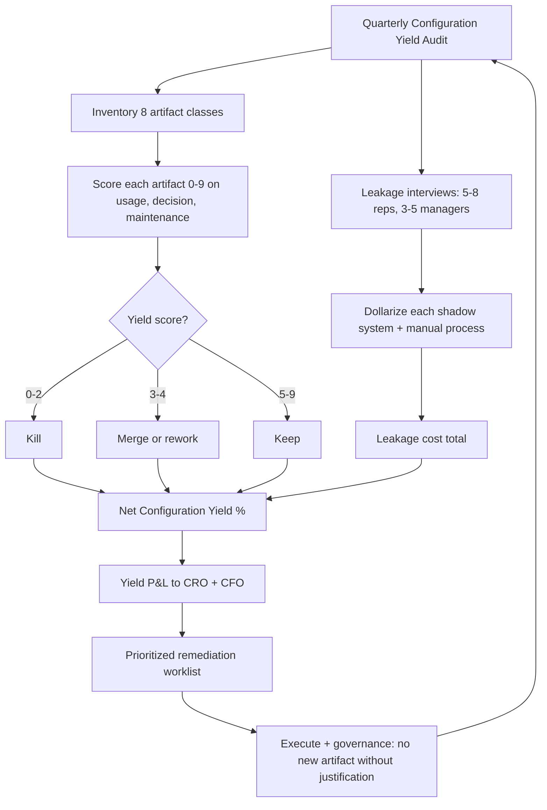

### Direct Answer

A Salesforce org is over-engineered when its configuration complexity grows faster than the revenue, adoption, or decision-quality it produces — and it is leaving money on the table when missing automation, missing data, or missing guardrails force reps and managers to do work the platform should be doing for them. You measure both with the same instrument: a quarterly **Configuration Yield audit** that scores every object, automation, field, and report against a single question — "does this artifact change a rep's behavior or a leader's decision?" If it does not, it is debt; if a behavior or decision is happening in spreadsheets instead of Salesforce, that is leakage. The healthy target is a config where 70 percent or more of fields are populated on 70 percent or more of records, automation runs in under 5 seconds, and fewer than 10 percent of all artifacts are unused — anything outside those bands is either over-built or under-built, and both cost real money.

> **TLDR**
> - **Over-engineering and under-building are the same disease** — config that is not tied to a behavior or a decision. One adds cost; the other adds leakage. Measure both at once.
> - **Run a Configuration Yield audit every quarter.** Inventory every field, automation, object, profile, and report; score each on usage, decision-impact, and maintenance cost. Kill, merge, or fix.
> - **The four leading indicators of over-engineering:** field fill-rate below 50 percent, automation save-time over 5 seconds, more than 25 percent of validation rules never fired in 90 days, and an admin backlog measured in months.
> - **The four leading indicators of money left on the table:** shadow spreadsheets, manual stage hygiene, forecast built outside the CRM, and reps re-keying data the platform already has.
> - **Salesforce gives you the telemetry for free** — Optimizer, Well-Architected, Field History, Setup Audit Trail, the Health Check, and Event Monitoring. Most teams never open them.
> - **Tie every config decision to a dollar.** Over-engineering shows up as admin cost and rep friction; under-building shows up as cycle-time, win-rate, and forecast-accuracy drag. Both are quantifiable.
> - **The counter-case is real:** very early-stage teams, heavily regulated industries, and pre-IPO orgs sometimes *should* carry "extra" config. Know when the rule does not apply.

---

## I. Why "Over-Engineered" and "Leaving Money on the Table" Are the Same Question

Most RevOps leaders treat these as two separate audits. They are not. They are two failure modes of one underlying variable: **configuration yield** — the ratio of behavior-and-decision change produced to configuration complexity carried. When yield is low, you can be low for two reasons. Either you built artifacts that nobody uses (over-engineering, the cost side), or you failed to build artifacts that people need and so they route around the platform (under-building, the leakage side). A single audit catches both, because both show up as the same symptom: a gap between what the system *contains* and what the business *does*.

### 1. The definition that makes the audit possible

An object, field, automation, or report is **earning its place** if, and only if, removing it would change a rep's behavior or a leader's decision within one quarter. Everything else is dead weight. This definition is deliberately strict, and it is the single most important sentence in this entry. It converts a vague aesthetic argument ("this org feels bloated") into a testable claim ("this field has not been edited or read in 180 days, and no report or automation references it"). Once every artifact is judged against a behavior or a decision, the audit becomes mechanical rather than political.

The mirror image is just as strict. A behavior or decision is **leaking** if it happens *outside* Salesforce when it could happen inside it. A manager who rebuilds the forecast in a spreadsheet every Friday is telling you the forecast object is under-built. A rep who keeps a private deal tracker is telling you the opportunity record does not hold something they need. Leakage is not invisible — it is just happening in Google Sheets instead of in your reports.

### 2. The cost of getting it wrong in both directions

| Failure mode | What it looks like | Who pays | Annual cost signature |
|---|---|---|---|
| Over-engineering | 40 required fields, 9 record types, 200 validation rules | Reps (friction), admins (maintenance) | 15-30% admin capacity, 2-5 min/record rep tax |
| Under-building | Forecast in spreadsheets, manual stage updates | Managers (rework), forecast accuracy | 5-15 pts forecast error, 3-8 hrs/wk manager rework |
| Both at once | Complex *and* incomplete — the common case | Everyone | Compounding: friction drives avoidance drives leakage |
| Healthy yield | Lean config, high fill-rate, automation invisible | Nobody — it runs | Baseline; admin spend is investment, not tax |

The most common real-world state is the third row. Teams over-build the parts that were easy to configure (validation rules, required fields, page layouts) and under-build the parts that are hard (clean forecast objects, territory automation, lifecycle tracking). The result is an org that is simultaneously exhausting to use and missing the things that matter. This is why you must measure both at once — fixing one without the other just moves the pain.

### 3. The mental model: configuration as inventory

Treat your Salesforce config the way a CFO treats inventory. Every field, automation, and object is a unit of inventory that carries a holding cost (maintenance, cognitive load, regression risk) and is supposed to produce a return (a behavior change, a faster decision, a cleaner number). Inventory that does not turn over is **dead stock**. Inventory you are out of, while customers are asking, is a **stockout**. Over-engineering is dead stock; leaving money on the table is a stockout. A good RevOps leader runs the org like a good operations leader runs a warehouse — ruthlessly, with a turns metric, every quarter.

For the broader pattern of treating operational systems as inventory with carrying costs, see the sibling entry on **CRM total cost of ownership** (q405). The yield framework here is the diagnostic; the TCO framework there is the financial model that prices what the diagnostic finds.

---

## II. The Configuration Yield Audit: The Master Instrument

The Configuration Yield audit is a recurring, scored inventory of your entire org. It runs quarterly, takes a focused RevOps analyst two to three days, and produces a single number plus a prioritized worklist. This section is the operating manual.

### 1. Scope: what you inventory

You inventory eight artifact classes. Anything in the org that a human built belongs in one of these buckets.

| Artifact class | What to count | Primary risk |
|---|---|---|
| Custom fields | Every custom field on every object | Fill-rate decay, redundancy |
| Automations | Flows, Process Builder, Workflow Rules, Apex triggers | Save-time, conflicts, order-of-execution bugs |
| Validation rules | Every active rule | Friction, never-fired rules |
| Record types & page layouts | Per object | Combinatorial sprawl |
| Objects | Custom objects + heavily-used standard | Orphan objects, parallel data models |
| Profiles & permission sets | Every access grant | Permission creep, audit exposure |
| Reports & dashboards | All saved reports/dashboards | Stale reports, the "report graveyard" |
| Integrations & installed packages | Connected apps, managed packages | Hidden API load, license waste |

### 2. The three scores every artifact receives

Each artifact gets three scores from 0 to 3. The sum (0-9) is its **yield score**. This is the heart of the audit.

| Dimension | 0 | 1 | 2 | 3 |
|---|---|---|---|---|
| Usage | Never read/written in 90d | Touched rarely | Touched weekly | Touched daily |
| Decision impact | Changes no behavior/decision | Minor convenience | Influences a real decision | Drives a core revenue decision |
| Maintenance health | Broken or actively confusing | High upkeep | Low upkeep | Self-maintaining |

The arithmetic is deliberately blunt so the audit cannot be argued with. **An artifact scoring 0-2 is debt — kill it.** **An artifact scoring 3-4 is a candidate for merge or rework.** **An artifact scoring 5-9 earns its place.** Run the whole org through this and you get a histogram. A healthy org has most artifacts at 5+ and a thin tail below 3. An over-engineered org has a fat low tail. The shape of the histogram *is* the diagnosis.

### 3. The leakage pass: the second half of the same audit

After scoring what exists, you score what *should* exist but does not. You do this by interviewing five to eight reps and three to five managers with one question: "Show me every place you keep revenue data or do revenue analysis that is not in Salesforce." Every spreadsheet, Notion doc, Slack channel, and personal tracker they show you is a **leakage artifact**. Each gets a single score — estimated dollar impact of the work being done outside the system. The sum of leakage dollars is the "money on the table" half of your number.

### 4. The single headline metric

The audit produces one number you report to leadership: **Net Configuration Yield**, expressed as a percentage.

```
Net Configuration Yield = (Artifacts scoring 5+ ÷ Total artifacts) − (Leakage cost ÷ Total config cost)
```

A score above 60 percent is healthy. Between 40 and 60 percent is a watch state. Below 40 percent means the org is actively destroying value and needs a remediation program, not a tune-up. Track this number quarter over quarter; the *trend* matters more than the absolute level. For the related discipline of tracking a single operational health metric over time, see the sibling entry on **Rule of 40 communication** (q417) — the same "one number, explained well, trended" principle applies.

### 5. The audit cadence and ownership

| Cadence | Activity | Owner |
|---|---|---|
| Quarterly | Full Configuration Yield audit, all 8 classes | RevOps analyst + Salesforce admin |
| Monthly | Automation save-time + error-rate spot check | Salesforce admin |
| Per release | Net-new artifact justification ("what behavior?") | RevOps lead approves |
| Annually | Profile/permission-set deep audit with Security | RevOps + IT Security |

The non-negotiable governance rule: **no new field, automation, or record type ships without a written behavior-or-decision justification.** This is the cheapest control you will ever implement, and it stops over-engineering at the source rather than cleaning it up after the fact.

---

## III. Measuring Over-Engineering: The Cost Side

This section gives you the four leading indicators of over-engineering, how to pull each one, and the threshold that flips it from "fine" to "fix."

### 1. Indicator one — field fill-rate decay

Field fill-rate is the percentage of records on which a given field is populated. It is the single most reliable tell of over-engineering, because reps vote with their keyboards. A field that exists but is empty on most records is a field nobody believes is worth filling.

| Fill-rate band | Interpretation | Action |
|---|---|---|
| 80-100% | Healthy — the field earns its place | Keep |
| 50-79% | Watch — partial adoption, possibly optional-but-useful | Investigate why |
| 20-49% | Suspect — likely vestigial or duplicative | Strong kill/merge candidate |
| 0-19% | Dead — nobody fills it, automation may rely on stale defaults | Kill unless compliance-mandated |

You pull fill-rate with a report grouped on the field with a "not equal to blank" filter, or with a quick SOQL count. Run it for every custom field. The list of fields below 50 percent is, on day one, your over-engineering kill list. For why fill-rate also gates the trustworthiness of every downstream metric, see the sibling entry on **CAC payback accuracy** (q414) — garbage-in fields produce garbage payback math.

### 2. Indicator two — automation save-time and error rate

Every automation should make a save *faster* in human terms — it does work the rep would otherwise do. But automations also cost CPU time, and Salesforce will tell you exactly how much. The tells:

- **Save-time over 5 seconds** on a common object means automation has crossed from helpful to obstructive. Reps feel every second.
- **Apex CPU time approaching governor limits** means you are one new flow away from production errors.
- **Recursive or conflicting automations** — two flows that both fire on opportunity update and each re-trigger the other — are a classic over-engineering signature.
- **Error rate above 1 percent** on any automation means reps are hitting failures and learning to distrust the platform.

| Telemetry source | What it tells you | Where it lives |
|---|---|---|
| Setup Audit Trail | Who changed config and when | Setup > Audit Trail |
| Flow & Apex error emails | Which automations fail and how often | Admin inbox / debug logs |
| Event Monitoring (Shield) | Per-transaction CPU and save-time | Event Monitoring app |
| Apex governor limit logs | How close you are to hard limits | Debug logs |
| Optimizer report | Flagged unused/risky automations | Salesforce Optimizer |

### 3. Indicator three — never-fired validation rules and dead record types

A validation rule that has never fired in 90 days is either perfectly preventive (rare) or pointless (common). You cannot tell which from the rule itself, so you instrument it: add a temporary error-logging step, or review the rule's logic against actual data patterns. If a rule guards against a state the data never reaches, it is pure friction with no payoff.

Record types are worse, because they multiply. Three record types times four page layouts times two business processes is twenty-four combinations to maintain. If two record types have nearly identical layouts and fields, they should be one record type. The audit threshold: **any record type used on fewer than 5 percent of records, or with a 90-percent-or-greater layout overlap with another record type, is a merge candidate.**

### 4. Indicator four — the admin backlog and the change-failure rate

The clearest sign of an over-engineered org is not in the org at all — it is in the admin's backlog. When a config is lean, a request like "add a field" is a same-week change. When a config is over-engineered, every change risks breaking three undocumented dependencies, so changes slow to a crawl and the backlog stretches into months. Two metrics capture this:

- **Lead time for a config change** — request to production. Healthy is days; over-engineered is weeks-to-months.
- **Change failure rate** — percentage of config changes that cause a regression. Healthy is under 5 percent; over-engineered orgs routinely run 15-30 percent because the dependency graph is unknowable.

| Over-engineering metric | Healthy | Watch | Fix now |
|---|---|---|---|
| Avg custom-field fill-rate | 70%+ | 50-70% | <50% |
| Common-object save-time | <2s | 2-5s | >5s |
| Validation rules never fired in 90d | <10% | 10-25% | >25% |
| Config change lead time | <1 week | 1-4 weeks | >1 month |
| Config change failure rate | <5% | 5-15% | >15% |
| Unused reports (no views in 90d) | <20% | 20-40% | >40% |

### 5. The over-engineering composite

Average the six metrics above (normalized 0-100, where 100 is best) into an **Over-Engineering Index**. Above 75 is lean. 50-75 is carrying excess. Below 50 means the configuration complexity is now a material drag on the revenue org and deserves a dedicated remediation sprint.

---

## IV. Measuring Money Left on the Table: The Leakage Side

Over-engineering is loud — reps complain. Leakage is quiet — reps just route around it. That makes the leakage side harder to measure and, usually, the more expensive of the two. Here are the four indicators.

### 1. Indicator one — shadow spreadsheets and parallel systems

The first and most reliable leakage signal is the existence of any spreadsheet, doc, or tool where revenue data is maintained outside Salesforce. Every shadow system is a precise statement: "the platform does not do this, so I built my own." Catalog them. The most common are forecast spreadsheets, account-planning docs, commission trackers, renewal trackers, and pipeline-cleanup sheets.

| Shadow system | What it reveals is under-built | Typical fix |
|---|---|---|
| Forecast spreadsheet | Native forecast object unused or untrusted | Configure Collaborative Forecasting |
| Account-planning doc | No account-plan object or fields | Build account-plan record/section |
| Commission tracker | Comp not visible in CRM | Comp tool integration or fields |
| Renewal/churn tracker | No renewal lifecycle on the opportunity | Renewal record type + automation |
| Pipeline-cleanup sheet | No stage-hygiene automation | Stale-deal flow + manager alerts |

### 2. Indicator two — manual work the platform should automate

The second leakage signal is repetitive manual work that a flow could do. Watch for reps manually updating close dates, manually moving stages on a schedule, manually creating follow-up tasks, manually assigning leads, or manually calculating anything. Each of these is unbuilt automation, and each carries a measurable cost: minutes per rep per day, multiplied across the team, multiplied across the year.

A useful estimate: if 20 reps each spend 15 minutes a day on manual CRM hygiene that automation could handle, that is 5 hours a day, roughly 1,250 hours a year — well over half a full-time equivalent of pure waste, before you count the deals that slip because hygiene was skipped. For the discipline of converting operational waste into a payback figure leadership will act on, see the sibling entry on **CAC payback period** (q414).

### 3. Indicator three — the forecast and the decision gap

The most expensive leakage is decision leakage: leaders making revenue calls on data that is not in the CRM. Symptoms:

- **The forecast is assembled in a spreadsheet** and only the final number is typed back into Salesforce.
- **Pipeline reviews start with "let me pull the real numbers"** — meaning the dashboard is not trusted.
- **Win/loss reasons are not captured**, so there is no structured data on why deals are won or lost.
- **Stage definitions are vague**, so two reps at "Stage 3" mean different things and the forecast is noise.

Each of these means a revenue decision is being made with less rigor than the platform could provide. The cost is forecast error, and forecast error has a hard price: missed boards, mis-timed hiring, and capital raised at the wrong time. For how to separate the retention metrics that feed a trustworthy forecast, see the sibling entries on **NRR/GRR/logo retention separation** (q416) and **Rule of 40 measurement** (q417).

### 4. Indicator four — data the platform already has but does not surface

The subtlest leakage: reps re-keying or re-deriving information Salesforce already holds. A rep who manually checks an account's open support cases, past purchases, or prior opportunities — when all of that is in the org — is doing work a related list or a flow could do for free. This is leakage because the *cost of surfacing* the data is near zero and the platform is simply not configured to do it.

| Leakage indicator | How to detect it | Cost signature |
|---|---|---|
| Shadow spreadsheets | Rep/manager interviews | Rework hours + version drift |
| Manual hygiene work | Time-and-motion observation | FTE-equivalent waste |
| Forecast built outside CRM | "Where does the forecast number come from?" | Forecast error in points |
| Re-keyed existing data | Watch a rep prep for a call | Minutes/call × call volume |
| Missing win/loss capture | Check for structured loss reasons | No learning loop; repeated losses |

### 5. The leakage composite

Sum the dollarized estimates from all four indicators into a **Leakage Cost** figure. Express it two ways: absolute annual dollars, and as a percentage of total RevOps + Salesforce spend. When leakage cost exceeds 20 percent of your total RevOps spend, the org is under-built badly enough that the highest-ROI work available to you is *adding* configuration, not removing it.

---

## V. The Salesforce-Native Telemetry You Already Pay For

You do not need a third-party tool to run most of this audit. Salesforce ships the instrumentation. Most teams never open it. This section is the inventory of free telemetry.

### 1. Salesforce Optimizer

Optimizer scans the org and produces a report flagging unused fields, unused reports, fields not on any page layout, hard-coded URLs, stale automations, and limits you are approaching. It is the single fastest way to generate a first-pass over-engineering kill list. Run it before every quarterly audit; it does in minutes what would take a human a day.

### 2. Salesforce Well-Architected

Well-Architected is Salesforce's published framework for what a healthy org looks like — trusted, easy, and adaptable. Its "easy" and "adaptable" pillars map almost exactly to the over-engineering side of this audit. Use it as the external benchmark so your audit findings are not just your opinion; they are measured against Salesforce's own standard.

### 3. The free telemetry inventory

| Tool | What it measures | Audit use |
|---|---|---|
| Optimizer | Unused fields, reports, layouts; limit risks | Over-engineering kill list |
| Well-Architected | Org health vs. published standard | External benchmark |
| Health Check | Security settings vs. baseline | Profile/permission audit |
| Field History Tracking | Whether a field changes over time | Usage scoring |
| Setup Audit Trail | Who changed what config, when | Change governance, lead time |
| Report on Reports | Last-run date of every report | Report graveyard cleanup |
| Storage Usage | Data/file storage consumption | Object sprawl signal |
| Event Monitoring (Shield) | Per-transaction CPU, save-time, logins | Automation save-time, adoption |
| Login/adoption reports | Who logs in, who uses what | Under-building / non-adoption signal |
| Limits API | API calls, async jobs vs. caps | Integration load |

### 4. The reports you must build once

A few audit reports are not native and must be built once, then reused every quarter: a "fields not populated in 90 days" report, a "reports not viewed in 90 days" report, a "validation rules with no recent errors" review, and an "automation save-time by object" dashboard if you have Event Monitoring. Build them into a dedicated "Org Health" folder and they become a permanent instrument panel.

### 5. The honest limitation

Native telemetry is excellent at the cost side and weak at the leakage side. Salesforce can tell you a field is empty; it cannot tell you a rep is keeping that data in a spreadsheet instead. **The leakage half of the audit will always require human interviews.** No tool replaces sitting with five reps and asking where the real work happens. Budget for it.

---

## VI. Translating the Audit Into Dollars

An audit that produces a worklist but not a dollar figure will lose every prioritization fight it enters. This section converts both sides of the yield equation into money.

### 1. Pricing the over-engineering side

Over-engineering costs money in three buckets, all estimable:

- **Admin maintenance cost.** Estimate the share of your admin team's time spent maintaining low-yield artifacts. If two admins cost 300,000 dollars fully loaded and 25 percent of their time goes to maintaining debt, that is 75,000 dollars a year.
- **Rep friction cost.** Estimate minutes per record lost to excess required fields, validation-rule fights, and slow saves. Twenty reps losing 10 minutes a day at a loaded selling-hour rate is a large number — and that is before the deals not worked because admin ate the time.
- **Change-drag cost.** Slow, risky config change means the revenue org adapts slowly to market shifts. This is real but hard to price; estimate it as the cost of initiatives delayed a quarter.

### 2. Pricing the leakage side

| Leakage source | Estimation method | Example |
|---|---|---|
| Shadow-system rework | Hours/week × loaded rate × people | 5 hrs/wk × $80 × 6 = $124k/yr |
| Manual hygiene | Minutes/day × reps × selling days | 15 min × 20 × 240 = ~1,250 hrs |
| Forecast error | Error pts × cost of a missed plan | 8 pts on a $40M plan = material |
| Repeated losses | Loss-reason gap × win-rate upside | Hard to price; estimate as range |

### 3. The yield P&L

Put both sides on one page. This is what you take to the CRO and CFO.

| Line item | Annual figure | Direction |
|---|---|---|
| Admin maintenance of low-yield config | -$75,000 | Cost (over-eng) |
| Rep friction tax | -$140,000 | Cost (over-eng) |
| Shadow-system rework | -$124,000 | Cost (leakage) |
| Forecast-error penalty | -$200,000 | Cost (leakage) |
| Remediation program cost | -$90,000 | One-time investment |
| Recovered capacity + accuracy (year 1) | +$430,000 | Return |
| **Net year-one yield improvement** | **+$251,000** | **Return** |

The numbers above are illustrative — your audit produces the real ones — but the structure is the point. A Configuration Yield audit is not a hygiene chore; it is a project with an IRR. Frame it that way and it gets funded. For the parallel discipline of building a defensible cost model for a CRM decision, see the sibling entry on **build vs. buy CRM TCO** (q405).

### 4. The prioritization matrix

Once every finding is dollarized, sort the worklist by effort and impact.

| | Low effort | High effort |
|---|---|---|
| **High impact** | Do first — kill dead fields, archive stale reports, merge record types | Plan deliberately — rebuild forecast object, re-architect automation |
| **Low impact** | Batch — clean up in the quarterly sweep | Decline — document the decision and move on |

### 5. The Mermaid view of the full cycle



---

## VII. The Remediation Playbook

Measurement without action is just a more sophisticated complaint. This section is the 90-day remediation plan you run after the first audit.

### 1. Days 1-15: the safe kills

Start with the changes that cannot break anything. Archive reports unviewed in 90 days. Hide — do not yet delete — custom fields with sub-20-percent fill rates. Deactivate validation rules confirmed never to fire. These are reversible, low-risk, and they produce an immediate, visible win that buys credibility for the harder work.

### 2. Days 16-45: the merges and consolidations

Now the medium-risk work. Merge near-duplicate record types. Consolidate redundant fields (the classic "we have three 'industry' fields" problem). Combine overlapping automations into single, well-ordered flows. Each of these requires testing in a sandbox and a rollback plan, but each meaningfully reduces the dependency graph.

### 3. Days 46-90: the rebuilds

The high-effort, high-impact work that addresses leakage. Configure the native forecast object so the spreadsheet can be retired. Build the missing renewal lifecycle. Add the automation that eliminates the largest manual-hygiene burden. This work is real engineering and deserves a real project plan.

| Phase | Days | Work type | Risk | Reversibility |
|---|---|---|---|---|
| Safe kills | 1-15 | Archive, hide, deactivate | Low | Fully reversible |
| Merges | 16-45 | Consolidate records, fields, flows | Medium | Sandbox-tested, rollback ready |
| Rebuilds | 46-90 | Build missing objects/automation | Higher | New build, phased rollout |
| Governance | Ongoing | Justification gate on all new artifacts | N/A | Permanent control |

### 4. The governance gate that prevents recurrence

The audit cleans up; governance keeps it clean. Institute one rule: every proposed new field, automation, record type, or object must come with a one-line written answer to "what behavior or decision does this change, and how will we know in 90 days?" The RevOps lead approves or declines. This single gate, applied consistently, is what stops the org from drifting back into over-engineering within four quarters.

### 5. Communicating the program

Report the program in the language of the audience. To the CRO: cycle-time and forecast-accuracy gains. To the CFO: the yield P&L and recovered capacity. To reps: fewer required fields and faster saves. To the admin team: a smaller, more maintainable org and a shorter backlog. Same program, four translations. For the broader skill of translating an operational metric into language a skeptical executive will accept, see the sibling entry on **explaining the Rule of 40** (q417).

---

## VIII. Counter-Case: When the Rule Does Not Apply

The yield framework says "kill what does not change a behavior or decision." That is the right default for the overwhelming majority of orgs. But defaults have edges, and a serious RevOps leader knows when to override the rule. Here are the cases where carrying "extra" configuration is correct.

### 1. Regulated industries with compliance-mandated fields

In financial services, healthcare, pharma, and government, certain fields exist because a regulator or an auditor requires them — not because a rep uses them. A field capturing consent, suitability, or disclosure may have a low fill-rate and zero day-to-day decision impact and still be **non-negotiable**. The yield audit must carry a "compliance-mandated" flag that exempts these artifacts from the kill list entirely. Killing a compliance field to improve a yield score is a catastrophic misread of the framework.

### 2. Pre-IPO and audit-readiness orgs

A company preparing for an IPO or a major financial audit deliberately builds more rigor into its systems than day-to-day operations strictly need — granular field history, tighter validation, fuller audit trails. This is not over-engineering; it is **building for a future state that arrives on a known date.** The yield framework should be told the IPO timeline and treat audit-readiness artifacts as earning their place by virtue of the upcoming event, not the current quarter's behavior.

### 3. Very early-stage companies still discovering their model

A 15-person startup that has not yet found product-market fit should not run a heavyweight quarterly yield audit. At that stage the cost of config change is near zero, the data history is too thin for fill-rate metrics to mean anything, and the business model itself is still moving. Premature optimization of the CRM is its own form of waste. The yield framework earns its keep at roughly 30-plus reps or once the org has two-plus years of data — before that, keep the config minimal and skip the audit.

### 4. Strategic instrumentation built ahead of need

Sometimes you deliberately build a field or capture a data point *before* you have a use for it, because the data is only valuable if you have a long history of it. Capturing a churn-reason or a competitor field starting today, even though no report uses it yet, is a legitimate bet on future analysis. The distinction from over-engineering is **intent and a written hypothesis**: strategic instrumentation has a documented "we will use this in N months for X" rationale. Undocumented empty fields do not.

### 5. The override discipline

| Scenario | Override the kill rule? | Required safeguard |
|---|---|---|
| Compliance-mandated field, low usage | Yes — exempt | "Compliance-mandated" flag + legal sign-off |
| Pre-IPO audit-readiness rigor | Yes — exempt until post-IPO | IPO timeline documented in audit scope |
| Pre-PMF startup under ~30 reps | Yes — skip the audit entirely | Revisit at scale milestone |
| Strategic instrumentation | Yes — keep | Written hypothesis with a use-by date |
| "We might need it someday," no plan | No — kill it | This is the over-engineering trap |
| "A VP asked for it once" | No — kill it | Sentiment is not a behavior or decision |

The discipline is this: an override is always allowed, but it always requires a *written, specific* reason that names a regulation, an event, or a dated hypothesis. "It feels safer to keep it" is not an override — it is the exact instinct that builds over-engineered orgs in the first place.

---

## IX. Common Mistakes and How to Avoid Them

### 1. Auditing the cost side only

The most common error is running an "org cleanup" that only deletes things. A team can delete its way to a leaner org that still leaks money everywhere because the forecast still lives in a spreadsheet. Always run both passes — the cost pass and the leakage pass — in the same audit. Half the audit produces half a picture and usually the less valuable half.

### 2. Treating fill-rate as the only metric

Fill-rate is the best single indicator, but it is not sufficient. A field can be 95-percent filled because a validation rule *forces* it — high fill-rate, zero genuine value, pure friction. Always pair fill-rate with decision-impact scoring. A field is only healthy when it is both populated *and* used by a report, automation, or human decision.

### 3. Deleting before hiding

Never delete an artifact in one step. Hide it, deactivate it, or archive it first; wait a quarter; then delete. Salesforce deletions of fields and automations can have non-obvious downstream effects, and the cost of a staged removal is one quarter of patience. The cost of a hasty deletion can be a broken integration discovered at quarter-end.

### 4. Skipping the rep interviews

Because native tooling makes the cost side easy, teams skip the human-interview leakage pass. This is the single biggest measurement gap. The most expensive problems — decision leakage, shadow forecasts — are invisible to every tool and visible in every interview. Budget the days and do the interviews.

### 5. Running it once

An audit run once is a snapshot; an audit run quarterly is an instrument. Orgs drift. New reps, new products, new managers, and new admins all add config, and entropy is constant. The value of the yield framework is almost entirely in the *trend line* — and a trend line needs more than one point.

| Mistake | Consequence | Fix |
|---|---|---|
| Cost-side-only audit | Lean org that still leaks | Always run both passes |
| Fill-rate as sole metric | Keep forced-but-useless fields | Pair with decision-impact score |
| Delete before hide | Broken integrations, lost data | Stage every removal over a quarter |
| Skip rep interviews | Miss the most expensive leakage | Budget interview days |
| One-time audit | Snapshot, no trend, drift returns | Quarterly cadence + governance gate |
| No dollar figures | Findings lose prioritization fights | Dollarize every finding |

---

## X. Case Walkthroughs: The Audit in Practice

Frameworks land when you see them run. Three composite walkthroughs — built from common patterns, not a single named customer — show the audit producing a verdict and a worklist.

### 1. The over-engineered Series-C SaaS org

A 180-rep horizontal SaaS company runs its first Configuration Yield audit. The cost pass finds the org carrying 612 custom fields on the Opportunity object, of which 280 sit below 50-percent fill-rate, with eleven distinct fields capturing some variant of "deal source." Automation telemetry shows opportunity saves averaging 6.4 seconds, with two flows in a recursive loop. The org has nine record types, four of which sit on under 3 percent of records. The leakage pass, by contrast, is quiet — managers forecast inside the CRM and shadow spreadsheets are rare. The verdict: badly over-engineered, mildly under-built. Net Configuration Yield computes to 38 percent. The remediation is overwhelmingly subtractive — consolidate the deal-source fields, hide the 280 low-fill fields, untangle the recursive flows, merge five record types. The yield P&L shows recovered admin capacity and a save-time drop to under 2 seconds as the headline returns.

### 2. The under-built professional-services firm

A 90-consultant professional-services firm runs the audit. The cost pass is unremarkable — the org is lean, even sparse, with few custom fields and minimal automation. But the leakage pass is alarming: every project manager keeps a project-tracking spreadsheet, revenue recognition happens entirely in finance's own system, and the forecast is rebuilt in a spreadsheet every week because the opportunity model does not fit project-shaped work. Net Configuration Yield computes to 41 percent — not because of debt, but because leakage cost is enormous. The remediation here is almost entirely additive: build a project lifecycle, configure the forecast object, automate the hygiene the PMs do by hand. This is the case that proves why you must run both passes — a cost-only audit would have declared this healthy org "clean" and missed six figures of leakage.

### 3. The both-at-once mid-market org

A 140-rep mid-market company runs the audit and finds the most common real-world state. The cost pass finds genuine debt — 40 required fields, a fat tail of stale reports, never-fired validation rules. The leakage pass *also* finds real gaps — no renewal lifecycle, win/loss reasons uncaptured, a shadow renewal tracker. Net Configuration Yield is 44 percent. Crucially, the two problems are linked: the org over-built the easy parts (validation rules, required fields) and under-built the hard parts (renewal automation), and the friction from the over-build is *driving* reps toward the spreadsheets that constitute the leakage. The remediation must do both, in the right order — relieve the friction first so reps re-engage, then build the missing capability so there is something for them to re-engage *with*.

| Walkthrough | Verdict | Net yield | Remediation shape |
|---|---|---|---|
| Series-C SaaS | Over-engineered | 38% | Mostly subtractive |
| Professional services | Under-built | 41% | Mostly additive |
| Mid-market | Both at once | 44% | Sequenced: relieve friction, then build |

The lesson across all three: the *number* alone does not tell you what to do. A 38, a 41, and a 44 look similar on a dashboard and demand three completely different remediation programs. The audit's verdict — over-built, under-built, or both — is what sets the direction.

---

## XI. The 90-Day Quick-Start

For a RevOps leader who wants to start this week, here is the compressed path.

### 1. Week 1 — instrument

Run Salesforce Optimizer. Build the four core audit reports (empty fields, stale reports, never-fired validation rules, automation save-time). Pull the Setup Audit Trail for the last quarter. You now have the cost-side data.

### 2. Weeks 2-3 — inventory and interview

Score the eight artifact classes using the 0-9 yield rubric. In parallel, interview five to eight reps and three to five managers for the leakage pass. Catalog every shadow spreadsheet.

### 3. Week 4 — dollarize and decide

Build the yield P&L. Compute Net Configuration Yield. Sort findings into the effort/impact matrix. Present to the CRO and CFO with a funded 90-day remediation ask.

### 4. Weeks 5-13 — remediate

Run the three remediation phases: safe kills, merges, rebuilds. Stand up the governance gate so the org does not drift back.

### 5. Quarter 2 onward — operate

Re-run the audit. Report the new Net Configuration Yield against the prior quarter. The trend line is now your permanent measure of whether the org is over-engineered, under-built, or healthy.

| Week | Milestone | Output |
|---|---|---|
| 1 | Instrument | Optimizer report + 4 core audit reports |
| 2-3 | Inventory + interview | Scored artifact list + leakage catalog |
| 4 | Dollarize | Yield P&L + Net Configuration Yield + funded ask |
| 5-13 | Remediate | Leaner config, rebuilt objects, governance gate |
| Q2+ | Operate | Quarter-over-quarter yield trend |

---

## XII. Operator Playbook: How the Best Leaders Frame This

The most effective revenue-systems leaders treat their CRM configuration as a managed asset with a yield, not a pile of features that only grows. A useful reference set:

- **Frank Slootman**, who led **Snowflake (SNOW)** and **ServiceNow (NOW)**, is the canonical voice for "amp it up" — ruthless focus and the elimination of low-yield activity. His operating philosophy maps directly onto configuration yield: complexity that does not produce a result is, in his framing, exactly the kind of organizational drag a leader exists to remove.
- **Marc Benioff**, founder and CEO of **Salesforce (CRM)**, built the platform on the premise of configuration over code — which is precisely why configuration debt is now the dominant failure mode. The flexibility that made Salesforce great is the same flexibility that lets orgs over-engineer themselves.
- **Aaron Levie**, CEO of **Box (BOX)**, has been a consistent public voice on operational simplicity and the danger of tooling sprawl outpacing the value it delivers.
- **Mark Roberge**, who scaled revenue at **HubSpot (HUBS)** and wrote *The Sales Acceleration Formula*, is the reference for metric-driven RevOps — the discipline of measuring before changing, which is the entire spirit of the yield audit.
- **Snowflake (SNOW)**, **ServiceNow (NOW)**, **Workday (WDAY)**, and **Atlassian (TEAM)** are all public companies whose RevOps functions are large enough that configuration governance is a named, staffed discipline — useful proof points that this is not a small-company nicety.
- **Salesforce's own Well-Architected team** publishes the closest thing to an industry standard for org health; the best leaders benchmark against it rather than relying purely on internal opinion.

The throughline across all of them: **the best operators are subtractive.** They are as proud of what they removed as what they built, and they measure their systems by yield, not by feature count. The Configuration Yield audit is simply that instinct, made into a repeatable instrument with a number attached.

---

## XIII. Artifact-by-Artifact Field Guide

Section II gave you the audit machinery; this section is the practitioner's field guide to each of the eight artifact classes — what specifically to look for, the failure pattern unique to that class, and the kill or fix decision.

### 1. Custom fields — the largest and noisiest class

Custom fields are where over-engineering accumulates fastest, because creating one takes thirty seconds and there is no natural friction stopping it. A mature org carries hundreds of custom fields per major object, and a meaningful fraction are vestigial. The diagnostic questions for every field: Is it populated on most records? Does any report group, filter, or summarize on it? Does any automation read it? Does any human ever look at it on a layout? A field that fails all four is the purest form of dead stock. The subtle trap is the **duplicate-concept field** — three fields all capturing "industry" because three admins over three years each built their own. These are worse than empty fields because they fragment the data: a report on field one misses records that used field two. Consolidating duplicate-concept fields is usually the single highest-yield field-class action in the entire audit.

A second field-specific pattern is the **formula-field tax**. Formula fields are convenient but each one is recomputed on every record view and in every report, and a deep stack of formula fields referencing other formula fields creates query-time cost that surfaces as slow reports. The audit should flag any formula field nested more than two levels deep for review.

| Field-class symptom | What it means | Decision |
|---|---|---|
| Empty on 80%+ of records | Nobody believes it is worth filling | Hide, then kill |
| Duplicate concept (3x "industry") | Data fragmented across fields | Consolidate to one |
| Filled only because validation forces it | Friction with no payoff | Remove field + rule together |
| Deeply nested formula field | Query-time performance tax | Flatten or materialize |
| High fill + used in reports/automation | Earns its place | Keep |

### 2. Automations — where the dependency graph hides

Automations are the highest-risk class because they are invisible until they break and they interact with each other in non-obvious ways. The order-of-execution problem — a flow that fires on opportunity update, sets a field, which triggers a second flow, which updates a third — is the canonical over-engineering nightmare, because no single person holds the whole graph in their head. The audit's job for automations is first to *map* the graph: list every automation per object, what triggers it, and what it changes. Then score. A flow that has not changed a record in 90 days, or whose effect is duplicated by another flow, is a kill candidate. A cluster of three workflow rules and two Process Builder processes on the same object that could be one well-ordered flow is a consolidation candidate. The migration of legacy Workflow Rules and Process Builder to Flow is, separately, a Salesforce-mandated modernization and should be folded into the automation remediation rather than treated as a separate project.

### 3. Validation rules — friction with the highest complaint-to-value ratio

Validation rules generate more rep frustration per artifact than anything else, because they interrupt the rep at the moment of saving. Every rule should be tested against the question: does the state this rule prevents actually occur, and is preventing it worth the interruption? A rule that blocks a save until a field is filled is justified only if that field genuinely drives a decision — otherwise it is manufacturing the fake fill-rate described above. The audit should sort validation rules into three buckets: rules that enforce genuine data integrity for a downstream decision (keep), rules that enforce a process step better handled by guidance or training (soften or remove), and rules that have never fired and guard an impossible state (kill).

### 4. Record types and page layouts — the combinatorial sprawl class

Record types multiply maintenance because each one carries its own page layouts, picklist values, and often its own automation branches. The failure pattern is the record type created for a one-time need that never went away. The audit threshold from Section III stands: any record type on under 5 percent of records or with 90-percent layout overlap with a sibling is a merge candidate. Page layouts deserve their own pass — an org with twelve nearly-identical layouts is carrying eleven layouts of pure maintenance for no behavioral difference.

### 5. Objects, profiles, reports, and integrations — the long tail

The remaining four classes follow the same logic. **Custom objects** that hold data no report or process consumes are orphan objects — and an orphan object that *parallels* a standard object (a custom "Deal" object alongside Opportunity) is a serious architectural smell pointing to an under-trusted standard model. **Profiles and permission sets** accumulate as permission creep; the audit should flag any profile not assigned to an active user and any permission grant nobody can explain. **Reports** form the "report graveyard" — the audit's report-on-reports pass kills anything unviewed in 90 days. **Integrations and managed packages** carry hidden API load and license cost; the audit should reconcile every installed package against an active business owner and an actual usage signal.

| Class | Orphan signal | Remediation |
|---|---|---|
| Custom objects | No report/process consumes it | Archive; investigate if it parallels a standard object |
| Profiles | Not assigned to an active user | Retire after access review |
| Permission sets | Grant nobody can explain | Remove after Security sign-off |
| Reports | Unviewed 90 days | Archive in bulk |
| Managed packages | No owner, no usage signal | Uninstall + reclaim licenses |

---

## XIV. Industry and Stage Benchmarks

The thresholds in this entry are general-purpose defaults. They shift with company stage and industry, and a leader who applies one set of numbers to every context will misdiagnose. This section calibrates.

### 1. By company stage

| Stage | Reps | Audit posture | Fill-rate target | Notable adjustment |
|---|---|---|---|---|
| Pre-PMF startup | <30 | Skip formal audit | n/a — data too thin | Keep config minimal by default |
| Growth stage | 30-150 | Quarterly full audit | 70%+ | First serious config-debt risk window |
| Scale stage | 150-500 | Quarterly + named governance | 70-80% | Governance must be a staffed role |
| Enterprise | 500+ | Quarterly + continuous monitoring | 75-85% | Multi-org and integration complexity dominates |

The most dangerous window is the growth stage. That is when the org accumulates its first major layer of config debt — early admins build fast, founders ask for fields, and nobody has yet installed governance. A team that runs its first Configuration Yield audit at 60 reps is doing preventive maintenance; a team that runs its first one at 400 reps is doing archaeology.

### 2. By industry

| Industry | Over-engineering risk | Leakage risk | Calibration note |
|---|---|---|---|
| Horizontal B2B SaaS | High | Medium | Config flexibility most abused here |
| Financial services | Medium | Low | Compliance fields legitimately inflate counts |
| Healthcare / pharma | Medium | Low | Validation rigor is mandated, not debt |
| Manufacturing / industrial | Medium | High | Long cycles hide leakage in spreadsheets |
| Professional services | Low | High | Often under-built; project data leaks to docs |

Horizontal SaaS companies carry the highest over-engineering risk precisely because their teams are the most CRM-fluent — fluency means more config gets built. Regulated industries look "over-built" on a naive yield score but are often correctly built once the compliance exemption from Section VIII is applied. Professional-services firms skew toward under-building, because their work is project-shaped and the standard opportunity model fits it poorly, pushing real data into project docs.

### 3. The benchmark caveat

Benchmarks orient; they do not adjudicate. The right comparison is always your own org, last quarter, versus your own org this quarter. An org at 55 percent Net Configuration Yield and climbing is healthier than one at 65 percent and falling. Use the tables above to sanity-check that your targets are not absurd for your context — then manage to your own trend.

---

## XV. Frequently Asked Questions

### 1. How often should we run the full audit?

Quarterly for any org past roughly 30 reps. Monthly for the lightweight automation spot-checks. Annually for the deep profile and permission-set review with IT Security. Pre-PMF startups should skip the formal audit until they hit scale.

### 2. Who should own the audit?

A RevOps analyst runs it, partnered with the Salesforce admin who knows the org's history. The RevOps lead owns the governance gate and presents findings to the CRO and CFO. It should not be owned by the admin alone — the admin built the config and cannot be fully objective about it.

### 3. What is the single fastest first step?

Run Salesforce Optimizer today. It produces a first-pass over-engineering kill list in minutes and requires no project plan. It will not catch leakage, but it will give you an immediate, credible win.

### 4. How do we know if we are over-built or under-built?

Run both passes. If the Over-Engineering Index is low and leakage cost is low, you are over-built. If the index is high but leakage cost is also high, you are under-built. Most orgs are both — complex *and* incomplete — which is why you measure both at once.

### 5. What is a healthy Net Configuration Yield?

Above 60 percent is healthy. 40 to 60 percent is a watch state. Below 40 percent means the org is actively destroying value. The trend quarter over quarter matters more than the absolute number.

### 6. Will leadership fund a remediation program?

Only if you bring the yield P&L. An audit that produces a worklist gets ignored; an audit that produces a dollar figure and an IRR gets funded. Always dollarize.

| FAQ topic | Short answer |
|---|---|
| Audit cadence | Quarterly past ~30 reps; monthly spot-checks |
| Owner | RevOps analyst + admin; RevOps lead governs |
| Fastest first step | Run Salesforce Optimizer today |
| Over- vs under-built | Run both passes; most orgs are both |
| Healthy yield | 60%+ healthy; trend beats absolute |
| Getting it funded | Bring the yield P&L, not a worklist |

---

## Related Library Entries

- **q405 — Build a custom CRM vs. buy Salesforce Enterprise: the real long-term cost.** The TCO model that prices what this audit finds.
- **q414 — Calculating true CAC payback period with multi-quarter sales cycles.** The discipline of dollarizing operational waste so leadership acts.
- **q416 — Separating NRR, GRR, and logo retention for board auditors.** Clean retention data is what a trustworthy, non-leaking forecast depends on.
- **q417 — What the Rule of 40 measures and how to explain it to a skeptical board.** The "one number, trended, explained well" principle applied to growth.
- **q1946-q1954 — The "how to start a business in 2027" series.** Foundational operating-model entries that pair with CRM architecture decisions.

---

## Sources

1. Salesforce, "Salesforce Optimizer" — official documentation, Salesforce Help.
2. Salesforce, "Well-Architected Framework" — architects.salesforce.com.
3. Salesforce, "Health Check" — Security documentation, Salesforce Help.
4. Salesforce, "Setup Audit Trail" — Salesforce Help.
5. Salesforce, "Field History Tracking" — Salesforce Help.
6. Salesforce, "Event Monitoring" — Salesforce Shield documentation.
7. Salesforce, "Apex Governor Limits" — Apex Developer Guide.
8. Salesforce, "Collaborative Forecasting" — Salesforce Help.
9. Salesforce, "Record Types best practices" — Salesforce Help.
10. Salesforce, "Flow vs. Process Builder vs. Workflow Rules migration" — Salesforce Architects.
11. Frank Slootman, *Amp It Up: Leading for Hypergrowth by Raising Expectations, Increasing Urgency, and Elevating Intensity*, Wiley, 2022.
12. Mark Roberge, *The Sales Acceleration Formula*, Wiley, 2015.
13. Salesforce Investor Relations — Salesforce (CRM) annual report and 10-K filings.
14. Snowflake Investor Relations — Snowflake (SNOW) 10-K filings.
15. ServiceNow Investor Relations — ServiceNow (NOW) 10-K filings.
16. Workday Investor Relations — Workday (WDAY) 10-K filings.
17. Atlassian Investor Relations — Atlassian (TEAM) 10-K filings.
18. Box Investor Relations — Box (BOX) 10-K filings.
19. HubSpot Investor Relations — HubSpot (HUBS) 10-K filings.
20. Gartner, "Magic Quadrant for Sales Force Automation Platforms" — research note.
21. Gartner, "Reduce Technical Debt in CRM Implementations" — research note.
22. Forrester, "The Total Economic Impact of CRM Platforms" — commissioned study series.
23. McKinsey & Company, "The CRM Imperative: How leading companies drive value from sales technology."
24. Bain & Company, "Founder's Mentality and operational simplicity" — research insights.
25. SaaStr, "How to Run a RevOps Audit" — SaaStr.com operator content.
26. SaaS Capital, "Spending Benchmarks for Private B2B SaaS Companies."
27. KeyBanc Capital Markets, "Annual SaaS Survey" — RevOps and tooling-spend benchmarks.
28. OpenView Partners, "SaaS Benchmarks Report" — operational efficiency metrics.
29. RevOps Co-op, "Configuration Debt and CRM Hygiene" — community practitioner content.
30. Salesforce Ben, "How to Audit Your Salesforce Org" — practitioner guidance.
31. Salesforce Admins Blog, "Cleaning Up Unused Fields and Automation" — official admin content.
32. Salesforce Trailhead, "Optimize Your Org" and "Well-Architected" learning modules.
33. The RevOps Show / Pavilion — operator interviews on RevOps systems governance.
34. Harvard Business Review, "The CRM data quality problem" — management research.
