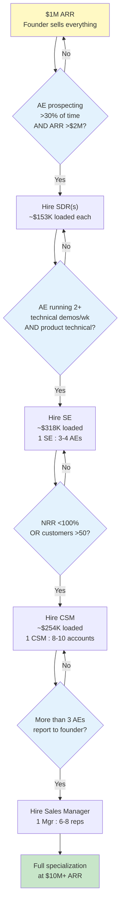

### Direct Answer

Introduce specialized GTM roles only when a specific, measurable bottleneck appears that specialization is the proven cure for — not when an org-chart playbook says you "should." The defensible milestones for B2B SaaS are: hire SDRs at roughly **$2M ARR** (start with 1-2), split AE and Sales Engineer at **$5M+ ARR** (target 1 SE per 3 AEs), and add dedicated CSMs at **$10M+ ARR or 50+ customers** (1 CSM per 8-10 accounts or ~$2-2.5M of book). Per the Bessemer State of the Cloud 2026 dataset, founders who specialize before $2M ARR add 14-18% to operating expense without a measurable productivity lift — so the timing of the hire matters as much as the hire itself.

## TLDR

- **Specialize against a bottleneck, not a calendar.** The trigger is a quantified constraint (AE time leakage, NRR decay, demo throughput) — never an empty box on an org chart.
- **The canonical sequence is SDR -> SE -> CSM -> Sales Manager**, gated at roughly $2M, $5M, $10M ARR respectively, but every gate has a "measure first" override.
- **Each role must clear a payback test.** An SDR fully-loaded costs ~$153K and must source enough pipeline to return that within 12-15 months; a single SDR rarely pays back at $4M ARR.
- **Handoffs are a real tax.** ICONIQ data shows 38% of Series A startups that specialized before $3M ARR lost a median 10.4 NRR points within 18 months. Generalist trust compounds; over-specialized relationships fragment.
- **PLG changes the math.** In product-led motions the website does the SDR job and the product does the CSM job — pod structures can outperform classic SDR-AE-CSM by ~22% net-new-ARR-per-rep through $20M ARR.
- **De-specialization is a real and orderly process.** In a downturn, collapse roles in the order SDR -> support-tier CSM -> SE -> AE, because AEs are the closing constraint.
- **The three failure modes** boards see most: the Premature SDR Hire, the SE-as-Demo-Slave, and the CSM-as-Support-Tier-2 — all three are mis-timed or mis-scoped roles.

---

## 1. The Core Principle: Specialize Against Bottlenecks, Not Calendars

### 1.1 Why "the playbook says $2M" is a dangerous half-truth

Every venture-backed founder eventually receives the same advice from a board member or an advisor: "You're at $2M ARR — time to hire SDRs." The advice is not wrong, but it is incomplete in a way that costs real money. The $2M figure is a *median*, not a *rule*. It describes the ARR level at which the average B2B SaaS company has accumulated enough pipeline volume and enough AE close-bandwidth scarcity that an SDR becomes net-positive. It says nothing about whether *your* company has that specific scarcity.

The correct framing is diagnostic, not prescriptive. Before you hire a specialist, you must be able to point to a number — a measured, instrumented constraint — and say "this role exists to move that number." If you cannot name the number, the role is decoration. Aaron Ross, who built the outbound machine at Salesforce (CRM) and later wrote *Predictable Revenue*, made this point repeatedly: the SDR function at Salesforce was created because a specific, quantified problem existed (AEs were spending the majority of their day prospecting instead of closing), and the function was instrumented from day one. It was not created because the org chart looked sparse.

### 1.2 The cost of getting the timing wrong

Specializing too early and specializing too late both have costs, and they are asymmetric. Per the Bessemer State of the Cloud 2026 analysis, founders who add SDR/AE/SE/CSM specialization before $2M ARR add 14-18% to operating expense with no measurable productivity lift in the following four quarters. That is a pure burn-rate penalty at the exact stage of company life when burn discipline matters most — when the next round is not guaranteed and runway is the single most important survival variable.

Specializing too late has a different and subtler cost: it caps your growth rate. A founder who personally runs every demo at $8M ARR is a human bottleneck; the company grows only as fast as that one person's calendar. The late-specialization penalty does not show up as a line item — it shows up as a growth-rate ceiling that the board notices two quarters later when the net-new-ARR curve flattens.

| Timing error | Primary symptom | Where it shows up | Typical magnitude |
|---|---|---|---|
| **Specialize too early** | OpEx bloat, idle specialists | Burn rate, runway months | +14-18% OpEx (Bessemer 2026) |
| **Specialize too late** | Founder/AE bottleneck | Net-new-ARR growth rate | Growth-rate ceiling 1-2 quarters out |
| **Specialize in wrong order** | Role starvation, churn | Specialist 7-12 month attrition | $200-400K sunk per mis-hire |
| **Specialize without instrumentation** | Cannot prove ROI | Board QBR, renewal of headcount budget | Headcount freeze, credibility loss |

### 1.3 The diagnostic question for every role

For each of the four specialist roles, there is one diagnostic question. If the answer is yes, the role is justified; if the answer is "I'm not sure," you are not ready.

- **SDR:** Are your AEs provably spending more than 30% of their working time on cold outbound, *and* is ARR above ~$2M?
- **Sales Engineer:** Are your AEs running multiple technical demos per deal, *and* is your product technical enough that a non-specialist demo loses deals?
- **CSM:** Has NRR dropped below 100% *or* has customer count crossed ~50, *or* is expansion ARR a named growth lever that nobody owns?
- **Sales Manager:** Do more than 4-5 quota-carrying reps report directly to one person (founder or VP)?

Notice that every diagnostic is a measurement, not a milestone. The ARR figures are *secondary gates* — necessary but not sufficient. The bottleneck is the *primary gate*.

---

## 2. The Specialization Timeline With Fully-Loaded Cost

### 2.1 Stage one — $1-2M ARR: founder-led, maybe one AE

At $1-2M ARR the correct GTM structure is almost no structure at all. The founder prospects, the founder demos, the founder negotiates, and the founder manages renewals. If a single AE has been hired, that AE is a full-cycle generalist who does exactly what the founder does. There is no SDR, no SE, and no CSM.

The reason is not frugality for its own sake — it is information. At this stage the company has not yet learned its own sales motion well enough to specialize it. You cannot write a job description for an SDR until you know which prospecting channels work, which messaging converts, and what a qualified opportunity actually looks like. You cannot scope an SE role until you know which technical objections recur. The founder-led stage is a learning stage; specializing during it is like hiring a factory line before you have a product spec.

**Fully-loaded incremental cost:** $0 in specialist headcount. The cost is founder time, which is the most expensive and most constrained resource in the company — but it is a cost the company is already paying.

### 2.2 Stage two — $2-5M ARR: add SDRs

This is the first true specialization. The trigger is observable: the founder (and the one or two AEs) are now spending so much time on top-of-funnel prospecting that closing capacity is being starved. Hire 1-2 SDRs, scaled to roughly one SDR per $2M of incremental ARR you intend to add.

The AE and the founder still close. There is still no SE — the AE handles both discovery and demo. There may be a half-FTE person, often a founder or an early CS-minded hire, informally managing renewals and support.

Per the Bridge Group SDR Report, the 2026 median SDR compensation is approximately **$84K base + $34K variable = $118K OTE**, which fully loaded at a 1.3x multiplier (benefits, tooling, ramp, management overhead) lands at roughly **$153K per SDR per year**. The same report puts median SDR-sourced pipeline at about **$1.07M annually**. The payback math: at a 20%+ AE close rate on SDR-sourced pipeline, an SDR returns its cost in roughly nine months — but that is only true once the SDR is ramped and only if the close rate clears the benchmark.

### 2.3 Stage three — $5-10M ARR: add the Sales Engineer, formalize CSM

At $5-10M ARR two things happen at once. First, if your product is technical, AEs are now losing deals (or burning excessive cycles) on technical demos and diligence — that is the SE trigger. Hire one SE per three to four AEs. The SE owns demos, proof-of-concept design, security questionnaires, and technical co-selling.

Second, your customer base has grown large enough that renewals and expansion can no longer be a side-of-desk activity. If customer count exceeds ~50 or NRR is softening, formalize the CSM role with two to four CSMs depending on account count.

Per the Pavilion Compensation Report, the 2026 median AE OTE is approximately **$295K on a 50/50 base/variable split**, fully loaded around **$383K**. The median SE OTE is approximately **$245K on a 75/25 split**, fully loaded around **$318K**. Crucially, demo-stage productivity rises roughly 40% when a dedicated SE owns the technical demo rather than a stretched generalist AE — that productivity delta is the SE's payback engine.

### 2.4 Stage four — $10M+ ARR: full specialization

Above $10M ARR the full functional org becomes correct: SDRs feeding segment-aligned AEs supported by SEs, and a Customer Success organization split into CSM, Support, and Onboarding sub-functions. Sales Engineering itself may further specialize into pre-sales demo, implementation, and partner engineering.

Per Gainsight CSM benchmarks, the median CSM book at this stage is roughly **$2.5M ARR** with an OTE near **$195K** (fully loaded ~$254K). At $10M ARR a company typically supports 3-4 SDRs, ~8 AEs, 3-4 SEs, 5-8 CSMs, and 2 sales managers.

| ARR stage | SDR | AE | SE | CSM | Manager | Dominant constraint |
|---|---|---|---|---|---|---|
| **$1-2M** | 0 | 0-1 (founder) | 0 | 0 | 0 | Learning the motion |
| **$2-5M** | 1-2 | 2-3 | 0 | 0-1 | 0-1 | AE prospecting load |
| **$5-10M** | 2-3 | 3-5 | 1 | 2-4 | 1 | Technical demo + renewals |
| **$10M+** | 3-4 | 8 | 3-4 | 5-8 | 2 | Span of control + segments |

---

## 3. The Decision Tree: Which Role Comes Next

### 3.1 The ordered logic

When you have decided that *something* needs to specialize, the next question is *which* role. The answer follows an ordered decision tree. Walk it top to bottom and stop at the first "yes."

- **Is cold outbound more than 30% of AE time, and is ARR above $2M?** Hire an SDR. Validate within 90 days against the ~$1.07M annual pipeline benchmark, ramp-adjusted.
- **Is the AE running more than two technical demos per week per deal, and is the product genuinely technical?** Hire an SE. Track demo-to-close lift; target a productivity gain north of 40%.
- **Is NRR below 100%, or is customer count above 50?** Hire a CSM. Scope the role explicitly to expansion ARR — not to support tickets.
- **Do more than three AEs report directly to the founder?** Hire a sales manager. Span of control breaks above 4-5 direct reports.
- **None of the above?** Do not hire. The single most common and most expensive mistake is hiring because the org chart looks empty.

### 3.2 Visualizing the specialization path

### 3.3 Why this order and not another

Founders often want to hire the CSM first because churn feels existential and emotionally urgent. Resist that instinct unless NRR is genuinely the binding constraint. The default order — SDR, then SE, then CSM, then Manager — reflects where the *growth* bottleneck sits at each stage. Early on, the constraint is pipeline volume (SDR). Next it is conversion quality on technical deals (SE). Then it is retention and expansion at scale (CSM). Finally it is management bandwidth (Manager). Hiring out of order means hiring a specialist for a problem you do not yet have, while leaving the problem you *do* have unaddressed.

The exception that proves the rule: a company with a low-touch, high-velocity transactional motion and a product that is genuinely simple may never need an SE at all, and may need a CSM before an SDR if the motion is renewal-heavy. The decision tree is a default, not a law — and that is exactly the point of this entire entry.

---

## 4. Specialization Payback Math: Worked Examples

### 4.1 The SDR payback test at $4M ARR

Consider a company at $4M ARR with two generalist AEs, each carrying a $2M quota. The founder is considering a first SDR hire. The fully-loaded cost is ~$153K. To "pay back" in year one, the SDR must generate net-new booked ACV that exceeds that cost after accounting for ramp and close rates.

Walk the arithmetic. The SDR sources ~$1.07M of pipeline at the Bridge Group median — but only after ramping, so year-one effective pipeline is closer to $750-850K. At a 20% AE close rate, that converts to roughly **$150-170K of booked ACV** in year one. Against a $153K cost, the SDR is approximately break-even in year one — *not* clearly net-positive.

| Input | Value | Source / basis |
|---|---|---|
| SDR fully-loaded cost | $153K | Bridge Group + 1.3x multiplier |
| Median annual SDR pipeline | $1.07M | Bridge Group SDR Report |
| Year-one ramp-adjusted pipeline | ~$800K | 75% of mature, ramp curve |
| AE close rate on SDR pipeline | 20% | Benchmark median |
| Year-one booked ACV | ~$160K | $800K x 20% |
| Year-one net of cost | ~+$7K | Roughly break-even |

**Conclusion:** A single SDR does not clearly pay back in year one at $4M ARR unless the AE close rate is meaningfully above the 20% benchmark. The better moves are to wait until $5M ARR, or to hire two SDRs sharing the AE bandwidth so the second-year compounding is stronger.

### 4.2 The SE payback test at $6M ARR

The SE payback runs on a different engine — win-rate and deal-size lift, not pipeline volume. At $6M ARR with four AEs, hiring one SE at ~$318K fully loaded must be justified by a win-rate improvement on technical deals.

If the SE lifts win rate on technical deals from 22% to 27% (a 5-point lift, consistent with the ~40% demo-productivity figure when translated to outcomes), and technical deals represent $4M of the $6M pipeline, the incremental booked ARR is roughly **$200K**, plus a typical 8-12% ACV uplift from better technical scoping — another ~$120K. Total ~$320K against a $318K cost: the SE pays back in year one when the product is genuinely technical.

| Input | Value | Basis |
|---|---|---|
| SE fully-loaded cost | $318K | Pavilion median + 1.3x |
| Technical pipeline covered | $4M | Of $6M total |
| Win-rate lift (technical deals) | +5 pts (22%->27%) | SE demo productivity translated |
| Incremental booked ARR from win rate | ~$200K | $4M x 5 pts |
| ACV uplift from technical scoping | ~$120K | 8-12% on closed deals |
| Year-one net of cost | ~+$200K | Clearly positive |

### 4.3 The CSM payback test at $11M ARR

The CSM payback runs on NRR. At $11M ARR with NRR at 101%, a CSM that lifts NRR by 6 points (to 107%) generates roughly **$660K of incremental retained-plus-expansion ARR** in the first full year. Against a $254K fully-loaded cost — and even against two CSMs at ~$508K — the payback is decisive *if* the CSM is scoped to expansion rather than to support triage.

The recurring failure here is scoping: a CSM put on a ticket queue moves NRR by approximately zero, and then the role looks like a cost center at the next board QBR. Scope to expansion ARR or do not hire the role.

---

## 5. Staffing Ratios: The Proven Benchmarks

### 5.1 The ratio table

Specialization is not only about *when* — it is about *how many*. Hiring one SDR and four AEs creates a starved SDR; hiring four SDRs and one AE creates a pipeline glut nobody can close. The ratios below are the medians that hold across well-instrumented B2B SaaS organizations.

| Role | Ratio | Headcount at $10M ARR | Median fully-loaded cost | Payback engine |
|---|---|---|---|---|
| **SDR** | 1 SDR : 3-4 AEs | 3-4 SDRs | ~$153K | Pipeline volume |
| **Sales Engineer** | 1 SE : 3-4 AEs | 3-4 SEs | ~$318K | Win rate + ACV uplift |
| **AE** | ~8 AEs per $10M ARR | 8 AEs | ~$383K | Booked ACV |
| **CSM** | 1 CSM : 8-10 accounts (~$2.5M book) | 5-8 CSMs | ~$254K | NRR / expansion |
| **Sales Manager** | 1 Mgr : 6-8 reps | 2 managers | ~$442K | Coaching leverage |

### 5.2 How to read the ratios when reality is messy

The ratios assume an "average" deal size and sales cycle. Two adjustments matter. First, **ACV scales the CSM ratio inversely**: at $250K+ ACV a CSM may carry only 15-20 strategic accounts because each requires executive-level engagement; at $15K ACV a CSM may carry 80-120 accounts in a pooled or tech-touch model. Second, **product complexity scales the SE ratio**: a deeply technical infrastructure product may need 1 SE per 2 AEs, while a simple SaaS tool may need 1 SE per 6 AEs or none at all.

The ratios are anchors, not handcuffs. The discipline they enforce is *balance* — never let one specialized function run so far ahead of its adjacent function that the handoff queue backs up. A 3-month pipeline backlog at the AE stage is just as much waste as an idle SDR.

### 5.3 Span of control: the manager ratio

The sales-manager ratio deserves its own note because founders systematically violate it. Span of control breaks above 4-5 direct reports for a player-coach and 6-8 for a dedicated manager. Above that, coaching collapses into status-checking, one-on-ones get skipped, and the lowest-performing third of the team gets no attention. When the founder has more than three AEs reporting directly, the founder is the bottleneck — and a founder-as-bottleneck is invisible on the org chart but very visible in the ramp metrics of new reps.

---

## 6. Real Operators and What Their Org Designs Teach

### 6.1 The hyper-scaled specialists

Frank Slootman, who ran Data Domain, ServiceNow (NOW), and then Snowflake (SNOW) as CEO, is the canonical "amp it up" operator — and his consistent lesson is that specialization should be aggressive *once the motion is proven*, not before. Snowflake's go-to-market under Slootman ran a highly specialized model (segmented AEs, dedicated SEs, a large sales-engineering org) because the consumption-based motion and technical product genuinely required it. The lesson is not "specialize hard" in the abstract — it is "specialize hard once the unit economics are proven and the product demands it."

Mark Roberge, who scaled HubSpot (HUBS) revenue from roughly $0 to $100M as CRO and later wrote *The Sales Acceleration Formula*, is the data-driven counterpoint. Roberge's HubSpot famously instrumented every stage of the funnel before specializing it — the SDR-AE handoff at HubSpot was governed by a service-level agreement with measured lead quality, precisely so the handoff tax could be quantified and managed rather than ignored.

| Operator | Company (ticker) | Org-design lesson |
|---|---|---|
| **Frank Slootman** | Snowflake (SNOW), ServiceNow (NOW) | Specialize aggressively once unit economics and product complexity justify it |
| **Mark Roberge** | HubSpot (HUBS) | Instrument every handoff with an SLA before you create the handoff |
| **Aaron Ross** | Salesforce (CRM) | The SDR function exists to solve a measured AE-time problem |
| **Carl Eschenbach** | Workday (WDAY), ex-VMware | Sales discipline scales through clear role definition and forecast rigor |
| **Yamini Rangan** | HubSpot (HUBS) | The "flywheel" reframes CSM as a growth function, not post-sale support |

### 6.2 The PLG operators who broke the textbook

Not every successful company followed the SDR-AE-SE-CSM script. The PLG generation — companies whose products acquire and expand users without a human in the loop — deliberately under-specialized. The lesson from operators in this camp is that the website *is* the SDR and the product *is* the CSM for a meaningful slice of the customer base. Where Atlassian (TEAM) historically ran with almost no traditional outbound sales force at all through significant scale, the "specialization" debate looks entirely different: the question is not when to add an SDR but whether to add one at all.

The takeaway from juxtaposing these two camps: the right specialization design is *motion-dependent*. A sales-led, high-ACV, technical-product company should follow the classic timeline closely. A product-led, low-ACV, self-serve company should treat the classic timeline as a menu, not a recipe — and may correctly skip entire roles.

### 6.3 What the operators agree on

Despite the camps, there is a consensus. Every credible operator agrees on three things. First, **instrument before you specialize** — you cannot manage a handoff you do not measure. Second, **a role must have a number it owns** — a specialist with no owned metric becomes a cost center. Third, **the founder's job is to design themselves out of the bottleneck** — the entire point of specialization is to remove the founder as the single-threaded constraint, in an order that matches where the constraint actually sits.

---

## 7. The Counter-Case: When This Advice Does NOT Apply

### 7.1 Counter-Case A — the PLG / self-serve motion

The entire SDR-AE-SE-CSM framework assumes a sales-led motion where humans source, qualify, demo, close, and renew. In a genuine product-led motion, large parts of that framework are obsolete. The Crunchbase 2025 Series A teardown found that PLG-led startups running pod structures — one generalist closer, one product specialist, one success owner — outperformed traditional SDR-AE-CSM peers by roughly 22% on net-new ARR per rep through $20M ARR. In a self-serve motion the SDR's job is done by the website and onboarding flow, and much of the CSM's job is done by in-product engagement and lifecycle automation. If your motion is product-led, do not force the classic timeline; design pods and skip the roles the product already performs.

### 7.2 Counter-Case B — high-ACV, low-volume enterprise

At the opposite extreme — six-figure-plus ACV, a customer count below 30, long multi-stakeholder cycles — over-specializing fragments the customer relationship destructively. The ICONIQ Growth State of SaaS data showed 38% of Series A startups that specialized SDR/AE/CSM before $3M ARR saw NRR drop a median of 10.4 points within 18 months (from ~118% to ~107.6%). A customer who has talked to an SDR, then an AE, then a CSM has three shallow relationships instead of one deep one. When ACV is high and customer count is low, generalist full-cycle reps who own the entire lifecycle compound trust in a way a relay team cannot. Stay generalist longer than the textbook says.

### 7.3 Counter-Case C — pre-product-market-fit companies

If the company has not found product-market fit, specialization is actively harmful regardless of ARR. A company can stumble to $2M ARR on founder hustle and a handful of non-repeatable deals without having a repeatable motion. Specializing that motion freezes a process that should still be fluid. The signal of pre-PMF is non-repeatability: every deal looks different, win/loss has no pattern, and the founder cannot articulate the ideal customer profile in one sentence. In that state, hire generalist athletes who can absorb chaos — not specialists who need a defined lane.

### 7.4 Counter-Case D — services-heavy or hybrid revenue models

Companies whose revenue is materially services or implementation — not pure recurring software — have a different role taxonomy. The "SE" may really be a delivery consultant; the "CSM" may really be an account director who owns a P&L. Forcing SaaS role names onto a services-inflected business creates titles that do not match the work. Design roles around the actual revenue mechanics, not around a SaaS org chart borrowed from a different business model.

| Counter-case | Why the classic timeline fails | What to do instead |
|---|---|---|
| **PLG / self-serve** | Website and product do SDR/CSM work | Pod structure; skip roles the product performs |
| **High-ACV enterprise** | Handoffs fragment scarce, deep relationships | Generalist full-cycle reps; specialize later |
| **Pre-PMF** | Motion is not yet repeatable | Hire athletes; keep the process fluid |
| **Services-heavy** | Role taxonomy does not match revenue mechanics | Design roles around actual P&L and delivery |

---

## 8. When to UN-Specialize: Reverse-Specialization in a Downturn

### 8.1 Why de-specialization is a discipline, not a panic

ARR contraction events — a macro downturn, the loss of a flagship customer, a deliberate runway extension — frequently demand reverse-specialization. Founders tend to treat headcount cuts as a panic exercise: cut the most expensive people, or cut the most recent hires, or cut whoever the board names. All three heuristics are wrong because none of them is built around the closing constraint.

### 8.2 The correct order of collapse

The order in which specialized roles should be re-merged or eliminated is: **SDR -> support-tier CSM -> SE -> AE.** The logic is constraint-based. AEs are the closing constraint — they are the function that converts pipeline into revenue, and revenue is the variable a contracting company most needs to protect. Cutting AE specialization first kills pipeline conversion and accelerates the death spiral. SDRs are cut first because their output (pipeline) has the longest lag to revenue and can be partially absorbed by AEs reverting to full-cycle work.

If you are cutting more than 20% of GTM headcount, the right move is usually to re-merge SDR and AE into "full-cycle reps" until ARR recovers — which is, notably, the same generalist structure the company ran at $2M ARR. De-specialization is not failure; it is the same bottleneck-driven logic running in reverse.

| Cut order | Role | Why this position | Revenue lag of its output |
|---|---|---|---|
| **1st** | SDR | Pipeline output has longest lag; AEs can absorb | Longest (quarters) |
| **2nd** | Support-tier CSM | Triage work can pool or automate | Medium |
| **3rd** | SE | AEs can revert to generalist demos at lower win rate | Medium-short |
| **Last** | AE | The closing constraint — protect at all costs | Shortest (direct) |

### 8.3 The re-specialization trigger

When ARR recovers, do not snap back to the prior org chart automatically. Re-run the diagnostic. The bottleneck that justified the original specialization may have moved. A company that re-merged SDR+AE in a downturn and then recovers should re-specialize only when the AE-prospecting-time diagnostic again crosses 30% — not on the day the ARR number returns to its prior peak.

---

## 9. The Three Failure Modes Boards See Most

### 9.1 The Premature SDR Hire

The pattern: a founder at ~$1.5M ARR hires two SDRs because an advisor or a playbook said "$2M is SDR time" and the founder rounded down. The SDRs ramp, generate pipeline — and then starve, because the founder and the single AE do not have the close-bandwidth to work the pipeline the SDRs produce. Pipeline ages, conversion drops, the SDRs see their numbers stall through no fault of their own, and they churn within seven months. Typical damage: roughly $306K in fully-loaded cost for two SDRs against perhaps $450K of pipeline that was never adequately worked. The fix is timing: do not hire the SDR until AE close-bandwidth genuinely exists to consume the output.

### 9.2 The SE-as-Demo-Slave

The pattern: an SE is correctly hired at $5M ARR, but is then reduced to a demo-running robot rather than a technical co-seller. The SE shows the same canned demo over and over, is not brought into discovery, does not shape proof-of-concept design, and is not in the room for technical objection handling. Win rate moves less than two points, the SE burns out within twelve months, and the next board QBR questions whether the SE role was worth it. The fix is scope: the SE must be a co-seller embedded in discovery and POC design, with an owned win-rate metric — not a presentation utility.

### 9.3 The CSM-as-Support-Tier-2

The pattern: a CSM is hired before NRR is genuinely the binding constraint, often out of churn anxiety. With no expansion mandate, the CSM drifts into being a second tier of support — handling tickets, fielding escalations, doing QBRs that are really status meetings. Expansion ARR does not move, churn stays flat, and the role looks like pure cost. The fix is twofold: hire the CSM only when NRR or customer count genuinely crosses the threshold, and scope the role explicitly to expansion ARR with an owned NRR target.

| Failure mode | Root cause | Typical cost | The fix |
|---|---|---|---|
| **Premature SDR Hire** | Mis-timed (hired before AE bandwidth) | ~$306K sunk, 7-month attrition | Wait for real AE close-bandwidth |
| **SE-as-Demo-Slave** | Mis-scoped (utility, not co-seller) | <2-pt win rate, 12-month burnout | Embed in discovery; own win rate |
| **CSM-as-Support-Tier-2** | Mis-timed and mis-scoped | NRR flat, role reads as cost center | Hire at real NRR trigger; scope to expansion |

### 9.4 The common thread

All three failure modes share one root: a role created by calendar or anxiety rather than by a measured bottleneck, and then under-scoped because nobody defined the number it owns. This is the same principle from Section 1, observed in the wild. A specialist hired against a real, instrumented constraint and given an owned metric almost never becomes one of these failure cases.

---

## 10. Instrumenting the Handoffs So Specialization Pays Off

### 10.1 The handoff is where specialization leaks value

Specialization creates handoffs, and handoffs are where value leaks. The SDR-to-AE handoff, the AE-to-SE handoff, the AE-to-CSM handoff — each is a seam where context can be lost, where accountability can blur, and where the customer can feel passed around. The companies that specialize successfully are not the ones that avoid handoffs; they are the ones that *instrument* handoffs with explicit service-level agreements and shared metrics.

### 10.2 The SDR-to-AE SLA

The single most important handoff to instrument is SDR-to-AE. The SLA should define, in writing: what qualifies a lead for handoff (the qualification criteria), how fast the AE must act on a handed-off lead (the response-time commitment), and what feedback loop returns lead-quality data to the SDR. Without this SLA, SDRs and AEs blame each other — SDRs say AEs do not work the leads, AEs say SDRs send junk — and the handoff tax compounds invisibly. With it, the tax is measured and managed.

| Handoff | Key SLA term | Failure symptom if uninstrumented |
|---|---|---|
| **SDR -> AE** | Qualification criteria + AE response time | SDR/AE blame cycle; aged leads |
| **AE -> SE** | When SE enters the deal; what SE owns | SE pulled in too late; lost technical deals |
| **AE -> CSM** | Handoff at signature; expansion ownership | Customer feels dropped post-sale; NRR decay |
| **CSM -> Support** | Escalation threshold; ownership boundary | CSM becomes Tier-2 support |

### 10.3 Shared metrics over siloed metrics

The deepest fix for handoff leakage is shared metrics. If the SDR is measured purely on meetings booked and the AE purely on closed revenue, the SDR is incentivized to book low-quality meetings. If instead the SDR carries a *sourced-pipeline-that-closes* metric, the SDR's incentive aligns with the AE's. The same logic applies across every seam: the AE and CSM should share an expansion metric; the AE and SE should share a technical-deal win-rate metric. Shared metrics turn a relay race into a team sport.

---

## 11. A 90-Day Validation Plan for Every New Specialist

### 11.1 Why every specialist hire needs a validation window

Specialization is an experiment, and experiments need a measurement window. Every specialist hire should come with a 90-day validation plan defined *before* the offer is signed. The plan answers one question: at day 90, what number proves this role is working?

### 11.2 The validation targets by role

| Role | Day-30 leading indicator | Day-90 validation target | Kill / persist decision |
|---|---|---|---|
| **SDR** | Activity volume + meeting set rate | Ramp-adjusted pipeline tracking toward ~$1.07M annualized | Persist if >70% of benchmark |
| **SE** | Demo coverage + discovery participation | Win-rate lift on technical deals trending positive | Persist if >3-pt lift trajectory |
| **CSM** | Account coverage + QBR completion | Expansion pipeline created; NRR trend positive | Persist if expansion pipeline >2x cost |
| **Sales Manager** | One-on-one cadence; forecast accuracy | New-rep ramp time improving; forecast variance shrinking | Persist if ramp time improves >15% |

### 11.3 Honesty in the validation

The validation plan only works if the founder is honest at day 90. The temptation, having spent $150-380K and several months, is to rationalize a struggling role rather than confront it. The discipline is to treat the validation target as a genuine decision gate. A role that misses its day-90 target may need re-scoping rather than elimination — but the founder must name explicitly whether the problem is the person, the scope, or the timing, and act on that diagnosis rather than drifting.

---

## 12. Putting It Together: The Specialization Operating System

### 12.1 The full sequence

The complete specialization operating system, from $1M to $10M+ ARR, is a loop: diagnose the bottleneck, confirm the secondary ARR gate, run the payback math, hire against a 90-day validation plan, instrument the new handoff with an SLA and shared metrics, then re-diagnose. It is not a one-time org-chart event; it is a recurring management discipline.

### 12.2 The single sentence to remember

If you remember one sentence from this entry, make it this: **specialize when your bottleneck is provably a function that specialization solves — and never because the playbook, the board, or the empty org chart says you should.** The playbook gives you the median; your instrumentation tells you the truth. The Bear-case camps — the Specialize-Late camp and the Pod-Forever camp — are not wrong so much as they are reminders that the textbook timeline is a default for a specific motion, and that survivorship bias hides in every "best practice." The honest read sits in the middle: the classic timeline is the right default for a sales-led, technical, mid-to-high-ACV B2B SaaS company, and it should be bent or broken deliberately, with eyes open, for every motion that does not match that profile.

### 12.3 The board-meeting test

A final, practical heuristic. Before you open a specialist headcount requisition, imagine defending the hire at your next board meeting. If you can state, in one sentence, the measured bottleneck the role solves, the payback math, and the 90-day validation target, the hire is ready. If you find yourself saying "we're at the ARR level where you're supposed to have one," the hire is not ready — go find the number first.

---

## 13. Role-by-Role Deep Dive: What Each Specialist Actually Owns

### 13.1 The SDR — pipeline manufacturing, not appointment-setting

The most common misunderstanding of the SDR role is that an SDR's job is to "set meetings." That is the *output*, not the *job*. The job is pipeline manufacturing: building a repeatable, instrumented process that turns a defined target market into a predictable flow of qualified opportunities. The distinction matters because it changes who you hire, how you measure them, and how you scope the role.

An SDR scoped as an appointment-setter is measured on dials, emails sent, and meetings booked — pure activity. An SDR scoped as a pipeline manufacturer is measured on *sourced pipeline that converts*, with activity treated as a leading indicator rather than the goal. The first scope produces a churn-and-burn function where SDRs game the meeting metric by booking low-intent prospects; the second produces a function whose incentives align with revenue. When Aaron Ross built the model at Salesforce (CRM), the entire point was to separate the prospecting *specialty* from the closing *specialty* so each could be optimized — but the prospecting specialty was still owned end-to-end by the SDR, including research, sequencing, messaging, and qualification.

The SDR career path is also a specialization design decision. The best-run organizations treat the SDR role as a 12-18 month apprenticeship that feeds the AE bench. That has two consequences for specialization timing. First, it means the SDR ratio should account for predictable internal promotion — you are not just staffing a function, you are running a farm system. Second, it means the SDR-to-AE handoff is not just a deal handoff but a *talent pipeline*, and the same person will eventually sit on both sides of it, which is a powerful reason to instrument the handoff well.

### 13.2 The AE — the closing constraint and the gravitational center

The Account Executive is the gravitational center of the entire GTM org. Every other role exists, ultimately, to make AEs more productive: SDRs feed them pipeline, SEs make their technical deals win, CSMs protect and expand what they close, managers coach them. This is why, in the de-specialization order of Section 8, the AE is cut last — the AE is the function that directly converts effort into recognized revenue.

The AE role itself specializes as the company scales. At $2-5M ARR the AE is a full-cycle generalist. By $10M+ ARR the AE function has typically sub-specialized along at least one axis: by segment (SMB AE, mid-market AE, enterprise AE), by motion (new-business AE vs. expansion AE), or by geography. Each sub-specialization follows the same bottleneck logic as the original SDR/SE/CSM decisions — you split AEs by segment when the segments have provably different sales cycles, deal sizes, and buying processes, not when the headcount simply gets large.

A subtle AE-specialization trap is the "enterprise AE too early" mistake. Founders, eager to move upmarket, hire a polished enterprise AE at $3M ARR before the company has enterprise references, enterprise security posture, or an enterprise-grade product. The enterprise AE then spends a year unable to close because the company is not enterprise-ready — a $383K mis-hire that looks like a sales-talent problem but is actually a company-readiness problem. The diagnostic is the same as always: do not specialize the AE into enterprise until the bottleneck is provably "we have enterprise demand we cannot serve," not "we wish we had enterprise demand."

### 13.3 The Sales Engineer — technical trust, not slide-clicking

The Sales Engineer is the most frequently mis-scoped role in B2B SaaS, which is why the SE-as-Demo-Slave failure mode (Section 9.2) is so common. The SE's actual job is to manufacture *technical trust*: to be the person in the room whose technical credibility lets a skeptical buyer believe the product will actually work in their environment. Running the demo is one expression of that job; it is not the job.

A correctly scoped SE participates in discovery (so the demo is tailored, not canned), designs and runs proof-of-concept engagements, owns the security and compliance questionnaire response, handles deep technical objections, and serves as the credible technical voice that an AE — who is a generalist — cannot be. The SE's owned metric is win rate on technical deals, plus often a proof-of-concept-to-close conversion rate. When a company measures the SE on "demos delivered," it has recreated the demo-slave failure mode by metric design.

The SE function also has a hidden role in product feedback. Because SEs sit at the technical coalface of every competitive deal, they are the single best early-warning system for product gaps. A well-run org gives the SE function a formal channel into product management — which is another reason the SE should not be buried as a demo utility. Carl Eschenbach's tenure scaling VMware's go-to-market is often cited for exactly this discipline: technical sellers were treated as a strategic function with a voice, not as a presentation pool.

### 13.4 The CSM — expansion ownership, not churn-firefighting

The Customer Success Manager role carries the most scope ambiguity of any GTM specialist, because "customer success" can mean anything from a renewals desk to a support escalation tier to a genuine expansion-revenue function. The specialization decision is not just *when* to hire a CSM but *which CSM role* you are creating.

The version that pays back — and the version this entry recommends — is the CSM as expansion owner. This CSM carries a net-revenue-retention number, owns the expansion pipeline within the existing customer base, runs genuine business reviews that surface expansion opportunities, and treats renewals as the floor rather than the goal. Yamini Rangan's articulation of the HubSpot (HUBS) "flywheel" reframed customer success precisely this way: post-sale is not a cost center protecting revenue but a growth engine generating it. The fully-loaded ~$254K cost of a CSM is justified only against expansion ARR; measured against tickets closed, the CSM will always look like overhead.

There is a legitimate non-expansion CSM model — the tech-touch or pooled CSM for low-ACV, high-volume customer bases — but that model is explicitly an efficiency play, staffed at much higher account ratios (80-120 accounts) and instrumented around adoption and renewal rather than expansion. The mistake is not having a pooled model; the mistake is hiring a high-cost dedicated CSM and then operating them as if they were a pooled tech-touch resource.

| Role | The job (correctly framed) | The job (mis-scoped) | Owned metric |
|---|---|---|---|
| **SDR** | Pipeline manufacturing | Appointment-setting | Sourced pipeline that converts |
| **AE** | Converting pipeline to revenue | "Carrying a number" generically | Booked ACV, win rate |
| **SE** | Manufacturing technical trust | Running canned demos | Technical-deal win rate, POC conversion |
| **CSM** | Expansion ownership | Support escalation tier | Net revenue retention, expansion ARR |
| **Manager** | Coaching leverage | Status-meeting facilitation | Team attainment, new-rep ramp time |

---

## 14. Specialization and Compensation Design

### 14.1 Why comp design and specialization are the same decision

You cannot separate the decision to create a specialized role from the decision of how to compensate it. A role's compensation plan *is* its scope, expressed in dollars. If you hire a CSM to drive expansion but pay them a flat salary with no expansion-linked variable, you have scoped them as a salaried account-manager regardless of the title on the org chart. The comp plan tells the specialist what the company actually wants — and specialists optimize for what they are paid for, not for what the job description says.

### 14.2 The four comp archetypes

Each specialized role has a comp archetype that matches its function. Per the Pavilion Compensation Report and Bridge Group data, the 2026 medians cluster as follows.

| Role | OTE split (base/variable) | 2026 median OTE | Variable tied to |
|---|---|---|---|
| **SDR** | ~70/30 | ~$118K | Qualified meetings + sourced pipeline conversion |
| **AE** | ~50/50 | ~$295K | Booked ACV against quota |
| **SE** | ~75/25 | ~$245K | Team/deal win rate; shared with AE |
| **CSM** | ~75/25 to 80/20 | ~$195K | Net revenue retention, expansion ARR |
| **Sales Manager** | ~60/40 | ~$320K+ | Team aggregate attainment |

The pattern is instructive. The closer a role sits to the moment of revenue recognition, the more aggressive (lower base, higher variable) the split: the AE is 50/50 because the AE directly closes. Roles whose contribution is real but more diffuse — SE, CSM — carry a higher base because pinning their entire income to a number they only partly control would create perverse incentives or unmanageable income volatility.

### 14.3 The shared-component design

The most important comp-design choice in a specialized org is where to place *shared* variable components. An SE whose entire variable comp is individual creates an SE who optimizes for personal deal selection; an SE whose variable is partly tied to the win rate of the AE pod they support creates an SE who behaves as a team player. The same is true of the SDR-AE seam: a small shared component, where the SDR earns a kicker on closed revenue from their sourced pipeline, aligns the SDR with deal quality rather than meeting quantity.

The risk of shared comp is dilution of accountability — if everyone shares everyone's number, nobody owns anything. The discipline is to keep the *majority* of each role's variable tied to its own owned metric, and to use a *minority* shared component as the alignment glue across the handoff. As a rough guide, an 80/20 split between owned and shared variable preserves accountability while still purchasing cross-functional cooperation.

### 14.4 Comp design as a de-specialization tool

When a company reverse-specializes in a downturn (Section 8), comp design must move in lockstep. A "full-cycle rep" created by re-merging an SDR and AN AE needs a comp plan that pays for both prospecting and closing — typically a blended plan closer to the AE 50/50 archetype but with explicit recognition of self-sourced pipeline. Founders who re-merge roles but leave the old comp plans in place create reps who are paid as closers but expected to prospect, and the prospecting simply does not happen. The org chart and the comp plan must always tell the same story.

---

## 15. Geography, Remote Work, and Specialization

### 15.1 How distributed teams change the specialization calculus

The classic specialization timeline was largely written in an era of co-located sales floors, where the SDR sat ten feet from the AE and the handoff happened over a desk. Distributed and remote-first GTM teams change two things about specialization, and both are easy to miss.

First, **the handoff tax is higher in a distributed org**. The informal context transfer that happened naturally when an SDR and AE shared a wall does not happen by default over Slack and Zoom. This means a remote-first company must instrument its handoffs (Section 10) earlier and more rigorously than a co-located one — the SLA is not optional, it is the only mechanism keeping the seam from leaking. A remote company that specializes without instrumented handoffs gets the OpEx cost of specialization with a worse-than-co-located version of the handoff tax.

Second, **distributed teams enable a wider talent pool, which can change the ratio math**. A co-located company is constrained to hire SEs in its headquarters metro; a distributed company can hire SEs wherever the talent is, which can lower the fully-loaded cost and make the SE specialization viable slightly earlier. The cost-of-living adjustment is real: an SE in a lower-cost metro may be fully loaded at $250K rather than $318K, which moves the payback math.

### 15.2 Time-zone specialization as a hidden axis

For companies selling internationally, time zone becomes a specialization axis that the classic SDR-AE-SE-CSM framework does not name. A company at $8M ARR with meaningful EMEA and APAC revenue may need to specialize its SDR and AE functions by region not because the segments differ but because a single time zone cannot cover the working hours of three continents. This is a legitimate specialization driven by a real, measurable bottleneck — pipeline in a region going unworked because nobody is awake — and it follows exactly the same diagnostic discipline. The trap is specializing by geography for prestige ("we have a London office") rather than for the measured coverage bottleneck.

| Team model | Effect on handoff tax | Effect on ratio / cost | Specialization implication |
|---|---|---|---|
| **Co-located** | Lower (informal context transfer) | HQ-metro cost floor | Classic timeline applies cleanly |
| **Remote-first** | Higher (must instrument seams) | Wider pool, lower cost possible | Instrument handoffs earlier; SE viable slightly sooner |
| **Multi-region** | Higher (time-zone seams) | Region-specific cost bases | Geography becomes a real specialization axis |

---

## 16. Common Questions Founders Ask About Specialization Timing

### 16.1 "Should I hire a VP of Sales before I specialize?"

This is one of the most consequential sequencing questions, and the answer is usually no — not until the motion is repeatable. A VP of Sales is hired to *scale* a working motion, not to *find* one. Hiring a VP before product-market fit and a repeatable sales process is a classic and expensive mistake: the VP arrives expecting a machine to optimize and instead finds chaos to wrestle, the relationship sours within a year, and the company has burned an executive-level salary and a year of momentum. The right sequence is: founder finds the motion, founder hires the first two or three AEs and proves the motion is repeatable, *then* the company hires a VP (or a first-line manager) to scale it. The VP-of-Sales decision is itself a specialization decision and obeys the same bottleneck logic — hire the VP when the bottleneck is provably "the founder cannot manage and coach the growing team," not when the headcount simply looks like it needs a leader.

### 16.2 "Can I hire a generalist who specializes later?"

Yes, and this is often the smartest move at the boundary stages. A talented full-cycle generalist hired at $3M ARR can become a specialized AE at $5M and a segment-specialized enterprise AE at $10M — growing into specialization as the company grows into it. This is the "athlete" hiring philosophy: at uncertain stages, hire adaptable people over narrow specialists, because the role they need to play will change underneath them. The constraint is that genuine specialists — a deep enterprise SE, a true expansion CSM — are hard to grow from generalists and usually must be hired as specialists once the bottleneck is clear. The rule of thumb: hire athletes for roles that will evolve, hire specialists for roles whose shape is already known and stable.

### 16.3 "What if I specialize and it does not work — how do I unwind it?"

Unwinding a specialization is covered structurally in Section 8, but the founder-level emotional reality deserves naming. Unwinding a role feels like admitting a mistake, and founders avoid it. The reframe: specialization is an experiment, and an experiment that returns a negative result is not a failure, it is information. If a CSM hire did not move NRR after a fair 90-day-plus window, the honest move is to re-scope or unwind — and to extract the lesson (was it timing, scope, or person?) so the next attempt is better. The companies that scale well are not the ones that never mis-specialize; they are the ones that detect and correct mis-specializations fast, before the sunk cost compounds.

### 16.4 "Do these benchmarks apply outside SaaS?"

Mostly, but with translation. The $2M/$5M/$10M ARR gates and the role ratios were calibrated on B2B SaaS with recurring revenue and software-typical gross margins. A business with materially different gross margins, a different revenue-recognition model, or a heavy services component must re-derive the gates from its own unit economics rather than importing the SaaS numbers wholesale (see Counter-Case D in Section 7.4). The *principle* — specialize against a measured bottleneck, with a payback test and a validation window — is universal. The *specific numbers* are SaaS artifacts and should be treated as a starting point for your own math, not as constants.

| Founder question | Short answer | Governing principle |
|---|---|---|
| VP of Sales before specializing? | No — after the motion is repeatable | Hire to scale a working motion, not to find one |
| Hire a generalist who specializes later? | Yes for evolving roles; no for stable specialist roles | Athletes for change, specialists for known shapes |
| How to unwind a failed specialization? | Re-scope or collapse fast; extract the lesson | An experiment with a negative result is information |
| Do the benchmarks apply outside SaaS? | Principle yes, numbers no | Re-derive gates from your own unit economics |

---

## 17. The Specialization Maturity Model

### 17.1 Four maturity levels

It helps to think of GTM specialization not as a binary (specialized or not) but as a maturity curve with four recognizable levels. Locating your company on the curve clarifies what the next move should be.

- **Level 0 — Founder-Heroic.** The founder does everything. There is no specialization and no instrumentation. This is correct below ~$1-2M ARR and dangerous above it.
- **Level 1 — First Split.** SDRs (or a first AE) have been added. One handoff exists. The org is specialized but the handoff is usually not yet instrumented — this is the most fragile stage, where the handoff tax can quietly eat the gains.
- **Level 2 — Functional Org.** SDR, AE, SE, and CSM all exist as distinct functions with their own leaders or leads. Handoffs are instrumented with SLAs. This is the target state for a company in the $10-30M ARR range.
- **Level 3 — Optimized Specialization.** Functions have sub-specialized (AEs by segment, CSMs by tier), comp design encodes shared metrics across seams, and the org continuously re-diagnoses bottlenecks rather than treating the structure as fixed. This is the state of a well-run company scaling past $30M ARR.

### 17.2 The danger of skipping levels

The maturity model's main lesson is that you cannot skip levels safely. A company that jumps from Level 0 to a Level 2 functional org overnight — hiring SDRs, an SE, and CSMs in the same quarter at $3M ARR — incurs the full OpEx cost of specialization without having learned to manage a single handoff. The result is the Bessemer OpEx penalty in its purest form: 14-18% more cost, no productivity lift, and an org that does not yet know how to operate itself. Climb the curve one level at a time, instrument each new handoff before adding the next, and let each level prove itself before advancing.

| Maturity level | Description | Typical ARR | Key risk at this level |
|---|---|---|---|
| **Level 0** | Founder-heroic, no specialization | <$2M | Late-specialization growth ceiling |
| **Level 1** | First split (SDR/AE), one handoff | $2-5M | Uninstrumented handoff tax |
| **Level 2** | Full functional org, SLAs in place | $5-30M | Sub-specializing too early or too late |
| **Level 3** | Optimized, shared-metric, self-diagnosing | $30M+ | Treating structure as fixed; org rigidity |

### 17.3 Re-diagnosis as the permanent discipline

The final maturity level is not a destination but a habit: the continuous re-diagnosis of where the bottleneck sits. A Level 3 organization runs the specialization diagnostic every planning cycle, asks whether the current structure still matches the current constraint, and is willing to both specialize further and de-specialize as the data dictates. The companies that get stuck are the ones that reach a functional org and then freeze, treating the org chart as a monument rather than a living response to a moving constraint. Specialization, done well, is never finished — it is a management system that runs for the life of the company.

---

## Related Questions

- [/knowledge/q08](https://pulserevops.com/knowledge/q08) — Sales team structure fundamentals
- [/knowledge/q42](https://pulserevops.com/knowledge/q42) — When to hire your first AE
- [/knowledge/q66](https://pulserevops.com/knowledge/q66) — NRR vs GRR thresholds
- [/knowledge/q88](https://pulserevops.com/knowledge/q88) — SDR ramp time benchmarks
- [/knowledge/q120](https://pulserevops.com/knowledge/q120) — CSM coverage models
- [/knowledge/q150](https://pulserevops.com/knowledge/q150) — Pod vs traditional sales structure
- [/knowledge/q04](https://pulserevops.com/knowledge/q04) — Founder-led vs sales-led handoff
- [/knowledge/q09](https://pulserevops.com/knowledge/q09) — First sales hire compensation
- [/knowledge/q167](https://pulserevops.com/knowledge/q167) — Splitting a sales team into segment-based teams
- [/knowledge/q164](https://pulserevops.com/knowledge/q164) — Scaling from 5 reps to 25 without losing culture

## Sources

1. Bessemer Venture Partners — State of the Cloud 2026: https://www.bvp.com/atlas/state-of-the-cloud-2026
2. The Bridge Group — SDR Metrics & Compensation Report: https://www.bridgegroupinc.com/blog/sales-development-report
3. Pavilion — Compensation Report: https://www.joinpavilion.com/compensation-report
4. Gainsight — Customer Success Benchmarks: https://www.gainsight.com/customer-success/
5. ICONIQ Growth — State of SaaS / Growth & Efficiency: https://www.iconiqcapital.com/insights/state-of-saas
6. Crunchbase News — Series A GTM Teardown 2025: https://news.crunchbase.com/
7. Aaron Ross — Predictable Revenue: https://www.predictablerevenue.com/
8. Mark Roberge — The Sales Acceleration Formula: https://www.salesaccelerationformula.com/
9. Frank Slootman — Amp It Up: https://www.amazon.com/Amp-Up-Leading-Hypergrowth-Expectations/dp/1119836115
10. HubSpot Research — Sales benchmarks: https://research.hubspot.com/
11. Salesforce Investor Relations: https://investor.salesforce.com/
12. Snowflake Investor Relations: https://investors.snowflake.com/
13. ServiceNow Investor Relations: https://www.servicenow.com/company/investor-relations.html
14. SaaStr — GTM scaling benchmarks: https://www.saastr.com/
15. OpenView Partners — Product-Led Growth resources: https://openviewpartners.com/product-led-growth/
16. KeyBanc Capital Markets — SaaS Survey: https://www.key.com/businesses-institutions/industry-expertise/saas-survey.html
17. Scale Venture Partners — Scaling Sales benchmarks: https://www.scalevp.com/insights
18. RevenueCat / a16z — GTM efficiency: https://a16z.com/tag/go-to-market/
19. Insight Partners — ScaleUp:GTM: https://www.insightpartners.com/ideas/
20. Gartner — Sales Force Structure research: https://www.gartner.com/en/sales
21. Forrester — Revenue Operations research: https://www.forrester.com/research/
22. Sales Hacker — SDR/AE specialization guides: https://www.saleshacker.com/
23. RepVue — Sales role compensation data: https://www.repvue.com/
24. Glassdoor — SDR / AE / SE / CSM salary data: https://www.glassdoor.com/Salaries/
25. LinkedIn — State of Sales Report: https://business.linkedin.com/sales-solutions/b2b-sales-strategy-guides/the-state-of-sales-report
26. Winning by Design — Revenue Architecture: https://winningbydesign.com/
27. Bain & Company — Founder's Mentality / scaling: https://www.bain.com/insights/
28. McKinsey — B2B sales growth research: https://www.mckinsey.com/capabilities/growth-marketing-and-sales
29. First Round Review — Scaling GTM teams: https://review.firstround.com/
30. Tomasz Tunguz — Sales productivity benchmarks: https://tomtunguz.com/
31. Atlassian Investor Relations — PLG GTM model: https://investors.atlassian.com/
32. Pavilion — GTM Benchmarks & community research: https://www.joinpavilion.com/resources
33. Customer Success Collective — CSM ratio research: https://www.customersuccesscollective.com/

TAGS: organizational-structure, specialization, roles, scaling, team-design, arrs-milestones
