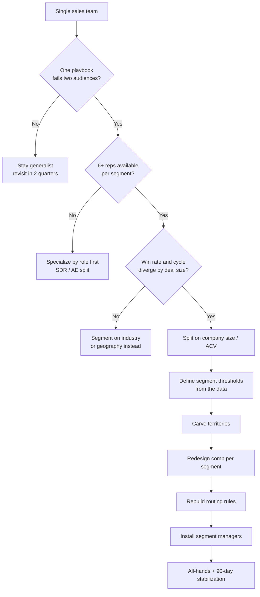

### Direct Answer

You split a single sales team into segment-based teams by first proving that two or more buyer groups inside your customer base behave differently enough to require different deal motions, then dividing reps along the cleanest dividing line you can find (usually company size or contract value), and finally rebuilding territory, quota, comp, routing, and management around each new segment so that no rep is asked to run two motions at once. Done correctly, the split raises win rates, shortens cycle times, and lifts average contract value because each rep finally gets to specialize; done prematurely or along the wrong axis, it shreds pipeline, starves the smaller segment of coverage, and triggers an attrition wave among reps who lose their best accounts. The trigger to act is operational pain, not headcount vanity: you split when a single playbook visibly fails two audiences, not when an org chart looks crowded.

**TLDR**

- **Segment, do not just slice.** A segment is a buyer group with a distinct buying process, budget authority, and decision timeline. If two groups buy the same way, do not split them.
- **The cleanest dividing line is usually company size or ACV**, because it correlates with deal complexity, cycle length, and the buyer's procurement maturity. Industry and geography are secondary axes.
- **Three canonical segments**: SMB (transactional, self-serve-adjacent, 1-call to 2-call close), Mid-Market (consultative, multi-stakeholder, 30-90 day cycle), and Enterprise (strategic, committee-driven, 6-18 month cycle).
- **Sequence the rebuild**: data and segment definition first, then territory carving, then comp redesign, then routing rules, then management layer, then the all-hands. Skipping comp or routing guarantees a relapse.
- **The expensive failure modes are**: splitting on headcount instead of buyer behavior, letting reps "keep" out-of-segment accounts, redrawing territories without re-baselining quota, and forgetting that SMB and Enterprise need different managers, not the same manager wearing two hats.
- **Expect a 60-120 day productivity dip.** Plan for it, fund it, and communicate it. Teams that pretend the dip will not happen panic in week 6 and reverse the split, which is worse than never splitting.
- **You are ready to split when** one playbook demonstrably fails two audiences, when win rate or cycle time diverges sharply by deal size, and when you have enough reps that each new segment can field a viable team (rule of thumb: 6+ reps per segment).

---

## 1. Banner: What a Segment Actually Is

### 1.1 The definition that prevents 80% of split failures

The single most expensive mistake in a sales reorg is confusing a **slice** with a **segment**. A slice is any arbitrary division of accounts: alphabetical, by ZIP code, by the day of the week a lead came in. A segment is something far more specific.

- **A segment is a buyer group with a distinct buying process.** SMB buyers often decide in a single budget cycle with one or two approvers. Enterprise buyers route the same purchase through procurement, security review, legal redline, and a steering committee.
- **A segment has distinct budget authority.** In SMB the economic buyer is frequently the user; in Enterprise the economic buyer sits two or three layers above the user and never attends a demo.
- **A segment has a distinct decision timeline.** SMB cycles run days to a few weeks; Enterprise cycles run two to four quarters. A rep cannot pace both at once without one set of deals rotting.
- **A segment has distinct risk tolerance.** SMB buyers tolerate "good enough now"; Enterprise buyers demand reference customers, SOC 2 reports, uptime SLAs, and a roadmap conversation before signing.
- **A segment values different proof.** SMB responds to a fast time-to-value story; Enterprise responds to a security, compliance, and total-cost-of-ownership story.

If you cannot articulate how two groups differ on at least three of those five dimensions, you do not have two segments. You have one segment and a vanity org chart. **The test is behavioral, not demographic.** Two 400-person companies can sit in different segments if one buys software like a startup and the other buys it like a bank.

### 1.2 Why specialization beats generalist coverage

The economic argument for segment-based teams rests on a simple, well-documented phenomenon: a rep who runs one motion repeatedly gets measurably better at it, while a rep who context-switches between motions gets worse at both.

- **Specialists compound skill.** An Enterprise AE who runs forty committee-driven deals a year develops pattern recognition a generalist running eight enterprise deals among forty mixed deals never acquires.
- **Specialists build the right network.** SMB reps live in volume tooling, fast-follow cadences, and self-serve-assist plays. Enterprise reps live in executive relationships, mutual action plans, and procurement navigation. These are different muscles.
- **Specialists let you hire to a profile.** A generalist req is a compromise candidate. A segment-specific req lets you hire the cheaper, hungrier closer for SMB and the patient, politically fluent operator for Enterprise.
- **Specialists make forecasting honest.** When every rep runs the same motion, the forecast model has one set of conversion rates and cycle lengths instead of a blurred average that fits no actual deal.
- **Specialists reduce the cost of a bad hire.** A mis-hire in a specialized segment is visible in one quarter; a mis-hire in a generalist seat hides behind the mix for a year.

This is the same logic Aaron Ross described in *Predictable Revenue* when he argued that asking one rep to prospect, close, and farm produces a rep who is mediocre at all three. Segment specialization is role specialization's twin: instead of splitting the *funnel*, you split the *buyer*.

### 1.3 The cost side of the ledger

Specialization is not free, and pretending it is causes the second-most-common reorg failure: under-funding the transition.

- **Coverage gaps appear at the seams.** Accounts that sit on a segment boundary get fought over or, worse, ignored by both teams.
- **Management overhead rises.** Two segments need two managers, two cadences of one-on-ones, two pipeline reviews, and two comp plans to maintain.
- **Tooling and content fork.** SMB needs volume sequences and lightweight decks; Enterprise needs security questionnaires, ROI models, and mutual action plan templates.
- **The org loses flexibility.** A generalist team can absorb a demand shock by shifting reps; a segmented team cannot reassign an SMB rep to a stalled Enterprise deal without breaking the very specialization you paid for.

The split is worth it when the *gain* from specialization exceeds the *cost* of coverage gaps, management overhead, and lost flexibility. For most B2B SaaS companies that threshold arrives somewhere between $5M and $20M in ARR, but ARR is a lagging proxy; the leading indicator is one playbook visibly failing two audiences. See **q171 (when to introduce specialized roles)** for the role-specialization version of this same calculation.

---

## 2. Banner: How to Know You Are Actually Ready

### 2.1 The five readiness signals

Do not split because the team "feels big." Split because the data shows a single motion is breaking. Look for these five signals.

- **Win rate diverges sharply by deal size.** If you win 35% of sub-$10K deals and 9% of $100K+ deals, the same playbook is clearly not serving both. A healthy single motion shows a gentle slope, not a cliff.
- **Cycle time diverges by deal size.** If small deals close in 18 days and large deals in 180, no rep can pace both portfolios without neglecting one.
- **Reps self-select.** Watch where reps spend their hours. If your strongest closers quietly abandon small deals to chase whales (or vice versa), the org is already segmenting informally and badly.
- **Discounting diverges.** If large deals require 30% discounts to close while small deals close at list, your reps are improvising two pricing motions inside one comp plan.
- **CS or onboarding complains in two languages.** If your post-sale team says "the small accounts were sold a fantasy" and "the big accounts were under-scoped," sales is overpromising in two different directions because one motion cannot calibrate to both buyers.

If three or more of these are true, you are not early. You are arguably late.

### 2.2 The headcount floor

There is a hard minimum below which a split fails mechanically, regardless of how clean your segments look on paper.

| Configuration | Reps per segment | Verdict |
|---|---|---|
| 2-3 reps total | Cannot field two segments | Stay generalist; specialize by role first |
| 4-5 reps total | 2-3 per segment | Too thin; one PTO or one ramp breaks coverage |
| 6-8 reps total | 3-4 per segment | Minimum viable split, fragile but workable |
| 9-14 reps total | 4-7 per segment | Comfortable two-segment split |
| 15-25 reps total | 5-8 per segment | Comfortable three-segment split |
| 25+ reps | 8+ per segment | Consider sub-segmenting (e.g., Enterprise + Strategic) |

The reasoning behind the floor: each segment team needs enough reps to (1) survive a single attrition event without a coverage hole, (2) give a manager a real span of control, and (3) generate enough deal volume for the segment's conversion math to be statistically meaningful. A two-rep "segment" is a single point of failure with a quota attached.

### 2.3 The data you must have before you draw a single line

You cannot segment what you have not measured. Before the reorg, assemble this dataset.

- **Account-level firmographics.** Employee count, revenue band, industry, and geography for every account in the CRM. Enrich gaps with a data provider; do not guess.
- **Deal-level history by size band.** Win rate, average cycle length, average discount, and average ACV, bucketed into at least three size bands.
- **Rep-level performance by deal size.** Which reps win which deals. You will need this to assign reps to the segment they are already good at.
- **Pipeline coverage by prospective segment.** If you split today, does each new segment have enough open pipeline to keep its reps busy through ramp?
- **Expansion and churn by segment.** Segments differ in net revenue retention; the team that owns expansion economics needs to know the baseline.

If your CRM cannot produce a clean win rate by size band, fix the data before the reorg. A split built on dirty data redraws the wrong lines and you discover it two quarters too late. See **q161 (board-level SaaS metrics in 2026)** for the metric definitions boards now expect segment teams to report against.

---

## 3. Banner: Choosing the Dividing Line

### 3.1 The four candidate axes

You can segment along four axes. Most companies should pick one primary and resist the temptation to layer all four.

- **Company size (employees or revenue).** The most common and usually the best primary axis because it correlates tightly with deal complexity, procurement maturity, and cycle length.
- **Contract value / ACV.** A close cousin of size, sometimes superior because it measures the thing the comp plan actually pays on. Use ACV when your product's price scales with usage rather than headcount.
- **Industry / vertical.** Powerful when regulated industries (healthcare, financial services, government) buy fundamentally differently from everyone else. Weak as a primary axis when verticals buy similarly.
- **Geography.** Mostly a coverage and time-zone tool, rarely a true behavioral segment, except where language, data-residency law, or in-person buying culture genuinely differ.

### 3.2 Comparing the axes head-to-head

| Axis | Correlates with deal complexity | Easy to measure | Stable over time | Best used as |
|---|---|---|---|---|
| Company size | High | High | High | Primary axis |
| Contract value / ACV | High | High | Medium | Primary axis (usage-priced products) |
| Industry / vertical | Medium | Medium | High | Secondary overlay |
| Geography | Low | High | High | Coverage / routing layer |

The reason size wins as the default primary axis: it is the variable that most reliably predicts *how the buyer buys*. A 50-person company almost always has a flatter approval chain than a 5,000-person company, regardless of industry. Industry matters, but it matters *within* a size band more than *across* one.

### 3.3 The three canonical segments

Most B2B SaaS companies converge on a three-segment model. The exact thresholds vary by ACV and product, but the archetypes are stable.

| Segment | Typical company size | Typical ACV | Buying process | Cycle length | Primary motion |
|---|---|---|---|---|---|
| SMB | 1-100 employees | $1K-$15K | 1-2 approvers, user is buyer | 7-30 days | Transactional, velocity |
| Mid-Market | 100-1,000 employees | $15K-$75K | Multi-stakeholder, manager-level buyer | 30-90 days | Consultative |
| Enterprise | 1,000+ employees | $75K-$500K+ | Committee, procurement, security review | 90-540 days | Strategic, multi-threaded |

A two-segment split (often "Commercial" below a line and "Enterprise" above it) is a perfectly valid simplification for smaller orgs. The point is not the number of segments; it is that each segment maps to a genuinely different buyer.

### 3.4 Setting the threshold without a fight

The boundary between segments is where reorgs turn political, because the threshold determines whose accounts move. Defuse it with three rules.

- **Set the threshold from the data, not from rep preference.** Plot win rate and cycle time against deal size and look for the inflection point. The threshold belongs where the curve bends.
- **Use a band, not a knife-edge.** Accounts within 10-15% of the boundary should route by a tiebreaker (existing relationship, expansion potential) rather than a hard cutoff, to avoid absurd outcomes where a 101-employee company is "Enterprise" and a 99-employee company is "SMB."
- **Lock the threshold publicly and early.** Announce the rule before reps know which accounts they keep, so the rule is judged on fairness rather than self-interest. This is the single most important sequencing decision in the whole reorg.

### 3.5 Visualizing the decision

---

## 4. Banner: The Rebuild Sequence

### 4.1 Why sequence matters more than speed

A segment split touches data, territory, quota, comp, routing, and management at once. Teams that change everything in the same week create a fog in which no one can tell which change caused which result. The discipline is to sequence the changes so each one is built on a stable foundation.

- **Data and definitions first**, because everything downstream references the segment definition.
- **Territory second**, because quota and pipeline coverage depend on who owns what.
- **Comp third**, because reps will not trust new territories until they see how they get paid.
- **Routing fourth**, because new leads must flow to the right segment from day one.
- **Management fifth**, because a manager cannot lead a segment that does not yet exist.
- **Communication threaded throughout**, not saved for a single dramatic all-hands.

### 4.2 The six-phase plan

| Phase | Duration | Core deliverable | Failure if skipped |
|---|---|---|---|
| 1. Data and definitions | 2-4 weeks | Clean firmographics, segment thresholds | Wrong lines drawn, discovered late |
| 2. Territory carve | 1-2 weeks | Account-to-rep map per segment | Coverage gaps and fights at the seams |
| 3. Comp redesign | 2-3 weeks | Segment-specific quotas and plans | Reps optimize old behavior, ignore new motion |
| 4. Routing rules | 1 week | Lead-to-segment automation | New leads land in wrong segment, leak |
| 5. Management layer | 1-2 weeks | Segment managers named and ramped | One manager runs two motions, fails both |
| 6. Launch and stabilize | 90 days | All-hands, dashboards, dip plan | Week-6 panic and reversal |

Total elapsed time is typically 8-12 weeks of preparation before the split goes live, then a 90-day stabilization window. Anyone promising a clean split in two weeks has skipped a phase, and the skipped phase will surface as the failure.

### 4.3 Phase 1 in detail: data and definitions

- **Audit and enrich firmographics** so every account has employee count, revenue, industry, and geography. Treat unenriched accounts as a data risk, not an inconvenience.
- **Bucket historical deals** into the proposed size bands and confirm the win-rate and cycle-time divergence is real, not a small-sample mirage.
- **Write the segment definition document** in plain language: thresholds, the boundary band, the tiebreaker rules, and named exceptions.
- **Socialize the definition with finance and CS** before sales sees it, so the thresholds survive contact with the people who model revenue and retention.

### 4.4 Phase 2 in detail: territory carve

- **Assign reps to the segment they already win in.** Use the rep-level-by-deal-size data so the carve confirms existing strengths rather than fighting them.
- **Balance the books, not the headcount.** Each segment's total addressable pipeline should support its rep count; an even rep split across an uneven pipeline starves one team.
- **Name the seam accounts explicitly** and route them by the tiebreaker rule, so no account is claimed twice or orphaned.
- **Freeze the carve before comp is announced**, so reps cannot lobby to redraw their own borders once they see the money.

### 4.5 Phase 3 in detail: comp redesign

This is where most splits relapse. See section 6 for the full treatment, but the phase-level deliverable is a comp plan per segment whose quota, accelerators, and OTE mix actually reward the segment's intended motion.

### 4.6 Phase 4 in detail: routing rules

- **Encode the segment definition in the lead-routing engine** so an inbound lead from a 2,000-person company never lands in an SMB rep's queue.
- **Build a manual-override path** for the boundary band, owned by an ops person, not by the rep who wants the deal.
- **Instrument mis-routes** so you can see, weekly, how many leads landed in the wrong segment and self-correct the rules.

### 4.7 Phase 5 in detail: management layer

- **Name a manager per segment**, ideally promoted from within that segment so the playbook knowledge is real.
- **Do not let one manager "cover" two segments.** A manager running both SMB velocity reviews and Enterprise deal strategy does neither well; this is the org-chart twin of the generalist-rep problem.
- **Give managers a 2-week head start** to build their segment's cadence, dashboards, and one-on-one rhythm before reps arrive.

### 4.8 Phase 6 in detail: launch and stabilize

- **Run a single, clear all-hands** that explains the why, the new lines, the new comp, and the expected dip in one sitting.
- **Publish segment dashboards on day one** so reps see the new world measured, not just described.
- **Pre-commit to the 90-day dip plan** (section 7) so week-6 anxiety meets a plan instead of a panic.

---

## 5. Banner: Territory, Quota, and Account Assignment

### 5.1 The carve principles

A territory carve is not a fair slicing of a pie; it is an act of matching reps to the buyers they can serve.

- **Match the rep to the motion, not the rep to the logo.** A rep's attachment to a marquee account is the loudest objection you will hear and the worst basis for a carve. If the rep cannot run that account's motion, the account belongs elsewhere.
- **Carve for coverage capacity, not for equality.** A rep can actively work roughly 30-50 SMB accounts, 20-40 Mid-Market accounts, or 8-20 Enterprise accounts. The carve should respect those spans, which means segment teams end up with very different account counts per rep.
- **Carve for pipeline balance.** Two reps with equal account counts but wildly unequal pipeline value will produce unequal results and a morale problem.
- **Carve with named exceptions, not silent ones.** Every account that breaks the rule (a strategic logo, an in-flight deal, a founder relationship) should be a written, time-boxed exception, not a quiet favor.

### 5.2 Span-of-control benchmarks

| Segment | Active accounts per rep | Open deals per rep | Manager span (reps) |
|---|---|---|---|
| SMB | 30-50 | 15-30 | 8-10 |
| Mid-Market | 20-40 | 10-18 | 6-8 |
| Enterprise | 8-20 named | 5-10 | 5-7 |

These spans explain why a "fair" carve looks unfair on paper. An Enterprise rep with twelve named accounts and an SMB rep with forty-five accounts can be carrying equivalent workloads and equivalent quotas. Headcount equality and account-count equality are both the wrong target; capacity equality is the right one.

### 5.3 Re-baselining quota after the carve

The most common quota mistake in a split is to keep each rep's old number and simply hand them a new book. The old number was calibrated to the old motion.

- **Reset quota to the new segment's economics.** An Enterprise rep with twelve accounts and a 9-month cycle cannot carry the same number as the same person carried last year selling a blended book.
- **Phase the quota in.** Many teams run the first quarter post-split at 60-70% of full quota to absorb ramp, then step to 85%, then to 100% by quarter three.
- **Tie quota to addressable pipeline, not to last year.** If a segment's carved pipeline cannot mathematically support a quota, the quota is fiction and reps will disengage from it.
- **Publish the quota math.** Reps tolerate a hard number they understand far better than an easy number they suspect was invented.

### 5.4 The account-transition handshake

When an account moves from one rep to another in the carve, the transition itself is a risk.

- **Run a formal handoff for every in-flight deal**, with the losing and gaining rep both on a call with the customer where appropriate.
- **Protect the losing rep's economics on in-flight deals.** A split-credit window (e.g., the originating rep keeps full or partial credit on deals already in late stage) removes the incentive to sabotage the handoff.
- **Time-box the transition.** A handoff that drags for a quarter becomes a no-man's-land where the account is owned by nobody.
- **Have CS witness major handoffs** so the customer experiences continuity rather than a cold restart.

See **q164 (scaling from 5 to 25 reps without losing culture)** for how territory churn interacts with the broader cultural strain of fast scaling.

---

## 6. Banner: Compensation Redesign

### 6.1 Why one comp plan cannot serve two segments

A comp plan is a behavior engine. A single plan applied across segments will tune every rep toward the same behavior, which is exactly what you are trying to stop.

- **Different cycle lengths need different pay rhythms.** An SMB rep closing weekly needs frequent reinforcement; an Enterprise rep closing twice a quarter needs a plan that does not punish the gap between wins.
- **Different deal sizes need different accelerator curves.** A flat commission rate over-rewards the SMB rep on volume and under-rewards the Enterprise rep on a single hard-won whale.
- **Different motions need different OTE mixes.** Velocity selling rewards a higher variable share; strategic selling, with its long dry spells, often warrants a higher base.
- **Different segments need different non-revenue incentives.** Enterprise comp may pay on multi-year terms or logo acquisition; SMB comp may pay on velocity or net-new logos per month.

### 6.2 Segment comp archetypes

| Comp lever | SMB | Mid-Market | Enterprise |
|---|---|---|---|
| Base : variable split | 50:50 | 55:45 | 60:40 |
| Quota cadence | Monthly or quarterly | Quarterly | Quarterly or semi-annual |
| Accelerator trigger | 100% of quota | 100% of quota | 80-100% (recognizes lumpiness) |
| Deal-size kicker | None or small | Tiered | Strong kicker on large logos |
| Non-ARR incentive | New logos / month | Expansion attach | Multi-year term, strategic logo |
| Draw on ramp | 1 quarter | 1-2 quarters | 2-3 quarters |

### 6.3 The transition-comp safeguards

A reorg that changes territories without protecting reps financially through the change will trigger attrition among exactly the reps you most want to keep.

- **Guarantee a transition floor.** A one-to-two-quarter guarantee at or near prior earnings buys reps the room to learn the new motion without panic.
- **Honor in-flight pipeline.** Deals already in late stage when the carve happens should pay the originating rep, in full or on a declining split, so reps do not feel robbed of work already done.
- **Avoid retroactive quota changes.** Never move the quota a rep is currently being measured against mid-period; change it at a clean period boundary only.
- **Communicate comp before territory feels final.** Reps catastrophize in the absence of information; a clear comp plan announced early prevents the resignation that happens on a rumor.

### 6.4 Modeling the comp change before you ship it

- **Run every rep's prior 12 months through the new plan** to see who would have earned more or less. Surprises here are far cheaper to fix in a spreadsheet than in a resignation letter.
- **Stress-test the company cost.** A new accelerator curve that looks generous can blow the comp budget if the segment over-performs; model the upside cost, not just the target cost.
- **Check for perverse incentives.** Confirm the new plan does not, for example, make an SMB rep richer by ignoring small deals, which would recreate the very problem the split was meant to solve.
- **Get finance's signature on the model**, because a comp plan that surprises finance in quarter two gets clawed back in quarter three, and a clawed-back comp plan destroys trust permanently.

---

## 7. Banner: The Productivity Dip and How to Survive It

### 7.1 The dip is real and predictable

Every meaningful sales reorg produces a temporary productivity decline. Reps are learning new territories, new buyers, new tooling, and new comp at once. Pretending the dip will not happen is the surest way to mishandle it.

- **Expect 60-120 days of below-trend productivity.** The dip is deepest in weeks 3-8 and recovers through the back half of the window.
- **The dip is deeper for reps who changed motion**, not just territory. An SMB rep moving up to Enterprise is learning a genuinely new craft.
- **The dip shows up first in activity metrics, then in pipeline, then in bookings**, which means by the time bookings dip, the cause is two months old.
- **A well-run dip is shallower and shorter than a denied one**, because denial leads to the week-6 reversal that resets the clock to zero.

### 7.2 The dip timeline

| Weeks | What is happening | What leaders should do |
|---|---|---|
| 0-2 | Carve lands, reps absorb new books | Over-communicate; publish dashboards |
| 3-6 | Activity dips, anxiety peaks | Hold the line; coach, do not reverse |
| 7-10 | Pipeline rebuilds in new shape | Celebrate early new-motion wins |
| 11-16 | Bookings recover toward trend | Re-baseline forecast on new conversion math |
| 17+ | New normal, specialization compounds | Measure segment-level metrics as standard |

### 7.3 Funding and communicating the dip

- **Budget for the dip in the forecast.** If finance is told to expect a flat quarter, the dip becomes a "miss"; if finance plans for it, the dip becomes a "plan."
- **Tell reps the dip is expected and normal.** A rep who hits a slow week 6 and was warned coaches through it; a rep who was promised a smooth transition starts updating a resume.
- **Coach to leading indicators during the dip.** When bookings are temporarily noisy, manage activity quality and pipeline shape, the metrics that move first.
- **Resist the week-6 reversal.** The single most destructive response to a reorg is to panic at the trough and reverse the split, which incurs the dip cost twice and earns nothing.

### 7.4 The signals that a split is genuinely failing (versus just dipping)

A dip is normal; a failure is different. Distinguish them honestly.

- **Failing: win rate falls and stays down past week 16** in a segment, with no recovery slope. A dip recovers; a failure does not.
- **Failing: a segment has structurally insufficient pipeline** to support its reps, which is a carve error, not a ramp issue.
- **Failing: attrition concentrates in one segment**, signaling the comp or the carve treated that team unfairly.
- **Failing: the seam accounts are systematically neglected**, meaning the routing rules never actually worked.
- **If it is a true failure, fix the specific broken phase** (recarve, re-comp, re-route), do not reverse the whole split. Reversal throws away the diagnosis along with the structure.

---

## 8. Banner: Routing, Tooling, and Operations

### 8.1 Lead routing in a segmented world

The day the split goes live, every new lead must know which segment owns it. Routing is not an afterthought; it is the circulatory system of the new org.

- **Encode the segment thresholds in the routing engine**, keyed off the same firmographic fields used to define segments, so the rule and the routing never drift apart.
- **Route on enriched data, not on form fills.** Buyers lie or guess on "company size" form fields; route on the enrichment provider's number.
- **Build an ops-owned override** for the boundary band and for obvious special cases, so a misfit lead is reassigned by a neutral party, not claimed by the fastest rep.
- **Alert on mis-routes.** A weekly report of leads that landed in the wrong segment is your early warning that the rules need tuning.

### 8.2 Tooling forks by segment

| Tooling area | SMB needs | Enterprise needs |
|---|---|---|
| Outreach | High-volume sequences, dialer | Low-volume, multi-threaded account plans |
| Sales content | Lightweight decks, fast-ROI one-pagers | Security packets, TCO models, MAPs |
| CRM views | Velocity dashboards, aging alerts | Account hierarchy, stakeholder maps |
| Forecasting | Conversion-rate models, run-rate | Deal-by-deal commit, scenario planning |
| Enablement | Repeatable call scripts | Executive-relationship coaching |

Trying to run both segments off one shared toolset forces a compromise that handicaps both. Budget for the fork before the split, not after reps complain.

### 8.3 The operations cadence post-split

- **Run separate pipeline reviews per segment**, because a blended review forces SMB velocity talk and Enterprise deal strategy into one meeting where neither gets enough air.
- **Report metrics at the segment level by default.** Blended win rate and blended cycle time hide exactly the divergence the split was meant to address.
- **Maintain a single source of truth for the segment definition**, version-controlled, so that when finance, CS, and marketing all reference "Enterprise," they mean the same thing.
- **Schedule a 90-day and 180-day reorg retrospective** to confirm the split delivered the predicted gains and to tune the thresholds.

### 8.4 Cross-functional alignment

A sales segment split is never only a sales project. Marketing must generate demand in segment-shaped streams; Customer Success must staff to segment-shaped retention motions; Finance must forecast on segment-shaped conversion math; Product must hear segment-shaped feedback. See **q165 (transitioning from inbound-only to outbound)** for how the demand-generation side of the house must evolve in parallel.

---

## 9. Banner: Real Operators and How They Segmented

### 9.1 Patterns from public companies

The segment-team model is not theoretical; it is the default structure of nearly every scaled B2B software company. The named examples below illustrate the patterns, not a prescription.

- **Salesforce (CRM)**, under the long tenure of co-CEO and chairman Marc Benioff, runs one of the most granular segment models in software, slicing by company size, industry vertical (its "industry clouds"), and geography simultaneously, supported by an operations org large enough to keep the seams from leaking.
- **Snowflake (SNOW)**, during Frank Slootman's tenure as CEO and continuing under Sridhar Ramaswamy, leaned hard into a high-ACV, enterprise-and-strategic segment model, deliberately concentrating its best reps on the largest data-platform buyers where consumption economics compound.
- **HubSpot (HUBS)**, co-founded by Brian Halligan and Dharmesh Shah, built its early growth on a strong SMB velocity segment and then layered Mid-Market and Enterprise segments on top as it moved up-market, a textbook example of starting transactional and adding strategic segments over time.
- **ServiceNow (NOW)**, scaled aggressively under former CEO Bill McDermott, runs a heavily enterprise-weighted segment model with named-account Enterprise and Strategic teams reflecting its committee-driven, IT-organization buyer.
- **Atlassian (TEAM)**, co-founded by Mike Cannon-Brookes and Scott Farquhar, famously inverted the usual sequence by running an almost pure self-serve and SMB motion for years before building a true Enterprise sales segment, demonstrating that the *timing* of a segment split is a strategic choice, not a fixed rule.
- **Zoom (ZM)**, led by founder Eric Yuan, scaled an SMB-and-prosumer velocity segment alongside a growing Enterprise segment, and its history shows how a segment that grows explosively (SMB during 2020) can temporarily distort an org's center of gravity.
- **Datadog (DDOG)**, co-founded by Olivier Pomel, runs a consumption-led model where the ACV-based segment line matters more than the headcount line, because a small company with heavy infrastructure usage can spend like an enterprise.
- **MongoDB (MDB)**, with Dev Ittycheria as CEO, balances a self-serve developer-led SMB motion against a Mid-Market and Enterprise field segment, illustrating the product-led-plus-sales-led hybrid that complicates a clean segment line.

### 9.2 What the patterns teach

| Pattern | Companies illustrating it | Lesson for your split |
|---|---|---|
| Start SMB, add Enterprise later | HubSpot, Atlassian, Zoom | A segment split is a sequence over years, not one event |
| ACV line beats headcount line for usage pricing | Snowflake, Datadog, MongoDB | Pick the axis that matches how your product is priced |
| Granular multi-axis segmentation needs heavy ops | Salesforce, ServiceNow | Do not out-segment your operations capacity |
| Enterprise-weighted from early | Snowflake, ServiceNow | High-ACV products can justify an Enterprise-first tilt |
| Self-serve complicates the line | Atlassian, MongoDB | A PLG motion below your segments changes the SMB math |

### 9.3 How the timing of a split differs by go-to-market model

The named companies above do not all split at the same moment in their lives, and the difference is instructive. A product-led-growth company and a sales-led company face the segment question on opposite schedules.

- **Sales-led companies usually segment earlier.** When every dollar of revenue comes through a rep, the divergence between SMB and Enterprise buyer behavior becomes a daily operational problem quickly, often before $10M ARR.
- **Product-led-growth companies usually segment later.** When SMB buyers self-serve through the product, the sales org can stay generalist and Enterprise-tilted for longer, because the volume segment is handled by the product, not by reps. Atlassian's long single-motion era is the canonical example.
- **Usage-priced companies segment on a different axis entirely.** When revenue scales with consumption rather than seats, the meaningful line is ACV or consumption tier, not headcount, because a small company can be a large customer. Datadog and Snowflake illustrate this.
- **Hybrid companies face the hardest call.** A product-led bottom and a sales-led top, as at MongoDB, means the SMB "segment" is partly a product surface and partly a sales team, and the boundary between them must be governed as carefully as the boundary between sales segments.

The lesson is not that one model is superior. It is that the *trigger* for a split, one playbook failing two audiences, applies universally, but *when* that trigger fires depends on how much of your revenue flows through reps versus through the product.

### 9.4 The thinkers behind the playbook

- **Aaron Ross**, whose *Predictable Revenue* work at Salesforce popularized splitting the *role* (prospecting vs. closing), provides the intellectual foundation for splitting the *buyer* (segment).
- **Mark Roberge**, who scaled HubSpot's sales org and wrote *The Sales Acceleration Formula*, documented the metrics-driven approach to deciding when a motion has outgrown a single team.
- **Frank Slootman**, in *Amp It Up*, argued for concentrating talent on the highest-value opportunities, the philosophy behind an enterprise-weighted segment tilt.
- **David Skok**, the SaaS-metrics writer behind *For Entrepreneurs*, gave operators the unit-economics language (CAC, payback, LTV by segment) needed to prove a segment split pays for itself.

These names are illustrative references to public figures and public companies; nothing here is private or proprietary information, and none of it constitutes individualized financial advice.

---

## 10. Banner: Counter-Case — When You Should NOT Split

### 10.1 The situations where a single team is correct

Segment-based teams are the right answer for most scaled B2B software companies, but "most" is not "all." Splitting in any of the following situations destroys value.

- **You are below the headcount floor.** With fewer than roughly six reps per prospective segment, a split creates single-points-of-failure with quotas attached. Specialize by role first, segment later.
- **Your buyers genuinely buy the same way.** If a 30-person company and a 3,000-person company run materially the same procurement process for your product, you have one segment. Forcing a split adds management overhead and coverage seams for no behavioral payoff.
- **Your product is single-threaded and simple.** A low-ACV, fast-to-value product where every deal closes in a similar short cycle does not benefit from segment specialization; it benefits from velocity and a shared playbook.
- **You are pre-product-market-fit.** Before PMF, the priority is learning *who* the buyer is. Hardening segment boundaries prematurely freezes a guess into an org chart and slows the very learning you need.
- **Your data is too dirty to draw the line honestly.** If you cannot produce a trustworthy win rate by deal size, a split will redraw the wrong boundaries and you will not find out for two quarters. Fix the data first.
- **You are in an acute demand crisis.** When pipeline is collapsing company-wide, the flexibility of a generalist team to swarm the available demand outweighs the efficiency of specialization. Stabilize first; reorg later.

### 10.2 Cheaper alternatives to a full split

If you have segmentation pain but not the conditions for a full split, intermediate moves often capture most of the benefit at a fraction of the cost.

| Alternative | What it does | When to use it instead of a split |
|---|---|---|
| Role specialization (SDR/AE) | Splits the funnel, not the buyer | When the pain is prospecting vs. closing, not buyer type |
| Overlay specialists (SE, deal desk) | Adds expertise without dividing the team | When only large deals need extra horsepower |
| Lead routing by size | Sends complex leads to senior reps | When you want practice before a structural split |
| Named-account program | Carves only the top accounts to a small team | When the pain is concentrated in the largest 20 logos |
| A "graduation" path | Reps move up-segment as they prove out | When you want specialization without a hard wall |

### 10.3 The reversal question

If you have already split and it is genuinely failing (per section 7.4), the instinct is to reverse. Resist a full reversal.

- **Reversing throws away the diagnosis.** A failing split usually has one broken phase; a reversal discards the working phases along with the broken one.
- **Reversal incurs the dip twice.** Reps absorb a transition cost going out and a second one coming back, for a net of zero structure and double the disruption.
- **The right move is the targeted fix**: recarve a starved segment, re-comp an unfair plan, re-route a leaky seam. Reserve full reversal for the rare case where the segments themselves were a fiction, meaning your buyers never actually differed.

### 10.4 Honest scope limits of this guidance

- **This is operating guidance, not financial or legal advice.** Comp design, in particular, has tax and employment-law dimensions; involve qualified professionals.
- **Thresholds vary by product and ACV.** The size and ACV bands in this answer are common patterns, not universal constants; calibrate to your own data.
- **Public-company examples are illustrative.** They describe widely reported organizational patterns, not endorsements, and company structures change over time.

---

## 11. Banner: Diagnosing the Right Segments From Your Own Data

### 11.1 The win-rate-by-size analysis

The first analytical task before any reorg is to turn a vague sense that "big deals behave differently" into a defensible chart. The win-rate-by-size analysis is the workhorse.

- **Bucket every closed deal of the last 12-24 months into size bands.** Use ACV bands if your product is usage-priced, employee-count bands if it is seat-priced. Five to seven bands is enough resolution.
- **Compute win rate per band** as won opportunities divided by all decided opportunities (won plus lost), excluding still-open deals so the rate is not artificially depressed.
- **Plot win rate against band on a single chart** and look for the shape. A gentle, monotonic slope means one motion is serving the range adequately. A cliff, a step, or a U-shape means the motion fits one part of the range and fails another.
- **Overlay sample size on the same chart.** A dramatic win-rate drop in a band with eleven deals is noise; the same drop across two hundred deals is a mandate.
- **Repeat the analysis split by rep tenure** to separate a motion problem from a ramp problem. If only new reps show the cliff, you have a training gap, not a segmentation need.

### 11.2 The cycle-time and discount overlays

Win rate alone can mislead. Two more overlays sharpen the picture and frequently change the conclusion.

- **Cycle time by band** reveals pacing incompatibility. If the longest band's median cycle is more than roughly four times the shortest band's, no single rep can portfolio-manage both without one set of deals decaying.
- **Discount depth by band** reveals pricing improvisation. When large deals consistently need deep discounts to close while small deals close at list, your reps are already running two undocumented pricing motions inside one comp plan.
- **Stage-conversion shape by band** reveals where each motion breaks. SMB deals often die at the top of the funnel (no urgency); Enterprise deals often die in late-stage procurement and security review. Different leak points demand different specialist skills.
- **Activity-per-deal by band** reveals workload asymmetry. If large deals require five times the meetings, emails, and internal coordination of small deals, the span-of-control math in section 5 is not optional.

### 11.3 The pipeline-coverage feasibility test

A segment definition that is analytically beautiful but operationally infeasible will still fail. Before committing, run the feasibility test.

- **Project each prospective segment's open pipeline forward** and confirm it can keep that segment's reps busy through the ramp window. A segment whose reps will run out of pipeline in month two is a carve error waiting to happen.
- **Check inbound demand mix.** If 90% of inbound leads are SMB-sized, an Enterprise segment will starve unless outbound or marketing is funded to feed it. The segment split and the demand-generation plan are one project, not two.
- **Confirm the total addressable market per segment** is large enough to support the segment's multi-year quota growth, not just year one.
- **Model the worst case.** If the larger segment's biggest three deals all slip a quarter, can that team still function? If not, the segment is too thin or too concentrated.

### 11.4 Turning the diagnosis into a written mandate

The analysis must end in a document, not a hallway consensus, because a hallway consensus evaporates the moment the carve gets political.

| Document section | What it must contain |
|---|---|
| The divergence evidence | Win-rate, cycle-time, and discount charts with sample sizes |
| The segment definition | Thresholds, the boundary band, tiebreaker rules |
| The named exceptions | Every account that breaks the rule, time-boxed and justified |
| The headcount plan | Reps per segment, manager per segment, hiring needs |
| The expected outcome | Predicted win-rate and cycle-time gains, the dip forecast |

A written mandate, signed by the sales leader, finance, and the CRO or CEO, is what holds the line when week-6 anxiety arrives.

---

## 12. Banner: Common Failure Modes and Their Fixes

### 12.1 The seven failure modes in detail

Most segment splits fail in one of seven recognizable ways. Naming them in advance lets you watch for the early signs.

- **Splitting on headcount, not behavior.** The org chart felt crowded, so the team was halved, but the two halves sell to identical buyers. Symptom: no win-rate divergence after the split. Fix: undo the split and instead specialize by role.
- **The wrong axis.** The team split on geography when the real divergence was deal size, so each region still contains the full range of buyer types. Fix: re-diagnose with the win-rate-by-size analysis and recarve on the correct axis.
- **Letting reps keep out-of-segment accounts.** Reps lobbied to retain favorite logos outside their new segment, and now everyone runs a blended book again. Symptom: specialization gains never materialize. Fix: enforce the carve, with a time-boxed handoff and split-credit window.
- **Quota not re-baselined.** Reps kept their old numbers against new books calibrated to a different motion. Symptom: systematic over- or under-attainment by segment. Fix: reset quota to the segment's economics at a clean period boundary.
- **Routing never worked.** New leads kept landing in the wrong segment, so seam accounts were neglected and reps lost trust in the system. Fix: instrument mis-routes, tighten the rules, and assign an ops owner to the boundary band.
- **One manager, two motions.** To save a headcount, one manager was asked to cover both segments and now coaches neither well. Fix: name a dedicated manager per segment, even if it means a promotion from within.
- **The week-6 reversal.** Leadership panicked at the productivity trough and reversed the split, incurring the dip twice. Fix: this one is preventable only, not repairable; pre-commit to the dip plan and the written mandate.

### 12.2 The failure-to-fix map

| Failure mode | Earliest visible signal | Targeted fix | Do NOT |
|---|---|---|---|
| Headcount, not behavior | No win-rate divergence post-split | Undo split, specialize by role | Add more segments |
| Wrong axis | Each segment still mixed | Recarve on size/ACV | Layer a second axis |
| Reps keep out-of-segment accounts | Books still blended | Enforce carve, split-credit handoff | Grant silent exceptions |
| Quota not re-baselined | Skewed attainment by segment | Reset quota at period boundary | Change quota mid-period |
| Routing never worked | Seam accounts neglected | Instrument and tighten rules | Blame reps for leakage |
| One manager, two motions | Both segments under-coached | Dedicated manager per segment | "Temporarily" share a manager |
| Week-6 reversal | Trough panic | Prevention only: dip plan + mandate | Reverse the whole split |

### 12.3 The relapse pattern

The most insidious failure is the slow relapse, where a split is executed correctly and then quietly erodes over two or three quarters.

- **Relapse begins with one exception.** A top rep is allowed to keep one out-of-segment whale. The exception is reasonable in isolation and corrosive as a precedent.
- **Relapse accelerates through routing drift.** The segment thresholds in the routing engine were never updated as the business changed, so leads slowly mis-route and reps slowly re-blend their books.
- **Relapse hides behind blended reporting.** As long as leadership reviews a blended win rate, the segment-level erosion is invisible until it is severe.
- **The defense against relapse is governance**: a version-controlled segment definition, a weekly mis-route report, a quarterly carve audit, and segment-level metrics as the default reporting unit. Specialization is not a one-time event; it is a maintained state.

### 12.4 Recovering a partially failed split

When a split is failing in one phase but the segments themselves are sound, recovery is a surgical exercise, not a demolition.

- **Isolate the broken phase** using the failure-to-fix map. Resist the urge to change everything at once, which reintroduces the original fog.
- **Fix one phase, then measure for a full cycle** before touching the next. A recarve needs at least a quarter to show whether it worked.
- **Communicate the fix as a tune, not a crisis.** Reps who hear "we are adjusting the boundary band" stay calm; reps who hear "the reorg failed" start interviewing.
- **Protect reps financially through the fix**, exactly as you did through the original split, with a transition floor and in-flight deal protection.

---

## 13. Banner: A 90-Day Execution Checklist

### 11.1 Days 1-30 — Define and decide

- **Assemble the dataset** (firmographics, deals by size band, rep performance by deal size, pipeline coverage, retention by segment).
- **Confirm the divergence is real** by plotting win rate and cycle time against deal size and finding the inflection point.
- **Choose the primary axis** (almost always company size or ACV) and the number of segments (two or three).
- **Write and socialize the segment definition** with finance and CS before sales sees it.
- **Lock the thresholds publicly** before reps know which accounts they keep.

### 11.2 Days 31-60 — Build the structure

- **Carve territories** by matching reps to the segment they already win in, balancing pipeline rather than headcount.
- **Name seam accounts and exceptions** explicitly and in writing.
- **Redesign comp per segment**, model every rep's prior 12 months through the new plan, and get finance's signature.
- **Build and test routing rules**, including the ops-owned override for the boundary band.
- **Name segment managers** and give them a head start to build their cadences.

### 11.3 Days 61-90 — Launch and stabilize

- **Run the all-hands** explaining the why, the lines, the comp, and the expected dip in one sitting.
- **Publish segment dashboards** on day one.
- **Re-baseline quota and forecast** on the new segment conversion math, with a phased quota ramp.
- **Coach to leading indicators** through the week 3-8 trough and hold the line against the week-6 reversal instinct.
- **Schedule the 90-day and 180-day retrospectives** to verify the predicted gains and tune thresholds.

### 11.4 The one-line summary

Split when one playbook visibly fails two audiences, divide on the axis that best predicts how your buyers buy (usually size or ACV), rebuild data-territory-comp-routing-management in that order, fund the inevitable 60-120 day dip, and never reverse a split when a targeted fix would do.

---

## Related Library Entries

- **q171 — When should I introduce specialized roles (SDR / AE / CSM / SE)?** The role-specialization counterpart to buyer-segment specialization; read alongside this entry to decide whether to split the funnel, the buyer, or both.
- **q165 — What's the right way to transition from inbound-only to outbound?** The demand-generation motion must evolve in parallel with a segment split, especially for the Enterprise segment.
- **q164 — How do I scale from 5 reps to 25 without losing culture?** Territory churn from a split compounds the cultural strain of fast headcount growth.
- **q161 — What new SaaS metrics are board members asking about in 2026?** Boards now expect segment-level reporting; this entry defines the metrics your new segment teams must produce.
- **q170 — Sales organizational design fundamentals.** Broader context on span of control and reporting structure that a segment split must respect.

## Sources

1. Aaron Ross and Marylou Tyler, *Predictable Revenue*, 2011 — role specialization and the case against the generalist rep.
2. Mark Roberge, *The Sales Acceleration Formula*, 2015 — metrics-driven decisions on when a sales motion outgrows a single team.
3. Frank Slootman, *Amp It Up*, 2022 — concentrating talent on the highest-value opportunities.
4. David Skok, *For Entrepreneurs* blog — SaaS unit economics (CAC, payback, LTV) by segment.
5. Salesforce, Inc. (CRM) — investor relations disclosures on go-to-market segmentation by size, vertical, and geography.
6. Snowflake Inc. (SNOW) — investor presentations describing the enterprise and strategic account model.
7. HubSpot, Inc. (HUBS) — public commentary from Brian Halligan and Dharmesh Shah on the SMB-to-Enterprise progression.
8. ServiceNow, Inc. (NOW) — investor materials on the enterprise named-account model.
9. Atlassian Corporation (TEAM) — public disclosures on the self-serve-to-Enterprise sales evolution.
10. Zoom Video Communications (ZM) — investor commentary on the SMB and Enterprise segment mix.
11. Datadog, Inc. (DDOG) — disclosures on consumption-based, ACV-led segmentation.
12. MongoDB, Inc. (MDB) — public materials on the developer-led plus field-sales hybrid model.
13. Harvard Business Review — articles on sales force structure and territory design.
14. McKinsey & Company — B2B sales research on segment-based go-to-market models.
15. Bain & Company — research on sales coverage models and span of control.
16. Boston Consulting Group — go-to-market and commercial-excellence research.
17. Gartner — research on sales role design and account segmentation practices.
18. Forrester — B2B revenue-engine and buyer-process research.
19. SiriusDecisions (now part of Forrester) — account-tiering and coverage-model frameworks.
20. The Bridge Group — annual SaaS AE and SDR metrics reports, including span-of-control benchmarks.
21. OpenView Partners — SaaS benchmarks reports on go-to-market structure (historical).
22. KeyBanc Capital Markets — annual private SaaS company survey on sales metrics.
23. ICONIQ Growth — Topline Growth and Operational Excellence reports on segmentation.
24. Bessemer Venture Partners — State of the Cloud research on go-to-market models.
25. SaaStr — operator essays on segment splits, comp design, and reorg sequencing.
26. Sales Hacker / GTM community — practitioner write-ups on territory carving and routing.
27. Pavilion (formerly Revenue Collective) — revenue-leader community benchmarks on org design.
28. CSO Insights — sales performance and organizational research (historical).
29. WorldatWork — sales compensation design principles and plan-architecture guidance.
30. Alexander Group — sales compensation and revenue-growth advisory research.
31. Xactly — sales compensation benchmark data and incentive-design research.
32. RevOps practitioner literature — lead-routing, segmentation rules, and CRM data-hygiene practices.

---

*This entry is operating guidance for revenue leaders, not financial, legal, or tax advice. Compensation design and organizational change carry employment-law and tax implications; engage qualified professionals. Public-company references describe widely reported organizational patterns and are illustrative, not endorsements. Calibrate all thresholds to your own data.*
