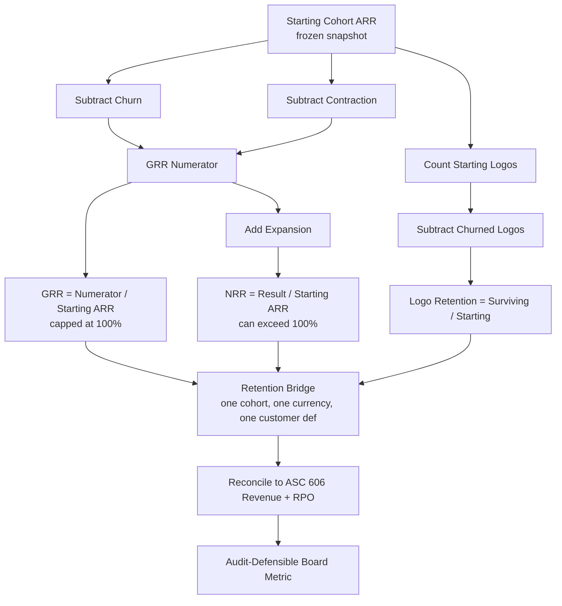

### Direct Answer

NRR, GRR, and logo retention are three different lenses on the same customer base, and auditors flag a board as "unreliable" when those three numbers are computed from inconsistent cohorts, mismatched currencies, or revenue figures that do not tie to the general ledger. The number an audit committee considers "real" is the one whose denominator, contract scope, and recognition treatment can be reconciled line-by-line to ASC 606 revenue and to remaining performance obligations (RPO) in your S-1 or 10-K. The way you separate them defensibly is to build a single retention bridge — starting MRR/ARR, plus expansion, minus contraction, minus churn — where GRR uses only the downside terms, NRR adds the upside, and logo retention counts entities rather than dollars, all three drawn from one frozen cohort with one currency-conversion policy and one definition of "customer."

**TLDR**

- **GRR (Gross Revenue Retention)** measures only loss — contraction plus churn — and can never exceed 100%. It is the floor, the "how leaky is the bucket" number, and auditors trust it most because it has no offsetting expansion to hide problems.
- **NRR (Net Revenue Retention)** adds expansion on top, so it can exceed 100%. It is the headline growth-efficiency number but is the easiest to manipulate via cohort selection, price increases, and currency tailwinds.
- **Logo retention** counts customers, not dollars. It exposes whether NRR is being propped up by a few whales while the long tail silently churns.
- **The audit risk is not the formulas — it is the inputs.** Cohort drift, ARR-vs-revenue mismatches, mid-period contract modifications under ASC 606, and FX policy inconsistency are what get a metric labeled "not real."
- **The fix is one retention bridge:** a single frozen cohort, one currency policy, one customer definition, and a documented reconciliation from cohort ARR to GAAP revenue and RPO.
- **Public benchmarks to anchor against:** Snowflake (SNOW) ~158% NRR at IPO trending to ~127%, Datadog (DDOG) ~130%+, ServiceNow (NOW) ~98-99% renewal rate, HubSpot (HUBS) GRR in the high-80s%. Best-in-class GRR is 90%+ for enterprise, 75-85% for SMB.

## 1. Why Auditors Distrust Retention Metrics

### 1.1 The metrics are not GAAP — and everyone treats them like they are

NRR, GRR, and logo retention are **non-GAAP operating metrics**. There is no FASB standard that defines them, no PCAOB audit procedure that certifies them, and no SEC rule that prescribes their formula. Yet they sit at the center of every SaaS board deck, every venture term sheet, and every S-1 risk section. That gap — between how load-bearing the numbers are and how unregulated their construction is — is exactly why a sharp audit committee member or a Big Four engagement partner pushes back when you present them.

The auditor's instinct is correct. **A metric with no standard is a metric with no discipline unless you impose it yourself.** When a board auditor asks "which of these is real," they are not questioning your honesty. They are asking whether the number is reproducible: if a second analyst, given the same raw data and the same written methodology, would compute the same figure. If the answer is no, the number is not real in any sense an auditor cares about.

This is the single most important reframe for a RevOps or finance leader. You do not win the auditor's trust by arguing that NRR is "industry standard." You win it by showing that **your** NRR is computed from a documented, frozen, reconcilable process. The formula is the easy part. The governance is the hard part, and it is the part auditors actually grade.

### 1.2 The three places retention numbers go wrong

In practice, almost every retention dispute traces to one of three failure modes. Memorize these, because an experienced auditor will probe all three:

- **Cohort drift:** The denominator silently changes between periods. New logos get added mid-window, churned logos get dropped retroactively, or the "starting" base is re-pulled from a live system that has since been updated. The result is a metric that compares two different populations.
- **Numerator/denominator mismatch:** The starting figure is ARR (a forward-looking annualized run-rate), the ending figure is recognized revenue (a backward-looking GAAP number), and the two are quietly treated as comparable. They are not.
- **Definitional inconsistency:** "Customer" means a legal entity in one report, a billing account in another, and a domain in a third. Or "expansion" includes a contractual price escalator in one quarter and excludes it the next.

Each of these is invisible in a single quarter and corrosive over four. The cohort discipline in [q414 — CAC payback with multi-quarter sales cycles](#q414) is the same discipline applied to a different metric: freeze the population, document the rule, never re-pull.

### 1.3 What "real" means to an audit committee

When the audit committee chair says "which number is real," translate it into the four sub-questions they are actually asking:

| Auditor's real question | What they want to see |
|---|---|
| Is it reproducible? | A written methodology doc; a second analyst gets the same number |
| Does it tie to GAAP? | A reconciliation from cohort ARR to ASC 606 revenue and RPO |
| Is the cohort frozen? | A snapshot table with a timestamp, never re-pulled live |
| Is it consistent over time? | The same definition in Q1 and Q4; changes disclosed and bridged |

If you can answer all four with an artifact rather than an assertion, you have made the metric "real." This is the throughline of the entire answer.

## 2. The Three Metrics, Defined Precisely

### 2.1 Gross Revenue Retention (GRR)

GRR measures the percentage of recurring revenue you keep from an existing cohort **before any expansion**. It captures only the downside: customers who downgraded (contraction) and customers who left entirely (churn).

The formula:

```
GRR = (Starting ARR − Contraction − Churn) / Starting ARR
```

GRR is **capped at 100%** by construction. You cannot retain more than you started with if you are not allowed to count expansion. A GRR of 100% means a perfect quarter with zero dollar loss; anything below is leakage. Because it has no offsetting upside, GRR is the metric auditors trust most — there is nothing to hide a problem behind.

- **GRR is the floor.** It tells you the structural health of the base independent of your upsell motion.
- **GRR isolates the product and CS problem.** A low GRR cannot be papered over by a strong sales-led expansion team.
- **GRR is the leading indicator of NRR decay.** When GRR falls, NRR follows within two to three quarters once expansion normalizes.

### 2.2 Net Revenue Retention (NRR)

NRR takes the same cohort and **adds expansion** — upsells, cross-sells, seat growth, usage growth, and contractual price increases — on top of the GRR calculation.

The formula:

```
NRR = (Starting ARR + Expansion − Contraction − Churn) / Starting ARR
```

NRR **can and routinely does exceed 100%**. An NRR of 120% means the existing cohort grew 20% in dollar terms even before you sold a single new logo. This is the metric venture investors and public-market analysts care about most, because it measures the compounding engine: a company with 120%+ NRR grows even if new-logo acquisition stops entirely.

But NRR is also **the easiest of the three to manipulate**, which is precisely why auditors scrutinize it:

- **Cohort selection bias.** Pick a cohort dominated by your best customers and NRR inflates.
- **Price-increase masking.** A 7% list-price escalator shows up as "expansion" even though no customer chose to buy more.
- **Currency tailwinds.** A weakening reporting currency inflates the foreign-denominated portion of the cohort.
- **Survivorship.** If churned logos are dropped from the denominator, the surviving base looks artificially loyal.

### 2.3 Logo Retention

Logo retention counts **customers, not dollars**.

The formula:

```
Logo Retention = (Starting Logos − Churned Logos) / Starting Logos
```

It answers a question neither dollar metric can: are you keeping the *number* of customers, or just the *revenue concentrated in a few*? A company can post 130% NRR while losing 20% of its logos, if the surviving 80% expanded enough to cover the gap. That is a fragile, concentration-driven business wearing a healthy NRR mask. Logo retention strips the mask off.

| Metric | Counts | Can exceed 100%? | Primary use | Audit trust level |
|---|---|---|---|---|
| GRR | Dollars, downside only | No | Structural base health | Highest |
| NRR | Dollars, net of expansion | Yes | Growth-efficiency / compounding | Lower (manipulable) |
| Logo retention | Customer count | No | Concentration / tail health | High |
| Net logo retention | Logos incl. new in-cohort | Rare | Rarely used; avoid | Low |

### 2.4 The fourth metric nobody asks for — and why

Boards occasionally ask for a "net logo retention" that adds new logos won during the period back into the logo count. **Resist this.** Net logo retention conflates retention (keeping what you had) with acquisition (winning what you did not). It produces a number that can exceed 100% and is uninterpretable: a company can post 110% net logo retention while churning a third of its existing base, simply because new-logo sales were strong. The four-metric table in Section 2.3 lists it only so you can name it and decline it. If the board wants an acquisition number, give them gross new logos as a separate line — never blend the two.

There is a parallel temptation on the dollar side: a "net new ARR retention" that folds new-logo ARR into the cohort. The same objection applies. Retention metrics answer one question — *did the base hold?* — and the moment you let acquisition leak in, the metric stops answering it.

### 2.5 Quick-revenue vs. recurring-revenue boundary

A precise GRR/NRR calculation requires a clean line between recurring and non-recurring revenue. Recurring revenue is the subscription run-rate that renews. Non-recurring includes implementation services, training, one-time professional-services engagements, hardware, and travel pass-throughs. Only recurring revenue belongs in a retention metric — but the boundary is fuzzier than it looks:

- **A multi-year implementation fee billed annually.** Recurring in cash terms, non-recurring in substance. Exclude it from ARR.
- **Premium support sold as an annual add-on.** Recurring — it renews with the subscription. Include it.
- **A usage overage that recurs every month at a variable level.** Recurring in pattern, variable in amount. Include it, but normalize (Section 5.3).
- **A one-time data-migration credit.** Non-recurring. Exclude.

Document the recurring/non-recurring boundary as part of the ARR policy. An auditor sampling ten contracts will check whether your classification is consistent, and a single mis-classified six-figure services line can move a small cohort's NRR by a full point.

### 2.6 How the three relate — the algebraic guardrails

There are mathematical relationships an auditor will check, and if your numbers violate them, the conversation is over:

- **NRR ≥ GRR always.** NRR equals GRR plus the expansion ratio. If you ever report NRR below GRR, you have a calculation error — expansion cannot be negative.
- **GRR ≤ 100% always.** A GRR above 100% means expansion leaked into the gross calculation; recheck the bridge immediately.
- **Logo retention and GRR diverging reveals mix.** If GRR is 92% but logo retention is 80%, you are losing many small accounts and keeping the big ones — concentration risk. If GRR is 80% but logo retention is 95%, you are keeping logos but they are shrinking — a downgrade or pricing problem.
- **NRR minus GRR equals the expansion ratio.** This difference is itself a metric. An NRR of 110% with a GRR of 90% means a 20-point expansion ratio. Track the gap over time: a widening gap with flat GRR means expansion is doing more and more work to mask a stable leak.
- **Logo retention sets a ceiling on GRR only when accounts are uniform.** In a uniform-account-size business, GRR cannot greatly exceed logo retention. In a concentrated business, GRR can sit far above logo retention because the surviving few are large. The ratio of the two is a concentration gauge.



## 3. Build One Retention Bridge — The Core Method

### 3.1 Why a single bridge beats three separate calculations

The mistake that creates audit friction is computing GRR, NRR, and logo retention as three independent spreadsheets, often owned by three different teams (Finance owns GRR, RevOps owns NRR, CS owns logo retention). Three spreadsheets means three cohorts, three currency policies, and three definitions of "customer." They will never tie out, and the auditor will find the seam.

The solution is **one retention bridge**: a single waterfall that starts with the frozen cohort ARR and walks, line by line, to the ending ARR. GRR, NRR, and logo retention are then all *read off the same bridge* rather than computed separately. They cannot disagree because they share every input.

A retention bridge for a single cohort looks like this:

| Bridge line | ARR ($000) | Logos | Notes |
|---|---|---|---|
| Starting cohort (frozen 2024-01-01) | 48,200 | 612 | Snapshot, never re-pulled |
| + Expansion (upsell, seats, usage) | +9,640 | 0 | Same logos buying more |
| + Contractual price escalators | +1,880 | 0 | Disclosed separately |
| − Contraction (downgrades) | −3,376 | 0 | Same logos buying less |
| − Churn (full cancellation) | −5,784 | −74 | Logos lost |
| Ending cohort ARR | 50,560 | 538 | 12 months later |

From this one table, all three metrics fall out:

- **GRR** = (48,200 − 3,376 − 5,784) / 48,200 = **81.0%**
- **NRR** = (48,200 + 9,640 + 1,880 − 3,376 − 5,784) / 48,200 = **104.9%**
- **Logo retention** = (612 − 74) / 612 = **87.9%**

One table, one cohort, one currency conversion, three metrics — and they are now provably consistent.

### 3.2 The six inputs you must freeze

A retention bridge is only defensible if every input is locked. Freeze these six and document the rule for each:

- **The cohort population.** Exactly which customers, identified by a stable key (legal entity ID, not billing account, not domain).
- **The snapshot date.** The starting ARR is captured at a timestamp and stored; it is never re-derived from a live system.
- **The currency policy.** Either lock the FX rate at cohort start (constant currency) or use period-average rates — but pick one and apply it to both ends of the bridge.
- **The ARR definition.** What counts as recurring: subscription yes, one-time services no, usage-based — define a normalization rule.
- **The expansion/contraction boundary.** A customer who churns one product and buys another: is that net expansion or churn + new? Decide and document.
- **The contract-modification treatment.** How mid-period upsells, co-terms, and renewals-with-changes flow into the bridge (see Section 5).

### 3.3 Constant currency is not optional for global businesses

If you sell internationally, you must present retention on a **constant-currency basis** as the primary number, with reported (as-converted) as a secondary disclosure. Here is why auditors care: a 10% swing in EUR/USD can move a Europe-heavy cohort's NRR by 4-6 points with zero change in customer behavior. That is currency noise masquerading as retention performance.

| Approach | What it does | Audit view |
|---|---|---|
| Constant currency (lock start-of-period FX) | Holds FX flat both ends; isolates real behavior | Preferred — measures the business |
| Reported / as-converted | Uses actual period rates | Required for GAAP tie-out; noisy as a behavior metric |
| Period-average rate | Smooths intra-period swings | Acceptable if applied consistently |
| Spot rate at each end | Maximum volatility | Discouraged — introduces FX noise |

Snowflake (SNOW), MongoDB (MDB), and Datadog (DDOG) all disclose NRR methodology in their filings and footnote the currency treatment. Atlassian (TEAM), with heavy non-USD exposure, is especially explicit. Follow the public-company pattern: lead with constant currency, footnote the conversion.

### 3.4 The frozen-cohort snapshot table

The single most powerful audit artifact you can produce is a **frozen-cohort snapshot table**: a stored, timestamped table of every customer in the starting cohort with their starting ARR. It is generated once, on the snapshot date, written to an immutable store, and never regenerated.

When the auditor asks "show me the starting base," you produce this table. When they ask "show me customer X's contribution," you point to a row. When they ask "did the base change," you show them the timestamp and the write-once storage policy. This artifact alone resolves most cohort-drift disputes, and it is the same governance principle behind the pipeline-snapshot discipline in [q417 — explaining the Rule of 40](#q417) and [q419 — modeling CAC for usage-based pricing](#q419).

A well-built snapshot table carries more than ARR. Each row should include the stable customer key, the legal entity name, the starting ARR, the contract end date, the segment tags (size band, geography, vintage, product), and the source-system record IDs that the ARR was derived from. The reason for the extra columns is verification speed: when an auditor samples customer X, you want every fact about that customer's cohort membership available in one row, not scattered across five systems. The snapshot is also where you record the FX rate applied, so that the constant-currency calculation is self-documenting.

| Snapshot column | Purpose | Why auditors want it |
|---|---|---|
| Stable customer key | Immutable join key | Prevents identity drift across periods |
| Legal entity name | Human-readable identity | Confirms the customer-definition rule |
| Starting ARR (functional currency) | The denominator input | The number being audited |
| FX rate applied + date | Currency documentation | Makes constant-currency self-proving |
| Contract end / renewal date | Renewal-window context | Explains timing of churn/expansion |
| Segment tags | Segmentation inputs | Enables segmented audit sampling |
| Source-system record IDs | Traceability | Lets auditor trace ARR to the contract |

### 3.5 Worked example — re-deriving the bridge from the snapshot

To make the discipline concrete, walk a tiny five-customer cohort through a full year. The starting snapshot, frozen on 2024-01-01:

| Customer | Starting ARR ($000) | Segment |
|---|---|---|
| Northwind Logistics | 220 | Enterprise |
| Pinecrest Health | 95 | Mid-market |
| Vela Robotics | 60 | Mid-market |
| Tidewater SMB Co | 18 | SMB |
| Glasshouse Media | 12 | SMB |

Over the year: Northwind expands to 290 (seat growth); Pinecrest stays flat at 95; Vela contracts to 40 (downgrade); Tidewater churns entirely; Glasshouse renews flat at 12. The ending state:

| Customer | Ending ARR ($000) | Bridge effect |
|---|---|---|
| Northwind Logistics | 290 | +70 expansion |
| Pinecrest Health | 95 | flat |
| Vela Robotics | 40 | −20 contraction |
| Tidewater SMB Co | 0 | −18 churn, −1 logo |
| Glasshouse Media | 12 | flat |

Starting cohort ARR = 405. Expansion = 70. Contraction = 20. Churn = 18. Starting logos = 5; churned logos = 1.

- **GRR** = (405 − 20 − 18) / 405 = 367 / 405 = **90.6%**
- **NRR** = (405 + 70 − 20 − 18) / 405 = 437 / 405 = **107.9%**
- **Logo retention** = (5 − 1) / 5 = **80.0%**

Notice the story the three numbers tell together: GRR of 90.6% is healthy, NRR of 107.9% shows a real expansion engine, but logo retention of 80.0% flags that one in five customers left. In a five-customer cohort that single churn is noise — which is exactly the Counter-Case point in Section 8.2 about small cohorts. At three hundred customers, an 80% logo retention with 108% NRR would be a genuine concentration warning. The same arithmetic, read at the right scale, is what makes the metric "real."

## 4. The Audit-Defensible Cohort

### 4.1 Anniversary cohorts vs. trailing-twelve-month windows

There are two legitimate ways to define the retention window, and you must pick one and never mix them:

- **Anniversary cohort:** Take all customers who were active on January 1, 2024, and measure where that exact group stands on January 1, 2025. Clean, intuitive, easy to audit. Best for board reporting.
- **Trailing-twelve-month (TTM) rolling:** Measure retention on a rolling basis, re-cohorting each month. More responsive to recent trends but harder to audit because the cohort changes every period.

For board and audit-committee reporting, **use anniversary cohorts**. They produce a stable, frozen population that an auditor can re-verify. Reserve TTM rolling for internal operational dashboards where responsiveness matters more than auditability.

| Window type | Cohort stability | Auditability | Best for |
|---|---|---|---|
| Anniversary cohort | High — frozen group | High | Board, audit committee, S-1 |
| TTM rolling | Low — re-cohorts monthly | Low | Internal CS/RevOps dashboards |
| Quarterly cohort | Medium | Medium | Mid-cycle trend monitoring |
| Vintage cohort (by signup quarter) | High | High | Unit-economics deep dives |

### 4.2 Handling new logos correctly — the cardinal rule

The cardinal rule of retention math: **new logos acquired during the measurement window are never in the retention numerator or denominator.** Retention measures whether you keep what you had. A customer who signed in June 2024 is not part of the January 2024 cohort and contributes nothing to that cohort's GRR, NRR, or logo retention.

This sounds obvious. It is violated constantly, usually because the analyst pulls "all customers active in 2024" rather than "customers active on 2024-01-01." The first population includes new logos; the second does not. An auditor will catch this immediately by sampling a few customer start dates.

### 4.3 The "what is a customer" problem

This is the definitional swamp that sinks more retention metrics than any formula error. Consider the ambiguities:

- **A parent company with five subsidiaries each on a separate contract.** One customer or five?
- **A customer who consolidates three legacy contracts into one master agreement.** Did two logos churn?
- **A reseller buying on behalf of fifty end users.** One logo or fifty?
- **A free-tier account that converts to paid mid-cohort.** When did it become a customer?

There is no universally correct answer. There is only a **documented, consistently applied answer.** Pick the unit — most enterprise SaaS companies use the contracting legal entity — write it down, and apply it identically across all three metrics and all periods. The named operators who get this right (ServiceNow's (NOW) and Workday's (WDAY) finance teams are frequently cited as rigorous here) treat the customer-definition doc as a controlled document with version history.

### 4.4 Edge cases that distort the cohort

| Edge case | Wrong treatment | Audit-defensible treatment |
|---|---|---|
| Contract consolidation (3→1) | Count 2 as churned logos | Treat as one continuing logo; document the merge |
| M&A — your customer acquired by another customer | Count one as churned | Map to surviving entity; net the ARR |
| M&A — your customer acquired by a non-customer | Ambiguous | Churn if contract terminates; retain if assumed |
| Mid-cohort free-to-paid conversion | Count as expansion | Exclude; it is a new logo, not in cohort |
| Pilot/POC that ends without renewal | Count as churn | Exclude pilots from cohort entirely if non-recurring |
| Re-signed after a churn gap | Count as never-churned | Churn at gap, new logo on re-sign |
| Seasonal/dormant accounts | Count as churned at trough | Use anniversary snapshot, not trough |

### 4.5 Segmenting the cohort so the board sees the truth

A single blended NRR hides everything that matters. Always segment, because the segments tell the real story:

- **By customer size band:** Enterprise NRR is structurally higher than SMB NRR. A blended 110% might be 125% enterprise and 92% SMB — two completely different businesses.
- **By signup vintage:** Recent cohorts often retain worse than mature ones (the base has stabilized). Or better, if product-market fit improved.
- **By product line:** Your core product may have 95% GRR while a newer module bleeds at 70%.
- **By geography:** Tied to the currency discussion — segment so FX noise is visible.
- **By acquisition channel:** Self-serve vs. sales-led cohorts retain very differently.

This segmentation discipline mirrors the breakdown logic in [q429 — building a tiered partner program without collapsing margin](#q429), where blended numbers similarly obscure the per-tier economics.

### 4.6 The segmentation exhibit auditors actually want

A segmented retention exhibit is not five separate tables — it is one table where every row sums back to the blended total. The reconciliation discipline is what makes it auditable: if your enterprise, mid-market, and SMB cohorts do not add up to the blended cohort, one of the four numbers is wrong.

| Segment | Starting ARR ($000) | GRR | NRR | Logo retention | % of base |
|---|---|---|---|---|---|
| Enterprise | 31,800 | 93.1% | 124.0% | 94.0% | 66% |
| Mid-market | 11,600 | 87.4% | 108.2% | 88.5% | 24% |
| SMB | 4,800 | 79.0% | 96.5% | 78.0% | 10% |
| Blended (weighted) | 48,200 | 90.0% | 117.8% | 90.3% | 100% |

The blended GRR of 90.0% is a *weighted* average — each segment's GRR weighted by its share of starting ARR — not a simple mean. An auditor will recompute the weighting; if you presented a simple mean (which here would be 86.5%, materially different), they will flag it. Always weight by starting ARR for dollar metrics and by starting logo count for logo retention. The SMB row is the story this exhibit tells: it is 10% of the base but it is dragging blended GRR and is the segment most likely to deteriorate in a downturn. A blended-only deck would have buried that entirely.

### 4.7 Vintage analysis — does the base get stickier with age?

Beyond size and geography, segment by **signup vintage** — the quarter or year a customer first became a paying customer. Vintage analysis answers whether your retention is improving structurally. If the 2022 cohort retains better in its second year than the 2021 cohort did in its second year, your product-market fit and onboarding are genuinely improving. If newer vintages retain worse, you may be acquiring lower-quality customers as you scale — a classic growth-stage trap.

| Vintage | Year-1 GRR | Year-2 GRR | Year-3 GRR | Read |
|---|---|---|---|---|
| 2021 cohort | 84% | 88% | 91% | Maturing well |
| 2022 cohort | 86% | 90% | — | Improving vs 2021 |
| 2023 cohort | 88% | — | — | Best year-1 yet |
| 2024 cohort | 83% | — | — | Watch — below trend |

Vintage curves typically slope upward (a cohort gets stickier as weak accounts churn out and survivors expand). A *downward*-sloping or flat vintage curve is a warning. Present vintage analysis at least annually to the audit committee; it is the clearest evidence that retention is or is not structurally improving, independent of any single year's headline number.

## 5. ASC 606 and the Revenue Recognition Trap

### 5.1 Why ASC 606 matters to a retention metric

ASC 606 (Revenue from Contracts with Customers) governs *when and how much* revenue you recognize. Retention metrics built on ARR — a non-GAAP run-rate — can drift from recognized revenue, and when they do, the auditor's first move is to ask you to bridge the gap. If you cannot, every retention number becomes suspect.

The core tension: **ARR is a snapshot of contracted annualized run-rate; ASC 606 revenue is recognized as performance obligations are satisfied over time.** A customer who signs a three-year deal with annual ramps has a single ARR figure that jumps each year, but ASC 606 revenue recognition follows the satisfaction of obligations, which may be ratable, may be milestone-based, and may involve a financing component. The two will not equal each other in any given period — and that is fine, *as long as you can explain the reconciliation.*

### 5.2 The five-step model and where retention intersects it

ASC 606 has a five-step recognition model. Retention metrics touch steps three, four, and five:

| ASC 606 step | What it does | Retention intersection |
|---|---|---|
| 1. Identify the contract | Confirm an enforceable agreement | Defines when a "customer" exists |
| 2. Identify performance obligations | Unbundle distinct promises | Affects what ARR includes |
| 3. Determine transaction price | Including variable consideration | Usage-based, rebates, escalators |
| 4. Allocate price to obligations | SSP allocation | Multi-product expansion attribution |
| 5. Recognize revenue | As obligations are satisfied | Timing gap vs. ARR |

The two steps that cause the most retention disputes are **variable consideration** (Step 3) and **contract modifications** (which can reset Steps 1-5).

### 5.3 Variable consideration and usage-based contracts

Under ASC 606, **variable consideration** — usage-based fees, tiered pricing, rebates, refunds, performance bonuses — must be estimated and constrained (you only recognize amounts that are not probable of significant reversal). For a usage-based business, this collides head-on with ARR-based retention.

If a customer's "ARR" is an estimate of annualized usage, then their expansion in your retention bridge is partly a *re-estimate of variable consideration*, not a customer decision to buy more. Auditors will want you to separate genuine usage growth from estimate revisions. The cleanest practice, used by usage-heavy public companies like Snowflake (SNOW) and Datadog (DDOG), is to define a **consumption-based retention** metric using trailing actual consumption rather than forward estimates, and to footnote exactly how the cohort's "starting ARR" was derived for a usage model. This is the same modeling problem addressed in depth in [q419 — modeling CAC for usage-based pricing with no upfront contract value](#q419).

### 5.4 Contract modifications — the single biggest landmine

A **contract modification** under ASC 606 is any change to a contract's scope or price. Mid-period upsells, co-terminations, early renewals with changed terms, and add-on products are all modifications. ASC 606 specifies three possible treatments:

- **Separate contract:** If the modification adds distinct goods/services at their standalone selling price, treat it as a brand-new contract. In retention terms, this is cleanly "expansion."
- **Termination of old + creation of new (prospective):** If remaining goods are distinct but not at SSP, you blend the remaining consideration into a new contract going forward.
- **Cumulative catch-up:** If remaining goods are not distinct, you adjust revenue cumulatively as if the modification were always part of the original contract.

Each treatment flows into the retention bridge differently. A cumulative catch-up can create a revenue figure that looks like a retroactive change to the cohort — and if your retention bridge is not aware of it, GRR/NRR will not tie to revenue.

| Modification type | ASC 606 treatment | Retention bridge effect |
|---|---|---|
| Upsell of distinct product at SSP | Separate contract | Clean expansion line |
| Upsell at a discount (not SSP) | Prospective blend | Expansion, blended rate; document |
| Early renewal with price change | Prospective or catch-up | Can shift ARR mid-cohort; flag |
| Co-termination of multiple contracts | Prospective blend | May look like churn+new; net it |
| Partial cancellation | Modification | Contraction line |
| Scope reduction with credit | Catch-up adjustment | Contraction + revenue catch-up |

### 5.5 ASC 340-40 and capitalized commissions

ASC 340-40 governs the **capitalization of incremental costs of obtaining a contract** — primarily sales commissions. While this is a cost standard, it intersects retention because the *amortization period* of capitalized commissions is tied to the expected customer relationship length, which is itself a function of retention.

If your churn rate implies an average customer life of three years, but your commissions are amortized over five, an auditor will challenge either the amortization period or your retention assumptions. **Your retention metrics and your ASC 340-40 amortization schedule must tell a consistent story about customer life.** A board auditor who sees a 75% GRR (implying ~4-year average life) alongside a 7-year commission amortization period will — correctly — flag the inconsistency.

### 5.6 Reconciling cohort ARR to GAAP revenue and RPO

The capstone artifact: a reconciliation that walks from your retention cohort's ARR to recognized GAAP revenue and to **remaining performance obligations (RPO)** — the contracted-but-not-yet-recognized revenue disclosed in your financial statements.

| Reconciliation line | Amount ($000) | Source |
|---|---|---|
| Cohort starting ARR (frozen) | 48,200 | Retention bridge |
| Less: ARR not yet recognized (timing) | (4,100) | ASC 606 schedule |
| Less: services/one-time in ARR | (1,650) | Revenue policy doc |
| Add: revenue from out-of-cohort logos | 19,400 | GL |
| Reconciled period subscription revenue | 61,850 | Ties to 10-K / GL |
| Memo: total RPO | 142,300 | Footnote disclosure |

When you can hand an auditor this reconciliation, you have moved retention from "a number RevOps asserts" to "a number that ties to the audited financial statements." That is the entire game. The deferred-revenue and RPO discipline here connects directly to [q405 — board-grade revenue bridges and deferred-revenue disclosure](#q405) and to the segmentation rigor in [q414 — true CAC payback with multi-quarter cycles](#q414).

### 5.7 RPO as the forward-looking retention check

Remaining performance obligations (RPO) deserve a closer look because they are the one retention-adjacent figure that *is* audited and disclosed. RPO is the total transaction price allocated to performance obligations that are unsatisfied as of the balance-sheet date — contracted future revenue. It is typically split into **current RPO** (cRPO, expected to be recognized within twelve months) and **long-term RPO**.

RPO and retention metrics should corroborate each other. If your NRR is 120% and growing, but RPO is flat or shrinking, something is wrong: either large multi-year contracts are rolling off without renewal (a future churn cliff that NRR has not caught yet) or the NRR cohort is unrepresentative. Conversely, RPO growing faster than NRR can signal a shift toward longer contract durations — good for predictability, but it means current-period NRR understates the committed expansion.

| Signal | RPO trend | NRR trend | Interpretation |
|---|---|---|---|
| Healthy | Growing | >100% | Expansion is contracted, not just hoped-for |
| Churn cliff ahead | Shrinking | >100% | Big deals rolling off; NRR will fall |
| Duration lengthening | Growing fast | flat ~105% | Longer contracts; NRR understates commitment |
| Deterioration | Shrinking | <100% | Confirmed contraction; no hidden buffer |

Present cRPO growth alongside NRR on the board exhibit. When an auditor asks "is the NRR durable," cRPO is your evidence: it shows how much of next year's expansion is already under contract versus assumed. Snowflake (SNOW), Datadog (DDOG), and ServiceNow (NOW) all disclose RPO prominently for exactly this reason — it is the audited anchor beneath the non-GAAP retention story.

### 5.8 Deferred revenue is not RPO — and auditors will test that you know it

A frequent confusion that erodes credibility: treating deferred revenue and RPO as the same thing. **Deferred revenue is only the billed-but-not-yet-recognized portion.** RPO includes deferred revenue *plus* the contracted-but-not-yet-billed backlog. A customer on a three-year contract billed annually has one year in deferred revenue but two more years sitting in RPO outside the balance sheet. If you cite deferred revenue when an auditor asks about contracted backlog, you have understated the forward book and signaled you do not understand the disclosure. Keep the relationship explicit: RPO = deferred revenue + unbilled contracted backlog.

## 6. Presenting to the Board and Audit Committee

### 6.1 Lead with GRR, then NRR, then logos

The order of presentation signals your priorities and your honesty. Lead with **GRR** — the floor, the hardest number to game. Then show **NRR** as GRR plus the expansion contribution, explicitly decomposed. Then show **logo retention** as the concentration check. An audit committee that sees GRR first concludes you are not hiding behind expansion. An audit committee that sees NRR first, big and bold, concludes you might be.

### 6.2 The one-page retention exhibit

Build a single board exhibit with these elements, every quarter, in the same format:

- **The retention bridge** (starting ARR → ending ARR waterfall) with all five lines visible.
- **All three metrics** read off the bridge, with the prior four quarters for trend.
- **Segmentation:** at minimum size band and geography.
- **Constant-currency and reported** side by side.
- **The reconciliation memo** linking cohort ARR to GAAP revenue.
- **A methodology footnote** stating cohort definition, snapshot date, currency policy, and customer definition.

### 6.3 What to say when the auditor pushes

When the audit committee chair asks "which is real," your answer should be: *"All three are real because they come from one bridge, one frozen cohort, and one currency policy — here is the reconciliation to recognized revenue. GRR is the structural floor, NRR adds our expansion engine, logo retention confirms it is not concentration-driven. Here is the methodology doc; a second analyst reproduces these exact figures."* That answer ends the conversation. An argument about industry norms does not.

### 6.4 Disclosing methodology changes

If you change a definition — say, you move from billing-account to legal-entity as the customer unit — you must (a) disclose the change, (b) restate the prior period on the new basis, and (c) show a bridge between old and new. The named public companies do this in their MD&A; ServiceNow (NOW), Workday (WDAY), and HubSpot (HUBS) have all footnoted retention methodology refinements. Silent changes are the fastest way to lose audit-committee trust permanently.

A methodology-change bridge is a simple table that an auditor can verify in minutes:

| Bridge line | NRR impact | Explanation |
|---|---|---|
| NRR as previously reported | 118.0% | Old basis — billing accounts |
| Effect of legal-entity consolidation | −2.4% | Subsidiaries merged into parents |
| Effect of excluding services from ARR | +1.1% | Cleaner recurring-revenue base |
| Effect of constant-currency adoption | −0.8% | FX noise removed |
| NRR as restated (new basis) | 115.9% | New basis — go-forward standard |

The audit committee does not object to refinements — methodologies legitimately improve. They object to *undisclosed* refinements that make a number jump without explanation. A clean bridge converts a potential red flag into evidence of rigor.

### 6.5 The methodology document — your single most important artifact

Behind every defensible metric is a controlled **retention methodology document**. It is short — three to six pages — and it states, unambiguously:

- **The customer definition** and the stable key used to identify customers.
- **The cohort window** (anniversary) and the snapshot procedure.
- **The ARR definition** including the recurring/non-recurring boundary.
- **The currency policy** (constant currency primary, conversion method).
- **The expansion/contraction/churn boundary rules**, including edge-case treatments from Section 4.4.
- **The ASC 606 contract-modification handling** that flows into the bridge.
- **The reconciliation procedure** from cohort ARR to GAAP revenue and RPO.
- **A version history** with dates, authors, and the reason for each change.

The CFO signs the current version. When an auditor asks "which number is real," the methodology document *is* the answer — it is the thing that makes the number reproducible. A company without this document is asserting its retention metrics; a company with it is proving them. Treat the document with the same control rigor you apply to an accounting policy memo, because to an auditor that is exactly what it is.

| Board exhibit element | Frequency | Owner | Audit purpose |
|---|---|---|---|
| Retention bridge waterfall | Quarterly | RevOps + Finance | Reproducibility |
| Three metrics + 4-qtr trend | Quarterly | RevOps | Consistency |
| Segmentation tables | Quarterly | RevOps | Mix transparency |
| Constant-currency vs reported | Quarterly | Finance | FX isolation |
| ARR-to-revenue reconciliation | Quarterly | Finance | GAAP tie-out |
| Methodology footnote | Every deck | Finance | Documentation |
| Methodology-change bridge | When changed | Finance | Disclosure |

## 7. Benchmarks and What Good Looks Like

### 7.1 Public-company anchors

Auditors and board members anchor on public comparables, so know them cold:

| Company (ticker) | NRR (peak / recent) | Notes |
|---|---|---|
| Snowflake (SNOW) | ~158% IPO → ~127% recent | Usage-based; consumption retention disclosed |
| Datadog (DDOG) | ~130%+ sustained | Multi-product expansion engine |
| MongoDB (MDB) | ~120%+ | Atlas usage-based expansion |
| HubSpot (HUBS) | ~100-104% | SMB-heavy; GRR high-80s% |
| Atlassian (TEAM) | ~120%+ | Low-touch, heavy non-USD exposure |
| ServiceNow (NOW) | ~98-99% renewal rate | Reports renewal rate, not classic NRR |
| Salesforce (CRM) | "Attrition" ~8-9% | Discloses attrition rather than NRR |

Note how Salesforce (CRM) and ServiceNow (NOW) deliberately disclose *different* metrics (attrition rate, renewal rate) — a reminder that even the largest public companies choose their retention disclosure carefully, and consistency of definition is what auditors actually require.

### 7.2 Benchmark ranges by segment

| Segment | Good GRR | Good NRR | Good logo retention |
|---|---|---|---|
| Enterprise SaaS | 90-95%+ | 115-130%+ | 90-95%+ |
| Mid-market SaaS | 85-90% | 105-120% | 85-90% |
| SMB SaaS | 75-85% | 95-110% | 75-85% |
| Usage-based / consumption | 85-95% | 120-160% | 88-93% |
| Developer / PLG | 80-90% | 110-130% | 80-88% |

These ranges are drawn from the standard SaaS benchmark sources — Bessemer Venture Partners' State of the Cloud, KeyBanc Capital Markets' SaaS Survey, ICONIQ Growth's reports, OpenView's (now closed, archived) benchmarks, and Pavilion's operator community data. When you present to a board, cite which benchmark source you are anchoring against, because the methodologies differ.

### 7.3 The danger of a great NRR with a weak GRR

The most dangerous profile an auditor will probe: **NRR 125%, GRR 78%.** This means you are losing 22% of revenue annually but a powerful expansion motion masks it. It is a treadmill — every year you must re-expand to stay in place, and the moment expansion slows, the high churn surfaces instantly. A board that sees only the 125% NRR is being misled. This is why GRR-first presentation is non-negotiable.

To make the treadmill concrete: a company with 78% GRR and 125% NRR that posts $100M of cohort ARR will, absent any new logos, lose $22M to churn and contraction next year and must generate $47M of gross expansion just to reach the 125% mark. If expansion conditions soften — a macro downturn, a competitive product, budget freezes among customers — and expansion falls from 47% to 30%, NRR collapses from 125% to 108% in a single year with *no change in churn at all*. The 78% GRR was the real number the whole time; the 125% NRR was borrowing against good expansion conditions. An audit committee that understands this will always ask for GRR first, and a finance leader who volunteers it builds credibility.

### 7.4 What "improving retention" looks like quarter over quarter

Boards want to see direction, not just level. A healthy retention trajectory shows GRR stable or slowly rising, NRR stable or rising, and the NRR-minus-GRR expansion gap stable — meaning growth is coming from a healthier base, not from leaning ever harder on expansion. The warning pattern is a flat or rising NRR built on a *falling* GRR and a *widening* expansion gap: the headline holds while the foundation erodes.

| Quarter | GRR | NRR | Expansion gap | Read |
|---|---|---|---|---|
| Q1 | 88% | 112% | 24 pts | Baseline |
| Q2 | 89% | 114% | 25 pts | Healthy — both up |
| Q3 | 87% | 115% | 28 pts | Caution — GRR down, gap widening |
| Q4 | 85% | 116% | 31 pts | Warning — NRR masking GRR decay |

Present this four-quarter view every board meeting. It is the single most honest retention exhibit because it makes masking visible.

## 8. Common Mistakes and the Counter-Case

### 8.1 The top retention-metric mistakes

- **Re-pulling the cohort live.** Always snapshot; never regenerate the starting base from a system that has changed.
- **Mixing ARR and revenue.** Pick one basis for the metric and reconcile to the other; never silently swap.
- **Blending segments.** A single company-wide NRR hides the SMB problem inside the enterprise success.
- **Ignoring FX.** Present constant currency primary; reported secondary.
- **Counting new logos in the cohort.** Retention measures what you kept, not what you added.
- **Letting expansion leak into GRR.** GRR must be capped at 100% by construction.
- **Changing definitions silently.** Disclose, restate, bridge.
- **No methodology doc.** Without one, the metric is not reproducible and therefore not "real."

### 8.2 Counter-Case: when this rigor does NOT apply

Not every company needs the full audit-grade retention apparatus described here. Apply judgment:

- **Pre-seed and seed-stage startups** with under ~50 customers and no audit committee. Cohort statistics are too small to be meaningful — a single churned logo swings the number 2-4 points. At this stage, track raw churn and talk to customers; a formal retention bridge is premature overhead. Wait until you have a few hundred customers and at least four quarters of history.
- **Pure transactional or one-time-purchase businesses** with no recurring contracts. NRR/GRR are recurring-revenue constructs; forcing them onto a transactional model produces noise. Use repeat-purchase rate and customer-lifetime metrics instead.
- **Companies in a deliberate strategic pivot.** If you are intentionally churning a customer segment (sunsetting a product, exiting a market), reported retention will look terrible and *should* — the metric is correctly capturing a deliberate decision. Annotate the board exhibit; do not torture the cohort definition to hide the pivot.
- **Very early usage-based products** where "ARR" is barely an estimate. If forward annualized run-rate is genuinely unknowable, a formal NRR is false precision. Use trailing consumption growth until the model stabilizes.
- **Internal operational dashboards** where speed beats auditability. The TTM-rolling, re-cohorted view is fine for the CS team's weekly standup. The audit-grade anniversary-cohort bridge is for the board. Do not impose board governance on every dashboard.

The principle: **audit-grade retention rigor is proportional to the stakes.** A board with an audit committee, a company approaching an S-1, a venture round where retention drives the valuation — those demand the full apparatus. A ten-customer seed startup does not. Match the rigor to the consequence.

### 8.3 When auditors are wrong — pushing back constructively

Occasionally an auditor will push for a treatment that is technically conservative but operationally misleading — for example, insisting every contract consolidation be counted as churn-plus-new. When that happens, present both views: the auditor's conservative figure and the economically representative figure, with a clear bridge between them. You are not obligated to adopt a misleading number; you are obligated to disclose, reconcile, and let the audit committee see both. A well-run audit committee values the operator who can defend a nuanced position with a reconciliation over one who simply capitulates.

## 9. Implementation Roadmap

### 9.1 The 90-day plan to audit-ready retention

| Phase | Weeks | Deliverable |
|---|---|---|
| 1. Define | 1-2 | Customer-definition doc, ARR policy, currency policy — all controlled documents |
| 2. Build the bridge | 3-5 | One retention-bridge model; frozen-cohort snapshot store |
| 3. Reconcile | 6-8 | ARR-to-GAAP-revenue reconciliation; RPO tie-out |
| 4. Segment | 9-10 | Size/geo/vintage/product segmentation views |
| 5. Board exhibit | 11-12 | One-page exhibit + methodology footnote; dry-run with audit committee |

### 9.2 Roles and ownership

- **Finance owns** the ARR definition, the currency policy, the ASC 606 treatment, and the GAAP reconciliation.
- **RevOps owns** the bridge model, the cohort snapshots, and the segmentation.
- **Customer Success owns** the operational interpretation and the churn-driver analysis.
- **The CFO owns** the methodology doc as a controlled document and signs off before the board.

Single ownership of each input — never split — is what prevents the three-spreadsheet problem from re-emerging. This ownership-mapping discipline is the same one applied to pipeline and forecast governance in [q417 — explaining the Rule of 40](#q417) and [q429 — tiered partner program design](#q429).

### 9.3 Tooling notes

You do not need exotic software. A retention bridge can live in a well-governed spreadsheet or in your data warehouse with a version-controlled SQL model. What matters is not the tool but the **immutability of the cohort snapshot** and the **version history of the methodology doc.** If you use a BI tool, ensure cohort snapshots are written to a write-once table, not recomputed on every dashboard load.

A practical warehouse pattern: a `cohort_snapshot` table partitioned by snapshot date, written once via an append-only job; a `retention_bridge` view that joins the snapshot to current-state ARR; and a `retention_metrics` view that reads GRR, NRR, and logo retention off the bridge. Lock the snapshot job so it cannot overwrite an existing partition. Version the SQL in source control. The auditor can then be handed the SQL itself — reproducibility becomes a code review rather than a leap of faith.

### 9.4 The audit dry-run

Before the real audit, run a dry-run with your finance team playing auditor. Have them attempt the four "real" questions from Section 1.3: reproduce a quarter's NRR from raw data, trace a sampled customer through the bridge, confirm the cohort was not re-pulled, and check that Q1 and Q4 used identical definitions. Every gap the dry-run exposes is a gap you fix on your own schedule rather than under audit pressure. Companies that dry-run their retention methodology walk into the audit committee with confidence; companies that do not, improvise — and improvisation is exactly what makes a metric look "not real."

### 9.5 Common roadblocks and how to clear them

- **CRM and billing disagree on ARR.** Pick the billing system as the system of record for ARR; CRM is for pipeline. Reconcile the gap once and document it.
- **No historical snapshots exist.** You cannot retroactively freeze a cohort. Start snapshotting now; accept that the first clean anniversary cohort is twelve months out.
- **Sales and CS define "customer" differently.** The CFO arbitrates; the methodology doc records the decision; it applies everywhere.
- **Usage data lags by weeks.** Define a consistent cut-off lag and apply it identically each period rather than chasing the freshest possible data.

## 10. Key Takeaways

- **GRR, NRR, and logo retention are three lenses on one cohort.** They become "real" to an auditor only when computed from one frozen bridge with one currency policy and one customer definition.
- **GRR is the floor** (downside only, capped at 100%, most trusted). **NRR adds expansion** (can exceed 100%, most manipulable). **Logo retention** counts customers and exposes concentration risk.
- **The audit risk is the inputs, not the formulas:** cohort drift, ARR-vs-revenue mismatch, ASC 606 contract modifications, and FX inconsistency.
- **Build one retention bridge,** freeze six inputs, present constant currency primary, and reconcile cohort ARR to GAAP revenue and RPO.
- **Lead board presentations with GRR,** segment everything, document the methodology, and disclose any definitional change with a restatement bridge.
- **Counter-case:** seed-stage, transactional, deliberate-pivot, and early usage-based businesses do not need the full apparatus — match rigor to stakes.

## Related Library Entries

- [q414 — How do you calculate true CAC payback period when you have multi-quarter sales cycles?](#q414)
- [q417 — What does the Rule of 40 actually measure, and how do you explain it when growth and profit conflict?](#q417)
- [q419 — How do you model CAC for usage-based pricing when you have no upfront contract value?](#q419)
- [q429 — How do we build a tiered partner program that rewards scale without collapsing margin?](#q429)
- [q405 — Board-grade revenue bridges and deferred-revenue disclosure](#q405)

## Sources

1. FASB ASC 606 — Revenue from Contracts with Customers (full codification).
2. FASB ASC 340-40 — Other Assets and Deferred Costs: Contracts with Customers.
3. FASB ASC 606-10-25 — Identifying the Contract and Performance Obligations.
4. FASB ASC 606-10-32 — Determining and Allocating the Transaction Price (variable consideration).
5. FASB ASC 606-10-25-10 through 25-13 — Contract Modifications.
6. SEC Regulation S-K, Item 303 — MD&A disclosure requirements for operating metrics.
7. SEC Division of Corporation Finance — guidance on non-GAAP and key operating metrics disclosure.
8. PCAOB Auditing Standard AS 2305 — Substantive Analytical Procedures.
9. PCAOB Auditing Standard AS 1105 — Audit Evidence.
10. Snowflake Inc. (SNOW) — Form S-1 and subsequent 10-K filings, net revenue retention disclosure.
11. Snowflake Inc. (SNOW) — Annual Report, consumption-based revenue and retention methodology.
12. Datadog Inc. (DDOG) — Form 10-K, dollar-based net retention rate definition.
13. MongoDB Inc. (MDB) — Form 10-K, Atlas net ARR expansion rate disclosure.
14. HubSpot Inc. (HUBS) — Form 10-K, customer and revenue retention metrics.
15. Atlassian Corporation (TEAM) — Annual Report, retention and constant-currency disclosure.
16. ServiceNow Inc. (NOW) — Form 10-K, renewal rate methodology and definition.
17. Salesforce Inc. (CRM) — Form 10-K, attrition rate disclosure and definition.
18. Workday Inc. (WDAY) — Form 10-K, subscription revenue and retention disclosure.
19. Bessemer Venture Partners — State of the Cloud annual report, NRR benchmarks.
20. Bessemer Venture Partners — "Scaling to $100M ARR" and Cloud 100 metrics.
21. KeyBanc Capital Markets — Annual SaaS Survey, retention and expansion benchmarks.
22. ICONIQ Growth — Growth & Efficiency reports, NRR and GRR benchmark data.
23. OpenView Partners — SaaS Benchmarks reports (archived), retention by segment.
24. Pavilion — Operator benchmark surveys, RevOps retention metrics.
25. AICPA — Audit and Accounting Guide: Revenue Recognition.
26. AICPA — Technical Q&A on software and SaaS revenue recognition.
27. Deloitte — "A Roadmap to Applying ASC 606" technical guide.
28. PwC — "Revenue from contracts with customers" accounting and reporting guide.
29. KPMG — "Revenue: ASC 606 Handbook."
30. EY — "Financial reporting developments: Revenue from contracts with customers (ASC 606)."
31. Grant Thornton — "Revenue from contracts with customers: Navigating the guidance."
32. Bessemer Venture Partners — "The Good, Better, Best of SaaS retention metrics."
33. SaaS Capital — "Retention Benchmarks for Private SaaS Companies."
34. Battery Ventures — "Software 2024" State of the OpenCloud report.
35. CFO.com — "Why net revenue retention is the metric boards trust most."
36. The SaaS CFO (Ben Murray) — retention bridge and ARR-to-revenue reconciliation methodology.
