### Direct Answer

True CAC payback period for businesses with multi-quarter sales cycles is the number of months it takes to recover fully-loaded customer acquisition cost out of **gross-margin-adjusted recurring revenue**, measured from the moment cash was actually spent, not from the close date. The naive formula — CAC divided by new MRR times gross margin — silently understates payback by one full sales-cycle length because it ignores the months of sales and marketing spend that occurred *before* the deal closed. To calculate it honestly you must (1) anchor the clock to the spend date rather than the close date, (2) build acquisition cost on a cohort basis using the spend that produced *that* cohort, and (3) decide explicitly whether you are measuring time-to-cash-recovery or time-to-margin-recovery, because enterprise boards increasingly want both. For a company with a six-month average sales cycle, the difference between the naive number and the true number is routinely 8 to 14 months, large enough to change a fundraising story, a compensation plan, and a go-to-market investment decision.

### TLDR

- **The naive formula lies for long-cycle businesses.** CAC / (new MRR x gross margin) assumes spend and revenue are contemporaneous. With multi-quarter cycles they are not — spend leads revenue by an entire cycle.
- **Anchor to the spend date.** True payback counts months from when the dollar left your bank account, not from when the logo went live. Add the average sales-cycle length to any close-date-based number to approximate the truth.
- **Use cohorts, not blended trailing windows.** Match the sales and marketing spend of a period to the customers that spend actually produced, which for a long-cycle business means looking back one to three quarters.
- **Separate cash payback from margin payback.** Cash payback ignores gross margin and tells you when you are liquid again. Margin payback (the board-standard number) tells you when the customer became economically accretive.
- **Capitalized commissions (ASC 340-40) move the number.** If you amortize commissions, your P&L CAC and your cash CAC diverge — pick one definition and footnote it.
- **Target ranges shift by motion.** SMB self-serve should pay back inside 12 months; mid-market 12 to 18; enterprise 18 to 24 is healthy and 24 to 30 is survivable if NRR is above 120 percent.
- **Counter-case:** for true product-led-growth motions with sub-30-day cycles, the spend-date adjustment is immaterial and the naive formula is fine.

## Section 1 — Why The Standard CAC Payback Formula Breaks On Long Cycles

### 1.1 The formula everyone uses and where it comes from

Almost every SaaS operator first learns CAC payback as a single tidy expression: take total sales and marketing spend for a period, divide by the number of new customers won in that same period to get CAC, then divide CAC by the average monthly recurring revenue of those customers multiplied by gross margin. The result is a count of months. The formula is attractive because it is computable from a standard P&L and a billing system without any cohort tooling, and because it produces a number that benchmarks cleanly against published ranges from **Bessemer Venture Partners**, **OpenView**, **ICONIQ Growth**, and the **KeyBanc Capital Markets** annual SaaS survey. Operators at **HubSpot (HUBS)** and **Salesforce (CRM)** both report payback in investor materials, and the metric appears in nearly every Series B and later board deck.

The problem is not the arithmetic. The problem is a hidden assumption baked into the period matching: that the spend in a period and the customers won in that period belong together. That assumption is approximately true when the sales cycle is short relative to the measurement period. It is badly false when the sales cycle is long.

### 1.2 The timing mismatch in plain language

Consider a company with a six-month average sales cycle. A deal that closes in June was first touched by marketing and sales in roughly December of the prior year. Every dollar of demand-generation spend, every SDR salary, every field-marketing event, and every AE base that worked that opportunity was spent across December through June. But the naive formula divides June's *new* MRR by June's *spend* — and June's spend is actually producing deals that will close in December. You are dividing this cohort's revenue by next cohort's cost.

In a growing company this mismatch is not random noise; it is systematically biased. Because spend is rising quarter over quarter, the spend you book against a given cohort of closes is *larger* than the spend that actually produced them. That inflates measured CAC and inflates measured payback. Then, separately, you also start the payback clock too late, because you begin counting recovery only at close, ignoring the six months the money was already at work. The two errors stack.

### 1.3 A worked illustration of the gap

The table below shows the same business measured two ways. The company spends a growing amount each quarter and closes deals two quarters after the spend that generated them.

| Quarter | S&M spend | New customers (closed) | New MRR closed | Naive CAC | True (cohort) CAC |
|---|---|---|---|---|---|
| Q1 | $900,000 | 30 | $45,000 | $30,000 | $30,000 |
| Q2 | $1,100,000 | 36 | $54,000 | $30,556 | $30,556 |
| Q3 | $1,350,000 | 30 | $45,000 | $45,000 | $30,000 |
| Q4 | $1,600,000 | 36 | $54,000 | $44,444 | $30,556 |

In Q3 the naive CAC reads $45,000 because Q3's large spend is divided by Q3's smaller class of closes — but Q3's spend is really producing Q1-style cohorts. The true cohort CAC, which divides Q1 spend by the Q3 closes it actually generated, is $30,000. The naive method overstates CAC by 50 percent in this example, and payback inherits that error directly.

### 1.4 Why the error matters for decisions, not just for tidiness

A wrong payback number is not an academic problem. It feeds three decisions that move real money:

- **Fundraising narrative.** A growth-equity diligence team from a firm like **ICONIQ Growth** will rebuild your payback from raw cohorts. If your deck says 14 months and their rebuild says 24, you have a credibility problem that costs you valuation, not just an awkward call.
- **Go-to-market investment pacing.** If leadership believes payback is 12 months when it is really 22, they will green-light a sales-capacity expansion the balance sheet cannot fund, because cash recovery is nearly a year slower than modeled.
- **Compensation design.** Commission accelerators and SDR ramp models are often justified by an assumed payback. An understated payback makes an unaffordable comp plan look affordable.

This is why the rest of this entry treats true CAC payback as a discipline, not a single formula. For the related discipline of separating retention metrics, see the sibling entry *How do you separate NRR, GRR, and logo retention when board auditors are involved* (q416). For the broader efficiency context see *What does the Rule of 40 actually measure* (q417).

### 1.5 The growth-rate amplification effect

There is a subtler version of the same problem that catches even sophisticated finance teams. The size of the naive-versus-true gap is not constant — it scales directly with the company's growth rate. A company growing S&M spend at 10 percent per quarter has a modest mismatch between the spend it books against a cohort and the spend that actually produced it. A company growing S&M spend at 40 percent per quarter has a severe mismatch, because by the time a cohort closes, quarterly spend has nearly doubled. The faster you grow, the more the naive formula lies, and it lies in the direction that flatters slow-growth companies and punishes fast-growth ones — exactly backwards from what an investor wants to reward.

This produces a perverse dynamic. A hyper-growth company at a Series C, precisely the company a growth-equity firm is most excited about, will show the *worst* naive payback because its spend curve is steepest. If that company does not switch to cohort accounting, it will report a payback number that makes it look less efficient than a slower competitor that is actually burning more per dollar of new ARR. The cohort method is therefore not just more accurate in the abstract — it is specifically the method that prevents fast-growing companies from understating their own efficiency. Operators sometimes resist the cohort method because it is more work; the counter-argument is that for a growing company it usually produces a *better* headline number once CAC is corrected, as the Northwind worked example in Section 6 demonstrates.

### 1.6 Why marketing and finance disagree about the number

A practical symptom of the timing problem is a recurring argument between the marketing organization and the finance organization. Marketing, looking at its own attribution tooling, tends to credit a cohort to the campaigns that touched it — campaigns that ran one cycle ago. Finance, working from the P&L, tends to divide this quarter's total spend by this quarter's closes. The two teams are using two different numerators for the same metric and will never reconcile until they agree on a single attribution model. The spend-date cohort method is valuable partly because it forces that agreement: once both teams accept that a cohort is paid for by the spend of the months that produced it, the argument dissolves. Many finance leaders find that the political value of ending this argument is as large as the analytical value of the more accurate number.

## Section 2 — The Three Definitional Choices You Must Make First

### 2.1 Choice one: spend-date anchoring versus close-date anchoring

The single most consequential decision is *when the payback clock starts*. There are two defensible answers and one indefensible one.

The indefensible answer is the implicit default of the naive formula: start the clock at the close date and ignore the pre-close spend entirely. This is not a definition — it is an omission.

The two defensible answers are:

- **Close-date anchoring with a cycle adjustment.** Start the clock at close, compute payback the normal way, then add the average sales-cycle length to the result. This is an approximation but it is transparent and easy to audit.
- **Spend-date anchoring (true cohort method).** Tag every dollar of S&M spend to the month it was spent, attribute it to the cohort it eventually produced, and start the recovery clock at the spend month. This is the rigorous method and the one this entry recommends for any company with a cycle longer than one quarter.

| Anchoring method | Clock starts | Accuracy on long cycles | Tooling needed | Auditability |
|---|---|---|---|---|
| Close-date, no adjustment | Deal close | Poor — understates by a full cycle | None | High but wrong |
| Close-date + cycle adjustment | Deal close | Good approximation | Sales-cycle report | High |
| Spend-date cohort | Spend month | Best | Cohort model | Medium, needs documentation |

### 2.2 Choice two: cash payback versus margin payback

The second choice is *what counts as recovery*. Two numbers compete for the name "CAC payback."

- **Cash payback** asks: how many months until the cash collected from a customer equals the cash spent to acquire them? It ignores gross margin entirely and is the right number for a treasurer worried about runway.
- **Margin payback** asks: how many months until *gross-margin dollars* from a customer equal CAC? It is the board-standard number because it reflects the cash that is actually available to fund the next customer.

For a company at 80 percent gross margin the two numbers are close. For a company at 55 percent gross margin — common in usage-heavy infrastructure businesses — margin payback is nearly twice cash payback. You must label which one you are reporting. Most boards expect margin payback by default; treasury and lenders often want cash payback.

### 2.3 Choice three: P&L CAC versus cash CAC under ASC 340-40

The third choice is an accounting one. Under **ASC 340-40**, the incremental costs of obtaining a contract — most notably sales commissions — are capitalized and amortized over the expected customer life rather than expensed when paid. This creates two different CAC numbers from the same underlying activity:

- **Cash CAC** uses commissions in the period they were paid. It matches the bank statement.
- **P&L CAC** uses the amortized commission expense that hits the income statement. It is smoother and smaller in any single period for a growing company.

| CAC definition | Commission treatment | Best use | Caveat |
|---|---|---|---|
| Cash CAC | Commissions expensed when paid | Runway, cash payback, treasury | Lumpy; spikes with hiring |
| P&L CAC | Commissions amortized (ASC 340-40) | GAAP-aligned board reporting | Understates true cash outflow in growth |
| Fully-loaded cash CAC | Cash CAC + allocated overhead | Conservative diligence number | Hardest to compute |

The rule is simple: pick one definition, footnote it in every report, and never switch silently between board meetings. A diligence team will catch a switch instantly.

### 2.4 What belongs inside fully-loaded CAC

Beyond the three definitional choices, there is a fourth question that quietly changes payback by several months: how much overhead you load into CAC. There is a spectrum of definitions, and a company can legitimately choose any point on it as long as it is consistent and disclosed.

- **Direct CAC** counts only the spend that is unambiguously acquisition-related: paid media, AE and SDR variable comp, and field-marketing events. It is the smallest, most flattering number.
- **Loaded CAC** adds AE and SDR base salaries, sales-management base, and the tooling those teams use. This is the most common board definition.
- **Fully-loaded CAC** further adds an allocation of sales operations, marketing operations, sales enablement, the demand-gen leadership team, and a share of facilities and IT for those headcounts.
- **Total-cost CAC** goes furthest and allocates a portion of executive time, brand marketing, and even product-marketing effort that supports the funnel.

| CAC definition | Includes base salaries? | Includes ops/enablement? | Includes brand/exec? | Typical use |
|---|---|---|---|---|
| Direct CAC | No | No | No | Channel-by-channel optimization |
| Loaded CAC | Yes | No | No | Standard board reporting |
| Fully-loaded CAC | Yes | Yes | No | Diligence, conservative planning |
| Total-cost CAC | Yes | Yes | Yes | PE-style full-burden analysis |

The recommendation is to report on a fully-loaded basis as the headline. Direct CAC is useful for comparing channels against each other but is misleading as a company-level efficiency number because it omits real, recurring costs of running a go-to-market organization. A diligence team will always rebuild on a fully-loaded or total-cost basis, so reporting direct CAC to a board simply guarantees an unpleasant surprise later.

### 2.5 The treatment of brand and category-creation spend

A genuinely hard edge case is brand marketing and category-creation spend — the long-horizon investment that does not map to any specific cohort. Purists argue it should be excluded from CAC entirely because it is closer to R&D than to acquisition. Pragmatists argue that excluding it lets a company hide real go-to-market cost. The workable compromise is to compute payback two ways: a "demand-capture" payback that excludes brand, and a "fully-burdened" payback that includes it, and to footnote both. Brand spend tends to be a small fraction of total S&M for most companies below $100M ARR, so the gap is modest; it becomes material for consumer-facing or category-defining businesses, where it deserves explicit treatment rather than a silent inclusion or exclusion.

### 2.6 Putting the choices together

Once you have made all of these choices you can state your metric precisely. A complete, defensible statement looks like this: *"Margin CAC payback, spend-date anchored, computed on fully-loaded cash CAC including capitalized-but-paid commissions and excluding brand spend, was 19.4 months for the H1 2026 cohort."* That sentence has no ambiguity. "Our payback is 14 months" has at least eight possible meanings and should never appear in a board deck without the qualifiers. The discipline of stating the number this precisely is itself a signal to investors that the finance function is rigorous — which is worth real valuation points independent of the number itself.

## Section 3 — The Cohort Method, Step By Step

### 3.1 Building the spend ledger

The cohort method begins with a monthly spend ledger. Every dollar of sales and marketing cost is tagged with the month it was incurred and, where possible, the motion and segment it served. The ledger should include:

- **Demand generation:** paid media, content, events, field marketing.
- **Sales payroll:** AE base, SDR base, sales-management base, plus benefits and payroll taxes.
- **Variable compensation:** commissions and bonuses, recorded on a cash basis for cash CAC.
- **Sales tooling and overhead:** CRM, sales-engagement platforms, enablement software, and an allocation of sales operations headcount.
- **Marketing tooling and agency fees.**

The ledger is the foundation. If it is wrong, every downstream number is wrong.

### 3.2 Attributing spend to cohorts

The hard step is attribution: deciding which month's spend produced which cohort of closed customers. There are three practical approaches, in increasing order of rigor:

- **Uniform lag.** Assume every cohort was produced by spend that occurred exactly one average-sales-cycle ago. Simple, surprisingly robust, and the right starting point for most companies.
- **Lag distribution.** Use the actual distribution of time-from-first-touch-to-close to spread each cohort's cost across several prior months. More accurate when cycle length varies widely.
- **Opportunity-level attribution.** Tag spend to specific opportunities through the CRM and roll up. Most accurate, most expensive, and only worth it past roughly $50M ARR.

| Attribution approach | Effort | Accuracy | When to use |
|---|---|---|---|
| Uniform lag | Low | Good | Under $20M ARR, single motion |
| Lag distribution | Medium | Better | Mixed cycle lengths |
| Opportunity-level | High | Best | $50M+ ARR, multi-motion |

### 3.3 Computing cohort CAC

With spend attributed, cohort CAC is straightforward: total attributed spend for a cohort divided by the number of customers in that cohort. The key discipline is that the numerator and denominator now genuinely belong together — the spend in the numerator is the spend that produced the customers in the denominator.

### 3.4 Computing the recovery curve

For each cohort you then build a monthly recovery curve. Starting from the spend month, each month adds the gross-margin dollars (for margin payback) or the cash collected (for cash payback) from the surviving customers in that cohort. The payback month is the first month where cumulative recovery crosses cohort CAC.

| Months from spend | Cumulative margin recovered (per customer) | Cohort CAC | Recovered? |
|---|---|---|---|
| 0 (spend month) | $0 | $30,000 | No |
| 6 (close) | $0 | $30,000 | No |
| 12 | $7,200 | $30,000 | No |
| 18 | $14,400 | $30,000 | No |
| 22 | $19,200 | $30,000 | No |
| 30 | $28,800 | $30,000 | No |
| 31 | $30,000 | $30,000 | Yes |

In this illustration the customer pays back at month 31 measured from spend — but only month 25 measured from close. The six-month gap is exactly the sales cycle, and it is the gap the naive formula hides.

### 3.5 Handling cohorts that have not yet matured

A real difficulty in cohort payback is that your most recent and most relevant cohorts have not yet had time to pay back. A cohort acquired three months ago cannot show a 24-month payback because 24 months have not elapsed. If you only report payback for cohorts old enough to have fully recovered, your headline number is always two years stale and tells the board nothing about current go-to-market efficiency.

The solution is a forecasted recovery curve. For immature cohorts, you extrapolate the remaining recovery using the shape of older, completed cohorts as the template, anchored to the immature cohort's actual revenue and survival data through the months it *has* lived. This produces a "projected payback" for recent cohorts alongside the "realized payback" for mature ones.

| Cohort age | Reporting basis | Confidence | How to present |
|---|---|---|---|
| 24+ months | Realized payback | High | Headline historical number |
| 12-24 months | Mostly realized, short forecast tail | Good | Primary trend number |
| 6-12 months | Partly realized, longer forecast | Moderate | Show with confidence band |
| Under 6 months | Mostly forecast | Low | Leading indicator only |

The discipline is to label realized versus projected explicitly and to show projected numbers with a confidence band rather than a false-precision point estimate. A board wants to see the recent cohort trend; it just needs to understand which part of the trend is measured and which is modeled.

### 3.6 The frequency-of-cohort question

A final construction choice is how finely to slice cohorts in time. Monthly cohorts give the most granular trend but are noisy for companies with small deal counts — a single month with five enterprise closes is not a statistically stable cohort. Quarterly cohorts smooth the noise but lag the trend. The practical rule is to match cohort granularity to deal volume: a company closing hundreds of deals a month can use monthly cohorts; a company closing a few dozen enterprise deals a quarter should use quarterly cohorts and may even need semi-annual cohorts for its largest-deal segment. Mixing granularities across segments is fine and often correct — monthly for SMB, quarterly for enterprise — as long as the roll-up math respects the different period lengths.

### 3.7 The flow from raw spend to a payback number

```mermaid
flowchart TD
    A[Monthly S&M Spend Ledger] --> B{Attribute spend to cohorts}
    B -->|Uniform lag| C[Cohort Spend Pool]
    B -->|Lag distribution| C
    B -->|Opportunity-level| C
    C --> D[Cohort CAC = pool / customers]
    E[Billing & Usage Data] --> F[Cohort Recovery Curve]
    G[Gross Margin %] --> F
    D --> H{Cumulative recovery >= CAC?}
    F --> H
    H -->|Not yet| F
    H -->|Crossed| I[True CAC Payback Month]
    I --> J[Report: spend-anchored, margin-based]
```

The diagram makes the dependency explicit: payback is the intersection of a cost curve and a recovery curve, and both curves must be anchored to the same starting point — the spend month.

## Section 4 — Adjusting For Gross Margin, Expansion, And Churn

### 4.1 Why gross margin must be cohort-specific

Most companies apply a single blended gross margin to all cohorts. For multi-quarter-cycle businesses this is often wrong, because the cost-to-serve of a cohort changes as it matures. Early in life, an enterprise cohort consumes disproportionate implementation, onboarding, and premium-support resources. A cohort's gross margin in month three may be 50 percent while the same cohort in month thirty is 82 percent. Using the blended 82 percent for the early months overstates early recovery and understates payback.

The fix is to build the recovery curve with a *maturing* gross margin — low in the first two quarters, rising to the steady-state level by roughly month twelve.

### 4.2 Should expansion revenue count toward payback?

This is genuinely contested. There are two schools.

- **The strict school** says CAC payback should be recovered from the *initial* contract only. Expansion is the return on customer-success investment, not on acquisition spend, so counting it conflates two different efficiency questions.
- **The pragmatic school** says the customer is the customer; all gross-margin dollars they generate, including expansion, count toward recovering what you spent to land them.

| Treatment | Counts expansion? | Effect on payback | Best for |
|---|---|---|---|
| Strict (initial ARR only) | No | Longer, more conservative | Diligence, lender reporting |
| Pragmatic (all revenue) | Yes | Shorter | Internal GTM optimization |
| Hybrid (initial + capped expansion) | Partial | Middle | Most board decks |

The recommended practice is to report the strict number as the headline and footnote the pragmatic number, so a diligence team sees you understand the distinction. For a deeper treatment of how expansion and contraction net out, see the sibling entry on NRR, GRR, and logo retention (q416).

### 4.3 Accounting for churn within the payback window

A payback curve that ignores churn is optimistic. If 8 percent of a cohort's logos churn before month eighteen, the surviving customers must carry the CAC of the churned ones too — or, more precisely, the cohort recovery curve must be built on *surviving* revenue, not on day-one revenue held flat.

The correct construction multiplies each month's per-customer margin by the cohort's survival rate at that month. The table below shows how survival drags the curve.

| Months from spend | Survival rate | Gross margin/customer/mo | Surviving margin contribution |
|---|---|---|---|
| 6 | 100% | $1,200 | $1,200 |
| 12 | 96% | $1,200 | $1,152 |
| 18 | 92% | $1,300 | $1,196 |
| 24 | 89% | $1,400 | $1,246 |
| 30 | 87% | $1,500 | $1,305 |

### 4.4 The interaction with NRR above 100 percent

When net revenue retention exceeds 100 percent, the surviving cohort's total revenue can grow even as logos shrink. This is the single biggest reason a company can tolerate a long payback: a 24-month payback with 95 percent NRR is dangerous, while a 24-month payback with 125 percent NRR is comfortable, because the cohort keeps compounding long after CAC is recovered. Any payback number reported to a board should be presented alongside the cohort's NRR, never alone. The two numbers are only meaningful together.

A useful way to see this is to compute the "payback-adjusted lifetime value" of a cohort — the gross-margin dollars the cohort generates over its life, net of CAC, expressed as a multiple of CAC. A cohort with 28-month payback and 120 percent NRR over a five-year horizon can still return three to five times its CAC, because the post-payback period is long and compounding. A cohort with 14-month payback and 92 percent NRR may return less, because the revenue base decays. This is the deepest reason payback cannot be read alone: it measures only the *front* of the customer relationship, and the front is not where most of the value lives for a healthy SaaS business.

### 4.5 Discounting and the time value of money

For companies past roughly $100M ARR, or any company in a high-interest-rate environment, a further refinement is to discount the recovery curve. A dollar of margin recovered in month 30 is worth less than a dollar recovered in month 6, because of the time value of money and because of the risk that the customer churns before month 30. A discounted payback applies a monthly discount factor — typically derived from the company's cost of capital — to each month's recovery before summing.

| Recovery month | Undiscounted margin | Discount factor (12% annual) | Discounted margin |
|---|---|---|---|
| 6 | $1,200 | 0.943 | $1,132 |
| 12 | $1,200 | 0.889 | $1,067 |
| 18 | $1,300 | 0.839 | $1,091 |
| 24 | $1,400 | 0.791 | $1,107 |
| 30 | $1,500 | 0.746 | $1,119 |

Discounted payback is always longer than undiscounted payback, and the gap widens as both interest rates and payback length increase. For a short-payback SMB business the adjustment is immaterial. For a 30-month enterprise payback in a 10-percent-rate environment, discounting can add three to five months and is worth doing. Most companies report undiscounted payback as the headline and use discounted payback internally as a stress test; either is defensible if disclosed.

### 4.6 Contraction, downgrades, and seat-based decay

Net revenue retention nets expansion against contraction, but for payback modeling it is worth watching contraction separately. In a seat-based model, a customer that downgrades from 50 seats to 30 seats has not churned and still shows positive logo retention, but its contribution to the recovery curve has dropped 40 percent. If contraction is concentrated in the first year — common after an oversold initial deal — it directly slows payback for the cohort. A recovery curve built only on net numbers can hide a contraction problem behind expansion in other accounts. The diligence-grade approach decomposes each cohort's revenue movement into new, expansion, contraction, and churn, and builds the recovery curve on the realized net while keeping the gross components visible for diagnosis.

## Section 5 — Segmenting Payback By Motion And Pricing Model

### 5.1 Why a blended payback number is nearly useless

A company running self-serve SMB, mid-market inside sales, and enterprise field sales simultaneously has three completely different payback profiles. A single blended number is the average of a 9-month motion and a 26-month motion, and it describes neither. It will also drift purely because the *mix* shifted, with no change in any underlying motion's efficiency — a phenomenon called mix shift that fools many boards.

The discipline is to compute and report payback per motion, then show the blended number only as a weighted roll-up with the weights visible.

| Motion | Typical cycle | Healthy margin payback | Notes |
|---|---|---|---|
| Self-serve / PLG | Under 30 days | 6-12 months | Spend-date adjustment immaterial |
| SMB inside sales | 1-2 months | 10-15 months | Mild cycle adjustment |
| Mid-market | 3-5 months | 14-20 months | Cohort method matters |
| Enterprise field | 6-12 months | 18-26 months | Cohort method essential |
| Strategic / named accounts | 9-18 months | 24-36 months | Justified only by very high NRR |

### 5.2 Consumption and usage-based pricing

Usage-based pricing — the model at **Snowflake (SNOW)**, **Datadog (DDOG)**, and **Twilio (TWLO)** — breaks the payback formula in a different way. There is no fixed MRR at close; revenue ramps as the customer adopts. A customer might generate near-zero revenue for the first quarter, then scale steeply. Applying a static MRR assumption to a consumption customer produces a wildly wrong payback.

For consumption businesses the recovery curve must be built from *actual or forecast usage ramp*, not from contract value. The payback month is genuinely later than the same-ACV subscription customer, because revenue is back-loaded. This is covered in depth in the sibling entry *How do you model CAC for usage-based pricing when you have no upfront commitment* (q419).

| Pricing model | Revenue timing | Payback curve shape | Key risk |
|---|---|---|---|
| Annual subscription | Flat from close | Linear | Overstating early recovery if churn ignored |
| Monthly subscription | Flat, monthly | Linear, slight delay | Higher churn drag |
| Consumption / usage | Ramps after close | Convex, back-loaded | Static MRR assumption |
| Hybrid (commit + overage) | Commit flat, overage ramps | Linear then convex | Two curves to model |

### 5.3 Channel and marketplace mix

When part of revenue comes through a reseller channel or a cloud marketplace, two adjustments are required. First, **marketplace fees** — the percentage taken by **AWS**, **Microsoft Azure**, or **Google Cloud** marketplaces, often 3 to 15 percent — reduce the gross-margin dollars available to recover CAC, lengthening payback. Second, channel-sourced deals carry partner margin or referral fees that belong in CAC. A channel cohort and a direct cohort should be modeled separately. For partner-program design that affects this, see the sibling entry on building a tiered partner program (q429).

### 5.4 Geography and segment drift

Finally, payback drifts by geography. A cohort acquired in a new region during a market-entry phase will show a longer payback because of sub-scale marketing spend and longer cycles while brand is established. Reporting a global blended number during a geographic expansion masks a temporary but real efficiency dip. Show the mature-market payback and the expansion-market payback separately.

A mature North American motion might pay back in 16 months while a one-year-old European motion for the same product pays back in 30, simply because the European cohort carries the fixed cost of a sub-scale team and a brand nobody recognizes yet. Blending those into a single 21-month number tells the board neither that the core motion is healthy nor that the expansion is on the expected trajectory. The right presentation shows each geography's payback with its cohort age, so the board can judge whether the expansion-market number is improving on the curve a maturing region should follow. The same logic applies to a newly launched product line: a second product sold into the existing base will have its own payback profile and should not be blended with the flagship.

### 5.5 New-logo versus expansion-motion CAC

A frequently missed segmentation is the distinction between the cost of acquiring a new logo and the cost of expanding an existing one. Many companies run a dedicated expansion or account-management motion with its own headcount and its own spend. That spend should not be loaded into new-logo CAC, and the revenue it produces should not be credited to new-logo payback. Conflating the two makes the new-logo motion look more expensive than it is and the expansion motion look free. The clean construction maintains two separate CAC-and-payback models: a new-logo model and an expansion model, each with its own spend pool and its own recovery curve. This connects directly to the retention discipline in q416, where expansion is treated as the numerator of net revenue retention.

| Motion | Spend included | Revenue credited | Payback question answered |
|---|---|---|---|
| New-logo acquisition | New-logo S&M | Initial contract revenue | How efficiently do we win customers? |
| Expansion / account growth | CSM and expansion-AE cost | Upsell and cross-sell revenue | How efficiently do we grow customers? |
| Reactivation / win-back | Win-back campaign cost | Returning-customer revenue | How efficiently do we recover churned logos? |

### 5.6 Reconciling segment payback back to the blended number

Once you have segment-level paybacks, the blended number should be presented as a transparent weighted roll-up, with the weights shown. The weight for each segment is its share of total new ARR. When the blended number moves between quarters, the board should be able to read off whether the movement came from a real efficiency change in a segment or merely from a shift in the ARR mix toward a longer-payback segment. A blended payback that worsened purely because enterprise grew as a share of the business is not a problem to fix — it is a deliberate strategic choice that the segment view makes legible. Hiding that behind a single number invites the board to misdiagnose a healthy mix shift as an efficiency decline.

## Section 6 — Worked Example: An Enterprise SaaS Company

### 6.1 The setup

Consider a hypothetical company, "Northwind Data," selling an enterprise analytics platform. Its profile:

- **Average sales cycle:** seven months from first marketing touch to close.
- **Steady-state gross margin:** 78 percent, but 52 percent in the first two quarters of a cohort's life because of implementation cost.
- **Average new ARR per customer:** $96,000, billed annually, equal to $8,000 MRR.
- **Net revenue retention:** 118 percent.
- **Logo survival:** 94 percent at month 24.

### 6.2 The naive calculation

Northwind's finance team first computes payback the naive way. Trailing-quarter S&M spend is $4.2M; new customers closed that quarter are 28; so naive CAC is $150,000. New MRR is 28 times $8,000, or $224,000. Applying the blended 78 percent gross margin, monthly margin is $174,720. Naive payback is $150,000 divided by $174,720 per customer-month... computed per customer, CAC of $150,000 divided by ($8,000 x 0.78) of $6,240 gives roughly 24 months. The deck says 24 months.

### 6.3 The cohort recalculation

The finance team then rebuilds it properly. Spend is attributed with a seven-month uniform lag, so this cohort's true cost pool is the spend from seven months earlier — $3.3M, not $4.2M, because spend was growing. True cohort CAC is $3.3M divided by 28, or $117,857.

The recovery curve uses a maturing gross margin: 52 percent for months 7 through 12, then rising to 78 percent. Crucially, the clock starts at the spend month, so months 0 through 7 contribute zero recovery — the deal had not closed.

| Months from spend | Status | Effective GM | Monthly margin | Cumulative |
|---|---|---|---|---|
| 0-7 | Pre-close | n/a | $0 | $0 |
| 8-13 | Early life | 52% | $4,160 | $24,960 |
| 14-19 | Maturing | 70% | $5,600 | $58,560 |
| 20-25 | Steady | 78% | $6,240 | $95,940 |
| 26-29 | Steady + expansion | 78% | $6,800 | $123,140 |

Cumulative recovery crosses the true CAC of $117,857 at roughly month 28 measured from spend. So the *true* payback is 28 months, not 24 — and the naive 24-month number was itself measured from close, which means measured from spend it was always going to be ~31 months. The cohort method actually produces a *better* number than a corrected naive number here, because it also corrected the inflated CAC. The lesson: the naive number was wrong in two directions at once.

### 6.4 What Northwind should report

Northwind's board deck should now say: *"H1 cohort margin CAC payback, spend-anchored, on fully-loaded cash CAC, is 28 months, against cohort NRR of 118 percent and 94 percent 24-month logo survival. Direct enterprise motion only; SMB self-serve motion pays back in 11 months and is reported separately."* That sentence survives diligence. "Payback is 24 months" does not.

### 6.5 The decision this changes

With the true number in hand, Northwind's leadership makes a different call than they would have on the naive number. A 28-month payback means a sales-capacity doubling would consume cash for well over two years before the new cohorts turn accretive. Instead of doubling AE headcount, they choose to invest first in shortening the sales cycle — because every month cut from the seven-month cycle directly removes a month of zero-recovery time at the front of every future cohort's curve. Cycle compression is the highest-leverage payback improvement for any long-cycle business, and only the spend-anchored method makes that leverage visible.

### 6.6 The levers Northwind can actually pull

Once payback is understood as a cost curve meeting a recovery curve, the improvement levers become concrete. Northwind's finance and go-to-market leaders can model each one:

- **Shorten the sales cycle.** Cutting the seven-month cycle to five removes two months of zero-recovery time from every future cohort, improving payback by roughly two months at no other cost. Tactics include tighter qualification, better sales enablement, and pricing or packaging that reduces procurement friction.
- **Raise the early-life gross margin.** Northwind's first-two-quarter margin of 52 percent is dragged down by implementation cost. Productizing onboarding or charging a separate implementation fee lifts the early curve and pulls payback forward.
- **Reduce cohort CAC.** Shifting mix toward higher-converting channels, improving win rates, or raising average deal size all lower CAC per customer. A 10 percent CAC reduction translates almost linearly into a payback improvement.
- **Improve early retention.** Cutting first-year contraction and churn keeps more of the cohort on the recovery curve. Because early months are when survival has the biggest leverage, first-year retention work pays back disproportionately.
- **Accelerate expansion.** Faster, earlier expansion lifts the recovery curve in the months that matter most for crossing the CAC line.

| Lever | Mechanism | Approximate payback effect | Difficulty |
|---|---|---|---|
| Cycle compression (7mo to 5mo) | Removes pre-close dead time | -2 months | Medium |
| Implementation fee / productized onboarding | Raises early-life GM | -2 to -3 months | Medium |
| 10% CAC reduction | Lowers numerator | -2 to -3 months | Medium-high |
| First-year retention improvement | Keeps cohort on curve | -1 to -2 months | High |
| Earlier expansion | Lifts recovery curve early | -1 to -2 months | High |

### 6.7 Sensitivity analysis

A board deck for a long-cycle company should include a sensitivity table showing how payback responds to the two or three variables it is most exposed to. For Northwind, those are sales-cycle length, early-life gross margin, and cohort CAC. A simple grid lets the board see the shape of the risk.

| | CAC $105k | CAC $118k | CAC $135k |
|---|---|---|---|
| Cycle 5 months | 22 months | 25 months | 29 months |
| Cycle 7 months | 25 months | 28 months | 32 months |
| Cycle 9 months | 28 months | 31 months | 36 months |

The grid communicates more than a point estimate ever could. It tells the board that Northwind's payback lives in a band from the low twenties to the mid-thirties, that cycle length and CAC each move the number by several months, and that the company's improvement program should target the upper-left corner of the table. A single "28 months" number conveys none of this.

## Section 7 — Counter-Case: When This Rigor Is Not Worth It

### 7.1 True product-led growth with sub-30-day cycles

The entire spend-date-anchoring apparatus exists to correct a timing mismatch between spend and revenue. When that mismatch is small, the correction is small. For a genuine product-led-growth motion — self-serve signup, credit-card checkout, a cycle measured in days — spend and revenue are effectively contemporaneous. The naive formula and the cohort formula converge. A PLG company at the seed or Series A stage should use the simple formula, spend its limited finance hours elsewhere, and revisit only when it layers a sales-assisted motion on top.

### 7.2 Pre-product-market-fit companies

Before product-market fit, CAC payback is noise. Cohorts are tiny, the motion is changing every month, pricing is unstable, and the sample size cannot support a recovery curve. A company with 15 customers and three pricing experiments running should not be building cohort payback models; it should be finding repeatable demand. Payback discipline becomes worth the effort once there is a stable, repeatable motion producing cohorts large enough to be statistically meaningful — usually north of $2M to $3M ARR with consistent monthly cohorts.

### 7.3 When a single blended number is intentionally enough

There is a narrow case where blended payback is defensible: a single-motion, single-segment, single-geography company with a stable mix. If you sell one product, to one buyer type, in one region, through one motion, then there is no mix to disaggregate and the blended number *is* the segmented number. The moment you add a second motion, a second pricing model, or a second region, that defense evaporates.

### 7.4 When cash payback genuinely does not matter

For a company that is comfortably default-alive — profitable, or with many years of runway and access to cheap capital — cash payback timing is a second-order concern. Such a company can reasonably optimize for lifetime value and growth rate and treat payback as a sanity check rather than a constraint. This is rare, and it can reverse quickly when capital markets tighten, so even default-alive companies should keep the number current. But the *urgency* of payback discipline scales with capital scarcity.

### 7.5 The honest summary of the counter-case

The counter-case is about proportionality, not exemption. Every company should know its true payback. But a pre-PMF PLG startup should know it approximately and cheaply, while a $200M ARR multi-motion enterprise software company should know it precisely, by cohort, by motion, by geography, and by pricing model. Match the rigor to the stakes.

## Section 8 — Board Reporting And Diligence-Proofing

### 8.1 What a diligence team actually does

When a growth-equity or private-equity team runs diligence, they do not accept your payback number. They request the raw cohort data — monthly spend, monthly new logos, monthly revenue by cohort — and rebuild the metric themselves. Firms like **ICONIQ Growth**, **OpenView**, and **Bessemer Venture Partners** have standardized cohort templates for exactly this. If your reported number cannot be reproduced from your raw data, the diligence outcome is not "your number was wrong" — it is "your finance function is not trustworthy," which is far more damaging.

### 8.2 The metrics that travel with payback

CAC payback should never be presented alone. It belongs in a small cluster of unit-economics metrics that contextualize each other:

| Companion metric | What it adds | Healthy zone |
|---|---|---|
| Net revenue retention | Whether cohorts compound after payback | 110-130% |
| Gross revenue retention | Whether the base is leaking | 88-95% |
| Burn multiple | Net burn per dollar of net new ARR | Under 1.5x |
| Magic number | New ARR per dollar of prior-quarter S&M | Above 0.75 |
| Rule of 40 | Growth plus margin | At or above 40 |

The **burn multiple**, popularized by **David Sacks**, and the **magic number** are close cousins of payback — all three measure go-to-market efficiency from slightly different angles. A board that sees all of them together can triangulate. See *What does the Rule of 40 actually measure* (q417) for how the efficiency-versus-growth tradeoff is framed.

### 8.3 The footnote discipline

Every payback number in a board deck needs a footnote that answers six questions: spend-anchored or close-anchored; cash or margin; cohort or blended; which motion or motions; cash CAC or P&L CAC; and does it include expansion. A number without that footnote is an invitation for a diligence team to assume the least flattering interpretation. The footnote is not bureaucratic caution — it is the difference between a number that builds credibility and one that destroys it.

### 8.4 Consistency across periods

The cardinal sin in payback reporting is changing the definition between board meetings without disclosure. If you reported close-anchored payback in Q1 and spend-anchored in Q2, your trend line is meaningless and your board will eventually notice. When you do improve your methodology — and you should — restate the prior periods on the new basis and show both, so the trend remains honest. Methodology improvements are welcome; silent methodology drift is not.

### 8.5 Connecting payback to the operating plan

Finally, payback should not live only in a board deck; it should drive the operating plan. The annual plan's assumption about how fast new sales capacity becomes self-funding *is* a payback assumption. If the plan assumes 14-month payback and the true number is 24, the plan will run out of cash. Tie the planning model's payback input directly to the most recent cohort's measured true payback, and the plan and the metric stay honest together. For how this rolls into capital planning, see the sibling entry on partner-program economics (q429) and the broader retention discipline in q416.

### 8.6 Payback and the sales-capacity model

The most direct operational use of true payback is sizing the sales hiring plan. Every new AE represents a block of CAC — base salary, ramp-period draw, tooling, and a share of management — spent before that AE produces self-funding revenue. The true payback period tells you how long the company carries that AE's cost before the cohorts they close turn cash-positive. If you hire 20 AEs into a 24-month-payback motion, you have committed to roughly two years of net cash outflow on that hiring class before it pays for itself. A capacity model built on a naive 14-month payback would tell leadership that block self-funds in just over a year, and the company would over-hire by the difference.

| Payback assumption | Implied cash carry per AE class | Risk if wrong |
|---|---|---|
| 12 months (naive, short-cycle) | ~1 year | Over-hiring; cash crunch |
| 18 months (corrected mid-market) | ~1.5 years | Moderate |
| 24-28 months (true enterprise) | ~2+ years | Plan must fund the gap explicitly |

The correct practice is to feed the most recent cohort's true, spend-anchored payback directly into the capacity model and to stress-test the plan against a payback that is three to six months worse than measured. A hiring plan that only works at the optimistic payback is a fragile plan.

### 8.7 Payback in an acquisition or exit context

When a company is being acquired, the buyer's diligence team treats CAC payback as a proxy for how much capital they will need to inject to keep the go-to-market engine running post-close. A buyer paying a revenue multiple is implicitly paying for future cohorts; a long, poorly understood payback raises the buyer's perceived integration cost and depresses the multiple. Conversely, a seller who can present a clean, cohort-based, segment-level payback story — with realized and projected numbers clearly labeled — removes a major source of diligence friction and protects valuation. The work described in this entry is, among other things, exit preparation. It is far better done two years before a process than two weeks into one.

### 8.8 The audit trail

Auditors and diligence teams will ask not just for the number but for the workpapers behind it: the spend ledger, the attribution logic, the cohort definitions, the gross-margin schedule, and the survival curves. A finance team that can produce that audit trail on request signals operational maturity. A team that produces a single number from a spreadsheet nobody can reproduce signals the opposite. Build the payback model as a documented, reproducible pipeline from the start, version the methodology, and keep a change log of every definitional revision. The audit trail is cheap to maintain continuously and expensive to reconstruct under deadline pressure.

## Section 9 — Implementation Checklist And Common Mistakes

### 9.1 A practical build sequence

A finance team standing up true CAC payback for the first time should proceed in this order:

- **Build the monthly spend ledger** with motion and segment tags. Without this, nothing else works.
- **Measure the true sales-cycle distribution** from first touch to close, not just the average.
- **Choose the three definitions** — anchoring, cash-versus-margin, P&L-versus-cash CAC — and document them.
- **Attribute spend to cohorts** using uniform lag first; upgrade to a lag distribution later.
- **Build cohort recovery curves** with maturing gross margin and survival adjustment.
- **Segment by motion** before reporting any blended number.
- **Footnote every reported number** with the six qualifiers.

### 9.2 The most common mistakes

| Mistake | Why it happens | Consequence |
|---|---|---|
| Close-date anchoring | It is the formula everyone learns | Understates payback by a full cycle |
| Blended-only reporting | Easier; one number | Mix shift masks real changes |
| Static gross margin | Implementation cost ignored | Overstates early recovery |
| Ignoring churn in the curve | Day-one revenue held flat | Optimistic payback |
| Switching definitions silently | Methodology improves over time | Meaningless trend line |
| Static MRR for usage pricing | Subscription mental model | Wildly wrong for consumption |
| Counting expansion as headline | Pragmatic school by default | Diligence flags it |

### 9.3 The one-sentence test

A useful final test: can you state your payback number in one sentence that a diligence team cannot poke a hole in? If the sentence needs no follow-up question, the metric is sound. If a smart investor's first reaction is "measured how?", the metric is not yet ready. The work in this entry exists to make that sentence airtight.

### 9.4 A maturity model for payback measurement

Finance teams do not arrive at diligence-grade payback measurement overnight. It is useful to think of the capability as a maturity ladder, and to know which rung you are on.

| Maturity level | What the team does | Typical company stage |
|---|---|---|
| Level 1 — Naive | Close-anchored blended formula from the P&L | Seed to Series A |
| Level 2 — Adjusted | Adds a cycle adjustment; separates cash and margin | Series A to B |
| Level 3 — Cohort | Spend-anchored cohort model, single motion | Series B to C |
| Level 4 — Segmented | Cohort model split by motion, pricing, geography | Series C to growth |
| Level 5 — Integrated | Cohort model drives the operating and capacity plan; full audit trail | Growth to pre-exit |

The right level depends on stage and stakes, as the counter-case in Section 7 argues. A seed company at Level 1 is appropriately frugal; a $150M ARR company at Level 1 has a finance gap that will surface painfully in its next fundraise. The point of the ladder is to be deliberate: know your level, know the level your stage calls for, and close the gap on a schedule rather than under deadline pressure.

### 9.5 Tooling and ownership

Two practical questions remain: what builds the model, and who owns it. Below roughly $30M ARR, a well-structured spreadsheet, fed from the CRM and billing system, is entirely adequate — the constraint is discipline, not tooling. Past that scale, the cohort model should move into a data warehouse with the spend ledger, billing data, and CRM data joined in a documented pipeline, so the number is reproducible without manual rework each quarter. Subscription-analytics platforms can accelerate this but do not remove the need for the company to make its own definitional choices.

Ownership should sit with finance, specifically with the FP&A or strategic-finance function, not with marketing or sales operations. The reason is independence: the number must be credible to a board and a diligence team, and a number owned by the team being measured invites the suspicion of optimism. Marketing and sales operations should be close collaborators — they hold the attribution data — but the definition, the calculation, and the reporting should be owned by finance. That ownership structure is itself a signal of maturity that diligence teams look for.

### 9.4 Where this connects in the broader library

True CAC payback sits at the center of a cluster of unit-economics and go-to-market questions. It depends on retention discipline (q416, NRR/GRR separation), it shares the efficiency lens with the Rule of 40 (q417), it has a specialized variant for usage-based pricing (q419), and it interacts with channel economics covered in partner-program design (q429). Treat it as one node in that network, not a standalone number, and the whole picture of go-to-market efficiency becomes legible to a board.

## Sources

1. Bessemer Venture Partners — State of the Cloud annual report, CAC payback benchmarks.
2. Bessemer Venture Partners — "The Good, Better, Best framework for SaaS metrics."
3. OpenView Partners — SaaS Benchmarks Report, payback by motion.
4. OpenView Partners — Expansion Revenue and Net Dollar Retention research.
5. ICONIQ Growth — "Growth & Efficiency" SaaS benchmarking study.
6. ICONIQ Growth — Topline Growth and Operational Efficiency report.
7. KeyBanc Capital Markets — Annual SaaS Survey, CAC and payback distributions.
8. Pavilion — Operator benchmarks on sales-cycle length by segment.
9. David Sacks — "The Burn Multiple" essay, Craft Ventures.
10. Scale Venture Partners — "Scaling SaaS" go-to-market efficiency research.
11. a16z — "16 Startup Metrics" and "16 More Startup Metrics."
12. SaaStr — CAC payback discussion archives and operator panels.
13. FASB ASC 340-40 — Other Assets and Deferred Costs: costs to obtain a contract.
14. FASB ASC 350-40 — Internal-Use Software, capitalization guidance.
15. FASB ASC 606 — Revenue from Contracts with Customers.
16. Salesforce (CRM) — Annual Report (Form 10-K), go-to-market disclosures.
17. HubSpot (HUBS) — Investor presentations and customer-economics disclosures.
18. Snowflake (SNOW) — Form 10-K, consumption revenue model and remaining performance obligations.
19. MongoDB (MDB) — Investor materials on Atlas consumption ramp.
20. Datadog (DDOG) — Form 10-K, usage-based revenue recognition.
21. Twilio (TWLO) — Investor disclosures on usage-based pricing economics.
22. McKinsey & Company — "Grow fast or die slow" SaaS research series.
23. Bain & Company — Customer economics and retention research.
24. Battery Ventures — Cloud Computing OpenCloud report.
25. Insight Partners — ScaleUp operator playbooks on unit economics.
26. Tomasz Tunguz — blog analyses of CAC payback and cohort modeling.
27. Christoph Janz / Point Nine — SaaS funding-stage benchmarks.
28. Mark Roberge — "The Sales Acceleration Formula," sales-cycle and payback discussion.
29. Burkland — finance-team guidance on ASC 340-40 commission capitalization.
30. Maxio (formerly SaaSOptics / Chargify) — subscription-metrics methodology guides.
31. Bessemer Venture Partners — "5 Cs of Cloud Finance" CAC efficiency framing.
32. Public company earnings-call transcripts (CRM, HUBS, SNOW, DDOG, TWLO, MDB) — management commentary on customer payback and sales efficiency.
33. AICPA — practice aids on revenue recognition and contract-cost capitalization.
