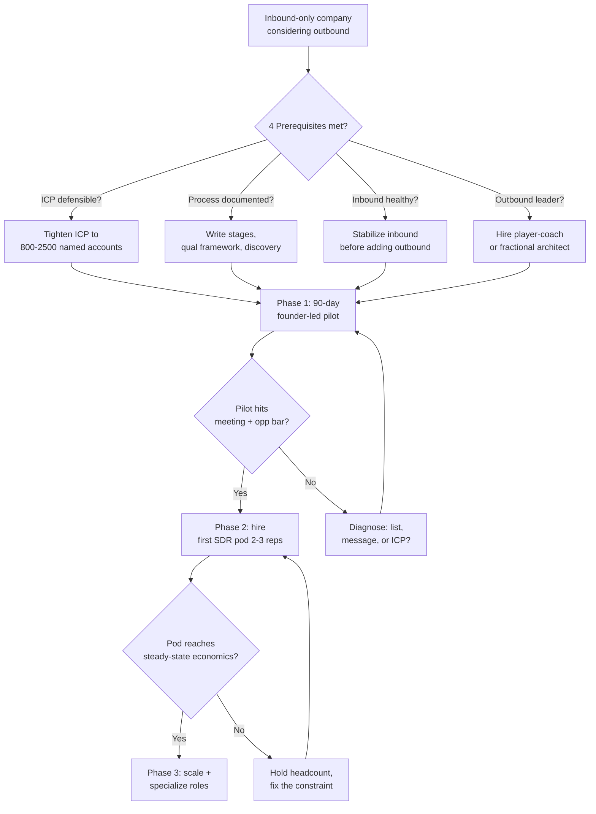

### Direct Answer

The right way to transition from inbound-only to outbound is to treat it as a **deliberate go-to-market motion build**, not a hiring decision: prove a repeatable account-selection-to-meeting model with one or two founder-supervised reps before you scale headcount, instrument outbound with its own pipeline metrics so it is never judged against inbound's conversion rates, and protect the inbound engine from being starved of resources during the 9-to-12-month ramp. Most failed transitions are not failures of effort or talent — they are failures of sequencing, where companies hire a five-person SDR pod, point it at a bad list, and conclude "outbound doesn't work for us" within two quarters. Done correctly, outbound becomes a second, independently forecastable source of pipeline that lets you control growth instead of waiting for demand to arrive.

> **TLDR:** Inbound-to-outbound is a motion build with a predictable 9-to-12-month payback, not a quick pipeline fix. Run a 90-day founder-led pilot with 1-2 reps and a hand-built list of 200-400 accounts before hiring a pod. Separate outbound pipeline reporting from inbound on day one — different conversion rates, different sales cycles, different magic number. Budget for the J-curve: outbound costs money for two-to-three quarters before it returns CAC-efficient pipeline. The four hard prerequisites are a defensible ICP, a documented sales process, an inbound engine healthy enough to survive reduced attention, and a leader who has personally built outbound before. Skip any one and you are gambling, not transitioning. Cross-links: q164 (scaling reps), q94 (inbound/outbound ratio at $20M ARR), q1108 (magic number during the shift), q110 (cadence tooling), q1112 (scaling 10→30 reps), q775 (founder-led to AE-led).

---

## 1. Why the Inbound-to-Outbound Transition Is Hard

### 1.1 The structural reason inbound-only companies struggle to add outbound

Companies that grew on inbound-only pipeline develop an entire operating system optimized for **demand capture**, not **demand creation**. Every reflex, metric, and hiring profile is tuned for a world where buyers raise their hand first. When you bolt outbound onto that system, you are not adding a feature — you are introducing a second species into an ecosystem built for one. The friction is structural, and naming it precisely is the first step to surviving it.

- **Inbound reps are closers, not hunters.** A rep who has only ever worked inbound leads has spent their career on prospects with existing intent. They have never had to manufacture interest in a cold account. Their muscle memory is qualification and objection-handling, not pattern interruption and relevance. Asking them to "just do some outbound on the side" produces neither good outbound nor good inbound.
- **Inbound metrics make outbound look broken.** Inbound leads convert to opportunity at 10-25%; well-run cold outbound converts replied-accounts to opportunity at 2-8%. If leadership benchmarks the new motion against the old one — same dashboard, same conversion column — outbound will look like a failure on week one and stay "failing" forever.
- **The cash curve is inverted.** Inbound pipeline is cheap at the margin; the content and SEO that produce it are largely sunk cost. Outbound has a real, recurring marginal cost — SDR salary, data tools, sequencing software — that hits the P&L *before* the pipeline arrives. Founders used to capital-efficient inbound experience genuine sticker shock.
- **The org has no outbound managers.** A VP of Sales who scaled an inbound team has never coached a 40-dials-a-day SDR, never tuned a sequence, never run a connect-rate review. Competence does not transfer automatically across motions.
- **Culture treats outbound as lower-status.** In inbound-native companies, "we don't need to cold call, our brand does the work" is often a point of pride. That pride quietly sabotages the transition: the best people avoid the new team, and the new team feels like a science experiment rather than a strategic bet.

The pattern is consistent across hundreds of GTM teams: the transition fails not because outbound does not work, but because the company evaluates a demand-creation motion using a demand-capture scorecard. The fix is not effort — it is building outbound as a *separate, separately-measured system* from the first day. This connects directly to **q1108** (reading magic number when the motion shifts inbound-heavy to outbound-heavy) and **q94** (the right inbound/outbound pipeline ratio at scale).

There is also a deeper, less-discussed reason the transition is hard: **inbound-only companies have never had to be wrong on purpose.** Inbound is a forgiving feedback loop — if a campaign underperforms, you adjust copy and the cost is marginal. Outbound is an unforgiving feedback loop. A wrong ICP does not just underperform; it actively damages assets. A bad list torches deliverability. A bad message trains the market that your brand is spam. A bad pilot demoralizes the reps who will become your scaled team. Inbound failure is quiet and cheap; outbound failure is loud and compounding. Companies that have only ever run inbound have not built the organizational muscle to *fail safely*, and outbound demands that muscle. The phased approach in Section 3 exists precisely to make failure cheap and contained — a 90-day pilot with two people and a hand-built list can fail without burning anything that matters, whereas a five-person pod failing burns cash, morale, deliverability, and the company's belief in the motion all at once.

A final structural friction worth naming: **inbound and outbound compete for the same scarce resource — leadership attention — and outbound always wins that competition in the short term because it is new.** Novelty is magnetic. The CEO wants to talk about the exciting new outbound experiment in every all-hands. The VP of Sales spends their Monday mornings on the outbound funnel review because it is the unsolved problem. Meanwhile inbound, the engine that actually pays the bills, runs on autopilot and slowly degrades because nobody is tuning it. Six to nine months in, the company looks up and discovers inbound lead volume is down 20% and nobody noticed because all the attention went to a still-unproven outbound motion. This is not a hypothetical — it is the single most common way a transition produces *negative* net pipeline. The countermeasure is explicit and unglamorous: someone senior must be assigned to *defend inbound* during the transition, with inbound health as their literal job, so that the gravitational pull of the new thing does not quietly starve the old thing.

### 1.2 What "transition" actually means — and what it does not mean

The word "transition" is dangerous because it implies *replacement*. It does not. Healthy companies do not transition *away* from inbound — they add outbound *alongside* it. The goal state is a **dual-engine pipeline** where inbound and outbound each produce a known, forecastable share of pipeline, with different unit economics, sales cycles, and win rates.

| Term | What people think it means | What it should mean |
|------|---------------------------|---------------------|
| "Transition to outbound" | Stop relying on inbound; replace it | Add a second, independent pipeline source |
| "Outbound team" | A pod of SDRs sending email | A measured demand-creation system with its own funnel |
| "Outbound is working" | We booked some meetings | Meetings convert to revenue at a CAC-efficient rate |
| "We tried outbound" | We hired SDRs for a quarter | We ran a controlled pilot with a real list and a real owner |
| "Outbound ramp" | New hires get productive in 30 days | The motion reaches steady-state economics in 9-12 months |

If leadership cannot articulate the difference between these columns, the transition has already started on the wrong foot. The single most important reframe to install before spending a dollar: **you are building a system, not hiring a function.**

### 1.3 The cost of getting it wrong

The downside of a botched transition is not just wasted money — it is institutional scar tissue. Once a company concludes "outbound doesn't work for us," that belief is sticky for years. It poisons future attempts, makes it hard to hire outbound leaders (good ones can smell a graveyard), and leaves the company structurally dependent on a single demand source it does not control.

- **Direct cash burn.** A failed five-SDR pod with a manager, tooling, and data runs $650K-$900K fully loaded for a year and typically returns pipeline at 3-5x worse CAC than it should.
- **Opportunity cost.** The 12 months spent failing at outbound is 12 months not spent fixing the actual constraint — often a too-narrow ICP or a broken inbound funnel.
- **Talent damage.** SDRs hired into a doomed motion churn within 6-9 months, and their LinkedIn post-mortems make the next hiring round harder.
- **Forecasting fragility.** A company on inbound-only has a pipeline that rises and falls with market demand and ad costs it cannot control. Every quarter is a coin flip.

The transition is worth doing precisely because the prize — a controllable, forecastable second engine — is large. But the failure mode is expensive enough that sequencing discipline is not optional.

### 1.4 The strategic case FOR making the transition

It is worth being equally precise about *why* a healthy company should take this on, because the prerequisites and the J-curve can make it sound like a chore to avoid. It is not. There are four concrete strategic prizes, and any one of them can justify the build:

1. **Demand control.** Inbound-only means your growth rate is set by forces you do not own — search volume, ad auction prices, category awareness, your competitors' marketing budgets. Outbound is the only motion where *you* decide which accounts enter the pipeline and when. For a company that wants to grow on a schedule — to hit a board number, to support a fundraise, to enter a new segment — that control is not a luxury; it is the difference between steering and drifting.
2. **Reaching the accounts that never raise a hand.** The best-fit, highest-ACV enterprise accounts frequently do *not* show up via inbound. They are not searching; they have incumbents; they have procurement gates. If your inbound is bringing you mostly mid-market and SMB, outbound is the only way to systematically reach the enterprise logos that move the revenue needle and anchor your brand. **q89** (the trigger to launch an enterprise motion) and **q656** (restructuring discovery for procurement-gated buyers) are the operative siblings here.
3. **Forecastability and valuation.** Investors and acquirers pay a premium for predictable, diversified pipeline. A company with two independent, separately-forecastable engines is worth more — and is more resilient — than a company whose entire pipeline depends on one channel. The public S-1 filings of the best-scaled SaaS companies almost universally show a deliberate, multi-motion pipeline rather than single-channel dependence.
4. **Segment and geographic expansion.** When you want to enter a new vertical or a new region where you have no brand and no inbound footprint, outbound is the *only* tool that works on day one. Inbound in a new segment takes 12-18 months of content and SEO to compound. Outbound can be live in that segment in 90 days. **q151** (sales motion for vertical vs horizontal SaaS) explores how this plays out.

The honest framing for leadership: the transition costs money and patience, but the alternative — remaining structurally dependent on a single demand channel you do not control — is itself a large, often-invisible risk. Inbound-only is not a "safe" default. It is a concentrated bet on continued favorable market conditions. Adding outbound is, among other things, a diversification of that risk.

---

## 2. The Four Prerequisites — Do Not Start Without These

### 2.1 Prerequisite one: a defensible, narrow ICP

Outbound is unforgiving of a fuzzy Ideal Customer Profile in a way inbound is not. Inbound self-selects: the prospect already decided you are relevant before they filled out the form. Outbound has no self-selection — *you* decide who is relevant, and if you are wrong, you burn the list, the reps' morale, and the company's domain reputation simultaneously.

A defensible ICP for outbound is not "mid-market SaaS companies." It is a profile tight enough that a smart human, handed an account, can in 60 seconds say "yes, they have the problem we solve, here is the trigger, here is who feels the pain." Test your ICP against this bar:

| ICP quality test | Weak ICP (do not start) | Strong ICP (ready for outbound) |
|------------------|------------------------|--------------------------------|
| Firmographic precision | "Companies with 200-2000 employees" | "Series B/C vertical SaaS, 50-150 reps, US HQ" |
| Trigger identifiability | "Companies that might need us" | "Hired a VP RevOps in last 90 days" |
| Pain owner clarity | "Sales leadership" | "VP Sales who just missed a quarter" |
| List size | "Tens of thousands" | "800-2,500 named accounts" |
| Win-rate evidence | "We've closed all kinds" | "We win 35%+ in this exact segment" |

If your best customers came entirely from inbound, you may have *never actually selected* an ICP — inbound selected it for you. Before outbound, do the analysis: which 20% of customers drive 80% of revenue and retain best? That cohort, not your aspirational TAM, is your outbound list. This is the same discipline behind **q775** (organizing account-segmentation triggers when moving from founder-led to AE-led).

The practical method for extracting a real ICP from an inbound customer base is a four-step audit, and it is worth doing slowly because everything downstream depends on it:

- **Step one — rank customers by revenue quality, not logo prestige.** Pull every customer, then sort by a composite of ACV, gross margin, net revenue retention, and time-to-value. The temptation is to point at the famous logo and say "we want more of those." Resist it. The famous logo may be a low-margin, high-support reference deal. The ICP is defined by the *economically best* customers, which are often not the most recognizable.
- **Step two — find the firmographic and technographic commonalities of the top quartile.** Take the best 25% of customers from step one and ask what they share. Industry? Employee band? Funding stage? Tech stack? Org structure (do they all have a VP of RevOps)? You are looking for the 3-5 attributes that, taken together, predict a great customer.
- **Step three — identify the trigger.** A firmographic profile tells you *who* fits. A trigger tells you *when* to reach them. The best triggers are observable events that create or reveal the pain you solve: a leadership hire, a funding round, a product launch, a competitor switch, a hiring spree for a relevant role, a public miss. An ICP without a trigger produces "spray" outbound; an ICP with a trigger produces relevant outbound.
- **Step four — name the disqualifiers.** Just as important as who fits is who emphatically does not. Write down the attributes that make an account a *bad* fit even if it matches the firmographics — wrong buying process, incompatible tech, too small to afford you, a segment you lose in. Disqualifiers keep the list clean and the reps focused.

The output of this audit is a one-page ICP document. If it runs longer than a page, it is not tight enough. The test of a good ICP document is operational: hand it to a brand-new SDR with no context, give them ten company names, and they should be able to correctly sort fit-from-no-fit in under a minute each. If they cannot, the document is too vague and outbound will fail at the list-building stage before a single email goes out.

| ICP audit step | Question answered | Common mistake |
|----------------|-------------------|----------------|
| Rank by revenue quality | Which customers are economically best? | Ranking by logo prestige instead |
| Find commonalities | Who fits, firmographically? | Picking attributes too broad to be useful |
| Identify the trigger | When should we reach them? | Skipping triggers — produces spray |
| Name disqualifiers | Who looks like a fit but is not? | Leaving disqualifiers implicit |

### 2.2 Prerequisite two: a documented, repeatable sales process

Outbound floods the top of the funnel with opportunities that did not pre-qualify themselves. If your sales process is "the founder figures it out on each deal," outbound will generate meetings your team cannot consistently convert, and the company will (wrongly) blame the meetings.

Before outbound, you need a written process that survives the founder's absence:

- **Defined stages with exit criteria.** Every stage should have a binary "is this true yet" checklist, not a vibe.
- **A qualification framework consistently applied.** MEDDICC, MEDDPICC, or a lighter custom variant — the specific framework matters less than that every rep uses the same one.
- **Discovery questions documented.** New outbound-sourced meetings need reps who can run discovery without founder shadowing.
- **A demo or eval path that does not require the founder.** If the founder must be in every demo, outbound just creates a founder bottleneck.
- **Win/loss reasons captured.** You need this to debug outbound conversion later.

Companies skip this because the founder *can* close without a process — so why write one down? Because outbound's volume removes the founder's ability to be in every deal. This is the bridge between **q774** (when to hire your first AE) and **q164** (scaling from 5 to 25 reps without losing culture).

A useful way to pressure-test process readiness is to ask: *if the founder went on a four-week vacation tomorrow, would outbound-sourced deals continue to progress correctly?* If the honest answer is no, the process is not documented enough — it lives in the founder's head, and outbound will simply manufacture a queue of deals waiting for the founder. The documentation does not need to be elaborate. A serviceable Phase-0 sales process fits in a handful of pages:

- **A one-page stage map.** Each stage with a name, a one-line definition, and a binary exit checklist. "Discovery" is not a stage; "Discovery complete = pain confirmed, owner identified, timeline known, budget range understood" is a stage.
- **A discovery guide.** The 8-12 questions every discovery call must cover, grouped by theme, so an outbound-sourced meeting run by a rep produces the same quality of qualification a founder call would.
- **A qualification rubric.** Pick MEDDICC, MEDDPICC, BANT, or a custom variant. The choice matters far less than the consistency. Reps must score every opp the same way so the pipeline is comparable.
- **A demo/eval runbook.** What a standard demo covers, in what order, and what a proof-of-concept or trial looks like — defined well enough that the founder need not personally attend.
- **A win/loss capture habit.** Every closed deal, won or lost, gets a reason logged in a controlled field. This is the data you will need in Section 6 to diagnose outbound conversion.

The reason this matters specifically for *outbound* and not just for scaling generally: inbound-sourced deals arrive pre-warmed and somewhat self-qualifying, so a thin process can limp along. Outbound-sourced deals arrive cold and unqualified — the prospect did not decide you were relevant, your SDR did. The sales process is the machine that converts that cold, asserted relevance into confirmed, qualified pipeline. Without the machine, outbound just produces a pile of lukewarm meetings and the company concludes "the leads are bad" when the real problem is that there is no system to convert them.

### 2.3 Prerequisite three: an inbound engine healthy enough to survive divided attention

The most common silent killer of an inbound-to-outbound transition: leadership's attention is finite, and it all migrates to the shiny new outbound project, so inbound quietly degrades. Six months later the company has a mediocre outbound motion *and* a neglected inbound motion — net pipeline is flat or down.

Before you start, honestly assess inbound's health:

| Inbound health signal | Green (safe to add outbound) | Red (fix inbound first) |
|----------------------|------------------------------|------------------------|
| Lead volume trend | Flat or growing | Declining QoQ |
| Lead-to-opp conversion | Stable | Eroding |
| CAC on inbound | Stable or improving | Rising fast |
| Dependence on one channel | Diversified | 70%+ from one source |
| Content/SEO momentum | Compounding | Stalled |

If inbound is *declining*, do not start outbound as a rescue — a panicked outbound build under pipeline pressure is the worst possible starting condition. Stabilize inbound first, *then* add outbound from a position of strength. Outbound built in panic gets the wrong ICP, the wrong hires, and an impossible timeline.

### 2.4 Prerequisite four: an outbound-experienced leader

Outbound and inbound require genuinely different management. An inbound VP optimizes routing, speed-to-lead, and conversion coaching. An outbound leader optimizes list quality, sequence performance, connect rates, and activity discipline. These are different jobs.

You have three options, in order of preference for most companies:

1. **Hire a player-coach outbound leader** (a senior SDR manager or Director of Sales Development who has built outbound 0→1 before). Best ROI for companies past ~$5M ARR.
2. **Bring in a fractional outbound architect for 6 months** to build the playbook, hire the first reps, and hand off. Good for sub-$5M ARR or capital-constrained teams.
3. **The founder personally runs the pilot** for 90 days. Viable and often *ideal* for the first phase — the founder knows the ICP and the pitch better than anyone — but the founder must hand off before scaling.

The anti-pattern: promoting your best inbound AE to "run outbound" with no outbound experience. Closing skill does not transfer to motion-building skill. This is the same mistake **q125** warns about (metrics that show a sales manager will not scale) and **q1101** (assessing sales leaders beyond the values interview).

---

## 3. The Phased Roadmap — Pilot Before Pod

### 3.1 Phase 0: foundation (weeks 1-4)

Before a single outbound email is sent, you build the scaffolding. This phase is unglamorous and frequently skipped — which is exactly why so many transitions fail.

- **Finalize the ICP document.** One page. Firmographics, triggers, pain owner, disqualifiers. Signed off by founder and sales leader.
- **Build the first list by hand.** 200-400 accounts, manually researched, not a tool export. Hand-building forces you to confront whether the ICP is real.
- **Pick a minimal tool stack.** A data source, a sequencer, and CRM hygiene. Do not over-buy in Phase 0 — see Section 5.
- **Write the first three sequences.** One per persona or trigger. Founder-quality copy, not template-mill copy.
- **Define the outbound funnel and its metrics.** Decide *now* how you will measure: accounts touched, connect rate, reply rate, meetings booked, meetings held, opps created, opp-to-close. Separate dashboard from inbound.
- **Set the pilot success bar.** Write down the number that means "this works." Be specific: e.g., "8 held meetings and 3 qualified opps per rep per month by week 10."

The reason Phase 0 gets skipped is that it produces no visible output — no meetings, no pipeline, no dashboard movement. To a founder under pressure it feels like four weeks of nothing. But Phase 0 is where the *quality* of everything downstream is determined. A pilot run on a hand-built, well-researched list of 300 accounts with founder-quality sequences will succeed or fail *honestly* — it will tell you the truth about whether the motion works. A pilot run on a sloppy tool-export list with template-mill copy will fail *uninformatively* — you will not know whether outbound is wrong for you or whether you simply ran a bad pilot. The entire value of the phased approach is that each phase produces a clean, trustworthy signal. Phase 0 is what makes Phase 1's signal trustworthy.

A specific warning on list-building: **build the first list by hand, even though tools can export 10,000 accounts in a click.** Hand-building 300 accounts takes a person a few days, and that friction is the point. Every account you manually add forces you to look at it and ask "does this genuinely fit the ICP, and is there a trigger?" That act of judgment is the ICP being stress-tested account by account. A tool export skips the judgment entirely and hands you a list whose fit you have never actually verified. Teams that hand-build their first list routinely discover their ICP is wrong *during the build* — before any reputational or morale cost — which is exactly when you want to discover it.

### 3.2 Phase 1: the founder-led (or leader-led) pilot (weeks 5-16)

The pilot is the heart of the transition. One or two people — ideally including the founder or the outbound leader — run real outbound against the hand-built list for 90 days. The goal is not pipeline volume. It is **proof of a repeatable model.**

| Pilot dimension | What you are testing | Pass signal |
|-----------------|---------------------|-------------|
| List quality | Is the ICP real and reachable? | 25%+ of accounts have a valid contact + trigger |
| Connect/reply | Does the message land? | Reply rate 4-10% on cold sequences |
| Meeting conversion | Do replies become meetings? | 30%+ of positive replies book |
| Opp conversion | Do meetings become real opps? | 30-50% of held meetings create an opp |
| Repeatability | Can a second person do it? | Rep #2 hits 70%+ of rep #1's numbers |

The pilot answers the only question that matters before you spend real money: **is there a repeatable account-selection-to-meeting model here, or not?** If yes, you scale. If no, you diagnose (Section 6) and re-pilot. You never scale a motion you have not proven — hiring five SDRs against an unproven model is the single most expensive mistake in this entire playbook.

Two subtle pilot-design points are worth dwelling on, because getting them wrong invalidates the whole exercise:

- **The pilot must test repeatability, not just possibility.** A founder is an unrepresentative outbound rep. They know the product cold, they have credibility, they can improvise on a call in ways a new SDR cannot. A pilot run *only* by the founder proves the motion is *possible*, not that it is *repeatable*. That is why the pilot ideally involves a second person — the outbound leader, or one early SDR — running the same plays. The key pass signal in the pilot table is "rep #2 hits 70%+ of rep #1's numbers." If only the founder can make outbound work, you do not have a scalable motion; you have a founder doing outbound, which does not survive Phase 2.
- **The pilot must run long enough to clear the noise.** Outbound is statistically noisy at small volumes. A great week and a terrible week can both happen by chance. Ninety days is the minimum to see through that noise — it gives you enough touches, enough replies, and enough full sales-cycle starts to trust the numbers. A four-week "pilot" tells you almost nothing; it is a sample too small to distinguish signal from variance. Founders under pressure want to compress the pilot to 30 days. Do not. A compressed pilot does not save time; it produces an untrustworthy answer that you will have to re-test anyway.

It is also worth being explicit about what a *passing* pilot does and does not entitle you to. A passing pilot entitles you to hire a small pod and run the proven plays at slightly larger scale. It does *not* entitle you to hire eight reps, sign a six-figure tooling contract, and set an aggressive pipeline target. The pilot proves the model works at the scale of one-to-two people; Phase 2 tests whether it survives being handed to people who are *not* the founder and *not* the architect. That is a genuinely separate question, and it gets its own phase and its own go/no-go gate.

### 3.3 Phase 2: the first pod (months 5-9)

Once the pilot passes, hire your first real SDR pod — **2-3 reps, not 5-8.** A small pod is coachable, observable, and cheap enough to course-correct. The outbound leader (or founder transitioning out) personally onboards each rep against the proven playbook.

- **Hire for the motion, not the resume.** First outbound hires need resilience, coachability, and research instinct — not necessarily prior SDR titles.
- **Onboard against the playbook.** New reps run the *proven* sequences and lists, not their own experiments. Innovation comes after they hit the baseline.
- **Protect the metrics separation.** The pod is forecast and reviewed on the outbound dashboard, never against inbound conversion.
- **Run weekly funnel reviews.** Connect rate, reply rate, meeting rate, opp rate — per rep, every week.
- **Expect a real ramp.** Even good outbound SDRs take 60-90 days to reach quota; the *motion* takes 9-12 months to reach steady-state economics.

The most common Phase 2 mistake is **letting new SDRs improvise too early.** A new hire arrives with opinions — their old company did it differently, they have a sequence idea, they want to target a different persona. Their enthusiasm is good, but their improvisation is not, yet. The pilot proved a *specific* set of lists, sequences, and plays works. A new rep's job in their first 60-90 days is to execute that proven playbook faithfully and hit the baseline numbers. Only once a rep is reliably at the baseline do they earn the right to experiment — and even then, experiments should be controlled, one variable at a time, with the proven play as the control. A pod where five new reps are each running five different improvised approaches is not a scaled pilot; it is five simultaneous unproven pilots, and you will not be able to tell what works.

The second Phase 2 mistake is **forecasting the pod at full productivity from month one.** A pod of three SDRs does not produce three reps' worth of pipeline in month one. It produces a fraction, climbing along a ramp curve toward steady state over the first quarter. If leadership builds the company forecast assuming instant full productivity, the pod will "miss" for its entire ramp through no fault of its own, morale will crater, and the company may kill a perfectly healthy motion. Build the forecast on the *ramp curve*, not the steady-state number, and judge each rep against where they should be on the curve — not against a tenured rep's output.

A note on hiring profile: the instinct is to hire experienced SDRs from impressive companies. For a *first* outbound pod at an inbound-native company, that is not always right. The first pod is building the motion alongside the leader, running a still-young playbook, and operating without the comfortable infrastructure a big-company SDR is used to. Resilience, coachability, research curiosity, and comfort with ambiguity matter more than a polished SDR resume. **q1132** (interviewing AE candidates without a pipeline to role-play against) and **q611** (interview frameworks that surface coachability) carry the relevant interviewing discipline.

### 3.4 Phase 3: scale and specialize (months 10+)

Only after the first pod is consistently hitting steady-state economics do you scale and add specialization: dedicated list/ops support, possibly splitting SDR roles by segment, building an SDR-to-AE promotion path. This is where **q1112** (scaling 10→30 reps without crushing win rate) and **q1100** (when sales-ops outgrows a single contributor) become the operative playbooks.

| Phase | Duration | Headcount | Primary question |
|-------|----------|-----------|------------------|
| Phase 0: Foundation | Weeks 1-4 | 0 (founder + leader) | Is the scaffolding built? |
| Phase 1: Pilot | Weeks 5-16 | 1-2 | Is the model repeatable? |
| Phase 2: First pod | Months 5-9 | 2-3 SDRs | Does it reach steady-state economics? |
| Phase 3: Scale | Months 10+ | 5+ and specialized | Can it scale without degrading? |

---

## 4. Metrics — Measuring Outbound Without Lying to Yourself

### 4.1 The cardinal rule: separate dashboards

The single most important measurement decision: **outbound gets its own dashboard, its own funnel definitions, and its own benchmarks from day one.** Never let an executive look at a blended conversion number during the transition — blending hides the truth in both directions.

| Funnel stage | Typical inbound | Typical cold outbound | Why they differ |
|--------------|----------------|----------------------|-----------------|
| Top-of-funnel → meeting | 8-20% of leads | 1-4% of accounts touched | Inbound pre-qualified intent |
| Meeting → opportunity | 50-70% | 30-50% | Outbound prospects less educated |
| Opportunity → closed-won | 25-40% | 15-30% | Less intent, longer education |
| Sales cycle length | Baseline | 1.3-1.8x longer | Buyer starts colder |
| Fully-loaded CAC | Lower | Higher initially, converges later | Outbound has marginal cost |

If you judge outbound by inbound's numbers, you will kill a healthy motion in its second quarter. If you blend them, you will not notice inbound degrading. Two dashboards, always.

There is a third reason the dashboards must stay separate that is often overlooked: **outbound and inbound deals behave differently in the forecast.** An inbound-sourced opportunity tends to move predictably — the buyer had intent, the cycle is shorter, the close-rate distribution is tighter. An outbound-sourced opportunity is higher-variance — some convert fast because the trigger was real and timely, others sit for two quarters while the buyer's organization catches up to the problem. If those two populations are blended in one pipeline, the forecast becomes a muddle: the outbound variance contaminates the inbound predictability, and the sales leader loses the ability to commit a number with confidence. Keeping the two motions in separate forecast categories — even if they roll up to one total — preserves the forecastability of the inbound base while you build the outbound engine. This is a direct input to the magic-number reading discussed in **q1108** and the steady-state ratio question in **q94**.

### 4.2 The metrics that actually matter by phase

- **Phase 1 (pilot): leading indicators only.** Reply rate, positive-reply rate, meeting-book rate. Do not look at revenue — it is too early and too noisy.
- **Phase 2 (first pod): full funnel + ramp curve.** Now you track opp creation and early pipeline, plus each rep's ramp against the expected curve.
- **Phase 3 (scale): unit economics.** Outbound CAC, outbound payback period, outbound magic number, pipeline coverage.

### 4.3 Magic number and the motion shift

When your motion shifts from inbound-heavy to outbound-heavy, the **magic number** (net new ARR ÷ prior-period S&M spend) will *temporarily decline* — outbound spends ahead of revenue. This is expected, not alarming, *if* you understand the J-curve. The mistake is reading a falling magic number as "sales is broken" and cutting outbound right as it is about to inflect. **q1108** covers exactly how to read magic number during this shift; **q94** covers what the steady-state inbound/outbound ratio should look like once the dust settles.

| Quarter of transition | Expected magic number behavior | Correct interpretation |
|----------------------|-------------------------------|------------------------|
| Q1-Q2 (pilot + early pod) | Declines | J-curve dip — outbound spend leads revenue |
| Q3-Q4 | Flattens at lower level | Outbound pipeline starting to convert |
| Q5+ | Recovers, ideally exceeds prior level | Steady-state — second engine now contributing |

### 4.4 A sample outbound scorecard

| Metric | Phase 1 target | Phase 2 target | Phase 3 target |
|--------|---------------|----------------|----------------|
| Accounts touched / rep / week | 150-250 | 200-350 | 250-400 |
| Reply rate | 4-8% | 4-8% | 5-9% |
| Meetings held / rep / month | 6-10 | 8-14 | 10-16 |
| Opps created / rep / month | 2-4 | 4-7 | 6-9 |
| Opp-to-close | n/a (too early) | 15-25% | 20-30% |
| Outbound CAC payback | n/a | Track, do not judge | < 18 months |

---

## 5. Tooling and Stack — Buy Late, Buy Light

### 5.1 The Phase 0 minimum stack

Outbound tooling vendors will sell you a six-figure stack before you have proven the motion. Resist. The Phase 0 minimum is a data source, a sequencer, and clean CRM hygiene. Everything else waits.

| Layer | Phase 0 (pilot) | Phase 2-3 (scaled) | Notes |
|-------|----------------|--------------------|-------|
| Data / contacts | Apollo or single ZoomInfo seat | ZoomInfo or Apollo at scale + enrichment | See q1109 for the Apollo vs ZoomInfo decision |
| Sequencing | Apollo built-in or light Salesloft | Outreach or Salesloft | See q110 for cadence-tool comparison |
| CRM | Existing CRM, kept clean | Same + outbound-specific fields | Hygiene matters more than features |
| Intent / signals | None — skip in Phase 0 | Add once pod is proven | Premature intent data is noise |
| Conversation intelligence | None | Gong/Chorus once volume justifies | Coaching tool, not a Phase 0 need |

### 5.2 Why "buy late" is the right discipline

Heavy tooling bought before the motion is proven does three bad things: it inflates the sunk cost so leadership is reluctant to admit the motion is not working, it adds configuration overhead during the phase when speed matters most, and it lets reps hide behind "the tool isn't set up right" instead of confronting list and message quality. The pilot should be almost suspiciously cheap. If your pilot needs $80K of software to function, you are not running a pilot — you are running a scaled rollout and calling it a pilot.

For the specific build-vs-buy and vendor-selection logic, **q1109** (Apollo vs ZoomInfo for a 20-rep team) and **q110** (Outreach vs Salesloft vs Apollo for cadences) are the operative sibling entries. **q1916** and **q1908** are worth reading for where this tooling category is heading as AI agents absorb sequencing.

One more discipline point on tooling: **the single most important "tool" in early outbound is CRM hygiene, and it costs nothing to buy.** Outbound generates volume — hundreds of accounts touched, dozens of replies, multiple meetings booked per week per rep. If the CRM is not clean, that volume turns into chaos: duplicate accounts, contacts with no account, opportunities with no stage discipline, activity that is not logged. Within a quarter, the data you need to *diagnose* outbound (Section 6) is unusable, and you cannot tell whether the motion is working. Before Phase 1 starts, lock down a minimal set of required fields, define how an outbound-sourced opportunity is tagged versus an inbound one, decide who owns deduplication, and make activity logging non-optional. This is unglamorous, free, and more important than any six-figure platform. A clean CRM with a cheap sequencer beats a messy CRM with the best tooling money can buy.

### 5.3 The AI-agent caveat

As of 2026, AI sequencing agents are changing the cost structure of outbound. The strategic sequencing in this answer still holds — pilot, separate metrics, protect inbound — but the *headcount* math in Phase 2-3 is shifting. A pod that needed 5 SDRs in 2023 may need 3 SDRs plus AI assist in 2026. Do not let that tempt you to skip the pilot: AI changes the cost of *executing* outbound, not the difficulty of *proving the ICP*. **q1883** (what replaces cold outbound if AI handles forecasting) and **q1916/q1908** explore this frontier.

---

## 6. Diagnosing a Stalling Transition

### 6.1 The decision tree when the pilot underperforms

If the pilot is not hitting its bar, do not conclude "outbound doesn't work." Diagnose in this order — the constraint is almost always upstream of where it looks.

| Symptom | Most likely cause | Fix |
|---------|------------------|-----|
| Low connect/valid-contact rate | Bad data or wrong ICP | Re-verify list, tighten ICP |
| Connects but near-zero replies | Weak message / wrong persona | Rewrite sequences, test new trigger |
| Replies but few meetings | Weak meeting ask / poor follow-up | Fix CTA, tighten follow-up cadence |
| Meetings but few opps | Wrong people or unqualified accounts | ICP too loose — re-segment |
| Opps but no closes | Product-market or pricing issue | Not an outbound problem — escalate |
| Everything fine but reps miss | Activity discipline / coaching gap | Management problem, not motion problem |

The discipline: the failure is upstream of where it presents. Few closes usually means a loose ICP, not bad reps. Few meetings usually means a weak message, not lazy SDRs. Fix the earliest stage in the funnel first.

The reason this upstream-first discipline matters so much is that the *visible* symptom is almost always at the wrong stage to fix. A founder watching a stalling pilot sees "we're not closing deals" and instinctively wants to coach closing skills, run a pricing review, or pressure the AEs. But if the real problem is a loose ICP three stages upstream, every dollar and hour spent on the closing stage is wasted — the deals that reach the close were never going to close because they were never good-fit accounts. The single most valuable diagnostic habit is to *always start the investigation at the top of the funnel and work down*, asking at each stage "is the conversion rate here in the expected band?" The first stage that is out of band is the real constraint, regardless of where the pain is being felt. Fix that stage, let the funnel re-stabilize, and only then look downstream. Fixing stages out of order — or fixing the stage where the symptom appears rather than the stage where the cause lives — is how teams spend a quarter "fixing outbound" and end up exactly where they started.

### 6.2 The five most common transition mistakes

1. **Hiring a pod before running a pilot.** The single most expensive error. You scale an unproven model and burn $650K-$900K learning what a $50K pilot would have told you.
2. **Judging outbound on inbound metrics.** Kills healthy motions in Q2.
3. **Starving inbound of attention.** You end up with two mediocre motions instead of one good one.
4. **Promoting an inbound AE to "run outbound."** Closing skill is not motion-building skill.
5. **Buying a heavy stack before proving the motion.** Inflates sunk cost and hides list/message problems.

### 6.3 Knowing when to stop

Sometimes the honest answer is that outbound is not right *yet*. Stop or pause the transition if: the pilot fails twice with different lists and different messages (the ICP or product may not support cold outreach); inbound is collapsing and needs all hands; or the company cannot fund a 9-12 month J-curve without endangering runway. Pausing is a legitimate, disciplined decision — not a failure.

---

## 7. Counter-Case — When NOT to Transition to Outbound

This playbook assumes outbound is the right next move. Often it is not. Outbound is a powerful but expensive engine, and several real situations argue *against* building it now:

- **Your inbound is still under-monetized.** If you have not yet maximized conversion, pricing, expansion, and lead routing on inbound, fixing those is higher-ROI and far cheaper than building a new motion. Outbound to escape an inbound conversion problem just hides the problem.
- **Your ACV is too low to support outbound CAC.** If your average contract value is small (e.g., low-thousands ARR) and your motion is genuinely self-serve or product-led, the fully-loaded cost of an SDR-driven outbound motion may never pay back. PLG plus inbound is the right engine; outbound would be value-destructive.
- **Your TAM is tiny and you already touch it.** If your serviceable market is a few hundred accounts and your inbound brand already reaches all of them, outbound adds noise and annoys prospects without adding reach.
- **You have no defensible ICP yet.** A company still searching for product-market fit, closing scattered logos across unrelated segments, has nothing for outbound to target. Find the repeatable customer first; outbound amplifies a known ICP, it does not discover one.
- **Inbound is in free-fall and runway is short.** Outbound is a 9-12 month investment. If you need pipeline *this quarter* to survive, outbound is the wrong tool — it spends before it returns. Fix inbound or cut burn.
- **Leadership will not protect the J-curve.** If the board or CEO will cut outbound the first quarter magic number dips, do not start. A motion that gets killed mid-J-curve wastes 100% of the spend. Better to not begin than to begin and abandon.
- **You are pre-process and founder-dependent.** If the founder is still the only person who can close, outbound just creates a founder bottleneck. Build the repeatable sales process first (**q774**, **q775**).

The honest version: roughly a third of inbound-only companies that *think* they need outbound actually need to fix inbound monetization, tighten their ICP, or build a sales process first. Outbound is the right move when inbound is healthy but *capped*, the ICP is defensible, the ACV supports the CAC, and leadership can fund a year-long build. Absent those, "transition to outbound" is the wrong prescription.

---

## 8. Operator Playbooks — How Real Companies Did This

The named operators below are public figures and, where applicable, companies are shown with stock tickers. These are illustrative of *patterns*, not endorsements of specific tactics for your situation.

### 8.1 The disciplined-sequencing operators

- **Frank Slootman**, in scaling Snowflake (SNOW), is associated with the doctrine of amplitude and prioritization — adding motions deliberately, not reactively. The transition discipline here echoes that: prove, then pour fuel.
- **Mark Roberge**, former CRO of HubSpot (HUBS), built one of the most documented inbound machines and later wrote extensively on layering outbound onto it — explicitly warning against measuring the two motions with one scorecard.
- **Aaron Ross**, co-author of *Predictable Revenue* based on the outbound model built at Salesforce (CRM), originated the specialized-SDR-pod concept that underlies Phase 2-3 of this playbook.
- **Carl Eschenbach** and **Bill McDermott**, in their respective enterprise-sales careers at companies including ServiceNow (NOW), are associated with the discipline of motion specialization at scale.
- **Manny Medina**, founder of Outreach, built the category of outbound sequencing software now central to the Phase 2 stack.

### 8.2 What the patterns have in common

| Pattern | Operator association | Lesson for the transition |
|---------|---------------------|---------------------------|
| Prove before scaling | Slootman / Snowflake (SNOW) | Run the pilot; do not hire ahead of proof |
| Separate motion measurement | Roberge / HubSpot (HUBS) | Two dashboards, never blend |
| Specialized SDR pods | Ross / Salesforce (CRM) | Phase 2 pod with dedicated outbound roles |
| Motion specialization at scale | Eschenbach / McDermott / ServiceNow (NOW) | Phase 3 segment-based role splits |
| Tooling as enabler, not driver | Medina / Outreach | Buy the stack after the motion is proven |

The thread across all of them: **outbound is a system you build and measure deliberately, not a switch you flip.** That is the entire answer to "what's the right way to transition."

---

## 9. A 12-Month Timeline You Can Hold Yourself To

| Month | Milestone | Go/no-go check |
|-------|-----------|----------------|
| 1 | ICP doc signed, list of 200-400 hand-built | Is the ICP defensible? |
| 2 | Sequences written, stack live, pilot starts | Are sequences founder-quality? |
| 3 | Pilot mid-point review | Reply rate in 4-10% band? |
| 4 | Pilot success/fail decision | Did rep #2 hit 70% of rep #1? |
| 5 | First pod hired (2-3 SDRs) | Hired for motion, not resume? |
| 6 | Pod onboarded against proven playbook | Reps running proven sequences? |
| 7-8 | Weekly funnel reviews, ramp tracking | Reps on the expected ramp curve? |
| 9 | Steady-state economics check | Outbound CAC trending to target? |
| 10 | Scale decision | Does it scale without degrading? |
| 11-12 | Specialize roles, build promotion path | Magic number recovering? |

If you cannot answer the go/no-go check for a given month with a confident "yes," do not advance to the next row. The timeline is a discipline device, not a schedule to rush.

---

## 10. Frequently Asked Sub-Questions

### 10.1 "Can we just hire one great SDR and skip the pilot?"

One great SDR *is* a valid pilot — if that SDR (or the founder alongside them) runs the structured Phase 1 with a defined success bar. The thing you cannot skip is the *proof step*. "Hire one SDR and see" with no bar and no list discipline is not a pilot; it is a hope.

### 10.2 "How much should the pilot cost?"

A pilot should be cheap — primarily the time of the founder or outbound leader plus a light tool stack (often under $5K-$15K all-in for 90 days if the leader's time is treated as already-spent). If your "pilot" budget looks like a scaled rollout, you have skipped the pilot.

### 10.3 "What if the founder doesn't have time to run the pilot?"

Then hire a fractional outbound architect (Prerequisite four, option 2). The pilot *must* be run by someone who deeply knows the ICP and pitch. If no such person has time, that itself is a signal the company is not ready.

### 10.4 "How do we keep inbound reps from feeling threatened?"

Frame outbound as *additive* capacity, not a referendum on inbound. Be explicit that inbound remains a core engine, give inbound reps first look at any outbound-sourced opps in their territory, and never let outbound become the "favored child." See **q164** on protecting culture through scaling.

### 10.5 "When is the transition 'done'?"

It is never fully done — but it reaches steady state when outbound produces a known, forecastable share of pipeline at an acceptable CAC, has its own management and metrics, and the company could weather an inbound dip without panic. That is the dual-engine goal state. **q94** defines what that steady-state ratio should look like.

### 10.6 "Should outbound and inbound reps be the same people or separate teams?"

For the transition phase, keep them separate. The motions require different daily behavior, different coaching, and different metrics, and a rep asked to split their day between inbound speed-to-lead and outbound cold prospecting will do neither well — the urgent inbound lead always wins the rep's attention over the patient outbound work. A dedicated outbound team, even a tiny one, builds the specific muscle the motion needs. Later, at scale, some companies do recombine into hybrid pods, but that is a Phase 3+ optimization, not a transition-phase choice. **q717** (how a sales manager's job changes with team size) and **q1100** (when sales-ops must split into specialized roles) are the relevant siblings on org structure.

### 10.7 "How do we set quota and comp for the first outbound reps?"

Cautiously and provisionally. During the pilot and early Phase 2 you do not yet know the true steady-state productivity, so a quota set in advance is a guess. Use a ramped quota that climbs over the first two quarters, weight early comp toward activity and meeting quality rather than closed revenue (the sales cycle is too long for revenue comp to be fair in month one), and revisit the plan once you have real ramp data. Comp set too aggressively against an unproven motion churns your first reps and poisons the talent pool; comp that protects reps through the ramp keeps the team you spent months building. **q9526** (commission and quota structure to prevent cannibalization across motions) goes deeper on the multi-motion comp problem.

---

## 11. Bottom Line

The right way to transition from inbound-only to outbound is **sequenced patience**: confirm the four prerequisites (defensible ICP, documented process, healthy inbound, experienced outbound leader), run a 90-day founder-led pilot against a hand-built list, prove a repeatable account-selection-to-meeting model, *then* hire a small pod and scale only after it reaches steady-state economics. Measure outbound on its own dashboard from day one, budget for a 9-12 month J-curve, and protect the inbound engine throughout. The companies that fail at this transition almost never fail because outbound is wrong for them — they fail because they hired a pod before proving the model, judged the new motion by the old motion's numbers, or starved inbound while chasing the shiny new thing. Treat it as a deliberate motion build, give it the time it genuinely needs, and you earn a second, controllable pipeline engine. Rush it, and you earn institutional scar tissue that makes the next attempt harder.

---

## Related Library Entries

- **q164** — How do I scale from 5 reps to 25 without losing culture?
- **q94** — What's the right ratio of inbound to outbound pipeline at $20M ARR?
- **q1108** — Reading magic number when your sales motion shifts from inbound-heavy to outbound-heavy
- **q110** — Evaluating Outreach vs Salesloft vs Apollo for outbound cadences
- **q1112** — Scaling a sales team from 10 to 30 reps in 9 months without crushing win rate
- **q775** — Organizing account-segmentation triggers when moving from founder-led to AE-led
- **q774** — When should we hire our first account executive at $5M ARR?
- **q1109** — Evaluating Apollo vs ZoomInfo for a 20-rep outbound team in 2026
- **q1100** — When sales-ops outgrows a single contributor and needs to split roles
- **q1114** — Personalizing cold email at scale with 200 prospects per SDR per week

---

## Sources

1. Aaron Ross & Marylou Tyler, *Predictable Revenue*, 2011.
2. Mark Roberge, *The Sales Acceleration Formula*, 2015.
3. Frank Slootman, *Amp It Up*, 2022.
4. HubSpot Annual Inbound Marketing & Sales reports, 2020-2025.
5. Salesforce State of Sales reports, 2021-2025.
6. SaaStr, "When to Add Outbound to an Inbound Motion," GTM essays archive.
7. SaaStr, "The Real Cost of an SDR," operating-metrics series.
8. OpenView Partners, SaaS Benchmarks Report, 2019-2022.
9. Bessemer Venture Partners, State of the Cloud, 2021-2025.
10. Tomasz Tunguz, "Magic Number and the Efficiency of Go-to-Market," blog archive.
11. David Skok, "SaaS Metrics 2.0," forEntrepreneurs.
12. Pavilion (formerly Revenue Collective), GTM benchmark surveys, 2022-2025.
13. Gong Labs research notes on outbound reply rates, 2021-2024.
14. Outreach research on sequence performance benchmarks, 2021-2024.
15. Salesloft Cadence Benchmark Report, 2022-2024.
16. ZoomInfo product documentation and data-coverage materials.
17. Apollo.io product documentation and pricing pages.
18. Winning by Design, "The SaaS Sales Method," practitioner materials.
19. Sales Hacker, "Building Your First Outbound Team," article archive.
20. The Bridge Group, SDR Metrics & Compensation Report, 2020-2024.
21. CSO Insights / Korn Ferry Sales Performance studies.
22. McKinsey B2B Pulse surveys, 2021-2024.
23. Forrester B2B buying-behavior research, 2021-2024.
24. Gartner research on B2B buyer journeys and rep interaction, 2021-2025.
25. First Round Review, GTM and sales-build essays.
26. a16z enterprise go-to-market essays, 2019-2024.
27. ProfitWell / Paddle pricing and monetization research.
28. HubSpot Research, lead-conversion benchmark studies.
29. Demand Curve, cold-email and outbound playbook materials.
30. Lavender / cold-email copy benchmark studies, 2022-2024.
31. RevGenius and Pavilion community GTM operator discussions.
32. Crunchbase and public S-1 filings (Snowflake, HubSpot, ServiceNow, Salesforce) for scaling-motion context.
33. Pulse RevOps internal library: q164, q94, q1108, q110, q1112, q775, q774, q1109, q1100, q1114.
