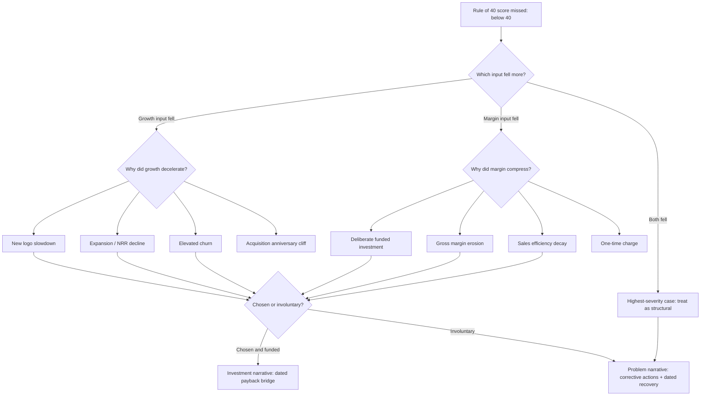

### Direct Answer

The Rule of 40 measures whether a software company's combined revenue growth rate and profit margin clear 40%, acting as a single shorthand for whether you are creating durable enterprise value or merely buying growth with cash you cannot afford to lose. When your score misses, the explanation that works with a board is never an apology — it is a disaggregation that separates which input fell, why it fell, whether the miss was a deliberate investment choice or an involuntary deterioration, and what the score will be in four quarters. A miss explained as a quantified, time-boxed, reversible trade buys you patience; a miss explained as a vibe burns it.

> **TLDR**
> - **The Rule of 40 is a balance test, not a target.** It says growth rate plus profit margin should sum to 40% or more, so a company can be valued on either lever as long as the combination is healthy.
> - **The denominator wars matter more than the rule.** Whether you use revenue growth or ARR growth, GAAP operating margin or FCF margin or adjusted EBITDA margin, can swing your score by 15-25 points. Pick one definition, document it, and never change it mid-narrative.
> - **A miss is a diagnosis, not a verdict.** Boards forgive misses caused by deliberate, funded, reversible investment. They punish misses caused by deteriorating unit economics, because those compound.
> - **Public comps anchor the conversation.** Snowflake, CrowdStrike, Datadog, ServiceNow, and Atlassian all publish the inputs; mapping your score against the Bessemer Cloud Index removes the argument about whether 34% is "bad."
> - **The board question behind the board question** is "is this fixable and when," so every Rule of 40 narrative must end with a dated bridge from today's score to the target score.
> - **Sequencing beats simultaneity.** No company optimizes both levers at once at scale; the operators who win choose which lever leads for the next 12-18 months and say so out loud.

---

## Section 1 — What The Rule Of 40 Actually Measures

### 1.1 The plain-language definition

The Rule of 40 states that for a healthy software business, the sum of its year-over-year revenue growth rate and its profit margin should be at least 40%. A company growing 30% with a 10% margin scores 40. A company growing 60% while burning at a negative 20% margin also scores 40. A company growing 10% with a 35% margin scores 45 and clears the bar comfortably. The rule's elegance is that it refuses to privilege growth over profit or profit over growth — it treats them as fungible contributions to a single number that proxies for value creation.

The rule emerged from venture and growth-equity circles around 2015, popularized by **Brad Feld** of Foundry Group in a widely circulated blog post, and reinforced by Techstars and a cohort of SaaS-focused investors who needed a fast way to triage cloud companies. It was never a theorem. It was a heuristic — a way to compress two financial statements into one comparable digit so an investment committee could sort fifty companies in an afternoon. Understanding that origin is the single most important thing a CFO can internalize, because it tells you exactly how much weight the number can bear and how much it cannot.

### 1.2 What the number is a proxy for

The Rule of 40 is a proxy for **capital efficiency of growth**. It asks: are you growing in a way that either generates cash or, if it consumes cash, consumes it at a rate justified by the growth it produces? A company scoring 55 is converting investment into either growth or margin at an attractive rate. A company scoring 22 is, in the rule's logic, either growing too slowly for the cash it burns or too unprofitably for the growth it shows.

The number is also a crude proxy for **optionality**. A business above 40 has the freedom to lean into either lever. It can choose to push growth harder by spending margin, or it can choose to harvest margin by easing off growth, and in both directions it stays inside the acceptable zone. A business below 40 has lost that freedom — every move on one lever must be paid for by the other, and the company is effectively pinned.

### 1.3 What the number is not

The Rule of 40 is not a valuation model, not a forecast, and not a statement about product quality. It says nothing about gross margin structure, nothing about net revenue retention, nothing about the durability of the growth it rewards, and nothing about whether the profit it counts is GAAP-real or adjusted into existence. A company can score 45 with collapsing retention masked by a one-time price increase. A company can score 30 while building the most defensible platform in its category. The rule cannot see any of that, and a board that treats it as a verdict rather than a screening signal is using it wrong.

| What the Rule of 40 measures well | What it cannot see |
|---|---|
| Combined growth-and-profit efficiency | Net revenue retention quality |
| Whether a company has lever optionality | Gross margin structure and COGS risk |
| Comparability across cloud peers | Durability and cohort decay of growth |
| Whether cash burn is proportionate to growth | Customer concentration risk |
| A fast triage signal for investors | Product moat, switching costs, TAM |
| Directional trajectory over multiple quarters | One-time items inflating either input |

### 1.4 Why two inputs and not three

People reasonably ask why the rule does not also fold in net revenue retention, gross margin, or sales efficiency. The answer is friction. Every additional input multiplies the definitional arguments and reduces comparability, because each company computes NRR and gross margin slightly differently. By restricting itself to a growth rate and a margin — two numbers that map cleanly onto an income statement — the rule keeps the cross-company comparison roughly honest. The cost is that it is blunt. The benefit is that it is fast and hard to game beyond the denominator choices we will dissect in Section 3. The rule trades precision for portability, and that trade is the entire point.

---

## Section 2 — The Two Inputs In Detail

### 2.1 The growth input: which growth, measured how

"Growth rate" sounds unambiguous until you try to compute it for a board deck. The first decision is **revenue growth versus ARR growth**. Recognized revenue growth is GAAP, audited, and lags the business because it amortizes bookings over the contract term. ARR growth is a forward-looking momentum metric, unaudited, and leads the business. For a company accelerating, ARR growth will read higher than revenue growth; for a company decelerating, ARR growth will read lower and warn you earlier. Most SaaS operators report the Rule of 40 on revenue growth for external consistency and track an ARR-based version internally as a leading indicator.

The second decision is **the period**. Year-over-year quarterly growth is volatile and seasonal. Trailing-twelve-month growth smooths the noise but lags. Most rigorous boards look at TTM revenue growth for the score and quarterly YoY as a trajectory check.

The third decision is **organic versus total**. If you closed an acquisition, inorganic revenue inflates your growth input and your Rule of 40 score for exactly four quarters, then drops off a cliff when the acquisition anniversaries. A board that does not see an organic-versus-total split will be blindsided by the anniversary cliff. Always disclose both.

### 2.2 The profit input: the hardest definitional fight

The profit input is where Rule of 40 narratives live or die. There are at least four defensible margin definitions, and they can differ by 20-plus points for the same company in the same quarter.

| Margin definition | What it includes | Typical bias | Best used when |
|---|---|---|---|
| GAAP operating margin | All costs including stock-based comp, amortization of intangibles, restructuring | Most conservative, lowest number | Public-market credibility, audit defense |
| Non-GAAP operating margin | Excludes SBC, intangible amortization, one-time items | Moderate, the public-SaaS standard | Peer comparison with public cloud companies |
| Adjusted EBITDA margin | Excludes interest, tax, D&A, SBC, one-time items | Higher, flatters the score | PE-owned or leveraged companies |
| Free cash flow margin | Operating cash flow minus capex; captures working capital and deferred revenue | Volatile, can exceed operating margin in SaaS | Cash-discipline narratives, late-stage boards |

Free cash flow margin deserves special attention because in subscription businesses with annual upfront billing, FCF margin frequently runs *above* operating margin. Customers pay for twelve months on day one; that cash lands immediately while revenue recognizes monthly. A company can show a negative operating margin and a positive FCF margin in the same period. This is real and defensible, but if you switch to FCF margin only in the quarter it flatters you, a sharp board member will notice and your credibility evaporates.

### 2.3 The stock-based compensation question

The single most contested adjustment is stock-based compensation. SBC is a real economic cost — it dilutes shareholders — but it is non-cash. Companies that exclude SBC from the margin input show meaningfully higher Rule of 40 scores. Post-2022, public-market investors grew far less tolerant of SBC add-backs, and a growing number of analysts now compute the Rule of 40 with SBC fully expensed. **Frank Slootman** at **Snowflake (SNOW)** publicly pushed his organization toward GAAP-grounded discipline and FCF-margin clarity precisely to pre-empt this critique. The defensible posture for a private company today is to report the score both ways — with and without SBC — and let the board see the spread rather than discover it.

### 2.4 A worked example of input sensitivity

Consider a company with $100M ARR, growing TTM revenue 35%, with these cost facts: GAAP operating margin negative 15%, SBC equal to 12% of revenue, one-time restructuring of 3% of revenue, and FCF margin positive 4% due to upfront annual billing.

| Score variant | Growth | Margin | Rule of 40 score | Interpretation |
|---|---|---|---|---|
| GAAP operating | 35% | -15% | 20 | Fails badly |
| Non-GAAP operating (ex-SBC, ex-restructuring) | 35% | 0% | 35 | Near miss |
| Adjusted EBITDA | 35% | +2% | 37 | Near miss, slightly better |
| FCF margin | 35% | +4% | 39 | Essentially at the line |

The same company "scores" anywhere from 20 to 39 depending entirely on definitional choices. This is not abstract — it is the reason every serious Rule of 40 conversation must begin by nailing the definition before discussing the number.

---

## Section 3 — The Denominator And Definition Wars

### 3.1 Why the definition must be frozen first

If a board and a management team are arguing about a Rule of 40 miss without first agreeing on the definition, they are not having one argument — they are having three arguments wearing a trench coat. Freezing the definition converts a political debate into an arithmetic one. The discipline is simple: pick the growth metric, pick the margin metric, write both down in the board-approved metrics appendix, and use that definition every quarter regardless of whether it flatters or punishes you.

### 3.2 The four most common gaming moves

Operators under pressure manipulate the score in predictable ways. Naming them defuses them.

- **Margin definition switching.** Reporting on FCF margin in good quarters and operating margin in bad ones, or vice versa. The fix is a frozen definition disclosed every period.
- **The acquisition anniversary trick.** Letting inorganic revenue inflate the growth input for four quarters without flagging that it disappears on the anniversary. The fix is an organic-versus-total split shown every quarter.
- **One-time-itis.** Reclassifying recurring costs as "one-time" to lift the margin input. A genuine one-time item happens once; if "restructuring" appears in three consecutive quarters it is an operating expense. The fix is a board policy on what qualifies.
- **The pull-forward.** Booking a large multi-year deal with aggressive upfront recognition or billing to spike a quarter's growth or FCF. The fix is to show the score on a normalized, smoothed basis alongside the as-reported figure.

### 3.3 Comparability across peers

A Rule of 40 score is only meaningful relative to a consistently defined peer set. The **Bessemer Cloud Index (the EMCLOUD index)** publishes growth and margin data for the public cloud universe, and Bessemer's "State of the Cloud" research has repeatedly shown that only a minority of public cloud companies clear 40 in any given year. Using that index as the reference removes the false anchor that 40 is normal and a 34 is shameful. In most market environments, 34 is roughly median, and the top quartile sits closer to 50-55.

| Public company (ticker) | Approx. growth posture | Approx. margin posture | Rule of 40 standing |
|---|---|---|---|
| Snowflake (SNOW) | High growth, decelerating | Improving FCF margin | Typically clears 40 on FCF basis |
| CrowdStrike (CRWD) | Durable high growth | Strong FCF margin | Consistently well above 40 |
| Datadog (DDOG) | High growth | Healthy FCF margin | Consistently above 40 |
| ServiceNow (NOW) | Steady 20%+ growth | High operating margin | Comfortably above 40 |
| Atlassian (TEAM) | Moderate-high growth | Solid FCF margin | Usually above 40 |
| Zoom (ZM) | Low single-digit growth | Very high margin | Around or below 40, margin-led |

The lesson from this table is that there is no single shape of a 40-plus company. CrowdStrike clears it on growth-led economics, ServiceNow clears it on margin-led economics, and Zoom hovers near it almost entirely on margin because growth has matured. The rule rewards balance, not a particular silhouette.

### 3.4 The growth-stage adjustment

A reasonable critique is that a flat 40 bar is unfair across stages. A company at $20M ARR growing 80% and burning aggressively may score below 40 on GAAP margin yet be a superb business; a company at $800M ARR should be expected to clear 40 with room to spare. Some investors apply a sliding scale — a "Rule of X" framing — where the bar rises with scale or where growth is weighted more heavily for smaller companies. For board purposes, the cleanest approach is not to abandon 40 but to present the score alongside the stage-appropriate peer cohort, so the board judges the company against companies of similar size rather than against an absolute that ignores stage.

---

## Section 4 — Explaining A Miss To Your Board

### 4.1 The mindset shift: a miss is a diagnosis

The instinct when a score misses is to apologize and promise to do better. That is the wrong move, because it tells the board nothing and signals that management does not understand its own business. A Rule of 40 miss is not a grade — it is a symptom, and the board's actual question is diagnostic: *which input fell, why, was it chosen, and is it reversible?* Your job in the board room is to answer that question before it is asked, with numbers.

### 4.2 The four-part miss narrative

Every credible miss explanation has the same four-part structure.

1. **Disaggregate the score.** State plainly: the score is 33, down from 41. Of the 8-point decline, 6 points came from the margin input and 2 from the growth input. Never let the board absorb a single composite number — always split it.
2. **Attribute the cause to a decision or a deterioration.** This is the pivotal sentence. Either "we deliberately invested 6 points of margin into a funded initiative" or "6 points of margin eroded because gross margin fell as infrastructure costs outran pricing." The first is a choice; the second is a problem. The board's reaction should be completely different to each, and your honesty about which one it is determines whether they trust you.
3. **Quantify reversibility and timing.** If it was a chosen investment, say exactly when the spend stops or starts paying back, and what the score will be when it does. If it was a deterioration, say exactly what the corrective actions are and the dated trajectory back above 40.
4. **Show the bridge.** End with a quarter-by-quarter bridge from today's score to the target score, with the specific drivers of each step labeled.

### 4.3 The script — a deliberate-investment miss

"Our Rule of 40 score this quarter is 34, against 42 a year ago. The entire 8-point decline is in the margin input; growth held at 31%. The margin compression is a deliberate, board-approved decision to fund the enterprise go-to-market build — 22 new enterprise reps and the security-and-compliance certifications required to sell upmarket. That investment is 7 points of margin. It is fully reversible: if we stopped hiring today, margin would recover within two quarters. We are not stopping, because the enterprise pipeline those reps are building is already at 2.1x their fully loaded cost and the cohorts are retaining above 120%. Our bridge: the score holds near 34 for two more quarters as reps ramp, returns to 40 in Q3 as enterprise revenue recognizes, and reaches 46 in Q4. We are choosing to be below the line for three quarters to be well above it for years."

That script works because it disaggregates, attributes to a decision, quantifies reversibility, and ends with a dated bridge. The board leaves informed, not alarmed.

### 4.4 The script — an involuntary-deterioration miss

"Our Rule of 40 score this quarter is 33, down from 40. This is not a clean story. 3 points are a deliberate marketing investment, but 4 points are an involuntary erosion: gross margin fell 4 points because our cloud infrastructure costs grew faster than our pricing, and net revenue retention slipped from 114% to 106% as down-sells in our SMB segment outpaced expansion. We are treating this as a problem, not a trade. Three corrective actions are underway: a cloud cost-optimization program targeting 3 points of gross margin recovery within two quarters, a delayed and now-completed price increase that adds roughly 2 points, and a deliberate mix shift away from the highest-churn SMB tier. We expect the score at 35 next quarter and back to 40 within three. We will report NRR by segment every quarter until this is closed."

This script is harder to deliver, but it is the one that preserves trust, because it refuses to disguise a deterioration as a choice. Boards can tell the difference, and the cost of being caught reframing a problem as a strategy is far higher than the cost of the bad quarter itself.

### 4.5 What never to say

- **"It is just one quarter."** It might be, but saying so signals you have not done the diagnostic work.
- **"Our competitors missed too."** Possibly true and entirely irrelevant to whether your business is healthy.
- **"The number is flawed anyway."** Even if the rule is blunt, attacking the metric in the room where you missed it reads as deflection.
- **"We will make it up next quarter."** Vague and unfalsifiable. Replace with a dated bridge.
- **A different margin definition than last quarter.** The fastest way to lose a board's trust mid-miss.

---

## Section 5 — Diagnosing The Miss: Which Input Fell

### 5.1 The diagnostic decision flow

Before you can explain a miss you must diagnose it, and the diagnosis follows a strict order: isolate the input, isolate the driver inside that input, then classify the driver as chosen or involuntary.

### 5.2 When the growth input fell

If the score missed mainly because growth decelerated, the next question is which growth component declined: new-logo acquisition, expansion within the base, or gross churn. Each points to a different organ of the business. A new-logo slowdown points to top-of-funnel or competitive pressure. An expansion decline points to product value realization or pricing packaging. A churn spike points to onboarding, support, or a structural fit problem. The Rule of 40 score cannot tell you which — you must decompose growth into its components and present that decomposition.

| Growth driver decline | Likely root cause | Diagnostic metric to present | Typical fix horizon |
|---|---|---|---|
| New logo slowdown | Top-of-funnel weakness, competitive loss | Pipeline coverage, win rate, CAC | 2-4 quarters |
| Expansion / NRR decline | Weak value realization, packaging | NRR by cohort, seat utilization | 2-3 quarters |
| Gross churn spike | Onboarding, support, segment misfit | Logo churn by segment and cohort | 1-3 quarters |
| Acquisition anniversary | Inorganic revenue rolling off | Organic vs. total growth split | Known and datable in advance |

### 5.3 When the margin input fell

If the score missed mainly on margin, classify the compression. Deliberate investment is the benign case — a funded, board-approved push into a new segment, geography, or product. Gross margin erosion is the dangerous case, because gross margin is structural and slow to repair. Sales efficiency decay — CAC payback lengthening, magic number falling — is the chronic case, signaling that each dollar of growth costs more than it used to. A one-time charge is the easiest case, provided it is genuinely one-time.

### 5.4 The severity ranking of miss types

Not all misses are equal. Boards should weight them, and management should pre-empt the ranking.

| Miss type | Severity | Why | Board reaction it warrants |
|---|---|---|---|
| Deliberate, funded, reversible investment | Low | Chosen trade with a return | Support, monitor the bridge |
| Genuine one-time charge | Low | Does not recur | Confirm it is truly one-time |
| Growth deceleration, macro-driven | Medium | Real but partly exogenous | Push for share-of-wallet plan |
| Sales efficiency decay | Medium-high | Chronic, compounds quietly | Demand a CAC payback plan |
| Gross margin erosion | High | Structural, slow to fix | Demand a cost and pricing plan |
| Both inputs fall together | Highest | Suggests structural failure | Treat as turnaround scenario |

The single most important message of this table is that a 34 caused by deliberate investment and a 34 caused by gross margin erosion are not the same number. They share a digit and nothing else. A board that reacts identically to both is failing at its job, and a management team that presents them identically is failing at its job.

---

## Section 6 — Operating With The Rule Of 40 Across The Lifecycle

### 6.1 The lifecycle reframe

The Rule of 40 is not a constant target across a company's life — it is the same destination reached by different roads at different stages. Early-stage companies reach 40 almost entirely through growth. Mature companies reach it increasingly through margin. The composition of the score should evolve, and a board that understands this will ask not just "are you at 40" but "is your 40 the right shape for your stage."

| Stage | ARR band | Healthy score shape | Dominant lever | Common failure |
|---|---|---|---|---|
| Early | Under $20M ARR | 50-70%+ if measured, growth-led | Growth | Premature margin focus starving growth |
| Scaling | $20M-$100M ARR | 40-50, still growth-led | Growth with margin discipline | Burning without efficiency proof |
| Expansion | $100M-$500M ARR | 40-50, balancing | Both, transitioning | Failing to begin the margin transition |
| Mature | $500M+ ARR | 40+, increasingly margin-led | Margin | Clinging to a growth identity past its time |

### 6.2 The early-stage trap

A company under $20M ARR that fixates on the Rule of 40 too early can talk itself into cutting the growth investment that is the entire reason it exists. At that stage the score, if computed at all, should be growth-dominated, and a "miss" on GAAP margin is often simply the correct allocation of venture capital into expansion. The relevant discipline early is unit economics — CAC payback, LTV/CAC, gross margin trajectory — not the composite score. Imposing a 40 bar on a Series A company is a category error.

### 6.3 The mature-stage trap

The mirror failure happens at scale. A company past $500M ARR that still defines itself by growth and refuses to begin harvesting margin will keep missing the rule as growth naturally decelerates with the law of large numbers. The mature-stage discipline is the deliberate, sequenced transition from growth-led to margin-led economics — a transition that should be visible in the score's composition over eight to twelve quarters. The board's job at this stage is to make management say out loud which lever now leads.

### 6.4 Sequencing beats simultaneity

The deepest operating truth about the Rule of 40 is that almost no company optimizes both levers at once at scale. The arithmetic of organizational attention does not allow it. Pushing growth requires sales capacity, marketing spend, and product breadth — all of which cost margin. Harvesting margin requires hiring restraint, cost discipline, and focus — all of which slow growth. The companies that consistently clear 40 are not the ones that magically do both; they are the ones that *choose which lever leads for the next 12-18 months, say so explicitly, and execute that choice cleanly,* then re-evaluate. A management team that tells its board "we are growth-led through next fiscal year, then we transition" is far more credible than one promising to maximize both at once.

### 6.5 The board-cadence model

The Rule of 40 should appear in every board package, but the surrounding context should rotate. One quarter the deep-dive is the growth decomposition; the next, the margin bridge; the next, the peer benchmark against the cohort. The score itself is a single line on a trend chart that goes back at least eight quarters, never a single quarter shown in isolation. Boards reason about trajectory; management's job is to give them the trajectory, not the snapshot.

---

## Section 7 — Worked Scenarios

### 7.1 Scenario A — The funded enterprise push

A $140M ARR company growing 33% has a non-GAAP operating margin of 4%, scoring 37. Last year it scored 44. The board sees a 7-point decline. The diagnosis: growth is flat year over year, so the entire decline is margin, and the margin compression is the enterprise go-to-market build — new reps, new certifications, a solutions-engineering function. The narrative is a deliberate-investment narrative. The bridge: 37 holds for two quarters as reps ramp, recovers to 41 as enterprise ARR recognizes, reaches 47 in four quarters. The board's correct reaction is support plus a commitment to watch enterprise pipeline conversion as the leading indicator that the investment is working.

### 7.2 Scenario B — The silent gross-margin erosion

A $90M ARR company growing 30% reports a 33 against a 39 the prior year. Management's first draft of the narrative calls it "continued investment." The real diagnosis: 5 of the 6 lost points are gross margin erosion — cloud infrastructure costs grew 40% while revenue grew 30%, and the company never repriced. This is the dangerous case. The honest narrative names it as a structural problem, commits to a cloud cost-optimization program and a price increase, and shows a dated recovery. The board's correct reaction is to demand monthly gross margin reporting until the trend reverses. The wrong outcome — and the common one — is management successfully disguising erosion as investment, the board relaxing, and the problem compounding for a year.

### 7.3 Scenario C — The acquisition cliff

A $200M ARR company scored 43 for four straight quarters, then dropped to 31. Nothing operationally changed. The company had acquired a $25M ARR business, and for four quarters that inorganic revenue inflated the growth input; on the anniversary it rolled into the comparable base and growth fell from 38% to 26%. A company that disclosed organic-versus-total growth all along saw this coming and pre-briefed the board. A company that reported only blended growth gets ambushed and spends a board meeting explaining arithmetic instead of strategy. The lesson: the cliff is fully knowable in advance; only a disclosure failure makes it a surprise.

### 7.4 Scenario D — The over-correction

A $300M ARR company missed at 36 for two quarters, the board pushed hard on profitability, and management responded by cutting sales and marketing aggressively. The next score was 44 — but the composition was wrong: growth had fallen from 28% to 16% and margin had jumped from 8% to 28%. The company "passed" the rule while quietly damaging its growth engine, and within a year growth deceleration dragged the score back below 40 with no easy lever left to pull. This scenario is the rule's most subtle failure mode: a number that improves while the business deteriorates. It is why composition, not just the digit, must always be on the table.

| Scenario | Score path | Real driver | Correct board response |
|---|---|---|---|
| A — Funded enterprise push | 44 to 37, recovering to 47 | Deliberate, funded margin investment | Support, watch pipeline conversion |
| B — Gross-margin erosion | 39 to 33 | Structural cost-vs-price gap | Demand monthly margin reporting |
| C — Acquisition cliff | 43 to 31 | Inorganic revenue anniversary | Should have been pre-briefed |
| D — Over-correction | 36 to 44 to below 40 | Growth engine cut to pass the rule | Reject the false pass, restore balance |

---

## Section 8 — The Counter-Case: When The Rule Of 40 Does Not Apply

### 8.1 The honest limits

The Rule of 40 is a useful heuristic, and like every heuristic it has a domain of validity outside which it misleads. A disciplined operator names those boundaries rather than pretending the rule is universal. There are at least six situations in which the rule should be set aside or heavily caveated.

### 8.2 Pre-product-market-fit and very early stage

A company under roughly $10-15M ARR that is still finding product-market fit should not be managed to the Rule of 40. At that stage the score, if it can be computed at all, is dominated by noise — a single large deal or a single churned logo swings it wildly — and the GAAP margin is irrelevant because the company is correctly spending venture capital to find and prove its market. Managing a seed or Series A company to 40 will starve the very experimentation the company exists to do. The right metrics there are qualitative PMF signals, cohort retention, and unit-economic trajectory.

### 8.3 Hyper-growth land-grab markets

In a genuine winner-take-most market during a land-grab phase, the company that wins may be the one that deliberately scores far below 40 for years, spending aggressively to capture a market before competitors lock it up. If the prize is a durable monopoly-like position, a 20 score sustained for three years can be the value-maximizing choice. The rule, which treats all sub-40 scores as suspect, cannot see the option value of market capture. The caveat: this argument is abused far more often than it is true, and a board should demand hard evidence that the market is genuinely winner-take-most before accepting it.

### 8.4 Non-subscription and hybrid business models

The Rule of 40 was built for subscription software with predictable recurring revenue. Applied to a business with significant services revenue, hardware, transaction-fee revenue, or heavy usage-based billing with volatile consumption, the inputs become unstable. Usage-based revenue can swing with customer activity in ways that have nothing to do with business health, and a services-heavy mix carries structurally lower gross margin that depresses the margin input for reasons the rule was never designed to judge. For these models the rule should be applied only to the subscription segment, if at all.

### 8.5 Turnarounds and post-restructuring periods

A company in the middle of a genuine turnaround will produce a Rule of 40 score that is meaningless as a steady-state signal. Restructuring charges, severance, write-downs, and the temporary growth hit of exiting unprofitable segments all distort both inputs. During a turnaround the relevant metrics are the trajectory of the corrective actions, not the composite score. The score becomes meaningful again only once the company has returned to a steady state, typically four or more quarters after the restructuring completes.

### 8.6 Profitability-maximizing mature software

At the far mature end, a software company that has chosen to be a cash-generating, slow-growth asset — growing 5% with a 45% margin, scoring 50 — passes the rule with a shape the rule was never really designed to celebrate. Here the rule is technically satisfied but uninformative; the relevant questions are about capital return, durability of the installed base, and reinvestment options, none of which the score addresses. The rule does not break here, it simply stops being the interesting metric.

### 8.7 When the inputs are not yet reliably measurable

Finally, a company without clean, audited financials and a frozen metrics definition cannot produce a Rule of 40 score worth discussing. If revenue recognition is contested, if ARR is defined loosely, or if the margin definition shifts quarter to quarter, the score is a number without a meaning. The prerequisite for using the rule at all is definitional discipline, and a company that lacks it should fix that first.

| Counter-case | Why the rule misleads | What to use instead |
|---|---|---|
| Pre-PMF / very early stage | Score is pure noise; GAAP margin irrelevant | PMF signals, cohort retention, unit economics |
| Hyper-growth land-grab | Cannot see option value of market capture | Market-share trajectory, evidence of winner-take-most |
| Non-subscription / hybrid model | Unstable inputs from services, hardware, usage | Segment-level rule on the subscription portion only |
| Active turnaround | Restructuring distorts both inputs | Trajectory of corrective actions |
| Profitability-maximizing mature SaaS | Passes but uninformative | Capital return, installed-base durability |
| No frozen definition / unaudited financials | Score has no stable meaning | Fix definitional discipline first |

### 8.8 The meta-point

The honest summary is that the Rule of 40 is a screening tool for steady-state subscription software companies at scale, and outside that domain it should be used with caveats or not at all. A management team that can articulate when the rule does not apply to its own situation is more credible, not less, because it demonstrates that the team understands the rule rather than worshipping it.

---

## Section 9 — Building The Rule Of 40 Into Governance

### 9.1 The metrics appendix

The Rule of 40 belongs in a board-approved metrics appendix that freezes, in writing, the exact definition: which growth metric, which margin metric, which adjustments are permitted, and how one-time items are classified. This appendix should be revisited at most annually and never mid-year, and any change should be flagged explicitly with both the old and new definitions shown side by side for at least two quarters of overlap.

### 9.2 The standing board exhibit

Every board package should contain a standing Rule of 40 exhibit with four components: the score on an eight-quarter trend line, the decomposition into the growth and margin inputs, the bridge from current score to target, and the peer-cohort benchmark. The exhibit should be the same every quarter so the board builds pattern recognition. Novelty in the format hides trends; consistency reveals them.

### 9.3 The pre-mortem discipline

A high-functioning management team forecasts its Rule of 40 score one to four quarters out and pre-briefs the board on expected misses before they happen. An expected miss that was forecast and explained in advance is a sign of control. A miss that surprises management is a sign that management does not understand its own business. The acquisition-cliff scenario in Section 7.3 is the canonical example: it is fully predictable, and only a forecasting failure turns it into a surprise.

### 9.4 Tying compensation to the score, carefully

Some boards tie executive compensation to the Rule of 40. This can align incentives, but it carries the over-correction risk from Scenario D: an executive paid on the composite number may improve the digit by damaging the business — cutting growth investment to spike margin. If the score is used in compensation, it should be paired with composition guardrails — minimum growth thresholds, minimum NRR thresholds — so that a "pass" achieved by gutting the growth engine does not pay out. The number alone is too easy to game from inside the company.

### 9.5 Communicating with external stakeholders

For companies approaching an IPO or already public, the Rule of 40 narrative becomes an external communications discipline. Public investors and equity analysts compute the score themselves, often with the most conservative definition, and a company that has been reporting an inflated internal version will face a credibility gap on its first public earnings call. The defensible path is to converge the internal definition toward the conservative external one well before going public, and to tell the equity story in the same disaggregated, bridge-driven way described in Section 4.

| Governance artifact | Purpose | Cadence |
|---|---|---|
| Metrics appendix | Freeze the definition | Annual review, never mid-year |
| Standing board exhibit | Build pattern recognition | Every board meeting |
| Score forecast and pre-mortem | Pre-brief expected misses | Quarterly, looking 1-4 quarters out |
| Composition guardrails | Prevent gaming via compensation | Set when comp is tied to the score |
| External definition convergence | Pre-empt IPO credibility gap | 4-8 quarters before IPO |

---

## Section 10 — Frequently Asked Board Questions

### 10.1 "Is 40 the right number, or should it be higher now?"

Forty was always a round heuristic, and in tighter capital environments many investors informally raised the bar — a "Rule of 45" or "Rule of 50" for companies at scale. The honest answer to a board is that the specific number matters less than the trend and the composition. A company moving from 38 to 44 over four quarters with healthy composition is in a better place than one sitting flat at 41. Treat 40 as a reference line, not a finish line.

### 10.2 "Why not just maximize profit?"

Because a software company that maximizes near-term profit by under-investing in growth is liquidating its future. SaaS value is overwhelmingly in the durability and expansion of the installed base, and starving growth to flatter this year's margin trades long-term enterprise value for a short-term number. The rule exists precisely to stop a board from over-weighting profit; it insists that growth has value too.

### 10.3 "Our competitor scores higher — should we worry?"

Only after you have confirmed they use the same definition, which they almost never do. A competitor reporting on adjusted EBITDA with SBC added back will look 15-20 points better than the same company on GAAP. Normalize the definitions before drawing any conclusion, and even then weigh composition: a competitor scoring 45 entirely on margin because growth has died is not necessarily ahead of you.

### 10.4 "Can a company be too far above 40?"

Yes, in a specific sense. A company scoring 60-plus while growing slowly may be under-investing — leaving growth on the table that the market would reward. A very high score with low growth can signal excessive caution. The rule's logic cuts both ways: it flags under-investment as well as over-burn. A board should ask a 60-scoring slow grower whether it is being too conservative.

### 10.5 "How does the rule interact with the macro environment?"

In a downturn, the market reweights toward the margin input — profitability gets rewarded and unprofitable growth gets punished hard. In a boom, growth gets rewarded and the market tolerates lower margins. The rule itself is macro-neutral arithmetic, but the market's interpretation of a given score is not. A 35 that the market shrugged at in a growth-hungry market can be punished severely in a profitability-focused one. Management should read the room and lead with the lever the current environment values.

| Board question | One-line answer |
|---|---|
| Is 40 still the right bar? | Trend and composition matter more than the exact line |
| Why not maximize profit? | Starving growth liquidates long-term enterprise value |
| Competitor scores higher? | Normalize the definition before drawing any conclusion |
| Can a score be too high? | Yes — a high score with low growth can signal under-investment |
| How does macro interact? | The arithmetic is neutral; the market's weighting of it is not |

---

## Section 11 — The Rule Of 40 And Valuation

### 11.1 The empirical link to revenue multiples

The reason the Rule of 40 commands so much board attention is that it correlates — imperfectly but persistently — with how the public market prices software companies. Across multiple market cycles, equity research and venture benchmarking groups including Meritech Capital, SaaS Capital, and Bessemer have shown a positive relationship between a company's Rule of 40 score and its enterprise-value-to-revenue multiple. Companies that durably clear 40 tend to trade at premium forward revenue multiples; companies that durably miss tend to trade at a discount. The relationship is not linear and it is not deterministic — growth quality, net revenue retention, gross margin, and market category all add explanatory power — but the score is a meaningful first-order predictor of multiple, which is precisely why a board cares whether you clear it.

### 11.2 Why the correlation is not a causation

It is important to be honest with a board about what this correlation does and does not mean. The Rule of 40 does not *cause* a high multiple; it is a symptom of the same underlying capital efficiency that the market is actually pricing. A company cannot improve its valuation by gaming the score — Scenario D in Section 7.4 is the proof, where a company "improved" its score by cutting growth and the market saw straight through it once growth deceleration showed up. The market prices the business; the score is a convenient summary of part of the business. Management that treats the score as the target rather than the business will eventually be marked down when the gap between the digit and the reality becomes visible.

### 11.3 The multiple-bridge conversation

In a pre-IPO or fundraising context, the Rule of 40 becomes the spine of the valuation conversation. The disciplined version goes: here is our score today, here is its composition, here is the dated bridge to a higher score, and here is the peer set whose multiples we believe we will converge toward as that bridge executes. This is far more credible than asserting a multiple directly, because it grounds the valuation ask in an operational plan a board and an investor can both audit quarter by quarter.

| Rule of 40 standing | Typical market treatment | Valuation implication |
|---|---|---|
| Durably above 50, healthy composition | Premium tier | Highest forward revenue multiples |
| Durably 40-50, balanced | Solid tier | Above-median multiples |
| Around 40, trajectory improving | Watch tier, benefit of the doubt | Median multiples, upside if bridge holds |
| Below 40, deteriorating composition | Discount tier | Compressed multiples |
| Below 40 but deliberate funded investment | Case-by-case | Depends on credibility of the bridge |

### 11.4 The macro overlay on valuation

The valuation link is itself macro-sensitive. In a growth-rewarding market, the slope between score and multiple is steeper for the growth input — investors pay up for the growth half of the score. In a profitability-rewarding market, the slope steepens for the margin input. A board should understand that the same score can support a different multiple in a different environment, and that the right communications posture is to lead with the lever the current market is paying for while never abandoning the other.

## Section 12 — Common Mistakes And How To Avoid Them

### 12.1 The catalog of recurring errors

After enough board cycles, the same Rule of 40 mistakes recur across companies. Cataloguing them lets a management team self-audit before a board does it for them.

1. **Treating the score as a target instead of a diagnostic.** Managing to the digit produces over-corrections and gaming. Manage the business; let the score report on it.
2. **Changing the margin definition mid-narrative.** The single fastest way to lose board trust. Freeze it and hold it.
3. **Presenting a single quarter in isolation.** The score is a trend; a one-quarter snapshot invites misreading in both directions.
4. **Failing to disaggregate.** Showing a bare composite number forces the board to guess which lever moved. Always split it.
5. **Disguising deterioration as investment.** The most damaging error, because being caught costs more than the bad quarter itself.
6. **Ignoring composition.** A 44 from gutted growth and a 44 from healthy balance are not the same; a board that ignores composition is misled.
7. **Imposing 40 on an early-stage company.** A category error that starves the growth investment a young company exists to make.
8. **Missing the acquisition cliff.** Fully predictable, yet routinely surprises boards because of blended-only growth disclosure.
9. **No dated bridge.** A miss without a quarter-by-quarter recovery path is an apology, not a plan.
10. **Comparing to peers without normalizing definitions.** A competitor on adjusted EBITDA looks 15-20 points better than the same company on GAAP; the comparison is meaningless until normalized.

### 12.2 The self-audit table

| Mistake | Symptom in the board room | Corrective discipline |
|---|---|---|
| Score as target | Over-corrections, gaming | Manage the business, not the digit |
| Definition switching | Board challenges the number's basis | Freeze the definition in the appendix |
| Single-quarter view | Board over- or under-reacts | Always show an eight-quarter trend |
| No disaggregation | Board guesses which lever moved | Split into growth and margin contribution |
| Deterioration disguised as investment | Board later feels misled | Honest choice-vs-deterioration labeling |
| Composition ignored | A false "pass" is celebrated | Show growth and margin alongside the score |
| 40 imposed too early | Growth investment starved | Use unit economics for early-stage companies |
| Acquisition cliff missed | Board ambushed on the anniversary | Disclose organic vs. total every quarter |
| No dated bridge | Recovery sounds like a wish | End every narrative with a quarter-by-quarter path |
| Un-normalized peer comparison | False conclusions about competitors | Normalize definitions before comparing |

### 12.3 The cultural failure underneath the technical ones

Most of these mistakes share a single root: a culture that treats the Rule of 40 as an exam to be passed rather than a mirror to be read. When the score becomes an exam, every incentive bends toward making the digit look good — switching definitions, hiding deterioration, cutting growth to spike margin. When the score is treated as a mirror, the incentive bends toward understanding the business, because the digit is only ever as good as the business behind it. The most important thing a board can do is set the cultural expectation that an honestly explained miss is more valuable than a cosmetically engineered pass. A management team that hears that message will produce better narratives, and over time, a better business.

### 12.4 The role of the CFO as translator

In practice the Rule of 40 narrative is owned by the CFO, and the best CFOs treat the role as translation rather than reporting. The income statement speaks in line items; the board thinks in trajectories and trades. The CFO's job is to convert one into the other — to take a margin line that moved four points and render it as "a deliberate, funded, reversible enterprise investment that pays back in three quarters." A CFO who merely reports the digit and lets the board interpret it has abdicated the most valuable part of the role. A CFO who walks into the room with the disaggregation, the choice-versus-deterioration classification, the dated bridge, and the normalized peer benchmark already prepared has converted a potentially defensive meeting into a strategic one. That translation work is the difference between a board that panics at a 34 and a board that nods at a 34 because it understands exactly what the 34 is buying.

### 12.5 Building the muscle over time

None of this discipline appears overnight. The first time a management team disaggregates a miss and presents a dated bridge, the bridge will be rough and the board will probe it hard. By the fourth or fifth quarter of doing it consistently, the format becomes muscle memory, the forecasts become more accurate, and the board learns to trust the bridge because it has watched several of them come true. The compounding benefit of a consistent Rule of 40 process is therefore not just clearer meetings — it is accumulated credibility, and credibility is the currency that buys a management team the patience to invest through a deliberate, well-explained miss instead of being forced into a value-destroying over-correction.

## Section 13 — A Practical Checklist For The Next Board Meeting

### 11.1 Before the meeting

- **Freeze the definition.** Confirm the growth and margin metrics match the board-approved metrics appendix exactly; if anything changed, prepare a side-by-side.
- **Decompose the score.** Split the change into growth contribution and margin contribution, to the point.
- **Classify every driver.** Label each driver of the change as a deliberate choice or an involuntary deterioration; this is the work that matters most.
- **Build the bridge.** Construct a dated, quarter-by-quarter path from the current score to the target, with each step's driver labeled.
- **Pull the peer benchmark.** Map the score against a stage-appropriate cohort using consistent definitions, anchored to the Bessemer Cloud Index where possible.

### 11.2 During the meeting

- **Lead with the disaggregation, not the digit.** Open with which input moved and why, never with a bare composite number.
- **Be ruthless about the choice-versus-deterioration line.** Do not let a deterioration be heard as a strategy; the board will find out and the cost is your credibility.
- **End on the bridge.** Close every Rule of 40 discussion with the dated path back above the line.
- **Name the lead lever.** Tell the board which lever leads for the next 12-18 months and commit to it.

### 11.3 After the meeting

- **Forecast next quarter's score.** Produce a one-to-four-quarter forecast and flag any expected miss now.
- **Report the leading indicators.** Commit to the specific operational metrics — pipeline conversion, gross margin, segment NRR — that prove the bridge is on track.
- **Hold the definition.** Resist any temptation to change the margin definition next quarter, especially if it would flatter a miss.

The Rule of 40 rewards operators who treat it as a conversation about the shape and trajectory of their business, and it punishes operators who treat it as a single grade to be defended. A miss, explained as a quantified, time-boxed, reversible trade with a dated bridge back above the line, is not a failure of management — it is a demonstration of it.

---

## Related Library Entries

- **q419** — How do you model CAC for usage-based pricing when you have no upfront contract value, a direct companion on the unit-economic inputs that sit underneath the margin side of the Rule of 40.
- **q421** — How do you explain negative churn (expansion revenue) to board auditors who think it sounds impossible, covering the net-revenue-retention dynamics that drive the growth input.
- **q429** — How do we build a tiered partner program that rewards scale without collapsing margin, on the partner-economics levers that influence both inputs of the score.
- **q430** — What deal-share compensation model keeps partners hungry without cannibalizing direct, on aligning channel incentives with margin discipline.
- **q405** — Board governance and metrics-appendix discipline, the foundation for freezing a Rule of 40 definition.
- **q164** — SaaS unit economics and the relationship between CAC payback and the margin input.
- **q223** — How to present a multi-quarter financial bridge to a board, the format that every Rule of 40 miss narrative should follow.

## Sources

1. Brad Feld, "The Rule of 40% For a Healthy SaaS Company," Feld Thoughts, 2015.
2. Brad Feld and Foundry Group commentary on SaaS capital efficiency.
3. Bessemer Venture Partners, "State of the Cloud" annual report series.
4. Bessemer Venture Partners, Bessemer Cloud Index (EMCLOUD) methodology and constituents.
5. Techstars and venture-community discussion of the Rule of 40 heuristic.
6. McKinsey & Company, "Grow fast or die slow" SaaS research.
7. McKinsey & Company, follow-on research on the Rule of 40 and software value creation.
8. KeyBanc Capital Markets, annual SaaS Survey (SaaS metrics benchmarks).
9. OpenView Partners, SaaS Benchmarks Report series.
10. Battery Ventures, Software / Cloud benchmarking research.
11. SaaS Capital, "What is Your SaaS Company Worth?" valuation research.
12. Snowflake Inc. (SNOW), quarterly investor presentations and shareholder letters.
13. Frank Slootman, "Amp It Up," on operating discipline and financial clarity.
14. CrowdStrike Holdings (CRWD), investor relations materials and FCF margin disclosures.
15. Datadog Inc. (DDOG), quarterly earnings presentations.
16. ServiceNow Inc. (NOW), investor day materials on durable growth and margin.
17. Atlassian Corporation (TEAM), shareholder letters on growth and free cash flow.
18. Zoom Video Communications (ZM), earnings disclosures on mature-stage margin.
19. Bessemer Venture Partners, "Scaling to $100 Million" cloud benchmarking.
20. a16z (Andreessen Horowitz), "16 Startup Metrics" and follow-on SaaS metrics writing.
21. David Skok, "SaaS Metrics 2.0," For Entrepreneurs blog.
22. Tomasz Tunguz, Redpoint Ventures, writing on SaaS growth and efficiency.
23. Jason Lemkin, SaaStr, commentary on the Rule of 40 across stages.
24. Public Comparables Group, SaaS Capital Index methodology.
25. Meritech Capital, public SaaS comparables and efficiency analyses.
26. Bessemer Venture Partners, "Cloud 100" benchmarking criteria.
27. Gartner research on SaaS financial benchmarks and gross margin structure.
28. CFO-community discussion on GAAP vs. non-GAAP margin in the Rule of 40.
29. Stock-based compensation accounting guidance, FASB ASC 718.
30. Free cash flow definition and reconciliation guidance, US GAAP.
31. Revenue recognition standard, FASB ASC 606, on subscription revenue timing.
32. Bessemer "State of the Cloud" data on the share of public cloud companies clearing 40.
33. Equity research notes on Rule of 40 normalization across margin definitions.
34. SaaS valuation literature on the empirical relationship between Rule of 40 and revenue multiples.
35. Board-governance practitioner guidance on standing metrics exhibits and pre-mortems.
