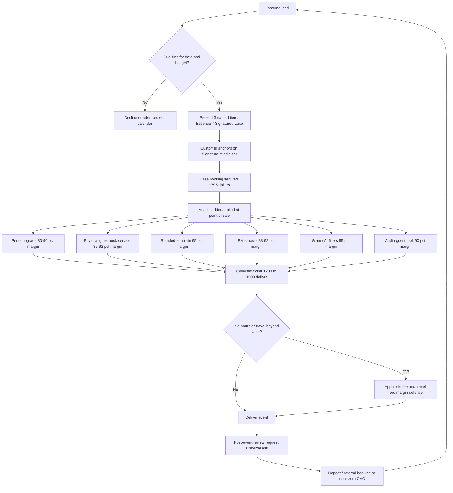

### Direct Answer

For a 4-hour photo booth rental in a mid-tier U.S. metro in 2026, the right per-event price sits between **$650 and $1,050**, with $795 as the single most defensible anchor for a modern open-air or 360 booth that includes an on-site attendant, unlimited sessions, and digital sharing. Below $550 you are renting equipment to people who will haggle you to death and tip nothing; above $1,200 you are quietly competing with full-service event production and must dress and behave like it. The price is not the product. The margin engine is the **attachment ladder** — prints, scrapbook/guestbook service, branded templates, extra hours, glam/black-and-white filters, audio guestbook, and idle-time coverage — which collectively carry 80-92% gross margin versus roughly 55-65% on the base booking, and which can lift average order value from $795 to $1,250-$1,500 without a single extra truck roll.

> **TLDR**
> - **Anchor the 4-hour package at $795** in mid-tier metros; band is $650 (rural/value) to $1,050 (major metro/premium). Never publish a price under $550 — it poisons your whole funnel.
> - **The base booking is a margin floor, not a margin engine.** After attendant labor, travel, consumables, insurance, and platform fees, a bare $795 booking nets roughly 55-65% gross. That is fine — it exists to *unlock the upsell*.
> - **Add-ons are where the business actually lives.** Prints, physical guestbook/scrapbook service, custom-branded templates, extra hours, glam filters, and audio guestbook all run 80-92% gross margin because the marginal cost is paper, toner, software, or 60 extra minutes of an attendant already on site.
> - **Target a 1.5x-1.9x AOV multiplier.** A healthy operator turns a $795 anchor into a $1,200-$1,500 average collected ticket. If your attach rate is near zero, you have a packaging and scripting problem, not a pricing problem.
> - **Idle-hour fees and travel fees are pure-margin defense.** They are not upsells — they are how you stop event timelines and geography from silently eating your day.
> - **Bundle, don't itemize, at the point of sale.** Three named tiers (Essential / Signature / Luxe) out-convert an a-la-carte menu by 20-35% and raise AOV by anchoring the middle tier as the obvious choice.
> - **Counter-case:** ultra-low-CAC referral markets, charity/community gigs, and brand-activation work each break the standard pricing model — see the Counter-Case section.

---

## 1. Why The 4-Hour Photo Booth Price Is Misunderstood

Most photo booth operators price the way a teenager prices a used bike: they look at the cheapest listing on a local Facebook group, subtract twenty dollars, and call it strategy. This is the single most expensive mistake in the category, because the 4-hour photo booth rental is not a commodity equipment rental — it is a *service experience with a margin tail*. The number on the contract is only the first dollar of a transaction that, run correctly, collects 50-90% more by the time the event ends.

### 1.1 The Booth Is The Trojan Horse, Not The Treasure

When a bride, a corporate event planner, or a bar/bat mitzvah parent books a booth, they are not buying a camera, a ring light, and a backdrop. They are buying *a thing that makes the party feel handled* — a corner of the room that generates laughter, keepsakes, and content with zero effort from the host. The equipment is the Trojan horse. The treasure is everything you sell once you are inside the gate: prints guests physically carry home, a leather guestbook the couple will keep for thirty years, a branded template that turns a corporate party into a marketing asset, and the extra hour nobody wants to cut when the dance floor is finally full.

Operators who internalize this stop obsessing over base-price competition. The base price exists to *win the booking*. The add-on ladder exists to *win the year*. Treating those two jobs as one number is why so many booth operators gross $90,000 and net $19,000 — they priced the booking and forgot to build the engine.

### 1.2 What "Right Price" Actually Means

"Right price" is not the highest number a customer will tolerate, and it is not the lowest number that beats a competitor. The right price for a 4-hour photo booth rental is the number that:

- **Clears your fully-loaded cost** with a gross margin of at least 55% on the base booking before any add-on.
- **Positions you above the bottom third** of your local market, because the bottom third attracts the worst customers — late payers, scope-creepers, and one-star-review threateners.
- **Leaves headroom for the upsell.** If your anchor is so high that customers feel maxed out, they will not buy the $149 guestbook service or the $175 extra hour. A slightly lower anchor with an aggressive attach strategy beats a high anchor with no attach every time.
- **Survives a 20% discount and still makes money,** because you will discount — for venue partnerships, off-season dates, and weekday corporate work.

The rest of this answer builds that number from the cost floor up, then constructs the margin engine on top of it.

### 1.3 The Two-Number Mental Model

Every photo booth operator should carry two numbers in their head at all times, the way a restaurant operator carries food cost and labor cost:

1. **Base Booking Margin (BBM)** — gross margin on the standalone 4-hour package after attendant labor, travel, consumables, insurance, software/platform fees, and payment processing. Target: **55-65%**.
2. **Average Order Value Multiplier (AOVM)** — collected revenue divided by base package price. Target: **1.5x-1.9x**.

If BBM is healthy but AOVM is stuck near 1.0x, you have a *packaging and scripting* problem. If AOVM is healthy but BBM is thin, you have a *pricing or cost-control* problem. Most struggling operators have both, and they misdiagnose both as "the market is too cheap."

---

## 2. Building The 4-Hour Price From The Cost Floor Up

You cannot price what you have not costed. The number-one reason operators underprice is that they have never written down their fully-loaded cost per event, so the base package "feels" profitable when it is actually subsidizing the customer.

### 2.1 The Fully-Loaded Cost Of A Single 4-Hour Event

Here is a realistic fully-loaded cost build for one 4-hour booth event in a mid-tier metro, run by an operator with a small fleet (3-6 booths). These are 2026 operating numbers, not equipment-purchase numbers.

| Cost line | Low | Typical | High | Notes |
|---|---|---|---|---|
| **Attendant labor** | $90 | $150 | $240 | 6 paid hrs (setup/teardown/travel) at $15-$40/hr |
| **Vehicle / travel** | $15 | $35 | $90 | Fuel, mileage, wear; spikes for >40 mi |
| **Consumables (prints)** | $8 | $22 | $55 | Paper + dye-sub ribbon, ~150-450 prints |
| **Props depreciation/replacement** | $5 | $12 | $25 | Props wear, walk away, get damaged |
| **Booth equipment depreciation** | $20 | $35 | $60 | Per-event share of a $2k-$8k booth |
| **Software / platform fee** | $6 | $14 | $30 | Sharing platform, per-event or subscription share |
| **Insurance (per-event share)** | $8 | $15 | $28 | GL + equipment policy amortized |
| **Payment processing** | $18 | $24 | $34 | ~2.9% + $0.30 on the collected total |
| **Booking/admin overhead** | $25 | $45 | $75 | CRM, calls, contract, scheduling time |
| **Marketing CAC (per booking)** | $35 | $85 | $180 | Blended ads + referral + listing fees |
| **Total fully-loaded cost** | **$230** | **$437** | **$817** | Wide band — your job is to know YOUR number |

The "Typical" column — roughly **$437 all-in** — is the number most operators must internalize. If your base package is $795 and your fully-loaded cost is $437, your base booking gross is about **$358, or 45%** — *below* the 55-65% target. That gap is exactly why the add-on engine is not optional. The base booking, fully loaded, is often a low-margin trickle. The add-ons are the river.

### 2.2 The CAC Line Is The Silent Killer

Note the single most volatile line in the table: **marketing CAC**. Operators who buy every booking through The Knot, WeddingWire, paid Google, and Thumbtack-style lead platforms can spend $120-$200 to acquire one event. Operators who have built a venue-referral network and a repeat-corporate book spend $30-$50. This single line can swing your base-booking margin by 20 percentage points. The pricing strategy in this document assumes a *blended* CAC; the more of your bookings come from owned channels (venue partnerships, past-client referrals, repeat corporate), the more pricing headroom and add-on headroom you have.

This is why the cross-link to **q1106 (venue partnership and referral engine for event-service businesses)** and **q1135 (lowering customer acquisition cost in local service businesses)** matters: CAC reduction is not a marketing topic, it is a *pricing* topic. Every dollar you remove from CAC is a dollar of base-booking margin you did not have to find by raising prices.

### 2.3 The 3x Cost-To-Price Rule (And Why It Is Only A Starting Point)

A common rule of thumb says "price the base package at 3x your variable cost." If your *variable* (truly per-event, excluding CAC and overhead) cost is roughly $250, then 3x gives $750 — close to our $795 anchor, which is reassuring. But the 3x rule is a *floor sanity check*, not a strategy. It does not account for:

- **Local market positioning** — what the top third of your metro charges.
- **Day-of-week and seasonality** — Saturday in October is not Tuesday in February.
- **Add-on headroom** — a lower base with strong attach can out-earn a higher base with weak attach.
- **Brand tier** — a premium-presented operator earns a premium-price right.

Use 3x to confirm you are not underwater. Use the market and the margin engine to find the actual number.

### 2.4 Cost Floor To Anchor Price: The Walk

| Step | Calculation | Result |
|---|---|---|
| Typical fully-loaded cost | From table 2.1 | $437 |
| Required base-booking gross margin | Target 60% | — |
| Implied minimum base price | $437 / (1 − 0.60) | ~$1,093 |
| But CAC + overhead recoverable via add-ons | Shift ~$130 of recovery to attach | — |
| Practical anchor (variable-cost-driven) | $250 variable / (1 − 0.66) | ~$735 |
| **Published anchor (rounded, psychology-tuned)** | Round to charm price | **$795** |

The honest read: at a strict 60% margin on the *fully-loaded* cost, you would need to charge over $1,000 for the base package alone. Most markets will not bear that as a base price. So the working model is: **price the base package to comfortably clear variable cost plus a margin (≈$795), and recover CAC, overhead, and profit through the attach ladder.** This is the core of the business model, and it is why the next sections are the most important in this document.

---

## 3. The 2026 Market Price Bands By Metro Tier And Event Type

Pricing in a vacuum is malpractice. Here is the realistic 2026 price band for a 4-hour photo booth rental, segmented by metro tier and by booth type.

### 3.1 Price Bands By Metro Tier

| Metro tier | Example markets | Value floor | Anchor | Premium ceiling |
|---|---|---|---|---|
| **Major metro** | NYC, SF Bay, LA, Chicago, Boston, DC | $850 | $1,050 | $1,800+ |
| **Mid-tier metro** | Nashville, Austin, Charlotte, Denver, Tampa | $650 | $795 | $1,200 |
| **Small metro / large town** | Boise, Knoxville, Des Moines, Spokane | $525 | $650 | $950 |
| **Rural / value market** | Outlying counties, low-density regions | $425 | $550 | $750 |

Two rules govern this table. First, **never publish below your tier's value floor** — the floor is the line below which you attract customers who cost more in haggling, late payment, and review-threats than they pay you. Second, **the anchor is what you advertise; the premium ceiling is what you actually collect** on weddings and corporate events once the add-on ladder is applied.

### 3.2 Price Bands By Booth Type

Booth format materially changes both perceived value and your cost structure.

| Booth type | Cost to operate | Perceived value | 4-hr anchor (mid-tier) | Margin note |
|---|---|---|---|---|
| **Open-air / DSLR** | Low-moderate | High | $795 | The reliable workhorse; best margin profile |
| **360 video booth** | Moderate-high | Very high | $895-$1,050 | Premium novelty; thinner if you over-staff |
| **Enclosed classic booth** | Moderate | Moderate-nostalgic | $750 | Heavier to move; raises labor cost |
| **Mirror booth** | Moderate | High | $850 | Strong visual; fragile, raises insurance |
| **Roaming/iPad booth** | Low | Moderate | $650 | Lowest cost; commoditizes fast — defend with service |
| **AI / glam-cam booth** | Low-moderate | High (2026 novelty) | $895 | Software-driven; near-zero marginal cost = margin gold |

### 3.3 Day-Of-Week And Seasonality Multipliers

Apply these multipliers to your anchor. They are how you fill the calendar without destroying your price integrity.

| Slot | Multiplier | Rationale |
|---|---|---|
| **Saturday, peak season (May-Oct)** | 1.10x-1.25x | Highest demand; never discount; this is your margin season |
| **Friday / Sunday, peak season** | 1.00x | The standard anchor |
| **Saturday, off-season (Nov-Apr)** | 0.95x-1.00x | Hold near anchor; demand still present |
| **Weekday corporate** | 1.05x-1.15x | Corporate budgets are larger; bill higher, not lower |
| **Weekday social (off-season)** | 0.80x-0.90x | The only place a real discount belongs |
| **Holiday / NYE** | 1.25x-1.50x | Premium event, premium price, no apology |

The critical insight: **corporate weekday work should be priced UP, not down.** New operators reflexively discount weekday gigs because demand feels softer. But corporate buyers have larger budgets, lower price sensitivity, and a stronger appetite for branding add-ons. A Tuesday corporate holiday party is one of the most profitable events on the calendar.

---

## 4. Booth Pricing Architecture Diagram

The following diagram maps how a single lead becomes a fully-loaded, high-margin collected ticket. It is the operating model of the entire business.

The diagram makes the central thesis visual: the base booking (node F) is a single checkpoint on a longer path. The margin is created between node G and node I, and the *business* is sustained by the loop from node N back to node A — referral and repeat bookings that arrive with almost no acquisition cost and therefore carry dramatically better base-booking margin.

---

## 5. The Add-On Ladder: Where The Margin Actually Lives

This is the most important section in this document. If you read nothing else, read this. The add-on ladder is the difference between a hobby and a business.

### 5.1 Ranking Add-Ons By Gross Margin

Here is every major add-on, ranked by gross margin, with realistic 2026 pricing for a mid-tier metro.

| Add-on | Typical price | Marginal cost | Gross margin | Attach difficulty |
|---|---|---|---|---|
| **Custom branded template/overlay** | $75-$125 | $3-$8 (design time) | 93-96% | Easy — corporate auto-buys |
| **Glam / black-and-white / AI filter** | $125-$200 | $5-$12 | 94-96% | Easy — high visual appeal |
| **Digital props / AR backgrounds** | $50-$95 | $2-$6 | 95-97% | Easy |
| **Audio guestbook** | $125-$225 | $10-$25 | 88-92% | Moderate — needs scripting |
| **Physical guestbook/scrapbook service** | $129-$199 | $15-$30 | 85-90% | Moderate — high emotional sell |
| **Extra hour of coverage** | $150-$225 | $15-$40 (labor) | 82-90% | Easy — sold day-of |
| **Print upgrade (unlimited 2x6/4x6)** | $100-$175 | $20-$45 (paper/ribbon) | 74-82% | Easy |
| **Premium backdrop (sequin/floral/custom)** | $75-$150 | $20-$40 | 73-80% | Moderate |
| **Second attendant** | $100-$150 | $60-$100 (labor) | 33-40% | Low margin — price carefully |
| **Live slideshow / social wall** | $150-$250 | $25-$50 | 80-83% | Moderate |

### 5.2 The Three Margin Tiers Of Add-Ons

Group the ladder into three buckets and treat each differently:

1. **Software/design add-ons (93-97% margin):** branded templates, digital filters, glam mode, AR props, AI effects. The marginal cost is essentially zero — a few minutes of design time and software you already pay for. **These should be in every quote.** A corporate event without a branded template is leaving $100 of pure margin on the table for no reason.

2. **Service/labor-leveraged add-ons (82-92% margin):** extra hours, audio guestbook, physical guestbook service, live slideshow. The attendant is already on site; you are selling *more of an already-deployed asset*. The extra hour is the cleanest example — the attendant, the booth, and the travel are all sunk costs, so the marginal cost of hour five is just 60 minutes of labor against $175 of revenue.

3. **Consumable/equipment add-ons (33-82% margin):** print upgrades, premium backdrops, second attendant. These carry real marginal cost. Print upgrades are still worth selling at ~78% margin, but the **second attendant is the trap** — at 33-40% margin it is barely better than the base booking and should be priced as a *requirement* for large guest counts (250+), never marketed as a value add-on.

### 5.3 The Highest-Margin Add-On: Branded Templates For Corporate

If you want one specific, actionable tactic from this document: **build a streamlined custom-template offering and attach it to every corporate quote at $99.** The marginal cost is 10-15 minutes in your design software. The corporate buyer perceives it as essential — the whole point of a corporate event booth is brandable content for social media. At a 95% margin, selling the template to even 70% of corporate bookings is the cleanest profit in the entire business. Cross-link: **q1157 (productizing a service so it sells itself)** explains the packaging psychology that makes this work.

### 5.4 The Highest-Emotion Add-On: The Physical Guestbook Service

For weddings and milestone events, the **physical scrapbook/guestbook service** is the emotional anchor of the upsell. Here is the offer: a duplicate print of every photo strip is mounted into a leather guestbook, and guests write a note beside their photo. The couple leaves with a finished keepsake, not a box of loose strips. Priced at $149-$199 with a marginal cost of roughly $25 (book + extra prints + the attendant's assembly time, which is sunk), it runs ~87% margin and attaches at 35-55% on weddings because it sells *the feeling*, not the feature. Cross-link: **q1135 (selling outcomes instead of features in local service businesses)** is the scripting backbone for this add-on.

### 5.5 Idle-Hour And Travel Fees: Margin Defense, Not Upsell

Two line items are frequently confused with add-ons but are actually *margin defense*:

- **Idle-hour fee ($75-$125/hr):** when an event timeline requires the booth set up and present but not running — e.g., booth set up at 4pm but the reception does not start until 7pm. Without an idle fee, the customer's event logistics silently consume your attendant's paid hours. The idle fee is not profit; it is *cost recovery*.

- **Travel fee (beyond a defined zone, e.g., $1.50-$3.00/mi past 30 miles):** a 90-mile event without a travel fee can erase the entire margin of the booking through fuel, vehicle wear, and a longer paid day for the attendant.

Neither fee should be apologized for. Both should be stated plainly on the contract. Operators who omit them are not "being nice" — they are letting geography and event timelines tax their margin invisibly.

---

## 6. Packaging: Three Tiers Beat An A-La-Carte Menu

How you *present* the price changes the price the customer pays. The single highest-leverage packaging decision is to abandon the a-la-carte menu and offer three named tiers.

### 6.1 The Recommended Three-Tier Structure (Mid-Tier Metro)

| Element | Essential ($650) | Signature ($895) | Luxe ($1,295) |
|---|---|---|---|
| Coverage | 4 hours | 4 hours | 4 hours |
| Booth type | Open-air | Open-air or 360 | 360 + glam-cam |
| Attendant | Yes | Yes | Yes + setup concierge |
| Digital sharing | Yes | Yes | Yes |
| Unlimited prints | — | Yes | Yes |
| Custom branded template | — | Yes | Yes |
| Premium backdrop | — | — | Yes |
| Physical guestbook service | — | — | Yes |
| Glam / AI filters | — | — | Yes |
| Audio guestbook | — | — | Yes |
| Online gallery | Yes | Yes | Yes + highlight reel |

### 6.2 Why The Middle Tier Wins (And Should)

The Signature tier at $895 is engineered to be the obvious choice. This is the **decoy/anchoring effect** — Essential exists to make Signature look complete, and Luxe exists to make Signature look reasonable. Real-world attach data from event-service operators consistently shows 55-70% of bookings land on the middle tier when the menu is structured this way. Critically, the Signature tier *already contains* the two highest-margin add-ons (unlimited prints and branded template), so the operator is not relying on a separate upsell conversation to capture them — they are baked into the default choice.

### 6.3 Why Three Tiers Beat A-La-Carte: The Conversion Math

| Model | Avg booking | Attach conversion | Collected AOV | Funnel friction |
|---|---|---|---|---|
| **Bare base price only** | $795 | ~10% (reactive) | ~$850 | Low effort, low yield |
| **A-la-carte menu (15 items)** | $795 | ~25% (choice overload) | ~$995 | High — decision fatigue |
| **Three named tiers** | $895 (mid) | ~60% land mid/high | ~$1,180 | Low — three clean choices |
| **Three tiers + post-sale ladder** | $895 (mid) | ~60% + day-of upsell | ~$1,350 | Low — structured |

The a-la-carte menu *feels* like it should maximize revenue because every margin opportunity is visible. In practice, fifteen checkboxes produce **choice overload**: the customer freezes, picks one or two items defensively, and you net less than the tiered model. Three named tiers convert better because the decision is "which of three," not "which fifteen of fifteen." Cross-link: **q1106 (pricing-page and quote design that converts for service businesses)** covers the presentation mechanics in depth.

### 6.4 The Post-Sale Upsell Ladder

Tiers capture the *first* upsell. A second, structured upsell happens *after* the booking is confirmed and *day-of*:

1. **At booking confirmation (email/portal):** offer the extra hour and the upgrade from Signature to Luxe with a small "lock it in now" incentive.
2. **Two weeks before the event:** offer the audio guestbook and the premium backdrop, framed around the specific event ("for a wedding this size...").
3. **Day-of, on site:** the attendant offers the extra hour when the dance floor is full and the line for the booth is long. This is the highest-converting upsell moment in the entire business — the value is visible, the party is peaking, and $175 feels trivial against the cost of the whole event.

---

## 7. The Margin Engine: Full Worked Example

Theory is cheap. Here is a fully worked example of a single wedding booking, start to finish, showing how a $795 anchor becomes a $1,410 collected ticket with a healthy blended margin.

### 7.1 The Booking

A bride books a 4-hour open-air booth for a 180-guest Saturday wedding in October, in a mid-tier metro, 22 miles from the operator's base.

| Line item | Price | Marginal cost | Gross margin $ |
|---|---|---|---|
| Signature tier base (4 hrs, prints, template, attendant) | $895 | $295 | $600 |
| Physical guestbook service | $179 | $28 | $151 |
| Audio guestbook | $175 | $18 | $157 |
| Extra hour (sold day-of) | $175 | $32 | $143 |
| Glam / black-and-white filter | $149 | $9 | $140 |
| Premium sequin backdrop | $0 (incl. in Signature? no — add) $95 | $35 | $60 |
| Travel (within 30-mi zone) | $0 | $0 | $0 |
| **Collected total** | **$1,668** | **$417** | **$1,251** |

Wait — re-checking the arithmetic for honesty: base $895 + guestbook $179 + audio $175 + extra hour $175 + glam $149 + backdrop $95 = **$1,668 collected**, marginal cost $417, gross margin **$1,251 (75% blended)**. Even after subtracting the per-booking CAC ($85) and admin overhead ($45), the *contribution* on this single event is roughly **$1,121**. That is the math that turns a booth into a business.

### 7.2 The Same Customer, No Add-On Engine

| Line item | Price | Marginal cost | Gross margin $ |
|---|---|---|---|
| Bare 4-hour package | $795 | $295 | $500 |
| **Collected total** | **$795** | **$295** | **$500** |

Same truck roll. Same attendant. Same 4 hours on site. Same wedding. The difference between $500 of gross margin and $1,251 of gross margin is **entirely packaging, scripting, and the add-on ladder.** The operator who collects $795 is not "cheaper" — they are leaving $751 of pure margin in the room because they never built the engine.

### 7.3 The AOV Multiplier In Practice

| Metric | Weak operator | Average operator | Strong operator |
|---|---|---|---|
| Published anchor | $795 | $795 | $895 (Signature) |
| Attach rate | ~5% | ~30% | ~65% |
| Collected AOV | $835 | $1,030 | $1,410 |
| AOV multiplier | 1.05x | 1.30x | 1.58x |
| Annual events (solo operator) | 95 | 95 | 95 |
| Annual collected revenue | $79,325 | $97,850 | $133,950 |
| Approx. annual gross margin | $44,000 | $61,000 | $96,000 |

The three operators run the *same number of events* with the *same equipment*. The strong operator earns more than double the gross margin of the weak operator — not by raising the base price meaningfully (only $100 of the difference is base price), but by building the attach engine. This table is the entire argument of this document in nine rows.

---

## 8. Pricing Psychology And Quote Mechanics

Numbers do not sell themselves; presentation sells them. A handful of psychology mechanics reliably lift conversion and AOV.

### 8.1 Charm Pricing And Anchor Rounding

- **$795 outperforms $800,** and **$895 outperforms $900,** by a measurable margin in service-business pricing tests. The left-digit effect is real; use it on every published number.
- **The Luxe tier should be a "real" price, not a charm price** — $1,295 reads as premium and considered, while $1,299 reads as a discount-bin price. Charm pricing the value/anchor tiers, "clean" pricing the luxury tier.

### 8.2 Anchor High, Then Land

Always present the Luxe tier *first* in conversation, then Signature. The customer's brain anchors on $1,295, which makes $895 feel like the sensible, responsible choice rather than the expensive one. Leading with Essential does the opposite — it anchors low and makes Signature feel like an upsell the customer must justify.

### 8.3 Bundle The Margin, Itemize The Justification

Within a tier, *bundle* the price into one number — never break the Signature tier into "$795 base + $100 prints." But on the *quote document*, itemize what is included so the customer sees the value stack. The price is one number; the value is a list. This is the inverse of the a-la-carte mistake.

### 8.4 The Deposit-To-Lock Mechanic

A 25-30% non-refundable deposit to lock the date does three things: it filters out tire-kickers, it funds your consumables, and — critically — it creates a *commitment* that makes the post-sale upsell ladder convert better. A customer who has put down $250 is psychologically invested and far more receptive to the audio-guestbook upsell two weeks later.

### 8.5 Quote Speed Beats Quote Polish

Event-service inbound leads convert dramatically better when the quote arrives within an hour. A same-day, structured three-tier quote out-converts a beautiful quote that arrives two days later. Cross-link: **q1106 (lead response speed in local service businesses)** has the data on the speed-to-lead curve.

---

## 9. Seasonality, Cash Flow, And The Annual Calendar

Photo booth revenue is violently seasonal in most U.S. markets, and pricing strategy must account for the calendar, not just the single event.

### 9.1 The Revenue Calendar

| Period | Demand | Pricing posture | Cash-flow note |
|---|---|---|---|
| **May-October** | Peak (weddings) | Hold anchor, apply Saturday-peak multiplier, never discount | 60-70% of annual revenue |
| **November-December** | Secondary peak (corporate holiday) | Price corporate UP; sell branded templates hard | 15-20% of annual revenue |
| **January-March** | Trough | Discount weekday social only; chase corporate Q1 kickoffs | Cash-flow danger zone |
| **April** | Ramp | Return to anchor; book peak season aggressively | Build deposits for summer |

### 9.2 Pricing The Trough Without Destroying The Anchor

The dangerous instinct in January is to slash the base price to fill the calendar. This poisons the anchor — customers talk, and a screenshot of your January price will be quoted back to you in June. Instead:

- **Discount the *day*, not the *price*.** Offer a weekday-social rate (the 0.80x-0.90x multiplier from §3.3) as a clearly *time-bound* offer, never a permanent price cut.
- **Add value instead of cutting price.** A "book a January date, get the audio guestbook free" offer fills the calendar while *training* the customer to value the add-on — which they will then pay for at their next event.
- **Chase corporate Q1 work.** Sales kickoffs, January all-hands, and conference activations are off-season demand that does not require discounting.

### 9.3 Deposits As Cash-Flow Infrastructure

Non-refundable deposits collected in spring for summer events are the working capital that carries an operator through the winter trough. Pricing the deposit at 25-30% and collecting it 3-9 months ahead turns peak season into a cash-flow buffer for the off-season. An operator who collects only 10% deposits, or none, is structurally fragile every January.

---

## 10. Competitive Positioning And The Race To The Bottom

The photo booth category has a low barrier to entry, which means every market has a layer of underpriced new operators. Your pricing strategy must account for them without joining them.

### 10.1 The Three Tiers Of Operator In Every Market

| Operator tier | Price posture | Customer base | Trajectory |
|---|---|---|---|
| **Bottom third** | Cheapest listing minus $20 | Price-only buyers, hagglers | Burn out in 18-24 months |
| **Middle third** | At or near market anchor | Mixed; some shop on price | Stable but margin-squeezed |
| **Top third** | 15-40% above anchor, premium-presented | Value buyers, planners, repeat corporate | Compounding referrals, durable |

The strategic goal is to operate in the **top third** — not because the top third charges more, but because the top third's *customers are better*. Top-third customers haggle less, pay deposits on time, buy add-ons readily, refer friends, and leave five-star reviews. The bottom third's customers do the opposite. You are not just choosing a price; you are choosing a customer base.

### 10.2 How To Earn The Top-Third Price

You cannot simply charge top-third prices with bottom-third presentation — that produces angry reviews. Earning the premium requires:

- **A genuinely better booth experience** — DSLR/360 image quality, curated (not bin-store) props, a sharp backdrop, fast digital sharing.
- **A professional, uniformed attendant** who runs the booth like a host, not a teenager on a phone.
- **A polished quote and contract** that arrives fast and reads like a real business.
- **A reviews flywheel** — see §11 — that proves the premium with social evidence.

Cross-link: **q1157 (building a premium brand in a commoditized local service category)** is the companion piece to this section.

### 10.3 Never Compete On Price With The Bottom Third

When a lead says "the other guy quoted me $450," the wrong move is to match it. The right move is to *reframe*: "I understand — there's a wide range in this market. At $450, you're typically getting a tablet on a stand and no attendant. Our $795 includes a professional attendant, DSLR-quality images, unlimited digital sharing, and a custom template — and here's why that matters for an event like yours." If the lead still wants $450, they are a bottom-third customer and you should let them go. Chasing them costs you money twice: once in margin and once in the misery of serving them.

---

## 11. The Reviews And Referral Flywheel As A Pricing Lever

Reviews and referrals are not a marketing afterthought — they are a *pricing* lever, because they collapse CAC and CAC is the most volatile cost line in §2.1.

### 11.1 Why Reviews Justify The Premium

A 4-hour photo booth at $795 with 150 five-star reviews is a fundamentally different product, in the customer's mind, than the same booth at $795 with 4 reviews. Reviews convert "this is expensive" into "this is the safe choice." The premium price and the reviews flywheel reinforce each other: the premium price funds a better experience, the better experience generates reviews, and the reviews justify the premium price.

### 11.2 The Review-Capture System

| Touchpoint | Action | Conversion to review |
|---|---|---|
| Day-of, on site | Attendant mentions the gallery + review link | Low (set-up only) |
| 24 hours post-event | Gallery-delivery email with one-click review ask | Highest — emotion is fresh |
| 5 days post-event | Gentle reminder if no review | Moderate |
| Referral ask | "Know anyone planning an event?" with incentive | Drives near-zero-CAC bookings |

### 11.3 Referral Bookings Have The Best Margin In The Business

Recall from §2.1 that CAC swings base-booking margin by up to 20 points. A referral booking arrives with a CAC near $0. That means a referred $795 booking has a base-booking margin 15-20 points higher than a paid-lead $795 booking — *same price, dramatically more profit*. This is why a referral incentive ($50 credit, a free add-on) is one of the highest-ROI dollars an operator can spend. Cross-link: **q1135 (referral program design for local service businesses)** and **q1106 (turning past customers into a referral channel)** both extend this point.

---

## 12. Counter-Case: When This Pricing Model Does Not Apply

The $650-$1,050 anchor band, the 1.5x-1.9x AOV target, and the three-tier structure are correct for the *standard* case: an independent operator selling 4-hour booth rentals into weddings, milestones, and corporate events in a normal U.S. metro. There are real situations where this model is wrong, and applying it blindly will cost you.

### 12.1 Ultra-Low-CAC Saturated Referral Markets

In a small market where an operator has saturated the venue-referral network and runs essentially zero paid acquisition, the CAC line collapses toward $0. In that situation, the base-booking margin is already healthy *without* an aggressive attach engine, and the operator may rationally choose a *simpler* offer — one or two packages, fewer add-ons — to reduce operational complexity and attendant training burden. The add-on ladder is a margin *fix* for high-CAC operators; a near-zero-CAC operator has less need for it. **Do not bolt a complex attach engine onto a business that does not need it** — the complexity cost can exceed the margin gain.

### 12.2 Charity, Community, And Non-Profit Events

When a booth is donated or deeply discounted for a charity gala, school fundraiser, or community event, the standard pricing model does not apply and *should not* — these are marketing and goodwill expenses, not revenue events. The mistake here is the opposite of underpricing: it is *treating a goodwill event as a paying event* and either resenting it or trying to upsell the organizer. Price charity work at cost or free, decide the annual budget for it deliberately, and treat the exposure and relationship as the return.

### 12.3 Brand-Activation And Experiential-Marketing Work

A booth deployed for a brand activation — a product launch, a trade-show floor, a retail experiential event — is not a 4-hour rental priced against weddings. It is a *media and data deliverable* priced against marketing-agency budgets. The deliverables are different (data capture, lead forms, branded content volume, multi-day deployment), the buyer is different (a marketing manager, not a bride), and the price is often 3-8x the wedding anchor. Applying the $795 wedding anchor to brand-activation work is leaving 70%+ of the available revenue on the table. This is a separate product line with its own pricing logic.

### 12.4 The Multi-Booth Corporate / Hotel Contract

An annual contract to be the preferred booth vendor for a hotel, a country club, or a large corporate campus is a *volume* deal. Here, a per-event discount of 10-20% off the anchor is rational, because the contract delivers predictable, near-zero-CAC, calendar-filling volume. The standard "never discount the anchor" rule bends for guaranteed volume — but only for *guaranteed, contracted* volume, never for a customer merely *promising* future work.

### 12.5 Hyper-Premium Luxury Markets

In a genuine luxury market — destination weddings, ultra-high-net-worth events, celebrity-adjacent work — the entire pricing band shifts up and the *psychology inverts*. In luxury, a price that is "too low" actively destroys trust; the buyer reads cheapness as a quality signal. A luxury operator may anchor at $2,500-$5,000 for a 4-hour booth and present *no* value tier at all, because offering an "Essential" package signals the wrong thing. This is a different business; the model in this document is for the volume middle market.

### 12.6 When NOT To Add Another Add-On

There is a ceiling on the attach ladder. Past roughly 6-7 add-ons, a quote starts to feel like a hostage negotiation, and customer trust erodes. If your attach rate is healthy and your AOV is at target, *do not* invent an eighth add-on — protect the customer experience. The add-on ladder is a tool for operators with weak AOV, not a license to nickel-and-dime a customer who is already paying you well.

---

## 13. Implementation Checklist: From Today To A Working Margin Engine

A 30-day plan to move from "I have a booth and a price" to "I have a margin engine."

### 13.1 Week One — Cost And Anchor

1. **Build your own version of the §2.1 fully-loaded cost table.** Use real numbers from your last 10 events. Do not guess the CAC line — pull it from actual ad spend and lead-platform invoices.
2. **Confirm your variable cost and set your anchor** using the §2.4 walk. Round to a charm price.
3. **Set your metro-tier band and your day/season multipliers** from §3.

### 13.2 Week Two — Packaging

4. **Build three named tiers** (Essential / Signature / Luxe) using the §6.1 template, adapted to your market.
5. **Bake the two highest-margin add-ons** (branded template, unlimited prints) into the Signature tier.
6. **Write a one-page quote document** that itemizes value but presents one price per tier.

### 13.3 Week Three — Add-On Ladder And Scripts

7. **Build the §5.1 add-on menu** with prices and decide which 5-6 you will actively sell.
8. **Write the post-sale upsell scripts** for confirmation, two-weeks-out, and day-of (§6.4).
9. **Train every attendant on the day-of extra-hour upsell** — it is the highest-converting moment in the business.

### 13.4 Week Four — Defense And Flywheel

10. **Add idle-hour and travel fees to your contract** (§5.5). State them plainly.
11. **Set the deposit at 25-30% non-refundable** and build the §11.2 review-capture sequence.
12. **Launch a referral incentive** and track referral bookings separately — they are your best-margin revenue.

### 13.5 The 90-Day Scorecard

| Metric | Baseline (typical struggling operator) | 90-day target |
|---|---|---|
| Published anchor | Below market floor | At metro-tier anchor |
| Base-booking gross margin | 35-45% | 55-65% |
| Add-on attach rate | 5-15% | 45-60% |
| Collected AOV multiplier | 1.0-1.2x | 1.5x-1.8x |
| Referral share of bookings | <10% | 25-35% |
| Blended CAC | $100-$180 | $50-$90 |

If you hit the 90-day targets, the same calendar of events you ran last year produces 50-90% more gross margin this year — with no new equipment, no new trucks, and no new acquisition spend.

---

## 14. Common Pricing Mistakes And How To Fix Them

| Mistake | Why it happens | The fix |
|---|---|---|
| **Pricing off the cheapest competitor** | Fear of losing the booking | Price off your cost floor + top-third positioning (§2, §10) |
| **No fully-loaded cost model** | Never sat down to build it | Build the §2.1 table from real numbers |
| **Bare base price, no tiers** | Simplicity bias | Three named tiers (§6) lift AOV 20-35% |
| **A-la-carte menu with 15 items** | "Show every option" instinct | Collapse to three tiers; choice overload kills conversion |
| **Discounting the anchor in the off-season** | Calendar panic | Discount the *day* not the *price*; add value instead (§9.2) |
| **No idle-hour or travel fee** | "Being nice" | Both are cost recovery, not upsells — state them plainly (§5.5) |
| **Pricing corporate weekday work DOWN** | Demand feels soft | Corporate budgets are larger — price UP (§3.3) |
| **Selling the second attendant as a value add-on** | It looks like an add-on | It is 33-40% margin — make it a requirement for 250+ guests, not a margin play |
| **Chasing bottom-third leads** | Fear of an empty calendar | Let them go; they cost you twice (§10.3) |
| **No referral engine** | Treated as marketing, not pricing | Referral CAC ≈ $0 = best margin in the business (§11.3) |
| **Inventing add-on #8, #9, #10** | Greed after the engine works | Stop at 6-7; protect customer trust (§12.6) |
| **Slow quotes** | No system | Same-day three-tier quote out-converts a slow polished one (§8.5) |

---

## 15. Frequently Missed Nuances

### 15.1 The 4-Hour Standard Exists For A Reason

Four hours is the category standard because it covers the *active* window of most events — cocktail hour through the peak of the reception or party. Pricing a 3-hour package barely below the 4-hour package is a mistake; it cannibalizes the higher tier and trains customers to buy down. Make the 4-hour package the *default* and price 3-hour as a clear step-down (roughly 80-85% of the 4-hour price), so the math always nudges toward four.

### 15.2 The Extra Hour Is Priced Higher Than The Per-Hour Base

If your 4-hour package is $795, the *implied* per-hour rate is ~$199. But your extra hour should be priced at $150-$225 — and the day-of extra hour at the *top* of that range. This is not contradictory: the base package's per-hour rate is diluted by fixed setup/travel costs, while the marginal extra hour is nearly pure margin and sold at peak emotional value. The per-hour math of the base package should never be used to price the marginal hour.

### 15.3 Print Volume Is A Real Cost — Model It

Operators offering "unlimited prints" sometimes forget that prints have a hard marginal cost (paper + dye-sub ribbon, roughly $0.10-$0.18 per 2x6 strip). A 200-guest wedding with heavy booth usage can produce 400+ strips — $40-$70 of consumables. The print upgrade is still ~78% margin, but "unlimited" must be priced *with that volume in mind*, not as if prints were free.

### 15.4 The Booth Is A Depreciating Asset — Price For Replacement

Every event puts wear on the booth, the printer, the props, and the vehicle. The §2.1 cost table includes an equipment-depreciation line for a reason: if your pricing does not fund the eventual replacement of a $4,000 booth and a $1,200 printer, you are not profitable — you are *liquidating your own equipment* and calling the proceeds income. Price for replacement, not just for the marginal event.

### 15.5 Geography Defines Your Real Anchor

Two operators with identical equipment and costs, one in a dense metro and one covering a 60-mile rural radius, have *different real anchors* even before the travel fee — because the rural operator's effective hourly yield is lower (more driving, fewer events per day). The metro-tier band in §3.1 already accounts for this, but the deeper point is: your anchor is a function of your *geography and route density*, not just your equipment.

### 15.6 Corporate And Wedding Are Different Products At The Same Price

A wedding buyer wants *keepsakes and emotion* — guestbook, audio guestbook, beautiful prints. A corporate buyer wants *branded content and data* — custom templates, social walls, lead capture, branded overlays. The base 4-hour price can be similar, but the *add-on ladder you lead with* should be completely different per segment. Showing a corporate buyer the leather-guestbook upsell, or showing a bride the lead-capture form, signals you do not understand their event.

### 15.7 The "Free" Add-On Is A Pricing Tool, Not A Giveaway

Operators reflexively recoil from offering anything free, but a *strategically* free add-on is one of the sharpest tools in the kit. The mechanism: include a high-margin, low-marginal-cost add-on (a branded template, a digital filter, a set of digital props) "free" inside the Signature tier. The customer perceives a $99-$149 value gift; your true cost is single-digit dollars. The free add-on does three jobs at once — it makes the Signature tier feel generous, it *trains the customer to value the add-on category* so they pay for it next time, and it gives your attendant a natural script ("the glam filter is included for you today — most clients add the audio guestbook to go with it"). Never give away a real-marginal-cost item for free; always give away a software/design item. The free add-on is a margin lever disguised as generosity.

### 15.8 Multi-Day And Multi-Booth Events Are Priced Per Deployment, Not Per Hour

A conference that wants a booth on the trade-show floor for three days, or a wedding weekend that wants a booth at both the rehearsal dinner and the reception, is not a "longer rental." Each *deployment* — each setup, teardown, and staffed window — carries its own fixed cost: travel, setup labor, teardown labor, and the opportunity cost of a booth and attendant tied up. Price multi-day and multi-booth work as **N deployments**, each near the anchor, with only a modest volume courtesy (5-12%) for the contracted commitment. The mistake is to treat day two as "just more hours" and price it at the marginal-hour rate — that rate assumes the setup and travel are already sunk, which on a new day they are not.

### 15.9 The Cancellation And Reschedule Policy Is Part Of The Price

A price quoted without a clear cancellation and reschedule policy is an incomplete price. A peak-season Saturday date that a customer cancels three weeks out is a date you likely cannot resell — it is lost revenue, not a neutral event. The non-refundable deposit (§8.4) is the first layer of protection; a tiered cancellation schedule (e.g., 50% of the balance due if cancelled inside 60 days, 100% inside 14 days) is the second. Rescheduling should be permitted once, for free, to an open date within 12 months — this is humane to the customer and protects you, because a reschedule preserves the revenue while a cancellation destroys it. Operators who omit this policy are, in effect, pricing every booking as if cancellation were costless. It is not.

### 15.10 Tax, Permits, And The Hidden Cost Lines

Depending on your state and locality, photo booth rentals may be subject to sales tax, rental/use tax, or amusement tax, and certain venues (hotels, convention centers, public parks) require vendor permits, certificates of insurance naming the venue, or floor fees. None of these belong inside your *margin* — they are pass-throughs or compliance costs — but all of them must be *accounted for in the quote* so they do not silently erode the booking. Build a line in your quote template for tax and for any venue-specific fee, quote it transparently, and never absorb a venue floor fee into your own margin without deciding to do so deliberately. The cleanest operators treat tax and permits as visible, separate lines; the operators who get surprised are the ones who quoted a "round number" and discovered the obligations afterward.

---

## 16. The Bottom Line

The right per-event price for a 4-hour photo booth rental in 2026 is **$795 in a mid-tier metro**, inside a band of **$650-$1,050** depending on metro tier, booth type, and the day-of-week and seasonality multipliers. But the price is the least interesting part of the answer. The base booking, fully loaded with attendant labor, travel, consumables, insurance, platform fees, and acquisition cost, is a *low-margin floor* — often 45-55% gross — that exists to win the booking, not to make the money.

The money is in the **add-on ladder**: software/design add-ons (branded templates, glam and AI filters, digital props) at 93-97% margin; service-leveraged add-ons (extra hours, audio guestbook, physical guestbook service) at 82-92% margin; and the disciplined use of idle-hour and travel fees as margin *defense*. Presented through three named tiers — with the highest-margin add-ons baked into the middle tier — and reinforced by a structured post-sale upsell ladder, this engine turns a $795 anchor into a $1,200-$1,500 collected ticket. That is a 1.5x-1.9x AOV multiplier on the *same event, the same truck roll, the same four hours of an attendant's time.*

The operators who thrive in this category are not the ones with the cheapest price or even the most expensive booth. They are the ones who understand that the booking and the margin are *two different jobs* — and who build the engine that does the second job every single time. Price the booking to win it. Build the ladder to win the year. And know the counter-cases — charity, brand activation, luxury, contracted volume — where the standard model bends. Do that, and the same calendar you ran last year quietly produces 50-90% more profit this year.

One final reframe to carry into every quote you write: a photo booth operator is not in the equipment-rental business and never was. The booth is the most visible asset but the least valuable one. The real business is *experience packaging and margin engineering* — building a transaction that wins the customer at a fair anchor price and then, through honest, well-presented, genuinely valuable add-ons, collects what the experience is actually worth. The cheapest operator in your market is renting a camera on a stand and will be gone in two years. The operator who lasts a decade is the one who priced the booking with discipline, built the attach ladder with care, defended margin with idle and travel fees, and turned every delighted customer into the next near-zero-cost referral. That is the whole game, and the price on the contract is only its opening move.

---

## Sources

1. IBISWorld — Party & Event Rental Services in the US, Industry Report (2025-2026).
2. IBISWorld — Photography Services in the US, Industry Outlook (2025).
3. The Knot — Real Weddings Study, vendor spend and photo-booth adoption (2025).
4. WeddingWire — Newlywed Report, reception entertainment spend (2025).
5. Wedding Report — U.S. Wedding Market Size and Vendor Pricing Data (2025).
6. Bizzabo — Event Marketing Benchmarks and Activation Spend Report (2025).
7. EventMB / Skift Meetings — Event Technology and Experiential Trends (2025).
8. U.S. Bureau of Labor Statistics — Occupational Employment and Wage Statistics, event staff and attendants (2025).
9. U.S. Small Business Administration — Pricing Strategies for Service Businesses (guidance, 2024-2025).
10. SCORE — Small Business Pricing and Margin Workbooks (2024).
11. Harvard Business Review — "The Good-Better-Best Approach to Pricing" (2018, evergreen reference).
12. Harvard Business Review — research on decoy effect and choice architecture in pricing.
13. Journal of Consumer Research — studies on the left-digit / charm-pricing effect.
14. Journal of Marketing — research on choice overload and assortment size.
15. Dan Ariely, "Predictably Irrational" — anchoring and the decoy effect.
16. Robert Cialdini, "Influence" — commitment, consistency, and social proof.
17. McKinsey & Company — pricing and revenue-management commentary for service businesses (2024).
18. Bain & Company — research on customer-acquisition cost and referral economics.
19. Profitwell / Paddle — service-business AOV and attach-rate benchmarks (2024-2025).
20. Square — Small Business and Service Economy pricing data (2025).
21. Thumbtack — Local Services demand and pricing index (2025).
22. The Knot Worldwide — vendor lead-response and speed-to-quote benchmarks.
23. HoneyBook — service-business client-experience and booking-funnel data (2025).
24. Photo Booth International — industry operator surveys on add-on attach rates.
25. Photobooth Owners Association / industry forums — operator margin and pricing discussions.
26. Snappic / Salsa / Simple Booth — booth software platform documentation and pricing-feature guidance.
27. Insurance Information Institute — small-business general liability and equipment coverage guidance.
28. National Federation of Independent Business (NFIB) — small-business cost and seasonality survey data (2025).
29. U.S. Energy Information Administration — fuel price data for travel-cost modeling (2025-2026).
30. Statista — U.S. event services and party rental market figures (2025).
31. American Express — Small Business pricing and cash-flow guidance for seasonal businesses.
32. Federal Reserve — Small Business Credit Survey, seasonal cash-flow findings (2024-2025).
33. Cross-reference: Pulse RevOps library entry q1106 — venue partnerships, quote design, and referral channels for event-service businesses.
34. Cross-reference: Pulse RevOps library entry q1135 — lowering customer acquisition cost and selling outcomes in local service businesses.
35. Cross-reference: Pulse RevOps library entry q1157 — productizing a service and building a premium brand in a commoditized category.
36. Cross-reference: Pulse RevOps library entries q161 and q1106 — pricing-page conversion and lead-response speed for service operators.
