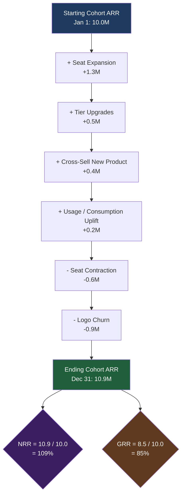

### Direct Answer

NRR (net revenue retention) above 100% — what operators call "negative churn" — is not an accounting impossibility; it is a *normal arithmetic outcome* when expansion revenue from a fixed cohort of customers outruns the contraction and churn within that same cohort. Auditors who think NRR >100% is "impossible" are almost always conflating NRR with **gross retention (GRR)**, which is mathematically capped at 100%, or they are anchored to the intuition that "you cannot keep more than you started with." You explain it by separating the two metrics cleanly, walking them through the cohort-revenue bridge line by line, tying every dollar of expansion back to **ASC 606 contract modifications and variable consideration**, and showing the audit trail from the order form to the GL. Done correctly, the conversation ends with the audit committee understanding that NRR >100% is a *growth* signal, GRR <100% is the *leak* it must still watch, and both are fully consistent with GAAP.

> **TLDR**
> - **NRR measures a fixed cohort over time** — start with one set of customers' ARR, then add upsell/cross-sell/price uplift and subtract downgrades and churn. Expansion can exceed losses, so the ratio exceeds 100%. Nothing is double-counted; new logos are excluded by definition.
> - **GRR is the leak-only metric and is capped at 100%** — it never adds expansion, so it can only fall. Always present GRR *next to* NRR so the committee sees both the growth engine and the retention floor.
> - **The auditor's real job is revenue recognition, not the SaaS metric** — NRR and GRR are non-GAAP operating metrics. The audit question is whether each expansion dollar was recognized correctly under ASC 606 (contract modification, variable consideration, performance obligations).
> - **Public comps settle the "impossible" objection fast** — Snowflake (SNOW) has reported NRR as high as 178%; Datadog (DDOG) ~130%; MongoDB (MDB) ~120%; ServiceNow (NOW) ~98% gross. These figures sit in audited S-1s and 10-Ks reviewed by Big Four firms and the PCAOB.
> - **Build one cohort-revenue bridge, reconcile it to the GL, and disclose the methodology** — a reconciled bridge, a written definition, and consistent period-over-period treatment convert auditor skepticism into a signed-off footnote.

---

## Section 1 — Why Auditors Say "NRR >100% Is Impossible" (And Why They Are Half-Right)

### 1.1 The intuition gap: retention vs. expansion

The objection almost never comes from a real accounting error. It comes from a *mental model* mismatch. An auditor — especially one trained in classic financial statement audit rather than SaaS operating metrics — hears the word "retention" and pictures a bucket of water. You start with a full bucket. Water can leak out (churn). Water cannot spontaneously appear. Therefore "retention" above 100% sounds like claiming the bucket refilled itself.

That intuition is *correct for gross retention* and *wrong for net retention*. The fix is not to argue; it is to rename the buckets. There are two distinct buckets, and the board has been shown only one word for both.

- **The leak bucket (GRR)** — gross revenue retention measures only what drained out: churn and downgrades. It starts at 100% and can only go down. An auditor's water-bucket intuition maps perfectly onto GRR.
- **The growth bucket (NRR)** — net revenue retention takes the *same starting cohort* and adds the expansion that existing customers chose to buy: more seats, more usage, higher tiers, price uplift. The bucket can end fuller than it started because the *same customers paid you more*.

The single most effective sentence in the boardroom is: **"NRR and GRR are two different measurements of the same customers — one shows the leak, one shows the growth, and you should look at both."** Once the audit committee has two words, the "impossible" objection evaporates because they were never actually objecting to NRR — they were objecting to the idea that a *leak metric* could exceed 100%.

### 1.2 What the auditor is *actually* right about

Do not dismiss the auditor. They are half-right, and conceding the correct half builds the credibility you need for the rest of the conversation.

- **The auditor is right that expansion is not "free."** Every expansion dollar must be earned, contracted, delivered, and recognized. If you booked a $200K upsell but the customer has not yet received the additional licenses or consumed the additional capacity, you cannot recognize all $200K today. NRR built on *bookings* rather than *recognized or contracted revenue* is a metric the auditor *should* challenge.
- **The auditor is right that definitions drift.** If management quietly changes the NRR denominator — say, by excluding a churned segment "because it was non-core" — the metric becomes non-comparable and, in a public filing, potentially misleading. The auditor's skepticism is a feature.
- **The auditor is right that NRR is non-GAAP.** NRR and GRR appear nowhere in ASC 606. They are operating metrics. That means they are *not* audited the way revenue is audited — but if they appear in an SEC filing, they fall under disclosure controls and the auditor's responsibility to read for material inconsistency.

So the posture is not "you're wrong." It is: **"You're right that the recognition underneath has to be airtight — let me show you that it is, and let me show you why the ratio itself is still legitimately above 100%."**

### 1.3 The three flavors of the objection

In practice the "impossible" pushback shows up in three concrete forms. Diagnose which one you are facing before you respond.

| Objection form | What they actually mean | The correct response |
|---|---|---|
| **"Retention can't exceed 100%"** | They are picturing GRR | Rename the buckets; show GRR (capped) beside NRR (uncapped) |
| **"You're double-counting new customers"** | They suspect new logos leaked into the cohort | Show the fixed-cohort definition; new ARR is a separate line |
| **"This isn't GAAP"** | They worry the metric is unauditable / unsupportable | Agree it's non-GAAP; show the ASC 606 trail under each expansion dollar |

Each of these is a *different* conversation. The first is a vocabulary fix. The second is a cohort-definition fix. The third is a revenue-recognition walkthrough. Bringing the wrong fix to the wrong objection is the most common reason these meetings run long.

### 1.4 Why this matters beyond the meeting

An audit committee that does not trust your NRR number will not trust the growth narrative built on top of it — and that narrative is what underwrites valuation, the next raise, and eventually the S-1. Bessemer Venture Partners' "State of the Cloud" work and KeyBanc Capital Markets' annual SaaS survey both treat NRR as the single highest-signal efficiency metric in software. ICONIQ Growth's "Growth & Efficiency" reports rank it alongside the Rule of 40. If the committee thinks the metric is fiction, every downstream decision inherits that doubt. Getting this right is not a metrics-hygiene exercise; it is a *trust* exercise.

---

## Section 2 — The Core Arithmetic: NRR and GRR Defined Without Hand-Waving

### 2.1 The fixed-cohort principle

Everything depends on one idea the auditor must internalize: **NRR is measured on a closed, fixed cohort.** You pick a set of customers as of a start date — say, every customer with active ARR on January 1 — and you *freeze that list*. Twelve months later you measure what *that exact list* is now paying you. Customers who signed *after* January 1 are not in the list and never enter the calculation.

This is the entire defense against the "double-counting" objection. New logos cannot inflate NRR because they are, by construction, excluded. The cohort is a sealed room.

### 2.2 The formula, term by term

For a chosen cohort and a chosen window (almost always trailing twelve months):

**NRR = (Starting ARR + Expansion − Contraction − Churn) ÷ Starting ARR**

- **Starting ARR** — the annualized recurring revenue of the frozen cohort on day one. This is the denominator. It never changes after the cohort is set.
- **Expansion** — additional recurring revenue from the *same* customers: more seats, higher tier, additional products (cross-sell), contractual price uplift, and — critically for usage-based businesses — higher consumption.
- **Contraction** — recurring revenue lost from customers who stayed but shrank: fewer seats, downgraded tier, negotiated price cuts.
- **Churn** — recurring revenue lost from customers who left the cohort entirely.

**GRR = (Starting ARR − Contraction − Churn) ÷ Starting ARR**

GRR uses the *same* starting ARR, the *same* contraction, and the *same* churn — it simply **omits the expansion term**. That omission is why GRR is mathematically capped at 100%: with nothing added, the numerator can never exceed the denominator. NRR has no such cap because expansion can be arbitrarily large.

### 2.3 A worked numeric example

Concrete numbers end abstract arguments. Walk the committee through this exact table.

| Line item | Amount | Notes |
|---|---|---|
| Starting cohort ARR (Jan 1) | $10,000,000 | 200 customers, frozen list |
| (+) Expansion | $2,400,000 | seat growth, tier upgrades, usage |
| (−) Contraction | $600,000 | downgrades from customers who stayed |
| (−) Churn | $900,000 | full loss from departed customers |
| Ending cohort ARR (Dec 31) | $10,900,000 | same 200-customer list |
| **NRR** | **109.0%** | $10.9M ÷ $10.0M |
| **GRR** | **85.0%** | ($10.0M − $0.6M − $0.9M) ÷ $10.0M |

Two numbers, one cohort. NRR is 109% — the cohort pays you 9% *more* than a year ago. GRR is 85% — you still lost 15% to the leak. **Both are true at once.** The company is growing the base *and* leaking it; the expansion engine is simply larger than the leak. This is the picture a healthy SaaS business should show, and it is the picture the audit committee needs to see side by side.

### 2.4 Why "negative churn" is a misleading nickname

Operators love the phrase "negative churn" because NRR >100% feels like churn went below zero. Strictly, churn cannot be negative — a customer cannot un-leave. What people mean is *net* of expansion, the cohort grew. The phrase is fine in a sales all-hands; it is *dangerous* in front of auditors because it reinforces the very confusion you are trying to dispel. In the boardroom, retire "negative churn" and say **"net expansion"** or **"NRR above 100%."** Precision of language is half the battle.

### 2.5 The reconciliation identity

There is a clean algebraic identity that auditors find reassuring because it shows the two metrics are not independent inventions:

**NRR − GRR = Expansion ÷ Starting ARR**

In the worked example: 109.0% − 85.0% = 24.0%, and Expansion ($2.4M) ÷ Starting ARR ($10.0M) = 24.0%. The gap between the two metrics *is* the expansion rate. This identity is worth putting on a slide. It tells the committee that NRR is not a separate, unverifiable claim — it is GRR plus a term they can independently check against the order forms.

---

## Section 3 — The Cohort-Revenue Bridge: Your Single Most Important Exhibit

### 3.1 What a bridge is and why auditors trust it

A revenue bridge is a waterfall: it starts at one number, walks through every additive and subtractive movement, and lands at the ending number. Auditors *love* bridges because every step is a falsifiable claim that ties to a transaction. A bridge converts "trust me, NRR is 109%" into "here are the eleven movements that sum to 109%, each traceable to a contract."

### 3.2 The bridge structure

Each box in that diagram is a line in a table, and each line in the table is a sum of order forms. The auditor can sample any box, pull the underlying contracts, and re-add. That sampleability is what makes the bridge audit-grade rather than marketing-grade.

### 3.3 The bridge as a pipe table

| Bridge step | Movement | Running ARR | Source document |
|---|---|---|---|
| Starting cohort ARR | — | $10,000,000 | Frozen customer list, Jan 1 GL extract |
| (+) Seat expansion | +$1,300,000 | $11,300,000 | Order form amendments, CRM opportunity log |
| (+) Tier upgrades | +$500,000 | $11,800,000 | Upgrade order forms |
| (+) Cross-sell (new product) | +$400,000 | $12,200,000 | New product order forms |
| (+) Usage / consumption uplift | +$200,000 | $12,400,000 | Metered billing records, usage logs |
| (−) Seat contraction | −$600,000 | $11,800,000 | Downgrade amendments |
| (−) Logo churn | −$900,000 | $10,900,000 | Cancellation notices, termination letters |
| Ending cohort ARR | — | $10,900,000 | GL extract, Dec 31 |

### 3.4 Reconciling the bridge to the general ledger

The bridge is *operating* data — it lives in the CRM and the billing system. The auditor's standard is the *general ledger*. You must build a tie-out. The most common reconciling items between cohort ARR and GL revenue:

- **Timing differences** — ARR is a point-in-time annualized run rate; GL revenue is recognized ratably over time. A mid-year upsell adds to ARR immediately but only contributes a partial year of recognized revenue.
- **Non-recurring elements** — one-time professional services, implementation fees, and overages may sit in GL revenue but are (correctly) excluded from ARR.
- **New-logo revenue** — GL revenue includes new customers; cohort ARR excludes them. This is the biggest single reconciling line and the one the auditor will probe hardest.
- **FX** — multi-currency contracts annualized at different rates create reconciling noise; lock a rate convention and disclose it.

Present this as a formal reconciliation schedule. An auditor who sees ARR tie cleanly to GL revenue, with every reconciling item labeled and supported, stops treating NRR as a number and starts treating it as a *derived* figure resting on audited revenue. That is the whole goal.

### 3.5 Cohort-revenue reconciliation table

| Reconciling item | Direction | Amount | Why it differs |
|---|---|---|---|
| Cohort ending ARR | Base | $10,900,000 | Annualized run rate, fixed cohort |
| (+) New-logo ARR (post-cohort) | Add | $3,100,000 | New customers excluded from NRR |
| (+) Total company ARR | Subtotal | $14,000,000 | Full book of business |
| (−) Mid-period timing (ratable) | Subtract | ($1,900,000) | ARR booked but not yet fully recognized |
| (+) Professional services revenue | Add | $1,200,000 | Non-recurring, excluded from ARR |
| (+) Usage overages above committed | Add | $400,000 | Variable, recognized as delivered |
| **Recognized GAAP revenue (TTM)** | **Result** | **$13,700,000** | Ties to income statement |

When this schedule reconciles to the penny, the NRR conversation is effectively over — you have shown the auditor that the metric and the audited financials are the same data viewed two ways.

---

## Section 4 — The Revenue Recognition Layer: ASC 606 Under Every Expansion Dollar

### 4.1 Why this is the part that actually matters to the auditor

NRR is a ratio. The auditor does not audit ratios. The auditor audits *revenue*. So the conversation that *truly* matters is not "is 109% possible" — it is "is every expansion dollar in that 109% recognized correctly under ASC 606." If you win that conversation, the ratio takes care of itself. This section is the technical core, and it is where finance teams most often lose credibility by being vague.

### 4.2 Expansion as a contract modification

Under **ASC 606-10-25-10 through 25-13**, when an existing customer expands, you are dealing with a *contract modification*. The standard gives you three possible treatments, and which one applies determines how the expansion revenue lands:

- **Treated as a separate contract** — if the modification adds *distinct* goods/services at their *standalone selling price*. Example: a customer on Product A buys Product B at list price. Product B is accounted for on its own; it does not disturb Product A's recognition. Most clean cross-sell falls here.
- **Treated as a termination of the old contract and creation of a new one** — if the remaining goods/services are distinct but *not* priced at standalone value. The remaining consideration is reallocated prospectively. Common with mid-term tier upgrades sold at a blended rate.
- **Treated as part of the original contract (cumulative catch-up)** — if the added goods/services are *not* distinct from those already delivered. You re-measure progress and book a catch-up adjustment.

The auditor wants to see that someone *decided* which bucket each material expansion fell into and *documented why*. A finance team that can produce that decision log for sampled expansions has effectively passed the audit.

### 4.3 Usage-based expansion and variable consideration

For consumption-priced products — Snowflake, Datadog, MongoDB Atlas, AWS-style metering — expansion is largely *usage growth*, and usage is **variable consideration** under **ASC 606-10-32-5 through 32-14**. The rules:

- **Estimate variable consideration** using either the expected-value or most-likely-amount method.
- **Apply the constraint** — only include variable consideration to the extent it is *highly probable* a significant reversal will not occur.
- **For pure usage-based pricing, the practical answer is often "recognize as delivered"** — many usage contracts qualify for the **ASC 606-10-55-18 "right to invoice" practical expedient**, so revenue is recognized in the amount the entity has the right to invoice (i.e., as the customer consumes). That makes usage expansion clean: it is recognized exactly when it happens.

This is *good news* for the NRR conversation. Usage expansion is some of the most defensible expansion revenue you have, because it is recognized contemporaneously with delivery. There is no estimation tail, no constraint judgment for committed-but-unconsumed capacity.

### 4.4 Mapping expansion types to ASC 606 treatment

| Expansion type | Typical ASC 606 treatment | Audit evidence to retain |
|---|---|---|
| **Additional seats, same product** | Separate contract (if at SSP) or prospective modification | Order form amendment, SSP analysis |
| **Tier upgrade mid-term** | Termination + new contract; reallocate prospectively | Upgrade order form, repricing memo |
| **Cross-sell, new distinct product** | Separate contract | New order form, distinct-performance-obligation memo |
| **Contractual price uplift (e.g., CPI escalator)** | Part of original contract; built into transaction price | Master agreement escalator clause |
| **Usage / consumption growth** | Variable consideration; often "right to invoice" expedient | Metered billing logs, usage reports |
| **Overage above committed minimum** | Variable consideration, recognized as delivered | Usage logs, overage invoices |

### 4.5 Capitalized commissions: the ASC 340-40 wrinkle

Expansion has a *cost* side the audit committee should not be surprised by. Under **ASC 340-40**, incremental costs of obtaining a contract — most importantly sales commissions — are *capitalized* and amortized over the period of benefit. Expansion deals usually carry commissions. So a quarter of strong expansion creates a *new layer of capitalized contract cost* that amortizes forward.

The auditor will check that (a) commissions on expansion deals were capitalized, not expensed, when required; (b) the amortization period reflects the *expected customer relationship*, including anticipated renewals, not just the initial contract term; and (c) any commission on a *modification* is treated consistently with how the modification itself was accounted for. Walk into the meeting having already reconciled the capitalized commission asset to the expansion bookings. It signals that the expansion engine is fully wired into the accounting, not bolted on.

### 4.6 RPO — the disclosure that corroborates NRR

**Remaining performance obligations (RPO)**, disclosed under **ASC 606-10-50-13**, is the total transaction price allocated to unsatisfied performance obligations — essentially contracted future revenue. RPO is *audited-adjacent* (it is a required disclosure tied to the revenue footnote) and it *corroborates* NRR: a company with genuine expansion should show RPO growing in step with the expansion in the bridge. Public SaaS companies report current and total RPO every quarter precisely because it gives investors a forward, contracted view that NRR alone does not. Bringing RPO into the conversation lets the auditor cross-check your operating metric against a disclosure they already have to opine near.

---

## Section 5 — Public Comparables: The Fastest Way to End "Impossible"

### 5.1 The argument from authority, used correctly

The single fastest way to retire "NRR >100% is impossible" is to point out that the *largest, most heavily audited software companies on public markets* report exactly that — in documents reviewed by Big Four firms and overseen by the PCAOB and the SEC. If NRR >100% were impossible or non-compliant, these numbers could not survive an S-1 review.

Use this carefully. The point is not "everyone does it so it's fine." The point is: **"This metric is so standard that the SEC, the PCAOB, and Big Four auditors have a settled, well-trodden approach to it. We are not inventing anything — we are following the same playbook as every public SaaS company."**

### 5.2 Named public benchmarks

| Company (ticker) | Metric reported | Approx. level (recent disclosures) | Pricing model |
|---|---|---|---|
| **Snowflake (SNOW)** | Net revenue retention | ~127%–178% across reported periods | Usage / consumption |
| **Datadog (DDOG)** | Net revenue retention band | ~115%–130% | Usage + seats |
| **MongoDB (MDB)** | Net ARR expansion rate | ~115%–120% | Usage (Atlas) + subscription |
| **CrowdStrike (CRWD)** | Dollar-based net retention | ~115%–125% | Module subscription |
| **ServiceNow (NOW)** | Renewal / gross retention | ~98%+ gross | Enterprise subscription |
| **Atlassian (TEAM)** | Net expansion | >100% (cloud) | Seat-based subscription |
| **HubSpot (HUBS)** | Net revenue retention | ~100%–110% across cycles | Seat + tier subscription |

Every one of these figures appears in an audited 10-K or a registration statement. The methodology behind them is described in each company's MD&A. They are not identical — definitions vary — which is itself the lesson for the audit committee: NRR is real, NRR is disclosed, and NRR's *definition must be stated* because it is not standardized.

### 5.3 What the comps teach about pricing model

Notice the pattern in the table: the highest NRR figures (Snowflake, Datadog) come from *usage-based* businesses, mid-range figures from *hybrid* models, and the ~100% figures from *seat-based* subscription. This is not an accident, and it is worth explaining to the committee:

- **Usage-based models expand automatically** when customers succeed. A customer who doubles their data volume doubles their bill with no new contract. Expansion is a *consumption* event, recognized as delivered.
- **Seat-based models expand on a step function** — someone has to buy more seats. Expansion requires a sales motion and a new order form.
- **NRR therefore reflects pricing architecture as much as customer love.** A board that benchmarks your 109% against Snowflake's 160% without adjusting for pricing model is comparing different machines.

### 5.4 Operator voices the committee will recognize

Frank Slootman, as CEO of Snowflake (SNOW), built investor communication around the consumption model and the NRR it produces — his framing of "land and expand consumption" is the canonical articulation of why usage NRR runs so high. Earlier, at ServiceNow (NOW), the same operating discipline produced industry-leading renewal rates. On the venture side, the *Bessemer Cloud Index* and KeyBanc's annual *SaaS Survey* have made NRR a headline efficiency metric for a decade; ICONIQ Growth and OpenView Partners both publish NRR benchmark bands by ARR scale; and the Pavilion operator community treats NRR as a core CRO scorecard line. If a committee member follows software at all, these are names and sources they trust — invoking them moves NRR from "management's claim" to "industry-standard, externally benchmarked metric."

---

## Section 6 — The Boardroom Script: How to Run the Actual Conversation

### 6.1 Pre-meeting preparation

Never walk into the audit committee to "discuss NRR" cold. Prepare a three-document packet and circulate it in advance:

- **The one-page definitions sheet** — NRR and GRR formulas, the fixed-cohort statement, the "negative churn = net expansion" clarification, in plain language.
- **The cohort-revenue bridge** — the waterfall from Section 3, with the GL reconciliation attached.
- **The ASC 606 mapping** — the expansion-type-to-treatment table from Section 4, with two or three sampled expansion contracts fully worked.

Circulating in advance does two things: it lets the skeptics raise objections in writing (cheaper than live), and it signals that management treats the metric as rigorous, not promotional.

### 6.2 The opening: concede, then reframe

Open by *agreeing* with the skeptic. "You're right that a *retention* number above 100% sounds impossible — and if we were talking about gross retention, it would be. We're going to look at two different metrics today, and I want to be precise about which is which." This disarms the room. You have validated the auditor's intuition and quietly relabeled the debate.

### 6.3 The walkthrough sequence

Run the meeting in this fixed order. Each step answers the objection the previous step raises.

| Step | What you show | Objection it closes |
|---|---|---|
| 1 | Two-bucket definitions (GRR capped, NRR uncapped) | "Retention can't exceed 100%" |
| 2 | The fixed-cohort principle | "You're double-counting new logos" |
| 3 | The cohort-revenue bridge | "Where do the numbers come from?" |
| 4 | GL reconciliation schedule | "Does this tie to audited revenue?" |
| 5 | ASC 606 expansion mapping + sampled contracts | "Is the expansion recognized correctly?" |
| 6 | Public comps (SNOW, DDOG, MDB) | "Is any of this normal / compliant?" |
| 7 | Written methodology + disclosure language | "How do we make sure this is consistent?" |

### 6.4 Handling the hard questions live

Anticipate the three sharpest questions and rehearse the answers:

- **"What stops management from gaming this by redefining the cohort?"** — Answer: the written methodology, locked period over period, plus the auditor's own consistency check. Offer to have the definition reviewed and the prior-period number recomputed under the current definition every time it changes — and to disclose any change.
- **"If GRR is only 85%, isn't the business actually leaking?"** — Answer: yes, and that is exactly why we show GRR. NRR >100% does not excuse a GRR problem. We manage both; GRR is the floor, NRR is the engine. (This honesty is what *earns* the committee's trust in the NRR number.)
- **"Could expansion revenue reverse?"** — Answer: contracted expansion is in RPO and is as durable as any subscription. Usage expansion can reverse with consumption — which is why we recognize it as delivered, not ahead of it. The constraint in ASC 606 exists precisely to prevent recognizing reversible variable revenue early.

### 6.5 The internal-controls dimension auditors will probe

Beyond the metric itself, a sophisticated audit committee — and the external auditor advising it — will ask about the *controls* around how NRR is produced. NRR is a calculated figure assembled from multiple systems (CRM, billing, the GL), and any calculated figure that reaches a filing is in scope for internal control over financial reporting (ICFR). Be ready to describe:

- **The data lineage.** Which system is the source of truth for the starting cohort, for expansion, for churn? A clear lineage diagram showing CRM-to-billing-to-GL flow tells the auditor the number is not assembled by hand in a spreadsheet every quarter.
- **The reconciliation control.** Who reconciles cohort ARR to GL revenue, on what cadence, and who reviews and signs off? A named, evidenced reconciliation control is the single most reassuring thing you can show.
- **The definition-change control.** What prevents someone from quietly altering the cohort logic? Ideally a change requires controller approval, version control, and a prior-period recast — and that workflow is documented.
- **The completeness check.** What ensures every churned and every expanded account is captured? An automated tie between billing-system status changes and the NRR calculation closes the completeness risk.

When you can describe these four controls, NRR stops looking like a marketing number that wandered into a filing and starts looking like a governed financial disclosure. That is the perception shift that ends the audit conversation.

### 6.6 Closing the meeting

End with a *deliverable*, not a discussion. The committee should leave having approved: (1) the written NRR/GRR definition, (2) the disclosure language if the metric will be filed, and (3) a standing cadence — NRR/GRR reported every quarter with the bridge attached. A metric the committee has formally signed off on is no longer "management's claim." It is a governed disclosure. The minutes should record the approval explicitly, because a metric documented in audit-committee minutes carries the governance weight that a slide in a management deck never can.

---

## Section 7 — SEC Disclosure and S-1 Readiness

### 7.1 NRR is non-GAAP — and that has rules

When NRR moves from the boardroom into an SEC filing — an S-1, a 10-K, an earnings release — it becomes a *non-GAAP* or *operating* metric subject to the SEC's rules on metric disclosure, including Regulation G and the SEC's 2020 guidance on key performance indicators and metrics in MD&A. The requirements that matter:

- **Define the metric precisely.** State the cohort definition, the time window, what counts as expansion vs. contraction, and how churn is measured. Vague definitions draw SEC comment letters.
- **Disclose the methodology and any change to it.** If the definition changes, say so and, ideally, recast prior periods.
- **Do not present the metric misleadingly.** NRR cannot be displayed in a way that obscures a deteriorating GRR or churn trend.
- **Tie it, where possible, to GAAP.** The reconciliation schedule from Section 3 is the bridge that satisfies this.

### 7.2 What the auditor's role actually is in a filing

In an S-1 or 10-K, the auditor opines on the *financial statements*, not on NRR. But the auditor and the engagement team *do* read the entire document for **material inconsistency** between the audited numbers and the rest of the filing (the standard is AS 2710 / the requirement to read "other information"). So if your MD&A claims 130% NRR but the revenue footnote and your internal bridge cannot support it, the auditor will raise it. The practical implication: the bridge and GL reconciliation are not optional nice-to-haves — they are what lets the metric survive the auditor's read of the filing.

### 7.3 S-1 disclosure readiness checklist

| Readiness item | What "ready" looks like | Owner |
|---|---|---|
| **Written NRR/GRR definition** | Board-approved, version-controlled | CFO / Controller |
| **Cohort methodology locked** | Same cohort logic 8+ quarters back | RevOps / FP&A |
| **GL reconciliation** | ARR ties to recognized revenue, all items labeled | Controller |
| **ASC 606 expansion memos** | Material expansion types documented | Technical accounting |
| **ASC 340-40 commission schedule** | Capitalized cost reconciles to bookings | Controller |
| **RPO disclosure** | Current + total RPO, methodology stated | FP&A |
| **Prior-period recast** | NRR recomputed under current definition | FP&A |
| **Disclosure controls** | Metric inside ICFR / disclosure committee scope | CFO / Legal |

### 7.4 The disclosure language pattern

A defensible S-1 NRR disclosure reads roughly: *"We calculate net revenue retention for a given period by taking the annualized recurring revenue from the cohort of customers as of the first day of the period twelve months prior, and dividing the annualized recurring revenue from that same cohort as of the last day of the current period — including expansion and net of contraction and churn from that cohort — by the cohort's beginning annualized recurring revenue. New customers acquired during the period are excluded."* Note what the language does: it states the cohort, the window, the inclusions, the exclusions. That sentence is the difference between a clean metric and an SEC comment letter.

### 7.5 What draws an SEC comment letter

The SEC's Division of Corporation Finance reviews registration statements and periodic filings and issues comment letters when disclosure is unclear, inconsistent, or potentially misleading. On SaaS operating metrics, the recurring comment-letter themes are predictable, and a company can pre-empt all of them:

| Comment-letter trigger | What the SEC asks | Pre-emptive fix |
|---|---|---|
| **Undefined metric** | "Describe how you calculate net revenue retention" | Include the full definition from 7.4 |
| **Definition changed without disclosure** | "Explain the change and its effect" | Disclose the change and recast prior periods |
| **Metric inconsistent with financials** | "Reconcile the metric to GAAP revenue" | Attach or reference the GL reconciliation |
| **Cherry-picked period** | "Why this period / cohort" | Use a consistent, disclosed window |
| **Metric prominence imbalance** | "Present GAAP measures with equal prominence" | Pair NRR with revenue and GRR |
| **No discussion of drivers** | "Discuss the factors driving the metric" | Add MD&A narrative on expansion vs. churn drivers |

The pattern across every row is the same: *define it, support it, keep it consistent, and discuss it honestly*. A company that does those four things rarely sees an NRR comment letter, and if it does, the response is a one-paragraph reference to disclosure that already exists.

---

## Section 8 — Common Mistakes That Hand the Skeptic Ammunition

### 8.1 The seven self-inflicted wounds

Most failed NRR conversations are lost by management, not won by auditors. Avoid these:

- **Mistake 1 — Using bookings instead of recognized/contracted revenue.** NRR built on signed bookings, including expansion not yet delivered, is exactly the metric an auditor *should* shred. Build it on ARR that ties to the revenue base.
- **Mistake 2 — A drifting cohort definition.** Quietly changing what counts as the starting cohort destroys comparability and looks like manipulation. Lock it.
- **Mistake 3 — Showing NRR without GRR.** Presenting only the flattering number reads as hiding the leak. Always pair them.
- **Mistake 4 — Letting new logos contaminate the cohort.** A coding error that lets post-cohort customers into the numerator inflates NRR and is indefensible. Test for it.
- **Mistake 5 — Mixing currencies without a convention.** FX swings can move NRR a full point. Lock a rate convention and disclose it.
- **Mistake 6 — No GL tie-out.** An operating metric that floats free of audited revenue will never earn auditor trust. Reconcile it.
- **Mistake 7 — Saying "negative churn" to auditors.** The nickname reinforces the confusion. Say "net expansion."

### 8.2 Mistake-to-fix table

| Mistake | Why it hurts you | The fix |
|---|---|---|
| Bookings-based NRR | Recognizes revenue not yet earned | Build on recognized/contracted ARR |
| Drifting cohort | Looks like manipulation | Version-control the definition |
| NRR without GRR | Reads as hiding the leak | Always present both |
| New-logo contamination | Mathematically overstates NRR | Automated cohort-isolation test |
| FX with no convention | Metric swings on currency | Locked rate, disclosed |
| No GL reconciliation | Metric floats free of audit | Formal tie-out schedule |
| "Negative churn" phrasing | Reinforces the confusion | Say "net expansion" |

### 8.3 The credibility compounding effect

Each mistake above is individually survivable. The danger is *compounding*: an auditor who catches one sloppy thing starts assuming everything is sloppy. Conversely, an auditor who sees a clean cohort, a reconciled bridge, and documented ASC 606 memos extends *benefit of the doubt* to the parts they did not sample. Rigor is contagious in both directions. The cheapest investment in a smooth audit is eliminating the self-inflicted wounds before the auditor ever arrives.

---

## Section 9 — Segmenting NRR So the Number Tells the Truth

### 9.1 Why a single blended NRR is almost always misleading

A company-wide NRR figure is an average, and averages hide structure. A blended 108% NRR can be produced by two completely different businesses: one where *every* customer segment expands modestly and steadily, and one where enterprise accounts expand 130% while SMB accounts retain at 80%. Those are not the same company, they do not have the same risk profile, and an audit committee that sees only the blended number cannot tell them apart. The auditor who senses "something is being averaged away" is, again, half-right — the fix is segmentation.

The discipline is to *decompose* NRR along the axes that drive it and present the decomposition alongside the headline. This turns NRR from a single defended claim into a diagnostic the committee can interrogate.

### 9.2 The four segmentation axes that matter

- **By customer size (SMB / mid-market / enterprise).** Expansion behavior is radically different by segment. Enterprise accounts expand through procurement-driven seat and module growth; SMB accounts churn faster and expand less. Segmenting NRR by ACV band tells the committee where the engine and the leak actually live.
- **By cohort vintage.** The cohort that signed three years ago behaves differently from the one that signed last year — older cohorts have usually been pruned of early churners and consist of survivors who expand. A "cohort triangle" (each signing year as a row, each subsequent year as a column) is the single most informative NRR exhibit you can build.
- **By product line.** In a multi-product company, NRR on the flagship product may be flat while a newer product carries all the expansion. Disclosing product-level NRR prevents a board from over-crediting the flagship.
- **By pricing model.** As Section 5 showed, usage-based revenue expands automatically while seat-based revenue expands on a step function. A company transitioning between models must show NRR split by model or the trend is uninterpretable.

### 9.3 The cohort triangle exhibit

A cohort triangle is the gold-standard NRR exhibit because it makes survivorship and durability visible at a glance.

| Signing cohort | Year 1 NRR | Year 2 NRR | Year 3 NRR | Year 4 NRR |
|---|---|---|---|---|
| **2022 cohort** | 104% | 112% | 119% | 124% |
| **2023 cohort** | 101% | 109% | 116% | — |
| **2024 cohort** | 99% | 107% | — | — |
| **2025 cohort** | 102% | — | — | — |

Read across a row and you see a cohort *maturing* — expansion compounding as the survivors grow. Read down a column and you see whether *newer* cohorts are healthier or weaker than older ones at the same age. An auditor looking at this triangle stops asking "is 120% possible" and starts asking the right question: "is each new cohort at least as good as the last?" That is a far more productive conversation, and it is one the data can answer.

### 9.4 Segmented NRR/GRR table

| Segment | NRR | GRR | Expansion driver | Risk note |
|---|---|---|---|---|
| **Enterprise (>$100K ACV)** | 124% | 94% | Seat + module growth | Concentration in top 10 accounts |
| **Mid-market ($25K–$100K)** | 109% | 88% | Tier upgrades, cross-sell | Healthy, balanced |
| **SMB (<$25K ACV)** | 92% | 79% | Limited; mostly price uplift | Structural churn, watch closely |
| **Blended company** | 108% | 87% | — | Blend hides SMB weakness |

This table is worth more than any single number. It tells the committee that the 108% blended NRR is *real*, but that it is carried by enterprise, and that SMB is a leak the company is managing deliberately, not hiding. That honesty is exactly what converts auditor skepticism into trust.

### 9.5 The whale-concentration check

The most dangerous hidden structure in NRR is *concentration*: a headline NRR carried by one or two accounts whose usage exploded. Always run and present a concentration check — recompute NRR with the top one, three, and five expanding accounts removed. If NRR collapses from 115% to 101% when you remove the single largest expander, the metric is describing one customer's good year, not the business. Disclose that. A board that learns about account concentration from the auditor instead of from management has been poorly served.

| Scenario | NRR | What it reveals |
|---|---|---|
| All accounts | 115% | Headline figure |
| Excl. top 1 expander | 108% | Modest single-account dependence |
| Excl. top 3 expanders | 104% | Expansion reasonably distributed |
| Excl. top 5 expanders | 101% | Broad base is roughly flat |

If the gap between "all accounts" and "excl. top 5" is small, expansion is broad-based and the headline NRR is robust. If the gap is large, the headline is fragile and the committee must be told.

---

## Section 10 — The Forecasting and Valuation Implications of NRR

### 10.1 Why the audit committee cares beyond the audit

The audit committee's interest in NRR is not purely a compliance interest. NRR is the single most powerful input into a SaaS forecast, because it describes the *organic growth rate of the existing base before any new sales*. A company with 120% NRR grows 20% per year even if it sells nothing new; a company with 95% NRR is shrinking 5% per year and must sell hard just to stand still. That makes NRR a *forward-looking* metric, and forward-looking metrics in the hands of a board carry governance weight.

### 10.2 NRR as the floor of the growth forecast

The cleanest way to frame NRR for the committee is as the **growth floor**:

- **Next-year revenue floor ≈ current ARR × NRR.** With $14M ARR and 108% NRR, roughly $15.1M is the organic floor before a single new logo. New-logo bookings are *additive* on top of that floor.
- **The forecast becomes: (ARR × NRR) + new-logo bookings − cohort-specific risk adjustments.** This decomposition lets the committee see which part of the plan is "durable base" and which part is "new sales execution risk."
- **NRR volatility is itself a risk metric.** A company whose NRR swings between 98% and 118% quarter to quarter has an unpredictable base; a company holding steady at 110% has a forecastable one. The committee should ask about the *stability* of NRR, not just its level.

### 10.3 NRR and valuation multiples

Public-market and private-market valuation both lean heavily on NRR. The relationship the committee should understand:

| NRR band | Typical interpretation | Valuation effect |
|---|---|---|
| **>130%** | Best-in-class, usually usage-based | Premium revenue multiple |
| **115%–130%** | Strong, durable expansion | Above-median multiple |
| **105%–115%** | Healthy, sustainable | Median multiple |
| **100%–105%** | Adequate but expansion-light | Below-median; scrutiny on growth |
| **<100%** | Net contraction in the base | Significant multiple compression |

The reason NRR drives multiples is the Section 10.2 logic: a high-NRR company has a *self-funding* growth engine and lower dependence on ever-increasing sales-and-marketing spend. The Rule of 40 (growth rate + profit margin ≥ 40%) is easier to satisfy when NRR is doing part of the growth work for free. ICONIQ Growth, Bessemer, and KeyBanc all show — in their published benchmark work — a clear correlation between NRR band and revenue multiple. This is why the audit committee, which oversees disclosure that feeds valuation, has a legitimate interest in the metric being airtight.

### 10.4 The link to RPO-based forecasting

For multi-year-contract businesses, NRR and RPO together produce a far more credible forecast than either alone. RPO tells the committee how much future revenue is *already contracted*; NRR tells them how the *uncontracted renewal-and-expansion* portion is likely to behave. A forecast that says "X is contracted (RPO), Y is expected from cohort expansion (NRR applied to the renewing base), Z is new-logo upside" is one an audit committee can stress-test line by line. A forecast that is a single growth percentage is one they have to take on faith. Pairing the two metrics is the difference between a defensible plan and a hopeful one.

### 10.5 NRR forecasting pitfalls

- **Do not assume NRR is constant.** NRR mean-reverts; a 130% year is rarely followed by another 130% year. Forecasting forward at peak NRR overstates the base.
- **Do not apply blended NRR to a changing customer mix.** If the company is shifting toward SMB, the blended NRR will fall even if every segment holds — the *mix* changed.
- **Do not ignore the macro cycle.** In a downturn, usage-based NRR compresses fast (customers consume less) and seat-based NRR compresses through downsizing. NRR is somewhat pro-cyclical; the forecast should flex with the macro view.
- **Do not forecast expansion that requires capacity you do not have.** Expansion is sold; if the customer-success and account-management headcount cannot service it, the NRR assumption is fiction.

---

## Counter-Case: When NRR >100% Should *Not* Be Defended

This entire answer assumes your NRR >100% is *real* and the auditor's skepticism is a *vocabulary or rigor* problem. That assumption is not always true. There are situations where the auditor's instinct that "something is wrong" is *correct*, and the right move is to fix the metric, not defend it.

### C.1 When the skeptic is actually right

- **When NRR is built on bookings, not recognized revenue.** If your "expansion" includes signed deals where the product has not been delivered, the revenue is not yet earned. The auditor's pushback is not pedantry; the metric is genuinely overstated. Do not defend it — rebuild it.
- **When the cohort has been gerrymandered.** If "expansion" looks strong only because a churn-heavy segment was quietly excluded from the starting cohort, the number is engineered. Defending it is misrepresentation. Recompute on the honest cohort.
- **When GRR is collapsing and NRR is masking it.** A company with 110% NRR and 70% GRR has a *serious* retention problem hidden by a few whales expanding fast. Here, defending NRR misdirects the board away from a real fire. The honest move is to lead with the GRR problem.
- **When expansion is one or two accounts.** If NRR >100% depends entirely on a single mega-customer's usage spike, the metric is not describing the *business* — it is describing one account. Concentration disclosure matters more than the headline ratio.
- **When usage revenue is being recognized ahead of consumption.** If a usage-based business is recognizing committed-but-unconsumed capacity as expansion revenue, that violates the variable-consideration constraint. The auditor is right; restate.

### C.2 When the metric is technically fine but strategically misleading

- **Early-stage companies with tiny cohorts.** With 15 customers in the starting cohort, one expansion swings NRR 20 points. The number is *arithmetically* correct but *statistically* meaningless. Present it with the cohort size, or do not present it.
- **Companies pivoting pricing models.** A business moving from seats to usage will see NRR jump for reasons that have nothing to do with customer health. The metric is not comparable across the pivot; flag the discontinuity.
- **Down-market or SMB-heavy books.** SMB churn is structurally high; an SMB-heavy company touting 105% NRR may be carrying it on a thin layer of expanding mid-market accounts. The blended number hides a bimodal reality. Segment it.

### C.3 The honest posture

The professional position is *not* "defend NRR >100% in all cases." It is: **"NRR >100% is legitimate when it is built on recognized revenue, a fixed honest cohort, broad-based expansion, and correct ASC 606 treatment — and it is a problem to be fixed, not defended, when any of those fail."** An auditor who sees you *volunteer* the counter-cases trusts your headline number far more than one who senses you would defend it no matter what. Intellectual honesty about when the metric fails is the strongest possible evidence that it is sound when you say it is.

---

## Section 11 — A 90-Day Plan to Make NRR Audit-Proof

### 11.1 Phase 1 (Days 1–30): Define and isolate

- **Write the definition.** Draft the NRR/GRR definition, the fixed-cohort logic, the window, and the inclusion/exclusion rules. Get the CFO and controller to sign it.
- **Isolate the cohort in the system.** Build the automated cohort extract so new logos cannot contaminate it. Test it against a known prior period.
- **Inventory expansion types.** List every way a customer can expand and tag each with its likely ASC 606 treatment.

### 11.2 Phase 2 (Days 31–60): Reconcile and document

- **Build the bridge.** Construct the cohort-revenue waterfall for the trailing twelve months.
- **Reconcile to the GL.** Build the tie-out schedule; label every reconciling item; resolve anything unexplained.
- **Write the ASC 606 memos.** Document the treatment of each material expansion type; fully work two or three sampled contracts.

### 11.3 Phase 3 (Days 61–90): Govern and disclose

- **Take it to the audit committee.** Run the Section 6 script; get the definition formally approved.
- **Wire it into disclosure controls.** Bring the metric inside the ICFR / disclosure-committee scope.
- **Set the cadence.** NRR/GRR reported every quarter with the bridge attached, methodology locked.

### 11.4 The 90-day deliverables table

| Phase | Deliverable | Definition of done |
|---|---|---|
| Days 1–30 | Signed NRR/GRR definition | CFO + controller signature |
| Days 1–30 | Automated cohort extract | Passes prior-period back-test |
| Days 31–60 | Cohort-revenue bridge | All movements tie to documents |
| Days 31–60 | GL reconciliation schedule | Reconciles to the dollar |
| Days 31–60 | ASC 606 expansion memos | Material types documented |
| Days 61–90 | Audit committee sign-off | Definition formally approved |
| Days 61–90 | Disclosure controls integration | Metric inside ICFR scope |
| Days 61–90 | Quarterly reporting cadence | Bridge attached every quarter |

### 11.5 Who owns what

NRR audit-readiness is a *cross-functional* deliverable. RevOps owns the cohort logic and the operating data. FP&A owns the bridge and the benchmarking. Technical accounting owns the ASC 606 memos. The controller owns the GL reconciliation and ASC 340-40. The CFO owns the board narrative and disclosure. Legal owns the filing language. If any one of these seams is unowned, the metric has a gap the auditor will find. Assign every box in the table above to a named person before Day 1.

---

## Section 12 — Frequently Asked Follow-Ups

### 12.1 Quick-reference answers

- **"Is there a single 'correct' NRR definition?"** No. NRR is not standardized. That is precisely why you must *state your definition* and apply it consistently. Two companies with identical books can report different NRR under different (both legitimate) definitions.
- **"Should NRR be gross or net of churn?"** NRR is *net* of churn by definition — that is the "net" in net revenue retention. The metric that excludes expansion is GRR. Do not confuse "net of churn" with "net of expansion."
- **"Trailing twelve months or point in time?"** Most public companies use a trailing-twelve-month cohort comparison. Either is defensible; what matters is consistency and disclosure.
- **"Does NRR include or exclude price increases?"** Contractual price uplift (CPI escalators, list-price increases on renewal) is *expansion* and belongs in NRR. Disclose it if it is a material driver, because a board should know how much "expansion" is volume vs. price.
- **"What about a customer who churns then comes back?"** A returning customer is, for the original cohort, a new logo — they left the sealed room. They do not re-enter the original cohort. They start a *new* cohort.

### 12.2 The metric-relationship summary

| Metric | What it measures | Cap | Includes expansion? |
|---|---|---|---|
| **GRR** | Revenue lost to churn + contraction | 100% | No |
| **NRR** | Net cohort revenue change | None | Yes |
| **Logo retention** | % of customers retained (count, not $) | 100% | No |
| **RPO** | Contracted future revenue | None | Yes (contracted) |
| **ARR growth** | Total book growth incl. new logos | None | Yes + new logos |

### 12.3 The one-sentence summary for the board minutes

For the audit committee minutes, the resolution should read: *"The committee reviewed management's net revenue retention and gross revenue retention methodology, the supporting cohort-revenue bridge and its reconciliation to recognized revenue, and the ASC 606 treatment of expansion revenue, and approved the written definition for consistent quarterly reporting."* That sentence is the entire goal of the exercise — a metric the committee has formally governed.

---

## Related Pulse Library Entries

- **q9518** — How to compute true gross retention vs. net retention when half your customers are usage-based — the cohort mechanics behind this answer.
- **q9636** — How a CRO partners with the CFO on bookings, ARR, and revenue translation — the operating partnership that produces a clean NRR.
- **q1856 / q1801** — Salesforce/Salesloft net revenue retention deep dives — worked NRR examples from named companies.
- **q1843** — Salesloft churn math under Vista pressure — how GRR pressure plays out in practice.
- **q1741** — Outreach net revenue retention in 2026 — NRR benchmarking for a named comp.
- **q1723** — Datadog churn math under AI pressure — usage-based retention dynamics.
- **q422** — The relationship between CAC, MRR, and sales cycle length — the efficiency metrics that sit alongside NRR.
- **q423** — Forecasting financial health with multi-year contracts — RPO and revenue durability.

---

## Sources

1. FASB ASC 606, *Revenue from Contracts with Customers* — core standard.
2. FASB ASC 606-10-25-10 through 25-13 — contract modification guidance.
3. FASB ASC 606-10-32-5 through 32-14 — variable consideration and the constraint.
4. FASB ASC 606-10-55-18 — the "right to invoice" practical expedient.
5. FASB ASC 606-10-50-13 — remaining performance obligations disclosure.
6. FASB ASC 340-40, *Other Assets and Deferred Costs — Contracts with Customers* — capitalized commissions.
7. SEC Regulation G — non-GAAP financial measure disclosure rules.
8. SEC Final Rule, *Management's Discussion and Analysis* modernization (2020) — KPI and metric disclosure guidance.
9. PCAOB AS 2710, *Other Information in Documents Containing Audited Financial Statements*.
10. PCAOB auditing standards — engagement team responsibilities for material inconsistency.
11. Snowflake Inc. (SNOW) — Form S-1 and subsequent Form 10-K filings, net revenue retention disclosures.
12. Datadog, Inc. (DDOG) — Form 10-K and quarterly earnings, net revenue retention bands.
13. MongoDB, Inc. (MDB) — Form 10-K, net ARR expansion rate disclosures.
14. CrowdStrike Holdings, Inc. (CRWD) — Form 10-K, dollar-based net retention.
15. ServiceNow, Inc. (NOW) — Form 10-K, renewal rate disclosures.
16. Atlassian Corporation (TEAM) — annual report, cloud net expansion.
17. HubSpot, Inc. (HUBS) — Form 10-K, net revenue retention disclosures.
18. Bessemer Venture Partners — *State of the Cloud* annual report series.
19. Bessemer Cloud Index (formerly the BVP Nasdaq Emerging Cloud Index) — public SaaS metric benchmarks.
20. KeyBanc Capital Markets — annual *SaaS Survey* (with the Financial Operating Survey).
21. ICONIQ Growth — *Growth & Efficiency* SaaS benchmarking reports.
22. OpenView Partners — annual *SaaS Benchmarks* report.
23. Pavilion — CRO and RevOps operator benchmarks and community data.
24. Frank Slootman — *Amp It Up* and Snowflake investor communications on the consumption model.
25. AICPA — *Audit and Accounting Guide: Revenue Recognition*, software and SaaS sections.
26. AICPA Technical Q&A — SaaS and software revenue recognition interpretations.
27. Big Four technical accounting guides (Deloitte, PwC, EY, KPMG) — ASC 606 implementation handbooks for software/SaaS.
28. SEC Division of Corporation Finance — comment-letter trends on SaaS operating metrics.
29. FASB Transition Resource Group for Revenue Recognition — implementation memos.
30. Public SaaS company earnings call transcripts — management discussion of NRR methodology (Snowflake, Datadog, MongoDB).
31. Investor relations primers on SaaS metrics — definitions of NRR, GRR, RPO, and ARR.
32. CFO and controller practitioner literature on SaaS revenue recognition and metric governance.
