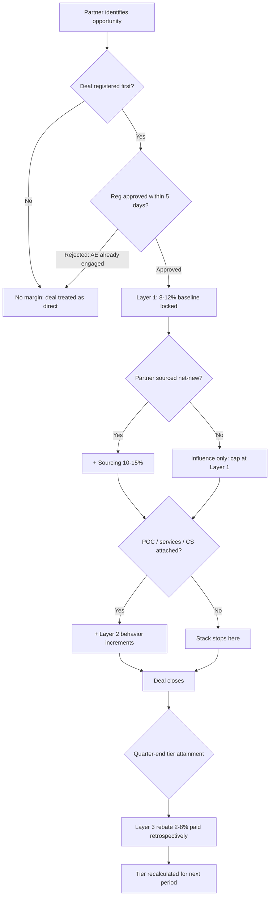
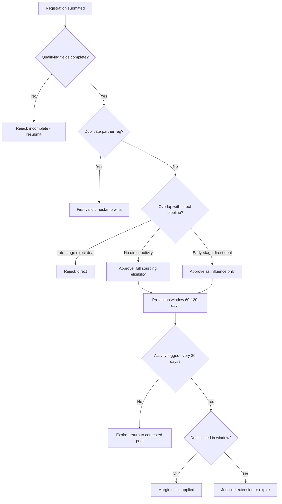

### Direct Answer

The deal-share compensation model that keeps partners hungry without cannibalizing direct is a **tiered, behavior-gated margin stack** built on three layers: a thin baseline registration margin (8-12%) available to any partner who registers a deal first, a thick influence/sourcing bonus (15-30%) unlocked only when the partner adds verifiable value, and a sliding direct-sales-rep neutralization mechanism that pays the internal account executive the same or nearly the same on a partner-sourced deal as on a direct deal. The model works because it pays for *incremental* revenue and *specific behaviors* rather than for the mere presence of a partner logo, and because it removes the structural reason a direct rep would fight the channel. Get the rules of engagement, the deal-registration system, and the rep neutralization right, and partner-sourced revenue compounds; get them wrong and you have built an expensive discount program that trains your best partners to broker your own pipeline back to you.

---

**TL;DR**

- **Pay for increments, not logos.** Deal-share comp must reward revenue the direct team would not have closed on its own. Flat margin on every partner-touched deal is a discount, not a channel investment.
- **Stack margin in tiers tied to behavior.** Baseline registration margin is thin and automatic; the fat margin is gated behind sourcing, technical validation, implementation attach, and customer-success outcomes.
- **Neutralize the direct rep.** The single biggest cause of channel conflict is a comp plan that pays the AE less on partner deals. Pay reps at or near 100% quota retirement on partner-sourced revenue and the internal war ends.
- **Deal registration is the referee.** First-to-register with a real opportunity and a real plan gets protection for a fixed window. No registration, no margin. Stale registration expires.
- **Rules of Engagement (RoE) are a published contract, not tribal knowledge.** A written RoE matrix that defines direct-only accounts, partner-led accounts, and contested accounts prevents 80% of disputes before they start.
- **Marketplace rev-share is a separate lane.** Hyperscaler marketplace transactions (AWS, Azure, GCP) follow co-sell economics and marketplace fees, not your classic reseller margin grid - model them separately.
- **Counter-case exists.** Founder-led startups under ~$3M ARR, pure product-led-growth motions, and businesses with a structural gross-margin ceiling below ~75% should delay or skip a rich deal-share model.

---

## 1. What "Deal-Share Compensation" Actually Means

### 1.1 Defining the term precisely

"Deal-share compensation" is the umbrella for every mechanism by which a vendor shares the economics of a closed deal with a partner who participated in winning it. It is broader than "reseller margin" and broader than "referral fee." It includes resale margin, agency or referral commission, deal-registration discounts, co-sell incentives, marketplace revenue-share, MDF (market development funds) tied to pipeline, SPIFFs, and rebates. The strategic question is not *whether* to share deal economics - if you have a partner ecosystem you already do - but *how to structure the sharing so it produces incremental revenue instead of subsidized revenue.*

The phrase "keeps partners hungry" means the model must create a clear, repeatable path for a partner to earn *more* by doing *more*. The phrase "without cannibalizing direct" means the model must not (a) pay partners for deals the direct team would have closed anyway, or (b) create a structural incentive for your own sellers to sabotage partner deals. A model can fail either test independently, and most failed channel programs fail both at once.

### 1.2 The four payment objects you are actually designing

Every deal-share model is a combination of four distinct payment objects. Confusing them is the root cause of most comp-plan dysfunction.

| Payment object | Who receives it | What it pays for | Typical range |
|---|---|---|---|
| Resale margin | Partner (as reseller of record) | Taking on billing, credit risk, first-line support | 8-35% of list |
| Referral / agency fee | Partner (vendor bills customer) | Sourcing the opportunity, no fulfillment | 10-25% of first-year ACV |
| Co-sell incentive | Partner and/or vendor rep | Joint selling effort on a single deal | 3-12% bonus or quota credit |
| Marketplace rev-share | Marketplace operator + partner | Transaction processing, listing, co-sell program | 3-20% fee, varies by program |

The mistake most companies make is paying a single blended "partner discount" that mashes all four objects into one number. When you do that, you cannot tell whether you are paying for fulfillment, for sourcing, or for nothing at all. You also cannot raise the price of behavior you want more of (sourcing) while holding the price of behavior you do not need (pure fulfillment on a deal your team sourced).

### 1.3 Why the question is fundamentally about incrementality

The economically correct frame is incremental contribution margin. A partner-involved deal is *good* for the vendor when:

**Incremental margin = (Revenue the partner caused that would not otherwise exist) - (Margin shared) - (Program cost) > Direct-channel contribution margin on the same revenue.**

If a partner sources a net-new logo in a territory your direct team does not cover, even a 30% margin share can be wildly accretive because the alternative revenue is zero. If a partner "registers" a deal that your AE already has in late-stage pipeline, then *any* margin share is pure cannibalization - you paid a discount to close a deal you were going to close anyway. The entire architecture of a good deal-share model is a machinery for telling those two situations apart and pricing them differently.

### 1.4 The three kinds of "partner involvement" you must distinguish

Most channel disputes collapse three very different things into one word - "involvement" - and then argue about the margin. A precise model separates them, because each deserves a different price.

| Involvement type | What the partner did | Incrementality | Correct payment |
|---|---|---|---|
| Sourced | Found the opportunity before any vendor activity existed | High - revenue likely zero otherwise | Full sourcing margin (Layer 2) |
| Influenced | Shaped a deal the vendor was already working | Partial - accelerated or de-risked it | Layer 1 plus a modest influence increment |
| Fulfilled | Took resale-of-record or support on a deal the vendor sourced | Low - the revenue existed regardless | Thin fulfillment margin only |

A partner who *sourced* a deal deserves rich economics. A partner who merely *fulfilled* a deal the direct team sourced and closed deserves only enough to cover billing and first-line support costs. A flat partner discount pays all three the same, which is why it overpays fulfillment and underpays sourcing - precisely backwards from what you want. The behavior-gated stack in Section 2 exists to fix this inversion.

### 1.5 The hidden cost the margin number does not show

When leaders evaluate "how much does the channel cost," they usually look only at the margin share. That understates the picture in both directions. The margin share is the *visible* cost. The *invisible* costs include the channel team's salaries, MDF, partner-portal and PRM tooling, certification-program delivery, and the channel-ops headcount that runs registration arbitration. But the channel also creates *invisible savings*: every POC a partner runs is SE time you did not spend, every implementation a partner delivers is services headcount you did not hire, and every renewal a partner owns is CS capacity freed for other accounts. A serious deal-share model is justified on *fully-loaded* economics - margin share plus program cost, netted against cost-to-serve savings - not on the headline discount alone. Section 7 builds that full model; Section 9 instruments it.

---

## 2. The Tiered Margin Stack: The Core Model

### 2.1 The three-layer structure

The model that best satisfies "hungry but not cannibalizing" is a **three-layer margin stack**. Each layer is earned independently, and the layers add together.

**Layer 1 - Baseline registration margin (8-12%).** Any partner in good standing who registers a qualified deal *first* and gets it approved earns a thin baseline margin. This layer is intentionally small. It is not meant to be a living wage; it is meant to (a) reward the discipline of registering early and (b) give the partner enough to cover light pre-sales effort. A partner cannot build a business on Layer 1 alone, and that is the point.

**Layer 2 - Behavior-gated value margin (15-30%).** This is the fat layer, and it only unlocks when the partner demonstrably adds value. Each behavior carries a defined increment:

| Layer 2 behavior | Margin increment | Verification required |
|---|---|---|
| Partner sourced the opportunity (true net-new) | +10-15% | Lead predates any vendor activity; CRM timestamp |
| Partner ran technical validation / POC | +4-6% | POC artifacts, SE sign-off |
| Partner attaches implementation / services | +3-5% | Signed SOW with the customer |
| Partner commits to year-1 customer success / adoption plan | +3-5% | Adoption plan + named CSM |
| Partner brings a competitive displacement | +2-4% | Competitor named, displacement confirmed post-close |

**Layer 3 - Performance rebate (retrospective, 2-8%).** Paid quarterly or annually against tier attainment - total sourced ACV, certified headcount, customer retention rate. Layer 3 is the "hungry" engine: it makes a partner want to grow into the next tier. It is retrospective so it never inflates the price of an individual deal in the moment.

### 2.2 Worked example: the same $120K deal, four scenarios

Consider a $120,000 first-year ACV deal and watch how the stack prices four different partner contributions.

| Scenario | Layers earned | Total margin % | Margin $ | Vendor net | Verdict |
|---|---|---|---|---|---|
| Partner registers a deal the AE already had | Layer 1 only (and likely rejected) | 0-8% | $0-9,600 | $110,400+ | Should be $0 - registration denied |
| Partner sources net-new, hands off | Layer 1 + sourcing | 20-22% | $24,000-26,400 | ~$94,000 | Accretive - revenue was zero otherwise |
| Partner sources, runs POC, attaches services | Layers 1+2 (most) | 30-34% | $36,000-40,800 | ~$81,000 | Highly accretive - lower vendor cost-to-serve |
| Partner sources + full stack + tier-3 rebate | All three layers | 36-42% | $43,200-50,400 | ~$72,000 | Accretive if partner drives renewal/expansion |

The crucial reading: a 36-42% total share *looks* expensive, but if the partner sourced a net-new logo, ran the POC (saving your SE team), delivered the implementation (saving your services team), and owns the renewal motion, your fully-loaded cost to serve that customer dropped dramatically. You shared more margin but you spent less of your own money. That is the definition of a non-cannibalizing model.

### 2.3 The hungry mechanism: tier escalation

"Hungry" is an emotional word; the model implements it with a concrete escalation ladder. A partner moves up tiers by hitting cumulative thresholds, and each tier raises the *ceiling* of what Layer 2 and Layer 3 can pay.

| Tier | Annual sourced ACV | Certified individuals | Layer 2 ceiling | Layer 3 rebate | Other unlocks |
|---|---|---|---|---|---|
| Registered | $0-150K | 1 | 22% | 0% | Deal reg portal |
| Select | $150K-600K | 3 | 28% | 2% | Named partner manager |
| Advanced | $600K-2M | 6 | 33% | 4% | MDF access, co-sell desk |
| Premier | $2M-6M | 12 | 38% | 6% | Joint business plan, exec sponsor |
| Elite | $6M+ | 25 | 42% | 8% | Co-marketing, roadmap input |

The ladder is what keeps a partner reaching. A Select partner sees that becoming Advanced unlocks a 5-point higher margin ceiling *and* MDF *and* a co-sell desk - tangible reasons to invest in certifications and pipeline. The vendor is happy to pay the higher ceiling because Elite partners, by definition, are sourcing $6M+ of revenue the direct team would not have reached.

### 2.5 Why "hungry" must be a ladder and not a flat plateau

There is a temptation, especially in young programs, to offer every partner the same rich economics on day one - "treat all partners equally, keep it simple." This destroys the hungry mechanism. If a partner already earns the top margin on their very first deal, there is nothing to reach for. The relationship plateaus immediately. Partners on a plateau do the minimum: they take inbound, they register opportunistically, and they never invest in certification or joint demand generation because there is no return on that investment. A ladder, by contrast, makes every increment of partner investment pay back in a higher ceiling, more MDF, and better access. The psychology is straightforward - partners behave like any rational business, and they invest where the marginal return is visible. The tier ladder makes the marginal return visible.

The flip side: a ladder must be *climbable*. If the thresholds are set so high that no realistic partner can move up, the ladder is demoralizing rather than motivating. Calibrate thresholds against the actual revenue a committed partner can produce in your market in a year. A good test: at least 20-30% of active partners should be moving up at least one tier per year, and the top tier should contain a small but non-empty set of partners. An empty top tier means the ladder is theater; a crowded top tier means the thresholds are too low and you are overpaying.

### 2.6 Decelerators and clawbacks: the discipline side of the stack

A model that only ever pays more is missing half of behavior design. The stack should also include modest *decelerators* for behavior you want to discourage:

| Trigger | Adjustment | Rationale |
|---|---|---|
| Customer churns within 12 months on a partner-led deal | Clawback of part of Layer 3 rebate | Discourages selling to bad-fit customers for the margin |
| Excessive end-customer discounting funded by partner margin | Margin share capped or reduced | Prevents margin being passed through as a price war |
| Registration land-grab pattern (low reg-to-close rate) | Tier review, possible downgrade | Discourages logo-hoarding |
| No certified staff while claiming Layer 2 technical increments | Increment denied | Keeps verification honest |

Clawbacks must be modest and predictable - their purpose is to align behavior, not to claw back a partner's livelihood. A partner who feels the model is a trap will leave. A partner who understands that the model rewards good customers and good behavior, and gently penalizes the opposite, will trust it.

### 2.4 Mermaid: how a deal flows through the stack

---

## 3. Neutralizing the Direct Rep: The Anti-Cannibalization Engine

### 3.1 Why the direct rep is the real battleground

Most channel-conflict literature focuses on partner-versus-partner disputes. That is the visible fight. The invisible, more destructive fight is **direct rep versus partner**. If your account executive earns less - in commission dollars, in quota retirement, or in accelerator velocity - on a partner-sourced or partner-influenced deal, that AE will, rationally and predictably, do one or more of the following:

- Refuse to share account intelligence with partners.
- Slow-walk partner deal-registration approvals.
- "Discover" that the partner's registered deal was "already in my pipeline."
- Steer the customer toward a direct purchase late in the cycle.
- Decline to bring partners into deals where a partner would genuinely help.

You cannot train, exhort, or culture your way out of this. The AE is responding to the comp plan exactly as designed. The fix is structural: **remove the financial reason for the AE to fight the channel.**

### 3.2 The four neutralization mechanisms

| Mechanism | How it works | Effect on cannibalization |
|---|---|---|
| Full quota credit | AE retires 100% of quota on partner-sourced ACV | Removes "partner deals hurt my number" |
| Equal or near-equal commission rate | Commission rate on partner deals = direct rate (or 90-100% of it) | Removes "I earn less per deal" |
| Channel-neutral accelerators | Accelerator/kicker thresholds count partner revenue equally | Removes "partner deals slow my path to accelerators" |
| Partner-sourced SPIFF for the AE | Small bonus to the AE for *closing* partner-sourced deals | Flips incentive: AE now wants partner deals |

### 3.3 The "neutral-to-positive" principle

The minimum bar is **neutral**: an AE should be financially indifferent between a direct deal and a partner deal of equal size. The better design is **slightly positive**: the AE should mildly *prefer* partner-sourced deals because the partner did sourcing work, ran a POC, and will own implementation - meaning the AE closed revenue with less of their own time invested. A small partner-sourced SPIFF (for example, $500-1,500 per closed partner-sourced deal, or a 2-3% commission uplift) makes the AE an active recruiter of partner help rather than a passive obstacle.

### 3.4 Worked example: AE economics, three comp designs

Assume an AE with a $1.2M annual quota, a 10% direct commission rate, and a $90K partner-sourced deal.

| Comp design | Quota credited | Commission paid | AE behavior |
|---|---|---|---|
| Punitive (legacy) | 50% ($45K) | 5% ($4,500) | AE fights every partner deal |
| Neutral | 100% ($90K) | 10% ($9,000) | AE is indifferent, mild cooperation |
| Neutral-to-positive | 100% ($90K) | 10% ($9,000) + $1,000 SPIFF | AE actively pulls partners into deals |

The cost difference between punitive and neutral-to-positive is roughly $5,500 on a $90K deal. That is trivially small against the value of an AE who recruits partner help instead of sabotaging it - especially because the partner's sourcing and POC work frees that AE to start another deal sooner.

### 3.5 What real operators have done

Channel-comp neutralization is not theory; it is documented practice at the largest software companies.

- **Microsoft (MSFT)**, under the partner strategy shaped during Satya Nadella's tenure, restructured its commercial sales comp so that field sellers retire quota on partner-led and marketplace transactions, explicitly removing the disincentive to co-sell. Microsoft's commercial marketplace co-sell program pays sellers for marketplace-transacted deals.
- **Snowflake (SNOW)**, under Frank Slootman and then Sridhar Ramaswamy, built its go-to-market around "Powered by Snowflake" and consumption co-sell, with field comp aligned to consumption growth regardless of whether a systems integrator or the direct team sourced it.
- **CrowdStrike (CRWD)**, led by George Kurtz, runs a channel-first model where the overwhelming majority of business flows through partners; direct comp is designed so reps do not lose by selling with partners.
- **HashiCorp (acquired by IBM (IBM))**, under Dave McJannet, leaned heavily on cloud-marketplace co-sell with comp neutrality so the field would lean into AWS/Azure/GCP transactions.
- **Datadog (DDOG)**, under Olivier Pomel, expanded marketplace and partner motions with field comp that credits marketplace revenue.
- **Zscaler (ZS)**, under Jay Chaudhry, operates a near-total channel model where direct reps are compensated to sell *through* partners.

The common thread: every one of these companies pays the direct seller fully (or nearly fully) on partner-involved revenue. None of them tries to run a rich partner program while quietly penalizing the field for using it.

### 3.6 The cultural layer on top of the structural fix

Neutralizing the comp plan is necessary but not sufficient. Comp removes the financial *reason* to fight the channel; it does not by itself build the habit of selling *with* partners. Three cultural reinforcements turn neutral comp into active co-selling:

1. **Shared pipeline reviews.** When the direct AE and the partner manager review the same opportunities in the same meeting, the partner stops being an outsider and becomes part of the deal team. Account intelligence flows because it is a shared forum, not a favor.
2. **Joint account planning for strategic accounts.** For the biggest accounts, a written joint plan - who covers which buying center, who runs which workstream - removes ambiguity that would otherwise become conflict.
3. **Public recognition of co-sell wins.** When leadership celebrates a partner-sourced win in the same forum and with the same energy as a direct win, the field internalizes that partner deals are real wins, not lesser wins. Recognition is cheap and its signal value is high.

The sequencing matters: fix comp first, because no amount of culture overrides a punitive comp plan. But once comp is neutral, the cultural layer is what converts grudging tolerance into genuine co-selling.

### 3.7 The channel-ops referee role

Rep neutralization also depends on someone owning the boundary between direct and channel - a channel-operations function that arbitrates registration, maintains the conflict log, and enforces the RoE without fear or favor. If the only people adjudicating conflict are the direct sales managers, the channel always loses, because the direct managers carry the direct number. An independent channel-ops or partner-ops function - reporting into a channel chief, not into direct sales - is the structural guarantee that the referee is neutral. Without it, even a perfectly designed comp plan erodes, because every edge case gets resolved in favor of whoever has more internal power.

---

## 4. Deal Registration: The Referee That Makes the Whole System Fair

### 4.1 Why registration is non-negotiable

Deal registration is the system of record that decides who sourced what, and therefore who earns Layer 1 and who is eligible for Layer 2 sourcing margin. Without a credible registration system, "I sourced this deal" becomes an unwinnable he-said-she-said argument between partners, and between partners and the direct team. Registration converts a political fight into a timestamp comparison.

### 4.2 The anatomy of a registration that actually protects

A deal registration is only worth protecting if it contains real qualifying information. A registration that is just a company name is a "land grab" and should be rejected. A protectable registration includes:

| Field | Why it matters |
|---|---|
| Customer legal entity + key contacts | Prevents duplicate registration of the same account by different partners |
| Specific opportunity (product, use case, approximate size) | Distinguishes a real deal from a logo claim |
| Compelling event / timeline | Proves the deal is live, not speculative |
| Partner's named resources on the deal | Proves the partner will actually work it |
| Current sales stage and next step | Lets the vendor detect overlap with existing direct pipeline |

### 4.3 Registration lifecycle and expiry

A registration is a *time-boxed* grant of protection, not a permanent claim. The lifecycle:

1. **Submission.** Partner submits a qualifying registration.
2. **Review (target 3-5 business days).** Channel ops checks for (a) duplicate partner registration and (b) overlap with existing direct pipeline. If the direct team already has the opportunity at meaningful stage, the registration is rejected with a clear reason.
3. **Approval and protection window.** Approved registrations carry protection for a defined window - commonly 60-120 days for the sourcing margin, sometimes longer for complex enterprise deals.
4. **Activity checkpoints.** The partner must log progress at intervals (e.g., every 30 days). A registration with no activity is presumed dead.
5. **Expiry or extension.** If the deal has not closed and there is no activity, protection lapses and the opportunity returns to the contested pool. Partners working the deal can request a justified extension.

### 4.3a The two registration failure modes and how to detect them

A registration system fails in one of two opposite directions, and each has a measurable signature.

**Failure toward leniency (the land grab).** When channel ops approves nearly every registration to avoid friction with partners, the system stops refereeing. Partners learn that registering a logo - even one with no real opportunity behind it - costs nothing and might pay off. The signature: registration approval rate near 100%, registration-to-close rate very low, and a growing pool of "registered" accounts that block the direct field from accounts the partner is not actually working. The fix is to enforce the qualifying fields strictly and to expire stale registrations aggressively.

**Failure toward strictness (the chilling effect).** When channel ops rejects too aggressively, or takes too long to review, or rejects without clear reasons, partners stop registering. They conclude the system is rigged against them. The signature: registration volume falling, partners closing deals they never registered (and then arguing for margin after the fact), and rising partner attrition. The fix is a fast, transparent SLA and clear, specific rejection reasons that tell the partner exactly what was missing.

The healthy zone is a stable 60-80% approval rate with a rising registration-to-close rate - the signature of a system that is genuinely refereeing rather than rubber-stamping or stonewalling.

### 4.3b The deal-registration SLA as a trust instrument

Partners experience the registration SLA as the program's promise of fairness. A registration that sits unreviewed for three weeks tells the partner the program does not value their time, and they will route their next deal elsewhere - possibly to a competitor with a faster channel. The SLA should be published, short (3-5 business days), and measured. Channel ops should report registration cycle time as a program health metric, and a registration that breaches the SLA should auto-escalate. The PRM (partner relationship management) tooling should make submission frictionless and give the partner real-time status visibility. A registration system that is fast, transparent, and predictable becomes a trust instrument; one that is slow and opaque becomes the single most-cited partner complaint.

### 4.4 Registration decision matrix

| Situation | Registration decision | Margin outcome |
|---|---|---|
| Partner first, no prior vendor activity | Approve | Full sourcing eligibility |
| Partner first, vendor has only marketing-touch | Approve | Full sourcing eligibility |
| Partner registers, AE has early-stage pipeline | Approve as "influence" | Layer 1 only, no sourcing margin |
| Partner registers, AE has late-stage pipeline | Reject | Direct deal, partner gets influence credit at most |
| Two partners register same account | First valid timestamp wins | Second partner eligible only for distinct add-on scope |
| Registration stale 60+ days, no activity | Expire | Opportunity returns to contested pool |

### 4.5 Mermaid: registration arbitration

---

## 5. Rules of Engagement: The Published Contract

### 5.1 RoE as a written document, not folklore

Rules of Engagement (RoE) are the published, version-controlled rules that govern when the direct team sells, when partners lead, and how contested situations resolve. The single most common failure mode is an RoE that exists only as tribal knowledge in the channel chief's head. When the rules are unwritten, every dispute is adjudicated by power and relationships, which destroys partner trust. A written RoE, distributed to partners and the direct field alike, prevents roughly 80% of disputes before they begin because most disputes are simply ambiguity.

### 5.2 The RoE account-classification matrix

The heart of the RoE is a classification of accounts into engagement zones.

| Account class | Definition | Who leads | Partner role |
|---|---|---|---|
| Direct-only / named | Strategic/global accounts the vendor reserves | Direct team | Fulfillment or services only, no sourcing margin |
| Partner-led | Segments/geographies the direct team does not cover | Partner | Full stack eligibility |
| Open / contested | Everything else | First to register | Registration arbitration |
| Marketplace-routed | Customer mandates procurement via a hyperscaler marketplace | Co-sell | Marketplace rev-share economics |

### 5.3 The RoE must also define the "tie-breakers"

Beyond account classes, a complete RoE specifies how to resolve recurring edge cases:

1. **Incumbency.** If a partner already has an active services or support relationship with the account, that partner has a defined right of first refusal on new product deals there.
2. **Renewals and expansions.** Who owns the renewal and the upsell - the sourcing partner, the implementing partner, or the direct CS team - must be stated explicitly. Ambiguity here destroys more partnerships than new-logo disputes.
3. **Multi-partner deals.** When a sourcing partner and an implementation partner are both involved, the RoE defines how the margin splits (e.g., sourcing partner gets sourcing layer, implementation partner gets services layer).
4. **Escalation path.** A named, time-bound escalation process (channel ops -> regional channel director -> VP) so disputes do not fester.
5. **Cooling-off / no-flip rule.** A direct rep cannot "flip" a legitimately registered partner deal to direct within the protection window; a partner cannot poach a direct-only named account.

### 5.4 RoE governance cadence

| Cadence | Activity |
|---|---|
| Weekly | Channel ops clears the registration and dispute queue |
| Monthly | Channel and direct sales leaders review conflict log for patterns |
| Quarterly | RoE reviewed for needed changes; changes published with a version number and effective date |
| Annually | Full RoE and comp-stack reset aligned to the fiscal plan |

The version-numbered, effective-dated publishing matters: partners need to trust that the rules will not change retroactively on a deal they are already working.

---

## 6. Marketplace Revenue-Share: A Separate Lane

### 6.1 Why marketplace economics break the classic grid

The rise of hyperscaler marketplaces - AWS Marketplace, Microsoft Azure Marketplace, Google Cloud Marketplace - introduced a deal-share lane that does not behave like classic reseller margin. When a customer transacts through a cloud marketplace, three things change at once:

1. **The marketplace operator takes a listing/transaction fee** (historically in the high single digits to low double digits, reduced for private-offer and committed-spend deals).
2. **The customer often draws down a pre-committed cloud spend commitment** (an EDP/MACC/committed-use agreement), which is why customers *want* to buy this way.
3. **A channel partner may still be involved** via a Channel Partner Private Offer (CPPO on AWS) or the equivalent on Azure/GCP, taking their own margin on top.

You cannot model this with your reseller margin grid. It needs its own P&L lane.

### 6.2 Marketplace deal-share model

| Component | Who gets it | Notes |
|---|---|---|
| List price | Customer pays | Often drawn from committed cloud spend |
| Marketplace fee | Hyperscaler | Lower for private offers / committed-spend |
| Channel partner margin (via CPPO etc.) | Partner | Negotiated per deal, layered on the private offer |
| Vendor co-sell credit | Vendor field rep | Quota retirement for marketplace-transacted deals |
| Hyperscaler co-sell incentive | Sometimes the hyperscaler's seller | Drives the hyperscaler's field to push your product |

### 6.3 The strategic point

Marketplace is not a threat to your partner program; it is a *complement* with different math. The reason a customer routes a purchase through AWS Marketplace is usually procurement and budget mechanics (burning down a committed spend), not a rejection of your channel. A well-designed deal-share model treats marketplace-routed deals as their own RoE class (Section 5.2), pays the partner via the marketplace's private-offer mechanism, and - critically - still gives the direct rep full quota credit so the field leans into marketplace co-sell instead of resisting it.

### 6.4 Marketplace vs. classic channel: when each wins

| Dimension | Classic reseller channel | Marketplace transaction |
|---|---|---|
| Best for | Net-new logos, regional coverage, services-heavy deals | Customers with committed cloud spend, fast procurement |
| Partner value-add | Sourcing, POC, implementation, local relationship | Co-sell influence, sometimes implementation |
| Vendor cost | Margin share (8-42% stack) | Marketplace fee + any partner private-offer margin |
| Speed to close | Slower (full sales cycle) | Faster (procurement pre-cleared) |
| Renewal ownership | Often the partner | Often the vendor + marketplace auto-renew |

### 6.5 The committed-spend dynamic that drives marketplace demand

The reason marketplace volume has grown so fast is not that customers love marketplaces for their own sake. It is that large enterprises sign multi-year committed-spend agreements with their primary hyperscaler - an Enterprise Discount Program (EDP) on AWS, a Microsoft Azure Consumption Commitment (MACC), or a committed-use discount on Google Cloud - and those agreements come with a powerful incentive: software purchased through the cloud marketplace can be *drawn down against the commitment*. A CFO who has committed to spend, say, $10M with a hyperscaler over three years would much rather have a $300K software purchase count toward that commitment than spend $300K of separate budget. That is the gravitational pull. It means the marketplace decision is often made in *procurement and finance*, not in the technical evaluation - and it can appear late in a sales cycle that your direct or partner team has already been running for months.

The implication for deal-share design is important: a deal can be *sourced* by a partner through the classic channel and then *transacted* through a marketplace at the customer's procurement insistence. If your model treats "marketplace deal" and "partner-sourced deal" as mutually exclusive, you will under-pay the sourcing partner on exactly these deals. The fix is to keep sourcing credit and transaction lane as independent attributes: the partner who sourced the opportunity earns sourcing economics regardless of whether the final paper runs through a marketplace, and the marketplace fee is simply a separate line in the deal's P&L.

### 6.6 Designing the marketplace lane so the field leans in

Left to default incentives, a direct rep often resists marketplace deals: the marketplace fee can look like margin lost, and historically some comp plans paid less on marketplace transactions. That is the same neutralization mistake as Section 3, transposed onto a new lane. The discipline is identical: pay the direct rep full quota credit and full (or near-full) commission on marketplace-transacted revenue, and treat the marketplace fee as a cost of doing business - usually offset by the faster close, the pre-cleared procurement, and the access to committed-spend budget the customer would not otherwise release. A vendor that gets marketplace comp neutrality right turns the hyperscaler's enormous field sales force into an extension of its own pipeline engine; a vendor that gets it wrong watches its reps quietly steer customers away from the very motion the market is moving toward.

---

## 7. Designing the Numbers: A Build Sequence

### 7.1 Step one - establish the gross-margin headroom

You cannot design a deal-share model in a vacuum; you design it inside your gross-margin envelope. A SaaS business with 80% gross margin can afford a 35-40% top-of-stack share to a partner who also lowers your cost to serve. A business at 60% gross margin cannot - a 40% share would push that deal close to or below break-even contribution.

| Vendor gross margin | Realistic top-of-stack share | Comment |
|---|---|---|
| 85%+ | Up to ~40-45% | Rich program viable; classic high-margin SaaS |
| 75-85% | Up to ~30-38% | Healthy program; the common case |
| 65-75% | Up to ~20-28% | Constrained; favor referral/co-sell over resale |
| Below 65% | Up to ~10-15% | Deal-share must be thin; see Counter-Case |

### 7.2 Step two - separate sourcing from fulfillment pricing

Decide explicitly what you will pay for *sourcing* (the scarce, valuable behavior) versus *fulfillment* (billing, support - valuable but commoditizable). In a well-designed model, sourcing is paid richly (the Layer 2 sourcing increment) and fulfillment is paid modestly (part of Layer 1). This prevents the failure mode where a partner earns a fat margin merely for being the reseller of record on a deal your own team sourced and closed.

### 7.3 Step three - set the registration protection window by deal complexity

| Deal type | Protection window | Rationale |
|---|---|---|
| Transactional / SMB | 30-60 days | Short cycles; long windows over-protect |
| Mid-market | 60-90 days | Standard |
| Enterprise / complex | 90-180 days | Long cycles need real protection |

### 7.4 Step four - model the blended margin and the budget

Project a blended partner margin across your expected mix and check it against your channel P&L. Example mix for a 75-85% gross-margin SaaS company:

| Channel mix segment | Share of partner ACV | Avg. stack paid |
|---|---|---|
| Influence-only deals | 25% | ~10% |
| Sourced, light-touch | 35% | ~22% |
| Sourced, full-stack | 30% | ~33% |
| Marketplace-routed | 10% | marketplace fee + ~12% |

A blended ~21-23% effective margin share, against the incremental revenue partners bring, is a healthy target for this profile. If your blended number drifts toward 30%+ without a corresponding rise in net-new sourced logos, the model is leaking margin to cannibalization and needs tightening.

### 7.5 Step five - instrument it before you scale it

Do not roll a rich model to 200 partners before you can measure it. Stand it up with a focused cohort, instrument the metrics in Section 9, run two or three quarters, and then expand. A model you cannot measure is a model you cannot defend in a board meeting.

---

## 8. Common Failure Modes and Their Fixes

### 8.1 Failure mode catalog

| Failure mode | Symptom | Root cause | Fix |
|---|---|---|---|
| Flat margin discount | "Partner program" is just a price cut | One blended number, no behavior gating | Move to the tiered stack (Section 2) |
| Punitive AE comp | Direct field sabotages partners | AE earns less on partner deals | Neutralize the rep (Section 3) |
| Land-grab registration | Partners register logos, not deals | Registration accepts thin info | Require qualifying fields (Section 4.2) |
| Permanent registration | Stale deals block the field forever | No expiry | Time-box with activity checkpoints |
| Unwritten RoE | Every dispute is a political fight | Rules are tribal knowledge | Publish a versioned RoE (Section 5) |
| Renewal ambiguity | Partner and CS team fight over renewals | RoE silent on renewals | Define renewal ownership explicitly |
| Marketplace bolted onto reseller grid | Marketplace deals lose money or get blocked | Wrong economic model applied | Separate marketplace lane (Section 6) |
| Over-rich top tier | Margin leaks, low net-new | Top-of-stack share exceeds GM headroom | Re-anchor to gross margin (Section 7.1) |
| No incrementality test | Cannot prove partners add revenue | No source-of-record discipline | Enforce registration timestamps + cohort analysis |

### 8.2 The "discount in disguise" trap explained

The most insidious failure is the flat partner discount that is sold internally as a "channel program." It feels safe: one number, easy to administer, no arguments about behavior gating. But a flat discount has no mechanism to distinguish a net-new sourced logo from a deal the direct team already had. It therefore *guarantees* cannibalization on some fraction of deals. The cure is structural - the behavior-gated stack - and there is no shortcut. If you are unwilling to build the registration and verification machinery, you should run a thinner program (Counter-Case, Section 10) rather than a flat-discount program that quietly bleeds margin.

### 8.3 The "hungry but cannibalizing" trap

A program can succeed on "hungry" and fail on "cannibalizing." Symptom: partners are extremely active, registering lots of deals, earning healthy margin - but your net-new logo count is flat and your average selling price is dropping. Diagnosis: the model is rewarding partners for brokering deals that would have closed direct, and the rich margin is being passed through as customer discount to win the brokering competition. Fix: tighten registration overlap rejection (Section 4.4), audit a sample of "sourced" deals for true incrementality, and shift weight from resale margin toward retrospective Layer 3 rebates tied to *net-new* sourced ACV specifically.

---

## 9. Measuring Whether the Model Works

### 9.1 The metric scorecard

| Metric | What it tells you | Healthy direction |
|---|---|---|
| Partner-sourced net-new logos | True incrementality | Rising |
| Partner-sourced ACV as % of total | Channel leverage | Rising toward target mix |
| Blended effective margin share | Cost of the program | Stable, within GM headroom |
| Channel conflict tickets per quarter | RoE health | Falling |
| Registration approval rate | Registration discipline | Stable 60-80% (not ~100%) |
| Registration-to-close rate | Registration quality | Rising |
| Direct AE attach-to-partner rate | Rep neutralization working | Rising |
| Partner-influenced renewal rate | Long-term channel value | At or above direct renewal rate |
| Tier progression rate | "Hungry" engine working | Healthy upward movement |
| Margin-to-incremental-revenue ratio | The master efficiency metric | Improving |

### 9.2 The two questions a board will ask

When you present this model to a board or finance leadership, expect exactly two questions, and have the answer ready.

1. **"How do you know partners are bringing revenue we would not have gotten anyway?"** Answer with registration-timestamp evidence and a cohort comparison: net-new logos in partner-covered segments versus direct-covered segments, plus a periodic audit of "sourced" deals for true incrementality.
2. **"What is the all-in cost of the program, and is it accretive?"** Answer with the blended-margin model (Section 7.4) plus program operating cost (channel team, MDF, tools), expressed as a margin-to-incremental-revenue ratio and compared against the contribution margin of equivalent direct revenue.

A deal-share model you cannot defend with those two answers is not ready to scale.

### 9.3 The leading indicator most teams miss

The registration *approval rate* is the most underused early-warning metric. If approval rate is near 100%, your channel ops team is rubber-stamping land grabs and cannibalization is being baked in. If it is very low (under ~50%), your registration requirements are too punitive and partners will stop registering (and stop trusting the program). A stable 60-80% approval rate, with clear rejection reasons, is the signature of a registration system that is actually refereeing.

### 9.4 The incrementality audit: how to actually prove the channel pays

The master claim of any deal-share program - "partners bring revenue we would not have gotten" - cannot be taken on faith. It must be audited. The incrementality audit is a quarterly exercise with three components:

1. **Segment comparison.** Compare net-new logo growth in segments and geographies where partners lead against segments the direct team covers directly. If partner-led segments are growing net-new logos faster, that is positive evidence of incrementality. If they are flat while direct segments grow, the channel may be substituting rather than adding.
2. **Sourced-deal sampling.** Pull a random sample of deals marked "partner-sourced" each quarter and trace each one back through CRM timestamps and activity history. The question for each: was there genuinely no vendor activity before the partner's involvement? A sample with a high rate of "actually, the AE had it first" failures means your registration arbitration is leaking.
3. **Counterfactual interviews.** For a handful of closed partner-sourced deals, ask the customer's buyer directly how they first learned of the product. Buyers who name the partner as their first and primary touch are strong incrementality evidence; buyers who say they were already evaluating the vendor are not.

The audit produces the single number the board most wants: the margin-to-incremental-revenue ratio. If you share, say, $1 of margin for every $4-5 of genuinely incremental revenue, and that incremental revenue carries healthy contribution margin after program cost, the channel is accretive and you can defend it. If the ratio is deteriorating, the audit tells you *where* - lenient registration, over-rich tiers, or weak rep neutralization causing reps to relabel direct deals.

### 9.5 The cohort view of partner health

Beyond per-deal metrics, track partners as cohorts. Group partners by the quarter they joined the program and watch how each cohort's sourced ACV, tier progression, and certified-headcount evolve over the following year. A healthy program shows each cohort ramping - sourced ACV rising over the first three to four quarters - and a meaningful fraction of each cohort climbing at least one tier within a year. A program where cohorts join, transact once or twice, and then go dormant has a recruiting problem masked as a growth number: you are adding logos to the partner roster without activating them. Cohort analysis catches this early, while headline "number of partners" vanity metrics hide it.

---

## 10. Counter-Case: When a Rich Deal-Share Model Is the Wrong Move

### 10.1 The advice has real boundaries

Everything above assumes you *should* build a rich, tiered deal-share model. For a meaningful set of companies, you should not - or at least not yet. Gold-format honesty requires naming those cases explicitly.

### 10.2 Counter-case one - the sub-$3M-ARR founder-led startup

A startup under roughly $3M ARR with a founder still personally closing deals does not have the deal volume to justify the machinery. Building a tiered stack, a registration system, a verification process, and an RoE is months of work and ongoing operating cost. With low deal volume, the program will not produce enough partner-sourced revenue to pay for itself, and the founder's time is better spent on direct selling and product. **Better move:** a single, simple referral fee (10-20% of year-one ACV) for a handful of trusted partners, with no tiers and no registration portal, until volume justifies more.

### 10.3 Counter-case two - the pure product-led-growth motion

A genuine PLG business - self-serve signup, credit-card or low-touch purchase, expansion driven by in-product usage - has little for a deal-share partner to do. There is no complex sales cycle to source into, no POC to run, no negotiation to influence. Bolting a rich resale margin onto a PLG product mostly creates arbitrage: partners buy at a discount and resell with little added value. **Better move:** if partners matter at all in a PLG world, focus on technology/integration partnerships and co-marketing, not resale margin; reserve any deal-share for the enterprise/sales-assisted tier if and when one emerges.

### 10.4 Counter-case three - the structural low-gross-margin business

A business with gross margin structurally below ~65% (hardware-heavy, infrastructure-cost-heavy, or services-heavy) simply does not have the headroom for a rich stack. A 35% partner share on a 60%-GM deal can erase contribution margin entirely. **Better move:** thin resale margin (10-15%) plus emphasis on co-sell quota credit and MDF rather than rich margin share; let the partner make money on *their* attached services rather than on your product margin.

### 10.5 Counter-case four - a single dominant partner

If 70%+ of channel revenue runs through one partner, a public tiered stack mostly hands that partner negotiating leverage to demand the top tier's economics on everything. **Better move:** run a bespoke joint business plan with that partner rather than a published program, and invest in partner *diversification* before you formalize a tiered model - otherwise the tier ladder has no one climbing it.

### 10.6 Counter-case five - pre-product-market-fit

If the product has not reached product-market fit, partner deal-share is premature. Partners sell what reliably closes and renews; an unproven product will burn partner goodwill and the comp model will be redesigned anyway once the ICP stabilizes. **Better move:** wait. Find PMF with the direct team, then design the channel.

### 10.7 Summary of the counter-case

| Situation | Skip / delay rich model? | Do instead |
|---|---|---|
| Sub-$3M ARR, founder-led | Delay | Simple flat referral fee |
| Pure PLG motion | Skip resale margin | Tech partnerships + co-marketing |
| Gross margin below ~65% | Constrain heavily | Thin margin + co-sell credit + MDF |
| One dominant partner | Delay public tiers | Bespoke JBP + diversify first |
| Pre-product-market-fit | Skip for now | Find PMF direct, then build channel |

---

## 11. A 90-Day Implementation Roadmap

### 11.1 Days 1-30 - foundation

1. **Model the gross-margin headroom** and set the realistic top-of-stack share (Section 7.1).
2. **Draft the three-layer stack** with explicit Layer 2 behavior increments.
3. **Write the first RoE** with the account-classification matrix and tie-breakers (Section 5).
4. **Secure direct-sales-leadership buy-in** on rep neutralization - this is the hardest negotiation, do it first.

### 11.2 Days 31-60 - build

1. **Stand up deal registration** with qualifying fields, an SLA for review, and expiry logic.
2. **Reconfigure direct AE comp** for full quota credit and equal commission on partner deals.
3. **Define the tier ladder** and thresholds.
4. **Separate the marketplace lane** if hyperscaler marketplaces are relevant.
5. **Build the metric scorecard** (Section 9.1) so you can measure from day one.

### 11.3 Days 61-90 - pilot

1. **Launch with a focused partner cohort**, not the whole ecosystem.
2. **Run the weekly registration/dispute clearing cadence.**
3. **Hold the first monthly conflict-pattern review.**
4. **Collect baseline metrics**; do not change the model mid-pilot.
5. **At day 90, review** blended margin, net-new sourced logos, and conflict tickets; tune; then plan the broader rollout.

### 11.4 Roadmap at a glance

| Phase | Primary deliverable | Success signal |
|---|---|---|
| Days 1-30 | Margin model, stack design, RoE v1, direct-leadership alignment | Signed-off comp framework |
| Days 31-60 | Registration system, neutralized AE comp, tier ladder, scorecard | Operational tooling live |
| Days 61-90 | Cohort pilot, governance cadences, baseline metrics | Clean conflict log, positive incrementality |

---

## 12. Putting It Together

A deal-share compensation model "keeps partners hungry" through the tier ladder - a visible, climbable path where doing more unlocks materially better economics. It avoids "cannibalizing direct" through three interlocking systems: a behavior-gated margin stack that pays for incremental, value-added contribution rather than for logos; a direct-rep neutralization design that removes the financial reason your own field would fight the channel; and a deal-registration system, governed by a published RoE, that referees who actually sourced what. Marketplace transactions ride a parallel lane with their own economics. And the entire model is anchored to your gross-margin headroom and instrumented with an incrementality-focused scorecard so it can be defended to a board.

The discipline that separates a great deal-share model from an expensive one is a single test applied relentlessly: *for every dollar of margin we share, are we buying a dollar of revenue we would not otherwise have had?* Build the machinery that can answer that question - registration timestamps, behavior verification, cohort analysis - and the model becomes a compounding growth engine. Skip the machinery, and you have built a discount program wearing a partner-program costume.

### 12.1 The five principles, restated for the operator

If you remember nothing else from this entry, remember these five principles, because they are the load-bearing structure of every point above.

| Principle | One-line statement | Where it lives |
|---|---|---|
| Pay for increments | Margin should buy revenue you would not have had | Sections 1, 2, 9 |
| Gate margin on behavior | The fat margin unlocks only with verified value-add | Section 2 |
| Neutralize the rep | Remove the financial reason your field fights the channel | Section 3 |
| Referee with registration | Timestamps decide who sourced what | Section 4 |
| Publish the rules | A versioned RoE prevents disputes before they start | Section 5 |

### 12.2 The maturity arc

Deal-share models are not static. They mature along a predictable arc, and a leader should know where their company sits.

1. **Ad hoc.** Referral fees negotiated deal by deal. Fine below ~$3M ARR (see Counter-Case).
2. **Structured.** A published stack, registration, and RoE. The model in this entry.
3. **Instrumented.** The scorecard and incrementality audit run every quarter; the model is tuned with data.
4. **Ecosystem-led.** Partner-sourced revenue is a majority of new business; the direct team is built to sell *with* and *through* partners by default, as at CrowdStrike (CRWD) and Zscaler (ZS).

The arc is a progression, not a leap. A company at stage 1 that tries to jump straight to stage 4 builds machinery it cannot yet feed with deal volume. A company stuck at stage 2 that never instruments the model cannot defend it to the board and cannot tell cannibalization from incrementality. Move one stage at a time, and let deal volume - not ambition - set the pace.

### 12.3 The final word

A deal-share compensation model is, at bottom, a pricing system for partner behavior. Like any pricing system, it gets the behavior it pays for. Pay for logos and you get logos. Pay for verified sourcing, technical validation, and customer success, and you get verified sourcing, technical validation, and customer success. Pay your own field fairly on partner deals and your field becomes a co-selling force; pay them less and they become the channel's most effective opponent. The model that keeps partners hungry without cannibalizing direct is not a clever margin grid - it is a disciplined, instrumented, transparent system that prices the behaviors you actually want and refuses to pay for the ones you do not.

---

### Related Pulse Library Entries

- **q429 - How do we build a tiered partner program that rewards scale without collapsing margin?** The tier-ladder mechanics in Section 2.3 are developed in depth there.
- **q431 - How do we run co-sell motions without bottlenecking at account executive capacity?** Extends the rep-neutralization logic of Section 3 into AE capacity planning.
- **q421 - How do you explain negative churn (expansion revenue) to board auditors who think NRR >100% is impossible?** Relevant to the renewal-ownership and Layer 3 expansion incentives discussed here.
- **q422 - What's the relationship between CAC, MRR, and sales cycle length, and how do you optimize the trade-off?** The incrementality math in Section 1.3 connects directly to channel CAC.
- **q423 - How should you forecast financial health when you have multi-year contracts with holdbacks and payment delays?** Useful when modeling the cash timing of marketplace and rebate payments.
- **q405-q417 (channel and partner cluster)** - Companion entries on partner ecosystem design, deal registration, and channel conflict resolution.

### Sources

1. Microsoft Partner Network - Commercial marketplace and co-sell program documentation.
2. Microsoft - Commercial Marketplace seller incentive and quota-retirement guidance.
3. AWS Partner Network (APN) - Partner program tiers and benefits.
4. AWS Marketplace - Channel Partner Private Offers (CPPO) documentation.
5. AWS - APN Customer Engagements (ACE) and co-sell program overview.
6. Google Cloud Partner Advantage - Program structure and engagement models.
7. Google Cloud Marketplace - Private offers and channel guidance.
8. Snowflake - "Powered by Snowflake" partner program materials.
9. Snowflake Investor Relations - Consumption go-to-market commentary, Frank Slootman and Sridhar Ramaswamy.
10. CrowdStrike - Accelerate / Elevate partner program documentation.
11. CrowdStrike Investor Relations - Channel-first go-to-market commentary, George Kurtz.
12. HashiCorp - Cloud-marketplace and co-sell strategy commentary, Dave McJannet.
13. IBM - HashiCorp acquisition and partner integration materials.
14. Datadog - Partner network and marketplace program materials, Olivier Pomel commentary.
15. Zscaler - Summit Partner Program documentation, Jay Chaudhry channel commentary.
16. Forrester Research - "The Channel Software Tech Stack" and partner-ecosystem reports.
17. Gartner - "Technology Provider Partner Program" and channel-incentive research.
18. Canalys (now part of Omdia) - Channel partner economics and ecosystem research.
19. IDC - Worldwide channel and partner ecosystem market analysis.
20. CompTIA - Channel partner program and managed-services research.
21. Harvard Business Review - "Managing Channel Conflict" and go-to-market strategy articles.
22. McKinsey & Company - B2B go-to-market and route-to-market research.
23. Bain & Company - Partner ecosystem and channel strategy insights.
24. SiriusDecisions / Forrester - Deal-registration and channel-incentive frameworks.
25. CRN (The Channel Company) - Channel program coverage and partner-program guides.
26. Channel Futures - Partner program and marketplace coverage.
27. Crossbeam / Reveal - Ecosystem and partner-sourced revenue research.
28. Partnership Leaders - Community frameworks on partner program design and RoE.
29. Pavilion (formerly Revenue Collective) - Go-to-market and channel-comp benchmarks.
30. OpenView Partners - SaaS benchmarks on gross margin, CAC, and go-to-market efficiency.
31. KeyBanc Capital Markets - SaaS Survey, gross margin and go-to-market benchmarks.
32. Bessemer Venture Partners - "State of the Cloud" go-to-market and efficiency benchmarks.
33. SaaS Capital - SaaS retention, margin, and growth benchmark research.
34. The SaaS CFO - Channel margin and contribution-margin modeling resources.
35. AWS, Microsoft, and Google Cloud public earnings commentary on marketplace and partner-sourced revenue growth.
