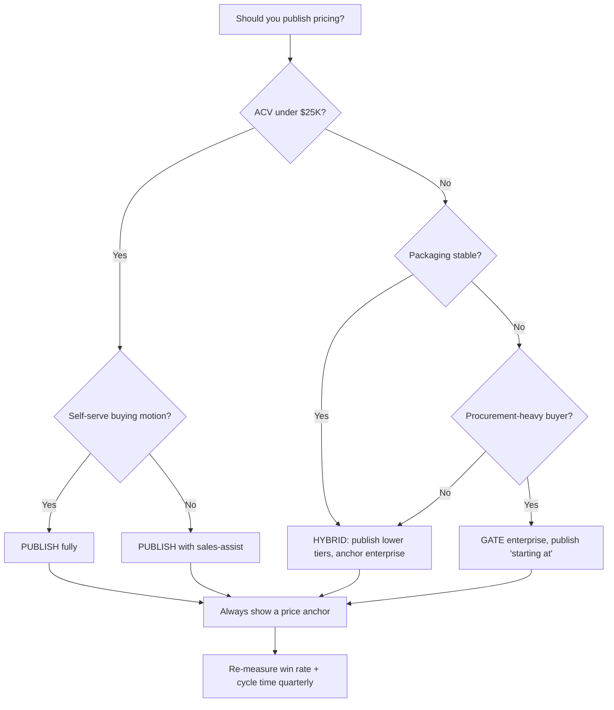

### Direct Answer

Publish your SaaS pricing on the website when your product is self-serve, your average contract value (ACV) sits below roughly $25,000, and a buyer can reach a confident purchase decision without a salesperson. Keep pricing "contact sales" only when deal value is high, configuration is genuinely complex, or your packaging changes faster than a published page can keep up. The honest decision rule is this: the cost of friction (lost trials, abandoned research sessions, eroded trust) is usually larger than the cost of transparency (competitor visibility, anchoring battles, sales-led negotiation leverage). Most companies hide pricing for reasons that protect the sales org, not the buyer — and that misalignment shows up in pipeline conversion, sales-cycle length, and word of mouth.

## TLDR

- **Publish pricing** when the product is self-serve or product-led, ACV is under ~$25K, the packaging is stable, and a technical or economic buyer can self-qualify.
- **Hide pricing** ("contact sales") when deals are large and negotiated, configuration is highly variable, you sell to procurement-heavy enterprises, or your packaging is still in active flux.
- **The real cost of hiding** is not competitor intelligence — competitors already know your pricing. The real cost is the qualified buyer who silently leaves because they cannot tell if you are a $50/month tool or a $500K platform.
- **A hybrid model wins most often**: publish the self-serve and team tiers transparently, gate only the true enterprise tier behind a conversation, and always show a credible price anchor or "starting at" figure.
- **Transparency compounds**: it improves SEO, shortens sales cycles, pre-qualifies inbound, builds trust, and reduces sales labor per dollar of revenue. Opacity compounds in the opposite direction.
- **This is a revenue operations decision, not a marketing whim** — it should be modeled against win rate, cycle time, lead quality, and cost-to-acquire, then revisited every two to four quarters.
- **Counter-cases exist**: bespoke platforms, regulated procurement, usage models with no stable unit, and brand-new categories can legitimately justify opacity — but those are the exception, not the default.

## 1. Why This Decision Matters More Than Teams Think

### 1.1 Pricing visibility is a conversion event, not a page

Most SaaS teams treat the pricing page as a static brochure — a place where numbers live. In reality, the pricing page is one of the highest-intent surfaces in your entire funnel. Buyers who reach it have moved past curiosity and into evaluation. They are mentally building a business case, comparing you against alternatives, and trying to answer one question: *Can I afford this, and is it worth it?*

When a buyer hits a wall of "contact sales," you have not protected a number. You have interrupted a decision at its most fragile moment. The buyer who was 70% of the way to a "yes" now has to decide whether your product is worth the social and time cost of a sales call. Many of them — especially the senior, busy, technically literate buyers you most want — will simply leave and never tell you.

This is why pricing visibility belongs to revenue operations, not just marketing. It is a lever that moves win rate, sales-cycle length, lead quality, and cost-to-acquire simultaneously. Few other single decisions touch that many metrics at once. The companies that treat it as a brand or design choice consistently under-optimize it; the companies that treat it as a measurable funnel decision consistently extract more pipeline from the same traffic.

### 1.2 The "contact sales" tax is invisible but real

Every gate you place between a buyer and the information they want imposes a tax. The tax is invisible because you never see the buyer who bounced. Your analytics show a session that ended; they do not show the qualified VP of Engineering who decided your opacity signaled either "too expensive" or "not confident enough to say."

Across observed B2B SaaS funnels, gating pricing tends to depress pricing-page-to-opportunity conversion meaningfully because a large share of buyers self-disqualify on the assumption of high cost — and a meaningful slice of those buyers were actually in-budget. You traded a qualified, in-budget buyer for the comfort of controlling a conversation. That is a bad trade for any business whose deals are not genuinely complex.

### 1.3 Buyers have already changed; many vendors have not

The modern B2B buyer behaves like a consumer. They research independently, read peer reviews, watch product videos, and build a shortlist before they ever speak to a vendor. By the time a buyer contacts sales, they are typically more than halfway — often two-thirds — through their decision process. Forrester and Gartner research on B2B buying has documented this shift for over a decade, and it has only accelerated.

A "contact sales" gate fights this behavior. It demands a conversation before the buyer is ready for one. Vendors who publish pricing meet the buyer where they actually are; vendors who hide it ask the buyer to behave the way sales reps wish they would.

> **Cross-link:** See **q1112 — "How should you structure SaaS pricing tiers for product-led growth?"** for how tier architecture interacts with the publish/hide decision.

### 1.4 The psychology of the hidden price

There is a well-documented cognitive pattern at work when a buyer encounters a "contact sales" wall. The buyer is not a blank slate; they arrive with a prior. That prior is shaped by every other vendor they have evaluated, every competitor they have priced, and the general anxiety that B2B software is expensive. When you remove the actual number, you do not remove the buyer's estimate — you simply replace your number with theirs. And the buyer's estimate, in the absence of information, almost always skews high and skews uncertain.

This produces two distinct failure modes. The first is the *over-estimator*: a buyer who is genuinely in-budget but assumes you cost three times what you do, and self-disqualifies before ever raising their hand. You never see this person. They are pure invisible loss. The second is the *uncertainty-averse buyer*: someone who could afford you but cannot tolerate the ambiguity of "I do not know if this is a $10K decision or a $100K decision," and therefore deprioritizes the evaluation entirely because they cannot build a business case around a number they do not have. Both failure modes are silent. Both are expensive. Neither shows up in any dashboard you currently look at.

Transparency neutralizes both. A published number — even a "starting at" floor — converts an unbounded, anxious estimate into a bounded, concrete fact. Concrete facts are easier to act on than ambiguous fears. This is the entire psychological case for transparency in one sentence: *a buyer can make a decision against a number, but they cannot make a decision against a void.*

### 1.5 Pricing visibility as a signal of company confidence

Buyers read pricing visibility as a tell. They cannot see inside your company, so they infer your internal state from the artifacts you expose — and the pricing page is one of the most scrutinized artifacts you have. A clean, confident, published price reads as: *this company knows what it is worth, has decided, and is not afraid to commit.* A "contact sales" wall reads, to a skeptical buyer, as one of several less flattering things: the price is negotiable and therefore arbitrary; the price is embarrassingly high; the company has not finished deciding; or the company wants to size up the buyer's wallet before quoting. None of those inferences help you.

This signaling effect is asymmetric. A confident published price rarely hurts you — at worst a competitor reads it, which they would have anyway. But an opaque wall can hurt you badly with exactly the buyer you most want: the senior, experienced, time-constrained decision-maker who has seen the "contact sales" pattern a hundred times and has learned to associate it with friction and games. The more sophisticated your buyer, the more the opacity costs you.

### 1.6 The traffic you are paying for

There is a hard financial dimension that pricing-visibility debates routinely ignore. You are spending money — on content, on ads, on events, on SEO — to bring a buyer to your site. That spend has a fully-loaded cost per visitor. When a buyer reaches your pricing page, you have already paid for them. The pricing page is the moment of truth where that acquisition spend either converts into pipeline or evaporates.

A "contact sales" wall raises the evaporation rate on your most expensive, highest-intent traffic. You paid to bring a high-intent buyer to the exact page where they want to make a decision, and then you withheld the one input the decision requires. Framed in revenue-operations terms, opacity is a tax levied at the most expensive point in the funnel — after acquisition cost is sunk, before pipeline value is captured. That is the worst possible place to introduce friction. If you are going to lose a buyer, lose them cheaply at the top of the funnel, not expensively at the pricing page.

## 2. The Core Decision Framework

### 2.1 The four variables that decide it

The publish-versus-hide question collapses into four variables. Score your product honestly on each.

| Variable | Favors Publishing | Favors "Contact Sales" |
|---|---|---|
| **Average contract value (ACV)** | Under ~$25K/year | Over ~$100K/year |
| **Buying motion** | Self-serve / product-led | Sales-led / negotiated |
| **Packaging complexity** | Stable, few SKUs | Highly variable, configured per deal |
| **Buyer type** | Practitioner / line manager | Procurement-driven enterprise |

If three or four variables point to publishing, publish. If three or four point to hiding, gate the enterprise tier. If the variables are split, you almost certainly want a hybrid model — publish the lower tiers, gate the top one. The mistake is treating this as binary when the data rarely is.

### 2.2 The ACV gravity rule

ACV exerts the strongest gravitational pull on this decision. The relationship is roughly continuous:

| ACV Band | Typical Recommendation | Rationale |
|---|---|---|
| Under $1K/year | Always publish | Self-serve checkout; a sales call costs more than the deal |
| $1K–$10K/year | Publish | Buyer self-qualifies; sales-assist optional |
| $10K–$25K/year | Publish, with sales-assist | Transparent price plus a "talk to us" path |
| $25K–$100K/year | Hybrid | Publish lower tiers, "starting at" anchor on enterprise |
| $100K+/year | Gate enterprise, publish anchors | Negotiated deals, but still show a credible floor |
| $250K+/year | Custom by default | Genuine complexity; published numbers mislead more than help |

The single most common mistake is a company with $8K ACV hiding pricing because they aspire to be a $200K-ACV enterprise vendor. Price the buyer you have, not the buyer you wish you had. Hiding pricing does not make you enterprise-grade; it makes you look evasive to the mid-market buyers who are actually in your pipeline.

### 2.3 Map the decision visually

The diagram makes the point that even the "gate" outcomes still publish *something* — a starting price, an anchor, a representative example. Pure opacity is almost never the right terminal state.

### 2.4 The honesty test

Before you decide, run the honesty test. Ask: *If a competitor's sales rep wanted our pricing, could they get it in ten minutes?* The answer is almost always yes. They can pose as a prospect, ask a customer, check a procurement database, or read a review site. Competitor secrecy is therefore a weak justification for hiding pricing — you are paying the buyer-friction tax to protect information that is not actually secret. Be honest about whether you are hiding pricing from competitors (you are not) or from your own buyers (you are).

> **Cross-link:** See **q1123 — "How do you run a SaaS pricing experiment without damaging trust?"** for how to test these thresholds safely.

### 2.5 Weighting the four variables

The four variables do not carry equal weight, and treating them as a simple unweighted vote leads teams astray. Buying motion and ACV are the load-bearing variables; packaging complexity and buyer type are modifiers. A useful way to formalize this is a weighted score.

| Variable | Weight | Why this weight |
|---|---|---|
| **ACV** | 35% | The strongest economic driver; a sales call must be cheaper than the deal |
| **Buying motion** | 35% | Determines whether a human is required at all |
| **Packaging complexity** | 20% | Determines whether a single number can even be true |
| **Buyer type** | 10% | A modifier — procurement adds process but rarely flips the decision alone |

Score each variable from 0 (strongly favors gating) to 100 (strongly favors publishing), multiply by the weight, and sum. A composite above 65 means publish fully. A composite between 40 and 65 means run the hybrid model. A composite below 40 means gate the enterprise tier but still publish an anchor. The point of the formula is not false precision — it is to force an honest, explicit conversation about *why* you are choosing what you are choosing, rather than defaulting to opacity because it feels safer.

### 2.6 A worked example

Consider a mid-market SaaS company selling a project-management tool. ACV is $14,000. The motion is mostly self-serve with a sales-assist option. Packaging is three stable tiers. Buyers are line managers, not procurement.

| Variable | Raw score | Weight | Contribution |
|---|---|---|---|
| ACV ($14K — under $25K) | 80 | 35% | 28.0 |
| Buying motion (self-serve + assist) | 85 | 35% | 29.75 |
| Packaging complexity (3 stable tiers) | 75 | 20% | 15.0 |
| Buyer type (line managers) | 80 | 10% | 8.0 |
| **Composite** | | | **80.75** |

A composite of 80.75 sits well above the "publish fully" threshold of 65. This company should publish all three tiers with exact prices and offer a visible but optional "talk to sales" path. If this same company is currently hiding pricing, it is almost certainly doing so for an internal reason — sales-org preference, aspiration, or indecision — and is paying the friction tax for no defensible benefit.

### 2.7 The asymmetry of the two errors

When you are uncertain, it helps to think about which error is more costly. Publishing pricing when you should have gated it costs you some negotiation leverage and some price discrimination on a subset of deals. Gating pricing when you should have published it costs you a stream of invisible, in-budget buyers who never raise their hand — and you cannot even measure the loss. The first error is visible and recoverable; you can add a gate later. The second error is invisible and compounding. When the decision is genuinely close, the asymmetry argues for transparency. The downside of over-publishing is bounded and observable; the downside of over-gating is unbounded and silent.

## 3. The Case for Publishing Pricing

### 3.1 Transparency pre-qualifies your pipeline

When pricing is visible, buyers self-select. A buyer who sees your starting price of $1,200/month and keeps reading is implicitly telling you they have budget. A buyer who sees it and leaves was never going to close — and they left *without consuming a sales rep's time*. Published pricing is therefore a free, always-on qualification filter. It shifts the qualification burden from expensive human labor to a static page.

This matters most for sales efficiency. A sales team working only pre-qualified, in-budget leads has a higher win rate, shorter cycles, and lower cost per closed deal. Atlassian (TEAM) built a multi-billion-dollar business almost entirely on this principle — transparent, published pricing and a low-touch motion that let buyers qualify themselves before any human got involved.

### 3.2 Transparency compounds in SEO and demand generation

A published pricing page is indexable. It ranks for "[your product] pricing" and "[your product] cost" — searches with extremely high purchase intent. A "contact sales" page has nothing to index and nothing to rank. Worse, third-party sites, Reddit threads, and review aggregators will fill the vacuum with *their* version of your pricing, which is often outdated or wrong. When you publish, you control the canonical answer. When you hide, you outsource the narrative.

| Demand-gen effect | Published pricing | "Contact sales" |
|---|---|---|
| Ranks for "[product] pricing" queries | Yes | No |
| Controls the canonical price narrative | Yes | No, third parties fill the gap |
| Feeds comparison and review sites accurately | Yes | No |
| Reduces "how much does it cost" support tickets | Yes | No |
| Builds buyer trust before first contact | Yes | Often the opposite |

### 3.3 Transparency builds trust, and trust converts

Buyers equate pricing transparency with honesty. A vendor who shows the number is signaling confidence: *we believe our value justifies this price, and we are not afraid to say it.* A vendor who hides it invites the opposite inference: *the price is negotiable, inconsistent, or embarrassingly high.* In a market where buyers are skeptical of vendor claims by default, transparency is a cheap and durable trust signal.

Basecamp (private, 37signals) has used radical pricing transparency — flat, public, take-it-or-leave-it pricing — as a core brand asset for two decades. The transparency *is* the marketing. It tells buyers exactly who the company is.

### 3.4 Transparency shortens the sales cycle

Every deal that involves a salesperson includes a "what does it cost" step. When pricing is published, that step happens before the buyer ever contacts you — asynchronously, on the buyer's schedule, at zero sales cost. When pricing is hidden, that step becomes a discovery call, a follow-up email, and often a back-and-forth negotiation. Hiding pricing does not eliminate the price conversation; it just moves it later and makes it more expensive.

### 3.5 Real operators who publish and win

- **Atlassian (TEAM)** — fully transparent, self-serve pricing across Jira and Confluence; the low-touch motion is the moat.
- **HubSpot (HUBS)** — publishes detailed, tiered pricing with calculators, even though enterprise deals are negotiated.
- **Zoom (ZM)** — publishes per-seat pricing prominently; enterprise is a clearly marked upgrade path.
- **Notion (private)** — transparent per-seat pricing fueled a bottoms-up, viral adoption motion.
- **Twilio (TWLO)** — publishes granular usage-based pricing for every API; transparency is essential to developer trust.
- **DocuSign (DOCU)** — publishes plan pricing for individuals and small teams, gates only true enterprise.
- **Datadog (DDOG)** — publishes per-host and per-feature pricing despite a sophisticated enterprise motion.

The pattern: even companies with large enterprise businesses publish their lower and mid tiers. They gate only the genuinely negotiated enterprise tier.

> **Cross-link:** See **q1135 — "What pricing-page design choices most affect SaaS conversion?"** for layout and anchor tactics that amplify transparency.

### 3.6 Transparency reduces the cost of being wrong

A subtle benefit of published pricing is that it makes pricing mistakes cheap to detect and correct. When pricing is public, every buyer who sees it is, in effect, running a free experiment for you. If your price is too high, you see it in the pricing-page bounce rate and the conversion gap. If it is too low, you see it in the conversion surge and the absence of any meaningful objection. The market gives you a continuous, honest read on whether your price is calibrated.

When pricing is hidden, that feedback loop is broken. The only people who learn your price are the ones who already raised their hand and entered a sales conversation — a heavily self-selected, already-committed subset. You lose the signal from everyone who saw your offer and silently declined. A company with hidden pricing can run a badly mis-calibrated price for years without ever clearly knowing, because the buyers who would have told them never got far enough to be measured. Transparency is, among other things, a free and continuous price-research instrument.

### 3.7 Transparency and the rise of buyer self-service

The structural trend in B2B software is unambiguous: buyers want to self-serve as much of the evaluation as possible, and they reward vendors who let them. This is not a fad tied to any one cohort of buyers — it is a durable shift in how complex purchases get made, and it has been visible in buyer-behavior research for well over a decade. A pricing page that publishes real numbers is a core enabler of self-service. It lets a buyer build a business case, get internal alignment, and arrive at a sales conversation already pre-sold on the economics. A "contact sales" wall blocks self-service at exactly the step where it matters most.

Vendors who embrace this trend compound an advantage over time. Every quarter, more of the buying journey shifts to self-service, and the transparent vendor captures more of that journey while the opaque vendor forces buyers back into a motion they increasingly resist. Transparency is not just better today; it is better and getting *relatively* better as buyer behavior continues to shift.

### 3.8 The word-of-mouth dividend

Pricing transparency produces a quiet but real word-of-mouth dividend. When a buyer can find your price easily, evaluate it, and feel that you dealt with them straight, they carry that impression into peer conversations, community threads, and review sites. "Their pricing is right there on the site, no games" is a small but genuine endorsement that compounds across a category's buyer network. Conversely, "you have to talk to sales just to find out what it costs" is a small but genuine complaint that also compounds. In categories where buyers talk to each other constantly — which is most B2B categories now — the cumulative reputational effect of your pricing posture is not negligible. Transparency is a slow-acting but durable trust asset.

## 4. The Case for "Contact Sales"

### 4.1 When opacity is legitimate

Hiding pricing is not always wrong. There are real, defensible reasons to gate it:

- **Genuine deal complexity.** When every deal is configured — different modules, seat counts, data volumes, SLAs, professional services — a single published number is more misleading than helpful. Palantir (PLTR) cannot publish a meaningful price because no two deployments resemble each other.
- **High ACV with negotiated terms.** Enterprise deals above ~$100K involve procurement, legal, and multi-year terms. The published number would be a starting point for negotiation anyway, so the page becomes an anchor battle rather than information.
- **Value-based pricing that scales with customer size.** When you charge a percentage of the value you create — a slice of payments processed, ad spend managed, or revenue influenced — the "price" is genuinely a function of the customer and cannot be a fixed figure.
- **Fast-changing packaging.** A company actively repackaging every quarter may legitimately not want a public page that is wrong within weeks. (This is a temporary state, not a strategy.)
- **Strategic discovery requirement.** Some complex products genuinely need a scoping conversation before a price is even meaningful — the buyer does not yet know what they need.

### 4.2 What "contact sales" actually buys you

| Benefit of gating | Real or overstated? |
|---|---|
| Hides pricing from competitors | **Overstated** — competitors get it anyway |
| Enables price discrimination by segment | **Real** — you can charge enterprises more |
| Forces a qualification conversation | **Real, but double-edged** — also loses buyers |
| Preserves negotiation leverage | **Real** for large, negotiated deals |
| Allows value-based, custom scoping | **Real** for genuinely bespoke products |
| Protects against anchoring on a low number | **Real** for high-ACV products |

The honest accounting: gating buys you price discrimination and negotiation leverage. It does *not* buy you competitor secrecy. If price discrimination and negotiation leverage are worth more than the buyers you lose, gate. If not, publish.

### 4.3 Operators who legitimately gate

- **Palantir (PLTR)** — deployments are bespoke; published pricing would be meaningless.
- **Salesforce (CRM)** — publishes some editions but routes large, multi-cloud deals through sales; genuine configuration complexity.
- **Workday (WDAY)** — enterprise HR/finance suites with multi-year, negotiated contracts; no public price.
- **ServiceNow (NOW)** — platform deals sized to the enterprise; pricing is always quoted.
- **Snowflake (SNOW)** — publishes usage-based credit pricing but enterprise commitments are negotiated; a hybrid that leans toward "contact us" for large commits.

Notice that even the legitimate gaters — Snowflake especially — publish *anchors* and *unit economics*. They do not present a blank wall.

### 4.4 The illegitimate reasons people hide pricing

Most "contact sales" decisions are not driven by the legitimate reasons above. They are driven by:

- **Sales-org preference.** Reps want to control the price conversation and avoid published anchors.
- **Aspiration.** A mid-market company hiding pricing to "look enterprise."
- **Indecision.** The company has not done the work to package clearly, so it hides the mess.
- **Fear.** Leadership is afraid the number looks high relative to competitors.

None of these serve the buyer. If your reason for hiding pricing is on this list, you are paying the friction tax to solve an internal problem. Fix the internal problem instead.

> **Cross-link:** See **q1157 — "How do you align sales and marketing on pricing communication?"** for resolving the sales-org-preference conflict.

### 4.5 The price-discrimination argument, examined honestly

The single strongest legitimate argument for gating pricing is price discrimination — the ability to charge a large enterprise more than a small business for substantially the same product, sized to the value each derives. This is not predatory; it is rational value-based pricing, and a published flat price genuinely makes it harder. If a $40/seat number is on your site, an enterprise procurement team will anchor to it and resist a $90/seat enterprise quote, even though the enterprise legitimately derives more value and consumes more support, security, and account management.

But the argument has limits, and teams overuse it. First, you can preserve most price-discrimination room with a hybrid model: publish the self-serve tier, gate the enterprise tier, and the enterprise quote is no longer anchored to the published number because it lives in a clearly different tier with clearly different scope. Second, price discrimination only matters if the *spread* between segments is large. If your smallest and largest customers pay within a 2x band, the discrimination upside is small and rarely worth the friction tax. Third, even price-discriminating vendors benefit from publishing an enterprise *anchor* — the discrimination happens in the negotiation above the anchor, not in the buyer's imagination below it.

| Price-discrimination scenario | Recommended posture |
|---|---|
| Spread between smallest and largest customer < 2x | Publish — discrimination upside is small |
| Spread 2x–5x | Hybrid — publish lower tiers, gate + anchor enterprise |
| Spread > 5x, genuinely value-driven | Gate enterprise, publish a model explanation and floor |
| Spread driven by sales aggression, not value | Publish — the "discrimination" is just inconsistency |

### 4.6 The hidden cost of "contact sales" on the sales team itself

Teams that gate pricing to help the sales org often discover that they have harmed it. A gated pricing page floods the sales team with unqualified inbound — every curious browser, student, competitor, and tire-kicker now has to talk to a rep just to learn the price. Reps spend a large share of their time on "what does it cost" conversations with people who were never going to buy. This depresses rep productivity, lengthens average response time to genuinely qualified leads, and erodes morale. The irony is sharp: gating pricing to protect the sales conversation often *degrades* the sales conversation by burying reps in low-intent volume.

A transparent pricing page does the opposite. It absorbs the "what does it cost" question for free, so that by the time a buyer contacts a rep, the buyer has already self-qualified on budget. The rep's conversations are fewer but far higher quality. Counterintuitively, the move that the sales org instinctively resists — publishing the price — is often the move that most improves the sales org's actual results.

### 4.7 "Contact sales" as a temporary state, not a destination

One legitimate use of "contact sales" that deserves emphasis: it is a perfectly reasonable *temporary* posture. A company that has not yet figured out its packaging, is mid-repricing, or is still discovering willingness-to-pay can legitimately gate pricing while it does the work. The error is letting the temporary state become permanent by default. Gating because you have not decided is fine for a quarter. Gating because you have not decided for three years is not a strategy — it is an unfinished task wearing the costume of a strategy. If your pricing is gated, put a date on the calendar to revisit it, and treat the gate as scaffolding to be removed, not a wall to be maintained.

## 5. The Hybrid Model: Best of Both Worlds

### 5.1 What the hybrid model looks like

The hybrid model is the answer for the large middle of the market. It works like this:

1. **Publish the self-serve and team tiers** with exact prices. These buyers should never need to talk to a human to understand cost.
2. **Publish a "starting at" anchor on the enterprise tier.** Even if the final price is negotiated, give buyers a floor — "Enterprise plans start at $30,000/year."
3. **Gate only the true custom tier** behind "contact sales," and label it honestly: "For organizations needing custom security, dedicated support, and volume pricing."
4. **Always provide a representative example.** "A typical 200-person company pays approximately $X." This converts an opaque "it depends" into a usable estimate.

### 5.2 Why the anchor matters

A "starting at" number is the single highest-leverage element on a gated tier. Without it, the buyer's imagination fills the void — and imagination tends to overshoot. A buyer who privately guesses "$200K" when the real floor is $35K has disqualified themselves over a number you never quoted. The anchor caps that downside. It does not commit you to a price; it prevents catastrophic mis-estimation.

| Enterprise tier presentation | Buyer reaction |
|---|---|
| "Contact sales" with no number | Assumes expensive; many self-disqualify |
| "Custom pricing" with no number | Same as above, slightly softer |
| "Starting at $30K/year" | Anchors expectation; in-budget buyers proceed |
| "Typical 200-person co.: ~$45K/year" | Best — buyer can self-estimate accurately |

### 5.3 The hybrid model in the wild

- **HubSpot (HUBS)** — publishes Starter and Professional precisely, gates Enterprise but shows clear "starting at" pricing and a calculator.
- **Datadog (DDOG)** — publishes per-host pricing for every product line; enterprise volume commits are negotiated separately.
- **Asana (ASAN)** — exact prices for Starter and Advanced, "contact sales" for Enterprise and Enterprise+.
- **Monday.com (MNDY)** — per-seat pricing published with a live seat slider; enterprise gated.
- **Slack / Salesforce (CRM)** — publishes Pro and Business+, routes Enterprise Grid through sales.

The hybrid model lets self-serve buyers move at full speed while preserving negotiation room exactly where it has real value — the top of the range.

### 5.4 Hybrid implementation checklist

| Element | Why it matters |
|---|---|
| Exact prices on self-serve tiers | Removes friction for the majority of buyers |
| Annual vs. monthly toggle | Lets buyers see commitment discounts transparently |
| "Starting at" on enterprise | Caps downside imagination; prevents self-disqualification |
| Representative example | Converts "it depends" into a usable estimate |
| Honest enterprise-tier description | Tells buyers *why* it is gated, builds trust |
| Visible "talk to sales" path on every tier | Sales-assist remains available without being mandatory |
| Pricing calculator (if usage-based) | Gives buyers a self-serve estimate |

> **Cross-link:** See **q1112 — "How should you structure SaaS pricing tiers for product-led growth?"** for the tier architecture that the hybrid model sits on top of.

### 5.5 Designing the gated enterprise tier well

If the hybrid model is correct for you, the quality of your gated enterprise tier matters enormously. A poorly designed enterprise tier — a bare "Contact Us" button with a generic description — squanders most of the hybrid model's benefit. A well-designed one captures it. The difference is information density. A good enterprise tier tells the buyer, without quoting a final price, almost everything they need to self-qualify.

| Enterprise-tier element | Purpose |
|---|---|
| "Starting at" floor price | Caps downside imagination; lets in-budget buyers proceed |
| Representative customer example | Converts "it depends" into a concrete estimate |
| Explicit list of what the tier *adds* | Justifies the price gap; reframes from cost to value |
| The pricing *model* (per-seat, per-outcome, volume) | Lets buyers estimate their own bracket |
| Honest "who this is for" description | Self-selects the right buyers in and the wrong ones out |
| A named, low-friction contact path | The conversation is for scoping, not for revealing the price |

The mental model: the gated enterprise tier should make the eventual sales conversation about *scoping and fit*, never about *revealing the price*. If the buyer's first question to your rep is "so how much is it," your enterprise tier has failed. If their first question is "here is our situation, does the Enterprise tier fit," it has succeeded.

### 5.6 The "starting at" number is not a commitment

A recurring objection from sales leaders to the hybrid model is: "If we publish 'starting at $30K,' buyers will hold us to $30K." This misunderstands how anchors work. A "starting at" number is explicitly a floor, and buyers understand floors. It tells the buyer "the smallest possible version of this is $30K," which immediately filters out the buyer who has $5K and was never viable, and immediately reassures the buyer who has $80K that they are comfortably in range. The negotiation still happens above the floor, exactly as it would have anyway. What the floor removes is the catastrophic scenario where an $80K-budget buyer privately guesses "$300K" and walks. A floor constrains the buyer's imagination on the downside only; it does not cap your upside.

### 5.7 The hybrid model and the buyer journey

The deeper reason the hybrid model wins is that it matches the *shape* of a real buyer journey. Early in the journey, a buyer wants information and wants it without friction — they are building a shortlist and a rough business case. Published lower tiers and an enterprise anchor serve this perfectly. Later in the journey, a serious enterprise buyer genuinely *wants* a conversation — they have specific requirements around security, deployment, support, and contract terms that no page can answer. The gated enterprise contact path serves this perfectly. The hybrid model is not a compromise that splits the difference; it is a design that gives each phase of the journey what that phase actually needs. Pure publishing under-serves the late-stage enterprise buyer; pure gating under-serves the early-stage researcher. The hybrid serves both.

## 6. Counter-Case: When You Should NOT Publish

### 6.1 The legitimate exceptions

This entry argues strongly for transparency, so it is essential to be precise about when that advice does *not* apply. Publishing pricing is the wrong move in these specific situations:

1. **Truly bespoke platforms.** If no two customer deployments resemble each other — different data models, integrations, professional services, and SLAs — a published number is actively misleading. Palantir-class products fall here. A buyer who sees "$X" and then receives a quote for "$8X" feels deceived, which is worse than seeing no number at all.

2. **Regulated or procurement-mandated buying.** When you sell primarily to governments, large financial institutions, or healthcare systems whose procurement processes require formal RFPs and negotiated master agreements, a public price is irrelevant to how the deal actually closes. The procurement process *is* the pricing process.

3. **Pure usage-based models with no stable unit.** If your price is a complex function of multiple usage dimensions with no clean "per seat" or "per unit" abstraction, a published table can confuse more than it clarifies. (Note: this is an argument for a *calculator*, not for total opacity — Twilio and Datadog show that even usage pricing can be transparent with the right tooling.)

4. **Brand-new categories with no price reference.** When you are creating a category and buyers have no mental anchor, a published number can position you wrongly before you have shaped the market's perception of value. This is a *temporary* exception — it expires once the category matures.

5. **Active, deliberate repackaging.** If you are in the middle of a genuine repackaging initiative, publishing a page you know is about to be wrong creates churn and confusion. Gate temporarily, finish the work, then publish.

### 6.2 The test for whether your exception is real

For each "reason" you have for hiding pricing, ask three questions:

| Test question | If "yes" → | If "no" → |
|---|---|---|
| Would a published number genuinely mislead the buyer? | Legitimate to gate | Not legitimate |
| Is the complexity in the *product*, not the *sales process*? | Legitimate to gate | Not legitimate |
| Would you still hide it if your sales team had no preference? | Legitimate to gate | Not legitimate — it's sales-org preference |

If you cannot answer "yes" to all three, your exception is not real, and you are hiding pricing for an internal reason that costs you buyers.

### 6.3 Even in the exceptions, publish *something*

The counter-case is never an argument for a blank wall. Even the most bespoke vendor can publish:

- **A minimum engagement size** — "Engagements typically start at $250K."
- **A pricing *model* explanation** — how you price (per-seat, per-outcome, per-deployment), even without numbers.
- **Representative case studies with disclosed economics** — "A regional bank invested ~$400K in year one."
- **The factors that move price up or down** — so buyers can self-estimate their bracket.

Total opacity — a "contact sales" button and nothing else — is almost never optimal, even for genuine exceptions. The counter-case justifies *negotiated* pricing, not *secret* pricing.

> **Cross-link:** See **q1130 — "How do you communicate value-based pricing to enterprise buyers?"** for how to be transparent about a model even when you cannot publish a fixed number.

### 6.4 The counter-case for the counter-case

It is worth being self-critical about the exceptions, because they are the favorite hiding place for bad decisions. Every team that gates pricing believes it falls into one of the legitimate exceptions. The vast majority are wrong. The exceptions are real but rare, and they are routinely claimed by companies that do not qualify.

The most abused exception is "our deals are too complex to publish a price." In practice, genuine deal complexity that *cannot* be reduced to a published anchor is unusual. Most "complex" pricing is complex because the company has not done the work to simplify it, not because the underlying value is irreducibly bespoke. Datadog's pricing is genuinely complex — many products, usage dimensions, host counts — and Datadog publishes it anyway, because complexity is not the same as un-publishability. If a company with Datadog-level pricing complexity can publish, most companies claiming the "too complex" exception cannot honestly use it.

The second most abused exception is "we sell to enterprises." Selling to enterprises is not, by itself, a reason to hide all pricing. Plenty of companies sell heavily to enterprises while publishing their lower and mid tiers — the enterprise motion gates only the genuinely negotiated top tier. "We sell to enterprises" justifies a gated *enterprise tier*. It does not justify a gated *pricing page*.

| Claimed exception | Honest test | Usual verdict |
|---|---|---|
| "Our pricing is too complex" | Could a calculator or anchor handle it? | Usually yes — claim fails |
| "We sell to enterprises" | Do *all* tiers need gating, or just the top? | Usually just the top — gate that one only |
| "Competitors will copy us" | Can a competitor get the price in 10 minutes anyway? | Yes — claim fails |
| "Our value is bespoke" | Is value bespoke, or is *packaging* just unfinished? | Usually unfinished — claim fails |
| "We're a new category" | Is this still true 18 months in? | Rarely — claim expires |

### 6.5 How to exit an unjustified gate gracefully

If you conclude that your gate is not justified, you do not have to flip a switch overnight in a way that alarms your sales team. Exit gracefully and in stages. First, add a "starting at" anchor and a representative example to the existing gated page — this alone captures much of the transparency benefit with minimal disruption. Measure for a full sales cycle. Second, publish the self-serve and team tiers with exact prices while keeping the enterprise tier gated. Measure again. Third, if the data supports it, consider publishing an enterprise range. At each stage you are measuring, not guessing, and you are giving the sales organization time to adapt its motion. The destination is transparency; the path can be incremental and evidence-driven.

## 7. How to Measure the Decision

### 7.1 The metrics that tell you the truth

This is a revenue operations decision, which means it must be measured, not assumed. Track these metrics before and after any change to pricing visibility:

| Metric | What it tells you |
|---|---|
| Pricing-page → opportunity conversion | Whether the page qualifies or repels buyers |
| Inbound lead quality (% in-budget) | Whether transparency is filtering correctly |
| Sales-cycle length | Whether the price conversation moved earlier |
| Win rate | Whether reps are working better-qualified deals |
| Cost per closed deal | Sales labor efficiency per dollar of revenue |
| Pricing-related support tickets | Whether buyers can self-serve the answer |
| Organic traffic to pricing-related queries | SEO value of a published page |

### 7.2 How to run the experiment

You do not have to guess. You can test pricing visibility directly:

1. **Establish a baseline.** Measure all of the metrics above for at least one full sales cycle.
2. **Make one change.** Either publish a previously gated tier, or add a "starting at" anchor to a gated tier. Change one thing.
3. **Hold for a full cycle.** Pricing changes need a complete sales cycle to show their true effect — a four-week read on a twelve-week cycle is noise.
4. **Compare cohorts, not calendar periods.** Compare deals that *entered* the pipeline before and after the change, so you are measuring like with like.
5. **Decide on the composite.** A change that lifts conversion but tanks ACV is not a win. Judge on revenue per pricing-page visitor, not any single metric.

### 7.3 The numbers that usually move

When a sales-led company adds transparency, the typical pattern observed across B2B SaaS funnels is directional and consistent:

| Metric | Typical direction after adding transparency |
|---|---|
| Pricing-page → opportunity conversion | Up |
| Lead volume | Down slightly (low-intent buyers filtered out) |
| Lead quality | Up (remaining leads are in-budget) |
| Sales-cycle length | Down (price conversation happens earlier) |
| Win rate | Up (reps work pre-qualified deals) |
| Total closed revenue | Up in most cases |

Lower lead *volume* with higher lead *quality* is the expected and desirable outcome. Teams that panic at the volume drop and revert have misread the experiment — the volume they lost was never going to convert.

> **Cross-link:** See **q1123 — "How do you run a SaaS pricing experiment without damaging trust?"** for the full experiment-design playbook.

### 7.4 Building the business case for the change

When you propose adding transparency, you will face internal resistance, and you will need a business case that survives scrutiny. Build it around revenue per pricing-page visitor, not around any single metric, because single metrics are easy to attack. A skeptic can always say "lead volume dropped" — and they will be right, because filtering out low-intent buyers is the *point*. The defensible frame is total revenue generated per unit of pricing-page traffic.

| Business-case input | How to estimate it |
|---|---|
| Current pricing-page traffic | Analytics, last full quarter |
| Current page → opportunity rate | CRM, matched to page visits |
| Current opportunity → win rate | CRM, last 2-4 quarters |
| Current average deal size | CRM, segment-weighted |
| Projected page → opportunity lift | Conservative; use the low end of observed ranges |
| Projected win-rate lift | Conservative; pre-qualified deals close better |

Model the change conservatively — use the bottom of any observed improvement range — and show the composite revenue effect. A conservative model that still shows a gain is far more persuasive than an optimistic one that a skeptic can dismantle. And commit, in writing, to a full-sales-cycle measurement window so that nobody can declare failure on a four-week volume dip.

### 7.5 Leading indicators versus lagging indicators

Pricing-visibility changes have a measurement trap: the lagging indicators you care about most — win rate, total revenue — take a full sales cycle to move, but the leading indicators move within days. The danger is that the leading indicators can look *bad* before the lagging indicators look good. Lead volume drops within a week; win rate does not visibly improve for a quarter. A team that watches only the fast metric panics and reverts before the slow metric has a chance to vindicate the change.

The discipline is to identify, in advance, which leading indicators are *expected* to move in which direction, and to pre-commit to not reacting to them. Lead volume down, lead quality up, and pricing-related support tickets down are all *expected* leading indicators of a healthy transparency change. Seeing them is confirmation, not alarm. Only the lagging composite — revenue per pricing-page visitor over a full cycle — should drive a keep-or-revert decision.

## 8. Common Mistakes and How to Avoid Them

### 8.1 The seven most common errors

1. **Hiding pricing to look enterprise.** A mid-market company gating $8K deals to seem like a $200K vendor. This fools no one and repels mid-market buyers. *Fix:* price and present for the buyer you actually have.

2. **Treating it as binary.** Believing you must either publish everything or hide everything. *Fix:* adopt the hybrid model — publish lower tiers, anchor the enterprise tier.

3. **Hiding pricing because packaging is messy.** Opacity as a way to avoid the hard work of clear packaging. *Fix:* do the packaging work; the page will follow.

4. **No anchor on the gated tier.** A bare "contact sales" button with no number, leaving buyers to imagine the worst. *Fix:* always show "starting at" or a representative example.

5. **Letting the sales org own the decision.** Sales naturally prefers control of the price conversation; that preference is not the same as what is best for revenue. *Fix:* make it a RevOps decision measured against win rate and cycle time.

6. **Never revisiting the decision.** Pricing visibility is set once and never re-examined as the company moves up- or down-market. *Fix:* review every two to four quarters.

7. **Reverting on a volume scare.** Adding transparency, seeing lead volume fall, and panicking — without checking that lead *quality* and *revenue* rose. *Fix:* judge on the composite, over a full cycle.

### 8.2 The mistake matrix

| Mistake | Symptom | Correction |
|---|---|---|
| Hiding to look enterprise | Mid-market buyers bounce from pricing page | Price for the real buyer |
| Binary thinking | Endless internal debate, no decision | Hybrid model |
| Hiding messy packaging | Sales reps improvise prices | Fix the packaging first |
| No anchor | Buyers assume "too expensive" | Add "starting at" |
| Sales owns the call | Decision optimizes rep comfort | Move to RevOps |
| Set-and-forget | Pricing page outdated vs. motion | Quarterly review |
| Volume-scare revert | Whiplash, lost momentum | Judge on composite |

### 8.3 The cultural mistake underneath all of them

Most of these errors share a root cause: the company optimizes for the *internal* comfort of the sales organization rather than the *external* experience of the buyer. Hiding pricing feels safe internally — no anchor battles, full control of the conversation, no competitor visibility. But "feels safe internally" and "wins more revenue" are different things. The discipline is to keep asking: *Are we doing this for the buyer, or for ourselves?* When the answer is "for ourselves," the decision is usually wrong.

> **Cross-link:** See **q1157 — "How do you align sales and marketing on pricing communication?"** for the org-design fix.

## 9. Decision Playbook by Company Stage

### 9.1 Early-stage / pre-product-market-fit

At this stage, you are still discovering what buyers will pay. Publish a price anyway — even a "best guess" price — because the act of publishing forces clarity and generates real signal. A gated page at this stage just hides the fact that you have not decided. Treat your published price as a hypothesis you will revise.

| Stage attribute | Recommendation |
|---|---|
| Pricing maturity | Hypothesis, not final |
| Recommended posture | Publish a simple, single price |
| Why | Forces clarity; generates willingness-to-pay signal |

### 9.2 Growth stage / scaling

This is where the hybrid model earns its keep. You likely have a self-serve motion and an emerging enterprise motion at the same time. Publish the self-serve tiers, anchor the enterprise tier, and instrument everything so you can see which motion is more efficient.

| Stage attribute | Recommendation |
|---|---|
| Pricing maturity | Multiple tiers, two motions |
| Recommended posture | Hybrid: publish lower, anchor enterprise |
| Why | Lets each motion run at its natural speed |

### 9.3 Enterprise / up-market

As you move up-market, more deals are genuinely negotiated. The gated enterprise tier becomes legitimate. But keep publishing the lower tiers — they are your top-of-funnel and your land motion. Companies that hide *all* pricing as they move up-market often strangle the self-serve pipeline that feeds their enterprise expansion.

| Stage attribute | Recommendation |
|---|---|
| Pricing maturity | Negotiated enterprise deals dominate |
| Recommended posture | Gate enterprise, keep lower tiers public |
| Why | Lower tiers are the land motion for enterprise expand |

### 9.4 The stage-transition trap

The most dangerous moment is the transition from growth to enterprise. A company sees its enterprise deals growing, concludes "we are an enterprise company now," and hides all pricing. Six months later, self-serve signups have collapsed, the top-of-funnel is starving, and the enterprise pipeline — which was being fed by self-serve land-and-expand — begins to thin. Moving up-market should *add* a gated tier, not *remove* the published ones.

## 10. Putting It All Together

### 10.1 The decision in one paragraph

Publish your pricing unless you have a genuine, product-rooted reason not to. Score yourself on ACV, buying motion, packaging complexity, and buyer type. If you land in the self-serve, sub-$25K, stable-packaging zone, publish fully. If you land in the high-ACV, negotiated, complex-configuration zone, gate the enterprise tier — but still publish an anchor and a representative example. If you are in the middle, run the hybrid model. And whatever you choose, measure it against win rate, cycle time, lead quality, and cost-to-acquire, then revisit it every few quarters.

### 10.2 The final checklist

| Question | If "yes" |
|---|---|
| Is ACV under ~$25K? | Lean publish |
| Is the buying motion self-serve? | Lean publish |
| Is packaging stable? | Lean publish |
| Are buyers practitioners, not procurement? | Lean publish |
| Are deals genuinely configured per customer? | Gate enterprise tier |
| Would a published number actively mislead? | Gate, but publish an anchor |
| Is your reason for hiding "sales prefers it"? | Publish — that is not a real reason |
| Have you measured the decision in the last 6 months? | If no, do it now |

### 10.3 The mindset

The deepest point is this: pricing transparency is a *trust* decision before it is a *tactics* decision. Buyers in 2026 expect to research independently and make confident decisions before they ever speak to a vendor. A company that meets that expectation signals confidence, honesty, and respect for the buyer's time. A company that fights it signals the opposite. The numbers — conversion, cycle time, win rate — almost always follow the trust. Publish unless you have earned the right not to, and even then, never show a blank wall.

> **Cross-link:** See **q1112**, **q1123**, **q1135**, **q1157**, and **q1130** for the surrounding pricing-strategy cluster.

## Sources

1. Forrester Research — "The Modern B2B Buyer's Journey," buyer self-research behavior studies.
2. Gartner — "The B2B Buying Journey," research on buyers completing the majority of decisions before vendor contact.
3. Gartner — "Magic Quadrant" methodology notes on pricing transparency in vendor evaluation.
4. McKinsey & Company — "Pricing in B2B SaaS," value-based pricing research.
5. Bain & Company — "The Price of Transparency," B2B pricing studies.
6. OpenView Partners — "SaaS Pricing Strategy" annual benchmark reports.
7. OpenView Partners — "Product-Led Growth" research on self-serve pricing motions.
8. Price Intelligently / ProfitWell — "The Anatomy of SaaS Pricing Strategy."
9. Price Intelligently / ProfitWell — research on willingness-to-pay and packaging.
10. SaaStr — Jason Lemkin essays on pricing transparency and the self-serve motion.
11. Atlassian (TEAM) — investor materials on the low-touch, self-serve go-to-market model.
12. HubSpot (HUBS) — public pricing pages and investor commentary on tiered pricing.
13. Zoom (ZM) — public pricing structure and per-seat transparency.
14. Notion — public per-seat pricing and bottoms-up adoption case studies.
15. Twilio (TWLO) — public usage-based pricing documentation for developers.
16. DocuSign (DOCU) — public plan pricing and enterprise gating structure.
17. Datadog (DDOG) — public per-host and per-feature pricing documentation.
18. Palantir (PLTR) — investor materials on bespoke deployment economics.
19. Salesforce (CRM) — public edition pricing and enterprise sales motion.
20. Workday (WDAY) — investor commentary on negotiated enterprise contracts.
21. ServiceNow (NOW) — investor materials on platform deal sizing.
22. Snowflake (SNOW) — public usage-based credit pricing and enterprise commitments.
23. Asana (ASAN) — public tier pricing and enterprise gating.
24. Monday.com (MNDY) — public per-seat pricing with seat-slider tooling.
25. Basecamp / 37signals — public flat-pricing philosophy and brand commentary.
26. Tomasz Tunguz — "Pricing Strategy" essays on transparency and conversion.
27. a16z — "16 Startup Metrics" and SaaS go-to-market commentary.
28. ProfitWell / Paddle — SaaS retention and pricing-page conversion data.
29. Drift — "Conversational Marketing" research on buyer friction at gated pages.
30. Gong — revenue intelligence research on sales-cycle length and the price conversation.
31. Clari — revenue operations research on pipeline conversion and forecast accuracy.
32. CHI Software / Baymard Institute — UX research on form and gate abandonment.
33. First Round Review — operator essays on SaaS pricing and packaging decisions.
34. The Pricing Journal — academic and practitioner research on price anchoring.
35. SiriusDecisions / Forrester — demand-generation benchmarks on lead quality vs. volume.
