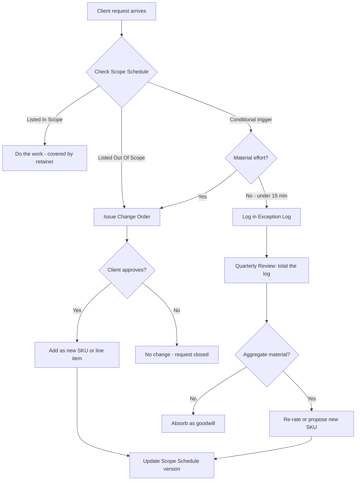

### Direct Answer

For a stable 10-employee small business with clean books, predictable transaction volume, and standard payroll, the right monthly bookkeeping retainer in 2026 sits between **$650 and $1,400**, with most well-run firms landing at **$900-$1,100** for the core monthly close package. The single biggest mistake owner-operators make is pricing the engagement on hours instead of on a fixed, tightly scoped deliverable list; the second is failing to define what is *not* included with the same precision they define what *is*. Scope creep is not an accident that happens to you. It is a pricing-architecture failure you can engineer out of the engagement before the first invoice ever goes out, using a written scope schedule, transaction-volume tiers, a change-order trigger, and a quarterly re-rate clause.

> **TLDR**
> - A 10-employee business is a "Tier 2" bookkeeping client: roughly 150-350 monthly transactions, 1-3 bank/credit accounts, biweekly payroll run through a provider, and monthly accrual or modified-cash close. Price it at **$900-$1,100/month** as a fixed retainer, not hourly.
> - Build the price bottom-up from a **time-to-serve estimate** (8-14 hours/month), then apply your target effective rate ($75-$110/hr blended), then add a **15-20% scope-creep buffer** so normal variability never erodes margin.
> - Scope creep is prevented by **document architecture, not willpower**: a one-page Scope Schedule, a transaction-volume band that triggers re-rating, an explicit "Out of Scope" list, and a change-order process that converts every ad-hoc request into either a logged exception or a new line item.
> - **Re-rate quarterly or semi-annually**, never annually only. A client that grew from 10 to 16 employees mid-year is a different client; your contract should make that re-rate automatic and unemotional.
> - The firms that hold margin treat the retainer as a **product with a spec sheet**, package add-ons (catch-up, advisory, sales-tax, 1099 season) as separate SKUs, and review realization monthly. The firms that bleed margin treat the retainer as "whatever the client needs."

---

## 1. Why The "Right Price" Question Is Really A Scoping Question

### 1.1 The Hidden Premise In The Question

Every owner-operator who asks "what should I charge a 10-employee business?" is implicitly assuming that "a 10-employee business" is a stable, well-defined unit of work. It is not. Two companies with exactly ten employees can differ in monthly bookkeeping effort by a factor of four. One is a SaaS company with a single Stripe feed, one operating bank account, automated payroll through Gusto, and a founder who reconciles their own expense card weekly. The other is a residential HVAC contractor with three trucks, a fuel card per truck, job-costing requirements, progress-billed invoices, sales tax in two jurisdictions, supplier deposits, and a shoebox of receipts that arrives on the 9th of the following month.

Headcount is a vanity proxy. The real cost drivers are **transaction volume, account count, payroll complexity, close method, and document hygiene**. When you price off headcount, you are pricing off the one variable that is easy to say out loud and nearly useless for estimating labor. This is the same mistake a freight broker would make pricing a lane by the number of pallets without asking whether the freight is dry van or reefer.

### 1.2 The Cost Of Getting It Wrong In Both Directions

Underpricing a bookkeeping retainer is not a marketing problem you can fix later with a price increase. It is a structural problem that compounds. Every month you serve an underpriced client, you are spending capacity you cannot sell to a correctly priced one. If your firm has 600 productive hours per month across its team, and you fill 120 of them with a client paying a $55 effective rate when your target is $95, you have not just lost $4,800 of theoretical revenue. You have lost the *option* to deploy that capacity, and you have anchored the client to a number that will make every future increase feel like a betrayal.

Overpricing has a quieter cost. You win fewer engagements, and the ones you lose you often never hear about. But overpricing is the recoverable error. Scope creep on an underpriced base is the unrecoverable one, because it accelerates: the underpriced client is the client most likely to treat your time as free, precisely because the price signaled that it was cheap.

### 1.3 The Core Reframe

The disciplined way to think about a bookkeeping retainer:

- **The retainer is a product, not a relationship.** It has a spec sheet, a version number, and a defined boundary. Relationships are warm and flexible. Products are bounded and repeatable. You can have a warm relationship *and* a bounded product; you cannot have a profitable firm with only the relationship.
- **Price is downstream of scope, and scope is downstream of a model.** You do not pick a number and hope. You estimate hours, apply a rate, add a buffer, and the number falls out.
- **Scope creep is a contract design defect, not a client character flaw.** Most clients are not trying to steal from you. They are responding rationally to ambiguity. Ambiguity is something *you* control.

| Pricing mindset | Symptom | Margin outcome |
|---|---|---|
| **Headcount-based** ("10 employees = $X") | Same price for wildly different effort | Random; some clients subsidize others |
| **Hourly** ("we'll bill what it takes") | Client fears every email; you fear every short month | Low; punishes your own efficiency |
| **Cost-plus fixed** (hours x rate + buffer) | Predictable invoices, defined boundary | Stable 55-65% gross margin |
| **Value-anchored fixed** (cost-plus + advisory premium) | Higher price, requires proof of outcome | 65-75% gross margin, slower to sell |

The rest of this answer builds the cost-plus fixed model in detail, then layers the scope-creep defenses on top of it.

---

## 2. Profiling The 10-Employee Client Before You Quote

### 2.1 The Five Cost Drivers That Actually Matter

Before you say a number, you need five data points. Each one moves the price more than headcount does.

- **Monthly transaction count.** This is the master variable. Count every line that must be categorized, matched, or reconciled across all bank and credit accounts. A 10-employee business typically runs 150-350 transactions/month. Below 120 it is a Tier 1 client; above 400 it is Tier 3.
- **Number of financial accounts.** Each bank account, credit card, line of credit, merchant processor, and loan is a separate reconciliation surface. Three accounts is normal; six or more meaningfully increases close time and error risk.
- **Payroll structure.** Is payroll run through a provider (Gusto, ADP, Rippling, Paychex) that posts a clean journal entry, or does the client expect you to process payroll? A clean provider feed is 15 minutes. Manual payroll, contractor mix, or multi-state withholding is hours.
- **Close method and reporting cadence.** Pure cash-basis monthly close is the floor. Accrual, deferred revenue, prepaid amortization, inventory, or job-costing each add a recurring schedule you must maintain.
- **Document hygiene and responsiveness.** A client who connects live bank feeds and answers categorization questions within 24 hours costs half what a client who emails a folder of PDFs on the 12th does. This is the variable owners chronically under-weight.

### 2.2 A Discovery Checklist You Run Before Every Quote

Never quote from a phone call. Run a structured discovery and look at real data. The discovery itself can be a paid diagnostic ($250-$500) that you credit toward the first invoice if they sign.

| Discovery item | What you ask for | Why it changes the price |
|---|---|---|
| **Bank statements** | Last 3 months, all accounts | Real transaction count, not the client's guess |
| **Current chart of accounts** | Export from existing system | Messy COA = cleanup before steady-state |
| **Payroll reports** | Last 2 payroll runs | Reveals contractor mix, multi-state, benefits |
| **Prior-year tax return** | Most recent filed return | Shows entity type, accrual vs cash, depreciation |
| **Reconciliation status** | When were accounts last reconciled? | Unreconciled = catch-up project, separate SKU |
| **Sales tax footprint** | Which states/jurisdictions | Each jurisdiction is a recurring filing obligation |
| **Software stack** | GL, payroll, AP, expense, POS | Integration vs manual entry is a labor multiplier |

### 2.3 The Transaction-Volume Banding System

The single most useful artifact you can build is a transaction-volume band table. It does two jobs at once: it makes your quote defensible, and it becomes the contractual trigger for re-rating later (covered in Section 6). Define the bands once, use them for every client.

| Band | Monthly transactions | Accounts | Typical retainer (2026) | Est. hours/mo |
|---|---|---|---|---|
| **Tier 1 - Light** | Up to 120 | 1-2 | $400-$650 | 4-7 |
| **Tier 2A - Standard** | 121-250 | 2-3 | $750-$1,000 | 7-11 |
| **Tier 2B - Standard+** | 251-350 | 3-4 | $1,000-$1,300 | 10-14 |
| **Tier 3 - Heavy** | 351-600 | 4-6 | $1,400-$2,200 | 14-22 |
| **Tier 4 - Complex** | 600+ or job-costing | 6+ | $2,200+ custom | 22+ |

A typical 10-employee small business lands in **Tier 2A or 2B**. That is the source of the $900-$1,100 headline number: it is the midpoint of the Standard band at a healthy effective rate, not a figure pulled from the air.

---

## 3. Building The Retainer Price Bottom-Up

### 3.1 The Cost-Plus Fixed Formula

The model has four steps. Each is simple. The discipline is doing all four every time and writing the result down.

**Step 1 - Estimate time-to-serve.** Decompose the monthly engagement into named tasks and estimate each. Do not estimate "the close" as one blob.

**Step 2 - Apply your target effective rate.** This is your blended cost-to-serve rate plus your target margin, not a senior accountant's billing rate.

**Step 3 - Add a scope-creep buffer.** 15-20% on top of the estimate. This absorbs the normal month-to-month variance so a busy month does not become a loss.

**Step 4 - Sanity-check against the band table and against realization.** If the number falls outside your band, your task estimate is probably wrong; go back to Step 1.

### 3.2 A Worked Example: HVAC Contractor, 10 Employees

Assume a residential HVAC contractor: 3 operating accounts, two credit cards, ~240 transactions/month, payroll through a provider, modified-cash close, sales tax in one state, moderate document hygiene.

| Monthly task | Estimated hours | Notes |
|---|---|---|
| **Bank & credit reconciliation** | 3.0 | 5 accounts, ~240 transactions |
| **Transaction categorization & review** | 3.5 | Includes chasing 8-12 uncoded items |
| **Payroll journal entry & review** | 0.5 | Clean provider feed |
| **AP / vendor bill entry** | 1.5 | ~25 bills/month |
| **Sales tax prep & filing** | 1.0 | Single jurisdiction, monthly |
| **Month-end close & adjusting entries** | 1.5 | Prepaids, accruals, depreciation schedule |
| **Financial statement package & delivery** | 1.0 | P&L, balance sheet, cash summary |
| **Client communication & questions** | 1.0 | Email, one monthly check-in call |
| **Total estimated hours** | **13.5** | |

Now apply the rate and buffer:

| Calculation step | Value |
|---|---|
| Estimated hours/month | 13.5 |
| Target blended effective rate | $85/hr |
| Base estimate (13.5 x $85) | $1,147 |
| Scope-creep buffer (15%) | $172 |
| **Modeled retainer** | **$1,319** |
| Band check (Tier 2B: $1,000-$1,300) | Slightly high - round to $1,275 |
| **Quoted retainer** | **$1,275/month** |

This client lands at the top of Tier 2B because of job-costing-adjacent complexity and sales tax. Contrast with a SaaS company of the same headcount.

### 3.3 A Worked Example: SaaS Company, 10 Employees

Single Stripe feed, one operating account, one credit card, ~140 transactions/month, automated payroll, accrual close with deferred revenue, no sales tax (or automated through Avalara), excellent document hygiene.

| Monthly task | Estimated hours |
|---|---|
| **Bank & credit reconciliation** | 1.5 |
| **Stripe revenue reconciliation & deferred revenue schedule** | 1.5 |
| **Transaction categorization** | 1.5 |
| **Payroll journal entry** | 0.25 |
| **AP / vendor bills** | 0.75 |
| **Month-end close & adjusting entries** | 1.25 |
| **Financial statement package** | 1.0 |
| **Client communication** | 0.75 |
| **Total estimated hours** | **8.5** |

| Calculation step | Value |
|---|---|
| Estimated hours/month | 8.5 |
| Target blended effective rate | $95/hr (accrual premium) |
| Base estimate (8.5 x $95) | $808 |
| Scope-creep buffer (15%) | $121 |
| **Modeled retainer** | **$929** |
| **Quoted retainer** | **$925/month** |

Same headcount. A $350/month difference in price, driven entirely by the cost drivers in Section 2. This is the proof that headcount pricing is malpractice.

### 3.4 What Effective Rate Should You Target?

The effective rate is not your senior accountant's salary divided by hours. It is a blended figure that has to cover the actual mix of labor doing the work, plus software, plus overhead, plus margin.

| Cost component | Typical share of revenue |
|---|---|
| **Direct labor** (the people doing the close) | 35-45% |
| **Software & tools** (GL seat, apps, ledger automation) | 4-8% |
| **Firm overhead** (admin, rent, insurance, owner time) | 18-25% |
| **Target gross margin** | 25-40% |

In practice, a healthy small bookkeeping firm in 2026 targets a **blended effective rate of $75-$110/hour** for steady-state monthly work, with the higher end reserved for accrual accounting, advisory-adjacent work, or specialized verticals. If your modeled retainer implies an effective rate below $70, you are either underpricing or your time estimate is fantasy. Recheck both.

### 3.5 Cash-Flow Protection Built Into The Price

A bookkeeping firm is itself a small business, and the same cash-flow discipline you would preach to a client applies to your own retainer design:

- **Bill in advance, not in arrears.** The retainer for May is invoiced and collected on May 1, not delivered first. This eliminates the single largest cause of AR aging in bookkeeping firms.
- **Auto-charge by default.** ACH or card on file with auto-pay is a condition of the engagement, not an option. A "net 30, we'll send an invoice" policy converts a clean product into a collections problem.
- **Annual prepay incentive.** Offer 8-10% off for annual prepayment. The clients who take it self-select as your most stable, and the cash arrives when you can deploy it.
- **A late-payment clause with teeth.** Work pauses if payment is more than 10 days late. Stated plainly in the engagement letter, this is almost never invoked, because stating it changes behavior.

---

## 4. The Anatomy Of Scope Creep

### 4.1 What Scope Creep Actually Is

Scope creep in a bookkeeping engagement is the slow, unpriced expansion of the deliverable set. It almost never arrives as a single dramatic request. It arrives as a hundred small ones, each individually reasonable, each individually too small to push back on, and collectively equal to a second client you are serving for free.

The mechanism is psychological and predictable. The client has a question. You are the person who knows their numbers. Answering takes you "just a few minutes." You answer. The next question is slightly larger. Because you answered the last one without comment, the client has correctly inferred that this category of request is free. Six months later you are building custom cash-flow forecasts, fielding lender questions, and reconciling the owner's personal account, all inside a retainer that was priced for a monthly close.

### 4.2 The Six Most Common Creep Vectors

| Creep vector | How it sneaks in | What it should be |
|---|---|---|
| **Volume drift** | Client grows; transactions climb 30% with no conversation | Triggers a band re-rate (Section 6) |
| **Advisory bleed** | "Can you just look at whether we can afford X?" | Separately priced advisory SKU |
| **Cleanup-as-BAU** | Prior-period errors fixed inside the monthly fee | One-time catch-up project SKU |
| **Personal-finance mixing** | Owner's personal accounts creep into the books | Explicitly out of scope or its own line item |
| **Report proliferation** | One custom report becomes a standing weekly deliverable | Defined report list; extras are change orders |
| **Stakeholder expansion** | CPA, lender, investor start emailing you directly | Defined communication scope; third parties metered |

### 4.3 Why Willpower Does Not Work

The instinctive fix is "I'll just be firmer." This fails reliably for two reasons. First, the requests are individually small, so firmness feels disproportionate, and you will not sustain it. Second, in the moment of the request you are conflicted: you want to be helpful, you fear the relationship, and the cost of saying yes is invisible while the cost of saying no is vivid. You will lose that argument with yourself most of the time.

The solution is to move the boundary out of the conversation and into a document. When the scope is written, the question "is this included?" has an answer that is not about your mood, your courage, or the client's feelings. It is a lookup. That is the entire game: convert a willpower problem into a lookup problem.

---

## 5. Engineering Scope Creep Out: The Document Architecture

### 5.1 The Scope Schedule

The Scope Schedule is a one-page exhibit attached to the engagement letter. It is the most important document in the engagement. It has exactly three columns and is written in plain language, not accounting jargon.

| In Scope (monthly retainer) | Out Of Scope (separate SKU) | Conditional (triggers a change order) |
|---|---|---|
| Reconcile up to 4 named accounts | Personal/owner account bookkeeping | Adding a 5th+ financial account |
| Up to 350 monthly transactions | Income tax return preparation | Transactions exceeding the band |
| Standard monthly close & adjusting entries | Catch-up / prior-period cleanup | Change of close method (cash to accrual) |
| P&L, balance sheet, cash summary | Cash-flow forecasting & projections | New custom recurring report |
| Payroll journal entry (provider feed) | Payroll processing / filings | New entity, division, or location |
| One monthly review call (45 min) | Lender / investor / audit support | Additional standing meetings |
| 1099 data maintenance | 1099 filing season (Jan SKU) | New sales-tax jurisdiction |
| Sales tax for 1 named jurisdiction | Multi-state sales tax expansion | M&A, financing, or restructuring events |

The "Out Of Scope" column is doing more work than the "In Scope" column. Most engagement letters define inclusions in loving detail and leave exclusions to inference. Inference always favors the client. Define the exclusions with the same precision.

### 5.2 The Change-Order Mechanism

Every conditional request flows through a change order. The change order is not a hostile document. It is a short, friendly, standardized message that does one thing: it makes the cost of a request visible *before* the work happens.

A change order has five elements:

- **The request, restated.** "You'd like us to build a 13-week rolling cash-flow forecast updated weekly."
- **The classification.** "This falls under Advisory, which is outside the monthly retainer."
- **The price.** "Setup is $600; ongoing maintenance is $300/month."
- **The alternative.** "If you'd prefer, the monthly cash summary in your current package covers the trailing view at no extra cost."
- **The approval ask.** "Reply 'approved' and we'll start; otherwise no change."

The discipline is that *no conditional work begins without an approved change order*. Not "I'll do it this once and we'll formalize it later." This-once is how every creep story begins.

### 5.3 The Exception Log

Some requests are too small to change-order but still need to be tracked, because their *aggregate* is the signal. The exception log is an internal running list of every out-of-scope thing you did anyway because it was faster than negotiating. Each entry is one line: date, client, request, estimated minutes.

The exception log is not a billing instrument. It is an instrument of *vision*. At the quarterly review you total it. If a client has 40 minutes of logged exceptions, that is noise; absorb it. If a client has 6 hours of logged exceptions in a quarter, you have discovered a re-rate or a new SKU, and now you have the evidence to have that conversation without it feeling personal.

### 5.4 Communication Scope

Scope is not only about deliverables; it is about *access*. Define how the client reaches you and how fast you respond, because unbounded responsiveness is itself a deliverable you are giving away.

| Communication channel | In scope | Service level |
|---|---|---|
| **Email / portal messages** | Yes | One business day response |
| **Monthly review call** | Yes, 45 min | Scheduled, agenda-driven |
| **Ad-hoc phone calls** | Limited | Triaged; substantive items move to the monthly call |
| **Same-day urgent requests** | No | Rush SKU or change order |
| **Third-party (lender/CPA) contact** | Metered | First instance courtesy; recurring becomes a SKU |

### 5.5 The Document Stack, Visualized

The four documents work as a pipeline. Every incoming request enters at the top and exits classified, with no request ever left in an ambiguous middle state.

The output of the pipeline is always one of four clean states: covered, change-ordered, logged, or declined. There is no fifth state called "I did it for free and now I'm resentful."

---

## 6. The Re-Rate Clause: Pricing That Moves With The Client

### 6.1 Why Annual-Only Pricing Reviews Fail

The most common pricing review cadence in small bookkeeping firms is "we look at it at renewal." This is too slow. A 10-employee business can become a 16-employee business in five months. If your only re-rate moment is the annual renewal, you spend up to eleven months serving a Tier 3 client at a Tier 2 price, and then you try to fix it with a single large increase that lands as a shock.

The fix is to make re-rating **continuous and rule-based**, so it is never a negotiation and never a surprise.

### 6.2 The Volume-Band Trigger

Tie the re-rate to the transaction-volume bands from Section 2.3. The engagement letter states it explicitly:

> "Your retainer is set for the transaction band of 121-250 monthly transactions. If your trailing 3-month average transaction count moves into a different band for two consecutive months, your retainer will be adjusted to the corresponding band rate effective the following month. We will notify you in writing before any adjustment takes effect."

This converts a re-rate from "the firm decided to charge me more" into "we both agreed the meter moved." It is the same logic as a utility bill. Nobody is angry at the electric company for charging more in a month they ran the air conditioning.

### 6.3 The Standard Re-Rate Schedule

| Trigger | Re-rate action | Notice period |
|---|---|---|
| **Transaction band change** (2 consecutive months) | Move to new band rate | 30 days written |
| **New financial account added** | +$75-$150/account/month | At change order |
| **New entity or location** | New base retainer for that entity | At change order |
| **Annual inflation / cost adjustment** | 4-7% standard CPI-plus uplift | 60 days at renewal |
| **Close-method change** (cash to accrual) | Re-price the engagement entirely | At change order |
| **Logged exceptions exceed 4 hrs/quarter** | Propose new SKU or band move | At quarterly review |

### 6.4 Quarterly Business Reviews As The Enforcement Surface

The quarterly review is where the documents meet the relationship. A 30-minute QBR every quarter covers: a look at the trailing transaction trend against the band, a review of the exception log total, a check on whether any "conditional" items have become standing needs, and a forward look at what is coming (a hiring plan, a new location, a financing event). Done consistently, the QBR means a re-rate is never news. The client watched the same trend line you did.

---

## 7. Packaging: The Retainer As A Product Line

### 7.1 Three-Tier Core Packaging

Offer the monthly close in three named tiers. Three is the right number: it gives the client a choice without paralysis, it anchors the middle option as the default, and it gives you a visible upgrade path.

| Package | What's included | Typical price (10-employee client) |
|---|---|---|
| **Essentials** | Monthly reconciliation, categorization, P&L + balance sheet, email support | $650-$800 |
| **Standard** (default) | Essentials + accrual adjustments, monthly cash summary, 1099 maintenance, monthly review call | $900-$1,150 |
| **Advisory+** | Standard + KPI dashboard, quarterly forecast, budget-vs-actual, priority response | $1,400-$1,900 |

### 7.2 Add-On SKUs

Everything outside the monthly close is a separately priced SKU with a published or semi-published price. Publishing prices internally (and to the client on request) is what keeps a change order from becoming a debate.

| Add-on SKU | Pricing model | Typical price |
|---|---|---|
| **Catch-up / cleanup** | Per-month-of-backlog | $300-$600/month of backlog |
| **1099 filing season** | Flat seasonal fee | $250-$600 (Jan) |
| **Sales tax - additional jurisdiction** | Per jurisdiction/month | $60-$150 |
| **Payroll processing** | Per run or per employee | $40-$90/run + per-head |
| **Cash-flow forecast build** | Setup + monthly maintenance | $500-$800 setup, $250-$400/mo |
| **Lender / audit support** | Hourly or project | $125-$175/hr |
| **Software migration / implementation** | Fixed project | $800-$3,500 |

### 7.3 The Onboarding Fee Is Not Optional

The first 60-90 days of any new engagement are the most labor-intensive: chart-of-accounts cleanup, opening-balance verification, app connections, process documentation. Folding this into the monthly retainer guarantees the first quarter loses money and trains the client that setup is free. Charge a distinct **onboarding fee of $500-$1,500**, scoped to the cleanup actually required, and quoted only after the discovery in Section 2.2.

---

## 8. The Sales Conversation: Presenting Price Without Flinching

### 8.1 Sequence The Conversation Correctly

The order in which you reveal information determines whether the price feels expensive. The correct sequence:

- **Discovery first, always.** You cannot present a defensible price without the data. The discovery diagnostic is itself a credibility signal.
- **Cost of the status quo second.** Before the price, quantify what disorganized books cost the client: missed deductions, late filings, decisions made on stale numbers, the owner's own hours.
- **Scope Schedule third.** Walk the In/Out/Conditional columns *before* the number. The client should understand the boundary before they hear the price, so the price attaches to a defined thing.
- **Price fourth, as a fixed monthly figure.** State it once, plainly, and stop talking. "$1,000 per month, billed on the first." Silence after the number is a discipline.
- **The re-rate clause fifth, framed as fairness.** "This is set for your current size; if you grow, it moves with you, and if you shrink, it can move down too."

### 8.2 Handling The Predictable Objections

| Objection | Weak response | Strong response |
|---|---|---|
| "That's more than I pay now." | "I can probably come down a bit." | "Let's compare what's in each scope - what does your current $X include?" |
| "Can you just do hourly?" | "Sure, I'll track time." | "Fixed pricing protects you from surprise bills and protects our focus on the work, not the clock." |
| "My nephew does it for $300." | "I can't match that." | "At $300 someone is losing - here's what falls through the cracks at that price." |
| "Why an onboarding fee?" | "Everyone charges it." | "Your books need cleanup before steady state - here's the specific list and hours." |
| "What if I don't need a call every month?" | "We can skip it." | "The Essentials tier drops the call and saves you $X - want that instead?" |

### 8.3 Walking Away Is A Pricing Tool

The single most powerful pricing instrument an owner-operator has is a credible willingness to not take the engagement. A firm that cannot walk away from a bad-fit client will price every engagement from fear. Define your floor before the conversation. If the client wants Tier 2 work at a Tier 1 price and will not move, the correct outcome is a polite decline and a referral. The capacity you protect by walking away is capacity you will sell, correctly priced, to someone else.

---

## 9. Counter-Case: When This Advice Does Not Apply

This entire framework assumes a particular firm and a particular client. It is important to be honest about where it breaks down.

### 9.1 When A Fixed Retainer Is The Wrong Structure

- **Genuine project work.** A one-time cleanup, a software migration, a forensic reconstruction, or a due-diligence support engagement has a defined end. Forcing it into a recurring retainer is wrong. Price it as a fixed-fee project or, where the scope is genuinely unknowable, hourly with a not-to-exceed cap.
- **Highly volatile clients.** A seasonal business whose transaction volume swings 5x between peak and trough, or an early-stage startup pivoting monthly, may not fit a single band. Here a hybrid - a smaller base retainer plus a metered per-transaction or per-hour component - can be fairer to both sides than a fixed number.
- **Pure advisory or fractional-controller work.** If the engagement is mostly judgment, modeling, and meetings rather than transaction processing, the cost-plus-hours model understates the value. That work is priced on value and seniority, closer to $150-$300/hour or a fractional-controller retainer of its own.

### 9.2 When The $900-$1,100 Number Is Simply Wrong

- **High-cost-of-living metros.** In San Francisco, New York, or Boston, the same Tier 2 engagement may correctly price 25-40% higher because the firm's labor and overhead are higher. The *method* holds; the band numbers shift.
- **Specialized verticals.** Construction job-costing, restaurant/hospitality, e-commerce with inventory and multi-channel sales, medical/dental, and law-firm trust accounting all carry complexity that pushes a 10-employee client into Tier 3 pricing regardless of headcount.
- **Offshore or heavily automated delivery models.** A firm built on an offshore delivery team or a high degree of ledger automation has a different cost structure and may correctly price a Tier 2 client at $500-$700 while still hitting margin. The bands in this answer assume a domestic, lightly automated small firm.

### 9.3 When Scope Discipline Should Be Relaxed

- **Genuine emergencies.** When a client's payroll is about to bounce or a lender needs a statement to keep a loan alive, you help first and account for it later. The exception log exists precisely so that goodwill in a crisis does not vanish into amnesia.
- **Strategic loss-leaders.** A deliberately underpriced engagement for a marquee logo, a referral hub, or a relationship that feeds a profitable advisory practice can be rational. The danger is only when a loss-leader is *accidental*. Choose it on purpose, cap it, and review it.
- **The relationship-ending client.** Sometimes the right move is not a change order but an exit. A client who treats every boundary as an insult is not a pricing problem; they are a portfolio problem. Re-rate them to your true price and let them self-select out.

The rule beneath all of these: the framework is a default, not a religion. Deviate deliberately, document the deviation, and put a review date on it. Undisciplined deviation is scope creep wearing the costume of flexibility.

---

## 10. Measuring Whether It Is Working

### 10.1 The Realization Metric

Realization is the one number that tells you the truth. It is the effective rate you actually earned divided by your target rate. To compute it you must track time even on fixed-fee engagements - not to bill it, but to measure it.

> Realization = (Retainer revenue / Actual hours worked) / Target effective rate

If a client pays $1,000, you worked 14 hours, and your target rate is $90, your realized rate is $71 and your realization is 79%. Below 85% sustained, that engagement needs a re-rate, a scope correction, or a process fix. Above 110% sustained, you may be over-serving the relationship's expectations - or you have a genuinely efficient account worth replicating.

### 10.2 The Firm-Level Dashboard

| Metric | Healthy target | What it tells you |
|---|---|---|
| **Average realization** | 90-105% | Are fixed prices holding against actual effort |
| **Exception-log hours / client / quarter** | Under 3 hours | Is scope creep being caught early |
| **Change orders issued / quarter** | Rising with growth | Are conditional requests being converted, not absorbed |
| **Revenue per client** (trailing 12mo) | Growing 5-10%/yr | Are re-rates and add-ons actually happening |
| **Gross margin per engagement** | 55-70% | Is the cost-plus model intact |
| **Client concentration** (top client % of revenue) | Under 15-20% | Can you afford to walk away from any one |

### 10.3 The Annual Portfolio Cleanse

Once a year, rank every client by realization and by gross margin. The bottom 10-15% gets a decision: re-rate to target, restructure scope, or sunset with a referral. This is not cruelty; it is the discipline that funds the capacity to serve good clients well. A firm that never sheds its worst-priced engagements slowly becomes a firm composed entirely of them.

---

## 11. Deep Dive: The Time-To-Serve Estimate, Task By Task

The cost-plus model in Section 3 is only as good as the hour estimates that feed it. Most owner-operators carry these estimates in their heads, and the in-head numbers are systematically optimistic because memory edits out the bad months. This section decomposes each recurring task so you can build an estimate from the ground up rather than from optimism.

### 11.1 Bank And Credit Reconciliation

Reconciliation feels like the simplest task and is the one most often underestimated. The estimate is not "time to match transactions." It is the sum of four sub-activities: pulling and confirming the statement, matching cleared items, investigating exceptions, and documenting the completed reconciliation. The exceptions are the variable that destroys estimates. A clean month with a connected feed and no stale items might be 25 minutes per account. A month with a feed that broke for two weeks, three duplicate imports, and a stale uncleared check from four months ago is two hours for the same account.

| Reconciliation sub-activity | Clean month | Messy month |
|---|---|---|
| **Statement pull & confirmation** | 5 min | 10 min |
| **Matching cleared transactions** | 10 min | 25 min |
| **Exception investigation** | 5 min | 60 min |
| **Documentation & sign-off** | 5 min | 10 min |
| **Per-account total** | ~25 min | ~105 min |

The right estimate is not the clean number and not the messy number. It is a weighted blend: roughly 70% clean, 30% messy for a typical Tier 2 client, which lands around 45 minutes per account. Multiply by account count. For a five-account HVAC contractor, that is the 3.0 hours that appeared in Section 3.2 - it was not a guess.

### 11.2 Transaction Categorization And Review

Categorization is where automation has changed the math most in the last few years. A well-trained ledger with bank rules and machine-suggested categories handles 80-90% of routine transactions automatically. But the residual 10-20% - the genuinely ambiguous items - consumes a disproportionate share of the time, because each one requires either judgment or a question to the client.

The cost driver here is not the transaction count; it is the **ambiguity rate**. A SaaS company with a Stripe feed and a single corporate card has a low ambiguity rate: most spend is software, payroll, or cloud infrastructure, and the categories are obvious. A contractor with field employees buying materials, fuel, tools, and the occasional ambiguous "Home Depot - $340" has a high ambiguity rate, because that Home Depot charge could be a job material (COGS), a tool (fixed asset or supplies), or shop supplies (overhead), and the only person who knows is a technician who is on a roof.

| Categorization driver | Low-ambiguity client | High-ambiguity client |
|---|---|---|
| **Auto-categorized share** | 88% | 65% |
| **Items needing judgment** | ~15-25/month | ~70-110/month |
| **Items needing a client question** | ~3-6/month | ~20-35/month |
| **Estimated review hours** | 1.0-1.5 | 3.0-4.5 |

This is also why document hygiene moves the price so much. Every uncoded item that requires a client question carries hidden cost beyond the few minutes of analysis: the email, the wait, the follow-up when the client does not respond, the context-switch when the answer finally arrives a week later. A firm that under-estimates categorization is almost always under-estimating the *communication overhead* attached to it.

### 11.3 The Close Itself

The monthly close - adjusting entries, accruals, prepaid amortization, depreciation, and the review pass that catches errors before statements go out - is the task that separates a bookkeeping engagement from a data-entry engagement. It is also the task where close method matters most.

A pure cash-basis close is genuinely fast: once reconciliation and categorization are done, the statements largely fall out. A modified-cash or accrual close adds a recurring set of schedules that must be maintained every single month: the prepaid insurance amortization, the deferred revenue waterfall, the accrued payroll, the fixed-asset depreciation run. None of these is hard. Each takes 10-20 minutes. But there are six to ten of them, they are easy to forget, and forgetting one means a restatement and an awkward conversation. The estimate for an accrual close is therefore not "the close" - it is the sum of every standing schedule plus the review pass.

| Close component | Cash basis | Modified-cash | Full accrual |
|---|---|---|---|
| **Adjusting entries** | minimal | 15-30 min | 30-60 min |
| **Standing schedules maintained** | 0-1 | 2-4 | 5-10 |
| **Review & error-check pass** | 20-30 min | 30-45 min | 45-75 min |
| **Estimated total close hours** | 0.75-1.0 | 1.25-1.75 | 2.0-3.0 |

### 11.4 Communication As A Line Item

The single most under-estimated task in any bookkeeping engagement is communication. It does not feel like work, because it is fragmented into dozens of small pieces scattered across the month - a two-minute email here, a five-minute clarification there, a fifteen-minute "quick call" that was not quick. Because no single piece is large, the in-head estimate for communication is usually near zero. The real number for a Tier 2 client is one to two hours per month, and for a high-touch client it can be three or more.

The discipline is to estimate communication as an explicit line item, the way Section 3.2 did, rather than letting it hide inside the other tasks. When communication is invisible in the estimate, it is invisible in the price, and a client who emails constantly is being served for free on the single most expensive input you have: your attention.

### 11.5 Building Your Own Estimate Library

After you have run the cost-plus model on twenty engagements, you will have something more valuable than any external benchmark: your own estimate library. You will know that *your* firm, with *your* tools and *your* team, reconciles a clean account in 40 minutes, not the textbook 25. You will know your average ambiguity rate by vertical. You will know your real communication overhead. At that point your quotes stop being estimates and start being interpolations from data, and your realization (Section 10.1) tightens toward 100% because the model and reality have converged.

---

## 12. Deep Dive: The Engagement Letter As The Spine

The Scope Schedule lives inside a larger document, the engagement letter, and the engagement letter is the legal and practical spine of everything in this answer. A weak engagement letter quietly undoes a strong Scope Schedule, because in any genuine dispute the engagement letter is what governs.

### 12.1 What A Strong Engagement Letter Contains

| Section | Purpose | Common weakness |
|---|---|---|
| **Parties & effective date** | Identifies who is bound | Vague entity names, no effective date |
| **Scope Schedule (incorporated)** | Defines the deliverable boundary | Treated as informal, not incorporated |
| **Fees & billing terms** | States price, cadence, payment method | "We'll discuss as needed" language |
| **Re-rate clause** | Makes price adjustments rule-based | Missing entirely - annual-only review |
| **Change-order process** | Converts new requests to new SKUs | Undefined - everything is "ask and see" |
| **Client responsibilities** | Document delivery, deadlines, accuracy | Omitted - all duty falls on the firm |
| **Limitation of liability** | Caps exposure | Missing or unreasonably open |
| **Termination terms** | Notice period, final-work handling | No notice period - exits get ugly |
| **Term & renewal** | Auto-renew vs fixed term | Silent - creates ambiguity at year-end |

### 12.2 The Client-Responsibilities Section Is Your Best Defense

The most overlooked clause in a bookkeeping engagement letter is the client-responsibilities section. A bookkeeping engagement is a two-party process: the firm cannot close the books if the client does not deliver bank access, answer categorization questions, and provide source documents. Yet most engagement letters describe only the firm's obligations, which means that when a client delivers documents three weeks late and then complains the statements are slow, there is no document to point to.

A strong client-responsibilities section states explicitly: the client will maintain live bank-feed connections; the client will respond to categorization questions within a stated window; the client will deliver any non-feed documents by a stated day of the month; and crucially, that **delays caused by the client's late delivery extend the firm's delivery timeline correspondingly**. This last clause does not punish anyone. It simply makes clear that the close clock starts when the inputs arrive, not on a calendar date independent of whether the firm has anything to work with.

### 12.3 The Termination Clause Protects Both Sides

Owner-operators often leave termination vague because thinking about the end of an engagement feels pessimistic. The opposite is true: a clear termination clause is what lets you take on a borderline client without fear, because you know there is a clean, defined exit. A good termination clause states a notice period (typically 30 days), specifies that the final period is billed in full, defines who owns the working papers and how the books are handed off, and confirms that the firm will provide a reasonable transition file. None of this is hostile. It is the same logic as a well-drafted lease: the clarity of the exit is what makes the occupancy comfortable.

### 12.4 Versioning The Engagement

Because the Scope Schedule changes every time a change order is approved (Section 5.5), the engagement letter and its schedule need a version number and a change date. "Scope Schedule v3, effective 2026-04-01" is a small piece of discipline that pays off enormously in a dispute or a staff handoff. It means anyone - a new team member, the client, a mediator - can see exactly what was agreed and when. An un-versioned scope is a scope that will be remembered differently by each party, and the party with the better memory of the conversation is rarely the firm.

---

## 13. Deep Dive: The Psychology Of The Underpriced Engagement

The technical model in this answer is straightforward. The reason firms still underprice is not technical; it is psychological. Understanding the psychology is what makes the model stick.

### 13.1 The Anchoring Trap

Once a client has paid $600 for a service, $600 becomes the anchor, and every future number is judged against it. A move to $950 is perceived as a 58% increase - an enormous, alarming number - even if $950 was the correct price all along and $600 was a mistake. The anchor does not care about correctness. It only cares about the last number.

This is why the *first* price is the most important price you will ever set with a client, and why the discovery-and-model discipline matters most at the start of an engagement. It is far easier to set $950 correctly on day one than to walk a client from a wrong $600 to a right $950 later. The cost of an underpriced first quote is not one year of lost margin; it is the permanent gravitational pull of a bad anchor.

### 13.2 Loss Aversion And The Fear Of The Empty Chair

Owner-operators underprice because an empty client slot feels like a loss, and humans weigh losses far more heavily than equivalent gains. A $950 prospect who walks away registers as a vivid, immediate loss. A $950 prospect won at $600 registers as a win - even though that "win" is a slow, invisible $350-per-month loss that will compound for years. The empty chair is loud; the underpriced chair is silent. The firm that prices well has learned to hear the silent cost.

### 13.3 The Sunk-Cost Distortion On Existing Clients

For existing clients, a different distortion takes over: sunk cost. "I have served this client for three years; re-rating them feels like a betrayal of that history." But the three years of history are sunk - they are not recoverable and not relevant to whether the price is correct today. The only relevant question is whether the current price reflects the current work. The re-rate clause in Section 6 exists precisely to remove this distortion: when the re-rate is rule-based and automatic, it is not a betrayal of history, it is the contract working as designed.

### 13.4 Why The Documents Are A Psychological Tool, Not Just A Legal One

Every document in Section 5 - the Scope Schedule, the change order, the exception log, the re-rate clause - is, underneath, a psychological device. Each one moves a decision out of an emotionally loaded real-time conversation and into a calm, pre-agreed structure. The Scope Schedule means "is this included?" is a lookup, not an argument. The change order means "this costs extra" is a form, not a confrontation. The re-rate clause means "your price is going up" is a meter reading, not a personal demand. The genius of the document architecture is not that it is legally sound, though it is. It is that it lets a conflict-avoidant owner-operator - which is most of them - price correctly without having to win a series of uncomfortable arguments through sheer nerve.

### 13.5 The Identity Shift

The deepest version of this is an identity shift. Firms that underprice tend to see themselves as helpers, and helpers find it hard to attach a hard boundary to help. Firms that price well see themselves as operators of a business that delivers a defined product at a defined price - and which helps enormously *within that product*. The shift is not from caring to not caring. It is from "I am a helper who happens to charge" to "I run a business that delivers exceptional help, profitably, by design." The pricing model is the easy part. The identity shift is what makes the owner actually use it.

---

## 14. A 30-Day Implementation Plan

For an owner-operator who recognizes their current pricing is undisciplined, here is a sequenced rollout that does not require blowing up the existing book.

| Week | Action | Output |
|---|---|---|
| **Week 1** | Build the transaction-volume band table; pull volume data on every current client | Every client mapped to a band |
| **Week 2** | Draft the Scope Schedule template and change-order template | Reusable documents |
| **Week 3** | Run the cost-plus model on your 5 lowest-realization clients | A re-rate target for each |
| **Week 4** | Roll the new Scope Schedule into all new proposals; schedule re-rate conversations for the worst-priced existing clients at their next QBR | New clients fully on-system; legacy clients on a glide path |

The principle is **new clients on the system immediately, legacy clients on a glide path**. Trying to re-paper the entire book in one month creates a wall of difficult conversations and risks the relationships. New engagements cost nothing to do right from day one.

### 14.1 Sequencing The Legacy Re-Rate Conversations

The legacy glide path deserves its own discipline. Do not start with your largest or longest-tenured client; start with a mid-sized, mid-tenure client where the relationship is healthy and the under-pricing is real but not extreme. This is your rehearsal. You will learn how the conversation actually goes, refine the framing, and build confidence before you reach the harder cases. Sequence the remaining legacy re-rates from easiest to hardest, and tie each one to that client's next natural touchpoint - a QBR, a renewal date, or a real change in their business such as a new hire or a new account. Anchoring the conversation to a genuine event ("you've added two staff and a new credit card since we set this price") makes the re-rate feel like a response to reality rather than a unilateral demand.

### 14.2 What Success Looks Like At Day 90

Thirty days establishes the system; ninety days proves it works. By day 90 every new engagement signed should have a Scope Schedule, an onboarding fee, and a re-rate clause. At least your five lowest-realization legacy clients should have been re-rated, restructured, or scheduled for an exit. Your exception log should be running for every client, and you should have issued at least a handful of change orders - because a firm that issues zero change orders in a quarter is not a firm with no out-of-scope requests; it is a firm absorbing all of them silently. The leading indicator that the system has taken hold is not revenue. It is the moment an owner-operator notices that a request that would once have triggered a knot of anxiety now triggers nothing more than a calm reach for a template.

---

## 15. Cross-Links: Related Library Entries

This question sits inside a cluster of pricing, packaging, and margin-protection topics. For a fuller operating picture, see these sibling entries in the Pulse RevOps library:

- **q1106 - Should you publish your SaaS pricing on the website or keep it gated?** The transparency-versus-discretion tradeoff that also governs whether you publish bookkeeping add-on prices.
- **q1135 - What is the right dog-to-staff ratio for a daycare facility?** A parallel "capacity ratio drives unit economics" problem - ratios as the master pricing variable.
- **q1123 - What is the realistic monthly cash flow for an unattended laundromat?** Cash-flow modeling discipline that applies equally to your own firm's retainer design.
- **q1112 - How do you scale a sales team from 10 to 30 reps in 9 months?** Capacity planning under growth - the same re-rate logic applied to headcount instead of clients.
- **q1133 - Catch-up bookkeeping and prior-period cleanup pricing.** The companion SKU to the monthly retainer covered here.
- **q1161 - Advisory and fractional-controller engagement pricing.** Where the cost-plus model ends and value pricing begins.
- **q1163 - Quarterly business review structure for service firms.** The enforcement surface for the re-rate clause described in Section 6.

---

## 16. Sources & Further Reading

1. Intuit QuickBooks - "How to Price Bookkeeping Services" pricing guidance, 2025 edition.
2. Xero - "Pricing Your Bookkeeping Services" advisory resource library.
3. AICPA - Private Companies Practice Section, value-pricing and engagement-letter guidance.
4. AIPB (American Institute of Professional Bookkeepers) - retainer and scope standards.
5. NACPB (National Association of Certified Public Bookkeepers) - fee survey data, 2025.
6. Ron Baker, "Implementing Value Pricing: A Radical Business Model for Professional Firms" (Wiley).
7. Ron Baker, "The Firm of the Future" - on subscription and fixed-pricing models.
8. Mark Wickersham, "Effective Pricing for Accountants" - menu pricing and packaging.
9. Bench Accounting - published bookkeeping pricing tiers and methodology, 2025.
10. Pilot.com - SaaS and startup bookkeeping pricing benchmarks, 2025.
11. Bookkeeper360 - tiered service pricing public documentation.
12. Karbon - "The State of Accounting Firm Pricing" annual report.
13. Ignition (formerly Practice Ignition) - proposal and change-order workflow benchmarks.
14. CPA Trendlines - small-firm realization and pricing survey commentary.
15. Journal of Accountancy - articles on scope creep and engagement-letter discipline.
16. Thomson Reuters - "Accounting Firm Pricing Trends" practice management research.
17. Wolters Kluwer / CCH - small-firm benchmarking studies.
18. U.S. Bureau of Labor Statistics - Occupational Employment Statistics for bookkeeping and accounting clerks (wage benchmarks).
19. IRS - sales and use tax filing frequency guidance by jurisdiction.
20. SCORE - small business financial management and bookkeeping cost resources.
21. Gusto - payroll integration and journal-entry documentation.
22. ADP - small business payroll service pricing references.
23. Rippling - payroll and benefits integration documentation.
24. Avalara - sales tax automation and multi-jurisdiction compliance guidance.
25. Hubdoc / Dext - document-collection workflow and hygiene benchmarks.
26. Relay / Bill.com - AP automation and cash-flow tooling documentation.
27. Float / Fathom - cash-flow forecasting and KPI dashboard methodology.
28. Accounting Today - "Top 100 Firms" pricing and packaging coverage.
29. The Successful Bookkeeper podcast - practitioner interviews on retainer pricing and scope.
30. Jetpack Workflow - "Bookkeeping Pricing Guide" and firm-process benchmarks.
31. Client Hub - client-communication and request-management workflow research.
32. Practice Forward (Thomson Reuters) - advisory-services packaging framework.
33. Pulse RevOps internal benchmark set - service-firm retainer realization data, 2026.
34. Frank Slootman, "Amp It Up" - on raising standards and pricing for outcomes (referenced for the discipline mindset; Slootman led Snowflake (SNOW) and ServiceNow (NOW)).

---

*Gold-format entry - Pulse RevOps content library. Format version 2026-05.*
