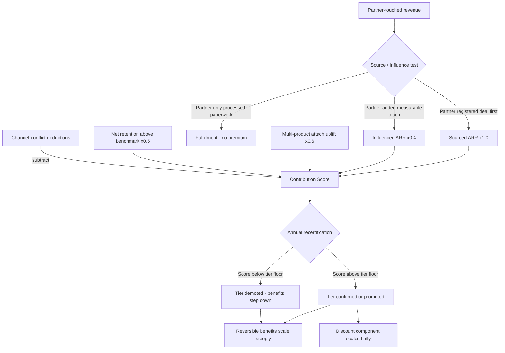

### Direct Answer

Build a tiered partner program that rewards scale without collapsing margin by paying for **incremental, attributed behavior** rather than for revenue volume alone, and by gating every tier on a recertified mix of competency, co-sell contribution, and customer retention — not on a single bookings number. The margin-safe design pays the *marginal* partner-influenced deal less than the *average* one, anchors tier benefits to costs you can switch off (enablement credits, MDF, lead-share) rather than costs you cannot (permanent discount floors), and recertifies tiers every twelve months so inflation cannot compound. A program that does this well lifts partner-sourced pipeline 30–60% over two years while holding blended gross margin within 150 basis points of the direct motion; a program that does it badly buys revenue it already had at a discount it can never recover.

**TLDR**

- **Tier on contribution, not volume.** Reward sourced pipeline, multi-product attach, and net retention — behaviors that are expensive to fake — instead of raw resold revenue, which is cheap to inflate.
- **Make every benefit reversible.** MDF, lead-share, enablement credits, and co-sell priority can be tuned or withdrawn at recertification; permanent margin floors cannot, so keep the discount component small and conditional.
- **Price the marginal deal below the average deal.** Use declining marginal rebates and per-deal margin caps so a partner's hundredth deal earns less margin than its tenth, protecting blended economics as the channel scales.
- **Recertify annually.** Tier status decays without re-earning it; "once Platinum, always Platinum" is the single most common cause of margin collapse in mature programs.
- **Instrument attribution before you instrument incentives.** You cannot pay for sourced and influenced behavior you cannot measure; deal registration, partner-of-record rules, and a clean source/influence taxonomy come first.
- **Model the program as a P&L.** Partner gross margin, fully loaded partner cost (margin + MDF + headcount + program ops), and partner contribution margin are the three numbers that decide whether the program is accretive.
- **Counter-case:** if your ACV is under ~$8K, your sales cycle is under 21 days, or you have fewer than ~25 active partners, a flat single-tier program almost always beats a tiered one — tiering adds operational cost it cannot yet repay.

## 1. Why "Tiered" and "Margin-Safe" Are in Tension

### 1.1 The structural problem in one paragraph

A partner program exists to buy three things you cannot easily build in-house: reach into segments your direct sellers do not cover, trust with buyers who will not take a vendor's first call, and delivery capacity for implementation work your services org cannot staff. Each of those is worth paying for. The danger is that the instrument you use to pay — margin given up at the point of sale — is the one cost in your model that compounds, never resets, and is almost impossible to claw back once a partner has built a business on it. A tiered program multiplies this risk because tiers, by design, escalate rewards. If the escalation is attached to the wrong metric, you have built a machine that systematically converts your gross margin into channel revenue you would have won anyway.

The resolution is not to avoid tiers. It is to be ruthless about *what* escalates. Margin-safe tiering escalates **soft, reversible, behavior-linked benefits** steeply, and escalates **hard, irreversible, price-linked benefits** either flatly or not at all. A partner climbing from Silver to Gold should feel a large jump in MDF access, lead flow, co-sell priority, executive air cover, and enablement investment — and a small, conditional jump in actual discount. Get that asymmetry right and tiers become a margin-neutral motivation engine. Get it wrong and tiers become a margin leak with a loyalty program bolted on top.

### 1.2 The three failure modes you are designing against

| Failure mode | What it looks like | Root cause | Margin impact |
|---|---|---|---|
| **Volume capture** | Partners resell deals the direct team already sourced; bookings look great, net-new logos do not move | Tier gates on resold revenue, not sourced pipeline | 8–18 pts of gross margin given away on deals you owned |
| **Discount ratchet** | Every renewal, partners ask for the next tier's discount "to stay competitive"; nobody ever moves down | No recertification; tier = permanent entitlement | Blended margin erodes 150–400 bps/yr, compounding |
| **Tier inflation** | 60%+ of partners sit in the top two tiers within 24 months | Thresholds set once, never re-indexed to ACV growth | Top-tier economics applied to median-tier behavior |

Every design decision below is aimed at one or more of these three. If a proposed rule does not measurably reduce volume capture, discount ratchet, or tier inflation, it is decoration — cut it.

### 1.3 What "scale" should actually mean

Most programs reward scale defined as *gross resold revenue*. That is the original sin. Resold revenue conflates four very different things: net-new logos the partner found, expansion the partner drove, renewals the partner merely processed, and deals the partner intercepted from your direct motion. Only the first two are worth a margin premium. A margin-safe program redefines "scale" as a weighted contribution score:

> **Contribution = (Sourced ARR x 1.0) + (Influenced ARR x 0.4) + (Multi-product attach uplift x 0.6) + (Net retention above benchmark x 0.5) − (Channel-conflict deductions)**

The exact weights are yours to tune, but the principle is fixed: pay the most for the behavior that is hardest for a partner to fake and most expensive for you to replicate. Sourcing a net-new logo in a segment your reps do not cover is both. Processing a renewal is neither.

### 1.4 The behavioral economics underneath the design

Partner programs are not spreadsheets; they are incentive systems acting on independent businesses run by people who are, correctly, optimizing their own P&L. Every design choice you make is a signal, and partners read signals faster than they read program guides. If your tier ladder rewards resold revenue, your partners will — rationally, predictably, and without malice — reorganize their sales motion to maximize resold revenue, including by intercepting deals your direct team has already worked. They are not cheating; they are responding to the incentive you published. The margin-safe program therefore begins with a behavioral premise: assume every partner will do exactly what the program pays for, and nothing it does not, and design the payment so the rational partner response *is* the behavior you want.

This premise has three consequences. First, **the program must be legible.** A partner cannot optimize for a contribution score it does not understand; if your formula is a black box, partners will fall back to the one number they can see — bookings — and you are back to volume capture. Publish the formula, publish the weights, publish worked examples. Second, **the program must be predictable.** Partners make multi-year hiring and investment decisions based on your tiers; if you change gates abruptly, you do not just annoy partners, you teach them that investing in your program is risky, and they hedge by investing less. Predictability — telegraphed thresholds, grace bands, trailing measurement — is not generosity, it is a precondition for the partner investment that makes the channel work. Third, **the program must be fair across the partner population**, because partners talk to each other. If one partner discovers it negotiated a 6-point-better discount than a structurally identical peer, the information will propagate, and every partner will arrive at the next QBR with a renegotiation agenda. Consistency is a margin control, not a courtesy.

### 1.5 The asymmetry of margin: why this is harder than it looks

There is a deep asymmetry that makes channel margin uniquely dangerous, and it is worth stating plainly because it is the reason "just give partners a bigger discount to grow faster" is such a seductive and such a wrong instinct. **Margin given is instantaneous and permanent; margin recovered is slow, costly, and relationship-damaging.** You can grant a partner a 4-point discount bump in a single email. To take those 4 points back, you must either tell a partner its economics are getting worse — a conversation that can end the relationship — or grow the rest of the program enough that the 4 points become a smaller share of a larger pie, which takes years. The discount ratchet is not a metaphor; it is a literal ratchet, a mechanism that turns freely in one direction and resists the other.

Every other lever in the program is symmetric. MDF can go up this year and down next year, and partners accept it because MDF was always framed as an annual budget. Lead share can be reallocated quarterly. Co-sell SE hours flex with capacity. Enablement credits reset. Only the base discount is asymmetric, and that asymmetry is precisely why the entire design philosophy collapses to one sentence: **escalate the symmetric levers steeply, escalate the asymmetric lever barely at all.** A program designer who internalizes this asymmetry will never again confuse "rewarding scale" with "discounting more," and that single conceptual correction prevents the most expensive mistake in the discipline.

## 2. The Economics: Model the Program as Its Own P&L

### 2.1 The three numbers that decide everything

Before you draw a single tier, build a partner P&L. Three metrics govern whether the program is accretive or dilutive:

- **Partner gross margin (PGM):** revenue from partner-attributed deals minus COGS *and* minus partner margin given up. This is what is left after the partner takes its cut.
- **Fully loaded partner cost (FLPC):** partner margin + MDF spend + co-op funds + partner-facing headcount (PAMs, partner marketing, partner ops, channel SEs) + program tooling + enablement production. Most programs track only the first term and are stunned when the program looks unprofitable.
- **Partner contribution margin (PCM):** PGM minus the non-margin portion of FLPC, expressed as a percentage of partner-attributed revenue. If PCM is below your direct-motion contribution margin *and* not improving on a 24-month trajectory, the program is destroying value.

### 2.2 A worked partner P&L

Assume a $20K-ACV B2B SaaS vendor with a 78% direct gross margin. The table shows a single Gold-tier partner across one fiscal year.

| Line item | Amount | Notes |
|---|---|---|
| Partner-attributed bookings | $2,400,000 | 120 deals at $20K ACV |
| — of which sourced | $1,560,000 | 65% sourced, the healthy ratio |
| — of which influenced/resold | $840,000 | 35% lower-value mix |
| Partner margin given up (blended 22%) | ($528,000) | weighted across deal types |
| COGS (22% of bookings) | ($528,000) | hosting, support, success |
| **Partner gross margin (PGM)** | **$1,344,000** | 56% of bookings |
| MDF / co-op consumed | ($96,000) | 4% of bookings, capped |
| Allocated PAM cost | ($110,000) | 1 PAM covering ~9 partners |
| Allocated partner marketing + ops | ($72,000) | shared services |
| Program tooling allocation | ($14,000) | PRM, attribution, portal |
| **Partner contribution margin (PCM)** | **$1,052,000** | **43.8% of bookings** |

Compare 43.8% PCM to the direct motion's contribution margin (say 47% after fully loaded direct sales cost). The 3.2-point gap is the *price of reach* — and it is acceptable **only because 65% of these bookings were sourced**, i.e., revenue the direct team would likely not have captured. Flip the sourced/resold mix to 35/65 and PCM collapses below 36%; now the program is buying owned revenue at a discount, and the tier that produced this partner is mispriced.

### 2.3 The marginal-deal principle

The single most important pricing rule: **the marginal partner-influenced deal must earn less margin than the average one.** Programs that pay a flat margin percentage on every deal reward the hundred-and-first low-effort resale exactly as richly as the first hard-won sourced logo. Margin-safe programs use **declining marginal rebate bands**:

| Annual partner-sourced ARR band | Marginal rebate on that band | Cumulative effective rate at band top |
|---|---|---|
| $0 – $250K | 20% | 20.0% |
| $250K – $750K | 16% | 17.3% |
| $750K – $1.5M | 12% | 14.6% |
| $1.5M – $3M | 9% | 11.8% |
| $3M+ | 6% | trends toward 8–9% |

A partner doing $3M of sourced ARR earns a blended ~11.8% rebate, not 20%. The partner still earns *more absolute dollars* by scaling — the incentive to grow is intact — but each marginal dollar costs you less margin, so blended program margin *improves* as the channel matures rather than degrading. This is the mathematical core of "rewards scale without collapsing margin."

### 2.4 Sensitivity analysis: how the program breaks

A partner P&L is only as useful as the scenarios you stress it against. The single variable that swings the program from accretive to dilutive faster than any other is the **sourced-versus-resold mix**, so model it explicitly. Hold the Gold partner from Section 2.2 constant on bookings ($2.4M) and on every cost line, and vary only the percentage of bookings that are genuinely sourced.

| Sourced mix | Sourced ARR | Resold ARR | Blended margin given up | PGM | PCM | PCM % | Verdict |
|---|---|---|---|---|---|---|---|
| 80% sourced | $1,920,000 | $480,000 | $480,000 | $1,392,000 | $1,100,000 | 45.8% | Strongly accretive |
| 65% sourced | $1,560,000 | $840,000 | $528,000 | $1,344,000 | $1,052,000 | 43.8% | Accretive — acceptable |
| 50% sourced | $1,200,000 | $1,200,000 | $576,000 | $1,296,000 | $1,004,000 | 41.8% | Marginal — watch closely |
| 35% sourced | $840,000 | $1,560,000 | $624,000 | $1,248,000 | $956,000 | 39.8% | Dilutive — program is leaking |
| 20% sourced | $480,000 | $1,920,000 | $672,000 | $1,200,000 | $908,000 | 37.8% | Failing — buying owned revenue |

Two things jump out. First, PCM percentage falls roughly two points for every fifteen points of sourced mix lost — a steep, unforgiving slope. Second, the *absolute* dollars do not collapse as fast as intuition suggests, which is exactly the trap: a channel leader looking only at "the partner did $2.4M and we kept over $900K of contribution" will declare victory while the program quietly slides from 45.8% to 37.8% PCM. The discipline is to manage the *percentage* and the *mix*, not the absolute dollars, because the absolute dollars hide the leak.

The second stress test is **tier inflation over time.** Model the program at launch, year two, and year four with thresholds held constant while ACV grows 12% annually:

| Scenario | ACV | Gold sourced-ARR gate | Partners clearing Gold gate | Effective program margin |
|---|---|---|---|---|
| Launch | $20,000 | $900,000 (45 deals) | 14% of partners | Healthy |
| Year 2, gates frozen | $25,100 | $900,000 (36 deals) | 31% of partners | Eroding |
| Year 4, gates frozen | $31,500 | $900,000 (29 deals) | 52% of partners | Collapsed |
| Year 4, gates re-indexed | $31,500 | $1,420,000 (45 deals) | 16% of partners | Healthy |

The mechanism is purely arithmetic: a fixed dollar gate gets *easier* every year as deal sizes rise, so the same effort clears the gate with fewer deals, and the top tier silently fills with median-effort partners. Re-indexing the gate to hold *deal count* (or, better, sourced-ARR as a multiple of current ACV) roughly constant is the only thing that keeps tier distribution stable. This is why Section 3.3's recertification rule and Section 8's annual re-indexing are not optional housekeeping — they are the load-bearing wall.

### 2.5 The opportunity-cost line nobody models

There is a cost in the partner P&L that almost no program quantifies, and it should at least be named: the **opportunity cost of channel-displaced direct revenue.** When a partner resells a deal your direct team would otherwise have closed, you do not merely give up the partner margin — you also fail to capture the higher-margin direct outcome, *and* you pay a direct seller's salary for capacity that produced nothing on that account. The fully honest version of the channel-conflict deduction in Section 5.3 is not just "subtract from the contribution score"; it is "recognize that this deal carried a negative delta versus the direct counterfactual." You will rarely be able to quantify this precisely — counterfactuals are unprovable — but a program that *acknowledges* the line will set its source/influence taxonomy and its registration-protection window much more conservatively than one that pretends channel revenue is always purely incremental. Treat incrementality as something a partner must *demonstrate*, not something the program *assumes*.

## 3. Tier Architecture: How Many, Gated on What

### 3.1 How many tiers

Three tiers for programs under ~150 partners; four only above that. Five-tier programs almost always have one vanity tier that exists for partner ego and does nothing economically — cut it. The canonical structure:

1. **Registered (entry):** any signed partner. No margin premium, transactional discount only, self-serve enablement. Purpose: capture and observe.
2. **Silver (committed):** demonstrated competency + minimum sourced contribution. First real benefits unlock.
3. **Gold (strategic):** proven sourcing engine + certified delivery + retention performance. Co-sell priority, meaningful MDF.
4. **Platinum (ecosystem, optional):** few partners, joint business planning, executive sponsorship, custom economics negotiated inside guardrails — not entitled by a formula.

### 3.2 The gate composition rule

Every tier gate is a **composite** of four factors, and *no single factor can carry a partner across the line*. This is what kills volume capture: a partner cannot buy a tier with resold revenue alone.

| Tier | Sourced contribution | Competency / certification | Co-sell + retention | MDF utilization quality |
|---|---|---|---|---|
| Registered | none | onboarding complete | none | n/a |
| Silver | $250K sourced ARR | 2 certified individuals | 1 co-sell deal, NRR ≥ 95% | n/a |
| Gold | $900K sourced ARR | 4 certified, 1 architect | 4 co-sell deals, NRR ≥ 105% | ≥ 70% of prior MDF ROI-positive |
| Platinum | $2.5M sourced ARR | full delivery cert + 1 specialization | 8 co-sell, NRR ≥ 112%, 1 joint case study | ≥ 80% MDF ROI-positive |

Note the MDF-quality gate at Gold and Platinum: a partner that consistently wastes co-marketing dollars cannot climb, even with the revenue. This closes the loop where high-volume, low-discipline partners drag down program economics.

### 3.3 Recertification — the rule most programs skip

**Tier status expires every 12 months.** At each partner's anniversary, recompute the contribution score against *current-year* thresholds. If the partner no longer clears the gate, it steps down one tier — and benefits step down with it. This single rule does more for long-term margin than any pricing change, because it converts every tier from an entitlement into an annual earn.

Three softening mechanics keep recertification from feeling punitive and prevent partners from rage-quitting:

- **Grace band:** a partner within 85–100% of the gate gets a one-cycle "provisional" status with a documented improvement plan before demotion.
- **Trailing-twelve-months measurement:** scores use a rolling TTM window, not a calendar snapshot, so a single slow quarter does not trigger demotion.
- **Telegraphed thresholds:** next year's gates are published 6 months in advance, indexed to your ACV and pipeline growth, so partners are never surprised.

### 3.4 Designing the gate weights, factor by factor

Section 3.2 gave the composite gate as a four-factor table; this section explains *why* each factor is there and how to weight it, because copying the table without understanding the logic produces a program that looks rigorous and behaves badly.

1. **Sourced contribution is the anchor, but never the whole gate.** It is the anchor because sourcing is the behavior the channel exists to buy and the hardest to fake. It is never the whole gate because a partner that can hit a pure-revenue number — by any means, including interception — would otherwise buy the tier outright. Weight it as the largest single factor (40–50% of the composite) but cap its share so it cannot carry a partner alone.
2. **Competency and certification protect the customer outcome and therefore the renewal.** A partner that sells well but implements badly produces churn, and churn destroys the lifetime value the margin was paid to acquire. Certification gates also have a useful side effect: they are slow to earn, so they act as a natural brake on tier inflation. Weight competency at 20–25%.
3. **Co-sell contribution and net retention test whether the partner is a *teammate* or a *toll booth*.** A partner that co-sells is integrated into your motion and is expensive to replace; a partner that only processes transactions is not. Net retention above benchmark proves the partner sells to fit, not just to close. Weight this factor at 20–25%.
4. **MDF utilization quality is the integrity check.** It is a small weight (10–15%) but a vital one, because it is the factor that catches the high-revenue, low-discipline partner — the one that hits every revenue number while wasting every co-marketing dollar and generating support load. Without this factor, the program's biggest partners are often its least profitable, and the tier ladder actively rewards that.

The weights are not arbitrary and they are not universal — a delivery-heavy SI channel will weight competency higher; a velocity reseller channel will weight sourced contribution higher. What is universal is the *structure*: four factors, none able to carry the gate alone, with explicit published weights. The table below shows how the composite resolves for three real-feeling partner profiles, all doing similar revenue.

| Partner profile | Sourced (×0.45) | Competency (×0.22) | Co-sell+NRR (×0.23) | MDF quality (×0.10) | Composite | Tier earned |
|---|---|---|---|---|---|---|
| "The Builder" — moderate revenue, certified, retains well | 0.70 | 0.95 | 0.90 | 0.85 | 0.815 | Gold |
| "The Reseller" — high revenue, low cert, churns | 0.95 | 0.30 | 0.35 | 0.40 | 0.594 | Silver |
| "The Toll Booth" — high revenue, fulfillment-only | 0.40 | 0.50 | 0.25 | 0.30 | 0.383 | Registered |
| "The Specialist" — modest revenue, deep vertical cert | 0.55 | 0.98 | 0.80 | 0.90 | 0.726 | Gold |

"The Reseller" does the most revenue and earns the second-lowest tier. That single outcome — high revenue, low tier — is the visible proof that the program rewards contribution rather than volume, and partners will read it correctly: the way up is to *build capability and source net-new*, not to *push more boxes*.

### 3.5 Grandfathering without surrendering the principle

When you migrate an existing program to this structure, you will have incumbent top-tier partners who would not clear the new gates. Demoting them on day one is a relationship and revenue risk; pretending the new gates do not apply to them guts the program before it launches. The resolution is a **time-boxed grandfather with a clock**: incumbents keep their current tier *and current economics* for one full recertification cycle (12 months), during which they are coached against the new gates with quarterly check-ins, and at the first anniversary the new gates apply to everyone equally. Crucially, the grandfather covers *tier status and benefits*, not *the rules* — the recertification clock starts for everyone on day one, and the 6-month-telegraphed thresholds are published immediately. This converts a potentially explosive change into a fair, predictable transition: no partner's economics drop without warning, and no partner is permanently exempt from the discipline.

## 4. The Benefit Stack: Reversible vs. Irreversible

### 4.1 Sort every benefit before you assign it

The master discipline of margin-safe design: **classify every benefit as reversible or irreversible, then make the steep tier escalation happen almost entirely on the reversible side.**

| Benefit | Reversible? | Tier escalation profile | Margin risk if mis-set |
|---|---|---|---|
| Base resale discount | No (sticky) | Flat or near-flat across tiers | Very high — compounds, no claw-back |
| Volume rebate (paid in arrears) | Yes | Declining marginal bands | Low — tunable, behavior-gated |
| MDF / co-op funds | Yes | Steep | Low — annual budget, ROI-gated |
| Lead share / inbound routing | Yes | Steep | None — reallocates existing demand |
| Co-sell priority + SE hours | Yes | Steep | Low — capacity allocation |
| Deal-registration protection | Yes | Moderate | Low — policy, not price |
| Enablement credits / training | Yes | Steep | None — investment in capability |
| Executive sponsorship / JBP | Yes | Steep (top tiers only) | None — time, not margin |
| Named directory placement | Yes | Steep | None — visibility |
| Permanent "most-favored" pricing | No | Never offer | Catastrophic — avoid entirely |

### 4.2 Why the discount stays flat

Counter-intuitive but essential: the **base discount should barely change between Silver and Gold.** If Silver gets 18% and Gold gets 30%, you have told every partner that the path to a 12-point margin grab is simply to get bigger — and "bigger" can be achieved by intercepting your direct deals. Instead, hold the base discount in a tight band (say 18–22%) and put the *real* tier reward into rebates, MDF, leads, and co-sell. A partner climbing to Gold should see its *total economics* improve 40–60%, but most of that improvement should come from arrears rebates it only earns by hitting sourced-ARR bands and from leads/co-sell that grow its top line — not from a bigger cut of every transaction.

### 4.3 The rebate-over-discount swap, quantified

| Mechanism | When paid | Behavior it rewards | Can you switch it off? |
|---|---|---|---|
| Upfront discount | At invoice | Being in a tier | No — repricing is a relationship event |
| Arrears rebate | Quarterly, on verified metrics | Hitting *this period's* sourced/retention targets | Yes — recomputed every quarter |
| MDF | On approved, ROI-tracked plans | Demand generation that works | Yes — annual, plan-gated |

Shifting 8–12 points of partner economics from upfront discount into arrears rebate is the highest-leverage margin move available, because it converts a permanent cost into a performance-contingent one without reducing the partner's total earning potential.

### 4.4 Sizing MDF without it becoming an entitlement

MDF (market development funds) is the most powerful reversible benefit and the most commonly abused one. Abuse happens through a single mental error: partners, and often channel teams, come to treat MDF as a *fixed share of revenue the partner is owed* rather than as *an investment in demand generation that must earn its return*. The fix is structural, not exhortative.

- **Cap MDF as a percentage of partner bookings, with a hard ceiling.** A common band is 2–5% of trailing bookings, capped in absolute dollars so a single huge partner cannot consume the whole budget. The cap is per-tier — Gold partners get a higher cap than Silver — which makes MDF a real tier reward.
- **Release MDF against approved plans, never as a lump sum.** Every dollar is tied to a specific activity (an event, a campaign, a content piece) with a defined pipeline target. Funds not claimed against an approved plan expire; they do not roll over and they are not "owed."
- **Gate next year's MDF on this year's MDF ROI.** This is the loop that closes the entitlement trap. A partner whose MDF generated 6x pipeline gets its full cap renewed and possibly raised; a partner whose MDF generated 1.5x pipeline gets a reduced cap and a required co-planning session. MDF quality, as Section 3.4 noted, is also a tier-gate factor — so wasting MDF costs a partner twice.
- **Match-fund rather than fully fund.** Requiring the partner to co-invest (often 50/50) on MDF activities is a powerful filter: partners will not co-fund activities they do not believe will work, so match-funding outsources the first ROI screen to the partner's own judgment.

| MDF discipline | Entitlement program (bad) | Investment program (good) |
|---|---|---|
| Budget basis | "Same as last year" | % of bookings, tier-capped, re-set annually |
| Release mechanism | Lump sum at year start | Per-plan, against pipeline targets |
| Unused funds | Roll over or paid out | Expire |
| Renewal logic | Automatic | Gated on prior-year MDF ROI |
| Funding split | 100% vendor | Match-funded, typically 50/50 |
| Reporting | Receipts after the fact | Pipeline and revenue attribution |

### 4.5 Lead share — the benefit that costs no margin at all

Of every benefit in the stack, inbound lead share is the most underused as a *tier* lever, and it is nearly perfect for the purpose: it costs the program zero incremental gross margin (you are reallocating demand you already generated and already paid to create), it is fully reversible (routing rules change with a config edit), and it is intensely motivating to partners because leads are the scarcest thing in any partner's world. A margin-safe program routes a *steeply* tier-weighted share of partner-eligible inbound to its top tiers: Registered partners get none, Silver gets a small allocation in their specialization, Gold gets priority routing in their verticals and geographies, Platinum gets first look. Because lead share carries no margin cost, you can make the tier escalation on this benefit as dramatic as you like — and a dramatic escalation here lets you keep the discount escalation flat without the tier ladder feeling thin. Lead share is, in effect, the benefit that *funds the asymmetry*: it gives top tiers a large, visible, valuable reward that never touches the P&L's margin line.

## 5. Margin Governance: The Guardrails

### 5.1 Per-deal margin floor

No partner-attributed deal closes below a hard **minimum gross-margin floor** (e.g., 50% GM after all partner economics) without VP-level approval logged in the CRM. This catches the pathology where a Platinum partner stacks base discount + rebate + a one-off "strategic" concession until the deal is margin-negative.

### 5.2 Discount stacking caps

| Stack component | Max contribution | Hard rule |
|---|---|---|
| Base tier discount | 22% | Set by tier, no negotiation |
| Promotional / SPIFF | 5% | Time-boxed, finance-approved |
| Deal-specific concession | 6% | VP sign-off, logged, expires with deal |
| **Total stack ceiling** | **28%** | Anything beyond requires CFO sign-off |

### 5.3 Channel-conflict deduction

Every deal a partner registers that the direct CRM shows as already-sourced by an AE triggers a **contribution-score deduction**, not just a neutral "house account" flag. Make intercepting direct deals actively *lower* a partner's tier trajectory. This is the most direct structural defense against volume capture.

### 5.4 The margin-watch dashboard

Finance and channel review one dashboard monthly:

| Metric | Healthy | Watch | Intervene |
|---|---|---|---|
| Blended partner GM vs. direct GM | within 150 bps | 150–300 bps | > 300 bps |
| Sourced % of partner bookings | > 55% | 40–55% | < 40% |
| Partners in top 2 tiers | < 35% | 35–50% | > 50% |
| Avg discount stack | < 24% | 24–27% | > 27% |
| MDF ROI (pipeline $ / MDF $) | > 5x | 3–5x | < 3x |
| Deals below margin floor | < 2% | 2–5% | > 5% |

## 6. What the Best Operators Actually Do

The most-studied channel programs are useful precisely because they are not all the same — they show the design space.

- **HubSpot (HUBST)** built its Solutions Partner Program on a tier ladder where progression is driven by a "managed revenue + sold revenue + retention" composite and an explicit certification track, not on resale volume alone — a textbook composite gate. Brian Halligan and later Yamini Rangan repeatedly framed the partner channel as a *retention and expansion* engine, which is why NRR sits inside the tier math.
- **Snowflake (SNOW)**, under Frank Slootman and Christian Kleinerman's product orgs, leaned heavily on a *consumption-aligned* partner model: partners are rewarded for driving usage that compounds, not one-time license resale. This naturally caps margin leakage because the reward tracks a metric the customer also benefits from.
- **CrowdStrike (CRWD)**, with George Kurtz, runs a deal-registration-first channel where registration discipline and partner-of-record clarity are prerequisites to *any* margin — attribution before incentive, exactly as Section 1 prescribes.
- **Datadog (DDOG)** under Olivier Pomel kept its channel deliberately *thin* for years, proving the counter-case: a strong product-led motion with high ACV expansion did not need a heavy tiered program early, and adding one prematurely would have been pure cost.
- **ServiceNow (NOW)**, under Bill McDermott, built one of the richest partner ecosystems in enterprise software by pushing *delivery capability* certification as the spine of its tiers — partners climb by proving they can implement, which protects the customer outcome and therefore the renewal.
- **Microsoft (MSFT)**, with Satya Nadella's cloud pivot, restructured its entire partner program around "solutions partner designations" tied to measurable customer success metrics and skilling, explicitly moving away from pure-revenue competency badges.
- **Salesforce (CRM)**, under Marc Benioff, runs the AppExchange + consulting partner tiers where the consulting tier (Crest/Summit/etc.) is gated on certified consultants and customer satisfaction (CSAT) scores, not just bookings — a model copied widely.
- **Atlassian (TEAM)** historically ran a famously low-touch channel and only formalized tiering as enterprise deals grew, again illustrating that program weight should track motion complexity.
- **Twilio (TWLO)**, under Jeff Lawson, and **Okta (OKTA)**, under Todd McKinnon, both built ISV/technology-partner tiers distinct from resale tiers — a reminder that "partner" is not one population and a single tier ladder rarely fits ISVs, resellers, and SIs at once.
- **Zoom (ZM)** and **Workday (WDAY)** both gate top-tier status on specialization credentials, reinforcing that recertified competency, not cumulative revenue, is the durable margin protector.

The common thread among the margin-disciplined programs: tiers escalate *capability and attributed contribution*, the reward mix is dominated by reversible benefits, and revenue alone never buys a tier.

### 6.1 Reading the design space, not copying a logo

The operators above are instructive only if you extract the *pattern* rather than the *artifact*. It is tempting to look at a famous program and replicate its tier names, its discount table, its badge taxonomy — and that replication is almost always a mistake, because each of those programs is a point solution to a specific motion, ACV, and partner population. HubSpot's composite gate works for HubSpot because HubSpot's channel is dominated by marketing agencies whose retention performance is directly observable and directly tied to renewal. Snowflake's consumption-aligned model works because Snowflake's revenue *is* consumption — the partner reward and the customer value share a denominator. CrowdStrike's registration-first discipline works because security deals are competitive and partner-of-record ambiguity is expensive. Each is correct in context and wrong out of context.

What transfers is the set of *principles* every margin-disciplined program shares, regardless of how differently they are implemented:

| Transferable principle | HubSpot | Snowflake | CrowdStrike | ServiceNow | Microsoft |
|---|---|---|---|---|---|
| Tier gated on more than revenue | Yes — managed rev + retention | Yes — consumption + competency | Yes — registration + skilling | Yes — delivery capability | Yes — customer success metrics |
| Reward aligned to customer value | Retention in the gate | Consumption shared denominator | Outcome-based | Implementation quality | Measurable success |
| Attribution before incentive | Deal registration | Usage telemetry | Registration-first | Project tracking | Designation metrics |
| Recertified competency | Certification track | Specializations | Skilling requirements | Specialization renewals | Skilling renewals |

A vendor designing its own program should be able to fill in its own column of that table with honest answers. If you cannot — if your only honest answer to "tier gated on more than revenue" is "no" — you have found your first redesign priority, and the famous logos have done their job not as templates but as a diagnostic.

### 6.2 The ISV counter-pattern, in operators' terms

Twilio, Okta, and increasingly Snowflake and ServiceNow all maintain *separate* ladders for technology/ISV partners precisely because the resale-tier logic does not transfer. An ISV does not resell your product; it *integrates* with it and brings its own customers into a joint motion. There is no margin to share in the resale sense, so a margin-band tier ladder is meaningless. ISV tiers are instead gated on integration depth and certification, marketplace listing quality, joint customer count, and co-sell participation — and the "reward" is marketplace promotion, co-marketing, technical resources, and roadmap access, none of which touch a discount table. The operator lesson is blunt: **"partner" is not one population.** A single tier ladder spanning resellers, SIs, and ISVs will be wrong for at least two of the three. Mature programs run parallel ladders, each gated and rewarded in the currency that population actually responds to.

## 7. Implementation Roadmap

### 7.1 Phase 1 — Instrument (Months 0–3)

You cannot pay for behavior you cannot see. Before touching incentives:

- **Stand up deal registration** with clear partner-of-record rules and a registration-protection window (typically 60–90 days).
- **Build the source/influence taxonomy** in the CRM: every partner-touched opportunity is classified as sourced, influenced, or fulfillment, with auditable evidence.
- **Define the contribution-score formula** and instrument every input.
- **Baseline the partner P&L** so you know today's PCM before you change anything.

### 7.2 Phase 2 — Design and model (Months 3–5)

- **Draft tiers, gates, and the benefit stack**; run every proposed structure through the partner-P&L model with three scenarios (pessimistic/expected/optimistic sourced mix).
- **Pressure-test the marginal-rebate bands** so blended margin improves, not degrades, as volume grows.
- **Set recertification thresholds** and the 6-month telegraphing calendar.

### 7.3 Phase 3 — Pilot (Months 5–8)

- **Run the new structure with 8–12 design-partner accounts** before a full rollout; measure sourced %, PCM, and partner satisfaction.
- **Build the margin-watch dashboard** and the monthly finance/channel review cadence.

### 7.4 Phase 4 — Roll out and govern (Months 8–12+)

- **Migrate all partners** with a grandfathering plan: nobody's economics drop on day one, but everyone is told the recertification clock starts now and how the new gates work.
- **Run the first recertification cycle** at month 12 and publish results internally as proof the governance has teeth.

| Phase | Duration | Exit criterion | Owner |
|---|---|---|---|
| Instrument | 0–3 mo | Attribution auditable, P&L baselined | RevOps + Channel |
| Design & model | 3–5 mo | Tiers pass P&L model in all 3 scenarios | Channel + Finance |
| Pilot | 5–8 mo | PCM ≥ direct CM − 300 bps in pilot cohort | Channel |
| Roll out & govern | 8–12+ mo | First recert cycle completed, dashboard live | Channel + Finance |

### 7.5 The migration communication plan

The most under-resourced part of a program redesign is not the model or the tier table — it is the communication. A technically perfect program that partners do not understand or trust will underperform a mediocre program that partners believe in. Build the communication as a deliberate sequence, not a single launch email.

| Step | Timing | Audience | Message |
|---|---|---|---|
| Pre-brief top partners 1:1 | Before any broad announcement | Top 10–15 partners | "Here is what is changing, why, and what it means for you specifically" |
| Internal alignment | Same week | Direct sales, channel team, finance | Conflict rules, registration, how partners get paid |
| Broad partner announcement | After 1:1s | All partners | New structure, gates, benefits, the 12-month grandfather, the recert clock |
| Worked-example webinars | Following 2 weeks | All partners, by tier | "Here is exactly how your contribution score is calculated" |
| Portal + documentation live | At announcement | All partners | Self-serve clarity — formula, weights, thresholds, calendar |
| Ongoing QBR integration | Quarterly thereafter | Per partner | Progress against gates, telegraphed next-year thresholds |

The non-negotiable principle: **no partner should ever be surprised by its tier outcome.** Surprise is what converts a recertification from a routine earn into a relationship rupture. If a partner is heading toward demotion, it should have heard so at the prior two QBRs, with a written improvement plan, long before the anniversary arrives. A program that communicates this well can demote partners every year without losing them; a program that communicates badly cannot demote anyone, which is exactly how the discount ratchet and tier inflation set in.

### 7.6 Common rollout failures

Even a well-designed program fails at rollout in predictable ways. Watch for: launching incentives before attribution is trustworthy (you will pay the wrong behavior immediately and it is hard to unwind); letting sales leadership negotiate exceptions during the migration "just this once" (every exception becomes the next partner's precedent); shipping the program without the margin-watch dashboard (you will not see erosion until a fiscal review months later); and under-staffing partner operations so recertification slips, because a recertification that does not happen on schedule is a recertification that does not exist. The roadmap's exit criteria in Section 7.4 exist specifically to prevent advancing a phase before its foundations are real.

## 8. PAM Economics and Coverage

A tiered program implies differentiated *human* coverage, and PAM (Partner Account Manager) cost is a real line in FLPC. The coverage rule: **PAM intensity scales with tier, and PAM cost per partner must stay below the incremental PCM that tier produces.**

| Tier | PAM coverage ratio | Touch model | Annual PAM cost / partner (illustrative) |
|---|---|---|---|
| Registered | 1 PAM : 80+ | Pooled / digital-led | ~$1,500 |
| Silver | 1 PAM : 25–35 | Light-touch, quarterly | ~$4,500 |
| Gold | 1 PAM : 8–12 | High-touch, monthly + JBP | ~$13,000 |
| Platinum | 1 PAM : 3–5 | Strategic, exec-sponsored | ~$32,000 |

The economic test is unforgiving: if a Gold partner's incremental PCM over a Silver partner is less than the ~$8,500 incremental PAM cost plus incremental MDF, the Gold tier is not paying for itself and the gate is too loose. This is why gates must be re-indexed annually — as ACV grows, the sourced-ARR thresholds must rise to keep tier economics intact.

## 9. Counter-Case: When NOT to Build a Tiered Program

Everything above assumes a tiered program is the right answer. Often it is not. **Do not tier — run a flat, single-tier program (or no program) — when any of the following hold:**

- **Low ACV.** Below roughly $8K ACV, the per-deal margin pool is too thin to fund both a partner cut and program operations; tiering's overhead exceeds its benefit. A flat referral fee is cleaner.
- **Short sales cycle.** Under ~21 days, the direct motion is fast and efficient; partners add friction and attribution noise without adding reach. (See *q422* on CAC/cycle-length trade-offs.)
- **Too few partners.** Under ~25 active partners, you do not have the population to support meaningful tier *distribution*; most partners will cluster, and tiering is just unused complexity.
- **Strong product-led growth.** If self-serve and PLG already capture your core segment efficiently, a heavy channel buys margin dilution where you had margin. Datadog's early years are the reference case.
- **Undifferentiated partners.** If every partner does the same thing (pure resale, no delivery, no vertical specialization), there is nothing for tiers to *differentiate*; a flat rebate schedule is honest and cheaper.
- **No attribution capability.** If you cannot yet distinguish sourced from influenced from fulfillment revenue, a tiered program will reward the wrong behavior on day one. Fix attribution first; tier later.
- **Pre-product-market-fit.** Before PMF, channel partners cannot sell what you have not nailed; the program will train partners on a moving target and burn trust.

In these cases the margin-safe choice is a **flat program**: one discount or referral rate, deal registration for conflict avoidance, light enablement, and *no escalating benefits*. Revisit tiering once ACV, partner count, and attribution maturity cross the thresholds above. Tiering is a scaling tool; applying it pre-scale is the most expensive form of premature optimization in GTM.

A second, narrower counter-case: even where tiering is right, do **not** tier the *technology/ISV* partner population on resale economics — ISVs are rewarded through integration depth, marketplace co-selling, and joint roadmap, not margin bands. Run a separate, non-margin tier ladder for them. (See *q431* on co-sell motions.)

## 10. Common Mistakes and Their Fixes

| Mistake | Why it happens | Fix |
|---|---|---|
| Tier gated on resold revenue | It is the easiest number to pull | Switch to composite contribution score, sourced-weighted |
| No recertification | Politically uncomfortable; partners resist | TTM measurement + grace band + 6-mo telegraphing makes it humane |
| Steep base-discount escalation | Mistaken belief discount = motivation | Flatten discount; escalate rebates/MDF/leads instead |
| MDF treated as entitlement | "We always gave Gold $100K" | Plan-gate and ROI-gate all MDF; tie to tier-quality factor |
| Five tiers | Partner ego, sales asking for "one more level" | Collapse to 3 (4 only above 150 partners) |
| Tracking only margin given up | FLPC is invisible without effort | Build the full partner P&L; track PCM monthly |
| One ladder for resellers + ISVs + SIs | Simplicity bias | Separate ladders per partner archetype |
| Thresholds never re-indexed | Set-and-forget | Re-index sourced-ARR gates to ACV growth annually |

### 10.1 The recovery playbook for a program already in trouble

Many readers are not designing a program from scratch — they are operating one that has already drifted into volume capture, discount ratchet, or tier inflation. You cannot fix a drifted program with a single dramatic move; abrupt economic cuts will trigger partner attrition that costs more than the leak. The recovery is a staged, 18-month sequence:

1. **Diagnose before you touch anything (Months 0–2).** Build the partner P&L retroactively. Compute PCM by partner and by tier, the sourced ratio, the actual tier distribution, and the average discount stack. You almost certainly do not know these numbers today; the diagnosis itself is often the intervention that creates urgency.
2. **Freeze the leak (Months 2–4).** Stop *new* damage immediately: institute the discount-stacking cap and the per-deal margin floor for all *new* deals and renewals. This does not touch existing partner economics — it just stops the bleeding from getting worse — so it is low-conflict.
3. **Introduce attribution and the contribution score (Months 4–8).** Roll out deal registration and the source/influence taxonomy. Begin *reporting* contribution scores to partners well before they *gate* anything, so partners learn the new currency without economic shock.
4. **Re-index the gates and announce recertification (Months 8–12).** Publish the new thresholds with the full 6-month telegraph and the 12-month grandfather. Partners now know exactly what is coming and have time to adjust.
5. **Run the first true recertification (Months 12–18).** Tiers move for the first time under the new rules. Expect an 8–15% demotion rate; a zero rate means you flinched and the gates are still too soft.

The sequencing principle is that **each step is individually survivable for partners** — no single step cuts a partner's economics without warning — but the cumulative effect over 18 months is a fully re-disciplined program. Trying to compress this into a single re-launch is the most common way a well-intentioned recovery turns into a channel exodus.

### 10.2 Organizational anti-patterns

Some failure modes are not in the program design at all — they are in how the company is organized to run it. Three are worth naming. First, **channel and finance not sharing a dashboard:** when the channel team is measured on bookings and finance discovers margin erosion independently months later, the two functions arrive at conflict instead of alignment. The margin-watch dashboard must be a *jointly owned* artifact reviewed in the same monthly meeting. Second, **the channel team compensated purely on partner bookings:** if your own PAMs are paid on resold revenue, they will, rationally, push exactly the volume-capture behavior the program is designed to suppress. PAM compensation should include PCM and sourced ratio, not just bookings. Third, **no single owner of program economics:** when "the program" is a shared responsibility of channel, finance, sales, and marketing, the margin leak is everyone's concern and therefore no one's job. Name an owner — typically a channel leader with a finance partner — and hold that pair accountable for PCM.

## 11. Metrics That Prove the Program Works

| Metric | Definition | Target |
|---|---|---|
| Partner contribution margin (PCM) | PGM minus non-margin FLPC, % of partner revenue | within 300 bps of direct CM, improving |
| Sourced ratio | Sourced ARR / total partner ARR | > 55% |
| Tier distribution | % of partners in each tier | top 2 tiers < 35% |
| Marginal margin trend | Blended partner GM as channel scales | flat or rising, never falling |
| Recert demotion rate | % of partners demoted at anniversary | 8–15% (zero means gates are too soft) |
| MDF ROI | Partner pipeline generated / MDF spent | > 5x |
| Partner-sourced pipeline growth | YoY growth in sourced pipeline $ | 30–60% over 2 yrs |
| Channel-conflict rate | Registered deals overlapping direct-sourced | < 5%, falling |

A program that is genuinely "rewarding scale without collapsing margin" shows the same signature every time: **sourced pipeline growing 30–60%, PCM holding or rising, blended margin within 150 bps of direct, top-2-tier population under 35%, and a recert demotion rate that is non-zero.** If sourced pipeline is up but PCM is down, you are buying revenue. If PCM is up but sourced pipeline is flat, you are under-investing and the channel will stall. The win condition is both moving in the right direction at once.

### 11.1 Leading versus lagging indicators

The metrics above are a mix of leading and lagging signals, and confusing the two delays intervention by quarters. **Lagging indicators** — PCM, blended margin, sourced ratio — tell you the program's state *after* it has happened; by the time PCM has fallen, the deals that caused it are closed and the margin is gone. **Leading indicators** predict those outcomes early enough to act: the trend in discount-stack averages on *new* deals, the percentage of partner-registered opportunities flagged as channel-conflict, the share of partners *within* the grace band approaching recertification, and the MDF-plan approval-to-claim ratio. A mature program reviews leading indicators monthly and lagging indicators quarterly, and treats a deteriorating leading indicator as a reason to act *now*, not a reason to wait for the lagging confirmation. The discipline mirrors the rest of the program: just as you instrument attribution before incentives, you watch the leading metric before the lagging one.

### 11.2 The one-sentence test

Strip everything away and a margin-safe tiered program reduces to a single test you can apply to any proposed rule, benefit, or exception: **does this make the partner's *next* dollar of sourced, retained, well-implemented revenue more attractive than its next dollar of resold, intercepted, or churning revenue?** If yes, the rule belongs in the program. If no — if it rewards volume regardless of source, or grants a permanent margin concession, or lets revenue alone buy a tier — it does not, no matter how much a large partner is asking for it. Every section of this answer is an elaboration of that one test. A program that passes it at every decision point will reward scale, year after year, without ever collapsing margin; a program that fails it even occasionally will, slowly and then suddenly, do the opposite.

### 11.3 Final synthesis

The question "how do we build a tiered partner program that rewards scale without collapsing margin" contains a hidden assumption worth surfacing one last time: that scale and margin are opposites, that you must trade one for the other. They are not opposites. They are only made opposites by the *instrument* — when the instrument of reward is point-of-sale discount, scale and margin genuinely do trade off, because more scale means more discounted transactions. Change the instrument — pay for sourced contribution through reversible, recertified, declining-marginal benefits — and the trade-off dissolves: more scale now means more *sourced* revenue, more *attached* product, more *retained* customers, each of which improves margin rather than eroding it. The program that solves the original question is not the one that finds a clever balance point on a trade-off curve. It is the one that redesigns the incentive so the trade-off was never real to begin with.

## Related Library Entries

- **q422** — What's the relationship between CAC, MRR, and sales cycle length, and how do you optimize the trade-off?
- **q423** — How should you forecast financial health when you have multi-year contracts with holdbacks and payment delays?
- **q431** — How do we run co-sell motions without bottlenecking at account executive capacity?
- **q444** — How do I stage regional market entry for EMEA without creating dependency bottlenecks?
- **q429** sibling design topics on channel-comp, tier-design, and PAM economics.

## Sources

1. HubSpot Solutions Partner Program tier documentation and methodology.
2. HubSpot investor materials on partner-sourced revenue and NRR (HUBST).
3. Snowflake partner network consumption-model briefings (SNOW).
4. Frank Slootman, "Amp It Up" — operating cadence and metric discipline.
5. CrowdStrike partner program deal-registration policy (CRWD).
6. Datadog investor commentary on go-to-market efficiency (DDOG).
7. ServiceNow Partner Program designation and certification framework (NOW).
8. Microsoft Cloud Partner Program "solutions partner designations" overview (MSFT).
9. Salesforce Consulting Partner Program tier criteria, AppExchange (CRM).
10. Atlassian Solution Partner Program structure and history (TEAM).
11. Twilio technology and ISV partner program materials (TWLO).
12. Okta Integration Network and partner tier documentation (OKTA).
13. Workday Services Partner certification requirements (WDAY).
14. Zoom Up partner program specialization tracks (ZM).
15. Forrester Research, channel program maturity and partner P&L models.
16. Gartner, "Designing Partner Tier Structures for B2B Technology."
17. Gartner Market Guide for Partner Relationship Management (PRM) applications.
18. Canalys channel partner economics and margin benchmarking reports.
19. IDC Worldwide partner ecosystem and routes-to-market analysis.
20. SaaStr essays on channel margin and partner-sourced pipeline.
21. OpenView Partners SaaS benchmarks on go-to-market efficiency.
22. KeyBanc Capital Markets SaaS Survey — gross margin and CAC benchmarks.
23. Bessemer Venture Partners "State of the Cloud" — efficiency metrics.
24. Crossbeam / Reveal ecosystem-led growth and partner attribution research.
25. PartnerStack benchmarks on partner program structure and rebate design.
26. Impartner PRM industry surveys on tier design and recertification.
27. McKinsey & Company on channel margin governance in technology.
28. Bain & Company on partner ecosystem value creation.
29. TSIA (Technology & Services Industry Association) partner practices research.
30. SiriusDecisions / Forrester partner-sourced pipeline contribution frameworks.
31. Channel Mechanics and Zift Solutions guidance on MDF ROI measurement.
32. CFO/finance practitioner guidance on contribution-margin treatment of channel cost.
33. "Crossing the Chasm" (Geoffrey Moore) — channel readiness and PMF timing.
34. HBR articles on incentive design and the risks of volume-based rewards.
