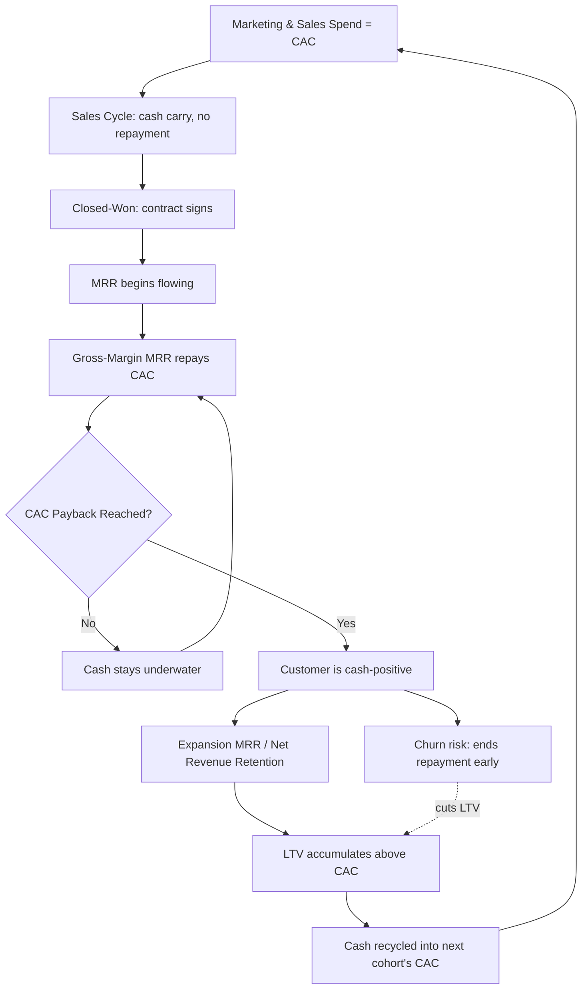

### Direct Answer

CAC, MRR, and sales cycle length are three sides of the same cash equation: every dollar of new MRR you book costs you a fixed slug of CAC up front, and the sales cycle determines how long that cash sits underwater before the customer starts paying it back. You optimize the trade-off not by minimizing any single metric, but by managing **CAC payback months** (CAC divided by new-customer gross-margin MRR) inside a window your balance sheet can fund — generally under 12 months for SMB motions, under 18-24 for enterprise — while keeping the sales cycle short enough that pipeline velocity, not headcount, drives growth. The lever that actually moves the trade-off is **motion segmentation**: matching cycle length, CAC, and contract value so that fast-cheap deals subsidize the cash drag of slow-expensive ones.

> **TLDR**
> - **CAC, MRR, and cycle length form one cash loop.** CAC is the up-front spend; MRR is the repayment rate; cycle length is the delay before repayment starts. Ignore any one and the other two lie to you.
> - **The master metric is CAC payback in months**, computed on gross-margin MRR, not revenue. Under 12 months is healthy for SMB; 18-24 is acceptable enterprise; over 30 is a financing problem, not a marketing problem.
> - **Sales cycle length is a cash multiplier.** A 90-day cycle adds roughly three months of carry to every payback calculation versus an instant close, because CAC is spent before the contract signs.
> - **The Magic Number and Burn Multiple** translate the same relationship into board language: net-new ARR per dollar of S&M, and cash burned per dollar of net-new ARR.
> - **You optimize by segmenting motions**, not by uniformly cutting CAC. Self-serve and SMB carry short cycles and fast payback; enterprise carries long cycles and slow payback; the blended portfolio must stay fundable.
> - **Consumption pricing and usage-based models** break the clean MRR assumption — ramp curves mean booked MRR and recognized MRR diverge for two to four quarters.
> - **ASC 340-40 capitalized commissions** mean CAC has a GAAP shadow: the cash hit and the P&L hit happen at different times, and finance and GTM must reconcile both.
> - **Counter-case:** in a true land-and-expand or PLG flywheel, optimizing for short payback on the initial deal can actively destroy value by under-investing in the expansion motion that produces the real return.

---

## 1. The Core Relationship: One Cash Loop, Three Dials

### 1.1 Why these three metrics belong in the same sentence

Most operators treat customer acquisition cost (CAC), monthly recurring revenue (MRR), and sales cycle length as three separate dashboards owned by three separate teams — finance owns CAC, RevOps owns MRR, and sales leadership owns cycle length. That organizational split is the single most common reason companies misread their own unit economics. The three metrics are not independent. They are three dials on the same machine, and that machine is a cash loop.

Here is the loop in plain terms. You spend money to acquire a customer — that spend is CAC. The customer signs and begins paying you a recurring amount every month — that flow is MRR. Between the moment you start spending CAC and the moment the customer signs, time elapses — that delay is the sales cycle. The combination determines one thing that matters more than any individual metric: **how long your cash is underwater on each customer before that customer has paid you back.**

If you only watch CAC, you will congratulate yourself for cheap acquisition while your sales cycle quietly stretches from 30 days to 120 days and your cash conversion collapses. If you only watch MRR, you will celebrate bookings growth while CAC inflates and you burn three dollars to book one. If you only watch cycle length, you will optimize for fast closes and accidentally push reps toward small, low-MRR deals that never justify the acquisition spend. The metrics only tell the truth together.

### 1.2 The cash-underwater curve

The cleanest mental model is the cash-underwater curve. Plot cumulative cash for a single customer cohort on the vertical axis and time on the horizontal axis. At time zero, you begin spending CAC — marketing programs, SDR salaries, AE base and commission, sales engineering, and a share of sales management. The curve dives below zero. It keeps diving for the entire length of the sales cycle, because you are spending acquisition cost the whole time the deal is being worked. When the contract finally signs, MRR begins to flow in, and the curve bottoms out and starts climbing. The moment the curve crosses back above zero is the **CAC payback point.**

The depth of the trough is set by CAC plus the carrying cost of the sales cycle. The slope of the recovery is set by gross-margin MRR. The width of the trough — how long you are underwater — is the metric that actually constrains how fast you can grow, because every customer you acquire while still underwater on prior customers compounds the cash demand.

### 1.3 Why gross margin, not revenue, is the repayment rate

A critical and frequently botched detail: the repayment rate in this loop is **gross-margin MRR**, not gross MRR. If a customer pays you $1,000 per month and your gross margin is 75 percent, the customer is repaying your CAC at $750 per month, not $1,000. The other $250 goes to cost of goods sold — hosting, support, payment processing, third-party data, and customer success allocated to delivery. A company that computes CAC payback on revenue rather than gross-margin contribution will systematically understate payback by exactly its COGS percentage, and will make growth-investment decisions on a number that is 25-30 percent too optimistic.

Companies with software-grade gross margins of 75-85 percent — the range you see at firms like Atlassian (TEAM) or Datadog (DDOG) — get to keep most of each MRR dollar as repayment. Companies dragging services-heavy delivery, on-premise support, or thin-margin reseller arrangements may keep only 55-65 percent, which materially lengthens payback even when CAC and cycle length look identical on paper.

---

## 2. Defining Each Metric Precisely Enough to Optimize

### 2.1 CAC done correctly: fully loaded, period-matched

CAC is the total cost of sales and marketing in a period divided by the number of new customers acquired in that period. Simple in form, treacherous in practice. Three errors recur:

- **Under-loading the numerator.** True CAC includes marketing program spend, the fully loaded cost of every SDR and AE (base, commission, benefits, payroll tax), sales engineering, a proportional share of sales and marketing management, sales tooling, and the marketing technology stack. Teams that count only paid-media spend produce a CAC that can be three to five times too low.
- **Period mismatch.** You should not divide this quarter's S&M spend by this quarter's new customers, because the spend that produced this quarter's customers happened one sales-cycle ago. With a 90-day cycle, you divide last quarter's spend by this quarter's new logos. Skipping this lag inflates CAC during growth and deflates it during contraction.
- **Mixing new and expansion.** CAC measures the cost to acquire a *new* customer. Expansion revenue from existing accounts is cheaper to win and should not dilute the new-logo CAC. Blend them and you will under-invest in new acquisition because the number looks artificially good.

### 2.2 MRR and ARR: bookings, recognized, and the difference that bites

MRR is the normalized monthly value of all active recurring subscriptions; ARR is simply MRR times twelve for annual-equivalent reporting. The trap is the gap between **booked MRR** and **recognized MRR.** When a customer signs, you book the MRR. But if the contract has a delayed start, a ramp schedule, or a holdback tied to milestones, the cash and the revenue recognition lag the booking. For the CAC-payback loop, what repays your CAC is *cash collected*, so a booking-heavy dashboard can show healthy MRR growth while the bank account tells a slower story.

### 2.3 Sales cycle length: median, not mean, and segmented

Sales cycle length is the elapsed time from a defined opportunity-creation stage to closed-won. Report the **median**, not the mean — a handful of monster enterprise deals dragging out 400 days will pull the mean far above the experience of a typical deal. Segment cycle length by motion (self-serve, SMB, mid-market, enterprise), by inbound versus outbound source, and by new-logo versus expansion. A single blended cycle number hides exactly the structure you need to optimize.

| Metric | Correct definition | Most common error | Consequence of the error |
|---|---|---|---|
| CAC | Fully loaded S&M cost / new customers, period-lagged | Counting only paid media | CAC understated 3-5x; over-investment in growth |
| New-customer CAC | Excludes expansion cost and expansion logos | Blending expansion in | Acquisition under-funded; growth stalls quietly |
| MRR | Normalized monthly recurring subscription value | Using booked instead of recognized | Cash forecast runs ahead of reality |
| Gross-margin MRR | MRR x gross margin % | Using gross MRR as repayment rate | Payback understated by full COGS % |
| Sales cycle | Median days, opp-create to closed-won, by segment | Reporting blended mean | Hides motion mix; misallocates capacity |
| ARR | MRR x 12, annual-equivalent | Treating bookings ARR as cash | Working-capital surprise |

---

## 3. The Bridge Metric: CAC Payback in Months

### 3.1 The formula and why it is the master dial

If you keep only one number from this entire entry, keep CAC payback period:

**CAC Payback (months) = CAC / (New MRR per customer x Gross Margin %)**

This is the metric that fuses all three inputs. CAC is in the numerator. MRR per customer and gross margin are in the denominator. And sales cycle length, while not in the formula directly, sets how much cash carry sits in front of the payback clock and how period-lagged your CAC denominator must be. CAC payback answers the only question a cash-constrained operator truly needs answered: *how many months of customer payments do I need to get my acquisition dollars back?*

### 3.2 Healthy ranges by motion

There is no single right number. Payback tolerance depends on your motion, your gross retention, and how you are financed:

| Motion | Typical cycle | Healthy CAC payback | Why the range |
|---|---|---|---|
| Product-led / self-serve | 0-7 days | 3-9 months | Near-zero human CAC; payback must be fast or the model is not PLG |
| SMB / transactional | 14-45 days | 6-12 months | Higher churn risk; cash must return before churn arrives |
| Mid-market | 45-90 days | 12-18 months | Stickier accounts justify longer carry |
| Enterprise | 90-270 days | 18-24 months | Low churn and high expansion fund a long payback |
| Strategic / Fortune 500 | 180-540 days | 24-30 months | Only fundable with deep cash reserves or expansion certainty |

A payback over 30 months is rarely an acquisition-efficiency problem you can fix with better marketing. It is a financing problem: the business is asking its balance sheet to fund a very long carry, and that only works if gross retention is near-perfect and expansion is reliable.

### 3.3 The 12-month rule of thumb and where it breaks

The widely cited benchmark — popularized through SaaS investors and operator communities such as Bessemer Venture Partners, OpenView, and the Pavilion operator network — is that a CAC payback under 12 months is healthy for most venture-backed SaaS. It is a fine default. But it breaks in two directions. For a true PLG company with negligible sales cost, a 12-month payback is alarmingly slow and signals the product is not actually self-selling. For a genuine enterprise company landing seven-figure accounts that expand 130 percent net annually, insisting on 12-month payback would force you to walk away from your best customers. Use the rule as a starting point, then adjust for your motion.

---

## 4. How Sales Cycle Length Multiplies the Cash Problem

### 4.1 Cycle length as a hidden carry cost

Sales cycle length does not appear in the CAC-payback formula, which lulls many operators into ignoring it. That is a mistake. The cycle is a **carry-cost multiplier.** Consider two companies with identical CAC of $12,000 and identical new MRR of $1,500 at 80 percent gross margin. Both have a nominal CAC payback of 10 months ($12,000 / $1,200). But Company A closes in 14 days and Company B closes in 120 days. Company B has spent most of that $12,000 of acquisition cost across four months before a dollar of MRR arrives. Company B's *true* cash-to-cash cycle is roughly 14 months, not 10. The cycle added four months of pure carry.

### 4.2 The cash-conversion-cycle view

Borrow the working-capital concept from traditional finance. The cash conversion cycle is the time from cash out to cash in. For a SaaS new-logo motion it is approximately: **sales cycle length + CAC payback period + collections lag.** A company with a 90-day cycle, a 12-month payback, and net-45 billing terms has a real cash conversion cycle close to 16-17 months per cohort. That is the number that determines how much working capital growth consumes — and it is the number most early-stage operators have never calculated.

### 4.3 Why annual prepayment is the cheapest growth lever you own

The single highest-leverage move to fix the cycle's cash drag is **annual upfront billing.** If a customer prepays twelve months at signing, you collect a full year of contract value on day one. That collapses the collections lag to near zero and front-loads the cash that repays CAC. A company shifting from monthly to annual-prepaid billing can cut its cash conversion cycle by 6-10 months without changing CAC, MRR, or sales cycle at all. This is why so many SaaS companies offer a 10-20 percent discount for annual prepay — the discount is cheaper than the working capital the monthly plan would consume. Salesforce (CRM) and HubSpot (HUBS) both lean heavily on annual and multi-year prepaid billing for exactly this reason.

| Lever | Effect on cycle/cash | Cost to pull | Speed of impact |
|---|---|---|---|
| Annual upfront billing | Cuts collections lag 6-10 months | 10-20% price discount | Immediate on next renewal cycle |
| Multi-year prepaid | Cuts carry further; locks retention | Larger discount | 1-2 quarters |
| Shorter sales cycle | Reduces carry months directly | Sales process investment | 2-4 quarters |
| Milestone-free contracts | Eliminates holdback lag | Negotiation leverage | Per-deal |
| Faster onboarding | Speeds time-to-value, reduces churn | CS and product investment | 1-3 quarters |

---

## 5. Board-Level Translations: Magic Number and Burn Multiple

### 5.1 The Magic Number

The Magic Number expresses the same CAC-MRR relationship in a quarterly, ARR-based form that boards favor:

**Magic Number = (Net New ARR in quarter x 4) / S&M spend in prior quarter**

A Magic Number above 0.75 generally signals efficient growth worth funding harder; between 0.5 and 0.75 is acceptable; below 0.5 says each dollar of S&M is buying too little ARR and you should fix efficiency before adding spend. The prior-quarter lag in the denominator is the same period-matching discipline from Section 2.1 — it accounts for the sales cycle.

### 5.2 The Burn Multiple

The Burn Multiple, popularized by Craft Ventures' David Sacks, is the bluntest single read on capital efficiency:

**Burn Multiple = Net cash burned / Net new ARR**

It captures everything — CAC, cycle drag, gross margin, churn, and overhead — in one ratio. Under 1.0 is excellent, 1.0-1.5 is good, 1.5-2.0 is suspect, and over 2.0 in a normal environment is a warning. Where CAC payback is a unit-economics microscope, the Burn Multiple is the whole-company telescope.

| Metric | Formula | Healthy | What it captures | Audience |
|---|---|---|---|---|
| CAC payback | CAC / (new MRR x GM%) | <12 mo SMB, <24 mo ENT | Unit-level cash recovery | RevOps, finance |
| Magic Number | (Net new ARR x 4) / prior-Q S&M | >0.75 | Quarterly S&M efficiency | Board, CFO |
| Burn Multiple | Net burn / net new ARR | <1.5 | Whole-company efficiency | Board, investors |
| LTV:CAC | (ARPA x GM% / churn) / CAC | 3:1 to 5:1 | Long-run return on acquisition | Strategy, board |
| Rule of 40 | Growth % + FCF margin % | >40 | Growth-profitability balance | Public-market investors |

### 5.3 Why LTV:CAC alone is not enough

The classic 3:1 LTV:CAC ratio is useful but dangerously incomplete on its own. LTV is a lifetime number that can take three to five years to realize. A company can post a beautiful 5:1 LTV:CAC and still go insolvent because the *timing* — the cycle length and the payback period — means it runs out of cash long before that lifetime value materializes. LTV:CAC tells you whether a customer is worth acquiring; CAC payback tells you whether you can afford to acquire them this year. You need both.

---

## 6. Optimizing the Trade-Off: Motion Segmentation

### 6.1 Why uniform CAC cuts are the wrong instinct

When a CAC-payback number looks bad, the reflexive response is "cut CAC across the board." This is almost always wrong. A blended CAC-payback figure is an average of very different motions. Cutting uniformly damages the healthy motions to fix the unhealthy ones. The correct move is to **decompose the blended number by motion**, find which motion is dragging, and fix or resize that specific motion.

### 6.2 The portfolio view

Think of your go-to-market like an investment portfolio. Each motion is an asset with its own CAC, cycle length, MRR per customer, and payback profile:

| Motion | CAC | Cycle | New MRR/cust | GM% | Payback | Role in portfolio |
|---|---|---|---|---|---|---|
| Self-serve / PLG | $300 | 2 days | $90 | 85% | ~4 months | Cash engine; funds the rest |
| SMB inside sales | $6,000 | 30 days | $700 | 80% | ~11 months | Volume and velocity |
| Mid-market | $28,000 | 75 days | $2,400 | 78% | ~15 months | Balanced growth |
| Enterprise field | $140,000 | 210 days | $9,000 | 75% | ~21 months | ARR and logo prestige |

The fast-cheap motions at the top generate cash quickly and *subsidize* the slow-expensive motions at the bottom. An all-enterprise company has no internal subsidy and must fund the entire carry from its balance sheet or from investors. A company with a strong PLG base can fund a much more aggressive enterprise push because the flywheel is throwing off cash the whole time.

### 6.3 The optimization questions

For each motion ask: Is the payback inside the fundable window for this motion type? Is the cycle length trending up or down quarter over quarter? Is CAC per motion stable or inflating? Is the mix shifting toward slower motions faster than the cash engine can fund? The optimization is not "minimize CAC" — it is "keep the blended portfolio inside a fundable cash envelope while shifting mix toward the highest risk-adjusted return."

---

## 7. The Diagnostic Playbook: Reading the Three Metrics Together

### 7.1 Pattern one — CAC rising, cycle stable, MRR stable

If CAC is climbing while cycle length and MRR per customer hold flat, the problem is acquisition efficiency: you are paying more to reach the same buyer. Diagnose channel saturation (a paid channel hitting diminishing returns), competitive bidding inflation, or a deteriorating inbound-to-outbound mix. The fix is channel reallocation and message-market refinement, not process change.

### 7.2 Pattern two — cycle lengthening, CAC stable, MRR stable

If the sales cycle is stretching while CAC per customer holds, you have a *cash* problem even though CAC looks fine. Longer cycles deepen the carry and tie up working capital. Diagnose buying-committee expansion (more stakeholders), weak qualification letting unready deals into pipeline, or a procurement and security-review bottleneck. The fix is qualification discipline, mutual action plans, and security/legal pre-clearance.

### 7.3 Pattern three — MRR per customer falling, CAC stable, cycle stable

If new MRR per customer is shrinking, payback lengthens even with flat CAC and cycle. Diagnose down-market drift (reps chasing easy small deals), discounting creep, or packaging that anchors buyers low. The fix is pricing and packaging discipline and ICP re-tightening.

### 7.4 Pattern four — everything moving at once

The hardest and most common case. Use the decomposition: split every metric by motion and find which motion is deteriorating. Usually one or two motions drive most of the damage; fix those rather than treating the blended average.

| Symptom pattern | Likely root cause | First fix to try | Owner |
|---|---|---|---|
| CAC up, cycle/MRR flat | Channel saturation / bid inflation | Reallocate channel spend | Marketing/Demand gen |
| Cycle up, CAC/MRR flat | Buying committee growth; weak qual | Mutual action plans; tighten qual | Sales leadership |
| MRR/cust down, others flat | Down-market drift; discount creep | Pricing discipline; ICP re-tighten | RevOps/Pricing |
| Payback up, retention down | Wrong-fit customers acquired | ICP redefinition; CS intervention | RevOps/CS |
| All metrics drifting | Motion mix shift | Decompose by motion; resize | CRO/CFO |

---

## 8. Consumption Pricing: When the Clean MRR Assumption Breaks

### 8.1 Booked versus ramped revenue

Everything above assumes a customer signs and pays a stable MRR. Usage-based and consumption-pricing models break that assumption. With consumption pricing — the model that drives revenue at Snowflake (SNOW), Twilio (TWLO), Datadog (DDOG), and MongoDB (MDB) Atlas — a customer signs a contract but ramps usage over two to four quarters before reaching steady-state spend. The MRR you book at signing is not the MRR you collect next month.

### 8.2 The consequence for CAC payback

This widens the cash trough. You spend full CAC to land the account, but early-period MRR is only a fraction of the eventual run-rate, so the repayment slope starts shallow and steepens over time. A naive CAC-payback calculation using day-one MRR will look catastrophic; a calculation using projected steady-state MRR will look great but ignores the ramp carry. The correct approach is a **cohort ramp curve**: model the MRR trajectory month by month for a cohort and integrate the actual gross-margin cash against CAC.

### 8.3 Why consumption models tolerate worse early payback

Consumption businesses accept a longer early payback because their net revenue retention is structurally high — usage grows inside accounts without a new sales cycle. Snowflake has reported net revenue retention well above 120-130 percent in its strong periods. That expansion is nearly free of CAC, so the LTV:CAC over a multi-year horizon is excellent even when year-one payback looks slow. The trade-off optimization shifts: you tolerate a longer initial payback in exchange for a powerful, low-cost expansion engine.

| Pricing model | Day-one MRR vs steady-state | Payback timing | NRR profile | Cash-trough shape |
|---|---|---|---|---|
| Pure seat-based subscription | ~Equal | Predictable, front-loaded repayment | 100-115% | Sharp, shallow trough |
| Hybrid seat + usage | Day-one ~60-75% of steady | Moderate ramp | 110-125% | Medium trough |
| Pure consumption | Day-one ~25-40% of steady | Slow ramp, back-loaded | 120-140%+ | Deep, wide trough |

---

## 9. The Accounting Shadow: ASC 340-40 and Capitalized Commissions

### 9.1 Cash CAC versus GAAP CAC

There is a final layer that trips up companies as they scale toward audit and IPO readiness: the difference between when CAC hits cash and when it hits the P&L. Under ASC 340-40, the incremental costs of obtaining a contract — most importantly sales commissions — must be **capitalized and amortized** over the expected period of benefit (often the customer relationship life, not just the initial contract term), rather than expensed immediately.

### 9.2 Why this matters for the trade-off

This creates two different CAC numbers. **Cash CAC** is the actual money that left the bank to acquire the customer; this is what matters for the cash-underwater curve, working capital, and runway. **GAAP CAC** spreads the commission portion over multiple years; this is what shows up in the income statement and in reported operating margin. A fast-growing company can look more profitable on a GAAP basis than its cash position suggests, because large commission payments are sitting capitalized on the balance sheet. Finance and GTM must reconcile both views: optimize the cash CAC for survival, report the GAAP CAC for the income statement, and never confuse the two.

### 9.3 The reconciliation discipline

Mature RevOps and finance teams maintain a bridge that ties cash CAC to GAAP CAC every quarter, showing capitalized commission additions, amortization, and the net deferred balance. This bridge is exactly the kind of artifact KeyBanc Capital Markets and similar analysts probe in their SaaS metrics surveys, and it is a standard line of diligence questioning in any growth-equity or pre-IPO process.

| View | What it measures | Who relies on it | Decision it drives |
|---|---|---|---|
| Cash CAC | Money out of the bank to acquire | CFO, treasury, RevOps | Runway, working capital, hiring pace |
| GAAP CAC (ASC 340-40) | Commissions amortized over benefit period | Controller, auditors | Reported margin, EPS |
| Blended LTV:CAC | Long-run return on acquisition | Board, investors | Funding strategy, valuation |
| CAC payback (cash) | Months to recover cash CAC | RevOps, FP&A | Growth-investment throttle |

---

## 10. Counter-Case: When Optimizing for Short Payback Destroys Value

### 10.1 The land-and-expand trap

The entire framework above pushes toward shorter cycles and faster payback. There is a real and important case where that instinct is wrong: a genuine **land-and-expand** or product-led-growth flywheel.

In a land-and-expand model, the first contract is deliberately small. The land deal might have a CAC payback of 20+ months on its own — a number that, judged in isolation, would fail every benchmark in this entry. But the land deal is not the product being sold; it is the *entry point* into an account that will expand 130-150 percent net per year for the next four years with almost no incremental CAC. If you optimize the initial deal for short payback — by pushing reps to close fast, discount hard, or only chase customers who buy big on day one — you can starve the expansion motion that produces the actual return.

### 10.2 When to deliberately accept a worse payback

Accept a longer initial payback when **all** of the following hold: net revenue retention is durably above 120 percent; gross logo retention is high (low churn means the long carry is safe); the expansion motion is low-CAC and product-driven; and you have the balance sheet or investor backing to fund the carry. Under those conditions, the right metric is not initial CAC payback but **fully-loaded multi-year LTV:CAC**, and obsessing over month-12 payback will cause you to walk away from your best long-term customers.

### 10.3 Other situations where the standard advice inverts

- **Strategic logo investments.** Sometimes you knowingly take a marquee account at a terrible payback because the reference value, design-partner feedback, or category credibility is worth more than the unit economics of that single deal. This must be a deliberate, capped, board-visible exception — not a habit.
- **Deep-cash-reserve companies.** A company sitting on years of runway can rationally tolerate longer payback to capture market share during a land-grab window, then optimize efficiency later. The constraint is cash; if cash is abundant, the payback rule loosens.
- **Counter-cyclical timing.** In a downturn, CAC often falls because competitors pull back on spend. Accepting a temporarily higher payback to acquire share cheaply while rivals retreat can be the correct contrarian move.
- **Pure PLG at scale.** If acquisition is genuinely product-driven and human CAC is near zero, the payback math is dominated by infrastructure cost, and the optimization shifts entirely to gross margin and viral coefficient rather than sales-cycle compression.

The rule, then, is conditional. Optimize for short payback as the default — but recognize the specific, verifiable conditions under which the longer carry is the value-maximizing choice, and require that any exception be explicit, bounded, and reviewed.

---

## 11. A Quarterly Operating Cadence for the Trade-Off

### 11.1 What to review every quarter

Build a standing quarterly review that puts all three metrics — and their derived ratios — in one room with finance, RevOps, and sales leadership present. Review CAC payback by motion, blended and decomposed. Review median sales cycle by motion with quarter-over-quarter trend. Review new MRR per customer by motion. Review Magic Number and Burn Multiple at the company level. And review the motion mix: is the blend shifting toward slower, cash-hungrier motions faster than the cash engine can fund?

### 11.2 The decision the cadence produces

The output of the cadence is a single throttle decision: **invest harder, hold, or pull back on each motion.** Where a motion shows healthy payback inside its fundable window and a stable or shortening cycle, lean in. Where a motion shows lengthening cycles and lengthening payback, fix the process before adding spend. Where a motion is structurally unfundable given the balance sheet, resize it down regardless of how attractive the long-run LTV looks.

### 11.3 Instrumentation requirements

None of this works without clean instrumentation. You need opportunity stages defined consistently so cycle length is measurable; CRM and billing systems reconciled so booked and recognized MRR are both visible; S&M cost allocated to motions so CAC can be decomposed; and a cohort model so consumption ramps and payback curves can be tracked over time. The most common failure is not analytical — it is that the data to compute these metrics by motion simply does not exist cleanly, so the company flies on a blended average that hides every actionable signal.

| Quarterly review item | Source system | Red flag threshold | Action if breached |
|---|---|---|---|
| CAC payback by motion | FP&A model + CRM | >1.5x motion benchmark | Freeze spend; diagnose motion |
| Median cycle by motion | CRM opportunity data | +20% QoQ | Qualification and process audit |
| New MRR per customer | Billing + CRM | -10% QoQ | Pricing and ICP review |
| Magic Number | Finance | <0.5 | Efficiency fix before spend add |
| Burn Multiple | Finance | >2.0 | Company-wide efficiency program |
| Motion mix shift | RevOps blend report | Slow motions growing >2x cash engine | Rebalance GTM investment |

---

## 12. Worked Example: Optimizing a Real Trade-Off

### 12.1 The starting position

Consider a mid-stage SaaS company with a blended CAC payback of 19 months — uncomfortably long, with investors asking questions. The reflex is to cut marketing spend. Instead, the team decomposes by motion and finds: the SMB motion has an 8-month payback and a 28-day cycle (excellent); the enterprise motion has a 34-month payback and a 240-day cycle (the actual drag); and there is no PLG cash engine at all.

### 12.2 The diagnosis

The blended 19-month figure was hiding a healthy SMB motion and a deeply unfundable enterprise motion. Cutting marketing uniformly would have damaged the one motion that was working. The real problem: the enterprise motion's cycle had stretched from 150 to 240 days as the company moved up-market, and there was no internal cash subsidy because PLG did not exist.

### 12.3 The optimization actions

The team takes four actions. First, it pushes annual prepaid billing in enterprise contracts, collapsing the collections lag and cutting enterprise cash carry by roughly seven months. Second, it introduces mutual action plans and pre-cleared security reviews to compress the enterprise cycle from 240 back toward 165 days. Third, it builds a lightweight self-serve entry tier to create a genuine PLG cash engine that can subsidize the enterprise carry. Fourth, it caps strategic-logo exceptions at a fixed number per quarter so the worst-payback deals are deliberate and board-visible. Within three quarters, blended payback moves from 19 to 13 months — not by cutting CAC, but by fixing cycle length, billing terms, and motion mix.

| Action | Metric moved | Mechanism | Result |
|---|---|---|---|
| Annual prepaid billing in ENT | Cash conversion cycle | Collapses collections lag | -7 months carry |
| Mutual action plans + security pre-clearance | Sales cycle length | Removes procurement bottleneck | 240 -> 165 days |
| Build self-serve PLG tier | Motion mix / cash subsidy | Fast-payback cash engine | Funds ENT carry internally |
| Cap strategic-logo exceptions | Blended CAC payback | Bounds worst-payback deals | Removes hidden drag |

---

## 13. Common Mistakes and How to Avoid Them

### 13.1 The recurring errors

- **Reporting blended metrics only.** A single CAC payback, a single cycle length, a single CAC — all blended averages — hide every actionable signal. Always decompose by motion.
- **Computing payback on revenue, not gross margin.** This understates payback by your full COGS percentage and leads to over-investment.
- **Ignoring the sales cycle in cash planning.** Because cycle length is absent from the payback formula, teams forget it adds months of carry. The cash conversion cycle, not CAC payback alone, is the true working-capital metric.
- **Confusing cash CAC and GAAP CAC.** Reported margin can look healthier than the bank account because of capitalized commissions under ASC 340-40.
- **Treating LTV:CAC as sufficient.** A great LTV:CAC with terrible payback timing can still bankrupt you. Timing kills companies that lifetime math says are fine.
- **Cutting CAC uniformly when payback looks bad.** This damages healthy motions to fix unhealthy ones. Decompose first.
- **Using booked MRR for cash forecasts.** Ramp curves and holdbacks mean booked and recognized MRR diverge; the bank cares about recognized cash.

### 13.2 The single best habit

If a team adopts one habit, it should be this: **never look at CAC, MRR, or cycle length alone — always look at them together, decomposed by motion, expressed as CAC payback in months and as a cash conversion cycle.** That one discipline catches the great majority of unit-economics mistakes before they become financing crises.

---

## 14. The Channel-Mix Dimension: How Acquisition Source Reshapes All Three Metrics

### 14.1 Why channel is a hidden variable in the trade-off

Every discussion so far has treated CAC, MRR, and cycle length as if they were properties of a *motion* — self-serve, SMB, enterprise. But underneath the motion sits a second dimension that moves all three metrics independently: the **acquisition channel**. Two enterprise deals with identical contract value can have wildly different CAC and cycle length depending on whether the buyer arrived through inbound content, an outbound SDR sequence, a partner referral, an event, or a paid-search click. If you decompose only by motion and ignore channel, you will still be flying on an average — just a less obvious one.

The reason channel matters so much is that channels differ on the two most expensive things in the loop: the cost to generate the opportunity and the time it takes that opportunity to close. An inbound opportunity from a buyer who found you, read three pieces of content, and requested a demo is pre-educated and pre-disposed. It costs less to generate per closed deal and it moves faster through the funnel because the buyer has already done the early-stage work themselves. An outbound opportunity, by contrast, is generated by interrupting a buyer who was not actively looking. It costs more in SDR labor per closed deal and it moves slower because the rep must build awareness, urgency, and trust from a cold start.

### 14.2 The channel CAC-and-cycle matrix

Here is the relationship laid out concretely for a representative B2B SaaS company. The exact numbers vary by company, but the *ordering* and the *relative spreads* are remarkably consistent across the industry:

| Channel | Relative CAC | Relative cycle length | New MRR/deal | Scalability ceiling | Notes |
|---|---|---|---|---|---|
| Organic / SEO inbound | Lowest | Shortest | Moderate | Slow to build, high ceiling | Compounds over years; CAC falls as content library grows |
| Word-of-mouth / referral | Very low | Short | Moderate-high | Hard to force | Highest trust; cycle compressed by social proof |
| Partner / channel co-sell | Low-moderate | Moderate | High | Partner-capacity-limited | Partner does early-stage selling; see q429, q431 |
| Paid search / paid social | Moderate | Short-moderate | Moderate | High but CAC inflates with scale | Auction dynamics raise CAC as you spend more |
| Outbound SDR | High | Long | High | Linear with headcount | Cold start; cycle includes awareness-building |
| Field events / conferences | High | Long | High | Episodic | Lumpy; good for enterprise relationship origination |

The strategic insight is that **channel mix is a lever on the CAC-MRR-cycle trade-off in its own right.** A company whose pipeline is 80 percent outbound has structurally higher CAC and longer cycles than an otherwise-identical company whose pipeline is 60 percent inbound. Shifting mix toward inbound and referral is one of the most durable ways to improve blended CAC payback — but it is also the slowest, because content and reputation compound over years rather than quarters.

### 14.3 The channel-saturation trap

A specific and dangerous failure mode lives inside the channel dimension: **paid-channel saturation.** Paid search and paid social operate on auctions. When you increase spend, you bid on progressively less-qualified keywords and audiences, and you compete against more rivals for the same finite pool of in-market buyers. The result is that CAC on a paid channel rises as you scale that channel — sometimes steeply. A company that grows by simply pouring more money into paid acquisition will watch its CAC payback deteriorate quarter after quarter even though "nothing changed" operationally. What changed is that the channel hit diminishing returns.

The discipline here is to monitor **marginal CAC** by channel, not just average CAC. The average CAC of a paid channel can look acceptable while the marginal CAC — the cost of the *next* customer from that channel — is already underwater. When marginal CAC on a channel exceeds the payback threshold, that is the signal to stop scaling that channel and reallocate to a channel with more headroom, or to invest in the slow-compounding channels (content, community, product-led referral) that do not saturate the same way.

### 14.4 Channel attribution and the cycle-length measurement problem

Channel decomposition is only as good as your attribution. With long sales cycles, a buyer often touches many channels before closing — they see a paid ad, later read a blog post, attend a webinar, get an outbound email, and finally convert through a partner referral. Single-touch attribution (first-touch or last-touch) will badly misallocate CAC across channels and distort every channel-level cycle measurement. Mature RevOps teams use multi-touch or data-driven attribution, accept that it is imperfect, and treat channel CAC as a directional guide rather than a precise ledger. The goal is not accounting perfection; it is catching the big signals — which channel is saturating, which is compounding, which is dragging the blended cycle.

| Attribution model | Strength | Weakness | Best use |
|---|---|---|---|
| First-touch | Credits demand creation | Ignores closing influence | Top-of-funnel channel ROI |
| Last-touch | Credits conversion driver | Ignores awareness work | Bottom-of-funnel optimization |
| Linear multi-touch | Spreads credit evenly | Treats all touches as equal | Balanced directional view |
| Time-decay multi-touch | Weights recent touches | Underweights early influence | Long-cycle enterprise motions |
| Data-driven / algorithmic | Best fidelity | Needs volume and tooling | Mature, high-volume programs |

---

## 15. Capacity, Ramp, and the Human Side of Cycle Length

### 15.1 Sales capacity as a constraint on the trade-off

The CAC-MRR-cycle trade-off is usually framed as a financial optimization, but it has a hard operational constraint that finance models routinely miss: **sales capacity.** You cannot close pipeline faster than your reps can work it. If a single AE can effectively manage twelve concurrent enterprise opportunities with a 210-day cycle, that AE has a finite throughput regardless of how much pipeline marketing generates. Generating more pipeline than capacity can absorb does not shorten the cycle — it lengthens it, because deals queue and reps spread attention thin.

This is why the cycle-length lever and the CAC lever interact through headcount. To grow new MRR faster without lengthening cycles, you either add capacity (more reps, which raises CAC during their ramp) or you raise per-rep productivity (better enablement, better tooling, better lead quality, which takes time to land). There is no free acceleration.

### 15.2 The rep ramp curve and its CAC consequence

New sales reps are not productive on day one. A typical enterprise AE takes two to four quarters to reach full quota productivity — the **ramp period.** During ramp, the rep draws full base salary and consumes management and enablement attention while producing well below steady-state bookings. That ramp cost is real CAC, and it spikes blended CAC in any quarter where you are hiring aggressively.

This creates a counterintuitive dynamic: **a company growing its sales team fast will show worse CAC payback in the short term even if its underlying unit economics are excellent.** The ramp cost is front-loaded; the productivity it buys arrives two to four quarters later. Boards and finance teams that do not separate "ramped-rep CAC" from "ramping-rep drag" will misread a healthy investment as deteriorating efficiency. The fix is to model CAC with and without the ramp overhang, and to judge a fast-hiring quarter on the trajectory of ramped-rep productivity, not on the blended number.

### 15.3 Cycle length and rep capacity together

Here is the synthesis: a longer sales cycle ties up rep capacity for longer per deal, which reduces the number of deals a rep can close per year, which raises the effective CAC per deal (because the rep's annual cost is spread over fewer wins). Compressing the cycle therefore has a *double* benefit — it reduces cash carry (Section 4) and it increases rep throughput, lowering CAC per deal. This is why sales-process investments that shorten the cycle often have a higher return than they appear to on a pure cash-carry analysis.

| Lever | Effect on cycle | Effect on rep capacity | Effect on CAC per deal | Time to impact |
|---|---|---|---|---|
| Better lead qualification | Shortens (fewer dead deals) | Frees capacity for live deals | Lowers | 1-2 quarters |
| Mutual action plans | Shortens (clear next steps) | Modest capacity gain | Lowers slightly | 1-2 quarters |
| Sales engineering support | Shortens technical evaluation | Frees AE selling time | Lowers | 1-2 quarters |
| Hiring more AEs | Neutral on cycle | Adds capacity | Raises short-term (ramp) | 2-4 quarters |
| Self-serve / PLG entry tier | Removes humans from small deals | Frees AE capacity for big deals | Sharply lowers blended | 2-4 quarters |
| Deal-desk / pricing approvals | Can shorten if streamlined | Frees AE from internal friction | Lowers | 1 quarter |

---

## 16. Cohort Analysis: Watching the Trade-Off Over Time

### 16.1 Why a single payback number is a snapshot, not a movie

CAC payback computed for "this quarter" is a still photograph. It tells you the unit economics of the customers you acquired in that window, but it cannot tell you whether the relationship between CAC, MRR, and cycle length is improving or deteriorating. For that you need **cohort analysis** — grouping customers by the period in which they were acquired and tracking each cohort's behavior over its life.

A cohort view answers questions a snapshot cannot. Is the CAC payback of customers acquired in Q1 better or worse than those acquired four quarters earlier? Are newer cohorts ramping their MRR faster (a good sign for consumption businesses) or slower? Are newer cohorts retaining better or churning faster? Is the sales cycle for recent cohorts shortening or stretching? The trend across cohorts is the early-warning system; the snapshot is just the most recent data point.

### 16.2 The cohort payback curve

For each acquisition cohort, plot cumulative gross-margin cash collected against the cohort's total CAC. The curve crosses break-even at the cohort's true CAC payback point. Stacking these curves cohort over cohort reveals the trajectory. If each successive cohort's curve crosses break-even *earlier*, your trade-off is improving — you are getting more efficient. If the crossing point is drifting later, something in the CAC-MRR-cycle relationship is decaying, and the cohort view will catch it one to two quarters before the blended snapshot does.

### 16.3 Retention's role: the curve that bends payback

Cohort analysis surfaces the metric that the basic payback formula omits entirely: **retention.** CAC payback assumes the customer keeps paying long enough to reach break-even. If a customer churns before the payback point, the CAC on that customer is never recovered — it is a pure loss. A cohort with a nominal 14-month payback but 30 percent annual logo churn is materially worse than the headline number suggests, because a meaningful slice of the cohort exits before month 14.

This is why gross logo retention and net revenue retention belong on the same dashboard as CAC payback. Retention determines whether the payback curve actually completes. High retention makes a longer payback safe; poor retention makes even a short payback risky. The two metrics are inseparable, and a cohort view is the only way to see them together honestly.

| Cohort metric | What it reveals | Healthy signal | Warning signal |
|---|---|---|---|
| Cohort CAC payback trend | Efficiency trajectory | Crossing break-even earlier each cohort | Crossing later each cohort |
| Cohort MRR ramp | Expansion / consumption health | Steeper ramp in newer cohorts | Flattening ramp |
| Gross logo retention by cohort | Whether payback completes | >90% annual (SMB), >95% (ENT) | Churn before payback point |
| Net revenue retention by cohort | Expansion strength | >110% (SMB), >120% (ENT) | Below 100% (contraction) |
| Cohort cycle length | Process health over time | Stable or shortening | Stretching with each cohort |

### 16.4 The quick-ratio sanity check

A useful companion metric for cohort health is the **SaaS quick ratio**: new MRR plus expansion MRR, divided by churned MRR plus contraction MRR. A quick ratio above 4 means you are adding four dollars of recurring revenue for every dollar you lose — strong, durable growth. A quick ratio near 1 means you are running hard just to stay in place, and no amount of CAC optimization fixes a leaky bucket. Before optimizing the CAC-MRR-cycle trade-off, confirm the quick ratio is healthy; if it is not, retention is the priority, not acquisition efficiency.

---

## 17. Scenario Modeling: Stress-Testing the Trade-Off Before You Commit

### 17.1 Why static benchmarks are not enough

Benchmarks tell you where you stand today; they do not tell you how fragile that position is. Before a company decides to invest harder into a motion, it should run the CAC-MRR-cycle relationship through a small set of scenarios and ask: under what conditions does this motion stop being fundable? This is scenario modeling, and it is the difference between a growth plan that survives contact with reality and one that collapses the first time a channel saturates or a cycle stretches.

The mechanics are straightforward. Take the base-case CAC payback for a motion. Then flex each input one at a time and watch the payback move. What happens to payback if CAC rises 25 percent because a paid channel saturates? What happens if the median sales cycle stretches 30 percent because buying committees expand? What happens if new MRR per customer drops 15 percent because of discounting pressure in a tougher market? Each of these is a plausible single-variable shock, and each one independently lengthens payback.

### 17.2 The combined downside case

The scenario that actually matters most is the **combined downside** — because in a real downturn, these shocks tend to arrive together, not one at a time. Competitors discount, so your MRR per deal falls. Buyers get cautious and add approval layers, so cycles stretch. Paid channels get more crowded as everyone fights for fewer in-market buyers, so CAC rises. A motion that looks healthy at a 14-month base-case payback might show a 26-month payback in the combined downside. If your balance sheet cannot fund a 26-month payback, that motion is more fragile than the base case admits, and you should either build cash cushion before leaning in or resize the motion now.

| Scenario | CAC | Cycle | New MRR/cust | Resulting payback | Fundable? |
|---|---|---|---|---|---|
| Base case | $12,000 | 90 days | $1,500 | ~10 months | Yes |
| Channel saturation | +25% ($15,000) | 90 days | $1,500 | ~12.5 months | Yes, tighter |
| Cycle stretch | $12,000 | +30% (117 days) | $1,500 | ~10 mo + 1 mo carry | Yes, more carry |
| Discount pressure | $12,000 | 90 days | -15% ($1,275) | ~11.8 months | Yes, tighter |
| Combined downside | +25% | +30% | -15% | ~18-20 months effective | Only with cash cushion |

### 17.3 The upside case is a decision too

Scenario modeling is not only about defense. The upside case — what happens if a channel compounds, if onboarding improvements cut the cycle, if a price increase holds — tells you where to lean in hardest. If a motion's payback improves dramatically under a realistic upside case, that motion deserves disproportionate investment. The discipline is to model both tails and size investment to the risk-adjusted expectation, not to the base case alone. A motion with a great base case but a catastrophic downside is a worse investment than a motion with a slightly weaker base case and a stable downside.

### 17.4 Tying scenario work to the funding plan

The final step is to connect the scenario model to the cash plan. For each motion, the combined-downside payback tells you the maximum working capital that motion could demand. Sum those across all motions and compare to available cash plus committed financing. If the combined-downside cash demand exceeds available capital, the growth plan is over-levered on its own go-to-market and must be resized before, not after, the shock arrives. This is the bridge between unit economics and corporate finance — the CAC-MRR-cycle trade-off, scenario-tested, becomes a direct input to how much runway the company actually has.

---

## 18. Cross-Links to Related Pulse Library Entries

To go deeper on the components of this trade-off, see these sibling entries in the Pulse RevOps library:

- **q423 — Forecasting financial health with multi-year contracts and holdbacks.** Extends the booked-versus-recognized MRR distinction into multi-year forecasting and holdback accounting.
- **q429 — Building a tiered partner program that rewards scale without collapsing margin.** Covers how channel and partner motions carry their own CAC and gross-margin profiles inside the portfolio view.
- **q431 — Running co-sell motions without bottlenecking at AE capacity.** Directly relevant to compressing enterprise sales cycle length and managing capacity-constrained motions.
- **q444 — Staging regional market entry for EMEA without dependency bottlenecks.** Shows how geographic expansion creates new motions with distinct CAC and cycle profiles.
- **q422-adjacent unit-economics entries on burn multiple and the Rule of 40.** Place the CAC-MRR-cycle relationship inside the broader capital-efficiency framework boards use.
- **Pricing and packaging entries on consumption versus seat-based models.** Expand Section 8's treatment of how usage-based pricing reshapes the MRR repayment curve.

---

## Sources

1. Bessemer Venture Partners — State of the Cloud reports and the BVP Cloud Index methodology on CAC payback benchmarks.
2. Bessemer Venture Partners — "Scaling to $100 Million" framework on efficient growth.
3. OpenView Partners — annual SaaS Benchmarks Report, CAC payback and net revenue retention data.
4. OpenView Partners — usage-based pricing research and consumption-model benchmarks.
5. ICONIQ Growth — "Growth & Efficiency" SaaS benchmarking reports.
6. ICONIQ Growth — Topline Growth and Operational Excellence survey series.
7. KeyBanc Capital Markets — annual Private SaaS Company Survey (CAC, payback, magic number data).
8. Pavilion — operator community benchmarks on sales cycle length and CAC payback by segment.
9. David Sacks / Craft Ventures — "The Burn Multiple" essay defining the metric and thresholds.
10. David Skok / Matrix Partners — "SaaS Metrics 2.0" on CAC payback, LTV:CAC, and the cash-flow trough.
11. Bill Gurley — essays on unit economics and the danger of LTV:CAC without payback timing.
12. Tomasz Tunguz — writings on SaaS magic number and sales efficiency.
13. a16z — "16 Startup Metrics" and "16 More Startup Metrics" on CAC, LTV, and burn.
14. SaaS Capital — annual SaaS retention and CAC benchmarking reports.
15. Financial Accounting Standards Board (FASB) — ASC 340-40, Other Assets and Deferred Costs, costs to obtain a contract.
16. FASB — ASC 606, Revenue from Contracts with Customers (revenue recognition and ramp).
17. Snowflake (SNOW) — investor relations disclosures on net revenue retention and consumption model.
18. Twilio (TWLO) — investor materials on usage-based revenue and dollar-based net expansion.
19. Datadog (DDOG) — quarterly investor presentations on net revenue retention and gross margin.
20. MongoDB (MDB) — investor disclosures on Atlas consumption revenue ramp.
21. HubSpot (HUBS) — investor relations data on customer counts, ARPA, and billing terms.
22. Salesforce (CRM) — annual reports on subscription billing, attrition, and remaining performance obligations.
23. Atlassian (TEAM) — shareholder letters on low-touch go-to-market and gross margin.
24. SaaStr — operator content on CAC payback periods and sales efficiency by segment.
25. Pacific Crest / KeyBanc — historical SaaS survey data on sales cycle length by deal size.
26. Gartner — research on B2B buying-committee size and its effect on sales cycle length.
27. McKinsey & Company — B2B sales productivity and go-to-market efficiency research.
28. Bain & Company — research on net revenue retention and customer-economics durability.
29. Corporate Finance Institute — reference material on the cash conversion cycle and working capital.
30. The SaaS CFO (Ben Murray) — practitioner guidance on CAC payback, capitalized commissions, and ASC 340-40 modeling.
31. Mosaic / FP&A practitioner resources — on cash CAC versus GAAP CAC reconciliation.
32. Capchase and recurring-revenue financing research — on working capital and annual-prepay economics.
33. Battery Ventures — Cloud Computing report on growth-efficiency benchmarks.
34. Andreessen Horowitz / Public-market SaaS analyses — on the Rule of 40 and growth-profitability balance.
