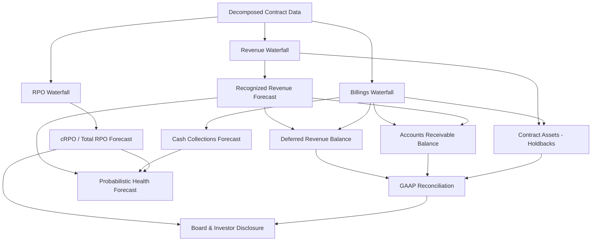

### Direct Answer

When you carry multi-year contracts with holdbacks and payment delays, you must forecast financial health on **three separate clocks** — the revenue clock (ASC 606 recognition), the cash clock (billings and collections), and the commitment clock (RPO and cRPO). Forecasting only ARR or only bookings will mislead the board, because a multi-year deal can look healthy on the commitment clock while quietly starving you on the cash clock. The defensible answer is a probabilistic, cohort-segmented model that runs recognized revenue, billings, and remaining performance obligations as linked-but-distinct waterfalls, applies renewal and collection probabilities by cohort, and reports a confidence interval rather than a single number.

**TLDR**

- **Forecast three clocks, not one.** Recognized revenue, cash collections, and RPO/cRPO each move at different speeds; a multi-year deal with a holdback decouples them by 6 to 24 months.
- **Holdbacks are contra-revenue and contra-cash, not bad debt.** Model them as a probability-weighted reduction with an explicit release trigger, not as a write-off.
- **Payment delays live in the cash model, never the revenue model.** ASC 606 recognizes on delivery; collections forecasting is a separate DSO-and-cohort exercise.
- **Use cRPO as your single most honest forward indicator.** It is contracted, disclosed by public peers, and immune to the bookings-timing games that distort ARR.
- **Make the model probabilistic.** Run renewal as a Markov chain or Monte Carlo and report P10/P50/P90, because a point estimate on a 3-year contract base is false precision.
- **Segment by cohort and contract structure.** Annual-prepaid, multi-year-prepaid, and multi-year-with-holdback cohorts behave so differently that blending them destroys signal.
- **Reconcile to GAAP every month.** Your forecast must tie to deferred revenue, contract assets, and the RPO disclosure, or finance and the board will not trust it.

---

## 1. Why Multi-Year Contracts Break the Naive Forecast

### 1.1 The single-number trap

Most early-stage SaaS finance teams forecast one number: ARR. ARR is a fine north star when every customer pays one year in advance and renews on a clean anniversary. The moment you sign multi-year contracts with holdbacks and payment delays, ARR becomes a lossy compression of at least three underlying realities, and forecasting the compressed number instead of the components is the root cause of most board-meeting surprises.

Consider a concrete deal. A customer signs a three-year contract worth $1.8M total contract value, structured as $600K per year. The contract includes a 10% holdback in year one tied to a go-live milestone, and the customer negotiated net-90 payment terms plus a quarterly billing schedule instead of annual prepay. Ask five people in the company what this deal is "worth this year" and you will get five answers: sales says $600K of ARR, the CRO's bookings report says $1.8M of TCV, revenue recognition says roughly $600K of recognized revenue spread evenly, the billings forecast says four invoices of $150K each minus the holdback, and the cash forecast says the first dollar lands 90 days after the first invoice. All five are correct. They are answering different questions. The naive forecast picks one and pretends the others do not exist.

### 1.2 The three clocks

The disciplined approach names the three clocks explicitly and forecasts each one.

- **The revenue clock** runs on ASC 606. Revenue is recognized as you satisfy performance obligations — for most SaaS, ratably over the service period. The revenue clock does not care when the customer pays or whether there is a holdback; it cares only about delivery.
- **The cash clock** runs on billings and collections. It is governed by your billing schedule, the customer's payment terms, your days sales outstanding (DSO), and the holdback release triggers. The cash clock is what keeps the lights on.
- **The commitment clock** runs on remaining performance obligations (RPO). It captures the total contracted-but-not-yet-recognized value, regardless of billing or payment. cRPO — current RPO — is the portion expected to convert to revenue within twelve months.

A multi-year contract with a holdback and payment delays is, definitionally, a contract where these three clocks are maximally desynchronized. Year-one revenue recognition starts on go-live; the holdback delays cash by a quarter or more; RPO books the full $1.8M on signature day. If your forecast tracks one clock, you will be blind to the other two.

It is worth being precise about the failure modes, because each clock, forecast in isolation, lies in a different direction. A forecast that tracks only the commitment clock — RPO and bookings — will be the most optimistic and the most dangerous, because RPO books the full contract value on day one and a company can therefore look like it is compounding while its bank balance shrinks. A forecast that tracks only the revenue clock will be the most "respectable" and the most lulling, because GAAP revenue is smooth and ratable and gives no hint that the cash behind it is arriving late or not at all. A forecast that tracks only the cash clock will be the most paranoid and the most short-sighted, because it will treat a holdback exactly like a lost dollar and a net-90 invoice exactly like a slow one, with no way to tell the difference. The three clocks are not redundant views of the same truth; they are three different truths, and financial health is the relationship among them. The discipline of this entire answer is refusing to collapse three truths into one number.

### 1.4 The desynchronization gap, quantified

The practical way to internalize the three-clock idea is to measure the gap between them for a single representative contract and watch how it widens. Take the $1.8M three-year deal again, with a 10% year-one holdback and quarterly billing on net-90 terms, and a go-live two months after signature.

| Month after signature | Cumulative RPO consumed | Cumulative revenue recognized | Cumulative cash collected | Commitment-to-cash gap |
|---|---|---|---|---|
| Month 1 | $0 | $0 | $0 | $0 |
| Month 3 | $150,000 | $150,000 | $0 | $150,000 |
| Month 6 | $300,000 | $300,000 | $135,000 | $165,000 |
| Month 9 | $450,000 | $450,000 | $270,000 | $180,000 |
| Month 12 | $600,000 | $600,000 | $474,000 | $126,000 |
| Month 15 | $750,000 | $750,000 | $600,000 | $150,000 |

The commitment-to-cash gap is real money — it is the working capital the company must finance out of its own balance sheet to bridge the desynchronization. For one $1.8M contract the gap peaks around $180K. Multiply that across a book of fifty such contracts and the gap is $9M of cash the company has effectively lent to its customers. No forecast that tracks a single clock can ever surface that number, and that number is frequently the difference between a company that survives and a company that runs out of runway during a quarter of record bookings.

### 1.3 What "financial health" actually means here

"Financial health" is not a single metric. For a company with this contract structure it is a vector with at least six components, and a credible forecast must produce a defensible projection for each.

| Health dimension | Primary metric | What multi-year + holdback distorts |
|---|---|---|
| Growth | Net new ARR, cRPO growth | Bookings timing inflates or deflates the headline |
| Liquidity | Free cash flow, cash runway | Payment delays push cash months past revenue |
| Predictability | RPO coverage ratio | Multi-year RPO can mask a weak current-period book |
| Retention | Gross & net revenue retention | Multi-year deals hide churn until the renewal cliff |
| Margin | Gross margin, contribution margin | Holdback-linked services can be margin-dilutive |
| Quality of revenue | Deferred revenue, contract assets | Holdbacks create contract assets that look like AR but are not |

If you can forecast all six with stated confidence, you have forecast financial health. If you can forecast only ARR, you have forecast a press release.

### 1.4b The audiences and what each one needs

A forecast of financial health is not consumed by one audience, and the multi-clock structure exists partly because different stakeholders read different clocks. Naming the audiences clarifies why you cannot get away with a single number.

| Audience | Primary clock they read | The question they are really asking |
|---|---|---|
| CEO | All three, weighted to cash | Can we survive and still invest? |
| Board | Commitment + cash | Is the forward book real and is runway safe? |
| Investors / VCs | Commitment + retention | Is growth durable and efficient? |
| Auditors | Revenue + balance sheet | Does recognition follow the standard? |
| Acquirer / banker | All three, GAAP-reconciled | Is reported performance defensible? |
| CRO / sales leadership | Commitment (bookings) | Are we filling the top of the funnel? |
| CFO / finance | All three, reconciled | Do the clocks tie out and where is the risk? |

The CRO genuinely should care most about bookings, because that is the lever the sales organization controls. The auditor genuinely should care most about recognition. The mistake is not that any one audience focuses on one clock — it is when the company's single forecast adopts one audience's clock as the whole truth. The CFO's job is to hold all three and translate between them, so that the CRO's bookings triumph and the auditor's recognition rigor and the board's runway anxiety are all reconciled views of one coherent model.

---

## 2. Decompose the Contract Before You Model It

### 2.1 The contract anatomy worksheet

You cannot model what you have not decomposed. Before a multi-year contract enters the forecast, finance should run it through a structured intake that captures every term affecting the three clocks. The intake is not bureaucracy; it is the difference between a forecast and a guess.

| Contract attribute | Why it matters | Clock affected |
|---|---|---|
| Total contract value (TCV) | Anchors RPO on signature | Commitment |
| Term length & start date | Sets the recognition period | Revenue |
| Annual values per year | Multi-year deals are rarely flat | All three |
| Billing schedule | Annual / quarterly / monthly | Cash |
| Payment terms (net 30/60/90) | Sets the collection lag | Cash |
| Holdback amount & % | Contra to billing until released | Cash |
| Holdback release trigger | Go-live, milestone, acceptance | Cash |
| Ramp / step-up schedule | Year-2 and year-3 price increases | Revenue & cash |
| Renewal terms & auto-renew | Drives the renewal probability | Commitment |
| Cancellation / termination rights | A "multi-year" deal that is cancelable annually is not | Commitment |
| Service / implementation SOW | May be a distinct performance obligation | Revenue |
| Usage / overage components | Variable consideration under ASC 606 | Revenue & cash |

### 2.2 The cancelability test

The single most important decomposition question: **is this contract genuinely multi-year, or is it a one-year contract with a multi-year intention?** Under ASC 606 and under any honest RPO disclosure, only the non-cancelable portion of a contract counts. A "three-year contract" where the customer can terminate for convenience with 30 days' notice at any anniversary is, for forecasting purposes, a one-year contract. Companies that book the full TCV into RPO without applying the cancelability test inflate their most-watched forward metric and set up a future restatement-flavored embarrassment.

Public-company disclosure makes this concrete. When Snowflake (SNOW) discusses RPO, it explicitly separates contracted obligations, and analysts at KeyBanc Capital Markets and Bessemer Venture Partners have repeatedly flagged that RPO quality — not just RPO size — is what separates a durable book from a fragile one. Apply the same discipline internally before you model.

The cancelability test is not binary in practice — it is a spectrum, and the model should grade contracts along it rather than sort them into two bins. A contract with no termination rights and a personal guarantee is fully committed. A contract terminable only for cause, with a documented cure period, is very nearly fully committed. A contract terminable for convenience with 90 days' notice but a meaningful early-termination fee is partially committed — the fee is a real economic friction that suppresses churn. A contract terminable for convenience with 30 days' notice and no fee is, economically, a month-to-month deal wearing a multi-year costume. Build a commitment-strength score and apply it as a haircut to the TCV that flows into RPO.

| Termination structure | Commitment strength | RPO inclusion |
|---|---|---|
| No termination rights | Full | 100% of remaining TCV |
| For cause only, with cure period | Very strong | 100% of remaining TCV |
| For convenience, large early-term fee | Strong | 100%, fee modeled as churn suppressant |
| For convenience, modest fee, 90-day notice | Moderate | Haircut by historical mid-term cancel rate |
| For convenience, no fee, 30-day notice | Weak | Only the notice-period value counts |
| Pilot / evaluation clause active | Conditional | Excluded until conversion |

### 2.2b The renewal-versus-commitment distinction

A second decomposition subtlety: a multi-year contract term is not the same as a renewal probability of one. A three-year contract removes the renewal decision for three years — but at the end of year three, that customer faces a renewal decision exactly as a one-year customer does each year, and frequently a harder one, because three years of accumulated price increases, unused features, and changed champions all land at once. The decomposition worksheet should therefore record both the contract term and the expected renewal behavior at term end, and the model should treat the end-of-term renewal as a discrete, often higher-risk event rather than assuming multi-year customers are simply stickier forever.

### 2.3 Holdbacks: what they are and what they are not

A holdback is a portion of contract value the customer is contractually permitted to withhold from payment until a defined condition is met — most often a go-live, a milestone acceptance, or a performance SLA. Decompose the holdback precisely:

- **A holdback is not bad debt.** Bad debt is money you expect never to collect. A holdback is money you expect to collect once you do something. Modeling it as a write-off is wrong and pessimistic.
- **A holdback is not deferred revenue in the ASC 606 sense.** Revenue recognition follows delivery; if you have delivered the service, you recognize revenue even though the holdback cash has not arrived. The holdback creates a **contract asset** (unbilled or billed-but-withheld receivable), not deferred revenue.
- **A holdback is a contra-cash item with a probability and a lag.** The right model treats it as: amount × probability of release × expected timing of release.
- **A holdback can become a write-off** only if the release condition is never met and the contract terms convert it to a permanent reduction. That is a tail scenario, modeled separately.

### 2.4 Payment delays: a cash phenomenon, never a revenue phenomenon

The most common modeling error with payment delays is letting them leak into the revenue forecast. They must not. ASC 606 is explicit: revenue is recognized when (or as) the performance obligation is satisfied, independent of payment timing. A customer on net-90 terms generates the same recognized revenue as a customer on net-15 terms; the difference is entirely in the cash clock and shows up as a larger accounts-receivable balance and a higher DSO. Keep payment delays quarantined in the collections model. The instant they touch the revenue model, your GAAP reconciliation breaks and the auditors — and eventually the board — lose confidence.

There is one legitimate exception worth naming so it is not confused with the error. Payment timing can affect the revenue model if it signals a collectibility problem so severe that the contract fails the ASC 606 threshold of "probable" collection — in that case the contract may not be a valid contract for recognition purposes at all, and revenue is deferred until cash is received. That is a credit-quality judgment, not a payment-timing judgment, and it applies to a customer you genuinely doubt will ever pay, not to a healthy enterprise that simply runs net-90. Conflating "pays slowly" with "may not pay" is the trap. A blue-chip customer on net-90 terms is a working-capital cost, fully recognizable. A shaky customer whose check is 200 days late is a collectibility question. The model must keep these two phenomena in separate boxes.

### 2.5 The four contract structures, side by side

Pulling the decomposition together, almost every multi-year SaaS contract reduces to one of four canonical structures, and the model benefits from tagging each contract to its structure on intake.

| Structure | Cash profile | Revenue profile | Forecasting risk |
|---|---|---|---|
| Multi-year, fully prepaid | Large cash on day one | Smooth ratable | Low cash risk, lumpy bookings optics |
| Multi-year, annual billing | Cash once per year | Smooth ratable | Moderate — annual collection cliffs |
| Multi-year, quarterly billing | Smooth quarterly cash | Smooth ratable | Low — best-behaved structure |
| Multi-year, billing + holdback | Delayed, tranche cash | Smooth ratable | High — contract assets accumulate |

The holdback structure is the hardest because it combines a long term, a payment lag, and a conditional release — three sources of desynchronization in one contract. Most of the modeling effort in this answer is, in effect, the cost of handling that fourth row honestly.

---

## 3. The Three-Waterfall Model Architecture

### 3.1 Why three linked waterfalls

The correct model structure is three distinct but linked waterfalls: a revenue waterfall, a billings waterfall, and an RPO waterfall. Each starts from the same decomposed contract data, but each applies a different schedule. They are linked because they reconcile to each other through the balance sheet — deferred revenue, contract assets, and accounts receivable are the connective tissue — but they are distinct because they answer different questions and move at different speeds.

### 3.2 The revenue waterfall

The revenue waterfall takes each contract, identifies the performance obligations, and spreads recognized revenue across periods according to the satisfaction pattern. For a standard SaaS subscription, that is ratable recognition over the service term. For a multi-year contract with annual step-ups, recognition still follows delivery — a $600K / $620K / $640K three-year contract recognizes those amounts in those years, not a blended average, unless a material-rights or significant-financing-component analysis says otherwise.

| Period | Contract A (ratable) | Contract B (step-up) | Contract C (with go-live delay) |
|---|---|---|---|
| Q1 | $150,000 | $150,000 | $0 (pre-go-live) |
| Q2 | $150,000 | $150,000 | $200,000 (catch-up) |
| Q3 | $150,000 | $150,000 | $100,000 |
| Q4 | $150,000 | $150,000 | $100,000 |
| Year 1 total | $600,000 | $600,000 | $400,000 |
| Year 2 total | $600,000 | $620,000 | $480,000 |
| Year 3 total | $600,000 | $640,000 | $480,000 |

### 3.3 The billings waterfall

The billings waterfall spreads invoiced amounts across periods according to the billing schedule, then applies holdbacks as a contra-billing reduction in the periods before the release trigger. Billings are not revenue and they are not cash; they are the bridge. Billings minus the change in deferred revenue equals recognized revenue; billings minus collections equals the change in accounts receivable.

| Period | Gross billings | Holdback withheld | Net billed | Holdback released |
|---|---|---|---|---|
| Q1 | $600,000 | ($60,000) | $540,000 | $0 |
| Q2 | $600,000 | $0 | $600,000 | $0 |
| Q3 | $600,000 | $0 | $600,000 | $60,000 |
| Q4 | $600,000 | $0 | $600,000 | $0 |
| Year 1 total | $2,400,000 | ($60,000) | $2,340,000 | $60,000 |

### 3.4 The RPO waterfall

The RPO waterfall is the simplest in structure and the most important for credibility. On contract signature, the non-cancelable TCV enters total RPO. Each period, recognized revenue draws RPO down and new bookings add to it. cRPO is the slice expected to convert within twelve months. Because RPO is contracted, it is the forward metric least susceptible to manipulation — which is exactly why public investors weight it heavily.

| Period | Opening RPO | New bookings | Revenue recognized | Closing RPO | cRPO |
|---|---|---|---|---|---|
| Q1 | $8,000,000 | $1,800,000 | $900,000 | $8,900,000 | $3,400,000 |
| Q2 | $8,900,000 | $2,100,000 | $950,000 | $10,050,000 | $3,700,000 |
| Q3 | $10,050,000 | $2,400,000 | $1,000,000 | $11,450,000 | $4,000,000 |
| Q4 | $11,450,000 | $2,800,000 | $1,050,000 | $13,200,000 | $4,300,000 |

### 3.5 Linking the waterfalls through the balance sheet

The three waterfalls are not independent — they reconcile. This reconciliation is what makes the forecast auditable and is the step that separates a finance-grade model from a sales spreadsheet.

| Balance sheet account | Built from | Reconciliation identity |
|---|---|---|
| Deferred revenue | Billings − recognized revenue | Closing DR = Opening DR + Billings − Revenue |
| Accounts receivable | Net billings − collections | Closing AR = Opening AR + Net billings − Cash collected |
| Contract assets | Revenue recognized − amounts billed | Holdbacks and unbilled revenue accumulate here |
| Total RPO | Bookings − recognized revenue | Closing RPO = Opening RPO + Bookings − Revenue |

If any of these identities fails to tie out month to month, the model has a leak, and the leak must be found before the forecast is shown to anyone.

### 3.6 The bridge metrics that connect the waterfalls

Beyond the balance-sheet identities, three bridge metrics let a reader move between the clocks intuitively, and a mature board pack shows all three. The first is the **billings-to-revenue ratio** — billings divided by recognized revenue over the same period. A ratio above 1.0 means you are billing ahead of recognition, building deferred revenue, which is healthy and normal for a growing prepaid book. A ratio below 1.0 means you are recognizing faster than billing, drawing down deferred revenue, which is the signature of either slowing bookings or a shift toward arrears billing. The second is the **collections-to-billings ratio** — cash collected divided by net billings — which measures how efficiently the cash clock keeps up with the billing clock; a persistent figure below 1.0 means receivables are building. The third is the **RPO coverage ratio** — total RPO divided by trailing-twelve-month revenue — which tells you how many years of revenue are already contracted.

| Bridge metric | Formula | Healthy range | What a bad reading means |
|---|---|---|---|
| Billings-to-revenue | Billings / Revenue | 1.0–1.3 growing | Below 1.0: bookings slowing or arrears shift |
| Collections-to-billings | Cash / Net billings | 0.9–1.0 | Below 0.9: receivables building, DSO rising |
| RPO coverage | Total RPO / TTM revenue | 1.5x–3.0x | Below 1.0: thin forward book |
| cRPO coverage | cRPO / next-12-mo revenue plan | 0.6x–0.9x at quarter start | Low: heavy reliance on unbooked new business |
| Contract-asset ratio | Contract assets / TTM revenue | Low and stable | Rising: holdbacks accumulating, cash at risk |

### 3.7 A common waterfall mistake: the bookings-to-RPO double count

One subtle error deserves explicit warning. When a multi-year contract renews, it is tempting to book the renewal as fresh bookings and add the full renewal TCV to RPO — but the original contract's RPO has already been drawn down to zero by recognition, so this is correct. The error is the opposite case: booking an expansion or an early renewal while the original contract still has RPO remaining, and adding the new TCV without removing the superseded RPO. This double counts. Whenever a contract is amended, replaced, or co-termed, the model must explicitly retire the old RPO and book the net change, not the gross new value. This is one of the most common reasons a company's RPO disclosure later requires a quiet correction.

---

## 4. Modeling Holdbacks Probabilistically

### 4.1 The holdback as a three-parameter object

A holdback should never be a single number in the model. It is a three-parameter object: **amount**, **probability of release**, and **expected timing**. The naive approach — assume 100% release on the contractual date — is optimistic and brittle. The pessimistic approach — write it off — is wrong. The correct approach is probability-weighted.

| Holdback parameter | Naive treatment | Disciplined treatment |
|---|---|---|
| Amount | Contractual % of TCV | Same — this part is contractual |
| Probability of release | Implicitly 100% | Empirical, by milestone type and customer segment |
| Timing of release | Contractual target date | Distribution around the target, skewed late |
| Partial release | Ignored | Modeled — many holdbacks release in tranches |

### 4.2 Estimating release probability from history

If you have a history of holdback deals, mine it. Build an empirical release table from past contracts: of holdbacks tied to a go-live milestone, what fraction released on time, late, or never? Segment by milestone type, by customer size, and by implementation complexity. A holdback tied to a self-serve go-live releases differently than one tied to a 9-month enterprise implementation with custom integrations.

| Milestone type | On-time release | Late release (avg lag) | Never released |
|---|---|---|---|
| Self-serve go-live | 88% | 9% (3 weeks) | 3% |
| Standard implementation | 71% | 24% (7 weeks) | 5% |
| Complex enterprise integration | 52% | 39% (14 weeks) | 9% |
| Performance SLA acceptance | 64% | 28% (6 weeks) | 8% |

These numbers are illustrative — yours will differ — but the structure is the point. With this table, a holdback enters the cash forecast as a distribution: 71% chance of release in the target month, 24% chance spread over the following two months, 5% chance of permanent loss.

### 4.3 Bayesian updating as milestones approach

Holdback probability is not static. As a go-live date approaches and you have signal — implementation is on track, the customer's project sponsor is engaged, the integration tests are passing — you should update the release probability. This is a natural fit for Bayesian updating: start with the prior from the historical release table, then update with project-health signal as it arrives. A holdback that started at 71% release probability can move to 92% once the go-live is confirmed scheduled, or down to 40% if the implementation has slipped twice and the sponsor has gone quiet. The cash forecast should breathe with that signal.

### 4.4 The contract asset implication

When you deliver service but a holdback prevents billing or collection, GAAP records a contract asset. The forecast must project the contract-asset balance, because a growing contract-asset balance is a yellow flag — it means you are recognizing revenue faster than you are converting it to billable, collectible cash. Investors and auditors read the contract-asset line precisely as a holdback-and-unbilled accumulator. ServiceNow (NOW) and Workday (WDAY), both heavy in multi-year enterprise contracts, disclose contract assets specifically so that analysts can see this gap. Your internal forecast should give the board the same visibility before it becomes a surprise.

### 4.5 The holdback aging report

Just as accounts receivable has an aging report, holdbacks need one — a standing monthly report that lists every open holdback, its release trigger, its target release date, its current probability of release, and how many days past the original target it has aged. A holdback that is 90 days past its expected release date is a flashing indicator: either the implementation has genuinely stalled, or the customer is using the holdback as leverage in a dispute. Either way, finance and the services organization need to be looking at it together every month.

| Holdback | Amount | Trigger | Target date | Days aged | Current release prob |
|---|---|---|---|---|---|
| Customer A | $60,000 | Go-live | Month 2 | On time | 92% |
| Customer B | $140,000 | Acceptance | Month 4 | +31 days | 68% |
| Customer C | $95,000 | SLA met | Month 6 | +74 days | 44% |
| Customer D | $210,000 | Integration | Month 9 | +12 days | 79% |
| Customer E | $48,000 | Go-live | Month 3 | On time | 90% |

### 4.6 Holdbacks and the incentive problem

A modeling answer is incomplete without naming the organizational reality: holdbacks exist because the customer wants leverage, and they create an incentive misalignment the forecast should reflect. Sales is incentivized to close, and will agree to holdbacks to get the signature. Services is incentivized to hit go-live, but rarely carries the cash consequence of a slipped milestone. Finance carries the cash consequence but does not control the implementation. The forecasting model, by surfacing the holdback aging report and the cash impact of slippage, is what forces this misalignment into the open. The best operators tie a portion of the services team's accountability to holdback release, precisely so the people who control the milestone feel the cash clock. The model does not fix the incentive problem by itself — but it makes the problem visible, measurable, and impossible to ignore at the board level.

---

## 5. Modeling Payment Delays and the Cash Clock

### 5.1 DSO is the wrong tool alone

Days sales outstanding is the standard cash-timing metric, and it is necessary but not sufficient for a multi-year, holdback-laden book. A single blended DSO averages a net-15 SMB customer with a net-90 enterprise customer with a holdback-delayed enterprise customer, and the blend hides exactly the risk you are trying to forecast. Decompose DSO by cohort and by contract structure.

| Customer cohort | Payment terms | Effective DSO | Holdback prevalence |
|---|---|---|---|
| SMB self-serve | Net 0–15 (card) | 8 days | 2% |
| Mid-market | Net 30 | 41 days | 18% |
| Enterprise standard | Net 60 | 73 days | 34% |
| Enterprise strategic | Net 90 + holdback | 118 days | 61% |

### 5.2 The collections waterfall

Build a collections waterfall that takes net billings and spreads cash receipts across future periods according to a collections curve specific to each cohort. The collections curve answers: of a dollar billed in month zero, what fraction is collected in month zero, month one, month two, and so on. Enterprise-strategic cohorts will have long, late tails; SMB will collect almost everything in month zero.

| Months after billing | SMB collected | Mid-market collected | Enterprise collected | Enterprise + holdback |
|---|---|---|---|---|
| Month 0 | 96% | 35% | 8% | 4% |
| Month 1 | 3% | 48% | 44% | 22% |
| Month 2 | 1% | 14% | 39% | 41% |
| Month 3 | 0% | 2% | 7% | 24% |
| Month 4+ | 0% | 1% | 2% | 9% |

### 5.3 Runway is calculated on the cash clock

The single most dangerous mistake a multi-year SaaS company can make is calculating runway on the revenue clock or the bookings clock. Runway is cash divided by net cash burn, and net cash burn depends entirely on the collections forecast. A company can post record bookings, record cRPO, and record recognized revenue in the same quarter that its cash balance falls because a wave of holdbacks and net-90 invoices pushed collections out. The forecast must put cash runway front and center, computed strictly from the collections waterfall, and stress-tested for delayed holdback release.

### 5.4 The significant financing component check

ASC 606 contains a provision that multi-year prepaid or heavily back-loaded contracts can trigger: the significant financing component. If the timing of payment provides the customer or the vendor with a significant financing benefit — for example, a customer pays three years entirely upfront, or entirely at the end — the transaction price may need to be adjusted for the time value of money. Most SaaS contracts under a one-year payment cycle are exempt under the practical expedient, but genuinely multi-year payment structures should be checked with your auditors. Flag it in the contract intake worksheet so it is never missed.

---

## 6. Making the Forecast Probabilistic

### 6.1 Why a point estimate is malpractice here

A single-number forecast on a book of multi-year contracts with holdbacks and payment delays is false precision. The renewal of a three-year contract two years out, the release of a holdback tied to a slipping implementation, the collection timing of a net-90 enterprise invoice — each of these is a random variable. Multiplying and summing random variables and reporting one number throws away the entire uncertainty structure. The board deserves a range with stated confidence: P10, P50, P90.

### 6.2 Renewal as a Markov chain

Model the customer base as a Markov chain over a small set of states, with transition probabilities estimated by cohort. A clean state set: New, Active, At-Risk, Renewed, Churned, Expanded. Each period, every customer transitions according to its cohort's transition matrix. Multi-year contracts simply mean a customer sits in Active for the contract term before reaching a renewal decision, but the At-Risk state can still be entered mid-term based on health signal.

| From / To | Active | At-Risk | Renewed | Expanded | Churned |
|---|---|---|---|---|---|
| Active | 0.82 | 0.11 | 0.00 | 0.07 | 0.00 |
| At-Risk | 0.31 | 0.40 | 0.00 | 0.02 | 0.27 |
| Renewed | 0.86 | 0.08 | 0.00 | 0.06 | 0.00 |
| Expanded | 0.84 | 0.07 | 0.00 | 0.09 | 0.00 |

### 6.3 Monte Carlo over the linked waterfalls

Once renewal is a Markov process, run Monte Carlo. Each simulation run draws renewal outcomes from the transition matrix, holdback release outcomes from the empirical release table, and collection timing from the cohort collections curves, then propagates all of it through the three waterfalls. Run 10,000 trials and you get a distribution for every output metric.

| Metric (12-month forward) | P10 | P50 | P90 |
|---|---|---|---|
| Recognized revenue | $11.8M | $13.2M | $14.3M |
| Cash collections | $9.9M | $12.1M | $13.6M |
| Closing cRPO | $3.6M | $4.3M | $5.0M |
| Net revenue retention | 104% | 112% | 119% |
| Cash runway (months) | 14 | 21 | 28 |

### 6.4 What the spread tells you

The gap between P10 and P90 is itself a deliverable. A tight band means your book is predictable; a wide band means your financial health depends heavily on uncertain events — and the model tells you which ones. If the cash-collections band is much wider than the recognized-revenue band, the message is unambiguous: your risk is concentrated in payment timing and holdback release, not in revenue itself. That insight directs management attention precisely where it belongs.

### 6.5 Sensitivity analysis: which variable moves the answer

Monte Carlo produces a distribution, but it also lets you decompose where the uncertainty comes from. Run the simulation while holding each input variable fixed at its median, one at a time, and observe how much the output band collapses. The variable whose fixing collapses the band the most is the variable your financial health is most sensitive to — and therefore the variable that most deserves management attention and a mitigation plan.

| Input variable held at median | P10–P90 cash band | Band as % of base | Sensitivity rank |
|---|---|---|---|
| (none — full simulation) | $3.7M | 100% | — |
| Holdback release timing | $2.4M | 65% | 1 (highest) |
| Enterprise renewal rate | $2.9M | 78% | 2 |
| Collection-curve lag | $3.1M | 84% | 3 |
| New-bookings volume | $3.4M | 92% | 4 |
| Expansion rate | $3.6M | 97% | 5 (lowest) |

In this illustrative book, holdback release timing is the single largest driver of cash uncertainty — fixing it would shrink the band by 35%. That is a precise, actionable finding: it tells the CEO that the highest-leverage operational improvement is not closing more deals, it is getting implementations to go-live on schedule so holdbacks release on time.

### 6.6 Avoiding false confidence in the simulation

A probabilistic model can be wrong with great precision. Three disciplines keep it honest. First, **back-test the bands**: each quarter, check whether actuals landed inside the P10–P90 range you forecast; if actuals land outside the band more than 20% of the time, your bands are too narrow and your transition matrices or release tables are overconfident. Second, **stress the correlation assumptions**: holdback slippage and enterprise renewal risk are not independent — a customer in a troubled implementation is also a churn risk — and a naive simulation that treats them as independent will understate the tail. Model the correlation explicitly. Third, **resist the urge to over-parameterize**: with limited history, a simple model with a few well-estimated parameters beats a baroque one with dozens of guessed inputs. The goal is calibrated humility, not the illusion of precision.

---

## 7. Cohort Segmentation: The Non-Negotiable

### 7.1 Why blended forecasting fails

If you forecast a blended book of annual-prepaid SMB customers and multi-year-holdback enterprise customers with one set of assumptions, you will be wrong in a specific, predictable way: you will overstate near-term cash and understate the renewal cliff. The cohorts behave so differently across all three clocks that blending them is not a simplification — it is an error.

| Cohort | Revenue clock | Cash clock | Commitment clock |
|---|---|---|---|
| Annual prepaid SMB | Ratable, 12 mo | Cash at signing | Short RPO, fast turn |
| Multi-year prepaid | Ratable over term | Large cash upfront | Long RPO, lumpy |
| Multi-year quarterly bill | Ratable over term | Smooth quarterly cash | Long RPO, smooth draw |
| Multi-year + holdback | Ratable over term | Delayed, tranche cash | Long RPO, contract assets |
| Usage / consumption | Variable, on usage | Bills in arrears | RPO understates true value |

### 7.2 The renewal cliff hidden inside multi-year deals

Multi-year contracts hide churn. A customer that signed a three-year deal and is quietly unhappy generates perfect retention metrics for 35 months and then does not renew. If your forecast does not track the maturity profile of the multi-year book — how much contract value comes up for renewal in each future quarter — you will be ambushed. Build a renewal-maturity schedule and overlay it on the Markov renewal model.

| Renewal quarter | Multi-year ARR up for renewal | Modeled renewal rate | Forecast renewed ARR |
|---|---|---|---|
| Q+1 | $1.2M | 91% | $1.09M |
| Q+2 | $0.8M | 89% | $0.71M |
| Q+3 | $2.4M | 87% | $2.09M |
| Q+4 | $3.1M | 88% | $2.73M |
| Q+5 | $4.6M | 86% | $3.96M |

### 7.3 Net revenue retention by cohort

Net revenue retention is the metric public SaaS investors watch most closely, and it must be cohort-segmented. ICONIQ Growth and Bessemer Venture Partners publish benchmark data showing that NRR varies enormously by segment; reporting one company-wide NRR blends signal into noise. Atlassian (TEAM), MongoDB (MDB), and Snowflake (SNOW) all report retention metrics that the market dissects by segment because the segments tell different stories.

---

## 8. Tooling: What to Run This On

### 8.1 The spreadsheet ceiling

Every model in this article can be built in a spreadsheet, and for a company under roughly $5M in ARR, a well-built spreadsheet is the right answer — it is transparent, auditable, and cheap. But the spreadsheet has a ceiling. Once you have hundreds of multi-year contracts, cohort segmentation, Monte Carlo, and a monthly GAAP reconciliation, the spreadsheet becomes fragile, slow, and impossible to audit. The signal that you have hit the ceiling: nobody but one person understands the model, and that person is afraid to change it.

### 8.2 Category landscape

| Tool category | Representative products | Best fit |
|---|---|---|
| FP&A / planning platforms | Anaplan, Pigment, Workday Adaptive Planning, Vena | Multi-clock modeling, scenario, board reporting |
| SaaS metrics / subscription analytics | ChartMogul, Maxio, SaaSGrid | Cohort retention, ARR/cRPO bridges |
| Revenue automation (RevRec) | Maxio, Salesforce Revenue Cloud, NetSuite | ASC 606 recognition, contract assets |
| Lightweight finance modeling | Mosaic | Real-time metrics, integrated forecasting |

### 8.3 What good tooling must support

Whatever you choose, it must support the non-negotiables: three linked waterfalls, cohort segmentation, probabilistic scenarios, and a clean reconciliation to the general ledger. A tool that produces a beautiful ARR chart but cannot reconcile to deferred revenue and contract assets is a marketing tool, not a finance tool. Anaplan and Pigment are strong on multi-dimensional, multi-clock modeling; ChartMogul, Maxio, and SaaSGrid are strong on cohort and subscription analytics; Mosaic is strong on real-time integrated metrics. Most growth-stage companies end up with a metrics layer plus a planning layer, integrated.

### 8.4 The build-vs-buy decision

| Stage | Recommended setup | Rationale |
|---|---|---|
| Under $5M ARR | Spreadsheet model | Cheap, transparent, fast to change |
| $5M–$20M ARR | Metrics tool + spreadsheet planning | Cohort analytics outgrow the sheet first |
| $20M–$75M ARR | Metrics tool + FP&A platform | Scenario and board reporting need a platform |
| $75M+ / pre-IPO | FP&A platform + RevRec automation + audit | Disclosure-grade rigor becomes mandatory |

---

## 9. Reconciling to GAAP and Disclosure

### 9.1 The forecast must tie to the financials

A forecast that cannot be reconciled to the actual financial statements is a story, not a forecast. Every month, the model's projected deferred revenue, contract assets, accounts receivable, and RPO must be compared to the booked actuals, and the variance must be explained. This monthly tie-out is tedious and it is the single highest-leverage discipline in the entire process, because it is what earns finance the right to be believed.

### 9.2 The metrics public peers disclose

Public SaaS companies disclose a specific set of metrics, and a private company that wants to be acquirable or IPO-ready should forecast the same set, because that is the language acquirers and bankers speak.

| Disclosed metric | What it signals | Public examples |
|---|---|---|
| Total RPO | Full contracted backlog | Snowflake (SNOW), ServiceNow (NOW) |
| cRPO | Forward 12-month contracted revenue | Salesforce (CRM), Workday (WDAY) |
| Deferred revenue | Billed-not-recognized | Atlassian (TEAM), MongoDB (MDB) |
| Net revenue retention | Expansion vs. churn | Snowflake (SNOW), MongoDB (MDB) |
| Free cash flow / margin | True cash generation | ServiceNow (NOW), Atlassian (TEAM) |
| Contract assets | Unbilled / holdback accumulation | Workday (WDAY), ServiceNow (NOW) |

### 9.3 Speaking the investor's language

When KeyBanc Capital Markets, Bessemer Venture Partners, or ICONIQ Growth analyze a SaaS company, they reconstruct exactly the three-clock view this article describes. They bridge bookings to RPO to revenue to cash, and they probe the gaps. A management team that presents the board and investors with a forecast already structured this way — three clocks, cohort-segmented, probabilistic, GAAP-reconciled — signals operational maturity and earns a credibility premium. A team that presents only an ARR number invites the analyst to do the decomposition for them, and the analyst will not be charitable about the gaps they find.

The credibility premium is not abstract — it shows up in the valuation multiple and in the speed of a fundraise or a diligence process. When an acquirer's quality-of-earnings team can take your three-clock model, tie it to the general ledger in an afternoon, and find no surprises, the deal moves faster and at a tighter discount. When that team finds RPO inflated by cancelable contracts, holdbacks modeled as guaranteed cash, and a runway computed off recognized revenue, every one of those findings becomes a negotiating lever against you. The forecast you build for internal management is, eventually, the forecast a buyer or a banker audits. Build it to survive that audit from day one, and the discipline compounds into enterprise value rather than into a frantic clean-up before a transaction.

### 9.5 The disclosure-readiness gap

Most private companies discover, painfully, that the metrics they have been managing to are not the metrics a public-market investor or an acquirer expects. The gap is predictable and closable in advance.

| Internal metric the company tracks | Disclosure-grade equivalent expected | Why the gap matters |
|---|---|---|
| ARR | cRPO + total RPO | RPO is contracted; ARR is a construct |
| Bookings | Net new RPO | Bookings double-count renewals |
| "Cash in the bank" | Free cash flow and FCF margin | A balance is not a rate |
| Logo churn | Gross and net revenue retention | Dollars matter more than logos |
| Pipeline coverage | RPO coverage of the revenue plan | Contracted beats hoped-for |

Closing this gap is not a reporting exercise done the quarter before a raise; it is a multi-quarter discipline. The company that begins forecasting the disclosure-grade metric set two years early arrives at its transaction with a clean track record, and a clean track record is itself a material asset.

### 9.4 Board reporting cadence

| Report | Cadence | Primary audience |
|---|---|---|
| Three-clock dashboard | Monthly | Management, board |
| Cohort retention review | Quarterly | Board, investors |
| Probabilistic range update | Quarterly | Board |
| GAAP reconciliation pack | Monthly | Audit committee, auditors |
| Holdback aging & release | Monthly | Management |

---

## 10. Worked Example: A Quarter in the Life of the Model

### 10.1 The setup

A Series C SaaS company has $14M in ARR. Roughly 45% of bookings now come as multi-year contracts; about a third of multi-year enterprise deals carry a holdback; the enterprise-strategic cohort runs net-90. The CFO is preparing the board deck.

### 10.2 What each clock shows

| Clock | Headline number | Trend | Interpretation |
|---|---|---|---|
| Revenue | $13.2M recognized (P50) | Up 19% YoY | Healthy, predictable |
| Cash | $12.1M collected (P50) | Up 11% YoY | Lagging revenue — watch |
| Commitment | $13.2M closing RPO | Up 31% YoY | Strong forward book |

### 10.3 The story the three clocks tell together

Read alone, the RPO number is a triumph and the revenue number is solid. But the cash number, growing only 11% against 19% revenue growth, is the tell. The collections waterfall and the holdback aging report explain it: the enterprise-strategic cohort grew fastest, that cohort runs net-90 with a 61% holdback prevalence, and three large holdbacks tied to enterprise implementations have slipped. The model already priced this — the P10 cash runway of 14 months versus the P50 of 21 is the explicit warning. The board conversation is therefore not "are we healthy" but "do we accelerate holdback release, tighten enterprise payment terms, or raise — and the P10 says decide this quarter." That is what a forecast is for.

### 10.4 The action register

| Signal from model | Recommended action | Owner |
|---|---|---|
| Cash growth lags revenue | Tighten enterprise payment terms on new deals | CRO + CFO |
| 3 holdbacks slipped | Escalate implementations, Bayesian re-score | Services + Finance |
| P10 runway = 14 months | Begin raise conversations as insurance | CEO + CFO |
| cRPO strong | Use in investor narrative — forward book is real | CFO |
| Renewal cliff in Q+5 | Start renewal motion 2 quarters early | CS leadership |

---

## 11. Counter-Case: When This Approach Is Overkill

The three-clock, probabilistic, cohort-segmented model is the right answer for a company with a material book of multi-year contracts, holdbacks, and payment delays. It is **not** the right answer for every company, and applying it where it does not belong wastes finance capacity and obscures rather than clarifies.

- **Pure annual-prepaid SMB businesses.** If every customer pays one year upfront by card and renews on a clean anniversary, the three clocks are nearly synchronized. ARR is a faithful summary, a simple cohort retention model suffices, and building Monte Carlo over Markov renewal is effort spent on precision the business does not need.
- **Pre-revenue or sub-$1M ARR companies.** With a dozen customers, you do not have enough history to estimate transition matrices or holdback release tables. The right tool is a clean spreadsheet and conversations with each customer. Statistical machinery on tiny samples produces confident nonsense.
- **Usage-based businesses with negligible commitments.** If revenue is overwhelmingly consumption-based with little contracted minimum, RPO and cRPO understate the business and the commitment clock is not the right frame. A usage-forecasting model — leading indicators of consumption — matters more than a contract waterfall.
- **Companies in a stable, single-cohort niche.** If you sell one product, one contract structure, one payment term, to one customer type, cohort segmentation adds no signal because there is only one cohort. Segment when the segments diverge, not before.
- **When the model would delay the decision.** If a cash crisis is imminent, building an elegant probabilistic model is the wrong use of the next 48 hours. Do the direct cash-collections math by hand, make the decision, and build the model afterward so the next crisis is seen coming.

The discipline is to match modeling sophistication to contract complexity. The signal that you have crossed the threshold into needing the full model: multi-year deals are a double-digit percentage of bookings, holdbacks appear in your contracts, and your largest customers are on extended payment terms. Below that threshold, simpler is not lazy — it is correct.

---

## 12. Implementation Roadmap

### 12.1 First 30 days

- **Build the contract intake worksheet** and run every active multi-year contract through it. You cannot model what you have not decomposed.
- **Apply the cancelability test** to your current RPO. If you have been booking cancelable TCV into RPO, correct it now and brief the board on the restated figure before someone else finds it.
- **Stand up the three waterfalls** in a spreadsheet — revenue, billings, RPO — even if crude. Get the reconciliation identities tying out.

### 12.2 Days 30 to 90

- **Build the cohort segmentation** and split DSO, collections curves, and retention by cohort.
- **Mine the holdback history** to produce an empirical release table by milestone type.
- **Add the collections waterfall** and recompute runway strictly on the cash clock.

### 12.3 Days 90 to 180

- **Introduce the Markov renewal model** and the renewal-maturity schedule.
- **Layer Monte Carlo** on top and start reporting P10/P50/P90 to the board.
- **Formalize the monthly GAAP reconciliation pack** for the audit committee.
- **Evaluate tooling** against the build-vs-buy table if the spreadsheet is straining.

### 12.4 The maturity checklist

| Capability | Minimum bar | Mature bar |
|---|---|---|
| Clocks forecast | Revenue only | Revenue + cash + RPO, reconciled |
| Holdback treatment | Single number | Probability-weighted, Bayesian-updated |
| Payment delays | Blended DSO | Cohort collections curves |
| Uncertainty | Point estimate | P10/P50/P90 from Monte Carlo |
| Segmentation | Blended | Cohort by contract structure |
| GAAP tie-out | Annual | Monthly reconciliation pack |
| Disclosure readiness | ARR only | Full public-peer metric set |

---

## Related Library Entries

- **q425** — How do you calculate 'true' LTV when you have variable churn by cohort? The cohort-segmentation discipline here feeds directly into LTV.
- **q431** — How do we run co-sell motions without bottlenecking at account executives? Co-sell deals often carry the multi-year, holdback structure modeled here.
- **q432** — What's the fastest partner enablement curriculum to get partners selling? Partner-sourced multi-year deals need the same contract intake rigor.
- **q444** — How do I stage regional market entry for EMEA without creating dependencies? EMEA enterprise contracts frequently introduce extended payment terms.
- **q1103** — Renewal forecasting fundamentals for subscription businesses — the Markov renewal model extends that baseline.
- **q1123** — Board reporting cadence and the metrics that earn investor trust.
- **q1157** — ASC 606 revenue recognition for SaaS finance teams.

## Sources

1. FASB ASC 606, Revenue from Contracts with Customers — core recognition standard.
2. FASB ASC 606-10-32 — variable consideration and the constraint.
3. FASB ASC 606-10-32-15 — significant financing component guidance.
4. FASB ASC 606-10-45 — contract assets and contract liabilities.
5. SEC EDGAR — Snowflake Inc. (SNOW) Form 10-K, RPO and cRPO disclosure.
6. SEC EDGAR — ServiceNow Inc. (NOW) Form 10-K, RPO and contract asset disclosure.
7. SEC EDGAR — Salesforce Inc. (CRM) Form 10-K, cRPO disclosure practice.
8. SEC EDGAR — Workday Inc. (WDAY) Form 10-K, contract assets and backlog.
9. SEC EDGAR — MongoDB Inc. (MDB) Form 10-K, deferred revenue and retention.
10. SEC EDGAR — Atlassian Corporation (TEAM) Form 10-K, deferred revenue and FCF.
11. ICONIQ Growth — Topline Growth and Operational Efficiency benchmark reports.
12. Bessemer Venture Partners — State of the Cloud annual report.
13. Bessemer Venture Partners — The BVP Nasdaq Emerging Cloud Index methodology.
14. KeyBanc Capital Markets — SaaS Survey (annual), metrics and benchmarks.
15. AICPA — Audit and Accounting Guide: Revenue Recognition.
16. PCAOB — auditing standards relevant to revenue and contract assets.
17. Mosaic — finance strategy resources on SaaS metrics and forecasting.
18. Anaplan — connected planning documentation for FP&A modeling.
19. Pigment — business planning platform documentation.
20. Workday Adaptive Planning — planning and modeling documentation.
21. Vena Solutions — FP&A modeling resources.
22. ChartMogul — subscription analytics and cohort retention documentation.
23. Maxio (formerly SaaSOptics + Chargify) — RevRec and metrics resources.
24. SaaSGrid — SaaS metrics definitions and ARR bridge methodology.
25. KeyBanc — definitions of NRR, GRR, and the Rule of 40.
26. OpenView Partners — SaaS Benchmarks report (retention and efficiency).
27. SaaS Capital — Retention benchmarks for private SaaS companies.
28. Battery Ventures — Software cloud metrics and benchmarking.
29. Meritech Capital — public SaaS comparables and metrics analysis.
30. a16z — "16 Startup Metrics" and the SaaS metrics follow-up.
31. David Skok, For Entrepreneurs — SaaS metrics, churn, and unit economics.
32. CFA Institute — time value of money and probabilistic forecasting fundamentals.
33. Norris & Markov chain texts — discrete-time Markov chain modeling foundations.
34. Gelman et al., Bayesian Data Analysis — Bayesian updating methodology.
35. FASB ASC 606-10-25 — identifying performance obligations in a contract.
