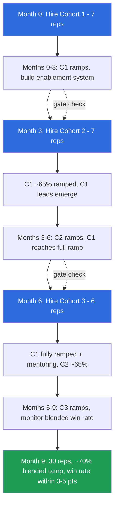

### Direct Answer

The right way to scale a sales team from 10 to 30 reps in nine months without crushing win rate is to treat headcount growth as a **system-load problem, not a recruiting problem**: you grow capacity in three deliberate cohorts of 6-8 reps each, spaced roughly 90 days apart, and you gate every cohort behind a "ramped-rep" definition so that managers, enablement, lead supply, and territory design all expand in lockstep with bodies in seats. Win rate craters not because new reps are bad but because the support system around them — coaching ratios, pipeline per rep, deal-desk throughput, and clean territories — gets diluted faster than it gets rebuilt. If you protect those four ratios and accept that fully-ramped capacity lags hiring by one to two quarters, you can triple the team and hold win rate within 3-5 points of baseline.

> **TLDR**
> - **Hire in cohorts, not continuously.** Three waves of 6-8 reps (month 0, month 3, month 6) beat a steady drip because enablement, onboarding, and manager attention are batch-efficient.
> - **Gate on "ramped reps," not "hired reps."** Define ramp as 80%+ of quota attainment for two consecutive months; never let unramped reps exceed ~40% of the team.
> - **Protect four ratios:** manager span (1:6-8), pipeline coverage (3-4x), deal-desk SLA (<24h), and lead supply per rep. If any ratio breaks, pause hiring.
> - **Win-rate dilution is a leading indicator.** Watch stage-2-to-close conversion by tenure cohort weekly; a 5-point drop in the trailing cohort is your early-warning siren.
> - **Promote or hire managers ahead of reps.** You need 2-3 net-new front-line managers before month 6, and a manager with an empty team for 30 days is cheaper than a full team with no manager.
> - **Re-cut territories twice, not continuously.** Carving accounts every month destroys account knowledge; do it at month 0 and month 5 with surgical precision.
> - **Counter-case:** if your win rate is already below 15%, your motion is broken — fix the motion before adding reps, or you will simply scale a loss.

---

## Section 1 — Why Win Rate Collapses When You Scale (And What It Is Actually Telling You)

### 1.1 The mechanical reason headcount dilutes win rate

When a team triples in nine months, the instinct is to celebrate momentum. But win rate is a *ratio*, and ratios are merciless about denominators. Every new rep adds deals to the denominator of "opportunities worked" long before they add proportional wins to the numerator. A rep in month two of ramp is touching real pipeline, burning real leads, and logging real losses — they are a full-cost participant in the win-rate calculation while delivering a fraction of the output. If you add 20 reps and 14 of them are inside their ramp window at any given moment, roughly half of your team's *activity* is being generated by people statistically likely to lose more than they win.

This is not a knock on new reps. It is arithmetic. The blended win rate of a team is the tenure-weighted average of its cohorts, and when you triple headcount fast, the tenure distribution shifts hard toward the low end. A team that was 100% ramped at the 10-rep mark might be only 55-60% ramped at the 30-rep mark even if every single hire is excellent. That mix shift alone can drag a 24% blended win rate down to 18% with zero degradation in any individual's skill.

### 1.2 The system-load reason: support ratios get diluted

The deeper, more dangerous cause is **support dilution**. A sales rep does not close deals alone. They close deals with the help of a manager who coaches them, a deal desk that prices and structures, a sales engineer who runs technical validation, a marketing engine that supplies leads, and a CRM/process backbone that keeps deals from falling through cracks. Every one of those is a shared resource with finite capacity.

When you add reps without adding to those shared resources proportionally, each rep gets a thinner slice. A manager who gave each of six reps 90 minutes of coaching per week now gives each of twelve reps 45 minutes. A deal desk that turned quotes around in 12 hours now takes 36. A sales engineer who joined every important demo now joins every third. None of these is catastrophic alone. Together, they are a win-rate massacre, because deals are won at the margin and the margin is exactly where support matters.

### 1.3 Win rate as a leading indicator, not a lagging scorecard

Most teams treat win rate as a quarterly scorecard — a number you look at after the quarter closes and feel good or bad about. That is too late. During a rapid scale, **win rate by tenure cohort is your single best leading indicator** of whether the system is holding. If your month-0 cohort is converting stage-2 opportunities at 38% and your month-6 cohort is converting at 22%, that gap is not "new reps are still learning." That gap, tracked weekly, tells you precisely how fast the support system is recovering relative to how fast you are adding load.

The discipline that separates teams that scale cleanly from teams that implode is the discipline of watching the *trailing cohort's* conversion as a real-time gauge. When the newest cohort's stage-2-to-close rate stops improving week over week, your system is at capacity. Adding the next cohort on top of that is how you turn a 4-point dilution into a 12-point collapse.

| Failure mode | What it looks like | Root cause | Win-rate impact |
|---|---|---|---|
| Mix-shift dilution | Blended win rate drops, individual rates stable | Tenure distribution skewed young | -4 to -7 pts |
| Manager span overload | New reps plateau at 50-60% quota | Coaching minutes per rep halved | -3 to -6 pts |
| Lead starvation | Reps "creating own pipeline," cycle times balloon | Demand gen did not scale with headcount | -5 to -9 pts |
| Deal-desk bottleneck | Deals stall in "negotiation" stage | Quote/approval SLA blew past 24h | -2 to -5 pts |
| Territory thrash | Reps complain about "bad accounts" | Re-carved territories too often | -3 to -8 pts |
| Culture erosion | Top reps disengage, A-players leave | Onboarding chaos, unclear expectations | -4 to -10 pts |

The numbers above are directional ranges drawn from operator post-mortems, not laboratory constants — but the lesson is consistent: each failure mode is individually survivable and collectively fatal. The job of a scale plan is to keep all six off the board at once.

---

## Section 2 — The Cohort Model: Why You Hire in Waves, Not in a Drip

### 2.1 The case against continuous hiring

The most common scaling mistake is "always-on" recruiting: post the reqs, hire whenever a good candidate appears, start them whenever they can begin. It feels efficient — you never lose a great candidate to timing. It is, in practice, a slow-motion disaster.

Continuous hiring means continuous onboarding. Continuous onboarding means your enablement function is never *off*. Every week there is a new starter who needs the product overview, the persona training, the CRM walkthrough, the call shadowing. Enablement becomes a treadmill, and treadmill enablement is shallow enablement. The new rep who started alone in week 7 gets a rushed, improvised version of the program because the enablement lead is also handling the week-5 rep and the week-9 rep. There is no cohort to learn alongside, no shared cadence, no peer group to normalize the terror of the first lost deal.

Continuous hiring also destroys *manager* batching. A manager absorbing one new rep every three weeks is permanently in "new-rep mode" — permanently doing first-deal reviews, permanently re-explaining the qualification framework. They never get a clean stretch to coach their ramped reps toward elite performance, which is where the actual win-rate upside lives.

### 2.2 The cohort cadence: three waves over nine months

The model that works is three cohorts of 6-8 reps, spaced about 90 days apart:

- **Cohort 1 — Month 0:** 7 reps. This is the foundation wave. You hire ahead of the curve here because these reps will be your most-ramped contributors when cohorts 2 and 3 are still green. Several of them are also your future team leads.
- **Cohort 2 — Month 3:** 7 reps. By now cohort 1 is at the 60-70% ramp mark, enablement has run the program once and fixed its worst bugs, and you have real data on which onboarding modules predict success.
- **Cohort 3 — Month 6:** 6 reps. The final wave. Cohort 1 is fully ramped and partly feeding the mentorship of cohort 3; cohort 2 is at 60-70%. You deliberately make this the smallest cohort because it has the least runway to ramp inside the nine-month window.

That totals 20 net-new reps on top of the original 10, landing you at 30. The spacing is not arbitrary: 90 days is roughly one full enablement cycle plus one quota cycle of feedback, which means each cohort's onboarding is informed by hard evidence from the prior cohort rather than guesswork.

### 2.3 Why cohorts protect win rate specifically

Cohorts protect win rate through three mechanisms. First, **batch enablement is deep enablement** — a structured four-week bootcamp run for seven people at once is dramatically higher quality than seven improvised solo onboardings. Second, **cohorts create peer learning** — new reps learn as much from each other's lost-deal reviews as from formal training, and a cohort gives them that peer group. Third, **cohorts let you measure** — you cannot run a clean tenure-cohort win-rate analysis if every rep started on a different random Tuesday; cohorts give you discrete, comparable populations.

The dotted "gate check" arrows are the single most important feature of this diagram. Before each new cohort is hired, you run a formal gate check on the four protected ratios (covered in Section 5). If the gates are not green, the next cohort *slips* — and slipping a cohort by 30-45 days is vastly cheaper than scaling a broken system.

| Cohort | Hire month | Size | Fully ramped by | Role at month 9 |
|---|---|---|---|---|
| Existing 10 | Pre-plan | 10 | Already ramped | Core producers, mentors, lead candidates |
| Cohort 1 | Month 0 | 7 | Month 6 | Ramped producers, 2-3 become team leads |
| Cohort 2 | Month 3 | 7 | Month 9 | Newly ramped, carrying real quota |
| Cohort 3 | Month 6 | 6 | Month 12 (post-window) | Mid-ramp, ~60-70% attainment |

Notice the honest admission in the last row: Cohort 3 is *not* fully ramped at month 9. Any plan that claims all 30 reps are firing at full quota nine months in is lying to the board. The realistic outcome is roughly 70% blended ramp at month 9, with the system fully matured around month 12.

---

## Section 3 — Defining "Ramped": The Gate That Governs Everything

### 3.1 Why a precise ramp definition is non-negotiable

Every decision in this plan — when to hire the next cohort, how to forecast, when to re-cut territories, whether the system is healthy — depends on a single shared definition of what "ramped" means. If "ramped" is vibes, your plan is vibes. Most failed scale-ups never wrote the definition down, so "we have 24 reps" and "we have 24 productive reps" got conflated, and the forecast was built on the second number while reality delivered the first.

### 3.2 A usable definition of ramped

A rep is **ramped** when they have hit **80% or more of their full quota for two consecutive months**. Two consecutive months matters: one good month can be a single lucky whale; two months is a pattern. 80% rather than 100% is deliberate — it acknowledges that the last 20% of productivity is a long tail that can take another quarter, and you do not want to withhold the "ramped" label from a rep who is clearly contributing.

You also track **time-to-ramp** as a cohort statistic. If Cohort 1's median time-to-ramp is 5.5 months and Cohort 2's is 4.5 months, your enablement system is improving and you can be slightly more aggressive. If it is going the other direction, the system is degrading under load and you should slow down.

### 3.3 The 40% rule for unramped reps

Here is the operating constraint that keeps win rate intact: **unramped reps should never exceed roughly 40% of the team.** When more than four in ten reps are still in ramp, the blended win rate becomes structurally fragile, managers are spending the majority of their time on first-deal reviews, and the team's "muscle memory" — the senior reps who model what good looks like — is too thin to absorb the newcomers.

| Team size | Max unramped (40%) | Min ramped | Implication |
|---|---|---|---|
| 10 | 4 | 6 | Baseline — start state |
| 17 (after C1) | ~7 | ~10 | C1 + maybe 1-2 backfills in ramp; OK |
| 24 (after C2) | ~10 | ~14 | Tightest point — watch carefully |
| 30 (after C3) | ~12 | ~18 | C3 fully unramped + tail of C2; right at the line |

The month-6-to-9 window is the danger zone: that is when Cohort 3 is fully green and part of Cohort 2 is still ramping, pushing you right against the 40% ceiling. This is *why* Cohort 3 is the smallest of the three waves. If you had made Cohort 3 the largest, you would blow through the 40% line and the win-rate dilution would become structural rather than transient.

### 3.4 Ramp as a forecasting input

The ramp definition also fixes forecasting. You do not forecast 30 reps × full quota at month 9. You forecast **ramped-equivalent capacity**: fully-ramped reps at 100%, mid-ramp reps at a tenure-appropriate fraction (a month-2 rep might be modeled at 30%, a month-4 rep at 65%). At month 9 your ramped-equivalent capacity is roughly 21-23 reps' worth of production from a 30-rep roster. A board that is told "30 reps means 30 reps of bookings" will be furious in Q4. A board that is told "30 reps converging to ~24 ramped-equivalent by month 12" can plan cash and targets honestly.

---

## Section 4 — The Four Ratios You Must Protect

The entire scale plan reduces to one idea: **headcount can grow fast, but it must never outrun four support ratios.** Each ratio has a healthy band and a breakpoint. When a ratio hits its breakpoint, you pause hiring until it recovers. These ratios are the gates referenced in the Mermaid diagram.

### 4.1 Ratio one — manager span of control (1:6 to 1:8)

A front-line sales manager can effectively coach somewhere between six and eight reps. Below six, you are over-spending on management overhead. Above eight — and especially above ten — coaching collapses into administration. The manager becomes a forecast-scraper and deal-approver, not a developer of talent, and developing talent is the entire mechanism by which new reps get to "ramped."

Scaling from 10 to 30 reps means your manager count must roughly triple too. If you start with two managers (one of them possibly the player-coach VP), you need to land at four to five front-line managers by month 9. Critically, **managers must be in place before their reps**, because a cohort that onboards under a manager who is themselves brand-new gets a degraded experience.

| Milestone | Reps | Managers needed | Span |
|---|---|---|---|
| Start | 10 | 2 | 1:5 |
| After Cohort 1 | 17 | 3 | 1:5.7 |
| After Cohort 2 | 24 | 4 | 1:6 |
| After Cohort 3 | 30 | 4-5 | 1:6-7.5 |

The cleanest source of new managers is internal promotion from your existing 10 and from Cohort 1's early standouts — they already know the product, the motion, and the culture. But promote deliberately: a great rep is not automatically a great manager, and a botched promotion costs you both a producer and a coach. Plan to hire at least one experienced manager externally to bring in fresh playbook ideas and to cover the gap if internal candidates are not ready.

### 4.2 Ratio two — pipeline coverage (3x to 4x of quota)

Every rep needs a pipeline worth roughly three to four times their quota for the period to have a credible shot at hitting it. When you add reps faster than you add pipeline, coverage drops, reps start chasing weak deals to fill the gap, and weak deals lose. Lead starvation is the single most lethal win-rate killer on this list because it is *invisible in the headcount plan* — nobody's spreadsheet shows it.

The fix is to make demand generation a co-equal line item in the scale plan. Marketing's lead target, SDR/BDR headcount, and outbound capacity must all scale on the same cohort cadence as the AE team. A useful rule: for every cohort of 6-8 AEs, you need a corresponding step-up in qualified pipeline creation, often meaning 2-4 new SDRs per AE cohort plus a marketing budget increase.

| Stage | Reps | Quota carried | Pipeline needed (3.5x) | Pipeline gap risk |
|---|---|---|---|---|
| Start | 10 | $10M | $35M | Low — established |
| After C1 | 17 | $14M ramped-eq | $49M | Medium — SDRs lag |
| After C2 | 24 | $18M ramped-eq | $63M | High — peak strain |
| After C3 | 30 | $22M ramped-eq | $77M | Medium — stabilizing |

(Quota figures are illustrative placeholders to show the *shape* of the strain, not prescriptions.) If pipeline coverage drops below 3x for the newest cohort, that is a hard gate: do not hire Cohort 3 until coverage recovers.

### 4.3 Ratio three — deal-desk and support SLA (under 24 hours)

As volume grows, the shared services that touch deals — deal desk, pricing/quote approval, legal/contracts, sales engineering — become bottlenecks. A deal desk that turned a custom quote around in 12 hours at 10 reps will, with no added capacity, take 48-72 hours at 30 reps. Every hour a deal sits waiting for a quote is an hour the buyer's enthusiasm cools and a competitor talks. Slow internal SLAs lose deals at the finish line.

Protect a sub-24-hour SLA on quotes and approvals, and a same-week SLA on SE engagement for qualified opportunities. That means deal-desk and SE headcount must scale too — not 1:1 with reps, but on a deliberate ratio (often one deal-desk analyst per 12-15 reps, one SE per 4-6 reps depending on motion complexity).

### 4.4 Ratio four — clean lead supply and routing per rep

Distinct from raw pipeline volume is the *quality and fairness* of lead routing. When you triple the team, the lead-routing rules written for 10 reps break. Round-robin logic gets stale, territory overlaps create conflict, and reps start to feel that "the good leads go to the favorites." The perception of unfair lead distribution is poison: it demotivates exactly the reps you need to ramp and pushes top performers toward the exit.

Re-engineer routing as part of the plan: clear territory boundaries, transparent routing logic, and a published service level for how fast inbound leads reach a rep. Reps who trust the system focus on selling; reps who distrust it spend their energy litigating account ownership.

| Ratio | Healthy band | Breakpoint (pause hiring) | Owner |
|---|---|---|---|
| Manager span | 1:6 to 1:8 | > 1:9 | VP Sales |
| Pipeline coverage | 3x to 4x | < 3x for newest cohort | CMO + VP Sales |
| Deal-desk SLA | < 24h | > 36h sustained | RevOps / Deal Desk |
| Lead supply per rep | Stable or rising | Falling 2 months running | RevOps + Marketing |

---

## Section 5 — The Nine-Month Operating Plan, Phase by Phase

### 5.1 Phase 0 — Pre-work (the month before month 0)

Before a single new rep starts, do the unglamorous foundational work. Write the ramp definition. Build the four-week onboarding bootcamp curriculum. Document the ideal customer profile and qualification framework so it can be *taught* rather than absorbed by osmosis. Audit the CRM for data hygiene. Decide the cohort sizes and dates. Identify internal manager candidates. Set the win-rate baseline by tenure so you have something to measure dilution against.

Teams that skip Phase 0 and "figure it out as we go" are the teams that end month 9 with 30 confused reps and a 14% win rate.

### 5.2 Phase 1 — Months 0 to 3 (Cohort 1 ramps)

Hire Cohort 1's seven reps and one new manager (or promote one). Run the bootcamp for real for the first time — and instrument it. Track which modules correlate with faster ramp. The original 10 reps continue producing and now also serve as shadow hosts and mentors. The VP's main job this phase is to *watch the system*: is the bootcamp landing, are managers coping, is pipeline keeping up? At the end of month 3, run the **first gate check**.

### 5.3 Phase 2 — Months 3 to 6 (Cohort 2 ramps, Cohort 1 matures)

If the gates are green, hire Cohort 2's seven reps and a third front-line manager. Run bootcamp v2 — improved with Cohort 1's lessons. Cohort 1 crosses the 60-70% ramp mark and its standouts begin shadowing for future team-lead roles. This is when total team size hits ~24 and the unramped percentage peaks; watch the trailing-cohort win rate weekly. End of month 5: a **light territory re-cut** to accommodate Cohort 2 cleanly. End of month 6: the **second gate check**.

### 5.4 Phase 3 — Months 6 to 9 (Cohort 3 ramps, system stabilizes)

If the gates hold, hire Cohort 3's six reps and confirm the fourth/fifth manager. Cohort 1 is now fully ramped and actively mentoring; Cohort 2 is at 60-70%. Bootcamp v3 runs. The focus shifts from "add capacity" to "convert capacity" — coaching the mid-ramp reps toward full productivity. By month 9 you are at 30 reps, roughly 70% blended ramp, and — if the ratios held — a win rate within 3-5 points of where you started, on a trajectory back to baseline by month 12.

| Phase | Months | Action | Team size | Gate at end |
|---|---|---|---|---|
| Phase 0 | -1 to 0 | Build system, hire managers | 10 | Readiness check |
| Phase 1 | 0-3 | Hire C1 (7), run bootcamp v1 | 17 | Gate check 1 |
| Phase 2 | 3-6 | Hire C2 (7), bootcamp v2, light re-cut | 24 | Gate check 2 |
| Phase 3 | 6-9 | Hire C3 (6), bootcamp v3, convert capacity | 30 | Stabilization review |

### 5.5 The gate check, concretely

A gate check is a 60-minute meeting with the VP Sales, RevOps, CMO, and Finance, run against a fixed checklist: Are all four ratios in their healthy bands? Is the trailing cohort's win rate stable or improving? Is time-to-ramp holding or improving? Is attrition normal? If every answer is yes, the next cohort is approved. If any answer is no, the cohort slips 30-45 days and the broken ratio gets a remediation owner and deadline. The gate check is the mechanism that converts "scale fast" from a gamble into a controlled process.

---

## Section 6 — Onboarding and Enablement That Actually Moves Win Rate

### 6.1 The four-week bootcamp structure

- **Week 1 — Company, product, market.** Who we are, what we sell, who buys it and why, the competitive landscape. Ends with a product-knowledge check.
- **Week 2 — The motion.** The qualification framework, the sales stages, the CRM hygiene rules, the deal-desk process. Heavy on call shadowing — every new rep listens to 15-20 real calls.
- **Week 3 — Reps in the chair.** New reps run mock discovery and demo calls, get scored against a rubric, and start handling live inbound under supervision.
- **Week 4 — Live with a net.** Reps work real opportunities with a manager or mentor co-piloting every meaningful deal interaction. By the end of week 4 they are carrying a reduced quota solo.

### 6.2 Why instrumenting onboarding matters

The bootcamp is not static. After Cohort 1, you have data: which modules predicted fast ramp, which scoring rubrics correlated with real win rate, where reps struggled. Bootcamp v2 cuts what did not work and doubles down on what did. This is why the cohort cadence is 90 days — it gives you a full feedback loop. By bootcamp v3, you are running a genuinely refined program rather than the improvised mess most fast-scaling teams inflict on their later hires.

### 6.3 Reduced-quota ramp schedule

New reps should carry a graduated quota: perhaps 25% of full quota in month 1, 50% in month 2, 75% in month 3, 100% from month 4. This is not generosity — it is win-rate protection. A rep crushed by an impossible number from day one chases bad deals to survive, and bad deals lose. A graduated ramp lets them build the habit of qualifying hard and walking away from junk, which is the habit that produces a high win rate for the rest of their tenure.

| Ramp month | Quota % | Manager involvement | Primary goal |
|---|---|---|---|
| Month 1 | 25% | Co-pilot every deal | Learn the motion, build pipeline |
| Month 2 | 50% | Review every deal | First closes, qualification habit |
| Month 3 | 75% | Review key deals | Consistency, pipeline self-sufficiency |
| Month 4+ | 100% | Standard cadence | Full production, working toward "ramped" |

### 6.4 Mentorship pairing

Pair every new rep with a ramped mentor from the original 10 or Cohort 1. The mentor is not the manager — they are a peer who answers the small questions a rep is embarrassed to ask a boss, models good behavior, and shortens the time to "I belong here." Mentorship is cheap and disproportionately effective at protecting both ramp speed and retention.

---

## Section 7 — Territory Design Without the Thrash

### 7.1 Why constant re-carving destroys win rate

Every time you re-cut territories, reps lose accounts they were nurturing and inherit accounts they know nothing about. Account knowledge — the relationships, the context, the history of past conversations — is a real asset, and re-carving vaporizes it. Teams that re-carve every time they add a rep create permanent churn: nobody ever owns an account long enough to build the trust that closes deals.

### 7.2 The twice-only rule

Re-cut territories exactly twice during the nine months: once at month 0 (designing for the end-state 30-rep team, not the current 10) and once at month 5 (a surgical adjustment to absorb Cohort 2 and prepare for Cohort 3). Design the month-0 cut with the *destination* in mind so that adding cohorts means *activating* pre-planned territory segments rather than reshuffling everyone.

### 7.3 Protecting account continuity

When you must move an account, move it with a warm handoff: the outgoing rep briefs the incoming rep, introduces them to the buyer, and the CRM notes are complete. An account moved cold is an account at risk. Build handoff quality into the territory plan, not as an afterthought.

| Territory event | Timing | Scope | Continuity safeguard |
|---|---|---|---|
| Initial design | Month 0 | Design for 30-rep end state | Pre-plan segments to activate later |
| Cohort 1 activation | Month 0 | Activate C1 segments | No disruption to existing reps |
| Light re-cut | Month 5 | Absorb C2, prep C3 | Warm handoffs, complete CRM notes |
| Cohort 3 activation | Month 6 | Activate C3 segments | No disruption to ramped reps |

---

## Section 8 — Forecasting, Finance, and Managing the Board

### 8.1 The honest forecast

Scaling 10 to 30 reps does not produce 3x bookings at month 9. It produces, realistically, something like 1.8-2.2x ramped-equivalent capacity at month 9, converging toward 2.6-2.8x by month 12. Forecasting on raw headcount is the fastest way to a brutal Q4 board meeting. Forecast on ramped-equivalent capacity and the cohort ramp curves, and the board sees a credible, defensible plan.

### 8.2 The cost of the lag

There is a real cash cost to the ramp lag: you are paying 30 salaries while getting ~22 reps of output. Finance must model this. The scale plan should explicitly show the "ramp investment" — the gap between fully-loaded cost and ramped-equivalent production — as a deliberate, time-boxed investment that pays back as the cohorts mature.

### 8.3 What to commit to the board

Commit to the *process* and the *leading indicators*, not just the bookings number. Tell the board: here is the cohort plan, here are the four ratios we protect, here are the gate checks, here is the trailing-cohort win rate we will report weekly. A board that understands the leading indicators will trust the plan through the inevitable bumpy month — and a bumpy month is *certain*.

| Metric | Month 0 | Month 3 | Month 6 | Month 9 | Month 12 |
|---|---|---|---|---|---|
| Headcount | 10 | 17 | 24 | 30 | 30 |
| Blended ramp % | 100% | ~75% | ~62% | ~70% | ~92% |
| Ramped-equivalent reps | 10 | ~13 | ~15 | ~21 | ~28 |
| Blended win rate vs baseline | baseline | -2 to -4 | -3 to -5 | -3 to -5 | -1 to +1 |
| Managers | 2 | 3 | 4 | 4-5 | 4-5 |

---

## Section 9 — Culture and Retention Under Rapid Scale

### 9.1 The dilution of culture

When a team triples in nine months, the "veterans" become a minority. The norms, the standards, the unwritten rules of how deals get done get diluted just like the support ratios. If you are not deliberate, the culture of the 30-rep team is set by the loudest new hires rather than by your best people.

### 9.2 Protecting the A-players

Your existing top reps are the most valuable asset and the most at-risk during a scale. They get more mentoring duty, possibly worse territories after a re-cut, and a manager who is distracted by new hires. If A-players feel taken for granted, they leave — and one departed A-player at the wrong moment can knock several points off team win rate and demoralize everyone. Explicitly protect them: best territories, recognition, a clear growth path (team lead, then manager), and compensation that reflects their importance.

### 9.3 Hiring for culture fit, not just resume

In a cohort hiring sprint, the pressure to "just fill the reqs" is intense. Resist it. A mis-hire in a cohort of seven does not just underperform — they drag the cohort's morale, consume disproportionate manager time, and often have to be exited, restarting the whole hiring clock. A slightly slower hire of the right person beats a fast hire of the wrong one every time.

| Retention risk | Trigger | Mitigation |
|---|---|---|
| A-player flight | Worse territory, neglect | Protect territory, recognition, growth path |
| Cohort morale drag | A mis-hire in the cohort | Hire slow, exit fast if clearly wrong |
| Manager burnout | Span overload, no support | Hire managers ahead, cap span at 8 |
| Culture drift | Veterans outnumbered | Mentorship program, explicit norm-setting |

---

## Counter-Case — When This Playbook Does NOT Apply

This entire plan assumes a fundamentally healthy starting point. There are several situations where executing it would be a serious mistake.

**1. Your win rate is already broken.** If your starting win rate is below ~15%, your motion, your ICP, or your product-market fit is the problem — not your headcount. Adding 20 reps to a broken motion does not scale revenue; it scales losses, burns leads, and incinerates cash. Fix the motion first. Get win rate to a healthy band with the 10 reps you have, *then* scale.

**2. You do not have the pipeline and cannot get it.** If marketing and outbound genuinely cannot produce 2-3x more qualified pipeline on this timeline, hiring 20 AEs creates 20 starving reps. In that case, invest in demand generation first and delay the AE scale.

**3. The 10-to-30 jump is being driven by a single big bet.** If the headcount plan rests on one giant new market or one massive customer that has not closed yet, you are scaling on a hope. Scale to the demand you can see, not the demand you are praying for.

**4. You lack management bench and cannot hire it.** This plan needs 4-5 capable front-line managers. If you have no internal candidates and the external market is dry, scaling reps without managers guarantees the span-of-control ratio breaks and win rate collapses. Solve management capacity first.

**5. The timeline is externally imposed and non-negotiable.** If a board mandate forces 30 reps in 9 months regardless of system readiness, the honest move is to renegotiate the timeline or the win-rate expectation. You cannot have aggressive headcount, a fixed timeline, *and* protected win rate all three — something gives. Name the trade-off explicitly rather than pretending all three are achievable.

**6. Very small base or very early stage.** If you only have 3-4 reps and no documented motion, "10 to 30" is the wrong frame entirely; you are still in the founder-led-sales-to-first-team transition, which is a different playbook (see the cross-linked early-stage entries).

In all six cases, the discipline is the same: the constraint is not "can we recruit fast enough" — it is "is the system ready to absorb the load." If it is not, fix the system before you scale the headcount.

---

## Section 10 — The Hiring Engine: Sourcing 20 Reps Without Lowering the Bar

### 10.1 Why the recruiting funnel is its own scaling problem

A 10-to-30 plan quietly demands that you *hire* 20-plus people in nine months — and given normal attrition, backfills, and the occasional fast exit of a mis-hire, the real number of offers you need to extend is closer to 24-28. That is a recruiting machine, and most sales orgs treat recruiting as a side hustle for managers who would rather be coaching. If you do not build the hiring engine as deliberately as you build the onboarding engine, you will either miss your cohort dates or fill the cohorts with whoever was available, and both outcomes crush win rate.

Run the math honestly. If your offer-to-hire acceptance rate is 80%, you need ~30 offers for 24 hires. If your final-interview-to-offer rate is 40%, you need ~75 final-round candidates. If your screen-to-final rate is 30%, you need ~250 screened candidates. If your application/sourced-to-screen rate is 25%, you need a top-of-funnel of roughly 1,000 candidates over nine months — about 110 per month. That is not a side hustle. That is a dedicated function with a dedicated recruiter and a measured funnel.

### 10.2 The recruiting funnel as a pipeline

Treat the recruiting funnel exactly like a sales pipeline, because it *is* one. It has stages, conversion rates, cycle time, and a forecast. RevOps should instrument it with the same rigor applied to the deal pipeline. The single most useful instrument is **time-to-fill by cohort**: if Cohort 1 took 55 days from req-open to start and Cohort 2 is trending to 75, your recruiting engine is degrading under load and the cohort date is at risk.

| Recruiting stage | Conversion target | Cycle time | Owner |
|---|---|---|---|
| Sourced/applied to screen | 25-30% | 3-5 days | Recruiter |
| Screen to first interview | 50-60% | 5-7 days | Recruiter + Manager |
| First interview to final | 40-50% | 7-10 days | Hiring Manager |
| Final to offer | 35-45% | 3-5 days | VP Sales |
| Offer to accept | 75-85% | 5-10 days | VP Sales + Recruiter |

### 10.3 Where the candidates actually come from

The highest-quality source in a fast scale is almost always **referrals from your existing 10 reps and Cohort 1**. Good reps know other good reps, referred candidates ramp faster, and they stay longer. Build a referral program with a real bonus and make referral-asking a standing agenda item in team meetings. Beyond referrals, you will lean on inbound applications, a dedicated sourcer or recruiting agency for outbound candidate generation, and the personal networks of the managers you hire externally — an external manager often brings two or three strong reps with them.

### 10.4 A consistent, fast, structured interview process

Speed and consistency are the two recruiting virtues that protect win rate. Speed: great sales candidates are in-market for days, not weeks; a process that takes 30 days loses the best people to faster competitors. Consistency: every candidate runs the same structured loop — recruiter screen, hiring-manager interview, a mock-call or role-play exercise scored against a rubric, a peer/cross-functional interview, and a VP final. The role-play is the single most predictive stage; a candidate who can run a credible discovery conversation in an interview can usually run one with a buyer.

### 10.5 Hiring the manager bench in parallel

Remember that the recruiting engine is hiring *managers* too, and manager searches take longer than rep searches. Open the external manager req early — month -1 or month 0 — because a 90-day manager search that starts at month 3 lands a manager at month 6, far too late for them to be ready for Cohort 3. Run manager hiring as its own parallel funnel with its own timeline.

| Hiring track | Req open | Target start | Lead time | Risk if late |
|---|---|---|---|---|
| Cohort 1 reps | Month -1 | Month 0 | ~8 weeks | Whole plan slips |
| External manager 1 | Month -1 | Month 1 | ~10 weeks | C1 onboards under green mgr |
| Cohort 2 reps | Month 1 | Month 3 | ~8 weeks | Cohort 2 slips |
| External manager 2 | Month 1 | Month 4 | ~12 weeks | Span breaks at 24 reps |
| Cohort 3 reps | Month 4 | Month 6 | ~8 weeks | Cohort 3 slips |

---

## Section 11 — Compensation and Quota Design During the Scale

### 11.1 Why comp design is a win-rate lever

Compensation is not an HR afterthought in a scale plan — it is a behavioral control system. The comp plan tells every rep, in the most unambiguous language available (money), what the company wants them to do. If the comp plan rewards closing junk deals, reps close junk deals and win rate falls. If it rewards qualifying hard and pursuing the right ICP accounts, win rate holds. During a 10-to-30 scale, when 40% of the team is learning what "good" looks like, the comp plan is teaching them — make sure it teaches the right lesson.

### 11.2 The graduated ramp and the ramp guarantee

New reps need a **ramp guarantee** — a minimum guaranteed commission (often 50-70% of on-target variable) for the first two to three months — paired with the graduated quota schedule from Section 6. The guarantee removes the desperation that drives bad-deal-chasing. A rep who knows their first three months are partially protected can afford to walk away from a poorly-qualified deal; a rep with no guarantee and a full quota will take anything with a pulse, and anything with a pulse loses.

### 11.3 Keeping comp simple

A complex comp plan with six accelerators, three SPIFs, and a matrix of multipliers is impossible for a ramping rep to internalize. During a scale, simplicity is a feature. A clean plan — base, variable on bookings to quota, one meaningful accelerator above 100% — is one a new rep can understand on day one and optimize for immediately. Save the clever multi-lever designs for a mature, fully-ramped team.

### 11.4 Quota fairness across cohorts and territories

When you re-cut territories and add cohorts, quota fairness becomes contentious. A rep handed a thin territory and a full quota will miss through no fault of their own, get discouraged, and either underperform or leave. Quota should be set on the *realistic capacity of the territory*, validated against pipeline coverage. RevOps should run a territory-balance analysis at each re-cut to confirm that quotas are achievable given the accounts and pipeline actually present.

| Comp element | New rep (ramp) | Ramped rep | Purpose |
|---|---|---|---|
| Base salary | Full | Full | Stability |
| Variable target | Pro-rated to ramp quota | Full | Pay-for-performance |
| Ramp guarantee | 50-70% of variable, 2-3 mo | None | Removes desperation |
| Accelerator | Applies above ramp quota | Applies above 100% | Rewards overachievement |
| SPIFs | Avoid during ramp | Used sparingly | Focus, not distraction |

### 11.5 The cost of comp mistakes

A comp plan that is perceived as unfair — uneven territories, a guarantee that runs out too early, accelerators that only the veterans can reach — does measurable damage. It depresses morale across the team, not just for the affected reps, and morale is directly correlated with effort and therefore with win rate. The comp plan should be reviewed by RevOps and Finance at each gate check alongside the four operating ratios.

---

## Section 12 — Tooling, Data, and the RevOps Backbone

### 12.1 The CRM must scale before the team does

A CRM and process backbone that worked fine for 10 reps will not survive 30. At 10 reps, informal norms, tribal knowledge, and a forgiving manager can patch over messy data. At 30 reps, mess compounds: dirty data produces a wrong forecast, broken routing produces lead fights, and an undefined stage definition produces a pipeline nobody trusts. The CRM cleanup and process documentation in Phase 0 is not optional housekeeping — it is load-bearing infrastructure.

### 12.2 The minimum viable RevOps stack

You do not need every tool on the market, but a 30-rep team needs a defined, instrumented stack: a clean CRM with enforced stage definitions and required fields; a lead-routing engine with transparent, auditable rules; a forecasting tool or disciplined forecasting process built on ramped-equivalent capacity; a conversation-intelligence tool so managers can coach at scale without sitting in every call; and an enablement/content platform so reps can self-serve the playbook. The conversation-intelligence tool deserves emphasis: it is the single technology that most directly extends a manager's coaching capacity, which is the scarcest resource in the whole plan.

| Capability | Why it matters at 30 reps | Win-rate link |
|---|---|---|
| Clean CRM + stage definitions | Trustworthy pipeline and forecast | Indirect — decision quality |
| Lead routing engine | Fair, fast lead distribution | Direct — coverage and morale |
| Forecasting on ramped-eq | Honest board commitments | Indirect — planning |
| Conversation intelligence | Coaching at scale | Direct — extends manager span |
| Enablement platform | Self-serve playbook | Direct — faster ramp |
| Deal-desk workflow tool | Sub-24h quote SLA | Direct — fewer finish-line losses |

### 12.3 Data hygiene as a weekly discipline

Instrument data hygiene as a weekly RevOps report: percentage of opportunities with required fields complete, percentage with a next step and a future close date, percentage with accurate stage. When the team triples, hygiene degrades unless someone owns it. A forecast built on dirty data is worse than no forecast, because it produces false confidence — and false confidence is how a scale plan walks off a cliff.

### 12.4 The single source of truth for ramp status

One specific data discipline deserves its own callout: every rep's ramp status (which cohort, what ramp month, ramped or not) must be a clean, queryable field, because the entire plan — the 40% rule, the ramped-equivalent forecast, the tenure-cohort win-rate analysis — depends on it. If "is this rep ramped?" requires a Slack message to a manager, your plan has no instrumentation.

---

## Section 13 — The Manager Operating Cadence That Holds It Together

### 13.1 What front-line managers must do during a scale

During a scale, the front-line manager is the load-bearing wall. Their job is not forecasting and deal approval — those are byproducts. Their job is **developing reps from unramped to ramped as fast as the quality bar allows**. That happens through a specific, non-negotiable cadence: weekly 1:1s focused on skill development (not just deal status), regular call reviews against a rubric, structured deal reviews on the deals that matter, and pipeline-quality inspection so reps are not hoarding junk.

### 13.2 The weekly cadence

| Cadence | Frequency | Focus | Time cost |
|---|---|---|---|
| 1:1 with each rep | Weekly | Skill development, blockers | 45-60 min/rep |
| Call review | Weekly per rep | Coaching against rubric | 30 min/rep |
| Team pipeline review | Weekly | Pipeline quality, coverage | 60 min |
| Deal review (key deals) | As needed | Strategy on big/at-risk deals | Variable |
| Forecast roll-up | Weekly | Commit accuracy | 30 min |

Add that up and a manager with eight reps is spending roughly 12-14 hours a week on direct rep development alone — which is exactly why the span cap of 8 exists. Push the span to 12 and the math forces the manager to cut the development work, and cutting development work is cutting the mechanism that ramps reps and protects win rate.

### 13.3 Manager onboarding is its own program

Newly promoted managers need their own enablement. A great rep promoted to manager who is left to "figure it out" will default to doing the rep job better — selling the deals themselves instead of coaching — because that is what they know. A short manager-onboarding program covering coaching frameworks, the 1:1 structure, how to run a deal review, and how to give hard feedback is a small investment that protects every rep under that manager.

### 13.4 The VP's job during the scale

The VP of Sales during a 10-to-30 scale is not a super-rep and not a forecast-aggregator. The VP is the *system operator*: running the gate checks, watching the four ratios, protecting the cohort cadence from the pressure to hire faster, managing the board's expectations, and coaching the managers (because the managers coach the reps). A VP who spends the scale closing their own deals has abandoned the post. The leverage is in the system, not in any one deal.

---

## Section 14 — Early-Warning Signals and the Remediation Playbook

### 14.1 The signals that say "stop hiring"

The gate checks are scheduled, but the system can break between gates. RevOps should maintain a live dashboard of early-warning signals so a problem is caught in week 6, not at the month-12 board meeting.

| Warning signal | Threshold | What it means | Response |
|---|---|---|---|
| Trailing cohort win rate | Drops 5+ pts, 3 weeks | System at capacity | Pause next cohort |
| Time-to-ramp lengthening | +2 weeks vs prior cohort | Enablement degrading | Audit bootcamp |
| Pipeline coverage | Below 3x for newest cohort | Lead starvation | Boost demand gen |
| Deal-desk SLA | Above 36h for 2 weeks | Bottleneck forming | Add desk capacity |
| Manager span | Above 1:9 | Coaching collapsing | Promote/hire manager now |
| New-rep attrition | Above ~15% in ramp | Hiring or onboarding broken | Audit both |
| Discounting trend | Average discount rising | Reps buying deals | Coaching + deal desk |

### 14.2 The remediation playbook

When a signal trips, the response is not panic — it is a defined playbook. If win rate is dropping, the first move is *almost always to slow down*: slip the next cohort 30-45 days and let the system recover. That feels like failure to an impatient board, but slipping a cohort costs a few weeks; scaling a broken system costs the year. Beyond slowing down, each signal has a specific owner and remedy: lead starvation goes to the CMO, deal-desk lag goes to RevOps, span overload goes to the VP for an immediate manager hire or promotion.

### 14.3 Rising discounting as the subtle killer

One signal deserves special attention because it is sneaky: **rising average discount**. When reps are under-supported or under-pressure, they do not always lose deals outright — they buy them with discounts. The win rate looks fine while the *quality* of the wins rots. Track average discount and deal size by tenure cohort. If the newest cohort is winning by discounting 10 points more than the veterans, you have a coaching problem masquerading as healthy win rate, and it will surface as a margin problem later.

### 14.4 Knowing when the plan succeeded

Success is not "we have 30 reps." Success is: 30 reps, four ratios in their healthy bands, blended win rate within 3-5 points of baseline and recovering, time-to-ramp stable or improving, attrition normal, and a forecast the board trusts. If you hit month 9 with 30 bodies but a 14% win rate and a burned-out manager bench, you did not scale the team — you inflated it, and the deflation will follow.

---

## Section 15 — Putting It Together: The 90-Day Checklist Mindset

The teams that scale 10 to 30 without crushing win rate are not the teams with the best recruiters. They are the teams that treated each 90-day window as a discrete, gated, measured operation. Hire a cohort, ramp it, gate-check the ratios, decide, repeat. They forecast on ramped-equivalent capacity, not bodies. They watch the trailing cohort's win rate like a hawk. They put managers in before reps and re-cut territories twice, never continuously. They protected their A-players and instrumented their onboarding. And they were honest with the board that month 9 is a 70%-ramped milestone, not a finish line.

Do that, and a 10-to-30 scale in nine months holds win rate within 3-5 points through the build and recovers to baseline by month 12 — which is exactly what "scaling without crushing win rate" looks like in the real world.

### 15.1 The one-page operating summary

If the entire plan had to fit on a single page for a new VP, it would read as follows. Hire in three cohorts of 6-8 reps spaced 90 days apart, never continuously. Define "ramped" precisely as 80% of quota for two consecutive months, and never let unramped reps exceed 40% of the team. Protect four ratios — manager span 1:6-8, pipeline coverage 3-4x, deal-desk SLA under 24 hours, and stable lead supply per rep — and pause hiring the moment any ratio breaks. Put managers in before reps. Re-cut territories exactly twice. Build the recruiting funnel as a measured pipeline and the onboarding bootcamp as an instrumented program. Forecast on ramped-equivalent capacity, not headcount. Watch the trailing cohort's win rate weekly as your single best early-warning signal. And be honest with the board that month 9 is a 70%-ramped milestone with full maturity around month 12.

### 15.2 Why discipline beats speed

The deepest lesson of every clean scale is that **discipline beats speed**. The teams that imploded were not slower at recruiting — many of them were faster. They hit 30 reps in seven months instead of nine and were applauded for it, right up until the win rate cratered and the cohort that should have been ramping was instead being managed out. The teams that succeeded treated the cohort cadence and the gate checks as inviolable, slipped a cohort without apology when the ratios said to, and ended month 9 with a slightly smaller but vastly healthier team. Speed is seductive and discipline is boring, but only one of them protects win rate.

### 15.3 The compounding payoff

There is a final reason to scale this way that goes beyond the nine-month window. A team built in disciplined cohorts, with instrumented onboarding and a real manager bench, is a team that can scale *again*. The systems you build for 10-to-30 — the bootcamp, the gate checks, the ramped-equivalent forecast, the recruiting funnel, the RevOps backbone — are the same systems that take you from 30 to 60 and from 60 to 120. The team that hacks its way to 30 has to rebuild everything to go further. The team that scaled with discipline has a machine. That compounding advantage — a repeatable scaling capability rather than a one-time heroic sprint — is the real prize, and it is invisible on any month-9 scorecard.

### 15.4 A closing word on honesty

Every part of this plan depends on telling the truth: the truth about ramp status, the truth about win-rate dilution, the truth about what month 9 will actually deliver, the truth about a ratio that has broken. The single most common cause of a failed scale is not a bad recruiter or a weak market — it is a leadership team that told the board a story it wanted to hear and then spent nine months trying to make reality conform. Reality does not conform. Build the plan on honest numbers, report honest leading indicators, and make the hard call to slow down when the system says so. That honesty, more than any tactic in this document, is what lets you triple a sales team without crushing the win rate.

---

### Related Library Entries

- **q1100** — How do you build a repeatable sales onboarding program that ramps reps faster?
- **q1124** — What sales-ops metrics actually predict a healthy pipeline?
- **q1114** — How do you design fair sales territories without constant re-carving?
- **q259** — When should you hire your first sales manager versus another rep?
- **q1112** — (this entry) Scaling a sales team from 10 to 30 reps without crushing win rate
- **q1130** — How do you forecast bookings when half your reps are still ramping?
- **q1142** — What is the right manager-to-rep span of control for a growing sales org?

---

### Sources

1. Mark Roberge, *The Sales Acceleration Formula* — hiring and ramp methodology.
2. HubSpot (HUBS) revenue operations published benchmarks on rep ramp time.
3. Salesforce (CRM) State of Sales report — team productivity and ramp data.
4. Frank Slootman, *Amp It Up* — on scaling sales orgs at Snowflake (SNOW) and ServiceNow (NOW).
5. Aaron Ross & Marylou Tyler, *Predictable Revenue* — pipeline and SDR specialization model.
6. Bridge Group annual SaaS AE metrics report — ramp time and quota attainment benchmarks.
7. Gong (private) sales analytics research on win-rate drivers.
8. Carta (private) compensation and headcount benchmarking data.
9. SiriusDecisions / Forrester (FORR) demand waterfall framework.
10. David Skok, *For Entrepreneurs* — SaaS sales capacity and ramp modeling.
11. ICONIQ Growth — *Topline Growth and Operational Efficiency* report.
12. OpenView Partners SaaS benchmarks on sales hiring velocity.
13. Tomasz Tunguz, *Theory Ventures* blog — sales capacity planning analyses.
14. Winning by Design — revenue architecture and bowtie model.
15. Jacco van der Kooij — recurring-revenue sales process frameworks.
16. Pavilion (formerly Revenue Collective) operator community benchmarks.
17. SaaStr — Jason Lemkin essays on scaling sales teams.
18. Gartner (IT) sales practice research on quota and territory design.
19. McKinsey & Company B2B sales growth research.
20. Bain & Company commercial excellence studies.
21. LinkedIn (MSFT) State of Sales report.
22. RepVue aggregated quota-attainment data across SaaS employers.
23. Andy Byrne / Clari (private) revenue operations forecasting research.
24. Trish Bertuzzi, *The Sales Development Playbook* — SDR ramp and structure.
25. John McMahon, *The Qualified Sales Leader* — sales management and MEDDIC.
26. Snowflake (SNOW) and ServiceNow (NOW) investor materials on go-to-market scaling.
27. Datadog (DDOG) and CrowdStrike (CRWD) S-1 / 10-K disclosures on sales headcount growth.
28. Atlassian (TEAM) and Zoom (ZM) shareholder letters referencing sales capacity.
29. Insight Partners scale-up operating guidance for portfolio companies.
30. Bessemer Venture Partners "State of the Cloud" reports.
31. Koan / Lattice management-practice content on span of control.
32. RevOps Co-op community discussions on territory and routing design.
33. CSO Insights / Miller Heiman sales performance studies.
34. Harvard Business Review articles on sales force sizing and structure.
