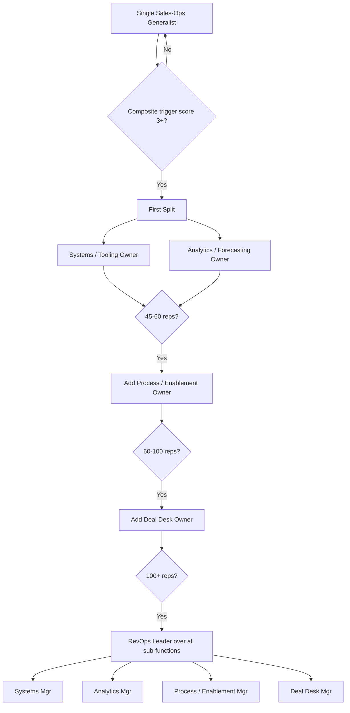

### Direct Answer

Your sales-ops function has outgrown a single contributor when one person can no longer hold the three jobs the role actually contains — systems administration, analytics and forecasting, and process and enablement design — at the depth each now demands. The hard triggers are concrete and observable: the team has crossed roughly 25-40 quota-carrying reps, ARR has passed the $15-25M mark, the CRM has accumulated more than two or three integrated tools that need ongoing governance, forecast accuracy has drifted below 85%, and your single ops contributor is working 55+ hour weeks while still missing deadlines. When three or more of those signals fire at once, you are no longer choosing whether to split the role — you are choosing how gracefully to do it before something breaks in a board meeting.

The split is not "hire another generalist." It is a deliberate decomposition into specialized roles — typically a **Systems/Tooling owner**, an **Analytics/Forecasting owner**, and (eventually) a **Process/Enablement owner** — sequenced over 9-18 months, with the first hire chosen to relieve whichever job is currently doing the most damage to the business.

> **TLDR**
> - A single sales-ops contributor is doing three jobs at once: systems, analytics, and process. The function outgrows them when no single human can keep all three at the depth the business needs.
> - **Quantitative triggers:** 25-40+ reps, $15-25M+ ARR, 3+ integrated tools, forecast accuracy below 85%, ops backlog older than 30 days, ops contributor at 55+ hours/week.
> - **Qualitative triggers:** leadership stops trusting the forecast, reps route around the system, "ask Sarah" becomes a single point of failure, and strategic projects never start because firefighting never stops.
> - **The first split** is almost always Systems vs. Analytics — separate the person who keeps the CRM alive from the person who tells leadership what the numbers mean.
> - **Sequencing:** Generalist → split into Systems + Analytics → add Process/Enablement → add Deal Desk → eventually a RevOps leader over all of it.
> - **Do not over-split.** Below ~20 reps or $10M ARR, a strong generalist plus fractional/contract help beats two junior specialists. Premature specialization creates coordination tax and seam failures.
> - **Cost of waiting:** the visible cost is a missed quarter; the invisible cost is 18 months of compounding data debt and a burned-out contributor who leaves and takes the institutional knowledge with them.

---

## 1. The Core Question: One Role, Three Jobs

### 1.1 Why "sales ops" is a misleading job title

The phrase "sales operations" describes a department, not a job. When a company hires its first sales-ops person, it hands one human a title that — at scale — belongs to three or four different people. That single contributor is simultaneously responsible for:

- **The systems job** — administering the CRM, owning integrations, building automations, managing data hygiene, provisioning licenses, and keeping the technical plumbing of revenue from leaking.
- **The analytics job** — building and running the forecast, producing pipeline analytics, defining metrics, instrumenting dashboards, and translating raw activity into decisions leadership can act on.
- **The process job** — designing the sales process, writing the rules of engagement, owning territory and quota mechanics, running enablement, and stewarding the deal-desk and approvals workflow.

For a 12-person sales team doing $6M in ARR, one capable generalist can hold all three. The jobs are shallow enough that context-switching between them is cheap, and the blast radius of any single mistake is small. The question this entry answers is precisely the moment that stops being true — when the depth required in each job exceeds what one person can supply, and the cost of context-switching exceeds the cost of an additional headcount.

### 1.2 The single-contributor lifecycle

Almost every B2B SaaS company moves through a predictable arc. Understanding where you are on it tells you how close you are to the split.

| Stage | Reps | ARR | Sales-ops shape | Dominant risk |
|---|---|---|---|---|
| **Founder-led** | 1-5 | < $2M | Founder or RevOps-curious AE moonlights | No instrumentation at all |
| **First hire** | 6-15 | $2M-$8M | One generalist sales-ops contributor | Generalist becomes a bottleneck |
| **Strain** | 16-30 | $8M-$20M | One overloaded generalist + contractors | Seams crack; forecast drifts |
| **First split** | 25-45 | $15M-$35M | Systems owner + Analytics owner | Coordination tax between the two |
| **Specialized team** | 45-100 | $35M-$80M | Systems + Analytics + Process + Deal Desk | Function-vs-function silos |
| **RevOps org** | 100+ | $80M+ | RevOps leader over sub-functions | Politics; ops-vs-ops turf |

The "Strain" stage is the danger zone. It is where most companies sit too long, because the single contributor is heroic enough to mask the problem — until they cannot. The entire purpose of reading the signals in this entry is to make the decision *during* Strain, not after a forecast miss forces it.

### 1.3 What "outgrown" actually means

A function has outgrown a single contributor when **the marginal hour of that contributor's time can no longer be allocated to the highest-value job.** In a healthy single-contributor setup, the ops person spends their morning on the forecast (high value), their afternoon on a process redesign (high value), and squeezes systems hygiene into the gaps. In an outgrown setup, systems firefighting consumes the whole day, the forecast gets done at 9 PM, and the process redesign never happens at all. The business is paying a senior salary and getting junior-priority output, because the urgent has permanently crowded out the important.

That is the real definition. Everything else in this entry — the numbers, the org charts, the hiring sequences — is just a way of detecting that condition early enough to act with intention rather than panic.

### 1.4 Why companies miss the moment

If the signs are this clear, why do so many companies miss the moment and split late? Three structural reasons:

- **The hero masks the problem.** A dedicated single contributor will work nights and weekends to keep all three jobs afloat. Their heroism is genuine and well-intentioned, but it functions as a painkiller — it suppresses the symptom (visible failure) without treating the disease (an overgrown role). Leadership sees a function that is "stretched but coping" right up until the contributor breaks.
- **Ops is invisible when it works.** Sales-ops is a function whose success looks like *nothing happening* — the forecast is right, the CRM works, the process runs. It only becomes visible when it fails. That asymmetry means leadership attention arrives only after the damage, never before it.
- **The budget conversation is uncomfortable.** Adding a head to a "support" function is a harder sell than adding a quota-carrying rep, because the rep has an obvious revenue number attached and the ops hire does not. CROs under pressure to show pipeline coverage will fund the rep and defer the ops hire — even when the ops hire would protect every rep's productivity.

Recognizing these three forces is itself part of the answer: the split decision must be made *deliberately and on a schedule*, against the trigger framework below, precisely because the organic signals all arrive too late.

---

## 2. Banner: The Quantitative Triggers

### 2.1 Headcount thresholds

Rep count is the crudest but most reliable proxy, because every additional rep adds linear load to all three jobs at once: another CRM user to support, another data source for the forecast, another person who needs the process explained.

| Rep count | Sales-ops load | Recommended structure |
|---|---|---|
| **1-15 reps** | One generalist is correct and efficient | 1 generalist sales-ops contributor |
| **16-24 reps** | Generalist strained; add contract/fractional help | 1 generalist + fractional analyst or RevOps consultant |
| **25-40 reps** | Split is due — first specialization | 2 specialists: Systems + Analytics |
| **40-60 reps** | Add a third specialist | 3 specialists: + Process/Enablement |
| **60-100 reps** | Deal desk becomes its own role | 4-5 specialists + emerging leadership layer |
| **100+ reps** | Full RevOps org with a leader | RevOps leader + sub-function managers |

The 25-40 band is wide on purpose. A team of 25 high-velocity SMB reps closing 40 deals a month each generates far more transactional load than 35 enterprise reps closing two deals a quarter. Use the band as a prompt to *look*, not as a hard line.

### 2.2 ARR and deal-volume thresholds

ARR is a better trigger than rep count for complexity, because it correlates with deal sophistication, contract variety, and the number of executives who depend on the forecast.

- **Below $10M ARR** — A single contributor is almost always right. Splitting here is premature.
- **$10M-$15M ARR** — The watch zone. Begin planning the split; start writing the job descriptions.
- **$15M-$25M ARR** — The action zone. If you have not split by $25M, you are accumulating debt.
- **Above $25M ARR** — A single contributor here is a red flag in diligence. Investors and acquirers read it as under-investment in revenue infrastructure.

Deal volume matters independently. A useful rule of thumb: when the company processes **more than ~150-200 closed-won deals per quarter**, the systems and deal-desk load alone justifies a dedicated owner, regardless of ARR.

### 2.3 The tooling-sprawl trigger

Every integrated tool in the revenue stack is a permanent maintenance liability — it needs governance, field mapping, sync monitoring, and version-upgrade handling. The number of integrated tools is one of the cleanest split signals.

| Stack size | Examples | Governance load |
|---|---|---|
| **1-2 tools** | CRM + email/sequencer | Trivial; generalist absorbs it |
| **3-4 tools** | + CPQ, + conversation intelligence | Material; consumes ~1 day/week |
| **5-7 tools** | + enrichment, + forecasting, + CS platform | Heavy; needs a dedicated systems owner |
| **8+ tools** | + attribution, + CDP, + enablement, + commissions | A full-time systems job by itself |

A common pattern: a company adds Salesforce (CRM), then Outreach or Salesloft (sequencing), then a CPQ tool, then Gong (conversation intelligence), then Clari (forecasting), then ZoomInfo (enrichment). That is six integrated systems — and the generalist who set them all up is now spending 60% of their week just keeping the syncs alive. The analytics and process jobs have effectively stopped.

### 2.4 The forecast-accuracy trigger

This is the single most important quantitative signal, because the forecast is the output leadership most directly depends on.

- **Healthy:** quarterly forecast within ±5-10% of actual, called by week 3 of the quarter.
- **Warning:** accuracy drifts to ±10-15%; the forecast is "directionally right."
- **Outgrown:** accuracy worse than ±15%, or the forecast is consistently late, or leadership has started maintaining a private "real number" spreadsheet alongside the official CRM forecast.

That last symptom — a shadow forecast — is the definitive tell. It means the org has institutionally concluded the single contributor cannot be trusted to produce a reliable number, usually not because they lack skill but because they lack *time*. The analytics job needs an owner.

### 2.5 The backlog-age and hours trigger

Two final operational metrics:

- **Backlog age** — Track the oldest open request in the sales-ops queue. When the oldest ticket is **more than 30 days old** and there is no realistic path to closing it, the function is structurally under-resourced.
- **Contributor hours** — A single ops contributor working **55+ hours per week for more than one quarter** is not a sign of dedication; it is a sign the role contains more than one job. Heroics are not a staffing strategy. They are a countdown timer to a resignation.

### 2.6 The composite trigger score

No single number forces the decision. Use a simple count. Score one point for each true statement:

| # | Trigger statement | Point |
|---|---|---|
| 1 | More than 25 quota-carrying reps | ☐ |
| 2 | ARR above $15M | ☐ |
| 3 | Three or more integrated revenue tools | ☐ |
| 4 | Forecast accuracy worse than ±15% (or a shadow forecast exists) | ☐ |
| 5 | Oldest ops backlog ticket older than 30 days | ☐ |
| 6 | Ops contributor at 55+ hours/week for a full quarter | ☐ |
| 7 | A strategic ops project has been "next quarter" for two+ quarters | ☐ |

**Score 0-2:** A strong generalist is fine. Add fractional help if needed.
**Score 3-4:** Start planning the split now. Write the JDs; begin recruiting.
**Score 5-7:** You are already late. Split immediately; expect to have lost some institutional ground.

### 2.7 Why a count beats a single metric

It is tempting to look for the one number that triggers the split — "split at exactly 30 reps" or "split at exactly $20M ARR." Resist that. No single metric is reliable, because the same headline number describes very different realities. Thirty SMB reps and thirty enterprise reps are different jobs. Twenty million ARR from 4,000 small accounts and twenty million from 40 large accounts are different operational loads. A composite score is robust precisely because it requires *multiple independent signals* to agree before it fires. When five of seven triggers are true, you can be confident the strain is real and structural, not an artifact of one noisy measurement. The score is also a communication tool: a CRO presenting "we score 5 of 7 on the standard ops-overgrowth triggers" to a CFO is far more persuasive than "it feels like Sarah is busy."

### 2.8 The benchmark ratio

A final calibration check: the headcount ratio of ops-to-reps. Industry benchmarking (Bridge Group, RevOps Co-op, and OpenView data) consistently lands a healthy mid-market SaaS ratio at roughly **one sales-ops person per 12-20 quota-carrying reps**, trending toward the richer end of that range as deal complexity rises. If your single contributor is supporting 30+ reps alone, you are running at half the benchmark coverage — a quantitative confirmation that the function is under-staffed before you even count triggers. Use the ratio as a sanity check on the composite score, not as a standalone trigger; ratios vary enough by motion that they are a supporting argument, not a verdict.

---

## 3. Banner: The Qualitative Triggers

### 3.1 Leadership stops trusting the number

Quantitative triggers tell you the function is mechanically strained. Qualitative triggers tell you the strain has already started to cost the business — and they often fire *before* the metrics fully degrade. The first qualitative tell is a change in how leadership talks about the forecast. The phrases to listen for in a leadership meeting:

- "Let me check my own numbers before I commit to that."
- "I don't think the CRM number is right — let me ask the reps directly."
- "Can someone *outside* of ops sanity-check this?"

When the CRO or CEO begins routinely auditing the ops contributor's output rather than consuming it, the trust contract has broken. That is not a performance problem with the individual. It is a capacity problem with the role.

### 3.2 Reps route around the system

The second qualitative tell is on the rep side. Reps are ruthless utility-maximizers; if the system serves them, they use it, and if it does not, they build shadow systems. Watch for:

- Reps maintaining personal pipeline spreadsheets they trust more than the CRM.
- Deal updates that only appear in the CRM the night before a forecast call (so-called "Thursday-night data").
- Reps Slacking the ops contributor directly for things the system should answer ("hey, what's my attainment?").
- A manager who runs their team's pipeline review off an export they personally clean every week.

Each of these is a vote of no confidence in the systems and process jobs — usually because the single contributor has not had the hours to make those systems trustworthy.

### 3.3 The "ask Sarah" single point of failure

Name a real or hypothetical ops contributor — call them Sarah. The function has outgrown a single contributor when **"ask Sarah" has become the documented process.** Symptoms:

- When Sarah takes a one-week vacation, forecast and reporting effectively pause.
- Critical knowledge — why a certain automation exists, how the territory logic works, which fields are load-bearing — lives only in Sarah's head.
- Onboarding a new rep requires a live session with Sarah because nothing is written down.

This is a key-person risk that scales with the company. The larger the revenue org, the more catastrophic Sarah's eventual departure becomes — and overloaded single contributors leave at high rates, precisely because the role is unsustainable.

### 3.4 Strategic work never starts

The most expensive qualitative signal is the quietest one: the strategic project that is permanently "next quarter." Territory redesign, a quota model overhaul, a lead-routing rebuild, a data-quality initiative — these are the high-leverage projects that compound. In an outgrown function they never begin, because the single contributor's entire week is consumed by reactive firefighting. There is no metric for "the redesign we never did." But it is often the single largest hidden cost of waiting too long to split.

### 3.5 Quality of strategic input collapses

Early in a single contributor's tenure, they are a thought partner to the CRO — bringing analysis, proposing process changes, flagging risks. As the role overloads, their contribution narrows to status updates and ticket completion. When your sales-ops person has gone from *advising* leadership to *serving* leadership, the function has lost its strategic half. That half needs its own owner.

### 3.6 The qualitative-trigger summary

| Signal | What it sounds like | Which job is starved |
|---|---|---|
| Leadership audits the forecast | "Let me check my own numbers" | Analytics |
| Reps build shadow systems | Personal spreadsheets, Thursday-night data | Systems + Process |
| "Ask Sarah" is the process | Knowledge lives in one head | All three (key-person risk) |
| Strategic work never starts | "We'll do the territory redesign next quarter" | Process |
| Strategic input collapses | Ops gives status, not analysis | Analytics + Process |

When three or more of these are true, the qualitative case for the split is made — even if a metric or two has not yet crossed its line.

### 3.7 Why qualitative signals fire first

There is a reason the qualitative triggers in this section often precede the quantitative ones in section 2: humans adapt to degradation before instruments record it. A CRO starts quietly double-checking the forecast the *first* quarter it feels soft — well before forecast accuracy has statistically degraded to ±15% over a measured window. Reps start a personal spreadsheet the first time the CRM embarrasses them in a pipeline review, not after a formal data-quality audit. The qualitative signals are, in effect, a leading indicator built out of the judgment of the people closest to the function. That is exactly why a wise leader weights them heavily: by the time the metrics confirm the problem, you have already lost two or three quarters that the qualitative signals would have flagged. The discipline is to *believe the humans* — to treat "the CRO no longer trusts the number" as a hard trigger in its own right, not as a soft anecdote awaiting metric confirmation.

### 3.8 Distinguishing capacity strain from competence problems

One caution before acting on qualitative signals: they can also be produced by a contributor who is genuinely under-skilled rather than genuinely over-loaded. The diagnostic question is whether the *quality* of work is bad even when the *volume* is low. Watch the contributor during a quiet week. If, given slack, they produce excellent forecasts and thoughtful analysis, the problem is capacity — split the role. If, even with time, the output is weak, the problem is fit — and the answer is a stronger hire, not a bigger team. Splitting the role around an under-skilled generalist simply produces two under-skilled specialists. Section 6.2 returns to this; it is the single most important counter-case to get right.

---

## 4. Banner: Decomposing the Role — What the Specialists Actually Do

### 4.1 The Systems / Tooling specialist

This is almost always the first role to peel off, because systems work is the most concrete, the most measurable, and the most relentlessly interrupt-driven.

**Owns:** CRM administration and configuration; integration architecture and sync health; automation and workflow building; data hygiene and deduplication; license and access management; security and permission models; tool evaluation and vendor management; release management for stack upgrades.

**Profile:** Detail-oriented, technically deep, comfortable in Salesforce Flow / Apex-adjacent configuration, often holds admin certifications. Thinks in objects, fields, and triggers. Energized by building something that works rather than by presenting to executives.

**Success metric:** System uptime and data quality — sync error rate, duplicate rate, field-completion rate, ticket-resolution time.

### 4.2 The Analytics / Forecasting specialist

The second role, and the one that most directly restores leadership's trust in the number.

**Owns:** The forecast model and forecast calls; pipeline analytics and conversion analysis; metric definitions and the metrics dictionary; dashboards and executive reporting; board-deck revenue narratives; scenario modeling and capacity planning; win/loss analysis.

**Profile:** Analytically rigorous, fluent in SQL and spreadsheet modeling, often from a finance, FP&A, or strategy/consulting background. Thinks in cohorts, conversion rates, and confidence intervals. Energized by turning ambiguity into a defensible number and presenting it to leadership.

**Success metric:** Forecast accuracy and decision speed — variance to actual, time-to-forecast, leadership confidence (measurable via whether shadow forecasts exist).

### 4.3 The Process / Enablement specialist

The third role, typically added at 40-60 reps.

**Owns:** Sales process and methodology design; rules of engagement; territory and quota design; the deal-desk and approval workflow; onboarding and ongoing enablement; the sales playbook; cross-functional process (marketing handoff, CS handoff).

**Profile:** Strong communicator, often a former AE or sales manager, deeply credible with the field. Thinks in stages, exit criteria, and behavior change. Energized by making reps measurably better.

**Success metric:** Rep productivity and process adherence — ramp time, win rate, stage-conversion consistency, methodology adoption.

### 4.4 Why these three, in this order

The decomposition follows the natural fault lines of the work:

| Job | Cadence | Skill center | Interrupt level | Typical split order |
|---|---|---|---|---|
| Systems | Continuous / reactive | Technical configuration | Very high | 1st |
| Analytics | Cyclical (weekly/quarterly) | Quantitative modeling | Medium | 2nd |
| Process | Project-based | Communication / change mgmt | Low | 3rd |

Systems splits first because its high-interrupt nature is what destroys the generalist's ability to do deep analytical or process work. Removing the interrupt-driven job frees the remaining person to be a real analyst. Process splits last because, until rep count is high enough, the generalist-turned-analyst can usually still carry the project-based process work in the gaps.

### 4.5 The Mermaid view of the decomposition

The diagram makes the central point visible: the split is not one event, it is a staged sequence gated by trigger scores and rep-count milestones. Each gate should be a deliberate decision, not a reaction to a crisis.

### 4.6 The fourth job — Deal Desk — and when it emerges

The three-job decomposition (systems, analytics, process) is the right model for the first and second splits. But a fourth job hides inside the "process" bucket and eventually demands its own owner: the **deal desk.** Deal-desk work is the operational handling of individual non-standard deals — pricing approvals, discount governance, contract-term exceptions, multi-year structuring, and the quote-to-cash handoff to finance and legal. In a small company this is a handful of Slack approvals a week, easily absorbed by the process owner. But as enterprise deal volume rises — particularly past ~60 reps or in a motion with heavy customization — the deal desk becomes a continuous, judgment-heavy, deadline-driven job of its own. It bleeds because, like systems work, it is interrupt-driven and cannot be deferred: a deal needs its approval *today* or it slips the quarter. When the process owner is being pulled out of strategic work every afternoon to adjudicate discount requests, the deal desk has earned its own role. This is typically the *fourth* hire, after systems, analytics, and process.

### 4.7 The enablement question — own it or partner it

A recurring org-design debate is whether sales enablement belongs inside the ops function at all. There are two defensible models. In the **integrated model**, enablement sits with the Process/Enablement owner inside RevOps — the advantage is tight coupling between process design and the training that drives process adoption. In the **separate model**, enablement is its own function reporting to the CRO, and RevOps focuses purely on systems, analytics, and deal desk — the advantage is that enablement gets dedicated leadership attention and is not the perpetual low-priority afterthought it becomes when bolted onto an analytics-heavy ops role. There is no universally correct answer; the integrated model is more common below ~80 reps, and the separate model becomes more common above it. What matters is that the choice is *made explicitly* rather than allowed to default — an un-owned enablement function is one of the most common quiet failures of a scaling revenue org.

---

## 5. Banner: How to Sequence the Split

### 5.1 Step one — diagnose which job is bleeding

Before writing any job description, run the composite trigger score from section 2.6 *and* the qualitative checklist from section 3.6. Then answer one question: **which of the three jobs is currently doing the most damage to the business?**

- If the forecast is wrong and leadership has a shadow spreadsheet — the **analytics** job is bleeding.
- If the CRM is a mess, syncs break, and reps don't trust the data — the **systems** job is bleeding.
- If reps ramp slowly and the process is inconsistent — the **process** job is bleeding.

You hire to stop the bleeding first. The "default" first split is Systems vs. Analytics, but the *order in which you fill those two roles* should be driven by the diagnosis.

### 5.2 Step two — decide build vs. buy for the existing contributor

Your current generalist is an asset, not a problem. The most important early decision is which of the new specialist roles they slot into.

| Generalist's strength | Best landing role | What you hire for |
|---|---|---|
| Technically deep, loves the CRM | Systems / Tooling owner | Hire an Analytics specialist |
| Strong with numbers and leadership | Analytics / Forecasting owner | Hire a Systems specialist |
| Field-credible, great communicator | Process / Enablement owner | Hire both Systems and Analytics |
| Genuine generalist, strong at all three | RevOps leader (player-coach) | Hire specialists beneath them |

Forcing a deeply technical generalist to become a forecast-presenting analyst — or vice versa — is a common, expensive mistake. Let them do the half of the job they love and are great at.

### 5.3 Step three — sequence the hires over 9-18 months

A realistic timeline for a company crossing the strain threshold:

| Month | Action | Outcome |
|---|---|---|
| **0-1** | Run trigger score; decide build/buy for generalist; write JDs | Clear plan; generalist's future role decided |
| **1-3** | Hire first specialist (the bleeding job); generalist moves to their role | Two-person team; bleeding job stabilizes |
| **3-6** | Two specialists establish ownership boundaries and a shared cadence | Coordination tax minimized; seams defined |
| **6-9** | Stabilize; backlog cleared; strategic projects restart | Function back to proactive |
| **9-15** | If rep count crosses ~45, add Process/Enablement owner | Three-person team |
| **12-18** | Evaluate Deal Desk as a discrete role; identify a future leader | Team scaled with revenue |

The cardinal rule: **hire one specialist at a time and let them land before adding the next.** Hiring two strangers into a brand-new structure simultaneously creates a coordination problem with no anchor.

### 5.4 Step four — define ownership boundaries explicitly

The single biggest failure mode of a freshly split function is the seam — work that falls between two owners because nobody was told it was theirs. Write an explicit RACI before the second person starts.

| Work item | Systems owner | Analytics owner | Process owner |
|---|---|---|---|
| CRM field changes | **R/A** | C | C |
| Forecast model | C | **R/A** | I |
| Dashboard build | **R** (build) | **A** (define) | I |
| Quota / territory design | C | C | **R/A** |
| Data hygiene rules | **R/A** | C | I |
| Lead-routing logic | **R/A** | I | **C** |
| Deal-desk approvals | C | I | **R/A** |
| Metric definitions | I | **R/A** | C |
| Tool selection | **R/A** | C | C |
| Onboarding curriculum | C | I | **R/A** |

R = Responsible, A = Accountable, C = Consulted, I = Informed. The dashboards row is the classic seam: the analytics owner *defines* what a dashboard must show; the systems owner *builds* it. Write that down, or it will be argued about every week.

### 5.5 Step five — establish a shared operating cadence

Two specialists need a connective tissue, or they drift into silos. Minimum cadence:

- **Weekly ops sync (30 min)** — shared backlog review, seam-issue resolution, upcoming-change coordination.
- **Weekly forecast prep** — systems owner ensures data is clean by a hard cutoff; analytics owner builds the call on top of it.
- **Monthly retro** — what broke, what fell in the seam, what to re-document.
- **Quarterly planning** — joint review of trigger scores to decide if the next split is due.

### 5.6 Step six — install a reporting structure

Where the split function reports matters. Common patterns:

| Reporting line | Works when | Risk |
|---|---|---|
| Both report to CRO | Sales is the dominant GTM motion | Ops becomes sales-myopic |
| Both report to a RevOps lead | Company has full-funnel RevOps | Requires the leader to already exist |
| Systems to RevOps/IT, Analytics to CRO | Strong analytical-to-leadership need | Systems can feel disconnected from revenue |
| Both to a Chief of Staff / Finance | Early-stage, finance-driven culture | Process job tends to get orphaned |

For most companies making the *first* split, both specialists reporting to the CRO (or VP Sales) is the simplest correct answer — with the explicit understanding that a RevOps leadership layer will be added later.

---

## 6. Banner: The Counter-Case — When NOT to Split

### 6.1 You are below the real thresholds

The most common mistake is not splitting too late — it is splitting too early because a competitor or a thought-leadership post said you should. **Do not split if you have fewer than ~20 reps and less than ~$10M ARR.** At that scale, a single strong generalist is not just adequate; they are *superior* to two specialists, because the coordination tax of two roles exceeds the depth benefit. A generalist who can see all three jobs at once catches cross-job problems a siloed pair would miss.

### 6.2 Your strain is a hiring problem, not a structure problem

Sometimes the function looks overgrown but the real issue is that you hired the wrong single contributor. A junior admin promoted into a strategic ops role will drown at 15 reps — but that does not mean the role needs splitting. It means you need a stronger generalist. Before splitting, honestly assess: would a genuinely senior, experienced sales-ops generalist handle this load? If yes, the answer is a better hire, not a bigger team.

### 6.3 Your strain is a tooling problem, not a headcount problem

A single contributor can be buried by a badly architected stack — eight tools duct-taped together with brittle integrations. The fix there may be *consolidating the stack* (or buying a better-integrated platform) rather than hiring a systems specialist to babysit the mess. Removing three redundant tools can give a generalist their week back. Do the stack audit before you do the org-chart audit.

### 6.4 You can solve the spike with fractional or contract help

If the strain is concentrated and temporary — a CRM migration, an end-of-year comp-plan rebuild, a one-time territory carve — that is a *project*, not a permanent role. Hiring a full-time specialist to absorb a six-week spike leaves you over-staffed for the other 46 weeks. Fractional RevOps firms, contract Salesforce admins, and implementation partners exist precisely for this. Use them in the 16-24 rep "watch zone" to bridge to the real split.

### 6.5 A reorg is already imminent

If the company is about to be acquired, about to pivot its GTM motion (e.g., SMB to enterprise), or about to undergo a leadership change at the CRO level, **freeze the org design.** Splitting the ops function right before a structural shock means you will likely re-split it within two quarters. Stabilize with contractors and split after the dust settles.

### 6.6 The counter-case summary

| Situation | Looks like | Real fix |
|---|---|---|
| Below scale | Ops person seems busy | Wait; add fractional help if needed |
| Wrong hire | Junior admin overwhelmed at 15 reps | Hire a senior generalist |
| Bad stack | 8 tools, constant sync fires | Consolidate the stack first |
| Temporary spike | Crunch around a migration | Contract/fractional, not FTE |
| Imminent reorg | M&A or GTM pivot pending | Freeze; split after the shock |

The discipline here is symmetrical with the discipline in section 2: just as waiting too long accumulates debt, splitting too early accumulates coordination tax and seam failures. The goal is to split *at* the threshold, not before it and not after it.

---

## 7. Banner: The Cost of Getting the Timing Wrong

### 7.1 The cost of splitting too late

Waiting too long is the more common and more expensive error. Its costs compound:

- **Data debt** — Every quarter an overloaded systems job goes un-owned, the CRM accumulates duplicate records, stale fields, and broken automations. Cleaning 18 months of accumulated debt can be a full quarter of work.
- **Forecast erosion** — Once leadership stops trusting the number, rebuilding that trust takes several consecutive accurate quarters. The reputational damage outlasts the staffing fix.
- **The strategic gap** — The territory redesign you never did, the quota model you never modernized — these are invisible on the P&L but show up as a slow, structural drag on win rate and rep productivity.
- **Attrition** — The single contributor working 55-hour weeks eventually leaves. They take the institutional knowledge with them, and now you are hiring *two* people into a function with no documentation and no continuity.

### 7.2 The cost of splitting too early

Splitting before the thresholds carries its own bill:

- **Coordination tax** — Two people now spend time syncing, negotiating seams, and avoiding duplicated work — overhead a generalist did not have.
- **Seam failures** — Work falls between owners. The thing "everyone thought the other person had" goes undone.
- **Under-utilization** — Two specialists at 60% load each cost more than one generalist at 95% load and deliver less total throughput.
- **Career-path mismatch** — A specialist hired too early into a too-small company has nowhere to grow and leaves within a year.

### 7.3 The asymmetry

The two errors are not equally bad. Splitting slightly early costs you some coordination tax for a quarter or two until the company grows into the structure. Splitting badly late costs you a forecast miss, a burned-out resignation, and a quarter of debt cleanup. **When genuinely uncertain and sitting at a trigger score of 3-4, lean toward acting.** The downside of early is recoverable; the downside of late often is not.

| Dimension | Split too early | Split too late |
|---|---|---|
| Primary cost | Coordination tax | Data debt + forecast miss |
| Reversibility | High — grow into it | Low — debt compounds |
| Visibility | Obvious immediately | Hidden until a crisis |
| People impact | Specialist may leave (replaceable) | Generalist burns out (knowledge loss) |
| Recommended bias | Acceptable risk at score 3+ | Unacceptable risk at score 5+ |

---

## 8. Banner: Operationalizing the Decision

### 8.1 The 30-day diagnostic

If you suspect the function is outgrown, run a structured 30-day diagnostic before committing budget:

1. **Week 1 — Time audit.** Have the single contributor log every hour by job category (systems / analytics / process / firefighting) for one week. The split between deep work and firefighting is the headline number.
2. **Week 2 — Backlog audit.** Catalog every open request, tag it by job and age, and identify the oldest. Anything older than 30 days is structural under-resourcing.
3. **Week 3 — Stakeholder interviews.** Ask the CRO, two sales managers, and three reps: do you trust the forecast? do you trust the CRM data? what do you wish ops did that it does not?
4. **Week 4 — Synthesize and score.** Run the composite trigger score and the qualitative checklist. Produce a one-page recommendation.

### 8.2 The business case for the budget

To get the headcount approved, frame the cost of *not* splitting in the language of the CFO:

| Cost line | How to quantify |
|---|---|
| Forecast risk | Probability-weighted cost of a missed quarter the board was not warned about |
| Rep productivity drag | Slow ramp × number of reps onboarding this year × fully-loaded rep cost |
| Attrition risk | Cost to backfill the single contributor + the cost of lost institutional knowledge |
| Strategic opportunity cost | Value of the territory/quota redesign that has not happened |
| Stack waste | Annual spend on tools that are under-utilized because nobody governs them |

A specialist hire is typically a $120K-$180K fully-loaded cost. If the diagnostic shows that a single missed-and-unwarned quarter, plus slow ramp across a dozen new reps, plus a likely resignation, sums to materially more than that — the business case writes itself.

### 8.3 The first 90 days of the new structure

| Phase | Days | Focus |
|---|---|---|
| **Land** | 0-30 | New specialist onboards; RACI ratified; cadence installed |
| **Stabilize** | 30-60 | Backlog triaged; the bleeding job is demonstrably under control |
| **Restart strategy** | 60-90 | First strategic project (deferred for quarters) finally kicks off |

The 60-90 day marker is the proof point. If a real strategic project has *started* by day 90, the split worked. If both specialists are still purely firefighting, you either under-hired (need another role sooner than planned) or hired the wrong profile.

### 8.4 Naming convention and titles

Title the roles for clarity and future scalability. A common, durable convention:

- **Sales-Ops Generalist** → **Revenue Operations Analyst** (analytics) or **Salesforce / Revenue Systems Administrator** (systems).
- Next layer: **RevOps Manager, Systems** / **RevOps Manager, Analytics** / **RevOps Manager, Enablement**.
- Leadership layer: **Director / VP, Revenue Operations.**

Using "Revenue Operations" rather than "Sales Operations" from the first split signals — internally and to future hires — that the function will eventually span the full funnel, not just sales.

---

## 9. Banner: Worked Examples

### 9.1 Example — the textbook split

A vertical-SaaS company hits 28 reps and $19M ARR. The CRO notices she has started keeping her own forecast spreadsheet (shadow forecast — analytics job bleeding). Trigger score: 5 of 7. The single contributor, technically strong and CRM-obsessed, is a poor fit for executive forecast presentations. Decision: the generalist becomes the Systems owner; the company hires an FP&A-background Analytics owner to relieve the bleeding job first. Within two quarters the shadow forecast disappears, forecast accuracy returns to ±7%, and the long-deferred territory redesign begins. Textbook execution.

### 9.2 Example — the premature split

A 14-rep, $7M-ARR company reads a popular RevOps newsletter and hires two specialists. Within six months both are at 50% utilization, they spend more time coordinating than producing, and the systems specialist — bored and with no growth path — resigns. The company quietly re-merges the role under one person. Lesson: scale, not aspiration, drives the split. They were three years early.

### 9.3 Example — the misdiagnosed split

A 22-rep company is convinced it needs to split because the ops contributor is buried. A 30-day diagnostic reveals the real problem: nine integrated tools, four of them redundant, generating constant sync fires. The fix was a stack consolidation that eliminated three tools and a brittle middleware layer. The generalist got 14 hours a week back. No split needed for another 18 months. Lesson: audit the stack before the org chart.

### 9.4 The decision recap

| If you see... | Do this |
|---|---|
| Score 0-2, < 20 reps | Keep the generalist; maybe add fractional help |
| Score 3-4, 20-30 reps | Plan the split; write JDs; recruit |
| Score 5+, 25+ reps, shadow forecast | Split now; hire the bleeding job first |
| Strain but bad stack | Consolidate tools first |
| Strain but junior hire | Upgrade to a senior generalist |
| Strain but reorg pending | Freeze; bridge with contractors |

---

## 10. Banner: Industry and Motion-Specific Variations

### 10.1 The split looks different by GTM motion

The thresholds in section 2 are calibrated for a "typical" mid-market B2B SaaS company. But the *shape* of the load — and therefore which job bleeds first — varies dramatically by go-to-market motion. A single contributor at 30 reps in a high-velocity SMB business and a single contributor at 30 reps in an enterprise business are doing genuinely different jobs, and they will hit the split at different times for different reasons.

| Motion | Deal volume | Dominant load | Job that bleeds first | Adjusted split threshold |
|---|---|---|---|---|
| **High-velocity SMB / self-serve** | Very high (hundreds/quarter) | Systems + automation throughput | Systems | Earlier — ~20 reps |
| **Mid-market** | Moderate | Balanced across all three | Analytics or Systems | Standard — 25-40 reps |
| **Enterprise / strategic** | Low (handful/quarter) | Deal desk + forecast complexity | Analytics / Process | Later on rep count, but ARR-driven |
| **Product-led growth (PLG)** | Massive signups, low touch | Data engineering + product analytics | Systems / Analytics blur | Driven by data volume, not reps |
| **Channel / partner-led** | Variable | Partner systems + attribution | Systems | Mid — partner data adds load |

### 10.2 High-velocity SMB

In a high-velocity SMB motion, reps may close 30-50 deals a month each. The transactional load on the CRM, the sequencer, and the routing engine is enormous, and a single missed automation can silently lose dozens of leads a week. Here the **systems job bleeds first and bleeds hard** — often before rep count reaches 20. The split signal is less "the forecast is wrong" and more "lead-to-rep routing is dropping records and nobody has time to fix it." The first specialist hire in an SMB motion is almost always a systems/automation owner, and the analytics job can ride with a generalist longer because individual deals are small and the forecast is a law-of-large-numbers exercise rather than a deal-by-deal judgment call.

### 10.3 Enterprise and strategic motion

In an enterprise motion, a rep may carry only 6-12 deals a year, each worth six or seven figures. Transactional CRM load is light — but each deal is a complex, multi-stakeholder, heavily-customized contract. Here the **deal-desk and forecast-judgment load bleeds first.** A single contributor can administer the CRM for 35 enterprise reps without much strain, but cannot simultaneously run a defensible deal-by-deal forecast, manage a complex approval matrix for non-standard terms, and design enterprise territory coverage. The enterprise split is often driven by ARR and deal complexity well before rep count would suggest it — a 20-rep enterprise team at $40M ARR may need the split more urgently than a 35-rep SMB team at $18M.

### 10.4 Product-led growth

PLG breaks the rep-count proxy entirely. A PLG company may have only 10 sales reps (working expansion and enterprise upsell) but millions of self-serve users generating an ocean of product-usage data. The "sales-ops" function here is really a revenue-data function, and it bleeds on **data engineering and product analytics** long before it bleeds on CRM administration. The first split in a PLG company is frequently an analytics/data specialist who can model conversion from free to paid, not a CRM admin. Read rep count as almost irrelevant; read data volume and the number of conversion surfaces instead.

### 10.5 The motion-adjusted rule

The universal principle survives all of this variation: **decompose the role into systems, analytics, and process; diagnose which is bleeding; hire that one first.** What changes by motion is only *which* job bleeds first and *at what scale*. Do not import another company's split timeline. Run your own diagnostic against your own motion.

---

## 11. Banner: Common Failure Modes After the Split

### 11.1 The silo trap

The most common post-split failure is that the two new specialists, relieved of each other's interruptions, retreat into their own domains and stop talking. The systems owner optimizes the CRM in ways that quietly break the analytics owner's reports; the analytics owner defines metrics the systems owner cannot instrument. The cure is the shared cadence in section 5.5 and the RACI in section 5.4 — but it also requires a manager who actively rewards cross-seam collaboration rather than within-silo heroics.

### 11.2 The two-junior-hires trap

A budget-constrained company splits the role but can only afford two junior people instead of one senior generalist plus one specialist. Two juniors with no senior to set standards will produce two mediocre halves of a function and a great deal of rework. If the budget only supports junior talent, it is often better to keep one senior generalist and add a junior *assistant* beneath them than to split into two juniors of equal rank.

### 11.3 The orphaned-process trap

When the first split is Systems + Analytics, the process job is — by design — left with whoever is the better fit, usually the analytics owner, as a part-time responsibility. The trap is that process work, being project-based and never urgent, gets permanently deprioritized by an analytics owner consumed with weekly forecast cycles. The territory redesign is *still* not happening; it just moved desks. Guard against this by explicitly time-boxing process work — e.g., "the analytics owner spends every Friday on process projects" — until the dedicated Process owner is hired.

### 11.4 The title-inflation trap

In the rush to hire, companies sometimes give the new specialist an inflated title ("Director of Revenue Operations") to win a competitive offer. Two quarters later, when the company is ready to hire an actual RevOps leader, the org chart has a "Director" who is really an individual contributor, and there is nowhere to slot the real leader without a demotion-shaped conflict. Title to the *current* scope, with an honest conversation about the future leadership layer.

### 11.5 The no-documentation trap

The split was supposed to reduce key-person risk. But if each specialist simply becomes the new single point of failure for *their* domain, the risk has been halved in count but not eliminated in kind. Make documentation a named deliverable in the first 90 days for each specialist — a systems runbook, a metrics dictionary, a process playbook — so the function's knowledge lives in artifacts, not in two heads instead of one.

### 11.6 The failure-mode summary

| Failure mode | Early symptom | Prevention |
|---|---|---|
| Silo trap | Specialists stop attending the joint sync | Enforced cadence + cross-seam incentives |
| Two-junior trap | Constant rework; no standards | Keep a senior generalist over a junior assistant |
| Orphaned process | Strategic projects still don't start | Time-box process work explicitly |
| Title inflation | "Director" who is really an IC | Title to current scope |
| No documentation | Each specialist is a new SPOF | Documentation as a named 90-day deliverable |

---

## 12. Banner: Measuring Whether the Split Worked

### 12.1 Leading indicators (first 90 days)

You should not wait two quarters to know whether the split was the right call. Leading indicators show up fast:

- **Backlog age falls.** The oldest open ticket should drop below 30 days within the first 60 days.
- **Forecast-prep time falls.** The analytics owner should be producing the forecast call faster and earlier in the week.
- **Firefighting share falls.** Re-run the week-1 time audit at day 75; the firefighting percentage should be visibly lower.
- **A strategic project starts.** The single clearest proof: a long-deferred project has actually kicked off.

### 12.2 Lagging indicators (quarters 2-4)

| Metric | Baseline (single contributor, strained) | Target (post-split, healthy) |
|---|---|---|
| Forecast accuracy | Worse than ±15% | Within ±5-10% |
| Time-to-forecast | Week 3-4 of quarter, often late | Week 1-2, reliably |
| Shadow forecasts | Leadership keeps private numbers | None — official number is trusted |
| Oldest backlog ticket | 30+ days | < 14 days |
| Rep ramp time | Slow / inconsistent | Faster and more consistent |
| Ops-contributor hours | 55+ / week | Sustainable 40-45 / week |
| Strategic projects shipped/quarter | ~0 | 1-2 |

### 12.3 The trust survey

The softest but most important measure is whether leadership and the field trust the function again. Re-run the section 8.1 stakeholder interviews two quarters after the split. The single question that matters: *"Do you trust the number that comes out of the CRM?"* If the CRO, the sales managers, and a sample of reps all say yes — and the shadow spreadsheets have disappeared — the split worked, regardless of what any individual metric says.

### 12.4 When the split did not work

If, at the two-quarter mark, both specialists are still purely reactive and no strategic work has started, the split did not fix the problem. The likely causes, in order of probability:

1. **You under-hired** — the load needed three roles, not two; the next split is already due.
2. **Wrong profile** — a specialist's skills do not match their job (e.g., a systems person in the analytics seat).
3. **Bad stack** — the systems job is unwinnable until the tool sprawl is consolidated (revisit section 6.3).
4. **Demand outran the plan** — the company grew faster than the 9-18 month sequence assumed.

In every case, the fix is to re-run the diagnostic, not to conclude that "ops just can't keep up." Ops keeping up is a structural design problem with structural solutions.

---

## 13. Cross-Links and Sources

### 13.1 Related library entries

For a complete picture of scaling a revenue operations function, read this entry alongside its siblings:

- **q1112 — "What's the right way to scale a sales team from 10 to 30 reps in 9 months without breaking the system?"** — the rep-side counterpart to this ops-side question; the two scaling curves must be planned together.
- **q1124 — "What's the right way to handle a renewal where the customer wants to drop seats?"** — illustrates the deal-desk and process-ownership work that becomes a discrete role in the third split.
- **q1114 — "What's the right way to personalize a cold email at scale?"** — touches the systems-and-tooling job (sequencer governance) that the Systems owner inherits.
- **q259 — "How do you compensate a sales rep who lands a strategic-but-low-ARR logo?"** — comp-design work that lives in the Process/Enablement owner's portfolio.
- **q1100 series on forecasting** — deeper treatment of the forecast-accuracy trigger that is the single most important quantitative signal in this entry.
- **Entries tagged `team-structure` and `infrastructure`** — for org-design patterns that generalize beyond the ops function.

### 10.2 Sources

1. SiriusDecisions / Forrester — Revenue Operations function maturity model.
2. Gartner — "When to Build a Revenue Operations Function" research note.
3. Bridge Group — annual SaaS Sales Operations benchmark reports.
4. RevOps Co-op — community surveys on ops-team headcount ratios.
5. OpenView Partners — SaaS Benchmarks report (ops headcount vs. ARR).
6. KeyBanc Capital Markets — annual SaaS Survey (operating metrics).
7. Pavilion (formerly Revenue Collective) — RevOps compensation and structure data.
8. ICONIQ Growth — "Topline Growth and Operational Efficiency" reports.
9. Salesforce — "State of Sales" research series.
10. Clari — forecasting accuracy benchmark studies.
11. Gong — revenue-intelligence and deal-execution research.
12. McKinsey — B2B "Growth Operations" articles.
13. Bain & Company — commercial-excellence research on sales productivity.
14. Frank Slootman, *Amp It Up* — operational rigor and the role of instrumentation at Snowflake (SNOW).
15. Mark Roberge, *The Sales Acceleration Formula* — data-driven sales scaling at HubSpot (HUBS).
16. Aaron Ross & Marylou Tyler, *Predictable Revenue* — role specialization in the sales model.
17. David Sacks — the "Cadence" operating framework for revenue orgs.
18. Tomasz Tunguz (Theory Ventures) — SaaS metrics and ops-scaling blog research.
19. Jacco van der Kooij, *Winning by Design* — revenue-architecture and process design.
20. The RevOps Show / RevGenius — practitioner podcasts on ops-team scaling.
21. LeanData — lead-routing and ops-process benchmark content.
22. HubSpot Research — sales-operations and CRM-adoption studies.
23. Salesforce Trailhead — admin-role definition and certification standards.
24. SaaStr — Jason Lemkin's writing on hiring the first and second ops hires.
25. Insight Partners — "Scale Up" RevOps playbooks.
26. Bessemer Venture Partners — "State of the Cloud" operating benchmarks.
27. Snowflake (SNOW) investor materials — examples of revenue-org operating discipline at scale.
28. ServiceNow (NOW) — case studies on revenue-operations function structure.
29. Atlassian (TEAM) — public commentary on low-touch GTM ops scaling.
30. Datadog (DDOG) — investor commentary on go-to-market efficiency and instrumentation.
31. CFO benchmarking surveys (e.g., Deloitte CFO Signals) on G&A and ops investment ratios.
32. Forrester Q-Suite — revenue-operations diagnostic frameworks.
33. Gartner CSO/Sales Practice — annual sales-operations priorities surveys.

### 10.3 Final word

The decision to split your sales-ops function is, at its heart, a decision to stop asking one person to do three jobs. Read the triggers honestly, score them without ego, hire the bleeding job first, write the seams down before the second person starts, and resist both the temptation to split too early and the inertia that lets you split far too late. Get the timing right and the ops function becomes a compounding advantage. Get it wrong and it becomes the quiet, structural reason the forecast is always a little bit off.
