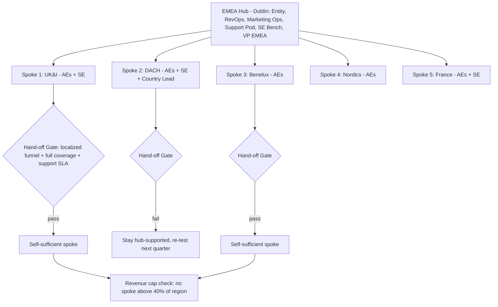

### Direct Answer

Stage EMEA entry as a deliberate sequence — not a simultaneous multi-country launch — by establishing one anchor hub (almost always Dublin, London, or Amsterdam) that carries shared functions, then spinning up "spoke" countries on a hub-and-spoke model with explicit hand-off criteria so no single country becomes a load-bearing wall. The dependency bottleneck you must engineer against is the **first-country trap**: when 70%+ of EMEA revenue, your only native-language reps, your only localized collateral, and your only EU legal entity all live in one geography, that country's slowdown becomes the entire region's slowdown. Avoid it by separating *infrastructure decisions* (entity, banking, data residency, hub staffing) from *demand decisions* (which countries to sell into next), sequencing countries by a scored readiness model rather than by who shouts loudest, and using Employer of Record (EOR) for the first 6–18 months in every spoke so headcount is reversible until the demand signal is proven.

> **TLDR**
> - **Pick one hub, not three.** Dublin for entity/tax/English-language ops, or London/Amsterdam if your buyer base demands it. The hub holds shared services; spokes hold only demand-facing roles.
> - **Sequence with a scoring model.** Rank candidate countries on market size, language overlap, regulatory drag, competitive whitespace, and existing pipeline. Enter the top-scored country first, not your loudest AE's home market.
> - **Use EOR before entity.** Hire the first 1–4 people per spoke through an Employer of Record. Only convert to a legal entity once you clear a revenue/headcount threshold (commonly EUR 1M ARR or 5 FTEs in-country).
> - **Engineer against the first-country trap.** Cap any single country at ~40% of regional revenue in your plan; if it drifts above, that is a dependency alarm, not a success metric.
> - **Decouple infrastructure from demand.** Entity, banking, data residency, and hub staffing should be decided on a slower, more permanent clock than country go/no-go calls.
> - **Define explicit hand-off criteria.** Each spoke graduates from "hub-supported" to "self-sufficient" against written gates: localized funnel, in-country AE+SE+CSM coverage, local-language support SLA met.
> - **Budget 2–4 quarters of negative contribution per spoke.** EMEA spokes lose money before they don't; model it so a slow ramp does not trigger a panic retreat.

---

## 1. Why "Staging" Beats "Launching" in EMEA

### 1.1 The single-launch failure mode

The most common EMEA mistake is treating "Europe" as one launch event: a press release, a regional VP hire, five country managers signed in the same quarter, and a EUR 4M annual plan that assumes all five ramp on a US timeline. EMEA is not a market. It is roughly 40+ distinct legal jurisdictions, 24+ official EU languages, at least four major data-residency regimes, and buyer cultures that range from Nordic consensus-driven committees to French relationship-first procurement to German risk-averse, reference-hungry evaluation. A single launch event flattens all of that into one bet, and one bet is exactly the dependency you are trying to avoid.

Staging means you treat EMEA entry as a *portfolio of sequenced, individually-reversible decisions*. Each country is a position you can size up, hold, or unwind based on evidence. The infrastructure you build (the hub) is the permanent backbone; the countries are tradeable positions on top of it. This framing matters because it changes the question from "did Europe work?" (binary, emotional, board-level) to "which spokes are above their readiness gate, and which need another quarter?" (granular, operational, fixable).

### 1.2 What a "dependency bottleneck" actually is

A dependency bottleneck is any node in your EMEA operating model whose failure or slowdown stalls the whole region. They come in five recognizable shapes:

- **Revenue concentration.** One country produces the majority of regional bookings, so its bad quarter is the region's bad quarter and the board questions the entire EMEA thesis.
- **Talent concentration.** Your only German-speaking SE, your only person who understands French public-sector procurement, your only CSM who has done an EU renewal — each is a single point of failure wearing a lanyard.
- **Legal/entity concentration.** You have one EU entity, so every contract, every hire, every invoice, and every data-processing agreement routes through that one jurisdiction's rules, holidays, and works-council requirements.
- **Process concentration.** Localized collateral, the translated security questionnaire, the EUR price list, the GDPR data-processing addendum — all maintained by one overloaded person whose vacation freezes the region.
- **Decision concentration.** Every country-level pricing exception, every partner contract, every marketing spend approval escalates to one regional VP who becomes a human rate-limiter.

The hub-and-spoke model is, fundamentally, a deliberate redistribution of these five concentrations. The hub is *allowed* to concentrate infrastructure (that is its job); the spokes are *engineered* to never concentrate demand, talent, or decision authority beyond defined caps.

### 1.3 The contrast with the US playbook

US founders under-estimate EMEA staging because the US playbook rewards speed and homogeneity. One language, one currency, one federal contract-law baseline, one timezone band, one set of buyer norms. You can blitz the US: hire 20 AEs, point them at a TAM, and let territory carving sort itself out. EMEA punishes that exact behavior. The table below summarizes why the playbooks diverge.

| Dimension | US expansion | EMEA expansion |
|---|---|---|
| Languages | 1 (English) | 24+ official EU languages; sales-relevant set of 6–8 |
| Legal entities | 1 federal baseline + state nuance | 1 entity per operating jurisdiction (or EOR) |
| Currency | USD | EUR, GBP, CHF, SEK, NOK, PLN, and more |
| Data residency | Comparatively light | GDPR + national variations + sector rules |
| Buyer culture | Relatively uniform | Highly variable by country |
| Hiring reversibility | At-will in most states | Statutory notice, severance, works councils |
| Sales cycle | Baseline | Often 1.3–1.8x longer, more committee-driven |
| Right entry mode | Blitz | Staged hub-and-spoke |

The lesson is not "EMEA is harder" (it is, but that is not actionable). The lesson is that EMEA *rewards a different shape of decision-making* — slower on infrastructure, more disciplined on sequencing, more reversible on headcount.

### 1.4 What the public operators actually did

The staged approach is not a theory; it is the observed pattern across the most-watched SaaS expansions. **HubSpot (HUBS)** built its non-US center of gravity in Dublin and ran it as a genuine hub — shared marketing, support, and recruiting functions serving the wider region — rather than scattering equivalent teams across five capitals. **Salesforce (CRM)** under Marc Benioff anchored heavily in Dublin and London, treating the UK and Ireland as a combined first beachhead before pushing into DACH and the Nordics. **Stripe**, founded by the Irish Collison brothers (Patrick and John Collison), located major European operations in Dublin and expanded country payment coverage on a staged, demand-led cadence rather than a simultaneous flag-plant. **Datadog (DDOG)**, led by Olivier Pomel, used Paris as a genuine engineering-and-operations hub — an instructive variant where the founder's home market *was* the right hub on the merits, not merely on sentiment. **Snowflake (SNOW)** under Frank Slootman, and later Sridhar Ramaswamy, expanded internationally only after the US motion was unambiguously repeatable — the Section 10.4 discipline in practice. **Atlassian (TEAM)**, run by Mike Cannon-Brookes and Scott Farquhar, leaned on a low-touch, product-led motion in Europe for years before layering enterprise sales coverage on top — the Section 10.1 counter-case lived out. **Zoom (ZM)** under Eric Yuan and **Twilio (TWLO)** under Jeff Lawson both staged EMEA coverage city-by-city rather than all at once. **MongoDB (MDB)** under Dev Ittycheria built out Dublin and then sequenced continental coverage. The pattern is consistent enough to be a rule: the companies that compounded in EMEA staged it; the ones that flamed out usually tried to launch it.

---

## 2. The Hub-and-Spoke Architecture

### 2.1 The hub: what it is and what it holds

The hub is your one anchor location that carries shared, semi-permanent functions for the whole region. It is not "the first country you sell into" — it is the operational center of gravity. A well-constructed hub holds:

- **The legal entity** (or the first of them) and the associated banking, payroll, and tax registration.
- **Shared go-to-market infrastructure:** RevOps, marketing operations, SDR/BDR pipeline generation, partner operations, and deal desk.
- **Centralized customer-facing functions that scale across borders:** a multilingual support pod, a solutions-engineering bench, and a customer-success team organized by language rather than strictly by country.
- **The regional leadership team:** the VP of EMEA, finance lead, and people lead.
- **Reference infrastructure:** localized collateral production, the security/compliance response library, and the pricing/packaging source of truth.

The spokes, by contrast, hold a deliberately thin layer: in-country quota-carrying AEs, sometimes a local SE if the technical sale demands physical presence, occasionally a country lead once scale justifies it, and partner-facing roles. Everything else leans on the hub.

### 2.2 Choosing the hub: Dublin, London, or Amsterdam

For most B2B software companies, the realistic hub shortlist is three cities. Each has a distinct profile:

| Hub candidate | Strengths | Watch-outs | Best when |
|---|---|---|---|
| **Dublin** | English-speaking, EU member, common-law system familiar to US legal teams, deep multinational tech talent pool, favorable corporate tax history | Tight, expensive talent market; salary inflation; housing constraints | Default choice for US SaaS needing an EU entity + English ops |
| **London** | Largest single EMEA software market, deep enterprise sales talent, finance-sector buyer density | Post-Brexit: outside EU single market, customs/VAT friction, no longer an EU entity | Your buyer base is UK/finance-heavy and you can run a separate EU entity elsewhere |
| **Amsterdam** | EU member, very high English fluency, central logistics, strong data-center and tech presence | 30% ruling for expats has tightened; housing pressure | You want an EU entity with continental reach and English-language operations |

The decision rule: if you need a single hub that is *both* your EU legal entity and your English-language operations center, Dublin is the default and has been the default for a reason. If your buyers are concentrated in UK financial services, London earns its place but you should pair it with a small EU entity (often Ireland or the Netherlands) so Brexit-related single-market friction does not become its own bottleneck. Amsterdam is the strong continental alternative when Dublin's talent market is too tight or expensive.

### 2.3 The hub-and-spoke diagram

The diagram encodes the core discipline: spokes do not "graduate" on a calendar, they graduate against gates, and even self-sufficient spokes are continuously checked against the revenue-concentration cap.

### 2.4 Why hub-and-spoke specifically defeats bottlenecks

Hub-and-spoke is not the only model — you could run fully independent country P&Ls, or a single centralized blob — but it is the model that most directly attacks the five concentrations from Section 1.3. By centralizing infrastructure deliberately in the hub, you make that concentration *intentional and managed* rather than accidental. By keeping spokes thin and demand-facing, you make each country *individually reversible*. And by enforcing hand-off gates plus revenue caps, you prevent any single spoke from quietly becoming a second, unmanaged hub.

| Operating model | Speed to launch | Bottleneck risk | Cost efficiency | Reversibility |
|---|---|---|---|---|
| Single centralized blob | Fast | Very high (everything concentrated) | High | Low |
| Hub-and-spoke (recommended) | Medium | Low (concentration is managed) | High | High |
| Independent country P&Ls | Slow | Medium (talent silos) | Low (duplication) | Medium |
| Pure partner/distributor model | Fast | High (channel dependency) | Very high | Medium |

### 2.5 The hub is a service organization, not a headquarters

A subtle but important reframing: the hub is not a "European HQ" in the corporate-prestige sense. It is a *service organization* whose customers are the spokes. This distinction changes how you staff, measure, and budget it. A headquarters accumulates authority and headcount because that is what headquarters do; a service organization is measured on the throughput and quality of support it delivers to its internal customers. If you let the hub drift into headquarters mode, it becomes the decision-concentration bottleneck from Section 1.2 — every spoke waiting on the hub for approvals — and it inflates cost without inflating output.

Concretely, instrument the hub like an internal service team. Track the cycle time for the hub to produce a localized asset, the SE bench utilization across spokes, the deal-desk turnaround time, and the SDR-sourced pipeline delivered per spoke. When any of these degrade, the hub is becoming a bottleneck and you either add hub capacity or slow the spoke cadence — you do not let spokes quietly starve. The companies that run this well treat hub-to-spoke service levels with the same rigor they apply to customer-facing SLAs.

### 2.6 What stays centralized forever vs what eventually federates

Not every hub function stays in the hub permanently. Some are *structurally* central — they benefit from a single source of truth and never federate. Others are central early purely for efficiency and should federate to spokes as the region matures. Confusing the two creates bottlenecks: you either federate something that should never have left the hub, or you cling to something a mature spoke should own.

| Function | Disposition | Reason |
|---|---|---|
| Legal entity (first one) | Central, then add entities | One entity early; second entity when scale demands |
| Pricing/packaging source of truth | Central forever | Single source of truth prevents drift |
| RevOps tooling and data model | Central forever | One system of record across the region |
| Deal desk | Central early, federate later | Mature spokes earn local approval thresholds |
| Localized content production | Central early, federate later | Spokes eventually own their own assets |
| SDR/BDR pipeline generation | Central early, federate later | Spokes build local demand engines over time |
| Customer success | Language-organized in hub early, federates by language | Follows where the renewal book concentrates |
| Field marketing | Federates early | Inherently local; events and demand-gen are country-specific |

The rule of thumb: anything that benefits from *consistency* stays central; anything that benefits from *local proximity* federates as the spoke graduates.

---

## 3. Country Sequencing: A Scored Readiness Model

### 3.1 Why sequencing must be scored, not political

The single most dangerous input into EMEA sequencing is the loudest voice in the room. A founder with German heritage wants DACH first. A star AE who closed one French logo wants France resourced. An investor with a UK portfolio wants London prioritized. None of these are evidence. Sequencing decisions made on anecdote create dependency bottlenecks by accident, because they put your scarce hub-support capacity behind a country that was never the highest-probability bet.

Replace the politics with a scoring model. You will still exercise judgment — the model informs, it does not dictate — but you force every advocate to argue with the same five factors.

### 3.2 The five scoring factors

Score each candidate country 1–5 on each factor, then weight:

| Factor | Weight | What a 5 looks like | What a 1 looks like |
|---|---|---|---|
| **Market size / TAM** | 25% | Large addressable base of ICP-fit accounts | Thin ICP density |
| **Language & cultural overlap** | 20% | English-comfortable buyers; low localization need | Localization mandatory for every touchpoint |
| **Regulatory & entity drag** | 20% | Light compliance load, fast hiring | Works councils, heavy statutory severance, sector rules |
| **Competitive whitespace** | 15% | Few entrenched local competitors | Dominant incumbent owns the category |
| **Existing pipeline / demand signal** | 20% | Inbound leads, existing logos, partner interest | Zero organic signal |

The weighted score produces a ranked list. Enter the top-scored country as Spoke 1. The model's real value is not the number — it is forcing the conversation to be *comparative and explicit*.

### 3.3 An illustrative scoring run

The table below is illustrative — your weights and scores will differ — but it shows how the model resolves a typical "DACH vs UK vs Nordics" debate.

| Country/region | Market size (25%) | Language (20%) | Reg. drag (20%) | Whitespace (15%) | Pipeline (20%) | Weighted score |
|---|---|---|---|---|---|---|
| UK & Ireland | 5 | 5 | 4 | 3 | 5 | **4.50** |
| DACH | 5 | 2 | 2 | 3 | 4 | **3.25** |
| Benelux | 3 | 5 | 4 | 4 | 3 | **3.75** |
| Nordics | 3 | 5 | 4 | 4 | 3 | **3.75** |
| France | 4 | 2 | 2 | 3 | 3 | **2.80** |
| Southern Europe | 3 | 3 | 3 | 4 | 2 | **2.95** |

In this run, UK & Ireland sequences first (high on every factor), Benelux and Nordics tie for second (smaller but frictionless and full of whitespace), and DACH — despite its size — sequences fourth because language and regulatory drag pull it down. That is the model doing its job: DACH is a *great* market and a *poor first move*, because entering it first concentrates your scarce localized-content and hiring capacity against the hardest possible ramp.

### 3.4 Sequencing cadence: how fast to add spokes

A practical cadence for a Series B/C company is one new spoke per 1–2 quarters, never more than two spokes "in ramp" simultaneously. The constraint is not capital — it is *hub-support bandwidth*. Each new spoke consumes hub capacity: localized collateral, onboarding, deal-desk attention, SE coverage. Add spokes faster than the hub can support them and the hub itself becomes the bottleneck — the very outcome you are trying to prevent.

| Quarter | Spoke added | Spokes in ramp | Spokes self-sufficient | Hub load |
|---|---|---|---|---|
| Q1 | UK&I | 1 | 0 | Moderate |
| Q2 | — | 1 | 0 | Building infra |
| Q3 | Benelux | 2 | 0 | High |
| Q4 | — | 1 | 1 (UK&I) | Moderate |
| Q5 | Nordics | 2 | 1 | High |
| Q6 | DACH | 2 | 2 | High |
| Q7 | — | 1 | 3 | Moderate |
| Q8 | France | 2 | 3 | High |

Notice the rhythm: a spoke is added, then a quarter of consolidation, then the next. "Spokes in ramp" never exceeds two. This is the throttle that keeps the hub from overheating.

### 3.5 Factor deep-dive: why language overlap is weighted so heavily

Of the five factors, language overlap is the one US teams most consistently under-weight, so it deserves a deeper look. Language is not merely a translation cost. It cascades through five distinct parts of the operating model:

- **Demand generation.** Inbound content, paid search, and SEO must work in-language to produce pipeline. An English-only funnel in France or Germany produces a fraction of the leads it produces in the UK or the Nordics.
- **Sales conversation.** Enterprise buyers in France, Germany, Italy, and Spain frequently expect the sales conversation, the demo, and the proposal in their own language. A non-native motion either underperforms or forces you to hire scarce, expensive native-speaker reps immediately.
- **Collateral and security review.** The data-processing addendum, the security questionnaire response, the case studies — each must be localized, and localization is not a one-time cost; it is an ongoing maintenance burden every time the product or the legal posture changes.
- **Support.** Post-sale support in-language is often a contractual expectation, not a nice-to-have, especially in regulated sectors.
- **Hiring.** A high-localization country forces you to hire native speakers for nearly every role, narrowing the talent pool and raising cost — exactly when the spoke is least proven.

This is why a large market like DACH can still score poorly as a *first* move: a low language-overlap score multiplies the cost and slows the ramp of every other function. The scoring model is not saying DACH is unattractive; it is saying DACH consumes disproportionate hub capacity early, and entering it first concentrates that scarce capacity against the hardest ramp.

### 3.6 Factor deep-dive: regulatory and entity drag

Regulatory drag is the second factor US teams misjudge — usually by assuming "the EU" has one regulatory regime. It does not. Hiring reversibility alone varies enormously: statutory notice periods, mandatory severance scales, probation rules, and — critically — works-council consultation requirements differ by country. In some jurisdictions, reducing headcount above a threshold triggers a formal, time-consuming consultation process. None of this is a reason to avoid those markets; it is a reason to *sequence them later* and to *use EOR longer* there, so your headcount stays reversible while you are still proving the demand. A country with heavy regulatory drag is a fine spoke — it is a poor *first* spoke, because early spokes are precisely the ones most likely to need adjustment.

---

## 4. Infrastructure vs Demand: The Decoupling Discipline

### 4.1 Two clocks, not one

The most important — and most overlooked — principle in dependency-resistant EMEA entry is that *infrastructure decisions and demand decisions run on different clocks and should be made by different forums*.

- **Infrastructure decisions** are slow, semi-permanent, and expensive to reverse: where the entity lives, banking relationships, data-residency architecture, the hub lease, hub leadership hires, the localized-content production pipeline. These should be decided deliberately, changed rarely, and owned by a finance/operations forum.
- **Demand decisions** are fast, evidence-driven, and reversible: which country to enter next, how many AEs to put in a spoke, whether to convert a spoke to an entity, whether to pause a spoke. These should be made quarterly against the scoring model and pipeline data, owned by the GTM forum.

When you fuse the two clocks — "we're entering France, so let's also set up the French entity and a French data center right now" — you create a dependency bottleneck on purpose. Now the demand decision (France) is welded to three infrastructure decisions, and if France under-performs, unwinding it means unwinding an entity, a data-residency commitment, and a lease. Decoupled, an under-performing French spoke is just a handful of EOR contracts you can wind down in a notice period.

### 4.2 The decoupling matrix

| Decision | Clock | Forum | Reversibility | Default early stance |
|---|---|---|---|---|
| EU legal entity location | Slow | Finance/Ops | Very low | Decide once, in the hub |
| Banking & payroll | Slow | Finance/Ops | Low | Centralize in hub |
| Data-residency architecture | Slow | Eng/Security | Low | EU-region hosting before first EU sale |
| Hub lease & leadership | Slow | Exec | Low | Commit deliberately |
| Localized-content pipeline | Medium | Marketing Ops | Medium | Build hub-owned, scalable |
| Which country next | Fast | GTM | High | Quarterly, scored |
| Headcount per spoke | Fast | GTM | High | EOR, minimal viable |
| Convert spoke to entity | Medium | Finance + GTM | Low | Only after threshold gate |
| Pause / unwind a spoke | Fast | GTM | High | Pre-defined trigger |

### 4.3 Data residency: the infrastructure decision people forget

One infrastructure decision deserves special attention because teams routinely treat it as a demand decision and get burned: **data residency**. Many EMEA buyers — public sector, healthcare, financial services, and increasingly mid-market enterprises — will require that their data be processed and stored within the EU, and some sectors within a *specific* country. If you have only US hosting when your first big EMEA deal needs EU data residency, you have just discovered an infrastructure bottleneck at the worst possible moment: mid-deal.

The discipline: stand up EU-region hosting (and a defensible GDPR posture, with a Data Processing Addendum ready) *before* your first EMEA sale, as part of hub infrastructure, on the slow clock. Do not wait for a deal to force it. This is exactly the kind of decision that should never be coupled to a single country's demand signal.

### 4.4 Currency and billing: a quieter infrastructure decision

A second infrastructure decision routinely mishandled is multi-currency billing. EMEA spans EUR, GBP, CHF, and several Nordic and Central European currencies. Buyers increasingly expect to be quoted, invoiced, and to pay in their local currency, and to see local payment methods. If your billing system only handles USD, every EMEA deal carries avoidable friction — FX confusion in negotiation, procurement objections, and reconciliation overhead in finance.

Treat multi-currency billing as hub infrastructure, decided on the slow clock alongside the entity and banking setup. Decide early which currencies you will transact in, how you will manage FX exposure, and how local payment methods will be supported. Providers such as Stripe and various billing platforms handle much of this, but the *decision* to support it is yours and should not be deferred until a deal forces it. Like data residency, currency is an infrastructure problem masquerading as a sales problem — and coupling it to a single deal's timeline is how it becomes a bottleneck.

### 4.5 The forum discipline

The two-clock principle only works if it is enforced by *governance*, not goodwill. In practice, that means two standing forums with different cadences and different membership:

- **The infrastructure forum** meets quarterly or as triggered, is chaired by finance/operations, and owns entity, banking, data residency, hub lease, and the localized-content pipeline. Its decisions are documented, deliberate, and rarely reversed.
- **The GTM forum** meets monthly or quarterly, is chaired by the VP of EMEA, and owns country sequencing, spoke headcount, hand-off graduation, and pause/unwind triggers. Its decisions are evidence-driven and explicitly reversible.

When someone proposes coupling the two — "let's set up the entity because we're entering the country" — the forum structure itself is the brake: that is two decisions, in two forums, on two clocks, and they must be argued separately.

---

## 5. EOR vs Entity: Keeping Headcount Reversible

### 5.1 The reversibility principle

Every spoke begins with people you might need to unwind. EMEA labor law makes unwinding expensive: statutory notice periods, mandatory severance, and in some jurisdictions works-council consultation. If you create a legal entity and hire directly the moment you decide to enter a country, you have made those people maximally hard to reverse — and you made that commitment *before* you had demand evidence.

The Employer of Record (EOR) model breaks this. An EOR (Deel, Remote, Velocity Global, Globalization Partners, and others) is the legal employer of record in-country; your new AE is fully, compliantly employed, but the entity-level commitment sits with the EOR, not you. You can hire one person in a new country in days, and — within the contract's notice terms — wind that person down without dissolving an entity.

### 5.2 The decision framework

Use EOR for the first 6–18 months of every spoke. Convert to a legal entity only when the spoke clears a threshold gate. The conversation should be governed, not improvised:

| Factor | Favors EOR | Favors own entity |
|---|---|---|
| In-country headcount | 1–4 people | 5+ people |
| In-country ARR | Below ~EUR 1M | Above ~EUR 1M |
| Demand certainty | Still proving the market | Demand validated, multi-quarter |
| Cost per head | Acceptable EOR margin at low volume | EOR fees exceed entity overhead |
| Equity / benefits needs | Standard package sufficient | Local equity, pension, complex benefits |
| Time horizon | Testing, reversible | Long-term commitment confirmed |

### 5.3 The cost crossover

EOR providers charge either a percentage of salary or a flat per-employee monthly fee. At low headcount, that is cheaper and vastly more flexible than the legal, accounting, payroll, and compliance overhead of running your own entity. As headcount grows, the EOR fee scales linearly while entity overhead is largely fixed — so there is a crossover point, commonly around 5–8 employees in one country, where the entity becomes cheaper.

| Spoke headcount | EOR annual cost (illustrative) | Own-entity annual overhead (illustrative) | Cheaper option |
|---|---|---|---|
| 1–2 | Low | High fixed overhead | EOR |
| 3–4 | Moderate | High fixed overhead | EOR |
| 5–6 | Moderate-high | Fixed overhead amortizing | Roughly even |
| 7–10 | High (scales linearly) | Fixed, now amortized | Own entity |
| 10+ | Very high | Fixed | Own entity |

The strategic point is *not* the exact crossover number — it varies by country and provider. The point is that EOR buys you the option to be wrong about a country cheaply. That option value is the entire reason it defeats the headcount-concentration bottleneck.

### 5.4 The conversion gate

Converting a spoke from EOR to entity is a *medium-clock* decision (Section 4.2) — slower than a headcount tweak, faster than choosing the hub. A reasonable written gate: convert when the spoke has sustained 5+ FTEs AND EUR 1M+ in-country ARR for two consecutive quarters AND a multi-quarter pipeline that supports continued growth. All three, sustained — not a single good quarter. This prevents the opposite mistake: standing up an entity on the strength of one lucky deal.

### 5.5 The hidden risks of EOR — and how to manage them

EOR is the right early-stage tool, but it is not free of trade-offs, and pretending otherwise creates its own bottleneck. Three risks deserve explicit management:

- **Permanent-establishment risk.** In some jurisdictions, having sales staff who habitually conclude contracts can create a taxable corporate presence ("permanent establishment") regardless of whether you have a legal entity. EOR does not automatically eliminate this. Get tax advice early on how your spoke reps operate so you do not accidentally create the entity-level exposure you used EOR to avoid.
- **Equity and benefits friction.** EOR-employed staff can usually receive standard equity and benefits, but the mechanics are more complex than for entity-employed staff, and high performers may notice. As a spoke matures and you want to retain key people with richer local packages, that pressure is itself a signal to consider conversion.
- **Provider concentration.** If all your EMEA EOR headcount sits with one provider, that provider is itself a dependency — a service issue or a pricing change hits the whole region. For a large EOR footprint, it is reasonable to qualify a second provider, exactly as you would avoid single-sourcing any critical vendor.

None of these undermines the EOR-first strategy. They simply mean EOR is a managed tool, not a set-and-forget one. The reversibility benefit is real and worth the management overhead — but the overhead is non-zero and should be owned by someone.

### 5.6 EOR and the diversification thesis

EOR also reinforces the anti-bottleneck thesis at the talent level. Because EOR makes a single hire in a new country fast and reversible, it lets you *seed talent in more countries earlier and more cheaply* than an entity-first model would. That breadth is itself diversification: it is far easier to avoid talent concentration when adding the fifth country's first rep costs days and a contract rather than months and an entity. The reversibility that protects you on the downside (winding a country down) is the same property that helps you diversify on the upside (seeding more countries sooner). EOR is, in effect, the financial instrument that makes staged hub-and-spoke affordable.

---

## 6. The First-Country Trap and How to Engineer Against It

### 6.1 Anatomy of the trap

The first-country trap is the dependency bottleneck that EMEA staging exists to prevent. It develops quietly and looks like success the whole way:

1. You enter Country A. It is your first spoke, it gets the most hub attention, and it works.
2. Because it works, you double down: more AEs in Country A, more localized content for Country A, your best CSM in Country A.
3. Country A now produces 70%+ of EMEA revenue. The board loves the EMEA story.
4. Then Country A has a soft quarter — a competitor lands, a regulatory change, a key customer churns, a star rep leaves.
5. Because Country A *is* EMEA, the whole region misses. The board no longer loves the EMEA story. Hiring freezes. The other spokes, which needed hub support to ramp, get starved. They miss too. The region is now in a doom loop.

The trap is insidious because every individual step is locally rational. Doubling down on what works is normally good advice. The flaw is structural: you let one country become load-bearing.

### 6.2 The 40% rule

Engineer against it with an explicit cap: **in your operating plan, no single country should exceed roughly 40% of regional revenue.** If a country drifts above 40%, treat it as a *dependency alarm*, not a trophy. The response is not to slow that country down — it is to accelerate the others, by reallocating hub support and adding the next spoke sooner.

| EMEA revenue mix | Interpretation | Action |
|---|---|---|
| No country above 40% | Healthy diversification | Continue cadence |
| One country 40–55% | Concentration warning | Accelerate next 1–2 spokes; reallocate hub support |
| One country above 55% | Active bottleneck | Freeze further investment in that country; crash-prioritize spokes |
| Top two countries above 80% combined | Two-point fragility | Add a third independent spoke urgently |

### 6.3 The other four concentrations

Revenue is the visible concentration. The other four from Section 1.2 are just as dangerous and harder to see on a dashboard:

- **Talent.** Never let a language or a critical skill live in exactly one person. Cross-train; the hub's SE bench and language-organized CSM pod exist precisely so that "our only German SE" is never a sentence anyone can say.
- **Legal/entity.** A single EU entity is acceptable early (it is, in fact, the hub design). It becomes a bottleneck only if you never plan a second entity as scale demands. Keep a written trigger for when a second entity is warranted.
- **Process.** Localized collateral, security questionnaires, the GDPR DPA, the EUR price list — these must be owned by a *team and a system*, not a hero. Document, template, and back up every localized asset.
- **Decision.** If every pricing exception and partner contract escalates to the VP of EMEA, that VP is a rate-limiter. Push a decision framework and approval thresholds down to country leads as spokes mature.

### 6.4 A diversification scorecard

Run this quarterly. Any red is a bottleneck forming.

| Concentration | Green | Yellow | Red |
|---|---|---|---|
| Revenue (top country share) | Below 40% | 40–55% | Above 55% |
| Talent (single-point critical skills) | Zero | 1–2 | 3+ |
| Entity (operating jurisdictions per entity) | Planned coverage | Stretched | Single entity, no plan |
| Process (un-backed-up localized assets) | All templated/owned | Some hero-owned | Critical assets hero-owned |
| Decision (% exceptions escalating to VP) | Below 20% | 20–50% | Above 50% |

---

## 7. Hand-Off Criteria: Graduating a Spoke

### 7.1 Why hand-offs must be written

A spoke starts life heavily hub-supported: the hub generates its pipeline, produces its content, staffs its SE coverage, runs its deal desk. The spoke "graduates" when it becomes self-sufficient. If graduation is informal — "France feels ready" — you get one of two failures: you cut hub support too early and the spoke stalls, or you never cut it and the hub stays permanently overloaded. Written hand-off criteria fix both.

### 7.2 The graduation gates

A spoke graduates from hub-supported to self-sufficient only when it clears all of these:

| Gate | Requirement |
|---|---|
| **Localized funnel** | The country has its own working demand engine — localized inbound, SDR coverage in-language, and pipeline not dependent on hub-generated leads |
| **Full role coverage** | In-country or language-aligned AE, SE, and CSM coverage exists for the active book |
| **Support SLA met** | Local-language support is consistently hitting its SLA without hub firefighting |
| **Content self-service** | Localized collateral and security/compliance responses exist and are maintained on the standard cadence |
| **Revenue durability** | Multiple quarters of bookings, not a single hero deal |
| **Decision authority** | A country lead can resolve standard pricing/partner decisions within an agreed framework |

A spoke that fails any gate stays hub-supported and is re-tested next quarter — that is a normal, healthy outcome, not a failure.

### 7.2a The asymmetric cost of getting the hand-off wrong

It is worth being explicit about *why* written gates matter so much, because the two failure modes are not symmetric in cost. Cutting hub support too early — graduating a spoke that is not ready — is the more dangerous error. A prematurely graduated spoke loses its pipeline engine and SE coverage before it can self-source, its bookings stall, and the stall is then misread as "the country does not work" rather than "we cut the cord too soon." That misreading can trigger an unwind of a country that was actually fine. The opposite error — keeping a ready spoke on hub support too long — wastes hub capacity and slows the cadence, which is real but recoverable. Because the costs are asymmetric, the gates should be evidence-heavy and the bias should be toward keeping a spoke supported a quarter longer rather than a quarter shorter. Graduation is a milestone to be *earned with data*, never granted on optimism.

### 7.2b Partner channel as a hand-off accelerator

One legitimate way to speed a spoke toward graduation is a strong local partner — a reseller, systems integrator, or referral partner with established in-country presence. A good partner brings local pipeline, local credibility, and sometimes local-language delivery, all of which help a spoke clear the localized-funnel and coverage gates faster. But partners introduce their own dependency risk: a spoke whose pipeline is 80% one-partner-sourced has simply swapped a country bottleneck for a partner bottleneck. Treat partner concentration with the same discipline as country concentration — no single partner should be load-bearing for a spoke's number. Use partners to *accelerate* graduation, not to *substitute* for building the spoke's own demand engine.

### 7.3 The spoke lifecycle

| Stage | Hub support level | Spoke responsibility | Exit criterion |
|---|---|---|---|
| Seed | Very high | Close EOR-hired AE's first deals | First localized assets exist |
| Ramp | High | Build local pipeline contribution | Pipeline 50%+ self-sourced |
| Validate | Medium | Hit revenue durability | Multi-quarter bookings |
| Graduate | Low (advisory) | Run independently | All hand-off gates passed |
| Self-sufficient | Minimal | Own its number | Stays under 40% revenue cap |

---

## 8. Worked Example: A 24-Month Staged EMEA Entry

### 8.1 The scenario

A US Series B SaaS company, ~USD 18M ARR, decides to enter EMEA. It has scattered inbound from the UK, Netherlands, and Nordics, and a German-heritage founder lobbying for DACH-first. Here is the staged plan that defeats dependency bottlenecks.

### 8.2 Months 0–6: Build the hub

- Establish the **Dublin** hub: Irish legal entity, banking, payroll registration.
- Hire the **VP of EMEA**, a RevOps lead, two SDRs, one solutions engineer, and one multilingual support specialist — all hub roles.
- Stand up **EU-region hosting** and a GDPR posture with a ready DPA (infrastructure, slow clock).
- Run the **scoring model**. Result mirrors Section 3.3: UK&I first, Benelux/Nordics next, DACH fourth. The founder's DACH-first instinct is overridden by the model — politely, with evidence.

### 8.3 Months 6–12: Spoke 1 (UK & Ireland)

- Hire **2 AEs in the UK via EOR**. No UK entity yet.
- UK pipeline is initially hub-generated; the spoke is in Seed → Ramp.
- The hub builds the first localized collateral set and a UK-tuned security questionnaire response.
- By month 12, UK&I is producing real bookings but is *not yet* graduated — pipeline is still 60% hub-sourced.

### 8.4 Months 12–18: Spoke 2 (Benelux) + UK consolidation

- Add **Benelux** as Spoke 2 (1–2 AEs via EOR, hub SE coverage). Two spokes now in ramp — the cadence cap.
- UK&I moves toward graduation: localized funnel live, full coverage, support SLA met. It passes the hand-off gates and becomes the first self-sufficient spoke.
- Revenue check: UK&I is ~45% of EMEA — a yellow concentration warning. Response: accelerate Benelux and pull the Nordics spoke forward.

### 8.5 Months 18–24: Spokes 3 and 4 (Nordics, DACH)

- Add **Nordics** (EOR) and begin **DACH** preparation — DACH needs the most localization runway, so its content work starts a quarter ahead of its first hire.
- UK&I, now sustained above 5 FTEs and EUR 1M+ ARR for two quarters, **converts from EOR to a UK legal entity**.
- Revenue mix by month 24: UK&I ~38%, Benelux ~22%, Nordics ~20%, DACH ~12%, hub-direct/other ~8%. No country above 40%. The diversification scorecard is green.

### 8.6 The 24-month timeline at a glance

| Months | Action | Spokes live | Self-sufficient | Top-country share |
|---|---|---|---|---|
| 0–6 | Build Dublin hub, run scoring model | 0 | 0 | n/a |
| 6–12 | Launch UK&I spoke (EOR) | 1 | 0 | ~100% (expected, single spoke) |
| 12–18 | Launch Benelux; UK&I graduates | 2 | 1 | ~45% (yellow → act) |
| 18–24 | Launch Nordics + DACH; UK&I → entity | 4 | 2 | ~38% (green) |

The plan deliberately *expects* a 100% concentration when there is only one spoke — that is fine, because the next spoke is already in motion. The discipline is that concentration falls as spokes are added, and the 40% cap is honored by the time the region is multi-spoke.

---

## 9. Common Mistakes and How to Avoid Them

### 9.1 The mistake catalog

| Mistake | Why it happens | Consequence | Fix |
|---|---|---|---|
| Simultaneous multi-country launch | Pressure to "do Europe" fast | Hub overloads; nothing ramps | Stage; max two spokes in ramp |
| Hub chosen for founder convenience | Founder lives there | Wrong talent pool, wrong tax posture | Choose hub on the Section 2.2 criteria |
| Entity-first in every country | Feels "serious" | Irreversible headcount before demand proven | EOR first, entity at the gate |
| Sequencing by loudest voice | Politics beats evidence | Hub capacity behind a low-probability bet | Scored readiness model |
| Coupling infrastructure to demand | Seems efficient | Under-performing country drags an entity | Two-clock decoupling |
| Ignoring data residency until mid-deal | Treated as a sales problem | Deal stalls; emergency infra build | EU hosting before first EMEA sale |
| Celebrating one country at 70% | Looks like success | First-country trap | 40% rule + diversification scorecard |
| No written hand-off gates | "It feels ready" | Hub stuck supporting forever, or spoke starved | Written graduation gates |
| Single-person localized content | Cheap early | Hero leaves, region freezes | Team + system ownership |
| Panic retreat on slow ramp | Spokes expected to lose money early | Reversing a healthy investment | Budget 2–4 quarters negative contribution |

### 9.2 The financial-patience mistake

One mistake deserves emphasis because it kills otherwise-sound EMEA plans: **impatience with the contribution curve**. EMEA spokes lose money before they make money — longer, more committee-driven sales cycles mean a spoke commonly runs 2–4 quarters of negative contribution before turning positive. If your board model assumes US-speed payback, a perfectly healthy spoke will look like a failure at month 9, trigger a freeze, and the freeze will starve the *other* spokes of hub support. Model the negative-contribution window explicitly so a slow-but-normal ramp is never mistaken for a broken one.

---

## 10. Counter-Case: When This Advice Does NOT Apply

The staged hub-and-spoke model is the right default for most B2B software companies entering EMEA. But it is a default, not a law. Here is when the advice in this entry does *not* apply, or applies differently.

### 10.1 Product-led growth with no-touch motion

If your product is genuinely self-serve — a developer tool, a low-priced SaaS with a credit-card funnel, no sales-assisted motion — then much of the hub-and-spoke apparatus is overhead you do not need. You still need an EU entity for billing and tax, EU-region hosting for data residency, and a GDPR posture. But you do not need country spokes, in-country AEs, or hand-off gates, because you are not running a geographic sales motion. Your "expansion" is localization of the product, payment methods, and documentation. The first-country trap barely applies because revenue follows organic, channel-agnostic signups. **For a PLG company, skip the spoke model and invest in localization and self-serve infrastructure instead.**

### 10.2 A single dominant anchor customer or partner

If your EMEA entry is anchored by one large customer or one strategic distribution partner that *is* the business case — for example, a global account headquartered in Germany that wants you operating there, or an OEM relationship that channels all EMEA revenue — then deliberate concentration in that one country is rational, not a bottleneck. The 40% rule is a guideline for *self-generated* demand diversification; it does not override a deliberate, contractually-anchored single-customer strategy. **In this case, optimize for serving the anchor superbly, and treat broader diversification as a later, separate project.**

### 10.3 Acquisition-led entry

If you enter EMEA by acquiring an existing European company, you inherit entities, talent, customers, and local presence on day one. The build-the-hub-then-stage-spokes sequence is moot — your problem is integration, not staging. The relevant questions become which inherited entities to keep, how to consolidate onto one hub, and how to retain the acquired talent. **Acquisition flips the problem from greenfield staging to post-merger integration; this entry's playbook applies only to the residual greenfield countries the acquisition did not cover.**

### 10.4 Very early stage with no validated US motion

If you have not yet found repeatable product-market fit and a working sales motion in your home market, EMEA staging is premature regardless of how it is done. Expanding geographically multiplies your unsolved problems across jurisdictions. **The counter-advice here is blunt: do not stage EMEA entry at all yet — fix the core motion first.** The hub-and-spoke discipline assumes you have a motion worth replicating.

### 10.5 Hyper-local, regulation-bound products

A few products are so bound to national regulation — certain fintech, health, and govtech categories — that "EMEA" is not a coherent unit at all. Each country is effectively a separate product with separate compliance, separate certification, and separate go-to-market. For these, a shared hub still helps for back-office functions, but country sequencing is governed by *regulatory approval timelines*, not by a market-attractiveness score. **Here, the scoring model's weights shift dramatically toward regulatory drag, and "whitespace" may matter less than "which country will even certify us this year."**

The throughline of all five counter-cases: the staged hub-and-spoke model is a tool for de-risking *self-generated, sales-led, multi-country demand*. When your situation is not that — because it is self-serve, single-anchored, acquired, premature, or regulation-bound — adapt the parts that still apply (entity, data residency, GDPR) and drop the parts that do not.

---

## 11. Metrics: Instrumenting a Staged EMEA Entry

### 11.1 The dashboard the board should see

A staged EMEA entry succeeds or fails on whether leadership can see dependency risk forming *before* it becomes a crisis. That requires a dashboard that goes beyond "EMEA bookings vs plan." The board-facing view should carry four layers: regional performance, diversification health, spoke maturity, and hub throughput.

| Metric | Layer | Healthy signal | Alarm signal |
|---|---|---|---|
| EMEA ARR vs plan | Performance | Within range, trending up | Persistent miss |
| Top-country revenue share | Diversification | Below 40% | Above 55% |
| Top-two-country combined share | Diversification | Below 65% | Above 80% |
| Spokes self-sufficient / total | Maturity | Rising over time | Flat — spokes not graduating |
| Spokes in ramp | Maturity | 1–2 | 3+ (hub overload) |
| Single-point critical skills | Diversification | Zero | 3+ |
| Hub asset-production cycle time | Hub throughput | Stable or improving | Lengthening |
| SE bench utilization | Hub throughput | Healthy, not maxed | Pinned at 100% |
| Spoke contribution margin by age | Performance | Improving with cohort age | Flat after 4+ quarters |

### 11.2 Leading vs lagging indicators

Revenue is a *lagging* indicator — by the time EMEA ARR misses plan, the bottleneck formed quarters ago. The value of the staged model is that it generates *leading* indicators. Top-country revenue share rising past 40% leads a future regional miss. Spokes-in-ramp exceeding two leads a future hub-throughput collapse. Hub asset-production cycle time lengthening leads future spoke ramp delays. A single-point critical skill appearing leads a future talent-shock. Watch the leading indicators and you fix bottlenecks while they are cheap; watch only revenue and you discover them when they are expensive.

### 11.3 Reviewing on the right cadence

Match the review cadence to the clock of the decision. The diversification scorecard and spoke-maturity view belong in the *monthly* GTM forum, because the actions they trigger — reallocate hub support, accelerate a spoke, hold a graduation — are fast-clock decisions. Hub throughput belongs in the same monthly review because hub overload needs a quick response. Infrastructure metrics — entity utilization, data-residency coverage — belong in the *quarterly* infrastructure forum. The board sees the consolidated view quarterly, but the operating team must be looking at the leading indicators every month, or the staged model degrades into the single-launch model it was meant to replace.

---

## 12. Implementation Checklist

Use this as the operational summary.

| Phase | Action | Owner | Done when |
|---|---|---|---|
| Pre-entry | Confirm validated home-market motion | Exec | Repeatable motion proven |
| Hub | Choose hub on Section 2.2 criteria | Exec + Finance | Hub city committed |
| Hub | Establish entity, banking, payroll | Finance/Ops | Entity operational |
| Hub | Stand up EU hosting + GDPR DPA | Eng/Security | EU residency available |
| Hub | Hire VP EMEA + shared-services core | Exec/People | Hub team in seats |
| Sequencing | Run the scored readiness model | GTM | Ranked country list |
| Spoke 1 | Hire AEs via EOR in top-scored country | GTM | First spoke selling |
| Cadence | Add spokes 1 per 1–2 quarters, max 2 in ramp | GTM | Cadence honored |
| Discipline | Quarterly diversification scorecard | RevOps | No red cells |
| Hand-off | Apply written graduation gates | GTM + RevOps | Spokes graduate on evidence |
| Conversion | EOR → entity at the threshold gate | Finance + GTM | Gate sustained 2 quarters |
| Monitoring | Enforce 40% revenue cap | Exec + RevOps | No country load-bearing |

---

## Related Library Entries

- **"How do you build a country-sequencing model for international expansion?"** — deeper treatment of the scoring weights in Section 3.
- **"EOR vs legal entity: when should you convert?"** — expands the crossover analysis in Section 5.
- **"How do you design a hub-and-spoke GTM org?"** — org-design companion to Section 2.
- **"What does a board-ready international expansion plan look like?"** — how to present the 24-month plan from Section 8 to a board.
- **"How do you localize sales collateral and security questionnaires for EMEA?"** — operational detail on the content bottleneck in Section 6.3.
- **"What is contribution margin by geography and how do you model it?"** — supports the financial-patience point in Section 9.2.
- **"GDPR and data residency: what GTM teams must know."** — expands the infrastructure decision in Section 4.3.

## Sources

1. European Commission — EU official languages and the single market.
2. Eurostat — EU enterprise and ICT market statistics.
3. OECD — Corporate tax and foreign direct investment country profiles.
4. IDA Ireland — Ireland as a hub for multinational technology operations.
5. Enterprise Ireland — Market entry and software-sector reports.
6. UK Department for Business and Trade — Post-Brexit trade and market access guidance.
7. Netherlands Foreign Investment Agency (NFIA) — Establishing operations in the Netherlands.
8. GDPR (Regulation EU 2016/679) — official text on data processing and residency.
9. European Data Protection Board — Guidance on international data transfers.
10. Deel — Global hiring and Employer of Record cost benchmarks.
11. Remote.com — EOR vs entity decision guides.
12. Velocity Global — International expansion and EOR reports.
13. Globalization Partners — Global employment and entity-setup studies.
14. SaaStr — International expansion playbooks for B2B SaaS.
15. Bessemer Venture Partners — State of the Cloud, international GTM sections.
16. OpenView Partners — SaaS expansion and PLG benchmarks.
17. Battery Ventures — Software expansion and OpenCloud reports.
18. Gartner — B2B buyer behavior and sales-cycle research.
19. Forrester — European technology buyer studies.
20. McKinsey & Company — Global expansion and operating-model research.
21. Bain & Company — Go-to-market and international growth analyses.
22. BCG — Cross-border operating-model studies.
23. Harvard Business Review — Articles on staged international market entry.
24. KeyBanc Capital Markets — SaaS metrics survey, international cohorts.
25. ICONIQ Growth — Scaling reports covering international expansion.
26. Insight Partners — ScaleUp guidance on EMEA entry.
27. Stripe — Cross-border billing, VAT, and currency operations guidance.
28. PwC — Doing Business in Europe country guides.
29. Deloitte — International tax and entity-structure publications.
30. KPMG — EMEA market-entry and compliance reports.
31. EY — Global mobility and Employer of Record advisory.
32. CBRE — European office-market reports (hub-location cost context).
33. LinkedIn Economic Graph — EMEA tech talent distribution data.
34. World Bank — Doing Business / regulatory-environment indicators.
