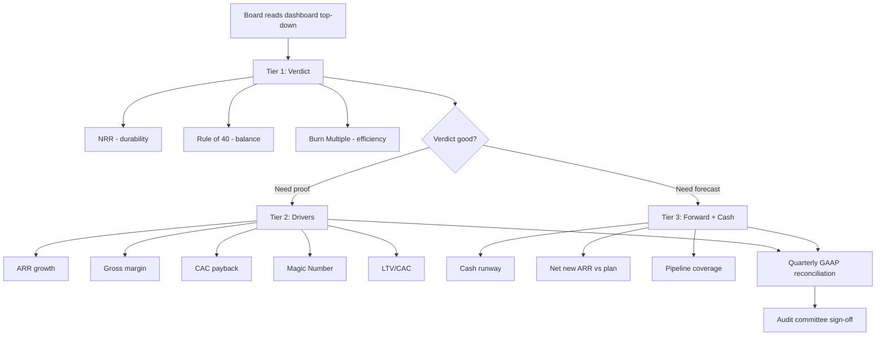

### Direct Answer

A board-ready unit economics dashboard should open with three "verdict" metrics that a director can read in ten seconds — Net Revenue Retention, Rule of 40, and Burn Multiple — then descend into the supporting drivers that explain those verdicts: ARR and growth rate, gross margin, CAC payback, the SaaS Magic Number, LTV/CAC, sales efficiency, and a cash runway line. Order matters more than completeness: lead with the conclusion (are we a good business?), follow with the proof (why?), and close with the forecast (how long do we have?). A board does not want twenty metrics; it wants nine to twelve metrics arranged so the story reads top-to-bottom without a single verbal explanation from the CFO.

> **TL;DR**
> - **Three tiers, not one list.** Tier 1 = verdict metrics (NRR, Rule of 40, Burn Multiple). Tier 2 = driver metrics (ARR growth, gross margin, CAC payback, Magic Number, LTV/CAC). Tier 3 = forward/cash metrics (runway, net new ARR forecast, pipeline coverage).
> - **Order is the message.** Put the answer first. A board reads the dashboard the way it reads a memo: conclusion, evidence, implication.
> - **Nine to twelve metrics is the sweet spot.** Fewer than seven looks evasive; more than fourteen buries the signal. Cut anything that does not change a decision.
> - **Every metric needs a definition, a trend, a target, and a status color.** A naked number is noise. The board needs to know whether 112% NRR is good *for you*.
> - **Benchmark against a named cohort.** "Top quartile per ICONIQ Growth's 2025 SaaS report" beats "industry standard" every time.
> - **Reconcile to GAAP once per quarter.** Unit economics dashboards drift from the audited financials; ASC 606 revenue recognition is the bridge. Show the reconciliation or the audit committee will ask for it.
> - **Counter-case:** pre-revenue, usage-based-only, or services-heavy businesses need a modified dashboard — do not force a classic SaaS template onto a company that is not classic SaaS.

---

## I. Why The Dashboard Exists Before You Pick A Single Metric

### 1. The board is not your operating team

The single most common mistake founders make with a board-ready dashboard is treating it like an internal operating review. The internal review exists to *find problems*. The board dashboard exists to *render a verdict and protect the relationship*. Those are different jobs, and they demand different information architecture.

Your VP of Sales wants to know which segment's CAC payback slipped last month so she can intervene. Your board wants to know whether the company, as a portfolio asset, is compounding value faster than it is consuming cash. The VP needs forty metrics sliced by region, rep, and product line. The board needs nine to twelve, arranged so the answer is unmissable.

When you conflate the two, you produce a dashboard that is simultaneously too detailed for the board and too shallow for the operators. The board glazes over; the operators ignore it. The fix is structural, not cosmetic — you build the board dashboard as a deliberate *abstraction layer* on top of the operating data, not as a filtered export of it.

### 2. A board dashboard is a trust instrument

Directors at companies like Snowflake (SNOW), Datadog (DDOG), and HubSpot (HUBS) sit on multiple boards. They have pattern-matched hundreds of dashboards. What they are reading for, beneath the numbers, is *whether they can trust the management team's judgment*. A clean, consistent, well-ordered dashboard signals a team that understands its own business. A sprawling, inconsistent, metric-of-the-month dashboard signals a team that is either hiding something or does not know what matters.

This is why **consistency across quarters beats sophistication in any single quarter**. The board should see the same nine metrics, defined the same way, in the same order, every meeting. The moment you swap NRR for "expansion ARR" because NRR dipped, every director in the room registers it. You have spent trust you cannot easily rebuild.

### 3. The dashboard is a forcing function for management alignment

Building the board dashboard forces the CEO, CFO, and CRO to agree on what "good" means. That agreement is worth more than the dashboard itself. If the CRO thinks bookings is the headline number and the CFO thinks burn multiple is, the company has no shared definition of success — and the board will sense the incoherence within two meetings.

| Audience | Primary question | Metric count | Update cadence |
|---|---|---|---|
| Board of directors | Are we compounding value vs. cash? | 9-12 | Quarterly |
| Audit committee | Do the numbers reconcile to GAAP? | 6-8 (financial) | Quarterly |
| Operating / exec team | Where is the problem this week? | 30-60 | Weekly |
| Investors (between rounds) | Is the thesis still intact? | 5-7 | Monthly update email |
| Lenders (venture debt) | Can they service the facility? | 4-6 (cash + covenant) | Monthly |

### 4. The cost of getting the abstraction layer wrong

There is a quantifiable cost to a bad board dashboard, and it is not abstract. A board that cannot read the business from the dashboard compensates by asking for more — more cuts of the data, more ad-hoc analyses, more "could you just send me the cohort file." Each request consumes finance-team hours that should be spent closing the books and forecasting. A company that has lost the dashboard discipline can easily burn 15-20% of its FP&A capacity producing bespoke board cuts. Worse, the board's questions become un-coordinated: each director chases a different thread, and the management team spends the quarter answering five private investigations instead of running one shared review.

The inverse is also true and underappreciated. A board that *can* read the business from a clean dashboard becomes a faster, more decisive board. Decisions that would otherwise stretch across two meetings — approving an incremental burn, greenlighting a new region, sizing the next raise — get made in one, because the directors share a factual baseline before they walk into the room. The dashboard, done well, compresses the company's decision latency. That compression is worth far more than the few hours it takes to build the page.

### 5. The dashboard is also a recruiting and diligence asset

A subtle benefit: a disciplined board dashboard becomes a reusable asset in the next financing or an eventual acquisition diligence. When a Series D lead or a strategic acquirer opens the data room, a four-year run of consistently formatted, consistently defined board dashboards is itself a credibility signal. It tells the diligence team that the metrics were not reverse-engineered for the raise — they were the company's actual operating language all along. Teams that build the dashboard only when they need to fundraise produce a document that looks exactly like what it is, and sophisticated investors discount it accordingly. The dashboard you build for governance is the dashboard that survives diligence; the dashboard you build for diligence rarely survives governance.

---

## II. The Three-Tier Architecture

### 1. Tier 1 — Verdict metrics (the answer)

The top of the dashboard answers one question: *is this a good business right now?* Three metrics carry that load.

- **Net Revenue Retention (NRR)** — the single most predictive SaaS metric for enterprise value. It tells the board whether the installed base grows on its own before a single new logo is added. Bessemer Venture Partners' Cloud 100 analysis has shown repeatedly that NRR is the metric most correlated with public-market revenue multiple.
- **Rule of 40** — growth rate plus profit margin (typically FCF margin or EBITDA margin). It compresses the growth-versus-profitability tradeoff into one number a director can hold in their head. A score of 40+ signals a business that is balancing the two responsibly.
- **Burn Multiple** — net burn divided by net new ARR. Coined by David Sacks, it answers "how many dollars of cash did we light on fire to add one dollar of recurring revenue?" It is the efficiency metric that exposes a business buying growth it cannot afford.

These three are the headline because they each independently summarize a different axis: NRR = durability, Rule of 40 = balance, Burn Multiple = efficiency. Together they triangulate the verdict.

### 2. Tier 2 — Driver metrics (the proof)

Tier 1 metrics are *outcomes*. Tier 2 metrics are the *drivers* that explain why Tier 1 looks the way it does. When NRR drops, the board's next question is "why?" — and Tier 2 should answer it before they ask.

- **ARR and ARR growth rate** — the absolute scale and momentum of the recurring base.
- **Gross margin** — for SaaS, the structural ceiling on every downstream efficiency metric. A 60% gross margin company cannot have the same LTV/CAC as an 85% one.
- **CAC payback period** — months of gross-margin-adjusted revenue to recover the cost of acquiring a customer. The most intuitive efficiency metric for non-financial directors.
- **SaaS Magic Number** — net new ARR divided by prior-period sales and marketing spend. A go-to-market efficiency ratio. (See sibling entry q418 for the full treatment.)
- **LTV/CAC ratio** — lifetime value over acquisition cost. Useful but the most easily manipulated, so it sits lower in the stack.

### 3. Tier 3 — Forward and cash metrics (the implication)

The bottom of the dashboard answers "so what happens next, and how long do we have?"

- **Cash runway** — months of cash at current net burn. The metric that determines whether the board needs to plan a raise.
- **Net new ARR forecast vs. plan** — the forward-looking commitment.
- **Pipeline coverage** — qualified pipeline as a multiple of the next-quarter new-ARR target.

| Tier | Purpose | Metrics | What the board does with it |
|---|---|---|---|
| Tier 1 | Verdict | NRR, Rule of 40, Burn Multiple | Decides if the business is healthy |
| Tier 2 | Proof | ARR growth, gross margin, CAC payback, Magic Number, LTV/CAC | Diagnoses *why* Tier 1 moved |
| Tier 3 | Implication | Cash runway, net new ARR vs. plan, pipeline coverage | Plans the next raise / decides on spend |

### 4. Why three tiers and not two, or five

The temptation is to flatten the dashboard into a single ranked list, or to fragment it into five or six categories (growth, retention, efficiency, profitability, cash, pipeline). Both are mistakes, and the reason is cognitive load. A flat list of twelve metrics gives a director no way to know which three carry the verdict — they all look equally weighted, so the eye has nowhere to land first. A six-category dashboard, conversely, forces the reader to hold six mental buckets, which is past the working-memory limit most people can comfortably scan in a few seconds.

Three tiers maps cleanly onto the three questions a director actually asks, in the order they ask them: *Is this good? Why? What now?* The structure is not arbitrary aesthetic preference — it is the natural shape of board-level reasoning. A director who has internalized the three-tier shape can navigate any company's dashboard, because the shape is the same even when the specific metrics differ. That portability is exactly why experienced directors gravitate to teams that use it: the dashboard stops being a company-specific puzzle and becomes a familiar instrument.

### 5. How the tiers interact when a quarter goes wrong

The three-tier structure earns its keep most in a bad quarter. Suppose NRR drops three points. In a flat dashboard, that drop is one red number among twelve, and the board's reaction is unstructured alarm. In a three-tier dashboard, the drop is a Tier 1 verdict signal, and the *very next thing the board's eye reaches* is the Tier 2 driver tier — which should already isolate whether the cause is contraction, downgrade, or logo churn, and in which segment. The structure routes the board's attention from "something is wrong" to "here is precisely what is wrong" without anyone speaking. Then Tier 3 tells them whether the cash position gives them room to fix it deliberately or forces a faster response. The tiers, in sequence, convert a scary number into a governable situation. That conversion — alarm into action — is the entire point of the architecture.

| Scenario | Tier 1 signal | Tier 2 should already show | Tier 3 determines |
|---|---|---|---|
| NRR drops 3 pts | Verdict softens | Which segment/motion contracted | Runway to fix vs. force a fast cut |
| Burn Multiple rises to 2.2x | Efficiency alarm | Whether CAC or gross margin caused it | Whether the raise must move up |
| Rule of 40 falls below 30 | Balance breaks | If growth decelerated or margin eroded | Whether to trade growth for cash |
| Magic Number drops to 0.4 | (Tier 2 leading) | S&M productivity collapse | Whether to cut S&M before next quarter |

---

## III. The Metrics, In Order — A Deep Definition Of Each

### 1. Net Revenue Retention (slot 1)

NRR measures how a fixed cohort of customers changes in spend over twelve months, including expansion, contraction, and churn, but excluding new logos. The formula:

`NRR = (Starting ARR + Expansion - Contraction - Churn) / Starting ARR`

A board cares about NRR because it is the closest thing SaaS has to organic, capital-free growth. A company with 120% NRR grows 20% per year even if the sales team books zero new logos. That is a fundamentally different — and far more valuable — business than one at 95% NRR, which must run on a treadmill just to stay flat.

- **Why slot 1:** it is the most predictive single metric for enterprise value and the hardest to fake over multiple quarters.
- **Definition discipline:** state explicitly whether NRR is calculated on a trailing-twelve-month cohort or a point-in-time basis, and whether it is gross-of-FX or net. Snowflake (SNOW) reports NRR on a trailing-twelve-month basis; saying "TTM, constant currency" removes ambiguity.
- **Common manipulation:** companies sometimes quote "expansion NRR" excluding the smallest segment, or quote it for the enterprise cohort only. Disclose the denominator.

### 2. Rule of 40 (slot 2)

Rule of 40 = revenue growth rate (%) + profit margin (%). The profit margin should be FCF margin for a board dashboard because cash is what the board ultimately governs. (For the full mechanics and how to present a miss, see sibling entry q417.)

- **Why slot 2:** it is the cleanest one-number summary of the growth/profit tradeoff and every public-market investor uses it.
- **Definition discipline:** name the profit metric. "Rule of 40 = ARR growth + FCF margin" is unambiguous; "Rule of 40 = 38" with no definition invites a challenge.
- **Counter-signal:** a company scoring 55 entirely from profit with 5% growth is technically passing but strategically stalled. The board should see the *composition*, not just the sum.

### 3. Burn Multiple (slot 3)

Burn Multiple = net burn / net new ARR. Lower is better. (Full treatment in sibling entry q420.)

- **Why slot 3:** it is the efficiency conscience of the dashboard — it catches the company that posts great growth by spending recklessly.
- **Benchmark band:** under 1.0x is excellent, 1.0-1.5x is good, 1.5-2.0x is acceptable in a growth phase, above 2.0x demands a plan.

| Metric | Slot | One-line definition | Best-in-class | Acceptable | Concerning |
|---|---|---|---|---|---|
| NRR | 1 | Cohort spend change ex-new-logos | >120% | 105-120% | <100% |
| Rule of 40 | 2 | Growth % + FCF margin % | >50 | 35-50 | <30 |
| Burn Multiple | 3 | Net burn / net new ARR | <1.0x | 1.0-1.8x | >2.0x |
| ARR growth | 4 | YoY recurring revenue growth | varies by stage | varies | decelerating fast |
| Gross margin | 5 | (Rev - COGS) / Rev | >80% | 70-80% | <65% |
| CAC payback | 6 | Months to recover CAC | <12 mo | 12-18 mo | >24 mo |
| Magic Number | 7 | Net new ARR / prior S&M | >0.75 | 0.5-0.75 | <0.5 |
| LTV/CAC | 8 | Lifetime value / CAC | >4x | 3-4x | <3x |
| Cash runway | 9 | Months of cash at net burn | >18 mo | 12-18 mo | <9 mo |

### 4. ARR and ARR Growth Rate (slot 4)

ARR is the headline scale number; the growth rate is its momentum. Present both the absolute ARR and the year-over-year growth percentage, and — critically — break ARR into its four movement components: new logo, expansion, contraction, churn. The "ARR bridge" or "ARR waterfall" is one of the most-requested board visuals because it shows *where the growth came from*.

- **Why slot 4:** once the verdict tier is established, scale and momentum are the first proof points.
- **Present as a waterfall:** starting ARR → + new → + expansion → − contraction → − churn → ending ARR.

### 5. Gross Margin (slot 5)

For SaaS, gross margin is the structural ceiling. It determines how much of every revenue dollar is available to fund growth and how rich every downstream ratio can be. Present *subscription* gross margin separately from *blended* gross margin if you have a services line — mixing them hides a deteriorating product economic.

- **Why slot 5:** every efficiency metric below it is gross-margin-adjusted, so the board needs the input visible.
- **Watch the trend:** a gross margin sliding from 82% to 76% over a year is a quiet alarm — usually infrastructure cost growing faster than revenue, or a services mix shift.

### 6. CAC Payback Period (slot 6)

CAC payback = (CAC) / (monthly ARR per customer × gross margin). It is the most intuitive efficiency metric for directors who are not finance specialists, because "we get our money back in 14 months" needs no further explanation.

- **Why slot 6:** it translates abstract efficiency into a time horizon the board feels viscerally.
- **Segment it:** enterprise CAC payback of 22 months alongside SMB payback of 8 months tells a richer story than a blended 15.

### 7. SaaS Magic Number (slot 7)

Magic Number = net new ARR in a period / sales and marketing spend in the *prior* period. It measures the return on the go-to-market engine. (Full mechanics in sibling entry q418.)

- **Why slot 7:** it is the cleanest test of whether incremental S&M spend is productive.
- **Lag the spend:** the prior-period offset matters because the spend that produced this quarter's bookings happened last quarter.

### 8. LTV/CAC Ratio (slot 8)

LTV/CAC sits *low* in the stack deliberately. It is conceptually powerful but the most assumption-laden metric on the dashboard — lifetime value depends on a churn assumption and a discount-rate assumption, both of which management chooses.

- **Why slot 8:** it is useful as a sanity check but should never be the headline because it is the easiest number to engineer.
- **Disclose the LTV assumptions:** state the churn rate and the gross margin used. A 7x LTV/CAC built on a 3% annual churn assumption is a different claim than one built on 12%.

### 9. Cash Runway (slot 9)

Runway = current cash and equivalents / average monthly net burn. This is the metric that determines board *action* — whether to start fundraising, cut spend, or do nothing.

- **Why slot 9 (last):** it is the implication. The board reads the whole story, then arrives at "and we have 16 months to act on it."
- **Show two scenarios:** runway at current burn, and runway at planned burn. They often diverge.
- **Net the financing capacity in:** runway is not only cash on hand. If the company has an undrawn venture-debt facility or a board-approved bridge, the dashboard should show "cash runway" and "runway including available facility" as two lines, because the board governs to the second number when it plans timing.

A note on the psychology of the runway line: it is the metric most likely to be quietly optimistic. Management computes runway on the *current* burn rate, but the plan almost always assumes burn *increases* as the company invests into growth. A dashboard that shows only the current-burn runway flatters the situation; a dashboard that shows planned-burn runway tells the truth the board needs. The honest presentation is a small table: runway at trailing-three-month burn, runway at planned burn, and runway at a downside burn (the burn rate if the company hits the brakes). Three numbers, one decision — and the board can see the whole option space at a glance.

### 10. Pipeline Coverage and Net New ARR Forecast (the forward line)

The final forward-looking line shows qualified pipeline as a multiple of the next-quarter new-ARR target (3x is a common health bar) and the net new ARR forecast versus plan. This converts the dashboard from a rear-view mirror into a windshield.

- **Why it closes the dashboard:** boards govern the future, not the past. End on the forecast.
- **Coverage discipline:** define "qualified" — pipeline coverage is meaningless if the denominator includes unqualified pipeline.

---

## IV. The Anatomy Of A Single Metric Tile

A board metric is not a number. It is a *number plus four pieces of context*. A naked figure forces the board to do interpretive work, and interpretive work in a board meeting becomes a verbal debate that consumes the room's time.

### 1. The four mandatory context elements

- **Definition** — a one-line, persistent definition so no director ever has to ask "how do you calculate that?"
- **Trend** — at minimum the last four quarters, ideally six to eight, so the board sees direction, not a snapshot.
- **Target** — the internal plan number or the board-approved target, so the board can see actual-versus-plan at a glance.
- **Status** — a red/amber/green indicator, applied by a *pre-agreed rule*, not by management mood.

### 2. The status-color discipline

The status color is where dashboards quietly lose credibility. If management colors a metric green because "the trend is improving" while it is below target, the board learns the colors are advocacy, not information. Agree the coloring rule with the board *once*, write it on the dashboard, and apply it mechanically.

| Element | Bad version | Good version |
|---|---|---|
| Definition | (omitted) | "NRR = TTM cohort, constant currency, ex-new-logo" |
| Trend | Single number | 6-quarter sparkline + current value |
| Target | (omitted) | Plan: 118% / Actual: 114% |
| Status | Green "because momentum" | Amber by rule: 95-100% of target = amber |
| Benchmark | "industry standard" | "Top quartile = 120%+ per ICONIQ 2025" |

### 3. The benchmark element

Every Tier 1 and most Tier 2 metrics should carry a named external benchmark. "We are at 112% NRR" means little. "We are at 112% NRR; top-quartile private SaaS is 120%+ per ICONIQ Growth's 2025 report, and the median public SaaS company per the Bessemer Cloud Index is roughly 110%" gives the board a coordinate system. Name the source — Pavilion, OpenView's (now-archived) SaaS Benchmarks, ICONIQ Growth, Bessemer, KeyBanc Capital Markets' SaaS survey. A named cohort is defensible; "industry standard" is not.

The benchmark also needs to be *cohort-matched*, and this is where many dashboards quietly cheat. A $40M-ARR vertical SaaS company should not benchmark its NRR against the public Cloud Index, because public companies are larger, more mature, and structurally different. The right benchmark is private SaaS at a comparable ARR band and a comparable growth rate. ICONIQ, KeyBanc, and SaaS Capital all publish benchmarks sliced by ARR scale and growth tier precisely because a single "SaaS median" is nearly useless. When you present a benchmark, state the cohort cut: "ICONIQ 2025, $25-75M ARR, growth >40%." A board member who sits on several boards will instantly know whether your cohort match is honest or self-serving, and an honest cohort match buys credibility for the entire dashboard.

There is also a temporal honesty question. Benchmark surveys lag — the "2025" report often reflects 2024 data, gathered in a different rate environment. In a year where the macro picture shifts materially, a two-year-old benchmark can be misleading in either direction. The disciplined move is to footnote the vintage of the benchmark data, not just the report year, and to refresh benchmarks annually as a standing FP&A task rather than letting a stale number persist on the dashboard for three years because nobody owned the update.

| Benchmark source | What it is strongest for | Cohort granularity |
|---|---|---|
| ICONIQ Growth | NRR, growth/efficiency by ARR band | Fine — sliced by scale and growth |
| KeyBanc / Sapphire SaaS survey | CAC, magic number, S&M efficiency | Medium — by revenue scale |
| Bessemer Cloud Index | Public-market multiples, NRR medians | Coarse — public companies only |
| SaaS Capital | Retention, spending benchmarks | Medium — bootstrapped + venture |
| Pavilion | Go-to-market efficiency benchmarks | Medium — by GTM motion |
| Meritech Capital | Public Rule of 40, valuation comps | Coarse — public only |

---

## V. Order Of Presentation — Why The Sequence Is The Strategy

### 1. The board reads a dashboard like a memo

A well-written memo states its conclusion first, then the supporting evidence, then the implication. A board dashboard should do the same. The reason is cognitive: a director scanning the page forms a verdict in the first ten seconds whether you want them to or not. If the first thing they see is a forty-row table of operational metrics, they form the verdict "this team cannot prioritize." If the first thing they see is NRR, Rule of 40, and Burn Multiple with clear status colors, they form the verdict "this team knows what matters" — and *then* read the proof.

### 2. The conclusion-evidence-implication arc

- **Conclusion (Tier 1):** the three verdict metrics, large, with status colors. The board should be able to answer "good business or not?" before scrolling.
- **Evidence (Tier 2):** the five driver metrics, which pre-empt the "why?" question.
- **Implication (Tier 3):** runway and forecast, which answer "what now?"

This arc also disciplines the management discussion. If the dashboard is ordered conclusion-first, the CFO's narration follows the same arc, and the meeting stays on the strategic altitude instead of descending into a metric-by-metric recital.

### 3. What goes in the appendix, not the dashboard

Plenty of legitimate metrics belong in the *appendix*, available if a director asks, but absent from the one-page dashboard: cohort retention curves, segment-level CAC, NPS, headcount by function, regional splits, product-line P&L. The discipline of an appendix is what lets the dashboard stay at nine to twelve metrics. (For how regional splits complicate the picture, see sibling entries q444 and q445 on EMEA and APAC market entry.)

| Position | Content | Rationale |
|---|---|---|
| Page 1 top | Tier 1 verdict metrics | Forms the 10-second verdict |
| Page 1 middle | Tier 2 driver metrics | Pre-empts "why?" |
| Page 1 bottom | Tier 3 forward + cash | Answers "what now?" |
| Page 2 | ARR waterfall + cohort curves | Detail on request |
| Appendix | Segment splits, headcount, NPS, regional P&L | Available, not foregrounded |

---

## VI. Reconciling The Dashboard To GAAP

### 1. Why unit economics dashboards drift from audited financials

ARR is not a GAAP number. NRR is not a GAAP number. Bookings, pipeline, and Magic Number are all management-defined. Meanwhile the audited financials run on ASC 606 revenue recognition, which spreads contract revenue over the performance obligation period and treats multi-element arrangements in ways that diverge from a simple ARR snapshot. Over four quarters, the unit-economics view and the GAAP view *will* diverge — and the audit committee will eventually ask which is real.

### 2. The quarterly reconciliation bridge

The professional move is to present, once per quarter, a reconciliation bridge from ARR to GAAP revenue and from "net burn" to GAAP operating cash flow. This is not a compliance chore; it is a credibility deposit. A board that sees the bridge stops worrying that the dashboard is a marketing document.

- **ARR to GAAP revenue:** start with ending ARR, adjust for the timing difference ASC 606 imposes, adjust for non-recurring and services revenue, arrive at GAAP revenue.
- **Net burn to operating cash flow:** start with net burn, separate financing and investing flows, reconcile to the cash flow statement.
- **NRR to the deferred revenue rollforward:** expansion and contraction in the NRR calculation should be traceable to changes in the deferred revenue balance.

The reconciliation does not need to be elaborate. A single slide with three small bridges — ARR to GAAP revenue, net burn to operating cash flow, and the deferred-revenue rollforward — is sufficient. What matters is that it exists, that it is presented proactively rather than under audit-committee pressure, and that the variances are explained in plain language. A $2M gap between ARR run-rate and annualized GAAP revenue is not a problem if the dashboard explains it ("the gap is ramped enterprise contracts where ASC 606 recognizes revenue as the customer scales seats"). It becomes a problem only when the board discovers the gap themselves and has to ask why nobody mentioned it.

### 3. ASC 606 traps that distort unit economics

| Trap | Effect on dashboard | Fix |
|---|---|---|
| Multi-year prepaid deals | Inflates a cash-based "ARR" view | Define ARR as annualized run-rate, not cash collected |
| Ramped contracts | Year-1 ARR understates true contract value | Disclose ramp; show both year-1 and steady-state |
| Services bundled into subscription | Distorts gross margin and NRR | Unbundle services; report subscription metrics separately |
| Usage-based / consumption revenue | "ARR" is unstable; ASC 606 recognizes on usage | Use a trailing-revenue or ARR-equivalent definition (see q419) |
| Capitalized commissions (ASC 340-40) | CAC understated if commissions are capitalized | Use cash CAC for payback math; disclose the choice |

The audit committee's job overlaps with the board's here. If your company has a separate audit committee, the reconciliation bridge is primarily *their* artifact, but it should be referenced on the main dashboard so the full board knows the numbers tie out.

Each of these traps deserves a sentence of plain-language explanation on the reconciliation slide rather than a silent adjustment, because a silent adjustment is precisely what triggers the "two sets of books" suspicion the next subsection describes. The ramped-contract trap is the most common and the most defensible: a three-year enterprise deal that starts at 200 seats and scales to 600 will show a year-one ARR far below the eventual steady-state value, and ASC 606 will recognize revenue on the contracted ramp schedule rather than the run-rate. A board that understands the ramp reads the gap as a *future tailwind*; a board that discovers the ramp reads the same gap as an inconsistency. The capitalized-commissions trap is subtler and worth a footnote of its own: ASC 340-40 requires sales commissions tied to a contract to be capitalized and amortized over the expected customer life, which means the income statement shows a smaller sales expense than the cash the company actually paid. If the dashboard computes CAC from the income-statement sales expense, CAC is understated and every downstream payback and LTV/CAC number is flattered. The disciplined fix is to compute CAC payback on a cash basis — the cash the company actually spent to win the customer — and to state that choice explicitly in the definitions footnote, so the board is comparing the dashboard's CAC to the cash it governs rather than to an amortized accounting figure.

### 4. The "two sets of books" perception risk

The deepest risk in running a unit-economics dashboard alongside audited financials is the perception that the company keeps "two sets of books" — a flattering operating view and a sober GAAP view. This perception is corrosive even when it is unfair, because unit-economics metrics genuinely are non-GAAP and genuinely do tell a more favorable story in some respects. The defense is total transparency about the relationship between the two. The dashboard should never be presented as a *replacement* for the financials; it should be presented as a *lens* on them, with the reconciliation bridge as the explicit connective tissue. The framing matters: "here is how the operating metrics relate to the audited numbers" is a credibility builder; "here are the real numbers, ignore the accounting" is a credibility destroyer, even though the underlying data is identical.

Public companies face a formalized version of this discipline. The SEC's Regulation G governs how non-GAAP measures must be reconciled to the nearest GAAP measure in any public disclosure, and the AICPA publishes guidance on the same. A pre-IPO company that adopts Regulation-G-style reconciliation discipline 18-24 months early arrives at its S-1 with the muscle already built — and a board that has seen clean reconciliations every quarter is a board that will not be surprised by an auditor's question during the listing process. There is a governance dividend here that compounds: the audit committee of a company with a clean four-quarter reconciliation history spends its meetings on forward risk — covenant headroom, audit scope, the next year's accounting-policy choices — rather than re-litigating whether the operating metrics can be trusted. A committee that has to re-establish trust every quarter never gets to the forward work, and the company pays for that in slower, more defensive governance precisely when it most needs a board moving at speed.

---

## VII. Stage-Calibrating The Dashboard

### 1. Seed and Series A — runway and proof of a loop

At seed and Series A, NRR is statistically noisy (too few cohorts, too short a history) and Rule of 40 is meaningless (the company is deliberately unprofitable). The board dashboard at this stage should foreground:

- **Cash runway** — the dominant governance metric pre-scale.
- **Net new ARR and logo count** — proof that the acquisition loop exists at all.
- **Early CAC payback signal** — directional, not precise.
- **Gross margin trajectory** — proving the model can be a software model.

### 2. Series B and C — efficiency under the microscope

This is where the classic nine-to-twelve-metric dashboard described above fully applies. The board is now underwriting a *scaling* thesis, so efficiency metrics — Burn Multiple, Magic Number, CAC payback, NRR — move to the center.

### 3. Pre-IPO and public — public-market mirroring

A late-stage or public company should mirror the metrics the public market will grade it on. Snowflake (SNOW), Datadog (DDOG), CrowdStrike (CRWD), MongoDB (MDB), and ServiceNow (NOW) all report a fairly standardized public set: revenue growth, NRR (or "dollar-based net retention"), non-GAAP operating margin, FCF margin, and remaining performance obligations (RPO). A pre-IPO board dashboard should adopt that vocabulary 18-24 months before a listing so the team and the board are fluent before the S-1.

| Stage | Headline metric | De-emphasized | Added emphasis |
|---|---|---|---|
| Seed / Series A | Cash runway | Rule of 40, NRR | Loop proof, gross margin trend |
| Series B / C | Burn Multiple + NRR | — | Full 9-12 metric dashboard |
| Series D / pre-IPO | Rule of 40 + FCF margin | Vanity logo counts | RPO, non-GAAP operating margin |
| Public | Revenue growth + NRR + FCF | Private benchmarks | Guidance vs. actual, RPO |

### 4. The 2026 additions boards now expect

Boards in 2026 increasingly ask for two metrics that were rare three years ago: a **gross-margin-adjusted view that isolates AI/inference COGS** (because LLM-feature companies have a new variable cost line that can quietly erode software margins), and a **"cost to serve" per customer segment**. If your product embeds AI features, expect the audit committee to ask how inference cost is trending as a percentage of revenue. (For the broader picture of what is new on board agendas, see sibling entry q161.)

The AI-COGS line deserves a specific treatment because it breaks an assumption boards have relied on for a decade: that SaaS gross margin is structurally stable once a product matures. Inference cost is a *usage-coupled* variable cost — it rises with engagement rather than staying flat — so a company whose AI features are succeeding can watch gross margin erode precisely because customers are using the product more. A board that does not see inference cost broken out will misread that erosion as an infrastructure problem when it is actually a pricing problem: the product is being used more than the price captures. The disciplined dashboard move is a small two-row line under gross margin — inference COGS as a percentage of revenue this quarter and the trailing-four-quarter trend — so the board can see whether the company's AI pricing is keeping pace with its AI consumption. The "cost to serve" addition is the same instinct applied at the segment level: a board that knows the fully loaded cost to serve an SMB customer versus an enterprise customer can judge whether a segment that looks revenue-positive is actually margin-positive after support, success, and infrastructure load are allocated to it. Both 2026 additions share a logic with the rest of this entry — they exist to convert a number that *looks* fine in aggregate into a number the board can govern at the level where the decision actually gets made.

---

## VIII. Common Failure Modes And How To Fix Them

### 1. The metric-of-the-month dashboard

The most corrosive failure: the dashboard changes shape every quarter. NRR was the headline in Q1; it dipped, so Q2's headline is "expansion bookings"; that softened, so Q3 leads with "logo growth." Each swap is individually defensible and collectively fatal. The board concludes management curates the narrative.

- **Fix:** lock the nine to twelve metrics with the board at the start of the year. Change the set only with explicit board agreement and a stated reason.

### 2. The wall of green

Every metric is green. No board believes a company where everything is green, because no real company is healthy on every axis simultaneously. A wall of green reads as either denial or manipulation.

- **Fix:** the coloring rule must be mechanical and pre-agreed. If a metric is below target, it is amber or red regardless of trend. Honest amber builds more trust than dishonest green.

### 3. Definitions that drift

NRR was TTM in Q1 and point-in-time in Q3. CAC included marketing in one quarter and excluded brand spend in the next. The numbers are no longer comparable, but the dashboard pretends they are.

- **Fix:** a persistent definitions footnote on the dashboard, version-controlled, changed only deliberately.

### 4. Too many metrics

A dashboard with twenty-six metrics has no message. The board cannot tell what management thinks matters because management has refused to choose.

- **Fix:** the "decision test" — if a metric would not change a board decision, it goes to the appendix.

### 5. No benchmark, no target

A number with no target and no benchmark is uninterpretable. Is 14-month CAC payback good? The board cannot know.

- **Fix:** every Tier 1 and Tier 2 metric carries a target and a named-cohort benchmark.

### 6. The vanity-metric smuggle

A more subtle failure: the dashboard quietly includes a metric that is impressive but not load-bearing — total registered users, cumulative bookings since inception, "community members," website traffic. These numbers go up and to the right almost regardless of business health, so they decorate the dashboard with a feeling of progress while answering no governance question. Their presence is a tell. A director reading a dashboard that leads with "cumulative bookings of $310M" recognizes immediately that the live numbers — net new ARR, NRR — must be softer than management wants to foreground.

- **Fix:** apply the decision test ruthlessly. If a metric only ever goes up, it is almost certainly a vanity metric. Cumulative anything, total registered anything, and any number that cannot decline does not belong on a board dashboard.

### 7. The precision-theater failure

The opposite of vanity is false precision: presenting NRR to two decimal places (114.37%) on a four-cohort sample, or a CAC payback of "13.6 months" when the CAC inputs themselves carry a 20% definitional uncertainty. Spurious precision signals that management does not understand the error bars on its own metrics. A sophisticated board reads "114%" as honest and "114.37%" as either naive or manipulative.

- **Fix:** round to the precision the underlying data actually supports. Whole percentage points for NRR and Rule of 40, whole or half months for payback, one decimal for ratios like Burn Multiple and LTV/CAC.

| Failure mode | Board's silent conclusion | Fix |
|---|---|---|
| Metric-of-the-month | "They curate the story" | Lock the set annually |
| Wall of green | "They are in denial" | Mechanical coloring rule |
| Drifting definitions | "The numbers don't tie" | Versioned definitions footnote |
| Too many metrics | "They can't prioritize" | Decision test → appendix |
| No targets/benchmarks | "I can't judge this" | Target + named cohort on every tile |
| No GAAP bridge | "Is this a marketing doc?" | Quarterly reconciliation |
| Vanity metric smuggle | "The real numbers must be soft" | Decision test; cut cumulative metrics |
| Precision theater | "They don't know their error bars" | Round to supportable precision |

### 8. The asymmetric-disclosure failure

A final, relationship-level failure mode: management discloses good news quickly and bad news slowly. A quarter where NRR rises gets a confident, detailed dashboard narrative; a quarter where it falls gets a thinner dashboard and a vaguer narrative. Boards detect this asymmetry within two or three cycles, and once detected it poisons every future good quarter — the board starts discounting the wins because it no longer trusts that the losses are being surfaced with equal speed. The cure is a discipline, not a clever presentation: the bad-quarter dashboard should be *more* detailed than the good-quarter dashboard, not less, because a board that sees management lean into a bad quarter concludes the team can be trusted to lean into the next one. The dashboard is, in the end, a repeated game, and the team's reputation for symmetric disclosure is the asset that compounds across every meeting.

---

## IX. A Worked Example — The "Northwind" Dashboard

### 1. The company

Northwind Software is a fictional Series C vertical SaaS company: $42M ARR, growing 48% year over year, gross margin 79%, net burn of $14M last year. We will assemble its board dashboard in order.

### 2. Tier 1 — the verdict

- **NRR: 116%** (plan 118%, amber by rule). Top-quartile per ICONIQ is 120%+; Northwind is solid but slightly soft, driven by SMB contraction.
- **Rule of 40: 41** (48% growth + −7% FCF margin). Passing, growth-weighted — appropriate for Series C.
- **Burn Multiple: 1.3x** ($14M net burn / ~$10.8M net new ARR). Good band; not best-in-class.

The verdict reads in ten seconds: a healthy, growth-stage business, efficient enough, with one soft spot (NRR).

### 3. Tier 2 — the proof

The driver tier explains the amber NRR: gross margin is stable at 79%, CAC payback is 15 months blended (9 months SMB, 23 months enterprise), Magic Number is 0.62, LTV/CAC is 3.8x. The ARR waterfall shows the NRR softness is entirely SMB contraction, not enterprise — which points the board's attention to a segment decision rather than a company-wide alarm.

### 4. Tier 3 — the implication

Cash runway is 16 months at current burn, 11 months at planned (more aggressive) burn. Net new ARR forecast is 4% ahead of plan; pipeline coverage is 3.1x. Implication: the board should slot a Series D conversation into the next two meetings and decide whether the planned burn increase is warranted given the soft SMB NRR.

| Northwind metric | Value | Plan | Status | Note |
|---|---|---|---|---|
| NRR | 116% | 118% | Amber | SMB contraction |
| Rule of 40 | 41 | 40 | Green | Growth-weighted |
| Burn Multiple | 1.3x | 1.4x | Green | Better than plan |
| ARR growth | 48% | 45% | Green | Ahead |
| Gross margin | 79% | 80% | Amber | Watch infra cost |
| CAC payback | 15 mo | 14 mo | Amber | Enterprise drag |
| Magic Number | 0.62 | 0.65 | Amber | Acceptable band |
| LTV/CAC | 3.8x | 4.0x | Amber | Churn-assumption sensitive |
| Cash runway | 16 mo | 18 mo | Amber | Plan a raise |

Notice the honest mix: three green, six amber, zero red. That distribution is *believable*, and a believable dashboard is a trusted dashboard.

### 5. How the Northwind board actually uses this page

Walk through the meeting. The directors received the dashboard 72 hours ago, so nobody is reading numbers aloud. The chair opens by noting the verdict tier: healthy growth-stage business, one soft spot. The CEO's half-page narrative — sent with the dashboard — has already named the SMB NRR contraction as the quarter's one issue and proposed a fix. The board's discussion therefore starts at the implication, not the data: should Northwind keep selling into the SMB segment that is contracting, reprice it, or deliberately let it shrink while concentrating on the enterprise cohort that is retaining well?

That is a strategic conversation, and the dashboard made it possible by routing attention efficiently. A flat, twenty-six-metric dashboard would have produced a different meeting — one where three directors each chased a different number and the SMB issue surfaced, if at all, only forty minutes in. The Northwind dashboard, by contrast, delivered the board to its single most important decision within the first ten minutes. The page did its job: it converted a quarter of operating data into one well-framed strategic choice. That is the entire return on the discipline of building it correctly.

---

## X. Counter-Case — When This Dashboard Is Wrong

### 1. Pre-revenue and pre-product-market-fit companies

A seed company with $300K ARR and eleven months of history should not be forced into a nine-metric unit-economics dashboard. NRR computed on three cohorts is statistical noise. Rule of 40 on a company built to lose money is theater. Forcing the template produces *false precision* — numbers that look authoritative but are not. The right dashboard here is four lines: cash runway, net new ARR, logo count, and one or two product-engagement metrics that prove the loop is real. The board at this stage is underwriting *learning velocity*, not unit economics.

### 2. Usage-based and consumption-revenue businesses

For a pure consumption business — think a company billing on API calls or compute, like the model Snowflake (SNOW) and Datadog (DDOG) partly run on — "ARR" is a contested concept and CAC has no clean upfront contract value to anchor against. NRR still works (it is consumption-friendly), but CAC payback, Magic Number, and LTV/CAC all need redefinition around trailing revenue rather than booked contract value. Bolting the classic dashboard on unmodified will produce a CAC payback number that is simply wrong. (Sibling entry q419 covers modeling CAC for usage-based pricing in depth.)

### 3. Services-heavy or hybrid businesses

A company that is 45% professional services revenue is not a SaaS company for dashboard purposes. Blended gross margin will mask a deteriorating software margin; blended NRR is meaningless because services revenue does not "retain." Such a business needs a segmented dashboard: software metrics on the recurring portion, services metrics (utilization, realized rate, project margin) on the rest. Presenting a single blended unit-economics view actively misleads the board.

### 4. Businesses in a deliberate turnaround or wind-down

In a turnaround, growth metrics are intentionally being sacrificed for survival. A dashboard that foregrounds ARR growth and Rule of 40 fights the strategy. The turnaround dashboard should foreground cash runway, gross-margin recovery, fixed-cost reduction, and retention of the core profitable cohort. The verdict tier is not "are we compounding value?" — it is "are we reaching cash-flow stability before the runway ends?"

### 5. When the board itself wants something different

Some boards — particularly those dominated by a single large investor, or PE-controlled boards — have a house dashboard format they impose across the portfolio. If your lead investor's firm (a Vista, a Thoma Bravo, an Insight) has a standard, *use theirs*. The principles in this entry still apply (order, definitions, benchmarks, honesty), but the specific metric set should match what the controlling investor's monitoring team expects. Fighting the house format wastes trust on a battle that does not matter.

| Business type | Don't use the classic dashboard because... | Use instead |
|---|---|---|
| Pre-PMF seed | NRR/Rule of 40 are statistical noise | Runway, net new ARR, logos, engagement |
| Usage-based | CAC has no contract anchor | Trailing-revenue-based efficiency metrics |
| Services-heavy | Blended margin/NRR mislead | Segmented software vs. services view |
| Turnaround | Growth metrics fight the strategy | Cash stability, margin recovery, core retention |
| PE-controlled | House format already exists | The controlling investor's standard set |

---

## XI. Building And Maintaining The Dashboard Operationally

### 1. Single source of truth

The dashboard must pull from one reconciled data layer — typically the billing system feeding a finance-owned model, not three spreadsheets owned by sales, finance, and the CEO's chief of staff. If three people can produce three different ARR numbers, the dashboard has no authority.

### 2. The pre-read discipline

Send the dashboard with the board materials at least 72 hours before the meeting. The meeting is for *discussion of implications*, not for the CFO to read numbers aloud. A board that receives the dashboard in the room cannot have a strategic conversation; it can only have a reactive one. (This is the same pre-read discipline that makes inbound-to-outbound transitions legible to a board — see sibling entry q165.)

### 3. The definitions appendix and version log

Maintain a definitions document, versioned, that every dashboard references. When a definition must change, change it deliberately, note it, and restate the prior periods on the new basis so trends remain comparable.

### 4. Cadence and ownership

| Activity | Owner | Cadence |
|---|---|---|
| Dashboard data refresh | Finance / RevOps | Monthly |
| Board dashboard assembly | CFO | Quarterly, 72h pre-read |
| GAAP reconciliation bridge | Controller / audit | Quarterly |
| Definitions review | CFO + lead director | Annually |
| Benchmark refresh | RevOps / FP&A | Annually (new survey data) |
| Metric set review | Full board | Annually |

### 5. The narrative wrapper

The dashboard should be accompanied by a half-page CEO narrative that states the one or two things that matter this quarter and what management intends to do about them. The dashboard is the evidence; the narrative is the argument. Together they let the board govern instead of audit. (Discretionary-spend governance, like Marketing Development Funds, follows the same evidence-plus-argument logic — see sibling entry q433.)

The narrative should explicitly name what management is *worried* about, not only what is going well. A CEO narrative that surfaces the team's own anxieties — "we are watching SMB contraction closely and here is our hypothesis" — does two things: it pre-empts the board's hardest question, and it demonstrates that management is reading its own dashboard with the same critical eye the board would. The narrative is short by design. If it runs longer than half a page, the dashboard is probably under-built and the prose is compensating for what the page should be showing directly. The discipline is symmetrical: a tight page plus a tight argument equals a board meeting spent on decisions, while a sprawling page plus a sprawling memo equals a meeting spent on reconciliation. Every quarter, the goal is the same — hand the board a verdict it can trust, the proof behind it, the cash implication, and one honest paragraph about what to do next.

---

## XII. Putting It All Together

A board-ready unit economics dashboard is an exercise in *editorial judgment*, not data completeness. The hard part is not computing NRR or Burn Multiple — any competent finance team can do that. The hard part is choosing the nine to twelve metrics that matter, arranging them so the answer reads first and the proof reads second, attaching a definition and a target and a benchmark and an honest status color to each one, reconciling the whole thing to GAAP once a quarter, and then *holding that structure steady* across every meeting so the board can read direction instead of re-learning the format.

Do that, and the dashboard becomes what it is supposed to be: not a report card the company submits, but a shared instrument the board and management use together to govern the business. Lead with the verdict, support it with the drivers, close with the cash, never hide an amber, and never change the shape of the page to flatter a bad quarter. A board that trusts the dashboard trusts the team — and a board that trusts the team is the one that backs the next round, approves the next plan, and stays in the foxhole when a quarter goes sideways.

---

## Cross-Links — Related Library Entries

- **q418 — "What's the 'Magic Number' in SaaS, how do you calculate it, and why does it matter more than CAC?"** Deep mechanics of the slot-7 metric on this dashboard.
- **q420 — "What is 'burn multiple' and when should you worry about yours vs. celebrate it?"** Full treatment of the slot-3 verdict metric.
- **q417 — "What does the Rule of 40 actually measure, and how do you explain it when your growth + profit score misses?"** How to present the slot-2 metric, including a miss.
- **q416 — "How do you separate NRR, GRR, and logo retention when board auditors ask which is 'real'?"** Definitional discipline behind the slot-1 metric.
- **q419 — "How do you model CAC for usage-based pricing when you have no upfront contract value?"** The dashboard modification required for the consumption-revenue counter-case.
- **q161 — "What new SaaS metrics are board members asking about in 2026?"** The 2026 additions (AI COGS, cost-to-serve) referenced in Section VII.
- **q433 — "How do we size and manage Marketing Development Funds without them becoming partner slush?"** The evidence-plus-argument governance logic applied to discretionary spend.
- **q444 / q445 — EMEA and APAC market entry.** Why regional splits belong in the appendix, not the headline dashboard.
- **q165 — "What's the right way to transition from inbound-only to outbound?"** The pre-read discipline that makes go-to-market shifts legible to a board.

---

## Sources

1. David Sacks — "The Burn Multiple," Craft Ventures, 2020.
2. Bessemer Venture Partners — "State of the Cloud 2025."
3. Bessemer Venture Partners — Cloud 100 enterprise-value analysis.
4. ICONIQ Growth — "Growth & Efficiency in SaaS," 2025 report.
5. ICONIQ Growth — "Topline Growth and Operational Efficiency" benchmark series.
6. OpenView Partners — SaaS Benchmarks Report (historical series).
7. KeyBanc Capital Markets — Annual SaaS Survey (with Sapphire Ventures / Vista).
8. Pavilion — Benchmarks for go-to-market efficiency.
9. Bessemer Cloud Index (EMCLOUD) — public SaaS multiples and NRR medians.
10. FASB ASC 606 — Revenue from Contracts with Customers.
11. FASB ASC 340-40 — Costs to Obtain or Fulfill a Contract (capitalized commissions).
12. Snowflake Inc. (SNOW) — Form 10-K and quarterly investor materials.
13. Datadog Inc. (DDOG) — Form 10-K and quarterly shareholder letters.
14. HubSpot Inc. (HUBS) — investor relations metrics disclosures.
15. CrowdStrike Holdings (CRWD) — Form 10-K, ARR and NRR disclosures.
16. MongoDB Inc. (MDB) — investor relations, consumption-revenue reporting.
17. ServiceNow Inc. (NOW) — RPO and subscription-margin disclosures.
18. a16z — "16 Startup Metrics" and "16 More Startup Metrics."
19. a16z — "The SaaS Adventure" / metrics commentary.
20. SaaS Capital — Spending Benchmarks and retention research.
21. Scale Venture Partners — Scaling Go-to-Market efficiency studies.
22. Battery Ventures — OpenCloud / Cloud Software metrics reports.
23. Meritech Capital — public SaaS comps and Rule of 40 analysis.
24. Tomasz Tunguz — "Winning with Data" / SaaS metrics blog.
25. Christoph Janz (Point Nine) — "The SaaS funding napkin" and retention writing.
26. Jason Lemkin / SaaStr — board reporting and NRR commentary.
27. Mostly Metrics (CJ Gustafson) — board dashboard and finance commentary.
28. Bessemer — "The Good, Better, Best framework for SaaS metrics."
29. NetSuite / Maxio (SaaSOptics) — ARR and deferred revenue reconciliation guidance.
30. AICPA — guidance on non-GAAP financial measures and reconciliation.
31. SEC — Regulation G, presentation of non-GAAP financial measures.
32. Vista Equity Partners / Thoma Bravo — portfolio operating-metrics frameworks (public commentary).
33. Insight Partners — "Insight Onsite" go-to-market and metrics playbooks.
34. McKinsey — "Grow fast or die slow" SaaS research.
35. Gartner — SaaS finance and board-reporting research notes.
