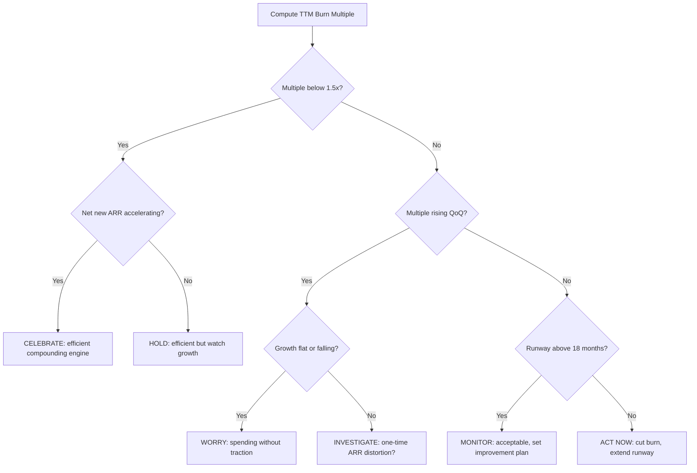

### Direct Answer

**Burn multiple** is the single cleanest measure of how much cash a SaaS company torches to manufacture one dollar of new annual recurring revenue. You calculate it as net cash burn divided by net new ARR over the same period, and a result under 1.0x is genuinely excellent while anything above 2.0x in the post-ZIRP era should make a board nervous. You should *worry* about your burn multiple when it climbs quarter-over-quarter while growth stays flat or decelerates, and you should *celebrate* it when it falls below 1.5x even as net new ARR accelerates, because that combination is the rare signal that you have found a repeatable, capital-efficient growth engine rather than a money-fed one.

> **TLDR**
> - **Burn multiple = Net Burn / Net New ARR.** It answers one question: "How many dollars did we set on fire to add one dollar of recurring revenue?"
> - **The metric was coined by David Sacks** of Craft Ventures in April 2020 specifically because it captures *everything* the income statement and the cash flow statement see at once — unlike Magic Number, which only watches sales and marketing.
> - **Post-ZIRP benchmarks are brutal:** under 1.0x is amazing, 1.0-1.5x great, 1.5-2.0x acceptable, 2.0-3.0x suspect, and above 3.0x is a capital-efficiency emergency.
> - **Worry** when the multiple rises while growth is flat or falling, when it is propped up by one-time ARR, or when runway compresses below 18 months with a multiple above 2.0x.
> - **Celebrate** when the multiple falls *while* net new ARR accelerates, when it holds steady through a pricing change, or when you can show it improving cohort-by-cohort.
> - **Counter-case:** deep infrastructure, hardware-attached, and pre-product-market-fit companies legitimately run high multiples for years — judging them on a 1.5x bar destroys good businesses.
> - **The metric is a verb, not a noun:** the *trend* and the *story behind the trend* matter more than any single quarter's number.

## What Burn Multiple Actually Measures

### 1. The one-sentence definition and why it beats every alternative

Burn multiple is **net cash burn divided by net new ARR** over an identical measurement window — usually a quarter or a trailing twelve months. If you burned $4M of cash last quarter and added $2M of net new ARR, your burn multiple is 2.0x. The intuition is visceral: you spent two dollars to buy one dollar of durable, recurring revenue.

The reason the metric matters more than the dozen other efficiency ratios floating around a board deck is **comprehensiveness**. Consider what each competing metric ignores:

- **Magic Number** only looks at sales and marketing spend against new revenue. It is blind to the R&D org, the G&A bloat, the office leases, and the customer-success headcount you hired to keep churn down. A company can post a beautiful 1.2 Magic Number and still be a cash bonfire because its product and operations teams are oversized.
- **CAC payback** measures only the time to recoup *customer acquisition* cost. It says nothing about the rest of the P&L and nothing about gross-margin drag.
- **Rule of 40** combines growth and profit but uses a margin definition (often EBITDA or FCF margin) that can be gamed with capitalized software development, one-time items, and creative classification.
- **Net burn alone** tells you the speed of the bleed but not whether the spending is *productive*. A company burning $10M a quarter while adding $20M of net new ARR is a rocket; a company burning $3M while adding $500K is a problem. Raw burn cannot distinguish them.

Burn multiple folds the *entire* cash story into the numerator and the *entire* durable-revenue story into the denominator. There is nowhere to hide. That is precisely why David Sacks called it "the most important metric to track" for a SaaS company in a capital-constrained environment.

| Metric | What it captures | What it ignores | Gameable? |
|---|---|---|---|
| Burn Multiple | All cash out vs. all net new ARR | Nothing material — it is comprehensive | Hard to game; cash is cash |
| Magic Number | S&M spend vs. new revenue | R&D, G&A, CS, infra cost | Yes — shift headcount out of S&M |
| CAC Payback | Months to recoup acquisition cost | Whole P&L beyond acquisition | Moderate — allocation choices |
| Rule of 40 | Growth rate + profit margin | Cash timing, balance-sheet health | Yes — margin definition flex |
| Net Burn | Absolute cash consumption | Whether spend produces growth | Low, but low signal too |
| Gross Margin | Unit-level delivery cost | Sales/marketing/operating cost | Moderate — COGS classification |

### 2. The exact formula, with the definitions that trip teams up

The formula looks trivial. The definitions are where finance teams lose half a turn of the multiple in either direction.

**Net Burn** is the *change in cash and cash equivalents* over the period, adjusted to exclude financing activities. In plain terms: how much did your bank balance shrink, ignoring money you raised or debt you drew? If you started the quarter with $40M and ended with $36M, and you did not raise or draw debt, your net burn is $4M. If you raised $20M mid-quarter and still ended at $36M, your *operating* net burn is $24M — the raise masked the real consumption. **Always strip financing activity out of the numerator.** This is the single most common error: teams report a flattering multiple because a fresh raise hid the burn.

**Net New ARR** is *ending ARR minus beginning ARR*. It is "net" because it already absorbs churn and contraction. If you started the quarter at $20M ARR, signed $3M of new and expansion ARR, and lost $1M to churn and downgrades, your net new ARR is $2M — not $3M. **The denominator must be net, not gross.** Using gross new ARR is the second most common error; it flatters the multiple by pretending churn does not exist.

So the honest formula is:

```
Burn Multiple = (Beginning Cash − Ending Cash, excluding financing) ÷ (Ending ARR − Beginning ARR)
```

A worked example clarifies the discipline:

| Line item | Value | Note |
|---|---|---|
| Beginning cash | $40.0M | Start of Q |
| Ending cash | $35.5M | End of Q |
| Capital raised in quarter | $0.0M | Clean — no raise |
| Net burn | $4.5M | $40.0M − $35.5M |
| Beginning ARR | $24.0M | Start of Q |
| New + expansion ARR | $4.0M | Bookings, net of nothing yet |
| Churned + contracted ARR | $1.0M | Lost logos and downgrades |
| Ending ARR | $27.0M | $24.0M + $4.0M − $1.0M |
| Net new ARR | $3.0M | $27.0M − $24.0M |
| **Burn multiple** | **1.5x** | $4.5M ÷ $3.0M |

A 1.5x result here is "great" by post-ZIRP standards. But notice how fragile the number is: if a $5M financing tranche had landed and gone uncounted, ending cash would read $40.5M, net burn would read −$0.5M, and the company would report an absurd, meaningless *negative* burn multiple. Discipline in the numerator is everything.

### 3. The window problem — quarterly noise versus trailing-twelve-month truth

A single quarter's burn multiple can lie. SaaS revenue recognition, seasonal enterprise buying, and the lumpiness of large deals mean any one quarter can produce a multiple that is 2x too high or 2x too low. A quarter where three big logos all closed on the last day produces a flattering multiple; a quarter where the pipeline slipped a week produces a terrifying one. Neither reflects the underlying engine.

**Always report both the quarterly figure and the trailing-twelve-month (TTM) figure.** The TTM number smooths seasonality and deal lumpiness and is the version a serious board and a serious investor will anchor on. The quarterly number is a leading indicator — useful for spotting a turn — but it is not the verdict.

| Reporting window | Best use | Failure mode |
|---|---|---|
| Single month | Operational tripwire only | Pure noise; never report to board |
| Single quarter | Leading-edge trend detection | Deal-timing distortion |
| Trailing 6 months | Compromise for fast-moving startups | Still seasonal-sensitive |
| Trailing 12 months (TTM) | The board-grade headline number | Slow to reflect a recent turn |
| Annual (fiscal year) | Investor diligence, retrospective | Too lagging for steering |

A worked illustration of the window problem makes the point concrete. Imagine a Series-B company with the following four quarters. In Q1 it burns $3.0M and adds $2.8M of net new ARR — a 1.07x multiple, "great." In Q2 a large enterprise deal slips by two weeks across the quarter boundary; the company burns $3.2M and adds only $1.4M of net new ARR — a 2.29x multiple, "suspect." In Q3 the slipped deal closes alongside the normal pipeline; the company burns $3.1M and adds $4.2M — a 0.74x multiple, "amazing." In Q4 things normalize: $3.3M burned, $2.9M added — 1.14x. Anyone reading only the Q2 number would conclude the company was in trouble; anyone reading only Q3 would conclude it had cracked the code. Both conclusions are wrong. The TTM figure — $12.6M of total burn divided by $11.3M of total net new ARR — is 1.11x, and *that* is the honest verdict: a healthy, efficient company whose quarterly numbers are simply noisy because of deal timing.

| Quarter | Net burn | Net new ARR | Quarterly multiple | Grade in isolation |
|---|---|---|---|---|
| Q1 | $3.0M | $2.8M | 1.07x | Great |
| Q2 | $3.2M | $1.4M | 2.29x | Suspect (false alarm) |
| Q3 | $3.1M | $4.2M | 0.74x | Amazing (false comfort) |
| Q4 | $3.3M | $2.9M | 1.14x | Great |
| **TTM total** | **$12.6M** | **$11.3M** | **1.11x** | **Great — the truth** |

The operational discipline that follows from this: report the TTM number as the headline, show the quarterly series as a trend line beneath it, and *never* let a single quarter — good or bad — drive a strategic decision on its own. A quarterly spike is a prompt to investigate, not a verdict to act on. The only exception is a sustained, multi-quarter directional move; three consecutive quarters of a rising multiple is signal, not noise, and it is exactly the worry pattern covered later in this entry.

## The Post-ZIRP Benchmark Table

### 4. What "good" means now versus what it meant in 2021

The zero-interest-rate period — ZIRP — ran roughly from 2009 through early 2022, and it warped every capital-efficiency benchmark in venture. When money was free, a 5x burn multiple was tolerated and sometimes celebrated as "leaning into the market." Growth was the only number that mattered, and investors would fund any amount of burn that produced top-line acceleration. That world ended in 2022 when the Federal Reserve began raising rates, the IPO window slammed shut, and late-stage capital evaporated.

The current — post-ZIRP — benchmark is far less forgiving. The widely cited grading scale, popularized by Craft Ventures and reinforced by SaaS benchmarking outfits, looks like this:

| Burn multiple (TTM) | Grade | Interpretation | Investor reaction |
|---|---|---|---|
| Below 1.0x | Amazing | Near-self-funding growth engine | "How do we put more in?" |
| 1.0x – 1.5x | Great | Strong, fundable efficiency | Term sheet, good multiple |
| 1.5x – 2.0x | Good | Acceptable; watch the trend | Fundable with a story |
| 2.0x – 3.0x | Suspect | Inefficient; needs a clear plan | Hard questions, lower multiple |
| Above 3.0x | Bad | Capital-efficiency emergency | Down-round risk; bridge talk |

A subtle but critical point: **negative burn multiple is undefined and meaningless, not "infinitely good."** If you are cash-flow positive (no net burn) you do not have a burn multiple — you have graduated past the metric. If you are *losing* ARR (negative net new ARR) while burning cash, the ratio goes negative, but that is a five-alarm fire, not an achievement. Never report a negative burn multiple as if it were a low one; describe the situation in words instead.

### 5. Stage-adjusting the benchmark

The flat table above is a starting point, not a verdict. A pre-Series-A company finding product-market fit and a Series-D company optimizing for an IPO should not be held to the same bar. Reasonable stage-adjusted expectations:

| Stage | ARR range | "Good" burn multiple | Rationale |
|---|---|---|---|
| Seed / pre-PMF | < $1M | Not meaningful | Denominator too small/volatile |
| Series A | $1M – $5M | 2.0x – 3.0x acceptable | Building the engine, not running it |
| Series B | $5M – $15M | 1.5x – 2.5x | Engine should be visible |
| Series C | $15M – $40M | 1.0x – 2.0x | Efficiency now expected |
| Series D+ / pre-IPO | $40M+ | Below 1.5x, trending to <1.0x | Path to FCF must be evident |

At seed stage the burn multiple is statistical garbage — a single $50K contract can swing it by a full turn — so do not over-index on it. By Series C and beyond, a multiple above 2.5x is a genuine red flag regardless of how good the growth story sounds.

The reason the bar tightens with stage is not arbitrary investor preference; it is structural. A Series-A company is *building* its go-to-market machine — hiring its first sales reps, testing its first paid channels, writing its first repeatable playbook. Almost none of that spending has yet produced revenue, because there is a multi-quarter lag between hiring a rep and that rep carrying a full quota. The burn multiple of a Series-A company therefore reflects investment in a machine that does not yet run at scale, and a 2.5x or even 3.0x number is simply the cost of construction. By Series C, that machine should be *built* — the playbook should be repeatable, reps should ramp predictably, channels should have known efficiency curves — and continued high burn now reflects an inefficient running machine rather than an unfinished one. The same number means "under construction" at one stage and "broken" at another.

This is also why investors discount a Series-D company's "we're investing for growth" narrative far more harshly than a Series-A company's. At Series A, investing for growth is the *job*. At Series D, with a built machine and a presumed path to an IPO or a strategic exit, "investing for growth" that produces a 3x burn multiple reads as an inability to find efficient growth — and the public-market comparables that a late-stage company will eventually be valued against punish exactly that. A practical heuristic: at each subsequent funding stage, your "acceptable" burn multiple ceiling should fall by roughly half a turn, and by the time you are within eighteen months of a contemplated IPO, the market expects a clear, modeled path to a burn multiple below 1.0x — that is, to genuine cash-flow break-even.

### 6. The growth-adjusted nuance the flat table misses

Two companies can both post a 2.0x burn multiple and be in completely different health. Company A is growing net new ARR 80% year-over-year; Company B is growing 15%. The flat benchmark grades them identically as "suspect." That is wrong. **A high burn multiple paired with rapid, accelerating growth is a fundamentally different — and more fundable — situation than the same multiple paired with deceleration.**

The reason is optionality. The fast grower can choose to dial spend down next year and the multiple will collapse toward 1.0x because the revenue base keeps compounding. The slow grower has no such lever — cutting spend cuts growth proportionally. This is why the *pairing* of burn multiple with the growth rate, and especially with the growth *trend*, is the real diagnostic. We will return to this in the worry-versus-celebrate framework below.

Consider the two companies side by side. Company A burns $8M to add $4M of net new ARR — a 2.0x multiple — but its net new ARR grew 80% year over year, from roughly $2.2M the prior year. Company B also burns $8M to add $4M — the identical 2.0x multiple — but its net new ARR grew only 15%, from roughly $3.5M the prior year. The flat benchmark stamps both "suspect." Now ask the question that actually matters: what happens if each company is forced to cut burn 30% next year? Company A's growth is being driven by a compounding engine — product pull, expansion, an acquisition channel that is still scaling — so a 30% spend cut might slow net new ARR growth from 80% to 55%, and the burn multiple would fall from 2.0x toward roughly 1.2x. Company B's growth is almost entirely *bought*; a 30% spend cut would likely cut its net new ARR close to proportionally, leaving the burn multiple stuck near 2.0x or worse while growth collapses toward single digits. Same multiple today, completely different futures.

| Dimension | Company A (fast grower) | Company B (slow grower) |
|---|---|---|
| Net burn | $8M | $8M |
| Net new ARR | $4M | $4M |
| Burn multiple | 2.0x | 2.0x |
| YoY net new ARR growth | 80% | 15% |
| Flat-benchmark grade | Suspect | Suspect |
| Effect of a 30% spend cut | Multiple falls toward ~1.2x | Multiple stuck; growth collapses |
| Real diagnosis | Fundable; investing into a real engine | Inefficient; engine may not exist |

This is the single most important refinement to the flat benchmark, and it is why a sophisticated investor will always ask for the growth rate and the growth *trajectory* in the same breath as the burn multiple. A burn multiple without a growth rate next to it is half a sentence.



## The Origin Story: Sacks, Craft Ventures, and 2020

### 7. Why David Sacks coined it when he did

David Sacks — founding COO of PayPal, founder of Yammer, and a general partner at Craft Ventures — published the burn multiple concept in April 2020, in the first weeks of the COVID-19 demand shock. The timing was not an accident. Craft's portfolio companies were suddenly facing a market where fundraising had frozen and every founder needed a single, honest number to answer the question every board was asking: *"Is our spending actually working?"*

Sacks's argument was that the SaaS community had drowned itself in vanity-adjacent metrics — Magic Number, LTV/CAC ratios with optimistic LTV assumptions, Rule of 40 with flexible margin definitions — and that founders had lost the plot. He wanted **one number that the CEO could not lie to themselves about.** Cash burn is cash burn; the bank statement does not negotiate. Net new ARR is the durable revenue that survived churn. Dividing one by the other produces a number that is almost impossible to dress up.

His grading scale — under 1x amazing, 1-1.5x great, 1.5-2x good, 2-3x suspect, above 3x bad — became the de facto industry standard within roughly a year, cited by growth investors from Bessemer to ICONIQ and embedded in the diligence templates of nearly every late-stage fund.

### 8. How the metric reshaped board conversations

Before burn multiple, a typical board efficiency discussion bounced between four or five ratios, each with its own caveats, and usually ended with the CEO arguing that the unflattering ones were "not the right metric for our stage." Burn multiple collapsed that argument. It became the *opening* number of the efficiency section of the board deck — stated first, stated as a single figure, stated with its trend.

The cultural effect was significant. Founders who had been rewarded through the ZIRP years for raising ever-larger rounds and "going big" were suddenly graded on a metric that punished exactly that behavior. Companies like Snowflake (SNOW), which went public in September 2020 with a famously efficient growth model, became reference points; later, the market's brutal re-rating of high-burn names through 2022 — and the well-publicized struggles of companies that had run 4-5x multiples — turned burn multiple from a Craft Ventures blog post into a survival metric.

It is worth being honest about the metric's limits even as it became the industry standard. Burn multiple is a *whole-company* number, which is its great strength — nowhere to hide — but also a limitation: it does not, by itself, tell you *which part* of the company is inefficient. A 2.5x multiple could be caused by an oversized R&D org, a saturated sales team, a gross-margin problem in infrastructure, or bloated G&A, and the single ratio cannot distinguish them. That is why the diagnostic cross-cuts described earlier in this entry exist; the burn multiple flags *that* there is a problem, and the decomposition tells you *where*. A second limitation: because the denominator is net new ARR, the metric is unstable for any company whose ARR is small or volatile, which is why it is close to useless pre-product-market-fit. A third: it says nothing about the *quality* of the revenue in the denominator — a dollar of net new ARR from a flight-risk logo on a one-year deal counts identically to a dollar from a sticky multi-year enterprise account, even though they are worth very different amounts to the business. None of these limitations make the metric less valuable; they simply mean it is the *first* number you look at, not the *last*.

| Era | Dominant question | Dominant metric | What got funded |
|---|---|---|---|
| 2009–2021 (ZIRP) | "How fast can you grow?" | YoY growth rate | Growth at almost any burn |
| 2022–2023 (reset) | "Can you survive?" | Burn multiple, runway | Efficiency and survivors |
| 2024–onward (post-ZIRP) | "Is growth *durable and efficient*?" | Burn multiple + Rule of 40 | Efficient compounders |

## When To Worry About Your Burn Multiple

### 9. Worry signal one — the multiple rises while growth is flat or falling

This is the canonical danger pattern and the one that should trigger the loudest alarm. If your burn multiple climbs from 1.8x to 2.4x to 3.1x over three quarters while net new ARR stays flat or declines, you are watching a growth engine *break* in real time. You are spending progressively more cash to buy the same or less durable revenue. Every incremental dollar is less productive than the last.

The underlying cause is almost always one of three things: **sales-capacity saturation** (you hired reps faster than you generated pipeline, so new reps are starving), **channel exhaustion** (your best acquisition channel has hit diminishing returns and you are now buying expensive marginal customers), or **product-market-fit erosion** (a competitor, a pricing problem, or a feature gap is quietly raising your churn and contraction, which shrinks the *net* in net new ARR even as gross bookings hold).

The fix is never "raise more and keep going." The fix is to diagnose which of the three is happening and address the root cause before adding capital. Adding fuel to an inefficient engine just burns the fuel faster.

Diagnosing *which* of the three causes is in play requires three specific cross-cuts of the data. First, to test for **sales-capacity saturation**, look at ramped-rep productivity: take only reps who have been in seat long enough to be fully ramped and measure their average net new ARR per rep over the last three quarters. If that number is falling while headcount is rising, you hired ahead of pipeline and your new reps are starving — the multiple is rising because you are paying for capacity you cannot feed. Second, to test for **channel exhaustion**, decompose net new ARR by acquisition channel and compute a per-channel burn efficiency. If your historically best channel is now showing a sharply higher cost per dollar of net new ARR, that channel has hit diminishing returns and the marginal customer is expensive. Third, to test for **product-market-fit erosion**, separate gross new ARR from churn and contraction. If gross bookings are holding flat but the *net* number is shrinking, the problem is not acquisition at all — it is leakage — and no amount of sales spend will fix a denominator that is draining out the bottom.

| Suspected cause | Diagnostic cut | Telltale signal | Correct response |
|---|---|---|---|
| Sales-capacity saturation | Ramped-rep net new ARR per head | Falling productivity, rising headcount | Pause hiring; rebuild pipeline first |
| Channel exhaustion | Per-channel burn efficiency | Best channel's cost per ARR dollar spiking | Reallocate spend; find new channels |
| PMF erosion / churn | Gross new ARR vs. net new ARR | Gross flat, net shrinking | Fix retention before adding spend |
| All three at once | Cohort burn-efficiency waterfall | Every recent cohort worse than the last | Structural reset; do not raise into it |

The cardinal error is to skip the diagnosis and treat a rising burn multiple as a fundraising problem. It is not a fundraising problem; it is an engine problem, and a new round of capital injected into a broken engine simply produces a larger, faster, more expensive failure — and a far worse position at the *next* raise, because the new investors will see the multiple deteriorate on their watch.

### 10. Worry signal two — the multiple is propped up by non-recurring or one-time ARR

A flattering denominator can hide a bad engine. If your net new ARR for the quarter included a $2M three-year prepaid deal with a logo that is unlikely to renew, a large one-time professional-services contract miscategorized as ARR, or a usage spike from a single customer that will not recur, your reported burn multiple is *better than reality*. The honest test: **strip out anything that is not genuinely recurring and likely to renew, and recompute.** If the multiple jumps from 1.6x to 2.4x after that scrub, the 1.6x was a story you told yourself.

This is also why pricing-model context matters. Usage-based businesses must be especially careful: consumption revenue can be volatile, and a quarter inflated by one customer's seasonal spike will produce a deceptively low multiple that reverses next quarter. The discipline of separating *committed* recurring revenue from *variable* consumption revenue is essential for an honest denominator.

### 11. Worry signal three — runway is compressing below 18 months with a multiple above 2.0x

Burn multiple is an *efficiency* metric; runway is a *survival* metric. The two together define your strategic freedom. A 2.5x burn multiple is uncomfortable but survivable if you have 36 months of runway and a credible plan to bring the multiple down. The *same* 2.5x multiple with 14 months of runway is an emergency, because you will be forced to raise — or sell, or cut hard — from a position of weakness, into a market that prices inefficiency punitively.

The rule of thumb: **if your TTM burn multiple is above 2.0x and your runway is under 18 months, the burn multiple stops being a metric to improve and becomes a problem to solve this quarter.** Eighteen months is the practical floor because a fundraise itself consumes three to six months, and you never want to be raising with less than nine to twelve months of cash visible to the new investor.

| Burn multiple | Runway > 30 mo | Runway 18–30 mo | Runway < 18 mo |
|---|---|---|---|
| < 1.5x | Celebrate; consider investing more | Healthy; stay the course | Tight cash but efficient — raise calmly |
| 1.5x – 2.0x | Fine; monitor the trend | Acceptable; set improvement plan | Caution; tighten now |
| 2.0x – 3.0x | Time to improve, no panic | Active concern; cut plan needed | Emergency; act this quarter |
| > 3.0x | Structural fix required | Serious; restructure spend | Crisis; cut hard or bridge |

### 12. Worry signal four — the multiple disagrees with the Rule of 40 story

A useful cross-check: burn multiple and Rule of 40 should tell a *consistent* story. If your Rule of 40 score looks healthy (say 45) but your burn multiple is 3.0x, one of the two numbers is being flattered. The most common explanation is that the "profit" component of your Rule of 40 score is computed on an EBITDA or adjusted basis that capitalizes software development costs, excludes stock-based compensation, or treats one-time items generously — so the income statement looks better than the cash flow statement. Burn multiple, anchored in actual cash, does not allow that flattery. **When the two metrics disagree, trust the burn multiple, because cash does not have accounting policies.**

The mechanics of the divergence are worth spelling out, because a CFO will be asked about it in diligence. The Rule of 40 adds your revenue growth rate to a profit-margin figure, and the profit figure is where the flexibility lives. If a company capitalizes a large fraction of its engineering payroll as a software-development asset on the balance sheet rather than expensing it through the income statement, its reported operating margin improves — sometimes by several points — while not a single dollar of cash behaves differently. The cash still left the building to pay engineers. Burn multiple, which reads the bank statement, sees that cash leaving; the Rule of 40, reading an adjusted income statement, does not. The same is true of stock-based compensation: a company that grants heavily and reports "adjusted EBITDA" excluding SBC will show a healthier Rule of 40 than its cash position warrants. SBC is non-cash, so it does not hit the burn multiple numerator directly — but it dilutes shareholders, and a company leaning on it is borrowing from the cap table to flatter a metric.

| Adjustment | Effect on Rule of 40 | Effect on burn multiple |
|---|---|---|
| Capitalizing software dev costs | Improves reported margin | None — cash still spent |
| Excluding SBC from "adjusted" profit | Improves reported margin | None directly; dilution hidden |
| One-time gains in the period | Improves reported margin | None — not recurring revenue |
| Deferred revenue prepayment timing | Minor | Flatters cash; distorts numerator |
| Generous bad-debt or churn assumptions | Can flatter growth component | None — net ARR is net ARR |

The practical takeaway for board reporting: present burn multiple and Rule of 40 *on the same page*, and if they disagree by a wide margin, lead with the explanation rather than letting an investor find the gap themselves. A CFO who proactively says "our Rule of 40 is 45 but our burn multiple is 2.6x; the gap is driven by capitalized engineering costs, and here is the reconciliation" earns credibility. A CFO who lets the board discover the gap loses it.

## When To Celebrate Your Burn Multiple

### 13. Celebrate signal one — the multiple falls while net new ARR accelerates

This is the single best signal in SaaS finance, and it is rare. When your burn multiple drops from 2.0x to 1.5x to 1.1x *while* your net new ARR is simultaneously growing quarter-over-quarter, you have found something genuinely valuable: a growth engine where each incremental dollar of revenue is *more* efficient than the last. That is the textbook signature of compounding product-market fit, an acquisition channel that is scaling rather than saturating, and an expansion motion (net revenue retention above 100%) that is doing free work for you.

This is the pattern that makes investors compete to give you money on favorable terms, because it implies you could grow even faster with more capital *without* sacrificing efficiency. It is the opposite of the worry-signal-one pattern, and it should be the explicit headline of your board deck when it occurs.

It is worth being precise about *why* this pattern is so rare and so valuable. In most companies, the burn multiple and the growth rate trade off against each other: you can buy faster growth, but each incremental unit of growth costs more than the last, so pushing the growth pedal *raises* the multiple. The celebrate-signal-one pattern breaks that trade-off — growth accelerates *and* efficiency improves at the same time. That can only happen when one of a small number of structural advantages is present. It might be a *product-led* motion where adoption compounds without proportional sales spend; the product itself is the growth engine, so adding revenue does not require adding cost at the same rate. It might be a *network or data effect* where each new customer makes the product more valuable to the next, lowering acquisition friction over time. It might be a *land-and-expand* model where the expansion motion — selling more to existing accounts — is carrying an increasing share of net new ARR at near-zero incremental acquisition cost. Or it might be a *brand and category* effect where, having become the default name in a category, inbound demand rises faster than spend.

When you see this pattern, the correct board conversation is not "should we keep doing this" — it is "can we *responsibly* pour more fuel on this fire." A company with an improving multiple and accelerating growth is one of the few situations in which raising more capital is unambiguously correct, because the capital is going into an engine that is *getting more* efficient as it scales. The board slide should make this explicit: show the burn multiple line falling, show the net new ARR bars rising, and state in one sentence the structural reason the two are moving together. That single chart, when it is real, is worth more than any narrative in the deck.

### 14. Celebrate signal two — the multiple holds steady or improves through a pricing or packaging change

Pricing changes are dangerous. They can spike churn, confuse the sales motion, and temporarily depress net new ARR. If you execute a meaningful pricing or packaging change — moving to a usage-based model, introducing a new tier, repricing the base — and your burn multiple holds steady or *improves* through the transition, that is a strong, celebrate-worthy signal. It means the change was accretive rather than disruptive, and that your revenue base absorbed a structural shift without efficiency loss. Few teams execute pricing changes this cleanly; when you do, it is worth recognizing.

### 15. Celebrate signal three — the multiple improves cohort-by-cohort

The most sophisticated version of celebration is not about the blended company number at all — it is about *cohort* burn efficiency. If you can show that customers acquired in Q4 of last year cost less burn per dollar of net new ARR than customers acquired in Q1, and that Q1 was better than the prior Q4, you are demonstrating that your *machine* is improving, not just that one quarter happened to be lucky. Cohort-level improvement is durable in a way that a single blended quarter is not, and a board that sees a clean cohort-improvement chart will trust the engine far more than one that sees a single good headline number.

### 16. Celebrate signal four — the multiple is low *because* of expansion, not just new logos

A burn multiple driven down by strong net revenue retention — existing customers expanding faster than others churn — is structurally healthier than the same multiple driven entirely by new-logo acquisition. Expansion revenue carries near-zero incremental acquisition cost; you already paid to land the customer. If your net new ARR is, say, 40% expansion and 60% new logo, and the expansion portion is growing, your burn multiple is resting on a much more stable foundation than a competitor whose identical multiple is 100% new-logo-driven and therefore fully exposed to acquisition-cost inflation.

| Celebrate signal | Why it is durable | What to show the board |
|---|---|---|
| Multiple falls while ARR accelerates | Each marginal dollar is more efficient | QoQ multiple line vs. net new ARR bars |
| Multiple steady through pricing change | Structural change absorbed cleanly | Before/after multiple, churn overlay |
| Multiple improves cohort-by-cohort | Engine improving, not luck | Cohort burn-efficiency waterfall |
| Multiple low due to expansion (NRR>100%) | Expansion has near-zero CAC | Expansion vs. new-logo split of net new ARR |

## Counter-Case: When Burn Multiple Is the Wrong Lens

### 17. Deep infrastructure and platform companies

The burn multiple grading scale was built for application-layer SaaS — CRMs, marketing tools, vertical software — where the time from "spend a dollar" to "book recurring revenue" is short. It does *not* fit deep infrastructure companies: databases, developer platforms, security infrastructure, and data-cloud businesses. These companies legitimately invest years of cash into R&D before the revenue curve bends, and during that period their burn multiple can sit at 4x, 5x, or higher without indicating any dysfunction.

Snowflake (SNOW), MongoDB (MDB), and Datadog (DDOG) all ran burn profiles in their early years that would fail a naive 1.5x test, and all three went on to become category-defining public companies. The reason is that infrastructure carries a long *build* phase whose return is non-linear: the revenue does not arrive proportionally to spend, it arrives in a delayed step-change once the platform crosses an adoption threshold. **Judging a pre-inflection infrastructure company on a 1.5x burn multiple bar will cause you to kill businesses that are simply early in a longer, lumpier curve.** The right diagnostic for these companies is the *trajectory* of the multiple and the leading indicators of platform adoption (developer signups, design wins, consumption growth among early customers), not the absolute level.

### 18. Hardware-attached and capital-intensive models

Companies that pair software with hardware — connected devices, robotics, IoT platforms — carry inventory, manufacturing, and supply-chain cash needs that have nothing to do with the efficiency of their revenue engine. Their net burn numerator is inflated by working capital tied up in physical goods. A burn multiple computed naively for such a company conflates manufacturing capital intensity with go-to-market inefficiency, and the two need to be separated. For these models, you compute a *software-segment* burn multiple separately, or you accept that the blended number will be structurally higher and benchmark against hardware-attached peers rather than pure SaaS.

### 19. Pre-product-market-fit companies

Before product-market fit, the burn multiple is not a useful steering metric — it is statistical noise. The denominator (net new ARR) is tiny and volatile; a single contract signing or churning swings the multiple by multiple turns. Worse, the *purpose* of the pre-PMF phase is exploration: deliberately spending cash to run experiments, kill bad hypotheses, and find the motion that works. That spending is *correct* even though it produces an ugly multiple. **Holding a pre-PMF company to a 2x burn multiple bar incentivizes premature optimization of an engine that does not yet exist.** The right pre-PMF metrics are qualitative PMF signals — retention of early cohorts, organic pull, willingness to pay — not the burn multiple. The burn multiple becomes meaningful only once there is a repeatable motion to measure.

### 20. Deliberate, time-boxed land-grab windows

There are genuine, defensible situations where a company *chooses* to run a high burn multiple for a defined window: a winner-take-most market where being first to scale creates a durable moat, a competitive displacement window that will not stay open, or a regulatory or platform shift that creates a one-time opening. In these cases a 3x multiple for four quarters can be the correct decision. The discipline that separates a defensible land-grab from reckless burn is **three conditions: the window must be explicitly time-boxed, the company must have the runway to survive the whole window plus a buffer, and there must be a pre-committed plan for what brings the multiple back below 1.5x once the window closes.** Absent all three, "land grab" is just a story that justifies inefficiency.

| Counter-case | Why the standard bar fails | Right diagnostic instead |
|---|---|---|
| Deep infrastructure | Long non-linear build phase | Multiple *trajectory* + adoption leading indicators |
| Hardware-attached | Working capital inflates numerator | Software-segment multiple; hardware peer set |
| Pre-PMF | Denominator is statistical noise | Qualitative PMF signals; cohort retention |
| Time-boxed land grab | High burn is a deliberate, bounded choice | Window date + runway buffer + exit plan |
| Just-raised growth round | Mandate is to deploy, not conserve | Plan-versus-actual deployment efficiency |

## Operationalizing Burn Multiple

### 21. Building the board-ready burn multiple slide

A burn multiple that lives only in the CFO's spreadsheet does no good. It belongs on a single, well-constructed board slide, presented the same way every quarter so the trend is unmistakable. The slide should contain exactly five things:

- **The headline number** — the TTM burn multiple, stated as a single figure, large and unambiguous.
- **The trend line** — at minimum the last six quarters of quarterly burn multiple, so the direction is visible at a glance.
- **The decomposition** — net burn and net new ARR shown separately, because the *reason* the multiple moved matters more than the move itself.
- **The runway pairing** — months of runway at current burn, because efficiency without survival context is incomplete.
- **The one-sentence story** — a plain-language explanation of *why* the multiple is where it is and what management is doing about it.

Resist the temptation to add adjusted, normalized, or "ex-one-time" variants on the same slide. One number, one trend, one story. The credibility of the metric comes from its starkness.

### 22. Setting an internal burn multiple target

The right internal target is not a single static number — it is a *glide path*. A Series-B company at 2.2x should not set a target of 1.0x next quarter; that is unachievable and demoralizing. It should set a glide path: 2.2x this quarter, 2.0x next, 1.8x the quarter after, with the specific operating levers identified for each step. The glide path makes the metric a management tool rather than a scoreboard. Each step down should be tied to a concrete action: a pricing change, a channel-mix shift, a hiring-pace adjustment, a gross-margin improvement.

A worked glide path makes the discipline tangible. Suppose a Series-B company is at 2.2x and the board has agreed it needs to reach 1.5x within a year to be cleanly fundable for a Series C. Rather than declaring "get to 1.5x," management commits a quarter-by-quarter path with a named owner and a named lever for each step:

| Quarter | Target multiple | Primary lever | Owner | Expected mechanism |
|---|---|---|---|---|
| Q1 | 2.2x → 2.0x | Pause non-quota-carrying hiring | COO | Shrinks numerator without touching pipeline |
| Q2 | 2.0x → 1.8x | Launch expansion / upsell motion | VP Customer Success | Grows net new ARR via near-zero-CAC expansion |
| Q3 | 1.8x → 1.65x | Reprice new business +12% | VP Sales / Finance | Grows ARR per deal; tests demand elasticity |
| Q4 | 1.65x → 1.5x | Gross-margin program (infra costs) | VP Engineering | Shrinks burn without slowing growth |

Notice the ordering principle embedded in this path: the early steps lean on the *lowest-risk* levers — a hiring pause and an expansion motion — and the higher-risk levers, repricing and structural cost work, come later and only if the earlier steps have not already closed the gap. If Q1 and Q2 over-deliver, the Q3 repricing can be deferred or softened. The glide path is a plan, not a contract; its value is that it forces management to name *how* the multiple will improve rather than simply *hoping* it will. A board that receives a credible, lever-by-lever glide path will tolerate a currently-high multiple far more readily than a board that hears "we know it's high, we're working on it."

### 23. The levers that actually move the multiple

When you need to bring the multiple down, the levers are finite and they sort cleanly into "improve the denominator" and "shrink the numerator":

| Lever | Side of the ratio | Speed | Risk |
|---|---|---|---|
| Reduce churn / contraction | Grows net new ARR (the net) | Medium | Low — pure upside |
| Increase expansion / NRR | Grows net new ARR | Medium | Low |
| Raise prices on new business | Grows net new ARR | Fast | Medium — may slow new logos |
| Improve gross margin | Shrinks net burn | Slow | Low |
| Shift to efficient channels | Both — more ARR per dollar | Medium | Medium |
| Slow hiring pace | Shrinks net burn | Fast | Medium — may slow growth |
| Cut underperforming programs | Shrinks net burn | Fast | Low if truly underperforming |
| Reduce headcount | Shrinks net burn | Fast | High — morale, capacity |

The ordering matters. **Always exhaust the low-risk denominator levers — churn reduction and expansion — before reaching for the high-risk numerator levers like headcount cuts.** Reducing churn improves the multiple *and* the business; cutting headcount improves the multiple but may damage the growth engine you are trying to make efficient. Burn multiple should never be improved by means that destroy the denominator faster than they shrink the numerator.

### 24. Common ways teams misreport the multiple

A short field guide to the errors that produce a misleading number:

- **Financing in the numerator** — a fresh raise hides the real burn; always strip financing activity.
- **Gross instead of net ARR** — using gross new ARR ignores churn and flatters the denominator.
- **One-time revenue in the denominator** — prepaid multi-year deals or services revenue inflate net new ARR.
- **Cherry-picked window** — reporting only the best quarter rather than the TTM figure.
- **Mismatched periods** — burn measured over one window, ARR over a slightly different one.
- **Ignoring deferred revenue dynamics** — a quarter heavy with annual prepayments looks artificially cash-rich.

A finance team that reports burn multiple honestly will sometimes report an uglier number than a less rigorous peer. That honesty is itself a credibility asset with sophisticated investors, who have seen every flattering trick and discount accordingly.

There is a deeper reason to insist on the honest number even when it hurts. The burn multiple is most useful as an *internal steering instrument*, and an instrument you have miscalibrated to read better than reality will steer you off a cliff. If your true multiple is 2.6x and you have convinced yourself it is 1.6x by counting a fresh raise against burn and a prepaid multi-year deal as recurring revenue, you will make decisions — hiring plans, spend commitments, fundraising timing — appropriate for a 1.6x company. You will discover the real number only when the prepaid deal does not recur, the cash runs lower than your model said, and you are forced to raise from weakness into a market that prices your *actual* 2.6x efficiency. The flattering number does not buy you anything; it merely delays the reckoning and worsens the position you face it from. The discipline of the honest numerator and the honest denominator is not an accounting nicety — it is the difference between a metric that helps you survive and a metric that helps you fool yourself right up until you cannot.

## Burn Multiple In Context With Other Metrics

### 25. Burn multiple is a verb, not a noun

The closing principle is the most important one, and it is why the question "when should you worry versus celebrate" is better than "what number is good." A burn multiple is not a static label you wear — it is a *motion*. A company at 2.2x and falling is in a fundamentally better place than a company at 1.8x and rising, even though the flat benchmark grades the 1.8x company higher. The *trend*, the *story behind the trend*, and the *credibility of the plan* to continue the trend are the real diagnostic. Treat the burn multiple as a verb: ask which direction it is moving and whether you understand why.

It also belongs in a constellation, never alone. Burn multiple paired with the Rule of 40 tells you whether efficiency and the growth-profit balance agree. Paired with CAC payback it tells you whether the acquisition-specific story matches the whole-company story. Paired with net revenue retention it tells you how much of your efficiency is durable expansion versus exposed new-logo acquisition. Paired with runway it tells you whether you have the freedom to fix a problem or are being forced to react. No single metric, burn multiple included, is the whole picture — but burn multiple is the best *opening* number, because it is the one a founder cannot lie to themselves about.

The full constellation, and what each pairing reveals, is worth laying out explicitly so that the burn multiple is never read in isolation:

| Pair with... | The question it answers | What a disagreement means |
|---|---|---|
| Rule of 40 | Do cash efficiency and the growth-profit balance agree? | Income statement is being flattered relative to cash |
| CAC payback | Does the acquisition-specific story match the whole company? | Costs outside acquisition are the real burn driver |
| Net revenue retention | How much efficiency is durable expansion vs. exposed new-logo? | A low multiple resting entirely on new logos is fragile |
| Runway (months) | Do we have the freedom to fix, or must we react? | High multiple plus short runway is an emergency |
| Gross margin | Is delivery cost dragging the whole efficiency picture? | A structural margin problem caps the achievable multiple |
| Growth rate and trend | Is a high multiple a fundable investment or a broken engine? | Same multiple, opposite verdicts depending on growth |

A burn multiple read alongside these companions becomes a diagnostic instrument rather than a single grade. Read alone, it is a blunt label. The best operators treat the burn multiple as the *headline of a paragraph*, not the whole paragraph: it states the topic — capital efficiency — and the surrounding metrics supply the explanation, the durability, and the plan.

For the adjacent metrics that complete the picture, see the cross-linked entries below — particularly the Magic Number entry [[q418]], which covers the sales-and-marketing-only efficiency lens that burn multiple deliberately supersedes, and the Rule of 40 entry [[q417]], which is burn multiple's most important cross-check.

## Related Library Entries

- **[[q418]]** — What's the 'Magic Number' in SaaS, how do you calculate it, and why does it matter more than CAC? The narrower S&M-only efficiency lens that burn multiple was designed to supersede.
- **[[q417]]** — What does the Rule of 40 actually measure, and how do you explain it when your growth + profit score misses? The single most important cross-check against your burn multiple.
- **[[q422]]** — What's the relationship between CAC, MRR, and sales cycle length, and how do you optimize the trade-off? The acquisition-engine mechanics underneath the burn multiple denominator.
- **[[q414]]** — How do you calculate true CAC payback period when you have multi-quarter sales cycles? The acquisition-specific efficiency view that should agree with the whole-company burn multiple.
- **[[q424]]** — What metrics should you include in a board-ready unit economics dashboard, and in what order? Where the burn multiple slide fits in the broader board reporting package.
- **[[q425]]** — How do you calculate 'true' LTV when you have variable churn by cohort age, and some customers never expand? The cohort discipline that makes a celebrate-worthy burn multiple credible.
- **[[q423]]** — How should you forecast financial health when you have multi-year contracts with holdbacks and payment delays? Why one-time and prepaid ARR distorts the burn multiple denominator.
- **[[q419]]** — How do you model CAC for usage-based pricing when you have no upfront contract value? Why consumption revenue volatility complicates an honest burn multiple.

## Sources

1. David Sacks, "The Burn Multiple," Craft Ventures essay, April 2020.
2. Craft Ventures, portfolio operating benchmarks, SaaS capital efficiency series.
3. Bessemer Venture Partners, "State of the Cloud" annual report, capital efficiency section.
4. ICONIQ Growth, "Topline Growth & Operational Efficiency" SaaS benchmarking report.
5. OpenView Partners, "SaaS Benchmarks" annual survey, efficiency metrics.
6. KeyBanc Capital Markets, "SaaS Survey," private SaaS efficiency benchmarks.
7. SaaS Capital, "What's a Good Burn Rate for a SaaS Company?" research note.
8. Battery Ventures, "State of the OpenCloud" report, burn efficiency analysis.
9. Snowflake (SNOW), S-1 registration statement, September 2020, operating metrics.
10. Datadog (DDOG), S-1 registration statement, 2019, cash flow disclosures.
11. MongoDB (MDB), investor relations, historical operating cash flow trends.
12. Tomasz Tunguz, "Burn Multiple and Capital Efficiency," analytics essays.
13. a16z, "16 Startup Metrics," capital efficiency definitions.
14. SaaStr, "The Burn Multiple Is the New Magic Number," operating commentary.
15. Bessemer, "BVP Nasdaq Emerging Cloud Index," post-ZIRP re-rating analysis.
16. McKinsey & Company, "The SaaS Factor," growth and efficiency research.
17. Public Comps, SaaS efficiency dashboard, burn multiple distribution data.
18. Meritech Capital, public SaaS comparables and efficiency screens.
19. ChartMogul, "SaaS Metrics Refresher," ARR and net new ARR definitions.
20. Bessemer Venture Partners, "Scaling to $100M ARR" capital efficiency guide.
21. ICONIQ Growth, "Growth Endurance" report, growth-adjusted efficiency.
22. Craft Ventures, David Sacks podcast commentary on burn multiple application.
23. The SaaS CFO, "How to Calculate Burn Multiple," practitioner guide.
24. Mostly Metrics (CJ Gustafson), burn multiple operating essays.
25. Federal Reserve, FOMC rate decisions 2022, ZIRP-era end timeline.
26. Carta, "State of Private Markets," startup cash and runway data.
27. PitchBook-NVCA Venture Monitor, late-stage funding environment 2022–2024.
28. SaaStr Annual, founder sessions on capital efficiency post-2022.
29. OpenView, "Expansion Revenue and Net Dollar Retention" benchmarking.
30. Bessemer, "Cloud 100" efficiency profiles of category leaders.
31. KeyBanc Capital Markets, churn and net retention benchmark data.
32. SaaS Capital Index, private SaaS valuation and efficiency correlation study.
33. Scale Venture Partners, "Scaling SaaS" efficiency frameworks.
34. Insight Partners, ScaleUp operating benchmarks on burn and growth.
