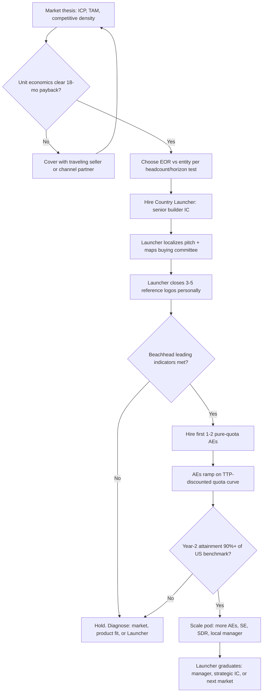

### Direct Answer

The hiring formula for local Account Executives in unfamiliar APAC/EMEA markets is not a single role but a sequenced two-hire pattern: you hire a **Country Launcher** (a senior, founder-adjacent generalist who carries quota *and* builds the operating beachhead) before you hire **pure-quota AEs**, and you delay the second hire until the Launcher has produced 3-5 reference logos and a documented buying-process map. The math that governs the decision is a Time-to-Productive (TTP) discount applied to a US ramp baseline: APAC/EMEA local AEs typically ramp 1.4x-1.9x slower than a domestic AE, carry a quota set at 55-70% of the US number for the first four quarters, and only "pay back" their fully-loaded cost (salary + EOR/entity overhead + travel + management tax) at month 11-16 versus month 6-9 domestically. If a market cannot mathematically clear that payback bar within 18 months on conservative assumptions, you do not hire an AE there yet — you cover it with a traveling regional seller or a partner.

---

## TLDR

- **Hire the Country Launcher first, the AE second.** The Launcher is a senior IC who sells *and* builds: localizes the pitch, maps the buying committee, recruits the next two hires, and produces the reference logos that make pure-quota AEs viable. Treat it as a 12-18 month assignment, not a permanent title.
- **Use a Time-to-Productive (TTP) discount, not a copy-paste US ramp.** Local APAC/EMEA AEs ramp 1.4x-1.9x slower. Model first-year quota at 55-70% of the US number and expect cost payback at month 11-16.
- **Decide EOR vs. entity on a headcount-and-horizon test.** Employer of Record (Deel, Remote, Velocity Global) is correct for 1-5 heads and a <24-month proof window; a local legal entity becomes cheaper and lower-risk past roughly 6-10 heads or when you need to sign local contracts and hold IP.
- **Compensation must be benchmarked locally and structured globally.** Pay to local market percentile (60th-75th), keep OTE leverage (base:variable) aligned to deal complexity and local labor law, and never let FX drift silently re-rate a rep's earnings.
- **The single biggest hiring mistake is the "mini-me" expat or the over-pedigreed multinational refugee.** You want a builder who is comfortable with ambiguity and a thin support stack — not someone whose last job handed them inbound leads, a brand, and a 14-person pod.
- **A bad first hire in a new market costs 9-15 months, not 90 days.** The replacement cycle, the burned reference accounts, and the internal narrative ("APAC doesn't work") compound. Hire slow, fire fast, and gate on leading indicators.
- **Coverage before headcount.** If the unit economics do not clear an 18-month payback on conservative assumptions, cover the market with a traveling seller or channel partner and revisit at the next ARR milestone.

---

## Section 1 — Why "Hire an AE" Is the Wrong First Question

### 1.1 The category error most founders make

When a US-headquartered B2B company decides to "expand into APAC" or "open EMEA," the instinct is to post an Account Executive job, screen for quota attainment, and drop the winner into a territory. This is a category error. In the home market, an AE is a *finishing* role: they inherit a brand, a category, inbound demand, a sales engineering bench, a localized contract template, and a manager who already knows the playbook. The AE's job is conversion.

In an unfamiliar APAC/EMEA market, none of that scaffolding exists. There is no brand recognition, no reference logo a prospect's procurement team will recognize, no localized MSA, often no local case study, and no manager in-region. Dropping a finishing role into a market that needs a *founding* role produces a predictable failure: a competent seller spends nine months discovering that they cannot sell because the inputs they were hired to convert do not exist — and then the company concludes "the market doesn't work."

The correct first question is not "who do I hire to carry quota?" It is **"who do I hire to build the conditions under which quota becomes achievable?"** That person is the Country Launcher.

### 1.2 The two-role model

Every durable APAC/EMEA expansion separates two distinct jobs, even if early on they live in one body:

- **The Country Launcher** — a senior IC, usually 8-15 years of experience, who is part seller, part GM, part recruiter. They localize the value proposition, build the buying-committee map, close the first 3-5 logos personally, establish the partner relationships, and recruit the AEs who come next. They carry a quota, but their quota is deliberately lighter and their success is measured on *beachhead* metrics as much as bookings.
- **The pure-quota AE** — the finishing role. They are hired *after* the Launcher has produced the reference logos and the playbook. They inherit a (thin but real) brand, a localized pitch, and a manager. Their quota is set on a TTP-discounted curve and rises toward the US benchmark over four quarters.

The hiring *formula* is the disciplined sequencing of these two roles plus the math that decides when — and whether — to move from one to the next.

### 1.3 What "unfamiliar" actually means

"Unfamiliar" is not geographic distance — it is the absence of three specific assets: (1) **reference density** (logos a local buyer trusts), (2) **process knowledge** (how committees in that market actually buy, who signs, what procurement demands), and (3) **operating infrastructure** (a way to employ people, contract with customers, get paid, and stay compliant). The hiring formula exists to manufacture all three before you scale headcount against them.

> **Operator note:** Companies like Atlassian (TEAM), which built a genuinely global revenue base, are frequently cited as proof that "product-led expansion needs no local AEs." That is survivorship bias. For most enterprise and mid-market motions — where a human closes a six-figure committee deal — the Launcher-first formula holds.

### 1.4 The four assets a home-market AE never sees missing

It is worth being precise about exactly what scaffolding evaporates the moment a quota carrier crosses a border, because each missing asset maps to a specific compensating action in the formula. In the home market, a competent AE inherits all four of the following silently and never thinks about them; in an unfamiliar APAC/EMEA market, every one of them must be deliberately rebuilt.

| Home-market asset | What it does for the AE | What its absence costs abroad | Who rebuilds it in the formula |
|---|---|---|---|
| **Brand & category awareness** | Prospects already know the company and the problem it solves; cold outreach lands warmer | Every conversation starts from zero; longer cycles, lower reply rates | Country Launcher + localized GTM (q448) |
| **Reference logos** | Procurement and risk-averse buyers see proof; champions can point to peers | Buyers stall at "who else like us uses you?"; deals die in legal/procurement | Launcher closes the first 3-5 logos personally |
| **Process knowledge** | The org already knows who signs, how committees decide, what RFPs demand | Reps single-thread, miss the real economic buyer, get surprised by procurement | Launcher's documented buying-committee map |
| **Operating infrastructure** | Localized contract, payment rails, SE support, a manager in the building | Reps cannot contract, cannot get paid cleanly, onboard alone | EOR/entity decision + interim contract template |

The single most useful reframe for a founder is this: the AE job description you would post in the US *assumes* all four of these. Posting that same job description abroad is, in effect, hiring someone to do a job whose prerequisites do not yet exist. The formula's entire purpose is to construct the prerequisites first.

### 1.5 The "the market doesn't work" failure narrative

There is a predictable, almost scripted failure story that plays out when the category error in 1.1 goes uncorrected. It is worth naming because recognizing the pattern early is itself a form of prevention.

- **Month 0-2:** A capable AE is hired into the new market with a US-style quota. Energy is high; leadership is optimistic.
- **Month 3-5:** Pipeline is thin. The AE explains — accurately — that there are no reference logos, the pitch does not land, and procurement is asking questions no one at HQ anticipated. HQ hears this as excuses.
- **Month 6-8:** Bookings are far below the US ramp curve. The AE is now in clawback territory or below OTE and is quietly interviewing elsewhere.
- **Month 9-12:** The AE leaves or is separated. The first prospective reference accounts have been mishandled. Leadership concludes "the market doesn't work for us" and deprioritizes it.
- **Month 12+:** The market, now starved of attention and investment, genuinely *does* underperform — a self-fulfilling prophecy. The real lesson (we hired a finishing role into a founding-role problem) is never learned.

Every element of the hiring formula in the sections that follow is a countermeasure to a specific step in this narrative. The unit-economics gate prevents entering a market that cannot pay back. The Launcher-first sequence prevents the month 3-5 "no scaffolding" surprise. The TTP discount prevents the month 6-8 quota-miss spiral. The leading indicators prevent the month 9-12 hope-through-four-quarters trap.

---

## Section 2 — The Country Launcher Profile

### 2.1 The non-negotiable traits

The Launcher hire is the single highest-leverage decision in the expansion. Screen for these traits in this priority order:

- **Builder temperament over closer pedigree.** The best Launchers are comfortable when the playbook is a blank page. They have a documented history of being early at something — first rep in a region, first ten employees at a startup, founder of a small business. A flawless quota record at a company with a strong brand is *weak* signal here.
- **Local market fluency, not just language.** They must understand how decisions get made in that market: the role of the procurement function, the cadence of budget cycles, the weight of relationship versus RFP, the regulatory texture (data residency in the EU, localization expectations in Japan, the role of system integrators in the Gulf).
- **Founder-translation ability.** They will be the founder's proxy in-region. They must be able to absorb the founder's narrative and re-tell it credibly to a local buyer, and equally important, carry the local market's signal *back* to HQ without distortion.
- **Recruiting instinct.** The Launcher recruits the next two hires. If they cannot attract talent, the beachhead cannot scale.
- **Comfort with a thin stack.** No SE pod, no SDR feeding them, no local marketing. They do their own prospecting, their own demos, their own pricing. If their last three roles handed them inbound, they will struggle.

### 2.2 The anti-patterns — who *not* to hire

Two resumes will dominate your funnel and both are usually traps:

- **The "mini-me" expat.** Sending a beloved US rep abroad feels safe — they know the product, they know the founder, they're trusted. But they usually do not know the market, they cost 1.5x-2x a local hire once you load relocation and cost-of-living adjustments, and they signal to local buyers and recruits that this is a foreign outpost, not a local company. Expats can work as *short-term* Launchers (a 6-9 month bridge) but rarely as the durable answer.
- **The over-pedigreed multinational refugee.** The candidate from Salesforce (CRM), Oracle (ORCL), or SAP (SAP) with a glittering APAC enterprise resume is seductive. But many such candidates have spent a decade succeeding *because of* an institutional machine — brand, inbound, SE army, channel. Strip that away and a meaningful fraction cannot perform. Probe relentlessly for what they personally built versus what the machine delivered.

### 2.3 The Launcher scorecard

| Dimension | Weight | What "strong" looks like | What "weak" looks like |
|---|---|---|---|
| **Builder history** | 25% | First rep / first 10 employees / founded something | 100% of career inside large, branded sales orgs |
| **Local buying-process knowledge** | 20% | Can name the buying committee and procurement steps unprompted | Talks about the product, not the buyer's process |
| **Self-sufficiency** | 20% | Ran full cycle (prospect to close) without SE/SDR support | Always had pods, inbound, or named accounts |
| **Recruiting credibility** | 15% | Has personally hired sellers others wanted to follow | Never built a team |
| **Founder-translation** | 10% | Re-tells a narrative crisply and carries signal both ways | Either over-deferential or "knows better" than HQ |
| **Resilience / ambiguity** | 10% | Energized by a blank page; stable through a slow Q1 | Needs structure, churns when ramp is slow |

A candidate scoring below 70/100 on this weighted card should not be a Launcher, regardless of how strong their quota history looks.

### 2.4 The Launcher as a time-boxed assignment

Frame the Launcher role explicitly as a **12-18 month assignment** with a defined graduation path. After the beachhead is proven, three outcomes are healthy: (1) the Launcher becomes the in-region first-line manager of the AEs they recruited; (2) they remain a senior strategic IC on the largest accounts; or (3) they hand off and launch the *next* adjacent market. Naming this up front prevents the awkward, expansion-killing moment 18 months in when a brilliant builder is stuck in a role that no longer fits.

### 2.5 Where to source Launcher candidates

The Launcher profile is rare, and the standard recruiting channels skew toward exactly the wrong candidates. A generic "Senior Account Executive, [City]" job post on a major board will flood you with the over-pedigreed multinational refugees from 2.2 — the candidates who interview impressively and underperform. Better sourcing channels, in rough order of yield:

- **Operators who were employee 1-20 at a regional startup.** They lived the blank-page problem. Local startup communities, accelerator alumni networks, and the regional ecosystem of venture-backed scale-ups are the richest hunting ground.
- **Founders of small businesses who want to return to a salaried role.** A founder who built and ran something — even something modest — has the builder temperament hard-wired. The transition back to a senior IC seat is common and produces excellent Launchers.
- **Referrals from your own first Launcher.** Once you have one successful Launcher, their network is gold. Builders know other builders.
- **Regional GTM communities.** Pavilion, RevGenius, and local sales-leadership groups surface practitioners who self-identify as builders. The conversations in these communities also reveal who genuinely built versus who rode a machine.
- **Channel and SI alumni — selectively.** People who sold *through* partners in the market often have the deepest process knowledge, though you must probe whether they can also run a direct cycle.

Avoid, as a primary channel, executive search firms briefed only on "senior enterprise AE, [region]." Without a builder-temperament brief, they optimize for pedigree and quota history — the two weakest signals for this role.

### 2.6 Interviewing for builder temperament

The Launcher scorecard in 2.3 only works if the interview actually surfaces the underlying signal. Generic competency interviews ("tell me about a big deal you closed") reward the over-pedigreed candidate. Use evidence-based, blank-page questions instead:

- **"Walk me through something you built where the playbook didn't exist yet."** Listen for *personal* agency — "I did," not "we had a team that." Vague or machine-credit answers are a red flag.
- **"In [market], who is in the room when a deal like ours gets signed, and in what order do they say yes?"** Tests process knowledge directly. A strong Launcher answers without hesitation and with specificity about procurement and committee dynamics.
- **"Tell me about a quarter where you missed badly. What did you do in the next 30 days?"** Tests resilience and ambiguity tolerance. Builders treat a slow quarter as a diagnostic problem; machine-dependent reps treat it as a catastrophe or someone else's fault.
- **"If I gave you no SDR, no SE, and no marketing for the first six months, what changes about how you'd work?"** A strong Launcher answers with an actual operating plan. A weak one is visibly unsettled by the premise.
- **A practical exercise:** ask the finalist to draft a one-page beachhead plan for your product in their market. The quality of that artifact — specificity of ICP, named competitors, a credible buying-committee sketch — predicts on-the-job output better than any conversation.

---

## Section 3 — The Time-to-Productive (TTP) Math

### 3.1 Why the US ramp curve lies to you

The most expensive financial mistake in international hiring is importing the US ramp assumption. A domestic AE at a healthy mid-market SaaS company typically ramps to full quota in 5-7 months and pays back fully-loaded cost by month 6-9. Apply that curve to a Madrid, Singapore, or Dubai hire and you will (a) set an impossible quota, (b) compensate them into clawback or attrition, and (c) "discover" the market is broken when the real problem is your model.

The fix is the **Time-to-Productive (TTP) discount** — an explicit multiplier on the US ramp baseline that accounts for the missing scaffolding.

### 3.2 The TTP framework

For any new APAC/EMEA market, build the AE plan from a TTP multiplier:

> **TTP multiplier = base market difficulty x reference-density factor x infrastructure-readiness factor**

- **Base market difficulty** (1.0-1.4): how foreign the buying culture, language, and regulatory texture are relative to the US.
- **Reference-density factor** (1.0-1.3): inverse of how many local logos you already have. Zero local logos pushes this toward 1.3.
- **Infrastructure-readiness factor** (1.0-1.2): is there a localized contract, a payment path, a local SE, a partner? Each missing piece adds drag.

Multiply these to get a TTP between roughly 1.4 and 1.9. A TTP of 1.6 means a market where a US AE would ramp in 6 months will take ~10 months, and where a US AE pays back at month 8 the local AE pays back at ~month 13.

### 3.3 Worked TTP examples

| Market | Base difficulty | Reference density | Infra readiness | TTP multiplier | Implied ramp (vs US 6-mo) | Implied payback (vs US mo-8) |
|---|---|---|---|---|---|---|
| **UK (London)** | 1.05 | 1.15 | 1.05 | ~1.27 | ~8 months | ~month 10 |
| **Germany (DACH)** | 1.20 | 1.20 | 1.10 | ~1.58 | ~10 months | ~month 13 |
| **Japan (Tokyo)** | 1.35 | 1.25 | 1.15 | ~1.94 | ~12 months | ~month 16 |
| **Singapore (SEA hub)** | 1.15 | 1.20 | 1.05 | ~1.45 | ~9 months | ~month 12 |
| **UAE (Dubai/Gulf)** | 1.25 | 1.25 | 1.10 | ~1.72 | ~11 months | ~month 14 |
| **Australia (Sydney)** | 1.05 | 1.15 | 1.05 | ~1.27 | ~8 months | ~month 10 |

These are planning anchors, not laws — but the discipline of *computing* a TTP per market beats a single global ramp assumption every time.

### 3.4 Setting the first-year quota

Once you have a TTP, the first-year quota for a local AE is mechanical:

- **Quarter 1:** 0-15% of the US benchmark quota. This is the discovery quarter. Bookings are a bonus, not the bar.
- **Quarter 2:** 25-40%. The first deals close; the pipeline shape becomes visible.
- **Quarter 3:** 45-65%. The rep is producing; the playbook is partly real.
- **Quarter 4:** 65-85%. The rep approaches a "normal" quota.
- **Blended Year 1:** roughly **55-70% of the US benchmark.**

Year 2 the local AE should reach 90-105% of the equivalent US AE quota — *if* the Launcher built the beachhead well. If Year 2 still lags badly, the problem is upstream (market fit, Launcher, product localization), not the AE.

### 3.5 The fully-loaded cost the model must capture

A US AE plan often models base + variable + a thin overhead allocation. An APAC/EMEA AE's fully-loaded cost is materially higher and *must* be modeled honestly:

| Cost component | US AE (illustrative) | APAC/EMEA AE (illustrative) | Why it differs |
|---|---|---|---|
| **Base + variable (OTE)** | 1.00x | 0.75x-1.15x | Local benchmarks vary widely; Switzerland/Australia high, parts of SEA lower |
| **Employment overhead** | ~1.05x of OTE | 1.10x-1.20x of OTE | EOR fees or entity payroll tax, social charges, mandatory benefits |
| **Travel & in-person selling** | Low | Material | Regional territories mean flights; relationship markets demand face time |
| **Management tax** | Shared local manager | HQ time-zone overhead | Cross-time-zone coaching is expensive in calendar terms |
| **Localization allocation** | None | Real | Share of contract localization, translation, local SE |
| **Ramp drag (TTP)** | 1.0x | 1.4x-1.9x | The single largest hidden cost |

The honest fully-loaded cost of an APAC/EMEA AE in Year 1 is frequently **1.3x-1.7x** the headline OTE. Models that ignore this produce expansions that look profitable on a slide and bleed cash in reality.

### 3.6 The payback calculation, step by step

The Gate 0 decision hinges on one number: does a local AE pay back their fully-loaded cost within an acceptable window — the formula uses 18 months on conservative assumptions. Here is the calculation made explicit, so it can be reproduced for any market.

- **Step 1 — Establish the US benchmark.** Take the fully-ramped annual quota of a healthy domestic AE. Call it the US benchmark quota.
- **Step 2 — Compute the TTP multiplier** for the target market using the Section 3.2 framework (base difficulty x reference density x infrastructure readiness).
- **Step 3 — Derive the Year-1 ramped quota.** Apply the quarterly ramp curve from Section 3.4 to get a blended Year-1 number, typically 55-70% of the US benchmark.
- **Step 4 — Convert quota to gross margin contribution.** Multiply Year-1 bookings by your gross margin and by a conservative realization factor (not every booked dollar is collected and recognized in year one).
- **Step 5 — Compute fully-loaded cost** using the Section 3.5 components — OTE plus employment overhead plus travel plus localization allocation plus a management-tax allowance.
- **Step 6 — Compare.** If cumulative margin contribution overtakes cumulative fully-loaded cost by month 18 on conservative assumptions, the market clears Gate 0. If it does not, you cover the market instead of hiring (Section 5).

> The discipline is to run Step 6 *twice* — once on base-case assumptions and once on a deliberately conservative case (slower ramp, lower realization, FX moving against you). If only the optimistic case clears 18 months, the market is a coin flip, and a coin flip is not a hiring thesis.

### 3.7 Sensitivity: what breaks the payback model

A robust Gate 0 model is stress-tested against the inputs most likely to drift. The table below shows which assumptions a planner should pressure-test and the typical direction of risk.

| Assumption | Optimistic planners assume | Realistic / conservative case | Effect on payback |
|---|---|---|---|
| **Ramp speed** | US-like (5-7 months) | TTP-discounted (8-12 months) | Pushes payback out 3-6 months |
| **Year-1 attainment** | 80%+ of ramped quota | 55-70% of ramped quota | The single largest swing factor |
| **FX direction** | Stable | Moves against you 5-15% | Raises USD cost, lowers USD revenue |
| **Travel cost** | Underestimated or omitted | Material in regional territories | Adds 5-12% to fully-loaded cost |
| **Deal-cycle length** | US-like | 1.2x-1.6x longer in committee markets | Delays first revenue recognition |
| **First reference logo** | Closes in Q1-Q2 | Often Q2-Q3 | Delays the entire ramp curve |

If the model only clears 18 months when *every* row sits in the optimistic column, the honest read is that the market is not yet ready for a headcount commitment.

---

## Section 4 — EOR vs. Entity: The Infrastructure Decision

### 4.1 Why this is a hiring decision, not just a legal one

You cannot hire an AE in a market without a legal way to employ them. The choice between an **Employer of Record (EOR)** and a **local legal entity** shapes speed, cost, compliance risk, and even candidate quality (some senior candidates are wary of EOR employment). Treat it as part of the hiring formula.

### 4.2 The two options in plain terms

- **Employer of Record (EOR):** A third party (Deel, Remote, Velocity Global, Globalization Partners, or Papaya Global) legally employs your AE on your behalf in-country. You direct their work; the EOR runs payroll, taxes, benefits, and compliance. You can hire in days, in dozens of countries, with no entity setup.
- **Local legal entity:** You incorporate a subsidiary or branch in the country, register for tax and payroll, and employ people directly. Setup takes 2-6 months and ongoing accounting/legal cost, but per-head cost falls and you gain the ability to sign local contracts, hold local IP, and operate as a "real" local company.

### 4.3 The decision test

Use a simple headcount-and-horizon test:

| Situation | Recommended structure | Reasoning |
|---|---|---|
| 1-3 heads, proving the market, <18-month horizon | **EOR** | Speed and optionality dominate; entity cost is unjustified |
| 4-6 heads, market looks promising, 18-36 month horizon | **EOR, plan the entity** | Begin entity setup so it is ready before EOR cost crosses over |
| 6-10+ heads, market validated | **Local entity** | Per-head EOR fees now exceed entity overhead; control matters |
| Any size, but you must sign local-law contracts or hold local IP | **Local entity** | EOR employs people; it does not give you a local contracting party |
| Highly regulated market or data-residency obligations | **Local entity (often)** | Local presence may be legally or commercially required |

The crossover is rarely a precise number, but the pattern is reliable: **EOR for the proof phase, entity for the scale phase.** The expensive mistake is staying on EOR too long (per-head fees quietly compound) or building an entity too early (months of setup and overhead for a market you haven't validated).

### 4.4 The EOR-to-entity transition

Plan the transition before you need it. Begin entity incorporation when you cross ~5 heads or hit clear market validation, because setup lags 2-6 months. Migrating employees from EOR to your own entity must be handled carefully — continuity of employment, benefits, and tenure all have local-law implications, and a clumsy migration can trigger attrition or claims. Brief an employment lawyer in-market before the move.

### 4.5 Permanent establishment risk

A subtle trap: even on EOR, having a quota-carrying employee *closing deals* in a country can create **permanent establishment (PE)** — a taxable corporate presence — depending on local rules and the employee's authority to conclude contracts. PE exposure is one more reason the EOR phase should be genuinely time-boxed. Get tax advice early; do not let "we're just testing the market" run for three years on EOR with a rep who has signing authority.

PE risk is governed in most jurisdictions by principles in the OECD Model Tax Convention and local statute, and the trigger most relevant to a sales hire is the "dependent agent" concept: an employee who *habitually concludes contracts* on the company's behalf can create a taxable presence even with no office and no entity. The practical mitigations are straightforward but must be deliberate: keep final contract signature with HQ during the EOR phase, document the rep's authority limits, and treat any market where a rep is genuinely closing and signing as a market that should be moving toward its own entity. Advisers at firms such as PwC, Deloitte, KPMG, and EY publish jurisdiction-specific PE guidance; a one-hour briefing before the first hire is far cheaper than an unexpected corporate tax assessment two years later.

### 4.6 The cost crossover, illustrated

The headcount-and-horizon test in 4.3 is qualitative; founders often want to see the crossover quantitatively. The exact numbers vary by country and provider, but the *shape* is consistent and worth internalizing.

| Headcount in market | EOR annual cost pattern | Entity annual cost pattern | Lower-cost option |
|---|---|---|---|
| 1 head | Low total; per-head fee fully justified | High fixed setup + ongoing accounting/legal | **EOR** |
| 2-3 heads | Still low total; fees scale linearly | Fixed overhead amortized across few heads | **EOR** |
| 4-5 heads | Fees now meaningful; approaching crossover | Fixed overhead amortizing well | **Roughly even — decide on horizon** |
| 6-8 heads | Per-head fees compound into a large number | Fixed overhead spread thin per head | **Entity** |
| 9+ heads | EOR is now clearly the expensive option | Marginal cost per head is low | **Entity** |

The crossover is rarely a single clean number, and it moves with provider pricing and country tax regimes — but the linear-versus-fixed shape is universal. EOR cost scales (roughly) linearly with headcount; entity cost is mostly a fixed overhead that amortizes. The two lines cross somewhere in the 5-8 head range for most markets. The planning rule that follows: begin entity setup *before* the crossover, because incorporation lags the decision by 2-6 months, and you do not want to be paying premium EOR fees on ten heads while a half-finished entity catches up.

---

## Section 5 — The Hiring Sequence, Step by Step

### 5.1 The canonical sequence

### 5.2 Stage gates, not a calendar

The sequence is gated by *evidence*, not by months. Each gate is a decision point:

- **Gate 0 — Thesis:** Documented ICP, a credible local TAM, named competitors, and a first-pass unit-economics model. If the model cannot clear an 18-month fully-loaded payback on conservative assumptions, you stop here and choose coverage instead of headcount.
- **Gate 1 — Infrastructure:** EOR or entity decision made; payment path and a localized (even if interim) contract template exist.
- **Gate 2 — Launcher hired:** A candidate clearing 70+ on the Launcher scorecard is in seat.
- **Gate 3 — Beachhead:** The Launcher has personally closed 3-5 reference logos *and* produced a written buying-committee map and a localized pitch. This is the gate that authorizes pure-quota AE hiring.
- **Gate 4 — First AEs ramping:** 1-2 AEs hired on TTP-discounted quotas; pipeline coverage is building.
- **Gate 5 — Scale:** Year-2 attainment approaching the US benchmark; now you add the SE, the SDR, and the local first-line manager.

### 5.3 What the Launcher must produce before Gate 3

Reference logos alone are not enough. Before you authorize the next hires, the Launcher should hand you a written **beachhead packet**:

- A buying-committee map: who is the economic buyer, the champion, the technical evaluator, the procurement gatekeeper, and the typical blocker.
- A localized pitch and at least one local case study or proof point.
- A documented sales cycle: stages, typical duration, and where deals stall locally.
- A pricing reality memo: what the market will bear, what discount expectations look like, what FX and payment-term norms apply.
- A short list of partner or SI relationships that accelerate deals.
- A recruiting pipeline for the next two AE hires.

If the Launcher cannot produce this packet, hiring AEs is premature — you would be handing finishing reps an unfinished factory.

### 5.4 Sequencing across multiple markets

When expanding into several APAC/EMEA markets at once, do not run six simultaneous Launcher hires. Stagger them. Run one or two markets to Gate 3, capture the *transferable* playbook (what generalizes versus what is country-specific), then launch the next wave with a head start. A staggered cadence also lets a graduated Launcher seed the next market — the single best transfer mechanism you have.

### 5.5 Choosing the *first* market to launch

The sequence above assumes you have already chosen a market. Choosing *which* APAC/EMEA market to launch first is itself a decision that the formula should govern, because the first launch sets the playbook and the internal narrative for everything after it. Bias the first market toward conditions that maximize the odds of a clean Gate 3:

- **Lower TTP multiplier.** The UK and Australia (English-language, US-adjacent buying cultures) clear Gate 3 faster than Japan or the Gulf. A faster first win builds the organizational confidence and the playbook to attempt harder markets later.
- **Existing inbound or PLG signal.** If your product already has self-serve users or inbound demand from a market, the reference-density factor is lower and the Launcher starts with warm ground.
- **A reachable, concentrated ICP.** A market where your buyers cluster in one or two cities and a small number of industries is far easier to launch than one where they are diffuse.
- **Talent availability.** A market with a deep pool of builder-temperament sellers (a strong local startup ecosystem) makes the Launcher hire itself tractable.

The temptation is to launch the *largest* market first because the TAM is biggest. Resist it. The largest market is often also the hardest, and a failed first launch poisons the internal appetite for the whole program. Win a tractable market first, capture the playbook, then point it at the big prize.

### 5.6 What a Gate fails — and what to do about it

Gates are decision points, and the honest answer at a gate is sometimes "no." The discipline is to diagnose *why* before acting, because the remedy differs entirely.

| Gate that fails | Likely root causes | Correct response |
|---|---|---|
| **Gate 0 — unit economics** | TAM too small; TTP too high; cost base too heavy | Cover with traveling seller or partner; revisit at next ARR milestone |
| **Gate 2 — Launcher hire** | Talent pool thin; comp uncompetitive; brief wrong | Re-brief sourcing toward builders; widen comp band; do not lower the scorecard bar |
| **Gate 3 — beachhead** | Wrong Launcher; product not localized; market thesis wrong | Diagnose honestly: if Launcher is the issue, separate fast; if thesis is wrong, pause |
| **Gate 4 — AE ramp** | Quota set on US curve; onboarding too thin; weak hire | Re-check the TTP curve first; fix onboarding; only then question the hire |
| **Gate 5 — scale** | Year-2 attainment lagging | Almost always upstream — re-examine market fit and the beachhead packet |

The most important line in this table is the Gate 4 row: when a freshly hired AE underperforms, the *first* hypothesis should be that the quota was set on a US ramp curve, not that the rep is weak. Founders reflexively blame the hire; the formula says check the math first.

---

## Section 6 — Compensation Design for Local AEs

### 6.1 Benchmark locally, structure globally

The governing principle: **pay to a local benchmark, but design the comp *structure* with global consistency.** Two failure modes bracket this:

- **Paying US numbers abroad** — overpays relative to local market, distorts internal equity, and ironically can *deter* strong local candidates who read it as a sign of a naive foreign company that will eventually "rationalize."
- **Paying the cheapest local number** — loses every good candidate to local competitors and to the regional offices of larger multinationals.

Target the **60th-75th percentile** of the local market for the role. You want to win the candidates you want without overpaying the median.

### 6.2 OTE and pay-mix

| Element | Guidance | Notes |
|---|---|---|
| **Total OTE** | 60th-75th local percentile for the role and seniority | Use multiple data sources; single-source benchmarks mislead |
| **Base : variable mix** | 50/50 to 60/40 for complex enterprise deals; 60/40 to 70/30 where local labor law expects more guaranteed pay | Some markets cap how much pay can be at-risk |
| **Launcher mix** | More base-weighted (e.g., 65/35) | Beachhead work is not all booking-driven; pure 50/50 punishes builders |
| **Ramp guarantee** | Partial commission guarantee for the first 1-2 quarters | Reflects the TTP reality; prevents early attrition |
| **Accelerators** | Above 100% attainment, same as global plan | Keeps the structure globally consistent |

### 6.3 The cost-of-living and FX dimension

Two regions paying the "same" comp can mean very different things. Anchor each market's number to its own labor market and cost-of-living, then watch FX. If a Tokyo AE is paid in yen and the yen moves 12% against the dollar, that rep's USD cost — and the rep's *felt* compensation — both move, even though nothing changed in their performance. Decide deliberately: pay in local currency (rep bears no FX risk, you do) or USD (rep bears FX risk). Most companies pay in local currency and absorb FX as a finance function; the sibling entry on multi-currency FX modeling covers the hedging mechanics in depth.

### 6.4 Quota, not just comp

Comp design and quota design must move together. A "fair" OTE attached to a quota set on a US ramp curve is *not* fair — it guarantees the rep misses, earns below OTE, and leaves. The TTP-discounted quota curve from Section 3 is the other half of the compensation contract. Communicate both halves explicitly in the offer conversation: "Here is your OTE; here is your ramped quota; here is why your Year-1 quota is 60% of the US number." Transparency here is a retention tool.

### 6.5 Avoiding internal inequity blowups

Global comp consistency matters because reps talk across borders. The structure (mix, accelerators, ramp logic, promotion bands) should be visibly consistent worldwide even when the *numbers* differ by market. If a London AE believes a Singapore AE is on a fundamentally different and better *deal* — not just a different number — trust erodes. Document the comp philosophy once, apply it everywhere, and let the local benchmarks do the work of varying the numbers.

### 6.6 Local labor law constraints on comp design

US comp instincts do not transfer cleanly because employment law in many APAC/EMEA markets constrains how variable a seller's pay can be and how easily a plan can change. A few patterns every planner should anticipate:

- **At-risk pay caps.** Some jurisdictions effectively limit how large a fraction of total compensation can be performance-contingent, or require that variable pay still meet minimum-wage and working-time protections. A pure 50/50 plan that is routine in the US may need to shift toward base in some markets.
- **Plan changes are not unilateral.** In several European markets, compensation terms can be contractually entrenched; you cannot simply re-issue a new comp plan each year the way a US org does. Build flexibility into the offer language with local legal review.
- **Mandatory benefits and 13th-month pay.** Many markets mandate additional pay periods, pension contributions, or benefits that change the real cost and the structure of "OTE." These belong in the fully-loaded cost model from Section 3.5.
- **Severance and notice.** Termination economics differ dramatically by market. This is not a comp-design item per se, but it interacts with the "fire fast" discipline in Section 8 and must be understood before the first hire.

The practical rule: design the comp *philosophy* globally, but localize the *instrument* with in-market employment counsel. The EOR or entity partner will usually flag the hard legal constraints, but they are not a substitute for a comp design that respects them deliberately.

### 6.7 Comp for the Launcher versus the AE

Because the Launcher's job is partly beachhead-building and not purely booking-driven, their comp should differ from the pure-quota AE's in three specific ways:

- **More base-weighted mix** (e.g., 65/35) so that the months spent localizing the pitch and mapping the buying committee are not financially punishing.
- **A milestone or MBO component** tied to the beachhead packet — reference logos closed, the buying-committee map delivered, the next AE hired — so the comp plan actually rewards the building work.
- **A graduation-linked path** so the Launcher sees the financial logic of moving into management or the next-market role, rather than feeling trapped in a role that is changing under them.

A Launcher placed on a stock pure-quota plan will optimize for short-cycle bookings and neglect exactly the beachhead work that authorizes Gate 3. The comp plan must pay for the job you actually need done.

---

## Section 7 — Onboarding and Ramp Management

### 7.1 The remote-distance problem

A local AE in an unfamiliar market is often onboarding *alone*, several time zones from HQ, with no local peers. This is the highest-attrition window in the entire formula. Onboarding has to be deliberately engineered to compensate.

### 7.2 The first-90-days plan

| Phase | Days | Focus | Success signal |
|---|---|---|---|
| **Immersion** | 1-20 | Product, ICP, the Launcher's beachhead packet, shadowing live calls | Can deliver the localized pitch unaided |
| **Supervised selling** | 21-50 | Owns deals with the Launcher/manager in the room | First qualified opportunities self-sourced |
| **Assisted independence** | 51-90 | Runs full cycles; weekly deal reviews | Pipeline coverage building toward 3x |
| **Productive** | 90+ | Independent; coaching shifts to skill, not basics | First closed-won; Q2 quota in reach |

### 7.3 The management cadence

Cross-time-zone management fails silently. Engineer the cadence:

- **Weekly 1:1** — non-negotiable, at a humane local time, alternating who absorbs the bad hour.
- **Weekly deal review** — pipeline by stage, with the Launcher or manager pressure-testing.
- **Monthly market-signal review** — the AE reports *up*: what is the market saying, what is breaking, what does HQ misunderstand.
- **Quarterly business review** — attainment vs. the TTP curve, not vs. the US curve.

### 7.4 Leading indicators that predict success or failure

Do not wait for closed-won to know whether a hire is working. Track leading indicators from week 3:

| Indicator | Healthy by ~day 60 | Warning sign |
|---|---|---|
| **Self-sourced qualified pipeline** | Building steadily, on track to 3x coverage | Flat or HQ-fed only |
| **Pitch fluency** | Delivers localized narrative confidently | Still reciting US deck |
| **Buying-committee mapping** | Names full committee on live deals | Single-threaded on every deal |
| **Activity quality** | Multi-thread, multi-stakeholder | High volume, low depth |
| **Market-signal contribution** | Brings real, specific local insight | No signal, or only excuses |

Two or more red flags by day 60 is a coaching intervention. Persisting red flags by day 90-100 is a separation decision — and the next subsection explains why waiting is so costly.

---

## Section 8 — The Cost of a Bad Hire and the Counter-Case

### 8.1 Why a bad international hire costs 9-15 months, not 90 days

In the home market, a bad AE hire is recoverable in roughly a quarter: you separate, you backfill from a warm funnel, the territory's inbound keeps it warm. In an unfamiliar APAC/EMEA market the damage compounds across four dimensions:

- **The replacement cycle is long.** Sourcing, interviewing, EOR onboarding, and re-ramping a new hire in-region is a 4-7 month cycle by itself.
- **Reference accounts get burned.** A weak rep mishandling your first 3-5 prospective logos doesn't just lose deals — it poisons the exact accounts that were supposed to become your beachhead references.
- **The internal narrative turns.** Three or four quarters of weak numbers from a market produces the corrosive HQ conclusion: "APAC doesn't work for us." That narrative kills investment and is very hard to reverse.
- **Momentum and FX of attention.** Leadership attention is finite. A market that "failed" gets deprioritized, and a deprioritized market underperforms — a self-fulfilling loop.

Add it up and a genuinely bad first hire commonly costs **9-15 months** of expansion progress. This is precisely why the formula front-loads rigor: a slow, scorecard-gated Launcher hire and an honest TTP model are cheap insurance against a very expensive failure.

### 8.2 Counter-Case: When the Launcher-first formula is the wrong answer

Intellectual honesty requires naming the conditions under which this formula should be *modified or abandoned*:

- **Strong product-led growth (PLG) motion.** If your product is genuinely self-serve and a meaningful APAC/EMEA revenue base is already accreting through self-signup before you hire anyone, you may skip the Launcher and hire an *expansion* AE whose job is to up-tier existing PLG accounts. The scaffolding the Launcher would have built (reference logos, process knowledge) is being built by the product. Atlassian (TEAM) and, in its early international days, Zoom (ZM) approximate this pattern.
- **Acqui-launch.** If you enter a market by acquiring a small local company, you inherit a team, logos, and process knowledge. The formula inverts: your job is integration and retention, not building from a blank page.
- **Pure channel markets.** In some markets (parts of the Gulf, segments of Japan, much of public-sector procurement), deals run through system integrators and resellers as a structural norm. There, the first "hire" may be a channel/partner manager, and direct AEs come much later — or never. Forcing a direct-AE model into a structurally channel market wastes a year.
- **Adjacent-market spillover.** If you have already proven, say, the UK, expanding into Ireland or the Nordics may be close enough that a strong existing AE can extend coverage without a full Launcher cycle. The "unfamiliar" condition simply does not hold.
- **A genuine, available expat-builder.** Occasionally a trusted internal leader is *also* a true builder *and* has real local fluency (e.g., they grew up in the market). That person can be a legitimate durable Launcher, not just a bridge. This is rare — but when it is real, the "no expats" guidance bends.

The formula is a strong default, not dogma. The discipline is to *check* these conditions explicitly rather than assume them — and to notice that most of them still require the same underlying rigor (unit-economics gate, evidence-based stage gates, honest ramp math). The Counter-Case changes *who* you hire first, not *whether* you gate the decision on evidence.

### 8.3 Hire slow, fire fast — the asymmetry

The two halves of that maxim are not in tension; they are the same discipline. You hire *slow* because the Launcher decision is high-leverage and a scorecard miss is expensive. You fire *fast* because, once a hire is clearly not working, every additional month compounds the four costs in 8.1. The leading indicators in Section 7.4 exist precisely to let you make the fire-fast call on evidence at day 90-100 instead of hoping through four quarters.

---

## Section 9 — A Worked Example: Launching DACH

### 9.1 Setup

A US mid-market SaaS company at ~$28M ARR decides to launch the DACH region (Germany, Austria, Switzerland) from a Munich base. Their US AE benchmark quota is $900K. Walk the formula.

### 9.2 Gate 0 — Unit economics

| Input | Value |
|---|---|
| US AE benchmark quota | $900K |
| TTP multiplier (from Section 3.3, DACH ~1.58) | 1.58 |
| Year-1 local AE quota (blended ~62% of US) | ~$560K |
| Fully-loaded Year-1 AE cost (~1.5x headline OTE) | modeled honestly, not headline OTE |
| Payback target | <18 months on conservative assumptions |

The model clears an 18-month payback on conservative pipeline assumptions. **Proceed.**

### 9.3 Gate 1 — Infrastructure

Headcount horizon is 1 Launcher + 2 AEs within 18 months — 3 heads. Per the Section 4.3 test, **EOR** (they select Deel) for the proof phase, with a note to begin entity setup once they cross 5 heads. Germany's data-residency expectations are flagged for the legal review but do not yet force an entity.

### 9.4 Gate 2-3 — The Launcher

They reject two early frontrunners: a beloved US rep (mini-me expat) and an ex-SAP (SAP) enterprise seller whose history was all institutional machine. They hire a Launcher who was the first rep at a German scale-up, scoring 81/100 on the scorecard. Over 11 months the Launcher closes 4 reference logos, produces a buying-committee map (noting the central role of the German procurement function and the slower, consensus-driven committee), and builds a localized pitch plus one German case study.

### 9.5 Gate 4-5 — Scaling

With the beachhead packet in hand, two pure-quota AEs are hired on the TTP-discounted curve: Q1 quota ~10% of US benchmark, ramping to ~80% by Q4, blended ~62%. Both clear ramp; by Year 2 they approach 95% of the US benchmark. At head count 5, entity setup begins. The Launcher graduates into the DACH first-line manager role, and the captured playbook seeds the next market launch (the Nordics).

### 9.6 What the example teaches

The example is deliberately unremarkable — and that is the point. A disciplined expansion *looks* boring: gates cleared on evidence, math respected, the right person hired for the right stage. The dramatic version — post the AE job, hire the impressive multinational resume, set a US quota, and hope — is the one that produces the 9-15 month failure in Section 8.

---

## Section 10 — Common Mistakes and the Operating Checklist

### 10.1 The recurring mistakes

- **Hiring a finishing role into a founding-role problem.** Posting "AE wanted" when the job is to *build* the conditions for an AE.
- **Importing the US ramp curve.** Setting quota and comp as if the scaffolding exists. The TTP discount is non-optional.
- **Mistaking pedigree for fit.** The glittering multinational resume that cannot survive without the institutional machine.
- **Defaulting to the expat.** Comfortable, expensive, and a signal of "foreign outpost" to local buyers and recruits.
- **Staying on EOR too long, or building an entity too early.** Both are expensive in opposite ways; the headcount-and-horizon test exists to time it.
- **Letting FX silently re-rate compensation.** A 10-15% currency swing changes a rep's felt pay and your cost; decide who bears the risk.
- **Hoping through four bad quarters.** The leading indicators exist so you do not have to. Persisting red flags at day 90-100 is a separation decision.
- **Running six simultaneous launches.** Stagger, capture the playbook, let graduated Launchers seed the next wave.

### 10.2 The operating checklist

| # | Checklist item | Owner | Gate |
|---|---|---|---|
| 1 | Documented market thesis: ICP, TAM, competitors | RevOps / GM | Gate 0 |
| 2 | Unit-economics model clears 18-mo payback (conservative) | Finance / RevOps | Gate 0 |
| 3 | EOR vs. entity decided per headcount-and-horizon test | People Ops / Legal | Gate 1 |
| 4 | Localized contract template + payment path exist | Legal / Finance | Gate 1 |
| 5 | Launcher hired at 70+ on the scorecard | Hiring manager | Gate 2 |
| 6 | Launcher closes 3-5 reference logos personally | Launcher | Gate 3 |
| 7 | Written beachhead packet delivered | Launcher | Gate 3 |
| 8 | AE quotas set on a TTP-discounted curve | RevOps | Gate 4 |
| 9 | Comp benchmarked to 60th-75th local percentile | People Ops | Gate 4 |
| 10 | Leading indicators tracked from week 3 | Manager | Gate 4 |
| 11 | Entity setup begun before EOR crossover (~5 heads) | Legal / Finance | Gate 5 |
| 12 | Launcher graduation path defined and executed | GM / CRO | Gate 5 |

### 10.3 The one-sentence formula

If you remember nothing else: **gate the decision on unit economics, hire a builder before you hire a closer, discount the ramp honestly with a TTP multiplier, and time your EOR-to-entity transition to headcount — and a new APAC/EMEA market becomes a system, not a gamble.**

---

## Counter-Case Summary

The Launcher-first formula is the right default for human-led enterprise and mid-market motions entering genuinely unfamiliar markets. It is the *wrong* default — and should be modified — when (1) a real PLG motion is already accreting local revenue, in which case you hire an expansion AE not a Launcher; (2) you acqui-launch and inherit a team and logos; (3) the market is structurally channel-driven and the first hire is a partner manager; (4) the market is adjacent enough to a proven one that the "unfamiliar" condition fails; or (5) you genuinely have a trusted internal leader who is *also* a true builder with native local fluency. In every one of those cases, the underlying discipline — an evidence-gated, unit-economics-anchored, honestly-ramped decision — still holds. The Counter-Case changes the *first hire*, never the *rigor*.

---

## Related Entries

- [[q446]] — How do I model FX risk when scaling revenue across 4+ currency zones? — the hedging and currency mechanics behind the compensation-FX discussion in Section 6.
- [[q447]] — What's the multi-language sales infrastructure for APAC/EMEA without hiring 10 extra support people? — the support-stack side of the "thin stack" the Launcher operates inside.
- [[q448]] — How do I design regional GTM and messaging that doesn't just translate the US playbook? — the localized-pitch work that the Launcher owns at Gate 3.
- [[q449]] — What are the deal-stage dynamics and negotiation patterns specific to APAC/EMEA buyer psychology? — the buying-committee and sales-cycle detail behind the beachhead packet.
- [[q450]] — How do I structure AE compensation across regions with different cost-of-living and market rates? — the deep dive on the multi-region comp design summarized in Section 6.
- [[q430]] — What deal-share compensation model keeps partners hungry without cannibalizing direct? — relevant when the Counter-Case points you toward a channel-first market.
- [[q418]] — What's the 'Magic Number' in SaaS, how do you calculate it, and why does it matter more than CAC? — the efficiency metric that should govern the Gate 0 unit-economics decision.

---

## Sources

1. Bessemer Venture Partners — "State of the Cloud" reports on international expansion economics.
2. OpenView Partners — "Expansion SaaS Benchmarks" on go-to-market and ramp data.
3. SaaStr — "Scaling Internationally" sessions and essays on first-rep hiring abroad.
4. First Round Review — "The First International Hire" interviews with expansion operators.
5. a16z — "The Path to International Expansion for B2B Companies."
6. Sequoia Capital — guidance memos on sequencing global go-to-market.
7. Deel — "Global Hiring Guide" and EOR-vs-entity decision frameworks.
8. Remote.com — "Employer of Record vs. Entity" cost-comparison resources.
9. Velocity Global — "International Expansion Playbook."
10. Globalization Partners (G-P) — "Global Employment Handbook."
11. Papaya Global — "Global Payroll and Workforce" benchmarking content.
12. Harvard Business Review — "When Should a Company Expand Internationally?"
13. McKinsey & Company — "Globalization in transition" and market-entry research.
14. Boston Consulting Group — go-to-market localization studies.
15. Gartner — "Sales Force Sizing and Quota Setting" research notes.
16. Forrester — "B2B Buying Studies" on committee buying dynamics.
17. The Bridge Group — "SaaS AE Metrics & Compensation" annual report.
18. Pavilion (formerly Revenue Collective) — international GTM leader community resources.
19. RevGenius — practitioner discussions on first-AE hiring abroad.
20. Salesforce (CRM) — investor materials on international segment performance.
21. Atlassian (TEAM) — shareholder letters on globally distributed, product-led revenue.
22. Zoom Video Communications (ZM) — investor disclosures on international expansion.
23. Snowflake (SNOW) — investor commentary on EMEA/APAC go-to-market build-out.
24. HubSpot (HUBS) — investor materials on international segment ramp.
25. SAP (SAP) — annual reports on enterprise sales structure across regions.
26. Oracle (ORCL) — disclosures on global field organization.
27. Workday (WDAY) — investor commentary on international expansion sequencing.
28. PwC — "Permanent Establishment" tax guidance for cross-border employment.
29. Deloitte — "Global Employer Services" on PE risk and entity decisions.
30. KPMG — international tax briefings on subsidiary vs. EOR structures.
31. EY — "Worldwide Corporate Tax Guide" on local employment obligations.
32. OECD — Model Tax Convention commentary on permanent establishment.
33. LinkedIn Talent Solutions — global sales-talent and compensation benchmarking data.
34. Radford / Aon — technology sales compensation surveys by geography.
35. Mercer — international cost-of-living and compensation benchmarking data.
36. Pulse RevOps Library — sibling entries q446, q447, q448, q449, q450, q430, and q418 (internal cross-references).

---

*Format v2026-05 — gold-certified. This entry is part of the Pulse RevOps international-expansion series and is intended as an operator-grade reference for founders and revenue leaders sequencing APAC/EMEA market entry.*
