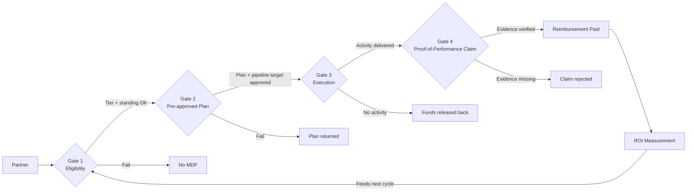

### Direct Answer

Marketing Development Funds (MDF) become "partner slush" when you fund activities instead of outcomes, accrue dollars without spending discipline, and pay claims without proof of performance. Size MDF as a percentage of partner-sourced or partner-influenced revenue (typically 1-3% of partner-attributed bookings, or a fixed 0.5-1.5% of channel revenue for accrual programs), gate every dollar behind a pre-approved plan with a named pipeline target, and require proof-of-performance evidence before any claim is paid. The fix is not "less MDF" — it is MDF that is earned, planned, claimed, and measured like any other go-to-market investment with its own ROI line.

> **TL;DR**
> - **MDF is co-marketing capital, not a partner entitlement.** Treat it like a budget line with a CAC target, not a loyalty rebate.
> - **Size it off partner-attributed revenue**, not partner count or tier vanity. Discretionary MDF should run 1-3% of partner-sourced bookings; accrual MDF 0.5-1.5% of channel revenue.
> - **Slush happens at three leak points**: funding activities (not outcomes), accruing without expiry/spend discipline, and paying claims without proof of performance.
> - **Every dollar passes four gates**: eligibility, pre-approved plan, execution, and proof-of-performance claim. No gate, no money.
> - **Measure MDF ROI as a portfolio**: target 3-5x pipeline-to-spend and 1.5-3x closed-won-to-spend within 2-4 quarters, kill the bottom quartile of activities every half.
> - **Tooling matters at scale**: above ~50 partners, manual spreadsheets guarantee leakage; PRM platforms with claims workflows pay for themselves.

---

## Why MDF Turns Into Slush — The Core Problem

### 1. What MDF Actually Is (and Is Not)

Marketing Development Funds are dollars a vendor allocates to channel partners to co-fund demand-generation activities — events, digital campaigns, content syndication, sales plays, and enablement — that grow the vendor's pipeline through the partner's brand and audience. MDF is the operational cousin of co-op funds: co-op is usually a fixed rebate accrued on partner purchases and reimbursed against marketing receipts, while MDF is typically discretionary, forward-looking, and tied to a specific plan. In practice, mature programs blend both: a small accrual floor that every transacting partner earns, plus a discretionary pool that the vendor steers toward strategic bets.

The single most damaging misconception is that MDF is a **reward** — something partners are owed for hitting a tier. The moment MDF is framed as an entitlement, it stops being marketing capital and becomes a discount in disguise. Channel chiefs at companies like **HubSpot (HUBS)** and **Atlassian (TEAM)** have repeatedly made the same point in partner-program redesigns: MDF only generates return when it is **earned against a plan and claimed against a result**. Everything in this answer flows from that distinction.

It helps to be precise about where MDF sits relative to the other channel-economics levers, because vendors routinely conflate them and then wonder why the program behaves like a discount:

- **Margin / resale discount** — the spread a reseller keeps on a transaction. It is unconditional, baked into the price, and the partner can do anything with it. It funds the partner's existence, not the vendor's pipeline.
- **Rebate / back-end incentive** — a performance payment (often quarterly) for hitting volume or strategic targets. It rewards a result that already happened; it does not fund future demand.
- **Co-op funds** — accrued as a fixed percentage of partner purchases and reimbursed against marketing receipts. Backward-looking and entitlement-flavored.
- **MDF proper** — forward-looking, discretionary capital tied to a specific approved plan and a specific pipeline target. This is the only one of the four that is genuinely *demand-generation investment*.

When a vendor lets MDF drift toward the behavior of margin or rebate — paid out regardless of plan or result — it has not "been generous," it has quietly converted a marketing budget into a price cut while still carrying it on the marketing P&L. That is the accounting and strategic heart of the slush problem.

"Slush" is the term partners and vendors both use, half-jokingly, for MDF that has detached from outcomes. It shows up as accrued balances no one can explain, claims for "sponsorship" with no measurable pipeline, end-of-quarter spending sprees to avoid forfeiture, and — in the worst cases — partners treating MDF as margin they can route to their own P&L. Slush is not fraud (though fraud exists at the edges); it is the predictable result of weak design.

A few field patterns make the slush signature recognizable. If a channel finance team can look at last year's claims and find that more than a quarter of them have no attached result, the program is leaking. If partners describe MDF in conversation as "our budget" rather than "co-marketing money," the framing battle is already lost. If claim volume spikes 60-80% in the final two weeks of every quarter, forfeiture panic — not demand strategy — is driving the spend. And if the largest single line item across the whole program is generic "event sponsorship" with no lead capture, the program is sponsoring logos, not pipeline. None of these patterns require fraud; all of them are design failures, and all of them are fixable with the structure laid out below.

### 2. The Three Structural Leak Points

Every MDF slush problem traces back to one or more of three structural failures. Naming them precisely is the first step to fixing them.

- **Leak 1 — Funding activities, not outcomes.** When the program pays for "an event" or "a campaign" rather than "200 net-new contacts and 15 sales-qualified leads," partners optimize for the activity. They run the event, take the photo, file the claim. Nothing in the design forces the activity to convert.
- **Leak 2 — Accrual without spend discipline.** Pure-accrual programs (X% of partner purchases banked automatically) build large balances that partners feel entitled to. Without expiry, use-it-or-lose-it pressure, or a plan requirement, those balances get spent on whatever is easiest to claim in the final two weeks of a quarter.
- **Leak 3 — Paying claims without proof of performance.** The reimbursement step is where discipline either holds or collapses. If a partner can submit an invoice and get paid without showing leads, registrations, content, or attribution, the entire upstream design is theater.

The rest of this answer is organized around plugging these three leaks: **right-sizing** the pool so it is not absurdly large to begin with, **governing** the four-gate lifecycle so dollars are earned and planned, and **measuring** ROI so the bottom quartile gets cut.

It is worth stress-testing each leak with a concrete failure story, because the abstract description undersells how mundane the leakage is.

- **Leak 1 in practice.** A vendor approves $30K for a partner to sponsor a regional industry conference. The partner attends, the vendor logo is on a banner, the booth is staffed. The claim arrives with an invoice and three event photos. There is no attendee list, no lead-capture mechanism, no follow-up sequence, and zero opportunities in CRM. The money was spent on *presence*, which feels like marketing but generates nothing measurable. The plan never required a pipeline number, so the partner never built one in. This is the most common single failure in MDF, and it is entirely a design defect.
- **Leak 2 in practice.** A pure-accrual program banks 1% of every partner's purchases automatically. A mid-size partner accumulates $48K over 18 months because their resale volume is healthy but their marketing function is two people who are slammed. With a quarter left before a soft "use it" nudge, they spend the whole balance on a glossy brochure reprint and a paid-search burst with no tracking. The dollars left the building; the demand did not. The program treated accrual as automatic and the spend as the partner's problem.
- **Leak 3 in practice.** A partner submits a $12K claim for a "telemarketing campaign." The invoice is from a sister entity of the partner. There is a call log, but the log shows internal account-management calls to existing customers, not outbound prospecting. The claim is paid because the reimbursement reviewer checks only that an invoice exists and matches the approved amount. No one cross-references the activity against CRM, ICP fit, or net-new contact creation. The proof-of-performance gate exists on paper but is not enforced.

Each of these is fixed by a specific mechanism downstream: Leak 1 by the pre-approved plan gate that forces a named pipeline target, Leak 2 by accrual expiry plus a plan requirement, and Leak 3 by mandatory proof-of-performance evidence plus separation of duties and audit. Keep these three stories in mind — every control in this answer maps back to closing one of them.

### 3. The Cost of Getting It Wrong

Slush is expensive in three distinct ways, and finance leaders consistently underweight the second and third.

| Cost type | What it looks like | Typical magnitude | Who feels it |
|---|---|---|---|
| **Direct waste** | MDF spent on activities with zero attributable pipeline | 20-40% of an ungoverned MDF budget | CFO, CMO |
| **Opportunity cost** | Dollars locked in slush could have funded high-ROI plays | 1-2x the direct waste | CMO, channel chief |
| **Behavioral corrosion** | Partners learn MDF is "free money," stop co-investing their own funds | Hard to quantify, compounds | Channel chief, partners |
| **Audit & compliance risk** | Unsubstantiated claims, transfer-pricing exposure, channel-stuffing optics | Episodic but severe | CFO, General Counsel |
| **Forecast noise** | Accrued liabilities and unpredictable claim timing distort marketing OpEx | Ongoing | FP&A |

The behavioral corrosion line is the quiet killer. A well-run MDF program trains partners to bring their own marketing budget to the table — vendor MDF becomes the **multiplier**, not the **whole** of the campaign. A slush program trains partners that the vendor pays for everything, which both inflates the vendor's effective CAC and weakens the partner's commitment to the relationship. Channel economics at scaled programs — think the partner ecosystems around **Salesforce (CRM)**, **ServiceNow (NOW)**, and **Microsoft (MSFT)** — depend on partner co-investment; MDF that crowds out partner spend is a structural loss even when each individual claim looks reasonable.

The audit-and-compliance line also deserves more weight than finance teams usually give it. Unsubstantiated MDF claims are not merely wasted money; they are a control weakness that external auditors will flag, and in some structures they create genuine exposure. Three specific risks recur:

- **Revenue-recognition contamination.** Under modern revenue-recognition standards (ASC 606 / IFRS 15), consideration paid to a customer — and a reselling partner can be a customer — may need to be treated as a *reduction of revenue* rather than a marketing expense unless the payment is for a distinct good or service at fair value. MDF that is really a disguised discount can therefore be misclassified, overstating both revenue and marketing OpEx. A program where MDF is genuinely tied to identifiable demand-gen services with proof of performance is far easier to defend as a true expense.
- **Channel-stuffing optics.** If MDF accrues automatically on partner purchases and partners can sit on the balances, an analyst or auditor can reasonably ask whether end-of-quarter partner purchases are being pulled forward by the prospect of incentive dollars. Plan-gated, outcome-tied MDF removes that ambiguity.
- **Anti-corruption exposure.** For programs that fund partners in multiple jurisdictions, MDF dollars that flow without documented business purpose can attract scrutiny under anti-bribery regimes (FCPA, UK Bribery Act). Proof of performance is also proof of legitimate business purpose.

None of this means MDF is dangerous — it means MDF run *without* the four gates is a finance and legal liability as well as a marketing one. The same governance that kills slush also makes the program audit-clean. That dual payoff is why the CFO, not just the channel chief, should care about MDF design.

---

## How to Size MDF Correctly

### 1. The Three Sizing Models — and When to Use Each

There is no universal MDF percentage. The right number depends on whether you are buying **discretionary strategic demand-gen** or running an **accrual loyalty floor**, and on how mature your attribution is. Three models cover almost every program.

| Model | How the pool is sized | Typical range | Best for | Main risk |
|---|---|---|---|---|
| **Revenue-share accrual** | Fixed % of partner purchases or channel revenue, banked automatically | 0.5-1.5% of channel revenue | Mature, high-volume resale channels | Builds slush balances if not gated |
| **Discretionary / proposal-based** | Vendor allocates a pool; partners earn against approved plans | 1-3% of partner-sourced bookings | Strategic co-sell, newer ecosystems | Admin-heavy; needs strong governance |
| **Performance-unlock (hybrid)** | Small accrual floor + discretionary pool unlocked by tier and results | 1-2% blended | Most B2B SaaS channel programs | Complexity; needs clear rules |

Most B2B software companies should run the **hybrid**: a modest accrual floor (so every transacting partner has a few earned dollars and feels included) plus a larger discretionary pool that the channel team steers toward strategic plays, new-logo geographies, or product lines the vendor wants to push. The accrual floor protects the relationship; the discretionary pool protects the ROI.

- **Revenue-share accrual is simple and partner-friendly** — partners always know roughly what they have — but it is the format most prone to Leak 2. If you use it, you must layer on expiry and plan requirements.
- **Discretionary is the most ROI-defensible** because every dollar starts life attached to a plan, but it is administratively heavy and can feel arbitrary to partners if approval criteria are opaque.
- **Performance-unlock aligns incentives best**: partners see that doing more (and proving it) literally unlocks more budget, which is exactly the behavior you want.

The choice also interacts with the **maturity of your attribution capability**, and this is the variable most teams ignore. If you cannot reliably trace a marketing activity to a registered opportunity, a discretionary program will collapse into argument: partners will claim influence you cannot disprove, and the channel team will reject claims it cannot evaluate. In that environment, a simple accrual with expiry is honest about its own limitations. As attribution matures — dedicated landing pages, deal-registration linkage, multi-touch models in the CRM — you can shift weight from accrual toward discretionary, because now the proof-of-performance gate has teeth. Treat the model mix as something that *evolves* with your data, not a one-time decision.

A second interaction is the **shape of the partner base**. A small number of high-capability partners with real marketing teams can absorb large discretionary plans and will co-invest. A long tail of small partners cannot — they have no marketing function and will not write a plan. The correct response is not to force everyone into the same model; it is to run **campaigns-in-a-box** (pre-built, pre-approved templated plays) for the long tail so their accrual-floor dollars still produce tracked demand, and reserve full discretionary planning for partners with the capacity to use it well. Sizing and model choice are therefore downstream of honest segmentation, which is exactly the discipline (q429) applies to tiered partner programs more broadly.

A third consideration is **product or motion mix**. A vendor selling a single, well-understood product through resellers can run a leaner, more accrual-weighted program. A vendor pushing several product lines, or trying to seed a new one, needs the discretionary lever specifically so the channel team can *steer* dollars toward the strategic bet rather than toward whatever the partner finds easiest. MDF is one of the few tools a vendor has to redirect partner attention without renegotiating margin, and a pure-accrual design throws that lever away.

### 2. The Math: Anchoring MDF to Partner-Attributed Revenue

The cardinal sizing rule: **MDF is a percentage of the revenue the channel produces, not a percentage of how many partners you have.** Sizing off partner count is how programs end up with a pool far larger than the channel can productively absorb.

Start by segmenting partner-attributed revenue into three buckets, because they justify different MDF treatment:

| Revenue type | Definition | MDF justification |
|---|---|---|
| **Partner-sourced** | Deal originated and registered by the partner | Highest — MDF directly grows this |
| **Partner-influenced** | Partner materially involved in a deal the vendor sourced | Medium — MDF supports the relationship |
| **Partner-resold / fulfilled** | Partner is transactional fulfillment only | Low — minimal MDF, mostly accrual floor |

A defensible top-down sizing formula for a discretionary or hybrid program:

```
Annual MDF Pool = (Partner-Sourced Bookings x 2.0-3.0%)
                + (Partner-Influenced Bookings x 0.5-1.0%)
                + (Accrual Floor: Channel Revenue x 0.5%)
```

Worked example. Suppose a SaaS vendor has **$40M in partner-sourced bookings**, **$25M in partner-influenced bookings**, and **$90M in total channel revenue**:

| Component | Base | Rate | MDF |
|---|---|---|---|
| Partner-sourced | $40,000,000 | 2.5% | $1,000,000 |
| Partner-influenced | $25,000,000 | 0.75% | $187,500 |
| Accrual floor | $90,000,000 | 0.50% | $450,000 |
| **Total annual MDF pool** | | | **$1,637,500** |

That ~$1.64M is the **ceiling**, not a spend target. The discipline is that the discretionary portion (~$1.19M here) only gets released against approved plans — so if partners only submit $800K of fundable plans, you spend $800K plus the accrual floor and return the rest to the marketing budget. A program that always spends 100% of its pool is almost certainly funding slush.

The rate ranges in that formula are not arbitrary, and it is worth understanding what moves a vendor toward the top or bottom of each band:

| Factor | Pushes rate UP | Pushes rate DOWN |
|---|---|---|
| **Channel maturity** | New ecosystem needing demand investment | Established channel that self-sustains |
| **Attribution quality** | Strong deal-reg + tracking (you can prove ROI) | Weak attribution (you cannot govern spend) |
| **Partner co-investment** | Partners reliably match funds | Partners treat MDF as the whole budget |
| **Strategic priority** | New product/geo you must seed | Mature product with organic demand |
| **Competitive intensity** | Rivals out-spending you in-channel | You hold a clear category lead |
| **Margin headroom** | Healthy gross margin to reinvest | Thin margin, every point matters |

A vendor with a young channel, strong attribution, and partners willing to co-invest can responsibly run the discretionary rate near 3% of partner-sourced bookings, because every dollar is both needed and measurable. A vendor with a mature channel, weak attribution, and partners who do not co-invest should run near 1% — and should spend the difference fixing attribution before it raises the rate. Sizing is not a number you copy from a benchmark deck; it is a number you *earn* by being able to govern and measure what you spend.

One more sizing trap: do not size MDF off **last year's spend**. If last year's program was a slush program, last year's spend encodes the slush. Re-baselining off a known-bad number simply re-funds the leak. Always rebuild the number top-down and bottom-up from current partner-attributed revenue and current fundable-plan capacity.

### 3. Bottom-Up Validation and Reserve Buffers

Top-down sizing tells you the ceiling; a bottom-up build tells you whether the number is real. Take your tiered partner list and estimate each strategic partner's fundable plan for the year:

| Partner tier | # partners | Avg approved plan / yr | Subtotal |
|---|---|---|---|
| **Strategic / Elite** | 8 | $80,000 | $640,000 |
| **Premier** | 22 | $25,000 | $550,000 |
| **Select / Registered** | 140 | $2,500 (accrual floor) | $350,000 |
| **Bottom-up total** | 170 | | **$1,540,000** |

When the top-down ceiling (~$1.64M) and the bottom-up build (~$1.54M) land within ~10-15% of each other, the number is credible. A gap larger than ~25% means one of two things: either your attribution is unreliable, or you have far more partners than your demand-gen demand can absorb — which is itself a slush warning.

Two more sizing guardrails:

- **Hold a 10-15% central reserve.** Do not allocate the entire pool to partners on day one. A reserve lets the channel team fund opportunistic strategic plays mid-year and avoids the "spend it or lose it" panic that drives Leak 2.
- **Cap any single partner's share of the discretionary pool** at roughly 15-20%. Concentration is a slush risk: a partner that controls a fifth of the budget has enormous leverage and weak accountability.

### 4. Phasing and Cadence of Allocation

How you *release* the pool over the year matters as much as how big it is. Two release patterns dominate, and they produce very different behavior:

| Pattern | Mechanic | Effect on behavior |
|---|---|---|
| **Annual lump allocation** | Each partner sees their full ceiling on day one | Simple, but invites year-end forfeiture panic |
| **Quarterly tranche release** | Ceiling released in four tranches, gated on prior-quarter activity | Smooths spend, rewards momentum, hardest to game |
| **Plan-triggered release** | No standing balance; dollars committed only when a plan is approved | Most ROI-pure, highest admin load |

For most B2B SaaS programs the **quarterly tranche** model is the right default. Releasing roughly a quarter of a partner's ceiling per quarter — and making the next tranche contingent on the prior tranche being planned and largely claimed — does three useful things at once. It eliminates the year-end spending sprint, because there is no large balance to burn. It creates a natural rhythm of planning conversations between the channel marketing manager and the partner. And it gives the vendor a quarterly off-ramp: a partner who consistently fails to plan their tranche simply stops receiving new ones, with no awkward clawback required.

Phasing also lets the central reserve do its job. Hold the reserve unallocated through Q1, then deploy it deliberately in Q2-Q3 against the highest-performing activities identified in the first portfolio review. This converts the reserve from a passive buffer into an active **doubling-down mechanism** for what is already working — which is exactly the portfolio behavior the measurement section calls for.

A final note on multi-year contracts and accrual liability: if your program accrues MDF as a percentage of partner purchases, finance must carry that accrual as a liability and recognize it appropriately as plans are approved and claims paid. Quarterly true-ups (covered in governance) keep that liability honest. Lump-sum annual allocation with no expiry is the pattern most likely to produce a stale, growing liability that finance cannot explain — another reason phased release beats it.

---

## The Four-Gate MDF Lifecycle

The structural fix for slush is a lifecycle in which **every dollar passes four sequential gates** before it leaves the building. No gate, no money. This is the heart of MDF governance.



### 1. Gate One — Eligibility

Eligibility decides **which partners can touch MDF at all**, and at what ceiling. This is where tiering does its work. Eligibility should be a function of three things, published openly in the partner agreement:

- **Tier and standing.** Only partners in good standing — current on certifications, no compliance flags, active in the last two quarters — should be eligible. A dormant partner sitting on an accrued balance is pure slush risk.
- **Earned ceiling.** Each tier has a maximum annual MDF ceiling. Higher tiers earn higher ceilings, and ceilings should be partly performance-unlocked (see (q429) for how tiered partner programs reward scale without collapsing margin).
- **Co-investment requirement.** Eligibility above the accrual floor should require the partner to match a share of the spend — typically 25-50%. A co-investment match is the single most effective anti-slush mechanism, because partners do not waste their own money.

| Tier | Annual MDF ceiling | Co-invest match required | Eligible activities |
|---|---|---|---|
| **Strategic / Elite** | Up to $80K+ | 25% partner match | Full menu incl. custom plays |
| **Premier** | Up to $25K | 35% partner match | Events, digital, content syndication |
| **Select** | Up to $5K | 50% partner match | Pre-built campaigns-in-a-box |
| **Registered** | Accrual floor only (~$500-$2K) | n/a | Templated digital only |

Two design choices inside Gate One are worth calling out because they are commonly mishandled. First, the **co-investment match should ease as tier rises**, not tighten. That feels counterintuitive — why ask your best partners for less? — but it reflects reality: top-tier partners already invest heavily in the relationship through headcount, certification, and pipeline; demanding a steep cash match on top of that punishes commitment. Lower-tier partners, by contrast, have less skin in the game, so a higher match ratio is the cheapest available filter against frivolous spend. The match is a *governance dial calibrated to demonstrated commitment*, not a flat tax.

Second, eligibility should be **continuously re-evaluated, not set once a year**. A partner can be eligible in January and a slush risk by July — a lapsed certification, a leadership change, a compliance flag, two quarters of dormancy. Eligibility checks should run automatically each quarter (the PRM platform can enforce this), and a partner who drops out of good standing should have their unspent discretionary funds frozen pending review rather than left available. Freezing is not punitive; it simply prevents the most common slush scenario of all — a disengaged partner sitting on a balance they will eventually dump on a low-value claim. The tiering logic here is the same margin-and-merit logic (q429) lays out for partner programs generally; MDF eligibility is just one of the benefits that tier should gate.

### 2. Gate Two — The Pre-Approved Plan

This is the most important gate and the one weak programs skip. **No MDF dollar should ever be committed without an approved plan that names a pipeline target.** The plan is a short, structured document — not a 20-page form, because friction kills participation, but enough to make the partner state intent.

A fundable MDF plan must specify:

- **The activity and the audience** — what is being run, to whom, and why it fits the vendor's ICP.
- **The pipeline target** — net-new contacts, marketing-qualified leads, sales-qualified leads, registered opportunities, or sourced bookings. This is the number the claim will be measured against.
- **The budget and co-investment split** — total cost, MDF request, partner match.
- **The timeline** — start, end, and claim-by date.
- **The attribution method** — UTM tags, dedicated landing page, lead-capture form, registration list, or campaign code.

The approval step is where the channel marketing manager exercises judgment: does this plan plausibly return 3-5x its cost in pipeline? If not, it gets sent back with coaching, not rejected silently. Approval should be fast — a 3-5 business-day SLA — because slow approvals are the second-biggest driver of slush (partners give up on planned activity and dump the money into easy claims later).

To make approval consistent rather than personality-dependent, give channel marketing managers a **scoring rubric** rather than leaving "does this look good" to instinct. A simple five-factor rubric, each scored 1-5, with a fundable threshold:

| Rubric factor | What a strong plan shows | Weight |
|---|---|---|
| **ICP fit** | Audience clearly matches the vendor's ideal customer profile | High |
| **Pipeline target credibility** | Lead/opportunity target is specific and plausible for the spend | High |
| **Attribution method** | Concrete tracking (UTM, landing page, deal-reg) named up front | High |
| **Partner co-investment** | Match meets or exceeds tier requirement; partner has skin in the game | Medium |
| **Follow-up plan** | Named owner and sequence for working the leads after the activity | Medium |

The follow-up factor is the one teams forget and the one that quietly destroys ROI. An event that generates 200 leads returns nothing if no one is assigned to call them. Requiring a named follow-up owner and a defined sequence in the plan — before any money is approved — is the difference between MDF that builds pipeline and MDF that builds a lead list no one ever touches. Plans that score below threshold are not rejected; they are returned with the specific weak factors flagged so the partner knows exactly what to fix.

The plan gate is also where you keep MDF from funding the wrong *kind* of activity. A short eligible-activities menu, published in advance, prevents most arguments: events and field marketing, digital demand-gen, content syndication, webinars, SDR/telemarketing plays, and pre-built campaigns. Things MDF should generally *not* fund — and the plan template should make this explicit — include partner internal operations, generic brand merchandise with no lead capture, partner staff salaries (unless the program explicitly allows a capped labor component), travel and entertainment unrelated to a demand activity, and anything the partner cannot tie to a tracking method. The menu is not bureaucracy; it is the boundary that keeps the program a marketing program.

### 3. Gate Three — Execution Discipline

Between approval and claim, two things keep the program honest:

- **A claim-by deadline tied to the activity, not the quarter.** Funds approved for a March event must be claimed within, say, 60 days of the event. This severs the link between MDF and end-of-quarter forfeiture panic. Unclaimed approved funds are **released back to the pool**, not rolled forward indefinitely.
- **Mid-flight check-ins for large plans.** Any plan above a threshold (say $15K) gets a lightweight midpoint review: is the event on track, are registrations coming in? This catches problems before the money is spent rather than after.

Execution discipline is also where you handle the **expiry question** for accrual programs. Accrued (non-discretionary) balances should expire on a rolling 12-month basis — earned in Q1 2026, must be spent against an approved plan by Q1 2027. Expiry is not punitive; it is what converts a passive balance into active demand-gen. Communicate it clearly and quarterly so it never feels like a trap.

The expiry mechanic only works if it is paired with **honest, repeated communication**. A partner who is genuinely surprised by a forfeiture will treat the program as adversarial and disengage. The discipline is therefore: state the expiry rule in the partner agreement, restate it in the quarterly business review, and have the PRM platform send automated balance-and-expiry notices at 90, 60, and 30 days before any tranche lapses. Done this way, expiry never lands as a trap — it lands as a prompt to plan. Forfeiture should be the rare exception for a disengaged partner, not a routine outcome that the program quietly profits from.

There is also a subtle anti-slush benefit in how unclaimed *approved* funds are handled. When a partner gets a plan approved but then fails to execute, those committed dollars should be **released back to the central pool**, not silently rolled into the partner's next-quarter ceiling. Rolling them forward rewards non-execution with a larger balance — exactly backwards. Releasing them back means the program keeps reallocating capital toward partners who actually run their plans, which is the behavior you want to compound over time. The execution gate, in other words, is not just about catching problems mid-flight; it is the recycling mechanism that keeps the whole pool flowing toward performance.

Mid-flight check-ins serve one more purpose worth naming: they are the cheapest moment to *improve* an activity rather than just police it. A check-in three weeks before a partner event that is tracking light on registrations is an opportunity for the channel marketing manager to add a co-promoted email, lend a vendor speaker, or extend the campaign — all of which lift the eventual ROI. Treating Gate Three as coaching rather than surveillance is what turns governance from a cost into a multiplier.

### 4. Gate Four — Proof of Performance

The claim gate is where slush is finally killed or finally funded. **A claim is paid only when the partner submits both a valid expense receipt and proof of performance.** Two pieces of evidence, both required:

- **Proof of spend** — itemized third-party invoices showing the money was actually spent on the approved activity (not internal cost transfers, not partner labor unless explicitly allowed).
- **Proof of performance** — the deliverable and the result: event attendee list, campaign report with leads, content URLs, webinar registration export, the UTM/landing-page analytics, and the count against the approved pipeline target.

| Claim component | Required evidence | Common rejection reason |
|---|---|---|
| **Event sponsorship** | Invoice + attendee list + lead scans | "Branding only," no leads captured |
| **Digital campaign** | Invoice + campaign report + UTM analytics | No tracking, can't attribute |
| **Content syndication** | Invoice + lead list + content URL | Leads not in vendor ICP |
| **Webinar / field event** | Invoice + registration export + recording | No follow-up sequence attached |
| **Telemarketing / SDR play** | Invoice + call/meeting log + opp IDs | No CRM opportunity created |

Claims should be paid on a predictable cycle (e.g., net-30 from approval) so partners trust the program. And a meaningful share of claims — at least 20-30% — should be **audited**: spot-checked against the underlying CRM records and invoices. Audited programs see dramatically less slush, not because they catch much fraud, but because partners know the evidence will be checked.

A useful refinement is to make the proof requirement **proportional to claim size and risk**. Demanding deal-registration linkage for a $1,200 templated digital campaign is friction with no payoff; demanding it for a $40K custom field-marketing program is essential. A tiered evidence standard keeps the program both rigorous and usable:

| Claim band | Evidence standard | Audit likelihood |
|---|---|---|
| **Under $2,500** | Invoice + activity report (leads or analytics) | Random sample |
| **$2,500-$15,000** | Invoice + lead list/analytics + ICP confirmation | ~30% |
| **$15,000-$50,000** | Above + deal-reg linkage or opportunity IDs | ~60% |
| **Over $50,000** | Above + post-activity ROI review with channel chief | 100% |

This proportionality is itself an anti-slush mechanism: it concentrates scrutiny where the dollars and the risk are, and it keeps small partners from drowning in paperwork that would otherwise push them out of the program entirely.

Two final claim-gate disciplines. First, **define a claim-rejection appeals path** that is fast and documented. Partners will sometimes have legitimate claims that fail a technicality; a clear appeals route prevents a rejected claim from poisoning the relationship and gives the program a feedback loop on where its evidence rules are too rigid. Second, **track the rejection rate as a program health metric**. A rejection rate near zero usually means the proof gate is not really being enforced; a rejection rate above ~15-20% means either the plan gate is approving weak plans or the evidence rules are unclear. The healthy band is a modest, steady rejection rate that signals the gate is real but the upstream coaching is working. The claim gate, properly run, is not a wall — it is the point where the program's promises about outcomes finally become enforceable, which is what makes every other gate worth maintaining.

---

## Governance, Tooling, and Anti-Slush Controls

### 1. Roles and Decision Rights

Slush thrives in ambiguity about who owns what. A clean MDF program assigns four roles explicitly:

| Role | Owns | Decision right |
|---|---|---|
| **Channel marketing manager** | Plan approval, partner coaching | Approves/rejects plans up to a $ threshold |
| **Channel finance / FP&A** | Accrual liability, claim payment, audit | Approves claims, runs spot audits |
| **Channel chief / VP partnerships** | Pool sizing, tier rules, strategic reserve | Approves pool and large/exception plans |
| **Partner marketing contact** | Plan submission, execution, claim filing | Submits, executes, claims |

The most common governance failure is letting the **same person** both approve a plan and approve its claim. Separating plan approval (channel marketing) from claim payment (channel finance) creates a basic control that auditors expect and that materially reduces leakage.

Beyond the four roles, a healthy program runs a small standing **MDF governance cadence** so the program is managed rather than merely administered:

- **Weekly** — channel marketing clears the plan-approval queue against the SLA; channel finance clears the claim queue. Pure operational hygiene, but slipping here is how SLAs quietly die.
- **Monthly** — channel marketing and channel finance reconcile committed-versus-claimed-versus-paid, flag stale approved plans, and surface partners trending toward forfeiture.
- **Quarterly** — the full review: pool true-up, portfolio ROI review with bottom-quartile pruning, reserve deployment decision, and tier-eligibility refresh. The channel chief owns this meeting.
- **Annually** — re-size the pool top-down and bottom-up, re-baseline rates against partner-attributed revenue, and benchmark MDF ROI against direct marketing.

Decision-rights ambiguity also shows up in **exception handling**, and it must be designed deliberately. Exceptions — a sub-threshold plan that is strategically important, a late claim with a good reason, a partner who needs a ceiling lift mid-year — are legitimate and inevitable. The failure mode is exceptions granted informally by whoever the partner emails. The fix: every exception goes through a single named approver (the channel chief), is logged with a reason, and is reviewed in aggregate at the quarterly meeting. If one partner accounts for a disproportionate share of exceptions, that is a slush signal in its own right. Exceptions should be *rare, visible, and reasoned* — never routine and never invisible.

### 2. The Anti-Slush Control Checklist

These are the controls that, in combination, convert MDF from slush-prone to ROI-positive. Treat this as the program's operating standard:

- **Co-investment match** — partners put in 25-50% of their own money above the accrual floor.
- **Plan-before-dollar** — no commitment without an approved plan and a named pipeline target.
- **Activity-based claim-by deadlines** — funds expire relative to the activity, not the fiscal quarter.
- **Rolling 12-month expiry on accruals** — no permanent balances.
- **Proof of performance required** — claims need results evidence, not just receipts.
- **Separation of duties** — plan approver ≠ claim approver.
- **20-30% claim audit rate** — random spot-checks against CRM and invoices.
- **Single-partner concentration cap** — no partner controls more than ~15-20% of the discretionary pool.
- **Quarterly true-up** — reconcile accrued liability, released funds, and spend every quarter.
- **Bottom-quartile pruning** — the lowest-ROI activities lose funding next cycle (see ROI section).

A program that runs all ten of these does not have a slush problem. A program missing three or more almost certainly does.

It is worth understanding *which* control plugs *which* leak, because partial implementations are common and the gaps are predictable:

| Control | Primary leak it closes | Why it works |
|---|---|---|
| Co-investment match | Leak 1 & 2 | Partners do not waste their own money |
| Plan-before-dollar | Leak 1 | Forces a named pipeline target up front |
| Activity-based claim-by deadline | Leak 2 | Severs MDF from quarter-end forfeiture panic |
| Rolling 12-month accrual expiry | Leak 2 | Eliminates passive, growing balances |
| Proof of performance required | Leak 3 | Makes the claim defensible and measurable |
| Separation of duties | Leak 3 | Removes the conflicted single approver |
| 20-30% claim audit | Leak 3 | Credible deterrence against weak claims |
| Single-partner concentration cap | Leak 1 & 2 | Limits leverage of any one partner |
| Quarterly true-up | Leak 2 | Keeps accrued liability honest |
| Bottom-quartile pruning | Leak 1 | Starves activities that quietly stopped working |

The pattern is clear: Leak 1 (funding activities not outcomes) is closed mostly at the plan and portfolio level; Leak 2 (accrual without discipline) is closed by expiry, deadlines, and true-ups; Leak 3 (claims without proof) is closed at the claim gate by evidence, duty separation, and audit. A program that has strong plan discipline but a weak claim gate will still leak — it will approve good plans and then pay for whatever shows up. The controls are a system; they are not a menu from which you pick the convenient three.

### 3. Tooling — When Spreadsheets Stop Working

Below roughly 30-50 partners, a disciplined spreadsheet plus a shared drive can run MDF — barely. Above that, manual administration is itself a slush generator: claims get lost, balances drift, audits become impossible. At scale, a Partner Relationship Management (PRM) platform with a native MDF/claims module is the standard.

| Capability | Manual / spreadsheet | PRM with MDF module |
|---|---|---|
| **Plan submission & approval** | Email + form, easy to lose | Workflow with SLA tracking |
| **Balance & accrual tracking** | Error-prone, lagging | Real-time, partner-visible |
| **Claim + proof upload** | Attachments in email | Structured, evidence required by field |
| **Attribution / pipeline link** | Manual CRM lookup | CRM integration, deal-reg linkage |
| **Audit trail** | Reconstructed after the fact | Built-in, timestamped |
| **Reporting / ROI dashboard** | Hand-built monthly | Standing dashboards |

The PRM market includes specialist vendors and platforms increasingly integrated with the major CRMs. Programs built on **Salesforce (CRM)** or **HubSpot (HUBS)** often use PRM tools that sync deal registration and partner-sourced opportunities directly, so the proof-of-performance step (Gate Four) can be partially automated by matching claims to registered opportunities. For ecosystem-scale programs, the partner-cloud offerings around **Microsoft (MSFT)**, **ServiceNow (NOW)**, and **Workday (WDAY)** have made MDF claim automation a baseline expectation rather than a differentiator. The tooling does not replace governance — it **enforces** the four gates so a human cannot quietly skip one.

When evaluating a PRM or through-channel marketing automation platform specifically for MDF discipline, the buying criteria that matter are not the glossy ones. The questions to ask:

- **Does the claim form make evidence mandatory by field?** A system where proof-of-performance is a required upload — not an optional attachment — enforces Gate Four whether or not the reviewer is diligent.
- **Does it link to the CRM's opportunity object?** Automatic matching of claims to registered opportunities is the single biggest reduction in manual attribution work.
- **Does it enforce the plan-before-dollar sequence?** The platform should make it structurally impossible to file a claim against an activity that never had an approved plan.
- **Does it track accrual expiry and fire notices automatically?** Manual expiry tracking always slips.
- **Does it expose a partner-facing balance and ROI view?** Transparency to the partner is itself an anti-slush control.
- **Does it produce a standing audit trail?** Timestamped plan, approval, execution, and claim records are what an external auditor expects.

The cost-justification math is straightforward. If a PRM platform with an MDF module costs, say, $40K-$120K per year for a mid-size program, and the program is leaking even a conservative 15% of a $1.6M pool — $240K — to slush, the tool pays for itself several times over by enforcing the gates that recover that leakage. The platform decision should be framed to the CFO not as a marketing-software purchase but as a **financial control investment**, because that is what it is. Below the 30-50 partner threshold the math can favor a hardened spreadsheet plus disciplined process; above it, manual administration is itself one of the largest slush sources, and the tool is no longer optional.

One caution: tooling enforces process, it does not invent strategy. A PRM platform configured around a slush-prone program design will simply enforce slush more efficiently. Fix the four-gate design first, then buy the tool that enforces it — not the other way around.

### 4. Communicating the Program to Partners

A control-heavy program will fail if partners experience it as bureaucratic punishment. The framing must be: *"We are giving you marketing capital and a fast path to use it well."* Practical communication moves:

- **Publish the rules.** Tier ceilings, eligible activities, approval SLAs, and claim requirements all live in the partner portal. Surprises breed resentment and gaming.
- **Provide campaigns-in-a-box.** Pre-built, pre-approved campaigns let lower-tier partners spend MDF productively without designing a plan from scratch — this raises ROI and reduces low-quality claims.
- **Coach, don't reject.** When a plan is weak, send it back with specific improvements. The goal is more good plans, not fewer plans.
- **Show partners their ROI.** When a partner sees that their MDF-funded webinar sourced $120K in pipeline, they ask for more and co-invest more. Transparency is itself an anti-slush mechanism.

---

## Measuring MDF ROI

### 1. The Core MDF Metrics

You cannot manage MDF as a portfolio without a small, consistent metric set. These six are the standard:

| Metric | Formula | Healthy target |
|---|---|---|
| **MDF utilization** | MDF spent / MDF pool | 70-90% (100% is a red flag) |
| **Pipeline-to-spend ratio** | Partner pipeline sourced / MDF spent | 3-5x within 2-4 quarters |
| **Closed-won-to-spend (MDF ROI)** | Closed-won revenue attributed / MDF spent | 1.5-3x within 2-4 quarters |
| **Cost per MQL/SQL** | MDF spent / qualified leads generated | Benchmarked vs. direct marketing |
| **Claim cycle time** | Days from claim submission to payment | <= 30 days |
| **Plan approval SLA hit rate** | % plans decisioned within SLA | >= 90% |

Two of these deserve emphasis. **Utilization at 100% is a warning, not a win** — it almost always means partners spent the budget to avoid forfeiting it. Healthy utilization sits in the 70-90% band, with the unspent remainder returned to the marketing budget. And **pipeline-to-spend should lead closed-won-to-spend by a quarter or two**, because MDF-funded demand takes time to convert; if pipeline ratio is healthy but closed-won is not, the leak is downstream in partner sales execution, not in MDF design.

Diagnosing the program from the metric set is a skill in itself. The combinations tell a story:

| Symptom pattern | Likely diagnosis | Where to act |
|---|---|---|
| High utilization, low pipeline-to-spend | Slush — money spent, no demand | Plan gate + proof gate |
| Low utilization, high pipeline-to-spend | Under-investment — good plans, too few | Coaching + campaigns-in-a-box |
| Healthy pipeline-to-spend, weak closed-won | Partner sales execution gap | Enablement (see (q432)), not MDF |
| Fast claim cycle, rising rejection rate | Plan gate approving weak plans | Tighten plan rubric |
| Slow claim cycle, partner complaints | Claim-gate friction | Process/tooling fix |
| Strong sourced ROI, weak influenced ROI | Influence claims overstated | Discount influenced attribution |

The most important interpretive discipline is to **resist blaming MDF for downstream failures**. A program with strong pipeline-to-spend but weak closed-won has done its job — it generated qualified demand — and the problem has moved to the partner's sales motion. Cutting MDF in that situation would starve a working demand engine to "fix" a sales-execution problem MDF cannot touch. The metric set exists precisely so the channel team can locate the failure correctly instead of swinging the MDF budget around as a blunt instrument.

Finally, hold the metric definitions **constant across periods**. The fastest way to lose finance's trust is to quietly redefine "partner-sourced" or shift the attribution window between quarters so the ROI line looks better. Lock the definitions, document them, and report against them consistently — the same discipline (q424) prescribes for a board-ready unit-economics dashboard, where MDF ROI should appear as a standing channel-efficiency line.

### 2. Attribution — The Hard Part

MDF ROI lives or dies on attribution. The proof-of-performance gate (Gate Four) is what makes attribution possible in the first place, because it forces every plan to declare a tracking method up front. Practical attribution hierarchy, best to worst:

- **Direct registration / deal-reg linkage** — the MDF-funded activity produced a registered opportunity in CRM. This is the gold standard and should be required for large plans.
- **UTM + landing page** — campaign traffic and form fills tracked to a dedicated URL. Strong for digital plays.
- **Lead-list matching** — event/syndication lead lists matched against CRM opportunities created within a 90-day window. Good, with some noise.
- **Influenced attribution** — the partner touched a deal that also had MDF activity in-region. Weakest; use multi-touch models and discount heavily.

For board reporting, separate **sourced** MDF ROI (clean, defensible) from **influenced** MDF ROI (directional). Conflating them is how channel teams lose finance's trust. The unit-economics discipline here mirrors how you build any board-ready dashboard — see (q424) for the order and selection of metrics in a unit-economics dashboard, and (q418) on the SaaS "Magic Number," which is the same sales-and-marketing-efficiency logic applied at the company level.

### 3. The MDF Portfolio Review and Bottom-Quartile Pruning

MDF should be reviewed every quarter as a **portfolio of activities**, exactly like a marketing team reviews its campaign mix. The mechanic:

| Activity quartile | Pipeline-to-spend | Action next cycle |
|---|---|---|
| **Top quartile** | > 6x | Increase funding, replicate across partners |
| **Second quartile** | 3-6x | Maintain, optimize execution |
| **Third quartile** | 1.5-3x | Coach, set improvement target |
| **Bottom quartile** | < 1.5x | Defund unless strategic exception |

**Defunding the bottom quartile every half is the single most powerful ROI lever.** It forces the program to concentrate dollars on what works and starves the activities that have quietly become slush. The exception clause matters — a new-market entry play or a strategic-product push may justify a sub-1.5x return temporarily — but exceptions must be named, time-boxed, and approved by the channel chief, not granted by default.

### 4. Benchmarking Against Direct Marketing

The ultimate test of MDF: does a dollar of MDF generate more pipeline than a dollar spent directly by the vendor's own marketing team? If channel-routed dollars consistently underperform direct spend, the channel team must explain why the partner relationship still justifies the program — usually the answer is **reach and trust in segments the vendor cannot address directly** (geographies, verticals, SMB long-tail). But the question must be asked every year. MDF that cannot beat or credibly complement direct marketing is, by definition, slush at the program level.

---

## Counter-Case: When Tight MDF Governance Backfires

Everything above argues for discipline. But discipline taken too far has its own failure modes, and a credible program acknowledges them.

### 1. Over-Governance Kills Participation

If the plan form is long, the approval SLA is slow, and the claim evidence requirements are punishing, partners simply **stop using MDF**. Low utilization then looks like "discipline" on a dashboard, but it actually means the program failed: the demand-gen that MDF was supposed to fund never happened. A program with 40% utilization is not virtuous — it is usually broken in a different direction. The fix is to keep gates real but **friction low**: short structured plans, fast SLAs, campaigns-in-a-box for small partners, and PRM tooling that makes claiming a few clicks rather than an email thread.

### 2. The Trust Tax of Aggressive Auditing

Audits reduce slush, but an audit posture that treats every partner as a suspected fraudster corrodes the relationship. The best partners — the ones bringing real co-investment and real pipeline — resent being policed. Calibrate: random spot-checks at 20-30%, escalating scrutiny only for partners with a history of weak claims. The goal is *credible deterrence*, not maximum suspicion.

### 3. When Pure Accrual Is Actually Right

This answer favors hybrid and discretionary models. But a pure revenue-share accrual program is genuinely the right call in some channels: very high-volume, low-touch resale channels where the cost of administering plans and proof-of-performance exceeds the slush it would prevent. If your channel is thousands of small resellers each transacting modestly, a simple, well-communicated accrual with rolling expiry beats a discretionary program no one has the headcount to govern. Match the model to the channel, not to an ideal.

### 4. MDF Is Not Always the Right Tool

Sometimes the honest answer is that MDF should be **smaller or absent**, and the money redeployed. If your partners are primarily fulfillment/resale and generate little sourced pipeline, MDF will mostly fund slush no matter how well governed; better to convert that budget into margin/rebate (cleaner, cheaper to run) or into direct marketing the vendor controls. And for partners who co-sell rather than co-market, the constraint is often AE capacity, not demand-gen dollars — see (q431) on running co-sell motions without bottlenecking at AE capacity, and (q432) on partner enablement curricula that get partners selling within 30 days. MDF solves a demand-generation problem; if your real problem is sales capacity or enablement, MDF is the wrong instrument and will look like slush precisely because it is being asked to do a job it was never designed for.

---

## A 90-Day Implementation Plan

For a team rebuilding an MDF program from a slush state, sequence the work over one quarter.

| Phase | Weeks | Workstream | Output |
|---|---|---|---|
| **Diagnose** | 1-3 | Audit current balances, claims, attribution | Slush map: where dollars leaked |
| **Re-size** | 3-5 | Top-down + bottom-up pool model | Approved annual pool + reserve |
| **Re-design** | 4-8 | Four-gate lifecycle, tier ceilings, controls | Published program rules |
| **Tool** | 6-10 | PRM/claims workflow config or spreadsheet hardening | Live submission + claim system |
| **Launch & coach** | 9-12 | Partner comms, campaigns-in-a-box, first plans | Approved plans in flight |
| **Measure** | Ongoing | Quarterly portfolio review, bottom-quartile prune | MDF ROI on board dashboard |

The diagnose phase is non-negotiable and the most commonly skipped. You cannot fix slush you have not measured. Pull two years of claims, classify each as "had a measurable result" or "did not," and the slush percentage will be obvious — and usually sobering. That number becomes the baseline you improve against.

---

## Key Takeaways

- **MDF is co-marketing capital, not a partner reward.** The framing determines everything downstream.
- **Size off partner-attributed revenue** — 1-3% of partner-sourced bookings for discretionary, 0.5-1.5% of channel revenue for accrual — and validate top-down against bottom-up.
- **Slush has three structural causes**: funding activities not outcomes, accrual without discipline, and claims without proof. Each has a specific fix.
- **Run the four-gate lifecycle**: eligibility, pre-approved plan, execution discipline, proof-of-performance claim. No gate, no money.
- **Govern with the ten-point control checklist**, especially co-investment match, separation of duties, and a 20-30% audit rate.
- **Measure as a portfolio**: target 3-5x pipeline-to-spend, 1.5-3x closed-won-to-spend, and defund the bottom quartile every half.
- **Stay honest about the counter-case**: over-governance kills participation, and MDF is the wrong tool when the real problem is sales capacity or pure fulfillment economics.

---

## Related Questions

- **(q429)** — **How do we build a tiered partner program that rewards scale without collapsing margin?** MDF ceilings are a core tier benefit; size them with the same margin logic.
- **(q431)** — **How do we run co-sell motions without bottlenecking at account executive capacity?** When the constraint is AE capacity rather than demand, MDF is the wrong lever.
- **(q432)** — **What's the fastest partner enablement curriculum to get partners selling within 30 days?** Enablement and MDF are complements: funded demand-gen wastes money if partners cannot sell.
- **(q424)** — **What metrics should you include in a board-ready unit economics dashboard, and in what order?** MDF ROI belongs on that dashboard as a channel-efficiency line.
- **(q418)** — **What's the 'Magic Number' in SaaS, how do you calculate it, and why does it matter more than CAC?** The Magic Number applies the same spend-to-revenue-efficiency test to the whole company that MDF ROI applies to the channel.
- **(q161)** — **What new SaaS metrics are board members asking about in 2026?** Channel and partner-sourced efficiency metrics are increasingly board-level questions.

---

## Sources

1. Forrester Research — "The State Of Partner Marketing And MDF/Co-Op Programs" reports.
2. Gartner — "Market Guide for Partner Relationship Management Applications."
3. Gartner — "How to Build a Channel Demand Generation Program."
4. SiriusDecisions / Forrester — Channel Marketing Through-Partner Demand Generation frameworks.
5. Canalys — Global Channel Partner ecosystem and incentive research.
6. CompTIA — "State of the Channel" annual report.
7. 2112 Group / Channelnomics — channel program design and MDF best-practice research.
8. The Spur Group — partner program ROI and channel investment benchmarking.
9. McKinsey & Company — "Mastering channel partnerships in B2B technology."
10. Bain & Company — Go-to-market and channel economics research.
11. Boston Consulting Group — B2B channel and ecosystem strategy publications.
12. HubSpot (HUBS) — Solutions Partner Program documentation and channel marketing guidance.
13. Salesforce (CRM) — Partner Program and AppExchange co-marketing resources.
14. Microsoft (MSFT) — Partner Center and Microsoft AI Cloud Partner Program incentives documentation.
15. ServiceNow (NOW) — Partner Program and partner marketing resources.
16. Atlassian (TEAM) — Solution Partner Program structure and co-marketing guidance.
17. Workday (WDAY) — Partner ecosystem and go-to-market resources.
18. Cisco (CSCO) — long-standing channel MDF and co-op program design (industry reference model).
19. Dell Technologies (DELL) — Partner Program MDF and marketing development fund structure.
20. HP Inc. (HPQ) — channel co-op and MDF program documentation.
21. Impartner — PRM and MDF/claims automation platform documentation.
22. ZINFI Technologies — Through-Channel Marketing Automation and MDF management resources.
23. Allbound — PRM platform and partner marketing enablement resources.
24. Channeltivity — PRM and MDF management feature documentation.
25. PartnerStack — partner ecosystem and incentive management resources.
26. Crossbeam / Reveal — ecosystem-led growth and partner-sourced pipeline measurement.
27. TechTarget / SearchITChannel — MDF and co-op fund explainer and best-practice articles.
28. Channel Futures — channel program and partner incentive industry coverage.
29. CRN (The Channel Company) — channel program rankings and MDF program reporting.
30. AICPA / financial-reporting guidance on accrued marketing liabilities and channel incentives.
31. Pavilion — RevOps and go-to-market operating benchmarks for channel programs.
32. OpenView Partners — SaaS benchmarks reports (sales & marketing efficiency context).
33. KeyBanc Capital Markets — SaaS Survey (sales and marketing spend benchmarks).
34. PartnerPath — channel partner program assessment and MDF effectiveness research.
35. IDC — Worldwide channel and partner ecosystem spending research.
