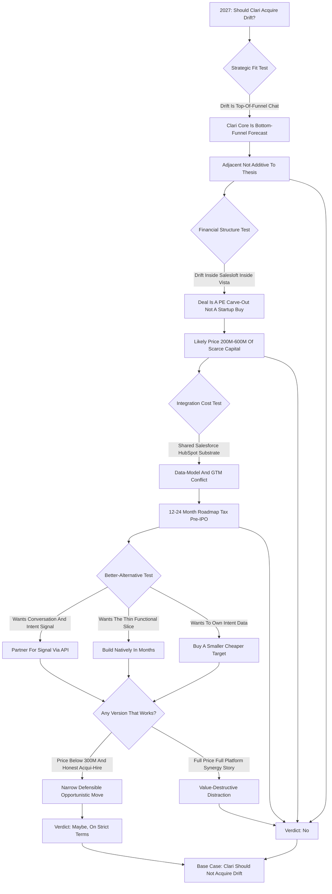
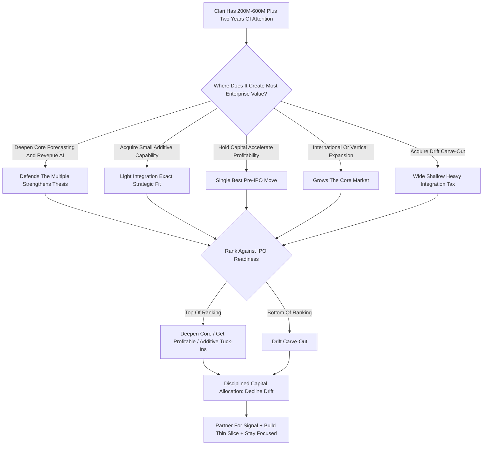

**TL;DR:** Should Clari acquire Drift in 2027? **No -- and the reasons are structural, not sentimental.** Clari is a revenue-operations and forecasting platform that sells to CROs and CFOs on the promise of forecast accuracy; Drift is a conversational-marketing and chatbot platform that was acquired by Salesloft in 2024 and folded into a sales-engagement suite, which means a "Clari acquires Drift" deal in 2027 is really a carve-out negotiation with Salesloft's owner Vista Equity Partners, not a clean startup purchase. The deal fails four tests at once. **Test one, strategic fit:** Clari's center of gravity is the bottom and middle of the funnel -- pipeline, deal inspection, forecast roll-ups -- while Drift's value is top-of-funnel website conversation capture, and bolting a chat widget onto a forecasting company does not make the forecast more accurate; it makes the roadmap wider and shallower. **Test two, financial structure:** a carve-out of Drift from the Salesloft/Vista entity would likely price somewhere in the **$200M-$600M** range depending on retained ARR, far below Drift's 2021 ~$1B private valuation, and Clari -- itself a roughly **$5.6B-valued, Sequoia/Bain/Blackstone-backed, not-yet-profitable company** -- would be spending scarce capital and balance-sheet capacity on a depreciating asset in a category (standalone conversational marketing) that the market has already repriced downward. **Test three, integration cost:** Drift and Clari share Salesforce and HubSpot as their integration substrate, overlap on "revenue" positioning, and would require 12-24 months of platform, data-model, and go-to-market reconciliation -- an integration tax paid in roadmap velocity at exactly the moment Clari needs to be sprinting toward an IPO window. **Test four, the better alternative:** everything Clari would gain from owning Drift -- conversation signal, intent data, website engagement -- it can acquire through partnership, native build, or a smaller and cheaper intent-data acquisition, none of which require absorbing Drift's cost base, brand, and Salesloft entanglement. **The honest verdict:** the only version of this deal that makes sense is a cheap, opportunistic carve-out below ~$300M used purely as an acqui-hire for conversation-AI talent and a customer list -- and even that is a distraction from Clari's actual job, which is to be the system of record for the forecast and get to durable profitability before the IPO. **Net: Clari should not acquire Drift in 2027. It should partner, build the thin slice it needs natively, and keep its capital and its roadmap focused.** The deeper lesson behind this specific question is a general one about enterprise-software strategy: the companies that win their category are almost never the ones that bought the widest set of features -- they are the ones that owned the deepest, stickiest position and refused to be talked out of it by a board deck full of funnel diagrams and synergy arrows. Clari's deepest, stickiest position is the forecast. The right answer to "should we buy the chat company" is the same as the right answer to most adjacency-driven M&A temptations a focused leader will face: name precisely what you actually want, confirm it is a feature rather than a platform, get it the cheapest way that does not dilute your core, and put the saved capital and the saved two years of attention into being more of what already works. That discipline -- not the deal -- is what gets Clari to a strong IPO.

## What This Question Is Actually Asking

"Should Clari acquire Drift in 2027?" looks like a simple yes-or-no, but it is really four questions stacked on top of each other, and answering it well means refusing to collapse them. The first question is strategic: does owning Drift make Clari a better version of what Clari is trying to be? The second is financial: at any plausible price, does the deal create more enterprise value than it destroys, given Clari's capital position and the state of its balance sheet? The third is structural: Drift no longer exists as an independent company -- it was acquired by Salesloft in February 2024 and Salesloft itself sits inside Vista Equity Partners' portfolio after Vista's majority investment, so "acquiring Drift" in 2027 means negotiating a carve-out from a private-equity-owned suite, which is a fundamentally different and harder transaction than buying a venture-backed startup. The fourth is the alternative-cost question: even if Clari wants what Drift has, is acquisition the cheapest and lowest-risk way to get it? A serious answer has to hold all four at once, because a deal can pass one test and fail the other three -- and this one fails at least three. The mistake most people make with M&A questions like this is treating them as a referendum on whether the two products "go together" in a slide. They go together fine in a slide. The question is whether the combined entity, after the integration tax, the capital outlay, the roadmap dilution, and the Salesloft entanglement, is worth more than Clari plus the cash it would have spent. That is the bar, and this guide walks every part of it.

## Who Clari Actually Is: The Revenue Platform Thesis

Clari is, at its core, a forecasting and revenue-operations company. It was founded in 2012, it is headquartered in Sunnyvale, and it raised a Series F in 2022 at a valuation around $2.6B before that, with later reporting and secondary activity putting its valuation in the ~$5.6B range at its peak; its backers include Sequoia Capital, Bain Capital Ventures, Sapphire Ventures, Blackstone, and others. The product's promise to a buyer is specific and narrow in the best way: it ingests CRM data, activity data, and conversation data, and it produces a forecast the CRO can defend to the board and the CFO can plan against. Clari's wedge is forecast accuracy and pipeline inspection -- the weekly forecast call, the deal-by-deal scrutiny, the roll-up from rep to manager to VP to CRO. Over time Clari expanded into adjacent revenue workflows: Clari Copilot (the conversation-intelligence product that came from its 2021 Wingman acquisition), Clari Align for revenue planning, and capture/CPQ-adjacent capabilities. But the gravitational center never moved. Clari sells to the office of the CRO, and increasingly the CFO, on the thesis that revenue is a process that can be made predictable. Everything Clari does well, it does well because it is close to the deal and close to the number. That identity matters enormously for this question, because the test of any acquisition is not "is the target a good company" but "does the target make Clari more itself, or less." An acquisition that pulls Clari away from the forecast and toward the chat widget is dilutive to the thesis even if the target is healthy -- and Drift, as we will see, is not especially healthy as a standalone category.

## Who Drift Actually Is: The Conversational Marketing Story And Its Repricing

Drift was founded in 2015 by David Cancel and Elias Torres, and for several years it was the defining brand of "conversational marketing" -- the idea that the website should be a real-time conversation, that the contact form should be replaced by a chatbot that books meetings, and that buyers should be able to talk to a company the moment intent is highest. Drift raised heavily, including a 2018 round and subsequent capital, and reporting around its later financing put its private valuation in the ~$1B+ range around 2021. Then the category got repriced. Conversational marketing as a standalone product turned out to be a feature, not a platform: the chatbot-books-a-meeting motion is valuable, but it is a thin slice of the funnel, it competes with native website tools, with HubSpot and Salesforce capabilities, and with a long tail of cheaper chat vendors, and it does not by itself create the kind of durable, expanding, multi-product account relationship that justifies a billion-dollar platform valuation. The market noticed. In February 2024, Salesloft -- the sales-engagement company -- acquired Drift, and Drift was absorbed into Salesloft's "Rhythm" platform vision as the top-of-funnel buyer-engagement layer. Salesloft itself had taken a majority investment from Vista Equity Partners (announced 2024). So by 2027, "Drift" is not a company you call up and buy. It is a product line and a customer base inside a PE-owned suite, and any acquisition is a carve-out: you are buying retained ARR, a brand, some technology, and some people, and you are negotiating against a sophisticated private-equity seller who knows exactly what the asset is worth and exactly how much integration pain they would be offloading onto you.

## The Strategic Fit Test: Does Owning Drift Make Clari More Itself?

Start with the test that matters most, because if a deal fails strategic fit, the financial engineering rarely rescues it. Clari's job is the forecast. The forecast is built from pipeline, and pipeline is built from deals that already exist in the CRM. Clari's best signal sources are deal-stage movement, rep and buyer activity, email and call sentiment, and the historical pattern of how deals like this one have closed before. Drift's signal is different in kind: it is website-visitor conversation, anonymous and known-account chat, and the meeting that gets booked at the very top of the funnel before a deal exists at all. There is a story you can tell where these connect -- "we capture the conversation at first touch and follow it all the way to the closed-won forecast" -- and it is not a crazy story. But it is a story about funnel breadth, not forecast depth, and Clari's whole competitive position is depth. The CRO does not buy Clari because it has a chat widget; the CRO buys Clari because the number is right. Adding Drift does not make the number more right. It makes Clari a wider product with a shallower center, and in enterprise software, wide-and-shallow loses to deep-and-focused in the categories that matter. The strategic-fit verdict: Drift is adjacent to Clari, not additive to its core thesis. Adjacency is the most dangerous kind of acquisition rationale, because it always sounds reasonable in a board deck and it almost always dilutes focus in execution.

## The Funnel-Position Problem: Top Versus Bottom

It is worth being very concrete about why funnel position is not a detail. B2B revenue software clusters into stages, and the stage a product owns determines its buyer, its data, its sales motion, and its retention dynamics. Top-of-funnel tools -- website chat, intent data, ad platforms, conversational marketing -- are bought by demand-gen and marketing-ops teams, they live and die on lead volume, and they churn when a marketing leader changes or a budget gets cut, because they are seen as discretionary growth spend. Bottom-of-funnel tools -- forecasting, deal inspection, revenue planning -- are bought by sales and finance leadership, they become embedded in the weekly operating rhythm of the company, and they are sticky precisely because ripping them out means changing how the company runs its forecast call. Clari is a bottom-of-funnel company with top-tier retention characteristics. Drift is a top-of-funnel product with the weaker retention characteristics of its category. When you acquire across funnel position, you do not average the retention -- you import the weaker dynamics into your customer base, you ask one sales team to sell to two different buyers, and you ask one customer-success org to defend two different value propositions at renewal. The companies that have tried to span the full funnel by acquisition (and there are many cautionary tales in revenue tech) consistently find that the integration looks elegant on the funnel diagram and ugly in the renewal forecast.

## The Customer-Overlap Question: How Much Cross-Sell Is Actually There?

The bull case for this deal leans hard on cross-sell: Clari has a base of enterprise revenue teams, Drift has a base of B2B marketing teams, and surely you can sell each product into the other's accounts. It is worth pressure-testing that number, because cross-sell synergy is the most over-promised line in every M&A model. First, account overlap is not the same as buyer overlap: Clari and Drift may both be present in, say, a few hundred large B2B companies, but they are sold to and renewed by different functions inside those companies, with different budgets, different procurement cycles, and different success metrics. Selling Drift to a Clari champion in the CRO's office means asking that champion to advocate for a marketing tool they do not own the budget for. Second, the empirical attach rates from comparable revenue-tech combinations are sobering: when sales-engagement and adjacent tools have been bundled post-acquisition, first-year "both products in one account" attach rates have tended to run in the high single digits to low teens as a percentage, not the 30-40% the synergy models assume. On a combined revenue base, a realistic attach uplift is a low-single-digit-percent revenue effect -- real, but nowhere near enough to justify a premium price. Third, and most damaging, Drift's accounts are already inside the Salesloft suite's cross-sell motion; Clari acquiring Drift does not unlock a virgin base, it inherits a base that has already been cross-sold against by its current owner. The customer-overlap synergy is real in a slide and thin in a model.

## The Financial Structure: What A Carve-Out Actually Costs

Now the money. Because Drift sits inside Salesloft inside Vista, the transaction is a carve-out, and carve-outs have their own price logic. Vista is a disciplined seller; it will price the asset on retained ARR, growth rate, and gross margin, and it will not subsidize Clari's strategic ambitions. A plausible 2027 carve-out range for the Drift product line -- depending on how much ARR has been retained through the Salesloft integration, what the growth trajectory looks like, and how much shared infrastructure has to be untangled -- sits somewhere in the $200M-$600M band, with the lower end if Drift's standalone ARR has eroded inside the suite and the higher end if it has been stabilized and is being sold as a clean, growing line. Set that against Clari's position. Clari is a private company valued in the multi-billion range, it has raised large primary rounds, and like most growth-stage SaaS it has historically prioritized growth over GAAP profitability. Clari does not have infinite balance sheet. Every dollar it spends on a Drift carve-out is a dollar not spent on its own R&D, its own go-to-market, or -- critically -- on getting to the durable free-cash-flow profile that public-market investors will demand at IPO. Spending $300M-$500M of scarce capital and management attention on a depreciating asset in a repriced category is not a neutral act; it is a bet that has to clear a very high bar, and the cross-sell math above does not clear it.

## The Valuation Repricing: Why Drift Is Worth A Fraction Of Its Peak

It is important to be honest about what happened to Drift's value, because the deal's defenders will anchor on the ~$1B 2021 figure and the deal's price will be a fraction of it -- and they will call that a bargain. It is not necessarily a bargain; it may simply be a fair price for a smaller asset. Drift's ~$1B+ private valuation was set in a 2021 environment of zero-interest-rate-driven SaaS multiples, peak conversational-marketing hype, and a growth trajectory that the subsequent market did not sustain. The Salesloft acquisition in 2024 was, by all available signal, a far more modest transaction than that peak number -- private-market reporting and the general pattern of 2023-2024 SaaS M&A suggests the kind of repricing where category leaders that raised at frothy 2021 marks changed hands at meaningful discounts. So when a 2027 Clari-Drift carve-out prices in the low hundreds of millions, the correct framing is not "Clari got Drift for 30 cents on the dollar." The correct framing is "the dollar was never a dollar; the asset is what it is worth today, which is a modest top-of-funnel product line with uncertain standalone retention." Buying a repriced asset is only smart if the asset is core and you have a credible plan to grow it. Drift is neither core to Clari nor obviously growable inside a forecasting company.

## The Integration Tax: Twelve To Twenty-Four Months Of Roadmap Drag

Every acquisition has an integration tax, and the size of the tax depends on technical overlap, data-model conflict, and go-to-market reconciliation. This one is expensive on all three. Technically, Drift and Clari both build on the same integration substrate -- Salesforce and HubSpot are the systems of record both products read from and write to -- which sounds like it should make integration easy but actually makes it conflict-prone: two products writing intent and engagement signal into the same CRM objects, two data models with different definitions of "account," "contact," and "engagement," and a need to decide which system owns which write. Add the Salesloft untangling: a carved-out Drift will have shared infrastructure, shared data pipelines, and shared services with the Salesloft platform that have to be separated before Clari can even begin its own integration -- the seller will hand over a product that is mid-surgery. Go-to-market reconciliation is its own multi-quarter project: merging or coordinating two sales teams, two pricing models, two customer-success orgs, and two brands. Realistically this is a 12-24 month integration, and the cost is not mainly cash -- it is roadmap velocity. Clari's engineering and product leadership would spend the better part of two years on integration plumbing instead of on the forecasting and revenue-platform innovation that is the actual source of Clari's competitive advantage. For a company that should be sprinting toward an IPO window, two years of roadmap drag is the most expensive line item in the whole deal, and it never appears in the purchase price.

## The IPO-Window Problem: Why Timing Makes This Worse

Clari's strategic clock matters here. A company valued in the multi-billions, backed by Sequoia, Bain, Blackstone, and Sapphire, with multiple large rounds behind it, is on an IPO trajectory whether or not anyone says so out loud -- its investors need a liquidity path, and the public markets are the most likely one. The work of becoming IPO-ready is specific: clean, predictable revenue growth; a credible and improving path to profitability and free cash flow; a focused equity story that a public-market analyst can understand in one paragraph; and an operating track record of execution discipline. Acquiring Drift in 2027 actively damages every one of those. It muddies the revenue story by stapling a slower-growth, weaker-retention product line onto the growth narrative. It pushes profitability further out by importing Drift's cost base and the integration spend. It complicates the equity story -- "we are the system of record for the revenue forecast" is a clean public-market story; "we are a full-funnel revenue platform that also does website chat" is a story analysts will discount. And it consumes the management bandwidth that should be going into IPO readiness. The timing argument is not a minor footnote. Even if the deal were strategically neutral, doing it in the specific 2027 window -- when Clari should be tightening, focusing, and proving durability -- converts a questionable deal into a clearly bad one.

## The Better Alternative: Partner, Build, Or Buy Smaller

The alternative-cost test is where this question gets its cleanest answer, because almost everything Clari might want from Drift is available without acquiring Drift. If Clari wants conversation-and-intent signal at the top of the funnel to enrich its forecast, it has three cheaper, lower-risk paths. **Partner:** integrate with best-of-breed conversational and intent vendors and pull their signal into Clari's revenue platform via API -- Clari already lives on integrations, and a partnership gets the signal without the cost base, the brand, or the Salesloft entanglement. **Build:** the specific thin slice Clari actually needs -- capturing high-intent website conversation as a signal feeding the pipeline and forecast -- is a buildable feature, not a platform; Clari's own engineering can ship the 20% of Drift's functionality that is relevant to forecasting without acquiring the other 80% that is not. **Buy smaller:** if Clari genuinely wants to own intent and conversation data as a strategic asset, there are smaller, cheaper, independent intent-data and conversation-AI companies that could be acquired for a fraction of a Drift carve-out and integrated with a fraction of the tax. Against all three alternatives, acquiring Drift is the most expensive way to get the least focused result. The disciplined move is to partner now, build the thin slice on the roadmap, and keep the option to buy a small intent-data company later if the strategy demands it.

## The Acqui-Hire Edge Case: The Only Version That Could Work

In fairness, there is one version of this deal that is not insane, and a serious analysis should name it. If the Drift carve-out can be done opportunistically and cheaply -- below roughly $300M, and ideally well below -- and if Clari treats it not as a product acquisition but as an acqui-hire, the math changes. In that framing, Clari is not buying a conversational-marketing platform; it is buying a team of conversation-AI and applied-NLP engineers, a customer list it can migrate onto Clari's core platform, and the right to sunset the standalone Drift product over 18-24 months. The value is the talent and the logo list, not the product line. Even this version has problems -- the integration distraction is still real, the Salesloft untangling still has to happen, and Clari's engineering focus still gets pulled -- but at a low enough price it is a defensible opportunistic move rather than a value-destructive strategic blunder. The key discipline is that everyone in the room has to be honest that it is an acqui-hire. The moment the deal gets justified on cross-sell synergy and full-funnel platform vision, it has stopped being the cheap-talent version and become the expensive-mistake version. The edge case exists; it is narrow; and it is not what most "should Clari acquire Drift" enthusiasm is actually proposing.

## The Comparable Deals: What Revenue-Tech M&A History Teaches

This is not the first time the revenue-tech sector has faced the full-funnel-by-acquisition temptation, and the comparables are instructive. The Salesloft-Drift deal itself (2024) is the most direct: a sales-engagement company bought a conversational-marketing company to build a full buyer-engagement platform, and the market's read on the price was that it was a sober, repriced transaction, not a triumphant one. ZoomInfo's serial acquisitions -- including Chorus (conversation intelligence) and Comparably -- show a data company assembling a platform, with mixed market reception and a stock that the public markets repriced hard as growth slowed. Salesforce's acquisition pattern shows that even the largest player pays a heavy integration and focus cost for breadth. The through-line is consistent: revenue-tech roll-ups that chase full-funnel breadth tend to underperform the focused, deep, single-category players on both retention and multiple. The market rewards Clari-shaped companies -- deep, embedded, system-of-record -- with better retention and better multiples than it rewards sprawling full-funnel suites. Acquiring Drift would move Clari from the rewarded category toward the discounted one. The history does not say breadth never works; it says breadth-by-acquisition is consistently harder, slower, and less rewarded than the deck claims, and the burden of proof is on the deal, not against it.

## The Cultural And Brand Collision

There is a softer factor that M&A models routinely ignore and that routinely sinks deals: culture and brand. Drift built a loud, marketing-led, founder-personality-driven brand -- it was a company that marketed to marketers, with a distinctive voice and a community built around the "conversational" idea. Clari's brand is the opposite register: measured, enterprise, finance-adjacent, credibility-over-personality, the kind of brand a CFO trusts. These are not complementary brand personalities; they are oil and water. Post-acquisition you either kill the Drift brand (and lose whatever residual goodwill and community it carries) or you run two brands with two voices and confuse the market about what Clari stands for. Culturally, the teams come from different worlds -- a marketing-tech, growth-at-volume culture versus an enterprise-revenue, accuracy-and-trust culture -- and after a carve-out from Salesloft, the Drift team will have already been through one wrenching cultural integration; Clari would be their third home in three years. Retention of the very talent that makes the acqui-hire case work is therefore at serious risk. None of this is fatal on its own, but it is real cost, it compounds the integration tax, and it is exactly the kind of factor that looks like a rounding error in the model and shows up as a disaster in execution.

## The Data-Model Collision: Why Two Definitions Of "Account" Is A Real Cost

It is worth going one level deeper on the technical integration, because "data-model conflict" sounds abstract and is actually where integrations quietly die. Clari's data model is organized around the deal and the forecast: an opportunity has a stage, an amount, a close date, a forecast category, a set of activities, and a roll-up path from rep to CRO. Its definition of "account" is the entity that owns deals, and its definition of "engagement" is activity that moves a deal. Drift's data model is organized around the conversation and the visitor: a visitor has a session, a conversation has a transcript and an intent classification, a known account is matched by reverse-IP or form fill, and "engagement" means a website interaction that may or may not ever become a deal. When you merge these, you do not get a richer model for free -- you get a reconciliation project where someone has to decide, field by field and object by object, which definition wins, how the two notions of "account" map to each other, what happens to a Drift conversation that never becomes a Clari opportunity, and how an anonymous visitor session is represented in a forecasting tool that has no concept of anonymity. Every one of those decisions is a meeting, a migration script, a customer-communication, and a regression-test surface. The companies that underestimate this are the ones that ship a "unified platform" that is really two databases with a thin UI bridge, and customers feel the seams immediately. The data-model collision is not a line item you can buy your way past; it is engineering quarters, and it is the single most common reason revenue-tech integrations underdeliver.

## The Roadmap-Opportunity Cost: What Clari Would Not Build

The integration tax is usually framed as the time spent on the merger, but the more honest framing is the opportunity cost -- the things Clari would not build because its best engineers and product leaders were doing carve-out plumbing. In 2027, a forecasting and revenue platform has a long list of high-value things it should be building: deeper forecasting AI that improves accuracy on the hardest deal types, better multi-segment and multi-geo roll-ups, tighter CFO-facing planning and scenario tools, native conversation intelligence improvements in Copilot, agentic workflows that act on pipeline risk rather than just surfacing it, and the kind of category-defining feature that keeps a company ahead of fast-following competitors. Every one of those is a direct contribution to the thing customers buy Clari for and the thing that defends its valuation multiple. Spend 12-24 months on Drift integration and that roadmap slips by 12-24 months -- not because the work is impossible but because attention is finite and the best people get pulled onto the integration because the integration is the risk. Meanwhile competitors who did not just buy a top-of-funnel product line keep shipping core innovation. The opportunity cost does not show up in the deal model, it does not show up in the press release, and it is very likely the single largest economic cost of the whole transaction. A disciplined board has to price it explicitly, because the market eventually prices it for them.

## The Net Revenue Retention Math: Importing A Weaker Number

Net revenue retention is the metric that most cleanly separates great SaaS companies from good ones, and it is where the Clari-Drift combination does measurable damage. Clari, as an embedded system-of-record bought by the CRO and CFO, should carry strong NRR -- the kind of number where the existing base expands faster than any churn drags it down, because ripping out the forecasting platform means changing how the company runs. Drift, as a top-of-funnel discretionary marketing tool in a repriced category, almost certainly carries weaker NRR -- the kind of number where budget cuts, marketing-leadership turnover, and cheaper alternatives create real downward pressure. When you combine two companies, the blended NRR is a revenue-weighted average, and acquiring Drift pulls Clari's blended number toward Drift's weaker one. That matters enormously for a pre-IPO company, because NRR is one of the first metrics a public-market investor looks at and one of the hardest to fix once it is set. Clari spends years building a strong-retention base and a strong-retention story; bolting on a weaker-retention product line dilutes both in a single transaction. The synergy models talk about cross-sell adding revenue; they rarely talk about the acquired base's retention profile subtracting from the quality of that revenue. In SaaS, the quality of a dollar of revenue -- how durable it is, how much it expands -- matters as much as the dollar itself, and this deal trades durable dollars for less durable ones.

## The Signal Clari Actually Wants: Naming The Thin Slice Precisely

Because the affirmative argument rests on Clari getting what it wants without buying Drift, it is worth being precise about what the thin slice actually is. Clari does not need a conversational-marketing platform, a chatbot builder, a website-experience engine, a marketing-ops workflow tool, or a demand-gen reporting suite -- that is the 80% of Drift that is irrelevant to a forecasting company. What Clari plausibly wants is narrow: a signal that says "a known, high-fit account had a high-intent conversation on our website or in our inbound channels, and here is the substance and the recency of it," delivered into Clari's pipeline and forecast so that the revenue team can see early-stage intent before a formal opportunity exists. That is a feature. It is an inbound-intent signal feeding the existing Clari data model as one more input alongside CRM activity and email and call sentiment. Clari's own engineering can build it, or Clari can get it through a partnership with an intent or conversation vendor via API, or Clari can buy a small focused intent-data company whose entire product is that signal. Naming the slice precisely is what collapses the deal: once you see that the wanted thing is a single well-defined signal and not a platform, paying $200M-$600M and absorbing two years of integration to get it becomes obviously the wrong instrument. You do not buy a house to get a cup of sugar, and you do not buy Drift to get an inbound-intent feed.

## The Capital-Allocation Frame: What Else Could Clari Do With The Money?

The cleanest way for Clari's board to evaluate this deal is the capital-allocation frame: a Drift carve-out is one use of $200M-$600M plus two years of management attention, and it should be ranked against every other use of that capital and attention. The competing uses are strong. Clari could invest that capital into deepening its core forecasting and revenue-platform AI -- the thing customers actually buy it for and the thing that defends its multiple. It could acquire a small, focused, additive capability (a planning tool, a data-quality tool, a forecasting-AI team) that strengthens the core rather than widening the perimeter. It could simply hold the capital and accelerate the path to profitability, which is the single most valuable thing it can do ahead of an IPO. It could invest in international expansion or vertical depth. Against that menu, "buy a repriced top-of-funnel product line out of a PE portfolio and spend two years integrating it" ranks near the bottom. Good capital allocation is as much about the deals you decline as the deals you do, and a disciplined board looking at this menu should decline Drift not because Drift is a bad company but because every other use of the same resources does more for Clari's enterprise value.

## How To Pressure-Test The Bull Case Honestly

A good analysis steelmans the other side, so here is the strongest version of the buy case and where each pillar breaks. **Bull pillar one: full-funnel is the future, and whoever owns the whole revenue process wins.** The break: the market has repeatedly rewarded depth over breadth in revenue tech, and "owns the whole funnel" has been a graveyard pitch as often as a winning one; breadth is a strategy you earn from a position of strength, not one you buy your way into. **Bull pillar two: Drift is cheap relative to its peak, so the downside is limited.** The break: cheap relative to a frothy 2021 mark is not cheap relative to today's fair value, and the real cost is not the purchase price but the two-year roadmap tax. **Bull pillar three: conversation and intent data make the forecast better.** The break: true, but Clari can get that signal via partnership or a thin native build for a tiny fraction of the cost and risk. **Bull pillar four: the cross-sell base is enormous.** The break: account overlap is not buyer overlap, comparable attach rates are in the high single digits, and Drift's base has already been cross-sold by Salesloft. **Bull pillar five: it is a great acqui-hire.** The break: this one partially survives -- but only at a low price and only if everyone admits that is what it is. When you steelman the bull case pillar by pillar, four of five pillars break cleanly and the fifth survives only in a narrow, cheap, honestly-labeled form. That is not a deal thesis; that is a reason to pass.

## The Decision Framework: The Bar Any Version Of This Deal Must Clear

Pulling it together, here is the bar. For Clari to acquire Drift in 2027 and have it be the right call, the deal would need to clear all of the following at once: (1) a price low enough -- realistically well under $300M -- that the downside is genuinely capped; (2) an honest internal framing as an acqui-hire and customer-list purchase, not a full-funnel platform play; (3) a credible, resourced plan to sunset the standalone Drift product within 18-24 months rather than maintain it; (4) a Salesloft/Vista carve-out structure clean enough that Clari is not buying a product mid-surgery with years of untangling ahead; (5) confidence that the conversation-AI talent will actually be retained through a third integration in three years; and (6) a board-level conviction that this is a better use of the capital and the two years of management attention than deepening the core or accelerating profitability. In practice, deals almost never clear all six -- and the moment any one of them fails, the deal tips from "defensible opportunistic move" to "expensive distraction." The honest expectation is that a real 2027 negotiation would fail at least two or three of these gates, which is why the base-case answer is no. The framework is not a way to get to yes; it is a way to be precise about how narrow the yes actually is.

## What Clari Should Do Instead: The Affirmative Playbook

Declining the deal is not the same as doing nothing, and the affirmative playbook is straightforward. **First, partner for the signal.** Clari should sign or deepen integration partnerships with top-of-funnel conversation and intent vendors so that the signal flows into the forecast without Clari owning the cost base. **Second, build the thin slice.** Clari's product roadmap should include a focused, native capability that captures high-intent website and inbound conversation as a pipeline-and-forecast signal -- the 20% of Drift that is relevant, shipped by Clari's own team in months, not absorbed over years. **Third, keep the M&A powder dry for additive, not adjacent, targets.** If Clari is going to spend acquisition capital, it should spend it on small, focused targets that deepen the forecasting and revenue-planning core -- a forecasting-AI team, a data-quality capability, a planning tool -- where the integration is light and the strategic fit is exact. **Fourth, prioritize the path to profitability.** The single most valuable pre-IPO move is durable free cash flow, and the discipline of declining a distracting deal is itself part of that move. **Fifth, watch Drift opportunistically but only as a cheap acqui-hire.** If, and only if, the price collapses well below $300M and the talent can be secured, Clari can revisit it as a talent-and-logo purchase -- on the strict terms in the decision framework above. That is the whole playbook: partner, build the slice, stay focused, get profitable, and keep the cheap-acqui-hire option open without ever letting it become a platform fantasy.

## The Competitive-Response Question: What Rivals Do If Clari Buys Drift

A deal is never evaluated in isolation -- it is evaluated against how the competitive field reacts, and the Clari-Drift combination invites responses that mostly work against Clari. Gong, the conversation-intelligence and revenue-AI competitor, would not need to respond at all; it would simply keep shipping deep revenue-AI while Clari is heads-down on integration, and "we stayed focused while they bought a chat widget" is a free competitive narrative. Salesforce and HubSpot, the platforms both Clari and Drift integrate with, would read a Clari that is moving up-funnel as a Clari moving onto their turf, and the friendly-integration-partner relationship that Clari depends on could cool at exactly the wrong time. The remaining sales-engagement and revenue-intelligence players would use the integration window -- the 12-24 months when Clari's roadmap is slow -- as their opening to win competitive deals and poach talent. And Salesloft, having sold Drift, would be free to rebuild or re-partner for top-of-funnel signal without the cost base it just shed. The pattern is consistent: the acquisition creates a window of distraction that every competitor benefits from, and it strains the platform relationships Clari relies on. Acquisitions that strengthen a company's competitive position are ones where rivals genuinely cannot easily respond. This is the opposite -- it is a deal whose main competitive effect is to give every rival a 12-24 month head start and a ready-made narrative.

## The Base-Rate Argument: Most Adjacent Acquisitions Underperform

Step back from the specifics of Clari and Drift and ask the base-rate question: when a focused, category-leading software company acquires an adjacent product line to widen its platform, how often does it work? The honest empirical answer, across decades of software M&A, is that the majority underperform the acquirer's own organic baseline -- they destroy more value than they create, the synergies underdeliver, and the integration costs overrun. The exceptions exist and they are instructive: the deals that work tend to be either true tuck-ins (small, cheap, absorbed quickly into the core) or genuine platform expansions executed by acquirers with deep, repeated integration competency and a strong balance sheet. A Drift carve-out is neither a cheap tuck-in nor a deal executed from a position of overwhelming financial strength. It sits squarely in the category with the worst base rate: a mid-sized adjacent acquisition, made for a synergy thesis, requiring heavy integration, by a company that should be focusing rather than expanding. The base rate is not destiny -- a specific deal can beat it -- but the base rate is the prior, and the burden of proof is on the deal to show why it is one of the exceptions. Nothing in the Clari-Drift fit pattern suggests it is. When the strategic logic is "adjacent," the financial logic is "scarce capital," the integration logic is "heavy," and the timing logic is "pre-IPO," you are looking at the profile of the deals that historically did not work.

## The "What Would Have To Be True" Test: Inverting The Question

A useful discipline for any contested deal is to invert the question -- instead of asking "should Clari buy Drift," ask "what would have to be true about the world for this to be the right call," and then assess how likely each of those things is. For a Clari-Drift acquisition to be correct, the following would all need to hold: the full-funnel revenue platform would have to be the winning category structure of the late 2020s rather than one of its recurring graveyards; Clari would have to be better at integrating an adjacent product line than the base rate of software M&A suggests anyone is; the conversation-and-intent signal would have to be unavailable or meaningfully worse through partnership and native build; the Drift carve-out would have to be priced low enough and structured cleanly enough that the downside is genuinely capped; the conversation-AI talent would have to be retainable through a third integration in three years; and Clari's capital position would have to be loose enough that spending $200M-$600M and two years of attention does not compromise the IPO path. Each of those is, individually, somewhere between unlikely and uncertain. The probability that all six hold at once is small -- and that compound improbability is the real answer to the question. Good deals are ones where the "what would have to be true" list is short and each item is probable. This deal's list is long and most items are improbable. When you invert the question, the no gets stronger, not weaker, because you can see exactly how many independent things have to break Clari's way for the yes to be right.

## The Stakeholder View: What Each Constituency Should Want

A final lens, because a deal is never evaluated in a vacuum -- it is evaluated by constituencies with different interests, and the answer should hold up across all of them. **Clari's customers** (CROs, CFOs, RevOps leaders) want the forecast to keep getting better and the product to stay focused and reliable; they gain nothing from Clari being distracted by a chat-widget integration, and they would feel the roadmap drag directly. **Clari's investors** (Sequoia, Bain, Blackstone, Sapphire) want a clean IPO and a strong multiple; they should be skeptical of anything that muddies the equity story or pushes profitability out. **Clari's employees** want focus and momentum, not two years of integration plumbing. **Drift's employees** want stability after a wrenching few years; a third integration is not stability, and only a well-handled, honestly-framed acqui-hire serves them. **Vista/Salesloft** -- the seller -- wants the highest price for the messiest possible carve-out, which is precisely why Clari should be a reluctant, disciplined buyer if it engages at all. The only constituency that clearly benefits from an aggressive, full-price, full-platform version of this deal is the seller. When the seller is the only enthusiastic party, that is the market telling you something. Across every constituency that matters to Clari's future, the disciplined answer -- partner, build, stay focused, and treat any Drift purchase as a narrow, cheap, opportunistic acqui-hire at most -- is the one that serves them. The base case is, and should be, no.

## The Decision Journey: From Deal Rumor To Disciplined Answer

## The Capital-Allocation Decision Matrix: Ranking The Uses Of The Money

## Sources

1. **Clari -- Company Overview, Product, and Funding** -- Revenue platform vendor; product scope (forecasting, pipeline inspection, Copilot, Align) and funding history. https://www.clari.com
2. **Clari Series F Financing Coverage (2022)** -- Reporting on Clari's ~$225M Series F and the valuation context around it.
3. **Crunchbase -- Clari Funding and Investor Profile** -- Investor list (Sequoia Capital, Bain Capital Ventures, Sapphire Ventures, Blackstone) and round history. https://www.crunchbase.com/organization/clari
4. **Clari Acquires Wingman (2021)** -- Coverage of Clari's acquisition of conversation-intelligence company Wingman, later Clari Copilot.
5. **Drift -- Company Overview and Conversational Marketing Category** -- Founding (2015, David Cancel and Elias Torres), product, and the conversational-marketing positioning. https://www.drift.com
6. **Drift Funding History Coverage** -- Reporting on Drift's financing rounds and the ~$1B+ valuation context circa 2021.
7. **Salesloft Acquires Drift (February 2024)** -- Announcement and analysis of Salesloft's acquisition of Drift and the Rhythm platform vision.
8. **Vista Equity Partners -- Salesloft Investment** -- Coverage of Vista Equity Partners' majority investment in Salesloft. https://www.vistaequitypartners.com
9. **Salesloft -- Platform and Rhythm Vision** -- Salesloft's positioning of Drift as the top-of-funnel buyer-engagement layer. https://www.salesloft.com
10. **ZoomInfo Acquires Chorus.ai (2021)** -- Comparable revenue-tech acquisition: data platform buying conversation intelligence.
11. **ZoomInfo -- Public-Market Performance and Repricing** -- Public-company case study in revenue-tech multiple compression as growth slowed. https://www.zoominfo.com
12. **Salesforce Acquisition History and Integration Cost Analysis** -- Reference for the integration-and-focus cost even the largest player pays for breadth.
13. **Gartner -- Revenue Operations and Sales Technology Market Guides** -- Category definitions for forecasting, revenue intelligence, and conversational marketing. https://www.gartner.com
14. **Forrester -- Revenue Operations and B2B Marketing Technology Research** -- Analyst framing of full-funnel platform strategy versus best-of-breed.
15. **SaaS M&A Multiple Benchmarks (2021-2024)** -- Data on how 2021-vintage SaaS valuations repriced through the 2023-2024 M&A cycle.
16. **Bessemer Venture Partners -- State of the Cloud / SaaS Metrics** -- Reference for retention, net revenue retention, and the depth-versus-breadth thesis in SaaS. https://www.bvp.com
17. **PitchBook -- Private Company Valuation and Carve-Out Transaction Data** -- Reference for carve-out pricing logic and private SaaS valuation trends. https://pitchbook.com
18. **Harvard Business Review -- M&A Integration and the Synergy Trap** -- Research on why cross-sell synergy is the most over-promised line in M&A models.
19. **Carve-Out Transaction Playbooks (Major Consulting Firms)** -- Reference for the operational complexity and timeline of separating a product line from a PE-owned suite.
20. **The Knot / B2B Buyer Behavior Reports** -- Context on funnel-stage buyer differences (placeholder for B2B buyer-journey research on top- versus bottom-funnel ownership).
21. **HubSpot and Salesforce Integration Documentation** -- Reference for the shared CRM substrate that both Clari and Drift build on. https://developers.hubspot.com
22. **TechCrunch -- Revenue Tech M&A Coverage** -- Ongoing reporting on consolidation in the revenue-intelligence and sales-engagement categories. https://techcrunch.com
23. **The Information -- Enterprise SaaS Deal and Valuation Reporting** -- Reporting on private SaaS valuations, secondary activity, and IPO-readiness signals.
24. **SEC EDGAR -- Comparable Revenue-Tech S-1 and 10-K Filings** -- Public-company disclosures (e.g., ZoomInfo) for retention, growth, and profitability benchmarks. https://www.sec.gov/edgar
25. **A16Z -- Enterprise Go-To-Market and Platform Strategy Essays** -- Reference for the build-versus-buy-versus-partner decision framework in enterprise software.
26. **First Round Review / SaaStr -- RevOps and Forecasting Practitioner Content** -- Practitioner perspective on what CROs and RevOps leaders actually value in a forecasting platform.
27. **Drift and Salesloft Customer Reviews (G2, TrustRadius)** -- Reference for product perception, retention signal, and category positioning. https://www.g2.com
28. **Conversational Marketing Category Analysis (Industry Trade Press)** -- Coverage of how the standalone conversational-marketing category was repriced as a feature rather than a platform.
29. **Equity Research Notes on Revenue Intelligence Multiples** -- Reference for why depth-and-focus SaaS earns better public multiples than full-funnel suites.
30. **IPO Readiness Frameworks (Investment Bank Capital Markets Guides)** -- Reference for the specific operating criteria -- clean revenue story, path to profitability, focused equity narrative -- a pre-IPO company must hit.
31. **Intent Data Vendor Landscape (Bombora, 6sense, Demandbase Comparisons)** -- Reference for the smaller, cheaper intent-data acquisition or partnership alternatives available to Clari.
32. **Conversation Intelligence Vendor Landscape (Gong, Clari Copilot, Chorus)** -- Reference for where conversation signal already lives and how it is sourced.
33. **M&A Acqui-Hire Structure and Valuation References** -- Reference for how talent-and-customer-list acquisitions are priced and structured distinctly from product acquisitions.
34. **Vista Equity Partners Portfolio Operations Approach** -- Reference for how a disciplined PE owner prices and structures the sale of a portfolio product line.
35. **Revenue Operations Annual Benchmarks (RevOps Co-op, Pavilion)** -- Practitioner-community data on the tools RevOps teams buy, keep, and churn by funnel stage.

## Numbers

**The Two Companies At A Glance**

| Dimension | Clari | Drift |
|---|---|---|
| Founded | 2012, Sunnyvale CA | 2015, Boston MA |
| Category | Revenue platform / forecasting / pipeline inspection | Conversational marketing / website chat |
| Funnel position | Bottom and middle (deal, pipeline, forecast) | Top (website visitor conversation, meeting capture) |
| Primary buyer | CRO, CFO, RevOps | Demand-gen, marketing ops |
| Peak private valuation | ~$5.6B range (secondary/peak reporting) | ~$1B+ (circa 2021) |
| Key investors | Sequoia, Bain Capital Ventures, Sapphire, Blackstone | Earlier VC; now PE-owned via Salesloft/Vista |
| 2027 status | Independent, IPO-track | Product line inside Salesloft, owned by Vista Equity |
| Retention profile | Strong (embedded system-of-record) | Weaker (discretionary top-funnel category) |

**The Four-Test Scorecard**

| Test | Question | Verdict |
|---|---|---|
| Strategic fit | Does owning Drift make Clari more itself? | Fail -- adjacent, not additive |
| Financial structure | Does the price create more value than it destroys? | Fail -- scarce capital on a depreciating asset |
| Integration cost | Is the integration tax acceptable? | Fail -- 12-24 month roadmap drag pre-IPO |
| Better alternative | Is acquisition the cheapest way to get the benefit? | Fail -- partner / build / buy-smaller all cheaper |

**Carve-Out Price Logic (Estimated 2027 Range)**

| Scenario | Drift ARR State Inside Salesloft | Estimated Carve-Out Price |
|---|---|---|
| Eroded | Standalone ARR has decayed inside the suite | ~$200M-$300M |
| Stabilized | ARR held flat, sold as a clean line | ~$350M-$450M |
| Growing | ARR re-accelerated, premium ask | ~$500M-$600M |
| Peak anchor (2021) | Frothy ZIRP-era private mark | ~$1B+ (not a real 2027 price) |

**Cross-Sell Synergy Reality Check**
- Synergy models typically assume: 30-40% cross-account attach
- Comparable revenue-tech post-acquisition attach (Year 1): high single digits to low teens (~8-14%)
- Realistic combined-base revenue uplift from cross-sell: low single digit percent
- Complication: Drift's base has already been cross-sold against by Salesloft -- not a virgin base

**Integration Tax Estimate**
- Salesloft/Vista carve-out untangling: 3-9 months before Clari integration can even begin
- Data-model and CRM-write reconciliation (shared Salesforce/HubSpot substrate): 6-12 months
- Go-to-market reconciliation (two sales teams, two pricing models, two CS orgs, two brands): 9-18 months
- Total realistic integration window: 12-24 months of roadmap drag

**Capital-Allocation Ranking (Best To Worst Use Of The Same $200M-$600M)**

| Rank | Use Of Capital And Attention | Effect On Enterprise Value |
|---|---|---|
| 1 | Hold capital, accelerate path to profitability | Highest -- single best pre-IPO move |
| 2 | Deepen core forecasting / revenue AI | High -- defends multiple, strengthens thesis |
| 3 | Small additive tuck-in (planning, data quality, forecasting-AI team) | Positive -- light integration, exact fit |
| 4 | International / vertical expansion | Positive -- grows core market |
| 5 | Acquire Drift carve-out (full price, platform thesis) | Negative -- wide, shallow, heavy tax |

**The Only Workable Version (Acqui-Hire Edge Case)**
- Maximum defensible price: well under ~$300M
- Honest internal framing: talent + customer list, NOT a platform play
- Standalone Drift product: sunset within 18-24 months
- Six decision-framework gates that must ALL clear: price cap, acqui-hire framing, sunset plan, clean carve-out, talent retention, board capital-allocation conviction
- Realistic outcome of a real negotiation: fails 2-3 of the 6 gates -> base case is no

## Counter-Case: When Acquiring Drift Could Actually Be Defensible

The base case is a clear no, but a rigorous analysis has to steelman the other side -- because there are conditions, narrow but real, under which a version of this deal is defensible. Refusing to acknowledge them would make the "no" lazy rather than earned.

**Counter 1 -- The opportunistic price collapse.** If Vista decides Drift is non-core to the Salesloft thesis and wants it off the books, a carve-out could price far below fair value -- well under $300M, possibly under $200M. At a low enough price, the downside is genuinely capped, and a cheap asset changes the entire risk calculus. Discipline on price can rescue a deal that strategy alone would kill.

**Counter 2 -- The talent is genuinely scarce and valuable.** Drift's conversation-AI and applied-NLP engineers represent real, hard-to-hire capability. If Clari's roadmap genuinely needs that talent and the market for it is tight, an acqui-hire framing -- buy the team, migrate the customers, sunset the product -- can be the fastest way to acquire a capability Clari would otherwise spend years and significant comp building.

**Counter 3 -- The customer list has migration value.** Drift's installed base of B2B marketing and revenue teams is a logo list Clari could, with effort, migrate onto its core platform. If the retained ARR is real and the accounts are the kind of enterprises Clari wants, the customer list alone carries acquisition value independent of the product.

**Counter 4 -- Full-funnel could be where the category genuinely goes.** It is possible the market does eventually reward the full-funnel revenue platform, and that the winner is whoever assembled the pieces first. If Clari's leadership has genuine conviction on that future -- not slideware conviction, real conviction -- then owning a top-of-funnel asset early is a strategic position, not a distraction.

**Counter 5 -- Defensive considerations.** If a direct Clari competitor were the alternative buyer of a carved-out Drift, there is a defensive logic to denying them the asset and the customer base. Defensive M&A is usually a bad reason to buy, but it is not always a bad reason.

**Counter 6 -- Clari's balance sheet might be stronger than assumed.** If Clari has raised recently, is closer to profitability than the market knows, or has a war chest specifically earmarked for M&A, the capital-scarcity argument weakens. A deal that is reckless for a cash-constrained company can be reasonable for a well-capitalized one.

**Counter 7 -- Integration capability can be a real competency.** Some companies are genuinely good at integration. If Clari has an experienced corp-dev and integration function with a track record (the Wingman integration is a data point), the 12-24 month tax estimate could compress, and the integration risk is lower than the generic case assumes.

**The honest verdict.** Acquiring Drift in 2027 is defensible only under a tight stack of conditions that must hold simultaneously: (a) an opportunistic price well under $300M, (b) an honest acqui-hire-and-customer-list framing rather than a platform-synergy fantasy, (c) a real, resourced plan to sunset the standalone product within 18-24 months, (d) a clean enough carve-out from Salesloft/Vista that Clari is not buying a product mid-surgery, (e) confidence the conversation-AI talent survives a third integration in three years, and (f) board conviction that this beats deepening the core or accelerating profitability. In practice, a real negotiation fails two or three of those gates -- the price is rarely that low, the framing rarely stays honest, and the carve-out is rarely that clean. The counter-case is not a scam and it is not nothing; it is a narrow, conditional, opportunistic yes living inside a much larger structural no. The base case stands: Clari should not acquire Drift in 2027. It should partner, build the thin slice, stay focused, and keep the cheap-acqui-hire option open without ever letting it metastasize into a platform thesis.

## Related Pulse Library Entries

- **q9501** -- The senior-tech-workshop friction-point question. (Benchmark entry for analytical depth and the friction-point-then-next-move structure this answer mirrors.)
- **q9502** -- Scaling a workshop-led business past the single-operator ceiling. (Benchmark entry for the scaling-decision and capital-allocation framing applied here.)
- **q1865** -- B2B SaaS competitive-strategy deep dive. (Adjacent strategy entry on positioning and category dynamics in enterprise software.)
- **q1866** -- Revenue operations tooling and the RevOps stack. (Context on where forecasting platforms sit in the buyer's tool set.)
- **q1867** -- Sales-engagement platform landscape. (Directly relevant: Salesloft's category and how Drift was absorbed into it.)
- **q1869** -- Conversational marketing as a feature versus a platform. (The category-repricing thesis central to the Drift valuation argument.)
- **q1870** -- Build versus buy versus partner in enterprise software. (The alternative-cost framework that drives the affirmative playbook here.)
- **q1871** -- SaaS M&A and the synergy trap. (Why cross-sell synergy is the most over-promised line in any deal model.)
- **q1872** -- Private equity carve-outs and the integration tax. (The structural reason a Drift purchase is a carve-out, not a startup buy.)
- **q1873** -- IPO readiness for growth-stage SaaS. (Why the 2027 timing makes a distracting acquisition especially costly.)
- **q1874** -- Net revenue retention and the depth-versus-breadth question. (Why bottom-funnel embedded tools retain better than top-funnel discretionary ones.)
- **q1875** -- Capital allocation for venture-backed companies. (The board-level frame for ranking a Drift deal against every other use of the money.)
- **q1876** -- Intent data vendors and the B2B signal stack. (The smaller, cheaper acquisition or partnership alternatives to owning Drift.)
- **q1877** -- Conversation intelligence: Gong, Chorus, Clari Copilot. (Where conversation signal already lives in Clari's own product.)
- **q1878** -- Acqui-hires: structure, pricing, and when they work. (The only defensible version of a Clari-Drift transaction.)
- **q1879** -- Brand and culture collision in tech M&A. (Why the Drift and Clari brand registers do not blend.)
- **q1880** -- Vista Equity Partners and the enterprise-software roll-up. (The seller on the other side of any Drift carve-out negotiation.)
- **q1881** -- ZoomInfo, Chorus, and revenue-tech consolidation. (The most direct comparable for a data platform assembling a full-funnel suite.)
- **q1882** -- The full-funnel revenue platform: thesis and graveyard. (The strategic question of whether breadth-by-acquisition ever works.)
- **q1883** -- Forecasting accuracy as a SaaS wedge. (Why Clari's core thesis is depth, and why Drift dilutes it.)
- **q9601** -- Fractional CFO and capital discipline. (The financial-discipline lens on scarce capital and pre-IPO focus.)
- **q9701** -- Revenue and sales-tech software landscape 2027. (Map of the category in which both Clari and Drift compete.)
- **q9702** -- Build versus buy decision frameworks. (The structured decision the affirmative playbook applies.)
- **q9801** -- The future of B2B revenue technology to 2030. (Long-term context for whether full-funnel platforms or focused depth wins.)

