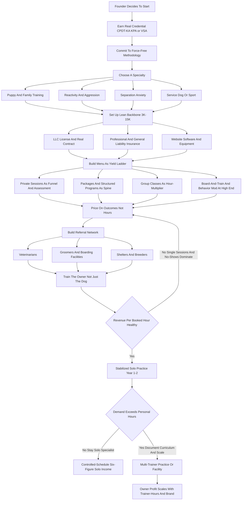
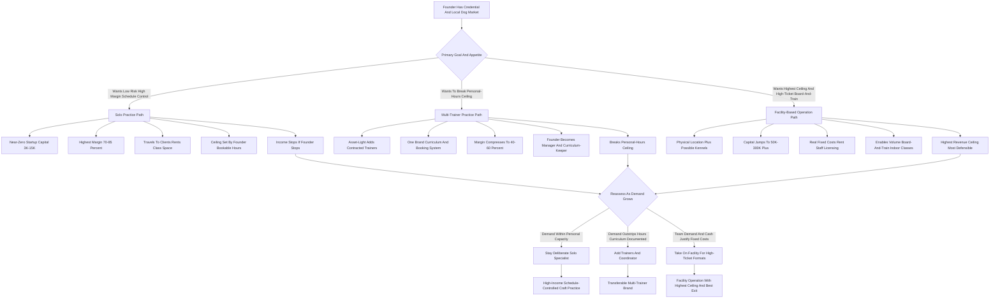

**TL;DR:** To start a dog training business in 2027, you sell behavior change -- you take a dog that pulls, barks, bolts, bites, ignores, or panics, and you teach the dog and, far more importantly, the owner how to live together without the problem. The model is **real, durable, and genuinely accessible on low capital** -- a serious launch needs only **$3,000-$15,000** because the core asset is your skill and your credential, not a building or a fleet -- but the entire economics rest on one number most beginners never calculate: **revenue per booked hour**, the amount you actually earn for every hour of your time once you net out drive time, no-shows, unpaid admin, and the gap between a $90 private session and a $4,000 board-and-train that fills a week. A trainer charging $90 a session who books three private lessons a day, four days a week, drives forty minutes between each, and never sells a package is running a tired, low-yield business; a trainer who sells $1,800 six-week programs, runs $200-per-dog group classes eight dogs at a time, and adds a $2,500 board-and-train is earning multiples of the same hour. The honest 2027 economics: a focused solo trainer invests **$3K-$15K** in certification, insurance, equipment, and a website, runs at a **70-85% margin** because there is almost no cost of goods, and in a disciplined Year 1 serves **50-200 clients** for **$45K-$110K in revenue** against **$30K-$80K in owner profit**. By Year 2-3 a trainer who has added group classes, board-and-train, and one or two contracted trainers reaches **$150K-$450K in revenue**, and a multi-trainer or facility-based operation can pass **$500K-$900K**. The three things that kill dog training startups: **(a) skipping real certification** -- CCPDT, KPA, Victoria Stilwell Academy, IAABC -- and competing as an uncredentialed "dog whisperer" who cannot get vet referrals or charge premium rates; **(b) selling single sessions instead of packages and programs**, which caps revenue per hour and leaves the owner half-trained and unhappy; and **(c) training the dog instead of the owner**, the single most common reason results do not stick and referrals never come. Net: viable in 2027 as a credentialed, package-priced, owner-focused, referral-driven practice built on positive-reinforcement methods and a specialty -- a poor fit for anyone who wants to "work with dogs" without selling, teaching humans, or running a real business.

## What A Dog Training Business Actually Is In 2027

A dog training business sells behavior change, and the sooner a founder internalizes that the sooner the business works. You are not paid to play with dogs, and you are not paid to be good with dogs -- you are paid to take a specific, named problem in a household and make it go away: the dog that drags the owner down the street, the dog that screams for four hours when left alone, the dog that lunges at the mail carrier, the puppy that bites the children, the rescue that cowers under the table, the dog that will not come when called near a road. The deliverable is a changed household, and the dog is only half of it. The other half -- the half that beginners ignore and professionals obsess over -- is the human, because the owner is the one who lives with the dog the other 167 hours of the week, and a trainer who fixes the dog in a session and sends it home to an untrained owner has built a problem that comes back. In 2027 the business is shaped by realities that were softer a decade ago: clients research and compare trainers online and read reviews before they call; the science of dog behavior has consolidated hard around positive-reinforcement and force-free methods, and the "alpha/dominance" framing is now a credibility liability with educated clients and a disqualifier for vet referrals; veterinarians, groomers, shelters, and boarding facilities have become organized referral sources that send business to credentialed trainers and quietly steer clients away from uncredentialed ones; and the demand base is large and structurally durable because the US dog population is enormous and a meaningful share of those dogs have behavior problems their owners cannot solve alone. The dog training business is not trendy and it is not passive. It is a teaching-and-behavior-science business wearing a friendly costume, and the founders who succeed understand that the dog is the patient, the owner is the student, the credential is the license to charge, and the business is a calendar of booked hours that must each be made to earn.

## The Service Categories: What You Actually Sell And Why

The menu of a dog training business spans several distinct services, and a founder must understand every one before pricing a single thing, because the mix you sell determines your revenue per hour for years. **Private in-home or in-facility sessions** are the entry product -- one-on-one work on a specific issue, sold by the session or, far better, in packages of four to eight; they are flexible, high-touch, and the foundation of trust, but sold one session at a time they are the lowest-yield format. **Puppy classes and basic obedience group classes** -- six-to-eight-week courses run with six to ten dogs at once -- are the single best revenue-per-hour format the business has, because one trainer's hour is sold to eight households simultaneously; puppy socialization classes in particular have a time-sensitive, almost medical urgency that drives enrollment. **Structured training programs** -- a defined four-to-six-week package combining private sessions, homework, and sometimes group work, sold as one priced outcome rather than a stack of hours -- are how a trainer converts the private format into a real ticket and a real result. **Board-and-train** -- the dog lives with the trainer or at the facility for two to four weeks of intensive daily training -- is the highest-ticket service, commanding thousands of dollars, and it is the format that can fill a calendar and a cash-flow gap; it also carries the most operational weight (housing, liability, the transfer of training back to the owner). **Behavior modification programs** for serious issues -- aggression, severe separation anxiety, intense reactivity, fear and phobia work -- are the high-skill, high-margin specialty that only credentialed, experienced trainers should take, and they command premium pricing because few can do them safely. **Day training** -- the trainer works the dog during the day while the owner is at work, then transfers the skills -- is a hybrid that suits busy households. **Service dog, therapy dog, and working dog training** -- task training for assistance dogs under ADA frameworks, therapy dog certification prep, protection and sport (IGP) work -- are specialized verticals with their own standards, timelines, and ticket sizes that run from hundreds to tens of thousands of dollars. **Group walks, drop-in classes, and ongoing "maintenance" offerings** create recurring revenue and keep graduated clients in the ecosystem. A founder should think of the menu as a yield ladder: private sessions build trust and feed the funnel, packages and programs convert that trust into a real ticket, group classes multiply the hour, board-and-train and behavior modification carry the high end, and recurring offerings smooth the revenue -- and the Year 1 mistake is living entirely on the bottom rung, selling single private sessions, and wondering why the calendar is full and the bank account is not.

## The Three Models: Solo Practice, Multi-Trainer Practice, And Facility-Based Operation

There are three distinct ways to build this business, and choosing deliberately shapes the capital, the ceiling, and the daily life. **The solo practice model** is one credentialed trainer who travels to clients' homes and runs group classes in rented or borrowed space -- a park, a pet store, a dog daycare, a community center. Its advantages are near-zero startup capital, the highest margin in the business (70-85%), total schedule control, and the ability to launch fast; its limits are a hard ceiling set by the trainer's own bookable hours and the income loss whenever the trainer is sick, on vacation, or simply tired. This is where almost everyone starts and where many trainers happily stay. **The multi-trainer practice model** keeps the asset-light, travel-to-client structure but adds contracted or employed trainers under one brand, one curriculum, and one booking system -- the founder shifts from doing all the training to recruiting, training, and quality-controlling other trainers and keeping the calendar full for all of them. Its advantage is breaking the personal-hours ceiling and building something that earns when the founder is not personally in a session; its challenge is that margin compresses (you are now paying trainers), and the founder must become a manager and a curriculum-keeper, not just a trainer. **The facility-based operation model** adds a physical location -- a training building, often combined with boarding kennels for board-and-train, daycare, or retail -- which raises capital requirements sharply ($50K-$300K+) and adds rent, staff, and licensing weight, but enables high-ticket board-and-train at volume, indoor group classes regardless of weather, and a visible brand presence. Its advantage is the highest revenue ceiling and the most defensible local position; its challenge is real fixed costs that exist whether the calendar is full or not. Many successful operators run the arc deliberately: launch solo to validate the market and build cash and reputation with almost no risk, layer in contracted trainers once demand outstrips personal capacity, and only then -- if the numbers and the ambition justify it -- take on a facility. The wrong move is signing a facility lease in Year 1 on the strength of enthusiasm, before the demand, the curriculum, and the referral network exist to fill it.

## The 2027 Market Reality: Demand, Competition, And What Changed

A founder needs an accurate read of the 2027 landscape, because the dog training market is neither the easy goldmine that pet-industry hype suggests nor a saturated dead end. **Demand is large and structurally durable.** The US dog population runs in the high tens of millions -- the American Veterinary Medical Association and the American Pet Products Association track a population around 85-90 million dogs -- and survey data consistently shows a substantial share of dogs exhibit behavior issues their owners find difficult: house-training failures, leash pulling, excessive barking, separation distress, reactivity, and fear. The pandemic-era surge in dog acquisition created a large cohort of dogs that were under-socialized during critical windows, and the demand for behavior help from that cohort remains elevated into 2027. Spending on pets is resilient even when household budgets tighten, because the dog is family. **The competition is bifurcated and uneven.** At one end sit the large retail and franchise training brands -- PetSmart and Petco offer in-store group classes at accessible price points; franchises like Bark Busters and Sit Means Sit have hundreds of territory-based units; Off Leash K9 and similar brands have expanded widely. At the other end is a long, uneven tail of independent trainers ranging from highly credentialed behavior specialists to uncredentialed hobbyists calling themselves "dog whisperers." **What changed by 2027:** the method debate has effectively been settled in professional and veterinary circles in favor of positive-reinforcement and force-free training, which means an uncredentialed trainer using dominance-based or aversive methods is now actively screened out by vets, shelters, and educated clients; certification has shifted from a nice-to-have to a practical requirement for the referral network and the premium price tier; clients book and vet trainers online and lean heavily on reviews; and telehealth-style virtual training and hybrid models became normalized, expanding a trainer's geographic reach. The net market reality: demand is real, large, and durable; the field is genuinely open to a new entrant because the long tail is uneven and beatable on professionalism; but the path to the premium tier and the referral network runs through real certification and modern, force-free methods, and a 2027 entrant who skips that runs at the bottom of the market on price.

## The Core Unit Economics: Revenue Per Booked Hour

This is the single most important section in the guide, because the entire business lives or dies on one calculation that beginners almost never run: how much you actually earn for each hour of your time, fully loaded with the unpaid hours around it. A dog training business does not sell dogs trained -- it sells the trainer's hours -- and the trainer has a hard, finite number of bookable hours in a week. The mistake is to look at a session price and feel rich: "$110 a session" sounds like a strong wage. But run the real math. A private in-home session priced at $110 also consumes, on a typical day, thirty to fifty minutes of drive time each way, ten minutes of notes and homework write-up, and a share of the no-show and last-minute-cancel rate that haunts every solo practice. The $110 session can easily represent two-plus hours of the trainer's actual day, putting **real revenue per working hour near $40-$55** -- a modest tradesperson's wage, with none of the leverage. Now compare the formats directly. A **six-dog group class** priced at $200 per dog over six weekly ninety-minute sessions generates $1,200 of revenue for nine hours of teaching plus setup -- roughly $110-$130 of revenue per working hour, and an eight-dog class pushes it past $150. A **six-week structured program** sold at $1,800 -- combining, say, six private sessions and structured homework -- is one sale that books a known block of the calendar at a known price, far better than hoping to rebook a single session six times. A **board-and-train** at $2,800 for a fourteen-day stay, where the dog is on the premises and the training is folded into the day, can represent $200-$400 of revenue per genuinely-worked hour because the format compounds care and training. A **behavior modification program** for aggression at $2,500-$5,000 reflects the scarcity of trainers who can do it safely. The discipline this imposes: **before setting a calendar, map every format's true revenue per booked hour, net of drive time, admin, and no-shows, and then deliberately weight the week toward the high-yield formats.** The trainer who fills the week with single private sessions is running the lowest-yield version of the business while feeling busy; the trainer who anchors the week on group classes and programs, uses private sessions as a funnel and a premium add-on, and lets board-and-train carry the high end, earns several times the income from the same forty hours. Revenue per booked hour is the number that separates a tired trainer from a real business.

## The Line-By-Line Unit Economics And P&L

Beyond revenue per hour, a founder must internalize the operating P&L, and the good news is that it is unusually clean: a dog training business has almost no cost of goods sold. There is no inventory to buy, no fleet, no expensive consumables -- a session "costs" treats, a clicker, a leash, and the trainer's time. That is why the margin is the highest in the small-business landscape, commonly **70-85% for a solo practice.** The cost structure that does exist is mostly fixed and modest. **Insurance** -- professional liability and general liability covering the trainer for injuries to dogs, people, and property -- is a real annual cost, typically a few hundred to low four figures, and non-negotiable. **Certification and continuing education** -- the upfront cost of the credential plus ongoing CEUs to maintain it -- is an investment that recurs at a smaller maintenance level. **Marketing and website** -- a professional site, listing fees, and modest advertising -- is an ongoing line. **Vehicle costs** -- for the travel-to-client trainer, fuel and mileage and wear are a genuine variable cost that must be priced into the session, and trainers who ignore it are subsidizing their clients' driveways. **Equipment** -- leashes, long lines, treat pouches, clickers, training aids, agility or class equipment -- is a small recurring spend. **Software** -- scheduling, client management, payment processing -- is a modest monthly cost. For the **multi-trainer model**, the largest new cost is trainer compensation, which compresses margin from the 70-85% solo range toward 40-60% but breaks the personal-hours ceiling. For the **facility model**, rent, utilities, facility staff, and licensing become substantial fixed costs that exist whether or not the calendar is full -- which is exactly why a facility should follow proven demand, not precede it. At the business level, the dominant P&L truths are: revenue is the trainer's bookable hours multiplied by revenue per hour, so format mix is the primary lever; the margin is naturally excellent because there is no COGS, so the failure mode is not thin margins but unfilled hours and low-yield format mix; no-shows and cancellations are a direct, uninsured loss of revenue that must be controlled with deposits and cancellation policies; and the off-the-clock hours -- marketing, admin, driving, continuing education -- are real and must be either minimized or priced in. The founders who fail at the P&L level are almost never beaten by costs; they are beaten by a calendar full of low-yield single sessions, an uncontrolled no-show rate, and prices set on a tradesperson's hourly logic instead of an outcome-and-yield logic.

## The Certification Landscape: Your License To Charge

A founder must treat certification not as an optional credential but as the practical license to charge premium rates and access the referral network, because in 2027 it functions as exactly that. There is no single government license to "be a dog trainer" in most of the US, which is precisely why the professional certifications carry so much weight -- they are the market's substitute for licensure. **The Certification Council for Professional Dog Trainers (CCPDT)** offers the CPDT-KA (Certified Professional Dog Trainer -- Knowledge Assessed) and the higher CBCC-KA for behavior consultants; the CPDT-KA requires documented training hours, a reference, and a proctored exam, and it is the most widely recognized baseline credential in the field. **The Karen Pryor Academy (KPA)** offers a structured professional program culminating in the KPA CTP (Certified Training Partner) credential -- a hands-on, mentored education in positive-reinforcement training that is well respected and more expensive because it is a real course, not just an exam. **The Victoria Stilwell Academy (VSA)** offers a comprehensive force-free dog trainer course and credential built around modern, science-based methods. **The International Association of Animal Behavior Consultants (IAABC)** certifies at the behavior-consultant level for trainers working serious behavior cases and is the relevant credential for aggression, fear, and complex behavior work. **The Association of Professional Dog Trainers (APDT)** is a membership and professional-development organization rather than a certifying body, but membership signals professional engagement. **The Pet Professional Guild** is the membership organization explicitly built around force-free methods. **The Fear Free certification** trains professionals to reduce fear, anxiety, and stress in animals and is increasingly valued by the veterinary referral network. **The AKC Canine Good Citizen (CGC) program** is not a trainer credential but a widely recognized dog-and-handler certification that trainers prepare clients for and can become evaluators of. The strategic point: a 2027 trainer should hold at least one core credential -- CPDT-KA, KPA CTP, or the VSA credential -- before charging premium rates, should add IAABC or behavior-specific credentials before taking serious behavior cases, and should understand that the credential is what gets the trainer onto a veterinarian's referral list and a shelter's recommended-trainer sheet. The uncredentialed trainer is not blocked from working, but is structurally confined to the bottom of the market, competing on price, locked out of the referral network, and exposed on liability and method. Certification is not a vanity line on a website; it is the license to charge.

## Choosing Your Methodology: Why Force-Free Won The 2027 Market

A founder must make a deliberate, informed choice about training methodology, because in 2027 the choice is no longer neutral -- it has direct commercial consequences. The professional and veterinary consensus has consolidated firmly around **positive-reinforcement and force-free / fear-free methods**: training that builds behavior through reinforcement, that manages the environment to prevent rehearsal of unwanted behavior, and that explicitly avoids fear, pain, and intimidation. The certifying bodies -- CCPDT, KPA, VSA, IAABC, the Pet Professional Guild -- are aligned with this approach, the major veterinary behavior organizations endorse it, and the body of behavior science supports it. The older **dominance / alpha / "pack leader"** framing, and the aversive tools associated with it -- prong collars, shock and e-collars, "balanced" methods that mix reinforcement with positive punishment -- have become, in the eyes of the credentialed referral network and a large segment of educated clients, a credibility problem. This is not a moral lecture; it is a market fact a founder must price into the decision. A trainer who builds on force-free methods can hold a recognized credential, can get on veterinary and shelter referral lists, can serve the educated premium client who has read about training before calling, and is insulated from the reputational and liability risk that aversive incidents carry. A trainer who builds on dominance-based or aversive methods will find the credential path harder, the referral network largely closed, the premium educated client skeptical, and the liability exposure higher. There remains a segment of the market -- and certain working-dog, protection, and sport contexts have their own traditions -- but for the general pet-dog training business a founder is launching in 2027, force-free is not only the ethically and scientifically supported choice, it is the commercially correct one: it is the methodology that the credential, the referral network, and the premium client all require. Choose it deliberately, learn it properly, and build the brand on it.

## Picking A Specialty: The Differentiator That Sets Your Price

A founder should resist being a generic "dog trainer" and instead choose a specialty, because in a field with a long undifferentiated tail, the specialty is what sets the price and the referral pattern. **Puppy training and socialization** is a high-volume, time-sensitive specialty -- puppies have a critical socialization window, owners feel urgency, and the puppy client often becomes a multi-year relationship. **Behavior modification -- aggression, reactivity, fear, and anxiety** -- is the high-skill, high-margin specialty; few trainers can safely take an aggression case, the credential requirements are real (IAABC-level), and the pricing reflects the scarcity. **Separation anxiety** has become its own recognized sub-specialty with dedicated training and certification paths, and it is a large, underserved problem. **Service dog and assistance dog training** -- task training for mobility, medical alert, psychiatric service dogs under ADA frameworks -- is a long-timeline, high-ticket vertical with its own standards and ethics. **Therapy dog preparation** -- readying dogs and handlers for therapy-dog certification through organizations that place therapy teams -- is a defined, repeatable program. **Protection, IGP / IPO sport, and working-dog training** is a distinct world with its own clientele and traditions. **Breed-specific or working-line specialization** -- becoming the regional expert in a demanding breed or working line -- builds a referral relationship with breeders and breed clubs. **Scent work, agility, and dog sports** serve the engaged-hobbyist client and create recurring class revenue. **Puppy-raising for breeders** and **shelter and rescue behavior work** are institutional channels. The strategic logic: a specialty makes the trainer findable ("the separation anxiety person," "the reactive-dog trainer"), justifies a premium because expertise cannot be price-shopped the way a generic obedience session can, and creates a specific referral pattern -- vets refer aggression and anxiety cases, breeders refer puppy and breed work, shelters refer behavior cases, agility clubs refer sport students. A founder can and often should start with a broad offering to build cash flow, but should be deliberately developing a specialty from early on, because the generic trainer competes with the entire long tail while the specialist competes with almost no one.

## The Startup Cost Breakdown: The Honest All-In Number

A founder needs a clear-eyed total of what it costs to launch, and the headline is genuinely encouraging: a dog training business is one of the lowest-capital legitimate businesses a person can start, because the core asset is skill, not stuff. The all-in startup cost for a **solo, travel-to-client launch** breaks down as: **certification** -- the largest single line, ranging from a few hundred dollars for the CCPDT exam path if the trainer already has documented experience, to several thousand dollars for a full mentored program like KPA or VSA; budget **$500-$6,000** depending on the path chosen; **insurance** -- professional and general liability, first-year premium, **$300-$1,200**; **business formation and licensing** -- LLC setup, local business license, **$100-$800**; **website and branding** -- a professional, review-friendly site and basic brand identity, **$500-$3,000**; **equipment** -- leashes, long lines, treat pouches, clickers, training aids, and basic group-class equipment, **$300-$1,500**; **software** -- scheduling, client management, and payment processing setup and first months, **$0-$600**; **initial marketing** -- listings, local advertising, and launch promotion, **$300-$2,000**; **vehicle and phone** -- assuming the founder already has a vehicle, incremental cost is modest, but a reliable vehicle is a working requirement; and a small **working-capital cushion** -- **$1,000-$3,000** to cover the first months before the calendar fills. Totaled, a lean solo launch can realistically come in around **$3,000-$8,000**, and a fuller solo launch with a comprehensive mentored certification, a strong website, and a real marketing push runs **$8,000-$15,000**. The **multi-trainer model** adds little hard capital but requires working capital to pay trainers before client revenue clears. The **facility model** is a different universe: leasehold, build-out, kennels if board-and-train is offered, facility insurance and licensing, and staff push the launch into the **$50,000-$300,000+** range and should never be attempted before the demand is proven. The capital story is the dog training business's great advantage: it lets a credentialed, disciplined founder launch on the cost of a used car, validate the market with real clients, and reach profitability fast -- which is exactly why the binding constraint in this business is never capital. It is skill, certification, and the discipline to sell packages instead of single hours.

## The Year-One Operating Reality

A founder should walk into Year 1 with accurate expectations, because the gap between "I love dogs" and "I run a dog training business" is where most quitting happens. Year 1 is **credential-building, reputation-building, and funnel-building mode.** The first months are spent finishing or leveraging the certification, setting up the legal and insurance and software backbone, building the website and the review base, and -- most importantly -- doing the unglamorous relationship work of getting in front of the veterinarians, groomers, shelters, boarding facilities, and pet stores that will become the referral engine. Early clients often come from a mix of launch marketing, online listings, and the first few referral relationships, and the trainer is doing everything: training, selling, driving, writing homework, posting online, and asking for reviews. A disciplined Year 1 solo dog training business can realistically serve **50-200 clients** and generate **$45,000-$110,000 in revenue** against **$30,000-$80,000 in owner profit** -- a strong outcome for a business launched on a few thousand dollars, but earned through long days and a lot of unpaid relationship and admin work. Year 1 is also where the founder discovers the format-mix lesson the hard way or the easy way: the trainer who spends Year 1 selling single private sessions finds the calendar full and the income capped; the trainer who launches group classes early, sells packages and programs from the first month, and adds a board-and-train offering once the operation is stable, finds the same calendar producing far more. The work is genuinely entrepreneurial: the founder must sell, must teach humans and not just dogs, must handle the no-show that wrecks an afternoon, and must do the marketing that a salaried trainer never thinks about. The founders who succeed treat Year 1 as paid tuition in running a real practice and use it to build the credential, the referral network, the review base, and the high-yield format mix; the ones who fail expected to be paid to play with dogs and were unprepared for the selling, the teaching, and the business.

## The Five-Year Revenue Trajectory

Mapping a realistic five-year arc helps a founder size the opportunity honestly. **Year 1:** solo, credential and funnel building, $45K-$110K revenue, $30K-$80K owner profit, founder doing everything, the first referral relationships forming and the first group classes launching. **Year 2:** the referral network starts producing reliable flow, the review base compounds, group classes and packages are now the spine of the calendar, and a board-and-train offering is added; revenue climbs to roughly **$90K-$220K** with owner profit around **$60K-$150K** as the format mix matures and the trainer's hours are deployed at higher yield. **Year 3:** the founder either deliberately stays a high-earning solo specialist or begins layering in contracted trainers; with one or two added trainers and a working curriculum, revenue lands around **$150K-$450K** with owner profit roughly **$90K-$250K**, and the founder shifts from doing all the training to managing and quality-controlling. **Year 4:** continued team growth, possible facility decision, deeper specialty positioning, and recurring-revenue offerings; revenue roughly **$250K-$650K** for a multi-trainer practice, **$120K-$300K** owner profit. **Year 5:** a mature operation -- a multi-trainer practice or a facility-based operation at **$400K-$900K+ revenue** with **$150K-$400K owner profit**, or a deliberately solo specialist still earning a strong six figures on excellent margins with a controlled schedule. These numbers assume a real credential, force-free methods, a deliberate specialty, package-and-program pricing, a built referral network, and disciplined format mix; they do not assume exponential growth, because the business scales with trainer-hours and reputation, not magically. The honest framing: a solo trainer who never builds a team can still reach a very comfortable, high-margin, schedule-controlled six-figure income -- a genuinely good outcome -- and the founder who wants more can break the personal-hours ceiling with trainers and, eventually, a facility, accepting compressed margins and a manager's role in exchange for a higher ceiling.

## Five Named Real-World Operating Scenarios

Concrete scenarios make the model tangible. **Scenario one -- Priya, the disciplined solo specialist:** earns a KPA CTP credential and an IAABC behavior path, launches for about $9,000, deliberately specializes in reactive-dog and separation-anxiety work, sells $1,900 six-week programs and $250-per-dog group classes from month one, builds tight referral relationships with three local veterinary practices, and hits $98K revenue in Year 1 at an 80% margin; by Year 3 she is a recognized regional behavior specialist earning a controlled-schedule $180K solo, having deliberately chosen depth over a team. **Scenario two -- the cautionary tale, Mark:** is genuinely gifted with dogs but skips certification, markets himself as a "dog whisperer" using dominance-based methods, cannot get on a single veterinary referral list, is screened out by educated clients who researched training first, competes entirely on price at the bottom of the market, sells only single $75 sessions, and burns out after eighteen months having never broken $40K because he built a low-yield, referral-starved, uncredentialed practice. **Scenario three -- the Ramirez practice, multi-trainer:** founder launches solo, validates the market in eighteen months, then recruits and trains three contracted trainers on a shared force-free curriculum and booking system, focuses her own time on puppy-and-family training and on keeping all four calendars full; the practice reaches $380K revenue by Year 3 at a compressed but healthy ~50% margin, breaking the personal-hours ceiling. **Scenario four -- Devon, the board-and-train facility operator:** spends two years solo building reputation and cash, then takes on a facility with boarding kennels, builds the business around $3,200 two-week board-and-train programs supplemented by indoor group classes and day training, and reaches $620K revenue by Year 5 with real fixed costs but the highest ceiling of the four. **Scenario five -- Lena, the format-mix casualty turned recovery:** launches credentialed and capable but spends Year 1 selling only single private sessions, ends the year exhausted with a full calendar and just $52K; in Year 2 she restructures -- group classes, $1,800 programs, deposits to kill the no-show rate, a board-and-train add-on -- and the same forty hours produce $140K. These five span the realistic distribution: disciplined solo specialist success, uncredentialed-and-low-yield failure, multi-trainer scale, facility-based high ceiling, and the format-mix lesson learned and corrected.

## Lead Generation: The Referral Network Is The Engine

A founder must understand that in dog training the lead-generation engine is a referral network, not advertising, and building it is core ongoing work. **Veterinarians are the single most valuable relationship.** A vet sees behavior problems constantly -- the biting puppy, the aggressive dog, the anxious rescue -- and is asked, "who do you recommend?" by worried owners every week. Becoming a vet's recommended trainer is a durable, repeating source of qualified, motivated clients, and it is earned by being credentialed, using force-free methods the vet endorses, communicating professionally, and making the vet look good by getting results. Many practices keep a short recommended-trainer list; getting on it is a deliberate business-development goal. **Groomers** see every dog in town on a schedule and hear owners complain about behavior; they refer readily to a trainer they trust. **Boarding and daycare facilities** encounter behavior issues that make a dog hard to board and are natural referral partners -- and sometimes a venue partner for classes. **Animal shelters and rescues** want adopters to succeed and keep dogs out of return cycles; a trainer who supports adopters builds a strong institutional referral channel. **Pet stores** -- both the chains and the independents -- field training questions and sometimes host or refer for classes. **Breeders and breed clubs** refer puppy and breed-specific work. **Past clients and their reviews** are the compounding asset -- a trained owner tells other dog owners, and online reviews convert the strangers those conversations send. **The website and online listings** convert the demand the network and the reviews generate. Paid advertising plays a supporting role, especially at launch, but the durable flow is the referral web. A founder should treat business development -- deliberately and continually building relationships with vets, groomers, shelters, boarding facilities, and breeders -- as a permanent core function, because a trainer with a thin referral base competes on price against the long tail, while a trainer with a deep one has a steady, defensible flow of motivated, pre-sold clients.

## Pricing Strategy: Sell Outcomes And Packages, Not Hours

Pricing in dog training has two layers -- the format-level price and the structural choice between selling hours and selling outcomes -- and a founder must get the structure right because it is the difference between a capped income and a real one. **The structural rule: sell packages, programs, and classes, not single sessions.** A single $100 session is a low-yield transaction that leaves the owner half-trained, unlikely to get a lasting result, and unlikely to refer; a $1,800 six-week program is one sale that books a known block of calendar, delivers a real outcome, produces a satisfied referring client, and earns far more per hour. Single sessions still have a role -- as an assessment, a funnel entry, or a premium one-off -- but the spine of the revenue should be multi-session packages, structured programs, group classes, and board-and-train. **Format-level pricing in 2027** runs roughly: private sessions $80-$250 each, sold better in packages of four to eight; puppy and basic group classes $150-$600 for a six-to-eight-week course; structured programs $500-$3,500 depending on scope; board-and-train $1,500-$15,000 depending on length and intensity; behavior modification programs $1,500-$5,000+; service dog training from several thousand into the tens of thousands; therapy-dog prep $200-$1,000. **Price on outcome and expertise, not on a tradesperson's hourly logic** -- the client is buying a fixed household, not sixty minutes, and the credentialed specialist who solves aggression is not selling the same hour as the hobbyist running a sit-stay class. **Control the no-show with deposits and clear cancellation policies**, because an uncontrolled no-show rate is a direct, uninsured cut to revenue per hour. **Use group classes as the yield multiplier** -- the same teaching hour sold to eight households is the best economics in the business. The founders who price badly set a single-session hourly rate, give away the no-show, and never sell a package; the ones who price well sell outcomes, anchor the calendar on classes and programs, protect the schedule with deposits, and let the high-margin specialty work carry the top of the menu.

## Operations And Systems: Running The Practice

A founder should build the operating systems early, because a dog training business is date-sensitive, relationship-heavy, and easy to run sloppily. **Scheduling and client management software** is the central system -- it holds the client and dog records, the session and class calendar, the package and program tracking, and increasingly the homework and progress notes; running a growing practice off a paper calendar and memory drops clients and double-books. **Intake and assessment** is the first operational step with every client -- a structured behavior history, an in-person or virtual assessment, and a clear plan -- and doing it well sets the program scope, the price, and the expectations. **Homework and the owner-transfer system** is the operational heart of getting results: written homework, between-session check-ins, and clear owner instruction are what make the training stick, and a trainer without a transfer system trains dogs that regress. **Progress documentation** -- session notes, video, milestone tracking -- supports the owner, supports the vet relationship, and supports the reviews. **Group class logistics** -- enrollment, space, equipment, the curriculum delivered consistently week to week -- is a repeatable system once built. **Board-and-train operations**, if offered, add real weight: housing, daily training routines, safety and supervision, owner updates, and a structured handoff that transfers the training to the owner. **Liability and safety protocols** -- screening dogs, managing aggression cases safely, equipment standards, incident procedures -- are operational, not optional, in a business that handles animals that can hurt people and each other. **Payment processing and policies** -- deposits, package terms, cancellation rules -- protect the revenue. The discipline: adopt the client-management software early, build a real intake-to-program-to-homework workflow, document progress, and standardize the group-class and board-and-train operations so the practice runs consistently whether it is one trainer or several -- and so it is ready to be handed to additional trainers when the founder chooses to scale.

## Staffing And Building A Team

A founder can run a solo practice indefinitely, but breaking the personal-hours ceiling means building a team, and the staffing model is shaped by the business's reliance on skill and brand-consistent method. **The first hires are trainers**, contracted or employed, and the central challenge is that they must deliver the founder's methodology, curriculum, and quality consistently -- a client who has a great experience with the founder and a mediocre one with a new trainer damages the brand. This makes recruiting (for credential and force-free alignment), onboarding (into a documented curriculum), and ongoing quality control (shadowing, co-sessions, client feedback) the founder's core new job. Compensation is typically a revenue share or an employed wage; either way it compresses the solo margin but creates capacity. **An administrative or client-coordinator role** -- handling scheduling, intake, payment, and the constant inbound -- is often the highest-leverage non-trainer hire, because it frees the founder and the trainers to do billable work. **For a facility operation**, the staffing widens to include facility and kennel staff, daycare attendants if offered, and the supervision the housing of client dogs requires. The sequencing principle: the founder should not hire trainers until demand reliably outstrips personal capacity and a documented curriculum exists to onboard them into; hiring trainers to chase demand that is not there just compresses margin without filling calendars. The strategic point: dog training scales with skilled, brand-consistent trainer-hours, so the team's quality and method-alignment directly drive whether scale builds the brand or dilutes it -- and the founder who scales well has turned a personal craft into a documented, teachable system before hiring the first trainer.

## Risk Management, Liability, And Insurance

The dog training business carries specific risks, and the 2027 operator manages each deliberately. **Injury liability is the central risk** -- a dog can bite a person, injure another dog, or cause property damage during a session, a class, or a board-and-train, and the trainer can be held responsible. This is mitigated by **professional and general liability insurance**, which is non-negotiable and should be in place before the first paid session; by **rigorous screening and safety protocols**, especially around aggression and reactivity cases; by **clear contracts** that set responsibilities, assumption of risk, and the limits of the trainer's role; and by **force-free methods**, which carry meaningfully lower incident and reputational risk than aversive approaches. **Board-and-train adds custodial liability** -- the dog is in the trainer's care around the clock, and housing, supervision, escape prevention, and health monitoring become real responsibilities requiring facility standards and protocols. **Method and reputational risk** -- an aversive-training incident, a viral complaint, a bad review -- is mitigated by modern methods, professional communication, and a strong review base that absorbs the occasional negative. **Results-expectation risk** -- a client who expected a "fixed" dog and got a half-trained one because they did not do the homework -- is mitigated by honest intake, clear program scope, owner-transfer systems, and contracts that set expectations. **No-show and revenue risk** is mitigated by deposits and cancellation policies. **Credential and compliance risk** -- working serious behavior cases without the credential and skill to do so safely -- is mitigated by matching the case to the certification. **Single-point-of-failure risk** in a solo practice -- the trainer gets sick or hurt and the income stops -- is mitigated over time by building a team or a recurring-revenue base. The throughline: every major risk in dog training has a known mitigation built from insurance, contracts, screening, modern methods, and matching cases to credentials -- and the operators who get hurt are usually the ones who skipped insurance, used a weak or no contract, took cases beyond their skill, or built on methods that carry higher incident risk.

## Marketing And Brand: Being Findable And Credible

A founder must build a marketing presence that does two jobs -- being findable and being credible -- because in 2027 the client researches before calling. **The website is the credibility hub** -- it should state the credential clearly, name the methodology (force-free), present the specialty, show real results and reviews, and make booking or inquiring easy; a vague, credential-free, review-thin site loses the educated client to a professional-looking competitor. **Online reviews and listings are the conversion engine** -- the referral conversations and the search traffic land on the reviews, and a deep base of genuine positive reviews is the single most powerful marketing asset a trainer builds; systematically asking satisfied clients for reviews is core ongoing work. **Content -- short videos, before-and-afters, training tips, social presence** -- demonstrates competence, builds the brand, and feeds the algorithm that puts the trainer in front of local dog owners; it is also where the methodology and the specialty get communicated. **Local search presence** -- being found when someone searches for a trainer or a specific problem in the area -- converts active demand. **The referral network**, covered above, is the durable engine, and the marketing assets exist substantially to convert the demand the network generates. **Community visibility** -- shelter events, pet-store demos, vet-office relationships, breed-club presence -- builds the local brand. The brand itself should be built deliberately around the credential, the force-free methodology, and the specialty, because those three are what differentiate the trainer from the undifferentiated long tail. The discipline: build a credible, credential-forward, review-rich website; systematically generate reviews; produce content that demonstrates competence and communicates method and specialty; and treat marketing as the system that converts the referral network's demand into booked, pre-sold clients -- not as a substitute for the network.

## Legal Structure, Taxes, And Compliance

A founder should set up the legal and tax structure deliberately, because the liability profile of handling animals makes it matter. **Entity:** most dog trainers form an LLC for liability protection and tax flexibility; the entity holds the insurance, signs the client contracts, and creates separation between business and personal assets -- meaningful in a business with real injury exposure. **Business licensing:** a local business license is typically required, and a home-based or facility-based operation may have zoning and permitting considerations -- a facility with boarding especially so. **Contracts:** every client should sign a clear service agreement covering scope, payment and cancellation terms, assumption of risk, the limits of the trainer's role, and -- for board-and-train -- custodial terms; a strong contract is both a legal protection and an expectation-setting tool. **Insurance:** professional and general liability as covered above, plus facility and custodial coverage if applicable. **Taxes:** the business's clean margin and low COGS make bookkeeping simple but no less necessary -- separate business banking from day one, track income by format, capture the deductible expenses (certification and CEUs, insurance, vehicle and mileage, equipment, software, marketing, home-office or facility costs), and handle quarterly estimated taxes. **Employment compliance:** when the founder adds trainers, the contractor-versus-employee classification, payroll, and the associated taxes and rules become real and must be handled correctly. **Service dog and ADA context:** trainers working in the service-dog vertical should understand the relevant ADA frameworks and the ethics and standards of that work. The discipline: form the LLC, get the license, use a real contract on every client, carry the right insurance, keep clean books that separate the formats, and bring in an accountant who understands service businesses before the first tax season. The compliance load is light compared to most businesses, but the liability profile means the legal backbone -- entity, contract, insurance -- is not the place to cut corners.

## Owner Lifestyle: What Running This Business Actually Feels Like

A founder should know what daily life in this business is like before committing, because the lived reality is rewarding but is not "playing with dogs." In **Year 1**, running a solo practice, the founder is genuinely in every part of the business -- assessing dogs, teaching owners, driving between in-home sessions, running evening and weekend group classes (because that is when working owners are available), writing homework, posting content, asking for reviews, courting vet and groomer referrals, and handling the no-show that blows up a Tuesday afternoon. It is absorbing and physical-adjacent work -- you are on your feet, outdoors in all weather for in-home and class work, managing animals that are sometimes fearful or aggressive -- and the schedule is shaped by client availability, which means evenings and weekends. By **Year 2-3**, with systems, a referral network, and possibly a coordinator or first trainers, the role shifts toward managing the practice, keeping calendars full, building the team, and doing the higher-skill behavior work personally, though a solo specialist may deliberately keep doing the hands-on training because that is the part they love. By **Year 3-5**, a multi-trainer or facility operator is largely managing -- recruiting and quality-controlling trainers, running the facility, building the brand -- while a deliberate solo specialist is running a controlled, high-margin schedule of premium work. The emotional texture: there is deep satisfaction in the work itself -- the reactive dog that can finally walk down the street, the family that almost rehomed their dog and now keeps it, the owner who finally understands their animal -- and real stress in the selling, the no-shows, the occasional dangerous dog, the difficult owner who will not do the homework, and, in a solo practice, the knowledge that the income stops if the trainer does. The income is real and the margin is excellent, but it is earned through teaching humans, selling outcomes, and running a business -- not through the fantasy of a job that is just dogs.

## Common Year-One Mistakes That Kill The Business

A founder can avoid most failure modes simply by knowing them in advance, because the mistakes in this business are remarkably consistent. **Skipping certification** -- launching as an uncredentialed "dog whisperer" -- locks the trainer out of the referral network and the premium tier and confines the business to price competition at the bottom of the market. **Selling single sessions instead of packages and programs** caps revenue per hour, leaves owners half-trained, and starves the referral engine of satisfied clients. **Training the dog instead of the owner** -- fixing the dog in a session and sending it home to an untrained household -- produces regression, unhappy clients, and no referrals; it is the single most common reason results do not stick. **Building on dominance-based or aversive methods** in a 2027 market that has consolidated around force-free closes the referral network, repels educated clients, and raises liability. **Not controlling the no-show rate** -- no deposits, no cancellation policy -- is a direct, uninsured cut to income. **Underpricing** -- setting a tradesperson's hourly rate instead of pricing the outcome and the expertise -- leaves money on the table and signals low quality. **Neglecting the referral network** -- relying on advertising instead of vets, groomers, shelters, and breeders -- means competing on price with no steady flow. **No specialty** -- being a generic trainer competing with the entire long tail instead of the regional expert competing with almost no one. **Skipping insurance or using a weak contract** -- turning one bite or one dispute into a business-ending event. **Signing a facility lease too early** -- taking on fixed costs before the demand, curriculum, and referral network exist to fill it. **Taking cases beyond the credential** -- handling serious aggression without the IAABC-level skill and the safety protocols. **Ignoring the business** -- the gifted dog person who will not sell, will not market, and will not do admin, and is therefore broke. Every one of these is avoidable; the founders who fail almost always made three or four of them, and the founders who succeed treated this list as a pre-launch checklist.

## A Decision Framework: Should You Actually Start This In 2027

A founder deciding whether to commit should run a structured self-assessment, because this model fits a specific person and badly misfits others. **Skill and credential path:** do you have, or are you willing to genuinely earn, a recognized certification -- CPDT-KA, KPA CTP, or the VSA credential -- and to build on force-free methods? If you want to skip the credential and the science, this is not your business. **Teaching orientation:** are you willing and able to teach humans, not just dogs -- to coach, explain, assign homework, and manage owner behavior? The job is at least half human education; if that does not appeal, it is the wrong model. **Selling orientation:** will you sell packages, programs, and classes, set and hold prices, and ask for the close and the referral and the review? A trainer who will not sell is a hobbyist. **Capital:** this one is easy -- $3,000-$15,000 launches a solo practice, so capital is rarely the barrier, but you should have it and a small cushion. **Specialty and market:** is there a specialty you can credibly develop, and enough dog-owning population and referral-source density in your area to support a practice? **Business temperament:** will you do the marketing, the admin, the referral-relationship building, the no-show management, and the bookkeeping that a salaried trainer never touches? **Schedule reality:** are you willing to work the evenings and weekends when working dog owners are actually available? If a founder answers yes across credential path, teaching orientation, selling orientation, specialty and market, and business temperament, a dog training business in 2027 is a legitimate and achievable path to a high-margin practice -- a comfortable schedule-controlled six-figure solo income, or a $400K-$900K+ multi-trainer or facility operation. If they answer no on the credential path or the willingness to teach humans and sell, they should not start as a business owner -- they might be happier as an employed trainer. The framework's purpose is to convert "I love dogs" into an honest, structured decision about the credentialed, owner-focused, package-selling teaching business underneath.

## Scaling Past The Solo Ceiling

The jump from a proven solo practice to a multi-trainer practice or a facility is its own distinct challenge, and a founder should approach it deliberately. The prerequisites for scaling: demand must reliably outstrip the founder's personal bookable hours (do not scale to chase demand that is not there); the methodology and curriculum must be documented well enough that another trainer can deliver it consistently; the intake, program, homework, and class systems must be standardized; and the referral network and review base must be deep enough to keep multiple calendars full. The scaling levers: **add contracted or employed trainers** onboarded into the documented curriculum, with real quality control so the brand experience stays consistent; **add an administrative coordinator** to handle the scheduling and intake load that otherwise consumes the founder; **add high-ceiling formats** -- board-and-train, more group classes -- that a team and eventually a facility can deliver at volume; **build recurring revenue** -- maintenance classes, group walks, alumni offerings -- to smooth the calendar; and **consider a facility** only once the demand, the team, the curriculum, and the cash justify the fixed-cost commitment, and ideally to enable specific high-ticket formats (board-and-train, indoor classes) rather than as a vanity. The constraints on scaling: brand-consistent trainer quality is the first (solved by documented curriculum and quality control), the founder's transition from trainer to manager is the second (solved by deliberately letting go of personal training volume), demand depth is the third (solved by the referral network and reviews), and capital for a facility is the fourth (solved by reinvested solo and multi-trainer cash flow). The founders who scale well share one trait: they turned a personal craft into a documented, teachable system before they hired anyone, so that growth was the repetition of a proven machine rather than a dilution of a personal brand.

## Exit Strategies And The Long-Term Picture

Dog training businesses can be exited, and a founder should build with the eventual exit in mind, though the exit profile differs by model. **The solo practice is the hardest to sell as a going concern** because its value is substantially the founder's personal brand, credential, and relationships -- a solo practice can sometimes be transitioned to a trusted employed trainer who has built their own client relationships within it, or wound down gracefully, but it does not command a strong third-party sale price because the asset walks out the door with the founder. **The multi-trainer practice is more saleable** because the value has been moved from the founder's person into the brand, the curriculum, the trainer team, the referral network, the client base, and the systems -- a practice that runs on documented systems with trainers who are not the founder is a real, transferable business, and it can be sold to an individual operator or a regional consolidator at a multiple of stabilized earnings. **The facility-based operation is the most saleable** because it adds tangible and contractual assets -- a leasehold or owned location, kennels and equipment, a recognizable local brand, staff, and recurring revenue -- to the systems-and-brand value, making it the most substantial and transferable asset of the three. **Other paths:** an internal transition to a key trainer or manager, a roll-up by a regional or franchised training brand, or a graceful wind-down. The strategic implication for a founder: if the goal is an eventual sale, the work of scaling -- documenting the curriculum, building the team, moving value out of the founder's person and into the systems and brand -- is also the work of building a saleable asset. The honest long-term picture: dog training is a durable, real business -- the dog population is large, behavior problems are not going away, the margin is excellent, and a well-run practice produces strong owner profit for years -- but the solo version is a high-income job more than a sellable asset, and the founder who wants an exit must deliberately build the multi-trainer or facility version that has value independent of the founder's own hands.

## The 2027-2030 Outlook: Where This Model Is Heading

A founder committing to this path should have a view on where the business goes next, and several trends are reasonably clear. **Demand stays structurally healthy.** The US dog population is large and stable, the under-socialized pandemic-era cohort continues to age into behavior-help demand, and pet spending is resilient through economic cycles because the dog is family. **The force-free consensus deepens.** The professional, veterinary, and certifying-body alignment around positive-reinforcement and fear-free methods continues to strengthen, which further rewards credentialed force-free trainers and further marginalizes the aversive and uncredentialed long tail. **Certification keeps gaining weight.** As the referral network and educated clients increasingly screen for credentials, certification moves further from optional toward effectively required for the premium tier and the vet relationship. **Virtual and hybrid training stays normalized.** Remote and hybrid coaching, established during the early-2020s shift, remains a real format that extends a trainer's geographic reach and adds a flexible, low-overhead revenue line. **Specialization intensifies.** As the field professionalizes, the generic trainer is increasingly squeezed and the specialist -- separation anxiety, reactivity and aggression, service dogs, sport -- is increasingly the one who commands the premium and the targeted referral. **The referral network and reviews stay the durable engine.** Marketing tools and platforms evolve, but the vet-groomer-shelter-breeder referral web and a deep genuine review base remain the defensible flow. **Consolidation continues modestly.** Multi-trainer practices and facility operations absorb share from the uneven long tail, and franchised brands keep a presence at the accessible end. The net outlook: dog training is **viable and durable through 2030 in its credentialed, force-free, owner-focused, specialty-driven, package-priced, referral-fed form.** The version that thrives is a professional practice built on a real credential and modern methods, focused on a specialty, selling outcomes rather than hours, and fed by a deep referral network. The version that struggles is the uncredentialed, generic, single-session, advertising-dependent operation competing on price. A 2027 founder who builds the former is building a real, high-margin, durable business.

## The Final Framework: Building It Right From Day One

Pulling the entire playbook into a single operating framework: a founder who wants to start a dog training business in 2027 and actually succeed should execute in this order. **First, earn a real credential** -- CPDT-KA, KPA CTP, or the VSA credential as the baseline, IAABC or behavior-specific certification before taking serious behavior cases -- because the credential is the license to charge and the key to the referral network. **Second, commit to force-free methodology** -- not as a slogan but as a learned, properly understood approach, because it is the methodology the credential, the referral network, and the educated 2027 client all require. **Third, choose a specialty** -- puppy and family work, reactivity and aggression, separation anxiety, service dogs, sport -- because the specialist commands the price and the targeted referral while the generic trainer competes with the entire long tail. **Fourth, set up the lean legal and insurance backbone** -- LLC, license, a real client contract, professional and general liability -- before the first paid session. **Fifth, build the menu as a yield ladder** -- private sessions as funnel and assessment, packages and structured programs as the spine, group classes as the hour-multiplier, board-and-train and behavior modification at the high-margin top. **Sixth, price on outcomes, not hours** -- sell programs and packages and classes, not single sessions, and protect the calendar with deposits and cancellation policies. **Seventh, build the referral network relentlessly** -- vets, groomers, shelters, boarding facilities, breeders -- because it is the durable engine, not advertising. **Eighth, build a credible, review-rich, credential-forward online presence** to convert that demand. **Ninth, train the owner, not just the dog** -- intake, homework, owner-transfer systems -- because that is what makes results stick and referrals come. **Tenth, run real operating systems** -- client-management software, standardized intake and curriculum, progress documentation, safety protocols. **Eleventh, decide deliberately whether to stay a high-earning solo specialist or scale** -- and if scaling, document the curriculum and build brand-consistent trainer quality before hiring. **Twelfth, build with the exit in mind** -- if a sale is the goal, move value out of the founder's person and into the systems, the team, the brand, and possibly a facility. Do these twelve things in this order and a dog training business in 2027 is a legitimate path to a high-margin practice -- a controlled-schedule six-figure solo income or a $400K-$900K+ multi-trainer or facility operation. Skip the discipline -- especially on the credential, the package pricing, and training the owner instead of the dog -- and it is a fast way to be a gifted dog person with a full calendar and an empty bank account. The business is neither an easy passion-into-profit story nor a saturated dead end. It is a real, credentialed, owner-focused, package-selling teaching business, and in 2027 it rewards exactly one kind of founder: the one who treats it as the behavior-science teaching practice it actually is.

## The Operating Journey: From Credential To Stabilized Practice

## The Decision Matrix: Solo Practice Vs Multi-Trainer Practice Vs Facility-Based Operation

## Sources

1. **Certification Council for Professional Dog Trainers (CCPDT)** -- Certifying body for the CPDT-KA and CBCC-KA credentials; certification requirements, exam, and standards. https://www.ccpdt.org
2. **Karen Pryor Academy (KPA)** -- Professional dog trainer education program and the KPA CTP (Certified Training Partner) credential. https://www.karenpryoracademy.com
3. **Victoria Stilwell Academy for Dog Training and Behavior (VSA)** -- Force-free, science-based professional dog trainer course and credential. https://www.vsdogtrainingacademy.com
4. **International Association of Animal Behavior Consultants (IAABC)** -- Certification and standards for behavior consultants working aggression, fear, and complex cases. https://iaabc.org
5. **Association of Professional Dog Trainers (APDT)** -- Membership and professional-development organization for dog trainers. https://apdt.com
6. **Pet Professional Guild** -- Membership organization built explicitly around force-free training methods. https://www.petprofessionalguild.com
7. **Fear Free** -- Certification program training professionals to reduce fear, anxiety, and stress in animals; valued by the veterinary referral network. https://fearfreepets.com
8. **American Kennel Club (AKC) -- Canine Good Citizen Program** -- Widely recognized dog-and-handler certification trainers prepare clients for and evaluate. https://www.akc.org/products-services/training-programs/canine-good-citizen
9. **American Veterinary Medical Association (AVMA) -- US Pet Ownership Statistics** -- Data on the US dog population and pet-owning households. https://www.avma.org
10. **American Pet Products Association (APPA) -- National Pet Owners Survey** -- Industry data on pet ownership, behavior issues, and pet spending. https://www.americanpetproducts.org
11. **US Bureau of Labor Statistics -- Animal Care and Service Workers (Occupational Outlook)** -- Wage, employment, and outlook data for the animal-care occupations including trainers. https://www.bls.gov/ooh/personal-care-and-service/animal-care-and-service-workers.htm
12. **US Small Business Administration (SBA) -- Business Structures and Startup Guidance** -- Reference for entity selection, licensing, and small-business launch. https://www.sba.gov
13. **IRS -- Self-Employment Tax and Small-Business Deductions Guidance** -- Tax treatment of a sole-proprietor or LLC service business. https://www.irs.gov
14. **IBISWorld -- Pet Grooming and Boarding / Dog Training Industry Reports** -- Market-size, segment, and competitive-landscape data for the pet-services industry.
15. **NFIB (National Federation of Independent Business) -- Small Business Operating Resources** -- Operating, hiring, and compliance guidance for small service businesses. https://www.nfib.com
16. **PetSmart -- Training Services** -- Reference for retail group-class pricing and the accessible-tier competitive set. https://services.petsmart.com/training
17. **Petco -- Positive Dog Training** -- Reference for retail positive-reinforcement group classes and competitive pricing. https://www.petco.com/shop/en/petcostore/dog-training
18. **Bark Busters -- Home Dog Training Franchise** -- Reference for the territory-based dog training franchise model and unit count. https://www.barkbusters.com
19. **Sit Means Sit -- Dog Training Franchise** -- Reference for a national dog training franchise model. https://www.sitmeanssit.com
20. **Off Leash K9 Training** -- Reference for a widely expanded independent training brand model.
21. **Americans with Disabilities Act (ADA) -- Service Animal Guidance (US Department of Justice)** -- Framework for service dog definitions and standards relevant to the service-dog training vertical. https://www.ada.gov
22. **International Association of Assistance Dog Partners (IAADP)** -- Standards and community context for assistance-dog training. https://iaadp.org
23. **Assistance Dogs International (ADI)** -- Standards organization for assistance-dog training programs. https://assistancedogsinternational.org
24. **Separation Anxiety Certification Programs (e.g. CSAT / SA Pro pathways)** -- Dedicated training and certification paths for the separation-anxiety sub-specialty.
25. **American College of Veterinary Behaviorists (ACVB)** -- Veterinary behavior specialty organization; context for the referral relationship and the science consensus.
26. **Insureon / Specialty Pet-Business Insurance Resources** -- General and professional liability coverage references for dog trainers and pet-care businesses. https://www.insureon.com
27. **Pet Care Insurance and Specialty Animal-Business Insurers** -- Liability and custodial coverage references for trainers and board-and-train operations.
28. **The Pet Industry Joint Advisory Council (PIJAC)** -- Industry policy and standards context for the pet-care sector. https://pijac.org
29. **SCORE -- Small Business Mentoring and Planning Resources** -- Business planning, pricing, and cash-flow guidance for service-business founders. https://www.score.org
30. **Pet Sitters International / Professional Pet-Care Operating Standards** -- Operating-standard references adjacent to in-home pet-services businesses. https://www.petsit.com
31. **Dog Training Business Software Providers (scheduling and client management platforms)** -- Reference for the client-management, scheduling, and payment software stack a practice runs on.
32. **State and Local Business Licensing and Zoning Authorities** -- Reference for licensing, home-based-business, and facility/kennel zoning requirements.
33. **US Department of Labor -- Independent Contractor vs Employee Classification Guidance** -- Reference for correctly classifying added trainers as the practice scales. https://www.dol.gov
34. **Veterinary Practice Referral-Program Documentation** -- Reference for how veterinary practices structure recommended-trainer lists and referral relationships.
35. **Animal Sheltering / Shelter Behavior Program Resources** -- Reference for the shelter-and-rescue referral channel and adopter-support training relationships.

## Numbers

**Service Pricing 2027 (Format-Level)**

| Service | Typical Price 2027 | Notes |
|---|---|---|
| Private session (single) | $80-$250 | Sold better in packages of 4-8 |
| Puppy / basic group class (6-8 wk) | $150-$600 | 6-10 dogs per class |
| Structured training program (4-6 wk) | $500-$3,500 | One priced outcome, not stacked hours |
| Board-and-train (2-4 wk) | $1,500-$15,000 | Highest-ticket format |
| Behavior modification program | $1,500-$5,000+ | Aggression, severe anxiety, reactivity |
| Service dog full training | $15,000-$50,000+ | Long-timeline ADA-context vertical |
| Therapy dog certification prep | $200-$1,000 | Defined repeatable program |
| Day training | $400-$1,500 | Trainer works dog while owner is at work |
| Group walk / drop-in class | $25-$50 per dog | Recurring-revenue offering |

**Revenue Per Booked Hour By Format (The Core Metric)**

| Format | Real Revenue Per Working Hour | Why |
|---|---|---|
| Single private session $110 | ~$40-$55 | Drive time + admin + no-show drag |
| 6-dog group class $200/dog | ~$110-$130 | One hour sold to six households |
| 8-dog group class $200/dog | $150+ | One hour sold to eight households |
| Six-week program $1,800 | High and predictable | One sale books a known calendar block |
| Board-and-train $2,800 / 14 days | ~$200-$400 | Care and training compound on premises |
| Behavior mod program $2,500-$5,000 | Premium | Reflects scarcity of qualified trainers |

**Certification Cost Ranges**

| Credential / Body | Approximate Cost | Type |
|---|---|---|
| CCPDT CPDT-KA exam path | a few hundred dollars (exam) | Knowledge-assessed exam credential |
| Karen Pryor Academy (KPA CTP) | several thousand dollars | Full mentored professional program |
| Victoria Stilwell Academy (VSA) | several thousand dollars | Comprehensive force-free course |
| IAABC behavior-consultant path | varies by level | Behavior-case credential |
| APDT membership | annual membership fee | Professional-development organization |
| Pet Professional Guild membership | annual membership fee | Force-free membership organization |
| Fear Free certification | modest course fee | Fear/anxiety/stress reduction credential |

**Startup Cost Breakdown (Solo, Travel-To-Client Launch)**
- Certification: $500-$6,000 (largest line; depends on path)
- Insurance (professional + general liability, first year): $300-$1,200
- Business formation and licensing (LLC + local license): $100-$800
- Website and branding: $500-$3,000
- Equipment (leashes, long lines, treat pouches, clickers, class equipment): $300-$1,500
- Software (scheduling, client management, payments): $0-$600
- Initial marketing (listings, local advertising, launch promo): $300-$2,000
- Working-capital cushion: $1,000-$3,000
- Total (lean solo launch): ~$3,000-$8,000
- Total (fuller solo launch): ~$8,000-$15,000
- Facility-based launch (leasehold, build-out, kennels, facility insurance, staff): $50,000-$300,000+

**Five-Year Revenue Trajectory**

| Year | Model | Revenue | Owner Profit |
|---|---|---|---|
| Year 1 | Solo, credential + funnel building | $45,000-$110,000 | $30,000-$80,000 |
| Year 2 | Solo + classes + packages + board-and-train | $90,000-$220,000 | $60,000-$150,000 |
| Year 3 | Solo specialist OR 1-2 added trainers | $150,000-$450,000 | $90,000-$250,000 |
| Year 4 | Multi-trainer practice / facility decision | $250,000-$650,000 | $120,000-$300,000 |
| Year 5 | Multi-trainer or facility operation | $400,000-$900,000+ | $150,000-$400,000 |

**Operational Benchmarks**
- Solo practice margin: 70-85% (almost no cost of goods sold)
- Multi-trainer practice margin: ~40-60% (trainer compensation compresses it)
- Year 1 client volume (solo): 50-200 clients
- Group class size: 6-10 dogs
- US dog population: ~85-90 million (AVMA / APPA range)
- Board-and-train stay length: typically 2-4 weeks
- No-show / cancellation: a direct uninsured revenue loss -- control with deposits and policies

**Market Context**
- Substantial share of US dogs exhibit owner-reported behavior issues (house-training, pulling, barking, separation distress, reactivity, fear)
- Pandemic-era acquisition cohort created elevated under-socialization and behavior-help demand persisting into 2027
- Pet spending is resilient through economic cycles
- Competitive set: retail/franchise brands (PetSmart, Petco, Bark Busters, Sit Means Sit, Off Leash K9) plus a long uneven tail of independents

**Format-Mix Discipline**
- Private sessions: funnel and assessment, NOT the revenue spine
- Packages and structured programs: the spine of the calendar
- Group classes: the hour-multiplier (best economics in the business)
- Board-and-train and behavior modification: the high-margin top of the menu
- Rule of thumb: a week of single sessions earns a fraction of the same week anchored on classes and programs

## Counter-Case: Why Starting A Dog Training Business In 2027 Might Be A Mistake

The case above describes a viable business, but a serious founder must stress-test it against the conditions that make this model a bad bet. There are real reasons to walk away.

**Counter 1 -- "Working with dogs" is the smallest part of the job.** The fantasy is a day spent with dogs; the reality is selling packages, teaching humans, driving between appointments, writing homework, courting vet referrals, posting content, chasing reviews, and doing admin and bookkeeping. A founder who wants the dogs and not the business is far better off as an employed trainer than as an owner -- and many people discover this only after they have built a business they do not actually want to run.

**Counter 2 -- It is at least half human education.** The dog is only half the work; the owner is the other half, and the owner is often the harder student -- inconsistent, skeptical, unwilling to do the homework, wanting the trainer to "fix" the dog without changing their own behavior. A founder who is great with dogs but impatient with people will struggle, because results that do not stick produce unhappy clients and no referrals.

**Counter 3 -- The single-session trap caps the income.** Charging $100 a session feels like a strong wage until the drive time, the admin, and the no-shows are netted out and the real figure is a modest tradesperson's hourly rate with none of the leverage. A trainer who never learns to sell packages, programs, and group classes runs a low-yield business while feeling busy, and the calendar fills long before the income does.

**Counter 4 -- Without certification you are stuck at the bottom.** There is no government license, which sounds like freedom but is the opposite: the professional certifications have become the market's substitute for licensure, and the uncredentialed trainer is screened out by vets, shelters, and educated clients, locked out of the referral network, and confined to price competition at the bottom of the market. The credential takes real time and money to earn, and skipping it is not a shortcut -- it is a ceiling.

**Counter 5 -- The method debate is settled, and the wrong side is a liability.** A founder attached to dominance-based or aversive methods is launching into a 2027 market that has consolidated around force-free training; the credentialing bodies, the veterinary referral network, and a large share of educated clients have moved, and an aversive trainer finds the credential path harder, the referral network largely closed, and the liability and reputational exposure higher.

**Counter 6 -- The income stops when the trainer stops.** A solo practice is a high-income job, not a passive asset -- there is no inventory earning while the owner rests, no team covering a sick week, no business running without the founder in it. A trainer who gets injured, ill, or burned out simply stops earning, and the solo model has no built-in cushion for that until a team is deliberately built.

**Counter 7 -- The schedule is evenings and weekends.** Working dog owners are available when they are not at work, which means the trainer's calendar is concentrated in evenings and weekends -- exactly the hours a founder might have hoped to protect. The business shape is set by client availability, not founder preference.

**Counter 8 -- Liability is real and the dogs can hurt people.** Trainers handle animals that bite, lunge, and injure other dogs and people, sometimes in clients' homes and sometimes in group settings. One incident without proper insurance and a solid contract can be a business-ending event, and the aggression and behavior-modification cases that pay the best are exactly the ones that carry the most physical and legal risk.

**Counter 9 -- It is harder to sell than it looks.** A solo practice's value is largely the founder's personal brand, credential, and relationships, and those walk out the door with the founder -- so the most accessible version of the business builds a high income but not a transferable asset. Building something sellable requires the deliberate, harder work of scaling into a multi-trainer or facility operation.

**Counter 10 -- The facility temptation kills the under-prepared.** The high-ceiling version of the business needs a facility, and a founder who signs a lease in Year 1 on enthusiasm -- before the demand, the curriculum, and the referral network exist to fill it -- takes on fixed rent, staff, and licensing costs that do not care whether the calendar is full. The facility should follow proven demand, and the impatient founder who reverses that order gets crushed by the fixed costs.

**Counter 11 -- The market rewards specialists and squeezes generalists.** The field has a long undifferentiated tail, and a generic "dog trainer" competes with all of it on price. Becoming the specialist who commands the premium and the targeted referral takes deliberate development of expertise and reputation -- and a founder unwilling to specialize is choosing the most crowded, most price-pressured position in the market.

**Counter 12 -- An employed-trainer path may simply fit better.** For a founder whose real love is the training itself -- not the selling, the marketing, the referral-courting, the admin -- working as an employed trainer at an established practice or facility delivers the dogs and the craft without the business burden. The ownership path specifically rewards the person willing to run a teaching-and-selling business; for the pure craftsperson, employment is not a lesser choice, it is the right one.

**The honest verdict.** Starting a dog training business in 2027 is a reasonable choice for a founder who: (a) will earn a real credential and build on force-free methods, (b) genuinely wants to teach humans, not just handle dogs, (c) will sell packages, programs, and classes rather than single sessions, (d) will do the marketing, referral-building, admin, and business work a salaried trainer never touches, (e) will work the evenings and weekends the client base requires, and (f) will carry real insurance and a solid contract and match cases to credentials. It is a poor choice for anyone who wants to "just work with dogs," anyone unwilling to teach and sell, anyone attached to aversive methods, and anyone whose real interest in dogs would be better served by an employed-trainer role. The model is not a scam, and the margins are genuinely excellent -- but it is more of a teaching-and-selling business and less of a dog job than its friendly surface suggests, and in 2027 the gap between the credentialed, package-priced, owner-focused version that works and the uncredentialed, single-session, generalist version that fails is wide.

## Related Pulse Library Entries

- **q1971** -- How do you start a bounce house rental business in 2027? (Adjacent low-capital local-services model with its own insurance profile.)
- **q1970** -- How do you start a photo booth business in 2027? (Low-capital, skill-and-equipment local-services adjacency.)
- **q1965** -- How do you start a party rental business in 2027? (Logistics-and-asset local business; contrasting capital profile.)
- **q1958** -- How do you start a cleaning business in 2027? (Low-capital, high-margin, route-and-relationship service model.)
- **q1959** -- How do you start a handyman business in 2027? (Skills-based solo-to-team service business with similar scaling arc.)
- **q1960** -- How do you start a real estate photography business in 2027? (Credential-light skill business; package-vs-single-job pricing parallels.)
- **q1947** -- How do you start a property management business in 2027? (Operations-and-relationship service business; referral-network parallels.)
- **q1972** -- How do you start a pet grooming business in 2027? (Closest pet-services cousin; shared referral network with vets and groomers.)
- **q1973** -- How do you start a pet sitting and dog walking business in 2027? (Adjacent low-capital pet-services model; overlapping client base.)
- **q1974** -- How do you start a dog boarding and daycare business in 2027? (Facility-based pet-services model; natural board-and-train partner.)
- **q1975** -- How do you start a mobile pet grooming business in 2027? (Travel-to-client pet-services model with shared logistics.)
- **q1977** -- How do you start a dog walking business in 2027? (Recurring-revenue pet-services adjacency; shared referral sources.)
- **q1978** -- How do you start a pet bakery business in 2027? (Product-side pet-industry business; contrasting COGS profile.)
- **q1979** -- How do you start a veterinary practice in 2027? (The single most valuable referral relationship for a dog trainer.)
- **q1980** -- How do you start an animal rescue or shelter in 2027? (Institutional referral channel and adopter-support partner.)
- **q1946** -- How do you start a business in 2027? (Foundational startup framework underpinning this guide.)
- **q1948** -- How do you start a coaching business in 2027? (Teaching-and-credential service business; methodology and package-pricing parallels.)
- **q1949** -- How do you start a consulting business in 2027? (Expertise-and-credential service model; pricing-on-outcomes parallels.)
- **q1954** -- How do you start a tutoring business in 2027? (Teaching business with the single-session-vs-package and group-class economics.)
- **q9501** -- A company sells $100 group workshops teaching older adults technology -- what's the right next move? (The group-workshop economics and the single-operator friction point, directly parallel to group-class yield.)
- **q9502** -- How do you scale a workshop-led senior tech-training business past the single-operator ceiling? (The codify-curriculum and train-the-trainer scaling path that maps onto multi-trainer dog training.)
- **q9601** -- How do you build a referral network for a local service business? (Deep dive on the vet-groomer-shelter referral engine.)
- **q9701** -- What is the best scheduling and client management software in 2027? (The software backbone a training practice runs on.)
- **q9702** -- How do you build standard operating procedures for a service business? (The intake, curriculum, and homework SOPs that make a practice scalable.)
- **q9801** -- What is the future of the pet industry in 2030? (Long-term outlook context for pet-services demand and professionalization.)

