> ### 🎯 Bottom Line
> - **[Capital]** $200K-$1.5M turnkey acquisition of an existing 1,500-2,500 sqft laundromat in a strong location; **$750K-$1.5M to build new** with new Dexter/Speed Queen/Continental Girbau/Huebsch equipment; **SBA 7(a) is the dominant financing path** with **Live Oak Bank, Newtek, Celtic Bank, Byline Bank, ReadyCap, Pursuit Lending** as the active laundromat SBA lenders.
> - **[Margins]** Mature laundromat does **$200K-$1M/yr revenue at 25-35% net margins**; layering **wash-and-fold (WDF) at 20-40% margin + pickup-delivery via CleanCloud or Curbside Laundries + commercial accounts (gyms, salons, Airbnb hosts)** grows revenue **30-60% over coin-only** and is the single biggest profit lever in 2027.
> - **[Hardest part]** **Water bill is the single largest variable expense after rent ($2K-$8K/mo)**, and **site selection — high renter density, multi-family within 1 mile, household income $35K-$75K, no nearby competition, visible parking** — makes or breaks the business; a great location with mediocre operations beats a mediocre location with great operations every time.

A laundromat in 2027 is one of the last **truly semi-absentee, brick-and-mortar, recurring-revenue businesses** that still works at small-operator scale — and the **Coin Laundry Association (CLA) tracks ~29,500 US laundromats generating ~$5B annual revenue on ~$3.6B of real estate value**. The structural demand floor is the **renter population that lacks in-unit washer/dryer hookups** (still **~35-40% of US renters** per US Census American Community Survey), plus tip-economy workers, multi-family residents, college students, RV/van-life travelers, and the growing **pickup-and-delivery convenience segment** that pulled WDF margins from 20% toward 40% via apps like **2ULaundry, Rinse, Hampr, Mulberrys, Press, Lapels, Tide Cleaners, WaveMAX, SudShare**.

The 2027 operator faces a bifurcated market. **Existing turnkey acquisitions** (with seller-financed deals at **3-5x SDE for small, 5-7x SDE for mid-market**) dominate the deal flow — listings on **BizBuySell, LoopNet, Laundromat Resource Marketplace, Crexi, Restaurant Brokers, and Sunbelt Business Brokers** churn weekly — while **new builds at $750K-$1.5M** make sense only when **demographics + zoning + 30+ year ground lease economics** all align. The four operators every new entrant studies: **Dave Menz ("Laundromat Millionaire" book + podcast), Jordan Berry (Laundromat Resource podcast + community), Brian Wallace (Laundromat Resource founder), and Wash Cycle Laundry (B-Corp Philadelphia)** — plus consolidator activity from **Stewards Coin Laundry, SpinX, WaveMAX, Speed Wash, and Pellerin Milnor / Continental Girbau roll-ups**.

The four things that determine whether you make $30K or $300K from a laundromat: **(a)** site selection — renter density, household income, visibility, parking, competition radius; **(b)** equipment efficiency — water/gas/electric per load determines whether your **$2K-$8K monthly utility bill** crushes or supports your margin; **(c)** wash-and-fold + pickup-delivery layering — the difference between a coin-only laundromat doing $180K and the same store doing $320K with WDF + commercial accounts; **(d)** attendance model — full-attended vs semi-attended vs unattended, each with different labor/loss/insurance tradeoffs. **Net: viable in 2027 as a disciplined, location-rigorous, utility-efficient, WDF-layered, real-numbers-tracked recurring-revenue business** — but a poor fit for anyone who underestimates **water bills, equipment failure ($8K-$15K to replace a single 60lb washer), in-unit washer trends in new construction, or the operational grind of broken machines, loitering, coin/card theft, and 24/7 access security**.

## 🗺️ Table of Contents

**Part 1 — Foundations**
- [Market size & opportunity](#market-size--opportunity)
- [Site selection & demographics](#site-selection--demographics)
- [Business structure & insurance](#business-structure--insurance)

**Part 2 — Build-Out & Capital**
- [Buy existing vs build new](#buy-existing-vs-build-new)
- [Equipment selection & sourcing](#equipment-selection--sourcing)
- [Utilities, water, gas & electric setup](#utilities-water-gas--electric-setup)
- [Payment systems & coin/card infrastructure](#payment-systems--coincard-infrastructure)

**Part 3 — Operations**
- [Attendance models & staffing](#attendance-models--staffing)
- [Wash-and-fold, pickup-delivery & commercial accounts](#wash-and-fold-pickup-delivery--commercial-accounts)
- [Marketing & local customer acquisition](#marketing--local-customer-acquisition)
- [Compliance, ADA, Title 24 & safety](#compliance-ada-title-24--safety)

**Part 4 — Growth & Exit**
- [Multi-unit expansion & scale milestones](#multi-unit-expansion--scale-milestones)
- [PE / strategic exit math](#pe--strategic-exit-math)

---

## 📐 PART 1 — FOUNDATIONS

### Market size & opportunity

A laundromat in 2027 is a **brick-and-mortar self-service laundry business** that owns or leases retail space (typically **1,500-3,500 sqft**), installs commercial-grade washers and dryers (typically **20-60 machines**), and monetizes through **per-load coin/card revenue** plus increasingly through **wash-and-fold (WDF) drop-off service**, **pickup-and-delivery via app-driven last-mile**, and **commercial accounts** (gyms, salons, Airbnb hosts, restaurants, small hotels, sports teams, medical offices, dog groomers). Per the **Coin Laundry Association (CLA, coinlaundry.org)** which is the dominant US trade association for the industry, the US laundromat universe sits at approximately **29,500 stores generating ~$5B annual revenue on ~$3.6B of underlying real estate value**, with the typical store generating **$200K-$1M/year gross revenue at 25-35% net margins** when operated by a disciplined owner. The category is structurally durable: **~35-40% of US renters per US Census American Community Survey lack in-unit washer/dryer hookups**, multi-family construction has held in-unit-W/D penetration below 60% of new-builds in major metros, the **tip-economy workforce + students + immigrants + RV/van-life travelers + Airbnb short-term-rental hosts** create steady recurring demand, and the **WDF / pickup-delivery layer (driven by apps like 2ULaundry, Rinse, Hampr, Mulberrys, Press, Lapels, Tide Cleaners, WaveMAX, SudShare, Poplin formerly SudShare, Laundry Care, Hamprr, MopXpress, Cents-driven independents)** has pulled the convenience segment from $0 to a multi-billion-dollar adjacent market in under 10 years. The honest 2027 demand reality: **single-family suburban demand is shrinking** as new construction defaults to in-unit W/D and as middle-income families buy houses with hookups; **urban / dense renter demand is stable to growing** as multi-family construction continues without universal in-unit W/D and as the tip-economy + immigrant + student segments grow; **WDF + pickup-delivery is the fastest-growing segment** with operators reporting **30-60% revenue lift** from layering pickup-delivery on top of coin/card self-service. The 2007-2022 consolidation wave produced several mid-market players: **Stewards Coin Laundry (PE-backed roll-up), SpinX (multi-unit operator), WaveMAX (franchise + corporate locations), Speed Wash (regional chain), Spin Laundry Lounge (Portland upscale concept), Sit and Spin Records (Seattle cult brand)** — plus equipment-manufacturer roll-up activity from **Pellerin Milnor and Continental Girbau** acquiring distribution networks. Per **CLA 2023-2024 industry data plus American Coin-Op trade publication plus Planet Laundry magazine reporting**, the **average mature laundromat** does **$180K-$485K annual gross revenue at 25-35% net margins** ($45K-$170K annual SDE) on a footprint of **1,500-2,500 sqft with 25-45 machines**; **strong operators with WDF + pickup-delivery + commercial accounts** push to **$485K-$1.2M annual gross at 28-38% net** ($135K-$455K annual SDE); **multi-unit chains** push individual stores to **$300K-$650K per store at 22-32% net** with centralized WDF / pickup-delivery infrastructure. The **2027 turnkey-acquisition market** is active: typical **listings on BizBuySell (bizbuysell.com), LoopNet (loopnet.com), Laundromat Resource Marketplace (laundromatresource.com), Crexi (crexi.com), Sunbelt Business Brokers, Restaurant Brokers, plus local commercial brokers** show **$200K-$1.5M asking prices** for single-store acquisitions priced at **3-5x SDE for small (under $80K SDE), 5-7x SDE for mid-market ($80K-$200K SDE), 5-8x EBITDA for multi-unit portfolios**. The **2027 new-build market** runs **$750K-$1.5M all-in** including build-out, equipment, water/gas/electric upgrades, payment systems, signage, and 6-12 months pre-opening working capital — and makes sense only when **demographics + zoning + 30+ year ground lease economics + competition radius** all align. The **PE consolidation thesis** is real but slow: roll-up players (Stewards Coin Laundry, regional PE-backed platforms, family offices) are paying **5-7x EBITDA for mid-market multi-unit operators** but the fragmented small-operator universe (29,500 stores, ~90% single-owner) creates limited exit liquidity for sub-$80K-SDE single stores.

### Site selection & demographics

Site selection is the **single most consequential decision** in the laundromat business because **70-85% of long-term store profitability is set the day you sign the lease or close on the real estate**. The disciplined operator runs **8-15 specific demographic and physical screens** before committing capital. **Demographic screens**: **(1) Renter household density within 1 mile** — target **40%+ renter occupancy** per **US Census American Community Survey (ACS) 5-year estimates at census-tract level via census.gov / data.census.gov**, with **Esri Business Analyst (esri.com/businessanalyst) or PlacerAI (placer.ai) or SafeGraph (safegraph.com)** for foot-traffic and demographic overlays; the sweet spot is **multi-family rental dominance** (apartment complexes, duplexes, triplexes, fourplexes, garden apartments, mid-rise rental) rather than single-family ownership; **(2) Household income $35K-$75K sweet spot** — below $35K constrains discretionary WDF spend, above $75K shifts toward in-unit-W/D ownership or full-service pickup-delivery convenience players; **(3) Population density 3,000-15,000 per square mile** — urban density supports walk-in traffic, suburban density supports drive-in; **(4) No competing laundromat within 0.75-1.5 miles** — a competing laundromat within 0.75 mile cuts addressable demand by **30-55%** depending on operator strength, equipment vintage, and service hours; **(5) Strong daytime + evening foot traffic** — walk-by traffic for impulse loads, drive-by traffic for planned visits, evening traffic for shift-worker / family-household loads; **(6) High-density immigrant or tip-economy population** — first-generation immigrant communities and tip-economy workers (restaurant, hospitality, ride-share) skew laundromat-dependent; **(7) Proximity to large multi-family complexes without in-unit W/D** — best leads come from apartment complexes built before 2000 with rental price points under $1,800/month; **(8) Proximity to college/university** — university students concentrated in dorms or off-campus apartments create predictable weekly volume during semester. **Physical screens**: **(9) 1,500-3,500 sqft footprint** — under 1,500 limits machine count and WDF storage, over 3,500 wastes rent on under-utilized floor; **(10) High visibility from arterial road** — corner locations with stoplight presence + monument signage convert drive-by traffic; **(11) 15-35 parking spaces** — laundromat customers carry multi-bag loads requiring near-door parking; **(12) Ground-floor street access** — second-floor or basement locations kill walk-in traffic and create accessibility issues; **(13) Adequate water service** — confirm **2-4 inch incoming water line** capacity with city water utility, confirm **80-110 PSI pressure** and **adequate hot-water capacity** for 30+ machine simultaneous operation; **(14) Adequate gas service** — confirm **medium-pressure or high-pressure gas line** for gas-fired dryers (preferred over electric for operating cost), typically requires **utility upgrade if existing service is residential-grade**; **(15) Adequate electric service** — confirm **400-amp 3-phase 208V or 480V service** for commercial equipment, frequent upgrade from typical retail 200-amp single-phase. Tools for site selection: **Google Maps + Street View walk-through**, **county GIS parcel data**, **municipal zoning maps**, **Loopnet + Crexi commercial listings**, **commercial real estate brokers specializing in retail (CBRE, Marcus & Millichap, Colliers, Cushman & Wakefield, JLL local retail teams)**, **CoStar (costar.com) for off-market sourcing**, **DocsDepot and other industry-specific site-selection consultants**, **Laundromat Resource Site Selection Toolkit (laundromatresource.com)**, **city planning department for upcoming residential development pipeline**, **utility company commercial-rate sheets** for gas / water / electric cost modeling. Disciplined operators **walk the neighborhood at 6am, 11am, 4pm, 8pm, and 10pm** to observe actual foot traffic + competing laundromat utilization + parking availability + safety, **buy 6-12 loads at the nearest 3 competing laundromats** to assess equipment condition + cleanliness + customer service + WDF pricing + payment systems + amenities, and **interview 8-15 current customers at competing laundromats** to identify dissatisfaction signals (broken machines, dirty facility, no WDF, no card payment, inadequate parking, poor security, limited hours).

### Business structure & insurance

Entity structure for laundromat operators follows small-business norms with **LLC (single-member or multi-member) taxed as S-corporation** dominant for owner-operators at $80K-$200K+ net business income (S-corp election saves FICA on distributions). **Multi-member LLC with operating agreement** is standard for partnerships covering **capital contributions, sweat equity, draw vs distribution mechanics, buy-sell, deadlock resolution, exit triggers**. **Sole proprietorship** is workable for very small single-store operations but exposes the owner to **personal liability on slip-and-fall, equipment fire, water-damage from broken washer hose, employee injury, ADA lawsuits, Title VI/Title VII discrimination claims, and Reg E / consumer-finance disputes around card payments**. **Personal guarantee reality**: virtually every laundromat **SBA 7(a) loan, equipment financing (Eastern Funding, Live Oak Bank, Newtek, Celtic Bank, Direct Capital, North Mill Equipment Finance), commercial lease (landlord personal guarantee on 3-7 year terms common), utility deposit / commercial service agreement, and merchant services / payment processing agreement** will require **personal guarantee** from the founder. The LLC entity does **NOT** insulate the founder from personal liability on these obligations regardless of entity structure. **Insurance stack specific to laundromat operations**: **(1) Commercial General Liability (CGL) at $1M occurrence / $2M aggregate** baseline for slip-and-fall, customer injury, third-party property damage; Year 1 CGL premium typically **$2,500-$8,500 annually** depending on store size and claim history. **(2) Property / Building Insurance** if owner-occupied real estate, **$3,500-$15,500 annually** at typical replacement cost for 1,500-2,500 sqft building. **(3) Equipment / Business Personal Property** covering washers, dryers, hot-water heaters, payment systems, signage, security cameras at full replacement cost (**$185K-$485K typical insured value for 25-45 machine store**), **$4,500-$18,500 annually**. **(4) Water-Damage / Sewer Backup Rider** — **critical for laundromats** because broken washer hoses, drain backups, water heater failures, and supply-line leaks cause **$15K-$185K+ damage** events that standard property policies often exclude or sub-limit; rider runs **$1,500-$5,500 annually** at $100K-$500K coverage limits. **(5) Business Interruption Insurance** covering revenue loss during equipment failure, water damage, fire, or other operational disruption; typically **$2,500-$8,500 annually** at 12-month coverage limits matching gross revenue. **(6) Commercial Auto** for owner / employee service vehicles plus pickup-delivery vans if WDF / delivery service offered; **$1,800-$8,500 annually**. **(7) Workers Compensation** classified under **NCCI 7421 Laundry & Dry Cleaning** for store attendants and WDF workers, **NCCI 9014 Building Service** for cleaning crew, **NCCI 8810 Clerical** for admin; **$1,800-$8,500 annually** depending on payroll and state experience modifier. **(8) Employment Practices Liability Insurance (EPLI)** at $1M for harassment / discrimination / wrongful termination once operator has W-2 employees; **$1,500-$5,500 annually**. **(9) Crime / Theft Insurance** covering coin theft from machines, currency theft from drop-box / safe, employee dishonesty; **$1,500-$8,500 annually** with cash exposure limits matching daily coin/currency collection. **(10) Cyber Liability** for payment-card data breach, PCI violation, customer PII breach; **$1,500-$5,500 annually**. **(11) Umbrella Liability** at $2M-$5M layered above CGL / auto / workers comp / EPLI; **$1,500-$5,500 annually**. **(12) Product Liability** for WDF / dry cleaning damage to customer garments (lost / damaged / wrong customer return); **$1,200-$3,500 annually**. **Total Year 1 insurance load**: **$22,500-$85,500** for typical single-store operator, scaling to **$55,000-$185,000** for multi-unit operator with WDF + pickup-delivery + commercial accounts. **Independent contractor vs W-2 classification** for laundromat operations: attendants, WDF workers, delivery drivers, and cleaning staff should almost always be **W-2 employees**; the **DOL 2024 Final Rule, IRS 20-factor test, CA AB5, plus state-level worker-classification enforcement** have produced **$25K-$150K+ back-tax assessments** for misclassified laundromat labor. The **pickup-and-delivery driver** can be 1099 IF using their own vehicle, working multiple platforms (Uber Eats / DoorDash / etc.), and operating as an independent business — but the safer path is W-2 with mileage reimbursement.

---

## 🧱 PART 2 — BUILD-OUT & CAPITAL

### Buy existing vs build new

The buy-vs-build decision is the **single largest capital-allocation and risk question** for new laundromat operators in 2027. **Buy existing turnkey** is the dominant path (estimated **75-85% of new operator deals**) and runs **$200K-$1.5M acquisition cost** for a single-store operation. Acquisition pricing in 2027 sits at **3-5x SDE (Seller Discretionary Earnings) for small stores under $80K SDE, 5-7x SDE for mid-market stores $80K-$200K SDE, 5-8x EBITDA for multi-unit portfolios with documented systems** per **BizBuySell (bizbuysell.com) market data, IBBA Business Reference Guide (Industry Business Brokers Association), and Pratt's Stats (now DealStats from BVR)**. The **SBA 7(a) loan structure** dominates acquisition financing because laundromats are **SBA-friendly** (collateralizable real estate or equipment, stable cash flow, demonstrated owner SDE, brick-and-mortar nature reduces lender risk vs service-business deals). Active **SBA 7(a) laundromat lenders** include **Live Oak Bank (liveoakbank.com — laundromat specialty lender), Newtek (newtekone.com), Celtic Bank (celticbank.com), Byline Bank (bylinebank.com), ReadyCap Lending (readycapital.com), Pursuit Lending (pursuitlending.com), TMC Financing (tmcfinancing.com — CDC for SBA 504), CDC Small Business Finance (cdcloans.com), Florida Business Development Corporation, plus regional bank SBA preferred lenders**. SBA 7(a) terms typically run **10-25 years for real estate acquisition (with 20-25 year amortization), 7-10 years for equipment + working capital, SBA-prime + 2.75-3.0% rate, 10-20% down payment requirement, plus SBA guarantee fees (2.0-3.75% of guaranteed portion)**. The **SBA 504 loan** is sometimes used for real-estate-heavy deals: **50% bank first-lien + 40% CDC second-lien + 10% borrower down**, 20-25 year amortization, below-market fixed rate on CDC portion. **Seller financing** is common in laundromat deals (estimated **40-60% of small-store transactions include some seller financing**), typically **15-30% of purchase price at 7-9% interest over 5-10 years** with secondary lien behind SBA primary. Buy-existing advantages: **immediate cash flow (no 6-18 month build-out + pre-opening period), existing customer base, existing equipment installed and operating, existing utility hookups, existing landlord relationship, demonstrated SDE for SBA underwriting**. Buy-existing risks: **deferred maintenance on aging equipment (10-15 year typical washer/dryer lifespan), unknown water/gas/electric inefficiency on legacy equipment, possible customer dissatisfaction or competitive displacement, possible lease assignment friction, possible regulatory non-compliance (ADA / Title 24 California / Title VI signage / OSHA / EPA dryer-vent compliance) that requires capital cure post-close**. The disciplined buyer runs **180-day due diligence** including **machine-by-machine condition assessment with vendor walk-through (Dexter, Speed Queen / Alliance Laundry Systems, Continental Girbau, Huebsch, Maytag/Whirlpool, Wascomat, Electrolux Professional certified technician), 12-24 month financial review with tax returns + bank statements + utility bills + lease + payment-processor statements, demographic + competition site review, lease assignment review, environmental Phase I, and Title V air-quality review if applicable**. **Build new** runs **$750K-$1.5M all-in** including **$200K-$485K equipment (25-45 commercial washers + dryers + hot water heater + payment systems + signage + security), $185K-$485K build-out (HVAC, plumbing 2-4 inch incoming water + 30+ machine drain, electrical 400-amp 3-phase 208V/480V, gas medium-pressure or high-pressure, interior finishes, lighting, ceramic / vinyl tile flooring, customer seating, folding tables, ADA-compliant restroom, security cameras), $25K-$85K permitting + impact fees + plan review + utility hookup fees, $25K-$85K signage + branding + opening marketing, $45K-$185K 6-12 months pre-opening + ramp working capital**. Build-new advantages: **modern energy-efficient equipment (30-50% lower water + gas + electric per load vs legacy equipment), modern payment systems (cardless coinless via app + QR code), modern customer experience (Wi-Fi, mobile-charging, TV, kids area, comfort seating, security cameras, well-lit), modern compliance (ADA, Title 24, OSHA, Title VI signage), longer remaining useful life on equipment (10-15 years), brand differentiation in market**. Build-new risks: **6-18 month build-out + permitting timeline (during which capital is deployed without revenue), demographic + competition risk on unproven location, ramp risk during 12-24 month customer-awareness build, capital intensity higher than acquisition cost on per-revenue-dollar basis**. The disciplined buyer / builder uses **Brian Wallace's Laundromat Resource (laundromatresource.com), Jordan Berry's Laundromat Resource Podcast, Dave Menz's "Laundromat Millionaire" book (laundromatmillionaire.com), Coin Laundry Association Member Resources (coinlaundry.org), Planet Laundry magazine (planetlaundry.com), American Coin-Op magazine (americancoinop.com)** for industry education + deal flow + financing + vendor introductions. The honest 2027 default: **most first-time operators buy existing turnkey with SBA 7(a) + seller financing structure**, while **multi-store operators selectively build new in demographic gap markets where no acquisition target exists**.

### Equipment selection & sourcing

Equipment selection drives **40-60% of long-term store profitability** because **water + gas + electric per load is set by equipment efficiency**, machine reliability is set by build quality, and customer satisfaction is set by capacity + cycle time + payment system integration. The dominant commercial laundromat equipment brands serving the US market: **(1) Dexter Laundry (dexter.com)** — Iowa-based commercial laundry manufacturer (Dexter Apache Holdings, employee-owned ESOP) — widely considered the **gold-standard commercial washer brand** for laundromat use, with **T-Series washer-extractors (20lb T20, 30lb T30, 40lb T350, 60lb T60, 75lb T80, 90lb T90) at $4,500-$12,500 new per machine** plus matching **T-Series dryers (30lb single-pocket, 50lb stack double-pocket, 75lb stack)** at **$3,500-$9,500 new per machine**; Dexter's reputation for build quality, parts availability, and 10-15 year service life makes it the dominant choice for new builds and quality-conscious operators. **(2) Speed Queen (Alliance Laundry Systems, alliancelaundry.com / speedqueeninvestor.com)** — Ripon Wisconsin-based — the dominant commercial laundry manufacturer globally (parent Alliance Laundry Systems also owns Huebsch, UniMac, Primus brands), with **Speed Queen Quantum Touch washers (20lb SCN020, 40lb SCN040, 60lb SCN060, 80lb SCN080) at $4,500-$12,500 new** plus matching **dryers ($3,500-$9,500 new)**; Speed Queen is the workhorse commercial brand with strong distributor network and dealer support. **(3) Continental Girbau (continentalgirbau.com)** — Oshkosh Wisconsin-based — Spanish parent Girbau Group — **Continental Girbau Series E washers (20lb, 30lb, 40lb, 60lb, 80lb, 100lb) at $4,500-$15,500 new** plus dryers; Continental is the dominant **soft-mount washer-extractor** brand (vs hard-mount competitors) which reduces vibration and allows installation on upper floors without reinforced foundations. **(4) Huebsch (huebsch.com)** — Alliance Laundry Systems brand (same parent as Speed Queen) — **Galaxy washers and dryers ($4,500-$12,500 new)** — Huebsch is positioned as the premium-distributor brand of Alliance Laundry Systems with stronger commercial laundromat dealer support and longer warranty terms. **(5) Maytag Commercial / Whirlpool Commercial Laundry (whirlpoolcommerciallaundry.com)** — Benton Harbor Michigan-based — **commercial top-load and front-load washers ($2,500-$5,500 new)** plus dryers — Maytag Commercial is positioned at the lower-cost / lighter-duty end vs Dexter / Speed Queen / Continental / Huebsch; chosen for budget-constrained builds or specific top-load placement. **(6) Wascomat (wascomat.com)** — Swedish parent Electrolux Professional — **Wascomat Crossover and Encore series ($4,500-$15,500 new)** — strong in larger-capacity industrial and on-premise laundry (hotels, hospitals) and increasingly in upscale laundromat builds. **(7) Electrolux Professional (electroluxprofessional.com)** — Swedish parent — **commercial washers and dryers ($5,500-$25,500 new for industrial-grade)** — premium European-engineered equipment. Beyond the seven dominant brands, **LG Commercial (lgcommercial.com), GE Commercial Laundry, Whirlpool Commercial Laundry, IPSO (Alliance Laundry Systems European brand), Primus (Alliance Laundry Systems European brand), Crossover (Wascomat brand), and Encore (Wascomat brand)** round out the equipment landscape. **Front-load vs top-load decision**: virtually all new commercial laundromats install **front-load washers** because of **30-50% lower water consumption per load (10-18 gallons vs 25-45 for top-load), 40-60% higher G-force extraction reducing dryer time and gas consumption, longer machine lifespan, larger capacity per footprint**; legacy laundromats still operating top-loads typically upgrade during ownership transition or major refurbishment. **Soft-mount vs hard-mount decision**: **soft-mount washers (Continental Girbau, Electrolux Professional, some Dexter and Speed Queen models)** allow upper-floor installation without reinforced foundations and reduce vibration / noise; **hard-mount washers** require concrete-slab installation but cost 15-25% less per machine. **Gas vs electric dryer decision**: **gas dryers dominate commercial laundromat installation (~85-95% of new builds)** because of **40-55% lower operating cost per load** at typical 2024-2026 commercial gas vs electric utility rates; electric is chosen only when gas service is unavailable or when utility cost structures favor electric. **Ozone laundry systems** (Eco Laundry, Hydro Engineering, ECO Wash, Cleantec) inject ozone into wash water to reduce hot-water demand and chemical use; **20-35% water + gas savings claimed** at $3,500-$8,500 per-system installation cost — uptake growing among utility-conscious operators. **Equipment sourcing**: regional **distributors** are the dominant channel — **Aldrich Clean-Tech (Dexter), Continental Girbau distributor network, Alliance Laundry Systems distributor network, Eastern Funding equipment financing partner network, EVI Industries (formerly Eastern Industries, a public laundromat-equipment distributor NYSE-AMEX: EVI), Tagala Inc., Maytag Commercial Laundry distributor network**. Equipment can be sourced new (preferred for 10-15 year useful life and warranty), reconditioned (from **CSI Group / Continental Reconditioned / Alliance Reconditioned**, 50-70% of new price with 1-3 year warranty), or used (from broker / liquidation channels at 25-45% of new price with no warranty — risky for primary operating equipment). **Hot water heater capacity** is critical: typical 25-45 machine store requires **120-300 gallon commercial-grade gas-fired hot water heater** (A.O. Smith, Bradford White, Rheem Commercial, Lochinvar, State Industries) at **$8,500-$25,500 installed** plus **water softener** (Culligan, Kinetico, Watts) at **$2,500-$8,500 installed** to reduce limescale and extend equipment life. **Total Year 1 equipment investment**: **$185K-$485K** for 25-45 machine starter store, scaling to **$385K-$685K** for premium 35-55 machine store with ozone + water softener + high-capacity hot water + modern payment systems.

### Utilities, water, gas & electric setup

Utilities are the **single largest variable expense after rent** for a laundromat and the **#1 lever for operating margin** because **water + gas + electric per load is locked in by equipment efficiency + utility rate structure + facility setup**. **Water utility reality**: typical mature laundromat consumes **2,500-15,500 gallons per day** depending on store size and utilization, generating **$1,500-$8,500/month water bill** at typical 2024-2026 municipal water + sewer rates ($8-$18 per 1,000 gallons combined supply + sewer). Some municipalities charge **separate sewer-impact fee on water consumption above residential threshold** which can add $500-$2,500/month for high-volume stores. Disciplined operators install **front-load high-efficiency washers (10-18 gallons per load vs 25-45 for top-load)**, **ozone laundry systems (20-35% water reduction)**, **water reclamation systems (Aqua Recycle, MWWS, Wexford 30-50% reduction at $25K-$85K installation cost)**, and **submetering on each washer for per-machine utilization tracking**. **Gas utility reality**: typical mature laundromat consumes **600-3,500 therms per month** for gas-fired dryers + hot water heater, generating **$800-$3,500/month gas bill** at typical 2024-2026 commercial natural gas rates ($1.20-$2.50 per therm). High-efficiency dryers (Energy Star certified) and condensing-gas hot water heaters reduce gas consumption by **15-25% vs legacy equipment**. **Electric utility reality**: typical mature laundromat consumes **3,500-12,500 kWh per month** for lighting + payment systems + washer motors + air-conditioning + ventilation, generating **$500-$2,500/month electric bill** at typical 2024-2026 commercial electric rates ($0.10-$0.22 per kWh). LED lighting + smart-thermostat HVAC + ventilation upgrades reduce electric consumption by **10-20%**. **Utility hookup capacity requirements for new builds**: **(a) Water service: 2-4 inch incoming line at 80-110 PSI, dedicated meter, backflow preventer (RPZ valve), water softener feed, hot-water-heater feed**; utility upgrade cost from typical retail 1-1.5 inch service to commercial 2-4 inch service runs **$15K-$85K depending on distance from main and municipal impact fees**. **(b) Gas service: medium-pressure or high-pressure gas line sized for combined load of dryers + hot water heater + space heating**; utility upgrade from residential-grade to commercial-grade gas runs **$15K-$45K**. **(c) Electric service: 400-amp 3-phase 208V or 480V service**; utility upgrade from typical retail 200-amp single-phase to commercial 3-phase runs **$25K-$85K** including transformer upgrade and panel installation. **(d) Sewer service: 4-6 inch sewer line with adequate flow capacity for 30+ simultaneous machine drain cycles**; existing sewer often adequate but may require upgrade for new builds. **(e) HVAC: commercial-grade rooftop unit sized for laundromat moisture + heat load**; typical 1,500-2,500 sqft laundromat requires **5-15 ton commercial RTU** at **$15K-$45K installed**. **Energy-efficiency incentives**: many utilities offer **rebates for high-efficiency commercial equipment** under **utility-administered Demand-Side Management (DSM) programs**; typical rebates **$50-$485 per high-efficiency washer, $25-$185 per high-efficiency dryer, $1,500-$8,500 for high-efficiency hot water heater, $25K-$85K for water reclamation system installation**. The disciplined operator works with **utility account representative** during build-out to identify and capture all available rebates. **Energy Star Commercial Laundry Equipment** certification and **ENERGY STAR Most Efficient** ratings published annually by EPA (energystar.gov/commercial-laundry) identify highest-efficiency models eligible for rebates and tax credits. **Title 24 California Energy Code** (energy.ca.gov/programs-and-topics/programs/building-energy-efficiency-standards) imposes **stringent California-specific energy-efficiency requirements** on lighting, HVAC, water heating, and ventilation in commercial buildings including laundromats. **Utility cost monitoring**: disciplined operators use **utility-monitoring platforms (Lucid Energy, Utility Cloud, Hatch Data, EnergyCAP)** to track per-machine utility consumption and identify equipment failures (excess water consumption from broken inlet valve, excess gas consumption from dirty dryer venting, excess electric consumption from worn motor bearings) before they generate runaway utility bills.

### Payment systems & coin/card infrastructure

Payment systems are the **operational backbone** of a laundromat and the **single biggest customer-experience differentiator** in 2027. The category has shifted dramatically from **coin-only (dominant through 2010-2015)** to **coin + card (dominant 2015-2022)** to **coin + card + app (current 2022-2027 standard)** with leading operators going **cardless / coinless via app + QR + tap-to-pay** in select markets. The dominant US payment-system vendors serving laundromats: **(1) CCI / Card Concepts Inc. (cardconceptsinc.com)** — Connecticut-based — **Setomatic SpyderWash card systems with CCI software backend** — historically dominant card-system vendor with reader-on-machine + central kiosk + back-office management portal — typical install **$1,500-$3,500 per machine + $5,500-$15,500 central system**. **(2) ESD / Electrical Service & Design / Esd Magnetek (esdcard.com)** — Pennsylvania-based — competing card-system vendor with similar reader + kiosk + software backend architecture — typical install pricing similar to CCI. **(3) Setomatic SpyderWash (setomatic.com)** — independent card-system manufacturer — installed by both CCI and ESD ecosystems plus standalone operators. **(4) PayRange (payrange.com)** — Portland Oregon-based — **mobile payment system with Bluetooth-enabled coin / card slot adapter that allows customers to pay via PayRange smartphone app** — installed as **retrofit on existing coin machines** at **$185-$485 per machine** without full card-system rip-and-replace cost — dominant **app-payment retrofit option** for legacy laundromats. **(5) LaundryCard (laundrycard.com)** — card system with reader + kiosk + back-office software, competing with CCI / ESD. **(6) Kiosoft (kiosoft.com)** — Florida-based — **CleanPay payment system** with card + app + back-office software — strong newer entrant with modern cloud-based architecture. **(7) FasCard (fascard.com)** — card + app payment system — competing with PayRange and CCI in retrofit market. **(8) Speed Queen Insights (speedqueeninvestor.com)** — Speed Queen-branded payment + analytics platform integrated with Speed Queen Quantum Touch washers — works only on Speed Queen / Alliance Laundry Systems equipment. **(9) Dexter Centurion Computer Controls (dexter.com)** — Dexter-branded payment + analytics platform integrated with Dexter T-Series washers — works only on Dexter equipment. **(10) Continental ePort by Cantaloupe (formerly USA Technologies, NASDAQ: CTLP, cantaloupe.com)** — adjacent vending-machine cashless payment processor that has expanded into laundry. **Payment system architecture decisions**: **(a) Coin-only**: lowest install cost ($0 incremental), highest customer friction (need quarters), highest cash-handling labor (coin collection / counting / bank deposit), highest theft risk (coin boxes); **rare in 2027 new builds, common in legacy stores**. **(b) Coin + card**: moderate install cost ($1,500-$3,500/machine + central system), reduced customer friction (card auto-loads value via kiosk), reduced cash-handling, broader customer base; **dominant 2015-2022 standard, still common in 2027**. **(c) Coin + card + app**: full install cost ($1,500-$3,500/machine + $5,500-$15,500 system), lowest customer friction (app-driven payment without card swipe, value reload from phone, transaction history, push-notification for cycle completion), broadest customer base + modern UX; **dominant 2022-2027 new-build standard**. **(d) Cardless / coinless via app**: app-only payment, eliminates all coin/card infrastructure, requires customer download + account creation + payment-method link; **growing in 2027 in upscale and brand-driven concepts (Spin Laundry Lounge, WaveMAX)**. Disciplined operators in 2027 default to **(c) coin + card + app** with **PayRange or Kiosoft or CCI** as the central platform, capturing the broad customer base while delivering modern UX. **PCI compliance**: all card / app payment systems must comply with **PCI DSS (Data Security Standard)** for cardholder-data handling; vendor-managed systems (CCI, ESD, PayRange, Kiosoft) handle PCI compliance on the operator's behalf via tokenization and encrypted payment processing. **Merchant services / payment processing**: card / app payments route through **merchant processor (typically Stripe, Square, Worldpay, First Data, Heartland Payment Systems, TSYS, Elavon)** at typical **1.8-3.2% per transaction processing fee** plus **monthly platform fee** from payment-system vendor. **Software backend**: modern payment systems (Kiosoft, PayRange, CCI) include **cloud-based back-office portal** for **real-time machine utilization tracking, revenue reporting, fault alerts, refund processing, customer relationship management, marketing campaigns, loyalty programs**. Disciplined operators use **machine-level analytics** to identify **underutilized machines (relocate or remove), high-utilization machines (replicate for capacity), broken machines (dispatch service), and customer behavior patterns (peak hours for staffing, popular cycle types for equipment mix optimization)**.

---

## ⚙️ PART 3 — OPERATIONS

### Attendance models & staffing

Attendance model is the **single biggest operational decision** for a laundromat beyond site selection and equipment, and dictates **labor cost, customer experience, security posture, loss prevention, WDF service capability, and operator time commitment**. Three dominant models: **(1) Full-attended**: store staffed during all operating hours (typically **6am-10pm or 24/7**) with **1-3 attendants** depending on store size and traffic. Attendant duties include **customer service / change-making / cycle assistance / WDF processing / cleaning / restocking / security observation / cash handling / opening-closing procedures**. **Labor cost** at $15-$22/hour W-2 plus payroll taxes + workers comp + benefits runs **$45,000-$185,000 annually** for typical single-store full-attended model. Customer experience strongest (assistance available, store clean, WDF service offered, security presence), security posture strongest (attendant deters theft / vandalism / loitering), WDF capability strongest (attendant processes drop-off orders), but **labor cost is the dominant store expense after rent + utilities**. **(2) Semi-attended**: store staffed **peak hours only** (typically **8am-2pm and 5pm-9pm**) with **1 attendant** during shifts, unstaffed during off-peak hours with **security cameras + alarm system + remote monitoring**. Labor cost **$25,000-$65,000 annually**. Customer experience moderate (assistance during peak, self-service off-peak), security posture moderate (presence during peak, technology coverage off-peak), WDF capability moderate (drop-off accepted during attended hours). **(3) Unattended / vended**: no attendant during operating hours, store operates **entirely self-service with 24/7 access** via **electronic key card / app-controlled door access / coin-operated entry**, **security cameras + alarm system + remote monitoring + on-call service tech**. Labor cost **$5,000-$15,000 annually** for outside-contracted cleaning crew + on-call service tech. Customer experience self-service only (no assistance, no WDF), security posture technology-dependent (theft / loitering / vandalism risk higher, mitigated by camera coverage + signage + visible alarm), WDF capability typically zero or via separate pickup-delivery operation. **Attendance model and economics**: full-attended stores typically generate **$285K-$1.2M annual gross revenue** (higher WDF capture + customer retention via service quality) at **22-32% net margin** (labor cost compression); semi-attended stores generate **$185K-$485K gross at 25-35% net**; unattended stores generate **$165K-$385K gross at 30-40% net** (highest margin per revenue dollar because of labor savings, but lower absolute revenue per store). **Staffing reality**: laundromat attendant labor is **high-turnover, low-wage, often immigrant or part-time worker** segment; **disciplined operators pay above local market rate ($16-$22/hour vs $13-$15 local market), provide consistent scheduling, offer light benefits (health stipend, paid sick leave), and treat attendants as front-line customer ambassadors** rather than minimum-wage commodity labor. **Hiring channels**: **Indeed, ZipRecruiter, Craigslist, local Facebook groups, Spanish-language print advertising, employee referral programs**. **Training cadence**: 1-2 week on-the-job training covering machine operation, customer service, WDF processing, cash handling, opening/closing procedures, security protocols, emergency response. **Worker classification**: attendants, WDF workers, delivery drivers, cleaning staff = W-2 (DOL 2024 Final Rule + IRS 20-factor + CA AB5 enforcement risk for misclassification). **Workers comp class codes**: NCCI 7421 Laundry & Dry Cleaning for attendants and WDF workers, NCCI 9014 Building Service for cleaning crew, NCCI 8810 Clerical for admin. **Multi-store operators** typically promote attendant to store manager at $40K-$65K salary plus bonus tied to store revenue / margin.

### Wash-and-fold, pickup-delivery & commercial accounts

WDF + pickup-delivery + commercial accounts are the **single biggest revenue and margin lever** in modern laundromat operations and the difference between a **$180K coin-only store and a $480K WDF-plus-pickup-delivery store** on the same equipment + site. **Wash-and-fold (WDF) drop-off service**: customer drops off dirty laundry, store washes / dries / folds / bags within typical 24-hour turnaround, customer picks up. **Pricing in 2027**: **$1.25-$2.25 per pound** at typical small-store pricing, **$1.85-$2.95 per pound** at urban / premium / specialty pricing, **$2.50-$4.50 per pound** for same-day / rush / specialty fabric service. **Margins**: WDF runs **20-40% gross margin** at typical pricing depending on labor efficiency (folder productivity 25-65 pounds per hour), water/gas/electric efficiency, supplies cost (detergent, dryer sheets, bags). Disciplined operators capture **15-35% of total store revenue from WDF** when WDF is offered alongside self-service. **Pickup-and-delivery service**: customer schedules pickup via app or phone, driver picks up at customer home / office, store processes WDF, driver delivers back. **Pricing in 2027**: typically **$1.75-$3.25 per pound** with **$5-$25 pickup-delivery fee per order** OR **subscription model at $85-$185/month for weekly pickup-delivery of fixed weight allowance**. **Margins**: pickup-delivery WDF runs **15-30% gross margin** after delivery driver labor + vehicle cost + supplies, lower than walk-in WDF margin because of delivery overhead but higher absolute revenue per customer (typical pickup-delivery customer spends **$185-$485/month** vs walk-in WDF customer at **$45-$185/month**). **Pickup-delivery technology**: dominant operator software platforms include **CleanCloud (cleancloud.com — UK-based dominant POS + customer-facing app for laundromats globally), Curbside Laundries (curbsidelaundries.com — US-based POS + customer app + delivery management), Cents (trycents.com — modern cloud POS + customer app + back-office for laundromats), WashClubTL, SuperWash, Turns (turnsapp.com), Wash.io (legacy), LaundryHeap (UK), plus white-label apps from PayRange and Kiosoft**. Operators integrate POS / customer app / payment processor / delivery routing into single software stack. **Pickup-delivery driver**: typically **W-2 employee at $16-$22/hour + mileage reimbursement** OR **1099 independent driver using own vehicle** (with classification risk per DOL 2024 Final Rule + CA AB5). Some operators partner with **gig-platform drivers (Uber Eats, DoorDash, Instacart) for overflow capacity** during peak demand periods. **Commercial accounts**: stable recurring revenue from **gyms, salons, spas, Airbnb / short-term rental hosts, small hotels, motels, bed-and-breakfasts, restaurants (kitchen towels / aprons / uniforms), sports teams (jerseys / uniforms), medical / dental offices (linen / uniforms), dog groomers, pet daycares, massage / chiropractic offices, tattoo parlors, barber shops**. **Pricing**: typically **$0.85-$1.85 per pound** at commercial volume tiers (lower than retail WDF because of volume + recurring + scheduled pickup-delivery efficiency), with **monthly contract terms 3-12 months** and **scheduled pickup-delivery 1-3 times per week**. **Margins**: commercial accounts run **18-32% gross margin** with **higher predictability than retail WDF** because of contracted volume. **Commercial account acquisition**: direct sales to property managers + small-business owners + corporate procurement, partnerships with **Airbnb Cleaning Service operators**, partnerships with **commercial cleaning companies (ServiceMaster, Stratus Building Solutions, Vanguard Cleaning, Coverall)**, **Yelp + Google Business + LinkedIn outreach**, **chambers of commerce networking**. Disciplined multi-channel operators in 2027 layer **self-service coin/card/app (60-75% of revenue, 30-40% gross margin) + walk-in WDF (15-25% of revenue, 20-40% gross margin) + pickup-delivery (5-15% of revenue, 15-30% gross margin) + commercial accounts (5-15% of revenue, 18-32% gross margin)** to optimize blended store economics.

### Marketing & local customer acquisition

Marketing for a laundromat is **dominantly local + repeat + walk-in driven** with **minimal advertising spend** required for self-service business but **meaningful B2B + B2C marketing for WDF + pickup-delivery + commercial accounts**. **Local SEO / Google Business Profile**: the dominant customer acquisition channel for laundromats — **"laundromat near me" / "[city] laundromat" / "[neighborhood] laundromat" Google search dominates discovery** for new customers; the disciplined operator maintains **Google Business Profile with accurate hours, photos (interior, exterior, equipment, WDF area, parking), reviews response within 24 hours, GBP posts weekly highlighting WDF / pickup-delivery / commercial accounts**. **Google Reviews**: aggressive review-cultivation discipline drives **75-90% of new walk-in customer decisions** — operators with **75+ reviews at 4.5+ star rating** dominate local search; cultivation tactics include **in-store QR code linking to review form, attendant verbal request at WDF pickup, post-transaction text message via Kiosoft / PayRange / Cents app, follow-up email for WDF customers**. **Yelp Business Profile**: secondary review platform with **15-25% of new customer discovery** in major metros; same review-cultivation discipline. **Google Local Service Ads (LSA)**: paid Google Ads with "Google Guaranteed" verification badge — emerging channel for laundromats with WDF + pickup-delivery — typical **$3.50-$12.50 per lead** at typical 2024-2026 pricing. **Google Ads (standard)**: traditional CPC paid search for "laundromat near me" / "wash and fold delivery" / "pickup laundry [city]" intent keywords — typical **$2.50-$8.50 CPC** at typical 2024-2026 pricing. **Facebook + Nextdoor**: hyperlocal social-network presence — **Facebook Page with weekly posts + Facebook Local Awareness Ads at $15-$45/day to 1-3 mile radius**, **Nextdoor neighborhood-network presence with neighborhood-recommended-business designation**. **Apartment complex partnerships**: targeted outreach to **apartment-complex property managers** for new-resident move-in welcome packets including **first-load-free coupon + WDF discount + pickup-delivery referral**; typical relationship covers **50-200 units per property**. **School partnerships**: **college / university** partnerships for **student welcome packets + Greek-life laundry contracts + dorm-pickup-delivery service** during semester. **Local SEO content**: blog content on **"How to wash [fabric type]" / "[city] best laundromats" / "WDF vs in-unit washer cost comparison" / "Airbnb host laundry service [city]"** attracts local search intent. **Email marketing**: **WDF customer email list with monthly newsletter + promotional offers + loyalty rewards** via **Mailchimp / Klaviyo / Constant Contact** at typical **$50-$185/month**. **Loyalty programs**: punch-card or app-based **"10th load free" / "$10 off after $100 in WDF" / "free pickup-delivery after 3 orders"** programs integrated through **PayRange / Kiosoft / Cents / CleanCloud / Curbside Laundries** POS systems. **In-store signage**: clear **pricing + machine instructions + WDF service + pickup-delivery sign-up + Wi-Fi password + payment method** signage drives WDF + pickup-delivery conversion from walk-in customers. **Word-of-mouth + referral**: **dominant customer acquisition driver** for laundromats — disciplined operators run **referral programs ($10 credit for referrer + $10 credit for referee on WDF / pickup-delivery sign-up)** to systematize word-of-mouth. **Typical marketing spend** for single-store laundromat: **$500-$1,500/month** covering Google Ads + Facebook Ads + email platform + occasional print + loyalty program — much lower than service-business marketing spend because of **local + walk-in dominance** and **repeat-customer recurring revenue**.

### Compliance, ADA, Title 24 & safety

Compliance for laundromat operations covers **federal accessibility, state energy codes, local zoning, fire / life safety, OSHA workplace safety, EPA dryer venting + chemical handling, and consumer-finance / payment / surcharge regulations**. **ADA (Americans with Disabilities Act) compliance** is the most consequential federal compliance regime: **2010 ADA Standards for Accessible Design (ada.gov/law-and-regs/design-standards/2010-stds)** impose requirements on **accessible parking spaces (1 per 25 parking spaces minimum, van-accessible space), accessible entry (32-inch clear-door-width minimum, accessible threshold, automatic-door-opener for new builds), accessible route (36-inch wide circulation path through machines, 60-inch turning radius for wheelchairs at folding tables), accessible washer/dryer (at least one front-loading machine with controls within accessible reach range 15-48 inch height, accessible operating mechanisms), accessible folding table (28-34 inch height with knee clearance), accessible restroom (60-inch turning radius, grab bars, accessible sink + toilet + mirror), accessible signage (raised characters + Braille for permanent room signs)**. **ADA Title III private-right-of-action lawsuits** target laundromats aggressively in litigation-active jurisdictions (California, New York, Florida) with **$5K-$50K settlement demands**; the disciplined operator **uses Certified Access Specialist (CASp) inspection (California) or ADA compliance consultant (other states) during pre-purchase due diligence + before opening** to identify and remediate non-compliance. **Title 24 California Energy Code** (energy.ca.gov) imposes **stringent California-specific energy-efficiency requirements** on lighting (LED required), HVAC (high-efficiency rooftop units), water heating (high-efficiency commercial), ventilation (mechanical with energy-recovery), and building envelope; California laundromat builds must engage **Title 24 energy consultant** during permitting. **Title VI / Title VII signage requirements**: federal civil-rights compliance requires **non-discrimination signage** in laundromats serving general public; many local jurisdictions add **language-access signage** in dominant non-English language for laundromat customer base. **Local zoning**: laundromat use typically requires **commercial / retail zoning permit + conditional use permit (CUP) in some jurisdictions + parking minimum compliance + signage permit + business license**; pre-purchase / pre-lease zoning verification is essential. **Fire / life safety**: **NFPA 96 Standard for Ventilation Control and Fire Protection of Commercial Cooking Operations** applies to dryer venting + lint-trap management + fire-suppression for commercial laundry operations; local fire marshal inspection required for occupancy permit. **OSHA workplace safety**: **OSHA 29 CFR 1910 General Industry Standards** apply to laundromat operations including **employee exposure to laundry chemicals (detergent, bleach, fabric softener), lint exposure (respirator + ventilation requirements), heat stress (high-humidity environment requires HVAC + ventilation + employee rest breaks), noise exposure (washer/dryer operation exceeds 85dB requiring hearing protection in some configurations), ergonomic safety (lifting heavy loads, repetitive folding motions), electrical safety (lockout-tagout for equipment service)**. Disciplined operators conduct **annual OSHA self-audit + employee safety training + incident-tracking + workers-comp claim review** to maintain compliance and control insurance premium. **EPA dryer venting + chemical handling**: **Clean Air Act compliance for dryer venting + Clean Water Act compliance for wastewater discharge**; most laundromats operate within municipal permits but high-volume operations may require **EPA NPDES (National Pollutant Discharge Elimination System) permit** for industrial-wastewater discharge. **Reg E / consumer-finance compliance**: card / app payment systems must comply with **federal Reg E Electronic Fund Transfer Act surcharge disclosure rules + state-level payment-card surcharge / convenience-fee regulations** which vary by state. **Cannabis-adjacent operations**: laundromats serving cannabis-industry employees (laundry of dispensary uniforms, processing facility uniforms) must comply with **state cannabis-regulator employee-training + odor-control + waste-handling requirements** where applicable. **PCI compliance**: card / app payment systems route through PCI-compliant merchant processor (vendor-managed by Kiosoft / PayRange / CCI / Cents); operator self-assessment questionnaire annual filing typically required. **OSHA noise / heat / chemical safety + ADA + Title 24 + Reg E + zoning + business license** form the compliance baseline; **disciplined operators engage local commercial real estate attorney + ADA consultant + insurance broker + accountant + payroll service (Gusto / ADP / Paychex / Patriot Software)** to maintain compliance posture across all dimensions.

---

## 📈 PART 4 — GROWTH & EXIT

### Multi-unit expansion & scale milestones

Single-store laundromat operations cap at typical **$185K-$685K annual SDE** for a strong operator with **WDF + pickup-delivery + commercial accounts** on a 1,500-2,500 sqft store with 25-45 machines; **multi-unit expansion** is the path to **$685K-$3.8M+ annual EBITDA** at **3-15 store scale**. **Year 1-3 single-store**: founder operates single store, develops standardized operating procedures (SOPs) covering machine maintenance, attendant training, WDF processing, pickup-delivery routing, marketing cadence, financial reporting. **Year 3-5 second-store acquisition or build**: founder acquires second store (typical $200K-$1.2M acquisition with SBA 7(a) + seller financing) or builds second store (typical $750K-$1.5M); operates both stores with **promoted store manager at first store** at $40K-$65K salary plus bonus, founder splits time between stores. **Year 4-7 third through fifth store**: founder transitions to **multi-unit operator role** with **dedicated store managers per location + regional operations manager + centralized WDF / pickup-delivery infrastructure + centralized accounting + centralized marketing + centralized purchasing**. **Year 6-10 6+ store scale**: founder transitions to **CEO / portfolio operator role** with **VP Operations + VP Sales / WDF / Commercial Accounts + Director of Marketing + Director of Finance + back-office accounting + multi-state expansion via regional sub-operators or acquisitions**. **Scale economics**: multi-unit operators capture **cost advantages on equipment purchasing (Dexter / Speed Queen / Continental / Huebsch bulk pricing 5-15% below single-store), insurance (multi-location policy 10-20% below per-store equivalents), accounting / payroll / HR systems (centralized 50-70% below per-store equivalents), marketing (centralized brand + creative below per-store equivalents), executive talent (full-time COO / CFO at sustainable cost), banking / financial services (commercial banking relationship + working-capital LOC at favorable rates), real estate (developer / landlord relationships for portfolio site sourcing)**. **Common multi-unit operator models**: **(a) Independent regional operator** — 3-15 stores in single metropolitan area with local brand + centralized back-office (most common path); **(b) Multi-market regional operator** — 8-35 stores across 2-5 metro areas with regional operations infrastructure; **(c) Franchise operator** — **WaveMAX (wavemaxlaundry.com), Spin Laundry Lounge (spinlaundrylounge.com), Press / 2ULaundry franchise networks** with brand + system + supply-chain support in exchange for **franchise fee ($25K-$85K) + royalty (4-8% of revenue) + marketing contribution (1-3% of revenue)**; **(d) PE-backed roll-up** — **Stewards Coin Laundry, regional PE-backed platforms, family-office aggregators** acquiring single-store operators at **5-7x EBITDA** to build mid-market multi-unit portfolios. **Capital requirements for scaling**: **SBA 7(a) loan up to $5M** for store acquisitions or builds; **regional bank commercial real estate loan** for owned-real-estate stores; **equipment lease lines from Eastern Funding (easternfunding.com — dominant laundromat equipment finance lender), Live Oak Bank, Direct Capital, North Mill Equipment Finance**; **working-capital line of credit** at SOFR + 2-4% for inventory + AR + WDF + pickup-delivery working capital. **Reinvestment vs distribution**: disciplined multi-unit operators **reinvest 50-70% of cash flow into store acquisitions + builds + technology + WDF / pickup-delivery infrastructure** during Year 3-7 scale phase, then transition to **distribution / dividend phase** at 8+ store mature scale with **30-50% of cash flow distributed to owner / partners** and remainder reinvested in maintenance capex + selective acquisitions.

### PE / strategic exit math

Exit multiples for laundromat businesses vary by scale, location quality, equipment vintage, WDF / pickup-delivery / commercial-account revenue mix, and growth profile. **Single-store small laundromat (under $80K SDE)**: **3-5x SDE** typical; sold to **first-time-buyer operator, family-office buyer, or local competitor seeking territory expansion** via **BizBuySell, LoopNet, Laundromat Resource Marketplace, Sunbelt Business Brokers, local commercial brokers**; SBA 7(a) financing dominates buyer-side capital structure. **Mid-market single-store ($80K-$200K SDE)**: **5-7x SDE** typical; sold to **mid-market buyer or 2-5 store local operator seeking portfolio addition** at higher multiple because of **proven SDE + documented operating systems + WDF / pickup-delivery / commercial-account diversification**. **Small multi-unit operator (2-5 stores)**: **5-7x EBITDA** with **adjusted EBITDA reflecting owner compensation normalization + add-backs for one-time expenses**; sold to **regional PE-backed roll-up platform or strategic operator at 5-7 store scale**. **Mid-market multi-unit operator (6-15 stores)**: **6-8x EBITDA** typical; sold to **PE-backed platform (Stewards Coin Laundry, regional family offices, regional PE-backed roll-ups) or strategic operator at 15-30 store scale** with **stronger multiple for portfolios with proven scaling + WDF / pickup-delivery / commercial-accounts diversification + clean compliance + standardized operating systems**. **Large multi-unit operator (15+ stores)**: **6-9x EBITDA**, sold to **major PE strategic or to publicly-traded laundry-services consolidator**; few public-market comparables for pure laundromat operators (most public-market laundry exposure is **Alliance Laundry Systems parent for Speed Queen / Huebsch / IPSO / Primus / UniMac**, **EVI Industries NYSE-AMEX EVI** as commercial laundry equipment distributor, **Cintas NASDAQ: CTAS** as commercial uniform / linen services adjacent but not direct laundromat). **Active PE-backed roll-up consolidators** in laundromat space: **Stewards Coin Laundry (stewardscoin.com — PE-backed regional roll-up), SpinX (multi-unit operator), Wash-N-Roll, Brian Wallace's Laundromat Resource investment community, plus regional family offices and PE-backed platforms** building portfolios via **5-7x EBITDA add-on acquisitions**. **Exit valuation drivers**: **(1) store count and geographic density** (higher density = higher per-store multiple via shared back-office + marketing + management); **(2) revenue mix diversification** (WDF + pickup-delivery + commercial accounts = higher multiple than coin-only); **(3) equipment vintage and remaining useful life** (newer equipment = higher multiple, deferred maintenance = discount); **(4) lease term and renewal options** (longer remaining lease + renewal options = higher multiple, short-remaining-lease = significant discount); **(5) compliance posture and audit history** (clean ADA + Title 24 + OSHA + EPA + business license history increases multiple, regulatory issues create discount); **(6) financial reporting quality** (tax-return + bank-statement + POS-system documentation increases multiple, cash-only / undocumented operations create significant discount); **(7) WDF / pickup-delivery technology and systems** (modern Kiosoft / CleanCloud / Curbside Laundries / Cents systems with documented customer base increase multiple); **(8) staff continuity and operating systems** (documented SOPs + trained store manager + low turnover = higher multiple). **Owner-operator continuation path**: many single-store and small-multi-unit operators choose to **continue operating at owner-operator scale rather than pursuing exit**, capturing **$45K-$685K annual owner net income at 1-5 store scale** with **manageable operational footprint, lifestyle flexibility, and recurring-revenue business stability**. The honest 2027 reality: **most laundromat operators choose owner-operator continuation** because the **5-7x EBITDA exit multiple at small-mid scale + capital gains tax + transition friction** is often less attractive than **continued owner-operator income at 25-35% net margin on $200K-$1.2M revenue stores**.


## The Operating Journey: From Site Selection To Stabilized Multi-Channel Laundromat

```mermaid
flowchart TD
  A[Founder Decides To Start Laundromat Business] --> B[Format Decision Based On Capital Plus Geography Plus Risk]
  B --> B1{Capital Plus Background Plus Buy-Vs-Build}
  B1 -->|$200K-$485K Single-Store Acquisition With SBA + Seller Financing| C1[Single-Store Acquisition]
  B1 -->|$485K-$1.2M Mid-Market Single-Store Acquisition| C2[Mid-Market Acquisition]
  B1 -->|$750K-$1.5M Build-New Single-Store| C3[Build-New Single-Store]
  B1 -->|$1.5M-$8.5M Multi-Unit Portfolio Acquisition Or Build| C4[Multi-Unit Operator]
  C1 --> D[Site Selection Plus Demographics Plus Competition Screen]
  C2 --> D
  C3 --> D
  C4 --> D
  D --> D1[Renter Density 40%+ Plus Household Income $35K-$75K]
  D --> D2[Population Density 3000-15000 Per Sq Mile]
  D --> D3[No Competing Laundromat Within 0.75-1.5 Miles]
  D --> D4[1500-3500 Sqft Plus Visibility Plus Parking 15-35 Spaces]
  D --> D5[Adequate Water 2-4 inch + Gas Plus Electric 400-amp 3-phase]
  D1 --> E[Financing Plus Acquisition Or Build-Out]
  D2 --> E
  D3 --> E
  D4 --> E
  D5 --> E
  E --> E1[SBA 7(a) 10-25 Years Live Oak Or Newtek Or Celtic Or Byline Or ReadyCap]
  E --> E2[SBA 504 For Real Estate 50/40/10 Structure]
  E --> E3[Seller Financing 15-30% Of Purchase 7-9% 5-10 Years]
  E --> E4[Equipment Financing Eastern Funding Or Direct Capital]
  E1 --> F[Equipment Plus Build-Out Plus Utilities]
  E2 --> F
  E3 --> F
  E4 --> F
  F --> F1[Dexter T-Series Or Speed Queen Quantum Or Continental Girbau Or Huebsch]
  F --> F2[Front-Load Plus Soft-Mount Or Hard-Mount Plus Gas Dryers]
  F --> F3[Ozone Laundry Plus Water Softener Plus High-Efficiency Hot Water Heater]
  F --> F4[Payment Systems CCI Or ESD Or PayRange Or Kiosoft Or FasCard Or Cents]
  F1 --> G[Insurance Plus Compliance Stack]
  F2 --> G
  F3 --> G
  F4 --> G
  G --> G1[CGL $1M/$2M $2.5K-$8.5K Plus Property Plus Equipment]
  G --> G2[Water-Damage Plus Business Interruption Plus Crime/Theft]
  G --> G3[Workers Comp NCCI 7421 Laundry Plus 9014 Building Service]
  G --> G4[ADA Section 707 Plus Title 24 California Plus OSHA]
  G1 --> H[Attendance Model Decision]
  G2 --> H
  G3 --> H
  G4 --> H
  H --> H1[Full-Attended 6am-10pm Plus WDF Plus Customer Service]
  H --> H2[Semi-Attended Peak-Only Plus Security Cameras Off-Peak]
  H --> H3[Unattended Vended With 24/7 Access Plus Security Cameras]
  H1 --> I[Marketing Plus Customer Acquisition]
  H2 --> I
  H3 --> I
  I --> I1[Google Business Profile Plus Google Reviews Plus Yelp]
  I --> I2[Google LSA Plus Google Ads Plus Facebook Plus Nextdoor]
  I --> I3[Apartment Complex Plus School Plus Church Partnerships]
  I --> I4[Local SEO Plus Loyalty Program Plus Referral Program]
  I1 --> J[WDF Plus Pickup-Delivery Plus Commercial Accounts Layering]
  I2 --> J
  I3 --> J
  I4 --> J
  J --> J1[Walk-In WDF $1.25-$2.95/lb At 20-40% Gross Margin]
  J --> J2[Pickup-Delivery WDF $1.75-$3.25/lb With CleanCloud Or Curbside Or Cents]
  J --> J3[Commercial Accounts Gyms Salons Airbnb Hotels Restaurants $0.85-$1.85/lb]
  J --> J4[Subscription Pickup-Delivery $85-$185/mo Recurring Revenue]
  J1 --> K{Store Maturity And Revenue Mix}
  J2 --> K
  J3 --> K
  J4 --> K
  K -->|Coin-Only $180K Revenue 25-30% Net| L[Add WDF Plus Pickup-Delivery Iterate]
  K -->|WDF Plus Pickup-Delivery $320K-$485K 28-35% Net| M[Stabilize Reinvest Surcharge]
  K -->|Full Multi-Channel $485K-$1.2M 30-38% Net| N[Premium Store Reinvest Into Multi-Unit Expansion]
  L --> J
  M --> N
  N --> O[Multi-Unit Expansion Second And Third Store With Store Manager]
  O --> P[Survive Equipment Failure Or Water Damage Or Competing Laundromat Open]
  P --> Q{Scale To Multi-Unit Portfolio Or Focus On Owner-Operator Single-Store?}
  Q -->|3-15 Stores Document Systems Hire Store Manager Plus Regional Ops| R[Multi-Unit Regional Operator]
  Q -->|Quality-Leader Single-Store Owner-Net Income $185K-$685K Annual| S[Premium Single-Store Owner-Operator]
  R --> T[PE-Backed Roll-Up Or Strategic Acquirer Path At 5-8x EBITDA]
  S --> T
```

## The Decision Matrix: Format Selection And Strategic Position

```mermaid
flowchart TD
  A[Founder Has Capital Plus Geographic Territory Plus Risk Tolerance] --> B{Capital Plus Buy-Vs-Build Plus Format}
  B -->|$200K-$485K First-Time Single-Store SBA + Seller Financing| C[Small Single-Store Acquisition 1500-2000 sqft 20-35 Machines]
  B -->|$485K-$1.2M Mid-Market Single-Store Acquisition| D[Mid-Market Single-Store 2000-2500 sqft 30-45 Machines]
  B -->|$750K-$1.5M Build-New Single-Store Modern Equipment| E[Build-New Single-Store Modern Energy-Efficient]
  B -->|$1.5M-$3.5M Two-To-Three Store Portfolio Acquisition| F[Multi-Unit Operator 2-3 Stores]
  B -->|$3.5M-$15M Mid-Market Multi-Unit Roll-Up| G[Mid-Market Multi-Unit 5-15 Stores PE-Backed Or Family Office]
  C --> C1[Single-Store Owner-Operator Full-Attended Or Semi-Attended]
  C --> C2[Self-Service Coin/Card/App Plus Walk-In WDF Plus Limited Pickup-Delivery]
  C --> C3[Year 2 Revenue $185K-$385K Plus 25-32% Net Margin]
  C --> C4[Year 2 Owner Net Income $45K-$125K Plus Lifestyle Flexibility]
  C --> C5[Buy Existing Turnkey Via BizBuySell Or LoopNet Or Laundromat Resource Marketplace]
  D --> D1[Mid-Market Single-Store With Promoted Store Manager Year 2+]
  D --> D2[Self-Service Plus WDF Plus Pickup-Delivery Plus Some Commercial Accounts]
  D --> D3[Year 2 Revenue $385K-$685K Plus 27-35% Net Margin]
  D --> D4[Year 2 Owner Net Income $105K-$240K Plus Multi-Channel Mix]
  D --> D5[Modern Equipment Dexter Or Speed Queen Or Continental Plus Kiosoft Or Cents POS]
  E --> E1[Build-New With Modern Front-Load Soft-Mount Plus Ozone Plus Cardless Payment]
  E --> E2[Year 1 Pre-Opening Plus Ramp 6-12 Months Limited Revenue]
  E --> E3[Year 3 Revenue $385K-$785K Plus 30-38% Net Margin Mature]
  E --> E4[Year 3 Owner Net Income $115K-$300K Plus Strong Brand]
  E --> E5[ADA Plus Title 24 Plus Energy Star Plus Premium Customer Experience]
  F --> F1[2-3 Store Multi-Unit With Centralized WDF Plus Pickup-Delivery Plus Commercial Accounts]
  F --> F2[Founder Transitions To CEO Role Plus Store Manager Per Location]
  F --> F3[Year 3-5 Revenue $885K-$2.4M Plus 25-32% Net Margin]
  F --> F4[Year 3-5 Owner Net Income / EBITDA $220K-$760K]
  F --> F5[Regional Density Plus Brand Plus Shared Back-Office Plus Equipment Buying Power]
  G --> G1[5-15 Store Mid-Market Multi-Unit With VP Operations Plus VP Sales Plus CFO]
  G --> G2[Centralized WDF Plus Pickup-Delivery Plus Commercial Accounts Plus Brand]
  G --> G3[Year 5-10 Revenue $2.4M-$8.5M Plus 22-30% EBITDA Margin]
  G --> G4[Year 5-10 EBITDA $520K-$2.6M]
  G --> G5[PE-Backed Acquisition Path Plus Strategic Acquirer Stewards Coin Laundry Or Regional Roll-Up]
  C5 --> H{Reassess After Year 2-3}
  D5 --> H
  E5 --> H
  F5 --> H
  G5 --> H
  H -->|Single-Store Stable Add Pickup-Delivery Plus Commercial Accounts Plus Specialty| I[Specialty Niche Single-Store Premium]
  H -->|Demand Exceeds Capacity Acquire Or Build Second Store| J[Multi-Store Regional Operator]
  H -->|Mature Reputation Pursue Premium Pickup-Delivery Plus Commercial Brand| K[Premium Multi-Channel Brand]
  H -->|Reach Mature EBITDA Profile For PE Exit At 5-8x EBITDA| L[Position For Roll-Up Acquisition Or Strategic Sale]
  I --> M[Diversified Single-Store Lifestyle Business $185K-$685K Owner Net]
  J --> N[Multi-Store Regional Operator 2-5 Stores]
  K --> O[Premium Multi-Channel Defended Niche]
  L --> P[Strategic Exit To PE-Backed Platform At 5-8x EBITDA Or Continued Owner-Operator]
```




## Sources

1. **Coin Laundry Association (CLA)** -- Dominant US trade association for laundromat operators covering ~29,500 US stores, ~$5B annual revenue, ~$3.6B real estate value; industry data, member directory, education, advocacy. https://www.coinlaundry.org
2. **American Coin-Op Magazine** -- Major US industry trade publication for laundromat operators covering equipment, operations, marketing, regulation. https://americancoinop.com
3. **Planet Laundry Magazine** -- Coin Laundry Association industry publication covering laundromat operators globally. https://planetlaundry.com
4. **Laundromat Resource (Brian Wallace and Jordan Berry)** -- Major laundromat education + community + podcast + marketplace platform with deal flow, financing introductions, equipment vendor introductions, operator education. https://laundromatresource.com
5. **Dave Menz "Laundromat Millionaire"** -- Major industry book + podcast + community covering laundromat acquisition, operations, multi-unit scaling. https://laundromatmillionaire.com
6. **Dexter Laundry (Dexter Apache Holdings)** -- Iowa-based employee-owned commercial laundry equipment manufacturer; T-Series washer-extractors and dryers; gold-standard commercial brand for laundromats. https://www.dexter.com
7. **Speed Queen (Alliance Laundry Systems)** -- Ripon Wisconsin-based dominant global commercial laundry manufacturer; Speed Queen Quantum Touch washers and dryers; parent also owns Huebsch, UniMac, Primus brands. https://www.alliancelaundry.com
8. **Continental Girbau** -- Oshkosh Wisconsin-based commercial laundry manufacturer (Spanish parent Girbau Group); Series E washers and dryers; dominant soft-mount washer-extractor brand. https://www.continentalgirbau.com
9. **Huebsch (Alliance Laundry Systems)** -- Alliance Laundry Systems brand positioned as premium-distributor commercial laundry brand with strong dealer support and longer warranty terms. https://www.huebsch.com
10. **Whirlpool Commercial Laundry / Maytag Commercial** -- Benton Harbor Michigan-based commercial laundry brand at lower-cost / lighter-duty end vs Dexter / Speed Queen / Continental / Huebsch. https://www.whirlpoolcommerciallaundry.com
11. **Wascomat (Electrolux Professional)** -- Swedish parent Electrolux Professional commercial laundry brand; Crossover and Encore series; strong in larger-capacity industrial and upscale laundromat builds. https://www.wascomat.com
12. **Electrolux Professional** -- Swedish parent commercial laundry brand for premium European-engineered equipment. https://www.electroluxprofessional.com
13. **CCI / Card Concepts Inc. / Setomatic SpyderWash** -- Connecticut-based dominant card-payment-system vendor with reader-on-machine + central kiosk + back-office portal. https://www.cardconceptsinc.com
14. **ESD / Esd Magnetek (Electrical Service & Design)** -- Pennsylvania-based competing card-payment-system vendor with similar reader + kiosk + software backend architecture. https://www.esdcard.com
15. **PayRange** -- Portland Oregon-based mobile payment system with Bluetooth-enabled coin/card slot adapter allowing customers to pay via PayRange smartphone app; dominant app-payment retrofit option for legacy laundromats. https://www.payrange.com
16. **Kiosoft (CleanPay)** -- Florida-based card + app + back-office payment system with modern cloud-based architecture. https://www.kiosoft.com
17. **FasCard** -- Card + app payment system competing with PayRange and CCI in retrofit market. https://www.fascard.com
18. **CleanCloud** -- UK-based dominant POS + customer-facing app for laundromats globally covering walk-in WDF, pickup-delivery, commercial accounts. https://www.cleancloud.com
19. **Curbside Laundries** -- US-based POS + customer app + delivery management for laundromat operators offering pickup-and-delivery WDF. https://www.curbsidelaundries.com
20. **Cents** -- Modern cloud POS + customer app + back-office for laundromats with integrated payment processing. https://www.trycents.com
21. **2ULaundry** -- Major US laundromat pickup-and-delivery operator + service network. https://www.2ulaundry.com
22. **Rinse** -- Major US laundromat pickup-and-delivery operator across multiple metros. https://www.rinse.com
23. **Hampr** -- Pickup-and-delivery laundry service operator. https://www.hampr.com
24. **SudShare / Poplin** -- Peer-to-peer pickup-and-delivery laundry service marketplace. https://www.poplin.co
25. **WaveMAX** -- Laundromat franchise network with brand + system + supply-chain support for franchise operators. https://www.wavemaxlaundry.com
26. **Spin Laundry Lounge** -- Portland Oregon upscale laundromat concept with premium customer experience design. https://www.spinlaundrylounge.com
27. **Stewards Coin Laundry** -- PE-backed regional laundromat roll-up consolidator acquiring single-store operators at 5-7x EBITDA. https://www.stewardscoin.com
28. **Eastern Funding** -- Dominant laundromat equipment finance lender for new and used equipment financing. https://www.easternfunding.com
29. **Live Oak Bank (Laundromat SBA Specialty Lender)** -- Major SBA 7(a) lender with dedicated laundromat industry team for acquisition + build + equipment financing. https://www.liveoakbank.com
30. **Newtek SBA Lending** -- Major SBA 7(a) lender for laundromat acquisitions and builds. https://www.newtekone.com
31. **Celtic Bank** -- Major SBA 7(a) lender for laundromat financing. https://www.celticbank.com
32. **EVI Industries (NYSE-AMEX: EVI)** -- Publicly-traded commercial laundry equipment distributor for Dexter, Continental, and other major brands. https://www.eviind.com
33. **US Census American Community Survey (ACS)** -- Federal demographic data source for renter density, household income, population density site-selection screens. https://www.census.gov/programs-surveys/acs
34. **BizBuySell** -- Dominant US business-for-sale marketplace with active laundromat listings at $200K-$1.5M typical pricing. https://www.bizbuysell.com
35. **2010 ADA Standards for Accessible Design** -- Federal accessibility requirements for laundromat operations covering parking, entry, circulation, accessible washer/dryer, restroom, signage. https://www.ada.gov/law-and-regs/design-standards/2010-stds


## Numbers

**Industry Size And Demand Reality (Coin Laundry Association, US Census, Industry Trade Data)**
- US laundromat universe: ~29,500 stores per Coin Laundry Association (CLA)
- US laundromat industry revenue: ~$5B annually per CLA
- US laundromat real estate value: ~$3.6B per CLA
- US renters lacking in-unit washer/dryer hookups: ~35-40% per US Census American Community Survey
- Typical mature laundromat gross revenue: $200K-$1M annually
- Typical net margin: 25-35% (coin-only or coin+card)
- Strong operator net margin with WDF + pickup-delivery + commercial: 28-38%
- Multi-unit operator margin: 22-32% (centralized infrastructure)

**Acquisition vs Build Cost By Format**

| Format | Acquisition / build cost | Typical financing | Year 2 revenue |
|---|---|---|---|
| Small single-store acquisition (under $80K SDE) | $200K-$485K | SBA 7(a) + seller financing | $185K-$385K |
| Mid-market single-store acquisition ($80K-$200K SDE) | $485K-$1.2M | SBA 7(a) + seller financing | $385K-$685K |
| Build-new single-store | $750K-$1.5M | SBA 7(a) + equipment financing | $385K-$785K (Year 3) |
| 2-3 store multi-unit portfolio acquisition | $1.5M-$3.5M | SBA 7(a) + bank LOC + equity | $885K-$2.4M |
| Mid-market multi-unit roll-up (5-15 stores) | $3.5M-$15M | SBA 7(a) + PE + bank | $2.4M-$8.5M |

**SBA 7(a) Laundromat Financing Terms**

| Term | Typical structure |
|---|---|
| Loan amount | Up to $5M ($5.5M with SBA Express) |
| Term length | 10-25 years real estate, 7-10 years equipment + working capital |
| Interest rate | SBA-prime + 2.75-3.0% (variable or 5-year fixed) |
| Down payment | 10-20% borrower equity |
| SBA guarantee fee | 2.0-3.75% of guaranteed portion |
| Personal guarantee | Required from all 20%+ owners |
| Collateral | Real estate + equipment + business assets |
| Active lenders | Live Oak Bank, Newtek, Celtic Bank, Byline Bank, ReadyCap, Pursuit Lending, TMC Financing, CDC Small Business Finance |

**Build-Out Cost Stack For New Single-Store Laundromat**

| Component | Cost range |
|---|---|
| Equipment (25-45 washers + dryers + hot water + payment systems + signage) | $200K-$485K |
| Build-out (HVAC, plumbing 2-4 inch + drain, electrical 400-amp 3-phase, gas, finishes, lighting, flooring, seating, folding tables, ADA restroom, security cameras) | $185K-$485K |
| Permitting + impact fees + plan review + utility hookups | $25K-$85K |
| Signage + branding + opening marketing | $25K-$85K |
| 6-12 months pre-opening + ramp working capital | $45K-$185K |
| **Total all-in new build** | **$750K-$1.5M** |

**Equipment Cost By Manufacturer (New Pricing 2026-2027)**

| Brand | Washer-extractor 20-60lb capacity | Dryer 30-75lb capacity |
|---|---|---|
| Dexter (T-Series) | $4,500-$12,500 | $3,500-$9,500 |
| Speed Queen (Quantum Touch SCN) | $4,500-$12,500 | $3,500-$9,500 |
| Continental Girbau (Series E) | $4,500-$15,500 | $3,500-$9,500 |
| Huebsch (Galaxy) | $4,500-$12,500 | $3,500-$9,500 |
| Maytag / Whirlpool Commercial | $2,500-$5,500 | $2,500-$4,500 |
| Wascomat (Crossover / Encore) | $4,500-$15,500 | $3,500-$10,500 |
| Electrolux Professional | $5,500-$25,500 | $5,500-$15,500 |
| Reconditioned (CSI Group / vendor reconditioned) | 50-70% of new | 50-70% of new |
| Used (broker / liquidation) | 25-45% of new (no warranty) | 25-45% of new (no warranty) |

**Insurance Stack (Annual Year 1)**

| Coverage | Single-store operator | Multi-unit operator 3+ stores |
|---|---|---|
| Commercial General Liability $1M occ / $2M agg | $2,500-$8,500 | $8,500-$25,500 |
| Property / Building (if owner-occupied real estate) | $3,500-$15,500 | $10,500-$45,000 |
| Equipment / Business Personal Property | $4,500-$18,500 | $14,500-$55,000 |
| Water-Damage / Sewer Backup Rider | $1,500-$5,500 | $4,500-$18,500 |
| Business Interruption Insurance | $2,500-$8,500 | $7,500-$25,500 |
| Commercial Auto | $1,800-$8,500 | $5,500-$25,500 |
| Workers Compensation NCCI 7421 / 9014 / 8810 | $1,800-$8,500 | $5,500-$25,500 |
| EPLI Employment Practices | $1,500-$5,500 | $4,500-$15,000 |
| Crime / Theft Insurance | $1,500-$8,500 | $4,500-$18,500 |
| Cyber Liability | $1,500-$5,500 | $4,500-$15,000 |
| Umbrella Liability $2M-$5M | $1,500-$5,500 | $4,500-$18,500 |
| Product Liability (WDF garment damage) | $1,200-$3,500 | $3,500-$12,500 |
| **Total Year 1 insurance load** | **$22,500-$85,500** | **$55,000-$185,000** |

**Monthly Utility Cost Per Store**

| Utility | Typical monthly cost | Drivers |
|---|---|---|
| Water + sewer | $1,500-$8,500 | 2,500-15,500 gallons/day at $8-$18 per 1,000 gallons combined |
| Natural gas (dryers + hot water) | $800-$3,500 | 600-3,500 therms/month at $1.20-$2.50/therm |
| Electric | $500-$2,500 | 3,500-12,500 kWh/month at $0.10-$0.22/kWh |
| HVAC + ventilation share | $185-$485 | Commercial RTU + dehumidification |
| **Total monthly utility cost** | **$2,985-$14,985** | 15-25% of gross revenue |

**Revenue Mix By Operator Format**

| Revenue stream | Coin-only legacy store | Modern coin+card+app store | WDF + pickup-delivery store |
|---|---|---|---|
| Self-service (coin/card/app) | 100% ($180K-$285K) | 75-85% ($185K-$385K) | 60-70% ($245K-$485K) |
| Walk-in WDF drop-off | 0% | 5-15% ($15K-$65K) | 15-25% ($75K-$185K) |
| Pickup-and-delivery WDF | 0% | 0-5% ($0-$25K) | 8-15% ($45K-$115K) |
| Commercial accounts (gyms, salons, Airbnb, hotels) | 0% | 0-5% ($0-$25K) | 5-15% ($25K-$115K) |
| **Total annual gross revenue** | **$180K-$285K** | **$200K-$500K** | **$390K-$900K** |
| **Net margin** | **25-30%** | **27-33%** | **30-38%** |
| **Annual SDE / owner net income** | **$45K-$85K** | **$55K-$165K** | **$115K-$340K** |

**WDF + Pickup-Delivery Pricing And Margin**

| Service | Pricing | Gross margin | Typical customer spend |
|---|---|---|---|
| Walk-in WDF small-store | $1.25-$1.85/lb | 25-40% | $35-$135/month |
| Walk-in WDF urban/premium | $1.85-$2.95/lb | 22-38% | $45-$185/month |
| Same-day/rush WDF | $2.50-$4.50/lb | 28-42% | $85-$245/month |
| Pickup-delivery WDF | $1.75-$3.25/lb + $5-$25 delivery fee | 15-30% | $85-$485/month |
| Subscription pickup-delivery | $85-$185/month flat fee for fixed weight | 18-32% | $85-$185/month |
| Commercial accounts (gyms, salons) | $0.85-$1.85/lb | 18-32% | $185-$2,800/month per account |

**Attendance Model Comparison**

| Model | Annual labor cost | Typical store revenue | Typical net margin | Security posture |
|---|---|---|---|---|
| Full-attended (6am-10pm or 24/7) | $45K-$185K | $285K-$1.2M | 22-32% | Strongest (attendant presence deters theft / vandalism) |
| Semi-attended (peak hours only) | $25K-$65K | $185K-$485K | 25-35% | Moderate (presence during peak + cameras off-peak) |
| Unattended / vended (no attendant) | $5K-$15K (cleaning + on-call tech) | $165K-$385K | 30-40% | Technology-dependent (camera + alarm + signage) |

**Per-Format Mature Year 3 P&L Summary**

| Format | Stores | Gross revenue | Net margin | Owner SDE / EBITDA |
|---|---|---|---|---|
| Small single-store coin-only | 1 | $180K-$285K | 25-30% | $45K-$85K SDE |
| Mid-market single-store WDF | 1 | $285K-$485K | 27-33% | $77K-$160K SDE |
| Premium single-store WDF + pickup-delivery + commercial | 1 | $485K-$1M | 30-38% | $145K-$380K SDE |
| 2-3 store multi-unit | 2-3 | $785K-$2.4M | 25-32% | $195K-$770K SDE/EBITDA |
| 5-15 store mid-market multi-unit | 5-15 | $2.4M-$8.5M | 22-30% | $530K-$2.6M EBITDA |

**Five-Year Revenue Trajectory By Format**

| Format | Year 1 | Year 3 | Year 5 |
|---|---|---|---|
| Small single-store coin-only | $145K-$220K | $180K-$285K | $200K-$320K |
| Mid-market single-store WDF | $220K-$385K | $285K-$485K | $345K-$585K |
| Premium single-store multi-channel | $245K-$485K | $485K-$1M | $585K-$1.2M |
| 2-3 store multi-unit | $385K-$985K | $885K-$2.4M | $1.4M-$3.8M |
| 5-15 store mid-market multi-unit | $785K-$2.8M | $2.4M-$8.5M | $4.5M-$15M |

**Operational Benchmarks**

- Profitable site selection threshold: 40%+ renter density within 1 mile, $35K-$75K household income, no competing laundromat within 0.75-1.5 miles
- Store footprint: 1,500-3,500 sqft (sweet spot 2,000-2,500 sqft)
- Machine count: 25-45 machines for typical store, 35-55 for premium
- Front-load washer water use: 10-18 gallons/load vs 25-45 for top-load
- Gas dryer operating cost vs electric: 40-55% lower per load at typical commercial utility rates
- Equipment useful life: 10-15 years for commercial washers/dryers
- WDF folder productivity: 25-65 pounds per hour at trained-attendant pace
- Pickup-delivery driver capacity: 25-65 pickups + deliveries per shift
- Hot water heater capacity: 120-300 gallon commercial gas-fired for 25-45 machine store
- Water service: 2-4 inch incoming line at 80-110 PSI for new builds
- Gas service: medium-pressure or high-pressure for commercial-grade equipment
- Electric service: 400-amp 3-phase 208V or 480V for commercial operations
- Equipment failure rate: 0.5-2% of machines down at any given time in mature store
- Average WDF customer order: 18-35 pounds
- Average pickup-delivery customer order: 22-45 pounds
- Commercial account contract length: 3-12 months
- Single-store break-even: $145K-$185K annual gross revenue
- ADA Title III settlement demands (litigation-active jurisdictions): $5K-$50K per incident
- Title 24 California energy compliance build-out cost: $25K-$85K incremental

**Customer Acquisition And Marketing Benchmarks**

| Channel | Typical cost | Typical conversion |
|---|---|---|
| Google Business Profile + Google Reviews | $0 (organic) + time | 75-90% of walk-in customer decisions |
| Google LSA (Local Service Ads) | $3.50-$12.50/lead | 15-35% lead-to-customer |
| Google Ads (standard CPC) | $2.50-$8.50 CPC | 8-22% click-to-customer |
| Facebook + Nextdoor Local Awareness | $15-$45/day | Brand awareness + 5-12% click-to-engagement |
| Apartment complex partnerships | $0-$185/property | 15-35% resident conversion |
| Email marketing (WDF customer list) | $50-$185/month | 15-35% open rate + 3-8% click-to-redemption |
| Loyalty program ("10th load free") | $0 incremental | 25-45% repeat-customer lift |
| Referral program ($10 credit referrer + referee) | $20 per signed referral | 30-50% of new pickup-delivery sign-ups |
| Total typical single-store marketing spend | $500-$1,500/month | n/a |

**Wage And Labor Cost Data (BLS Service Wage Data + Local Market)**

- Store attendant: $15-$22/hour W-2 (NCCI 7421 Laundry & Dry Cleaning workers comp)
- WDF folder/processor: $16-$22/hour W-2
- Pickup-delivery driver: $16-$22/hour + mileage W-2 (or 1099 with classification risk)
- Cleaning crew: $15-$22/hour W-2 (NCCI 9014 Building Service)
- Store manager (promoted attendant Year 2+): $40K-$65K salary + bonus
- Regional operations manager (multi-unit): $65K-$125K salary
- VP Operations (mature multi-unit): $95K-$185K salary
- Bookkeeper / outsourced accounting: $185-$485/month (Gusto / ADP / Paychex / Patriot Software for payroll)

**Exit Multiples By Format**

| Operator scale | Typical exit multiple | Likely acquirer |
|---|---|---|
| Single-store small (under $80K SDE) | 3-5x SDE | First-time-buyer operator, family-office buyer, local competitor |
| Single-store mid-market ($80K-$200K SDE) | 5-7x SDE | Mid-market buyer or 2-5 store local operator |
| Small multi-unit (2-5 stores) | 5-7x EBITDA | Regional PE-backed roll-up or strategic operator |
| Mid-market multi-unit (6-15 stores) | 6-8x EBITDA | PE-backed platform (Stewards Coin Laundry), regional family offices, strategic 15-30 store operators |
| Large multi-unit (15+ stores) | 6-9x EBITDA | Major PE strategic or publicly-traded laundry-services consolidator |
| Owner-operator continuation | n/a (no sale) | Owner SDE $45K-$685K annual at 1-5 store scale |

**Strategic Acquirers And PE-Backed Consolidators**

- **Stewards Coin Laundry** -- PE-backed regional laundromat roll-up consolidator paying 5-7x EBITDA for mid-market operators
- **WaveMAX** -- Laundromat franchise network with active corporate-owned and franchise expansion
- **SpinX** -- Multi-unit laundromat operator with regional consolidation activity
- **Regional family offices and PE-backed platforms** -- Building portfolios via 5-7x EBITDA add-on acquisitions in laundromat space
- **Pellerin Milnor / Continental Girbau** -- Equipment-manufacturer-driven distribution channel roll-ups (adjacent to but not direct operator consolidation)
- **EVI Industries (NYSE-AMEX: EVI)** -- Publicly-traded commercial laundry equipment distributor (adjacent)


## Counter-Case: Why Starting A Laundromat Business In 2027 Might Be A Mistake

A serious founder must stress-test the case above against the conditions that make this model a bad bet.

**Counter 1 — The water bill is the single largest variable expense after rent and can crush margins if equipment is inefficient or utility rates spike.** Typical mature laundromat consumes **2,500-15,500 gallons of water per day** generating **$1,500-$8,500/month water bill** at typical 2024-2026 municipal water + sewer rates ($8-$18 per 1,000 gallons combined). Some municipalities charge **separate sewer-impact fee on water consumption above residential threshold** adding $500-$2,500/month. Operators with **legacy top-load equipment (25-45 gallons per load vs 10-18 for front-load high-efficiency)** face **water bills 80-150% higher per load than modern front-load operators**, often pushing utilities from **15% of revenue to 25-32% of revenue** and destroying margin. The disciplined operator installs **front-load high-efficiency washers + ozone laundry systems (20-35% water reduction) + water reclamation systems (Aqua Recycle, MWWS, Wexford at $25K-$85K install) + submetering for per-machine utilization tracking** to control water cost.

**Counter 2 — Equipment failure costs $8K-$15K to replace a single commercial washer and creates downtime revenue loss.** Commercial washers and dryers have **10-15 year useful life** but **mid-life major repairs (motor replacement, bearing replacement, drive belt + pulley, control board)** run **$485-$2,500 per incident** and **end-of-life replacement** runs **$4,500-$12,500 per washer + $3,500-$9,500 per dryer**. Operators who **buy existing turnkey with aging equipment** face **lumpy capital cycles** as fleet ages out simultaneously; a 25-machine store with average equipment age over 12 years may need **$185K-$485K in equipment replacement capital** over a 3-5 year window. The disciplined buyer **conducts equipment age + condition assessment with manufacturer-certified technician walk-through** during due diligence and **prices acquisition to reflect remaining equipment useful life**.

**Counter 3 — Competing laundromat opens within 0.75-1.5 miles and cuts addressable demand 30-55%.** New laundromat competition is the **#1 revenue destroyer** for existing operators in 2027; a competing laundromat within 0.75 mile can cut **transaction volume 30-55% within 12-18 months** depending on operator strength, equipment vintage, service hours, and amenity differentiation. The disciplined operator **monitors local commercial real estate for laundromat-shell builds + utility-upgrade signals + zoning-application records** and **defends market position via equipment refresh + WDF + pickup-delivery + commercial accounts + loyalty program + service quality** rather than competing purely on price.

**Counter 4 — In-unit washer/dryer trends in new construction reduce structural demand.** New multi-family construction in major metros has **gradually shifted toward in-unit washer/dryer hookups in 2010-2025**, with newer Class A apartments at **70-90% in-unit-W/D penetration** vs older Class B/C apartments at **20-45% in-unit-W/D penetration**. Operators in markets with high Class-A new-construction activity face **structurally shrinking renter base lacking in-unit W/D**; the disciplined operator **targets markets with stable Class B/C apartment stock** and **avoids markets with heavy Class A new construction**, OR **targets cash-resilient demand segments (tip-economy workers, students, immigrants, Airbnb hosts, commercial accounts)** that don't depend on apartment-W/D-absence demand.

**Counter 5 — Water-damage incidents from broken washer hoses, drain backups, water heater failures, supply-line leaks cause $15K-$185K+ damage events that standard property policies often exclude or sub-limit.** Laundromat water-damage incidents are **frequent and severe** because of **high water flow + 24/7 operation + lots of hose connections + drain capacity stress**. Operators without **dedicated water-damage / sewer backup rider on commercial property policy** face **uninsured losses + business interruption + landlord lawsuit**. The disciplined operator **carries explicit water-damage rider at $100K-$500K limits + maintains automatic water shutoff valves + replaces washer hoses every 3-5 years + maintains drain cleanout schedule + maintains hot-water heater replacement schedule**.

**Counter 6 — Loitering, coin/card theft, and security incidents create operational drag and customer-experience degradation.** Unattended and semi-attended laundromats face **loitering, vandalism, coin/cash theft from drop-box, customer-belongings theft, drug activity in restroom, sleeping in laundry-folding area** — incidents that **degrade customer experience and drive paying customer loss**. The disciplined operator deploys **bright LED lighting + visible security camera coverage + security signage + on-call security service ($85-$285/month for unattended operations) + locked drop-box with limited access + customer-friendly but security-conscious facility design** to minimize incidents. Some operators **transition from unattended to semi-attended after security incidents** to restore customer trust.

**Counter 7 — Cashless payment (card + app) cannibalizes coin revenue (good but reduces margin) AND requires payment-processor fees that compress per-load profit.** Modern cardless / coinless operations capture **broader customer base + higher per-load spend + better data** but incur **payment processor fees (1.8-3.2% per transaction)** plus **monthly payment-system platform fees** that compress per-load margin **3-5%** vs coin-only operations. The disciplined operator **prices loads to absorb processor fees + uses processor data for marketing + uses payment-system analytics to optimize machine mix and pricing**, treating cashless transition as **net positive on revenue mix + customer experience** while acknowledging margin compression on the cash-only-equivalent basis.

**Counter 8 — Apartment in-unit washer/dryer trends in newer construction reduce demand and structurally shift market toward urban core + low-income / immigrant / student demographics.** As noted in Counter 4, newer Class A apartments default to in-unit W/D, shifting laundromat demand toward **older Class B/C apartment stock + cash-resilient demographic segments**. Operators in suburban / Class-A-dominant markets face **structural demand decline** while operators in **urban / Class B-C-dominant / immigrant / student markets** face **stable to growing demand**. The disciplined operator **chooses geographic territory aligned with cash-resilient demand profile** OR **layers WDF + pickup-delivery + commercial accounts** to capture demand from customers who DO have in-unit W/D but prefer service convenience.

**Counter 9 — Title 24 California Energy Code + ADA compliance + Title VI signage + OSHA + EPA dryer venting create persistent compliance burden with periodic audit and lawsuit risk.** California operators face **$25K-$85K incremental build-out cost for Title 24 energy compliance** plus ongoing audit risk. ADA Title III lawsuits target laundromats aggressively in California / New York / Florida with **$5K-$50K settlement demands**. OSHA noise / chemical / ergonomic violations carry **$2K-$25K civil penalty per incident**. EPA dryer venting + wastewater discharge non-compliance carries **$10K-$185K penalty exposure**. The disciplined operator **engages Certified Access Specialist (CASp) inspection + ADA compliance consultant + Title 24 energy consultant + OSHA self-audit + EPA dryer-vent annual inspection + chemical SDS / OSHA HazCom training for staff** to maintain proactive compliance posture.

**Counter 10 — Pickup-and-delivery driver classification trap (W-2 vs 1099) under DOL 2024 Final Rule + CA AB5 has produced $25K-$150K back-tax assessments for misclassified delivery drivers.** Many laundromat operators **misclassify pickup-and-delivery drivers as 1099 independent contractors** to reduce payroll tax + workers comp + benefits cost. The **DOL 2024 Final Rule + IRS 20-factor test + CA AB5 + state-level worker classification enforcement** treats most pickup-and-delivery drivers as **W-2 employees** because they **work exclusively for the operator + use operator-provided routing + follow operator-set schedules + lack independent business attributes**. Misclassification audits produce **$25K-$150K back-tax assessments + workers comp premium reassessment + EPLI exposure**. The disciplined operator **classifies pickup-and-delivery drivers as W-2 with mileage reimbursement** OR **partners with gig platforms (Uber Eats, DoorDash, Instacart) for overflow capacity** during peak demand.

**Counter 11 — PE / aggregator consolidation pressure (Stewards Coin Laundry + regional PE-backed roll-ups + family-office aggregators) at 5-7x EBITDA compresses small-operator economics on equipment purchasing + insurance + technology.** Consolidators capture **15-30% cost advantages on equipment purchasing (Dexter / Speed Queen / Continental / Huebsch bulk pricing), insurance (multi-location policy 10-20% below per-store), accounting / payroll (centralized 50-70% below per-store), marketing (centralized brand)** that single-store operators cannot match. Small operators face **persistent margin disadvantage** vs consolidator competition for **the same site + same demographic + same customer base**. The disciplined small operator either **joins industry purchasing cooperative (Coin Laundry Association group purchasing programs)** OR **specializes in premium WDF + pickup-delivery + commercial accounts where service differentiation matters more than scale economics** OR **positions for early roll-up acquisition at 5-7x EBITDA**.

**Counter 12 — Adjacent businesses may fit better for founders attracted to brick-and-mortar recurring-revenue model but not to laundromat-specific water / utility / equipment / regulatory burden.** **Self-storage facility** (similar real-estate-anchored recurring revenue, lower utility burden, lower equipment burden, lower labor burden, $1.5M-$15M+ capital requirement); **car wash facility** (similar brick-and-mortar recurring revenue, high water + chemical use, $1M-$5M capital, lower equipment-failure risk); **vending machine route** (lower capital intensity, route-business model, $25K-$185K startup, lower margin per location); **ATM route business** (lower capital, route-business, cash-handling burden, $45K-$485K startup); **commercial cleaning / janitorial service** (lower capital, service-business model, B2B recurring revenue); **pickup-and-delivery laundry only (no brick-and-mortar)** via partnership with existing laundromats (lower capital, app + driver + customer acquisition focus, examples: SudShare / Poplin, Hampr, 2ULaundry, Rinse); **dry cleaning pickup + delivery** (similar service model, higher per-order value, dry cleaning environmental compliance complexity); **commercial linen / uniform rental** (B2B recurring revenue, higher capital but stable contracts, Cintas competitors at smaller scale); **mailbox / package-receiving store** (brick-and-mortar recurring revenue, lower utility burden, lower equipment burden, $35K-$185K startup).

**The honest verdict.** Starting a laundromat business in 2027 is a reasonable choice for a founder who: **(a)** has matched capital to format ($200K-$485K for small single-store acquisition with SBA 7(a) + seller financing, $485K-$1.2M for mid-market acquisition, $750K-$1.5M for build-new, $1.5M-$3.5M for 2-3 store portfolio); **(b)** has chosen a site with **40%+ renter density, $35K-$75K household income, 3,000-15,000 population density per sq mile, no competing laundromat within 0.75-1.5 miles, and adequate utility capacity for commercial operations**; **(c)** has installed or inherited **modern front-load high-efficiency equipment from Dexter / Speed Queen / Continental Girbau / Huebsch + modern payment systems (CCI / ESD / PayRange / Kiosoft / Cents) + adequate hot water + water softener + ozone laundry system where economics justify**; **(d)** has proper insurance stack (CGL $1M/$2M, property, equipment, **water-damage rider**, business interruption, workers comp NCCI 7421/9014, cyber, umbrella) and compliance posture (ADA, Title 24, OSHA, EPA, business license); **(e)** is **layering WDF + pickup-delivery + commercial accounts** for 30-60% revenue lift over coin-only with **CleanCloud / Curbside Laundries / Cents POS** and **W-2 attendant + WDF + delivery staffing**; **(f)** has **systematic local SEO + Google Business Profile + Google Reviews + Yelp + Facebook + Nextdoor + apartment partnerships + loyalty program** for customer acquisition. It is a poor choice for anyone underestimating water bill economics, anyone with aging equipment fleet without capital reserve for refresh, anyone in markets with imminent competing laundromat opening or heavy Class-A new construction, anyone treating it as "passive income" without committing to operational time + WDF/pickup-delivery layering, anyone uncomfortable with security / loitering / theft incident management, and anyone whose real interest would be better served by **self-storage / car wash / vending route / ATM route / commercial cleaning / pickup-delivery-only laundry / commercial linen / mailbox store** adjacent formats. The model is not a scam, but it is more utility-cost-significant, more equipment-capital-intensive, more compliance-burdened, more security-exposed, and more operationally hands-on than its "semi-absentee passive income" surface suggests — and in 2027 the gap between the disciplined version that works and the utility-blind, equipment-aged, location-mediocre, single-channel coin-only version that fails is wide. q1127 q1139 q1942 q1946 q1947 q1948 q1949 q1951 q1952 q1953 q1954 q1962 q1965 q1966 q1975 q2117 q9576 q9601 q9620 q9628 q9629 q9630 q9640 q9645 q9649


## Related Pulse Library Entries


