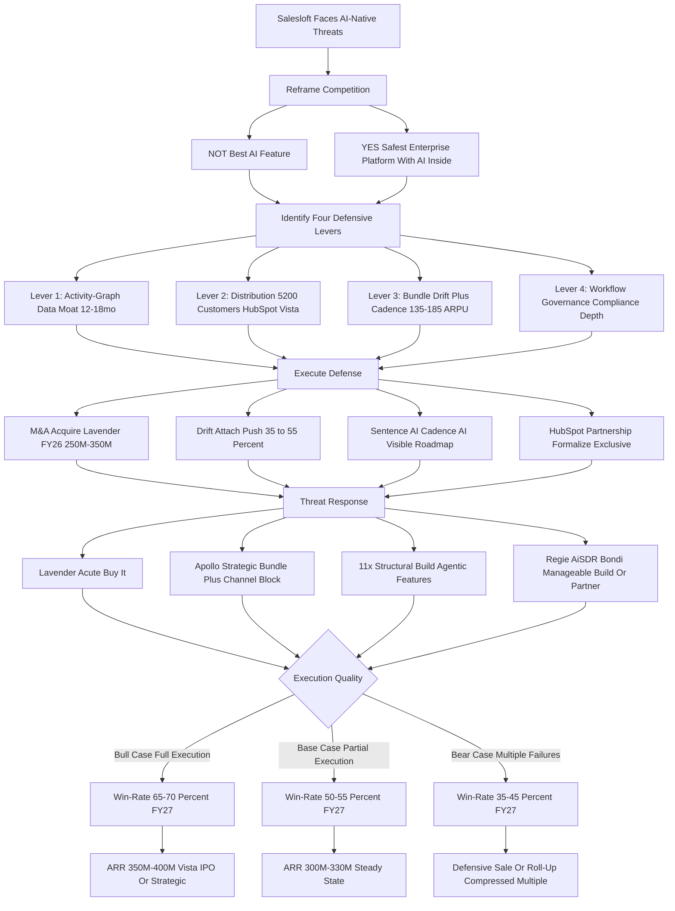
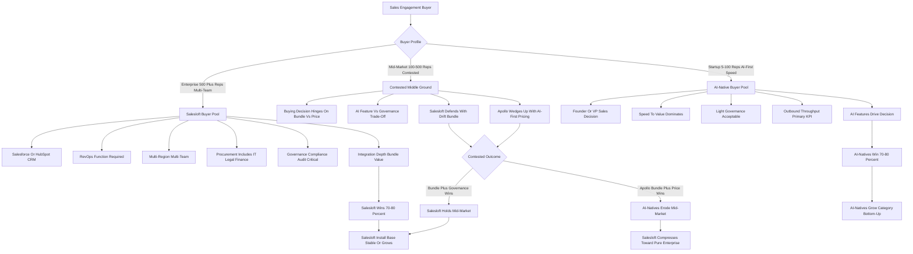

**TL;DR:** Salesloft, the legacy sales engagement platform owned by Vista Equity Partners since 2024, competes against AI-native sequencing tools -- Lavender, Apollo's AI tier, 11x.ai, Regie.ai, AiSDR, Bondi, and a handful of agentic SDR startups -- through **four structural defensive levers** stacked on top of an installed-base business that the AI-natives cannot replicate quickly: **(1) the activity-graph data moat** -- twelve to eighteen months of per-customer engagement, response, and reply-rate history that turns Salesloft's models into customer-specific systems while AI-native tools start from generic LLM defaults; **(2) the distribution moat** -- approximately 5,200 active customers, an average tenure near 3.2 years, an exclusive-leaning HubSpot partnership covering the upmarket motion, and Vista's $400M-$800M M&A budget that lets Salesloft buy categories AI-natives are still building; **(3) the product-bundle moat** -- the Drift conversation product plus the Cadence sequencing engine sold together at roughly $135-$185 combined ARPU, a bundle no AI-native ships, with attach-rate retention 7-10 points higher than Cadence-only; and **(4) the workflow-and-governance moat** -- enterprise admin, role-based permissions, Salesforce and HubSpot bidirectional sync, audit trails, regional data residency, and compliance posture that single-product AI startups simply have not built. The honest competitive picture for 2027: Salesloft does not win on raw AI feature parity -- Lavender writes better individual emails, 11x ships more aggressive autonomous-agent demos, Apollo bundles lead data and sequencing more cheaply -- and trying to win that fight head-on is a losing game. Salesloft wins by **reframing the buying decision** from "best AI feature" to **"safest enterprise platform with AI inside,"** which is exactly the frame mid-market and enterprise revenue leaders prefer when they are buying a system that touches the pipeline. The four scenarios that decide whether the strategy works: **bull case** -- Salesloft acquires Lavender or a peer in FY26, Drift attach climbs above 50%, the Sentence AI and Cadence AI roadmap ships visibly, and the HubSpot partnership formalizes -- net win-rate 65-70% in head-to-head deals through FY27; **base case** -- partial AI catch-up, slower bundle attach, modest M&A, win-rate roughly 50-55%; **bear case** -- a competitor (Outreach, Apollo, HubSpot itself with Breeze AI) wins the M&A race, Apollo's bottom-up wedge succeeds in sub-100-rep segments, and 11x or a peer makes agentic SDR a category Salesloft does not credibly play in -- win-rate collapses to 35-45% and Vista is forced into a defensive sale or roll-up. Net for an operator evaluating the category: Salesloft is the **safest enterprise sequencing platform in 2027** for organizations that need governance, integration depth, and a vendor that will be there in three years; AI-natives are the right pick for fast-growing teams optimizing pure outbound throughput. The competitive question is not "does Salesloft have the best AI" -- it is "does Salesloft survive the AI transition with its install base intact," and the answer through 2027 is **yes, contingent on M&A execution, bundle discipline, and visible AI roadmap delivery.**

## What Is Actually Being Asked: Reframing The Salesloft Versus AI-Native Question

The competitive question "how does Salesloft compete against AI-native sequencing tools?" is the wrong question to ask in its surface form, and an operator -- whether at Salesloft, at an AI-native competitor, at a customer evaluating both, or at an investor -- needs to reframe it before answering. The naive frame is "Salesloft is a legacy sales engagement platform, AI-natives like Lavender and Apollo and 11x are faster and cheaper at the AI parts, therefore Salesloft loses." That frame is wrong because it treats sales engagement as a feature category rather than as the **enterprise system of record for outbound activity**, which is what Salesloft actually is for roughly 5,200 paying organizations. The correct frame: Salesloft is not competing on AI feature parity, because it cannot win that fight and trying to fight it that way is the documented path to losing the install base while spending the R&D budget chasing demos that get leapfrogged in two quarters. Salesloft is competing on **whether the buying committee at a 200-rep mid-market revenue org or a 2,000-rep enterprise sales team picks the safest, most integrated, most governable platform with AI inside, or picks the fastest, cheapest, AI-first point tool.** Those are different buyers, different deals, different procurement processes, and different success criteria. The AI-natives have done extraordinary work convincing the market that the question is "best AI" -- and for the bottom-up motion in startups under 100 reps, that frame is correct and Salesloft is structurally disadvantaged. For the upmarket motion -- which is where the dollars and the install base actually sit -- the frame is "platform versus point solution," and Salesloft has advantages the AI-natives have not yet built and cannot quickly replicate. The entire competitive strategy hangs on Salesloft's ability to keep enterprise revenue leaders evaluating the question as "platform with AI" rather than as "best AI feature," while simultaneously closing the AI feature gap fast enough -- through some combination of build, buy, and partner -- that the platform frame remains credible. Get this reframing right and the rest of the analysis follows; get it wrong and you are scoring Salesloft on a scoreboard the AI-natives wrote.

## The Four Defensive Levers In Detail: Data, Distribution, Bundle, And Governance

Salesloft has four structural assets that AI-native sequencing competitors cannot match in 2027, and each is a distinct competitive lever that requires distinct execution. **Lever one is the activity-graph data moat.** Every Salesloft customer has accumulated, on average, twelve to eighteen months of granular activity data -- which sequences fired, which steps were sent, which buyers opened and replied, which patterns correlated with closed-won pipeline, which reps over- or under-perform with which cadences. That corpus is the training fuel for Salesloft's Sentence AI and Cadence AI features, and it allows those models to be customer-specific in a way that an AI-native tool cannot be on day one. A new Lavender or Apollo AI deployment starts from generic LLM defaults and learns the customer's own patterns over six to twelve months; Salesloft starts from the customer's own data already accumulated. The lever is real but not permanent -- AI-natives close the gap as their own customer bases mature, and synthetic data plus foundation-model fine-tuning can compress the data-moat advantage from years to quarters -- but the lever is genuinely Salesloft's to lose. **Lever two is the distribution moat.** Salesloft serves approximately 5,200 paying customers across mid-market and enterprise (the rough mix is 70% enterprise and 30% mid-market by revenue), with an average tenure of about 3.2 years, deep Salesforce and HubSpot integrations, an enterprise sales motion through partner channels, and Vista's capital backing both organic growth and an active M&A pipeline. An AI-native competitor would need 18-36 months of bottom-up land-and-expand plus enterprise selling to approach that install base, and the install base itself is sticky because switching costs (90-180 days to migrate sequences, retrain reps, rewire integrations) are real. **Lever three is the product-bundle moat.** Salesloft sells Drift (the conversation marketing and AI chatbot product, acquired and integrated) plus Cadence (the sequencing engine), priced together at roughly $135-$185 combined ARPU at a 15-25% bundle discount versus standalone. No AI-native sequencing tool ships an integrated conversation-plus-sequencing combo, and customers who adopt both products retain at 92-95% gross versus 85-88% for Cadence-only customers -- a 7-10 point retention spread that compounds enormously across the install base. **Lever four is the workflow and governance moat.** Enterprise sales engagement is not just AI features -- it is admin and role permissions, audit trails, regional data residency, SOC 2 and ISO 27001 compliance posture, deep bidirectional CRM sync, custom field mapping, sequence governance and approval workflows, multi-team and multi-region structure, and the integration tax with Marketing, Operations, RevOps, and Finance. Salesloft has built and hardened all of this over a decade; single-product AI-native startups have not, and building it well is years of investment that does not show up in a demo. The four levers compound -- distribution funds R&D, R&D feeds the data moat, the bundle deepens distribution, governance protects the install base. The strategic question is not whether the levers exist but whether Salesloft executes hard enough on AI catch-up that the levers stay relevant, because a platform that loses on AI for two years can still lose the install base to a credible AI-native that crosses the upmarket threshold.

## The AI-Native Threat Map: Who Each Competitor Actually Is And What They Are Doing

A founder, sales leader, or operator evaluating the category needs an accurate read of each AI-native competitor, because they are not interchangeable and the threats they pose to Salesloft are very different in shape and severity. **Lavender** is the highest-velocity threat -- an AI email-coaching and writing assistant with roughly 5,000+ customer accounts, estimated $25M-$50M in annual recurring revenue, a strong product-led growth motion, and a feature focus on real-time email scoring, personalization assist, and reply-rate lift. Lavender is the AI feature Salesloft most needs and most clearly does not yet match natively; it is the clearest M&A target in the category and is widely understood to be in conversation with multiple acquirers. **Apollo** is the most strategic threat -- not because its AI is better than Salesloft's but because Apollo bundles lead data, intent signals, and sequencing into a single $59-$119/user/month offering aimed at the bottom-up self-serve mid-market. Apollo's revenue is estimated $150M-$250M ARR with a strong free-tier funnel and rapid mid-market land. Apollo's threat to Salesloft is structural -- a category-redefining bundle that AI-natives can sell for less because they do not carry the legacy enterprise overhead. **11x.ai** is the agentic threat -- autonomous SDR agents (Alice for inbound, Mike for outbound, more in the pipeline) that promise to replace human SDR work entirely. 11x is at $5M-$15M ARR but with extraordinary attention and a vision (autonomous agentic GTM) that, if it actually delivers, eliminates the human-AE-driven sequencing category Salesloft is built for. The threat is not 11x's current revenue but the category-redefining bet underneath it. **Regie.ai** focuses on AI-generated content for sales sequences -- $15M-$30M ARR, complement-not-replacement, integrates with Salesloft and Outreach as much as it competes, and is more of a feature than a platform. **AiSDR** plays a similar agent-first autonomous outbound game in a narrower segment, $10M-$25M ARR. **Bondi** combines GTM data and AI sequencing in an early-stage $5M-$15M ARR play targeting a specific niche. **Other named entrants** -- Clay (data orchestration with sequencing adjacency), Reggie, Jason AI, Smartlead -- play in adjacent corners of the category. The accurate threat ranking from Salesloft's perspective: Lavender (acute, addressable by acquisition); Apollo (strategic, addressable by bundle and channel exclusivity); 11x (structural, addressable by Salesloft's own agentic roadmap); Regie and AiSDR and Bondi (manageable, addressable by build-or-partner); and the long tail (noise, addressable by ignoring). The competitive reality: Salesloft does not need to beat every AI-native on every feature -- it needs to neutralize Lavender, blunt Apollo's bottom-up motion at the upmarket boundary, build credible agentic features fast enough that 11x does not own the conversation, and ignore the rest while the bundle and the install base do their work.

## Lever One Deep Dive: The Activity-Graph Data Moat And Why It Matters

The activity-graph moat is Salesloft's most-discussed defense, and it is also the most over-claimed and most misunderstood, so it deserves precise framing. **What it actually is:** every Salesloft customer accumulates, in the platform, structured longitudinal data on every sequence sent, every step (email, call, LinkedIn touch, manual task), every buyer engagement (open, click, reply, sentiment), every conversion (meeting booked, opportunity created, deal closed-won or closed-lost), and the linkage between all of it. After twelve to eighteen months, that customer has a per-rep, per-segment, per-cadence corpus of what works in their specific market with their specific buyers. **Why it is a moat:** Salesloft's AI features (Sentence AI for content suggestions, Cadence AI for next-best-action and sequence optimization) train on this customer-specific corpus, allowing recommendations grounded in what has actually worked for that customer -- which is structurally different from an AI-native tool starting with generic LLM defaults and learning the customer's patterns from zero. **Why it is not a permanent moat:** AI-natives accumulate the same data on their own customers as their install bases mature, foundation-model improvements compress the data advantage by making smaller corpuses more useful, and synthetic data plus transfer learning from cohorts of similar customers (which an AI-native with a thousand mid-market customers can absolutely do) close the gap from years to quarters. **What Salesloft must do to defend the lever:** ship customer-specific AI features that visibly use the longitudinal data (not just generic LLM features rebranded as Salesloft AI), make the data advantage legible to buyers (the demo and the renewal conversation should show "your AI is trained on your data"), and continue to widen the data moat by capturing richer engagement signals (conversation transcripts via Drift, multi-touch attribution, downstream opportunity outcomes from CRM sync). **What kills the lever:** if the AI-native competitor's foundation models become good enough that customer-specific tuning matters less than raw model quality, or if a major AI provider (OpenAI, Anthropic, Google) releases sales-engagement models that AI-natives can fine-tune cheaply, the data advantage compresses below the threshold of buyer relevance. The honest read: the data moat buys Salesloft 18-36 months of differentiation, not a decade, and the company's job is to use those months to build the other moats -- bundle, governance, and acquired AI capability -- that outlast the data advantage.

## Lever Two Deep Dive: The Distribution Moat And The Vista Capital Question

The distribution moat is Salesloft's most durable competitive asset and the one most undervalued by AI-native enthusiasts who treat sales engagement as a feature contest rather than a deeply integrated enterprise system. **What it actually is:** approximately 5,200 paying customers, weighted to mid-market and enterprise, with an average tenure of about 3.2 years, integrated into the Salesforce and HubSpot CRMs that those customers already run their pipelines on, with reps already trained on Salesloft workflow and admins already configured for Salesloft governance. **Why it matters:** this is not a list of email addresses -- it is 5,200 organizations where Salesloft is the system of record for outbound activity, where switching out involves a 90-180 day migration, sequence rebuild, rep retraining, integration rewiring, and the political cost of an internal change-management exercise. The economic value of that install base, at a roughly $48K average customer ACV, is approximately $250M in annual recurring revenue with high gross retention, and the strategic value is the platform position from which Salesloft sells additional products (Drift, AI features, future categories) at far lower CAC than an AI-native paying for cold acquisition. **The HubSpot partnership** is the underappreciated multiplier here -- HubSpot's CRM upmarket motion needs a sales engagement layer, Salesloft is the strategic partner of choice, and a tighter or formal-exclusive partnership locks Apollo and other AI-natives out of the HubSpot upmarket flow that is one of the largest distribution channels in the category. **The Vista capital question** is structural: Vista Equity Partners owns Salesloft and runs it on the playbook of disciplined operating margins, M&A-funded category expansion, and platform consolidation. Vista has a documented $400M-$800M-range war chest available for category consolidation, which means Salesloft can buy what AI-natives are building -- a Lavender acquisition is the obvious move, but additional AI-tooling, agentic, or adjacent-category acquisitions are entirely on the table. The Vista risk is the inverse: Vista is also a financial owner with an exit window, and if the AI-native competitive picture deteriorates faster than expected, Vista could push Salesloft into a defensive sale or roll-up rather than a long-horizon platform build. The distribution moat is the strongest single defense Salesloft has, and the most likely path to a durable competitive position through 2027 -- but it is a moat that must be actively defended through partnership formalization, M&A execution, and visible AI roadmap delivery, not assumed as a permanent gift.

## Lever Three Deep Dive: The Drift Plus Cadence Bundle Moat

The product-bundle moat is the strategic move Salesloft has executed best in the AI transition, and it is the lever with the clearest leverage on competitive win-rate over the next 24 months. **What it actually is:** Salesloft owns Drift, the conversation marketing and AI chatbot product acquired and integrated into the Salesloft platform, and sells it together with Cadence, the core sequencing engine. Drift standalone runs roughly $55-$95 ARPU; Cadence standalone runs roughly $85-$135 ARPU; the bundle prices at approximately $135-$185 combined ARPU, representing a 15-25% bundle discount. **Why it is a competitive moat:** no AI-native sequencing tool ships an integrated conversation-plus-sequencing combo. Lavender is email-only. Apollo bundles data and sequencing but not conversation. 11x is agentic-outbound focused. Regie is content. The Drift-plus-Cadence bundle covers both inbound conversation capture and outbound sequence execution in a single integrated platform with one admin, one analytics layer, one set of integrations, and one renewal conversation -- a buying experience the AI-native point tools structurally cannot replicate without acquiring or partnering, and a customer experience that is materially better when both motions feed each other. **The retention math is the proof:** customers using both products retain at 92-95% gross retention versus 85-88% for Cadence-only customers -- a 7-10 point retention spread that, multiplied across the install base, represents enormous lifetime value protection. The bundle is sticky because it is integrated, it is integrated because Salesloft owns both products, and it is owned because Vista funded the Drift acquisition. **The competitive deployment:** Salesloft pushes Drift attach on every Cadence renewal and every new logo, with bundle pricing structured to make the standalone-plus-AI-native alternative more expensive than the bundle when fully loaded. The bundle is also the defense against a HubSpot Breeze AI threat -- if HubSpot ships native conversation and sequencing inside HubSpot CRM, the Salesloft bundle still differentiates on enterprise depth, integration breadth, and AI sophistication. **The execution challenge:** Drift attach must climb -- a current attach rate around 35-40% needs to reach 50%+ by FY27 for the bundle moat to hit its full strategic potential. **The risk to the lever:** if AI-native competitors acquire or build conversation capabilities (Apollo + an acquired chatbot, an AI-native conversation startup paired with a sequencing partner), the bundle differentiation compresses. Net: the bundle is Salesloft's best-executed defense, the most under-appreciated asset in the public competitive narrative, and the lever with the clearest near-term margin and retention impact.

## Lever Four Deep Dive: Workflow Depth And Enterprise Governance

The workflow-and-governance moat is the defense AI-native enthusiasts most consistently dismiss and enterprise buyers most consistently care about, and the gap between those two perceptions is exactly the asymmetry Salesloft exploits in upmarket deals. **What it actually is:** Salesloft has built, over more than a decade, the deep enterprise plumbing that every serious customer requires but that no demo ever features -- multi-tenant admin and role-based access controls, sequence governance and approval workflows for regulated industries, audit trails for compliance and legal review, regional data residency for GDPR and other privacy regimes, SOC 2 Type II and ISO 27001 certifications, bidirectional Salesforce and HubSpot CRM sync with custom field mapping, integration with marketing automation (Marketo, HubSpot Marketing, Pardot), conversation intelligence (Gong, Chorus), and dialer infrastructure, multi-team and multi-region organizational structure, sequence sharing and templating across business units, sandbox environments for testing, granular reporting and dashboarding, single sign-on and identity provider integration, API depth for custom builds, and the compliance posture and security review documentation that an enterprise procurement process actually requires. **Why it matters:** an AI-native startup running on a small team and a recent series A simply has not built any of this with enterprise-grade depth. They have a great AI feature and a thin layer of admin; they pass demo and lose procurement. **What enterprise buyers actually buy on:** in a $200K+ ACV enterprise sequencing decision, the buying committee includes Sales (cares about features and AI), RevOps (cares about workflow, integration, governance), IT (cares about security, SSO, compliance), Legal (cares about contracts, data residency, audit), and Finance (cares about predictability, vendor maturity, total cost). Salesloft passes all five gates; an AI-native point tool typically passes one and stalls in the others. **The moat in action:** Salesloft loses head-to-head AI-feature shoot-outs to Lavender and AI-feature-heavy competitors regularly, and still wins the deal because the procurement and security review eliminates the AI-native from consideration. **What makes the moat durable:** building enterprise governance is years of unsexy investment -- compliance certifications, security infrastructure, integration engineering, customer success operations, contractual and legal sophistication -- and it is the work AI-native startups optimizing for product velocity deliberately deprioritize, which means the gap is widening, not narrowing, in the categories that matter to enterprise buyers. **The risk:** if a well-capitalized AI-native (Apollo at scale, an OpenAI- or Microsoft-backed entrant) decides to build the enterprise governance stack and combine it with AI-native features, the moat compresses -- but that is a multi-year multi-hundred-million-dollar build, and Salesloft has the runway to acquire and consolidate before that happens. The governance moat is the quiet defense that, combined with the bundle and the install base, gives Salesloft its real upmarket competitive edge.

## The Buyer Reality: Who Buys Salesloft, Who Buys AI-Natives, And Why

Operator clarity requires understanding that Salesloft and the AI-natives are not really competing for the same buyer in most deals -- they are competing for adjacent buyers with overlapping but distinct needs, and the competitive question is which buyer pool grows fastest and how the boundary moves. **The Salesloft buyer profile:** mid-market and enterprise revenue organizations with 100+ reps (and frequently 500+ to 5,000+ reps), Salesforce or HubSpot as the CRM system of record, a structured RevOps function, a multi-team or multi-region selling organization, formal sales engagement governance (sequence approval, branding, compliance), an integrated GTM stack (CRM, conversation intelligence, dialer, marketing automation), and a procurement process that includes Sales, RevOps, IT, Legal, and Finance reviews. The buyer's success criteria: predictable rep activity, governance and audit, integration depth, vendor maturity, and AI features as one part of a broader platform decision. **The AI-native buyer profile:** seed-to-Series-B startups with 5-100 reps, a founder-led or VP Sales-led GTM, often HubSpot or a lighter-weight CRM as the system of record, less formal RevOps, faster procurement (often a single decision-maker), willingness to trade governance for speed, and a primary success criterion of outbound throughput and reply-rate lift. The buyer's success criteria: ship fast, AI does the heavy lifting, low total cost, no procurement overhead. **The boundary between them is contested ground.** A 100-150 rep mid-market organization could go either way -- the Salesloft buyer profile or the AI-native buyer profile, depending on the buying committee, the GTM maturity, and the priority weighting of AI features versus governance. The Apollo bottom-up wedge is exactly the move to grow the AI-native buyer pool upward into the contested ground; the Salesloft Drift bundle and HubSpot exclusivity are the defensive moves to keep the contested ground in the platform-buyer category. **The category dynamic:** if AI-natives credibly cross the contested-ground threshold and serve real mid-market customers with real governance and real integrations, the Salesloft buyer pool shrinks toward pure enterprise and the platform's growth slows. If Salesloft holds the contested ground (through bundle, M&A, and visible AI delivery), the AI-natives stay confined to the bottom-up startup and growth-stage segment, which is a real but smaller market. **The 2027 read:** the contested ground is moving slowly toward AI-natives in pure outbound throughput buyers and slowly toward Salesloft in governance-conscious revenue orgs, and the net is roughly stable through 2026-2027 with Salesloft retaining the upmarket and the AI-natives growing the bottom-up. Anyone modeling competitive outcomes needs to model these as two distinct buyer pools with overlapping contested ground, not as a single market where one platform wins.

## Pricing And Packaging: Salesloft's $135-$185 Bundle Versus AI-Native Sub-$120 Pricing

Pricing is where the competitive battle becomes most concrete, and an operator needs to see the actual numbers to model the deal-by-deal economics. **Salesloft's pricing structure:** Cadence (sequencing) standalone runs roughly $85-$135 per user per month at typical mid-market and enterprise volume; Drift (conversation) standalone runs roughly $55-$95 per user per month or via meeting/conversation-based pricing for marketing-led deployments; the Drift-plus-Cadence bundle prices at $135-$185 combined ARPU, reflecting a 15-25% bundle discount versus standalone purchase of both. Enterprise deals layer in admin tiers, premium AI features, advanced governance, and CSM-led services, often pushing effective ARPU above $200 per user per month for fully-loaded enterprise tiers. **Apollo's pricing:** roughly $59-$119 per user per month for the AI-tier sequencing and lead-data bundle, with a meaningful free-tier funnel and aggressive self-serve mid-market pricing -- structurally cheaper than Salesloft and explicitly positioned as the lower-cost AI-native alternative. **Lavender's pricing:** $29-$99 per user per month for email coaching and writing assist -- a feature add-on rather than a full sequencing platform, often deployed alongside Salesloft or Outreach rather than instead of. **11x.ai's pricing:** roughly $200-$500 per "agent" per month (Alice or Mike), priced per autonomous SDR agent rather than per human user -- a fundamentally different pricing model that does not directly compare on a per-seat basis but represents potentially much higher per-agent revenue if the agent does the work of multiple SDRs. **Regie.ai's pricing:** roughly $89-$199 per user per month for AI content generation, often deployed as a complement to a sequencing platform. **The pricing dynamics:** Apollo's $59-$119 versus Salesloft's $135-$185 is the headline comparison every AI-native demo emphasizes -- and it is real -- but it omits the bundle value, the integration depth, the governance, and the install-base economics. A mid-market customer comparing Apollo at $90 versus Salesloft Cadence-only at $110 sees a clear price gap; the same customer comparing Apollo at $90 to Salesloft's full bundle at $160 sees a different value comparison once the conversation product, integrated analytics, and unified admin are weighed in. **Salesloft's pricing strategy in 2027:** hold premium pricing on the platform tier to protect margin and signal enterprise positioning, drive bundle attach to lift effective ARPU and retention, offer a more aggressive AI-features-included tier at the mid-market boundary to blunt Apollo's wedge, and use Vista's M&A capacity to acquire AI capabilities rather than build them and amortize the cost over the install base. **The risk:** if AI-natives at scale deliver enterprise-credible feature parity at sub-$100 pricing, Salesloft is forced into a margin-compressing pricing response, and the platform-pricing premium that funds Vista's returns and the R&D budget compresses. The 2027 read: pricing pressure is real but contained through FY27, with the bundle, governance, and integration depth justifying the premium for the platform buyer; beyond 2027 the pricing model may need to evolve toward usage-based or AI-feature-tiered structures rather than per-seat platform pricing.

## The M&A Game: Vista's $400M-$800M War Chest And The Lavender Acquisition Question

Salesloft's competitive position through 2027 may be more determined by M&A than by product, because the M&A path lets Salesloft buy AI capabilities faster than it can build them, and Vista's capital makes that path uniquely viable. **What Vista brings to the table:** a documented willingness to deploy growth capital into category consolidation, an active investment thesis around platform companies acquiring point solutions, and the operating expertise and balance-sheet flexibility to execute deals in the $50M-$500M range without blinking. The realistic Vista war chest for Salesloft category M&A is in the $400M-$800M range over the 2025-2027 window, depending on opportunity flow and Vista's broader portfolio dynamics. **The Lavender acquisition question** is the most strategically important M&A move available -- Lavender is the highest-velocity AI feature gap, has 5,000+ customers (a meaningful install-base addition), is at a stage where acquisition pricing in the $200M-$400M range is plausible, and is widely understood to be in conversation with Salesloft, Outreach, and others. The strategic logic: acquiring Lavender immediately closes the AI email-writing gap, removes the most visible AI-native competitor from the field, brings 5,000+ customers into the Salesloft funnel, and signals to the market that Salesloft is the active consolidator rather than the legacy incumbent being disrupted. **Other M&A candidates:** an AI sales conversation startup to deepen Drift's AI capabilities; a specialized vertical sequencing tool to extend into a regulated industry (healthcare, financial services) where Salesloft is underweight; an agentic SDR startup (a small one, not 11x at its current valuation) to credibly enter the agentic category before 11x defines it without Salesloft; a pipeline-orchestration or RevOps adjacency to expand the platform footprint. **The execution risk:** Vista has a return-on-capital discipline that constrains how much Salesloft can pay for growth, and a competitor with deeper pockets (Salesforce, Microsoft, an AI-native that lands a mega-round) could outbid on a strategic target. **The bear-case M&A scenario:** Outreach (Salesloft's closest legacy competitor) acquires Lavender first, leaving Salesloft with a permanent AI gap and a competitor that has both the install base and the AI capability. **The bull-case M&A scenario:** Salesloft acquires Lavender in FY26, integrates within two quarters, follows with one or two additional acquisitions in adjacent AI categories, and emerges by 2027 as the consolidator that absorbed the most threatening AI-natives and converted them into platform features. **The M&A discipline:** Vista will not let Salesloft overpay, and Salesloft cannot afford to be priced out -- the right move is decisive Lavender acquisition early, additional surgical adds in agentic and conversation-AI, and ruthless avoidance of the bidding wars that destroy capital efficiency. M&A is the lever that most clearly determines whether the 2027 competitive position is the bull case or the bear case.

## The HubSpot Partnership And The Channel-Exclusivity Lever

The Salesloft-HubSpot relationship is the under-discussed multiplier on the distribution moat, and an operator should understand what it does and does not currently include and what the strategic upside looks like. **What the relationship currently is:** Salesloft is a strategic partner to HubSpot for sales engagement, with deep bidirectional integration into HubSpot CRM, joint go-to-market motions including co-marketing and co-selling, and the de-facto recommended sequencing platform for HubSpot CRM upmarket customers. HubSpot's own native sequencing capabilities are real but lighter-weight, more focused on the SMB and lower mid-market segments, and HubSpot has historically partnered for the deeper enterprise sequencing layer rather than building it natively. **Why this matters for the AI-native competition:** HubSpot's CRM upmarket motion is one of the largest single distribution channels in the entire revenue-software category. Customers crossing the upmarket threshold from HubSpot's lower-tier products into the enterprise tier need a sales engagement layer, and Salesloft is the path of least resistance. Apollo, which is building a competing CRM-plus-sequencing bundle, is structurally locked out of the HubSpot upmarket flow as long as the partnership holds. **The strategic upside:** a more formal or exclusive partnership -- "preferred sales engagement partner for HubSpot enterprise customers," joint-product features, deeper CRM integration, joint roadmap commitments -- substantially raises the cost for any AI-native to win HubSpot upmarket deals and effectively eliminates a major Apollo growth vector. **The strategic risk:** HubSpot's Breeze AI and broader native AI investment could include native sequencing AI features that compete directly with Salesloft, weakening the partnership rationale and pushing HubSpot toward building rather than partnering. If HubSpot decides the sequencing layer is too strategic to leave to a partner, the relationship erodes and Salesloft loses one of its strongest channel positions. **The HubSpot-Salesloft balance:** both companies benefit from the partnership today -- HubSpot avoids building enterprise sequencing depth, Salesloft accesses HubSpot's distribution -- and both have incentive to deepen rather than disrupt. The watch-item for an operator is HubSpot's Breeze AI roadmap and its public statements about native sales engagement; any signal that HubSpot is building rather than partnering is a major shift in the competitive terrain. **The 2027 read:** the HubSpot partnership is likely to deepen rather than erode through FY27, providing Salesloft with a structural channel advantage that AI-natives cannot replicate without building their own CRM (which Apollo is partly attempting and will not credibly achieve at scale).

## Bull, Base, And Bear Cases: Three Scenarios Through 2027

Strategic analysis becomes useful when it commits to scenarios with explicit assumptions and explicit predicted outcomes, so an operator should hold three concrete scenarios for Salesloft through 2027. **The bull case -- Salesloft executes the full playbook.** Salesloft acquires Lavender in FY26 at a $250M-$350M price, integrates within two quarters, and absorbs Lavender's 5,000+ customers into the Salesloft funnel. Drift attach climbs from a current 35-40% to 55%+ by FY27, lifting effective ARPU and retention measurably across the install base. The Sentence AI and Cadence AI roadmap ships visibly with two or three flagship features per quarter, closing the AI feature-parity gap in buyer perception. The HubSpot partnership formalizes into "preferred enterprise sales engagement partner" with joint-product features and roadmap commitments. One or two additional surgical acquisitions in agentic SDR or AI conversation extend the platform. Net result: Salesloft win-rate in head-to-head competitive deals against AI-natives reaches 65-70% by FY27, ARR grows from approximately $250M to $350M-$400M, gross retention stays at or above 92%, and Vista positions for either an IPO or a strategic exit at a 6-8x revenue multiple. **The base case -- partial execution.** Salesloft acquires a smaller AI tooling startup (not Lavender, which goes to Outreach or stays independent), Drift attach climbs to 45-50%, AI roadmap ships at moderate cadence, the HubSpot partnership deepens informally without formal exclusivity, and competitive win-rate against AI-natives lands at 50-55%. ARR grows modestly to $300M-$330M, gross retention holds around 88-90%, and Vista runs a longer runway before exit. **The bear case -- multiple things go wrong.** Outreach or another competitor wins the Lavender acquisition, leaving Salesloft with a visible AI gap. Apollo's bottom-up wedge succeeds in the contested mid-market ground, eroding new-logo growth in the segment Salesloft most needs to defend. 11x or a peer establishes agentic SDR as a category Salesloft cannot credibly enter without an expensive late-stage acquisition. HubSpot ships native Breeze AI sequencing capabilities and weakens the partnership. The AI roadmap ships slowly and underwhelms. Drift attach stalls at 35-40%. Net result: win-rate against AI-natives drops to 35-45%, ARR stagnates or declines slightly, gross retention drifts toward 85%, and Vista is forced into a defensive sale or merger (potentially with Outreach, potentially with a larger platform acquirer like Microsoft or HubSpot itself) at a compressed multiple. **The probability weighting from a sober operator's perspective:** bull case roughly 25-30%, base case roughly 45-50%, bear case roughly 20-25%. The base case is the most likely path, the bull case is achievable with disciplined execution, and the bear case is a real risk that depends primarily on M&A losses and on AI-native execution velocity rather than on Salesloft strategy errors alone.

## The Agentic SDR Question: Does 11x Redefine The Category?

The single most existential question for Salesloft and for every sequencing platform is whether autonomous agentic SDRs -- 11x.ai's Alice and Mike, AiSDR, Jason AI, and the next generation of foundation-model-powered autonomous outbound agents -- collapse the human-AE-driven sequencing category into something fundamentally smaller and more commodified. **The agentic thesis:** rather than a human SDR or AE running sequences in Salesloft or Apollo, an autonomous agent prospects, personalizes, sends, follows up, qualifies, and books meetings entirely without human touch -- replacing not the sequencing tool but the human who used the tool. If the thesis fully delivers, the addressable market for human-AE sequencing platforms shrinks because customers replace human SDRs with agents and no longer need a sequencing platform layered on top. **The current evidence:** 11x.ai has demonstrated impressive agentic demos and has accumulated meaningful (though small) ARR. Real customer adoption at scale has been slower than the public narrative suggests, with mixed results on quality, deliverability, and actual pipeline conversion versus human-AE-driven sequences. Foundation-model improvements (GPT-5 / Claude Opus 4.7 / Gemini 3) make the underlying agent capabilities better quarterly, suggesting the trajectory is real even if the current state is over-marketed. **The honest assessment:** agentic SDR is real, growing, and will materially reshape the category by 2028-2030, but it is not yet at a state where it eliminates human-AE sequencing in 2026-2027. The most likely intermediate state is a hybrid -- agentic agents for high-volume top-of-funnel prospecting, human AEs for qualification and complex deals, with sequencing platforms supporting both motions. **What Salesloft must do:** ship credible agentic features within the platform (whether built or acquired), so customers exploring agentic do not have to leave Salesloft to do it; participate in defining the hybrid agentic-plus-human model rather than letting AI-natives define it; and watch foundation-model and 11x adoption velocity closely as the leading indicator of when the category-redefinition becomes real. **The strategic risk:** if Salesloft ignores agentic and 11x or a peer builds an enterprise-credible agentic platform with governance and integration depth, by 2028-2029 Salesloft is competing in a shrinking human-AE sequencing market while the new category grows around it. **The strategic opportunity:** Salesloft acquires or partners aggressively in agentic, integrates it into the Cadence platform, and positions the bundle as "the enterprise platform for both human and agent outbound" -- which would extend the moat into the next category transition. The agentic question is the most important medium-term competitive variable, and operator clarity requires modeling it explicitly rather than dismissing it as hype.

## Win/Loss Patterns: Where Salesloft Wins, Where It Loses

Operator-level competitive analysis requires real understanding of where Salesloft wins specific deals versus AI-natives and where it loses, because those patterns determine where to invest defense and where to concede ground. **Where Salesloft consistently wins:** enterprise deals at 500+ reps where governance, compliance, and integration depth matter; deals where Salesforce is the CRM and Salesloft's deep Salesforce integration creates structural advantage; deals where the buying committee includes IT, Legal, and Finance and the AI-native point tool fails procurement; renewal deals where switching cost dominates; deals where the customer needs both inbound conversation and outbound sequencing and the Drift-plus-Cadence bundle eliminates the AI-native point tool; multi-region or multi-team enterprise deals where Salesloft's organizational structure depth matters; deals in regulated industries where audit trails, data residency, and compliance posture eliminate AI-natives. **Where Salesloft consistently loses:** sub-100-rep startups where speed and cost dominate and procurement is one decision-maker; HubSpot-CRM deals at the lower mid-market boundary where Apollo's all-in-one bundle is cheaper and good-enough; pure outbound velocity buyers who care primarily about reply-rate lift and where Lavender's email AI demonstrably outperforms; AI-first cultures where the buyer wants the most aggressive AI tooling and is willing to trade governance; greenfield deals where there is no existing Salesforce or HubSpot integration and the AI-native's lighter integration profile is acceptable. **The pattern that matters:** Salesloft loses on AI feature parity in the demo, loses on price in the comparison, and wins on enterprise depth in the procurement and the boardroom. AI-natives win on AI feature parity in the demo, win on price, and lose on enterprise depth. **The competitive guidance for Salesloft sales:** lead every enterprise conversation with platform, integration, governance, and bundle value; lead AI feature comparisons with the customer's own data ("your AI is trained on your data") rather than feature parity ("our AI is as good as theirs"); use the Drift bundle as the differentiator that AI-natives cannot match; and concede the sub-100-rep AI-first segment to Apollo and Lavender rather than chasing deals Salesloft cannot win profitably. **The strategic implication:** the win/loss pattern is consistent with the segmentation thesis -- Salesloft is the upmarket platform play, AI-natives are the bottom-up feature play, and the contested middle is where execution matters most. Sales teams that try to win every deal lose money; sales teams that win the right deals decisively grow profitably.

## The CRM-Adjacent Threat: HubSpot Breeze AI, Salesforce Einstein, And The "AI In The CRM" Question

A separate and potentially larger threat to Salesloft than the AI-native sequencing tools is the possibility that the major CRM vendors -- HubSpot with Breeze AI, Salesforce with Einstein and Agentforce, Microsoft with Dynamics 365 Copilot -- bundle native AI sequencing capabilities into their CRM platforms and erode the standalone sequencing category entirely. **Why this matters:** CRM vendors own the system of record, the customer relationship, and the deepest data. If they ship credible native sequencing with AI built in, customers face a "good-enough integrated" versus "best-of-breed standalone" choice that has historically favored the integrated option in late-stage category consolidation. **HubSpot Breeze AI** is the closest active threat -- HubSpot has a clear strategic interest in extending native capability up the stack, Breeze AI is the productized investment vehicle, and HubSpot's mid-market and lower-enterprise base is precisely the segment Salesloft most needs to defend. **Salesforce Einstein and Agentforce** is the larger but slower-moving threat -- Salesforce has historically partnered for sales engagement (Salesloft, Outreach, Apollo all integrate with Salesforce), but Einstein and Agentforce represent a strategic shift toward owning more of the AI-driven workflow natively, and a credible Agentforce sequencing capability would compress the standalone sequencing market in Salesforce's enterprise base. **Microsoft Dynamics Copilot** is the dark-horse threat -- Microsoft has the foundation-model relationships (OpenAI), the enterprise distribution, and the deep pockets to ship a Copilot-driven sequencing experience that competes structurally with both Salesloft and the AI-natives. **What this means for Salesloft strategy:** the AI-native competition is real but the CRM-adjacent competition is potentially category-redefining. Salesloft's defense is the platform depth and bundle value that goes beyond what an integrated CRM AI feature can deliver -- enterprise governance, multi-CRM support (Salesloft works with both Salesforce and HubSpot, an integrated CRM AI does not), conversation-plus-sequencing combo, and specialized RevOps depth. **The HubSpot-Salesloft partnership is the critical hedge** against HubSpot building rather than partnering -- as long as the partnership holds, Breeze AI is a complement rather than a competitor. The 2027 read: CRM-adjacent AI threats are real and accelerating, Salesloft must position as the multi-CRM enterprise platform that complements rather than competes with native CRM AI, and the worst-case scenario is HubSpot or Salesforce deciding to fully internalize the sequencing layer -- which is a 3-5 year shift Salesloft must prepare for through platform depth, M&A, and partnership management.

## Customer Mental Model: How Salesloft Is Actually Bought And Renewed

Strategy that does not match how customers actually buy and renew is just analyst frame, so an operator should understand the real customer mental model for Salesloft purchase and retention. **The new-logo enterprise buying cycle:** typically 6-12 months from first conversation to closed-won, with a buying committee of 5-9 stakeholders (VP Sales, Head of RevOps, IT/Security, Legal/Procurement, Finance, sometimes CMO and CRO), a formal RFP or competitive evaluation, deep technical due diligence on integration and governance, security review against SOC 2 and ISO 27001, and a multi-year contract (typically 2-3 years with annual price escalators). The decision rarely comes down to a single feature; it comes down to which platform passes all the gates and demonstrates the strongest fit for the customer's specific GTM motion. **The mid-market buying cycle:** typically 3-6 months, smaller buying committee (3-5 stakeholders), faster procurement, and more weight on AI features and immediate productivity impact -- the segment most contested with Apollo and where Salesloft's bundle and integration depth must do the most competitive work. **The renewal cycle:** for existing Salesloft customers, the renewal conversation is typically initiated 90-120 days before renewal date, with the customer's RevOps team running an internal "should we stay or switch" evaluation. The major drivers of renewal versus churn: did the customer actually use the platform deeply (low utilization predicts churn), did the AI features deliver perceived value (the "we're paying for AI we're not using" objection), is the integration with the customer's CRM still strong, did Salesloft's CSM relationship maintain trust, and is the price escalation reasonable for the value delivered. **The expansion motion:** the most economically important customer motion -- existing Salesloft Cadence customers buying Drift, premium AI features, additional seats, or moving to enterprise tiers. The bundle attach is the most important expansion lever, because every Drift add-on lifts ARPU, lifts retention, and locks the customer deeper into the platform. **The competitive dynamic at renewal:** AI-natives rarely win renewal-driven switches in the upmarket segment because the switching cost is too high, but they do win competitive renewals where Salesloft's CSM relationship has weakened, the AI features have not delivered, or the customer's GTM has changed in a direction that favors a lighter-weight tool. **What this means for competitive strategy:** Salesloft's competitive position is most fragile in the new-logo mid-market segment (where Apollo and AI-natives have the easiest competitive shot) and most defensible at renewal in the enterprise segment (where switching cost and bundle depth dominate). The strategic implication: invest in CSM-led retention and expansion in the install base while fighting hard for the contested mid-market new-logo deals.

## What An Operator Should Actually Do With This Analysis

The competitive analysis is not academic -- it is decision input for several distinct operator audiences, and each should take different action from this read. **For a Salesloft executive:** the playbook is bundle attach (drive Drift to 50%+ within 18 months), M&A execution (acquire Lavender or a credible peer in FY26), AI roadmap velocity (ship visibly every quarter), HubSpot partnership formalization (push toward exclusivity in upmarket), and disciplined sales enablement (lead with platform, concede sub-100-rep AI-first deals). **For an AI-native competitor (Lavender, Apollo, 11x, etc.):** the playbook is wedge into the contested mid-market boundary with AI-feature differentiation and aggressive pricing, build the governance and integration depth that lets you cross into enterprise procurement, partner aggressively with CRM vendors and complementary tools to extend reach, and avoid head-to-head enterprise upmarket competition with Salesloft until the governance gap is closed. **For a customer evaluating sequencing in 2027:** the framework is to first determine whether you are an upmarket platform buyer (governance, integration, multi-team, multi-region, regulated industry) or a bottom-up AI-first buyer (speed, throughput, lower cost, lighter governance) -- and then pick the platform that matches that profile rather than trying to optimize for a single dimension like "best AI." Mid-market buyers in the contested zone should explicitly evaluate the bundle value, the integration economics, and the governance posture against the AI feature gap, and price the trade-off honestly. **For an investor in the category:** Salesloft is a defensible platform with real moats but exposed to AI-native disruption and CRM-adjacent threats; the bull case is M&A-led consolidation and AI catch-up by 2027; the base case is steady-state competition with modest market-share shifts; the bear case is a defensive sale or roll-up. AI-native pure-plays are growth stories with category-redefinition optionality but face structural enterprise governance gaps that limit upmarket TAM. **For a RevOps practitioner choosing tools:** evaluate based on your actual GTM motion, your CRM, your governance requirements, your integration footprint, your team's operating maturity, and your three-year vendor strategy -- not based on which tool has the most aggressive AI demo. The right tool is the one that fits your GTM, not the one with the best feature in isolation. **The throughline:** competitive strategy in this category is fundamentally about matching platform-versus-point-tool capabilities to platform-versus-point-tool buyers, executing against the moats that matter to your audience, and avoiding the trap of competing on the dimensions you are structurally disadvantaged on. Salesloft can win the platform game; it cannot win the pure AI-feature game; the strategy must be ruthlessly consistent with that reality.

## The Honest 2027 Verdict: Salesloft Survives, AI-Natives Grow The Category

The bottom line that an operator, investor, or category observer should walk away with is concrete and balanced rather than hype-driven in either direction. **Salesloft is not dying.** The activity-graph data moat, the 5,200-customer install base, the Drift-plus-Cadence bundle, the Vista capital and M&A capacity, the HubSpot partnership, and the workflow-and-governance depth are real defensive assets that compound. A competitor cannot simply ship better AI features and dislodge a platform with these structural advantages, especially when the buying committee for upmarket sales engagement values exactly the qualities Salesloft has built. **Salesloft is also not winning the AI feature war.** Lavender writes better individual emails. 11x ships more aggressive autonomous-agent demos. Apollo bundles more cheaply. Salesloft's organic AI roadmap is credible but trailing, and competing on feature parity is a losing strategy that misallocates the R&D budget. **The right strategy is the one Salesloft is largely executing:** reframe the buying decision from "best AI feature" to "safest enterprise platform with AI inside," use M&A to close the most acute feature gaps quickly (Lavender being the highest-priority target), drive bundle attach to deepen the moat and lift ARPU, formalize the HubSpot partnership to lock down the upmarket channel, and ship a steady cadence of visible AI roadmap to keep the platform-with-AI frame credible. **The most likely 2027 outcome:** Salesloft retains its upmarket install base, holds a roughly 50-55% competitive win-rate against AI-natives in head-to-head deals, grows ARR modestly to $300M-$350M, holds gross retention at 88-90%, and positions for either a continued Vista hold, an IPO, or a strategic acquisition by a larger platform player. AI-natives grow the overall category, win the bottom-up segment decisively, and contest the mid-market boundary -- but do not displace Salesloft in the enterprise. **The category, not just Salesloft, expands.** Sales engagement and AI sequencing in aggregate become a larger, more important, more contested category through 2027, with the platform-versus-point-tool segmentation persisting and both segments growing. **The risk asymmetry:** Salesloft's downside (defensive sale, compressed multiple, slow ARR growth) is bounded by the install base value; the AI-natives' downside (failure to scale into enterprise, commodification by foundation-model improvements, acquisition by a platform) is also real. Both sides have risk, both sides have viable paths to multi-billion-dollar outcomes, and the contested middle is where the next two years of competitive theater actually plays out. Net: Salesloft competes against AI-natives by being the safest enterprise platform with AI inside, by buying what it cannot quickly build, by deepening the bundle, and by formalizing the HubSpot channel -- and that strategy works through 2027 if executed with discipline. The category is not winner-take-all; it is segmentation-and-bundle, and Salesloft's job is to win its segment decisively while AI-natives win theirs.

## The Strategic Decision Flow: How Salesloft Defends Its Position Through 2027

## The Buyer Segmentation Map: Who Buys Salesloft Versus Who Buys AI-Natives

## Sources

1. **Salesloft Company Site -- Product, Customer, And Strategy Documentation** -- Official Salesloft product, integration, and strategic positioning. https://www.salesloft.com
2. **Salesloft About Page -- Customer Count And Company Profile** -- Reference for installed-base scale and corporate structure. https://www.salesloft.com/about
3. **Vista Equity Partners -- Portfolio And Investment Thesis** -- Owner of Salesloft; reference for capital availability and platform-consolidation playbook. https://www.vistaequitypartners.com
4. **Lavender AI -- Email Coaching Platform** -- Highest-priority AI-native competitor and likely M&A target. https://www.lavender.ai
5. **Apollo.io -- Lead Data And Sequencing Platform** -- Strategic AI-native bottom-up competitor with combined data plus sequencing bundle. https://www.apollo.io
6. **11x.ai -- Autonomous SDR Agents (Alice And Mike)** -- Agentic AI competitor reshaping the sequencing category. https://www.11x.ai
7. **Regie.ai -- AI Content Generation For Sales Sequences** -- Complementary AI competitor. https://www.regie.ai
8. **AiSDR -- Autonomous Outbound SDR Platform** -- Agent-first AI-native competitor in narrow segment. https://aisdr.com
9. **Bondi -- GTM Data And AI Sequencing** -- Early-stage AI-native competitor. https://www.bondi.ai
10. **Outreach -- Salesloft's Closest Legacy Competitor** -- Reference for legacy sales engagement competitive set. https://www.outreach.io
11. **HubSpot -- CRM And Sales Hub Platform** -- Strategic Salesloft partner; reference for partnership and Breeze AI roadmap. https://www.hubspot.com
12. **HubSpot Breeze AI Documentation** -- HubSpot's native AI investment that creates partnership and competitive dynamics. https://www.hubspot.com/products/breeze
13. **Salesforce Einstein And Agentforce** -- CRM-adjacent AI sequencing threat. https://www.salesforce.com/einstein
14. **Drift -- Conversation Marketing Platform (Salesloft Acquired)** -- Reference for the conversation half of the Drift-plus-Cadence bundle. https://www.drift.com
15. **Bessemer Venture Partners -- State Of The Cloud 2026** -- Public-market and category benchmarks for SaaS competitive analysis. https://www.bvp.com/atlas/state-of-the-cloud-2026
16. **Gartner Magic Quadrant -- Sales Engagement Platforms** -- Industry analyst evaluation of sales engagement category. https://www.gartner.com/en/sales/research
17. **Forrester Wave -- Sales Engagement Platforms** -- Analyst category evaluation and vendor positioning.
18. **G2 Sales Engagement Platforms Category** -- Customer-review marketplace data on Salesloft, Outreach, Apollo, and competitors. https://www.g2.com/categories/sales-engagement
19. **TrustRadius Sales Engagement Reviews** -- Independent customer review data for sales engagement platforms.
20. **PitchBook -- Salesloft And Sales Engagement M&A Coverage** -- Private-market valuation, M&A, and competitive funding context.
21. **Crunchbase -- Funding Profiles For AI-Native Sequencing Tools** -- Reference for AI-native ARR estimates and funding history.
22. **The Information -- Sales Engagement And AI-Native Reporting** -- Industry journalism on Salesloft, AI-natives, and category dynamics.
23. **TechCrunch -- AI-Native Sales Tools Coverage** -- Industry reporting on Lavender, Apollo, 11x, and category competition.
24. **Pavilion CRO And Revenue Leader Community** -- Practitioner-community discussion of sequencing tool selection and competitive dynamics. https://www.joinpavilion.com
25. **RevOps Co-op Community -- Tool Evaluation And Stack Discussion** -- Practitioner reference for RevOps platform decisions.
26. **Modern Sales Pros And RepVue Community Data** -- Community-sourced data on rep tool usage and platform satisfaction.
27. **OpenAI And Anthropic Foundation Model Documentation** -- Reference for foundation models powering AI-native sequencing capabilities. https://www.anthropic.com / https://openai.com
28. **Microsoft Dynamics Copilot Documentation** -- CRM-adjacent AI threat to standalone sequencing platforms. https://www.microsoft.com/dynamics-365
29. **MarTech And Sales Tech Coverage (Scott Brinker, ChiefMartec)** -- Category-mapping references for the broader sales and marketing technology landscape. https://chiefmartec.com
30. **Tomasz Tunguz / Theory Ventures Blog** -- SaaS competitive analysis, AI category benchmarks, and platform-versus-point-tool framing. https://tomtunguz.com
31. **Jason Lemkin / SaaStr Coverage Of Sales Engagement Category** -- Industry-leader commentary on sales engagement and AI-native dynamics. https://www.saastr.com
32. **Chris Orlob / Pclub.io And Sales Conversation Intelligence Coverage** -- Practitioner perspective on sales engagement tool evolution.
33. **Public LinkedIn Discussion And Practitioner Posts -- Salesloft Versus AI-Native Tooling** -- Real-time competitive perception data from buyers and sellers.
34. **SOC 2 And ISO 27001 Compliance Standards Documentation** -- Reference for the enterprise governance and compliance gates that AI-native point tools struggle to pass.
35. **GDPR And Regional Data Residency Documentation** -- Reference for the data-residency requirements that constrain AI-native enterprise expansion. https://gdpr.eu

## Numbers

**Salesloft Company And Install Base Profile**

| Metric | Value | Notes |
|---|---|---|
| Active customers | ~5,200 | Mid-market and enterprise weighted |
| Customer mix (revenue) | ~70% enterprise / ~30% mid-market | Estimated |
| Average customer tenure | ~3.2 years | Sticky workflow software |
| Estimated ARR | ~$250M | Pre-AI-roadmap baseline |
| Average ACV | ~$48K | Blended across tiers |
| Gross retention (Cadence-only) | 85-88% | Baseline |
| Gross retention (Drift + Cadence bundle) | 92-95% | Bundle attach lift 7-10 points |
| Switching cost to migrate | 90-180 days | Sequences, integrations, rep retraining |
| Owner | Vista Equity Partners | Acquired 2024 |
| Vista M&A war chest (estimated) | $400M-$800M | Available for category consolidation 2025-2027 |

**AI-Native Competitor Threat Map**

| Competitor | Estimated ARR | Threat Level | Salesloft Response |
|---|---|---|---|
| Lavender | $25M-$50M | Highest (acute) | M&A target FY26, $250M-$350M acquisition price |
| Apollo (AI tier) | $150M-$250M | High (strategic) | HubSpot exclusivity + Drift bundle defense |
| 11x.ai | $5M-$15M | Medium (structural) | Build or acquire agentic SDR features |
| Regie.ai | $15M-$30M | Medium-low | Cadence AI content gen feature |
| AiSDR | $10M-$25M | Low | Sub-100-rep segment defense |
| Bondi | $5M-$15M | Low | Activity-graph data moat |
| Long tail (Clay, Smartlead, others) | varies | Noise | Ignore, focus on platform |

**Pricing Comparison (Per User Per Month, Mid-Market Volume)**

| Platform / Product | Pricing Range | Notes |
|---|---|---|
| Salesloft Cadence (standalone) | $85-$135 | Sequencing engine |
| Drift (standalone) | $55-$95 | Conversation marketing |
| Salesloft Drift + Cadence bundle | $135-$185 | 15-25% bundle discount |
| Salesloft enterprise tier (loaded) | $200+ | Premium AI, governance, services |
| Apollo (AI tier) | $59-$119 | Lead data + sequencing |
| Lavender | $29-$99 | Email coaching feature add-on |
| 11x.ai (per agent) | $200-$500 | Per autonomous SDR agent, not per seat |
| Regie.ai | $89-$199 | AI content generation |
| Outreach (Salesloft's closest legacy peer) | $90-$165 | Comparable platform |

**The Four Defensive Levers (Quantified)**

| Lever | Mechanism | Quantified Advantage |
|---|---|---|
| Lever 1: Activity-graph data moat | 12-18mo per-customer engagement corpus | AI-natives need 6-12mo to close gap; foundation models compress to quarters |
| Lever 2: Distribution moat | 5,200 customers + HubSpot partnership + Vista capital | AI-natives need 18-36mo + enterprise build to match |
| Lever 3: Bundle moat | Drift + Cadence integrated, $135-185 ARPU, 15-25% discount | 7-10 point retention lift, no AI-native ships combo |
| Lever 4: Governance moat | Multi-CRM, SOC 2, ISO 27001, audit, residency, role permissions | Multi-year multi-hundred-million build for AI-native to match |

**Bull / Base / Bear Scenarios Through FY27**

| Scenario | Probability | Win-Rate vs AI-Natives | ARR Outcome | Gross Retention | Vista Outcome |
|---|---|---|---|---|---|
| Bull | 25-30% | 65-70% | $350M-$400M | 92%+ | IPO or strategic exit at 6-8x revenue |
| Base | 45-50% | 50-55% | $300M-$330M | 88-90% | Continued hold, longer runway |
| Bear | 20-25% | 35-45% | $230M-$260M (decline) | ~85% | Defensive sale or merger, compressed multiple |

**Win/Loss Pattern Summary**

| Deal Type | Salesloft Win Probability | Driver |
|---|---|---|
| Enterprise 500+ reps with Salesforce | 70-80% | Governance, integration, bundle |
| HubSpot upmarket via partnership | 65-75% | Partnership defense |
| Mid-market 100-500 reps contested | 45-55% | Bundle vs price trade-off |
| Sub-100-rep startup AI-first | 15-25% | Concede; structural disadvantage |
| Greenfield no Salesforce/HubSpot | 30-40% | Lighter integration advantage to AI-natives |
| Renewal in install base | 90-92% | Switching cost dominant |
| Regulated industry (healthcare, finance) | 75-85% | Compliance posture decisive |

**M&A Targets And Estimated Valuations**

| Target | Estimated Acquisition Range | Strategic Rationale |
|---|---|---|
| Lavender | $250M-$400M | Closes acute AI email gap; brings 5,000+ customers |
| Small agentic SDR startup | $50M-$150M | Credible agentic platform play before 11x defines category |
| AI sales conversation startup | $75M-$200M | Deepens Drift AI capabilities |
| Vertical sequencing tool | $50M-$150M | Extends into healthcare or financial services |
| Pipeline orchestration / RevOps adjacency | $100M-$300M | Platform footprint expansion |

**HubSpot Partnership Status**

| Element | Current State | Strategic Direction |
|---|---|---|
| Integration | Deep bidirectional | Maintain and deepen |
| Co-marketing | Active | Expand |
| Co-selling | Active | Formalize |
| Recommended platform | De-facto | Push to formal preferred partner |
| Exclusivity | Informal | Push to formal exclusive for upmarket |
| Threat from Breeze AI | Watch-item | Hedge through bundle differentiation |

**Drift Bundle Attach Trajectory (Strategic Target)**

| Period | Drift Attach Rate | Effective ARPU | Retention Impact |
|---|---|---|---|
| Today (baseline) | 35-40% | ~$130-$160 blended | ~88% gross |
| FY26 target | 45-50% | ~$140-$170 blended | ~89-90% gross |
| FY27 target | 55%+ | ~$150-$180 blended | ~91-92% gross |
| Bull case 2027 | 60%+ | ~$160-$185 blended | ~92%+ gross |

## Counter-Case: Why Salesloft May Lose The AI Transition Anyway

The analysis above describes a defensible competitive position, but a serious operator must stress-test it against the conditions under which Salesloft loses despite executing the playbook. There are real reasons the bear case happens.

**Counter 1 -- The activity-graph data moat is not as durable as the marketing suggests.** The 12-18 month per-customer data corpus is genuinely valuable today, but foundation-model improvements (GPT-5, Claude Opus 4.7, Gemini 3) make smaller corpuses far more useful, synthetic data and transfer learning let AI-natives close the gap from years to quarters, and a year from now the "your AI is trained on your data" claim is harder to defend in a buyer demo. The data moat is a wasting asset, not a permanent fortress.

**Counter 2 -- Outreach beats Salesloft to Lavender.** Outreach has the same install-base logic, similar capital, and equal motivation to acquire the highest-velocity AI feature gap. If Outreach wins the Lavender deal -- which is a real and meaningful probability -- Salesloft is left with a permanent visible AI gap, Outreach gets the install-base addition and the AI capability, and the head-to-head competitive dynamic shifts decisively against Salesloft for two-plus years.

**Counter 3 -- Apollo's bottom-up wedge succeeds in the contested mid-market.** Apollo is genuinely well-executed, the AI-tier pricing at $59-$119 versus Salesloft's $135-$185 is structurally compelling, and the all-in-one bundle (lead data + sequencing) is a real value proposition for mid-market buyers. If Apollo crosses the contested threshold and wins meaningful mid-market share, Salesloft's growth in the segment most needed for ARR expansion stalls, and the install base shrinks toward pure enterprise -- a smaller, harder-to-grow market.

**Counter 4 -- Agentic SDRs collapse the human-AE sequencing category by 2028-2029.** If 11x or a peer delivers credible enterprise-grade autonomous outbound agents that actually replace SDR headcount, the entire category Salesloft is built for shrinks structurally. Salesloft's 5,200-customer install base is built around human reps using the platform; if customers replace those reps with agents, they no longer need Salesloft in the same way. The category-redefinition risk is the largest medium-term existential threat, and Salesloft's response -- build or acquire agentic features -- may be too slow or too late.

**Counter 5 -- HubSpot Breeze AI ships native sequencing and weakens the partnership.** HubSpot has every strategic incentive to extend native AI capability up the stack, and Breeze AI is the productized vehicle. If HubSpot ships native sequencing AI that is good enough to compete with Salesloft in the upmarket motion, the partnership erodes, Salesloft loses its strongest channel, and the upmarket buyer pool that defends the install base shrinks.

**Counter 6 -- Salesforce Einstein and Agentforce internalize the sequencing layer.** The longer-horizon CRM-adjacent threat is Salesforce deciding that sales engagement is too strategic to leave to a partner and shipping native Agentforce-powered sequencing. Salesforce has the install base, the foundation-model relationships, and the strategic incentive; if Salesforce makes the move, Salesloft loses one of its two CRM partnership pillars and the standalone sequencing market compresses meaningfully.

**Counter 7 -- The Drift bundle attach stalls.** Drift is a real product but bundle attach has not climbed as fast as Salesloft's strategic plan requires. If Drift attach stays at 35-40% rather than reaching 50%+ by FY27, the bundle moat does not deepen, the retention lift does not compound across the install base, and Salesloft loses the most controllable lever in its competitive defense.

**Counter 8 -- Vista's return-on-capital discipline constrains the M&A and AI investment that Salesloft needs.** Vista is a financial owner with an exit window and a return discipline. The M&A budget is real but bounded, the R&D investment is constrained by margin targets, and Vista's preferences may favor steady cash flow over the aggressive investment Salesloft needs to compete. If the AI transition demands more capital and faster execution than Vista is willing to fund, Salesloft is structurally under-invested versus AI-natives raising hundreds of millions in growth equity.

**Counter 9 -- The procurement gate that protects Salesloft today erodes faster than expected.** Enterprise governance, security review, and integration depth currently eliminate AI-natives from many upmarket deals. But AI-natives are building these capabilities (Apollo is investing in enterprise; Lavender is hardening compliance; new AI-natives are SOC 2 from day one), and the procurement gate that has historically protected Salesloft is not permanent. If the gate compresses faster than expected, Salesloft loses its most reliable competitive defense in the upmarket motion.

**Counter 10 -- Salesloft's organic AI roadmap underwhelms.** Salesloft is shipping AI features (Sentence AI, Cadence AI, agentic experiments), but the cadence and the depth need to be visibly competitive with AI-natives. If the roadmap ships slowly, the features are perceived as "AI catch-up" rather than category-defining, and customers in renewal conversations conclude that the AI investment is not delivering, churn rises and competitive win-rate drops in renewal-driven competitive evaluations.

**Counter 11 -- A deep-pocketed AI-native (Microsoft, OpenAI-backed startup, Google, well-funded incumbent) decides to build the enterprise governance stack and combine it with AI-native features.** The enterprise governance moat is durable against $20M-$100M-funded AI-native startups, but a $500M-$1B-funded competitor (or a Microsoft Dynamics Copilot extension) can build the governance stack in 2-3 years and combine it with AI-native architecture from day one. If that happens, the moat compresses precisely in the segment Salesloft most depends on.

**Counter 12 -- The AI-native pricing pressure forces a Salesloft margin response that compresses the platform-pricing premium.** Apollo at $59-$119 is structurally cheaper, and if mid-market buyers normalize on AI-native pricing, Salesloft is forced to discount or restructure, the platform-pricing premium that funds Vista's returns and the R&D budget compresses, and the entire economic engine that funds the competitive defense weakens. Pricing wars are slow but corrosive, and Salesloft has more to lose in margin than AI-natives have to gain.

**The honest verdict.** Salesloft can lose the AI transition despite executing the playbook reasonably well, because the threats are real, the moats are wasting assets rather than permanent fortresses, and the competitive set is well-funded and aggressive. The bear-case probability of 20-25% is not negligible -- it is the second-most-likely outcome after the base case. The mitigations -- aggressive M&A, bundle discipline, HubSpot partnership formalization, AI roadmap velocity, and platform-versus-point-tool buyer education -- are necessary but not sufficient. The factors mostly outside Salesloft's control -- Outreach M&A execution, Apollo's mid-market velocity, 11x's agentic delivery, HubSpot's Breeze AI roadmap, Vista's investment discipline, foundation-model improvement velocity -- collectively determine whether the playbook actually works. Anyone modeling Salesloft's competitive position should hold the bull case as aspirational, the base case as most likely, and the bear case as a real risk that demands honest contingency planning rather than dismissal.

## Related Pulse Library Entries

- **q1845** -- What is Salesloft's product strategy under Vista Equity Partners? (Background on ownership and strategic direction.)
- **q1846** -- How big is the sales engagement platform market in 2027? (Category sizing and growth dynamics.)
- **q1847** -- How does Outreach compete against Salesloft? (Closest legacy competitor dynamic.)
- **q1848** -- What is the future of sales engagement platforms by 2030? (Long-horizon category outlook.)
- **q1849** -- How does Apollo.io compete against Salesloft and Outreach? (Deep dive on the strategic AI-native bottom-up threat.)
- **q1851** -- What is Lavender AI and what is its competitive position? (Highest-priority AI-native threat profile.)
- **q1852** -- What is 11x.ai and the agentic SDR category? (Structural agentic threat profile.)
- **q1853** -- How does HubSpot Breeze AI threaten standalone sequencing platforms? (CRM-adjacent threat dynamic.)
- **q1854** -- What is Salesforce Agentforce and what is the impact on sales engagement? (Larger CRM-adjacent threat.)
- **q1855** -- How do AI-native sales tools price versus legacy platforms? (Pricing comparison dynamics.)
- **q1856** -- What is the Drift product strategy after the Salesloft acquisition? (The conversation half of the bundle.)
- **q1857** -- How does Vista Equity Partners run its B2B SaaS portfolio? (Owner playbook and capital discipline.)
- **q1858** -- What is the M&A landscape for sales engagement and AI sales tools? (Active deal flow and target list.)
- **q1859** -- How does an enterprise revenue org evaluate sales engagement platforms? (Buyer-side procurement process.)
- **q1860** -- What does a modern RevOps stack look like in 2027? (Platform architecture context.)
- **q1861** -- How do sales engagement platforms integrate with Salesforce and HubSpot? (Integration depth as competitive moat.)
- **q1862** -- What is sales engagement platform pricing benchmarks? (Per-user economics across the category.)
- **q1863** -- How do enterprise sales orgs measure sequencing effectiveness? (Customer success metrics.)
- **q1864** -- What is the competitive position of Outreach versus AI-natives? (Parallel competitor analysis.)
- **q1865** -- How does AI change the SDR role and headcount? (Agentic dynamics on labor model.)
- **q1866** -- What is the autonomous SDR adoption rate in 2027? (Agentic adoption tracking.)
- **q1867** -- How do conversation intelligence tools (Gong, Chorus) compete or partner with sequencing platforms? (Adjacent category dynamics.)
- **q1868** -- What is the pipeline-orchestration category? (Adjacent platform expansion direction.)
- **q1869** -- How do regulated industries (healthcare, financial services) evaluate sales engagement platforms? (Governance moat in action.)
- **q9501** -- How do you start a B2B SaaS company in 2027? (General context on platform-versus-point-tool category dynamics.)

