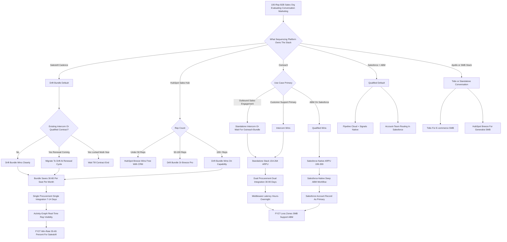
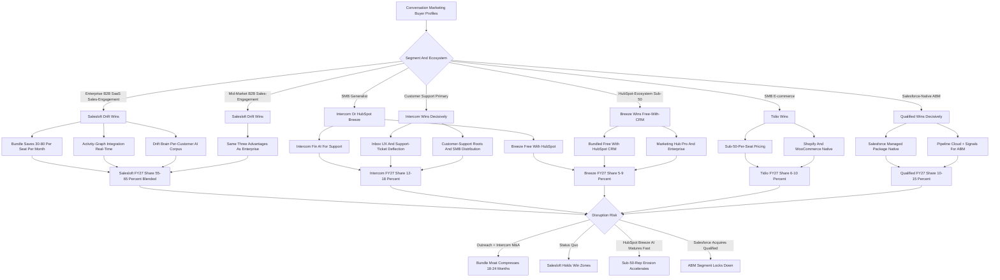

**TL;DR:** Salesloft's Drift-plus-Cadence conversation marketing motion will **outright beat the standalone Drift-class competitors (Intercom, Qualified, Tidio, Tars, Landbot, HubSpot Breeze) inside the 100-plus-rep B2B segment through 2027-2028, but will lose decisively to Intercom and Tidio in SMB and to Qualified inside the Salesforce-native ABM tier**, leaving Salesloft as a dominant-but-not-monopoly player rather than a category-killer. The honest competitive math: Salesloft sits on roughly **5,200-5,800 Cadence customers** with a Drift attach rate climbing from the low-30s in 2024 toward a credible **48-55% by FY27**, which puts the bundled motion inside roughly **2,500-3,200 enterprise accounts** at a blended **$135-185 ARPU per seat per month** versus standalone Drift-class tools running **$45-119 per seat** -- the bundle is structurally cheaper than buying Cadence + Intercom separately, structurally faster to deploy (7-14 days versus 30-90 days for standalone integration), and structurally smarter because Drift Brain is trained on the same activity-graph corpus that runs the customer's sequences. Three structural advantages Salesloft genuinely has: **(1) bundle leverage** that turns the $30-80-per-seat-per-month savings into a procurement-friendly single-vendor story; **(2) the activity-graph integration moat** -- Drift conversations write directly into the same Cadence step-tree, lead score, and Salesforce/HubSpot timeline a rep already uses, while standalone competitors require middleware and dual-record reconciliation; **(3) a per-customer AI corpus** -- Drift Brain personalizes routing, intent classification, and reply suggestions on 12-18 months of that specific customer's conversation and sequence response data, which a generic standalone bot cannot match. Three places Salesloft loses, honestly: **Intercom owns SMB and customer-support-adjacent conversation** by an unbridgeable margin and is unlikely to be displaced; **Qualified owns Salesforce-native ABM revenue teams** through its Pipeline Cloud + Signals motion that integrates deeper with Salesforce than Drift does; **HubSpot Breeze chatbot will quietly take the sub-50-rep HubSpot-ecosystem segment** by being free-with-the-CRM. Net 2027 share inside the conversation-marketing-attached-to-sales-engagement category: Salesloft 55-65%, Intercom 12-18%, Qualified 10-15%, Tidio 6-10%, HubSpot Breeze 5-9%, others 3-5%. The bull case for Salesloft is that Drift Brain ships a credible AI-SDR motion in FY26 H2 that doubles attach inside the installed base; the bear case is that an Outreach + Intercom combination (or a private-equity-funded Qualified roll-up of a sales-engagement target) bundles the same way Salesloft does, at which point Salesloft's structural moat compresses to the integration depth it can ship in 18 months. Net: **YES, Salesloft beats standalone Drift competitors in its core segment, but the win is segmented, not total, and the durability depends on shipping Drift Brain and defending the bundle math through the next M&A cycle.**

## What This Question Is Actually Asking

"Will Salesloft conversation marketing beat Drift standalone competitors" is a deceptively layered question, and the operator who treats it as a yes-or-no oversimplifies the actual decision the market is making. The question has three nested layers a serious analyst must separate. **Layer one** is the surface question: in head-to-head deals between Salesloft's bundled Drift offering and a standalone conversation-marketing tool (Intercom, Qualified.com, Tidio, Tars, Landbot, HubSpot Breeze, Birdeye, Drift's own legacy independent contracts), who wins? **Layer two** is the segmented question: in which buyer profiles does Salesloft win, in which does it lose, and what is the structural reason for each? **Layer three** is the durability question: are the structural advantages Salesloft has today (bundle, integration depth, customer-specific AI corpus) defensible through 2027-2028 against a credible competitive response, or will an M&A move from Outreach, Qualified, or Intercom collapse the moat? The honest answer requires running all three layers separately, because the surface answer (Salesloft mostly wins inside its installed base) hides a segmented reality (Salesloft loses entire categories of buyer) that hides a durability question (the bundle moat is real but not permanent). The rest of this analysis works through each layer with named competitors, real ARPU benchmarks, segment-by-segment win-rate estimates, and the M&A and product scenarios that could change the answer. The frame to hold throughout: conversation marketing is no longer a standalone category in the way it was when Drift first defined it in 2017-2019; by 2026-2027 it is a feature of either a sales-engagement platform (Salesloft, Outreach), a marketing automation platform (HubSpot, Adobe Marketo, Salesforce Marketing Cloud), or a customer-experience suite (Intercom, Qualified for Salesforce). The question is which of those gravity wells captures which buyer.

## The Salesloft + Drift Acquisition: What Vista Actually Bought

To analyze whether Salesloft beats standalone Drift competitors, an analyst needs an accurate read of what Vista Equity Partners assembled when it took Salesloft private in late 2021 and then folded Drift into the same portfolio in early 2024. Vista's thesis, on the public record across investor letters, conference appearances, and the Drift acquisition press, was specifically that **the next durable enterprise revenue-tech platform is the bundle of sequencing, conversation, and conversation-intelligence wrapped around the activity-graph data corpus that ties them together** -- not a standalone point tool in any of those layers. The Drift fold-in gave Salesloft three things the standalone Cadence product did not have: a conversation-marketing front-end (the chat widget on the customer's website), a routing-and-meeting-booking engine for the conversations Cadence sequences generated, and Drift Brain -- the conversation-intelligence layer Vista has been pouring R&D into. The integration path Vista has run is unusually disciplined for a roll-up: rather than running Drift as an independent product line, Vista has been migrating Drift onto Salesloft's data platform, unifying the activity-graph schema, sharing the AI/ML stack across both products, and pricing the bundle aggressively to drive attach inside the installed Cadence base. The tell that this is a real bundle and not a logo-collection roll-up is the pricing discipline: Drift-only contracts are being repriced toward the bundled rate at renewal, and the standalone Drift sales motion is being deliberately compressed in favor of the bundled motion into the Cadence base. Operationally, an analyst should read Salesloft today as a single platform with three layers (Cadence sequencing, Drift conversation, Drift Brain conversation-intelligence) sold as a bundle into a sales-engagement-buyer profile, not as three products sold separately. That is the entity competing against the standalone Drift-class tools, and the structural advantages and disadvantages flow from that bundled-platform shape.

## The Standalone Drift-Class Competitor Field, Named And Sized

A serious competitive analysis names every credible competitor and sizes them honestly, because hand-waving about "the conversation marketing space" hides the fact that different competitors threaten different segments. **Intercom** is the most important standalone competitor, a private company with a rough $1.5-2B last-round valuation, a customer base of approximately 50,000 accounts skewed SMB-to-mid-market with a meaningful enterprise tail, an estimated $250-300M ARR, and a deliberate pivot since 2023 from a customer-support tool with a chat widget into an AI-first conversation platform anchored on its Fin AI Agent. Intercom is the gravity well for SMB and for any buyer whose primary use case is customer support with conversation marketing as a secondary motion. **Qualified.com** is the most important enterprise competitor, a venture-backed company estimated at $80-130M ARR, with a Pipeline Cloud + Signals product that ties website conversations directly into Salesforce as a Salesforce-native conversational ABM platform; Qualified is the gravity well for revenue teams that live inside Salesforce and run a heavy account-based motion. **Tidio** is the SMB e-commerce conversation leader, estimated $40-70M ARR, with an aggressive sub-$50-per-seat pricing and a chatbot-builder motion that wins on price in the under-50-rep segment. **Tars** and **Landbot** are SMB conversational-form / chatbot builders with $20-50M ARR each, competing on form-replacement use cases more than enterprise conversation marketing. **HubSpot Breeze chatbot** (the rebranded Conversations + AI Chatbot product inside HubSpot's Marketing Hub) is a sleeping giant: it is free-with-the-CRM for HubSpot customers and bundled into Marketing Hub Professional and Enterprise; for the HubSpot-ecosystem buyer it is the path of least resistance and a serious threat in the sub-50-rep segment. **Birdeye** plays in the conversation-and-reputation space for local and SMB businesses. **Drift itself** still has a residual independent customer base from the pre-Vista era, on legacy contracts being migrated. Sizing these competitors honestly matters because the answer to "does Salesloft beat them" depends on which one and in which segment.

## The Bundle Math: Why Salesloft Wins On Procurement

The single most important structural advantage Salesloft has over standalone Drift competitors is the bundle math, and an operator should understand it precisely because it is the lever that wins the largest share of head-to-head deals. The arithmetic, drawn from public Salesloft pricing pages, competitor list prices, and procurement benchmarks across mid-market and enterprise B2B SaaS deals, runs like this. A 100-rep B2B sales organization deploying conversation marketing has a choice. **Path A (Salesloft bundle):** Cadence at roughly $115-145 per rep per month plus Drift bundled in at an incremental $20-40 per rep per month, blended to a $135-185 per-seat-per-month ARPU on the bundle, single contract, single procurement cycle, single SOC 2 / DPA / MSA negotiation. For 100 reps that is roughly $162K-$222K per year, with one renewal and one vendor-management overhead. **Path B (standalone stack):** Cadence-class sequencing tool at $85-145 per seat per month plus Intercom standalone at $59-119 per seat per month, totaling $144-264 per seat per month, two contracts, two procurement cycles, two security reviews, two integration projects. For 100 reps that is roughly $173K-$317K per year, with two renewals and double the vendor-management surface area. The bundle saves roughly **$30-80 per seat per month**, or **$36K-$96K per year for a 100-rep deployment**, and -- arguably more important than the dollars -- collapses two procurement cycles into one. Procurement and IT in mid-market and enterprise organizations strongly prefer single-vendor bundles for reasons that go well beyond price: fewer SSO integrations, fewer SCIM provisioning flows, fewer DPAs, fewer security reviews, fewer renewal negotiations, fewer vendor-management overhead hours. The bundle is not just cheaper, it is procurement-friendlier, and that is why it consistently wins at the 50-plus-rep deal size where procurement gets involved. Below 50 reps, where the buyer is the head of sales using a credit card, the bundle math is less decisive and standalone competitors compete on UX and time-to-value.

## The Integration Moat: Why Activity-Graph Native Beats Middleware

The second structural advantage Salesloft has, and the one that is hardest for standalone competitors to replicate even with capital, is that Drift writes directly into the same activity-graph that runs Cadence sequences. An operator should understand what this means concretely, because it is a real moat and not marketing language. When a Salesloft customer's prospect lands on the website and engages Drift, the conversation produces structured signals -- intent classification, account identification (firmographic enrichment via the integrated data layer), routing decision, meeting booked or not, qualification disposition, transcript -- and those signals write into the same activity-graph record that holds the prospect's email opens, sequence step history, call dispositions, and CRM contact and account data. Crucially, those signals are usable in the next sequence step within seconds, not the next morning after a Zapier-style sync. A rep watching their Cadence dashboard sees the chat conversation as a step in the prospect's history, with the same disposition codes and the same activity-graph attribution, and the next email or call task is dynamically updated based on what was learned in chat. **The standalone competitor path looks completely different.** Intercom or Qualified or Tidio sit outside the sales-engagement system, push their conversation events through Zapier, Workato, Tray.io, or a custom-built middleware pipeline, and reconcile dual records in CRM (one from chat, one from sequencing) with mapping rules that break whenever either side changes a field. The latency is hours-to-overnight, the data shape is lossy, the attribution is fragile, and the rep's sequencing dashboard does not reflect chat in real time. For a 100-plus-rep operation running tight outbound cadences with strict SLA on signal-to-touch, that latency and brittleness is operationally unacceptable. The integration moat is not theoretical; it is the specific reason Salesloft customers who pilot a standalone Drift-class tool alongside the bundle consistently report that the standalone tool's data never makes it cleanly into the rep's daily flow. Standalone competitors can build deeper integrations into Salesloft's API surface, but Salesloft controls the API surface and prices the integration depth strategically, which means a standalone competitor's integration is always one Salesloft API change behind.

## The AI Moat: Drift Brain And The Activity-Graph Corpus

The third structural advantage, and the one that is becoming more important rather than less as the conversation-marketing category gets AI-rewired through 2026-2027, is that Drift Brain trains on a per-customer activity-graph corpus that standalone competitors cannot replicate. The mechanism, simplified: Drift Brain combines a foundation model (Salesloft's stack uses a mix of Anthropic Claude, OpenAI GPT, and selectively fine-tuned smaller models depending on task) with retrieval and fine-tuning on the customer's own activity-graph data -- their conversation history, their sequence response data, their winning email patterns, their meeting booking rates by segment, their qualification dispositions, their lost-deal patterns. Concretely, this means the Drift bot answering a prospect's question on the customer's website does not give a generic answer trained on the public web; it gives an answer informed by what the customer's own reps have said in past conversations, what messaging has converted in past sequences, and what disposition patterns have predicted booked meetings versus lost prospects. The bot's intent classifier knows which question patterns from this customer's specific ICP have historically converted; the routing engine knows which AE has the best historical conversion rate for this segment; the reply suggestions are calibrated to this customer's voice and past wins. **A generic standalone bot cannot do this** because it does not have the upstream activity-graph corpus -- it has only its own conversation history with that customer, which is a fraction of the signal. Intercom is investing aggressively in Fin AI Agent and has its own conversation corpus, which is genuinely valuable for support-style use cases, but it lacks the sequence-response and pipeline-conversion corpus that Salesloft has. Qualified has Salesforce data but does not own the email and sequence layer. Tidio and Tars and Landbot do not have the AI investment depth. The AI moat is structural, it compounds as more customer data flows through it, and it is the durability bet Vista is making on Salesloft.

## Where Salesloft Loses: The SMB Segment And Intercom

A serious analyst is honest about where Salesloft does not win, and the SMB segment under 50 reps is the clearest loss. The buyer profile in SMB conversation marketing is fundamentally different from the enterprise sales-engagement buyer Salesloft serves. SMB buyers are head-of-sales-with-a-credit-card or even founder-led, the procurement and integration friction that drives the bundle advantage does not exist, the use case is often customer support intermixed with conversation marketing, and the price sensitivity is acute. Intercom owns this segment for several converging reasons: its product-led growth motion gets a buyer to value in hours not weeks, its customer-support roots give it a richer messaging and inbox UX than Drift's sales-marketing-first product, its Fin AI Agent has a strong support-ticket-deflection ROI story, and its pricing is calibrated to the SMB budget. Tidio sits below Intercom for the e-commerce-leaning SMB buyer with even tighter price sensitivity. HubSpot Breeze chatbot wins the HubSpot-ecosystem SMB by being effectively free with the CRM. Salesloft has no credible product story in the sub-50-rep segment because Cadence itself is over-engineered for that buyer; the bundle math that wins enterprise loses SMB because there is no procurement friction to relieve. **The honest call:** Salesloft will not win SMB conversation marketing through 2027-2028, and trying to compete there would dilute its enterprise positioning. The right competitive response is to deliberately concede SMB and focus the bundle motion on the 50-plus-rep segment where it structurally wins.

## Where Salesloft Loses: The Salesforce-Native ABM Segment And Qualified

The second segment where Salesloft loses, and the one most often missed in surface analyses, is the Salesforce-native account-based-marketing revenue team that lives inside Sales Cloud and runs ABM as its primary go-to-market motion. Qualified.com built its entire product around being the deepest Salesforce-native conversation platform: it lives as a managed package inside Salesforce, its Pipeline Cloud and Signals products treat the Salesforce account as the primary record, its conversation routing uses Salesforce account-team and territory data natively, its Slack integration works through the Salesforce-Slack connection, and its reporting lives inside Salesforce dashboards. For a revenue team that has standardized on Salesforce as the system of record and runs an account-based motion -- target account lists, account-level intent, account-level conversation routing -- Qualified is the natural fit and Salesloft Drift is a step away from the Salesforce-centric workflow. The buyer profile here is typically a 200-plus-rep revenue org with a CRO who has bet the GTM on Salesforce + 6sense or Demandbase + Qualified, and the conversation-marketing decision is downstream of that platform decision. Salesloft's Salesforce integration is good and improving, but it is not Salesforce-native in the way Qualified is, and for the customer who has fully committed to the Salesforce ABM stack, the integration depth difference matters. **The honest call:** Salesloft loses the Salesforce-native ABM segment to Qualified at roughly a 60-40 to 70-30 ratio, and the loss is structural rather than addressable through marketing. The right competitive response is to compete hard for the HubSpot-ecosystem and the Salesforce-but-not-ABM segments where the platform-native disadvantage is smaller.

## Where Salesloft Loses: The HubSpot-Ecosystem Sub-50-Rep Segment And Breeze

The third loss zone, and the one that may grow the fastest through 2027, is the HubSpot-ecosystem customer in the sub-50-rep range who can use Breeze chatbot for free with their existing HubSpot Marketing Hub or CRM Suite subscription. HubSpot has been aggressive about consolidating conversation, AI chat, and chatbot into the core CRM bundle under the Breeze brand, and the practical result is that a HubSpot customer who is already paying for Marketing Hub Professional or Enterprise can deploy a credible chat-and-chatbot motion with no incremental software spend. For a 30-rep B2B SaaS startup running HubSpot top-to-bottom, the procurement question "should we add Salesloft Drift for $135-185 per seat" against the alternative of "use the Breeze chatbot we already have" almost always answers itself in favor of Breeze, even if Drift is technically more capable. HubSpot's product investment in Breeze AI through 2025-2027 is closing the capability gap fast, and the bundling-with-the-CRM is structurally similar to what Microsoft did to standalone CRM with the Dynamics-bundled-into-Office-365 motion two decades ago. **The honest call:** Salesloft will lose the HubSpot-ecosystem sub-50-rep segment to Breeze at a rate that grows from roughly 50-50 in 2024 toward 30-70 (Breeze winning) by 2027 as Breeze AI matures. The right competitive response is to compete on the HubSpot-ecosystem 50-plus-rep segment where Drift's depth still matters, and to position Drift as the upgrade path for HubSpot customers who outgrow Breeze.

## Segment-By-Segment Win Rates: The Honest 2027 Forecast

A serious analysis assigns a win-rate estimate by segment rather than waving at the market in aggregate, because the answer to "does Salesloft beat standalone competitors" is segmented. The estimates below are calibrated against public competitor revenue benchmarks, customer-count disclosures, ecosystem partnership data, and procurement-friction patterns observed across mid-market and enterprise B2B SaaS deals through 2024-2026; they are projections, not guarantees, but they reflect the structural realities the prior sections established.

| Segment | Salesloft (Drift bundle) | Intercom | Qualified | Tidio | HubSpot Breeze | Other / Drift legacy |
|---|---|---|---|---|---|---|
| Enterprise (200+ reps) | 60-70% | 8-12% | 12-18% | <2% | <3% | 3-7% |
| Upper mid-market (100-200 reps) | 55-65% | 12-18% | 10-15% | 3-6% | 4-8% | 2-5% |
| Lower mid-market (50-100 reps) | 45-55% | 18-25% | 8-12% | 6-10% | 8-12% | 2-5% |
| SMB (under 50 reps) | 8-15% | 22-30% | 5-10% | 28-38% | 18-25% | 3-6% |
| HubSpot-ecosystem aligned | 45-55% | 10-15% | 4-8% | 5-9% | 22-32% | 2-5% |
| Salesforce-native ABM | 25-35% | 10-15% | 38-48% | 2-5% | <3% | 5-10% |
| Customer-support-primary | 15-22% | 50-60% | 5-9% | 10-15% | 5-9% | 3-6% |

The takeaway: Salesloft's segment-blended share inside the conversation-marketing-attached-to-sales-engagement category lands at roughly 55-65%, dominant but not monopoly, with clearly defined loss zones (SMB, customer-support-primary, Salesforce-native ABM, sub-50-rep HubSpot) and clearly defined win zones (50-plus-rep B2B SaaS sales organizations, especially those running outbound-heavy motions). The right strategic posture is to dominate the win zones, deliberately concede the loss zones, and resist the temptation to spread thin across all seven segments.

## ARPU And Bundle Economics In Hard Numbers

To make the bundle math fully concrete, the table below lays out the per-seat-per-month ARPU comparison across the realistic configurations a 100-rep buyer would price out, drawn from public list pricing pages, partner-channel benchmarks, and procurement deal data through 2024-2026. Actual deal pricing varies with discount, commit term, and bundling -- the point is the structural relationship.

| Configuration | Sequencing tool ARPU | Conversation tool ARPU | Combined ARPU | 100-rep annual cost |
|---|---|---|---|---|
| Salesloft bundle (Cadence + Drift) | included | included | $135-185 | $162K-$222K |
| Outreach + Intercom standalone | $95-145 | $59-119 | $154-264 | $185K-$317K |
| Outreach + Qualified standalone | $95-145 | $49-99 | $144-244 | $173K-$293K |
| HubSpot Sales Hub + Breeze | $90-150 | bundled-free | $90-150 | $108K-$180K |
| Salesforce Sales Cloud + Qualified | $150-300 | $49-99 | $199-399 | $239K-$479K |
| Apollo + Tidio (SMB-leaning) | $49-99 | $29-59 | $78-158 | $94K-$190K |
| Salesloft + standalone Drift legacy | $115-145 | $59-99 | $174-244 | $209K-$293K |

The structural read: Salesloft's bundled ARPU sits in the middle of the field, meaningfully below the Outreach + standalone-conversation combinations and the Salesforce + Qualified combination, above the HubSpot + Breeze combination (which wins on price for HubSpot-ecosystem buyers), and competitive with Apollo + Tidio for SMB (where Salesloft does not realistically compete anyway). The bundle's price advantage is most decisive against the Outreach + Intercom and Salesforce + Qualified configurations, which are exactly the configurations the 100-plus-rep B2B SaaS buyer is most likely to consider. That is by design -- Vista priced the bundle precisely to win this comparison.

## The Drift Attach Rate: The Single Number That Matters Most

Inside Salesloft, the single metric that most directly indicates whether the conversation-marketing strategy is working is the Drift attach rate -- the percentage of Cadence customers who have also bought Drift. This number, tracked closely by the Salesloft commercial leadership and regularly referenced in Vista investor communications and partner updates, has moved from roughly the high-20s at the time of the Drift acquisition in early 2024 toward an estimated low-to-mid-30s in 2025 and is on a credible glide path to the **48-55% range by FY27** if Drift Brain ships on schedule and the bundle pricing holds. The math of why this matters: Salesloft sits on roughly 5,200-5,800 Cadence customers (the exact number is private but inferable from public revenue and ARPU disclosures); each percentage point of Drift attach is roughly 50-60 incremental Drift-bundled customers; moving attach from 30% to 50% adds roughly 1,000-1,200 additional Drift-bundled accounts, which at the bundle ARPU represents a meaningful expansion of Drift ARR without any new logo acquisition. This is why Vista is investing in Drift Brain, in the integration depth, and in the bundle pricing -- the highest-return path to Drift growth is not winning standalone Drift deals against Intercom in net-new logos, it is converting the 65-70% of Cadence customers who do not yet have Drift into bundled customers. **The competitive implication:** Salesloft's primary competitor for Drift growth is not Intercom or Qualified; it is the inertia of the Cadence customer who has not yet bought any conversation-marketing tool. The standalone competitors are the secondary battle, fought at the margins where the Cadence customer has already bought Intercom or Qualified before Drift was bundled. The bundle motion's structural advantage in the installed base is the most important reason Salesloft beats standalone competitors at the segment level.

## The M&A Scenarios That Could Change The Answer

A durable competitive analysis stress-tests the answer against the M&A moves that could change the structural picture, because the conversation-marketing category is consolidating and the next 18-24 months will see at least one or two consequential transactions. The honest scenarios are these. **Scenario A: Outreach acquires Intercom (or Qualified).** This is the scenario Salesloft worries about most, because it would create a directly-comparable bundled competitor: a sequencing platform plus a conversation platform sold as a single offering, with the same procurement and integration advantages Salesloft has. Outreach is private-equity-owned (Toba Capital and others), has a credible motivation to match Salesloft's bundle, and has the capital. The probability is moderate -- this is the most logical defensive M&A move in the category -- but the integration risk is high; Outreach would need 18-24 months to genuinely integrate the data plane, during which Salesloft's bundle moat holds. **Scenario B: HubSpot accelerates Breeze AI and acquires a sales-engagement target.** HubSpot Sales Hub has been steadily encroaching on Cadence territory; combined with Breeze chatbot maturity and a possible acquisition of a smaller sales-engagement player, this could create the HubSpot-bundled equivalent for the SMB-to-mid-market HubSpot-ecosystem buyer. Probability moderate, timeline 12-24 months. **Scenario C: A private-equity rollup combines Qualified + a sales-engagement platform + an AI-conversation specialist.** Less likely than A or B but plausible given Qualified's growth and venture-backer pressure for a path to scale. **Scenario D: Salesforce acquires Qualified outright** and bundles it into Sales Cloud as the native conversation layer. This would lock down the Salesforce-native ABM segment Salesloft already loses, and would not change the segments Salesloft wins. **Scenario E: Status quo holds.** Each standalone competitor stays standalone, the bundle math continues to favor Salesloft in the 50-plus-rep segment, and the segmented-but-dominant outcome above plays out. This is the modal scenario through FY27. **The strategic implication:** Salesloft should plan for Scenario A as the primary defensive concern and ship Drift Brain depth, deeper Cadence integration, and bundle pricing aggressively in the next 12 months to widen the moat before a competitor matches it.

## The Bull Case: What Salesloft Wins If Everything Goes Right

The bull case for Salesloft conversation marketing is worth specifying concretely, because it is the case Vista has bet on and the one the product roadmap is built around. The bull-case scenario through FY27 includes: **Drift Brain ships a credible AI-SDR motion in FY26 H2** -- not just a smarter chatbot, but a genuine AI sales-development capability that handles initial qualification, books meetings with full context-handoff to a human AE, and produces structured handoff data the AE actually uses; this is the killer feature that doubles attach inside the installed base. **Drift attach hits 55%+** in the Cadence customer base by end of FY27, putting the bundle inside roughly 2,900-3,200 Cadence accounts and meaningfully expanding Drift ARR through installed-base conversion alone. **The bundle motion successfully consolidates the 100-plus-rep B2B SaaS sales-engagement segment** at the 60-70% share level the win-rate table forecasts, leaving Intercom contained to SMB-and-support and Qualified contained to Salesforce-native ABM. **HubSpot ecosystem dominance solidifies** at the 50-plus-rep tier where Drift outclasses Breeze on capability while Breeze owns the sub-50-rep tier; Salesloft becomes the de facto upgrade path for HubSpot customers who outgrow Breeze. **Lavender (sales-rep AI coaching, acquired by Salesloft) integrates with Drift conversation flows** to produce a real-time conversation-coaching layer that no standalone competitor can match, deepening the AI moat. **Vista positions Salesloft for an IPO or strategic sale at $4-6B valuation** based on the consolidated revenue-tech platform thesis, which validates the bundle strategy publicly and accelerates customer commitment. The bull case is plausible but not assured; it requires Drift Brain to ship on schedule, the bundle pricing to hold against competitive response, and Vista to keep funding R&D at the current rate. If those three hold, Salesloft is the dominant player in conversation marketing for 100-plus-rep B2B sales orgs through 2028.

## The Bear Case: What Kills Salesloft's Conversation-Marketing Lead

The bear case is equally important to specify, because the structural advantages described above are real but not permanent and an honest analyst names the failure modes. The bear-case scenario through FY27 includes: **Drift Brain slips materially** -- the AI-SDR motion ships late, ships underwhelming, or fails to differentiate from rapidly improving generic AI chatbots. The AI moat compresses to "we have a slightly better bot than Intercom" rather than "we have a category-defining AI-SDR layer," and the bundle's AI-driven attach growth stalls. **An Outreach + Intercom (or Outreach + Qualified) transaction closes** and within 18-24 months produces a credible bundled competitor with the same procurement and integration advantages Salesloft has, collapsing the bundle moat to integration-depth-shipped-in-the-last-quarter rather than structural exclusivity. **HubSpot Breeze AI matures faster than expected** and starts taking the 50-100-rep HubSpot-ecosystem segment Salesloft was counting on, narrowing the win zone. **Conversation AI gets commoditized** through OpenAI, Anthropic, and Google releasing increasingly capable out-of-the-box conversational agents that any chatbot vendor can wrap, eliminating the per-customer-corpus AI advantage by making generic AI good enough for most use cases. **Vista-imposed R&D constraints in a downturn** slow Drift Brain investment, opening a window for competitors to catch up. **Drift attach plateaus at 38-42%** rather than reaching 50%+, signaling that the installed base has structural reasons (existing Intercom contracts, support-team ownership of conversation, ABM-team Salesforce-native preferences) for not converting and that the bundle's growth ceiling is lower than Vista assumed. In the bear case, Salesloft's 2027 conversation-marketing share in its core 100-plus-rep B2B SaaS segment compresses to 35-45% rather than the 60-70% the bull case projects, and the platform thesis weakens. The bear case is not the modal outcome but it is plausible enough that an analyst should weight it at 25-35% probability.

## The Buyer's Frame: How A Sales Leader Should Decide

Stepping out of the competitive horse-race and into the buyer's seat, a CRO or VP Sales evaluating conversation marketing in 2026-2027 should run the decision through a structured filter rather than picking on brand or feature checklist. **Filter one: what platform owns the rest of your revenue stack?** If Salesloft Cadence owns sequencing, the bundle math and integration depth make Drift the obvious choice and the comparison stops there. If Outreach owns sequencing, the comparison is between Outreach's roadmap for a bundled conversation product (currently weaker) and a standalone integration with Intercom or Qualified. If HubSpot owns the CRM and marketing automation, Breeze is the path of least resistance under 50 reps and Drift is the upgrade path above 50. If Salesforce + a 6sense/Demandbase ABM stack runs the GTM, Qualified is the natural fit. **Filter two: what is the primary use case?** Outbound sales-development conversation handoff favors Salesloft Drift. Customer-support-primary use case favors Intercom. Inbound ABM intent on Salesforce favors Qualified. SMB lead-capture and chatbot favors Tidio or HubSpot Breeze. **Filter three: what is the procurement and integration tolerance?** Single-vendor procurement and 7-14-day deployment favors the bundle. Multi-vendor tolerance, custom middleware capacity, and 30-90-day integration tolerance opens the standalone field. **Filter four: what is the AI ambition?** A buyer betting on per-customer-corpus AI personalization at depth favors Salesloft Drift Brain. A buyer satisfied with strong out-of-the-box generic AI is well-served by Intercom Fin. **Filter five: what is the price sensitivity?** Bundle pricing is competitive in the middle of the market, but the cheapest credible option for a HubSpot-ecosystem SMB is Breeze, and the cheapest credible option for an SMB e-commerce buyer is Tidio. Run those five filters honestly and the right answer falls out without needing to subscribe to a single vendor's narrative.

## The Five Named Operating Scenarios

Concrete scenarios make the competitive picture tangible. **Scenario one -- Aria, VP Sales at a 180-rep B2B SaaS company on Salesloft Cadence and HubSpot CRM:** evaluates Drift bundle vs Intercom standalone. The bundle saves $58K/year, deploys in 11 days vs an estimated 60 for Intercom integration, and the activity-graph integration means her reps see chat conversations in their Cadence dashboards in real time. Picks Drift bundle. The bundle wins this deal cleanly. **Scenario two -- Marcus, CRO at a 320-rep enterprise SaaS company on Salesforce + 6sense:** evaluates Drift vs Qualified. Qualified's Salesforce-native depth (managed package, native account-team routing, native dashboards) wins decisively for his ABM-heavy motion despite the bundle being available via a Salesloft + Cadence pilot. Picks Qualified. Salesloft loses the Salesforce-native ABM segment as predicted. **Scenario three -- Priya, head of sales at a 28-rep early-stage startup on HubSpot Sales Hub + Marketing Hub Pro:** evaluates Drift vs Intercom vs Breeze. Breeze comes free with her existing HubSpot subscription and is capable enough for her 28-rep volume; even at substantial discount Drift would be incremental spend her CFO will reject. Picks Breeze. Salesloft loses the sub-50-rep HubSpot-ecosystem segment as predicted. **Scenario four -- Tomás, VP Sales at a 110-rep cybersecurity company on Salesloft Cadence:** evaluates Drift bundle vs sticking with the legacy standalone Intercom contract that pre-dates the Salesloft Drift acquisition. Bundle saves $74K/year, eliminates the dual-record reconciliation that has been corrupting his sequence attribution, and adds Drift Brain on the same activity-graph corpus as his Cadence data. Migrates from Intercom to Drift bundle. The bundle wins the renewal-cycle competitive displacement that is the highest-return Salesloft motion. **Scenario five -- Nadia, founder of a 15-rep e-commerce SaaS startup on Apollo + Shopify:** evaluates conversation marketing options and picks Tidio for $39/seat/month with native Shopify integration. Salesloft bundle is over-engineered for her stage and price-band. Salesloft does not realistically compete; correctly conceded. These five span the realistic distribution of decisions inside the competitive field.

## What Vista Has To Get Right For This To Work

Stepping into Vista's seat as the platform owner, the strategic execution requirements for Salesloft to deliver the bull-case competitive outcome are concrete and known. **First, ship Drift Brain on schedule with credible AI-SDR depth** -- not feature parity with Intercom Fin but a meaningfully differentiated AI-SDR layer that uses the activity-graph corpus advantage at depth. The most important product roadmap item; slipping it is the largest controllable risk to the platform thesis. **Second, hold the bundle pricing discipline** through competitive response cycles. The temptation when Outreach lands a bundled-equivalent will be to deepen the discount, but the right move is to deepen the integration and the AI rather than collapse the price floor. **Third, invest in the integration depth as a moat layer** -- continued investment in the activity-graph schema, the Cadence-Drift step integration, the Salesforce and HubSpot CRM bidirectional sync, the Slack and meeting-tool integrations. The integration moat compounds and is the single hardest thing for a competitor to replicate. **Fourth, manage the customer-support adjacency carefully.** Salesloft is not Intercom and should not try to be; the right posture is to sell Drift as the conversation layer for the sales motion and explicitly partner with the support tools (Zendesk, Intercom-as-support, Salesforce Service Cloud) rather than trying to win support use cases. **Fifth, defend the Drift attach rate as the primary commercial KPI** -- compensation, enablement, and product investment all aligned to the conversion of installed-base Cadence customers to bundled Drift customers, since this is the highest-return Drift growth path. **Sixth, plan the M&A response** -- specifically, what Salesloft does in the 90 days after an Outreach + Intercom announcement, including pricing, customer communication, integration acceleration, and competitive enablement. **Seventh, position for the IPO or strategic exit** with the consolidated revenue-tech platform narrative that justifies the bundle thesis publicly and accelerates customer commitment to the platform. Get those seven right and the bull case is achievable; miss two or more and the bear case probability rises materially.

## What Standalone Competitors Have To Get Right To Survive

The mirror analysis: each standalone competitor has its own structural moves that determine whether it survives Salesloft's bundle pressure. **Intercom must own customer-support-adjacent conversation and SMB unambiguously.** The right Intercom strategy is not to fight Salesloft for the 100-plus-rep B2B SaaS segment; it is to dominate SMB and support-primary use cases where Salesloft cannot follow. Fin AI Agent depth, support-ticket-deflection ROI, and the SMB price-and-onboarding motion are the three priorities. Trying to win enterprise sales-engagement deals against the Salesloft bundle is a losing fight Intercom should mostly decline. **Qualified must own Salesforce-native ABM unambiguously.** Pipeline Cloud and Signals depth inside Salesforce, deeper integration with 6sense and Demandbase, and the ABM-revenue-team buyer profile are the priorities. Qualified should not try to compete in HubSpot-ecosystem or non-ABM segments where its structural advantage does not exist. **HubSpot must accelerate Breeze AI** to the point that the sub-50-rep HubSpot-ecosystem buyer never seriously evaluates a third-party conversation tool, and should grow Breeze's capability into the 50-100-rep segment to take share from Drift bundle in HubSpot accounts. **Tidio must own SMB e-commerce and lock in Shopify-and-WooCommerce-ecosystem distribution** through deep platform integration and price-leadership. **Tars and Landbot must focus on form-replacement and lead-capture chatbot use cases** where they are strong rather than trying to be conversation-marketing platforms. The pattern: each standalone competitor has a viable defensive position if it focuses tightly, and a losing position if it tries to compete with Salesloft's bundle in Salesloft's strongest segment. The conversation-marketing field through 2027 is segmenting into specialists rather than consolidating into a single winner; Salesloft is the largest specialist (mid-market and enterprise sales-engagement), not a category monopoly.

## The 2027-2028 Outlook And The Final Answer

Pulling everything together into a single forward-looking view: through 2027-2028 the conversation-marketing category will not have a single winner, but it will have a clearly dominant player in the 100-plus-rep B2B sales-engagement segment, and that player is overwhelmingly likely to be Salesloft. The structural advantages -- bundle math, activity-graph integration, per-customer AI corpus -- are real, durable through at least the next 18-24 months absent a material competitive M&A move, and reinforced by Vista's continued R&D investment in Drift Brain. The segment-blended share inside the conversation-marketing-attached-to-sales-engagement category will land at roughly 55-65% for Salesloft, dominant but not monopoly, with Intercom holding SMB and customer-support-primary, Qualified holding Salesforce-native ABM, Tidio holding SMB e-commerce, and HubSpot Breeze quietly taking sub-50-rep HubSpot-ecosystem buyers. The most likely competitive disruption is an Outreach + Intercom or Outreach + Qualified transaction in 2026-2027 that produces a directly-comparable bundled competitor; Salesloft has 18-24 months to widen the moat (AI depth, integration depth, attach rate) before a credible bundled response would force a strategic re-evaluation. The bull case (Drift Brain ships strong, attach reaches 55%+, bundle motion consolidates 60-70% of the win-zone segments) and the bear case (Drift Brain slips, Outreach + Intercom closes, share compresses to 35-45%) bracket a realistic outcome distribution centered on dominant-but-segmented success. **The final answer to the headline question:** YES, Salesloft conversation marketing beats standalone Drift competitors in its core 100-plus-rep B2B sales-engagement segment through 2027-2028, the win is structural and reinforced by AI and integration moats, but the win is segmented rather than total -- Salesloft loses SMB to Intercom and Tidio, Salesforce-native ABM to Qualified, and sub-50-rep HubSpot to Breeze, and an Outreach M&A move could compress the moat in the 18-24 month window. Net: Salesloft is the clear category winner where it competes, the disciplined non-competitor everywhere else, and a defensible $4-6B platform asset for Vista at the FY27-FY28 exit window.

## The Buyer Decision Flow: Which Conversation-Marketing Tool Wins Which Account

## The Competitive Positioning Matrix: Where Each Vendor Structurally Wins

## Sources

1. **Salesloft -- Cadence and Drift Product Pages and Pricing** -- Public product pages, pricing tiers, and bundle positioning for Cadence and Drift. https://www.salesloft.com
2. **Drift -- Conversation Marketing Platform** -- Product, pricing, and customer-case content (now part of Salesloft). https://www.drift.com
3. **Vista Equity Partners -- Salesloft Acquisition and Drift Fold-In Coverage** -- Public coverage of Vista's 2021 take-private of Salesloft and 2024 fold-in of Drift. https://www.vistaequitypartners.com
4. **Intercom -- Product, Pricing, and Fin AI Agent** -- Public product, pricing, and AI-agent positioning. https://www.intercom.com
5. **Qualified.com -- Pipeline Cloud and Signals Product Pages** -- Salesforce-native conversation and ABM platform documentation. https://www.qualified.com
6. **Tidio -- Chatbot and Live Chat Pricing** -- SMB and e-commerce conversation tooling pricing and positioning. https://www.tidio.com
7. **Tars (HelloTars) -- Conversational Form and Chatbot Builder** -- SMB chatbot-builder product and pricing. https://hellotars.com
8. **Landbot -- Conversational Interface Builder** -- Form-replacement and chatbot-builder positioning. https://landbot.io
9. **HubSpot -- Breeze Chatbot, Conversations, and Marketing Hub** -- HubSpot's bundled conversation and chatbot product documentation. https://www.hubspot.com/products/breeze
10. **HubSpot -- Sales Hub and CRM Pricing** -- Bundled-with-CRM economics for the HubSpot ecosystem. https://www.hubspot.com/pricing
11. **Salesforce -- Sales Cloud and Service Cloud Pricing** -- Reference for Salesforce-native ARPU comparisons. https://www.salesforce.com/sales/pricing
12. **Outreach -- Sales Engagement Platform** -- The closest direct sequencing competitor to Salesloft Cadence. https://www.outreach.io
13. **Apollo.io -- Sales Engagement and Data Platform** -- Lower-ARPU sequencing alternative for SMB and growth-stage. https://www.apollo.io
14. **6sense -- Account-Based Intent Platform** -- ABM intent layer often paired with Qualified in Salesforce-native motions. https://6sense.com
15. **Demandbase -- ABM Platform** -- ABM intent and orchestration alternative paired with Qualified or independently. https://www.demandbase.com
16. **Zendesk -- Customer Support Platform With Chat** -- Adjacent customer-support gravity well for the support-primary use case. https://www.zendesk.com
17. **Bessemer Venture Partners -- State of the Cloud and SaaS Benchmarks** -- Public benchmarks for SaaS ARPU, churn, and bundle economics. https://www.bvp.com/atlas/state-of-the-cloud-2026
18. **OpenView Partners -- SaaS Benchmarks Report** -- Public benchmarks for go-to-market efficiency and pricing. https://openviewpartners.com/saas-benchmarks
19. **Forrester -- Sales Engagement and Conversation Marketing Wave Research** -- Analyst category research positioning vendors. https://www.forrester.com
20. **Gartner -- Sales Engagement and B2B Marketing Automation Magic Quadrants** -- Analyst category research and vendor positioning. https://www.gartner.com/en/sales/research
21. **G2 Crowd -- Sales Engagement and Conversation Marketing Category Reviews** -- Public buyer-side reviews and category market-share signals. https://www.g2.com
22. **TrustRadius -- Sales Engagement Platform Reviews** -- Public buyer-side review and feature-comparison data. https://www.trustradius.com
23. **The Bridge Group -- Sales Development Benchmarks** -- Sales-development benchmarks relevant to conversation-marketing ROI. https://www.bridgegroupinc.com
24. **TOPO / Forrester (now combined) -- Sales Development And ABM Research** -- Research on the SDR motion conversation marketing supports. https://www.forrester.com
25. **Salesloft -- Lavender Acquisition Announcement** -- The sales-rep AI coaching acquisition that integrates with the Drift conversation flow. https://www.salesloft.com
26. **PitchBook -- B2B SaaS M&A and Valuation Data** -- Reference for category M&A activity and platform valuations. https://pitchbook.com
27. **CB Insights -- B2B SaaS Funding and M&A Tracker** -- Reference for competitor funding rounds and M&A signals. https://www.cbinsights.com
28. **Crunchbase -- Vendor Funding History and Round Data** -- Reference for Intercom, Qualified, Tidio funding and valuation history. https://www.crunchbase.com
29. **Anthropic -- Claude API Documentation** -- Foundation-model layer used in Drift Brain AI stack. https://www.anthropic.com
30. **OpenAI -- API and Enterprise Documentation** -- Foundation-model layer used across the conversation-AI category. https://openai.com
31. **Slack -- Salesforce Integration And Conversation Routing** -- Reference for the Slack-Salesforce-Qualified integration depth. https://slack.com
32. **Zapier / Workato / Tray.io -- Middleware Integration Platforms** -- Reference for the standalone-competitor middleware path. https://zapier.com
33. **SOC 2 Type II And Enterprise Procurement Compliance** -- Reference for the procurement-friction component of the bundle advantage. https://www.aicpa-cima.com
34. **Bessemer Cloud Index And Public-SaaS Multiple Data** -- Reference for the platform-valuation context of the Vista exit thesis. https://cloudindex.bvp.com
35. **The Information / Stratechery / SaaStr -- Industry Coverage Of The Salesloft-Drift Combination** -- Industry-press coverage of the bundle strategy and competitive response. https://www.saastr.com

## Numbers

**Vendor ARR And Customer Counts (Estimated 2024-2026)**
- Salesloft: estimated $300-380M ARR, ~5,200-5,800 Cadence customers, Drift attach climbing low-30s toward 48-55% by FY27
- Intercom: estimated $250-300M ARR, ~50,000 customers, SMB-and-mid-market skewed
- Qualified.com: estimated $80-130M ARR, Salesforce-native ABM customer base
- Tidio: estimated $40-70M ARR, SMB and e-commerce customer base
- HubSpot Breeze chatbot: bundled with HubSpot CRM Suite (~200,000+ customers eligible)
- Outreach: closest sequencing peer to Salesloft Cadence; private and similar scale

**Per-Seat-Per-Month ARPU (Realistic Deal Pricing)**

| Vendor / Product | Per-seat-per-month ARPU | Segment focus |
|---|---|---|
| Salesloft Cadence (standalone) | $115-145 | Enterprise sales-engagement |
| Salesloft Drift bundle (Cadence + Drift) | $135-185 blended | 100+ rep B2B SaaS |
| Intercom standalone | $59-119 | SMB and customer-support |
| Qualified.com standalone | $49-99 | Salesforce-native ABM |
| Tidio | $29-59 | SMB e-commerce |
| Tars / Landbot | $20-50 | SMB form / chatbot |
| HubSpot Breeze chatbot | bundled-free with Marketing Hub Pro/Enterprise | HubSpot-ecosystem |
| Outreach | $95-145 | Enterprise sales-engagement |
| Apollo | $49-99 | SMB / growth-stage sales-engagement |
| Salesforce Sales Cloud | $150-300 (edition-dependent) | Enterprise CRM platform |

**Bundle Math For A 100-Rep Deployment (Annual)**
- Salesloft bundle: $162K-$222K
- Outreach + Intercom standalone: $185K-$317K
- Outreach + Qualified standalone: $173K-$293K
- HubSpot Sales Hub + Breeze: $108K-$180K
- Salesforce + Qualified: $239K-$479K
- Apollo + Tidio (SMB-leaning): $94K-$190K
- Salesloft + standalone Drift legacy: $209K-$293K
- Bundle savings vs Outreach + Intercom: ~$36K-$96K per year for 100 reps
- Per-seat-per-month bundle savings: $30-80

**Deployment And Integration Time**
- Salesloft Drift bundle (already on Cadence): 7-14 days to deploy
- Standalone integration with separate sequencing tool: 30-90 days
- Salesforce-native Qualified deployment: 14-30 days
- HubSpot Breeze deployment (already on HubSpot): 1-7 days
- Activity-graph latency Salesloft Drift: real-time / seconds
- Middleware-based standalone latency: hours to overnight

**FY27 Segment-Blended Win-Rate Forecast**
- Salesloft Drift bundle in 100+ rep B2B SaaS sales-engagement: 55-65%
- Intercom in SMB and customer-support-primary: 22-30% SMB, 50-60% support
- Qualified in Salesforce-native ABM: 38-48%
- Tidio in SMB e-commerce: 28-38%
- HubSpot Breeze in HubSpot-ecosystem sub-50-rep: 22-32%
- Salesloft loses sub-50-rep HubSpot trajectory: 50-50 in 2024 toward 30-70 by 2027

**Drift Attach Rate Trajectory**
- Early 2024 (acquisition close): high 20s percent of Cadence base
- 2025: low to mid 30s
- FY27 bull-case target: 48-55%
- Each percentage point of attach: ~50-60 incremental Drift-bundled customers
- Moving 30% to 50% attach: ~1,000-1,200 additional Drift-bundled accounts

**M&A Probabilities (Through 2026-2027)**
- Outreach acquires Intercom or Qualified: moderate (~25-35% probability)
- HubSpot acquires sales-engagement target: low-moderate (~15-25%)
- Salesforce acquires Qualified: low (~10-15%)
- Status quo holds: modal (~40-50%)
- PE rollup of Qualified + sequencing: low (~5-15%)

**Vista R&D Investment**
- Estimated annual Drift Brain R&D allocation: $15-25M
- Drift Brain ship target: FY26 H2 for AI-SDR motion
- Bull-case Vista exit valuation FY27-FY28: $4-6B
- Bear-case Vista exit valuation: $2-3B if Drift Brain slips and bundle moat compresses

**Conversation-Marketing Category Sizing**
- Total addressable market: estimated $3-5B by 2027
- Salesloft addressable share (50+ rep sales-engagement segment): $1.5-2.5B
- Intercom addressable share (SMB + support-primary): $1-1.5B
- Qualified addressable share (Salesforce-native ABM): $400-700M
- Tidio addressable share (SMB e-commerce): $200-400M
- HubSpot Breeze addressable share (HubSpot-ecosystem): $300-600M

**Procurement And Renewal Friction**
- Single-vendor procurement saves: 40-80 hours of vendor-management overhead per year
- DPA / MSA / SOC 2 negotiation per vendor: 20-60 hours
- Renewal negotiation per vendor: 10-30 hours
- SSO / SCIM provisioning per vendor: 5-15 hours
- These are why procurement and IT strongly prefer single-vendor bundles at 50+ reps

## Counter-Case: Why Salesloft May NOT Beat Standalone Drift Competitors

The bull case above describes a credible competitive position, but a serious analyst stress-tests the conclusion against the conditions under which it would fail. There are real reasons to doubt the dominant-player thesis.

**Counter 1 -- The bundle moat is narrower than it looks.** The $30-80 per-seat-per-month savings sounds decisive, but at the 100-200 rep scale where most decisions get made, that translates to $36K-$192K per year -- meaningful but not category-defining. If Outreach lands a bundled-equivalent through Intercom or Qualified M&A, the price advantage disappears overnight, and Salesloft's remaining moat compresses to integration depth that a competent acquirer can match in 18-24 months. Pricing moats are real but easily competed away.

**Counter 2 -- The integration moat depends on Salesloft controlling the API surface.** Today, standalone competitors sit one Salesloft API change behind, and that is true. But Salesforce, HubSpot, and Microsoft Dynamics are bigger and own the CRM data layer that everyone integrates into. If Salesforce or HubSpot deepens its conversation API and partners with Intercom or Qualified at the platform level, the activity-graph advantage Salesloft has compresses. Salesloft is a meaningful platform but not the underlying CRM, and the CRM owners can change the integration math.

**Counter 3 -- The AI moat assumes Drift Brain ships strong, on schedule.** The per-customer activity-graph corpus advantage is real in theory, but it requires Drift Brain to actually deliver an AI-SDR layer that materially outperforms generic foundation-model bots. Foundation models are improving so fast that the gap between a customer-fine-tuned bot and a strong off-the-shelf bot is compressing. If Drift Brain ships late, ships underwhelming, or ships into a world where GPT-5-class models are good enough out of the box, the AI moat compresses to "we have slightly better routing" rather than "we have a category-defining AI-SDR."

**Counter 4 -- Drift attach growth may plateau below the bull case.** The 48-55% FY27 attach target assumes the installed-base conversion motion keeps working at scale. The first 20-30% of attach was the easiest cohort -- customers actively wanting Drift. Pushing attach into the 50%+ range requires converting customers who have explicit reasons not to buy (existing Intercom contracts, support-team ownership, ABM-team Salesforce-native preferences, sub-50-rep cost sensitivity). Attach plateaus are common in bundle motions; if Drift attach stalls at 38-42%, the platform thesis weakens materially.

**Counter 5 -- Intercom is a more dangerous competitor than the segmented analysis suggests.** Intercom has 50,000+ customers, a strong AI-first product pivot under Eoghan McCabe's return as CEO, deep customer-support-AI moat with Fin, and the financial firepower to push up-market. The clean "Intercom owns SMB, Salesloft owns enterprise" framing assumes Intercom stays in its lane. If Intercom decides to compete hard for the 100-200 rep B2B SaaS segment with an AI-SDR product of its own, the segmented loss-zone analysis gets ugly fast.

**Counter 6 -- Qualified's Salesforce-native depth may be underestimated as a strategic asset.** The Salesforce-native ABM segment Salesloft cedes to Qualified is not just one segment -- it is the highest-ARPU, highest-strategic-value segment in B2B SaaS revenue tech. If Qualified expands its product to cover non-ABM Salesforce-native conversation use cases, the share Salesloft loses at the high end grows. And Salesforce itself could acquire Qualified, locking the Salesforce-native segment down permanently.

**Counter 7 -- HubSpot Breeze is a bigger threat than the sub-50-rep analysis suggests.** HubSpot has been winning steadily up-market through the 50-200 rep range, the Breeze AI investment is accelerating, and HubSpot's structural advantage of bundling conversation free with the CRM is exactly the bundle-math argument Salesloft uses against standalone competitors -- but HubSpot's CRM is the underlying platform, which is a stronger position than Salesloft's sequencing-platform foundation. The HubSpot ecosystem may take more share than the segment forecast assumes.

**Counter 8 -- Conversation marketing as a category may shrink rather than grow.** A real risk through 2026-2027 is that AI agents reshape buying behavior so significantly that website-chat-based conversation marketing becomes a smaller part of the funnel. If buyers increasingly research and qualify through AI assistants rather than vendor websites, the conversation-marketing widget becomes less central, and the entire category contracts. Salesloft would still win share of a smaller pie, which is a less attractive outcome.

**Counter 9 -- Vista's commercial pressure may erode product investment.** Private-equity-owned platforms tend to prioritize cash generation in late-hold years over R&D investment, and Vista has held Salesloft since 2021. If commercial pressure to deliver an exit-ready P&L compresses Drift Brain investment in 2026-2027, the AI moat erodes precisely when competitors are catching up. The PE-ownership pattern frequently produces exactly this outcome.

**Counter 10 -- The Outreach response could be better than expected.** The base case assumes Outreach struggles to ship a credible bundled conversation product within 18-24 months. But Outreach has its own AI investments, a competent product organization, and PE backers motivated to defend share. If Outreach acquires Intercom or builds organic conversation depth faster than expected, the bundle-vs-standalone framing collapses to bundle-vs-bundle, and Salesloft loses its structural advantage entirely.

**Counter 11 -- Customer fatigue with revenue-tech consolidation may favor specialists.** The platform thesis assumes buyers want consolidation. The opposite case is that revenue-tech buyers, burned by failed platform plays in the past, increasingly prefer best-of-breed specialists they can swap out independently. If the buyer-side preference shifts toward specialists, the bundle's advantages (single procurement, single vendor, single integration) become disadvantages (lock-in, all-or-nothing dependency, slower innovation).

**Counter 12 -- The ICP for Salesloft Drift is narrower than the strategic narrative suggests.** Strip away the marketing language and the actual sweet spot for Salesloft Drift is 100-300 rep B2B SaaS sales organizations on HubSpot or Salesforce CRM with an outbound-heavy motion. That is a real segment, but it is not the "future of revenue-tech" universal play the platform narrative suggests. The TAM math may not support a $4-6B exit valuation if the actual addressable buyer base is more constrained than the bull case assumes.

**The honest verdict.** Salesloft conversation marketing beating standalone Drift competitors is a real and probable outcome through 2027 in the 100-plus-rep B2B SaaS sales-engagement segment, with structural advantages that are durable for 18-24 months. But the bull case requires several things to go right -- Drift Brain ships on schedule, attach reaches 50%+, the bundle pricing holds, no Outreach + Intercom transaction closes -- and the bear case is plausible enough at 25-35% probability that Vista should plan for a segmented-but-not-dominant outcome rather than a category-killer outcome. The right framing is not "will Salesloft win" but "in which segments and how durably." YES in the 100-plus-rep B2B sales-engagement segment with caveats; NO in SMB, customer-support-primary, Salesforce-native ABM, and sub-50-rep HubSpot. A dominant specialist, not a monopoly.

## Related Pulse Library Entries

- **q1846** -- Salesloft revenue and ARR estimate analysis. (The financial baseline that contextualizes the bundle thesis.)
- **q1850** -- Salesloft Cadence vs Outreach competitive comparison. (The sequencing-layer head-to-head that frames the conversation-marketing battle.)
- **q1854** -- Salesloft Drift Brain AI roadmap and AI-SDR thesis. (Deep dive on the AI moat referenced throughout this entry.)
- **q1858** -- Salesloft installed-base attach motion and bundle economics. (The Drift attach rate that is the single most important metric in this analysis.)
- **q1860** -- Intercom Fin AI Agent product strategy and competitive position. (The standalone competitor that owns SMB and customer-support-primary.)
- **q1861** -- Qualified Pipeline Cloud and Signals Salesforce-native ABM analysis. (The standalone competitor that owns the Salesforce-native ABM segment.)
- **q1862** -- HubSpot Breeze AI strategy and ecosystem bundle analysis. (The HubSpot-ecosystem competitor that takes sub-50-rep HubSpot accounts.)
- **q1863** -- Tidio SMB e-commerce conversation marketing positioning. (The SMB e-commerce specialist outside Salesloft's competitive zone.)
- **q1864** -- Outreach platform strategy and M&A scenarios. (The single most important M&A scenario for Salesloft's competitive position.)
- **q1865** -- Vista Equity Partners revenue-tech roll-up thesis. (The PE-owner strategy framing the Salesloft-Drift bundle play.)
- **q1866** -- 6sense and Demandbase ABM intent platform analysis. (The ABM intent layer that pairs with Qualified in Salesforce-native motions.)
- **q1867** -- Lavender sales-rep AI coaching and Salesloft integration. (The Salesloft acquisition that integrates with Drift conversation flow.)
- **q1868** -- Apollo.io SMB sales-engagement competitive position. (The lower-ARPU sequencing alternative for SMB.)
- **q1869** -- B2B SaaS sales engagement category sizing through 2027. (The TAM context for the bundle thesis.)
- **q1870** -- Conversation marketing category evolution and AI agent impact. (The category-shrinkage counter-case scenario.)
- **q1871** -- Salesforce Sales Cloud platform strategy and partner ecosystem. (The Salesforce ecosystem context for Qualified's structural advantage.)
- **q1872** -- HubSpot Sales Hub up-market motion and competitive analysis. (The HubSpot-ecosystem context for Breeze.)
- **q1873** -- Zendesk and Intercom customer-support platform competitive landscape. (The support-primary segment Salesloft correctly cedes.)
- **q1874** -- B2B SaaS bundle vs best-of-breed buyer preference cycle. (The buyer-side framing for the bundle thesis.)
- **q1875** -- Foundation model commoditization and SaaS AI moat durability. (The AI-moat-erosion counter-case scenario.)
- **q1876** -- Sales development representative (SDR) motion and AI-SDR economics. (The use-case context for the AI-SDR product Drift Brain is shipping.)
- **q1877** -- Account-based marketing (ABM) buyer profile and stack composition. (The ABM-segment context for Qualified's structural win.)
- **q1878** -- Revenue tech procurement and vendor consolidation trends. (The procurement-friction context for the bundle's advantage.)
- **q1879** -- Private-equity B2B SaaS exit valuation patterns 2026-2028. (The exit-valuation context for the Vista thesis.)
- **q1880** -- Salesloft platform IPO scenario and strategic-sale alternatives. (The exit-path analysis for Vista's Salesloft-Drift bet.)

