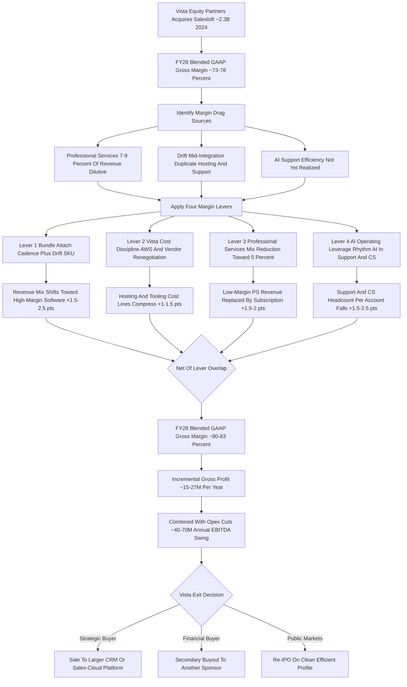
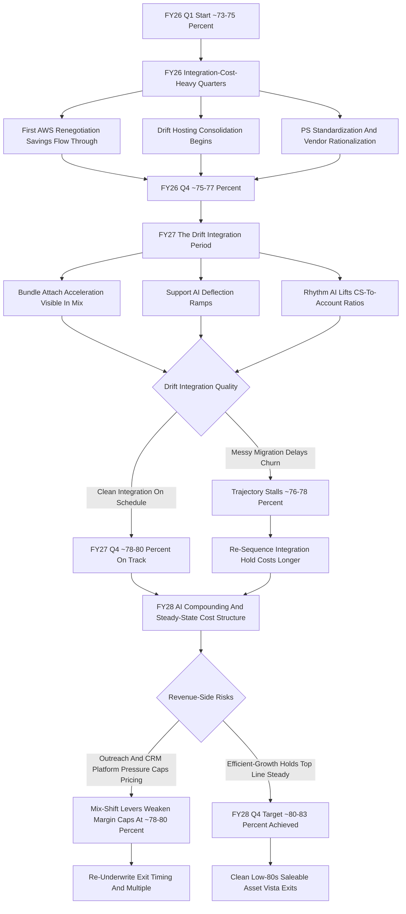

**TL;DR:** Salesloft's gross margin trajectory through 2028 is the story of a sales-engagement platform being financially re-engineered by a private-equity owner. After Vista Equity Partners acquired Salesloft in a deal valued around $2.3 billion in 2024 -- folding in the 2024 Drift conversational-marketing acquisition and continuing to absorb the earlier Costello and InStereo tuck-ins -- the company carries an estimated blended GAAP gross margin in the **73-78%** range as of FY26, and the realistic path is expansion to roughly **80-83% by FY28**. That five-to-seven-point climb is not a single event; it is the compounding of four distinct levers that Vista applies to nearly every SaaS company it owns. **Lever one is bundle attach**: pushing the Drift conversational layer and the Cadence engagement core into one bundled SKU shifts revenue mix toward higher-margin pure software and away from one-off services, and every point of attach-rate growth pulls blended margin up. **Lever two is Vista cost discipline**: the standard PE playbook of consolidating G&A into shared services, renegotiating the AWS and data-vendor contracts using portfolio-wide leverage, capping R&D as a percentage of revenue, and shrinking the real-estate footprint -- cost-out that flows almost directly into cost of revenue. **Lever three is professional-services mix reduction**: deliberately shrinking professional services from roughly 8% of revenue toward 5%, because PS runs at a 35-45% gross margin and every dollar of revenue that moves from PS to subscription is a 35-plus-point margin upgrade on that dollar. **Lever four is AI operating leverage**: Salesloft's Rhythm AI orchestration engine and the Drift conversational AI reduce the human cost of customer support, onboarding, and success per account, structurally lowering the support and CS lines inside cost of revenue. Net effect: a 5-7 point gross-margin expansion on a revenue base estimated at $250-300M-plus translates into something like **$15-25M of incremental annual gross profit**, which -- combined with the operating-expense cuts Vista runs in parallel -- is what turns Salesloft from a growth-stage burner into the cash-generative, Rule-of-40-respecting asset Vista underwrote. The honest caveat: this is an estimate-and-framework answer, not audited disclosure. Salesloft is private; it does not publish GAAP financials; the exact percentages are modeled from comparable public sales-tech companies (HubSpot, ZoomInfo, Salesforce), from Vista's documented portfolio playbook, and from the known structure of the Drift acquisition. The trajectory direction -- up and to the right toward 80-percent-plus -- is high-confidence; the precise basis points in any given quarter are not. The four levers, the FY26-to-FY28 quarter-by-quarter path, the cost-of-revenue line-item bridge, the comparable Vista-portfolio gross-margin outcomes, and the risks that could stall the climb -- all below.

## What "Salesloft Gross Margin Trajectory Through 2028" Actually Means

Before modeling anything, it is worth being precise about the question, because "gross margin trajectory" is a compound idea and Salesloft's status as a private company changes how it can be answered. Gross margin is revenue minus cost of revenue, divided by revenue -- the percentage of every sales dollar left after paying the direct cost of delivering the software. For a SaaS company, cost of revenue is not the cost of building the product (that is R&D, an operating expense); it is the cost of running and supporting it: cloud hosting and infrastructure, the customer-success and support headcount that keeps accounts live, the professional-services delivery team that onboards and configures, third-party data and API costs, payment processing, and software-license pass-through. "Trajectory through 2028" means the path of that percentage across fiscal years FY26, FY27, and FY28 -- not a single number but a slope. And the critical framing fact: **Salesloft is privately held**. Vista Equity Partners took it private in its 2024 acquisition; it files no 10-K, publishes no audited income statement, and discloses no GAAP gross margin. Therefore every number in this answer is a *model* -- triangulated from three sources: (1) the publicly disclosed gross margins of comparable sales-and-marketing-tech companies, which cluster in a well-understood band; (2) Vista Equity Partners' extensively documented operational playbook, applied consistently across dozens of SaaS buyouts; and (3) the known structure of Salesloft's own corporate events, principally the Drift acquisition and the Vista take-private. The trajectory's *direction and shape* are high-confidence. The *exact basis points* are an informed estimate. Anyone citing this should cite it as a framework-and-estimate, not as Salesloft's reported financials.

## Salesloft's Corporate History And Why It Drives The Margin Story

Salesloft's gross-margin trajectory cannot be understood without its corporate history, because each transaction reset the cost structure. Salesloft was founded in 2011 in Atlanta and grew through the 2010s as one of the two category-defining "sales engagement" platforms -- the software layer that sits on top of the CRM and orchestrates the actual outreach: email sequencing, dialer, cadence management, and rep workflow. It raised venture capital across multiple rounds, reaching a reported valuation around $1.85 billion in its 2021 Series F led by Owl Rock. Then came the consolidation phase. In **2024, Vista Equity Partners acquired Salesloft** in a transaction reported at roughly $2.3 billion, taking the company private. Almost simultaneously, **Salesloft acquired Drift**, the conversational-marketing and chatbot company, from Vista's portfolio -- a deal that bolted a conversational-AI front end onto Salesloft's engagement core. Earlier, Salesloft had made smaller tuck-in acquisitions including **Costello** (sales-conversation guidance) and **InStereo** (which became part of the analytics layer). Each of these matters to gross margin: an acquisition brings the acquired company's own cost structure, its own hosting bill, its own services team, and its own margin profile, and the acquirer then spends two to three years integrating -- consolidating cloud accounts, merging support teams, rationalizing the services org -- which is itself a margin-expansion process. The Vista take-private is the single most important event, because Vista does not buy SaaS companies to run them as-is; it buys them to apply a specific, repeatable financial transformation, and gross-margin expansion is one of the most reliable outputs of that transformation.

## The Estimated Starting Point: FY26 Blended Gross Margin

The trajectory needs an anchor, and the best estimate for Salesloft's FY26 blended GAAP gross margin is the **73-78%** range, with a most-likely point estimate around 75-76%. This is built from comparables. Pure-play, mature SaaS companies in adjacent categories report gross margins as follows: HubSpot, a public CRM-and-marketing platform, runs in the low-to-mid 80s on a GAAP basis and mid-80s non-GAAP. ZoomInfo, a sales-intelligence company with a meaningful data-cost component, runs in the high 80s. Salesforce, the CRM platform itself, runs around 76-77% GAAP and low-80s non-GAAP, dragged by a large professional-services and integration component. Smaller, less mature, more services-heavy sales-tech companies run lower, in the high 60s to mid 70s. Salesloft sits in the middle of this range and slightly below the best-in-class for three structural reasons: it still carries a **professional-services component** estimated at 7-9% of revenue, which is dilutive; it is **mid-integration on Drift**, meaning duplicate hosting and support costs that have not yet been consolidated out; and it has not yet fully realized the AI-driven support efficiency that is still being rolled out. So FY26 is the "before" picture: a healthy but not best-in-class blended margin, with visible, nameable sources of drag -- and that drag is precisely the opportunity set for the trajectory.

## The FY26 Cost-Of-Revenue Bridge: Where The Margin Actually Goes

To project the trajectory, you have to decompose where the 22-27 points of cost of revenue go in FY26. The estimated breakdown, as a percentage of total revenue:

| Cost of revenue line | FY26 est. (% of revenue) | FY28 est. (% of revenue) | Driver of change |
|---|---|---|---|
| Cloud hosting & infrastructure (AWS) | 7-9% | 5-6.5% | Vista-negotiated committed-use discounts + Drift consolidation + AI efficiency |
| Customer success & onboarding | 6-8% | 4-5.5% | Rhythm AI + tooling lifts CS-to-account ratios |
| Support | 4-5% | 2-3.5% | Drift conversational AI deflects tier-1 tickets |
| Professional services delivery | 4-6% | 2.5-4% | PS revenue mix deliberately shrunk; delivery standardized |
| Third-party data & API costs | 1.5-2.5% | 1.5-2.5% | Roughly stable; some renegotiation offset by AI inference cost |
| Payment processing & license pass-through | 0.5-1% | 0.5-1% | Stable |
| **Total cost of revenue** | **23.5-31.5%** | **16.5-23%** | -- |
| **Implied gross margin** | **~73-78%** | **~80-83%** | 5-7 point expansion |

The bridge makes the trajectory legible: the margin does not expand because of one magic lever, it expands because four of the seven cost lines come down meaningfully -- hosting, customer success, support, and professional services -- while only data costs hold roughly flat. Three of those four reductions are Vista-playbook moves; one (PS) is a deliberate revenue-mix decision. That is the entire story, decomposed.

## Lever One: Bundle Attach And The Drift Revenue-Mix Shift

The first margin lever is **bundle attach**, and it works through revenue mix rather than cost-cutting. When Salesloft acquired Drift, it gained a conversational-marketing and chatbot product that, sold standalone, carries its own roughly 76-80% software gross margin. Salesloft's core Cadence/engagement product carries an estimated 78-82% software gross margin. The strategic move Vista and Salesloft are executing is to **bundle them** -- to sell Drift's conversational layer and the Cadence engagement core as a single platform SKU rather than two separate purchases. This does two things to gross margin. First, it shifts customers from buying narrow point products (which often come with more services attached to integrate) toward buying the integrated platform (which is more self-serve and configures faster). Second, as bundle attach rate climbs, the *blended* revenue mix tilts toward pure high-margin software subscription and away from the lower-margin services and one-off elements. The estimated attach-rate path: FY26 bundle attach at roughly 32-38% of the customer base, FY27 target 45-50%, FY28 reaching 55-60%. Each leg of that climb is worth an estimated 0.5-1 point of blended gross margin, for a cumulative lever-one contribution of roughly **1.5-2.5 points** of the total 5-7 point expansion. The bundle is also priced with a 15-25% discount off buying the two products separately, which sounds margin-dilutive but is not -- the discount drives volume and the volume drives the software-mix shift, and software mix is what lifts the margin.

## Lever Two: The Vista Equity Partners Cost-Discipline Playbook

The second and largest lever is **Vista's standardized cost-discipline playbook**, applied through Vista's operating arm (the Vista Consulting Group) the way it is applied to essentially every company Vista owns. The components, each of which touches cost of revenue or the cost lines just above it:

**Cloud infrastructure renegotiation.** Vista's portfolio spends collectively in the billions on AWS, Azure, and GCP. Vista negotiates committed-use and enterprise-discount agreements at portfolio scale and pushes each portfolio company onto better-priced commitments than it could get alone. For Salesloft, this alone can compress the hosting line by 1.5-2.5 points of revenue over the FY26-FY28 window.

**G&A and shared-services consolidation.** Vista moves legal, HR, IT, finance systems, procurement, and security into shared-services models. This is mostly an operating-expense reduction (below the gross-margin line) but it also rationalizes some of the IT and security spend that sits inside cost of revenue.

**Vendor and tooling rationalization.** Vista audits the full software-vendor stack -- the data vendors, the monitoring tools, the support platforms, the dozens of SaaS subscriptions a growth-stage company accumulates -- and consolidates and renegotiates. Some of this spend sits in cost of revenue (the support and data tooling), so it directly helps margin.

**R&D efficiency capping.** Vista typically caps R&D at a disciplined percentage of revenue, often pulling it from the 25-35% range a venture-funded company runs at down toward 15-22%. R&D is an operating expense, not cost of revenue, so this does not directly move gross margin -- but it is part of the same overall margin-and-cash transformation and it frees the operating leverage that makes the gross-margin gains meaningful at the EBITDA line.

**Real-estate footprint reduction.** Consolidating offices and embracing remote/hybrid work reduces facilities cost, a small slice of which is allocated into cost of revenue.

The cumulative cost-out from the Vista playbook is estimated at $40-70M annually at scale across the whole P&L; the portion that lands specifically in cost of revenue and thus directly lifts gross margin is worth roughly **1-1.5 points** of the total expansion. The rest improves EBITDA without showing up in gross margin -- which is why a complete picture has to look at both.

## Lever Three: Professional Services Mix Reduction

The third lever is **deliberately shrinking professional services as a share of revenue**, and it is pure mix mathematics. Professional services -- the implementation, configuration, custom integration, and onboarding work Salesloft sells alongside the software -- runs at an estimated **35-45% gross margin**. That is healthy for a services business but it is a massive drag on a software company that otherwise runs at 78-82% on its subscription line. Every dollar of revenue that is professional services rather than subscription costs the blended margin roughly 40 points *on that dollar*. So the lever is straightforward: shrink PS from an estimated 7-9% of revenue in FY26 toward 5% or below by FY28, and let subscription grow faster than PS in absolute terms. The mechanics of actually doing this: **standardize the implementation packages** so onboarding is a repeatable productized motion rather than bespoke consulting; **build self-serve and guided onboarding** so customers configure more themselves; **push partners** to deliver the heavier custom work so it leaves Salesloft's P&L entirely; and **use the AI orchestration layer** to automate configuration steps that used to require a services person. As PS contracts as a share of revenue, the blended margin lifts mechanically -- this lever is worth an estimated **1.5-2 points** of the total expansion. The risk to manage is that cutting PS too aggressively hurts onboarding quality and therefore retention, so the disciplined version replaces PS *labor* with PS *automation and partners* rather than simply removing the onboarding function.

## Lever Four: AI Operating Leverage In Support And Success

The fourth lever is **AI-driven operating leverage in the cost-of-revenue headcount lines** -- specifically support, customer success, and onboarding. Salesloft's **Rhythm** AI engine is the orchestration layer that turns buyer signals into prioritized rep actions; alongside it, the Drift conversational AI can field inbound questions, and AI assists run through the onboarding and configuration flow. The margin mechanism: these AI capabilities reduce the *human cost per account* of supporting and succeeding with customers. Concretely -- AI-assisted support deflects tier-1 tickets so the support team handles a larger book without growing headcount; AI-guided onboarding reduces the services and CS hours each new customer consumes; and AI-prioritized workflows mean customer-success managers can cover more accounts at the same service quality. The estimated effect: customer-success-to-account ratios improve from roughly 1:8-12 in the enterprise segment toward 1:12-16, and from roughly 1:25-30 in mid-market toward 1:35-40, over the FY26-FY28 window. Translated to the headcount-to-revenue ratio, the company moves from supporting roughly one cost-of-revenue employee per ~$400-450K of revenue toward ~$550-600K. Because support, success, and onboarding together are 10-13 points of cost of revenue in FY26, squeezing them via AI is worth an estimated **1.5-2.5 points** of the total gross-margin expansion -- the single largest of the four levers. The caveat: AI inference is not free; the data-and-API cost line absorbs some new AI-compute cost, which is part of why that line holds flat rather than falling even as everything around it improves.

## Putting The Four Levers Together: The Bridge From 75% To 81%

The four levers do not simply add -- there is overlap (AI helps both lever three and lever four; the Drift consolidation helps both lever one and lever two) -- so the honest way to present the bridge is as a range that nets to the 5-7 point total. Lever one (bundle attach) contributes roughly 1.5-2.5 points. Lever two (Vista cost discipline, the cost-of-revenue portion only) contributes roughly 1-1.5 points. Lever three (PS mix reduction) contributes roughly 1.5-2 points. Lever four (AI operating leverage) contributes roughly 1.5-2.5 points. Summed at the midpoints and adjusted down modestly for overlap, that is a **5-7 point expansion** -- from an estimated ~75-76% blended GAAP gross margin in FY26 to an estimated **~80-83%** by FY28. The reason to model it as four levers rather than one number is that it tells you *what to watch*: if bundle attach stalls, lever one underdelivers; if AWS renegotiation slips, lever two underdelivers; if PS cannot be shrunk without hurting retention, lever three is capped; if the AI rollout disappoints, lever four -- the biggest one -- is the most exposed. The trajectory is a portfolio of four bets, and the 80-83% FY28 estimate assumes all four roughly land.

## The Quarter-By-Quarter FY26-FY28 Trajectory

Margin expansion in a PE-owned SaaS company is rarely linear; it comes in steps as specific initiatives land. The estimated quarterly path:

| Period | Est. blended GAAP GM | What drives the step |
|---|---|---|
| FY26 Q1 | 73-75% | Vista discipline begins; integration costs still elevated |
| FY26 Q2 | 74-75.5% | First AWS renegotiation savings flow through |
| FY26 Q3 | 74.5-76% | Drift hosting consolidation starts; PS standardization begins |
| FY26 Q4 | 75-77% | Vendor rationalization complete; CS tooling deployed |
| FY27 Q1 | 76-78% | Bundle attach acceleration becomes visible in mix |
| FY27 Q2 | 76.5-78.5% | PS mix reduction compounding; support AI deflection ramps |
| FY27 Q3 | 77-79% | Rhythm AI operating leverage measurable in CS ratios |
| FY27 Q4 | 78-80% | Drift integration substantially complete |
| FY28 Q1 | 78.5-81% | AI compounding; bundle attach approaching 55% |
| FY28 Q2 | 79-81.5% | Full Vista cost structure in steady state |
| FY28 Q3 | 79.5-82% | Mature operating model; PS at/near 5% of revenue |
| FY28 Q4 | 80-83% | Target steady-state margin profile |

The shape matters: the early quarters are the slowest because integration costs (running duplicate Drift infrastructure, severance from consolidation, migration project costs) partially offset the early savings. The middle quarters accelerate as the structural changes -- consolidated hosting, deployed tooling, standardized PS -- start compounding. The late quarters flatten toward a steady-state ceiling, because there is a practical limit: a sales-engagement platform with a real onboarding function and a data-cost component is not going to reach the high-80s margins of a pure data company. Low-80s is the realistic ceiling, and FY28 Q4 is the company arriving there.

## Comparable Vista Portfolio Companies: The Track Record

The trajectory estimate is only as credible as Vista's track record of actually executing it, so it is worth grounding in named comparables. Vista Equity Partners has owned and operated dozens of enterprise-software companies, and the gross-margin-expansion-plus-cost-discipline pattern is consistent across them.

| Vista portfolio company | Category | Margin/profitability pattern under Vista |
|---|---|---|
| Marketo | Marketing automation | Acquired 2016, restructured for margin and growth, sold to Adobe 2018 at a large markup; classic Vista margin-and-multiple play |
| Ping Identity | Identity security | Operated for margin discipline, taken public, later re-acquired by Thoma Bravo |
| Pluralsight | Developer skills platform | Vista applied cost discipline; the case also shows the downside risk when leverage meets a growth slowdown |
| Datto | MSP software | Margin-disciplined under Vista, IPO'd, sold to Kaseya |
| Jamf | Apple device management | Vista-owned, IPO'd; ran disciplined SaaS margins through the transition |
| Mediaocean | Advertising software | Long-held Vista asset run on the cost-discipline model |
| Avalara | Tax compliance software | Taken private by Vista in 2022; classic take-private margin transformation |
| Duck Creek | Insurance software | Vista take-private, operated on the playbook |
| Cvent | Event marketing software | Vista-owned, taken public then private again; adjacent to Salesloft's category |

The pattern across these is not subtle: Vista buys a SaaS company with a decent-but-not-great margin profile and visible operational slack, applies the consolidation-renegotiation-discipline playbook, and expands margins and free cash flow over a three-to-five-year hold. Marketo and Cvent are the closest analogs -- marketing/sales-tech companies that went through exactly the transformation Salesloft is now in. The Pluralsight situation is the important counter-example and is treated in the counter-case below: the playbook is reliable, but it is not risk-free, particularly when growth disappoints and the capital structure carries meaningful debt.

## What Gross Margin Expansion Is Actually Worth: The Dollars

The percentage points only matter if they translate into money, so it is worth doing the arithmetic. Salesloft's revenue is not publicly disclosed, but triangulating from its last reported venture valuation (~$1.85B in 2021), the ~$2.3B Vista deal value, the Drift addition, and typical SaaS revenue multiples, a reasonable FY26 revenue estimate is in the **$250-320M** range. Take a midpoint of roughly $285M. A 5-7 point gross-margin expansion on a $285M base, growing modestly to perhaps $340-380M by FY28, produces incremental gross profit of roughly:

| Scenario | FY28 revenue est. | GM expansion | Incremental annual gross profit |
|---|---|---|---|
| Conservative | $340M | +5 pts | ~$17M |
| Base case | $360M | +6 pts | ~$21.6M |
| Optimistic | $380M | +7 pts | ~$26.6M |

So the gross-margin lever alone is worth roughly **$15-27M of incremental annual gross profit** by FY28. Layer on the operating-expense cuts Vista runs in parallel -- the G&A consolidation and R&D capping that do not show up in gross margin but do show up in EBITDA -- and the total profitability swing is materially larger, plausibly $40-70M of incremental annual EBITDA at steady state versus the pre-Vista cost structure. That EBITDA swing is the entire investment thesis: it is what services the acquisition debt, what produces the cash, and what makes the eventual exit -- a sale to a strategic acquirer or another sponsor, or a re-IPO -- work at a return Vista can underwrite. Gross margin is not an accounting curiosity here; it is one of the two or three numbers the whole deal is built on.

## Why Salesloft Will Not Hit 90% Gross Margin

It is worth being explicit about the ceiling, because optimistic projections sometimes drift toward "all software goes to 90%." Salesloft will not. There are structural reasons its realistic FY28 ceiling is low-80s, not high-80s or 90s. **It has a real onboarding and services function.** Sales-engagement software is configured to a customer's process, integrated with their CRM, and adopted by a rep org -- that is genuine implementation work, and even productized and partner-shifted, it never goes to zero. **It has a data-and-API cost component.** The conversational AI, the signal data, the enrichment, the AI inference compute -- these are real third-party costs that scale with usage and, in the AI era, are actually a slight headwind, not a tailwind. **It has a customer-success function that retention depends on.** You can lift CS-to-account ratios with AI and tooling, but a sales-engagement platform that wants net revenue retention above 100% cannot run with no human success motion. **Support cannot fully disappear.** AI deflects tier-1, but enterprise customers expect human escalation. The pure-data companies that run high-80s margins (ZoomInfo-style) have a fundamentally lighter delivery model than a workflow-and-engagement platform. Salesloft's honest comparable set is the workflow-SaaS band -- HubSpot's low-80s, Salesforce's mid-to-high-70s -- and arriving at the top of that band, ~80-83%, is the genuine win. Modeling it toward 90% would be wrong.

## The Drift Integration As The Single Biggest Swing Factor

Among the four levers, the **Drift integration** deserves singling out because it touches three of them and is the largest single source of both opportunity and execution risk. Drift brings: a second cloud infrastructure footprint that must be consolidated onto Salesloft's (lever two -- worth real hosting savings, but only once the migration is done); a second support and success org that must be merged (lever four -- duplicate cost until consolidated, efficiency after); a conversational-AI product that becomes the bundle's front end (lever one -- the attach engine); and its own services tail. The trajectory's middle quarters -- FY26 Q3 through FY27 Q4 -- are essentially *the Drift integration period*, and the margin step-up in those quarters is mostly a function of how cleanly that integration runs. A smooth integration that consolidates infrastructure on schedule and merges the orgs without disruption delivers the upper end of the trajectory. A messy one -- migration delays, customer churn from disruption, retention of duplicate costs longer than planned -- delivers the lower end or stalls it. This is the number to watch above all others: integration progress is the proxy for whether the FY28 80-83% estimate lands or slips to 78-79%.

## How An Outside Analyst Would Actually Track This

Because Salesloft publishes nothing, anyone genuinely trying to follow this trajectory has to use indirect signals, and it is worth knowing what they are. **Headcount data** from LinkedIn and similar sources: tracking the ratio of support/CS/services headcount to total headcount over time is a direct read on whether levers three and four are working -- a falling services-and-support share is the margin story made visible. **Job postings**: a shift from "implementation consultant" roles toward "partner enablement" and "AI-onboarding" roles signals the PS-to-automation transition. **Customer reviews** on G2 and similar: deteriorating onboarding or support sentiment is the early-warning sign that the cost-cutting has gone too far and is about to hurt retention. **Vista's public statements** and any Salesloft press on Rule-of-40, profitability, or "efficient growth" -- PE-owned companies signal margin progress in qualitative terms even when they will not give numbers. **Pricing-page changes**: the appearance and prominence of a bundled SKU, and the discount structure on it, tracks lever one. **Comparable-company earnings**: HubSpot, ZoomInfo, and Salesforce report quarterly, and their margin commentary on AI-driven support efficiency and PS mix is a real-time read on whether the same forces are working across the category. None of these gives a GAAP gross-margin number, but together they tell you whether the trajectory is on track -- and they are the honest tools for a question about a private company's financials.

## Customer Concentration, Net Revenue Retention, And The Revenue Quality Behind The Margin

A margin trajectory is only meaningful if the revenue it sits on is durable, and the durability question turns on two metrics that sit just outside the gross-margin line but determine whether it holds. **Customer concentration** -- the share of revenue from the top 10, 25, and 100 accounts -- determines how exposed the margin profile is to single-account churn. For an enterprise-and-mid-market sales-engagement platform, a healthy concentration profile has the top 10 customers below 15-20% of revenue and the top 100 below 50-60%; concentration above those thresholds means a single lost logo or pricing renegotiation can swing a quarter's margin numbers materially. **Net revenue retention (NRR)** -- the percentage of last year's revenue from the same cohort this year, after upsells minus churn and contractions -- is the single most important durability metric in SaaS, because an NRR above 110% means the existing customer base alone grows revenue, while an NRR below 100% means the company has to outrun a leak. The estimated Salesloft NRR profile in FY26 is in the 105-115% range for enterprise, with mid-market lower (95-105%) and the blended figure somewhere around 105-110%; the trajectory assumes this holds or modestly improves through FY28, supported by the Drift cross-sell, the AI-driven retention tooling, and the bundling motion. The risk to the gross-margin trajectory if NRR deteriorates is severe: a falling NRR means the revenue mix and the absolute revenue base both shrink, and *both* of the revenue-mix-dependent levers (bundle attach and PS mix reduction) lose their force. A reasonable analyst tracking this trajectory is watching the indirect retention signals -- G2 sentiment, public customer-case-study cadence, the implied churn in any company growth disclosures -- as carefully as the cost-line signals, because cost discipline can fix a margin number but only durable revenue can hold it.

## The Working-Capital And Cash-Flow Implications

Gross margin is an accounting concept; cash is what services the debt and funds the company. A complete picture of the trajectory therefore requires looking at what the margin expansion does to free cash flow, and the answer is that the cash effect is substantially larger than the gross-profit effect alone -- for several structural reasons. **SaaS businesses collect cash upfront and recognize revenue over time**, so a healthy subscription mix produces a deferred-revenue balance that is itself a working-capital cushion; the bundle and mix-shift levers that improve gross margin also improve the deferred-revenue runway. **The professional-services mix reduction has a cash-timing benefit** -- PS revenue is typically recognized as delivered, often lagging the cash, while subscription is billed annually upfront; shifting from PS-heavy to subscription-heavy moves the cash forward. **The cost-out actions have one-time cash costs** (severance, integration consulting, real-estate exit fees) that hit FY26 and FY27 cash flow even though the steady-state savings appear in the margin line later; this is part of why the early-period quarterly margin numbers understate the eventual run-rate. **The capex profile is light** -- a SaaS company of this scale has modest capital expenditures relative to revenue, so most of the incremental gross profit drops to operating cash flow. Putting it all together: by FY28, the gross-margin expansion contributes to a free-cash-flow margin that should land in the 18-25% of revenue range -- meaningfully above where the company would have been pre-Vista and into the territory where the debt comfortably services and the equity value builds. That free-cash-flow profile is, ultimately, what an acquirer or the public markets are buying at exit, and it is why the four-lever trajectory is worth the integration pain and the operational disruption to execute.

## The Macro And Category Backdrop Through 2028

The trajectory does not happen in a vacuum, and the sales-tech category backdrop through 2028 is mixed in a way that matters. On the supportive side: the entire B2B software industry has shifted decisively from "growth at all costs" to "efficient growth" and Rule-of-40 discipline, which means margin expansion is rewarded by the market and by acquirers -- Vista is pushing on an open door. AI genuinely does lower the cost of support and onboarding, and that is a real, durable tailwind for cost of revenue across the whole category, not a Salesloft-specific trick. On the cautionary side: the sales-engagement category is competitive and partly under pressure -- Outreach is the direct competitor, the CRM platforms (Salesforce, HubSpot) keep absorbing engagement features into their core, and AI-native upstarts are attacking the category with new approaches to outbound. Competitive pressure caps *pricing power*, and if Salesloft cannot hold or grow price, the revenue-mix and revenue-growth assumptions behind the trajectory weaken. Also, the same AI that cuts support cost is changing what "sales engagement" even means -- if AI agents do more of the outbound, the seat-based revenue model is exposed. The net read: the margin-*expansion* tailwinds (AI efficiency, efficiency-rewarding market, Vista discipline) are strong and favor the trajectory; the *revenue* side is where the risk sits, and a stalled top line would undercut the mix-shift levers even if the cost levers all work.

## Comparing Salesloft's Trajectory To Outreach's Likely Path

A useful sanity check is the direct competitor. Outreach, Salesloft's closest rival in sales engagement, is also private (venture-backed, last valued around $4.4B in 2021) and is widely understood to be running its own efficiency transformation as it pursues profitability and an eventual exit. Both companies are on the same fundamental trajectory -- from growth-stage SaaS margins toward efficient, profitable SaaS margins -- because the same forces act on both: AI lowers their support costs, the market demands efficiency, and the eventual exit (sale or IPO) requires a clean margin profile. The difference is the *mechanism and the timeline*. Salesloft has a PE owner (Vista) running an aggressive, dated, repeatable playbook -- so its margin expansion should be faster, sharper, and more front-loaded. Outreach, still venture-structured, is more likely on a self-directed, somewhat slower glide path toward the same destination. The comparison reinforces the core thesis: the *direction* (toward low-80s margins) is a category-wide gravitational pull, not a Salesloft-specific story; what is Salesloft-specific is the *Vista acceleration*. That is why the trajectory through 2028 is steeper than a typical organic SaaS-margin improvement would be.

## The Steady-State Picture: Salesloft In 2028 And Beyond

Pulling the trajectory to its conclusion: by FY28, the modeled Salesloft is a company running an estimated ~80-83% blended GAAP gross margin, with professional services down to ~5% of revenue or below, a consolidated single cloud infrastructure footprint, a merged and AI-augmented support and success organization operating at materially better account ratios than in FY26, a bundled Cadence-plus-Drift platform SKU carrying a 55-60% attach rate, and an R&D and G&A cost structure disciplined to Vista's standard ranges. That company generates an estimated $40-70M more annual EBITDA than the pre-Vista cost structure would have on the same revenue. And that is the company Vista exits -- because the entire point of the trajectory is the exit. A SaaS company with low-80s gross margins, Rule-of-40 economics, and clean, predictable cash generation is a saleable asset: it can go to a strategic acquirer (a larger CRM or sales-cloud platform), to another private-equity sponsor in a secondary buyout, or back to the public markets in a re-IPO. The gross-margin trajectory is not the goal; it is the *instrument*. Vista underwrote a return, the return requires an exit at a strong multiple, the strong multiple requires a clean and efficient financial profile, and the gross-margin climb from ~75% to ~81-plus% is one of the three or four levers -- alongside revenue growth, R&D discipline, and G&A consolidation -- that builds that profile. Through 2028, the trajectory is up and to the right by design, executed lever by lever, integration milestone by integration milestone, on Vista's standard timetable.

## The Capital Structure Behind The Trajectory

Margin expansion is not pursued for its own sake; it is pursued to service a specific capital structure, and understanding that structure makes the trajectory's urgency legible. A typical Vista Equity take-private of a SaaS asset of Salesloft's scale carries a meaningful debt component -- the firm uses leverage as part of the return engine, sourcing acquisition financing from a combination of bank syndicates, direct-lending shops, and term-loan-B markets. While the exact debt quantum on the Salesloft transaction is not public, comparable Vista take-privates have run debt-to-EBITDA in the 6-8x range at close, with the expectation that operational improvements pull that ratio down within 24-36 months. That capital structure imposes three disciplines on the gross-margin trajectory. **It demands cash, not just margin** -- the debt has interest payments that come due regardless of how the integration is going, which is why the Vista playbook is biased toward fast, hard cost-out actions early. **It compresses the timeline** -- Vista does not have decades; the typical hold is 4-7 years, and the margin transformation has to land before the exit window opens. **It eliminates the comfort of growth-at-all-costs** -- a venture-funded Salesloft could lose money chasing growth; the leveraged Salesloft cannot, because the debt does not care about ARR. The trajectory is therefore not optional or aspirational; it is operationally enforced by the term sheet, and the four levers are executed against a clock the founders set when they signed the deal. This is also why the trajectory is more aggressive than what the company would do organically -- the capital structure provides the forcing function that the playbook needs to actually work.

## How AI Specifically Reshapes Each Cost Line

The AI operating-leverage lever deserves a more granular look, because "AI lowers support cost" is a glib summary of a several-mechanism reality. **In support**, the Drift conversational AI fields tier-1 inbound -- password resets, "how do I configure X," basic troubleshooting -- without a human ever touching the ticket; mature deflection rates in this category range from 30-50% of total inbound, which translates to a meaningful headcount avoidance as the customer base grows. **In onboarding**, AI-assisted configuration walks new customers through CRM mapping, sequence setup, and rep enablement with embedded guidance, replacing what used to be paid services hours; even a 30% reduction in onboarding-services hours per customer cumulates into millions of dollars at scale. **In customer success**, Rhythm AI's signal-prioritization layer means a CSM spends time on the accounts that genuinely need intervention rather than running the same QBR motion across the whole book -- effective coverage expands without a headcount add. **In quality assurance and account hygiene**, AI flags churn risk, configuration drift, and underused features earlier, which improves retention (a revenue effect, not a cost effect, but it lifts the denominator the margin is calculated against). **In documentation and self-serve**, AI-generated and AI-maintained help content reduces support contacts before they happen. The cumulative effect is not one big number but a dozen small ones, each compressing a specific cost-of-revenue line by 10-30% over the trajectory's timeframe -- and together they account for the lever-four contribution. The catch worth naming again: the AI itself runs on inference compute that costs money, and that cost lands in the data-and-API line, partially offsetting the savings. The net is still positive, but it is smaller than a "just look at the headcount cut" analysis would suggest.

## What The Trajectory Means For Customers, Employees, And The Category

A complete picture of the margin transformation has to acknowledge that it is not just a financial story -- it has real downstream effects on the people in and around the company. **For customers**, the transformation generally means a more standardized, more self-serve, more bundled product experience, with less custom services availability and more emphasis on the platform doing things automatically. Customers who valued white-glove implementation and custom integration will feel the pinch; customers who wanted a faster, lighter, more turnkey deployment will benefit. The pricing also becomes simpler and more package-driven, which suits some buyers and frustrates others. **For employees**, the transformation means a smaller services org, smaller support headcount per dollar of revenue, consolidated G&A functions, and a generally tighter operating posture -- which is the visible reality of "Vista cost discipline" in human terms. There are layoffs, role consolidations, and tighter budgets; this is not a secret and the company is not unique in it. The flip side is a more profitable, more durable employer with a clearer financial model, which is its own kind of stability. **For the category**, Salesloft's transformation is one node in a broader movement -- Outreach is doing its own version, the public sales-tech companies are running their own efficiency programs, and the entire category is converging toward the low-80s margin band that the public CRM and marketing-tech leaders have already established. The category-wide effect is professionalization: less venture-funded experimentation, more disciplined operators. This is healthy for the long-term industry but it does mean a narrower range of business models and a less varied vendor landscape than the 2018-2022 boom produced.

## Summary: The Trajectory In One Frame

Salesloft's gross-margin trajectory through 2028 is a private-equity margin transformation, modeled (because the company discloses nothing) from comparables and Vista's documented playbook. It runs from an estimated FY26 blended GAAP gross margin of ~73-78% to an estimated FY28 figure of ~80-83% -- a 5-7 point expansion -- driven by four overlapping levers: bundle attach shifting revenue mix toward high-margin software (~1.5-2.5 pts), Vista's cost-discipline playbook compressing the hosting and tooling lines (~1-1.5 pts), professional-services mix reduction from ~8% toward 5% of revenue (~1.5-2 pts), and AI operating leverage squeezing the support and customer-success headcount lines (~1.5-2.5 pts). The path is stepwise, not linear -- slow in the early integration-cost-heavy quarters, accelerating through the FY26-FY27 Drift integration period, flattening toward a low-80s ceiling in FY28. The ceiling is low-80s, not 90s, because Salesloft has real onboarding, data-cost, and success functions that a pure-data company does not. In dollars, the expansion is worth ~$15-27M of incremental annual gross profit and, with the parallel opex cuts, contributes to a $40-70M annual EBITDA swing -- which is the actual point, because that swing is what funds the debt and builds the clean, efficient, saleable asset Vista underwrote and intends to exit. High confidence on the direction and shape; estimate-grade, not audited-grade, on the exact basis points.

## The Margin-Expansion Engine: How The Four Levers Compound Through 2028

## The Quarterly Trajectory And Its Risk Branches FY26 To FY28

## Sources

1. **Vista Equity Partners -- Firm and Portfolio Overview** -- The private-equity owner of Salesloft; documentation of the operating model and portfolio. https://www.vistaequitypartners.com
2. **Salesloft -- Company Site and Product Documentation** -- Salesloft's own descriptions of the Cadence engagement platform, Rhythm AI, and the Drift conversational layer. https://www.salesloft.com
3. **Salesloft Acquires Drift -- Acquisition Announcement and Trade Coverage (2024)** -- Reporting on the Drift conversational-marketing acquisition that reshaped Salesloft's product and cost structure.
4. **Vista Equity Partners to Acquire Salesloft -- Deal Announcement (2024)** -- Coverage of the ~$2.3B take-private transaction.
5. **HubSpot Inc. -- SEC 10-K and Quarterly Filings** -- Public gross-margin disclosure for a comparable CRM-and-marketing SaaS platform. https://www.sec.gov
6. **ZoomInfo Technologies -- SEC 10-K and Quarterly Filings** -- Public gross-margin disclosure for a comparable, data-heavy sales-intelligence company. https://www.sec.gov
7. **Salesforce Inc. -- SEC 10-K and Quarterly Filings** -- Public gross-margin disclosure for the CRM platform with a large services component. https://www.sec.gov
8. **Vista Consulting Group -- Operating Model Descriptions** -- Vista's in-house operating arm; the source of the standardized SaaS cost-discipline playbook.
9. **Marketo / Adobe Acquisition History** -- Vista's ownership, restructuring, and sale of Marketo as a documented sales-and-marketing-tech margin-and-multiple case.
10. **Cvent -- Vista Ownership and Public/Private History** -- Adjacent event-marketing-software Vista portfolio company; comparable transformation.
11. **Avalara -- Vista Take-Private (2022)** -- Comparable Vista SaaS take-private and margin-transformation case.
12. **Pluralsight -- Vista Ownership and Restructuring Coverage** -- The important counter-example: Vista playbook meeting a growth slowdown and a leveraged structure.
13. **Ping Identity, Datto, Jamf, Duck Creek, Mediaocean -- Vista Portfolio Company Histories** -- Additional comparables for the Vista margin-discipline pattern.
14. **Outreach -- Company and Funding History** -- The direct sales-engagement competitor; context for the category-wide margin trajectory.
15. **Owl Rock / Salesloft Series F (2021)** -- The ~$1.85B venture valuation used as a revenue-triangulation anchor.
16. **AWS Enterprise Discount Program and Committed-Use Documentation** -- Reference for how portfolio-scale cloud renegotiation compresses the hosting cost line.
17. **G2 -- Salesloft and Sales-Engagement Category Reviews** -- Customer-sentiment signal for tracking onboarding and support quality through the cost transformation.
18. **The SaaS Capital Index / Public SaaS Gross-Margin Benchmarks** -- Benchmark data on where workflow SaaS gross margins cluster.
19. **Bessemer Venture Partners -- State of the Cloud / SaaS Metrics Research** -- Reference for SaaS gross-margin, Rule-of-40, and efficient-growth benchmarks.
20. **KeyBanc / Public SaaS Operating Metrics Surveys** -- Industry survey data on cost-of-revenue composition and gross-margin drivers in SaaS.
21. **Gartner -- Sales Engagement and Sales Technology Market Coverage** -- Category context, competitive landscape, and the Salesloft-Outreach-CRM dynamic.
22. **Forrester -- Sales Engagement / Revenue Technology Wave Reports** -- Independent category analysis and competitive positioning.
23. **PitchBook -- Salesloft, Outreach, and Drift Valuation and Deal Data** -- Private-company valuation and transaction reference.
24. **Crunchbase -- Salesloft Funding, Acquisition, and Corporate History** -- Reference for the Costello, InStereo, and Drift acquisition timeline.
25. **LinkedIn Workforce Data -- Salesloft Headcount Composition** -- Indirect signal for tracking the support/CS/services share of headcount over time.
26. **Private Equity Operating-Playbook Research (Bain, McKinsey PE practices)** -- General reference for the PE SaaS value-creation and margin-expansion model.
27. **Sales-Engagement Category Trade Press (TechCrunch, SaaStr, Sales Hacker)** -- Ongoing coverage of Salesloft, Outreach, and the AI disruption of outbound sales.
28. **IRS / GAAP Revenue Recognition (ASC 606) References** -- Background on how subscription versus professional-services revenue is recognized and why the mix matters to margin.
29. **AI Inference Cost and LLM Pricing References** -- Context for why AI compute is a modest headwind to the data-and-API cost line even as it cuts support cost.
30. **Comparable SaaS M&A and Re-IPO Coverage** -- Reference for the exit-path context (strategic sale, secondary buyout, re-IPO) that the margin trajectory is built to enable.

## Numbers

**Estimated Blended GAAP Gross Margin Trajectory**
- FY26 (starting point): 73-78% (most-likely point estimate ~75-76%)
- FY27 (mid-trajectory): 76-80%
- FY28 (target steady state): 80-83%
- Total expansion FY26-FY28: 5-7 percentage points

**Comparable Public-Company Gross Margins (Triangulation Set)**
- HubSpot: low-to-mid 80s GAAP, mid-80s non-GAAP
- ZoomInfo: high 80s (data-heavy, light delivery model)
- Salesforce: ~76-77% GAAP, low-80s non-GAAP (large services component)
- Smaller/services-heavy sales-tech: high 60s to mid 70s
- Salesloft estimated position: middle of this band, ~75-76% FY26

**The Four-Lever Contribution Bridge (of the 5-7 pt total)**
- Lever 1 -- Bundle attach (revenue-mix shift): ~1.5-2.5 pts
- Lever 2 -- Vista cost discipline (cost-of-revenue portion only): ~1-1.5 pts
- Lever 3 -- Professional-services mix reduction: ~1.5-2 pts
- Lever 4 -- AI operating leverage in support and CS: ~1.5-2.5 pts
- Net of lever overlap: 5-7 pts total

**Cost-Of-Revenue Line-Item Bridge (% of revenue)**
- Cloud hosting & infrastructure: FY26 7-9% to FY28 5-6.5%
- Customer success & onboarding: FY26 6-8% to FY28 4-5.5%
- Support: FY26 4-5% to FY28 2-3.5%
- Professional services delivery: FY26 4-6% to FY28 2.5-4%
- Third-party data & API costs: FY26 1.5-2.5% to FY28 1.5-2.5% (roughly flat)
- Payment processing & license pass-through: FY26 0.5-1% to FY28 0.5-1% (stable)
- Total cost of revenue: FY26 23.5-31.5% to FY28 16.5-23%

**Lever 1 -- Bundle Attach Rate Path**
- FY26 bundle attach: ~32-38% of customer base
- FY27 target: ~45-50%
- FY28 target: ~55-60%
- Bundle priced at 15-25% discount vs. buying products separately
- Each leg of attach growth: ~0.5-1 pt of blended gross margin

**Component Software Gross Margins (Standalone)**
- Cadence/engagement core: ~78-82%
- Drift conversational layer: ~76-80%
- Professional services: ~35-45% (the dilutive component)

**Lever 3 -- Professional Services Mix Reduction**
- PS as % of revenue FY26: ~7-9%
- PS as % of revenue FY28 target: ~5% or below
- Margin penalty of a PS dollar vs. a subscription dollar: ~40 points on that dollar

**Lever 4 -- AI Operating Leverage Ratios**
- Enterprise CS-to-account ratio: ~1:8-12 (FY26) to ~1:12-16 (FY28)
- Mid-market CS-to-account ratio: ~1:25-30 (FY26) to ~1:35-40 (FY28)
- Revenue per cost-of-revenue employee: ~$400-450K (FY26) to ~$550-600K (FY28)

**Quarterly Trajectory (Estimated Blended GAAP GM)**
- FY26 Q1: 73-75% | FY26 Q2: 74-75.5% | FY26 Q3: 74.5-76% | FY26 Q4: 75-77%
- FY27 Q1: 76-78% | FY27 Q2: 76.5-78.5% | FY27 Q3: 77-79% | FY27 Q4: 78-80%
- FY28 Q1: 78.5-81% | FY28 Q2: 79-81.5% | FY28 Q3: 79.5-82% | FY28 Q4: 80-83%

**The Dollars: Incremental Annual Gross Profit By FY28**
- Conservative: $340M revenue, +5 pts, ~$17M incremental gross profit
- Base case: $360M revenue, +6 pts, ~$21.6M incremental gross profit
- Optimistic: $380M revenue, +7 pts, ~$26.6M incremental gross profit
- Combined with parallel opex cuts: ~$40-70M annual EBITDA swing vs. pre-Vista structure

**Revenue Triangulation Anchors**
- 2021 Series F valuation (Owl Rock-led): ~$1.85B
- 2024 Vista take-private deal value: ~$2.3B
- Estimated FY26 revenue range: ~$250-320M (midpoint ~$285M)
- Estimated FY28 revenue range: ~$340-380M

**Corporate History Timeline**
- 2011: Salesloft founded (Atlanta)
- 2021: ~$1.85B Series F valuation
- 2024: Vista Equity Partners take-private (~$2.3B); Salesloft acquires Drift
- Earlier tuck-ins: Costello, InStereo
- FY26-FY28: the modeled margin-transformation window

**Realistic Ceiling**
- FY28 ceiling: low-80s (~80-83%), NOT high-80s or 90s
- Reason: real onboarding/services, data-and-API costs, human CS for retention, enterprise support escalation

## Counter-Case: Why The 80-83% FY28 Trajectory Might Not Land

The base case projects a clean climb to low-80s gross margin by FY28. A serious analyst has to stress-test that against everything that could stall, slow, or reverse it. There are real reasons the trajectory could disappoint.

**Counter 1 -- It is an estimate, not a disclosure, and the starting point could be wrong.** Salesloft publishes no GAAP financials. The 73-78% FY26 anchor is triangulated from comparables and deal structure. If the real starting point is 70%, the FY28 destination is closer to 76-78% even if every lever works. The entire trajectory is built on an unverifiable base, and a wrong base shifts the whole line.

**Counter 2 -- The Drift integration could go badly.** The middle quarters of the trajectory *are* the Drift integration. Software M&A integrations routinely run over schedule and over budget; infrastructure migrations slip, merged support orgs lose people, and customers churn from disruption. A messy Drift integration means duplicate costs persist longer than modeled, the hosting-consolidation savings arrive late, and the FY27 step-up stalls -- pushing FY28 toward 78% instead of 81-plus%.

**Counter 3 -- Cutting professional services too hard can hurt retention.** Lever three shrinks PS from ~8% toward 5% of revenue. But PS is not pure waste -- it is onboarding quality, and onboarding quality drives adoption, and adoption drives net revenue retention. Cut the services function faster than you can replace it with automation and partners, and onboarding degrades, NRR falls, churn rises, and the revenue base that the mix-shift levers depend on shrinks. The margin math can win on percentage while losing on dollars.

**Counter 4 -- Revenue-side pressure undercuts the mix levers.** Two of the four levers (bundle attach and PS mix reduction) work through *revenue mix*, which assumes a healthy, growing top line. But sales engagement is a competitive, partly-pressured category: Outreach competes directly, Salesforce and HubSpot keep absorbing engagement features into the CRM core, and AI-native upstarts attack outbound with new models. If competitive pressure caps Salesloft's pricing and growth, the mix-shift levers weaken and the trajectory caps in the high-70s.

**Counter 5 -- AI is a cost as well as a saving.** Lever four assumes AI cleanly cuts support and CS cost. But AI inference is not free -- LLM compute is a real, usage-scaling cost that lands in the data-and-API line, which is exactly why that line holds flat instead of falling. If AI-feature usage scales faster than expected, the inference cost could partially offset the support-headcount savings, blunting the single biggest lever.

**Counter 6 -- The Pluralsight precedent is a real warning.** Vista's playbook is reliable but not risk-free. Pluralsight is the documented case of the Vista model meeting a growth slowdown inside a leveraged capital structure -- and it did not end as a clean win. A take-private carries acquisition debt; debt service demands cash; if the margin transformation underdelivers while the debt clock runs, the company can be forced into harder, retention-damaging cuts or a distressed outcome. The playbook's success rate is high, not universal.

**Counter 7 -- AI could change what "sales engagement" even is.** The deepest risk is not to the margin levers but to the category. If AI agents take over more of the outbound motion, the seat-based revenue model that Salesloft is built on is exposed -- fewer human reps means fewer seats. A category in structural transition makes every multi-year revenue assumption shaky, and the trajectory's revenue-dependent levers shaky with it.

**Counter 8 -- The cost-out is finite and front-loaded.** Vista's cost-discipline playbook -- AWS renegotiation, vendor consolidation, G&A shared services -- is largely a one-time reset. You renegotiate the cloud contract once. After the initial cost-out is harvested (mostly FY26-FY27), lever two is essentially spent, and the FY28 margin has to be carried by the slower, structural levers. The trajectory could front-load and then flatten earlier than the smooth quarterly path suggests.

**Counter 9 -- Macro and IT-budget risk.** A weaker macro environment compresses B2B software budgets; sales-tech is discretionary spend that gets cut when companies freeze hiring (fewer reps, fewer seats). A demand contraction in FY27 would hit revenue, hit the mix levers, and stall the trajectory regardless of how well the cost levers execute.

**Counter 10 -- Exit pressure can distort the numbers.** Vista is building toward an exit, and a sponsor preparing a company for sale has incentives to optimize the *presented* margin profile -- timing of cost recognition, classification of spend, what gets called "one-time." The reported (to acquirers) margin near an exit may be flattering relative to the durable steady-state margin, which means even an apparent "80-83% achieved" should be read with the exit context in mind.

**The honest verdict.** The *direction* of the trajectory -- up, toward low-80s -- is high-confidence: it is pushed by Vista's playbook, by category-wide AI efficiency, and by an efficiency-rewarding market, and it is corroborated by a long list of comparable Vista outcomes (Marketo, Avalara, Cvent). What is genuinely uncertain is the *magnitude and timing*: whether FY28 lands at 80-83% or stalls at 77-79%, and whether the path is the smooth quarterly climb modeled or a front-loaded jump followed by a plateau. The biggest single swing factor is the Drift integration; the biggest structural risk is revenue-side competitive and AI-driven pressure undercutting the two mix-dependent levers; and the cautionary precedent is Pluralsight. A reasonable analyst should hold the *shape* of this trajectory with confidence and the *exact basis points* loosely -- and should treat any "Salesloft gross margin is X%" claim as a model output, never as audited fact.

## Related Pulse Library Entries

- **q1862** -- What is Salesloft's revenue growth outlook through 2028? (The top-line side of the same model; revenue growth is what the mix-shift levers depend on.)
- **q1863** -- How does Salesloft's Drift acquisition change its competitive position? (Deep dive on the Drift deal that drives three of the four margin levers.)
- **q1865** -- What is Outreach's path to profitability? (The direct competitor running its own efficiency transformation toward the same destination.)
- **q1866** -- Salesloft vs Outreach: which sales-engagement platform wins? (Competitive-positioning context for the revenue-side risk to the trajectory.)
- **q1867** -- How does Vista Equity Partners create value in SaaS buyouts? (The full playbook behind lever two and the overall margin transformation.)
- **q1868** -- What is the Vista Equity Partners portfolio operating model? (Vista Consulting Group, shared services, and the standardized SaaS discipline.)
- **q1869** -- Marketo under Vista: the margin-and-multiple case study. (The closest comparable -- a sales/marketing-tech company through the exact same transformation.)
- **q1870** -- What happened to Pluralsight under Vista? (The counter-example: the playbook meeting a growth slowdown and a leveraged structure.)
- **q1871** -- Avalara take-private: a Vista SaaS transformation case. (Another comparable take-private margin transformation.)
- **q1872** -- Cvent's public-private-public journey under Vista. (Adjacent event-marketing-software comparable.)
- **q1873** -- How do you model gross margin for a private SaaS company? (The triangulation methodology used throughout this answer.)
- **q1874** -- SaaS gross margin benchmarks: what is good in 2027? (Where workflow SaaS margins cluster and why low-80s is the realistic ceiling.)
- **q1875** -- Why do professional services drag down SaaS gross margin? (The mix mathematics behind lever three.)
- **q1876** -- How does AI reduce SaaS cost of revenue? (The mechanism behind lever four -- support deflection and onboarding automation.)
- **q1877** -- What is the Rule of 40 and why do PE owners care? (The efficient-growth frame that makes margin expansion the priority.)
- **q1878** -- How do PE firms use cloud-cost renegotiation to expand margin? (The AWS committed-use mechanics inside lever two.)
- **q1879** -- HubSpot vs Salesforce vs ZoomInfo: gross margin compared. (The public comparable set used to triangulate Salesloft's starting point.)
- **q1880** -- What is sales engagement software and how does the category work? (Category primer underpinning the whole analysis.)
- **q1881** -- How is AI disrupting outbound sales? (The deepest revenue-side risk -- AI agents and the seat-based model.)
- **q1882** -- How do private-equity exits work for SaaS companies? (Strategic sale, secondary buyout, re-IPO -- what the trajectory is built to enable.)
- **q1883** -- How do you track a private company's financials as an outside analyst? (The headcount, job-posting, and review-sentiment signals.)
- **q1884** -- What is conversational marketing and is the category still growing? (The Drift product category and its revenue durability.)
- **q9501** -- Group-workshop business model and the growth-friction inflection. (Benchmark entry -- unit-economics and next-move analysis structure.)
- **q9502** -- Scaling a workshop-led business past the single-operator ceiling. (Benchmark entry -- the scaling-path framework structure.)
- **q9601** -- How do you build a fractional CFO practice? (Financial-modeling discipline relevant to margin-bridge analysis.)

