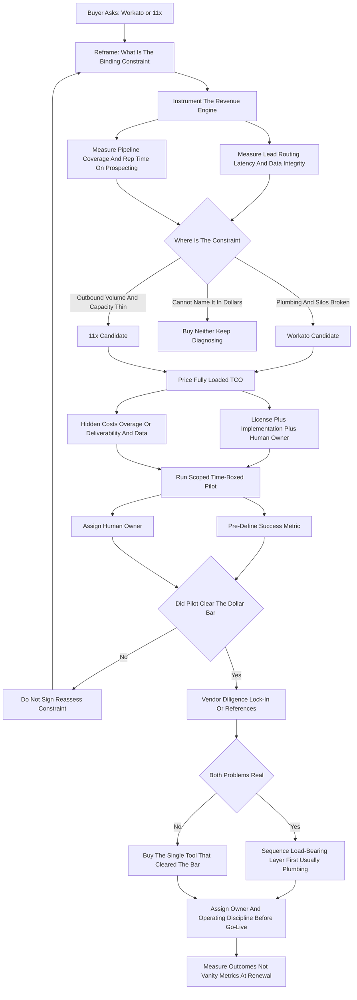
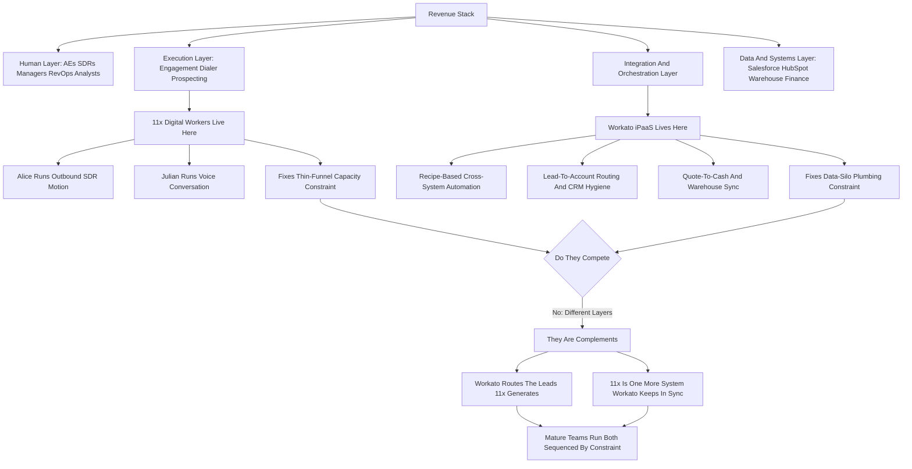

**TL;DR:** Workato and 11x are not competitors and the question "which should you buy" is itself the trap -- they sit in **different layers of the revenue stack** and most teams that are mature enough to be asking eventually run both. **Workato is an enterprise iPaaS** (integration platform-as-a-service): it connects Salesforce, HubSpot, Outreach, Snowflake, NetSuite, Workday, ServiceNow, and 1,200-plus other systems with recipe-based automations, and it is what you buy when your RevOps bottleneck is **data trapped in silos** -- leads not routing, accounts not syncing, the CRM and the finance system disagreeing, manual CSV exports holding the business together. **11x is an AI sales-execution layer** -- its digital workers "Alice" (SDR/outbound) and "Julian" (voice) run prospecting, research, personalized outreach, and conversation at machine scale, and it is what you buy when your bottleneck is **pipeline-generation capacity** -- not enough qualified meetings, reps spending sixty percent of the week on manual prospecting instead of selling. The honest 2027 framing: **buy Workato when the constraint is plumbing**; **buy 11x when the constraint is outbound volume**; **buy neither yet if you cannot articulate the constraint in a dollar figure.** Cost structures diverge sharply -- Workato is a six-figure annual platform commitment ($35K-$300K-plus depending on connector and task volume, often $1M-plus at true enterprise scale) sold on a multi-year contract with a real 8-16 week implementation; 11x is sold per digital worker / per seat-equivalent, roughly $5K-$25K per worker per year, live in days to a few weeks, and far easier to start and to kill. The decision-killers most buyers walk into: **(a) buying a platform to solve a process problem** -- automation amplifies a broken lead-routing rule instead of fixing it, and an AI SDR pours volume into a value proposition that does not land; **(b) underestimating the human cost** -- Workato needs an integration owner or partner, 11x needs deliverability hygiene, prompt and ICP tuning, and a human to handle replies, and neither is "set and forget"; and **(c) signing the long contract before the pilot proves the number** -- Workato's annual minimums and 11x's worker commitments both punish the buyer who skipped a scoped, time-boxed proof of value. Net: this is not Workato OR 11x. It is a sequencing decision -- diagnose the binding constraint, pilot the one tool that attacks it, prove the dollar number, and only then decide whether the other layer is the next investment or a distraction.

## What This Question Is Really Asking -- And Why The Framing Is Wrong

A buyer typing "Workato vs 11x -- which should you buy" has almost always been handed two demos in the same month and assumed, reasonably, that two tools pitched to the same RevOps leader must be substitutes. They are not. Workato is an integration and automation platform; 11x is an AI sales-execution platform. They overlap in exactly one narrow place -- both touch your CRM and both promise to "automate" -- and that surface similarity is the entire source of the confusion. The right question is not which to buy but **what is the binding constraint on your revenue engine right now**, because the answer to that question selects the tool, and if you cannot answer it, you should buy neither. The teams that waste money here are the ones that bought the tool that demoed best rather than the tool that attacked their actual bottleneck. A company drowning in disconnected systems does not need an AI SDR generating more leads to dump into a broken router; a company with clean plumbing but a thin top-of-funnel does not need another iPaaS recipe. The framing this guide insists on: name the constraint, price the constraint, then buy against the constraint -- and treat "Workato vs 11x" as a diagnostic prompt, not a menu.

## What Workato Actually Is

Workato is an enterprise integration platform-as-a-service -- an iPaaS. Its core unit is the "recipe," an automation that listens for a trigger in one system and performs actions in others: a new opportunity closes in Salesforce, so a recipe provisions the account in NetSuite, opens a project in Asana, posts to a Slack channel, and updates a Snowflake table. Workato ships connectors for over 1,200 applications -- Salesforce, HubSpot, Marketo, Outreach, Salesloft, ZoomInfo, NetSuite, Workday, ServiceNow, Snowflake, Jira, Slack, and the long tail of SaaS a real company runs -- plus HTTP and database connectors for everything else. It is the layer that makes a fragmented SaaS estate behave like one system. RevOps teams use it for lead-to-account matching and routing, CRM hygiene and deduplication, quote-to-cash orchestration, territory and quota syncs, and the dozens of cross-system workflows that otherwise live in a person's calendar as a recurring manual export. Workato sells to mid-market and enterprise, competes with MuleSoft, Boomi, Tray.ai, and Zapier (at the lighter end), and is governed like infrastructure -- environments, version control, role-based access, audit logs, error monitoring. It is bought by a buyer who has concluded that **the company's systems do not talk to each other and that gap is now costing real money.**

## What 11x Actually Is

11x sells "digital workers" -- AI agents built to do sales-development jobs end to end rather than to assist a human doing them. Its flagship worker, Alice, runs the outbound SDR motion: she sources prospects against an ideal-customer profile, enriches and researches each account, drafts personalized multi-channel outreach (email, LinkedIn), sequences it, and adapts based on engagement. A second worker, Julian, handles voice -- AI-driven calling and conversation. The pitch is capacity: a digital worker runs continuously, does not need ramp time, and executes the research-and-personalization grind that human SDRs do slowly and inconsistently. 11x integrates with the CRM and the engagement stack to log activity and hand qualified replies to humans. It rose fast on the "AI SDR" wave alongside competitors like Artisan, Qualified's Piper, Relevance AI's agents, and a crowd of newer entrants, and it has also drawn public scrutiny over churn and revenue claims -- which matters to a buyer and is treated honestly in the counter-case below. 11x is bought by a buyer who has concluded that **the top of the funnel is too thin and human prospecting capacity is the ceiling.**

## The Layer Diagram: Where Each Tool Lives In The Revenue Stack

Picture the revenue stack as layers. At the **data and systems layer** sit Salesforce, HubSpot, the marketing automation platform, the data warehouse, the finance system, the product database -- the systems of record. At the **integration and orchestration layer** sits the plumbing that moves data between those systems and triggers cross-system workflows -- this is Workato's home. At the **execution layer** sit the tools reps and the GTM team use to actually generate and work pipeline -- the engagement platform, the dialer, the prospecting tools -- and this is where 11x's digital workers operate. Above that sits the **human layer** -- AEs, SDRs, managers, RevOps analysts -- making judgment calls. Workato is horizontal infrastructure under the whole GTM motion; 11x is a vertical capability inside one slice of it (outbound). They can coexist trivially because they do not contend for the same job: Workato can be the plumbing that routes the leads 11x generates, and 11x can be one more execution system that Workato keeps in sync. Seeing the layers is the whole insight -- once a buyer draws this diagram, "which should I buy" resolves into "which layer is broken."

## The Core Decision Driver: Diagnose The Binding Constraint

Every revenue engine has one constraint that, relieved, unlocks the most growth -- and spending on any other part is motion without progress. The diagnostic is concrete. Ask: **when a good-fit lead enters the system, does it get to the right rep, fast, with full context, every time?** If the honest answer is no -- leads sit in a queue, route by a stale rule, arrive without firmographic context, or require someone to manually move them -- the constraint is in the integration layer and Workato is the candidate. Then ask: **do reps have enough qualified pipeline to hit quota, and are they spending their time selling rather than prospecting?** If the honest answer is no -- the funnel is thin, reps burn the majority of the week on list-building and research, outbound is inconsistent -- the constraint is in the execution layer and 11x is the candidate. A team can have both problems, but it almost always has one that is **more binding right now**, and that is the one to buy against first. The failure mode is buying against the constraint that demoed best or that the loudest stakeholder feels, rather than the one the funnel math actually identifies.

## Decision Driver Two: Time-To-Value And Reversibility

The two tools have very different risk profiles on the time axis, and a buyer should weigh this explicitly. Workato is a **slow-to-value, hard-to-reverse** commitment: a real implementation runs 8-16 weeks, involves discovery, connector authentication, recipe design, error-handling, UAT, and change management; it usually needs an integration owner or an implementation partner; and once dozens of recipes run the business, ripping it out is a project. 11x is a **fast-to-value, easier-to-reverse** commitment: a digital worker can be configured against an ICP and live in days to a few weeks, the proof shows up in weeks not quarters, and if it underperforms you can pause or cancel a worker far more cheaply than you can decommission an integration platform. This asymmetry has a practical consequence: when the constraint is genuinely ambiguous, the reversible, fast-feedback tool is the safer first probe -- but only if it actually maps to a real constraint. Reversibility is not a reason to buy the wrong layer; it is a tiebreaker when the layers are close.

## Decision Driver Three: Cost Structure And Who Signs The Check

The two tools are priced on different axes and that shapes both the number and the buyer. Workato prices on **connectors and task/transaction volume**, sold as an annual platform subscription with real minimums -- a focused mid-market deployment commonly lands in the tens of thousands per year, a broad deployment in the low-to-mid six figures, and a true enterprise estate with high task volume runs into seven figures. It is a multi-year contract, a procurement event, and often a budget line owned by RevOps or IT jointly. 11x prices on **digital workers** -- roughly a per-worker / seat-equivalent annual fee, commonly in the $5K-$25K-per-worker range with usage tiers -- a smaller initial check, a shorter or more flexible term, and a budget line that sales leadership can often approve without a full procurement cycle. The implication: Workato is a deliberate infrastructure investment that should clear an ROI bar before signing; 11x is a more experimental capacity buy that should still clear a pilot bar but is easier to start. Neither pricing model is "better" -- they reflect what the tools are -- but a buyer must price the **fully loaded** cost, including the human owner each one needs, not just the license.

## Workato Total Cost Of Ownership: The Honest Number

The Workato license is the visible cost and frequently not the largest one. The fully loaded picture: the **platform subscription** (tens of thousands to seven figures by scale); the **implementation** -- internal engineering time or a partner engagement, often $25K-$150K-plus for a serious initial build; the **ongoing integration owner** -- a RevOps engineer or platform admin who designs, monitors, and maintains recipes, a real fraction of a salaried role or a managed-service retainer; **connector and task overage** if volume grows past the contracted tier; and the **opportunity cost of governance** -- the reviews, testing, and change management that infrastructure correctly demands. A buyer who budgets only the license and discovers the owner cost six months in is the buyer who lets the platform decay into unmonitored recipes -- which is worse than not having it. The right way to underwrite Workato is against the **quantified cost of the silos it removes**: the analyst-hours of manual export, the revenue lost to slow or wrong lead routing, the errors from systems disagreeing. If that number is large and recurring, Workato's TCO is justified; if it is small, it is not.

## 11x Total Cost Of Ownership: The Honest Number

11x's per-worker fee is also not the whole cost. The fully loaded picture: the **worker subscription** itself; **email infrastructure and deliverability** -- domains, inboxes, warmup, monitoring, because an AI worker sending at volume will torch sender reputation without disciplined deliverability hygiene; **data and enrichment** -- the ICP and contact data the worker prospects against, sometimes bundled, sometimes a separate ZoomInfo/Apollo/Clay-type cost; the **human owner** -- someone tunes the ICP, reviews and approves messaging, handles the qualified replies the worker hands off, and watches the quality metrics, because a digital worker without a human owner produces volume without conversion; and the **brand risk cost** -- poorly targeted or obviously robotic outreach has a reputational price that does not show on an invoice. The right way to underwrite 11x is against the **quantified cost of the pipeline gap**: the meetings not booked, the SDR headcount you would otherwise hire and ramp, the AE time reclaimed from prospecting. If the funnel gap is real and the human owner exists, 11x's TCO is justified; if outbound is not actually the constraint, the spend produces noise.

## When Workato Is Clearly The Right Buy

There are buyer situations where Workato is unambiguously the answer and 11x is irrelevant. The CRM and the finance system disagree on the same accounts, and reconciliation is a recurring manual fire drill. Lead-to-account matching and routing is broken or hand-operated, and good leads decay in queues. The company runs a sprawling SaaS estate -- a dozen-plus systems -- held together by CSV exports and a few heroic analysts. Quote-to-cash spans Salesforce, a CPQ tool, NetSuite, and a billing system with manual handoffs between each. A merger or a re-platforming just doubled the systems that need to talk. RevOps reporting is unreliable because the data lands in the warehouse late, partial, or transformed inconsistently. In every one of these, the bottleneck is structural plumbing, the cost is paid in analyst hours and routing latency and data distrust, and an AI SDR would simply pour more volume onto the broken floor. This is the Workato buyer: the constraint is integration, the pain is silos, and the unlock is orchestration.

## When 11x Is Clearly The Right Buy

There are equally clear buyer situations where 11x is the answer and Workato is irrelevant. Reps are missing quota because pipeline coverage is thin -- not because of conversion, because of raw top-of-funnel volume. AEs spend the majority of the week building lists, researching accounts, and writing first-touch emails instead of running deals. The company wants to test new segments or geographies without hiring and ramping a full SDR pod for an unproven motion. SDR hiring is slow, expensive, and high-churn, and the team needs outbound capacity faster than recruiting can deliver it. Outbound is inconsistent -- it happens in bursts when someone has time, not as a continuous motion. The CRM and systems are reasonably clean (or clean enough), so the constraint genuinely sits in execution, not plumbing. In each case the bottleneck is prospecting capacity, the cost is paid in unbooked meetings and unramped headcount, and an integration platform would do nothing for it. This is the 11x buyer: the constraint is execution, the pain is a thin funnel, and the unlock is machine-scale outbound.

## Why Most Mature RevOps Teams End Up Running Both

Once a company is large enough to be seriously evaluating either tool, it usually has both problems -- they are just not equally binding at the same moment. A growth-stage company often hits the execution constraint first: it needs pipeline, hires SDRs or buys an AI SDR layer, and grows. Growth then exposes the integration constraint -- more systems, more volume, more handoffs -- and the plumbing that was "good enough" at twenty people breaks at a hundred. The sophisticated end state is layered: Workato as the orchestration substrate that routes leads, syncs accounts, and keeps the systems of record honest; 11x (or an AI SDR layer) as one execution capability generating top-of-funnel into that well-plumbed system. They are complements -- Workato can even be the integration that pipes 11x's activity and outcomes cleanly into Salesforce and the warehouse. The "vs" in the question is real only in the narrow sense of **sequencing under a finite budget this quarter** -- which layer to fund first -- not in the sense of a permanent either/or.

## The Maturity Curve: What Each Stage Actually Needs

The right answer to "Workato or 11x" changes with company stage, and a buyer should locate themselves on the curve before deciding. At the **early stage** -- a handful of GTM people, a single CRM, a few tools -- the company usually has neither problem at scale: the systems are few enough that native point-to-point integrations or a Zapier-class tool cover the plumbing, and the funnel constraint, if it exists, is better solved by founder-led selling and a first SDR than by a digital-worker layer the company cannot yet manage. At the **growth stage** -- a real sales team, quota pressure, expansion ambitions -- the execution constraint usually bites first: the company needs more pipeline than human prospecting can produce, and an AI SDR layer like 11x becomes a legitimate capacity buy, while the integration estate is still small enough to be tolerable. At the **scale stage** -- many systems, high volume, multiple teams, a real RevOps function -- the integration constraint becomes acute: the SaaS estate is sprawling, the manual exports are a liability, the routing is business-critical, and a Workato-class platform earns its TCO. At the **enterprise stage**, both run as permanent infrastructure, governed and owned. The mistake is buying for the stage you aspire to rather than the stage you are in: a growth-stage company buying enterprise iPaaS is buying plumbing for systems it does not yet have, and a scale-stage company still hand-routing leads has under-bought its integration layer for years.

## The Failure Stories: What Bad Buys Actually Look Like

Concrete failure patterns make the stakes tangible. **The amplified-mess buy:** a company with a broken lead-routing rule buys Workato, automates the broken rule, and now mis-routes leads faster and at scale -- the platform did exactly what it was told, and the problem got bigger. **The orphaned-platform buy:** a company buys Workato, builds forty recipes through whoever needed one, never assigns an owner, never sets up environments or monitoring, and within a year has a pile of fragile undocumented automations that break silently and that nobody will touch -- the license renews while the value quietly decays to zero. **The unmanaged-worker buy:** a company buys 11x, treats the digital worker as fully autonomous, nobody tunes the ICP or reviews the messaging or minds deliverability, and the worker sends high-volume low-fit outreach that torches the domain reputation and books almost no real meetings -- the activity dashboard looks busy and the pipeline does not move. **The wrong-layer buy:** a company with a genuinely broken CRM buys 11x to "generate more pipeline," pours digital-worker leads into the broken system, and cannot even measure whether the worker is good because the attribution data is corrupt -- it bought the second-priority tool first. **The category-theater buy:** leadership feels pressure to "have an AI strategy," buys 11x as a press-release line item, and the tool sits half-configured because no real constraint ever justified it. Every one of these is a process-and-ownership failure wearing a tool's name -- and every one was avoidable with diagnosis, a pilot, and an owner.

## Negotiation And Procurement: How To Buy Each One Well

Once the constraint is named and the pilot is planned, the buyer still has to negotiate, and the two tools reward different tactics. With **Workato**, the leverage points are term length, task/connector tier sizing, overage rates, and implementation scope. The buyer should size the initial tier to realistic near-term volume rather than aspirational volume -- it is easier to expand a tier than to recover spend on an oversized one -- and should negotiate overage rates explicitly, because volume growth is exactly when the vendor has pricing power. A multi-year term can earn a real discount, but only sign it after the pilot proves a workflow; the discount on a tool you end up not using is not a discount. With **11x**, the leverage points are worker count, term flexibility, usage tiers, and exit terms. Given the category's youth and the public scrutiny around the vendor, the buyer should resist the multi-worker multi-year commitment up front, start with one worker on the shortest reasonable term, negotiate a clean exit, and treat the early period as pilot-priced rather than locking in. In both cases the universal rule holds: the vendor's best price is offered for the longest commitment, and the buyer's best position is to earn that price only after a scoped pilot has converted uncertainty into a proven dollar number. A buyer who negotiates before piloting is negotiating blind.

## Data, Security, And Governance Considerations

Both tools cross sensitive boundaries, and a buyer who skips the security and governance review is buying a future incident. **Workato** moves data between systems of record -- customer data, financial data, employee data -- and that makes it a security review, not just a RevOps purchase: the buyer must understand where data is processed and stored, how credentials and connections are secured, what the access-control and audit model is, and how recipe changes are governed so a single bad edit cannot corrupt production data across many systems. **11x** touches customer and prospect data, sends communications on the company's behalf, and shares domain reputation with the rest of the business: the buyer must understand what data the worker ingests and stores, how it is used to train or tune, what the opt-out and compliance posture is for outbound (the relevant regional rules on commercial email and data), and who governs the messaging the worker sends in the company's name. The governance throughline for both: a tool that acts across systems or speaks to the market on your behalf needs an explicit owner, an explicit change-control practice, and an explicit boundary of what it is and is not allowed to do. Buyers who treat either tool as a pure RevOps convenience purchase, outside the security and governance process, are the buyers who discover the gap during an incident rather than during procurement.

## Sequencing Logic: Which To Buy First

Given a finite budget and both problems present, the sequencing rule is: **fix the layer whose breakage corrupts the other.** Broken plumbing corrupts execution -- if leads do not route and data is untrustworthy, then any pipeline an AI SDR generates lands in the same broken system and converts worse, and you cannot even measure the SDR layer's true performance because the attribution data is dirty. The reverse is less true -- a thin funnel does not corrupt your integrations. So when both are broken and you must choose, **Workato-class plumbing usually sequences first**, because it is the foundation the execution layer's results are measured on. The exception: if the plumbing is merely imperfect rather than broken, and the funnel is genuinely empty, then the execution layer sequences first because an empty funnel is an existential problem and an imperfect integration is a tolerable one. The sequencing question is "which breakage is load-bearing," and the answer is usually the integration layer -- but a buyer must check, not assume.

## The Pilot Design That De-Risks Either Decision

Neither tool should be bought on a demo; both should be bought on a scoped pilot that proves a dollar number. A **Workato pilot** picks one painful, well-bounded workflow -- lead-to-account routing, or one quote-to-cash handoff -- builds it, runs it for 4-8 weeks, and measures the specific metric it should move: routing latency, manual analyst hours eliminated, error rate. If that one recipe pays for a meaningful slice of the platform cost, the broader investment is underwritten. An **11x pilot** scopes one segment and one digital worker, runs it for 4-8 weeks with a human owner managing replies and quality, and measures qualified meetings booked, reply quality, deliverability health, and cost per qualified meeting versus the human-SDR baseline. If the worker produces qualified pipeline at an acceptable cost and quality, the capacity buy is underwritten. The discipline in both cases: **time-box it, define the success metric before starting, assign the human owner, and do not sign the long contract until the pilot clears the bar.** A vendor confident in the product will support a real pilot; resistance to a scoped pilot is itself information.

## The Lead-Routing Example: Same Symptom, Different Cause

A concrete scenario shows why diagnosis beats demo-shopping. A company notices its conversion from lead to meeting is poor. One reading: leads are entering the system but routing slowly and landing with the wrong reps without context -- a plumbing failure, and Workato is the fix. Another reading: leads are routing fine but there simply are not enough of them, and the few that exist are low-fit because nobody is running disciplined outbound -- an execution failure, and 11x is the fix. Same surface symptom -- weak lead-to-meeting conversion -- two completely different causes living in two different layers, fixed by two different tools. A buyer who shops demos buys whichever vendor tells the more compelling story; a buyer who instruments the funnel -- measures routing latency, lead volume, lead fit, time-to-first-touch -- sees which layer is actually failing and buys the tool that matches. The lesson generalizes: in this category, the symptom rarely names the cause, and the entire value of a disciplined evaluation is making the cause visible before the check is signed.

## Integration Reality: How They Actually Touch Your CRM

Both tools connect to Salesforce and HubSpot, but they touch the CRM in fundamentally different ways, and understanding this kills the "they overlap" confusion. Workato touches the CRM as an **orchestration system** -- it reads triggers (record created, field changed, stage advanced) and writes coordinated actions across many systems; it treats the CRM as one node in a graph it keeps consistent. 11x touches the CRM as an **execution system** -- it reads ICP and account context and writes back activity (emails sent, replies, meetings) so the funnel reflects what the digital worker did; it treats the CRM as the place its work is recorded and handed off. A buyer running both should think about who owns which fields and writes: Workato should own the cross-system sync and routing logic; 11x should own the outbound-activity records for its workers. Conflicts arise only if nobody designs the boundary -- two systems writing the same field. The fix is governance, not choosing one tool: a simple map of which platform is the system of action for which object and field.

## Build Versus Buy Versus Both

A buyer should also honestly consider the alternatives to buying either. Against **Workato**, the build-or-substitute options are: native point-to-point integrations (cheap until you have a dozen of them and a maintenance nightmare), a lighter tool like Zapier or Make for low-volume non-critical flows, a heavier enterprise iPaaS like MuleSoft or Boomi if you are already in that ecosystem, or custom engineering if you have the team and the flows are stable. Against **11x**, the options are: hiring and ramping human SDRs (slower, higher fixed cost, but full judgment and brand control), assembling a build-it-yourself stack of Clay plus an engagement platform plus an AI writer (more control, more assembly and maintenance), or a competing AI SDR product. The point of the build-vs-buy pass is not to talk yourself out of buying -- it is to make sure the bought tool is genuinely the best instrument for the constraint, and to know your walk-away alternative when you negotiate. A buyer with a credible BATNA buys better and negotiates better.

## The Stakeholder Map: Who Should Be In The Room

The two decisions pull in different stakeholders, and getting the room wrong produces the wrong buy. A **Workato decision** should include RevOps leadership, the integration or platform owner, IT/security (data flows across systems and that is a security review), the owners of the connected systems (the Salesforce admin, the finance-systems owner), and finance for the multi-year commitment. A **11x decision** should include sales leadership and the SDR/pipeline manager, RevOps (for CRM hygiene and attribution), marketing (brand voice and deliverability share the domain reputation), and whoever will be the human owner of the worker. The cross-cutting risk: a Workato decision made without the system owners produces recipes nobody trusts; an 11x decision made without marketing and RevOps produces outbound that damages domain reputation and pollutes the funnel with low-fit activity. The buyer's job is to assemble the room that can both judge the tool and own it afterward -- because a tool nobody owns is a tool that decays.

## Implementation And Adoption: Where Each One Goes Wrong

Each tool has a characteristic failure mode in implementation, and a buyer who knows it can pre-empt it. **Workato goes wrong** when it is treated as a tactical fix instead of governed infrastructure: recipes get built ad hoc by whoever needs one, with no environments, no version control, no error monitoring and no owner -- and within a year the platform is a pile of fragile, undocumented automations that break silently and that nobody dares to touch. The pre-empt: governance from day one, an owner, a recipe-review practice, monitoring. **11x goes wrong** when it is treated as fully autonomous instead of a managed worker: nobody tunes the ICP, nobody reviews the messaging, nobody minds deliverability, nobody works the replies fast -- and the worker generates high-volume, low-fit, reputation-damaging outreach that books few real meetings and annoys the market. The pre-empt: a human owner, messaging review, deliverability discipline, fast reply handling, and quality metrics watched as closely as volume. In both cases the tool is not the failure -- the absence of an owner and an operating discipline is.

## Measuring Whether It Worked: The Metrics That Matter

A buyer must define success metrics before buying, or the renewal becomes a vibe check. For **Workato**, the metrics are operational and financial: manual analyst hours eliminated, lead-routing latency (time from lead creation to assignment), data error and discrepancy rate between systems, percentage of cross-system workflows automated versus manual, and recipe uptime/error rate. The renewal question: are the silos measurably smaller and is the analyst time measurably reclaimed? For **11x**, the metrics are pipeline and quality: qualified meetings booked per worker, cost per qualified meeting versus the human-SDR baseline, reply rate and -- more importantly -- positive reply rate, deliverability health (bounce rate, spam-placement, domain reputation), and pipeline-to-close conversion of worker-sourced opportunities. The renewal question: is the worker producing qualified pipeline at an acceptable cost and quality, without damaging the brand or the domain? In both cases, vanity metrics (recipes built, emails sent) must be subordinated to outcome metrics (hours saved, qualified meetings) -- the buyer who renews on activity counts is the buyer who got sold.

## Risk And Vendor-Health Due Diligence

This category requires unusually careful vendor due diligence, and the buyer should do it before signing. For **Workato**, the diligence is mostly about lock-in and continuity: how portable are your recipes if you leave, what is the data-residency and security posture, how does pricing escalate as task volume grows, and what is the support and uptime track record -- it is becoming infrastructure, so treat it like infrastructure. For **11x**, the diligence is sharper because the AI-SDR category is young and turbulent: 11x specifically has faced public reporting questioning its revenue claims and customer churn, so a buyer should ask hard for verifiable reference customers in a similar segment, real retention data, and a clear-eyed account of where the product underperforms -- and should structure the contract (shorter term, pilot-gated, clear exit) to reflect category-level uncertainty. This is not a reason to avoid 11x; it is a reason to buy it the way you buy anything in a fast-moving category -- with a pilot, references, and an exit. The buyer's protection is process: scoped proof, honest references, contract terms that match the risk.

## The Decision Framework: A Structured Path To The Right Buy

Pulling it together into a sequence a buyer can actually run. **First, instrument and name the constraint:** measure lead routing latency and data-integrity pain on one side, and pipeline coverage and rep-time-on-prospecting on the other -- name which is more binding in a dollar figure. **Second, confirm the layer:** if the constraint is plumbing and silos, the candidate is Workato; if it is outbound volume and capacity, the candidate is 11x; if you cannot name it, buy neither and keep diagnosing. **Third, price the fully loaded TCO** -- license plus implementation plus the human owner plus the hidden costs (overage for Workato; deliverability and data for 11x) -- and underwrite it against the quantified cost of the constraint. **Fourth, run the scoped, time-boxed pilot** with a pre-defined success metric and an assigned owner; do not sign the long contract first. **Fifth, do the vendor diligence** -- lock-in and continuity for Workato, references and retention for 11x. **Sixth, decide and sequence:** buy the tool that cleared its pilot bar against the binding constraint; if both problems are real, sequence the load-bearing layer first (usually the plumbing) and put the other on the roadmap. **Seventh, assign the owner and the operating discipline before go-live** -- governance for Workato, a managed-worker discipline for 11x. Run this and "Workato vs 11x" stops being a coin flip and becomes a defensible, instrumented decision. Skip it -- buy the better demo, skip the pilot, sign the long deal, assign no owner -- and you will have spent six figures amplifying a problem you never actually diagnosed.

## The Reference-Check Script: Questions That Actually Surface Truth

A buyer should not skip references, and should not waste them on softball questions the vendor's curated referees will happily field. For a **Workato** reference, the questions that surface truth: how long was your real implementation versus what you were quoted; who owns the platform internally now and how much of their time does it take; what broke in the first year and how did you find out; how has your cost changed as task volume grew; and if you had to leave, how portable are your recipes. For an **11x** reference, the truth-surfacing questions are sharper: what is your actual cost per qualified meeting and how does it compare to your human SDRs; what happened to your deliverability and domain reputation in the first ninety days; how much human time does the worker actually require to run well; what percentage of the worker's "meetings" turned into real pipeline; and -- the one that matters most in this category -- are you still using it, and if a referee hesitates, that hesitation is the answer. The buyer should also ask both reference sets the same meta-question: what do you wish you had known before signing. References exist to convert the vendor's narrative into operator reality, and a buyer who only asks whether the referee "likes the tool" has wasted the call. In a young, scrutinized category especially, a verifiable, in-segment, currently-active reference is worth more than any demo.

## What Changes If You Already Own One Of Them

The decision looks different for a buyer who already runs one of these tools and is considering the other -- and the framing should shift accordingly. If you **already run Workato** and are evaluating 11x, the relevant questions are: is the execution layer now the binding constraint (the plumbing is handled, so is the funnel the ceiling), and how cleanly will 11x's activity pipe through your existing Workato recipes into the CRM and warehouse -- in fact, owning Workato is an advantage here, because the orchestration substrate to integrate a new execution tool already exists. If you **already run 11x** and are evaluating Workato, the relevant questions are: has growth exposed the integration constraint (more systems, more volume, more manual handoffs than the team can sustain), and is the data your digital worker depends on -- ICP, routing, activity sync -- starting to suffer from the same silo problems Workato exists to fix. The general principle: owning one of the two does not change the diagnosis discipline, but it does change the starting point -- you are no longer asking "which layer first" but "is the second layer now the binding constraint, and does owning the first make the second easier to adopt." Often it does: a well-plumbed company adopts an execution tool more cleanly, and a company with a proven execution motion has a clearer picture of exactly which integrations the plumbing layer must fix.

## The Honest Bottom Line For A 2027 Buyer

In 2027 the RevOps tool market is loud, the AI-SDR category especially so, and the pressure to "buy AI" or "buy automation" is real and not always rational. The disciplined buyer holds two ideas at once: these tools are genuinely useful when matched to a real constraint, and they are genuinely expensive mistakes when bought as category theater. Workato is the right buy for the company whose systems do not talk and whose people are the integration layer -- it is real infrastructure with a real TCO and a real owner requirement, and it pays back when the silos it removes were costing serious money. 11x is the right buy for the company whose funnel is thin and whose reps are buried in prospecting -- it is a real capacity layer with a real managed-worker requirement and a category that demands sharper diligence, and it pays back when the pipeline gap it fills was the binding constraint. Most mature teams will, over time, own both -- in different layers, sequenced by which breakage was load-bearing first. The buyer who wins is not the one who picks the "better" tool; there is no better tool because they are not the same kind of tool. The buyer who wins is the one who diagnoses the constraint, prices it, pilots against it, and buys -- in order -- the layer that was actually broken.

## The Diagnostic Journey: From Symptom To The Right Buy

## The Layer Map: Workato Vs 11x In The Revenue Stack

## Sources

1. **Workato -- Official Product Documentation And Platform Overview** -- Recipe model, connector library, environments, governance, and use-case documentation for the iPaaS platform. https://www.workato.com
2. **Workato Connector Library** -- Reference for the 1,200-plus application connectors including Salesforce, HubSpot, NetSuite, Snowflake, Workday, and ServiceNow. https://www.workato.com/integrations
3. **11x -- Official Site And Digital Worker Documentation** -- Product overview for the Alice (SDR/outbound) and Julian (voice) digital workers and their CRM and engagement-stack integrations. https://www.11x.ai
4. **Gartner -- Magic Quadrant And Market Guide For Integration Platform As A Service (iPaaS)** -- Independent analyst evaluation of the iPaaS category and vendor positioning. https://www.gartner.com
5. **Gartner -- Critical Capabilities For Enterprise Integration Platform As A Service** -- Capability-level comparison framework for iPaaS buyers.
6. **G2 -- Workato Reviews And iPaaS Category Grid** -- Aggregated buyer reviews, satisfaction data, and category comparison for integration platforms. https://www.g2.com
7. **G2 -- 11x And AI Sales Assistant / AI SDR Category** -- Aggregated buyer reviews and category context for AI sales-execution tools.
8. **MuleSoft (Salesforce) -- Anypoint Platform Documentation** -- Reference for the competing enterprise iPaaS commonly evaluated against Workato. https://www.mulesoft.com
9. **Boomi -- Integration Platform Documentation** -- Reference for the competing iPaaS in the Workato evaluation set. https://boomi.com
10. **Tray.ai -- Integration And Automation Platform** -- Reference for an adjacent iPaaS / automation competitor. https://tray.ai
11. **Zapier And Make -- Lightweight Automation Platforms** -- Reference for the lighter-weight automation tools that bound the low end of the Workato decision. https://zapier.com
12. **Artisan -- AI BDR / Sales Agent Platform** -- Reference for a directly competing AI SDR product in the 11x evaluation set. https://www.artisan.co
13. **Qualified -- Piper The AI SDR** -- Reference for a competing AI SDR capability often evaluated alongside 11x. https://www.qualified.com
14. **Clay -- GTM Data And Enrichment Platform** -- Reference for the build-it-yourself outbound-stack alternative to a packaged AI SDR. https://www.clay.com
15. **Salesforce -- CRM Platform And Sales Cloud Documentation** -- The primary system of record both tools integrate with; routing, object model, and API reference. https://www.salesforce.com
16. **HubSpot -- CRM And Sales Hub Documentation** -- The other primary CRM both tools integrate with. https://www.hubspot.com
17. **Outreach And Salesloft -- Sales Engagement Platform Documentation** -- The execution-layer engagement platforms 11x and similar tools operate alongside. https://www.outreach.io
18. **ZoomInfo And Apollo.io -- B2B Data And Prospecting Platforms** -- Reference for the data and enrichment layer that feeds AI SDR targeting. https://www.zoominfo.com
19. **TechCrunch -- Coverage Of 11x Revenue And Churn Reporting** -- Investigative and news coverage examining 11x's growth, revenue claims, and customer retention. https://techcrunch.com
20. **The Information -- Reporting On The AI SDR Category And 11x** -- Trade journalism on the AI sales-agent market dynamics and specific vendor scrutiny. https://www.theinformation.com
21. **Forrester -- Research On RevOps, Sales Technology, And AI In Go-To-Market** -- Analyst perspective on the RevOps stack and AI sales-execution adoption. https://www.forrester.com
22. **a16z / Bessemer -- State Of AI In Go-To-Market And SaaS Spend Benchmarks** -- Venture-firm research on AI GTM tooling adoption, pricing, and ROI patterns. https://a16z.com
23. **OpenView / SaaS Benchmarks -- Sales Efficiency And Pipeline Coverage Metrics** -- Reference benchmarks for pipeline-coverage ratios and SDR economics used in the constraint diagnostic.
24. **RevOps Co-op And Wizards Of Ops -- Practitioner Community Resources** -- Practitioner discussion of iPaaS adoption, lead routing, and AI SDR evaluation. https://www.revopscoop.com
25. **Pavilion -- GTM Leadership Community Benchmarks** -- Practitioner benchmarks on SDR ramp, cost, and outbound capacity planning. https://www.joinpavilion.com
26. **LeanData And Default -- Lead-To-Account Matching And Routing Tools** -- Reference for the routing-specific tools that bound part of the Workato use case. https://www.leandata.com
27. **Snowflake -- Data Cloud Documentation** -- The warehouse endpoint commonly orchestrated by Workato in RevOps reporting pipelines. https://www.snowflake.com
28. **NetSuite And Workday -- ERP And Finance System Documentation** -- The finance/ERP systems commonly involved in the quote-to-cash workflows Workato orchestrates.
29. **Email Deliverability Resources -- Google And Microsoft Bulk Sender Guidelines** -- Reference for the deliverability and domain-reputation discipline an AI SDR deployment requires. https://support.google.com
30. **Vendr And Tropic -- SaaS Buying And Negotiation Benchmark Data** -- Reference for SaaS contract structures, pricing benchmarks, and pilot-gated negotiation practices. https://www.vendr.com
31. **Workato -- Customer Case Studies And ROI Documentation** -- Vendor-published deployment outcomes used to sanity-check the analyst-hours-eliminated and routing-latency ROI framing. https://www.workato.com/customers
32. **Crunchbase / PitchBook -- Workato And 11x Funding And Valuation Profiles** -- Reference for company funding rounds, investors, and valuation context for both vendors. https://www.crunchbase.com
33. **CAN-SPAM Act And GDPR -- Commercial Email And Data Compliance Guidance** -- Regulatory reference for the outbound-compliance posture an AI SDR deployment must satisfy. https://www.ftc.gov/business-guidance/resources/can-spam-act-compliance-guide-business
34. **Reddit r/RevOps And r/sales -- Practitioner Threads On iPaaS And AI SDR Buys** -- Unfiltered practitioner accounts of Workato implementations and AI SDR pilot outcomes, including failure modes.
35. **The Bridge Group -- SDR Metrics And Compensation Research** -- Independent benchmark data on SDR ramp time, fully loaded cost, and quota attainment used as the human-SDR baseline for the 11x cost comparison. https://www.bridgegroupinc.com

## Numbers

**Platform Positioning At A Glance**

| Dimension | Workato | 11x |
|---|---|---|
| Category | Enterprise iPaaS (integration/automation) | AI sales-execution (digital workers) |
| Core unit | Recipe (trigger-action automation) | Digital worker (Alice / Julian) |
| Layer in stack | Integration & orchestration | Execution (outbound) |
| Primary constraint it solves | Data silos, broken routing, manual syncs | Thin funnel, prospecting capacity ceiling |
| Connector / system breadth | 1,200+ app connectors | CRM + engagement stack integrations |
| Typical buyer | RevOps + IT jointly | Sales leadership + RevOps |

**Cost Structure Comparison**

| Cost element | Workato | 11x |
|---|---|---|
| Pricing axis | Connectors + task/transaction volume | Per digital worker / seat-equivalent |
| Typical annual license | $35K-$300K+ (7 figures at enterprise scale) | ~$5K-$25K per worker, usage tiers |
| Contract term | Multi-year, procurement event | Shorter / more flexible |
| Implementation | $25K-$150K+, 8-16 weeks | Days to a few weeks |
| Required human owner | Integration owner / platform admin | Worker owner: ICP tuning, reply handling |
| Hidden costs | Connector/task overage, governance overhead | Email infra & deliverability, data/enrichment |
| Reversibility | Hard (decommissioning is a project) | Easier (pause or cancel a worker) |

**Time-To-Value And Pilot Design**

| Stage | Workato | 11x |
|---|---|---|
| Pilot scope | One bounded workflow (routing, one Q2C handoff) | One segment, one digital worker |
| Pilot duration | 4-8 weeks | 4-8 weeks |
| Primary pilot metric | Routing latency / analyst hours eliminated / error rate | Qualified meetings, cost per qualified meeting vs SDR baseline |
| Time to first value | Weeks to a quarter | Days to weeks |
| Full deployment | 8-16 weeks | 1-4 weeks per worker |

**Workato Fully-Loaded TCO Components**
- Platform subscription: tens of thousands to seven figures by scale
- Initial implementation (internal eng or partner): $25,000-$150,000+
- Ongoing integration owner: meaningful fraction of a salaried role or managed-service retainer
- Connector/task overage: variable, triggered by volume growth past tier
- Governance overhead: recipe review, testing, change management

**11x Fully-Loaded TCO Components**
- Worker subscription: ~$5,000-$25,000 per worker per year
- Email infrastructure & deliverability: domains, inboxes, warmup, monitoring
- Data & enrichment: ICP/contact data (sometimes bundled, sometimes separate)
- Human owner: ICP tuning, messaging review, reply handling, quality monitoring
- Brand-risk cost: reputational price of poor targeting (off-invoice)

**The Constraint Diagnostic (Buy-Against-This)**
- Workato signal: lead routing latency high, leads land without context, systems disagree, SaaS estate held together by CSV exports, quote-to-cash has manual handoffs
- 11x signal: pipeline coverage thin, AEs spend majority of week prospecting, outbound inconsistent, SDR hiring slow/expensive/high-churn, systems already reasonably clean

**Sequencing Rule When Both Problems Are Real**
- Broken plumbing corrupts execution (dirty data makes SDR results unmeasurable) -> integration layer usually sequences first
- Empty funnel does not corrupt integrations -> but an existentially empty funnel can sequence first if plumbing is merely imperfect
- Decision test: which breakage is load-bearing for measuring the other

**Success Metrics At Renewal**

| | Workato | 11x |
|---|---|---|
| Outcome metric 1 | Manual analyst hours eliminated | Qualified meetings booked per worker |
| Outcome metric 2 | Lead-routing latency reduced | Cost per qualified meeting vs SDR baseline |
| Outcome metric 3 | Cross-system data error rate | Positive reply rate (not just reply rate) |
| Health metric | Recipe uptime / error rate | Deliverability: bounce rate, domain reputation |
| Vanity metric to ignore | Recipes built | Emails sent |

**Vendor Diligence Focus**
- Workato: recipe portability/lock-in, data residency & security, pricing escalation with volume, support/uptime track record
- 11x: verifiable reference customers in-segment, real retention data, honest underperformance account, contract exit terms (category is young and has faced public revenue/churn scrutiny)

## Counter-Case: Why The Honest Answer Is Often "Neither, Not Yet"

The body of this guide explains how to choose between Workato and 11x. The counter-case stress-tests the premise itself, because a disciplined buyer should be willing to walk away from both.

**Counter 1 -- The question itself is usually a symptom of not having done the diagnosis.** A buyer comparing an iPaaS to an AI SDR is comparing a wrench to a drill because both were in the same demo week. If you cannot say, in a dollar figure, what the binding constraint on your revenue engine is, you are not ready to buy either tool -- and buying one anyway means you are letting a vendor's sales narrative substitute for your own diagnosis.

**Counter 2 -- Automation amplifies whatever it is pointed at, including dysfunction.** Workato will faithfully automate a broken lead-routing rule and now the bad routing happens faster and at scale. 11x will faithfully execute outbound for a value proposition that does not land and now the market hears a weak message at machine volume. Neither tool fixes a process or a positioning problem; both make a broken one bigger. The prerequisite to buying either is a process that is actually worth amplifying.

**Counter 3 -- The human-owner cost is real and frequently un-budgeted.** Workato without an integration owner decays into a pile of fragile, unmonitored recipes within a year. 11x without a human owner tuning ICP, reviewing messaging, minding deliverability, and working replies produces high-volume low-fit outreach that books few meetings and annoys the market. A buyer who budgets the license but not the owner has not actually budgeted the tool.

**Counter 4 -- Workato is a slow, expensive, hard-to-reverse infrastructure commitment.** It is 8-16 weeks to real value, a multi-year contract, a procurement event, and a decommissioning project if you leave. For a company whose silos are annoying but not actually costing serious money, that TCO is not justified -- a few native integrations or a lighter tool may be the right answer, and Workato would be over-buying.

**Counter 5 -- The AI SDR category, and 11x specifically, carries category-level uncertainty.** The AI SDR space is young, crowded, and turbulent, and 11x has faced public reporting questioning its revenue claims and customer churn. That is not a verdict on the product, but it is a reason a buyer must demand verifiable in-segment references, real retention data, and contract terms (short, pilot-gated, clear exit) that price the uncertainty in -- and a reason some buyers will rationally wait.

**Counter 6 -- AI-generated outbound has a brand and deliverability cost that does not show on the invoice.** A digital worker sending at volume can torch domain reputation without disciplined deliverability hygiene, and obviously robotic or poorly targeted outreach has a reputational price. For a brand-sensitive company in a small, tight market, machine-scale outbound can do durable damage that dwarfs the license cost.

**Counter 7 -- Both tools can be a way to avoid fixing the actual problem.** Sometimes the real issue is that the value proposition is weak, the ICP is wrong, the territory design is incoherent, or the comp plan points reps the wrong way. Buying Workato or 11x to "do something" lets leadership feel like they acted while the load-bearing problem -- strategy, positioning, org design -- goes untouched.

**Counter 8 -- The build/substitute alternatives are often good enough.** Against Workato: native integrations, Zapier/Make for low-volume flows, or custom engineering. Against 11x: hiring SDRs, or assembling a Clay-plus-engagement-platform stack. The bought tool should win on the merits against its real alternative -- a buyer who never priced the alternative does not actually know if they are buying the right thing.

**Counter 9 -- Procurement timing can be a trap.** Both vendors will push the longer contract for the better price. A buyer who signs the multi-year Workato deal or the multi-worker 11x commitment before a scoped pilot has proven the dollar number has converted a manageable experiment into a locked-in bet -- and in a fast-moving category, locked-in is exactly what you do not want to be.

**Counter 10 -- Maturity mismatch cuts both ways.** A very early company evaluating Workato probably does not yet have enough systems or volume to justify an iPaaS -- it is buying infrastructure for a problem it does not have yet. A company evaluating 11x while its CRM is genuinely broken is buying an execution layer whose results it cannot even measure -- it is buying the second-priority tool first.

**Counter 11 -- Vanity metrics will make a bad buy look fine at renewal.** Workato makes it trivial to count recipes built; 11x makes it trivial to count emails sent. Both numbers go up reliably whether or not the tool moved the business, and a buyer who never defined the outcome metric before signing will face a renewal decision armed only with activity dashboards that the vendor's customer-success team has carefully curated. The counter-pressure is to write the dollar-denominated success metric down before the contract, not after -- because once the activity dashboard exists, it becomes the path of least resistance to a renewal nobody can actually defend.

**Counter 12 -- The category itself may reprice or reshape under you.** Both layers are moving fast: CRM platforms are absorbing more native automation and more native AI outreach every release, the AI SDR category is consolidating and re-pricing, and what is a standalone purchase in 2027 may be a bundled feature of Salesforce or HubSpot within a couple of years. A buyer who signs a long, inflexible commitment in a category that is actively being eaten by the platforms beneath it has taken on timing risk that has nothing to do with whether the tool works today -- and that risk is a legitimate reason to favor shorter terms, pilot-gated expansion, and a willingness to revisit the whole decision annually.

**The honest verdict.** Buy Workato if -- and only if -- your systems demonstrably do not talk, the silos cost real recurring money, you have or will fund an integration owner, and a scoped pilot proved one workflow's value. Buy 11x if -- and only if -- your funnel is genuinely thin, prospecting capacity is the measured ceiling, your CRM is clean enough to measure results, you have a human owner for the worker, you have done the vendor diligence, and a scoped pilot cleared the cost-per-qualified-meeting bar. Buy both -- sequenced -- if both constraints are real, starting with the load-bearing layer. And buy neither, yet, if you cannot name the constraint in dollars, if the real problem is strategy or positioning, if you have not budgeted the human owner, or if you are being rushed into a long contract before a pilot. The most expensive outcome in this category is not picking the "wrong" one of two tools -- it is buying either one to avoid the harder work of diagnosis.

## Related Pulse Library Entries

- **q9501** -- The senior-tech-workshop business diagnostic case (the discipline of naming the binding constraint before acting -- the same logic this entry applies to tool buying).
- **q9502** -- Scaling past the single-operator ceiling (constraint-sequencing under a finite budget, the same sequencing logic as Workato-vs-11x).
- **q1873** -- Salesforce vs HubSpot: which CRM should you buy? (The systems of record both Workato and 11x integrate with.)
- **q1874** -- Outreach vs Salesloft: which sales engagement platform should you buy? (The execution-layer engagement platforms 11x operates alongside.)
- **q1875** -- MuleSoft vs Boomi vs Workato: which iPaaS should you buy? (Deeper head-to-head inside the integration layer.)
- **q1876** -- Artisan vs 11x vs Qualified Piper: which AI SDR should you buy? (Deeper head-to-head inside the AI sales-execution layer.)
- **q1877** -- Zapier vs Make vs Workato: when do you outgrow lightweight automation? (The low-end alternative that bounds the Workato decision.)
- **q1878** -- ZoomInfo vs Apollo vs Clay: which B2B data platform should you buy? (The data and enrichment layer that feeds AI SDR targeting.)
- **q1879** -- How do you build a RevOps function from scratch? (The team that owns both of these tools and the constraint diagnosis.)
- **q1880** -- What is the modern revenue stack in 2027? (The full layer map this entry's "vs" question sits inside.)
- **q1881** -- How do you run a SaaS pilot / proof of value that actually de-risks the buy? (The scoped-pilot discipline this entry insists on for both tools.)
- **q1882** -- Build vs buy: when should you build GTM tooling in-house? (The build/substitute alternatives to both Workato and 11x.)
- **q1883** -- How do you measure RevOps ROI? (The outcome-metric framework for underwriting either purchase.)
- **q1884** -- What is lead-to-account matching and routing, and why does it break? (The canonical Workato use case explained in depth.)
- **q1885** -- What is an AI SDR and what can it actually do in 2027? (The 11x category explained in depth.)
- **q1886** -- How do you protect email deliverability when sending at scale? (The hidden 11x cost and discipline.)
- **q1887** -- How do you negotiate a multi-year SaaS contract? (Procurement discipline for the Workato-class commitment.)
- **q1888** -- Quote-to-cash: how do you orchestrate it across Salesforce, CPQ, and finance? (A core Workato workflow in depth.)
- **q1889** -- SDR economics: ramp, cost, and quota in 2027 (The human-SDR baseline an 11x buy is measured against.)
- **q1890** -- How do you do vendor due diligence on an early-stage SaaS company? (The diligence discipline the 11x buy specifically requires.)
- **q9601** -- How do you start a fractional CFO business in 2027? (The financial-underwriting discipline applied to tooling spend.)
- **q9701** -- What is the best inventory and rental management software in 2027? (A parallel "which tool should you buy" diagnostic-led evaluation.)
- **q9702** -- How do you build standard operating procedures for a service business? (The operating discipline that makes either tool not decay.)
- **q9801** -- What is the future of the RevOps and GTM tooling market in 2030? (Long-term outlook for the category both tools sit in.)
- **q9802** -- How do you diagnose the binding constraint on a revenue engine? (The core diagnostic skill this entire Workato-vs-11x decision depends on.)

