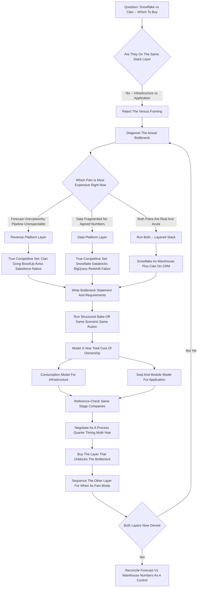
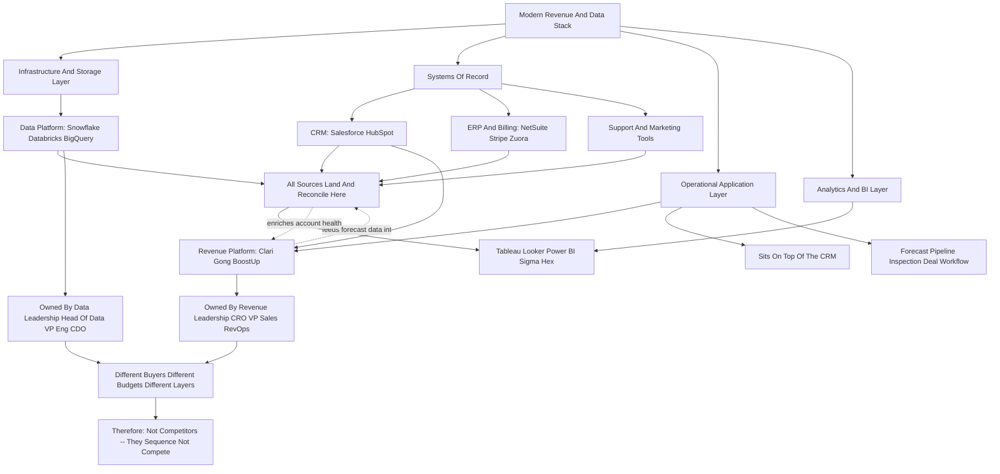

**TL;DR:** "Snowflake vs Clari -- which should you buy?" is a **category error disguised as a comparison**, and the most useful answer is to refuse the framing. **Snowflake** is a cloud data platform -- a warehouse and compute layer where you store and query all of your company's data; it ran roughly **$3.6B in product revenue in FY2025**, ~745 customers over $1M in annual product revenue, and a net revenue retention around 126-127%. **Clari** is a revenue platform -- forecasting, pipeline inspection, and revenue orchestration sitting on top of your CRM; it crossed an estimated **$150M+ in ARR** and was valued near **$2.6B** at its 2022 raise. They do not compete. One is infrastructure that every other tool eventually reads from; the other is a workflow application your RevOps and sales leadership live in. A company almost never chooses **between** them -- a mature data-and-revenue stack frequently runs **both**, with Clari forecasting on CRM data and Snowflake holding the warehouse that Clari, the CRM, the product telemetry, and the BI layer all ultimately reconcile against. The real decision a buyer faces is **sequencing and budget under constraint**: if you are a Series A-B company with a messy pipeline and no trustworthy forecast, you buy the **revenue platform** (Clari, or Gong Forecast, or BoostUp, or a Salesforce-native option) first, because the bottleneck is forecast accuracy and rep behavior, not data infrastructure. If you are a scaling company drowning in disconnected data sources -- product usage, billing, support, marketing, finance -- and every team argues about whose numbers are right, you buy the **data platform** (Snowflake, or Databricks, or BigQuery) first, because the bottleneck is a single source of truth. The honest operator's answer: **diagnose the actual bottleneck, buy the layer that unblocks it, sequence the other, and never let a vendor's sales motion convince you that an infrastructure decision and an application decision are the same purchase.** This guide treats the question as what it really is -- a lesson in how to run a B2B software evaluation, build a coherent revenue-and-data stack, and avoid the most expensive mistakes in enterprise SaaS buying.

## Why "Snowflake vs Clari" Is The Wrong Question -- And What The Right One Is

The phrase "Snowflake vs Clari -- which should you buy?" gets typed into search bars and dropped into Slack channels constantly, and almost every time it is asked, the asker has already made a subtle mistake: they have assumed the two products occupy the same shelf. They do not. Snowflake is a cloud data platform -- a place to land, store, transform, and query data at scale, the warehouse layer of a modern data stack. Clari is a revenue platform -- an application that sits on top of a CRM and helps sales and revenue teams forecast, inspect pipeline, and run deal and account workflows. Comparing them is like asking "should I buy a foundation or a kitchen?" Both are part of a finished house, they cost money, and a contractor will happily sell you either -- but they are not substitutes, they are different floors of the same building. The reason the question persists anyway is instructive. Buyers conflate them because both show up in the same budget conversations, both get pitched to revenue and operations leaders, both promise "better visibility into the business," and both vendors use the language of insight, intelligence, and growth. The marketing rhymes even though the products do not. So the genuinely useful response is not to pick a winner -- it is to re-pose the question. The right question is: **what is the actual bottleneck in my revenue-and-data operation right now, and which layer of the stack relieves it?** Once a buyer asks that, the false binary dissolves and a real decision appears. This guide answers the literal question (the two companies, side by side, honestly) and then does the more valuable thing: it teaches the evaluation discipline that makes "vs" questions answerable -- diagnosing bottlenecks, mapping the stack, sequencing purchases, and running a procurement process that does not get captured by whichever vendor has the better sales team.

## What Snowflake Actually Is: The Data Platform Layer

Snowflake is a cloud-native data platform. Strip away the marketing and it does a specific job: it gives a company one place to store enormous volumes of structured and semi-structured data, and a fast, elastic engine to query and transform that data, with storage and compute separated so they scale and bill independently. A company pipes data into Snowflake from everywhere -- the CRM (Salesforce, HubSpot), the product itself (event and usage telemetry), the billing system (Stripe, Zuora, NetSuite), the support tool (Zendesk, Intercom), marketing automation (Marketo, HubSpot), the data warehouse's upstream ELT tools (Fivetran, Airbyte, dbt) -- and then analysts, data scientists, and BI tools (Tableau, Looker, Power BI, Sigma, Hex) query it. Snowflake is the layer where "the numbers" are supposed to finally agree. Its commercial scale is large and worth stating plainly: Snowflake reported roughly $3.6B in product revenue for fiscal year 2025, with around 745 customers contributing more than $1M each in trailing-twelve-month product revenue, and a net revenue retention rate in the mid-120s percent. It went public in 2020 in one of the largest software IPOs ever. The point of those numbers is not to be impressed -- it is to understand what kind of vendor you are dealing with: Snowflake is core infrastructure, sold to data and engineering organizations, priced on consumption (credits for compute, plus storage), and once it is in, nearly every other analytical tool in the company reads from it. It is sticky because it is foundational. You do not "use Snowflake" the way a sales rep uses a forecasting tool; you build on Snowflake the way a city builds on a power grid.

## What Clari Actually Is: The Revenue Platform Layer

Clari is a revenue platform. Its job is also specific: it connects to a company's CRM and other revenue signals and helps the go-to-market organization run the revenue process -- forecast the quarter, inspect the pipeline, catch deals that are slipping, see which accounts are at risk, and give sales leadership and RevOps a defensible, repeatable forecasting cadence instead of a spreadsheet that three people maintain by hand. Clari pulls activity data, CRM fields, and engagement signals, applies models and rollup logic, and produces forecasts and pipeline views that a VP of Sales can actually run a Monday forecast call against. Clari was founded in 2012, raised a Series F in 2022 at a valuation reported around $2.6B, and has been estimated to run north of $150M in annual recurring revenue. It serves go-to-market teams -- CROs, VPs of Sales, RevOps, sales managers -- and it is priced as a per-seat or per-user SaaS application, typically landing in the tens of thousands to low hundreds of thousands of dollars per year depending on seat count and modules. The crucial thing to understand about Clari is where it sits: it is an **application on top of the CRM**, not infrastructure underneath the company. It does not replace Salesforce; it makes Salesforce data usable for forecasting and inspection. It competes with other revenue platforms -- Gong's forecasting product, BoostUp, Aviso, InsightSquared (now part of Mediafly), Salesforce's own forecasting and Revenue Intelligence features, and a long tail of pipeline tools. It does not compete with a data warehouse. A company "uses Clari" the way a sales org uses a workflow tool -- daily, in meetings, as part of a process.

## The Stack Map: Where Each Tool Lives And Why That Settles The Argument

The fastest way to end the "vs" confusion is to draw the stack. At the bottom sits **infrastructure and storage** -- the data platform, Snowflake or Databricks or BigQuery -- where all data lands and reconciles. Feeding it is the **ingestion and transformation layer** -- Fivetran, Airbyte, dbt -- that moves and shapes data. Above the warehouse sits the **analytics and BI layer** -- Tableau, Looker, Power BI, Sigma, Hex -- where analysts build dashboards and reports. Alongside all of that sit the **systems of record** -- the CRM (Salesforce, HubSpot), the ERP/billing system (NetSuite, Stripe, Zuora), the support and marketing tools -- which both feed the warehouse and run day-to-day operations. And on top of the CRM specifically sit the **operational applications** that a function lives in -- and this is where Clari lives, in the revenue-operations application layer, next to tools like Gong, Outreach, Salesloft, and the CRM's native intelligence features. Snowflake is a floor. Clari is a room on an upper floor. They are connected -- Clari's forecasts and Snowflake's warehouse data should ultimately reconcile, and many companies pipe Clari or CRM data into Snowflake for deeper analysis -- but they are not the same purchase, not the same buyer, not the same budget line in a well-run company, and not substitutes under any circumstance. Once a buyer can place a tool on this map, the question "A vs B" becomes answerable: tools on the same layer compete; tools on different layers sequence. Snowflake and Clari are on different layers. Therefore they sequence -- the only real question is which one first, and that depends entirely on the bottleneck.

## The Real Decision: Diagnose The Bottleneck Before You Diagnose The Vendor

Every good B2B software decision starts with a bottleneck diagnosis, not a vendor comparison. The question is never "which tool is better" in the abstract -- it is "which constraint is currently costing me the most, and which purchase relieves it." For a revenue-and-data stack, the two candidate bottlenecks map almost exactly onto the two products in the question. **Bottleneck A: the forecast and the pipeline are untrustworthy.** Symptoms -- the forecast is a spreadsheet maintained by RevOps and the CRO disagree on the number; deals slip without warning; nobody can answer "what changed since last week" in pipeline; the board gets surprised; reps update Salesforce inconsistently and managers cannot inspect it. If this is the pain, the bottleneck is in the **revenue application layer**, and the purchase that relieves it is a revenue platform -- Clari or a competitor. Buying a data warehouse will not fix a Monday forecast call. **Bottleneck B: the data is fragmented and nobody trusts any number.** Symptoms -- product usage lives in one place, billing in another, CRM in a third, support in a fourth; every team builds its own metrics and they never match; analysts spend their week reconciling exports; "what is our net revenue retention" takes a week to answer and the answer is contested. If this is the pain, the bottleneck is in the **data infrastructure layer**, and the purchase that relieves it is a data platform -- Snowflake or a competitor. Buying a forecasting tool will not fix an organization-wide source-of-truth problem. The discipline: write down the three most expensive symptoms in the business right now. They will cluster. Buy for the cluster. The vendor comparison comes after the bottleneck diagnosis, never before.

## A Decision Framework: When To Buy The Revenue Platform First

A buyer should reach for the revenue platform (Clari or an equivalent) first when the company's pain is concentrated in the go-to-market motion rather than in data infrastructure. The clearest signals: the company is post-Series-A with a real sales team (say, 8+ quota-carrying reps and at least a couple of sales managers), revenue is the thing the board is most anxious about, and the forecast is currently produced by heroics -- a RevOps analyst, a giant spreadsheet, and a prayer. In that situation the cost of the bottleneck is enormous and immediate: a missed forecast erodes board trust, triggers bad hiring and spending decisions, and is genuinely existential for a venture-backed company. A revenue platform attacks that pain directly -- it gives a repeatable forecast cadence, makes pipeline inspectable, surfaces slipping deals early, and reduces the dependence on one analyst's spreadsheet. The data-infrastructure pain, at that stage, is usually still tolerable: the company has fewer data sources, the CRM plus a billing tool plus product analytics can be reconciled manually or with a lightweight BI tool, and a full warehouse would be expensive infrastructure for a problem the company does not yet acutely have. So the sequencing logic is: **at Series A-C, with a real sales org and an untrustworthy forecast, buy the revenue platform first; defer the warehouse until data fragmentation becomes the dominant pain.** The mistake to avoid here is the reverse -- a sales-led company buying a Snowflake-centric modern data stack because it feels sophisticated, while the forecast it actually runs the business on stays a spreadsheet.

## A Decision Framework: When To Buy The Data Platform First

The buyer should reach for the data platform (Snowflake or an equivalent) first when the dominant pain is fragmentation and disagreement about basic numbers across the whole company -- not just in sales. The signals: the company has crossed into scaling mode (often Series B and beyond, or a PLG company with serious product-telemetry volume), data now lives in many systems -- product events, billing, CRM, support, marketing, finance -- and the teams that depend on those numbers no longer agree on them. Finance's revenue number does not match RevOps's. The product team's "active users" does not match what marketing reports. Every cross-functional metric -- net revenue retention, CAC payback, gross margin by segment, expansion rate -- takes days to assemble and gets argued about when it lands. That is an infrastructure bottleneck, and a revenue platform cannot touch it, because a revenue platform only sees the CRM-and-engagement slice of the world. A data platform attacks it directly: one warehouse, one place where all sources land, one set of modeled and governed metrics that every BI tool and every team reads from. So the sequencing logic is: **at scaling stage, with many data sources and organization-wide disagreement about numbers, buy the data platform first; layer specialized applications like a revenue platform on top once the source of truth exists.** The mistake to avoid here is the reverse -- a data-fragmented company buying point solution after point solution, each with its own definition of the truth, deepening the fragmentation it should be solving.

## Why Mature Companies Run Both -- And How They Connect

The reason "vs" is the wrong word becomes obvious at scale: most companies that are large enough to seriously evaluate either tool end up running both, because they solve different problems and they reinforce each other. A mature SaaS company at, say, $80M-$300M ARR typically has: a data platform (Snowflake) as the warehouse where the CRM, product telemetry, billing, support, and marketing all land; a BI layer on top for analysts and executives; the CRM (Salesforce) as the system of record for the sales process; and a revenue platform (Clari) on top of the CRM so the go-to-market org can forecast and inspect pipeline. These are not redundant -- they are a layered system. And they connect in specific ways. Clari's forecast and the warehouse's revenue model should reconcile -- if Clari says the quarter lands at $24M and the Snowflake-fed finance model says $21M, that gap is a finding, and discovering it is a feature of having both. Many companies pipe Clari's data, or the underlying CRM data Clari structures, into Snowflake for deeper longitudinal analysis -- win-rate trends, segment-level pipeline conversion, the analyses a forecasting application is not built to run. And the warehouse feeds context back: product-usage and billing signals modeled in Snowflake can enrich the account health that the revenue team inspects. The healthy mental model is not "Snowflake or Clari." It is "Snowflake **and** Clari, connected, each doing the job the other cannot, with reconciliation between them as a deliberate control." The only real question a buyer with budget for one-but-not-yet-both faces is sequencing -- and that, again, is settled by the bottleneck.

## The Snowflake Competitive Set: What It Actually Competes With

If the genuine decision is "I have a data-infrastructure bottleneck, which data platform do I buy," then the real comparison set is not Clari -- it is the other data platforms. **Databricks** is the closest peer and the most common true competitor: a lakehouse platform strong in data science, machine learning, and large-scale data engineering, increasingly overlapping with Snowflake on warehousing and analytics; the rough rule of thumb is that data-science-and-ML-heavy organizations lean Databricks while SQL-analytics-and-BI-heavy organizations lean Snowflake, though both are converging. **Google BigQuery** is the serverless data warehouse for companies already deep in Google Cloud, with a simple consumption model and strong analytics. **Amazon Redshift** is the AWS-native warehouse, often the default for companies heavily invested in AWS. **Microsoft Fabric / Azure Synapse** is the Microsoft-ecosystem answer, attractive to companies standardized on Azure and Power BI. **ClickHouse** and similar engines compete on real-time and high-performance analytical workloads. The evaluation among these turns on cloud alignment, workload type (SQL analytics vs ML vs real-time), consumption-cost behavior under your actual query patterns, ecosystem and connector fit, and governance and data-sharing needs. The point for this guide: when a buyer correctly identifies that they have a data-platform decision, "Snowflake vs Clari" was never the comparison -- "Snowflake vs Databricks vs BigQuery vs Redshift vs Fabric" is.

## The Clari Competitive Set: What It Actually Competes With

Symmetrically, if the genuine decision is "I have a forecasting-and-pipeline bottleneck, which revenue platform do I buy," the real comparison set is not Snowflake -- it is the other revenue platforms. **Gong** is the most prominent overlapping competitor: it started in conversation intelligence (recording and analyzing sales calls) and expanded into forecasting and a broader revenue platform, so Gong-vs-Clari is a real and common bake-off. **BoostUp** is a revenue-intelligence and forecasting platform competing directly on forecast accuracy and pipeline inspection. **Aviso** is an AI-centric forecasting and revenue-operations platform. **Mediafly (which absorbed InsightSquared)** offers revenue intelligence and analytics. **Salesforce's own** forecasting, Revenue Intelligence, and the broader Sales Cloud feature set are the incumbent "good enough and already paid for" option that every revenue-platform vendor has to displace. **Outreach** and **Salesloft** include forecasting and deal-management features adjacent to their sales-engagement cores. **Weflow, Scratchpad,** and others compete on the lighter-weight CRM-hygiene-and-pipeline end. The evaluation among these turns on forecast-model quality, CRM-integration depth, conversation-intelligence needs, how much the team will actually adopt it, and price per seat. The point, again: when a buyer correctly identifies a revenue-platform decision, "Clari vs Snowflake" was never the comparison -- "Clari vs Gong vs BoostUp vs Aviso vs Salesforce-native" is.

## How To Actually Run A B2B Software Evaluation

Since the real lesson of this question is evaluation discipline, here is the process a competent buyer runs, regardless of which layer they are buying. **Step one: write the bottleneck statement.** One paragraph -- the specific, expensive symptom you are buying to relieve, with a rough cost attached. If you cannot write it, you are not ready to buy. **Step two: define the requirements from the bottleneck, not from vendor demos.** List what a solution must do to relieve the stated pain; rank must-haves vs nice-to-haves before any vendor talks to you, because vendor demos are designed to redefine your requirements around their strengths. **Step three: identify the true competitive set** -- the tools on the same stack layer (per the two sections above). **Step four: run a structured bake-off** -- the same scenario, the same data, the same evaluators scoring against the same rubric, ideally a paid pilot or hands-on trial rather than a guided demo. **Step five: model total cost of ownership honestly** -- not just license, but implementation, integration, the internal headcount to run it, and for consumption-priced tools like Snowflake, a realistic projection of usage-based spend, which is the line that surprises buyers. **Step six: check integration and exit** -- how it connects to what you already own, and how hard it is to leave. **Step seven: reference-check with companies your size and stage**, not the vendor's flagship logos. **Step eight: negotiate, and time the negotiation** -- enterprise SaaS pricing is highly negotiable, multi-year and end-of-quarter dynamics matter, and the first quote is never the real price. This process is what makes "vs" questions answerable; skipping it is what makes buyers ask malformed ones.

## Total Cost Of Ownership: The Two Pricing Models Are Completely Different

A buyer comparing anything to Snowflake has to understand that its pricing model is structurally different from an application like Clari, and the difference is a frequent source of budget pain. **Snowflake is consumption-priced.** You buy credits that are consumed by compute (every query, every transformation, every workload), plus you pay for storage. The bill scales with usage -- which means it is elastic and fair in principle, but it also means a poorly governed deployment, an inefficient query pattern, an always-on warehouse, or a sudden growth in data volume can make the bill climb in ways nobody forecast. Snowflake TCO planning has to include not just the credit commitment but the discipline -- query optimization, warehouse sizing, governance -- required to keep consumption in line. The well-run finance organizations treat Snowflake spend as a managed operational line, not a fixed subscription. **Clari is seat-priced (mostly).** It is a per-user or per-package SaaS subscription -- you are buying access for a defined set of users (reps, managers, RevOps, leadership) plus modules. The bill is far more predictable; it scales with headcount and module adoption, not with usage intensity. The TCO surprises with an application like Clari are different in kind -- they come from seat creep, module upsell, and the implementation and CRM-hygiene work required to make it produce trustworthy forecasts. The lesson for any "vs" evaluation: never compare a consumption-priced infrastructure tool and a seat-priced application on sticker price alone -- the cost behavior over three years is the thing that matters, and the two models behave nothing alike.

## The Buyer Personas: Who Actually Owns Each Decision

Part of why "Snowflake vs Clari" confuses people is that, in many companies, different people own each decision and they are not the same person -- which is itself a signal that these are different purchases. **Snowflake is typically owned by data and engineering leadership** -- a Head of Data, a VP of Engineering, a Chief Data Officer, sometimes a CTO -- with the analytics organization as the primary user base and finance as a heavily invested stakeholder. The decision runs through a data-strategy lens: architecture, governance, scalability, cloud alignment. **Clari is typically owned by revenue leadership** -- a CRO, a VP of Sales, or a Head of Revenue Operations -- with sales managers and reps as the user base and the CEO and board as the stakeholders who consume its outputs. The decision runs through a go-to-market lens: forecast accuracy, pipeline discipline, rep adoption. When a single budget owner -- often a COO or CFO at a smaller company -- finds both proposals on their desk in the same week, the temptation is to treat them as competing line items and pick one. That is the trap. The correct move for that budget owner is to recognize they are looking at a data-infrastructure proposal and a revenue-operations proposal, route each to the right diagnostic question, and sequence them by bottleneck severity -- not to force an apples-to-oranges bake-off between an engineering tool and a sales tool.

## Common Mistakes In Revenue-And-Data Stack Buying

The "Snowflake vs Clari" confusion is one instance of a broader set of recurring B2B buying mistakes, and naming them helps a buyer avoid all of them. **Mistake one: comparing tools on different stack layers.** The core error in this question -- treating infrastructure and an application as substitutes. **Mistake two: buying from a demo instead of a bottleneck.** Letting a vendor's polished demo define your requirements rather than deriving requirements from your own diagnosed pain. **Mistake three: buying sophistication you do not need yet.** A Series A company building a Snowflake-centered modern data stack because it is fashionable, while its actual forecast stays a spreadsheet -- infrastructure bought ahead of the bottleneck. **Mistake four: deepening fragmentation with point solutions.** A data-fragmented company buying yet another tool with its own private definition of the truth, instead of building the warehouse that would unify them. **Mistake five: ignoring consumption-cost behavior.** Signing a consumption-priced infrastructure deal without the governance to control spend, then being shocked by the bill. **Mistake six: under-budgeting implementation and adoption.** Assuming the license cost is the cost, when a revenue platform that nobody adopts and a warehouse that nobody governs are both expensive failures. **Mistake seven: skipping reconciliation.** Running both a warehouse and a revenue platform but never reconciling their numbers, losing the single biggest benefit of having both. **Mistake eight: letting the loudest vendor win.** Buying from the vendor with the best sales motion rather than the best fit for the diagnosed bottleneck. Every one of these is avoidable with the evaluation discipline above.

## Company Scenarios: How The Decision Plays Out At Each Stage

Concrete scenarios make the sequencing logic tangible. **Scenario one -- the Series A PLG startup, ~$3M ARR, 6 reps:** the forecast is a spreadsheet, the board is anxious about revenue, data sources are few. The bottleneck is the forecast. They buy a revenue platform (Clari, or Gong Forecast, or a Salesforce-native option if budget is tight) and defer the warehouse -- their handful of data sources can be reconciled with a lightweight BI tool for another year or two. **Scenario two -- the Series C scaling company, ~$40M ARR:** product telemetry, billing, CRM, support, and marketing data all live in separate systems; finance and RevOps disagree on net revenue retention; every cross-functional metric is a fight. The bottleneck is fragmentation. They buy the data platform (Snowflake or Databricks), build the BI layer, and -- because they also have a real sales org -- they likely already run or soon add a revenue platform on top. **Scenario three -- the $150M ARR enterprise SaaS company:** it runs Snowflake as the warehouse, Salesforce as the system of record, Clari on top of Salesforce for forecasting, and a BI layer for analysts -- and its quarterly close includes reconciling Clari's forecast against the Snowflake-fed finance model. The "vs" question never arises; the stack is layered by design. **Scenario four -- the cautionary tale:** a sales-led Series B company, talked into a fashionable Snowflake-centric data stack by a consultancy, spends two quarters and serious budget on infrastructure while its forecast -- the thing the board actually grades it on -- stays a manually maintained spreadsheet, and it misses the number it could not see coming. Wrong layer, wrong sequence, real damage.

## What Each Tool Does Not Do -- The Boundaries That Settle It

A clean way to internalize that these are not substitutes is to state plainly what each one does **not** do. **Snowflake does not forecast your quarter.** It will not run a Monday forecast call, will not tell a sales manager which deals are slipping, will not give a rep a pipeline view, will not enforce CRM hygiene. It is a warehouse and a query engine; turning its data into a revenue workflow requires applications and BI built on top of it. A company that buys Snowflake and expects better forecasting has misunderstood the purchase. **Clari does not unify your company's data.** It will not be the single source of truth for product usage, billing, support, and marketing; it does not replace a warehouse; it does not give the data team a governed metrics layer; it does not let an analyst run an arbitrary longitudinal query across every system. It sees the CRM-and-engagement slice of the world, deeply, and that is its job. A company that buys Clari and expects organization-wide data unification has misunderstood the purchase. The two "does not" lists do not overlap at all -- and that non-overlap is the proof that the tools are complements, not competitors. When two products have completely disjoint failure modes, they are not on the same shelf.

## The Procurement And Negotiation Playbook

Whichever layer a buyer concludes they need, the procurement mechanics matter and are worth running deliberately. For an **infrastructure deal like Snowflake**: negotiate the credit commitment against a realistic -- not optimistic -- usage projection, because over-committing wastes money and under-committing forfeits discount tiers; insist on clarity about how consumption is measured and billed; build in governance and cost-monitoring from day one rather than as a later cleanup; and treat the multi-year commitment as a real forecast exercise, not a guess. For an **application deal like Clari**: negotiate on seat count and module scope, push back on seat-count inflation, time the deal to the vendor's quarter-end when discounting is most flexible, and tie payment or expansion milestones to actual adoption so you are not paying for shelfware. For **both**: get a proper pilot or trial before signing; reference-check with same-stage companies; read the integration and data-exit terms; involve the people who will actually use and run the tool in the decision; and remember that the first quote is an opening position. Enterprise SaaS pricing has wide negotiation latitude -- multi-year terms, quarter timing, competitive tension between vendors in the true competitive set, and a willingness to walk are all real leverage. The buyer who runs procurement as a process rather than accepting the vendor's process gets materially better terms on either layer.

## The Integration Reality: How Clari And Snowflake Actually Touch Each Other

Because the cleanest proof that two tools are complements is showing how they physically connect, it is worth being concrete about the wiring between a revenue platform and a data platform in a real company. The CRM -- Salesforce, almost always -- is the hinge. Clari connects to Salesforce and reads the opportunity, account, and activity objects, applies its forecasting and rollup logic, and produces forecasts and pipeline views. That same Salesforce instance is also one of the sources piped into Snowflake by an ELT tool like Fivetran, landing the raw CRM objects in the warehouse on a schedule. So both tools are downstream of the CRM, but they do different things with it: Clari turns it into a live revenue workflow; Snowflake turns it into a historical, joinable, governed dataset. Beyond that shared root, three integration patterns are common. First, **Clari-into-Snowflake**: many companies export Clari's structured forecast data, snapshot history, and pipeline-change records into Snowflake so analysts can run longitudinal analyses Clari is not built for -- multi-quarter win-rate decay, segment-level forecast bias, cohort pipeline conversion. Second, **Snowflake-into-Clari context**: product-usage and billing signals modeled in the warehouse can be fed back as account-health or risk inputs that the revenue team inspects alongside the forecast. Third, **parallel-and-reconcile**: the two are kept independent on purpose, and the finance model built on Snowflake data is reconciled against Clari's forecast every close as a deliberate control. The lesson: tools that are wired together as source-and-consumer, or run in parallel as a cross-check, are by definition not substitutes -- you do not "reconcile" a thing against its own replacement.

## Stage-By-Stage: What The Revenue-And-Data Stack Looks Like As A Company Grows

A buyer reasons better about sequencing when they can see the whole arc of how the stack evolves with company stage. **Seed to Series A (roughly under $2M ARR):** the stack is deliberately thin -- a CRM (often HubSpot or early Salesforce), a billing tool, product analytics, and a spreadsheet doing the work of both a forecast and a data warehouse. This is correct; neither Snowflake nor Clari belongs here yet, and a company asking "which should I buy" at this stage usually has a process problem, not a tooling gap. **Series A to B (~$2M-$10M ARR):** a real sales team forms, the forecast spreadsheet starts failing under its own weight, and the first genuine revenue-platform decision appears -- this is the stage where Clari (or Gong Forecast, or a hardened use of Salesforce-native forecasting) earns its place. Data is still few-sourced; a lightweight BI tool on top of the CRM and billing system usually suffices. **Series B to C (~$10M-$50M ARR):** data sources multiply -- product telemetry at volume, billing, support, marketing, finance -- and cross-functional metric disagreement becomes the dominant pain; this is where the data platform (Snowflake or Databricks) and a real BI layer get built, and the revenue platform, if not already in, comes in alongside. **Growth and enterprise ($50M-$300M+ ARR):** the full layered stack is in place and the work shifts from buying layers to governing them -- managing Snowflake consumption, enforcing Clari adoption, maintaining the metrics layer, and reconciling across tools. Seeing this arc makes the answer to "Snowflake vs Clari" obvious: they enter the stack at different stages, for different reasons, and a company far enough along to need both was never really choosing between them.

## The Vendor Sales Motion: Why The Question Gets Asked In The First Place

It is worth being cynical for a moment about why a malformed comparison like this circulates at all, because understanding the sales dynamics protects a buyer from them. Both Snowflake and Clari run sophisticated, well-funded go-to-market motions, and both deliberately use expansive language -- "visibility into your business," "intelligence," "a single source of truth for revenue," "the platform for growth." That language is broad on purpose: it lets each vendor appear relevant to budget conversations that, strictly speaking, belong to the other layer. A Snowflake account team is happy to talk to a CRO about "revenue analytics," and a Clari account team is happy to talk about being "the source of truth for the revenue number" -- and a buyer half-listening can come away thinking the two overlap far more than they do. Add the consultancy and analyst ecosystem, which packages and repackages "the modern stack" in ways that flatten the layer distinctions, and the influencer content that chases search traffic with "X vs Y" headlines regardless of whether X and Y compete, and you get a steady manufacture of false binaries. The defense is structural, not attitudinal: a buyer who insists on the bottleneck statement first, who maps every pitched tool onto a stack layer before taking the meeting, and who refuses to let a vendor's framing define the requirements, is largely immune. The vendors are not lying -- they are each accurately describing their own value in the broadest defensible terms. It is the buyer's job, not the vendor's, to keep the layers straight.

## Risk And Failure Modes: How Each Purchase Goes Wrong

A complete evaluation considers not just what each tool does when it works, but how each purchase fails -- and the failure modes are as different as the tools. **A Snowflake purchase fails** when consumption runs ungoverned and the bill balloons past any forecast; when the warehouse gets built but the data modeling and governance work never happens, so it becomes a swamp of conflicting tables instead of a source of truth; when it is bought ahead of the bottleneck and sits underused while the company pays for capacity it does not need; or when nobody owns it and it drifts. The common thread: Snowflake failures are about **discipline and governance** -- the tool works, the organization around it does not. **A Clari purchase fails** when reps do not adopt it and CRM hygiene stays poor, so the forecast it produces is garbage-in-garbage-out; when it is bought to paper over the absence of a revenue *process* rather than to support one; when seat count inflates past actual usage; or when leadership treats its forecast as magic rather than as a model that still requires judgment. The common thread: Clari failures are about **adoption and process** -- the tool works, the go-to-market motion around it does not. Knowing these failure modes sharpens the evaluation: for an infrastructure tool, the buyer should be scrutinizing their own governance maturity; for an application tool, their own process and adoption discipline. The tool is rarely the point of failure. The organization's readiness for that layer is.

## The Strategic View: Build A Coherent Stack, Not A Collection Of Tools

Step back from the specific question and the real lesson is architectural. The companies that get the most out of their software spend do not buy tools one bake-off at a time; they build a coherent stack with a deliberate design. They decide where the source of truth lives (the warehouse), what the systems of record are (CRM, ERP), what the operational applications are (the revenue platform, the support tool, the marketing tool), and how those layers connect and reconcile. Within that design, "Snowflake vs Clari" is not a decision at all -- Snowflake is the source-of-truth layer and Clari is a go-to-market application, and a well-designed stack has a place for each. The buyers who struggle are the ones who treat every purchase as an isolated comparison, who let each vendor's sales motion define a fresh "vs" battle, and who end up with an expensive, incoherent collection of overlapping tools with conflicting definitions of the truth. The disciplined buyer does the opposite: diagnoses bottlenecks, maps every candidate tool onto a stack layer, buys the layer that relieves the current binding constraint, sequences the rest, and insists that the layers reconcile. That discipline turns malformed questions -- "should I buy the foundation or the kitchen" -- into clear ones: "which part of the house is currently unlivable, and what does it cost to fix that part first."

## Decision Criteria: A Concrete Checklist For Each Layer

When a buyer has correctly diagnosed which layer they need, the within-layer decision still has to be made well, so here is the concrete criteria set for each. **For a data-platform decision (Snowflake vs Databricks vs BigQuery vs Redshift vs Fabric):** start with cloud alignment -- a company all-in on AWS, GCP, or Azure has a strong default, and fighting it has a real cost. Then workload type -- SQL analytics and BI lean Snowflake; heavy data science, ML, and large-scale engineering lean Databricks; the cloud-native warehouses fit teams already standardized on their cloud. Then consumption-cost behavior under *your* actual query patterns, which you can only learn from a real proof-of-concept on real data, not a pricing page. Then ecosystem and connector fit with your existing ELT, BI, and reverse-ETL tools. Then governance, security, and data-sharing requirements. Then the maturity of your data team to actually run and govern the thing. **For a revenue-platform decision (Clari vs Gong vs BoostUp vs Aviso vs Mediafly vs Salesforce-native):** start with forecast-model quality and whether it matches how your business actually books revenue. Then CRM-integration depth -- how cleanly it reads and writes Salesforce, and how much CRM hygiene it assumes. Then whether you also need conversation intelligence, which is Gong's origin and a real differentiator if call analysis matters. Then -- and this is the criterion buyers most underweight -- whether your reps and managers will actually adopt it, because an unadopted revenue platform is pure cost. Then price per seat against the value of the forecast accuracy it buys. Then whether Salesforce-native forecasting, which you already own, is genuinely insufficient or just unconfigured. In both lists, notice that the criteria are about fit between the tool and *your* organization's stage, data, cloud, team, and process -- never about an abstract "which is best." A tool is only as good as its fit to the bottleneck and the organization buying it.

## The Final Answer To The Literal Question

So, directly: **which should you buy, Snowflake or Clari?** Neither answer is "the other one is worse," because they are not competitors. The answer is a diagnosis. If your most expensive, most board-visible problem right now is that **you cannot trust your forecast and cannot inspect your pipeline**, buy the revenue platform first -- Clari, or Gong, or BoostUp, or a Salesforce-native option, evaluated honestly against each other -- and sequence the warehouse for when data fragmentation becomes the dominant pain. If your most expensive problem is that **your data is scattered across many systems and no team agrees on basic numbers**, buy the data platform first -- Snowflake, or Databricks, or BigQuery, evaluated honestly against each other -- and layer the revenue platform on top once the source of truth exists. If you are large and mature enough that **both pains are real**, you are not choosing -- you are running both, connected, with reconciliation between them as a deliberate control, which is exactly what mature SaaS companies do. And in every case, the move that actually protects your budget and your business is not picking a side in a false binary -- it is running the evaluation discipline: diagnose the bottleneck, identify the true same-layer competitive set, run a structured bake-off, model three-year total cost of ownership honestly, and negotiate as a process. The question "Snowflake vs Clari" is a small trap. The skill of refusing the trap -- of seeing the stack, the layers, and the real decision underneath the marketing -- is the thing worth actually buying into.

## The Evaluation Journey: From Malformed Question To Sequenced Purchase

## The Stack Map: Where Snowflake And Clari Actually Live

## Sources

1. **Snowflake Inc. -- Investor Relations and FY2025 Annual Results** -- Reported product revenue (~$3.6B FY2025), customer counts including $1M+ product-revenue customers, and net revenue retention. https://investors.snowflake.com
2. **Snowflake -- Form 10-K Annual Report (SEC Filing)** -- Audited financials, customer metrics, and business description of the cloud data platform. https://www.sec.gov
3. **Snowflake -- Official Product Documentation and Architecture Overview** -- Separation of storage and compute, consumption-based credit pricing, and platform capabilities. https://docs.snowflake.com
4. **Snowflake -- Pricing and Credit Consumption Guide** -- How compute credits and storage are measured and billed. https://www.snowflake.com/pricing
5. **Clari -- Company Site and Revenue Platform Overview** -- Product description: forecasting, pipeline inspection, and revenue orchestration on top of the CRM. https://www.clari.com
6. **Clari -- Series F Funding Announcement (2022)** -- Reported ~$2.6B valuation and funding round details. https://www.clari.com/blog
7. **Crunchbase -- Clari Company Profile** -- Funding history, founding date (2012), and investor information. https://www.crunchbase.com/organization/clari
8. **Databricks -- Lakehouse Platform Overview** -- Competitive context for the data-platform layer; data engineering and ML positioning. https://www.databricks.com
9. **Google Cloud -- BigQuery Documentation** -- Serverless data warehouse competitive context. https://cloud.google.com/bigquery
10. **Amazon Web Services -- Redshift Documentation** -- AWS-native data warehouse competitive context. https://aws.amazon.com/redshift
11. **Microsoft -- Fabric and Azure Synapse Analytics Documentation** -- Microsoft-ecosystem data-platform competitive context. https://learn.microsoft.com/fabric
12. **Gong -- Revenue Intelligence and Forecasting Platform** -- Primary competitive context for the revenue-platform layer. https://www.gong.io
13. **BoostUp -- Revenue Intelligence Platform** -- Forecasting and pipeline-inspection competitive context. https://www.boostup.ai
14. **Aviso -- AI Revenue Operating System** -- AI-forecasting competitive context for the revenue-platform layer. https://www.aviso.com
15. **Mediafly / InsightSquared -- Revenue Intelligence** -- Revenue analytics competitive context. https://www.mediafly.com
16. **Salesforce -- Revenue Intelligence and Sales Cloud Forecasting** -- The CRM-native incumbent option in the revenue-platform evaluation. https://www.salesforce.com
17. **Fivetran -- Automated Data Movement Platform** -- Ingestion-layer context for how data reaches the warehouse. https://www.fivetran.com
18. **dbt Labs -- Analytics Engineering and Transformation** -- Transformation-layer context in the modern data stack. https://www.getdbt.com
19. **Gartner -- Magic Quadrant for Cloud Database Management Systems** -- Independent analyst positioning of data-platform vendors.
20. **Gartner -- Market Guide for Revenue Intelligence / Forecasting Platforms** -- Independent analyst positioning of revenue-platform vendors.
21. **Forrester -- Wave Reports on Data Management and Revenue Operations** -- Analyst evaluations covering both stack layers discussed here.
22. **G2 -- Data Warehouse Software Category and Reviews** -- Practitioner reviews and category definition for the data-platform layer. https://www.g2.com
23. **G2 -- Revenue Operations and Intelligence Category and Reviews** -- Practitioner reviews and category definition for the revenue-platform layer. https://www.g2.com
24. **a16z and SaaS Investor Commentary -- The Modern Data Stack** -- Reference framing for stack-layer architecture and how tools compose.
25. **OpenView and SaaS Benchmark Reports -- Go-To-Market Operations** -- Context on forecasting maturity and RevOps tooling by company stage.
26. **Bessemer Venture Partners -- State of the Cloud** -- Industry context on data-infrastructure and application-layer SaaS spending.
27. **RevOps Co-op and Pavilion -- Practitioner Community Guidance** -- Practitioner perspective on revenue-platform selection and adoption.
28. **Snowflake vs Databricks -- Independent Technical Comparisons** -- Third-party analysis of the true data-platform competitive bake-off.
29. **Clari vs Gong -- Independent Buyer Comparisons** -- Third-party analysis of the true revenue-platform competitive bake-off.
30. **Enterprise SaaS Procurement and Negotiation Guides (Vendr, Tropic, and similar)** -- Reference for consumption-vs-seat pricing, TCO modeling, and negotiation timing.

## Numbers

**Snowflake -- Scale And Model**

| Metric | Figure |
|---|---|
| Product revenue (FY2025, approx) | ~$3.6B |
| Customers >$1M trailing-12-mo product revenue | ~745 |
| Net revenue retention (approx) | ~126-127% |
| IPO | 2020 (one of the largest software IPOs) |
| Pricing model | Consumption -- compute credits + storage |
| Stack layer | Infrastructure / data platform |
| Primary buyer | Head of Data, VP Eng, CDO, CTO |
| Primary users | Analysts, data scientists, data engineers |

**Clari -- Scale And Model**

| Metric | Figure |
|---|---|
| Estimated ARR | $150M+ (estimate) |
| Valuation (2022 Series F, reported) | ~$2.6B |
| Founded | 2012 |
| Pricing model | Per-seat / per-package SaaS subscription |
| Typical annual deal range | tens of thousands to low hundreds of thousands |
| Stack layer | Operational application / revenue platform |
| Primary buyer | CRO, VP Sales, Head of RevOps |
| Primary users | Reps, sales managers, RevOps, leadership |

**The Two Pricing Models Compared**

| Dimension | Snowflake (infrastructure) | Clari (application) |
|---|---|---|
| Billing basis | Consumption (credits + storage) | Seats + modules |
| Cost predictability | Variable -- scales with usage intensity | Predictable -- scales with headcount |
| Main TCO surprise | Runaway consumption, ungoverned queries | Seat creep, module upsell, shelfware |
| Cost-control discipline | Query optimization, warehouse sizing, governance | Adoption enforcement, seat-count audits |
| Negotiation lever | Credit commitment vs realistic usage projection | Seat count, module scope, quarter timing |

**True Competitive Sets (The Real Bake-Offs)**

| If the bottleneck is... | The real comparison set is... |
|---|---|
| Untrustworthy forecast / uninspectable pipeline | Clari vs Gong vs BoostUp vs Aviso vs Mediafly vs Salesforce-native |
| Fragmented data / no agreed numbers | Snowflake vs Databricks vs BigQuery vs Redshift vs Microsoft Fabric |

**Sequencing Logic By Company Stage**

| Stage | Typical dominant bottleneck | Buy first | Sequence later |
|---|---|---|---|
| Series A-B (~$1M-$10M ARR), real sales team | Forecast accuracy, pipeline discipline | Revenue platform | Data platform |
| Series B-C scaling (~$10M-$50M ARR) | Data fragmentation across many systems | Data platform | Revenue platform (often already present) |
| Growth / enterprise ($80M-$300M+ ARR) | Both -- different layers, both acute | Both, connected | Reconciliation as ongoing control |

**B2B Software Evaluation -- The 8-Step Process**
1. Write the bottleneck statement (specific symptom + rough cost)
2. Derive requirements from the bottleneck, not from demos
3. Identify the true same-layer competitive set
4. Run a structured bake-off (same scenario, rubric, evaluators)
5. Model 3-year total cost of ownership honestly
6. Check integration depth and data-exit terms
7. Reference-check with same-stage companies
8. Negotiate as a process (quarter timing, multi-year, competitive tension)

**Common Buying Mistakes (Frequency-Ranked Failure Modes)**
- Comparing tools on different stack layers (the core "Snowflake vs Clari" error)
- Buying from a demo instead of from a diagnosed bottleneck
- Buying infrastructure sophistication ahead of the actual bottleneck
- Deepening fragmentation with yet another point solution
- Ignoring consumption-cost behavior on usage-priced tools
- Under-budgeting implementation and adoption
- Running both layers but never reconciling their numbers
- Letting the loudest vendor's sales motion decide

**Stack Layers (Where Each Tool Sits)**

| Layer | Examples | Buyer |
|---|---|---|
| Infrastructure / data platform | Snowflake, Databricks, BigQuery, Redshift, Fabric | Data / Eng leadership |
| Ingestion + transformation | Fivetran, Airbyte, dbt | Data team |
| Systems of record | Salesforce, HubSpot, NetSuite, Stripe, Zuora | Function owners |
| Operational applications | Clari, Gong, Outreach, Salesloft | Function leadership (e.g. CRO) |
| Analytics / BI | Tableau, Looker, Power BI, Sigma, Hex | Analysts, executives |

## Counter-Case: When The "It Depends, Buy Both Eventually" Answer Is Too Glib

The guide above argues that Snowflake and Clari are not competitors and that the real skill is bottleneck diagnosis and sequencing. That is correct -- but a sharp buyer should push back on a few places where the tidy framework gets too comfortable.

**Counter 1 -- "Buy both eventually" can be an excuse to never say no.** The layered-stack answer is true for large companies, but for a resource-constrained startup, "you'll need both eventually" is exactly the reasoning that produces bloated tool spend. The disciplined version of the answer is not "buy both" -- it is "buy one, prove it relieves the bottleneck, and do not buy the second until its pain is genuinely binding." The framework must come with the discipline to defer, not just to sequence.

**Counter 2 -- The cheaper, already-owned option is often the right first answer.** A Series A company with a shaky forecast may not need Clari at all -- it may need to actually use Salesforce's native forecasting, clean up its CRM hygiene, and run a disciplined forecast cadence. Many "we need a revenue platform" problems are really "we have no revenue process" problems, and a new tool on top of a broken process just makes the brokenness more expensive. Same on the data side: a small company may need a well-modeled BI tool on top of a couple of sources, not a full warehouse.

**Counter 3 -- The lines genuinely blur, and will blur more.** The clean "infrastructure vs application" split is real today but softening. Data platforms are pushing up into applications and "data apps"; revenue platforms are deepening their analytics; CRMs are absorbing both forecasting and intelligence features. A buyer who treats the layer boundaries as permanent may over-buy -- in two years, the CRM-native or warehouse-native option may cover what a separate tool does today.

**Counter 4 -- Bottleneck diagnosis is harder than the framework admits.** "Just diagnose the bottleneck" assumes the organization can see itself clearly. In practice, the loudest executive's pain often gets labeled "the bottleneck" regardless of cost, and political reality -- which VP has budget, which one is trusted -- drives the purchase more than any rubric. The framework is correct in principle and routinely defeated by org politics in practice; a buyer should be honest that the diagnosis step is where the process actually breaks.

**Counter 5 -- Consumption pricing can make the "infrastructure first" answer riskier than it looks.** Telling a scaling company to "buy the data platform first" understates how badly Snowflake spend can surprise an organization that lacks the governance maturity to control it. For some companies, the responsible sequencing is to delay the warehouse until they can staff the discipline to run it -- an ungoverned consumption contract is its own kind of failure.

**Counter 6 -- Sometimes the honest answer is "neither, yet."** Both products are real and good, but a company asking "Snowflake vs Clari" while it has six reps, three data sources, and no documented revenue process or metrics definitions may not be ready for either. The most valuable answer in that case is not a sequencing recommendation -- it is "fix the process and the definitions first; the tools amplify whatever discipline you already have, and amplify the absence of it just as faithfully."

**The honest verdict.** The core claim stands: Snowflake and Clari are not competitors, the question is malformed, and the real work is bottleneck diagnosis, true-competitive-set evaluation, honest TCO modeling, and disciplined sequencing. But the framework is not a license to buy -- it is a license to decide, and the most common right decision for a constrained company is to buy *one* layer (or *neither* yet), fix the underlying process, control the cost behavior, and stay deeply skeptical of any sequencing logic that always seems to conclude "yes, buy something." The skill is not picking a winner between two tools. It is seeing the stack clearly enough to know which purchase -- if any -- actually unblocks the business this quarter.

## Related Pulse Library Entries

- **q9501** -- A company sells $100 workshops teaching older adults technology and has hit a growth-capping friction point -- what's the right next move? (Bottleneck-diagnosis discipline applied to a different business problem.)
- **q9502** -- How do you scale a workshop-led senior tech-training business past the single-operator ceiling? (Sequencing and constraint-relief logic in a scaling context.)
- **q1872** -- Salesforce vs HubSpot -- which CRM should you buy? (A genuine same-layer comparison, unlike this one -- the contrast is the lesson.)
- **q1873** -- Gong vs Clari -- which revenue platform should you buy? (The *real* same-layer bake-off Clari belongs in.)
- **q1875** -- Snowflake vs Databricks -- which data platform should you buy? (The *real* same-layer bake-off Snowflake belongs in.)
- **q1876** -- BigQuery vs Redshift vs Snowflake -- how do you choose a data warehouse? (Deeper dive on the data-platform competitive set.)
- **q1877** -- What is the modern data stack and how do the layers fit together? (The full stack map this guide's argument rests on.)
- **q1878** -- How do you run a B2B software evaluation and bake-off? (The evaluation discipline at the center of this entry.)
- **q1879** -- Consumption pricing vs seat-based pricing -- how do you budget for each? (Deep dive on the two-pricing-models problem.)
- **q1880** -- How do you model total cost of ownership for enterprise SaaS? (The TCO step of the evaluation framework.)
- **q1881** -- How do you negotiate an enterprise SaaS contract? (The procurement-and-negotiation playbook expanded.)
- **q1882** -- What is RevOps and what does a revenue operations team actually do? (Context for who owns and runs a revenue platform.)
- **q1883** -- How do you build a defensible sales forecast? (The bottleneck a revenue platform is bought to relieve.)
- **q1884** -- How do you build a single source of truth for company metrics? (The bottleneck a data platform is bought to relieve.)
- **q1885** -- What is conversation intelligence and do you need it? (Gong's origin category; context for the revenue-platform competitive set.)
- **q1886** -- Build vs buy -- when should you build internal tooling instead of buying SaaS? (The decision that precedes any vendor comparison.)
- **q1887** -- How do you avoid SaaS tool sprawl and rationalize your stack? (The failure mode that malformed "vs" questions feed.)
- **q1888** -- What is net revenue retention and why do investors care? (A core metric both layers ultimately help measure.)
- **q1889** -- How do you choose a BI tool -- Tableau vs Looker vs Power BI? (The analytics layer that sits on the warehouse.)
- **q1890** -- What does a Chief Data Officer do? (The buyer persona behind the data-platform decision.)
- **q1891** -- What does a CRO own and how is it different from a VP of Sales? (The buyer persona behind the revenue-platform decision.)
- **q9601** -- How do you start a fractional CFO business in 2027? (The financial-discipline lens on SaaS spend and TCO.)
- **q9701** -- What is the best inventory and rental management software in 2027? (Another vendor-evaluation entry using the same bottleneck-first method.)
- **q9801** -- What is the future of the B2B SaaS industry through 2030? (Long-term context on blurring stack layers and consolidation.)

