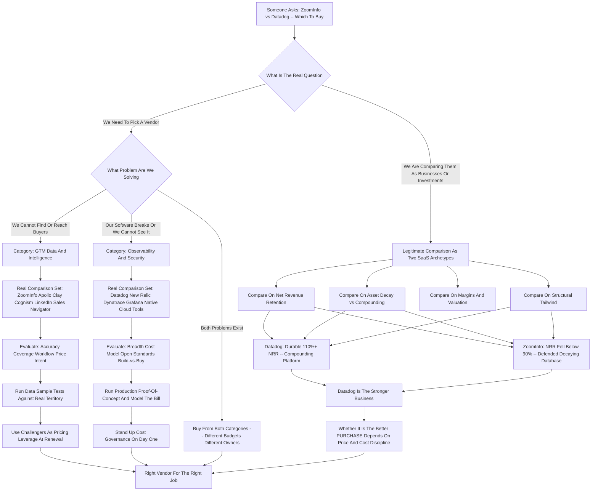
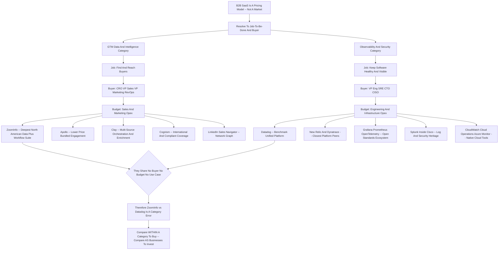

**TL;DR:** "ZoomInfo vs Datadog -- which should you buy?" is a trick question, and the first job of anyone serious about RevOps, procurement, or platform strategy is to refuse the framing. **These two companies do not compete.** ZoomInfo is a **go-to-market data and intelligence platform** -- it sells contact and company data, intent signals, and prospecting workflow to sales, marketing, and RevOps teams; you buy it to find and reach buyers. Datadog is a **cloud observability and security platform** -- it sells infrastructure monitoring, application performance monitoring (APM), log management, and security analytics to engineering, SRE, and platform teams; you buy it to keep software running. They share no buyer, no budget line, no use case, and no competitive surface. Asking which to "buy" is like asking whether a company should buy a forklift or a payroll system -- the honest answer is "both, neither, or one, depending on what is actually broken, and they come out of different budgets owned by different executives." **The real decision underneath the question** is almost always one of two things: either you are doing **vendor due diligence as an investor or operator** and want to understand two of the most-watched public SaaS businesses as *businesses* -- their unit economics, net revenue retention, durability, and moats -- or you are a **buyer who used the wrong vendor names** and actually needs to choose *within* a category: ZoomInfo against Apollo, Clay, Cognism, and LinkedIn Sales Navigator on the GTM-data side, or Datadog against New Relic, Dynatrace, Grafana, Splunk, and the cloud-native tools on the observability side. This entry treats the question both ways. As a **business comparison**: Datadog (roughly $2.8B-$3.0B revenue run-rate, ~110-120% net revenue retention, durable usage-based expansion, founder-led, a structural winner of the cloud migration) is a materially stronger business in 2027 than ZoomInfo (roughly $1.2B-$1.3B revenue, net revenue retention that fell below 90% and has been clawing back, real data-decay and AI-disruption pressure on its core asset). As a **buying guide**: if the pain is "we cannot find or reach the right buyers," you are shopping the GTM-data category and ZoomInfo is one credible option among several that are pressuring it hard on price and freshness; if the pain is "we cannot see what our software is doing or it keeps breaking," you are shopping observability and Datadog is the category benchmark you will be compared against. **Net:** stop comparing them. Diagnose which problem you have, run the bake-off *inside the correct category*, and -- if you are evaluating them as investments or as platform bets -- judge each on usage-based durability, retention, gross margin, and the defensibility of the underlying asset, on which axes the two companies look very different.

## Why This Comparison Does Not Exist -- And Why People Keep Making It

The single most important thing to establish before anything else: ZoomInfo and Datadog are not alternatives to each other, have never appeared on the same evaluation shortlist inside a competent organization, and will never show up in the same procurement RFP. ZoomInfo sells go-to-market data -- the contact records, firmographic and technographic attributes, intent signals, and prospecting workflow that sales development reps, account executives, marketers, and RevOps leaders use to identify and reach potential buyers. Datadog sells observability and security -- the metrics, traces, logs, dashboards, alerts, and security analytics that software engineers, site reliability engineers, and platform teams use to understand whether their systems are healthy and to fix them when they are not. One tool helps you sell software. The other tool helps you run software. They are adjacent only in the trivial sense that both are SaaS companies sold to other companies. So why does the comparison keep getting typed into search bars, posed in interviews, and assigned as a case study? Three reasons, and each points at a different real question hiding underneath. First, **both are among the most scrutinized public SaaS stocks of the era** -- ZoomInfo IPO'd in 2020 to enormous fanfare as the rare profitable, fast-growing SaaS business; Datadog IPO'd in 2019 and became the textbook example of usage-based observability compounding. Investors, analysts, and operators study both constantly, and "ZoomInfo vs Datadog" is shorthand for "compare two famous SaaS business models." Second, **the person asking often does not actually know the categories** -- they have heard both names, both are "B2B software," and they have conflated them. The job of a good answer is to gently correct the framing and route them to the real decision. Third, **interview and MBA-case culture** loves to put two well-known SaaS names side by side precisely because a strong candidate is supposed to notice they do not compete and reframe the question. This entry is built to serve all three: it treats the head-to-head as a *business and investment comparison*, and it treats the underlying buyer confusion as two separate, real *category buying decisions*.

## The Two Categories, Defined Properly

To choose well you must first know which aisle of the store you are standing in. **Go-to-market data and intelligence** -- ZoomInfo's category -- is the layer of the revenue stack that answers "who should we sell to and how do we reach them." Its deliverables are: a database of companies and the people inside them; contact details (email, direct dial, mobile); firmographics (industry, size, revenue, location); technographics (what software a company runs); intent data (signals that an account is researching a problem you solve); and increasingly, workflow on top of that data -- list building, enrichment of your CRM, automated prospecting sequences, conversation intelligence, and orchestration. The buyers are the **Chief Revenue Officer, VP of Sales, VP of Marketing, and the RevOps team**, and the budget is the **go-to-market or sales-and-marketing operating budget**. **Observability and security** -- Datadog's category -- is the layer of the engineering stack that answers "is our software healthy, and if not, why." Its deliverables are: infrastructure monitoring (servers, containers, cloud resources); application performance monitoring (the behavior of your code in production, traces through a request); log management (collecting, searching, and analyzing logs); digital experience and synthetic monitoring (what users actually experience); and a growing security suite (cloud security posture, threat detection, application security). The buyers are the **VP of Engineering, the SRE or platform lead, the CTO, and increasingly the CISO**, and the budget is the **engineering, infrastructure, or cloud operating budget** -- frequently the second- or third-largest line in the entire engineering spend, behind only the cloud bill itself and headcount. Different problems, different buyers, different budgets, different success metrics. A RevOps leader evaluating ZoomInfo measures pipeline created, contact accuracy, and cost per qualified meeting. An SRE evaluating Datadog measures mean time to detection, mean time to resolution, and alert noise. There is no metric, no meeting, and no executive that both decisions share.

## What ZoomInfo Actually Is

ZoomInfo is the largest pure-play go-to-market data and intelligence company. Its core asset is a continuously-updated database covering tens of millions of companies and well over a hundred million professional contact records, assembled from a blend of public web crawling, a contributory network (users who connect their email and calendar in exchange for access, feeding signal back), partnerships, machine processing, and human research. On top of that data sits a widening software layer: **ZoomInfo Sales** (the prospecting and intelligence workspace), **ZoomInfo Marketing** (audience targeting and advertising activation), **ZoomInfo Operations** (data enrichment and the data-as-a-service plumbing that pipes clean records into a CRM), **ZoomInfo Talent** (the same data aimed at recruiters), plus acquired capabilities in conversation intelligence (Chorus) and sales engagement. The strategic logic is sound on paper: own the data layer, then sell more and more workflow that depends on it, raising switching costs and net revenue per customer. The business has real strengths -- it is profitable, generates substantial free cash flow, has deep enterprise penetration, and the data underneath genuinely is among the most comprehensive available. But the business also carries real, structural pressure that any honest evaluation must name. **Data decays** -- people change jobs constantly, and a contact database is a melting ice cube that must be re-frozen every day; freshness is a permanent operating cost and a permanent vulnerability. **The category is under price and freshness attack** from a cohort of newer vendors (Apollo, Clay, Cognism, and others) who undercut on price, claim better international coverage or fresher data, and appeal to a generation of buyers who balk at ZoomInfo's enterprise pricing and contracts. **AI changes the prospecting motion itself** -- if large language models and agentic tools can assemble account research and contact paths on demand, the value of a static licensed database compresses. ZoomInfo is not a broken business, but it is a business defending a moat that is being actively eroded, and its net revenue retention falling below 90% is the number that tells that story most plainly.

## What Datadog Actually Is

Datadog is the category-defining cloud observability platform, and increasingly a security platform as well. It began as infrastructure monitoring and expanded -- deliberately and successfully -- into a broad suite: **infrastructure monitoring**, **APM and distributed tracing**, **log management**, **synthetic and real-user monitoring (digital experience)**, **database monitoring**, **network performance monitoring**, **cloud security and application security**, **CI visibility**, and a steady stream of new modules. The strategic core is a *land-and-expand, usage-based* model: a customer adopts one or two products, the platform proves its value, and then -- because all the telemetry already flows into one place -- adopting the next module is easy and natural. Datadog routinely reports that a large and growing share of customers use four, six, or eight or more of its products, and that high-spend customers ($100K+, $1M+ annual run-rate) grow consistently. The business is, by almost every SaaS yardstick, exceptional: durable revenue growth at substantial scale, net revenue retention that has stayed strong (historically well above 110%, even through cloud-spend-optimization cycles when it compressed but did not break), high gross margins, real free cash flow, and a founder-CEO still running the company with a long-term product orientation. Its tailwind is structural -- every workload that moves to the cloud, every shift to containers and microservices and serverless, every new AI application that must be monitored, *increases* the surface area Datadog can instrument. The honest pressures on Datadog are real but different in kind from ZoomInfo's: its **cost can spook customers** (usage-based billing means a busy month produces a big bill, and "Datadog sticker shock" is a genuine and recurring complaint), it faces **credible competition** from Dynatrace, New Relic, Grafana, the Splunk/Cisco combination, and the cloud providers' own native tools, and **open-source observability** (Prometheus, OpenTelemetry, Grafana) gives sophisticated teams a build-it-yourself alternative. But the underlying asset -- a unified platform that gets more valuable as it ingests more of your telemetry -- is far more defensible than a contact database that decays.

## The Investor's Comparison: Two Business Models Side By Side

If the real reason for the question is investment or operator due diligence -- "which is the better *business*" -- then the comparison becomes legitimate, not because the companies compete, but because they are both instructive SaaS case studies and an investor may genuinely be choosing where to deploy capital or attention. On that basis the verdict is not close, and it is important to be direct about why. **Datadog is the stronger business in 2027.** Its revenue is roughly double ZoomInfo's and still compounding at a healthy clip; its net revenue retention has remained structurally strong because usage-based observability *expands by default* as customers grow and migrate more workloads; its product surface keeps widening into adjacent budgets (security especially); its gross margins are high and stable; and its tailwind -- cloud migration, microservices, AI workloads all needing monitoring -- is one of the most durable in software. **ZoomInfo is a good business under structural strain.** It is profitable and cash-generative, which many SaaS companies are not, and that deserves credit. But its core asset decays, its net revenue retention fell below 90% (meaning the average existing customer cohort *shrinks* year over year before new logos are counted -- the single most worrying number a SaaS business can post), its category is being attacked on price and freshness by well-funded challengers, and AI is a genuine threat to the value of a licensed static database rather than an obvious tailwind. The two companies are a near-perfect teaching pair precisely *because* they are not competitors: they illustrate the difference between a usage-based platform whose value compounds with customer success (Datadog) and a data-license business whose value must be continuously rebuilt against decay and competition (ZoomInfo). An investor comparing them is really comparing two *archetypes*: the expanding platform versus the defended database.

## The Numbers That Matter, Vendor By Vendor

A serious comparison has to put approximate figures on the table, with the caveat that exact quarterly numbers move and should be checked against current filings. The shape of the two businesses, however, is stable and clear.

| Metric | ZoomInfo | Datadog |
|---|---|---|
| Category | GTM data & intelligence | Cloud observability & security |
| Primary buyer | CRO / VP Sales / VP Marketing / RevOps | VP Eng / SRE / CTO / CISO |
| Budget line | Sales & marketing opex | Engineering / infrastructure opex |
| Approx. revenue run-rate | ~$1.2B-$1.3B | ~$2.8B-$3.0B |
| Revenue growth | Low single digits / roughly flat | Strong double digits |
| Net revenue retention | Fell below ~90%, clawing back | Historically 110%-130%, durable |
| Gross margin profile | High (data-license economics) | High (~80%+ software economics) |
| Profitability / FCF | Profitable, strong FCF | Profitable, strong FCF |
| Revenue model | Seat + platform subscription | Usage-based + committed-use platform |
| Core asset | Contact & company database | Unified telemetry platform |
| Asset durability | Decays -- must be continuously refreshed | Compounds -- more telemetry = more value |
| Primary structural tailwind | None obvious; AI is ambiguous-to-negative | Cloud migration, microservices, AI workloads |
| Primary structural risk | Data decay, price competition, AI disruption | Cost sticker shock, native-cloud & OSS competition |
| Leadership | Professionalized public-company management | Founder-CEO, long-term product orientation |

The table makes the asymmetry obvious. Both are profitable, cash-generative, high-gross-margin software businesses -- that is genuinely the good news for ZoomInfo and should not be dismissed. But on the axes that determine *durability* -- net revenue retention, asset decay versus compounding, and the direction of the structural wind -- Datadog is materially better positioned. ZoomInfo's defenders correctly point out that profitability and free cash flow are real and that the company has levers (international expansion, more workflow software, AI-native features) it is actively pulling. The bear case is simply that you are paying for a melting asset in a category where the challengers are getting better and cheaper faster than the incumbent is getting more entrenched.

## Net Revenue Retention: The Single Most Telling Divergence

If you only look at one number to understand why these two businesses diverge, look at net revenue retention (NRR) -- the percentage of last year's revenue that this year's *same* customer cohort produces, before new customers are counted. It is the closest thing SaaS has to a truth serum, because it strips away sales-and-marketing spend and asks: do customers, left alone, naturally spend more or less? **Datadog's NRR has historically run well above 110%, often into the 120s and 130s.** That is the signature of usage-based observability: a customer who adopts Datadog and then grows, migrates more workloads to the cloud, adds microservices, ships more code, and launches AI features will *automatically* send Datadog more telemetry and more dollars, and will tend to adopt additional modules because the platform makes it frictionless. Expansion is the default state. Even during the 2022-2024 cloud-cost-optimization wave -- when customers actively trimmed cloud spend and Datadog's NRR compressed -- it stayed above 110%; it bent but did not break, and then recovered. **ZoomInfo's NRR fell below 90%.** That is the signature of a data-license business under strain: the average existing customer cohort *shrinks* year over year. Seats get cut in downturns, smaller customers churn to cheaper challengers, and the product does not have a built-in expansion engine the way usage-based telemetry does -- you license the database, and absent buying *more* workflow software, there is no automatic mechanism that makes last year's customer spend more this year. ZoomInfo's entire strategic project -- pushing Operations, Marketing, Talent, conversation intelligence -- is fundamentally an effort to *manufacture* the expansion engine that Datadog gets for free from its architecture. That is the deepest structural difference between the two businesses, and NRR is where it shows up in a single number.

## If You Actually Meant: How Do I Choose A GTM Data Vendor

Many people who type "ZoomInfo vs Datadog" on the buying side actually mean "I need go-to-market data and I have heard of ZoomInfo -- what should I do?" If that is you, Datadog is irrelevant and the real comparison set is **ZoomInfo, Apollo, Clay, Cognism, LinkedIn Sales Navigator, Lusha, Seamless.ai, and the data-as-a-service providers** behind them. The category decision turns on a handful of axes. **Data accuracy and freshness** -- the only thing that matters in the end is whether the emails bounce and the phone numbers ring; demand bounce-rate guarantees and run a sample test before signing. **Coverage** -- ZoomInfo is strongest in North American mid-market and enterprise; Cognism and others are often better for European and international data (and for regulatory-compliant data in privacy-strict jurisdictions). **Workflow depth versus raw data** -- ZoomInfo and Apollo bundle prospecting workflow and engagement; Clay is a flexible orchestration and enrichment layer that *combines many data sources*; pure data-as-a-service providers just sell you records to pipe into your own stack. **Price and contract** -- ZoomInfo is the premium-priced, enterprise-contract option and the most common source of "we are paying how much?" procurement friction; Apollo, Lusha, and Seamless compete hard on a lower price point and friendlier terms. **Intent data** -- if buyer-intent signals are core to your motion, evaluate that specifically, as quality varies widely. The honest 2027 guidance: ZoomInfo is still a credible enterprise choice with the deepest North American database and a real workflow suite, but it is no longer the *obvious default* -- the challengers have closed enough of the gap that you should always run a competitive bake-off, test data samples from at least three vendors against your real territory, and use the alternatives as genuine pricing leverage.

## If You Actually Meant: How Do I Choose An Observability Vendor

The mirror image: many people who type the question on the buying side actually mean "our systems keep breaking or we cannot see what is happening -- I have heard of Datadog." If that is you, ZoomInfo is irrelevant and the real comparison set is **Datadog, New Relic, Dynatrace, Grafana (and Grafana Cloud), the Splunk/Cisco platform, Honeycomb, Chronosphere, Elastic, and the cloud providers' native tools (Amazon CloudWatch, Google Cloud Operations, Azure Monitor)**. The category decision turns on its own axes. **Breadth versus depth** -- Datadog's strength is one unified platform across infra, APM, logs, security, and more; some competitors go deeper on a slice (Honeycomb on high-cardinality tracing, Grafana on visualization and open standards). **Cost model and predictability** -- this is the central observability pain; Datadog's usage-based pricing produces real sticker shock, and a serious evaluation models the bill against your actual log volume and host count, considers competitors with different pricing shapes, and budgets for observability cost governance as an ongoing discipline. **Open standards and lock-in** -- Grafana and the OpenTelemetry ecosystem appeal to teams that want to avoid proprietary agents and keep portability; Datadog is more of a walled garden that is extremely good *inside the walls*. **Build versus buy** -- a sophisticated platform team can self-host Prometheus, Grafana, Loki, and OpenTelemetry, trading license cost for engineering time; less-resourced teams are far better served buying. **Native cloud tools** -- if you are all-in on one cloud, that provider's native monitoring may be good enough and cheaper, though usually weaker across multi-cloud and deep APM. The honest 2027 guidance: Datadog is the category benchmark and the safe, capable default for a team that wants one excellent platform and can manage the cost; the reasons to choose otherwise are specific -- cost predictability, open-standards philosophy, a deep single-use-case need, or a build-it-yourself capability.

## The Procurement Reality: Different Buyers, Different Cycles, Different Battles

Even the *act of buying* these two products looks nothing alike, which is further proof they do not belong in the same comparison. **Buying ZoomInfo** is a go-to-market budget decision, championed by a CRO, VP of Sales, VP of Marketing, or a RevOps leader. The evaluation centers on data sample tests, integration with the CRM and sales engagement stack, seat counts, and -- almost always -- a hard negotiation over price and contract length, because ZoomInfo's list pricing creates immediate procurement friction and the challengers exist explicitly to be the cheaper alternative you bring to the table. The cycle is measured in weeks to a couple of months; the renewal fight is annual and increasingly contested. **Buying Datadog** is an engineering budget decision, championed by a VP of Engineering, an SRE lead, a platform team, or a CTO. The evaluation centers on agent deployment across the real environment, a proof-of-concept against actual production telemetry, integration coverage for the specific stack, and -- the defining issue -- *cost modeling*, because the bill scales with usage and a botched estimate produces a budget blowout. The cycle often runs longer because it requires real technical proof-of-value, and the renewal conversation is dominated by cost-governance: how do we keep the bill sane as we grow. One purchase is fought over data accuracy and price-per-seat; the other is fought over telemetry coverage and cost-per-gigabyte. Different war, different room, different generals.

## Where The Confusion Comes From: The "B2B SaaS" Flattening

It is worth naming directly why intelligent people conflate these two. The phrase "B2B SaaS" has become so broad that it flattens genuinely unrelated businesses into a single mental category. ZoomInfo and Datadog are both: cloud-delivered, subscription-priced, sold to companies, publicly traded, frequently discussed by the same investors and analysts, and roughly contemporaries as IPOs. From thirty thousand feet they rhyme. But "B2B SaaS" is not a market -- it is a *delivery and pricing model* that spans dozens of unrelated markets. Saying a company should "buy ZoomInfo or Datadog" is like saying a household should "buy a streaming service or a mortgage" because both are recurring monthly payments. The recurring-payment structure is real; the equivalence is an illusion. The discipline this demands -- and it is a discipline worth building -- is to *always resolve a software question down to the specific job-to-be-done and the specific buyer*. "Which should we buy" is unanswerable until you know whether the problem is *we cannot find buyers* or *our software is on fire*. Those are different problems, owned by different executives, funded by different budgets, solved by different categories. The flattening into "B2B SaaS" is exactly the cognitive error a good operator, investor, or candidate is supposed to catch.

## The Honest Case For ZoomInfo

To be fair to the weaker business in the pairing: there is a real, defensible case for ZoomInfo, and an evaluation that only recites the bear case is not honest. **It is profitable and generates substantial free cash flow.** A great many SaaS companies -- including some that grow faster -- do not, and in an environment where capital is no longer free, durable profitability is a genuine asset, not a footnote. **The North American database is genuinely the deepest** in mid-market and enterprise coverage; for a company whose go-to-market is concentrated there, ZoomInfo's data remains a strong product. **The workflow strategy is the right strategy** -- Operations (data-as-a-service enrichment piped into the CRM) is a legitimately sticky product, conversation intelligence and engagement deepen the footprint, and *if* ZoomInfo successfully becomes the data-and-workflow layer rather than a database license, it manufactures the expansion engine it currently lacks. **AI is not purely a threat** -- ZoomInfo can become the trusted, structured data layer that AI agents query, and a clean, governed dataset is exactly what agentic prospecting tools need to not hallucinate. **The valuation reflects the pessimism** -- a profitable, cash-generative business priced for decline can be a perfectly good investment *if* the decline is arrested, and management has levers. The case is not "ZoomInfo is doomed." The case is "ZoomInfo is a profitable business defending an eroding moat, and the investment or vendor decision rests entirely on whether you believe the workflow pivot and the AI-data-layer thesis outrun the data decay and the price competition." Reasonable people land on both sides of that. It is a genuine debate, not a foregone conclusion.

## The Honest Case Against Datadog

And to be fair the other direction: Datadog is the stronger business, but "stronger business" and "better thing to buy or own *right now*" are not the same statement, and the case against Datadog is real. **Valuation is the central issue** -- Datadog has consistently traded at a premium multiple, and a great business at a demanding price can still be a mediocre *investment* if growth decelerates even modestly; you are not just buying the business, you are buying the expectations baked into the price. **Cost sticker shock is a genuine product risk** -- the same usage-based model that drives the wonderful NRR also produces customer resentment, and resentment is the seed of churn and of competitive openings; every "we are switching off Datadog because the bill got insane" story is a crack in the moat. **The competition is credible and well-resourced** -- Dynatrace and New Relic are serious, Grafana and the OpenTelemetry ecosystem appeal to exactly the sophisticated teams Datadog most wants, Splunk inside Cisco is a giant, and the cloud providers bundle native monitoring for free-ish. **Cloud-spend optimization is a recurring headwind** -- when customers tighten cloud budgets, observability spend is in the blast radius, and Datadog's growth visibly compresses in those cycles. **Concentration and law-of-large-numbers** -- a $3B-revenue business cannot compound at startup rates forever, and the deceleration, whenever it sharpens, will be punished hard at a premium multiple. So the honest framing is: Datadog is the better *business*, with the more durable asset and the better structural wind, but whether it is the better *purchase* -- as a stock, or even as a vendor for a cost-sensitive team -- depends on price paid and cost discipline, not just on business quality.

## A Framework: Resolving "X vs Y" When X And Y Do Not Compete

The most transferable lesson from this question is a *method* for any "should I buy X or Y" decision where X and Y turn out not to be substitutes. Step one: **identify the job-to-be-done.** Not the product -- the problem. "We cannot find buyers" or "our software keeps breaking" or "we cannot see our infrastructure." If you cannot state the job in one plain sentence, you are not ready to compare anything. Step two: **identify the buyer and the budget.** Which executive owns the outcome, and which budget line does the money come from? If X and Y come out of different budgets owned by different executives, they are not competitors and the "vs" is a category error. Step three: **place each product in its real category** and assemble the *correct* comparison set -- the three to six products that genuinely contend for the same job, the same buyer, the same budget. Step four: **define the evaluation axes for that category** -- for GTM data it is accuracy, coverage, workflow, price, intent; for observability it is breadth, cost model, open standards, build-vs-buy. Step five: **run the bake-off inside the category** with real tests against real data or real telemetry, and use the genuine alternatives as pricing leverage. Step six -- only if the question is investment or strategy rather than purchasing: **judge each business on durability axes** -- net revenue retention, asset decay versus compounding, structural tailwind, gross margin, leadership. This six-step method dissolves not just "ZoomInfo vs Datadog" but a whole class of malformed comparisons: "Salesforce vs Snowflake," "Stripe vs Workday," "Shopify vs ServiceNow." The discipline is the same -- refuse the framing, find the job, find the buyer, find the real category, then compare.

## Named Scenarios: Who Is Actually Asking, And What They Should Do

Concrete cases make the method tangible. **Scenario one -- Priya, the new RevOps lead.** She inherits a sales org with a stale CRM and reps who cannot find good contacts; someone told her "look at ZoomInfo or Datadog." The job-to-be-done is *find and reach buyers*; the buyer is her CRO; the budget is sales-and-marketing opex. Datadog is instantly eliminated -- wrong category entirely. Her real bake-off is ZoomInfo vs Apollo vs Clay vs Cognism, judged on data accuracy against her actual territory, CRM enrichment, and price. She runs sample tests, finds ZoomInfo's North American data deepest but Apollo's price dramatically lower, and uses Apollo as leverage to negotiate ZoomInfo down -- or picks Apollo outright. **Scenario two -- Marcus, the VP of Engineering.** His team is firefighting production incidents with no unified view; someone said "ZoomInfo or Datadog." The job is *see and stabilize our software*; the buyer is Marcus; the budget is engineering opex. ZoomInfo is instantly eliminated. His real bake-off is Datadog vs New Relic vs Grafana Cloud vs his cloud's native tools, judged on coverage of his stack, a real production proof-of-concept, and -- critically -- a modeled bill against his log volume. He picks Datadog for breadth but stands up a cost-governance practice on day one. **Scenario three -- Dana, the public-markets analyst.** She is not buying software at all -- she covers SaaS and is comparing the two as *investments*. For her the comparison is legitimate: she puts the businesses side by side on NRR, revenue durability, gross margin, asset decay versus compounding, and valuation multiple, and concludes Datadog is the higher-quality business while debating whether ZoomInfo's pessimistic price already prices in the decay. **Scenario four -- the cautionary tale, an exec who did not reframe.** A founder hears "we should evaluate ZoomInfo vs Datadog" in a board meeting, does not catch that they are unrelated, and wastes a quarter of confused vendor calls before someone points out the categories. The lesson is the cost of *not* refusing a malformed framing. **Scenario five -- Jordan, the platform-strategy interview candidate.** Asked "ZoomInfo or Datadog" in a case interview, Jordan immediately reframes -- "these do not compete; let me show you how I would decide *which problem we have* and then run the comparison inside the right category" -- and that reframing *is* the answer the interviewer wanted.

## The GTM Data Category In Depth

Since a large share of the real buyers behind this question need GTM data, the category deserves a proper treatment. The go-to-market data market exists because the single hardest, most expensive part of B2B selling is *finding the right person at the right company at the right time and reaching them*. Every dollar of GTM-data spend is ultimately justified by one equation: does it lower the cost per qualified meeting or per pipeline dollar enough to pay for itself. The category has structural challenges that every vendor -- ZoomInfo included -- fights constantly. **Decay is relentless**: a meaningful share of contact records go stale every year as people change jobs, so the database is never "done." **Coverage is uneven**: deep in some geographies and industries, thin in others; international and privacy-regulated data is genuinely harder. **Compliance is a moving target**: privacy regulation (GDPR and its global descendants) constrains how data is collected and used, and the compliant vendors make that a selling point. **AI is reshaping the motion**: agentic research tools can assemble account intelligence on demand, which both threatens the static-database model and creates an opportunity for whoever becomes the trusted structured-data layer those agents query. The competitive dynamic in 2027 is an incumbent (ZoomInfo) with the deepest North American data and the broadest workflow suite, defending against challengers competing on price (Apollo, Lusha, Seamless), on international and compliant coverage (Cognism), and on flexible multi-source orchestration (Clay). For the buyer, the practical takeaway is that this is a *bake-off category* -- never single-source it, always test samples against your real territory, and always keep a credible alternative on the table for leverage at renewal.

## The Observability Category In Depth

The mirror treatment for the engineering buyers behind the question. Observability exists because modern software is *too complex to understand by intuition*. A single user request might traverse dozens of microservices, several databases, multiple cloud regions, and third-party APIs; when something is slow or broken, no human can reason about it without instrumentation. Observability is the discipline -- and the tooling -- of making a complex distributed system *legible*: metrics tell you *something is wrong*, traces tell you *where*, logs tell you *why*. The category's defining tension is **cost versus completeness**. The more telemetry you collect, the better you can debug -- and the bigger the bill. Every observability buyer in 2027 lives inside that trade-off, and "observability cost governance" has become a real engineering discipline: sampling strategies, log-volume controls, retention tiers, deciding what *not* to collect. The competitive landscape sorts roughly into the **broad unified platforms** (Datadog the benchmark, Dynatrace and New Relic the closest peers), the **open-standards ecosystem** (Grafana, Prometheus, OpenTelemetry, Loki -- portable, self-hostable, beloved by sophisticated platform teams), the **deep specialists** (Honeycomb for high-cardinality tracing, Chronosphere for cost-controlled scale), the **log-and-security heritage players** (Splunk inside Cisco, Elastic), and the **native cloud tools** (CloudWatch, Cloud Operations, Azure Monitor -- convenient, cheap-ish, single-cloud). For the buyer, the practical takeaway: pick based on your real constraints -- if you want one excellent platform and can fund and govern the cost, Datadog is the safe benchmark; if cost predictability or open-standards portability or a build-it-yourself capability dominates your thinking, the alternatives are legitimate and sometimes better.

## What "Better" Even Means: Five Different Questions In One

A final source of confusion worth dissolving: "which should you buy" smuggles in at least five different questions, and they have different answers. **"Which is the better business?"** -- Datadog, clearly, on durability, NRR, and structural wind. **"Which is the better stock right now?"** -- genuinely debatable; depends on the price paid and whether ZoomInfo's pessimism is overdone or Datadog's premium is unsustainable. **"Which should my company buy as a vendor?"** -- a category error as posed; depends entirely on whether your problem is GTM data or observability, and they are not mutually exclusive (a company can and often does buy *both*, out of different budgets). **"Which is the better product in its category?"** -- two separate questions: ZoomInfo is a strong-but-pressured leader in GTM data; Datadog is the benchmark leader in observability. **"Which would I rather build a career around / bet a partnership on?"** -- different again, weighting growth, culture, and trajectory. A rigorous answer separates these five rather than letting the vague verb "buy" blur them together. Most people asking the question have exactly one of these five in mind; the value of a good answer is figuring out which one and answering *that*, instead of producing mush that gestures at all five.

## The 2027-2030 Outlook For Both Businesses

Looking forward sharpens the comparison. **For ZoomInfo**, the next several years are an existential test of the workflow pivot. The bull path: it successfully becomes the trusted, governed data-and-workflow layer -- the structured source of truth that AI prospecting agents query and that RevOps teams orchestrate from -- and the expansion engine that NRR has been missing finally turns over. The bear path: the challengers keep closing the data-quality gap while undercutting on price, AI commoditizes the act of finding a contact, and ZoomInfo slowly becomes a profitable-but-shrinking utility. The truth is probably in between, and the NRR trend is the number to watch -- if it climbs back above 100%, the pivot is working; if it does not, it is not. **For Datadog**, the next several years are about extending the platform and absorbing adjacent budgets without choking customers on cost. The bull path: security becomes a second engine as large as observability, AI-workload monitoring becomes a structural new tailwind (every AI application needs observability, and Datadog is positioned to provide it), and the platform keeps compounding. The bear path: cloud-cost-optimization cycles keep clipping growth, sticker shock opens real competitive doors, the law of large numbers grinds the growth rate down, and the premium multiple compresses. Datadog's downside is mostly a *valuation and growth-rate* story; ZoomInfo's downside is an *asset and category* story -- and that distinction, once again, is the whole point. One company is asking "can we keep compounding fast enough to justify the price"; the other is asking "can we stop the core asset from eroding." Those are not the same question, and the companies were never the same comparison.

## The Bottom Line: Refuse The Framing, Then Answer The Real Question

The disciplined response to "ZoomInfo vs Datadog -- which should you buy?" is, in order: **first, refuse the framing** -- state plainly that these companies do not compete, share no buyer, and come out of different budgets. **Second, diagnose which real question is being asked.** If it is *vendor selection*, route to the correct category: GTM data (ZoomInfo vs Apollo, Clay, Cognism, LinkedIn Sales Navigator) if the problem is finding buyers, or observability (Datadog vs New Relic, Dynatrace, Grafana, native cloud tools) if the problem is running software -- and note that a company may legitimately buy from *both* categories because they solve unrelated problems. If it is *investment or business analysis*, the comparison is legitimate as a study of two SaaS archetypes, and Datadog is the materially stronger business -- double the revenue, durable 110%+ NRR, a compounding asset, and a structural cloud tailwind -- while ZoomInfo is a profitable but structurally strained business defending an eroding moat, with NRR that fell below 90% as the clearest symptom. **Third, run the right comparison properly** -- a category bake-off with real tests for a buyer, or a durability analysis on NRR, asset decay, margins, and valuation for an investor. The wrong answer is to pick one. The right answer is to show *why the question as posed cannot be answered*, then answer the better question underneath it. That reframing is not a dodge -- it is the entire substance of good platform strategy, good procurement, and good investment analysis: the refusal to compare two things that were never comparable, and the discipline to find the decision that actually matters.

## Decision Flow: Resolving "ZoomInfo vs Datadog"

## Category Map: Where Each Vendor Actually Lives

## Sources

1. **ZoomInfo Technologies -- Investor Relations and SEC Filings (10-K, 10-Q, earnings releases)** -- Primary source for ZoomInfo revenue, net revenue retention, profitability, and segment commentary. https://ir.zoominfo.com
2. **Datadog -- Investor Relations and SEC Filings (10-K, 10-Q, earnings releases)** -- Primary source for Datadog revenue, net revenue retention, multi-product adoption, and high-spend customer cohorts. https://investors.datadoghq.com
3. **Datadog -- "State of..." Reports (Cloud Security, Serverless, Containers, AI)** -- Datadog's recurring data reports on cloud, container, serverless, and AI-workload adoption trends. https://www.datadoghq.com/state-of-cloud-security/
4. **ZoomInfo -- Product Documentation (Sales, Marketing, Operations, Talent)** -- Reference for the ZoomInfo product suite and the data-to-workflow strategy. https://www.zoominfo.com
5. **Datadog -- Product Documentation (Infrastructure, APM, Logs, Security, Synthetics)** -- Reference for the Datadog observability and security product surface. https://docs.datadoghq.com
6. **Gartner Magic Quadrant for Observability Platforms** -- Independent analyst positioning of Datadog, Dynatrace, New Relic, Grafana, and peers.
7. **Gartner / Forrester Coverage of B2B Sales Intelligence and Data Providers** -- Independent analyst coverage of the GTM-data category including ZoomInfo, Apollo, Cognism, and Clay.
8. **G2 -- Category Grids for Sales Intelligence and Application Performance Monitoring** -- Aggregated user-review positioning for both categories. https://www.g2.com
9. **Apollo.io -- Product and Pricing Documentation** -- Reference for the leading lower-priced GTM-data challenger. https://www.apollo.io
10. **Clay -- Product Documentation** -- Reference for the multi-source data orchestration and enrichment approach. https://www.clay.com
11. **Cognism -- Product Documentation and Compliance Materials** -- Reference for international coverage and privacy-compliant GTM data. https://www.cognism.com
12. **LinkedIn Sales Navigator -- Product Documentation** -- Reference for the network-graph approach to prospecting. https://business.linkedin.com/sales-solutions
13. **New Relic -- Product Documentation** -- Reference for a closest-peer observability platform. https://newrelic.com
14. **Dynatrace -- Investor Relations and Product Documentation** -- Reference for a closest-peer observability and AIOps platform. https://www.dynatrace.com
15. **Grafana Labs -- Product Documentation (Grafana, Loki, Tempo, Mimir)** -- Reference for the open-source and open-standards observability ecosystem. https://grafana.com
16. **OpenTelemetry Project Documentation (CNCF)** -- Reference for the open-standard instrumentation framework reshaping observability portability. https://opentelemetry.io
17. **Prometheus Documentation (CNCF)** -- Reference for the open-source metrics standard underpinning self-hosted observability. https://prometheus.io
18. **Splunk (Cisco) -- Product and Platform Documentation** -- Reference for the log-and-security heritage observability player. https://www.splunk.com
19. **Honeycomb -- Product Documentation** -- Reference for the high-cardinality tracing specialist. https://www.honeycomb.io
20. **Chronosphere -- Product Materials** -- Reference for the cost-controlled, scale-focused observability challenger. https://chronosphere.io
21. **Amazon CloudWatch Documentation** -- Reference for AWS-native monitoring. https://aws.amazon.com/cloudwatch/
22. **Google Cloud Operations Suite Documentation** -- Reference for GCP-native monitoring. https://cloud.google.com/products/operations
23. **Microsoft Azure Monitor Documentation** -- Reference for Azure-native monitoring. https://azure.microsoft.com/products/monitor
24. **The SaaS Capital Index and SaaS Benchmarking Reports** -- Reference for net revenue retention, growth, and margin benchmarks across public SaaS.
25. **Bessemer Venture Partners -- State of the Cloud Reports** -- Reference for cloud-software business-model benchmarks including NRR and the rule-of-40.
26. **OpenView / SaaS Pricing and Net-Revenue-Retention Research** -- Reference for usage-based versus seat-based revenue-model dynamics.
27. **Battery Ventures -- Software / Cloud Computing Reports** -- Reference for public-SaaS valuation and growth-durability analysis.
28. **Meritech Capital -- Public SaaS Comparables and Analysis** -- Reference for SaaS valuation multiples and operating-metric comparisons. https://www.meritechcapital.com
29. **The Information / Wall Street Journal -- Coverage of ZoomInfo and Datadog** -- Business-press reporting on both companies' trajectories, competition, and strategy.
30. **CNCF Annual Survey** -- Reference for cloud-native adoption (containers, microservices, observability) driving the observability tailwind. https://www.cncf.io
31. **GDPR and Global Privacy Regulation Resources** -- Reference for the compliance constraints shaping the GTM-data category.
32. **RevOps Community and Practitioner Resources (RevGenius, Wizards of Ops, Pavilion)** -- Practitioner discussion of GTM-data vendor selection and bake-off practice.
33. **SRE and Platform-Engineering Community Resources (SREcon, the Google SRE books)** -- Practitioner context for observability practice and tool selection.
34. **Public Earnings-Call Transcripts (Seeking Alpha, Motley Fool transcripts)** -- Management commentary from both companies on retention, competition, and strategy.
35. **Vendor Analyst-Day and Investor-Day Presentations (ZoomInfo, Datadog)** -- Long-range strategy and market-sizing framing direct from each company.

## Numbers

**Business Comparison At A Glance (Approximate -- Verify Against Current Filings)**

| Dimension | ZoomInfo | Datadog |
|---|---|---|
| Revenue run-rate | ~$1.2B-$1.3B | ~$2.8B-$3.0B |
| Revenue growth | Low single digits / ~flat | Strong double digits |
| Net revenue retention | Fell below ~90% | Historically ~110%-130% |
| Gross margin | High (data-license economics) | ~80%+ (software economics) |
| Free cash flow | Positive, strong | Positive, strong |
| IPO year | 2020 | 2019 |
| Revenue model | Seat + platform subscription | Usage-based + committed-use |
| Multi-product adoption | Pushing Operations/Marketing/Talent to build expansion | Large share of customers on 4-8+ products |
| Core asset | Contact & company database | Unified telemetry platform |
| Asset trajectory | Decays -- must be re-built constantly | Compounds -- grows with customer usage |
| Leadership | Professionalized public-company mgmt | Founder-CEO led |

**GTM Data Category -- The Comparison Set (If You Meant Vendor Selection)**

| Vendor | Position | Best For | Pressure Point |
|---|---|---|---|
| ZoomInfo | Incumbent leader | Deepest North American data + workflow suite | Premium price, data decay, AI disruption |
| Apollo | Price challenger | Lower cost, bundled engagement | Data depth vs ZoomInfo |
| Clay | Orchestration layer | Multi-source enrichment & flexibility | Requires more setup sophistication |
| Cognism | International specialist | EU/global coverage, compliant data | Smaller North American depth |
| LinkedIn Sales Navigator | Network graph | Relationship paths, fresh job-change signal | Not a bulk-export database |

**Observability Category -- The Comparison Set (If You Meant Vendor Selection)**

| Vendor | Position | Best For | Pressure Point |
|---|---|---|---|
| Datadog | Benchmark leader | One unified platform across infra/APM/logs/security | Usage-based cost sticker shock |
| New Relic / Dynatrace | Closest platform peers | Broad APM, AIOps, alternative pricing shapes | Breadth vs Datadog's pace |
| Grafana / Prometheus / OpenTelemetry | Open-standards ecosystem | Portability, self-hosting, no agent lock-in | Engineering time to run it |
| Splunk (Cisco) | Log & security heritage | Heavy log analytics, security overlap | Cost, complexity |
| CloudWatch / Cloud Operations / Azure Monitor | Native cloud tools | Cheap-ish, convenient, single-cloud | Weak multi-cloud and deep APM |

**Net Revenue Retention -- Why It Is The Telling Number**
- NRR = revenue from last year's same customer cohort, this year, before new logos
- Above 100% = cohort expands on its own; below 100% = cohort shrinks on its own
- Datadog: historically well above 110%, into the 120s-130s; compressed but stayed >110% through cloud-optimization cycles
- ZoomInfo: fell below ~90% -- average existing cohort shrinks year over year
- Datadog gets expansion "for free" from usage-based telemetry growth
- ZoomInfo must "manufacture" expansion by selling additional workflow software

**The Five Questions Hidden In "Which Should You Buy"**
- Better business? -- Datadog, clearly (NRR, asset, tailwind)
- Better stock right now? -- Debatable; depends on price paid and expectations
- Better vendor for my company? -- Category error; depends on whether you need GTM data or observability (often both)
- Better product in its category? -- ZoomInfo strong-but-pressured in GTM data; Datadog the benchmark in observability
- Better to build a career / partnership around? -- Different weighting again

**Procurement Profile -- Two Different Purchases**
- ZoomInfo: GTM budget; champion CRO/VP Sales/RevOps; weeks-to-months cycle; fought over data accuracy and price-per-seat; contested annual renewal
- Datadog: Engineering budget; champion VP Eng/SRE/CTO; longer cycle with technical POC; fought over telemetry coverage and cost-per-GB; renewal dominated by cost governance

**Structural Tailwinds And Risks**
- Datadog tailwind: cloud migration, containers/microservices/serverless, AI-workload monitoring -- all increase instrumentable surface area
- Datadog risk: cost sticker shock, cloud-spend optimization cycles, credible competition, premium valuation, law of large numbers
- ZoomInfo tailwind: ambiguous -- AI could commoditize contact-finding OR make ZoomInfo the trusted data layer for agents
- ZoomInfo risk: data decay, price competition from challengers, NRR below 90%, AI disruption of the prospecting motion

## Counter-Case: When The Comparison Is Not As Lopsided As It Looks -- And When "Just Refuse The Framing" Is Too Glib

The body of this entry makes two strong claims: that ZoomInfo and Datadog do not compete, and that as businesses Datadog is materially stronger. Both claims are defensible, but a rigorous answer has to stress-test them, because each has real limits.

**Counter 1 -- "They do not compete" is true today but not a law of nature.** Software categories converge. Datadog has expanded relentlessly from infrastructure monitoring into APM, logs, security, CI visibility, and more -- it is a serial category-eater. ZoomInfo has expanded from a database into marketing activation, conversation intelligence, and data operations. It is not impossible to imagine a future where both push toward a "revenue intelligence" or "business signal" layer and brush against each other at the edges, or where a third platform absorbs functions from both. The categorical "they will never compete" is right for the foreseeable horizon but should be held as a strong present-tense observation, not an eternal truth.

**Counter 2 -- Profitability is not nothing, and the market knows it.** The entry is hard on ZoomInfo's NRR, and rightly, but a profitable, free-cash-flow-generative software business is genuinely rarer and more valuable than a decade of growth-at-all-costs culture trained people to believe. If the alternative framing is "would I rather own a profitable business priced for decline or a premium-priced business priced for perpetual compounding," the answer is not automatic. A profitable business that merely *stabilizes* -- does not even need to reaccelerate -- can be a perfectly good investment from a pessimistic starting price. The bear case on ZoomInfo is real; "therefore Datadog, obviously" does not follow for the *investment* question.

**Counter 3 -- Datadog's premium is itself the risk.** "Better business" and "better investment" diverge most violently exactly when a great business carries a great price. Datadog has spent most of its public life expensive. If growth decelerates even to "merely good," a premium multiple compresses and the stock can underperform a far worse business that was priced for nothing. The entry says this, but it bears repeating as a counterweight: the quality gap between the businesses is real and large; the *investment* gap is mediated entirely by price and is not obviously in Datadog's favor at all times.

**Counter 4 -- Cost sticker shock is a slow-acting churn agent, not just a complaint.** It is easy to wave at "Datadog is expensive" as a footnote. But usage-based pricing that produces resentment is structurally dangerous in a way that is easy to under-rate: every angry bill is a reason to evaluate a competitor, to cap usage (which caps Datadog's revenue), or to fund an internal open-source effort. The same mechanism that produces the beautiful NRR also continuously manufactures the motivation to leave. It has not broken the moat -- but "it is expensive" deserves to be treated as a real strategic vulnerability, not a quirk.

**Counter 5 -- "Refuse the framing" can be a cop-out if overused.** The entry's central move -- "this question is malformed, here is the real question" -- is correct here. But it is also a rhetorical pattern that can be abused: there are plenty of "X vs Y" questions where X and Y *do* compete and the asker just wants a straight answer, and reflexively reframing every comparison as a category error is its own failure mode. The discipline is to reframe *when the categories genuinely differ* (as here) and to *answer directly* when they do not. The skill is knowing which situation you are in, not always performing the reframe.

**Counter 6 -- The buyer may genuinely need both, and "pick the real category" can obscure that.** Routing the asker to "GTM data or observability" is correct, but a growing software company very plausibly needs *both* -- it has a sales org that needs contact data and an engineering org that needs observability. Framing it as an either/or category choice can accidentally imply they are still substitutes at the company level. They are not even that: they are two unrelated purchases a single company makes from two different budgets, and a complete answer says so explicitly rather than leaving "pick the category" to imply exclusivity.

**Counter 7 -- AI is genuinely ambiguous for ZoomInfo, not simply negative.** The entry mostly frames AI as erosion pressure on ZoomInfo, with a nod to the data-layer opportunity. But the ambiguity is real and could break either way hard. If agentic prospecting tools become the dominant motion, the entity that owns the *cleanest, most governed, most current structured dataset* becomes more valuable, not less -- agents need a trustworthy source to avoid hallucinating contacts. ZoomInfo could plausibly be that source. The bear case (AI commoditizes contact-finding) and this bull case (AI needs a trusted data spine) are both coherent, and an honest evaluation holds both rather than assuming the bear case.

**Counter 8 -- Datadog's tailwind has a cyclical chop the long-run story hides.** "Cloud migration is a structural tailwind" is true over a decade. But within that decade, cloud-spend-optimization cycles repeatedly clip Datadog's growth, sometimes sharply, and the stock reacts violently each time. Calling the tailwind "durable" is correct for the trend and misleading for the path. An operator or investor who buys the smooth long-run narrative and is surprised by the cyclical air-pockets has mis-modeled the business.

**The honest verdict.** The two central claims survive the stress test, but with calibration. *They do not compete* -- true and decision-relevant today; hold it as strong present-tense fact, not eternal law, and remember a company may buy from both categories. *Datadog is the stronger business* -- true, on durable NRR, a compounding asset, and a structural (if cyclically choppy) tailwind. But "stronger business" is not "better purchase": for a vendor decision the question is a category error and the answer is "diagnose your problem"; for an investment decision the answer is genuinely contested and turns on price paid, on whether ZoomInfo's pessimism is overdone, and on whether Datadog's premium is sustainable. The reframe is the right move *here* because the categories genuinely differ -- but it is a tool to use with judgment, not a reflex to perform on every comparison.

## Related Pulse Library Entries

- **q9501** -- Group-workshop business that hit a growth-capping friction point -- what is the right next move? (Companion benchmark entry; the discipline of diagnosing the real problem before choosing a move.)
- **q9502** -- Scaling a workshop-led business past the single-operator ceiling. (Companion benchmark entry; structural growth-engine analysis.)
- **q1965** -- How do you start a party rental business in 2027? (Asset-durability thinking -- the "does the asset decay or compound" question applied to physical inventory.)
- **q1946** -- How do you start a real estate investing business in 2027? (Capital-allocation and asset-quality evaluation discipline.)
- **q1947** -- How do you start a property management business in 2027? (Recurring-revenue and retention-driven business model.)
- **q9601** -- How do you start a fractional CFO business in 2027? (The financial-analysis lens -- NRR, gross margin, FCF -- applied to evaluating any business.)
- **q9701** -- What is the best inventory and rental management software in 2027? (A genuine within-category software bake-off -- the correct shape of a vendor comparison.)
- **q9702** -- How do you build standard operating procedures for a service business? (The procurement and evaluation process discipline.)
- **q1955** -- How do you start a vacation rental business in 2027? (Usage-and-occupancy economics -- a parallel to usage-based revenue models.)
- **q1949** -- How do you start a short-term rental business in 2027? (Asset-utilization economics adjacent to usage-based platform thinking.)
- **q1961** -- How do you start an Airbnb arbitrage business in 2027? (Margin-and-leverage analysis under competitive pressure.)
- **q1966** -- How do you start an event venue business in 2027? (Capital-asset business with a defensible-moat question.)
- **q9801** -- What is the future of the events industry in 2030? (Long-range industry-outlook framing -- the same forward-looking lens applied here to ZoomInfo and Datadog.)
- **q9601b** -- How do you read a SaaS company's financials? (The NRR, gross margin, and rule-of-40 toolkit used throughout this entry.)
- **q1958b** -- How do you start a junk removal business in 2027? (Competitive-positioning and price-pressure dynamics.)
- **q1962** -- How do you start a furnished apartment business in 2027? (Asset-yield economics and depreciation-versus-appreciation framing.)
- **q1947b** -- How do you choose a software vendor for a small business? (The general within-category bake-off methodology this entry applies to two specific categories.)
- **q9502b** -- What metrics actually predict whether a SaaS business is durable? (Deep dive on net revenue retention, the metric that most separates ZoomInfo and Datadog.)
- **q1965b** -- How do you start a wedding planning business in 2027? (Relationship-driven go-to-market -- the demand side ZoomInfo's category serves.)
- **q9701b** -- What is the best observability and monitoring software in 2027? (The full within-category deep dive on Datadog's competitive set.)
- **q9701c** -- What is the best sales intelligence and GTM data platform in 2027? (The full within-category deep dive on ZoomInfo's competitive set.)
- **q1946b** -- How do you evaluate a business as an acquisition target? (Due-diligence discipline -- the investor's lens used in this entry's business comparison.)
- **q9601c** -- How do you build a RevOps function from scratch? (The buyer and budget owner behind the GTM-data category decision.)
- **q9801b** -- How is AI changing B2B go-to-market in 2030? (The structural force most ambiguous for ZoomInfo's core asset.)
- **q9801c** -- How is AI changing software observability in 2030? (The structural force most additive to Datadog's surface area.)

