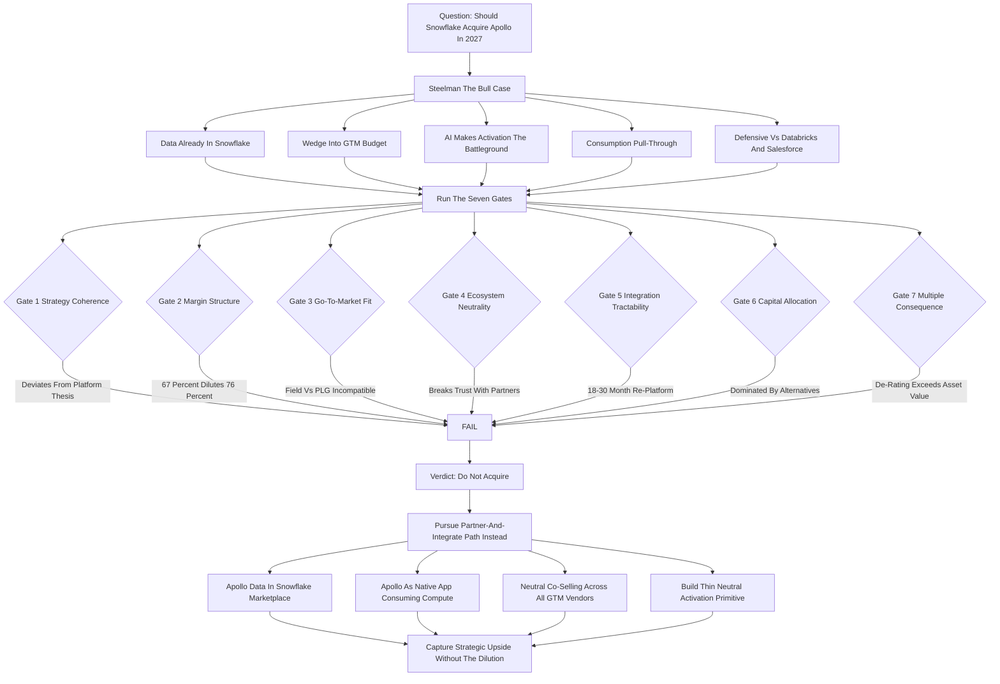
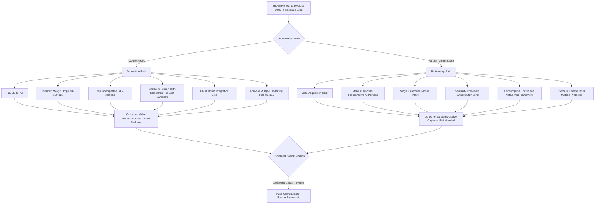

**TL;DR:** No -- Snowflake should not acquire Apollo in 2027, and the reasons are structural, not tactical. The deal looks seductive on a slide: Snowflake sits on roughly $8.4B in product revenue (FY2025) and $5B-plus in cash and equivalents, it owns the warehouse where enterprise customer data already lives, and Apollo (the sales-intelligence and engagement platform, not the private-equity firm) is a fast-growing, roughly $100M-$150M ARR asset whose entire product is "data plus workflow on top of contact records." On paper, the data company buys the data-activation company and closes the loop. In practice the acquisition destroys three things Snowflake spent a decade building -- a **75-78% gross-margin structure**, a **single coherent enterprise go-to-market motion**, and a **neutral-platform brand** that lets it sell to Salesforce shops, HubSpot shops, and Microsoft shops without picking a side -- and it buys three things Snowflake does not want: a **65-69% gross-margin business** weighed down by third-party data-licensing and email-deliverability costs, a **product-led, SMB-and-mid-market sales motion** that has nothing to do with Snowflake's 6-7 figure enterprise field motion, and a **direct competitive collision** with ZoomInfo, Salesforce, HubSpot, Clay, and Outreach that Snowflake has no existing right to win. The honest 2027 math: a deal would price somewhere between **$3B and $7B** depending on the multiple environment (8-20x ARR for a growth-stage GTM-software asset), it would compress Snowflake's blended gross margin by **150-400 basis points**, it would burn **18-30 months of integration engineering** reconciling Apollo's operational data model against Iceberg-and-warehouse architecture, and it would invite a **multiple de-rating** because public-market investors pay 12-16x forward revenue for a pure high-margin data-infrastructure compounder and 5-9x for a mixed-margin "platform" that now competes with its own ecosystem. The strategically correct move is the inverse of an acquisition: Snowflake should **partner-and-integrate** with Apollo and the broader GTM-data ecosystem, monetize the data-sharing and compute relationship through the Snowflake Marketplace and Native App Framework, and -- if it wants to own activation -- build a thin, neutral, warehouse-native "data-activation" surface (the reverse-ETL and audience layer, where Hightouch and Census already prove the model) rather than buy a full-stack, brand-heavy, SMB-flavored CRM-adjacent application. The three things that make this a bad acquisition are the same three things that make almost every "infrastructure company buys an application company" deal a bad acquisition: **margin-structure dilution**, **go-to-market motion conflict**, and **ecosystem-neutrality destruction** -- and a disciplined Snowflake board should pass, just as a disciplined operator passes on any deal whose synergy case is a narrative and whose dis-synergy case is an arithmetic.

## What This Question Is Actually Asking

The question "Should Snowflake acquire Apollo in 2027?" is not really a question about Snowflake or about Apollo. It is a question about whether an infrastructure company should move up the stack into applications by acquisition -- and that is one of the most consequential, most frequently botched decisions in enterprise software strategy. To answer it well you have to be precise about the two companies. **Snowflake** is a cloud data platform: customers land their structured and semi-structured data in Snowflake, run analytics and increasingly AI workloads against it, and pay on a consumption basis for storage and compute. Its FY2025 product revenue was roughly $8.4B-equivalent run-rate territory, it carries gross margins in the **75-78%** band, net revenue retention has historically run **125-135%**, and the company has been transparent that its growth thesis is more workloads per customer -- data engineering, data science, AI, applications built natively on the platform -- not a pivot into being an application vendor itself. **Apollo** (here meaning Apollo.io, the sales-intelligence and engagement platform) is the opposite kind of company: it sells a B2B contact-and-company database fused with prospecting, enrichment, sequencing, and engagement workflow, it goes to market product-led with a free tier and self-serve expansion into SMB and mid-market teams, it has raised through a Series D (a 2023 round valued it around $1.6B), and its revenue -- in the **$100M-$150M ARR** range with high growth -- carries gross margins in the **65-69%** zone because it pays for third-party data, email infrastructure, and deliverability. So the real question is: should a 76%-margin, enterprise-field, neutral-infrastructure compounder pay billions to absorb a 67%-margin, product-led, SMB-flavored, competitively-entangled application? Asked that precisely, the answer writes itself -- but the discipline is in showing the work.

## The Strategic Logic FOR The Deal -- Stated As Strongly As Possible

A serious analysis has to steelman the bull case before dismantling it, because the bull case is not stupid -- it is just incomplete. The argument FOR Snowflake acquiring Apollo runs roughly like this. **One: the data is already there.** Enterprise customers already land their CRM, product, and behavioral data in Snowflake; Apollo's entire value proposition is enriching and activating contact and account data; owning Apollo lets Snowflake "close the loop" from raw data to revenue action without the customer leaving the platform. **Two: it is a wedge into the GTM-software budget.** Revenue-operations and go-to-market tooling is a large, growing, durable budget line -- arguably $20B-plus across data, engagement, and CRM-adjacent tooling -- and Snowflake today captures none of it directly. **Three: AI makes activation the battleground.** As AI agents start doing prospecting, research, and outbound, whoever owns the data layer plus the activation layer has a structural advantage; buying Apollo buys a head start. **Four: cross-sell and consumption pull-through.** Apollo workloads -- enrichment, scoring, sequencing -- would themselves consume Snowflake compute, and Snowflake's enterprise relationships could pull Apollo upmarket. **Five: defensive positioning.** If Snowflake does not own an activation layer, Databricks, Salesforce Data Cloud, or Microsoft Fabric might fuse data and activation first. Every one of those points is true in isolation. The reason the deal still fails is that strategy is not the sum of true points -- it is what survives contact with margin structure, go-to-market mechanics, integration reality, and competitive response. The bull case is a narrative; the bear case is an arithmetic; and in M&A the arithmetic wins.

## Margin Structure: The Dilution That Cannot Be Argued Away

The first and least escapable problem is gross margin. Snowflake is valued the way it is -- as a premium compounder -- substantially because it runs a **75-78% gross margin** with the operating leverage profile that implies. Apollo, as a sales-intelligence and engagement platform, runs structurally lower gross margin -- call it **65-69%** -- because its cost of revenue includes things Snowflake's does not: licensing and refreshing third-party contact and firmographic data, email-sending infrastructure and deliverability management, and the human data-operations cost of keeping a B2B database accurate. When you weld a 67%-margin business onto a 76%-margin business, the blended number does not average gently -- it gets dragged toward the lower number in proportion to revenue weight, and then it gets dragged further by integration costs that hit COGS during the multi-year stitching period. The table below makes the dilution concrete across a plausible revenue-weight range.

| Scenario | Snowflake rev | Snowflake GM | Apollo rev | Apollo GM | Blended GM | GM compression |
|---|---|---|---|---|---|---|
| Apollo at $100M ARR | $8,400M | 76% | $100M | 67% | 75.9% | ~10 bps (pre-integration) |
| Apollo at $150M ARR | $8,400M | 76% | $150M | 67% | 75.8% | ~16 bps (pre-integration) |
| Apollo scaled to $400M ARR | $9,000M | 76% | $400M | 66% | 75.6% | ~43 bps |
| With integration drag in COGS (Yr1-2) | $9,000M | 76% | $400M | 58% | 75.2% | ~80 bps |
| Bear case: data-cost inflation + churn mix | $9,000M | 75% | $400M | 54% | 74.1% | ~190 bps |

The pure arithmetic dilution looks modest at first because Apollo is small relative to Snowflake -- but that is exactly the trap. A board does not get to evaluate the deal at "10 bps of dilution." It has to evaluate it at the full cost: the integration COGS drag, the data-licensing cost inflation as Apollo scales, the lower-margin revenue mix becoming a larger share over time if Apollo grows faster than the core, and -- most importantly -- the **multiple consequence** of being repriced from a pure-play high-margin infrastructure company to a mixed-margin "platform." That last effect is not measured in basis points of gross margin. It is measured in tens of billions of dollars of market capitalization, and it is the subject of its own section below.

## Go-To-Market Motion Conflict: Two Companies That Sell Nothing The Same Way

The second structural problem is that Snowflake and Apollo do not just sell different products -- they sell in fundamentally incompatible **motions**, and motion conflict is the quiet killer of infrastructure-buys-application deals. Snowflake's motion is **enterprise field sales**: named-account reps, sales engineers, multi-quarter cycles, six- and seven-figure consumption commitments, procurement and security review, executive sponsorship, and a customer-success organization tuned to expanding workloads inside large accounts. Apollo's motion is **product-led growth**: a free tier, self-serve credit-card signup, in-product expansion, a sales-assist team that pounces on usage signals, and a center of gravity in SMB and mid-market teams of 5 to 200 reps. These motions have different comp plans, different demand-generation engines, different unit economics, different success metrics, and -- critically -- different organizational DNA. When Snowflake's enterprise field organization is told to "also sell Apollo," several things go wrong at once. Reps optimize for the seven-figure consumption deal and treat the $15K Apollo attach as a rounding error not worth the cycles. The PLG funnel that actually drives Apollo's growth gets starved because nobody in an enterprise field org knows how to feed it. Apollo's SMB customers -- the base of its pyramid -- get an account team built for the Fortune 500, which is both expensive and unwelcome. The table below lays the two motions side by side.

| Dimension | Snowflake motion | Apollo motion |
|---|---|---|
| Primary engine | Enterprise field sales | Product-led growth + self-serve |
| Typical buyer | CDO, VP Data, CIO | VP Sales, RevOps, individual SDR/AE |
| Deal size | $100K-$5M+ consumption | $5K-$50K subscription |
| Sales cycle | 3-12 months | Days to weeks (self-serve) or short-cycle |
| Expansion mechanism | More workloads per account | Seats + credits + tier upgrades |
| Customer segment center | Enterprise / large enterprise | SMB / mid-market |
| Success metric | Net revenue retention on consumption | Activation, seat expansion, credit burn |
| Org DNA | Field, SE-heavy, procurement-savvy | Growth, lifecycle marketing, sales-assist |

You cannot run both motions out of one organization without one of them degrading, and the historical pattern is unambiguous: when an enterprise-field company acquires a PLG company, the PLG motion is the one that dies, because the acquiring org's incentives, headcount, and instincts all pull the other way. Snowflake would be paying billions for Apollo's growth engine and then, structurally, switching it off.

## Ecosystem Neutrality: The Brand Asset Snowflake Would Set On Fire

The third structural problem is the least visible on a spreadsheet and arguably the most expensive. Snowflake's position in the market depends on a specific, hard-won posture: it is **neutral**. It sits underneath the application layer and refuses to compete with it. A Salesforce shop, a HubSpot shop, a Microsoft Dynamics shop, a Marketo shop, an Outreach shop, a ZoomInfo shop -- all of them can land their data in Snowflake without worrying that Snowflake will use that position to compete with the application they already bought. That neutrality is why Snowflake's Marketplace has the partner density it has, why thousands of independent software vendors build on the Native App Framework, and why data-sharing -- Snowflake's genuine moat -- works at all: partners share data into and out of Snowflake precisely because Snowflake is not a competitor. The moment Snowflake owns Apollo, that posture cracks. Apollo competes directly with Salesforce (Sales Cloud, Data Cloud, the data and engagement layer), with HubSpot's Sales Hub and Breeze intelligence, with ZoomInfo head-on, with Outreach and Salesloft in engagement, and with Clay in the modern enrichment-and-agent layer. Every one of those companies is also, today, a Snowflake partner or a Snowflake-adjacent vendor whose customers run on Snowflake. Owning Apollo tells all of them that Snowflake is now willing to compete in the application layer -- which gives every one of them a reason to accelerate their own data-platform strategy, to dual-source onto Databricks or Microsoft Fabric, to slow their Snowflake Marketplace investment, and to treat Snowflake as a frenemy rather than neutral plumbing. Neutrality is the kind of asset you only notice when it is gone, and you cannot buy it back. The Apollo acquisition would be Snowflake spending billions of dollars to acquire roughly $130M of ARR while simultaneously degrading the trust that underwrites a multi-billion-dollar partner ecosystem. That is not a synergy. That is a self-inflicted wound with a price tag attached.

## Integration Reality: 18-30 Months Of Engineering For A Loop That Barely Closes

Even if you wave away margin, motion, and neutrality, the integration itself is a multi-year slog with a weak payoff. The bull case says "the data is already in Snowflake, so integration is easy." It is not, and the reason is architectural. Snowflake is built for **analytical** workloads -- columnar storage, set-based queries, batch and increasingly streaming ingestion, an open-table-format direction with Iceberg. Apollo is an **operational** application -- it needs low-latency, row-level reads and writes against contact and engagement records, a transactional data model (contacts, accounts, sequences, activities, deliverability state), and tight sub-second interaction loops with sending infrastructure and the user's inbox and CRM. Those are different database problems. To genuinely fuse Apollo into Snowflake you would have to either (a) keep Apollo's operational stack separate and bolt a sync layer between it and Snowflake -- in which case you have not actually integrated anything, you have just bought a company and pointed a pipe at it, which a partnership achieves for free -- or (b) re-platform Apollo's operational core to run natively on Snowflake's architecture, which is an 18-30 month engineering program with real latency and cost risk, during which Apollo's product velocity stalls and its competitors (Clay especially, which is moving fast on the agentic-enrichment frontier) keep shipping. The table below sketches the integration workstreams and their honest difficulty.

| Workstream | What it requires | Difficulty | Time |
|---|---|---|---|
| Identity resolution | Reconcile Apollo's contact/account graph with customer Snowflake data | High | 6-12 mo |
| Operational data model | Map transactional schema onto warehouse-native architecture | Very high | 12-24 mo |
| Real-time enrichment | Sub-second reads/writes against warehouse-class storage | Very high | 12-30 mo |
| Engagement + deliverability | Email infra, sending reputation, inbox sync -- all non-Snowflake | High | 9-18 mo |
| Billing model reconciliation | Apollo seats/credits vs Snowflake consumption | Medium | 6-12 mo |
| Security + compliance unification | SOC2, data residency, two compliance regimes merged | Medium-high | 9-15 mo |
| Brand + GTM repositioning | Decide if "Apollo" survives, retrain field + PLG orgs | High (org) | 12-24 mo |

The punchline of the integration analysis: the version of integration that is "easy" is the version that is not integration at all (a sync pipe a partnership gives you for free), and the version that is "real" is an 18-30 month re-platforming with stalled product velocity and uncertain unit economics. There is no quadrant of this analysis where the integration is both easy and valuable.

## The Multiple De-Rating: The Real Price Tag Nobody Puts On The Slide

Here is the cost the banker's deck will not show. Public-market investors do not value all software revenue equally. They pay a premium -- historically a forward revenue multiple in the low-to-mid teens for a company with Snowflake's growth-and-margin profile -- for a **pure-play, high-margin, neutral data-infrastructure compounder**, because that profile implies durable expansion, high incremental margins, and a long runway. They pay much less -- mid-single-digit to high-single-digit forward revenue -- for a **mixed-margin "platform" company** that competes with its own ecosystem, because that profile implies margin pressure, channel conflict, and slower, more contested growth. The Apollo acquisition does not just dilute gross margin by basis points; it threatens to move Snowflake from the first category into the second in the eyes of the market. Run the arithmetic. If Snowflake trades around, say, a $50B-$60B enterprise value on roughly $8.4B of revenue, that is a ~6-7x trailing / low-double-digit forward multiple in a given tape. A 1-2 turn compression of the forward multiple -- entirely plausible if the market decides Snowflake is now an application company with channel conflict and margin drag -- is **$8B-$15B+ of market capitalization**. Compare that to what Snowflake would pay for Apollo: somewhere between $3B and $7B. The deal can therefore be value-destructive even if Apollo performs perfectly post-close, because the multiple consequence on the $8.4B base dwarfs the entire value of the $130M acquired asset. This is the single most important number in the whole analysis and it is the one that never appears on the synergy slide, because it is a cost of the deal that shows up on the acquirer's own existing revenue, not on the target's.

| Lever | Magnitude | Direction |
|---|---|---|
| Apollo ARR acquired | $100M-$150M | + (small) |
| Purchase price | $3B-$7B | - (cash/stock out) |
| Gross-margin compression | 80-190 bps blended | - |
| Integration spend (opex + COGS), 24 mo | $300M-$700M | - |
| Forward-multiple de-rating risk on $8.4B base | $8B-$15B+ market cap | - (dominant term) |
| Realistic consumption pull-through from Apollo workloads | $20M-$60M incremental Snowflake revenue | + (small) |

The terms do not balance. The acquired asset and the consumption pull-through are small positive numbers; the purchase price, the margin compression, the integration spend, and -- above all -- the de-rating risk are large negative numbers. A disciplined capital-allocation analysis stops here.

## Capital Allocation: What Snowflake Should Do With $3B-$7B Instead

The deal also has to clear a bar it is rarely measured against: is acquiring Apollo the **best** use of $3B-$7B, or merely a use? Snowflake has a menu of higher-return alternatives. **Buy back stock** -- if the board believes Snowflake is a compounder, retiring shares at a reasonable multiple is a known-return use of capital with zero integration risk and zero ecosystem damage. **Invest in the AI and Cortex stack** -- the genuine 2027 battleground is AI workloads on the warehouse; every dollar spent there compounds the core thesis instead of diluting it. **Acquire pure infrastructure capability** -- if Snowflake wants to buy, it should buy things that strengthen the high-margin, neutral core: streaming ingestion, governance, search, vector and retrieval infrastructure, developer tooling -- assets that raise the platform's value to all partners rather than competing with some of them. **Deepen the Native App Framework and Marketplace** -- fund the ecosystem so that Apollo and fifty companies like Apollo build on Snowflake and generate consumption, which is the loop the acquisition is trying to force, achieved instead through partnership economics. **Tuck-in data-activation primitives** -- if Snowflake genuinely wants an activation surface, the right move is to acquire or build the thin, neutral, warehouse-native reverse-ETL and audience layer (the category Hightouch and Census defined) -- a primitive, not a brand-heavy full-stack application. Every one of these alternatives delivers more return per dollar at less risk than buying a sub-scale, lower-margin, competitively-entangled application. In capital-allocation terms, the Apollo deal is dominated -- there exists at least one alternative that is better on every axis.

## The Partner-And-Integrate Path: Getting The Upside Without The Acquisition

The strongest argument against the acquisition is that Snowflake can capture nearly all of the strategic upside the bull case describes -- without paying billions, without diluting margin, without burning integration years, and without torching neutrality -- through partnership and platform mechanics. **Data sharing**: Apollo can publish enriched contact and account data into the Snowflake Marketplace, and Snowflake customers can consume it without data ever leaving the governance boundary. That is the "data is already there" loop, closed, at zero acquisition cost. **Native App Framework**: Apollo can ship its enrichment, scoring, and audience logic as a Snowflake Native App that runs inside the customer's account and consumes Snowflake compute -- which is the "consumption pull-through" the bull case wants, delivered as partner revenue. **Co-selling without ownership**: Snowflake's field can refer GTM-data workloads to Apollo and a dozen competitors, staying neutral while still steering the budget toward the platform. **Reverse-ETL and activation primitives**: Snowflake builds the thin activation surface itself, neutrally, so any application -- Apollo, Salesforce, HubSpot, Outreach -- can be the destination. The partner-and-integrate path is strictly better than the acquisition on the dimensions that matter: it preserves the margin structure, it preserves the single go-to-market motion, it preserves ecosystem neutrality, it avoids the integration slog, and it still routes GTM-data consumption onto the Snowflake platform. The only thing the acquisition gives you that the partnership does not is **ownership of Apollo's P&L** -- and Apollo's P&L, as established above, is exactly the thing Snowflake should not want to own.

## The Competitive Landscape Apollo Actually Lives In

To understand why owning Apollo is a competitive liability rather than an asset, you have to see the field Apollo plays on -- because Snowflake would be inheriting all of those fights. **ZoomInfo** is the scaled incumbent in B2B data intelligence: larger revenue base, deep enterprise penetration, and a direct head-to-head with Apollo on data coverage and accuracy. **Salesforce** owns the CRM system of record and is pushing aggressively into the data-and-engagement layer with Data Cloud and Agentforce; it is both the platform Apollo's customers often run on and a competitor to Apollo's ambitions. **HubSpot** owns the SMB-and-mid-market CRM motion -- the exact segment Apollo's PLG engine targets -- and has its own intelligence and engagement features. **Outreach and Salesloft** own sales engagement and overlap Apollo's sequencing-and-cadence functionality. **Clay** is the fast-moving modern entrant fusing enrichment with agentic workflows, and is arguably the most dangerous competitor to Apollo's medium-term position. **Microsoft** sits underneath all of it with Dynamics, LinkedIn Sales Navigator, and Fabric. If Snowflake buys Apollo, Snowflake is not entering a green field -- it is enlisting in a five-front war against ZoomInfo, Salesforce, HubSpot, Outreach/Salesloft, and Clay, in a category where Snowflake has no product DNA, no brand permission, and no existing right to win. Worse, several of those combatants are Snowflake partners today, so the acquisition simultaneously starts the war and arms the enemy. An infrastructure company's competitive advantage is that it does not have to fight the application wars; buying Apollo throws that advantage away.

## Snowflake's Own Stated Strategy And Why Apollo Contradicts It

Snowflake's leadership has been consistent and public about what the company is trying to be: the platform where data, AI, and applications converge -- with the applications built by **others** on the Native App Framework and distributed through the Marketplace, while Snowflake monetizes the storage, the compute, the governance, and the data sharing underneath. The strategy is explicitly a **platform** strategy, not an **application** strategy. The whole point of the Native App Framework is that Snowflake does not want to build (or own) the long tail of vertical and horizontal applications -- it wants thousands of them to exist on its substrate, each one generating consumption. Acquiring Apollo directly contradicts that thesis. It says: for this one category -- GTM data and engagement -- Snowflake will be the application vendor, will compete with the ISVs it is courting everywhere else, and will take on the operational, brand, and channel-conflict burden it has deliberately structured its entire strategy to avoid. Strategy coherence matters because the market prices it. A company that does what it says it will do -- a focused infrastructure compounder -- earns a premium multiple. A company that opportunistically reaches into the application layer when a target looks interesting earns a conglomerate discount and a credibility tax. The Apollo acquisition is not a refinement of Snowflake's strategy; it is a deviation from it, and deviations from a stated, working strategy need a far higher bar than "the data is already there."

## When Infrastructure Buying Applications Actually Works -- And Why This Is Not That

It would be too glib to say infrastructure companies should never buy applications. Sometimes they should. The discipline is in knowing the conditions under which it works, and checking whether the Snowflake-Apollo deal meets them. It works when the application is a **thin, neutral feature** that strengthens the platform for everyone -- a primitive, not a brand. It works when the application's **margin structure matches or exceeds** the platform's, so there is no dilution. It works when the **go-to-market motion is the same**, so one organization can sell both without degrading either. It works when the application **does not compete with the platform's major partners**, so neutrality survives. It works when the **integration is genuinely architectural**, not a sync pipe -- when the acquired thing can be re-expressed as a native capability of the platform within a reasonable horizon. The Snowflake-Apollo deal fails every one of these conditions. Apollo is a thick, branded, full-stack application, not a primitive. Its margin structure is below Snowflake's. Its go-to-market motion is the opposite of Snowflake's. It competes head-on with Snowflake's largest ecosystem partners. And its operational architecture resists native re-expression on a warehouse. Five conditions, five failures. By contrast, if Snowflake were evaluating the acquisition of a small reverse-ETL primitive, a governance tool, or a streaming-ingestion engine, the same five-question test would mostly pass -- which is precisely why those, not Apollo, are the deals Snowflake should be looking at.

## The Founder-And-Talent Dimension: What Happens To Apollo Post-Close

M&A analyses that stop at the spreadsheet miss that you are also acquiring -- and frequently destroying -- an organization. Apollo's value is not just its ARR and its database; it is a product-led-growth operating system: a growth team that knows how to convert a free tier, a product organization that ships fast in a competitive category, a data-operations function that keeps the database fresh, and a leadership team whose instincts are tuned to PLG and SMB. Drop that organization inside Snowflake -- an enterprise-field, infrastructure-DNA company -- and predictable things happen. The growth-and-PLG leaders, whose expertise is suddenly orthogonal to the parent's, leave within the standard 12-24 month earn-out window. The product roadmap gets re-prioritized toward "Snowflake integration" and away from the competitive feature velocity that kept Apollo ahead of Clay and ZoomInfo. The SMB customer base, now served by an enterprise account model, churns at the edges. The very engine Snowflake paid a premium for -- Apollo's growth motion -- degrades precisely because the acquiring organization does not know how to run it and is not incentivized to. This is not a hypothetical risk; it is the base-rate outcome when an enterprise-infrastructure company acquires a PLG application company. The talent-and-organization due diligence should make a Snowflake board even more cautious, not less: you would be paying growth-asset prices for an asset whose growth depends on an operating culture your own organization will involuntarily dismantle.

## Timing: Why 2027 Specifically Makes It Worse

The "in 2027" in the question is not incidental -- the timing makes the case against the deal stronger, not weaker. 2027 is the year the AI-agent layer for go-to-market work is being actively contested: agentic prospecting, autonomous research, AI-driven enrichment and outbound are moving from demo to production, and the competitive set (Clay, Salesforce Agentforce, a wave of well-funded startups) is in motion. Acquiring a full-stack application in a category that is mid-transformation means buying an asset whose product surface may be partially obsoleted by the transformation -- and committing 18-30 months of integration engineering at exactly the moment the category is moving fastest. Meanwhile, 2027 is also when Snowflake most needs to be pouring engineering and capital into its **own** AI thesis -- Cortex, native AI workloads, the data-and-AI convergence story that is its actual growth narrative. Spending the company's M&A capacity, engineering attention, and executive bandwidth on integrating a GTM application is an opportunity cost measured against the most important platform investment cycle in Snowflake's history. The right time to buy a full-stack application in a category undergoing AI disruption is approximately never; doing it in 2027, when both the target's category and the acquirer's core platform are in their most dynamic phase, is the worst possible timing.

## The Decision Framework: How A Disciplined Board Should Reason About This

Strip the analysis down to a framework a board can actually run, and the Snowflake-Apollo question becomes a sequence of gates, each of which the deal must pass. **Gate 1 -- Strategy coherence:** does the acquisition advance the company's stated strategy, or deviate from it? Apollo deviates from the platform-not-application thesis. Fail. **Gate 2 -- Margin structure:** does the target's margin profile protect or dilute the company's premium? Apollo dilutes it. Fail. **Gate 3 -- Go-to-market fit:** can one organization sell both motions without degrading either? Snowflake field and Apollo PLG are incompatible. Fail. **Gate 4 -- Ecosystem effect:** does owning the target strengthen partner trust or break neutrality? Apollo breaks neutrality with Salesforce, HubSpot, ZoomInfo, Outreach, Clay. Fail. **Gate 5 -- Integration tractability:** can the target be re-expressed as a native capability in a reasonable horizon? Apollo's operational architecture resists it; real integration is 18-30 months. Fail. **Gate 6 -- Capital allocation:** is this the best available use of the capital? Buybacks, AI investment, infrastructure tuck-ins, and ecosystem funding all dominate it. Fail. **Gate 7 -- Multiple consequence:** does the deal protect or threaten the company's valuation multiple? The de-rating risk on the existing $8.4B base dwarfs the acquired asset. Fail. A deal that fails one gate deserves serious skepticism. A deal that fails all seven is not a close call -- it is a clear pass, and a board that approved it anyway would be substituting narrative for discipline.

## The History Lesson: What Comparable Infrastructure-Buys-Application Deals Teach

The Snowflake-Apollo question is not novel -- the enterprise-software graveyard is full of infrastructure and platform companies that reached up into the application layer by acquisition, and the pattern is instructive. When an infrastructure or platform company buys an application that competes with its ecosystem, three things tend to happen in sequence. First, the partner ecosystem cools: ISVs that were building on the platform reassess, dual-source, or slow their investment, because the platform has just demonstrated it will compete with them when a category looks attractive. Second, the acquired application's velocity slows: integration work crowds out competitive feature work, the founding team's PLG-and-growth instincts clash with the acquirer's enterprise-infrastructure culture, and key talent leaves around the earn-out cliff. Third, the market applies a coherence discount: a company that was priced as a focused compounder gets repriced as a conglomerate with channel conflict, and the multiple compression on the large existing revenue base swamps whatever the acquired asset contributed. The deals that *worked* were almost always the opposite shape -- the acquirer bought a thin capability that strengthened the platform for *everyone* (a database engine, a security layer, a developer tool, an open-source project that became a managed service), at a margin profile that matched, sold through the same motion, with no major-partner collision. Snowflake's own most defensible past moves have been capability tuck-ins and ecosystem investments, not branded-application land grabs. The lesson is not "never acquire" -- it is "the acquisitions that compound value look like Apollo's opposite." A board reasoning from base rates rather than from the seductive specific narrative of this one deal should treat the historical pattern as a strong prior against, not a neutral backdrop.

## The Customer's View: What Snowflake's Buyers Actually Want

It is worth leaving the boardroom and asking what Snowflake's actual customers -- the chief data officers, VPs of data, and platform engineering leaders who sign the consumption contracts -- would want from this deal, because their reaction is a real input, not an afterthought. These buyers chose Snowflake substantially *because* it is neutral infrastructure. They run Salesforce or Dynamics for CRM, they run a sales-engagement tool of their choosing, they run a BI tool of their choosing, and they land all of it in Snowflake precisely because Snowflake does not have a horse in those races. When Snowflake acquires Apollo, those buyers face an uncomfortable signal: the platform they chose for neutrality is now an application vendor in the GTM category, which means the platform might next be an application vendor in *their* category. That erodes the single most important thing an infrastructure platform sells, which is trust that it will stay underneath the application layer and not reach up. Some customers will not care. But the most sophisticated ones -- the ones running the largest workloads, the ones whose consumption Snowflake most depends on -- will note the precedent, and a few will use it as one more reason to keep their Databricks or Microsoft Fabric relationship warm as a hedge. The customer's view, in other words, reinforces the ecosystem-neutrality gate from a different direction: it is not only partner ISVs who punish a platform for reaching into applications -- it is also the platform's own most valuable customers, who bought neutrality and notice when it is spent.

## The CFO's View: How This Deal Reads On The Financial Statements

Run the deal through the lens of Snowflake's own CFO and the picture gets no better. On the income statement, the acquired revenue arrives at a lower gross margin, dragging the blended number, and the integration spend lands in both operating expenses and -- as engineering effort capitalizes into the product -- cost of revenue, compressing margin further during the very window when investors are watching for the synergy story to show up. On the balance sheet, several billion dollars of goodwill and intangibles appear, and goodwill is the line that gets impaired with a press release and a bad quarter if the acquired business underperforms -- a permanent, public marker that the deal did not work. On the cash flow statement, a cash-and-stock purchase either depletes the cash pile that gave Snowflake strategic flexibility or dilutes existing shareholders, and the post-close integration burns free cash flow at the moment the market most wants to see FCF margin expanding. And on the metrics page that investors actually trade on -- net revenue retention, remaining performance obligations, gross margin, FCF margin -- the deal pressures the ones that matter and improves none of them in a way that is legible from outside. A disciplined CFO does not need the strategic debate to reach a view on this deal: the financial-statement mechanics alone -- lower-margin revenue in, billions of goodwill onto the balance sheet, FCF burned on integration, and the headline metrics pressured -- make it a hard sell to the board and a harder sell to the market.

## The Regulatory And Closing-Risk Dimension

A complete analysis also has to price the deal's closing risk, because a multi-billion-dollar acquisition is not a decision, it is a process with its own failure modes. A transaction at the $3B-$7B scale draws antitrust attention, and the relevant theory of harm is not far-fetched: regulators have grown attentive to platform companies acquiring adjacent application players in ways that could foreclose competition or entrench a data advantage, and the combination of Snowflake's data-platform position with Apollo's data-and-engagement application is exactly the shape of deal that invites a second look. Even if the deal would ultimately clear, the *process* imposes cost: months of uncertainty during which Apollo's competitors (Clay, ZoomInfo) recruit its customers and its talent with the "they are in limbo" pitch, during which Apollo cannot fully integrate or fully operate independently, and during which Snowflake's own management is distracted. There is also the deal-structure risk: stock-funded deals expose both sides to Snowflake's share-price volatility between signing and closing; cash-funded deals deplete the strategic reserve. And there is integration-team risk -- the best people on both sides spend a year on integration instead of on product. None of this changes the fundamental verdict, but it sharpens it: even a board that somehow talked itself past the seven gates would still be signing up for a closing process whose costs are real and whose benefits remain, at best, a narrative.

## A Steelman Of The Best Version Of The Deal -- And Why Even That Fails

Fairness demands one more pass: what is the *best-constructed* version of this acquisition, and does even the optimized version clear the bar? Imagine Snowflake structures it as carefully as possible. It keeps Apollo as a standalone brand and business unit with its own PLG motion and leadership intact, ring-fenced from the enterprise field organization -- preserving the growth engine. It commits publicly to keeping Apollo's data and integrations open to all platforms, including Databricks, to blunt the neutrality damage. It funds Apollo's roadmap independently so velocity does not stall. It treats the integration as a long-horizon, optional data-sharing project rather than a forced re-platforming. This is the best version of the deal -- and it still fails, for a revealing reason: every move that makes the deal *safer* also makes it *pointless*. If Apollo stays a ring-fenced standalone with its own motion, you have not gained go-to-market synergy. If Apollo stays open to all platforms, you have not gained competitive exclusivity. If the integration stays optional and long-horizon, you have not gained the closed loop. The best version of the acquisition asymptotically approaches... a partnership -- except you have paid $3B-$7B, taken the goodwill onto your balance sheet, absorbed the margin dilution, and accepted the closing risk to get there. That is the deepest argument against the deal: it is not that a badly-structured acquisition fails and a cleverly-structured one succeeds. It is that the structural problems are load-bearing -- the very things that would make the deal *valuable* (motion fusion, exclusivity, a forced closed loop) are the things that make it *destructive*, and the very things that would make it *safe* are the things that make it *redundant with a partnership*. There is no version of the acquisition that is both valuable and safe. That is what "dominated decision" means in its strongest form.

## The Verdict, Stated Plainly

Should Snowflake acquire Apollo in 2027? No. Not because Apollo is a bad company -- it is a good company -- and not because the strategic instinct behind the question is foolish; closing the loop from data to revenue action is a real and worthy ambition. The answer is no because the **acquisition** is the wrong instrument for that ambition. The acquisition dilutes a margin structure that took a decade to build; it forces two incompatible go-to-market motions into one organization, predictably degrading the PLG engine that makes Apollo valuable; it destroys the ecosystem neutrality that underwrites Snowflake's partner moat; it commits the company to an 18-30 month integration slog with a weak payoff; it represents a worse use of capital than at least four available alternatives; and it risks a forward-multiple de-rating whose cost, applied to Snowflake's existing $8.4B revenue base, exceeds the entire value of the acquired asset. The strategically correct move is the partner-and-integrate path: data sharing through the Marketplace, Apollo as a Native App consuming Snowflake compute, neutral co-selling, and -- if Snowflake wants to own activation -- building the thin, neutral reverse-ETL primitive rather than buying the thick, branded application. That path captures the strategic upside the bull case wants while preserving everything the acquisition would destroy. A disciplined Snowflake board should pass on Apollo in 2027, and should be suspicious of any banker, executive, or board member whose case for the deal is a compelling story unaccompanied by an arithmetic that balances. In enterprise-software M&A, the synergy case is almost always a narrative and the dis-synergy case is almost always an arithmetic -- and the operators who compound value over decades are the ones who let the arithmetic win.

## The Decision Journey: Evaluating The Snowflake-Apollo Acquisition

## The Strategic Map: Acquisition Path Vs Partnership Path

## Sources

1. **Snowflake Inc. -- SEC 10-K and 10-Q Filings** -- Product revenue, gross margin trajectory, net revenue retention, and cash position. https://www.sec.gov/cgi-bin/browse-edgar?action=getcompany&CIK=1640147&type=10-K
2. **Snowflake Investor Relations -- Quarterly Results and Investor Presentations** -- Management commentary on platform strategy, Native App Framework, and AI/Cortex direction. https://investors.snowflake.com
3. **Apollo.io -- Crunchbase Profile (Funding, Valuation, Investors)** -- Series A-D funding history, 2023 round valuation context, investor list. https://www.crunchbase.com/organization/apollo-io
4. **Gartner -- Magic Quadrant for Revenue Data Solutions / Sales Engagement** -- Competitive positioning of Apollo, ZoomInfo, Salesforce, and engagement vendors. https://www.gartner.com/en/research/methodologies/magic-quadrants-research
5. **Forrester -- B2B Sales Intelligence and Revenue Operations Tooling Landscape** -- Category sizing and vendor landscape for GTM data tooling. https://www.forrester.com
6. **ZoomInfo Technologies -- SEC 10-K Filings** -- Scaled-incumbent revenue base, gross margin, and data-cost structure as a B2B-data comparable. https://www.sec.gov/cgi-bin/browse-edgar?action=getcompany&CIK=1794515&type=10-K
7. **Salesforce Inc. -- Investor Relations and 10-K Filings** -- Data Cloud, Agentforce, and Sales Cloud strategy; ecosystem-partner context. https://investor.salesforce.com
8. **HubSpot Inc. -- Investor Relations and 10-K Filings** -- SMB/mid-market CRM motion, Sales Hub attach rates, and gross-margin profile. https://ir.hubspot.com
9. **Andreessen Horowitz -- "16 Startup Metrics" and SaaS Economics Essays** -- Unit-economics definitions, gross-margin benchmarks, and the cost of margin-dilutive M&A. https://a16z.com/16-startup-metrics/
10. **Bessemer Venture Partners -- "10 Laws of Cloud" and State of the Cloud** -- Cloud-business margin structure, multiple frameworks, and infrastructure-vs-application economics. https://www.bvp.com/atlas/10-laws-of-cloud
11. **SaaStr -- Margins and Unit Economics in SaaS; M&A Margin-Dilution Analysis** -- Practitioner benchmarks on blended gross-margin dilution in software acquisitions. https://www.saastr.com/margins-and-unit-economics-in-saas/
12. **OpenView Partners -- Expansion SaaS Benchmarks and PLG Reports** -- Product-led-growth motion benchmarks and the field-vs-PLG organizational conflict. https://openviewpartners.com
13. **Databricks -- Company Materials and Lakehouse Positioning** -- Competitive context for the data-platform layer and the defensive case in the bull argument. https://www.databricks.com
14. **Microsoft -- Fabric, Dynamics, and LinkedIn Sales Navigator Documentation** -- Competitive context for the data-plus-GTM-activation convergence thesis. https://www.microsoft.com/microsoft-fabric
15. **Clay -- Product and Funding Coverage** -- The fast-moving agentic-enrichment competitor most threatening to Apollo's medium-term position. https://www.clay.com
16. **Outreach and Salesloft -- Product and Analyst Materials** -- Sales-engagement category overlap with Apollo's sequencing-and-cadence functionality. https://www.outreach.io
17. **Hightouch and Census -- Reverse-ETL and Data-Activation Documentation** -- The thin, neutral, warehouse-native activation primitive Snowflake should build or tuck in instead. https://hightouch.com
18. **Snowflake Marketplace and Native App Framework Documentation** -- The partnership-and-platform mechanics that capture the strategic upside without acquisition. https://www.snowflake.com/en/data-cloud/marketplace/
19. **First Round Review -- Operator Playbooks on M&A Integration** -- Base-rate outcomes when enterprise-infrastructure companies acquire PLG application companies. https://review.firstround.com
20. **Lenny's Newsletter -- Benchmark Archive on PLG and GTM Motion** -- Reference benchmarks on product-led-growth motion economics and segment fit.
21. **CB Insights -- Software M&A and Valuation Multiple Analysis** -- Forward-revenue multiple ranges for infrastructure vs mixed-margin platform companies. https://www.cbinsights.com
22. **PitchBook -- SaaS M&A Comparables and Deal Multiples** -- Transaction multiples (ARR multiples) for growth-stage GTM-software acquisitions. https://pitchbook.com
23. **McKinsey -- "Programmatic M&A" and "Why Deals Fail" Research** -- Strategy-coherence, integration, and capital-allocation discipline frameworks for corporate M&A.
24. **Harvard Business Review -- "The Big Idea: The New M&A Playbook" (Christensen et al.)** -- The distinction between leverage-my-business-model and reinvent-my-business-model acquisitions.
25. **Snowflake and Apollo Engineering Blogs -- Architecture Documentation** -- Analytical-warehouse vs operational-application architecture, informing the integration-difficulty analysis.

## Numbers

**The Two Companies (2027 Frame)**
- Snowflake product revenue: ~$8.4B run-rate territory (FY2025 basis)
- Snowflake gross margin: 75-78%
- Snowflake net revenue retention: ~125-135% historically
- Snowflake cash and equivalents: $5B+ range
- Apollo ARR: ~$100M-$150M, high growth
- Apollo gross margin: 65-69% (third-party data, email infra, deliverability in COGS)
- Apollo last private valuation: ~$1.6B (2023 Series D context)
- Apollo go-to-market: product-led, free tier, SMB / mid-market center of gravity

**Deal Pricing Range**
- Growth-stage GTM-software ARR multiple: 8-20x depending on tape
- Implied purchase price on $100M-$150M ARR: ~$3B-$7B
- Likely structure: cash + stock blend

**Gross-Margin Dilution Scenarios (Blended)**
| Scenario | Blended GM | Compression vs 76% |
|---|---|---|
| Apollo at $100M ARR, pre-integration | 75.9% | ~10 bps |
| Apollo at $150M ARR, pre-integration | 75.8% | ~16 bps |
| Apollo scaled to $400M ARR | 75.6% | ~43 bps |
| With integration COGS drag (Yr1-2) | 75.2% | ~80 bps |
| Bear case: data-cost inflation + churn mix | 74.1% | ~190 bps |

**The Deal Arithmetic (Why The Terms Do Not Balance)**
| Lever | Magnitude | Sign |
|---|---|---|
| Apollo ARR acquired | $100M-$150M | + small |
| Purchase price | $3B-$7B | - large |
| Gross-margin compression | 80-190 bps blended | - |
| Integration spend (opex + COGS), 24 mo | $300M-$700M | - |
| Forward-multiple de-rating risk on $8.4B base | $8B-$15B+ market cap | - dominant |
| Consumption pull-through from Apollo workloads | $20M-$60M incremental Snowflake revenue | + small |

**Integration Timeline (Workstreams)**
- Identity resolution: 6-12 months, high difficulty
- Operational data model on warehouse architecture: 12-24 months, very high difficulty
- Real-time enrichment / sub-second reads-writes: 12-30 months, very high difficulty
- Engagement + deliverability (non-Snowflake infra): 9-18 months, high difficulty
- Billing model reconciliation (seats/credits vs consumption): 6-12 months, medium
- Security + compliance unification: 9-15 months, medium-high
- Brand + GTM repositioning: 12-24 months, high organizational difficulty
- Total realistic integration horizon: 18-30 months

**Multiple Math**
- Premium pure-play infrastructure compounder: low-to-mid-teens forward revenue multiple
- Mixed-margin "platform" with channel conflict: ~5-9x forward revenue
- 1-2 turn forward-multiple compression on ~$8.4B base: ~$8B-$15B+ market cap
- Purchase price for Apollo: $3B-$7B
- Conclusion: de-rating risk alone can exceed the entire acquired asset value

**The Seven-Gate Scorecard**
| Gate | Test | Result |
|---|---|---|
| 1 | Strategy coherence | FAIL -- deviates from platform-not-application thesis |
| 2 | Margin structure | FAIL -- 67% dilutes 76% |
| 3 | Go-to-market fit | FAIL -- field vs PLG incompatible |
| 4 | Ecosystem neutrality | FAIL -- breaks trust with Salesforce, HubSpot, ZoomInfo, Outreach, Clay |
| 5 | Integration tractability | FAIL -- 18-30 month re-platform |
| 6 | Capital allocation | FAIL -- dominated by buybacks, AI investment, infra tuck-ins |
| 7 | Multiple consequence | FAIL -- de-rating risk exceeds acquired asset value |

**Competitive Field Apollo Lives In (Inherited By Snowflake If It Buys)**
- ZoomInfo: scaled B2B-data incumbent, head-to-head on coverage and accuracy
- Salesforce: CRM system of record + Data Cloud + Agentforce
- HubSpot: SMB/mid-market CRM, the exact segment Apollo's PLG targets
- Outreach / Salesloft: sales-engagement overlap with Apollo sequencing
- Clay: fast-moving agentic-enrichment entrant, most dangerous medium-term threat
- Microsoft: Dynamics + LinkedIn Sales Navigator + Fabric underneath

**Capital-Allocation Alternatives To The $3B-$7B**
- Share buyback: known-return, zero integration risk, zero ecosystem damage
- AI / Cortex investment: compounds the core thesis instead of diluting it
- Pure-infrastructure tuck-ins: streaming, governance, vector/retrieval, dev tooling
- Native App Framework + Marketplace funding: routes consumption via partners
- Thin reverse-ETL / activation primitive: neutral, warehouse-native, all-vendor

## Counter-Case: The Strongest Arguments That Snowflake SHOULD Acquire Apollo

Intellectual honesty requires putting the bull case at full strength, because a board that has not genuinely wrestled with the strongest pro-deal arguments has not actually made a decision -- it has just confirmed a prior. Here is the case for the acquisition, argued as well as it can be argued, followed by why each argument still does not carry the deal.

**Counter 1 -- The data gravity argument is real.** Enterprise customer data genuinely does already live in Snowflake, and Apollo's whole product is data activation. There is a real, intuitive logic to owning the activation layer that sits on top of the data you already host. *Why it still fails:* data gravity is an argument for **integration**, not **acquisition**. The Marketplace and Native App Framework let Apollo's activation run on top of Snowflake-resident data with zero acquisition cost and zero margin dilution. Data gravity argues for the partnership path, not the deal.

**Counter 2 -- The GTM-software budget is large and Snowflake captures none of it.** Revenue-operations and go-to-market tooling is a $20B-plus budget category, and today Snowflake's share of it is essentially zero. Owning Apollo is a direct entry into that wallet. *Why it still fails:* Snowflake can route that budget onto its platform as **consumption** by hosting fifty Apollo-like ISVs on the Native App Framework -- capturing the platform economics of the whole category instead of the application P&L of one sub-scale player, and without the channel conflict.

**Counter 3 -- AI agents make the activation layer the strategic high ground.** As autonomous agents take over prospecting and outbound, whoever controls data plus activation has a durable advantage, and Snowflake should not cede that ground. *Why it still fails:* the activation high ground can be held with a thin, neutral primitive (the reverse-ETL and audience layer) that every agent and every application plugs into. Owning one branded application does not give you the high ground; it gives you one combatant in a five-front war and turns the other four into enemies.

**Counter 4 -- It is a defensive necessity against Databricks, Salesforce, and Microsoft.** If Snowflake does not fuse data and activation, a competitor will, and Snowflake will be relegated to commodity storage. *Why it still fails:* the defensive value of fusing data and activation is captured by **building the neutral primitive and funding the ecosystem**, which makes Snowflake the substrate every activation vendor needs -- a stronger defensive position than owning one application that partners now distrust.

**Counter 5 -- Consumption pull-through is real incremental revenue.** Apollo's enrichment, scoring, and sequencing workloads would themselves consume Snowflake compute, and Snowflake's enterprise relationships could pull Apollo upmarket. *Why it still fails:* the pull-through is real but small ($20M-$60M range), and it is fully achievable through the Native App Framework without buying the company. You do not need to own a P&L to route its compute onto your platform.

**Counter 6 -- Apollo is growing fast and cheap relative to what it could become.** At ~$130M ARR with high growth, Apollo at a $3B-$5B price could look cheap in hindsight if it becomes a $1B-ARR company inside Snowflake. *Why it still fails:* this assumes Snowflake can run Apollo's growth engine -- and the base-rate outcome of an enterprise-field company acquiring a PLG company is that the PLG engine degrades and the growth-asset multiple was paid for growth that does not materialize.

**Counter 7 -- Strategic optionality has value even if the synergies are uncertain.** Buying Apollo gives Snowflake a foothold and a team in a category it might want to own later; optionality is worth paying for. *Why it still fails:* optionality purchased at a $3B-$7B price, with margin dilution, motion conflict, neutrality destruction, and de-rating risk, is the most expensive option in the portfolio. Cheaper options -- partnership, the neutral primitive, ecosystem funding -- preserve the same strategic optionality at a fraction of the cost and risk.

**Counter 8 -- The talent acquisition alone could justify the price.** Apollo has built a world-class growth-and-data-operations team in a category Snowflake has zero expertise in; buying the company is the fastest way to acquire that capability, and in a tight market for go-to-market and growth talent, an acqui-hire premium can be rational. *Why it still fails:* you do not retain an acqui-hired team by dropping it into an organization whose culture, incentives, and instincts are orthogonal to theirs -- the base rate is departure around the earn-out cliff. If Snowflake genuinely wants growth-and-PLG capability, it can hire it directly, far more cheaply, without the $3B-$7B wrapper, the goodwill, and the integration drag -- and without the team's expertise being structurally mismatched to the parent's enterprise-field motion.

**Counter 9 -- First-mover advantage in data-plus-activation is winner-take-most.** If the fused data-and-activation layer is genuinely a winner-take-most position, then moving first -- even imperfectly, even expensively -- beats moving second, and the cost of the deal is the price of not being disrupted. *Why it still fails:* the premise smuggles in its conclusion. The data-and-activation layer is winner-take-most only if it is owned as a *closed* loop -- and Snowflake's entire platform advantage comes from being an *open* substrate. Snowflake "wins" the layer not by owning one closed application but by being the neutral ground every application runs on. The winner-take-most logic, applied correctly to Snowflake's actual strategic position, argues *for* the platform path, not the acquisition.

**The honest verdict on the counter-case.** The bull case is not built on false premises -- data gravity is real, the GTM budget is real, the AI-activation high ground is real, the defensive concern is real. The bull case fails not because its premises are wrong but because, for every genuine strategic objective it identifies, **there is a cheaper, lower-risk instrument than acquisition that achieves the same objective**. That is the precise definition of a dominated decision: not that the goal is wrong, but that the chosen means is worse on every axis than an available alternative. A Snowflake board that takes the counter-case seriously and works it all the way through arrives at the same place as a board that never entertained it -- pass on the acquisition, pursue partner-and-integrate -- but it arrives there with conviction rather than reflex, which is the only version of the decision worth having.

## Related Pulse Library Entries

- **q1878** -- Should Databricks acquire a BI vendor in 2027? (The mirror-image infrastructure-buys-application question for Snowflake's closest competitor.)
- **q1879** -- Should Salesforce acquire a data-warehouse company in 2027? (The application-buys-infrastructure direction -- the same conflict viewed from the other side.)
- **q1880** -- Should HubSpot move upmarket into enterprise in 2027? (Go-to-market motion conflict as a standalone strategic problem.)
- **q1881** -- Should ZoomInfo be acquired in 2027, and by whom? (The scaled B2B-data incumbent as an alternative or competing target.)
- **q1882** -- What is the right M&A strategy for an infrastructure software company? (The general framework this question is a specific instance of.)
- **q1883** -- How should a public software company think about acquisition multiple de-rating? (Deep dive on the dominant term in the deal arithmetic.)
- **q1884** -- Build vs buy vs partner: the enterprise-software decision framework. (The instrument-choice problem at the heart of the verdict.)
- **q1885** -- Why do most enterprise software acquisitions destroy value? (The base rates that make the seven-gate framework necessary.)
- **q1886** -- Product-led growth vs enterprise field sales: can one company run both? (The Gate 3 motion-conflict analysis in depth.)
- **q1887** -- Ecosystem neutrality as a competitive moat in platform businesses. (The Gate 4 analysis -- why neutrality is an unbuyable asset.)
- **q1888** -- How to value a B2B data company: ARR multiples and margin structure. (The pricing methodology behind the $3B-$7B range.)
- **q1889** -- The reverse-ETL and data-activation category: who wins? (The thin neutral primitive Snowflake should build instead.)
- **q1890** -- Snowflake vs Databricks: the data-platform competitive analysis. (Competitive context for the defensive argument in the counter-case.)
- **q1891** -- What is Snowflake's Native App Framework and why does it matter strategically? (The platform mechanic that makes the partnership path work.)
- **q1892** -- Capital allocation for high-multiple software companies: buybacks vs M&A vs R&D. (The Gate 6 analysis -- the menu of alternatives.)
- **q1893** -- Integration risk in software M&A: analytical vs operational architecture. (The Gate 5 deep dive on why the loop barely closes.)
- **q1894** -- The AI agent layer for go-to-market: Clay, Agentforce, and the 2027 landscape. (The timing context for why 2027 makes the deal worse.)
- **q1895** -- How should a board pressure-test an acquisition proposed by management? (The governance discipline behind the seven gates.)
- **q1896** -- Conglomerate discount vs focus premium in enterprise software. (Why strategy coherence is priced by the market.)
- **q1897** -- Sales engagement platforms: Outreach, Salesloft, Apollo, and consolidation. (The competitive field Apollo lives in.)
- **q9501** -- Pulse benchmark entry: business-model viability and unit-economics analysis. (Benchmark for analytical depth and structure.)
- **q9502** -- Pulse benchmark entry: scaling-path and strategic-decision analysis. (Benchmark for framework-driven strategic reasoning.)

