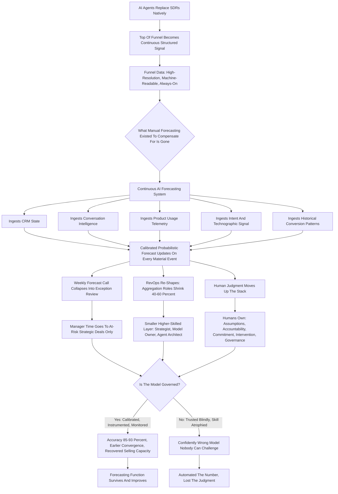
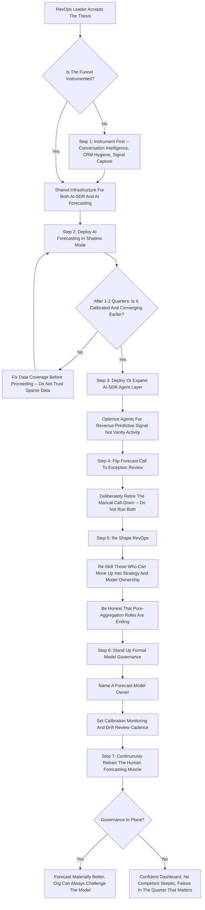

**TL;DR:** If AI agents replace SDRs natively, manual revenue forecasting -- the weekly AE call-down, the spreadsheet roll-up, the commit-vs-best-case-vs-stretch ritual that RevOps stitches together every Friday -- does not get "improved." It gets **structurally replaced** by a different operating model, because the entire premise of manual forecasting was a scarcity that no longer exists. Manual forecasting existed because pipeline was **expensive to generate, slow to qualify, and noisy to interpret**: a human SDR booked a finite number of meetings a week, each meeting was a low-resolution signal, and the only way to turn that fog into a number was to have humans (AEs, managers, RevOps) argue about it on a cadence. When AI agents source, qualify, and progress pipeline natively -- continuously, at signal-level resolution, with every touch logged as structured data -- the fog clears, and the thing that replaces manual forecasting is **continuous, signal-grounded, probabilistic revenue prediction**: a system, not a meeting. Concretely, five things replace the old motion. **(1) Continuous AI forecasting** -- Clari, Gong, Salesforce Einstein, BoostUp, Aviso, and increasingly native agent layers -- ingests CRM state, conversation data, product-usage telemetry, buying-committee signal, and historical conversion patterns to produce a forecast that updates on every material event, not every Friday. **(2) The forecast call collapses** from a weekly multi-hour ritual into a real-time dashboard plus a short exception review of only the deals the model flags as anomalous. **(3) RevOps re-shapes** -- the pipeline-hygiene, report-builder, and roll-up-aggregator roles shrink hard (a realistic 40-60% headcount reduction in those functions), while a smaller, higher-leverage layer of **revenue strategists, forecast-model owners, and agent-system architects** grows. **(4) The unit of forecasting changes** -- from "the deal as an AE describes it" to "the deal as the signal data reveals it," which means accuracy stops depending on rep honesty and starts depending on data coverage and model calibration. **(5) Human judgment moves up the stack** -- from *producing* the number to *governing* it: setting quota and capacity strategy, interpreting why the model and the field disagree, intervening on at-risk strategic deals, and owning the assumptions the model cannot see. The honest verdict: the **forecasting function survives and gets materially more accurate** (a credible move from roughly 70-80% to 85-93% within-tolerance accuracy), but **manual forecasting as a labor category -- the spreadsheet wrangling, the call-down, the sandbagging game -- does not survive.** The risk is not that the number gets worse; it is that organizations adopt the AI forecast without governing it, lose the institutional skill of forecasting, and end up trusting a confidently-wrong model with no human able to challenge it.

## What Manual Forecasting Actually Is -- And Why It Existed In The First Place

Before you can say what replaces manual forecasting, you have to be precise about what it *is*, because most discussions conflate the forecast (the number) with the process of producing it (the manual labor). Manual forecasting is a specific operating ritual: individual account executives assess each open opportunity, assign it a category (commit, best case, pipeline, omitted) and often a close date and a confidence, and report that up. Front-line managers roll their reps' calls into a team number, applying their own haircuts and adjustments. RevOps aggregates the team numbers, reconciles them against CRM state, builds the board slide, and surfaces the gap-to-plan. The CRO sits on top, applies a final judgment-based adjustment, and commits a number to the CEO and the board. This whole apparatus -- the weekly forecast call, the spreadsheet, the Clari board, the Friday roll-up -- exists for one reason: **pipeline was a low-resolution, expensive, human-mediated signal, and the number had to be manufactured from judgment because it could not be computed from data.** A human SDR booked maybe eight to fifteen meetings a week. Each meeting was a coarse event -- it happened or it didn't -- and what it *meant* lived in the AE's head, in call notes of wildly varying quality, in an email thread nobody parsed. The CRM was a lagging, partial, often-stale record. Given that input, the only way to get to a forecast was to have humans look at the fog and argue. Manual forecasting was never the goal; it was the **compensating control for bad data.** That framing matters, because it tells you exactly what changes when the data stops being bad.

## Why The SDR-To-AI Shift Is The Specific Trigger

It is worth being precise about why *the SDR layer specifically* turning into AI agents is the thing that breaks manual forecasting, as opposed to general "AI in sales." The SDR function sits at the top of the funnel, and it is the single largest source of the noise that made forecasting a judgment exercise. Human SDR pipeline is noisy in structured, well-documented ways: **activity-without-intent** (meetings booked to hit a meeting quota, not because the account is in-market), **inconsistent qualification** (every SDR applies BANT or MEDDIC slightly differently, or not at all), **lossy handoff** (what the SDR learned rarely survives the transfer to the AE intact), and **sparse signal** (a booked meeting tells you almost nothing about buying-committee dynamics, budget reality, or competitive context). When AI agents do the SDR job natively, three things change at once. First, **the work is continuous rather than batched** -- agents are not constrained to a workday or a meeting quota, so the top of funnel becomes a steady stream rather than a weekly pulse. Second, **every action is structured data by default** -- an agent does not "remember" a conversation, it logs it as parseable state, so the qualification reasoning, the signals observed, and the account context are all machine-readable. Third, **qualification becomes consistent and signal-driven** -- the agent applies the same logic every time and grounds it in observable signal (hiring data, technographic changes, product usage, intent, funding events) rather than gut feel. The funnel stops being a fog of human-mediated coarse events and becomes a high-resolution, continuously-updating, fully-instrumented data stream. **And the moment your input is high-resolution structured data, the manual judgment apparatus that existed to compensate for low-resolution data has no job left to do.** That is the mechanism. It is not that "AI is good at forecasting." It is that the AI-SDR shift removes the specific defect manual forecasting existed to patch.

## What Actually Replaces It: Continuous Signal-Grounded Probabilistic Forecasting

The thing that replaces manual forecasting is not "a better spreadsheet" or "AI-assisted forecast calls." It is a categorically different artifact: a **continuous, signal-grounded, probabilistic forecasting system** that runs as infrastructure rather than as a meeting. Its defining properties are worth stating concretely. It is **continuous** -- the forecast updates on every material event (a stage change, a new buying-committee contact engaged, a usage spike, a competitor mention on a call, a champion going dark) rather than on a weekly cadence; "the forecast" stops being a Friday snapshot and becomes a live state. It is **signal-grounded** -- the prediction is built from observable data (CRM state, conversation intelligence, email engagement, product telemetry, intent and technographic signal, historical conversion patterns by segment) rather than from the AE's self-reported category, so the forecast no longer depends on rep honesty or manager intuition. It is **probabilistic and calibrated** -- instead of a single committed number produced by stacked judgment haircuts, the system produces a distribution with explicit confidence, and a well-run version is *calibrated* (when it says 70%, those deals close ~70% of the time), which is something a manual process can almost never claim. It is **explainable at the deal level** -- a usable system does not just score a deal, it surfaces *why* (which signals moved it, what is missing, what looks anomalous versus similar historical deals), which is what makes the human exception review possible. And it is **multi-source** -- it does not rely on the CRM alone, because the CRM was always the lagging record; it fuses the CRM with the conversation layer, the product layer, and the external-signal layer. The shorthand "AI forecasting" undersells it. What replaces manual forecasting is a **forecasting operating system**: always-on, data-grounded, calibrated, explainable, and multi-source -- and the human work reorganizes around governing that system rather than manufacturing the number by hand.

## The Tool Landscape: Who Actually Builds This

This is not speculative; the category exists and is consolidating around a recognizable set of players, and a RevOps leader should understand the landscape rather than treat "AI forecasting" as a monolith. **Clari** is the incumbent revenue-platform leader, originally a forecasting and pipeline-inspection tool, now positioning around "revenue cadence" and autonomous workflows; its acquisition of Wingman gave it a conversation layer (Clari Copilot). **Gong** came from the conversation-intelligence side and pushed into forecasting from the data-richest input -- the actual customer conversations -- which is a structurally strong position when the whole game is signal grounding. **Salesforce** ships forecasting natively (Einstein/Sales Cloud forecasting and its Agentforce agent layer), which matters enormously because the CRM-native option has zero integration friction and owns the system of record. **BoostUp** and **Aviso** are the focused AI-forecasting challengers, competing specifically on model accuracy, scenario planning, and forecast-process rigor. **People.ai** and **Scratchpad** attack the data-capture and CRM-hygiene problem that forecasts depend on. On the AI-SDR side -- the trigger for this whole shift -- the players are platforms like **11x**, **Artisan**, **AiSDR**, **Qualified** (with its Piper agent), and the agent layers being built natively into Outreach, Salesloft, and HubSpot. The strategic point for a buyer: the **conversation-data owners** (Gong, Clari-via-Copilot) and the **CRM-of-record owner** (Salesforce) have the strongest structural claims on the forecast, because forecasting quality is downstream of data coverage -- and the AI-SDR layer increasingly *generates* the structured top-of-funnel data that all of them consume. The market is converging on a stack where the agent layer produces the signal and the revenue platform turns it into the forecast.

## The Forecast Call Does Not Survive In Its Current Form

The single most visible casualty of this shift is the **weekly forecast call**, and it is worth being honest about how thoroughly it changes. In the manual model, the forecast call is where the number is *made* -- the AE walks each deal, the manager challenges, categories get adjusted, the roll-up gets reconciled. It is expensive: a fully-loaded estimate of an AE's week in forecast-related activity (the call itself, the prep, the CRM updating done specifically to survive the call, the follow-up) runs several hours, and the manager and RevOps time stacks on top. When the forecast is produced continuously by a calibrated system, **the meeting's original purpose -- manufacturing the number -- is gone.** What replaces it is not nothing; it is a fundamentally different meeting. The recurring review becomes an **exception review**: the system has already produced the forecast and flagged the small subset of deals that are anomalous, at-risk, or where the model and the field disagree, and the human time goes entirely to *those* deals. The cadence often stretches -- weekly becomes biweekly for the full review because the dashboard is always current -- and the content shifts from "what is your number" to "why does the model think this strategic deal slipped, and do we agree." This is a genuine productivity unlock: AE time goes back to selling, manager time goes to coaching and intervention on real risk, and RevOps stops spending Thursday and Friday building a slide. But it is also a real cultural change, and organizations that keep the old call running *on top of* the new system -- because the ritual is comforting -- capture none of the savings and add confusion. The discipline is to actually let the old meeting die and replace it deliberately with the exception review.

## The RevOps Re-Shape: What Shrinks, What Grows

The headcount question is the one everyone actually wants answered, and it deserves a precise rather than a hand-wavy answer. The honest framing: **RevOps does not disappear -- it re-shapes, and the parts of it that were manual-forecasting labor shrink hard.** Map the function by activity. The roles that are *primarily* about compensating for bad data and manual aggregation -- pipeline hygiene and CRM clean-up, report and dashboard building, forecast roll-up and reconciliation, the weekly board-slide assembly -- are the roles the new system most directly displaces, and a realistic reduction in *that specific work* is 40-60% as continuous AI forecasting matures. But the roles that are about *governing* the revenue system grow in importance even if they do not grow much in number: the **revenue strategist** who interprets the forecast and owns quota and capacity strategy, the **forecast-model owner** who is accountable for calibration and for the model's assumptions, the **agent-system architect** who designs and maintains the AI-SDR and AI-forecasting stack, and the **data-quality and integration owner** who makes sure the signal feeding the model is trustworthy. The net effect on a typical 100-rep org's RevOps team is not "RevOps goes to zero"; it is something like "a 5-7 person team becomes a 3-4 person team with a meaningfully different and higher-skilled composition." The mistake organizations make in both directions: under-cutting (assuming the AI means you can eliminate RevOps entirely, then discovering nobody owns the model's assumptions and the forecast quietly drifts) and over-protecting (keeping the full manual team employed doing manual work *alongside* the AI system, capturing the cost but not the benefit). The right move is a deliberate re-skill: identify who on the team can move up into strategy and model ownership, and be honest that the pure-aggregation roles are genuinely going away.

## The Unit Of Forecasting Changes: From The Rep's Story To The Signal's Story

A subtle but profound shift: manual forecasting forecasts **the deal as the AE describes it**, and AI forecasting forecasts **the deal as the data reveals it** -- and that change in the *unit* of forecasting is what actually drives the accuracy improvement. In the manual model, the atomic input is the rep's judgment: their category, their close date, their confidence. Everything downstream is an operation on that judgment -- the manager's haircut, the RevOps reconciliation, the CRO's adjustment are all attempts to *correct* a fundamentally subjective input. This is why manual forecast accuracy is capped: you cannot reconcile your way out of bad primary data. The known failure modes are all judgment failures -- **sandbagging** (the rep commits low to over-deliver and protect themselves), **happy ears** (the rep believes the prospect's politeness is buying intent), **close-date fiction** (dates set to look good on the board, not to reflect reality), and **the commit game** (categories chosen for political safety, not predictive accuracy). When the unit of forecasting becomes the signal -- engagement patterns, buying-committee breadth, conversation content, usage trajectory, historical analogs -- the forecast stops being an operation on a subjective input and becomes a computation over observable evidence. The rep's view does not vanish; it becomes *one signal among many*, and crucially, the *divergence* between what the rep says and what the data shows becomes its own high-value signal (a rep committing a deal the data says is cold is exactly the deal a manager should inspect). This is the real source of the accuracy gain. It is not that the AI is smarter; it is that **the input changed from a story to evidence**, and you can compute over evidence in a way you never could over stories.

## Human Judgment Moves Up The Stack -- It Does Not Disappear

The most important and most misunderstood part of this shift: human judgment in forecasting does not get eliminated, it **moves up the stack** -- from producing the number to governing the system that produces it. This is worth enumerating concretely, because "humans still matter" is true but useless without specifics. Humans own, and will keep owning: **the assumptions the model cannot see** -- a pending pricing change, a re-org, a strategic pivot, a major competitor's move, a macro shift -- because the model only knows what is in its data, and the future is not always in the data. They own **quota and capacity strategy** -- how much pipeline coverage is enough, how to set quotas given the new agent-driven funnel economics, how to think about ramp and territory when SDR capacity is no longer the constraint. They own **the model-versus-field reconciliation** -- when the system and the experienced sales leader disagree, someone has to adjudicate, and that someone needs both forecasting literacy and domain judgment. They own **at-risk intervention on strategic deals** -- the model can flag a slipping enterprise deal, but a human has to actually do something about it. They own **forecast-model governance** -- calibration monitoring, watching for drift, deciding when the model needs retraining, owning the question "do we still trust this." And they own **the narrative** -- the board does not want a probability distribution, it wants an accountable human explaining the number and what is being done about the gap. The pattern across all of these: the human work is **lower-volume, higher-leverage, and higher-skill.** It is less "manufacture the number every Friday" and more "govern the system, own the assumptions, intervene on what matters, and stay accountable for the result." The organizations that thrive are the ones that deliberately invest in *that* skill set rather than assuming the AI made forecasting skill unnecessary.

## The Accuracy Question: How Much Better Does It Actually Get

A RevOps leader committing to this shift needs an honest answer on the accuracy upside, not a vendor number. The realistic picture: well-run manual forecasting in a competent organization lands somewhere around **70-80% of forecasts within 10% of actual** on a quarterly basis -- and plenty of organizations are worse than that, with the long tail of poorly-run forecast processes missing badly and unpredictably. Continuous AI forecasting, in a mature deployment with good data coverage, credibly moves that to roughly **85-93% within tolerance, often at a tighter tolerance** (within 5% rather than within 10%), *and* -- this is the underrated part -- it does so with **earlier convergence**, meaning the quarter's forecast stabilizes weeks sooner because the model is not waiting for the Friday call-downs to firm up. But the honest version includes the conditions. The accuracy gain is **entirely contingent on data coverage** -- a model fed a sparse, poorly-instrumented funnel will be confidently wrong, and the AI-SDR shift matters here precisely because it is what *creates* the dense structured funnel data the model needs. It is contingent on **calibration discipline** -- a model nobody is monitoring for drift will degrade silently. It is contingent on **avoiding the feedback-loop trap** -- if the AI forecast influences which deals reps work, it can become self-fulfilling in ways that look like accuracy but are actually the model steering reality to match itself. And the gain is **smaller in genuinely volatile segments** -- a brand-new product, a market in disruption, a tiny-sample enterprise motion -- where there simply is not enough historical signal for the model to be confident, and human judgment stays proportionally more important. The defensible claim is not "AI forecasting is 99% accurate." It is "AI forecasting is meaningfully and reliably better than manual, converges earlier, and is calibrated -- *if* you feed it good data and govern it."

## The Cost And Headcount Math, Concretely

It helps to ground the re-shape in actual numbers for a representative organization, because the abstract "RevOps shrinks" claim should be testable. Take a 100-rep B2B SaaS sales org. **The manual-era operating cost** of the forecasting-and-RevOps function looks roughly like this: a RevOps team of 5-7 people (a mix of analysts, ops managers, and a leader) at a fully-loaded cost in the range of $600K-$1.1M annually, plus a tooling stack -- a revenue platform, conversation intelligence, a CRM ops layer, dashboarding -- in the range of $150K-$400K annually, for a total in the $750K-$1.5M range. On top of that sits the *distributed* cost that never shows up on the RevOps line: the AE and manager hours consumed by forecast calls and CRM-for-the-call updating, which across 100 reps and their managers is a large hidden number. **The AI-forecasting-era operating cost** for the same org: a re-shaped RevOps team of 3-4 higher-skilled people at $400K-$700K fully loaded, plus a tooling stack that now includes the AI forecasting layer and the AI-SDR agent layer but consolidates some of the old point tools, landing in the $200K-$450K range, for a total in the $600K-$1.15M range. The headline savings on the *visible* line is real but modest -- often $150K-$400K -- and the bigger prize is the *recovered selling capacity* from killing the forecast-call tax. The strategic read: **the business case for this shift is not primarily RevOps cost reduction.** It is forecast accuracy, earlier convergence, and recovered rep capacity. An organization that justifies the move purely on "fire half of RevOps" is both overstating the line-item savings and missing the actual value -- and is likely to under-invest in the model governance that makes the whole thing work.

## What Does NOT Get Replaced -- The Durable Core

It is just as important to be precise about what survives unchanged, because over-claiming is how these shifts lose credibility. Several things are *not* replaced. **Accountability for the number** is not replaced -- a board still wants a named human (the CRO) who owns the forecast and is accountable for the gap-to-plan; you cannot point the board at a model. **The forecast as a commitment** is not replaced -- forecasting is not only a prediction exercise, it is a *commitment* exercise that drives hiring, spending, and investor guidance, and committing is an act of accountable judgment, not a computation. **Strategic-deal judgment** is not replaced -- the biggest, most complex, lowest-sample enterprise deals are exactly where models are weakest and where experienced human judgment stays load-bearing. **The assumptions layer** is not replaced -- pricing changes, re-orgs, product pivots, competitive moves, and macro shifts live outside the model's data and have to be injected by humans. **Cross-functional forecasting** is not replaced -- reconciling the sales forecast with finance's model, marketing's pipeline contribution, and CS's renewal and expansion forecast is an organizational negotiation, not a single model's output. And **the narrative and the intervention** are not replaced -- explaining *why* and actually *doing something* about a gap is human work. The clean way to hold this: AI replaces the **manufacturing of the forecast** -- the aggregation, the roll-up, the spreadsheet labor, the manual judgment that compensated for bad data. It does not replace the **ownership, commitment, and governance of the forecast.** Manual forecasting dies; accountable forecasting does not.

## The Failure Modes: How This Goes Wrong

A serious treatment has to be honest about how the transition fails, because it fails often, and in recognizable patterns. **Failure mode one: the confidently-wrong model nobody can challenge.** An organization deploys AI forecasting, the manual skill atrophies, and then the model is wrong in a quarter that matters -- a regime change it had no data for -- and there is no human left with the forecasting literacy to have caught it. The forecast got automated; the *judgment* got lost. **Failure mode two: garbage in, confident garbage out.** The model is deployed on top of a thinly-instrumented funnel, produces precise-looking forecasts from sparse data, and the precision is mistaken for accuracy. **Failure mode three: the self-fulfilling feedback loop.** The AI forecast influences which deals reps prioritize, reps work the deals the model likes, those deals close, and the model looks accurate -- but it has been steering reality, not predicting it, and it is blind to the deals it deprioritized. **Failure mode four: the ritual that won't die.** The organization stands up the AI system but keeps the full weekly manual forecast call running alongside it, capturing the cost of both and the benefit of neither. **Failure mode five: cutting RevOps to the bone.** Leadership reads "AI replaces manual forecasting" as "fire RevOps," eliminates the model-governance and data-quality roles too, and the forecast quality silently degrades because nobody owns the assumptions or the calibration. **Failure mode six: forecasting the wrong funnel.** The AI-SDR agents are optimized for a metric (meetings, engagement) that is not actually predictive of revenue, so the dense structured data feeding the forecast is dense, structured, and *misleading.* Every one of these is avoidable, and the avoidance is the same in each case: deploy the system, but *govern* it -- keep the human forecasting skill alive, instrument the funnel before trusting the model, monitor for the feedback loop, deliberately kill the old ritual, protect the governance roles, and make sure the agent layer is optimized for revenue, not vanity activity.

## The Transition Sequence: How To Actually Do This

For a RevOps leader who buys the thesis, the question is sequencing -- because doing this in the wrong order is itself a failure mode. The defensible sequence runs roughly like this. **First, instrument the funnel** -- before the AI forecast can be trusted, the data it consumes has to be dense and clean, which means getting conversation intelligence, CRM hygiene, and signal capture in place; this is also the prerequisite for the AI-SDR layer, so it is shared infrastructure. **Second, deploy AI forecasting in shadow mode** -- run the continuous model alongside the manual process for a quarter or two without acting on it, and measure: is it calibrated, does it converge earlier, where does it disagree with the field and who is right. **Third, deploy or expand the AI-SDR agent layer** -- this is what generates the high-resolution top-of-funnel data, and it should be optimized from day one for revenue-predictive signal, not raw activity. **Fourth, flip the forecast call to an exception review** -- once the model has earned trust in shadow mode, deliberately retire the manual call-down and replace it with the model-flagged exception review; do not run both. **Fifth, re-shape RevOps** -- with the manual aggregation work genuinely gone, re-skill the people who can move up into strategy and model ownership, and be honest about the roles that are ending. **Sixth, stand up formal model governance** -- name a forecast-model owner, set calibration monitoring, define the cadence for reviewing drift and assumptions. **Seventh, retrain the muscle continuously** -- keep enough humans forecasting-literate that the model can always be challenged. The throughline of the sequence: **earn trust before transferring authority, instrument before automating, and govern before you scale.** Organizations that jump straight to "fire RevOps and trust the dashboard" skip every step that makes the dashboard trustworthy.

## The Second-Order Effects On The Rest Of The Revenue Org

The shift does not stay contained in forecasting -- it ripples, and a RevOps leader should anticipate the second-order effects. **Quota setting changes** -- when SDR capacity is no longer the throttle on pipeline, the old "pipeline coverage" heuristics and the logic of quota-setting have to be rebuilt around agent-driven funnel economics. **Comp design comes under pressure** -- if agents source and qualify pipeline, what exactly is the AE being paid for, and how does the comp plan reflect a world where the human's contribution is concentrated in closing and relationship work rather than the full funnel. **The AE role itself narrows and deepens** -- less prospecting and early qualification, more late-stage execution, multi-threading, and strategic deal work, which changes hiring profiles and ramp expectations. **Manager work shifts** -- from running forecast calls to coaching on the exception deals the model surfaces, which is arguably a better use of manager time but requires a different skill. **Finance's relationship to the forecast changes** -- a continuous, calibrated, probabilistic forecast is a different input to FP&A than a quarterly committed number, and the two functions have to renegotiate how they consume each other's models. **The board conversation changes** -- boards will increasingly expect the calibrated-probability framing and will ask harder questions about model governance. And **the data moat compounds** -- the organizations that instrument early get better forecasts, which compound into better capacity and quota decisions, which compound into better execution. The strategic point: treating this as "a forecasting tool change" under-scopes it. It is a **revenue-operating-model change**, and the forecasting piece is just the most visible part.

## The Data Architecture Underneath: What The Forecast Actually Runs On

It is worth going one level deeper than "the model ingests signal," because the data architecture is where this shift is won or lost, and a RevOps leader who hand-waves it will deploy a confident, hollow forecast. The continuous forecast runs on four distinct data layers, each with its own ownership and failure mode. **Layer one is the system of record** -- the CRM -- which holds deal stage, amount, close date, and account structure; it is necessary but it was always the *lagging* layer, a record of decisions already made, and a forecast built on the CRM alone is the manual forecast with extra steps. **Layer two is the conversation layer** -- the recorded and transcribed calls, the emails, the meeting content -- which is the richest source of *leading* signal, because it captures what the buyer actually said, who was in the room, what objections surfaced, whether a champion is engaged or going quiet; this is the layer Gong was built on and the reason conversation-data owners have a structural claim on the forecast. **Layer three is the product-and-usage layer** -- for product-led or hybrid motions, the actual telemetry of how the prospect or the expansion account is using the product, which is often the single most predictive signal and is entirely invisible to a manual process. **Layer four is the external-signal layer** -- intent data, technographic and firmographic changes, hiring signals, funding events, leadership changes -- the context the AI-SDR agents were already consuming to source and qualify, now feeding the same model that forecasts. The architectural point is that the forecast quality is a function of *how many of these layers are instrumented and fused*, and most organizations have layer one, partial layer two, and nothing else. The work of "getting ready for AI forecasting" is overwhelmingly the unglamorous work of instrumenting layers two through four and fusing them into a coherent account-and-deal state -- and the organizations that treat the model as the project, rather than the data architecture as the project, build a precise-looking forecast on a one-layer foundation and call the resulting confidence "accuracy."

## Why The CRO And The Board Conversation Changes Shape

The forecast is not only an internal operating artifact; it is the thing the CRO carries into the boardroom, and the AI shift changes the *shape* of that conversation in ways worth anticipating. In the manual era, the board conversation is built around a single committed number and a narrative: here is the commit, here is the gap to plan, here is what we are doing about it. The number is a point estimate produced by stacked judgment, and everyone in the room implicitly understands it is soft. In the continuous-AI era, the artifact the CRO has available is richer and more uncomfortable: a calibrated distribution, an explicit confidence band, a model-versus-field divergence, a set of flagged at-risk deals. A sophisticated board will *want* that richer artifact -- and will start asking the harder questions that come with it: how is the model calibrated, who owns it, what is it blind to, why does it disagree with the field on the three biggest deals. This is genuinely better governance, but it raises the bar on the CRO and the RevOps leader: they can no longer hide a soft number inside a confident narrative, and they have to be literate enough in the model to defend or challenge it in real time. The CRO's job shifts from *presenting the number* to *owning the system that produces the number and the judgment layered on top of it.* The organizations that handle this well treat the board's model-governance questions as legitimate and come prepared; the ones that handle it badly either over-trust the model ("the system says 4.2 million") or under-trust it ("I know the model says that, but my gut says...") without being able to articulate *why* either the model or the gut deserves the weight. The board conversation becomes a test of whether the organization actually governs its forecast or just runs one.

## The Strategic-Deal Carve-Out: Where The Model Stays Junior

A recurring theme deserves its own treatment, because it is the most important boundary condition on the whole thesis: **the largest, most complex, lowest-sample deals are exactly where the AI forecast stays junior to human judgment, and that is not a temporary limitation -- it is structural.** Continuous AI forecasting is strongest where it has dense historical analogs: a high-volume mid-market motion, a mature product, a well-trodden segment where thousands of similar deals have closed or not closed and the model can learn the patterns. The strategic enterprise deal is the opposite of that environment in every way -- it is large enough to move the quarter by itself, it has a buying committee of eight to fifteen people with idiosyncratic politics, it is often a multi-quarter cycle, it involves a custom commercial structure, and crucially *there are not thousands of analogs* -- there might be a few dozen deals of that shape in the company's entire history. A model extrapolating from a thin sample of non-analogous deals is not forecasting; it is guessing with a confidence interval. This is why the operating model that works carves these deals out explicitly: the model still scores them and still surfaces signal (a champion going dark on a $2M deal is worth flagging), but the *forecast* on the strategic deals is owned by the experienced sales leader and the deal team, with the model as an input, not the authority. The mistake is letting the model's confidence on the high-volume motion bleed into false confidence on the strategic deals -- treating a 90%-calibrated mid-market model as if it is 90%-calibrated on the enterprise whale. The discipline is segment-aware authority: the model leads where it has sample, humans lead where they do not, and someone owns knowing which is which.

## The Skill That Must Not Be Lost: Forecasting Literacy As A Capability

The single most underrated risk in this whole transition has a name: **forecasting literacy** -- the institutional capability to read a deal, sense when a number is soft, know the difference between a model that is right and a model that is confident, and challenge the system when it deserves challenging. In the manual era, this skill was *forced* -- every AE, every manager, every RevOps analyst practiced it every week because the process required it. It was inefficient, but it had a side effect: the organization stayed forecasting-literate as a matter of course. When the manual process goes away, that forced practice goes away with it, and forecasting literacy quietly stops being maintained. For years this is invisible and even looks like progress -- the model is accurate, nobody is wasting time on call-downs, the dashboard is always current. Then comes the quarter the model is wrong about a regime it had no data for -- a sudden macro shift, a competitor's disruptive move, a category re-pricing -- and the organization discovers it has nobody left who can look at the confident dashboard and say "this is wrong, and here is why." The skill atrophied because nobody practiced it. The organizations that handle this deliberately treat forecasting literacy as a capability to be *maintained on purpose*: they keep a core of humans actively forecasting in parallel as a discipline, they run the model-versus-field divergence as a teaching tool rather than just an exception queue, they rotate people through model-governance roles, and they treat "can a competent human challenge this model" as a standing operational requirement, not an afterthought. The principle is simple and easy to get wrong: **automating the forecast is fine; automating away the ability to know when the forecast is wrong is the failure.** The forecast is a number; forecasting is a skill, and the skill is the thing worth protecting.

## The Honest Synthesis: What Replaces Manual Forecasting

Pulling it together into a single defensible answer. If AI agents replace SDRs natively, what replaces manual forecasting is **a continuous, signal-grounded, calibrated, explainable forecasting system, governed by a smaller and higher-skilled human layer that owns assumptions, accountability, and intervention rather than aggregation.** The mechanism is specific and not hype: the AI-SDR shift removes the low-resolution-data defect that manual forecasting existed to compensate for, so the manual compensating apparatus -- the call-down, the roll-up, the spreadsheet, the sandbagging game -- loses its job. The replacement is genuinely better on the dimensions that matter: it is more accurate (a credible 70-80% to 85-93% within-tolerance move), it converges earlier, it is calibrated in a way manual processes structurally cannot be, and it frees real selling and managing capacity. But the replacement is *not* a magic oracle, and the honest verdict has to hold both halves: **the forecasting function survives and improves; manual forecasting as a labor category does not.** The durable human core -- accountability for the number, the commitment act, strategic-deal judgment, the assumptions layer, governance, and narrative -- is real and load-bearing, and the organizations that thrive are the ones that deliberately *move human judgment up the stack* rather than assuming AI eliminated the need for it. The single biggest risk in the whole transition is not that the model is bad. It is that an organization adopts the forecast and abandons the *forecasting* -- automating the number while letting the institutional skill of governing it atrophy -- and is then left with a confident dashboard nobody can challenge in the one quarter where challenging it mattered. The right posture: deploy the system aggressively, govern it seriously, instrument before you automate, kill the old ritual deliberately, protect the governance roles, and keep enough humans forecasting-literate that the machine always has a competent skeptic. Do that, and the forecast gets materially better. Skip the governance, and you have just automated your way to a more confident version of being wrong.

## The Replacement Architecture: From Manual Roll-Up To Governed Continuous Forecast

## The Decision Path: How A RevOps Leader Should Sequence The Transition

## Sources

1. **Clari -- Revenue Platform And Forecasting** -- Incumbent revenue-platform vendor; forecasting, pipeline inspection, revenue cadence, and the Copilot conversation layer. https://www.clari.com
2. **Clari Copilot -- Conversation Intelligence** -- Conversation-intelligence layer (formerly Wingman) feeding signal into the forecast. https://www.clari.com/products/copilot
3. **Gong -- Revenue Intelligence And Forecasting** -- Conversation-intelligence-led platform that pushed into forecasting from the customer-conversation data layer. https://www.gong.io
4. **Salesforce -- Sales Cloud Forecasting And Einstein** -- CRM-native forecasting and predictive scoring; the system-of-record option with zero integration friction. https://www.salesforce.com/sales/forecasting
5. **Salesforce Agentforce -- Agentic AI Layer** -- Salesforce's native AI agent platform, relevant to both the AI-SDR and AI-forecasting layers. https://www.salesforce.com/agentforce
6. **BoostUp -- AI Revenue Forecasting** -- Focused AI-forecasting challenger competing on model accuracy and forecast-process rigor. https://boostup.ai
7. **Aviso -- AI-Powered Forecasting And Revenue Intelligence** -- AI-forecasting and scenario-planning platform. https://www.aviso.com
8. **People.ai -- Revenue Data And Activity Capture** -- Activity-capture and revenue-data platform addressing the CRM-coverage problem forecasts depend on. https://www.people.ai
9. **Scratchpad -- CRM Hygiene And Pipeline Workspace** -- Tooling targeting the CRM-data-quality problem upstream of the forecast. https://www.scratchpad.com
10. **Outreach -- Sales Execution Platform** -- Sales-engagement platform building native agent and forecasting capability. https://www.outreach.io
11. **Salesloft -- Revenue Orchestration Platform** -- Sales-engagement platform with conversation intelligence and agentic features. https://www.salesloft.com
12. **HubSpot -- CRM And Sales Hub Forecasting** -- CRM-native forecasting and AI features for the mid-market. https://www.hubspot.com
13. **11x -- AI SDR Agents** -- AI-agent platform automating the SDR function (Alice and related agents). https://www.11x.ai
14. **Artisan -- AI Sales Agents** -- AI-SDR agent platform (Ava) automating outbound prospecting and qualification. https://www.artisan.co
15. **Qualified -- Piper The AI SDR** -- AI-SDR agent operating on website and pipeline-generation workflows. https://www.qualified.com
16. **AiSDR -- AI Sales Development Representative** -- AI-agent platform for automated outbound and lead engagement. https://aisdr.com
17. **Gartner -- Sales Forecasting And Revenue Operations Research** -- Analyst research on forecast accuracy benchmarks, RevOps function design, and AI in sales. https://www.gartner.com
18. **Forrester -- Revenue Operations And B2B Sales Research** -- Analyst coverage of RevOps maturity, forecasting practice, and the AI-agent shift in go-to-market. https://www.forrester.com
19. **OpenView Partners -- SaaS Benchmarks And Go-To-Market Research** -- SaaS operating benchmarks including sales-org structure and efficiency metrics. https://openviewpartners.com
20. **Pavilion -- Revenue Leadership Community And Benchmarks** -- Practitioner community and benchmark data for CROs, RevOps, and sales leaders. https://www.joinpavilion.com
21. **a16z -- Enterprise And AI-Agent Go-To-Market Analysis** -- Investor analysis on AI agents reshaping sales development and go-to-market motions. https://a16z.com
22. **SaaStr -- Sales And RevOps Operating Practice** -- Practitioner content on forecasting cadence, RevOps team design, and sales-org economics. https://www.saastr.com
23. **The Bridge Group -- SDR And Sales Development Metrics** -- Benchmark research on SDR productivity, ramp, and the metrics the AI-SDR shift displaces. https://www.bridgegroupinc.com
24. **RevOps Co-op -- Revenue Operations Practitioner Community** -- Practitioner community on RevOps tooling, forecast process, and function design.
25. **Salesforce State Of Sales Report** -- Periodic survey data on sales-org practices, forecasting, and AI adoption. https://www.salesforce.com/resources/research-reports/state-of-sales
26. **Gong Labs -- Sales Data Research** -- Data-driven research on deal signals, conversation patterns, and what actually predicts close. https://www.gong.io/labs
27. **MEDDIC / MEDDPICC Sales Qualification Framework** -- Reference for the enterprise qualification methodology AI agents increasingly operationalize.
28. **Winning By Design -- Revenue Architecture Methodology** -- Framework reference for funnel design and revenue-process architecture in the agent era.
29. **CRO And RevOps Compensation And Headcount Benchmark Surveys** -- Reference points for RevOps team size and cost in mid-market and enterprise SaaS.
30. **Conversation Intelligence And Forecast-Accuracy Industry Studies** -- Studies on the relationship between data coverage, conversation capture, and forecast accuracy.

## Numbers

**Forecast Accuracy: Manual Versus Continuous AI**

| Dimension | Manual Forecasting | Continuous AI Forecasting |
|---|---|---|
| Within-tolerance accuracy (quarterly) | ~70-80% within 10% of actual | ~85-93% within 5-10% of actual |
| Tolerance band typically achievable | Within 10% | Within 5% |
| Forecast convergence | Late in quarter (firms up near close) | Weeks earlier (stabilizes mid-quarter) |
| Calibration (stated % matches actual %) | Rarely calibrated | Calibrated when governed |
| Primary input | Rep self-reported category | Observable multi-source signal |
| Update cadence | Weekly (the forecast call) | Continuous (every material event) |
| Dependency | Rep honesty + manager intuition | Data coverage + model governance |

**The Forecast-Call Tax (Per AE, Manual Model)**
- Forecast call itself + prep + call-driven CRM updating + follow-up: several hours/week per AE
- Manager time: stacks on top across every team
- RevOps time: roll-up and board-slide assembly consumes the back half of the week
- Replaced by: real-time dashboard + short exception review of model-flagged deals only

**RevOps Re-Shape (Representative 100-Rep B2B SaaS Org)**

| Line Item | Manual Era | AI-Forecasting Era |
|---|---|---|
| RevOps headcount | 5-7 people | 3-4 higher-skilled people |
| RevOps fully-loaded cost | $600K-$1.1M/yr | $400K-$700K/yr |
| Tooling stack | $150K-$400K/yr | $200K-$450K/yr (adds AI layers, consolidates point tools) |
| Total visible cost | $750K-$1.5M/yr | $600K-$1.15M/yr |
| Visible line-item savings | -- | ~$150K-$400K/yr |
| Bigger prize | -- | Recovered selling capacity + accuracy + earlier convergence |

**What Shrinks Versus What Grows In RevOps**
- Shrinks 40-60%: pipeline hygiene, report/dashboard building, forecast roll-up and reconciliation, board-slide assembly
- Grows in importance (not headcount): revenue strategist, forecast-model owner, agent-system architect, data-quality/integration owner
- Net: a 5-7 person team becomes a 3-4 person team with materially different, higher-skilled composition

**The Five Things That Replace Manual Forecasting**

| # | Replacement | What It Displaces |
|---|---|---|
| 1 | Continuous signal-grounded AI forecasting system | The weekly spreadsheet roll-up |
| 2 | Real-time dashboard + exception review | The weekly multi-hour forecast call |
| 3 | Smaller, higher-skilled RevOps layer | The pipeline-hygiene and aggregation roles |
| 4 | The signal as the unit of forecasting | The rep's story as the unit of forecasting |
| 5 | Human judgment moved up the stack (governance) | Human judgment spent manufacturing the number |

**Manual Forecasting Failure Modes (Judgment Failures The Signal Model Removes)**
- Sandbagging: rep commits low to over-deliver and self-protect
- Happy ears: rep reads prospect politeness as buying intent
- Close-date fiction: dates set for the board, not for reality
- The commit game: categories chosen for political safety, not accuracy
- Spreadsheet error rate: a real 5-15% in manually-aggregated roll-ups

**AI-Forecasting Failure Modes (The New Risks To Govern)**
- Confidently-wrong model nobody can challenge (atrophied human skill)
- Garbage in, confident garbage out (sparse funnel instrumentation)
- Self-fulfilling feedback loop (forecast steers which deals get worked)
- The ritual that won't die (manual call kept alongside the AI system)
- Cutting RevOps to the bone (governance and data-quality roles eliminated too)
- Forecasting the wrong funnel (agents optimized for vanity activity, not revenue signal)

**Accuracy Gain Is Contingent On**
- Data coverage: sparse funnel = confident but wrong
- Calibration discipline: unmonitored models drift silently
- Avoiding the feedback loop: prediction must not become steering
- Segment maturity: smaller gain in volatile/new/low-sample motions

**The Transition Sequence**
1. Instrument the funnel (shared infra for AI-SDR and AI forecasting)
2. Deploy AI forecasting in shadow mode (1-2 quarters, measure calibration)
3. Deploy/expand the AI-SDR agent layer (optimized for revenue-predictive signal)
4. Flip the forecast call to an exception review (retire the manual call-down)
5. Re-shape RevOps (re-skill up, be honest about ending roles)
6. Stand up formal model governance (named owner, calibration monitoring)
7. Continuously retrain the human forecasting muscle

**What Does NOT Get Replaced**
- Accountability for the number (a named human owns the gap-to-plan)
- The forecast as a commitment (commitment is accountable judgment, not computation)
- Strategic-deal judgment (lowest-sample enterprise deals = weakest model territory)
- The assumptions layer (pricing, re-orgs, pivots, competitive and macro shifts)
- Cross-functional reconciliation (sales vs finance vs marketing vs CS forecasts)
- The narrative and the intervention (explaining why, and doing something about it)

## Counter-Case: Where The "AI Replaces Manual Forecasting" Thesis Is Wrong Or Oversold

The case above is the realistic one, but a serious RevOps leader should stress-test it hard, because the thesis is easy to oversell and several of the counter-arguments are genuinely strong.

**Counter 1 -- The trigger may not happen as cleanly as assumed.** The whole argument rests on "AI agents replace SDRs natively." But the AI-SDR category, as of the mid-2020s, is real but uneven -- agents are good at high-volume, low-complexity outbound and weak at nuanced, multi-threaded, relationship-heavy qualification. If SDRs are *augmented* rather than *replaced* -- a human SDR running a fleet of agents -- the funnel data is still partly human-mediated and partly noisy, and manual forecasting's defect is reduced but not removed. The clean "the trigger fires, the fog clears" story may be a half-story for years.

**Counter 2 -- Garbage in is still the dominant reality.** The accuracy gain is entirely contingent on data coverage, and most organizations have *bad* data coverage -- partial CRM instrumentation, conversation intelligence on a fraction of calls, no product telemetry integration. An AI forecast on top of a poorly-instrumented funnel is not better than manual forecasting; it is *worse*, because it launders sparse data into precise-looking numbers that get trusted. For the median organization, "deploy AI forecasting" without first doing years of unglamorous instrumentation work just moves the failure mode from "visibly fuzzy" to "invisibly confident."

**Counter 3 -- The self-fulfilling feedback loop is not a corner case.** Once an AI forecast influences which deals reps prioritize -- and it will, because that is the point of deal scoring -- the model starts steering the reality it claims to predict. Reps work the deals the model likes, those close, the model looks accurate, and it is systematically blind to the deals it deprioritized. This is not a bug you patch; it is a structural property of any predictive system that feeds back into the process it predicts, and it can make a model look far more accurate than it actually is.

**Counter 4 -- Forecasting is a commitment, and commitment is irreducibly human.** A lot of the thesis treats forecasting as a *prediction* problem. But the forecast that goes to the board is a *commitment* -- it drives hiring, spending, and investor guidance, and the act of committing is an act of accountable judgment. A calibrated probability distribution is an input to that commitment, not a replacement for it. You cannot point a board at a model. The "manual forecasting dies" framing under-weights how much of the work was never prediction in the first place.

**Counter 5 -- The accuracy ceiling in volatile segments is real and low.** The model is strongest where there is dense historical signal -- a mature product, a high-volume motion, a well-trodden segment. It is weakest exactly where forecasting matters most for strategic decisions: a brand-new product, a market in disruption, a tiny-sample enterprise motion. In those segments the AI forecast is not meaningfully better than experienced human judgment, and may be worse, because it is extrapolating from data that does not exist.

**Counter 6 -- The headcount savings are overstated and the wrong reason to do it.** The visible RevOps line-item savings for a 100-rep org is often only $150K-$400K -- real, but small relative to the disruption, the tooling spend, and the change-management cost. Organizations that justify the move on "fire half of RevOps" are both overstating the savings and setting themselves up to under-invest in the governance roles that make the system work. If the business case is cost reduction, the business case is weak.

**Counter 7 -- Institutional skill atrophy is a slow, invisible, expensive failure.** When the manual process goes away, the *skill* of forecasting -- reading a deal, smelling a sandbag, knowing when the field is right and the dashboard is wrong -- atrophies, because nobody practices it anymore. This is fine for years, right up until the quarter where the model is confidently wrong about a regime it had no data for, and there is no human left who can catch it. The cost of this failure is enormous and it is invisible until it lands.

**Counter 8 -- Vendor incentives pollute the accuracy claims.** Every accuracy number in this space comes from a vendor with a product to sell, measured on their reference customers, under their definition of "accuracy." The honest benchmark literature is thin. A RevOps leader treating vendor accuracy claims as ground truth is being sold to, and the realistic gain may be smaller and far more variable than the marketing suggests.

**Counter 9 -- The transition cost is high and the disruption is real.** Instrumenting the funnel, running shadow mode for quarters, re-skilling a team, killing an ingrained ritual, standing up governance -- this is a multi-quarter organizational change program, not a tool purchase. Organizations underestimate it badly, and a half-finished transition (the AI system deployed but the old ritual still running, or the model trusted but ungoverned) can be *worse* than either pure state.

**The honest verdict.** The core thesis holds *as a direction of travel*: as the funnel genuinely instruments and AI agents genuinely take over SDR work, the manual forecasting apparatus loses its reason to exist and a continuous, governed, signal-grounded system is the right replacement. But the thesis is routinely oversold on four points: the trigger is messier and slower than "SDRs get replaced," the accuracy gain is entirely contingent on data work most organizations have not done, the savings are smaller than claimed, and the durable human core (commitment, accountability, strategic judgment, governance) is larger than the hype admits. The defensible position: this *is* where forecasting is going, the destination *is* better, but the organizations that win treat it as a multi-year, governance-heavy operating-model change -- not a dashboard you buy and a team you cut.

## Related Pulse Library Entries

- **q1898** -- How much does RevOps headcount shrink when AI agents run go-to-market? (The headcount-reduction detail referenced throughout; the direct companion entry on RevOps team re-shape.)
- **q1881** -- What happens to the AE role when AI agents own top-of-funnel? (The downstream role change once SDRs are agents and the funnel narrows for the human seller.)
- **q1882** -- How do you set quota when SDR capacity is no longer the pipeline throttle? (The quota-strategy second-order effect of the AI-SDR shift.)
- **q1883** -- What does sales comp design look like when agents source and qualify pipeline? (The comp-design pressure the forecasting shift creates.)
- **q1884** -- How do you evaluate AI SDR agent platforms in 2027? (Buyer's guide to the 11x / Artisan / Qualified / AiSDR layer that triggers this whole shift.)
- **q1885** -- What is revenue intelligence and how is it different from a CRM? (Background on the Clari / Gong / BoostUp / Aviso category that builds the replacement forecast.)
- **q1886** -- How do you instrument a sales funnel for AI forecasting? (The "instrument first" prerequisite step in the transition sequence.)
- **q1887** -- What is forecast calibration and why does it matter? (Deep dive on the calibration property that manual processes structurally cannot achieve.)
- **q1888** -- How do you run an exception-based forecast review? (The meeting that replaces the weekly manual forecast call.)
- **q1889** -- What roles survive in RevOps after AI automation? (Companion detail on the revenue strategist / model owner / agent architect layer that grows.)
- **q1890** -- How do you govern an AI forecasting model? (The model-governance discipline that separates the success case from the confidently-wrong-model failure mode.)
- **q1891** -- What is the self-fulfilling feedback loop in AI deal scoring? (Deep dive on counter-argument three -- prediction that steers the reality it predicts.)
- **q1892** -- How accurate is AI sales forecasting really? (The honest-benchmark question behind the accuracy numbers, including vendor-incentive caveats.)
- **q1893** -- How does finance consume a probabilistic sales forecast? (The cross-functional reconciliation between the new forecast and FP&A's model.)
- **q1894** -- What is MEDDIC and how do AI agents operationalize it? (The qualification framework AI agents apply consistently where humans applied it unevenly.)
- **q1895** -- How do you re-skill a RevOps team for the AI era? (The "re-shape RevOps" step -- moving people up into strategy and model ownership.)
- **q1896** -- What is conversation intelligence and how does it feed the forecast? (The Gong / Clari Copilot data layer that grounds the signal-based forecast.)
- **q1897** -- How do you transition off the weekly forecast call without losing control? (The change-management problem of killing the ingrained ritual.)
- **q1899** -- What is the future of the CRO role in an agent-driven revenue org? (Where accountability and the commitment act land when manufacturing the number is automated.)
- **q1900** -- How do you build a revenue operating model around AI agents? (The systems-level view: forecasting as one visible piece of a larger operating-model change.)
- **q9501** -- Benchmark entry -- structural-shift analysis pattern. (Reference entry for depth and structure of a strategy deep dive.)
- **q9502** -- Benchmark entry -- scaling-path analysis pattern. (Reference entry for the multi-stage transition-sequence treatment.)
- **q9601** -- How do you build an AI-agent go-to-market stack in 2027? (The broader agent-stack context the AI-SDR and AI-forecasting layers sit inside.)
- **q9701** -- What is the best revenue intelligence software in 2027? (Deep dive on the Clari / Gong / Salesforce / BoostUp / Aviso tool landscape.)
- **q9801** -- What is the future of B2B sales in 2030? (Long-term outlook context for the agent-driven revenue org.)

