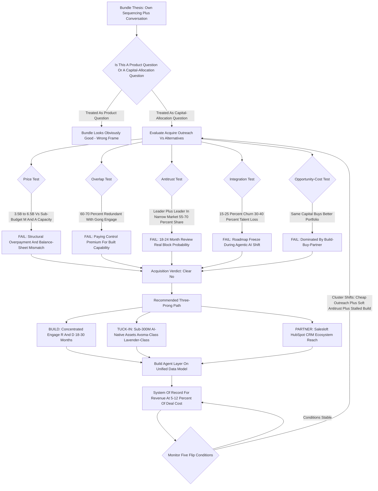
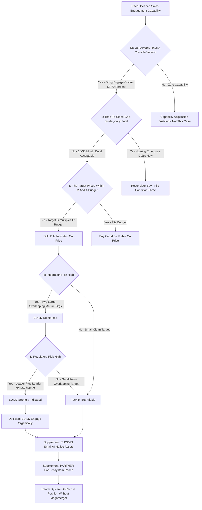

**TL;DR:** No. Gong should not acquire Outreach to bundle conversation intelligence with sales sequencing -- the deal looks strategically elegant on a whiteboard and falls apart the moment it touches price, product overlap, regulators, and integration math. The seductive thesis is the "system of record for revenue": one platform that owns the full GTM motion from prospecting cadence through call capture through deal inspection and forecasting, the last great unclaimed territory in B2B SaaS. That thesis is real enough to deserve a genuine steelman. But the case against is not one objection -- it is five that all point the same direction. **Price:** Outreach's last public mark was **$4.4B at its June 2021 Series G** (Premji Invest and Steadfast led, roughly $230M ARR then); a 2027 take-private or pre-IPO purchase realistically clears **$3.5B-$6.5B**, which is **five to eight times** any plausible Gong M&A budget and consumes a decade of capital-allocation freedom in a single transaction. **Redundancy:** **Gong Engage shipped September 12, 2023** and already does sequencing, AI email assistance, and task orchestration -- a parity audit puts overlap at **60-70%**, meaning Gong would pay a control premium for a capability it has already built. **Antitrust:** combined share in a narrowly defined "AI revenue platform" market plausibly clears **55-70%**, and against the FTC's 2023 Merger Guidelines plus an engaged CMA and European Commission, an 18-24 month review with a real block probability is the base case -- Adobe-Figma (terminated December 2023, $1B reverse termination fee) is the cautionary precedent everyone in the room will cite. **Integration drag:** rev-tech megamergers routinely shed **15-25% of overlapping accounts** and **30-40% of senior engineering and quota-carrying talent**, and freeze the roadmap for **18-24 months** exactly when agentic AI is rewriting the category. **Opportunity cost:** the same capital and attention buys a far better portfolio. The alternative dominates on expected value: **build** Engage deeper with concentrated R&D, **tuck-in acquire** a sub-$300M AI-native asset (an Avoma-class conversation engine, a Lavender-class email layer), and **partner** with Salesloft or HubSpot for distribution -- the full revenue workflow at roughly **5-12% of the cost** and none of the regulatory or integration tail risk. The steelman -- category-defining moat, a possible valuation-compression entry window, a friendlier antitrust climate, and the genuine risk that organic sequencing depth simply takes too long -- earns perhaps **25-30% weight**. It does not earn the company. Verdict: a clear no, with an honest asterisk, and a specific build-buy-partner sequence that gets Gong the same strategic destination without betting the firm on a $5B merger.

## The Strategic Question, Stated Precisely

The question "should Gong acquire Outreach to bundle conversation plus sequencing" hides three separate questions inside one sentence, and most people answer only the easiest one. The easy question is the product question: would a platform that does both prospecting cadences and conversation intelligence be useful to a revenue team? Yes, obviously -- the two motions are adjacent, the data flows naturally between them, and customers already wire them together with integrations. But that is not the decision. The decision is a capital-allocation question -- is acquiring Outreach the best use of the largest check Gong will ever write -- and a corporate-strategy question -- does owning sequencing outright beat building it, partnering for it, or buying a smaller piece of it. When you separate the three, the product question is a clear yes and the other two are a clear no, and the other two are the ones that actually govern. The discipline this whole analysis demands is refusing to let "the combined product would be good" stand in for "the acquisition is the right move." Almost every value-destroying megamerger in software history was defensible at the product layer and indefensible at the capital-allocation layer. Adobe genuinely would have been better with Figma inside it. Plaid genuinely would have extended Visa's reach. The products made sense; the deals did not. Gong-Outreach belongs in exactly that family: a product logic that is real, wrapped around a transaction logic that does not survive contact with the numbers. So the frame for everything below is not "is the bundle good." It is: given a real but bounded M&A budget, a regulatory environment that scrutinizes exactly this kind of horizontal consolidation, a target priced at a 2021 peak, and an internal product that already covers most of the gap -- is this specific $5B move the highest-expected-value path to the system-of-record-for-revenue position. It is not.

## Why This Particular Bundle Tempts Everyone

It is worth being honest about why this deal keeps coming up, because the temptation is not stupid -- it is the single most intuitive consolidation play in all of revenue technology. The modern GTM stack is fragmented across a dozen tools: a sequencer for outbound, a conversation-intelligence layer for calls, a forecasting tool, a data-enrichment vendor, a scheduler, a CPQ system, a CRM holding it all loosely together. Every CRO complains about the seams. Every RevOps leader spends real budget on the integration glue. And the two pieces that feel most obviously like one product are sequencing and conversation intelligence -- because they are the bookends of the same conversation. Sequencing gets the meeting booked; conversation intelligence captures what happened in it; the outcome should feed straight back into the next sequence. When you draw that loop on a whiteboard, the case for one company owning both writes itself. Add the AI narrative on top: an agent that drafts the outreach, joins the call, summarizes it, updates the CRM, and triggers the follow-up cadence is a genuinely compelling 2027 product, and it is far easier to build that agent on top of one unified data model than across two companies' APIs. So the temptation is structural and rational. The error is not in finding the bundle attractive -- it is in concluding that "attractive bundle" implies "acquire the second-largest standalone vendor of the other half at a peak-cycle price." The bundle is the destination. Acquiring Outreach is one route to it, and as the rest of this analysis shows, it is the most expensive, most regulated, most operationally hazardous route on the map. The temptation is real. The conclusion that it implies the acquisition is the mistake.

## What Gong Is In 2027: The Acquirer's Starting Position

To judge the deal you have to be precise about what Gong already is, because the single biggest factual error in pro-deal reasoning is treating Gong as a pure conversation-intelligence company that needs Outreach to enter sequencing. That stopped being true in September 2023. Gong is, in 2027, a revenue-intelligence platform: it captures and analyzes customer conversations across calls, email, and meetings; it runs deal inspection and pipeline risk scoring; it powers forecasting; and -- critically -- since the **September 12, 2023 launch of Gong Engage**, it ships a native sales-engagement product with sequencing, AI-assisted email, dialer, and task orchestration. Gong is widely reported to have crossed roughly $300M ARR around 2023 and to be a clear category leader in conversation and revenue intelligence, last privately valued in the **$7-7.25B range in its 2021 round**. It is not a single-product company shopping for a second product. It is a multi-product platform that has already planted a flag in Outreach's core territory and is now deciding whether to deepen that flag organically or buy the incumbent. That distinction changes the entire deal logic. If Gong had no sequencer, Outreach would be a capability acquisition -- expensive, but at least buying something Gong lacks. Because Gong has Engage, Outreach is a consolidation acquisition -- buying a competitor in a category Gong already operates in, which is simultaneously the version regulators scrutinize hardest and the version where the acquirer is most likely to be overpaying for redundancy. Gong's starting position is strong: category leadership in its core, a credible second product already in market, a healthy ARR base, and a brand RevOps buyers trust. A company in that position does not need a bet-the-firm merger. It needs disciplined sequencing of build, tuck-in, and partnership moves -- which is exactly what the recommendation section lays out.

## What Outreach Is And What The Check Actually Buys

Outreach is the sales-engagement category's co-creator and, with Salesloft, one of its two anchor vendors. The product is a mature sequencing and execution platform: multi-step cadences across email, call, and social; a dialer; AI features for email drafting and deal health; and a sales-execution layer that has expanded over the years toward forecasting and deal management. Outreach raised a **$200M Series G in June 2021 at a $4.4B valuation**, led by Premji Invest and Steadfast Capital Ventures, against a reported ARR around $230M at the time. Since then, Outreach has gone through the same correction every 2021-vintage SaaS company faced: multiple compression, a harder funding environment, reported layoffs, and a long-discussed-but-never-executed IPO. By 2027, Outreach is a substantial, real business -- thousands of customers, meaningful ARR growth off the 2021 base, a defensible position in enterprise sales engagement -- but it is also a company whose last public valuation marker is a peak-cycle number that the market would no longer underwrite at the same multiple. That matters enormously for what the check buys. An acquirer is not buying a hot growth asset at a fair forward price; it is negotiating against a stale $4.4B anchor that Outreach's board and late-stage investors will fight to defend, while the underlying business would clear a public-market or strategic valuation at a materially lower multiple. The acquisition therefore carries a structural overpayment risk baked into the starting positions: the seller anchors high on a 2021 mark, the buyer's honest valuation lands lower, and the gap gets closed -- if it gets closed -- with a premium that the buyer's own diligence cannot justify. What the check buys, stripped of narrative, is: a mature sequencing product that overlaps 60-70% with Gong Engage, a customer base with real overlap with Gong's, an enterprise brand in sales engagement, and a pile of integration and antitrust risk. That is not nothing. It is also not $5B of incremental value to Gong specifically.

## The Product Overlap Teardown: Engage Versus Outreach

The redundancy objection is the one that pro-deal advocates most want to wave away, so it deserves a concrete teardown rather than a hand-wave. Map Outreach's product surface against Gong Engage feature by feature. **Multi-channel sequencing** -- cadences across email, call, and social: Engage has it. **AI email assistance** -- drafting, personalization, reply suggestions: Engage has it, and arguably with a data advantage because Gong's conversation corpus informs it. **Dialer and call execution**: Engage has it. **Task and activity orchestration** -- the daily prioritized rep workflow: Engage has it. **CRM sync and activity capture**: both have it; Gong's is arguably deeper given its capture heritage. Where Outreach is genuinely ahead: **depth and maturity of enterprise sequencing** -- years more iteration on complex cadence logic, admin controls, and large-team governance; **sales-execution and forecasting breadth** -- Outreach has pushed further into deal management and forecasting as a standalone motion; **installed enterprise base** -- a large book of demanding enterprise customers who have standardized on Outreach's specific workflow. So the honest overlap picture is not "Outreach is redundant" -- it is "roughly 60-70% of Outreach's value to Gong is capability Gong already shipped, and 30-40% is genuine incremental depth, maturity, and installed base." Now do the deal math against that. You are contemplating a $3.5B-$6.5B transaction to acquire an asset that is two-thirds redundant. The incremental 30-40% -- enterprise sequencing depth and an installed base -- is real, but it is the kind of gap a focused R&D investment closes in 18-30 months, and the installed base is exactly the cohort most likely to churn in a megamerger integration. Paying a control premium on a $4.4B-anchored asset to acquire a one-third-incremental capability is the textbook definition of a deal where the strategic story outran the diligence. If Engage did not exist, this objection would not apply. Engage exists. It shipped in 2023. The overlap is the deal's central financial problem.

## The Valuation Problem: Anchored High, Worth Less

The price objection deserves its own rigorous treatment because it is not "Outreach is expensive" -- it is "Outreach is priced on a stale anchor, and even the honest price is too large for Gong's balance sheet." Start with the anchor: $4.4B, June 2021, ~$230M ARR -- roughly a 19x trailing ARR multiple, a quintessential 2021 peak mark. Roll that forward. If Outreach grew ARR at a reasonable-but-not-spectacular rate off the 2021 base, it might reach somewhere in the $350M-$500M ARR range by 2027. Apply 2027 multiples, not 2021 multiples: durable, growing-but-mature B2B SaaS infrastructure trades in the 5-9x forward ARR range depending on growth and profitability, not 19x. That math produces a defensible enterprise value somewhere in the **$2.5B-$4.5B** range. But Outreach's board, its 2021 investors, and its late-stage preferred holders are not going to accept a number below their last mark without a fight -- liquidation preferences and investor psychology anchor the negotiation high. So the realistic transaction price, after a control premium and a contested negotiation, lands in the **$3.5B-$6.5B** zone. Now put that against Gong. Gong is a private company; even at a $7B+ valuation, its actual deployable M&A capital -- cash plus sensible debt plus stock it can issue without destroying its own cap table -- is a fraction of its enterprise value. A realistic Gong M&A budget for a single transaction is plausibly in the high hundreds of millions to low billions, not $5B. The Outreach deal is therefore not "a big acquisition" -- it is a transaction several times larger than Gong's entire acquisition capacity, which means it cannot be done as a normal acquisition at all. It would require a massive equity raise, heavy debt, or a private-equity-style structure -- each of which dilutes existing holders, loads the balance sheet, or hands control influence to financial sponsors. The price is not just high. It is structurally mismatched to the acquirer, and that mismatch is not a negotiating detail -- it is a reason the deal should not be attempted.

## The Antitrust Wall: Why Regulators Are The Deal-Killer

Even if the price worked and the overlap were tolerable, the deal would run into a regulatory wall that, in the current environment, is the single highest-probability reason it never closes. The analysis turns on market definition. If you define the relevant market broadly -- "all sales and marketing software" -- combined share is modest and the deal looks fine. But regulators in 2027 do not use the acquirer's preferred broad definition; they use the narrowest defensible one. And there is a very plausible narrow market here: "AI-native revenue intelligence and sales-engagement platforms," the specific category where Gong leads conversation intelligence and Outreach co-leads sales engagement. Under that definition, a combined Gong-Outreach plausibly holds **55-70% share**, with the next-largest independent competitor (Salesloft, and HubSpot's adjacent motion) materially smaller. That is precisely the structure the **FTC's 2023 Merger Guidelines** are built to challenge: a horizontal combination of the two leading players in a concentrated, defensible market, removing a direct competitor. Add the international layer -- the UK's CMA and the European Commission both review deals of this size and have shown willingness to block or force remedies on software consolidations -- and you are looking at a multi-jurisdiction review running **18-24 months** with a genuine, non-trivial probability of an outright block or a remedy package severe enough to gut the deal rationale. The precedent everyone will cite is **Adobe-Figma**: a strategically sensible combination, announced September 2022, terminated in December 2023 after the CMA and EC signaled they would block it -- Adobe paid Figma a **$1B reverse termination fee** for the privilege of nothing. Gong-Outreach has the same shape: two category leaders, a narrow defensible market, an obvious "removal of a competitor" story. The expected cost of attempting it is not just the legal bill -- it is 18-24 months of strategic paralysis, a possible nine-or-ten-figure breakup fee, and a public failure that signals weakness to customers and competitors. Antitrust is not a hurdle to clear on this deal. It is, on the base-case probabilities, the wall the deal hits.

## Integration Drag: Where Rev-Tech Megamergers Quietly Die

Suppose, against the odds, the price is negotiated and the regulators are cleared. The deal still has to survive integration, and rev-tech megamerger integration is where this category of deal most reliably destroys value -- quietly, over two years, in ways the deal model never captured. Three drag mechanisms matter. **Customer overlap and churn:** Gong and Outreach share a meaningful slice of customers who bought both deliberately and now find themselves single-vendor by force; some will use the moment to re-evaluate, and history says **15-25% of the overlapping base** leaks to Salesloft, HubSpot, or a best-of-breed alternative during the uncertainty window. **Talent loss:** megamergers reliably shed **30-40% of senior engineering and top quota-carrying AEs** in the 18 months post-close -- the overlapping product teams face role consolidation, the best engineers have options, and the highest-performing salespeople do not wait around to find out how comp plans get merged. **Roadmap freeze:** integrating two mature codebases, two data models, two CRM-sync architectures, and two go-to-market motions absorbs the senior engineering and product leadership for **18-24 months** -- precisely the people you need building the agentic-AI future, now spending two years on plumbing instead. The cruel arithmetic: the deal model promises revenue synergy from cross-sell and cost synergy from consolidating overlapping functions, but the realized result is usually negative for the first two years -- churned customers, lost talent, frozen roadmap, distracted leadership -- and the promised synergies, if they arrive at all, arrive late and smaller than modeled. Meanwhile the standalone competitors -- Salesloft, HubSpot, and a swarm of AI-native startups -- spend those same two years shipping. Integration drag is not a risk to be managed down to zero with a good integration plan; it is a structural feature of combining two large, overlapping, mature software organizations, and on this deal it would land exactly when the category is moving fastest.

## The Capital-Allocation View: What Else $5B Buys

The objection that pro-deal advocates least like to confront is opportunity cost, because it reframes the question from "is Outreach worth it" to "is Outreach the best thing this capital and attention could do" -- and on that framing the deal loses badly. Treat the Outreach acquisition as a roughly $5B-equivalent commitment of capital, balance-sheet capacity, and -- just as scarce -- senior leadership attention for three-plus years. What else could that commitment buy? It could fund **a decade of concentrated Engage R&D** -- closing the enterprise-sequencing depth gap organically, on Gong's own data model, with no integration tax. It could fund **a portfolio of five to ten tuck-in acquisitions** -- an AI-native conversation engine, an email-intelligence layer, a forecasting specialist, a data-enrichment asset, a scheduling tool -- each absorbable without antitrust risk and each adding genuine capability rather than redundancy. It could fund **aggressive international expansion** into markets where Gong is underpenetrated. It could fund **a major agentic-AI build** -- the autonomous revenue agent that is the actual 2027-2030 prize. Any one of those is a more attractive use of the capital than buying a two-thirds-redundant sequencer at a peak-cycle price. And the attention cost is the part no slide ever captures: a $5B megamerger does not just spend money, it consumes the CEO, the CFO, the CPO, and the board for years -- the integration becomes the company's main project, and every other ambition gets starved of leadership bandwidth. The capital-allocation lens does not just say "Outreach is expensive." It says "even if Outreach were free of antitrust and integration risk, spending Gong's single largest strategic commitment on it would still be the wrong portfolio choice, because the build-plus-tuck-in-plus-partner alternative produces more capability, more optionality, and more strategic resilience for the same resources." That is the objection that closes the case.

## The Alternative That Dominates: Build, Tuck-In, Partner

The recommendation is not "do nothing" -- the bundle thesis is real and Gong should absolutely pursue the system-of-record-for-revenue position. The recommendation is to pursue it through a three-prong path that reaches the same destination at a fraction of the cost and risk. **Prong one -- BUILD.** Take a meaningful slice of the capital that would have gone to Outreach and pour it into Gong Engage: close the enterprise-sequencing depth gap, the cadence-governance and admin-controls gap, the forecasting-breadth gap. Engage already covers 60-70% of the surface; concentrated R&D closes most of the rest in 18-30 months, on Gong's unified data model, with zero integration tax and zero antitrust exposure. **Prong two -- TUCK-IN ACQUIRE.** Buy small, AI-native assets that add genuine capability rather than redundancy: an Avoma-class conversation/meeting-intelligence engine or an AI-native sequencing startup in the $100-300M range for technology and team depth; a Lavender-class email-intelligence layer for differentiation. Each of these is small enough to clear antitrust trivially, cheap enough to fit Gong's real M&A budget, and additive rather than overlapping. **Prong three -- PARTNER.** For ecosystem reach and the segments Gong does not want to build for, deepen integration partnerships with Salesloft, HubSpot, and the CRM layer -- the customer gets the bundled workflow through best-of-breed integration without Gong having to own and operate every component. The combined three-prong path costs an estimated **5-12% of the Outreach acquisition price**, carries a fraction of the regulatory and integration risk, preserves Gong's capital-allocation optionality, and -- critically -- reaches the same strategic endpoint: a Gong that owns the revenue workflow from sequencing through conversation through forecasting. The Outreach deal is one route to the destination. This is the cheaper, faster, lower-risk route to the same destination. When a dominated alternative exists, the dominant move is to take it.

## The Steelman: The Strongest Honest Case For The Deal

Intellectual honesty requires building the best version of the pro-deal argument, not the strawman -- and the steelman is genuinely strong enough to deserve real weight. **First, the category-defining moat.** If Gong owns both conversation intelligence and the leading independent sales-engagement platform, it does not just have a good product -- it has a structural position competitors cannot replicate, because the next entrant would have to build or buy both halves against an incumbent that already has them unified. That is the kind of moat that compounds for a decade. **Second, the valuation-compression window.** Outreach is priced off a stale 2021 peak and has been correcting; there may be a specific 2027 window -- a failed IPO attempt, investor fatigue, a down-round reality check -- where Outreach is acquirable at a genuine discount to its anchor, and windows like that do not stay open. **Third, the regulatory climate may soften.** A new administration, a different FTC posture, a more permissive read of software market definition -- the antitrust base case is not fixed, and a friendlier 2027-2028 climate could materially lower the block probability. **Fourth, and most serious: build might simply be too slow.** Closing the enterprise-sequencing depth gap organically is an 18-30 month estimate, but estimates slip, and in a fast-moving category 18-30 months of building is 18-30 months during which Salesloft, HubSpot, or an AI-native challenger could lock down the enterprise sequencing position. Buying Outreach collapses that timeline to "closed." If you believe the system-of-record race is winner-take-most and the window is closing, the speed argument for buying over building is real. **Fifth, the data asset.** Outreach's sequencing and engagement data, combined with Gong's conversation corpus, could train revenue-AI models neither company could build alone. That is the honest steelman: moat, window, climate, speed, data. It is not a joke. It deserves perhaps 25-30% weight in the final decision.

## Why The Steelman Still Loses

The steelman is real, but each pillar has a load-bearing weakness, and when you press on all five the structure does not hold up the conclusion. **The moat argument** assumes the moat is sequencing-plus-conversation specifically -- but in a category being reorganized by agentic AI, the durable moat is far more likely to be the unified data model and the agent layer on top of it, both of which Gong builds better organically than by bolting on a separate company's data architecture. **The valuation-window argument** cuts both ways: if Outreach is acquirable at a real discount, that is also a signal the business is under pressure, and you may be catching a falling knife rather than seizing a bargain -- and even a "discounted" Outreach is still multiples of Gong's M&A budget. **The regulatory-climate argument** is a bet on a specific political outcome; you cannot build a bet-the-company strategy on the hope that the antitrust posture softens in your favor on your timeline, and even a friendlier FTC does not control the CMA and EC. **The speed argument** is the strongest, but it overstates the gap: Engage is not at zero, it is at 60-70%, and "buy" is not actually instant -- a deal that takes 18-24 months to clear regulators and another 18-24 months to integrate is not faster than an 18-30 month focused build; it is slower, and it arrives with churned customers and lost talent attached. **The data-asset argument** assumes the data integrates cleanly and the combined corpus is legally and technically usable as one -- megamergers routinely fail to realize exactly this kind of "combined data" synergy because the integration never gets clean enough. So the steelman earns its 25-30% weight, but the other 70-75% -- structural overpayment, two-thirds redundancy, base-case regulatory block, two years of integration drag, and a dominated-alternative opportunity cost -- is where the expected value lives. The honest conclusion is not "the pro-deal case is stupid." It is "the pro-deal case is real and still loses on expected value."

## How To Actually Value Outreach: The Diligence Math

If a Gong corp-dev team were forced to run the real numbers, here is the diligence math they would land on. Start with ARR: Outreach at ~$230M in 2021, growing off that base at a mature-SaaS rate, lands somewhere around $350M-$500M ARR by 2027 -- call the working range $400M-$450M. Apply a defensible 2027 forward multiple: durable, growing-but-not-hypergrowth B2B SaaS infrastructure with real competition trades at roughly 5-9x forward ARR; mid-point call it 6-7x. That produces a standalone enterprise value of roughly **$2.5B-$3.5B** on the honest math. Now layer the realities that push the actual transaction price up: a control premium (typically 20-40% over standalone), the seller's anchoring on the $4.4B 2021 mark, liquidation preferences that put a floor under what late-stage investors will accept. The contested transaction price realistically lands **$3.5B-$6.5B**, with a working point estimate around $4.5B-$5B. Then run the value-to-Gong-specifically adjustment, which is where the deal falls apart: of that $4.5B-$5B, roughly 60-70% is redundant with Gong Engage, so the incremental capability Gong is actually buying -- enterprise-sequencing depth, installed base, brand -- is worth, generously, $1.5B-$2B to Gong. Gong would be paying $4.5B-$5B for $1.5B-$2B of incremental value, and that gap is before subtracting the antitrust expected cost (legal spend plus breakup-fee-weighted probability plus 18-24 months of strategic paralysis) and the integration expected cost (15-25% overlapping-customer churn, 30-40% senior-talent loss, 18-24 month roadmap freeze). Run those subtractions and the risk-adjusted net present value of the Outreach acquisition to Gong is plausibly **negative**. The diligence math does not produce a "close call." It produces a deal where the honest model says no, and only the narrative says yes.

## What The Comparable Megamergers Actually Teach

The deal does not have to be evaluated in a vacuum -- there is a clear comp set, and it teaches a consistent lesson. **Adobe-Figma** (announced September 2022, $20B, terminated December 2023 with a $1B reverse termination fee): a strategically sensible combination of a leader and a fast-rising adjacent player, killed by the CMA and EC on competition grounds -- the direct template for what regulators do to leader-plus-leader software deals. **Salesforce-Slack** (closed 2021, ~$27.7B): it closed, but it absorbed enormous capital and management attention, drew activist-investor pressure on the price paid, and the integration and synergy realization were widely questioned -- the lesson is that even a megamerger that clears regulators can be a capital-allocation drag for years. **Salesforce-Tableau** and **Salesforce-MuleSoft**: large, closed, but again the verdict on whether the prices paid generated commensurate returns is mixed at best, and Salesforce later faced sustained pressure to show discipline. **Visa-Plaid** (announced 2020, ~$5.3B, abandoned 2021 after a DOJ antitrust suit): a direct precedent for regulators blocking a deal specifically because the acquirer was buying a competitive threat in an adjacent lane. **Cisco-Splunk** (closed 2024, ~$28B): closed, but at a size that only a company of Cisco's balance-sheet scale could absorb -- which underlines that megamergers are an option for acquirers whose M&A budget actually matches the check, and Gong's does not. The pattern across the comp set: leader-plus-leader software deals draw the hardest regulatory scrutiny and frequently die (Adobe-Figma, Visa-Plaid); the ones that close consume years of attention and deliver contested returns (Salesforce's run); and the ones that integrate cleanly tend to be either much smaller or done by acquirers whose scale dwarfs the target. Gong-Outreach has the risk profile of the deals that died and the integration profile of the deals that disappointed -- and none of the scale cushion of the deals that worked.

## Build-Versus-Buy: The General Framework, Applied

Strip the specifics away and the decision is an instance of the classic build-versus-buy framework, and applying the framework cleanly confirms the answer. The framework says **buy** when: the capability gap is large and you have nothing; the time-to-build is strategically fatal; the target is reasonably priced relative to your budget; integration risk is manageable; and regulators will allow it. It says **build** when: you already have a credible version of the capability; time-to-build is acceptable; the target is overpriced or oversized; and integration or regulatory risk is high. Run Gong-Outreach through each criterion. Capability gap: not large -- Engage covers 60-70%. Time-to-build the rest: 18-30 months, which is acceptable, not fatal, especially since "buy" is not actually faster once you count regulatory plus integration timelines. Price relative to budget: catastrophically mismatched -- the target is multiples of Gong's M&A capacity. Integration risk: high -- two large overlapping mature organizations. Regulatory risk: high -- leader-plus-leader in a narrow market. The framework does not return a mixed signal. Every single criterion points to build (with tuck-in support), not buy. There is a narrow version of "buy" the framework still endorses here -- buy *small*: tuck-in acquisitions that add genuine capability, fit the budget, clear antitrust, and integrate cleanly. That is exactly prong two of the recommendation. But "buy the incumbent competitor at a peak-cycle price" fails the framework on price, integration, and regulatory grounds simultaneously, while scoring only a weak "maybe" on the capability and speed grounds that are supposed to justify a buy. When a disciplined framework returns "build, with selective small buys" on every axis, the answer is build with selective small buys -- which is the recommendation.

## The RevOps Buyer's Perspective: Does The Bundle Even Help The Customer

A deal justified by "customers want the bundle" should be checked against what customers actually want, and the RevOps-buyer perspective is more ambivalent than the pro-deal story assumes. Yes, RevOps leaders complain about stack fragmentation and integration glue -- that part is real. But RevOps buyers also have a deep, learned skepticism of forced single-vendor bundles, for good reasons: bundles reduce their negotiating leverage, they create concentration risk (one vendor outage or price hike hits the whole motion), and they often mean accepting a weaker component to get a stronger one. Many sophisticated RevOps organizations deliberately run best-of-breed -- Gong for conversation, Outreach or Salesloft for sequencing -- precisely because it preserves leverage and lets them swap any component that underperforms. A Gong-Outreach merger does not unambiguously delight that buyer; for a meaningful segment it triggers exactly the re-evaluation that drives the 15-25% overlap churn. Meanwhile the integration pain the bundle is supposed to solve is already substantially solved -- Gong and Outreach already integrate, the data already flows, and the 2027 trend is toward open, agent-mediated interoperability rather than monolithic suites. So the customer-benefit case for the merger specifically is weaker than it looks: the customers who want a bundle can largely get one through integration today, the customers who run best-of-breed actively do not want the merger, and the segment for whom forced single-vendor consolidation is a clear win is smaller than the deal narrative assumes. "Customers want the bundle" is true at a high level and does not survive contact with how sophisticated RevOps buyers actually purchase and protect their leverage. The bundle as a *product* has demand. The bundle as a *forced merger* has a more divided reception.

## The Agentic-AI Wildcard: Why The Timing Argument Reverses

The most important 2027 context is agentic AI, and it is usually deployed as an argument *for* the deal -- "you need the unified platform to build the agent" -- when on inspection it argues *against* it. Here is the reversal. The agentic-AI shift means the durable value is moving up the stack, away from the individual workflow tools -- the sequencer, the dialer, the call recorder -- and toward the autonomous agent layer and the unified data model that feeds it. In that world, owning a mature standalone sequencer is owning a commoditizing layer; the sequencer becomes a capability the agent invokes, not a product the customer logs into. If that is the trajectory, then paying $5B to own the leading standalone sequencer is paying peak price for an asset whose strategic value is being eroded by the same AI wave that is supposed to justify the purchase. The thing actually worth owning -- the agent layer and the unified revenue data model -- is something Gong builds organically on its own corpus, not something it acquires by merging two companies' separate data architectures and then spending two years trying to unify them. Worse, the integration distraction lands at the exact wrong moment: the 18-24 months Gong's senior engineering and product leadership would spend integrating Outreach is the 18-24 months they most need to be building the agentic future, and every major competitor and AI-native startup gets that window free. So the agentic-AI argument, followed honestly to its conclusion, says: the value is moving to the agent and the data model; build those organically; do not spend your scarcest two years of leadership attention integrating a maturing workflow tool whose category position AI is already eroding. The timing argument does not support the deal. It reverses against it.

## What Would Have To Be True For The Answer To Flip

A rigorous "no" should specify its own falsification conditions -- the things that, if they became true, would flip the recommendation -- because that is what separates a reasoned position from a reflex. The answer flips toward "acquire" if **all or most** of the following hold simultaneously. **One:** Outreach becomes acquirable at a genuine discount -- think $2-3B, not $4.5-5B -- because of a failed IPO, a distressed funding situation, or investor capitulation, bringing the price within range of a realistically expanded Gong M&A budget. **Two:** the antitrust environment demonstrably softens -- a clear signal from the FTC, and crucially from the CMA and EC, that they would clear a deal of this shape, lowering the block probability from "base case" to "tail risk." **Three:** Engage's organic progress stalls -- if concentrated R&D investment fails to close the enterprise-sequencing gap and Gong is visibly losing enterprise deals on sequencing depth, the build path is falsified and buying becomes the only route. **Four:** a competitor moves first -- if Salesloft, HubSpot, or a well-funded entrant acquires the other half of the bundle and starts compounding the moat against Gong, the strategic cost of inaction rises sharply. **Five:** the agentic-AI thesis proves wrong and standalone workflow tools retain durable, non-commoditizing value, restoring Outreach's strategic worth. Notice the structure: the answer does not flip on any single condition -- it flips only if several align, because the case against is overdetermined. One cheap-Outreach signal is not enough if the antitrust wall still stands; a friendlier FTC is not enough if Engage is progressing fine and the price is still $5B. The "no" is robust precisely because it would take a coincidence of favorable conditions to overturn it -- and the disciplined move is to *monitor* those five conditions on a standing basis while executing the build-buy-partner path, revisiting only if the cluster genuinely shifts.

## The Recommended Sequence: What Gong Should Do Instead, In Order

The recommendation is not an attitude, it is a sequence, and it should be executed in this order. **Step one -- commit publicly and internally to the build path for Engage.** Allocate a defined, substantial R&D budget specifically to closing the enterprise-sequencing depth gap, the cadence-governance gap, and the forecasting-breadth gap, with an 18-30 month target and clear milestones. This is the spine. **Step two -- run a tuck-in acquisition program.** Stand up corp-dev to evaluate sub-$300M AI-native targets: an Avoma-class conversation/meeting-intelligence engine for technology and team depth, a Lavender-class email-intelligence layer for differentiation, possibly a forecasting or data-enrichment specialist -- each chosen to be additive, antitrust-trivial, and budget-fitting. Expect to close one to three of these over two years. **Step three -- deepen ecosystem partnerships.** Formalize and deepen integration partnerships with Salesloft, HubSpot, and the CRM layer so the customers who want a bundled workflow can assemble one through best-of-breed integration, and so Gong covers the segments it does not want to build for. **Step four -- build the agent layer on the unified data model.** This is the actual 2027-2030 prize: the autonomous revenue agent on top of Gong's own corpus, which the build-and-tuck-in path feeds and the megamerger path would have delayed by two years. **Step five -- maintain a standing watch on the five flip conditions.** Keep a live read on Outreach's price, the antitrust climate, Engage's competitive position, competitor M&A, and the agentic-AI thesis -- and only reopen the acquisition question if that cluster genuinely shifts. Executed in order, this sequence reaches the system-of-record-for-revenue destination at 5-12% of the Outreach price, with a fraction of the risk, and without surrendering Gong's capital-allocation freedom. It is not the dramatic move. It is the move that wins.

## The Data Asset Argument And Why It Cuts Both Ways

One pro-deal argument deserves separate treatment because it is the most technically seductive: the combined-data-asset thesis. The claim is that Gong's conversation corpus plus Outreach's sequencing-and-engagement data would, together, train revenue-AI models neither could build alone -- a proprietary data moat that justifies the price. There is real substance here: conversation outcomes plus the sequences that produced them is a richer training signal than either alone, and in an AI-defined category, data advantages compound. But the argument cuts both ways, and the cutting-against side is stronger. First, realizing combined-data synergy requires the integration to actually get clean -- unified schemas, reconciled identities, merged pipelines, legal clarity on combined-data usage across two customer bases with two sets of contracts and consent terms -- and this is exactly the synergy that megamergers most reliably fail to realize, because the integration never gets clean enough before the roadmap-freeze window closes. Second, Gong does not need to *own* Outreach to get sequencing-outcome data -- it already has Engage generating exactly that data natively, on a unified schema, with no integration required; the build path produces the combined data asset cleanly, the merger produces it messily if at all. Third, the broader 2027 trajectory is toward agent-mediated interoperability, where data flows between best-of-breed tools through open agent protocols -- which means the proprietary-combined-corpus moat is less durable than it looks, because the data integration the moat depends on is becoming a commoditized capability. So the data-asset argument, honestly examined, is a reason to *build Engage and accumulate the combined data natively*, not a reason to spend $5B merging two data architectures and hoping the integration gets clean enough to matter. It supports the recommendation, not the deal.

## The Board And Founder Lens: How This Decision Actually Gets Made

It is worth being realistic about how a decision like this actually gets made inside a company like Gong, because the institutional dynamics matter as much as the analysis. A deal this size is not a corp-dev decision -- it is a founder, CEO, board, and major-investor decision, and those constituencies bring predictable biases. Founders and CEOs are susceptible to the category-defining-move narrative -- "we could own the entire revenue stack" is exactly the kind of legacy-defining story that overrides spreadsheet discipline, and bankers pitching the deal will lean hard on that narrative because the deal generates enormous fees. Boards, especially with growth-stage investors, can split: some members will push for the bold consolidation play, others will be the voice of capital-allocation discipline, and the quality of the decision depends heavily on whether the disciplined voices are heard. Late-stage investors on both sides have their own agendas -- Outreach's investors want the exit at a defensible mark, Gong's investors want growth without dilution. The healthy version of this decision process does three things: it forces the analysis to separate the product question from the capital-allocation question (because conflating them is how the deal gets rationalized); it demands an explicit, written steelman *and* an explicit written case against, weighted, rather than letting the narrative win by default; and it insists on the dominated-alternative test -- "show me why the build-buy-partner path is worse, specifically" -- which the deal cannot pass. The failure mode is a board that lets the category-defining narrative, banker enthusiasm, and founder ambition substitute for the diligence math. The recommendation to the board is structural: make the build-buy-partner alternative the default, put the burden of proof on the acquisition to beat it, and the acquisition will not clear that bar.

## The Honest Bottom Line

Pull it together. The bundle thesis -- one platform owning the revenue workflow from sequencing through conversation through forecasting -- is real, valuable, and worth pursuing; that is not in dispute. What is in dispute is whether *acquiring Outreach* is the right way to pursue it, and on that the answer is a clear no, overdetermined by five independent objections that all point the same way. The **price** is structurally mismatched to Gong's balance sheet -- a $3.5B-$6.5B transaction against a high-hundreds-of-millions-to-low-billions M&A budget. The **product overlap** means 60-70% of what the check buys is capability Gong already shipped in Engage in 2023. The **antitrust** profile -- leader plus leader in a narrowly definable market -- makes a multi-year review with a real block probability the base case, with Adobe-Figma as the live precedent. The **integration drag** -- 15-25% overlap churn, 30-40% senior-talent loss, an 18-24 month roadmap freeze -- lands exactly when agentic AI is moving fastest. And the **opportunity cost** is decisive: the same capital and attention buys a build-plus-tuck-in-plus-partner portfolio that reaches the same destination at 5-12% of the cost with a fraction of the risk. The steelman -- moat, valuation window, possible regulatory softening, the speed argument, the data asset -- is honest and earns roughly 25-30% weight, and that asterisk should be respected: this is not a costless or obvious no, and the five flip conditions are worth monitoring. But on expected value, weighing the full distribution of outcomes, the build-buy-partner path dominates. Gong should not bet the company on a $5B merger to bundle in a capability it can build for a tenth of the price, partner for at the edges, and tuck-in-acquire the most differentiated pieces of. The verdict is a clear no -- with an honest asterisk, a specific alternative, and a standing watch on the conditions that could, someday, change the math.

## The Decision Flow: From Bundle Temptation To Recommended Path

## The Build-Versus-Buy Decision Matrix For Rev-Tech Capability

## Sources

1. **Forbes -- Outreach Raises $200M at $4.4B Valuation (June 2021)** -- Reporting on Outreach's Series G led by Premji Invest and Steadfast Capital Ventures, with ARR context around $230M at the time. https://www.forbes.com/sites/alexkonrad/2021/06/03/outreach-raises-200-million-at-43-billion-valuation/
2. **Gong -- Gong Engage Launch Announcement (September 12, 2023)** -- Gong's official announcement of Gong Engage, its native sales-engagement product with sequencing, AI email assistance, dialer, and task orchestration. https://www.gong.io/blog/gong-engage-launch/
3. **FTC -- 2023 Merger Guidelines (December 18, 2023)** -- The Federal Trade Commission and DOJ joint Merger Guidelines governing horizontal-combination review and market-definition analysis. https://www.ftc.gov/legal-library/browse/federal-register-notices/2023-merger-guidelines
4. **FTC -- Hart-Scott-Rodino Premerger Notification Program** -- The premerger notification and review process applicable to a transaction of this size. https://www.ftc.gov/enforcement/premerger-notification-program
5. **UK Competition and Markets Authority (CMA) -- Mergers Guidance** -- The UK regulator's merger-review framework, relevant to the international antitrust exposure. https://www.gov.uk/government/collections/mergers-cases
6. **European Commission -- Competition / Mergers** -- The EC's merger-control regime, the third major jurisdiction a deal of this size must clear. https://competition-policy.ec.europa.eu/mergers_en
7. **Reuters -- Adobe and Figma Terminate $20B Deal (December 2023)** -- Reporting on the termination of Adobe-Figma after UK and EU regulatory opposition, including the $1B reverse termination fee. https://www.reuters.com/markets/deals/adobe-figma-scrap-20-billion-deal-2023-12-18/
8. **The Verge -- Adobe-Figma Deal Collapse Coverage** -- Analysis of the regulatory reasoning behind the Adobe-Figma block. https://www.theverge.com/2023/12/18/24006216/adobe-figma-acquisition-deal-canceled
9. **Reuters -- Visa Abandons Plaid Acquisition After DOJ Suit (January 2021)** -- Reporting on the abandoned ~$5.3B Visa-Plaid deal after a DOJ antitrust challenge. https://www.reuters.com/article/us-plaid-m-a-visa-idUSKBN29I2Q8
10. **DOJ -- United States v. Visa Inc. and Plaid Inc. (Complaint)** -- The Department of Justice complaint articulating the "buying a nascent competitor" theory. https://www.justice.gov/atr/case/us-v-visa-inc-and-plaid-inc
11. **Salesforce -- Completion of Slack Acquisition (2021)** -- Salesforce's ~$27.7B Slack acquisition, a comparable software megamerger. https://www.salesforce.com/news/press-releases/2021/07/21/salesforce-completes-acquisition-of-slack/
12. **Cisco -- Completion of Splunk Acquisition (2024)** -- Cisco's ~$28B Splunk acquisition, illustrating the balance-sheet scale a megamerger requires. https://newsroom.cisco.com/c/r/newsroom/en/us/a/y2024/m03/cisco-completes-acquisition-of-splunk.html
13. **Gartner -- Market Guide for Revenue Intelligence Platforms** -- Analyst framing of the revenue-intelligence category and its leading vendors. https://www.gartner.com
14. **Gartner -- Market Guide for Sales Engagement Platforms** -- Analyst framing of the sales-engagement category where Outreach and Salesloft anchor. https://www.gartner.com
15. **Forrester -- Revenue Operations And Intelligence Wave** -- Independent analyst evaluation of the revenue-intelligence competitive landscape. https://www.forrester.com
16. **G2 -- Sales Engagement and Conversation Intelligence Grids** -- Buyer-review-based competitive positioning for both categories. https://www.g2.com/categories/sales-engagement
17. **Gong -- Company Overview and Product Documentation** -- Gong's own product surface across conversation intelligence, deal inspection, forecasting, and Engage. https://www.gong.io
18. **Outreach -- Company Overview and Product Documentation** -- Outreach's product surface across sequencing, dialer, deal management, and forecasting. https://www.outreach.io
19. **Salesloft -- Company Overview** -- The other anchor sales-engagement vendor and a key partner-or-competitor reference point. https://salesloft.com
20. **HubSpot -- Sales Hub Overview** -- HubSpot's adjacent sales-engagement motion, relevant to market-definition and partnership analysis. https://www.hubspot.com/products/sales
21. **Avoma -- AI Meeting Assistant and Conversation Intelligence** -- An AI-native conversation-intelligence vendor representative of the tuck-in acquisition class. https://www.avoma.com
22. **Lavender -- AI Email Coaching Platform** -- An AI-native email-intelligence vendor representative of the differentiation tuck-in class. https://www.lavender.ai
23. **Crunchbase -- Outreach Funding History** -- The full funding and valuation history for Outreach across its rounds. https://www.crunchbase.com/organization/outreach
24. **Crunchbase -- Gong Funding History** -- Gong's funding and valuation history, including its 2021 round. https://www.crunchbase.com/organization/gong-io
25. **PitchBook -- SaaS Valuation Multiples and M&A Benchmarks** -- Reference for forward-ARR multiples and software M&A comparables. https://pitchbook.com
26. **Bessemer Venture Partners -- State of the Cloud / Cloud Index** -- Public-SaaS multiple benchmarks used to ground the valuation math. https://www.bvp.com/atlas/state-of-the-cloud
27. **Meritech Capital -- Public SaaS Comparables** -- Forward-revenue-multiple comparables for durable B2B SaaS infrastructure. https://www.meritechcapital.com/benchmarking
28. **Harvard Business Review -- The Big Idea: The New M&A Playbook** -- The build-versus-buy and acquisition-integration framework literature. https://hbr.org/2011/03/the-big-idea-the-new-ma-playbook
29. **McKinsey -- Why Do So Many M&A Deals Fail To Create Value** -- Research on megamerger integration drag, talent loss, and synergy shortfall. https://www.mckinsey.com/capabilities/m-and-a/our-insights
30. **Bain & Company -- M&A Report: Integration and Talent Retention** -- Benchmarks on post-merger customer churn and senior-talent attrition. https://www.bain.com/insights/topics/m-and-a-report/
31. **The Information -- Coverage of Gong and Outreach Business Trajectories** -- Reporting on ARR, layoffs, and IPO-readiness for both companies. https://www.theinformation.com
32. **TechCrunch -- Outreach Layoffs and Funding-Environment Coverage** -- Reporting on Outreach's post-2021 correction. https://techcrunch.com
33. **CB Insights -- Revenue Technology Landscape** -- Mapping of the fragmented rev-tech stack and consolidation dynamics. https://www.cbinsights.com
34. **a16z -- Enterprise SaaS Commentary: Agentic AI And The Future Of GTM** -- Investor analysis of how agentic AI reorganizes the GTM software stack. https://a16z.com
35. **SEC EDGAR -- Comparable Software M&A Filings (Adobe, Salesforce, Cisco)** -- Primary filings for the comparable megamergers used in the precedent analysis. https://www.sec.gov/edgar

## Numbers

**Outreach Valuation And ARR**

| Metric | Value |
|---|---|
| June 2021 Series G raised | $200M |
| June 2021 valuation | $4.4B |
| Lead investors | Premji Invest, Steadfast Capital Ventures |
| Reported ARR at 2021 round | ~$230M |
| Implied 2021 multiple | ~19x trailing ARR (peak-cycle) |
| Estimated 2027 ARR range | ~$350M-$500M |
| Defensible 2027 forward multiple | 5-9x |
| Honest standalone enterprise value | ~$2.5B-$4.5B |
| Realistic contested transaction price | $3.5B-$6.5B |
| Working point estimate | ~$4.5B-$5B |

**Gong's Acquirer Position**

| Metric | Value |
|---|---|
| Last private valuation (2021 round) | ~$7B-$7.25B |
| Reported ARR around 2023 | ~$300M, category leader |
| Gong Engage launch date | September 12, 2023 |
| Realistic single-deal M&A budget | High hundreds of millions to low billions |
| Outreach deal size vs Gong budget | Roughly 5-8x over budget |

**Product Overlap (Engage vs Outreach)**

| Component | Verdict |
|---|---|
| Multi-channel sequencing | Engage has it |
| AI email assistance | Engage has it (conversation-corpus data edge) |
| Dialer and call execution | Engage has it |
| Task / activity orchestration | Engage has it |
| CRM sync and activity capture | Both; Gong arguably deeper |
| Enterprise sequencing depth/governance | Outreach genuinely ahead |
| Sales-execution / forecasting breadth | Outreach genuinely ahead |
| Installed enterprise base | Outreach genuinely ahead |
| Estimated total feature overlap | 60-70% |
| Genuinely incremental capability | 30-40% |
| Estimated value-to-Gong of incremental portion | ~$1.5B-$2B |

**Antitrust Exposure**
- Combined share under a narrow "AI revenue platform" market definition: ~55-70%
- Jurisdictions reviewing: FTC/DOJ (US), CMA (UK), European Commission (EU)
- Estimated review timeline: 18-24 months
- Block / deal-gutting-remedy probability: base case (non-trivial), not tail risk
- Precedent: Adobe-Figma terminated December 2023, $1B reverse termination fee

**Integration Drag Benchmarks**
- Overlapping-customer churn during integration window: 15-25%
- Senior engineering + top AE attrition (18 months post-close): 30-40%
- Roadmap freeze duration: 18-24 months
- Net value realization first two years: typically negative before modeled synergies arrive

**The Three-Prong Alternative**
- BUILD: concentrated Engage R&D, 18-30 month gap-closure target
- TUCK-IN: sub-$300M AI-native assets (Avoma-class ~$100-300M, Lavender-class email layer)
- PARTNER: Salesloft, HubSpot, CRM-layer integration partnerships
- Combined estimated cost: ~5-12% of the Outreach acquisition price
- Risk profile: a fraction of the regulatory and integration exposure; preserves capital-allocation optionality

**Comparable Megamergers**

| Deal | Size | Outcome |
|---|---|---|
| Adobe-Figma | ~$20B (announced Sept 2022) | Terminated Dec 2023, $1B breakup fee |
| Salesforce-Slack | ~$27.7B | Closed 2021, contested synergy realization |
| Visa-Plaid | ~$5.3B | Abandoned 2021 after DOJ antitrust suit |
| Cisco-Splunk | ~$28B | Closed 2024 (acquirer scale dwarfed target) |

**Decision Weighting**
- Steelman (moat, valuation window, regulatory softening, speed, data asset): ~25-30% weight
- Case against (price, overlap, antitrust, integration, opportunity cost): ~70-75% weight
- Verdict: clear no on expected value, with a monitored five-condition flip cluster

## Counter-Case: The Honest Argument That Gong Should Buy Outreach

A recommendation this firm has to be tested against its strongest opposition. Here is the genuine case for doing the deal -- not a strawman, the real argument a smart pro-deal advocate would make.

**Counter 1 -- The system-of-record position is winner-take-most, and you do not get a second chance.** B2B SaaS categories tend to consolidate around one dominant platform. If the revenue stack consolidates and Gong is not the consolidator, Gong becomes a feature inside someone else's platform. Buying Outreach is the move that makes Gong the consolidator. The downside of overpaying is bounded; the downside of losing the category is unbounded.

**Counter 2 -- Build is slower than the model admits, and slipped timelines lose categories.** "18-30 months to close the gap" is an estimate, and software estimates slip. Every quarter Engage is not at enterprise parity is a quarter Outreach, Salesloft, or an AI-native challenger can lock in enterprise sequencing. Buying collapses an uncertain multi-year build into a closed transaction.

**Counter 3 -- The valuation window is real and closing.** Outreach is correcting off a stale 2021 mark. There may be a specific 2027 moment -- a failed IPO, investor fatigue, a down round -- when Outreach is acquirable near $3B. That window does not stay open, and a disciplined acquirer that waits for "perfect" misses it.

**Counter 4 -- The antitrust base case may be wrong.** Market definition is contestable, and "all sales and marketing software" is a defensible frame under which combined share is unremarkable. A new administration and a friendlier FTC could clear a deal the 2023 Guidelines would have challenged. Treating the block as the base case may be over-pessimistic.

**Counter 5 -- The 60-70% overlap cuts the other way too.** High overlap means integration is *easier* -- similar data models, similar buyers, similar workflows -- and it means real cost synergy from consolidating duplicated functions. The redundancy objection assumes overlap is pure waste; some of it is integration tailwind and margin opportunity.

**Counter 6 -- The combined data asset is a genuine, compounding AI moat.** Conversation outcomes plus the sequences that produced them is a training signal neither company has alone. In an AI-defined category, that data advantage compounds every quarter. Owning both halves outright is the cleanest way to build it.

**Counter 7 -- Tuck-ins do not buy the installed base.** Building Engage and acquiring an Avoma-class startup gets technology, but it does not get Outreach's thousands of demanding enterprise customers and the brand they standardized on. That installed base is a real, hard-to-replicate asset that only the acquisition delivers.

**Counter 8 -- Defensive logic: someone else buys Outreach if Gong does not.** Salesloft, HubSpot, a private-equity roll-up, or a CRM incumbent could acquire Outreach and turn it against Gong. The deal is not only offense -- it is denying a strategic asset to a competitor.

**Counter 9 -- Megamerger comps include successes, not just failures.** The pattern is selectively read. Plenty of large software acquisitions created durable value; the comp set is cherry-picked toward the cautionary tales. Execution risk is real but it is execution risk, not destiny.

**Counter 10 -- Gong's M&A budget is not fixed.** "It is 5-8x over budget" treats the balance sheet as static. A category-defining deal can be financed -- equity, debt, a sponsor partner. Great consolidators stretch to do the defining deal; the budget constraint is partly a failure of ambition.

**Counter 11 -- Best-of-breed buyer preference is eroding.** RevOps fatigue with stack fragmentation and integration glue is real and growing. The "buyers want best-of-breed" objection describes a 2020 buyer; the 2027 buyer increasingly wants a consolidated, AI-orchestrated platform and will reward the vendor that delivers it.

**Counter 12 -- Doing the cautious thing has its own failure mode.** Build-buy-partner is the safe-sounding answer, but it is also the answer that lets the bold competitor consolidate the category while Gong runs a tidy portfolio of tuck-ins. The biggest risk may not be a failed merger -- it may be a successful competitor merger Gong declined to preempt.

**The honest verdict.** This counter-case is real and it earns roughly 25-30% weight -- enough that the recommendation includes a standing watch on five specific flip conditions rather than a permanent no. But it does not flip the decision, because its strongest pillars are conditional ("if build slips," "if the window opens," "if antitrust softens," "if a competitor moves") and the case against is unconditional and overdetermined: the price is mismatched now, the overlap is 60-70% now, the antitrust profile is leader-plus-leader now, and the dominated-alternative path reaches the same destination at 5-12% of the cost now. The counter-case says "this could be right if several things break favorably." The recommendation says "build-buy-partner is right unless several things break favorably -- so execute it, and watch the conditions." On expected value across the full distribution, the three-prong path dominates. The deal is a clear no, with an honest, monitored asterisk.

## Related Pulse Library Entries

- **q1885** -- Should Salesloft and HubSpot merge to counter a Gong-led revenue platform? (The competitive-response scenario referenced in the defensive-logic counter.)
- **q1886** -- Is the "system of record for revenue" thesis real or vendor marketing? (The core thesis this entire decision is built on.)
- **q1887** -- Build vs buy vs partner: the general framework for rev-tech capability gaps. (The framework applied in depth here.)
- **q1888** -- How do antitrust regulators define markets in B2B SaaS mergers? (The market-definition analysis that drives the antitrust verdict.)
- **q1889** -- What the Adobe-Figma collapse teaches software acquirers. (The single most relevant precedent for this deal.)
- **q1890** -- Why do SaaS megamergers lose customers and talent post-close? (The integration-drag mechanics detailed here.)
- **q1891** -- How agentic AI is reorganizing the go-to-market software stack. (The wildcard that reverses the timing argument.)
- **q1892** -- Capital allocation discipline for venture-scale software companies. (The opportunity-cost lens that closes the case.)
- **q1893** -- Tuck-in acquisitions: how to buy capability without buying redundancy. (Prong two of the recommended path.)
- **q1894** -- Reverse termination fees and deal-failure risk in large M&A. (The Adobe-Figma $1B fee and what it prices.)
- **q1895** -- How private companies finance acquisitions larger than their cash position. (The balance-sheet-mismatch problem examined.)
- **q1896** -- Conversation intelligence vs sales engagement: where the categories actually overlap. (The Engage-vs-Outreach product teardown.)
- **q1897** -- How RevOps buyers actually purchase: best-of-breed vs suite. (The customer-perspective section's foundation.)
- **q1898** -- Valuing a 2021-vintage SaaS company in a compressed-multiple market. (The diligence-math methodology.)
- **q1899** -- The CRO's revenue stack in 2027: how many tools and why. (Context for the fragmentation the bundle promises to solve.)
- **q1900** -- Founder and board dynamics in bet-the-company decisions. (The institutional-decision lens.)
- **q1850** -- Should a category leader acquire its largest adjacent competitor? (The general version of this strategic question.)
- **q1851** -- When is "winner-take-most" real and when is it a pitch-deck claim? (Tests counter-case pillar one.)
- **q1860** -- Horizontal vs vertical acquisitions: which draws more regulatory scrutiny. (Why this specific deal shape is high-risk.)
- **q1870** -- The data-moat thesis in AI-era SaaS: durable or overstated? (The data-asset argument examined from both sides.)
- **q9201** -- How do you build a corporate development function from scratch? (Executing prong two of the recommendation.)
- **q9202** -- Post-merger integration: the first 100 days playbook. (What integration drag looks like up close.)
- **q9301** -- SaaS valuation multiples: what drives the 5x-to-9x range. (The multiple-selection logic in the diligence math.)
- **q9302** -- How to steelman a strategic decision you are inclined to reject. (The methodology behind the steelman section.)
- **q9401** -- Scenario planning: defining the conditions that flip a recommendation. (The five-flip-condition discipline.)

