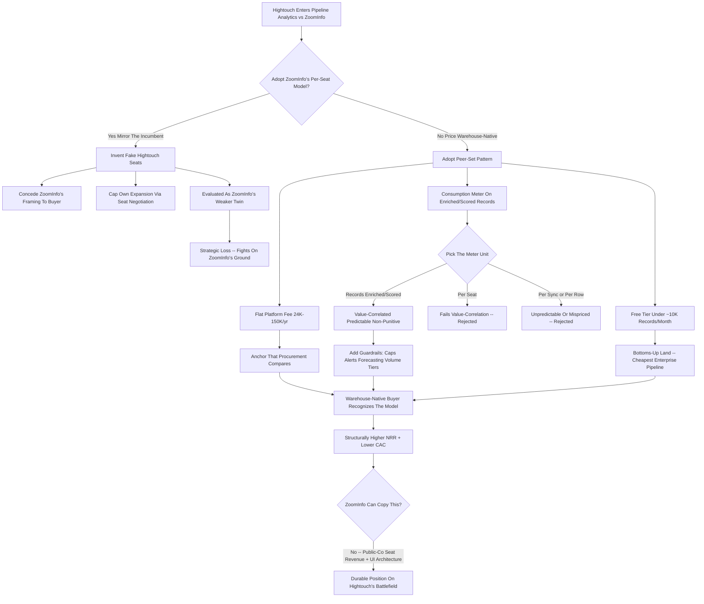
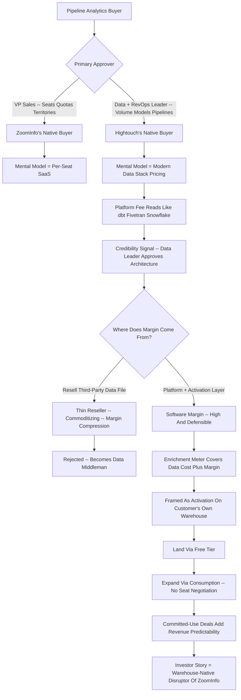

**TL;DR:** Hightouch should price pipeline analytics on a **warehouse-native, consumption-anchored model with a flat platform tier** -- and should explicitly refuse to mirror ZoomInfo's per-user-seat enterprise pricing -- because the entire strategic reason a customer would buy pipeline analytics from Hightouch instead of from ZoomInfo is that Hightouch is warehouse-native, and per-seat pricing structurally contradicts that position. ZoomInfo (NASDAQ: ZI, ~$1.2B FY24 revenue, market cap fallen from a 2021 peak above $30B to roughly $4-5B in 2024-2025) sells contact data, intent, and workflow on per-user-seat contracts that commonly run **$15K-$40K/yr for small teams and $40K-$250K+/yr for enterprise**, with the meter being how many salespeople log into ZoomInfo's UI. Hightouch (founded 2018, the reverse-ETL category leader, Series C of $38M in 2022 at a roughly **$1.2B valuation** led by Sapphire and ICONIQ) has no per-user-of-Hightouch concept -- data lives in the customer's Snowflake, BigQuery, Databricks, or Redshift warehouse and syncs to the operational tools where every downstream user already sees it. The recommended structure: **(1) a flat platform fee, roughly $24K-$150K/yr**, tiered on data volume, destinations, and number of models/syncs -- the same shape as dbt Cloud, Fivetran, and Census pricing; **(2) a consumption add-on for pipeline analytics enrichment, roughly $0.40-$1.50 per 1,000 enriched or scored records**, so the customer pays in proportion to value delivered, not headcount; **(3) a free / self-serve tier under ~10K records per month** to drive bottoms-up adoption the way the warehouse-native peer set does. This wins the mid-market decisively because it undercuts ZoomInfo's seat math for any team larger than a handful of reps, it removes the "should I buy another seat" friction that caps ZoomInfo expansion, and it compounds Hightouch's actual moat -- being the layer that already sits on the warehouse -- instead of fighting ZoomInfo on ZoomInfo's chosen battlefield. The three traps to avoid: **(a) seat-based pricing**, which imports ZoomInfo's economics and discards Hightouch's; **(b) pricing the data itself like a data vendor**, which turns Hightouch into a thin reseller of someone else's firmographic file and invites margin compression; and **(c) an opaque "call us" enterprise motion** with no public anchor, which surrenders the bottoms-up, warehouse-native adoption loop that is Hightouch's cheapest and most defensible channel. Net: meter on data and outcomes, anchor on a transparent platform fee, keep a free tier, and let the warehouse-native architecture -- not a seat count -- be the thing the price expresses.

## What This Question Is Actually Asking

The question looks like a narrow pricing-page exercise -- pick a number, pick a unit, undercut the competitor -- but it is really a positioning question wearing a pricing costume. Pricing is the most legible expression of strategy a company ships; customers, competitors, and investors all read the pricing page as a statement of what the company believes it is. So "how should Hightouch price pipeline analytics against ZoomInfo's equivalent" is asking: when Hightouch enters a category ZoomInfo has historically owned, does it adopt ZoomInfo's commercial model to compete on familiar terms, or does it price in a way that forces the comparison onto Hightouch's home ground? The answer matters far beyond the revenue from this one product line. ZoomInfo's per-seat model is not an accident -- it is the economic engine of a $1.2B-revenue public company, and it works because ZoomInfo's product is a UI that salespeople log into. Hightouch's product is not a UI salespeople log into; it is infrastructure that sits on the data warehouse and moves and activates data. If Hightouch prices pipeline analytics per seat, it has to invent a fake notion of "Hightouch users," create artificial seat boundaries inside an architecture that has none, and accept ZoomInfo's framing that the value of pipeline intelligence scales with the number of people who look at it. If Hightouch instead prices on data volume and enrichment consumption, it tells the market that the value scales with the data activated and the outcomes produced -- which is both true to the architecture and strategically the harder thing for ZoomInfo to copy without cannibalizing its own seat revenue. The rest of this answer treats the pricing decision as the strategic decision it is.

## The Two Companies: Structural Profiles That Determine Pricing

A pricing recommendation that ignores the structural facts of both companies is just a guess, so the starting point is an honest profile of each. **ZoomInfo** is a public company (NASDAQ: ZI) that reported roughly $1.2B in FY2024 revenue with growth that had decelerated sharply from its pandemic-era highs; its market capitalization, which exceeded $30B at the 2021 peak, had fallen to roughly $4-5B by 2024-2025 as net revenue retention compressed and the market re-rated B2B data businesses. ZoomInfo sells a contact-and-company database, intent signals, and a workflow layer, and it monetizes through per-user-seat annual contracts -- the customer is buying access for a defined number of named users who log into ZoomInfo's interface to prospect. That model produced enormous gross margins and a powerful land-and-expand motion for years, but by 2024 it was under visible strain: seat-based renewals became a line-item that procurement scrutinized, lower-cost competitors like Apollo and Cognism attacked the price point, and the "do we really need all these seats" question capped expansion. **Hightouch** is a private company founded in 2018 that created and leads the reverse-ETL category -- software that reads from the customer's cloud data warehouse and syncs modeled data out to operational tools like Salesforce, HubSpot, Marketo, Customer.io, Braze, and ad platforms. It raised a $38M Series C in 2022 led by Sapphire Ventures and ICONIQ Growth at a valuation widely reported around $1.2B, and it has since expanded from pure reverse-ETL into a composable CDP ("Customer Studio") and AI Decisioning. The structural fact that should drive every pricing decision: Hightouch's product does not have "users" in the seat sense -- it has data sources, models, syncs, and destinations, and the humans who benefit from it are using Salesforce or HubSpot, not Hightouch. ZoomInfo's pricing fits ZoomInfo because ZoomInfo is a UI. Any pricing Hightouch adopts must fit the fact that Hightouch is warehouse infrastructure.

## What "Pipeline Analytics" Means In This Context

The phrase needs to be pinned down because it changes the pricing logic. Pipeline analytics, as a product adjacent to what ZoomInfo sells, means using the customer's own warehouse data -- product usage, CRM history, billing, support, web behavior -- combined with firmographic, technographic, and intent enrichment to score accounts and opportunities, predict pipeline health, surface buying signals, and route the right accounts to the right reps at the right time. It is the analytical and activation layer that sits between raw data and the sales motion. For Hightouch this is a natural extension: the company already reads everything in the warehouse and already syncs audiences out, so adding scoring, signal detection, and pipeline intelligence is a feature expansion on infrastructure that exists, not a new product built from scratch. For ZoomInfo, the equivalent capability is bundled into its higher tiers and its workflow product, and it is priced as part of the per-seat enterprise contract. The critical distinction: ZoomInfo's pipeline intelligence is fed primarily by ZoomInfo's own proprietary database, so ZoomInfo is selling its data; Hightouch's pipeline analytics is fed primarily by the customer's own warehouse, with enrichment as an augmenting layer, so Hightouch is selling activation and intelligence on data the customer already owns. That difference is the entire pricing argument -- a company selling its own data file prices the data, a company selling activation on the customer's data prices the activation and the volume.

## Why Per-Seat Pricing Structurally Cannot Work For Hightouch

This is the load-bearing section, because the most tempting mistake -- "ZoomInfo charges per seat and makes $1.2B, so charge per seat" -- is also the most damaging. Per-seat pricing assumes a one-to-one relationship between a paying unit and a human who derives value by logging in. ZoomInfo has that: a sales rep opens ZoomInfo, searches, exports contacts, and the value is consumed through that session. Hightouch does not have that. When Hightouch syncs a scored account list into Salesforce, the value is consumed by every rep, manager, and ops person who touches that Salesforce record -- there is no Hightouch login event in the value chain. To price per seat, Hightouch would have to either (a) charge for Salesforce seats it does not control and does not provision, which is absurd, or (b) invent a fictional "Hightouch user" license and police who counts as one, which creates friction, audit overhead, and a constant expansion negotiation that punishes the customer for sharing the output more widely -- the exact opposite of what infrastructure should do. Worse, per-seat pricing caps Hightouch's own growth in the same way it caps ZoomInfo's: the customer's instinct becomes to minimize licensed seats, which means minimizing the spread of the product, which means the product becomes less embedded, not more. And strategically, adopting per-seat pricing concedes ZoomInfo's framing to every buyer in the room -- it tells the procurement team "evaluate us the way you evaluate ZoomInfo," which is a comparison ZoomInfo, with its database scale and incumbency, is structurally favored to win. The only pricing that lets Hightouch win is pricing that makes the buyer evaluate it as warehouse-native infrastructure, because that is the only frame in which Hightouch is the favorite.

## The Warehouse-Native Pricing Pattern: What The Peer Set Actually Does

Hightouch does not have to invent a pricing model -- it has a peer set, and that peer set has converged on a recognizable pattern. The companies that sit on or near the cloud data warehouse price on data and capability, not seats. dbt Labs prices dbt Cloud on a per-developer-seat basis for the modeling layer but layers usage-based consumption on top, and its enterprise pricing is capability-tiered rather than headcount-driven for the platform value. Fivetran prices on Monthly Active Rows -- literally the volume of data moved -- so the meter is consumption. Census, Hightouch's closest reverse-ETL competitor, prices on a platform fee plus the number of syncs/destinations and data volume. Snowflake itself, the substrate, prices purely on consumption -- compute credits and storage -- and that consumption model is widely credited as a core reason Snowflake's net revenue retention ran extraordinarily high, because cost scales with value and there is no seat negotiation to cap expansion. Databricks is the same shape. The lesson from the peer set is consistent: the warehouse-native go-to-market converges on **a transparent platform fee for access and capability tiering, plus a consumption meter tied to data volume or activity**, frequently with a free or self-serve entry point to seed bottoms-up adoption. This is not a coincidence -- it is what fits the architecture. Hightouch pricing pipeline analytics should look like Fivetran and Census and Snowflake, not like ZoomInfo, because Hightouch lives in the same layer of the stack as Fivetran and Census and Snowflake.

## The Recommended Structure, Tier By Tier

The recommendation is a three-part structure, and each part does a specific job. **Part one: the flat platform fee.** A transparent, tiered annual platform fee -- roughly $24K/yr at the entry business tier scaling to $80K-$150K/yr at the upper tier -- priced on the variables that actually describe Hightouch's footprint: total data volume processed, number of destinations enabled, and number of models, audiences, and syncs configured. This is the anchor; it is what shows up in a procurement comparison, and it must be legible. **Part two: the pipeline analytics consumption add-on.** A usage meter for the enrichment and scoring specifically -- roughly $0.40-$1.50 per 1,000 records enriched or scored, with the rate declining at volume -- so the customer pays in direct proportion to how much pipeline intelligence they actually generate. A customer scoring 50,000 accounts a month pays meaningfully; a customer scoring 2,000 pays a little; nobody pays for seats they are not using. **Part three: the free / self-serve tier.** A genuine free tier under roughly 10,000 records per month, enough for a single team to wire up pipeline analytics, see it work, and pull it into a sales conversation -- the bottoms-up wedge that the warehouse-native peer set uses to make the eventual enterprise deal a formality rather than a cold sale. The three parts together produce a pricing page that a data leader recognizes instantly as "priced like the rest of my modern data stack," which is exactly the recognition that wins the deal against ZoomInfo.

## A Direct Pricing Comparison: Hightouch Versus ZoomInfo

The clearest way to see why this structure wins is to put representative numbers side by side for the same customer profiles. The point is not that Hightouch is always cheaper -- it is that Hightouch's cost tracks data and outcomes while ZoomInfo's cost tracks headcount, and for most modern revenue teams the data-and-outcome meter is both cheaper and less frictional.

| Customer profile | ZoomInfo (per-seat) | Hightouch pipeline analytics (platform + consumption) | Why Hightouch wins the comparison |
|---|---|---|---|
| 8-rep startup sales team | ~$15K-$30K/yr for 8 seats, limited data ceiling | ~$24K/yr platform + ~$3K-$8K consumption | Comparable or lower cost, no seat ceiling, runs on the team's own warehouse data |
| 40-rep mid-market team | ~$60K-$150K/yr for 40 seats | ~$50K-$80K platform + ~$15K-$35K consumption | Decisively cheaper per rep; cost grows with data activated, not with hiring |
| 150-rep enterprise | ~$200K-$400K+/yr seat contract | ~$120K-$150K platform + ~$60K-$120K consumption | Lower total cost at scale; expansion is frictionless, no per-seat renewal fight |
| Ops-led team, few "users," huge data | Underpriced for ZoomInfo -- few seats, low revenue | Priced correctly -- high data volume drives fair consumption revenue | Hightouch captures value ZoomInfo's seat meter misses entirely |

The table also reveals the strategic asymmetry: there are customer shapes -- the ops-led team with enormous data and a handful of human "users" -- where the seat model actively underprices the value, and Hightouch's consumption model captures revenue ZoomInfo's meter cannot see. That is not just defense; it is a structural revenue advantage in exactly the accounts a warehouse-native company should win.

## The Consumption Meter: Choosing The Right Unit

Getting the meter unit right is its own discipline, because the wrong unit reintroduces the problems seat pricing creates. The meter must satisfy four tests: it should be **value-correlated** (the customer paying more should genuinely be getting more), **predictable** (the customer can forecast the bill within reason), **non-punitive** (using the product more broadly should never feel like a penalty), and **cheap to instrument** (Hightouch can measure it cleanly without disputes). "Records enriched or scored per month" passes all four: it rises with actual pipeline-intelligence work, a revenue ops leader can estimate it from account counts, it does not punish sharing the output, and Hightouch already processes these records so the instrumentation is free. Compare the alternatives. "Per sync" undercharges high-value low-frequency work and overcharges trivial frequent syncs. "Per destination" is fine as a platform-tier input but too coarse as the primary meter. "Per warehouse row processed" -- the Fivetran-style meter -- is defensible but can spike unpredictably and frighten buyers. "Per seat" fails the value-correlation test entirely, as established. The right answer is to use **destinations and model count as platform-tier inputs** -- they describe the size of the deployment -- and **records enriched/scored as the consumption meter** -- it describes the work done. And the meter must come with guardrails: volume discounting so the per-unit rate falls as usage rises, spend caps or alerts so a buyer is never surprised, and a clear definition of what counts as a billable record so there is never an argument at renewal.

## Margin Architecture: Why Hightouch Must Not Price Like A Data Vendor

There is a second trap beside seat pricing, and it is subtler: pricing pipeline analytics as if Hightouch were selling the data. If Hightouch wraps a third-party firmographic and intent file, marks it up, and sells it per record as "Hightouch's data," it has volunteered to become a thin reseller in a category -- B2B data -- that is commoditizing, price-compressing, and dominated by incumbents with proprietary collection at scale. The margin on resold data is structurally thin and gets thinner as Apollo, Cognism, and others drive the price of a contact record toward zero. Hightouch's gross margin should come from the **platform and the activation layer**, which is software margin -- high, defensible, and improving with scale -- not from arbitraging a data file. The enrichment consumption meter should be priced to cover the cost of whatever third-party data is passed through plus a reasonable margin, but it must be clearly framed as **activation and intelligence on the customer's own warehouse data, augmented by enrichment** -- not as "buy our database." This framing is also the honest one: the customer's warehouse genuinely is the primary asset, and Hightouch genuinely is the layer that makes it useful. Pricing that tells the truth about where the value comes from is also the pricing that protects the margin, because it keeps Hightouch positioned as infrastructure rather than as a data middleman.

## The Free Tier As Strategic Weapon, Not Charity

The free tier is frequently treated as a marketing afterthought; for a warehouse-native company competing against a seat-based incumbent, it is a primary strategic weapon and should be designed deliberately. The mechanism: ZoomInfo's seat model has a high, gated, sales-mediated entry -- you talk to a rep, you negotiate seats, you sign a contract before you see real value. A genuine free tier inverts that for Hightouch -- a data or ops person can connect a warehouse, wire up pipeline analytics on a real team, and have working scored pipeline inside a day, with no contract and no seat negotiation. That converts the buying motion from a top-down sale into a bottoms-up land, which is dramatically cheaper to run and produces far better-qualified enterprise conversations because the buyer has already seen the product work on their own data. The free tier must be calibrated carefully: generous enough -- roughly 10K records/month, a couple of destinations, core scoring -- that a single team gets real value and becomes an internal champion, but bounded enough that any serious multi-team deployment clearly needs a paid tier. The boundary should be data volume and destination count, not feature crippling, because a warehouse-native buyer evaluating infrastructure needs to see the actual product, not a hobbled demo. Done right, the free tier is the cheapest enterprise pipeline Hightouch can build, and it is a channel ZoomInfo structurally cannot easily copy without undermining its own seat-gated motion.

## Land-And-Expand Mechanics Under Each Model

Comparing how expansion actually works under the two pricing models exposes why the structural choice matters so much over a multi-year customer lifetime. Under **ZoomInfo's seat model**, expansion means selling more seats, and every additional seat is a discrete negotiation that procurement can see, question, and resist; net revenue retention therefore depends on the customer's headcount growth and on winning a recurring internal argument about whether each new person "needs" ZoomInfo. When sales teams stop growing or contract, the seat model goes into reverse. Under **Hightouch's consumption-plus-platform model**, expansion is mostly automatic and frictionless: as the customer connects more data sources, scores more accounts, adds destinations, and embeds pipeline analytics into more workflows, consumption rises without anyone signing a new contract, and the platform tier steps up naturally as the deployment grows. Net revenue retention is driven by usage depth, not headcount -- which is exactly why Snowflake and Fivetran and the consumption-priced cohort posted the NRR figures they did. The expansion path is also better aligned: the customer's bill rises only when they are getting more value, so the expansion does not feel like a tax, it feels like a utility bill that scaled with usage. For a company Hightouch's size with a long runway ahead, choosing the pricing model that produces structurally higher, less-negotiated NRR is one of the highest-leverage decisions available, and it is decided here, in how pipeline analytics is metered.

## Sales Motion And Buyer Persona Alignment

Pricing must match who is actually in the room, and the buyers for ZoomInfo and for Hightouch's pipeline analytics are not the same people. ZoomInfo is sold to a **VP of Sales or a sales-ops leader** whose mental model is reps, seats, quotas, and territories -- the seat meter speaks that person's language. Hightouch's pipeline analytics, because it runs on the warehouse, is co-bought by a **data or analytics leader and a revenue-ops leader**, and the data leader is the one who blesses the architecture. That buyer's mental model is data volume, models, pipelines, and the modern data stack -- and that buyer is actively suspicious of seat-based SaaS pricing because it does not match how anything else in their stack is priced. A per-seat pricing page makes the data leader's eyebrow go up; a platform-fee-plus-consumption page makes the data leader nod, because it looks like dbt and Fivetran and Snowflake. So the pricing model is not just an economic choice, it is a credibility signal to the specific human whose approval Hightouch needs. The sales motion that follows is also different and cheaper: a warehouse-native, consumption-priced product with a free tier is sold substantially product-led, with sales-assist on the larger deals, rather than through ZoomInfo's seat-by-seat enterprise grind. Pricing the product to fit the warehouse-native buyer is what unlocks the warehouse-native, lower-cost sales motion.

## How ZoomInfo Is Structurally Constrained From Responding

A pricing strategy is only as good as the competitor's inability to neutralize it, so it is worth being explicit about why ZoomInfo cannot simply copy this. ZoomInfo's seat-based revenue is the financial foundation of a public company; a meaningful shift to consumption pricing would disrupt reported revenue, complicate guidance, and risk a re-rating -- public-company incentives make a fast pricing-model pivot extremely costly. ZoomInfo's product is also genuinely a UI that people log into, so consumption pricing does not fit its architecture the way it fits Hightouch's -- ZoomInfo would be adopting a meter that does not match its own value-delivery mechanism. And ZoomInfo's core asset is its proprietary database; its instinct and its investor story push it to price the data, which is the opposite of pricing activation on the customer's warehouse. This is the durable part of the recommendation: Hightouch is not just picking a clever price, it is picking a price that sits on the one axis -- warehouse-native, consumption-aligned, data-owned-by-the-customer -- where ZoomInfo is structurally slow and reluctant to follow. The moat is not the number on the pricing page; the moat is that ZoomInfo's own structure punishes it for matching the model.

## Packaging: What Goes In The Platform Fee Versus The Meter

A clean recommendation has to draw the line precisely between what is bundled into the flat platform fee and what is metered, because a fuzzy line creates buyer anxiety and renewal disputes. The principle: **the platform fee covers everything that describes the size and shape of the deployment and everything the customer needs to feel safe**, and **the meter covers only the variable work that genuinely scales with value**. Concretely, the platform fee should include the warehouse connections, the destination integrations up to the tier's count, the modeling and audience tooling, the core scoring engine, all users (because there are no per-user charges), support, security and compliance features, and a baseline allotment of enrichment/scoring volume. The consumption meter then covers enrichment and scoring above that baseline allotment. This packaging does two important things: it makes the entry price predictable and inclusive so the buyer is not nickel-and-dimed on basics, and it confines the variable cost to the one dimension -- volume of pipeline intelligence generated -- that the customer accepts as fair to pay more for. Feature-gating between tiers should be minimal and should separate genuine enterprise needs (advanced security, granular permissions, SLA, dedicated support) from core functionality; crippling core features to force upgrades is the kind of pricing hostility that warehouse-native buyers punish.

## Discounting, Floors, And Deal Discipline

Even the right model fails if the deal discipline around it is sloppy, so the recommendation includes guardrails. The platform fee should have a **published floor** -- the entry business tier number should be real and visible, not a "contact us" black box -- because the public anchor is what makes the bottoms-up motion work and what frames every competitive comparison. Discounting should be allowed on the platform fee for multi-year commitments and for genuine strategic logos, but the **consumption rate should be largely protected from discounting** and instead carry transparent published volume tiers, so that the unit economics of the meter stay intact and every customer trusts that the meter is fair. Annual commitments with a consumption drawdown -- the customer commits to a volume, draws it down through the year, and overages bill at the published rate -- give Hightouch revenue predictability while keeping the consumption alignment. The deal discipline that matters most: never let a large enterprise negotiation collapse the structure back into a flat "all-you-can-eat" number with no meter, because that is how a consumption company quietly becomes a seat-style company again and loses the NRR advantage. The structure is the strategy; protecting the structure in the deal room is protecting the strategy.

## Risk: The Bill-Shock Problem And How To Defuse It

The honest weakness of consumption pricing is bill shock -- the customer fears an unpredictable, spiking invoice, and that fear can lose deals to ZoomInfo's at-least-I-know-the-number seat contract. The recommendation must therefore include the standard consumption-pricing defenses, applied deliberately. **Spend caps and hard alerts**: the customer sets a ceiling and gets warned well before approaching it; nobody is ever surprised. **Forecasting tools**: Hightouch gives the buyer a simple model -- accounts scored per month times rate -- so the bill is estimable before signing. **Committed-use discounts**: a customer who commits to an annual volume gets a better rate and a predictable number, converting consumption into something that feels like a subscription. **Generous, transparent volume tiers**: the rate visibly falls as usage rises, so growth is rewarded, not punished. **A no-surprise definition of the billable unit**: precisely what counts as an enriched or scored record, documented and stable. Snowflake, Datadog, and the consumption cohort all had to solve exactly this problem, and the playbook is well-established. The point is not that bill shock is not real -- it is that it is a solved problem, and solving it well is part of the price of choosing the structurally superior model. A consumption model with strong guardrails beats a seat model on both cost and friction; a consumption model with no guardrails loses on fear.

## What The Pricing Says To Investors And The Market

Pricing is read by investors as closely as it is read by customers, and for a company at Hightouch's stage -- post-Series-C, roughly $1.2B valuation, on a path that likely includes later rounds or an eventual public listing -- the pricing model is part of the equity story. A consumption-plus-platform model with a free tier tells investors a specific, attractive story: usage-aligned revenue, structurally high net revenue retention, a product-led motion with efficient customer acquisition, and a market position in the modern-data-stack category that public-market investors have learned to value with the Snowflake and Datadog and MongoDB comparables. A per-seat model tells a different and, in 2024-2025's market, less favorable story: revenue tied to customer headcount, expansion gated by seat negotiations, and a comparable set that now includes a re-rated, decelerating ZoomInfo. The financial press and the analyst community would read a seat-based Hightouch as "competing with ZoomInfo on ZoomInfo's terms" and a consumption-based Hightouch as "the warehouse-native disruptor of ZoomInfo's category." For a company whose valuation rests substantially on being the category-defining warehouse-native player, the pricing model has to corroborate that identity. The pricing page is, among other things, a slide in every future fundraising and IPO deck.

## The International And Multi-Region Dimension

A pricing model has to survive contact with the reality that ZoomInfo and Hightouch both sell across borders, and the warehouse-native consumption model holds up better here too. ZoomInfo's data quality is famously uneven outside North America -- its database is deepest on US contacts and thinner in EMEA and APAC, which is precisely the gap Cognism built a business in. A per-seat price that is justified by a deep US database becomes much harder to defend when the same seat price buys a shallower data set in Germany or Singapore, yet ZoomInfo's seat model charges the same per head regardless. Hightouch's consumption model is naturally region-neutral in a way the seat model is not: the customer is paying to activate and score their own warehouse data, and their own warehouse data about their own EMEA customers is exactly as rich as their data about their US customers. The enrichment layer still varies by region, but because enrichment is metered separately and transparently, a customer in a region with thinner third-party data simply consumes less enrichment and pays less for it -- the price honestly tracks the value available. There is also a data-residency advantage: warehouse-native means the customer's data never has to leave their own cloud region, which matters enormously for GDPR-bound European buyers and is a genuine selling point that the pricing conversation should surface. The recommendation here is to keep the consumption model globally uniform in structure -- same meter, same guardrails -- while letting the enrichment rate and the platform-tier breakpoints flex modestly by region to reflect local data costs and willingness to pay. The seat model forces an awkward choice between charging too much for thin-data regions or leaving money on the table in deep-data ones; the consumption model sidesteps the dilemma entirely because the meter is anchored to the customer's own data, not to ZoomInfo's coverage map.

## Pricing The AI Decisioning Adjacency

Hightouch has already shipped AI Decisioning, and pipeline analytics will inevitably blur into it -- scoring, signal detection, next-best-action, and automated routing are a continuum, not discrete products. The pricing model has to anticipate this rather than be retrofitted for it, because AI-driven features are exactly where a company can accidentally slip back into bad pricing habits. The temptation with anything labeled "AI" is to price it as a premium per-seat add-on -- an "AI seat" or an "AI user license" -- and that temptation must be resisted for the same structural reason all seat pricing must be resisted: there is no per-user-of-Hightouch concept, and inventing an "AI user" is just the seat trap wearing a fashionable label. The right approach keeps AI Decisioning and pipeline analytics on the same consumption spine: the meter is decisions made, accounts scored, records processed -- the unit of work the AI performs -- not the number of humans who consume the output. This has a real advantage: it means the customer's bill scales with how much the AI is actually doing for them, which is both fair and a natural expansion engine, because as the customer trusts the AI with more decisions, consumption rises without a renewal negotiation. It also keeps the pricing page coherent -- a buyer sees one consistent logic across reverse-ETL, Customer Studio, pipeline analytics, and AI Decisioning, rather than four different pricing philosophies stapled together. The cost side needs attention: AI features carry real inference cost, so the per-decision or per-score rate has to be set with enough margin to cover model-serving costs at scale, and the volume tiers have to be modeled against that cost curve. But the structural answer is firm: AI Decisioning is metered on work performed, on the same consumption spine as pipeline analytics, and never on invented AI seats.

## The Migration Path For Existing Hightouch Customers

A pricing recommendation that only considers new logos is incomplete, because the most immediate buyers of pipeline analytics are the customers Hightouch already has -- companies already running reverse-ETL and Customer Studio on their warehouse. How pipeline analytics is priced into the existing base is its own decision with its own risks. The wrong move is to make pipeline analytics a disruptive repricing event that forces existing customers onto a new contract structure -- that creates churn risk and renewal friction precisely among the customers most likely to expand. The right move treats pipeline analytics as a natural consumption add-on that an existing customer can switch on without renegotiating their platform tier: they already have the warehouse connection, the models, and the destinations, so adding pipeline analytics means turning on enrichment and scoring and beginning to consume the meter. The existing customer's expansion is therefore frictionless -- exactly the land-and-expand mechanic the model is designed to produce -- and the customer experiences pipeline analytics as their platform getting more capable, not as a vendor trying to reprice them. There should be a generous trial allotment of enrichment volume for existing customers, so they can prove the value internally before the consumption meter becomes material, and the platform-tier step-up should happen naturally as their overall deployment grows rather than being triggered punitively by switching on one new feature. The strategic point: the installed base is the warmest possible market for pipeline analytics, and the pricing should make adopting it feel like an upgrade the customer chose, not a bill the vendor imposed. A pricing model that churns the base to win new logos has failed even if the new-logo numbers look good.

## Benchmarking The Recommendation Against The Snowflake Playbook

It is worth holding the recommendation directly against the single most successful warehouse-native pricing story -- Snowflake -- because the parallels are instructive and the differences are clarifying. Snowflake priced on pure consumption: compute credits and storage, no seats, transparent rates, with the meter so tightly correlated to value that the company's net revenue retention ran well above 150% for years, because customers expanded simply by using more without ever renegotiating. The recommendation for Hightouch borrows the core lesson -- consumption aligned to a value-correlated unit, transparent rates, expansion without renegotiation -- but it deliberately differs in one respect: Snowflake is pure consumption with effectively no platform fee, whereas the recommendation for Hightouch pairs the consumption meter with a flat platform fee. The reason for the difference is the buyer and the deal. Snowflake's pure-consumption model works partly because the warehouse is so mission-critical and so deeply embedded that customers tolerate the forecasting uncertainty. Hightouch's pipeline analytics, entering a category against an incumbent that quotes flat numbers, benefits from a flat platform-fee anchor that gives procurement something familiar and predictable to compare, with the consumption meter handling the value-aligned expansion on top. So the recommendation is "Snowflake's consumption discipline plus a procurement-friendly anchor" -- which is, not coincidentally, close to where Databricks and the more recent warehouse-native cohort actually landed, having learned that a pure-consumption pricing page can frighten a first-time buyer even when it is economically superior. The Snowflake playbook validates the consumption spine; the platform-fee anchor is the adaptation that fits a competitive category-entry rather than a category-defining substrate. The benchmark confirms the model and sharpens why the specific hybrid shape -- not pure consumption, not flat subscription -- is the right one for this particular fight.

## A Phased Rollout Plan

The recommendation is not just a destination but a sequence, because launching a new pricing model badly can poison a good model. **Phase one -- the free tier and a published entry platform fee.** Ship the free tier and a transparent entry-tier platform price first, with a baseline enrichment allotment included, to seed bottoms-up adoption and establish the public anchor. **Phase two -- the metered consumption add-on.** Once a cohort of free and entry-tier customers is generating real enrichment volume, introduce the consumption meter for usage above the baseline, with the guardrails -- caps, alerts, forecasting, volume tiers -- shipped on day one, not retrofitted. **Phase three -- the enterprise tier and committed-use deals.** With usage data in hand, formalize the upper platform tiers and the committed-use consumption agreements for the large accounts, using real consumption curves to price them rather than guessing. **Phase four -- instrument, observe, and tune the meter rate.** Watch the actual distribution of enrichment volume across the base, confirm the per-1,000 rate produces healthy margin after third-party data cost, and adjust the volume-tier breakpoints. Throughout, the messaging discipline is constant: every surface says "warehouse-native, you own your data, you pay for what you activate," and never "seats." The phasing lets Hightouch learn the real consumption curve from its own customers before it commits to the enterprise numbers, which is far safer than launching a fully-specified enterprise price schedule on assumptions.

## The Counter-Pressure: Where The Seat Model Looks Tempting

Intellectual honesty requires naming when the seat model genuinely looks attractive, because the recommendation has to survive those moments. There will be specific enterprise deals where the customer's procurement team, conditioned by ZoomInfo and by every other SaaS vendor, asks for a flat per-seat or flat all-in number because it is what their process expects -- and saying no will occasionally cost a deal in the short term. There will be quarters where a flat seat contract would have booked more predictable revenue than a ramping consumption deal. And early on, before the usage data exists, the consumption meter is harder to forecast internally than a seat count would be. These pressures are real, and the recommendation does not pretend otherwise. The answer to each is structural, not anecdotal: the occasional lost deal to seat-pricing rigidity is outweighed many times over by the NRR, the lower CAC, the captured ops-led accounts, and the strategic positioning the consumption model produces across the whole base; the revenue-predictability gap is closed by committed-use agreements; and the internal-forecasting difficulty is a phase-one problem that the rollout plan explicitly solves by learning the curve before pricing the enterprise tier. The discipline is to recognize the temptation, give it its due, and still hold the structure -- because the structure is the strategy.

## The Two-Year Scoreboard: How To Know The Model Is Working

A pricing recommendation should come with the metrics that will tell Hightouch, eighteen to twenty-four months in, whether the model is succeeding or quietly failing -- because pricing mistakes are slow-acting and easy to miss until they are expensive. The first scoreboard metric is **net revenue retention on the pipeline analytics line specifically**: if the consumption model is working, NRR on this product should run well above the seat-based benchmark ZoomInfo discloses, driven by consumption growth without renegotiation; if NRR is merely matching a seat model, the consumption alignment is not producing its promised expansion and the meter or the guardrails need attention. The second is **the free-to-paid conversion rate and the time-to-convert**: a healthy bottoms-up wedge shows a meaningful fraction of free-tier teams crossing into a paid tier within a quarter or two, and a sales cycle on the resulting enterprise deals that is shorter than a comparable cold ZoomInfo-style sale because the buyer has already seen the product work. The third is **consumption-per-account growth within existing customers**: the model is designed so that customers score and enrich more over time, so flat or declining consumption-per-account is a warning that the pricing is suppressing the very usage it should encourage -- the Counter 6 risk materializing. The fourth is **gross margin on the enrichment meter after third-party data cost**: if the per-1,000 rate is not clearing a healthy software-grade margin once passthrough data costs are netted out, Hightouch has drifted toward data-reseller economics and the rate or the data sourcing needs to change. The fifth is **win rate in competitive deals against ZoomInfo, segmented by buyer persona**: the model predicts Hightouch should win disproportionately when the data leader is in the room and lose more often when procurement forces a seat-style comparison, and the segmented win-rate data tells Hightouch whether the positioning is landing. The sixth is **the rate of deals where the structure collapsed into a flat all-you-can-eat number** -- this should be near zero, because every such deal is the consumption advantage being negotiated away in the deal room. Watching these six together gives an honest, early read: the model is working if NRR runs hot, the free tier converts, consumption-per-account climbs, the meter margin is software-grade, the data-leader win rate is high, and the structure is holding in the deal room. If three or more of those are off, the recommendation is not being executed -- and the fix is almost always in execution discipline, not in abandoning the model for seats.

## Putting It Together: The Recommendation In One Frame

Stepping back, the recommendation resolves to a small number of decisions, each following from the structural facts. **Do not mirror ZoomInfo's per-seat pricing** -- it imports ZoomInfo's economics, discards Hightouch's architecture, concedes ZoomInfo's framing, and caps Hightouch's own expansion. **Do price like the warehouse-native peer set** -- a transparent, capability-tiered platform fee in the roughly $24K-$150K/yr range as the anchor. **Do meter the pipeline analytics on a value-correlated consumption unit** -- records enriched or scored, roughly $0.40-$1.50 per 1,000 with volume tiers -- so the customer pays in proportion to outcomes, not headcount. **Do ship a genuine free tier** under roughly 10K records/month as the bottoms-up wedge and the cheapest enterprise pipeline available. **Do not price like a data vendor** -- keep the margin in the platform and the activation layer, frame enrichment as augmentation of the customer's own warehouse data, and refuse to become a thin reseller of a commoditizing data file. **Do build the guardrails** -- caps, alerts, forecasting, committed-use, transparent volume tiers -- so the consumption model beats the seat model on friction as well as on cost. And **do protect the structure in the deal room and in the messaging**, because the pricing model is the most legible statement of strategy Hightouch ships, and the strategy is that the value lives on the warehouse and scales with the data activated -- not with the number of people who happen to log in. Priced this way, pipeline analytics is not Hightouch fighting ZoomInfo on ZoomInfo's battlefield; it is Hightouch making ZoomInfo's category come fight on Hightouch's.

## The Pricing Decision Flow: From Structural Facts To Final Model

## The Buyer And Margin Map: Who Pays, On What Meter, At What Margin

## Sources

1. **ZoomInfo Technologies (NASDAQ: ZI) -- Investor Relations and SEC Filings** -- FY2024 revenue (~$1.2B), growth deceleration, net revenue retention disclosures, and the per-seat enterprise model. https://ir.zoominfo.com
2. **ZoomInfo Q4 and Full-Year 2024 Earnings Materials** -- Revenue, retention, and guidance context for the seat-based model under strain.
3. **Hightouch -- Company Site and Product Documentation** -- Reverse-ETL leadership, Customer Studio composable CDP, AI Decisioning, and warehouse-native architecture. https://hightouch.com
4. **Hightouch Series C Announcement (2022)** -- $38M Series C led by Sapphire Ventures and ICONIQ Growth at a reported valuation around $1.2B.
5. **Hightouch Pricing Page** -- Current platform-fee plus capability-tier structure for reverse-ETL and Customer Studio. https://hightouch.com/pricing
6. **Census -- Reverse-ETL Pricing and Product** -- Closest reverse-ETL competitor; platform-fee-plus-syncs/destinations pricing pattern. https://getcensus.com
7. **Fivetran -- Pricing (Monthly Active Rows)** -- Consumption-based data-movement pricing; canonical warehouse-native consumption meter. https://www.fivetran.com/pricing
8. **dbt Labs -- dbt Cloud Pricing** -- Developer-seat plus usage and capability-tiered enterprise pricing in the transformation layer. https://www.getdbt.com/pricing
9. **Snowflake (NYSE: SNOW) -- Investor Relations** -- Pure consumption (compute credits + storage) pricing and the high net revenue retention it produced. https://investors.snowflake.com
10. **Databricks -- Pricing** -- Consumption-based (DBU) pricing for the lakehouse platform. https://www.databricks.com/product/pricing
11. **OpenView Partners -- Product Led Growth and Usage-Based Pricing Research** -- Benchmarks on PLG motion, free-tier design, and consumption pricing outcomes. https://openviewpartners.com
12. **OpenView -- 2023/2024 Usage-Based Pricing Reports** -- NRR and growth-efficiency advantages of consumption pricing versus seat-based models.
13. **Bessemer Venture Partners -- State of the Cloud and Pricing Strategy** -- Cloud-business pricing benchmarks, NRR drivers, and warehouse-native go-to-market analysis. https://www.bvp.com/atlas
14. **a16z -- The New Business of AI / SaaS Pricing Commentary** -- Analysis of consumption versus subscription pricing and data-layer margin structure. https://a16z.com
15. **Andreessen Horowitz -- Modern Data Stack and Reverse-ETL Market Analysis** -- Category context for the warehouse-native activation layer.
16. **Gartner -- Sales Intelligence and B2B Data Market Research** -- Market sizing and competitive context for ZoomInfo's category. https://www.gartner.com
17. **Gartner -- Market Guide for Customer Data Platforms** -- Composable / warehouse-native CDP positioning relevant to Hightouch Customer Studio.
18. **Forrester -- B2B Sales Intelligence and Data Provider Evaluations** -- Competitive landscape including ZoomInfo, Apollo, Cognism, and Clearbit. https://www.forrester.com
19. **Apollo.io -- Pricing** -- Lower-cost per-seat sales-intelligence competitor pressuring ZoomInfo's price point. https://www.apollo.io/pricing
20. **Cognism -- Pricing and Positioning** -- European-strong sales-intelligence competitor in ZoomInfo's category. https://www.cognism.com
21. **Clearbit (acquired by HubSpot) -- Enrichment Pricing and Product** -- Enrichment-as-a-layer pricing reference relevant to the consumption add-on. https://clearbit.com
22. **SaaS Capital -- Spending Benchmarks and Retention Data** -- Retention and pricing-model benchmarks for private SaaS companies. https://www.saas-capital.com
23. **Tomasz Tunguz -- Pricing and Consumption Business Model Essays** -- Analysis of consumption pricing mechanics, billing predictability, and NRR. https://tomtunguz.com
24. **Kyle Poyar (Growth Unhinged) -- Usage-Based Pricing Playbooks** -- Practical free-tier, meter-selection, and guardrail design guidance. https://www.growthunhinged.com
25. **Datadog (NASDAQ: DDOG) -- Investor Relations** -- Consumption-pricing case study including bill-shock mitigation and committed-use contracts. https://investors.datadoghq.com
26. **MongoDB (NASDAQ: MDB) -- Investor Relations** -- Consumption (Atlas) versus license revenue mix as a pricing-evolution reference. https://investors.mongodb.com
27. **Snowflake Net Revenue Retention Disclosures** -- The widely cited NRR figures used to argue consumption pricing drives expansion.
28. **CB Insights -- Modern Data Stack and Sales Tech Market Maps** -- Competitive and category mapping for reverse-ETL and sales intelligence. https://www.cbinsights.com
29. **Hightouch Blog -- Warehouse-Native and Composable CDP Positioning** -- Company's own articulation of why warehouse-native architecture differs from packaged tools. https://hightouch.com/blog
30. **G2 -- Sales Intelligence and Reverse-ETL Category Reviews** -- Buyer-side sentiment on ZoomInfo seat pricing friction and reverse-ETL tooling. https://www.g2.com
31. **First Round / SaaStr -- Pricing Strategy and Land-and-Expand Talks** -- Practitioner guidance on packaging, tiering, and protecting pricing structure in deals.
32. **Battery Ventures -- Cloud Software Pricing and OpenCloud Reports** -- Pricing-model and retention benchmarks across cloud software. https://www.battery.com
33. **Iconiq Growth -- B2B SaaS Growth and Efficiency Benchmarks** -- Growth-efficiency and NRR benchmarks relevant to model selection (Hightouch Series C investor). https://www.iconiqcapital.com
34. **ProfitWell / Paddle -- Pricing and Retention Benchmark Data** -- Subscription-versus-usage retention and expansion benchmarks. https://www.paddle.com
35. **Public B2B Data Market Commentary (2024-2025)** -- Analyst and press coverage of ZoomInfo's re-rating, NRR compression, and competitive pressure from lower-cost data vendors.

## Numbers

**ZoomInfo -- Structural Profile**
- FY2024 revenue: roughly $1.2B, growth materially decelerated from pandemic-era peak
- Market cap: peaked above $30B in 2021, fell to roughly $4-5B by 2024-2025
- Pricing model: per-user-seat annual contracts
- Typical seat contract (small team): ~$15K-$40K/yr
- Typical seat contract (enterprise): ~$40K-$250K+/yr
- Meter: number of named users logging into ZoomInfo's UI
- Competitive pressure: Apollo, Cognism, and others attacking the price point from below

**Hightouch -- Structural Profile**
- Founded: 2018; reverse-ETL category leader
- Series C: $38M in 2022, led by Sapphire Ventures and ICONIQ Growth
- Reported valuation: roughly $1.2B
- Product surface: reverse-ETL, Customer Studio (composable CDP), AI Decisioning
- Architecture: warehouse-native -- reads from Snowflake, BigQuery, Databricks, Redshift; syncs to Salesforce, HubSpot, Marketo, Customer.io, Braze, ad platforms
- "Users": none in the seat sense -- the unit is data sources, models, syncs, destinations

**Recommended Hightouch Pricing Structure**

| Component | Range / Unit | Job It Does |
|---|---|---|
| Flat platform fee | ~$24K-$150K/yr, tiered | Transparent anchor for procurement comparison |
| Consumption add-on | ~$0.40-$1.50 per 1,000 records enriched/scored, volume-tiered | Pay in proportion to pipeline-intelligence value delivered |
| Free / self-serve tier | Under ~10K records/month, 1-2 destinations, core scoring | Bottoms-up wedge; cheapest enterprise pipeline |

**Platform Fee Tiering Inputs**
- Total data volume processed
- Number of destinations enabled
- Number of models, audiences, and syncs configured
- All users included (no per-seat charge)
- Baseline enrichment/scoring allotment included in each tier

**Hightouch vs ZoomInfo -- Representative Annual Cost By Customer Profile**

| Customer profile | ZoomInfo (per-seat) | Hightouch (platform + consumption) |
|---|---|---|
| 8-rep startup team | ~$15K-$30K/yr | ~$24K platform + ~$3K-$8K consumption |
| 40-rep mid-market team | ~$60K-$150K/yr | ~$50K-$80K platform + ~$15K-$35K consumption |
| 150-rep enterprise | ~$200K-$400K+/yr | ~$120K-$150K platform + ~$60K-$120K consumption |
| Ops-led team, few users, huge data | Underpriced by seat meter | Priced correctly by data-volume consumption |

**Meter-Unit Evaluation (Four Tests: Value-Correlated, Predictable, Non-Punitive, Cheap To Instrument)**

| Candidate meter | Verdict |
|---|---|
| Per seat | Fails value-correlation -- rejected |
| Per sync | Misprices high-value low-frequency work -- rejected as primary meter |
| Per destination | Useful as a platform-tier input, too coarse as primary meter |
| Per warehouse row processed | Defensible but spike-prone and buyer-frightening |
| Records enriched / scored per month | Passes all four tests -- recommended consumption meter |

**Consumption Guardrails (Bill-Shock Defenses)**
- Spend caps and hard alerts before the ceiling is reached
- Forecasting tool: accounts scored/month x rate
- Committed-use discounts: annual volume commitment for a better, predictable rate
- Transparent published volume tiers: per-unit rate falls as usage rises
- Documented, stable definition of a billable enriched/scored record

**Peer-Set Pricing Patterns (Why Warehouse-Native Converges Here)**
- Fivetran: Monthly Active Rows -- pure consumption on data moved
- Census: platform fee + syncs/destinations + data volume
- dbt Cloud: developer seats + usage + capability tiering
- Snowflake / Databricks: pure consumption (credits / DBUs); high net revenue retention
- Common shape: transparent platform/capability tier + consumption meter + free or self-serve entry

**Phased Rollout**
- Phase 1: free tier + published entry platform fee (establish the anchor, seed adoption)
- Phase 2: metered consumption add-on above baseline, with guardrails shipped day one
- Phase 3: enterprise tiers + committed-use consumption deals, priced from real usage curves
- Phase 4: instrument, observe distribution, tune the per-1,000 rate and volume breakpoints

## Counter-Case: When The Warehouse-Native Consumption Model Is The Wrong Call

The recommendation above is the right one, but a serious strategist has to stress-test it against the conditions and arguments that would point the other way. There are real counter-pressures.

**Counter 1 -- The seat model is what procurement is built to buy.** Enterprise procurement organizations have spent a decade optimizing around per-seat SaaS contracts; they have templates, approval thresholds, and renewal processes shaped for it. A consumption-plus-platform model asks the buyer's procurement function to do something non-standard, and in some enterprise deals that friction alone -- not the price, the unfamiliarity -- will cost Hightouch the deal to a vendor that just quotes a flat seat number. This is a real cost, not a hypothetical one.

**Counter 2 -- Revenue predictability genuinely suffers.** A seat contract books a known number for the year. A consumption deal ramps, dips, and varies with the customer's usage, which makes Hightouch's own revenue forecasting harder and its quarters lumpier -- a real concern for a company that will face later fundraising rounds and an eventual IPO where predictability is rewarded. Committed-use agreements mitigate this but do not fully eliminate it.

**Counter 3 -- Bill shock can lose deals at the worst moment.** The consumption meter's honest weakness is that a customer fears the unpredictable invoice. Even with caps and forecasting, a risk-averse buyer may choose ZoomInfo's at-least-I-know-the-number seat contract specifically to avoid the variability -- and that buyer is not being irrational, they are buying predictability.

**Counter 4 -- ZoomInfo's data scale is a real product advantage the pricing model does not solve.** Pricing strategy cannot paper over the fact that ZoomInfo has spent years and enormous capital building a proprietary contact-and-company database. If Hightouch's pipeline analytics is meaningfully weaker because its enrichment data is thinner, a clever pricing model just makes a weaker product cheaper -- and customers buy outcomes, not pricing elegance.

**Counter 5 -- The free tier has real costs and abuse vectors.** A genuine free tier consumes engineering, support, and infrastructure, and it invites users who will never convert. For a company that still has to manage burn, a generous free tier is a bet that the bottoms-up pipeline pays for itself -- and that bet does not always pay off on the timeline a board wants.

**Counter 6 -- Consumption pricing can suppress usage.** The flip side of "pay for what you use" is that a cost-conscious customer may deliberately score fewer accounts to keep the bill down -- which means the pricing model can actively discourage the product adoption Hightouch wants. A flat all-you-can-eat seat or platform fee, by contrast, encourages maximal use.

**Counter 7 -- Mid-market may not be the right beachhead.** The recommendation leans on winning the mid-market by undercutting ZoomInfo's seat math. But the mid-market is also price-sensitive, higher-churn, and more expensive to serve per dollar of revenue. An argument exists for going straight at large enterprises with sophisticated data teams who already understand consumption pricing -- a different segment, a different motion.

**Counter 8 -- A hybrid may beat a pure model.** The recommendation is fairly pure: platform fee plus consumption, no seats. A defensible counter is that a hybrid -- a platform fee, a consumption meter, and an optional flat-rate enterprise package for the buyers who demand predictability -- captures more of the market than ideological purity does, at the cost of a more complex pricing page.

**Counter 9 -- ZoomInfo could respond faster than assumed.** The recommendation argues ZoomInfo is structurally slow to copy consumption pricing. But ZoomInfo is a well-capitalized public company that can acquire a warehouse-native capability, launch a consumption-priced product line under a different SKU, or simply price aggressively to defend the category. The moat is real but it is not infinite.

**Counter 10 -- Execution risk on metering infrastructure.** Consumption pricing only works if the metering is accurate, transparent, and dispute-free. Building billing infrastructure that customers trust is genuinely hard, and a buggy or opaque meter does more damage to trust than a simple seat count ever would. The model is right; the execution bar it sets is high.

**The honest verdict.** The warehouse-native consumption-plus-platform model is the correct recommendation because it aligns with Hightouch's architecture, compounds its actual moat, produces structurally better net revenue retention and customer acquisition economics, and forces the competition onto Hightouch's ground rather than ZoomInfo's. But it is correct *with conditions*: Hightouch must ship strong bill-shock guardrails from day one, should offer committed-use agreements to recover revenue predictability, should seriously consider a flat-rate enterprise option as a hybrid release valve for predictability-demanding buyers, must invest real engineering in trustworthy metering, and must be honest that pricing strategy cannot substitute for closing any genuine product-and-data-scale gap with ZoomInfo. The model is not a magic trick that beats a stronger product; it is the right way to express and monetize a genuinely differentiated, warehouse-native product -- and it fails if the underlying product is not actually differentiated. Adopt the model, but adopt the conditions with it.

## Related Pulse Library Entries

- **q9501** -- Pricing and unit-economics analysis for a workshop business (the discipline of choosing the right meter and the right unit).
- **q9502** -- Scaling past the single-operator ceiling (land-and-expand and growth-motion parallels).
- **q1893** -- B2B-SaaS competitive positioning against an incumbent (adjacent competitive-strategy framing).
- **q1894** -- Go-to-market motion design for warehouse-native and modern-data-stack products.
- **q1896** -- Net revenue retention and the economics of consumption versus subscription pricing.
- **q1897** -- Product-led growth and free-tier design as a strategic channel.
- **q1898** -- How incumbents respond to disruptive pricing -- and why public-company structure constrains them.
- **q1899** -- Packaging and tiering: what belongs in the platform fee versus the usage meter.
- **q1900** -- Bill shock and the guardrail playbook for consumption-priced software.
- **q1901** -- The modern data stack: reverse-ETL, composable CDP, and the warehouse-native category.
- **q1902** -- Selling to the data leader versus the line-of-business buyer.
- **q1903** -- Margin architecture: software margin versus reseller margin in data businesses.
- **q1904** -- Committed-use agreements and revenue predictability under consumption pricing.
- **q1905** -- Competitive teardown: ZoomInfo, Apollo, Cognism, and the B2B data market.
- **q1906** -- How pricing reads to investors -- the pricing page as a slide in the fundraising deck.
- **q1907** -- Phased pricing rollouts and learning the consumption curve before pricing enterprise.
- **q1908** -- Discounting discipline and protecting pricing structure in the enterprise deal room.
- **q1909** -- Reverse-ETL economics and the Hightouch versus Census competitive dynamic.
- **q1910** -- Snowflake, Datadog, and MongoDB as consumption-pricing case studies.
- **q9601** -- Fractional CFO perspective on forecasting lumpy consumption revenue.
- **q9602** -- Building trustworthy usage-metering and billing infrastructure.
- **q9701** -- The best modern-data-stack tooling in 2027 (where Hightouch sits in the stack).
- **q9801** -- The future of B2B sales intelligence and the data-vendor business model.
- **q9802** -- Hybrid pricing models -- when to offer both a flat package and a meter.
- **q9803** -- Category creation versus category entry: pricing into a market an incumbent owns.

