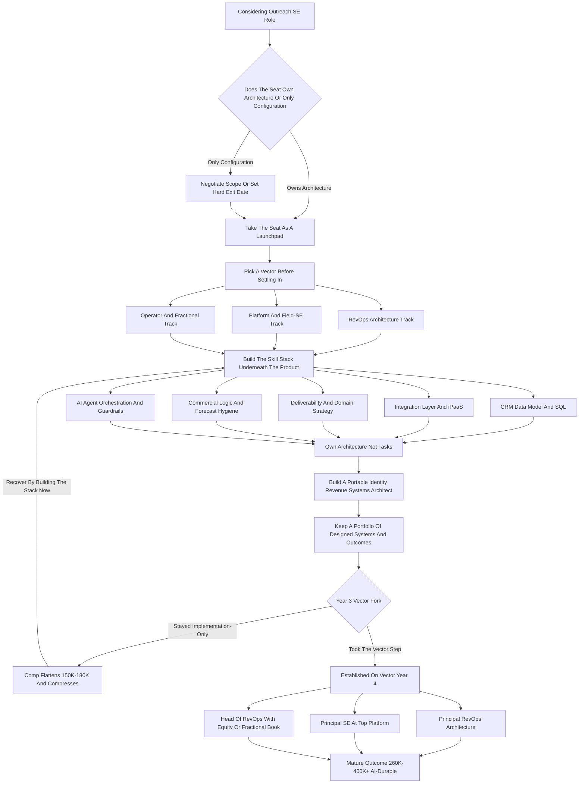
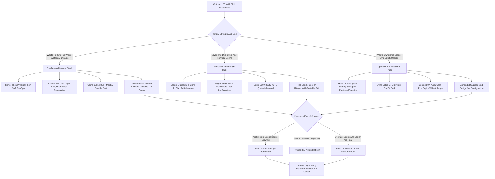

**TL;DR:** Yes -- an Outreach Solutions Engineer role is still a good career bet in 2027, but only if you treat the title as a *launchpad* rather than a *destination*, and only if you deliberately move up the value ladder from "I configure sequences" to "I architect revenue systems." The role sits at the intersection of three durable forces: every B2B company still runs an outbound and pipeline-generation motion, that motion has gotten more technical (data, deliverability, AI agents, multi-tool orchestration), and the people who can make that machinery actually produce pipeline are scarce. A pre-sales Solutions Engineer at Outreach -- the sales-execution platform now owned by the same buyer pool circling Salesloft, Gong, and Clari -- typically earns a **$120K-$170K base with a 70/30 or 75/25 split, landing $150K-$235K OTE**, and the post-sales / professional-services and customer-architecture variants land in a similar band. The honest 2027 picture: the *implementation-only* version of this job -- log in, build sequences, click through an onboarding checklist -- is being compressed by better product UX and by AI agents from 11x, Regie.ai, Clay, and Outreach's own automation layer, and that compression is real and accelerating. But the *architecture* version of the job -- the SE who owns CRM-to-engagement-platform data flow, deliverability and domain strategy, territory and routing logic, forecasting hygiene, and the integration mesh across Salesforce, Snowflake, and the AI tools -- is getting *more* valuable, not less, because someone has to design the system the agents run inside. The three career vectors that pay off from an Outreach SE seat: **(1) the RevOps architecture track** -- move into Senior/Principal/Staff RevOps or Sales Engineering leadership, $180K-$320K+, owning the whole revenue tech stack; **(2) the platform / field-SE track** -- go deeper technical at Outreach, Gong, Clari, HubSpot, or Salesforce as a senior pre-sales engineer carrying a quota-influenced number, $200K-$300K+ OTE; and **(3) the operator / fractional track** -- take the systems knowledge into a Head of RevOps role at a scaling startup or a fractional RevOps practice, $150K-$400K depending on structure. The three things that quietly kill an Outreach SE career: **(a) staying implementation-only** and never learning the data layer, the CRM object model, or the commercial logic underneath the tool; **(b) over-indexing on one vendor's UI** so your resume reads "Outreach button-pusher" instead of "revenue systems architect who happens to know Outreach"; and **(c) ignoring the consolidation risk** -- Outreach, Salesloft, Gong, and Clari are all consolidation targets, and tying your identity to one logo instead of the transferable skill is how you get caught flat in a re-org. Net: a strong career in 2027 if you use the seat to learn revenue *architecture*; a dead end by 2029 if you let it stay a configuration job.

## What an Outreach Solutions Engineer Actually Does in 2027

An Outreach Solutions Engineer is the technical person who makes a sales-execution platform actually produce pipeline -- and the job splits into two distinct shapes that get blurred under one title. The **pre-sales SE** sits in the deal cycle: they run technical discovery with a prospect's RevOps and sales-ops team, scope how Outreach will sit between the CRM and the rep, build the demo and the proof-of-concept, answer the security and deliverability questions, and de-risk the technical objections that would otherwise stall a six-figure platform purchase. The **post-sales / professional-services SE** -- sometimes titled Implementation Consultant, Solutions Consultant, or Customer Solutions Architect -- takes the signed deal and stands the platform up: CRM field mapping, sequence architecture, mailbox and domain configuration for deliverability, user provisioning, reporting, and the first ninety days of adoption. In 2027 both shapes have gotten meaningfully more technical than the 2021 version of the role. The platform no longer lives alone; it sits inside a mesh of Salesforce or HubSpot as the system of record, a data layer like Snowflake or a CDP, enrichment from Clay or ZoomInfo, conversation intelligence from Gong, and -- the genuinely new thing -- AI sales agents that draft, send, and sometimes book on their own. The Outreach SE is the person who has to make all of that produce a clean, attributable pipeline number. The job is not "knows where the buttons are." The job, done well, is "understands the commercial logic of an outbound motion, the data model underneath it, and the integration surface around it, and can design a system that a sales team and an AI agent can both operate inside." That distinction -- buttons versus architecture -- is the entire career question, and everything below is about which side of it you end up on.

## The Honest 2027 Verdict: Launchpad, Not Destination

The direct answer to "is this role still good for my career" is yes, with a sharp condition: it is an excellent *launchpad* and a poor *destination*. As an entry or mid-career seat, the Outreach SE role gives you something rare and portable -- you sit at the technical center of how a company generates revenue, you see the CRM object model and the data flow and the commercial logic from the inside, and you build a resume line that reads "I make revenue systems work," which is one of the most fundable skill stories in B2B. That is the launchpad. The destination problem is this: the *static* version of the role -- the person who has done the same implementation checklist for four years and never moved up the value ladder -- is being slowly compressed from two directions. Product UX keeps getting better, so the configuration that used to need an expert now needs a competent admin. And AI agents -- 11x, Regie.ai, Clay's agent layer, Outreach's own automation -- absorb more of the rote build-and-send work every quarter. None of that kills the role. It kills the *implementation-only interpretation* of the role. The SE who, by year three, owns deliverability strategy, the CRM-to-platform data contract, territory and routing logic, and the forecasting hygiene of the whole motion is *more* valuable in 2027 than they were in 2021, because the system got more complex and someone has to architect it. So: take the seat, and from day one treat it as the place you *learn revenue architecture*, not the place you *settle into platform configuration*. The people for whom this role "went bad" are almost always the people who let it stay a configuration job.

## The Compensation Reality: Base, Variable, and OTE Bands

Compensation is where the "is it good for my career" question gets concrete, and the honest 2027 bands look like this. A pre-sales Solutions Engineer at Outreach or a comparable sales-execution / RevTech vendor typically carries a **$120K-$170K base** with a **70/30 or 75/25 base-to-variable split**, landing an **on-target earnings number of roughly $150K-$235K**, with senior and principal pre-sales engineers pushing past $260K-$300K once equity and accelerators are counted. The variable is usually tied to team or territory bookings rather than an individual quota, which makes the income steadier than a pure AE seat but caps the upside lower. The **post-sales / professional-services SE** -- Implementation Consultant, Solutions Architect -- tends to run a slightly higher base, **$110K-$160K**, with a smaller variable component (often 10-20%, tied to utilization, project delivery, or CSAT), landing **$130K-$190K total**. The comparison points matter: Gong's senior solutions engineers and Clari's principal solutions architects land in overlapping or higher bands; Salesforce and HubSpot pre-sales engineers at the senior level frequently clear $220K-$320K OTE because the deal sizes and the platform breadth are larger. The career-relevant fact is the *shape* of the curve, not just the level: an Outreach SE who stays implementation-only flattens around the $150K-$180K mark by year four, while the same person who moves into RevOps architecture or senior platform SE work breaks through $220K and keeps climbing. The pay is good. The pay *ceiling* depends entirely on which vector you take.

| Role / Level | Base | Variable / Split | Realistic OTE |
|---|---|---|---|
| Outreach SE (pre-sales, early) | $110K-$135K | 75/25 | $135K-$165K |
| Outreach SE (pre-sales, senior) | $140K-$170K | 70/30 | $185K-$235K |
| Outreach SE (principal / staff pre-sales) | $160K-$195K | 70/30 + accel. | $230K-$300K+ |
| Outreach Implementation / Solutions Consultant | $105K-$150K | 80/20 or 90/10 | $125K-$180K |
| Gong Senior Solutions Engineer | $135K-$175K | 70/30 | $185K-$250K |
| Clari Principal Solutions Architect | $150K-$200K | 75/25 | $200K-$280K |
| Salesforce / HubSpot Senior SE | $150K-$190K | 65/35 | $220K-$320K |
| Senior / Principal RevOps (architecture track) | $160K-$230K | 85/15 | $190K-$320K+ |
| Head of RevOps (scaling startup) | $170K-$240K | + equity | $200K-$400K (w/ equity) |

## The Three Career Vectors From an Outreach SE Seat

There are exactly three high-value directions out of this role, and naming them precisely matters because the seat itself is neutral -- it rewards whichever one you deliberately build toward. **Vector one is the RevOps architecture track.** You use the SE seat to learn the entire revenue tech stack from the inside, then move into Senior, Principal, or Staff Revenue Operations -- or into Sales Engineering / Solutions leadership -- where you own the system rather than configure a piece of it. This is the most common and most durable exit, it pays $180K-$320K-plus, and it is the path where the AI-agent wave is a *tailwind*: the more the stack automates, the more a company needs an architect who designs the system the automation runs inside. **Vector two is the platform / field-SE track.** You go deeper technical and stay in pre-sales, but you move to a larger platform with bigger deals -- a senior or principal SE at Gong, Clari, HubSpot, or Salesforce -- carrying a quota-influenced number, $200K-$300K-plus OTE, with the work shifting from configuration toward architecture, security, and executive-level technical selling. **Vector three is the operator / fractional track.** You take the systems knowledge in-house as a Head of RevOps at a scaling startup -- trading some cash for equity and scope -- or you build a fractional RevOps practice serving several companies at once, where a strong operator clears $150K-$400K depending on client load and structure. All three are real, all three pay well, and the Outreach SE seat is a legitimate on-ramp to each. The failure mode is not picking one and drifting -- which lands you in the static-implementation trap by default.

## Vector One Deep Dive: The RevOps Architecture Track

The RevOps architecture track is the highest-probability good outcome from an Outreach SE seat, so it deserves the most detail. The move is from "I configure the engagement platform" to "I design and own the revenue operating system" -- the CRM object model, the data layer, the routing and territory logic, the forecasting methodology, the tool integration mesh, and the metrics that the whole go-to-market org runs on. What it requires: you have to learn the layers *beneath* Outreach. That means the Salesforce or HubSpot data model deeply enough to design it, not just use it; the SOQL or SQL to actually interrogate the data; the integration patterns -- native connectors, iPaaS tools like Workato or Tray, reverse-ETL from a warehouse -- well enough to architect them; and the commercial logic of pipeline, conversion, velocity, and forecast accuracy well enough to be the person leadership asks "why is the number wrong." The time horizon is real: 18-30 months in the SE seat, deliberately reaching beyond your lane, to build the portfolio of "I designed this system and it lifted conversion / cleaned the forecast / cut ramp time" stories that get you the RevOps title. The comp progression is the clearest of the three vectors: a Senior RevOps role lands $160K-$210K, Principal pushes $200K-$260K, and Staff or Director of RevOps Architecture at a larger company clears $260K-$320K-plus. And it is the most AI-durable seat in the entire go-to-market org, because the architect is the one role the agents cannot replace -- they run *inside* the system the architect designs.

## Vector Two Deep Dive: The Platform and Field-SE Track

The platform / field-SE track keeps you in pre-sales but moves you up-market, and it is the right vector for the person who genuinely likes the deal cycle, the demo, the technical win, and the customer-facing intensity. The move is from a mid-market SE seat at one platform to a senior or principal SE seat at a larger one -- the natural ladder runs Outreach to Gong or Clari to Salesforce or HubSpot, with deal sizes, platform breadth, and technical depth increasing at each rung. What changes as you climb: less click-through configuration, more architecture diagrams, security and compliance review, multi-product solutioning, and executive-level technical selling where you are the credibility in the room that closes a $400K platform deal. The skills that compound here are technical breadth across the GTM stack, the ability to whiteboard an integration architecture live, security and data-governance fluency, and the executive presence to be trusted by a prospect's VP of RevOps. Comp at the senior level runs $185K-$250K OTE and principal SEs at the large platforms clear $260K-$320K-plus with equity. The risk to manage on this vector is vendor-identity lock-in -- which the counter-case section treats in full -- but the mitigation is simple: build the *transferable* architecture skill, so your value is "senior SE who understands revenue systems" and the logo on your badge is incidental.

## Vector Three Deep Dive: The Operator and Fractional Track

The operator / fractional track takes the systems knowledge in-house or independent, and it is the right vector for the person who wants ownership and scope over the structured comp of a vendor seat. The **in-house operator** version: you become Head of RevOps or Director of Revenue Operations at a scaling startup -- typically Series A through C -- where you own the entire go-to-market system end to end, report to a CRO or COO, and trade some cash compensation for meaningful equity. Cash runs $170K-$240K, but the equity is the real bet, and a good outcome at a company that exits well is the largest single payoff of any vector here. The **fractional** version: you build a practice serving three to six companies at once as their part-time Head of RevOps, charging $4K-$15K per client per month, where a full book clears $150K-$400K depending on client load and whether you stay solo or build a small team. Both versions demand the same thing the SE seat is supposed to teach you: not platform configuration, but the ability to walk into a messy revenue system, diagnose why the pipeline is leaking or the forecast is wrong, and design the fix across people, process, and the tool stack. This vector has the widest outcome range -- the most upside and the most variance -- and it is the clearest proof that the Outreach SE seat, used well, is a launchpad into genuine business ownership.

## The Skill Stack: What You Must Learn Beyond the Outreach UI

The single highest-leverage thing you can do in an Outreach SE seat is deliberately build the skill stack *underneath* the product, because that stack is what makes you AI-durable and vendor-portable. Layer one is the **CRM data model** -- the Salesforce or HubSpot object architecture, the relationships between accounts, contacts, leads, opportunities, and activities, and the field-level logic that everything else depends on; you should be able to design this, not just navigate it. Layer two is **data and query fluency** -- SOQL for Salesforce, SQL for the warehouse, enough to interrogate the pipeline data yourself rather than waiting for an analyst. Layer three is the **integration layer** -- native connectors, iPaaS platforms like Workato and Tray.io, reverse-ETL from Snowflake or BigQuery, and webhook and API patterns -- because the modern GTM stack is an integration problem more than a configuration problem. Layer four is **deliverability and domain strategy** -- SPF, DKIM, DMARC, domain warming, mailbox rotation, the post-2024 Google and Yahoo sender requirements -- which is genuinely technical, high-stakes, and a place where a strong SE is irreplaceable. Layer five is **commercial logic** -- pipeline math, conversion rates by stage, sales velocity, forecast accuracy, ramp time, the unit economics of an outbound motion -- because the architect is the person who connects the system to the number. Layer six is **AI orchestration** -- how agents from 11x, Regie.ai, and Clay actually plug into the stack, where they help, where they break, and how to design guardrails around them. An SE who builds all six layers is not threatened by the AI wave; they are the person who gets hired to manage it.

| Skill Layer | What It Covers | Why It Compounds |
|---|---|---|
| CRM data model | Salesforce/HubSpot object architecture, field logic | Foundation every other layer depends on |
| Data & query fluency | SOQL, SQL, warehouse interrogation | Lets you diagnose the number yourself |
| Integration layer | iPaaS (Workato, Tray), reverse-ETL, APIs | Modern stack is an integration problem |
| Deliverability strategy | SPF/DKIM/DMARC, domain warming, sender rules | High-stakes, technical, irreplaceable |
| Commercial logic | Pipeline math, velocity, forecast accuracy | Connects the system to revenue |
| AI orchestration | Agent integration, guardrails, failure modes | Makes you the person who manages the wave |

## The AI Agent Compression: What's Real and What's Hype

The honest read on AI and this role: the compression is real, it is specific, and it does not point where the panic points. What AI agents genuinely absorb -- and this is happening now, not someday -- is the *rote build-and-send layer*: drafting sequence copy, generating first-draft messaging, executing the send cadence, doing tier-one personalization, and handling the simplest tier of reply triage. Tools like 11x (which raised a $50M Series B led by Benchmark in late 2024), Regie.ai, and Clay's agent features are aimed squarely at that layer, and Outreach's own product roadmap is automating the same work from the inside. So the implementation-only SE -- whose value was "I will build your sequences and click through your onboarding" -- is genuinely being compressed, and pretending otherwise is career malpractice. But here is what the agents do *not* do, and structurally cannot do well: design the CRM data contract the agent reads from, architect the integration mesh the agent operates inside, set the deliverability and domain strategy that determines whether the agent's sends even land, define the routing and territory logic, own the forecast hygiene, and -- critically -- decide *what the system should do* and put guardrails around an agent that will otherwise confidently do the wrong thing at scale. Every AI agent makes the *architect* more necessary, not less, because an agent is a powerful actor inside a system and someone has to design and govern the system. The career instruction that falls out of this is unambiguous: do not be the layer the agent replaces; be the layer that designs the system the agent runs inside.

## The Consolidation Risk: Outreach, Salesloft, Gong, and Clari

A clear-eyed career decision has to price in the consolidation risk, because the sales-execution and RevTech category is consolidating and an Outreach SE who ignores that is exposed. The landscape: Outreach and Salesloft -- the two original sales-engagement platforms -- have been circled by the same private-equity and strategic buyer pool for years; Salesloft was taken private by Vista Equity Partners in a deal valued around $2.3 billion at the end of 2023, and the market has long expected Outreach to face a similar outcome. Gong and Clari, the conversation-intelligence and revenue-platform players, are also frequently named in consolidation and acquisition chatter as the category compresses from a dozen point tools toward a few suites. What that means for an SE: a re-org, an acquirer's tooling rationalization, a "we already own a competing product" decision, or a private-equity efficiency pass can all reshape or eliminate a specific SE team with little warning -- and the SE whose entire identity and resume is "Outreach platform expert" is the one who gets caught flat. The mitigation is not pessimism; it is portability. Build the *transferable* skill -- revenue architecture, the data layer, the integration mesh, the commercial logic -- so that when the logo on your badge changes (and in this category it probably will), your value does not. The SE who is "a revenue systems architect who currently works at Outreach" survives every consolidation scenario. The SE who is "an Outreach button expert" survives only until the next deal closes.

## Pre-Sales SE vs. Post-Sales SE: Which Variant to Take

If you are choosing between the two shapes of the role, the trade-offs are real and worth weighing deliberately. The **pre-sales SE** lives in the deal cycle: technical discovery, demos, proof-of-concept builds, security questionnaires, and the technical close. The upside is higher variable comp and a clearer line to the platform / field-SE vector and to sales leadership; the cost is the deal-cycle intensity, the demo treadmill, and a skill set that can skew toward "compelling demo" over "deep architecture" if you are not careful. The **post-sales / professional-services SE** lives in implementation and adoption: data mapping, sequence architecture, deliverability setup, the first ninety days of customer success. The upside is that you build genuinely deep architecture muscle -- you are the one actually standing the system up -- which is the most direct on-ramp to the RevOps architecture vector and the operator vector; the cost is a lower variable component and the risk that the role stays a configuration checklist if you do not push beyond it. The honest recommendation: if your target is the platform / field-SE vector or sales leadership, take pre-sales. If your target is RevOps architecture or the operator track -- the two most AI-durable, highest-ceiling vectors -- the post-sales / solutions-architect variant builds the better foundation, *provided* you treat it as architecture practice and not as an onboarding-checklist job. Either variant works. Drifting in either variant without a vector does not.

## The Resume Problem: "Outreach Admin" vs. "Revenue Architect"

One of the quietest career killers in this role is how your experience reads on paper, and it is worth being deliberate about it from your first month. There are two versions of the exact same three years. Version one reads: "Outreach Solutions Engineer -- built sequences, ran onboarding, configured the platform for new customers." That resume gets you another Outreach-shaped job, at a similar level, and it is precisely the resume the AI-agent wave devalues -- because everything on it is a layer that is being automated. Version two reads: "Revenue systems architect -- designed CRM-to-engagement-platform data contracts across Salesforce and Snowflake, owned deliverability and domain strategy lifting send-acceptance, architected the integration mesh across the GTM stack, built the forecasting hygiene that cut forecast error." That resume gets you a Principal RevOps interview, a senior platform SE interview at a larger company, or a Head of RevOps conversation -- and it is AI-durable, because every line is an architecture skill the agents need a human to own. The work can be *identical*; the framing, and the deliberate reaching beyond the configuration lane to actually do and own the architecture work, is what determines which resume you have. The instruction: from month one, keep a running record of systems you *designed and owned*, not tasks you *completed*, and make sure the substance behind the resume is real -- which it will be, if you build the skill stack above.

## Geography, Remote Work, and the 2027 Hiring Market

The hiring market context matters for the career decision. RevTech SE roles are heavily remote-friendly and have stayed that way through 2027 -- the work is screen-shared discovery, demos, and architecture, and it does not require a desk in a specific city -- which widens your opportunity set well beyond a single metro and lets you optimize for the *vector* rather than the commute. The flip side of a remote, national market is that the comp bands compress somewhat toward a national rate rather than a Bay Area or NYC premium, and the candidate pool you compete against is national, which raises the bar. The 2027 market itself is *bifurcated* in exactly the way the rest of this guide describes: demand for implementation-only SEs is soft and softening, because the work is being automated and product UX is absorbing it; demand for SEs who can architect, who understand the data layer, and who can govern an AI-augmented stack is strong and growing, because every company adopting agents suddenly needs that person. The hiring signal to read: if the job descriptions you are getting interviews for are all "configure the platform, onboard customers," you are being slotted into the compressed segment, and the fix is to build and surface the architecture skill stack until the interviews you get are "own the revenue system." Geography is not your constraint in 2027. Vector is.

## The Five-Year Career Trajectory From an Outreach SE Seat

Mapping a realistic five-year arc makes the career bet concrete. **Year 1:** you take the Outreach SE seat -- pre-sales or solutions-architect variant -- and your job is to become genuinely competent at the platform *and*, from month one, start building the skill stack underneath it: CRM data model, the integration layer, deliverability. Comp lands $135K-$170K. **Year 2:** you are trusted with complex implementations or technical deals, you have real SQL and integration fluency, and you start owning a piece of architecture -- deliverability strategy, or the CRM data contract -- rather than just executing a checklist. Comp climbs to $160K-$200K. **Year 3:** the fork. You have a portfolio of "systems I designed and owned" stories, and you choose a vector deliberately -- senior platform SE at a larger company, a Senior RevOps title, or a first Head of RevOps role at a scaling startup. Comp crosses $185K-$230K. **Year 4:** you are established on your vector -- Principal SE, Principal RevOps, or an operator with real scope and equity -- and you are managing or architecting rather than configuring. Comp runs $220K-$280K-plus. **Year 5:** the mature outcome -- Staff/Director-level RevOps architecture, a principal SE at a top platform, or a Head of RevOps with meaningful equity or a full fractional book -- $260K-$400K-plus depending on vector and equity. This arc assumes one thing throughout: that you treated the SE seat as a launchpad and built the architecture skill deliberately. The arc for the SE who let the role stay a configuration job flattens hard around year three at $150K-$180K, and gets more fragile every year as the automation wave rises.

| Year | Stage | Focus | Comp Band |
|---|---|---|---|
| Year 1 | Outreach SE (entry/mid) | Platform competence + start skill stack | $135K-$170K |
| Year 2 | Trusted SE | Own a piece of architecture, SQL + integration fluency | $160K-$200K |
| Year 3 | The vector fork | Choose: platform SE / RevOps / operator | $185K-$230K |
| Year 4 | Established on vector | Principal SE / Principal RevOps / scoped operator | $220K-$280K+ |
| Year 5 | Mature outcome | Staff RevOps / top-platform principal SE / Head of RevOps + equity | $260K-$400K+ |

## Five Named Real-World Career Scenarios

Concrete scenarios make the vectors tangible. **Scenario one -- Priya, the architecture builder:** takes a post-sales Outreach Solutions Consultant seat at $115K, and from month one treats every implementation as architecture practice -- she learns the Salesforce data model cold, picks up SOQL, owns deliverability strategy for her accounts. By year three she has a portfolio of designed systems and moves to a Senior RevOps role at $195K; by year five she is Director of RevOps Architecture at a Series D company clearing $290K. The SE seat did exactly what it is supposed to do. **Scenario two -- the cautionary tale, Marcus:** takes the same kind of seat, becomes genuinely excellent at the Outreach UI, and stays there -- four years of building sequences and running onboarding. His comp flattens at $165K, his resume reads "Outreach admin," and when the AI-agent wave and a product-UX refresh compress his exact job, he is competing for the shrinking pool of implementation-only roles with a non-portable skill set. **Scenario three -- Devon, the platform climber:** takes a pre-sales Outreach SE seat, loves the deal cycle, and deliberately builds technical breadth and executive presence; he ladders to a Senior SE role at Gong, then a Principal SE seat at Salesforce, clearing $295K OTE by year five carrying a quota-influenced number on large platform deals. **Scenario four -- Aisha, the operator:** uses three years as an Outreach SE to learn the whole revenue system, then takes a Head of RevOps role at a Series B startup -- $185K cash plus meaningful equity -- owning the entire GTM stack; the equity is the real bet, and a clean exit would be the biggest single payoff of any scenario here. **Scenario five -- Tomas, the fractional practitioner:** after four years spanning both SE variants, he leaves to build a fractional RevOps practice, serving five companies at $7K-$10K each per month, clearing roughly $400K at full book as the architect-for-hire that scaling startups cannot justify full-time. Four of the five used the seat as a launchpad. One let it stay a job. That is the whole career question.

## How to Interview Into the Right Version of the Role

If you are evaluating an Outreach SE offer -- or any RevTech SE offer -- interview the *role*, not just take it, because two seats with the same title can be on opposite sides of the compression line. Ask what the SE team actually owns: if the answer is "onboarding and sequence builds," that is the compressed segment; if the answer includes "data architecture, integration design, deliverability strategy, forecasting," that is the durable segment. Ask who the SE team reports into and works alongside -- proximity to RevOps, to the data team, and to sales leadership is proximity to the architecture work and to your next vector. Ask about the AI roadmap explicitly: a company that talks about agents as something the SE team will *architect and govern* is a company building the durable role; a company that has not thought about it is one where the role is static by default. Ask what the last three people in the seat did *next* -- the honest answer tells you whether this seat is a launchpad or a holding pattern. And negotiate for *scope* alongside comp: a slightly lower base with an explicit mandate to own deliverability strategy or the CRM data contract is worth more to your five-year arc than a higher base in a pure-configuration seat. The title on the offer letter is the same either way. The career outcome depends on which version of the role you actually negotiated into.

## What Companies Actually Hire For: Outreach, Gong, Clari, HubSpot, Salesforce

Knowing where the seats are and what each kind of company hires for sharpens the decision. **Outreach itself** hires SEs for both pre-sales and professional services; the pre-sales seats are the on-ramp to the platform / field-SE vector, the professional-services seats are the better architecture foundation. **Gong** hires senior solutions engineers around its conversation-intelligence and revenue-platform products; the deals are larger and the technical selling is more architecture-heavy, which makes it a natural step-up on the platform vector. **Clari** hires solutions architects and principal SEs around revenue forecasting and pipeline-platform work -- this is the seat closest to the commercial-logic and forecasting layer, and an unusually strong bridge into the RevOps architecture vector. **HubSpot and Salesforce** hire senior SEs at the largest scale and the highest comp bands, with the broadest platform surface and the most executive-level technical selling -- the top of the platform / field-SE ladder. And **every scaling B2B company** -- not just the vendors -- hires for the in-house operator vector: Head of RevOps, Director of Revenue Operations, RevOps Architect, where they want exactly the systems knowledge an Outreach SE seat builds. The strategic read: the vendors (Outreach, Gong, Clari, HubSpot, Salesforce) are where you build and climb the SE craft; the operating companies are where you cash the systems knowledge in for scope and equity. A strong career uses both -- vendor seats to build the skill, an operator or principal seat to capture its value.

## The RevOps Salary and Demand Data Behind the Decision

The career bet rests on a labor-market reality worth stating plainly: Revenue Operations as a function has gone from a niche title to a board-level priority over the last several years, and the demand for people who can architect a revenue system -- not just run a tool -- has outgrown the supply of people who can actually do it. That supply-demand gap is the entire reason the Outreach SE seat is a good launchpad: it is one of the few entry points where you get paid a strong wage *while* you learn the exact skill the market is short of. The compensation data tracks this -- senior and principal RevOps roles have climbed into the $200K-$320K-plus band, Head of RevOps roles at funded startups pair $170K-$240K cash with equity, and the fractional RevOps market exists at all because companies cannot hire the skill fast enough full-time. The same data shows the *other* side of the bifurcation: pure platform-administration and implementation-only roles have flat or declining real comp and a shrinking number of openings, because that work is being absorbed by product and by agents. So the labor market is not sending a mixed signal -- it is sending a very clear one. It is paying a rising premium for revenue *architecture* and a falling one for platform *configuration*, and the Outreach SE seat sits right on the line between them. Your job, for the entire time you hold the seat, is to walk toward the architecture side of that line.

## Adjacent and Alternative Paths Worth Considering

Before committing, a careful person should weigh the adjacent paths, because for some people one of them fits better than the Outreach SE seat itself. **The AE path** -- going into a quota-carrying Account Executive seat instead -- has higher variance and a higher cash ceiling, but it trades away the systems-architecture skill that makes the SE path AI-durable; it is the right call for someone whose strength is the relationship and the close, not the system. **The straight RevOps-analyst path** -- entering revenue operations directly as an analyst rather than through an SE seat -- gets you to the architecture work faster but without the customer-facing technical-selling muscle and the platform depth the SE seat builds; it is a more direct but narrower on-ramp. **The data-analytics path** -- going into a GTM data or analytics seat -- builds the data and query layer deeply but skips the commercial and customer-facing layers; strong for the deeply technical person, weaker for someone who wants the full revenue-architect profile. **The sales-engineering path at a non-RevTech company** -- being an SE for an infrastructure, security, or developer-tools product -- builds heavier technical depth but in a different domain, less transferable to the RevOps and operator vectors specifically. The honest framing: the Outreach SE seat is not the *only* good path, but it is unusually *balanced* -- it builds the technical, the commercial, and the customer-facing layers together, which is exactly the combination the RevOps architecture and operator vectors reward. If your strength is narrowly the close, or narrowly the data, an adjacent path may fit better. If you want the full revenue-architect profile, the SE seat is one of the best on-ramps that exists.

## The Decision Framework: Should You Take or Stay in This Role

Pulling the whole analysis into a decision framework: a person deciding whether to take -- or stay in -- an Outreach Solutions Engineer role in 2027 should run a structured self-assessment. **On the seat itself:** does this specific role own architecture (data, integration, deliverability, forecasting), or only configuration (onboarding, sequence builds)? If only configuration, can you negotiate scope into it, and if not, is it still worth taking as a short, deliberate stepping stone with a hard exit date? **On yourself:** are you willing to spend 18-30 months deliberately building the skill stack *underneath* the product -- the CRM data model, SQL, the integration layer, deliverability, commercial logic, AI orchestration -- rather than getting comfortable as a platform expert? If not, the role will go static on you, and the framework's honest answer is "do not take it, or do not stay." **On the vector:** can you name which of the three vectors -- RevOps architecture, platform / field-SE, operator / fractional -- you are building toward, and is this seat a credible on-ramp to it? If you cannot name a vector, that is the gap to close before the seat, not after. **On the risk:** are you treating the consolidation exposure seriously enough to build a *portable* identity -- "revenue systems architect" -- rather than a vendor-specific one? If a person answers well across all four -- a seat with real architecture scope or a deliberate exit date, a genuine willingness to build the deeper skill stack, a named vector, and a portable identity -- then an Outreach SE role in 2027 is a strong career bet with a $260K-$400K-plus five-year ceiling. If they answer poorly -- a pure-configuration seat, no appetite for the deeper stack, no named vector, a logo-dependent identity -- then the role is the static-implementation trap, and the framework says either reshape it or pass. The seat is neutral. The framework is about whether *you* will make it a launchpad.

## The 2027-2030 Outlook: Where This Role Is Heading

A person committing years to this path should have a view on where it goes next, and several trends are reasonably clear. **The bifurcation hardens.** The gap between the compressed implementation-only role and the durable architecture role does not close -- it widens, as product UX keeps improving and agents keep absorbing more of the rote layer, while the architecture, governance, and commercial-logic work gets more essential. **AI agents become standard, and governance becomes a named job.** By 2030 it is normal for a GTM org to run AI agents inside the outbound motion, which means "the person who designs and governs the agent-augmented revenue system" goes from an emergent role to a core one -- and that person looks exactly like an Outreach SE who took the architecture vector. **RevOps keeps rising as a function.** Revenue Operations continues its move from back-office support to a strategic, board-visible function, which keeps pulling comp and prestige up the architecture vector. **The RevTech category keeps consolidating.** Outreach, Salesloft, Gong, Clari, and the rest compress toward fewer suites, which keeps making vendor-specific identity risky and portable architecture skill valuable. **The fractional and operator markets keep growing**, because scaling companies will keep needing revenue-architecture skill faster than they can hire it full-time. The net outlook: the Outreach Solutions Engineer *title* may not even exist in its 2027 form by 2030 -- it may be absorbed, renamed, or restructured by consolidation and automation. But the *skill* the seat builds, used well -- revenue systems architecture -- is heading into its most valuable decade. A person who takes the seat in 2027 as a launchpad for that skill is making a good bet on a durable career. A person who takes it as a place to be a platform expert is making a bet on a role that the next three years are specifically built to compress.

## The Final Framework: Building the Career Right From Day One

Pulling the entire playbook into a single operating sequence: a person who takes an Outreach Solutions Engineer role in 2027 and wants it to actually build a strong career should execute in this order. **First, get honest about the seat** -- confirm whether it owns architecture or only configuration, and if it is configuration-only, take it only with a negotiated scope expansion or a deliberate exit date. **Second, pick a vector before you settle in** -- RevOps architecture, platform / field-SE, or operator / fractional -- because the seat rewards whichever one you build toward and punishes drift. **Third, from month one build the skill stack underneath the product** -- CRM data model, SQL, the integration layer, deliverability strategy, commercial logic, AI orchestration -- because that stack, not the platform UI, is what is AI-durable and vendor-portable. **Fourth, own architecture, not tasks** -- deliberately reach beyond the configuration lane to design and own a real piece of the system, so your experience is "systems I architected" and not "checklists I completed." **Fifth, build a portable identity** -- be "a revenue systems architect who currently works at Outreach," never "an Outreach platform expert," so consolidation and re-orgs cannot strand you. **Sixth, treat the AI wave as a tailwind** -- position yourself as the layer that designs and governs the system the agents run inside, not the layer the agents replace. **Seventh, keep a running portfolio** -- a documented record of systems you designed and the commercial outcomes they produced, which is what gets you the Principal RevOps, senior platform SE, or Head of RevOps conversation. **Eighth, take the vector step on time** -- around year three, make the deliberate move, because the cost of drifting in the seat compounds every year the automation wave rises. Do these eight things and an Outreach SE role in 2027 is a legitimate launchpad to a $260K-$400K-plus revenue-architecture career. Skip them -- especially the skill stack and the named vector -- and the same title is a slow slide into the exact segment of the labor market that the next three years are built to compress. The role is not the answer. What you build on top of it is.

## The Career Journey: From Outreach SE Seat to Mature Outcome

## The Decision Matrix: RevOps Architecture vs. Platform SE vs. Operator

## Sources

1. **US Bureau of Labor Statistics -- Occupational Employment and Wage Statistics (Sales Engineers, Software Developers, Management Analysts)** -- Wage and employment data for sales engineering and adjacent operations roles. https://www.bls.gov/oes/
2. **US Bureau of Labor Statistics -- Occupational Outlook Handbook: Sales Engineers** -- Job-outlook, growth-projection, and role-definition reference. https://www.bls.gov/ooh/
3. **RepVue -- Sales Engineering and RevTech Compensation Data** -- Crowdsourced base, variable, and OTE data for SE and RevOps roles by company. https://www.repvue.com
4. **Levels.fyi -- Solutions Engineer and Solutions Architect Compensation** -- Verified compensation data across base, equity, and bonus for SE and SA roles. https://www.levels.fyi
5. **Pavilion -- Revenue Operations and GTM Leadership Benchmarks** -- Community and benchmark data for RevOps, sales, and GTM leadership roles and comp. https://www.joinpavilion.com
6. **The Bridge Group -- Sales Development and Sales Operations Metrics Reports** -- Ongoing research on SDR, sales-ops, and RevOps team structure, comp, and ramp. https://www.bridgegroupinc.com
7. **Gartner -- Sales Technology and Revenue Operations Research** -- Analyst coverage of the RevTech category, consolidation, and the rise of RevOps as a function. https://www.gartner.com
8. **Outreach -- Platform, Solutions, and Careers Documentation** -- Product scope, integration catalog, and role references for the sales-execution platform. https://www.outreach.io
9. **Gong -- Revenue Intelligence Platform and Careers** -- Product and role references for the conversation-intelligence and revenue platform. https://www.gong.io
10. **Clari -- Revenue Platform and Solutions Architecture Roles** -- Product and role references for the revenue-forecasting and pipeline platform. https://www.clari.com
11. **Salesloft -- Sales Engagement Platform (Vista Equity Partners portfolio)** -- Reference for the Salesloft platform and the Vista take-private transaction. https://salesloft.com
12. **HubSpot -- Sales Hub and Solutions Engineering Roles** -- Product and pre-sales role references for the CRM and sales platform. https://www.hubspot.com
13. **Salesforce -- Sales Cloud and Solution Engineering Career Paths** -- Pre-sales engineering role and platform-architecture references. https://www.salesforce.com
14. **11x -- AI Sales Agent Platform ($50M Series B led by Benchmark, 2024)** -- Reference for the AI-agent layer compressing rote outbound execution work. https://www.11x.ai
15. **Regie.ai -- AI Sales Outreach and Agent Platform** -- Reference for AI-driven sequence generation and outbound automation. https://www.regie.ai
16. **Clay -- GTM Data and Agent Platform** -- Reference for enrichment and agent-driven workflow automation in the modern GTM stack. https://www.clay.com
17. **Vista Equity Partners -- Salesloft Acquisition and RevTech Portfolio** -- Reference for private-equity consolidation activity in the sales-engagement category. https://www.vistaequitypartners.com
18. **Workato and Tray.io -- Integration Platform (iPaaS) Documentation** -- Reference for the integration-layer skills central to revenue-systems architecture.
19. **Snowflake -- Data Cloud and Reverse-ETL Patterns** -- Reference for the data-warehouse layer underneath a modern revenue stack. https://www.snowflake.com
20. **Salesforce Developer Documentation -- Data Model and SOQL** -- Reference for the CRM object model and query skills an SE must build. https://developer.salesforce.com
21. **Google and Yahoo Bulk Sender Requirements (2024)** -- Reference for the deliverability, SPF/DKIM/DMARC, and sender-authentication requirements an SE must master.
22. **ZoomInfo -- GTM Data and Sales Intelligence** -- Reference for the data-enrichment layer in the outbound motion. https://www.zoominfo.com
23. **OpenComp / Comprehensive.io -- Compensation Benchmarking for GTM Roles** -- Reference for base, variable, and equity benchmarking across sales and RevOps roles.
24. **RevGenius and Wizards of Ops -- RevOps Practitioner Communities** -- Practitioner discussion of RevOps career paths, tooling, and architecture practice.
25. **Sales Hacker / GTM Trade Coverage** -- Ongoing journalism on sales technology, SE roles, RevOps, and the AI-agent shift.
26. **LinkedIn Economic Graph and Jobs on the Rise Reports** -- Demand-trend data for RevOps, sales engineering, and adjacent GTM roles. https://economicgraph.linkedin.com
27. **Forrester -- B2B Revenue Operations and Sales Technology Research** -- Analyst coverage of RevOps maturity and the revenue tech stack. https://www.forrester.com
28. **G2 -- Sales Engagement and RevOps Software Category Data** -- Reference for the RevTech competitive landscape and category consolidation. https://www.g2.com
29. **SaaStr -- GTM, RevOps, and Sales Leadership Content** -- Practitioner and founder commentary on RevOps roles, comp, and the SE-to-leadership path. https://www.saastr.com
30. **Fractional RevOps Practice and Marketplace References** -- Reference for the fractional Head-of-RevOps engagement and pricing model.
31. **Built In -- Sales Engineer and RevOps Salary and Role Data** -- Aggregated role, comp, and remote-work data for GTM technical roles. https://builtin.com
32. **Glassdoor -- Solutions Engineer and Revenue Operations Compensation** -- Crowdsourced comp and role data across RevTech employers. https://www.glassdoor.com
33. **Demandbase / 6sense -- Account-Based GTM Platform Documentation** -- Reference for the broader ABM and GTM stack an SE architects around.
34. **TSIA -- Technology Services and Professional Services Benchmarks** -- Reference for professional-services SE utilization and delivery models. https://www.tsia.com
35. **Sales Engineering Communities (PreSales Collective)** -- Practitioner discussion of SE career ladders, pre-sales vs. post-sales paths, and comp.

## Numbers

**Compensation Bands (2027, US, Base + Variable -> OTE)**
- Outreach SE (pre-sales, early): base $110K-$135K, 75/25 split, OTE $135K-$165K
- Outreach SE (pre-sales, senior): base $140K-$170K, 70/30 split, OTE $185K-$235K
- Outreach SE (principal / staff pre-sales): base $160K-$195K, 70/30 + accelerators, OTE $230K-$300K+
- Outreach Implementation / Solutions Consultant: base $105K-$150K, 80/20 or 90/10, OTE $125K-$180K
- Gong Senior Solutions Engineer: base $135K-$175K, 70/30, OTE $185K-$250K
- Clari Principal Solutions Architect: base $150K-$200K, 75/25, OTE $200K-$280K
- Salesforce / HubSpot Senior SE: base $150K-$190K, 65/35, OTE $220K-$320K
- Senior / Principal RevOps (architecture track): base $160K-$230K, 85/15, OTE $190K-$320K+
- Head of RevOps (scaling startup): base $170K-$240K plus meaningful equity, $200K-$400K with equity

**The Three Career Vectors (Comp Range)**
- Vector 1 -- RevOps architecture track: $180K-$320K+ (most AI-durable)
- Vector 2 -- Platform / field-SE track: $200K-$300K+ OTE (quota-influenced)
- Vector 3 -- Operator / fractional track: $150K-$400K (widest range, cash + equity)

**Five-Year Career Trajectory**
- Year 1: Outreach SE seat, build platform competence + start skill stack -- $135K-$170K
- Year 2: trusted SE, own a piece of architecture, SQL + integration fluency -- $160K-$200K
- Year 3: the vector fork -- choose platform SE / RevOps / operator -- $185K-$230K
- Year 4: established on vector, architecting not configuring -- $220K-$280K+
- Year 5: mature outcome -- Staff RevOps / top-platform principal SE / Head of RevOps + equity -- $260K-$400K+
- Static path (implementation-only): flattens at $150K-$180K by year 3, compresses further every year

**The Skill Stack (Six Layers To Build In Seat)**
- Layer 1: CRM data model (Salesforce / HubSpot object architecture)
- Layer 2: data and query fluency (SOQL, SQL, warehouse interrogation)
- Layer 3: integration layer (iPaaS -- Workato, Tray.io -- reverse-ETL, APIs)
- Layer 4: deliverability and domain strategy (SPF/DKIM/DMARC, domain warming, 2024 sender rules)
- Layer 5: commercial logic (pipeline math, velocity, conversion, forecast accuracy)
- Layer 6: AI orchestration (agent integration, guardrails, failure modes)

**Time Horizons**
- Skill-stack build to RevOps-architecture readiness: 18-30 months in seat
- The vector fork (deliberate move): around year 3
- Mature high-ceiling outcome: year 5

**AI Agent Compression -- What's Absorbed vs. What's Durable**
- Absorbed by agents (11x, Regie.ai, Clay, Outreach automation): sequence copy drafting, send-cadence execution, tier-one personalization, simplest reply triage
- Durable / made MORE valuable: CRM data contract design, integration mesh architecture, deliverability strategy, routing and territory logic, forecast hygiene, agent governance and guardrails

**Consolidation Context**
- Salesloft: taken private by Vista Equity Partners, deal valued ~$2.3B, late 2023
- Outreach, Gong, Clari: recurring consolidation and acquisition targets as the RevTech category compresses toward fewer suites
- Career mitigation: portable "revenue systems architect" identity over vendor-specific "Outreach expert" identity

**Pre-Sales vs. Post-Sales SE**
- Pre-sales SE: higher variable, deal-cycle intensity, on-ramp to platform / field-SE vector and sales leadership
- Post-sales / solutions-architect SE: higher base, lower variable (10-20%), best foundation for RevOps architecture and operator vectors

**Fractional RevOps Economics**
- Per-client retainer: $4K-$15K per client per month
- Full book (3-6 clients): $150K-$400K depending on load and team structure

## Counter-Case: Why an Outreach SE Role Might Be the Wrong Career Move

The case above describes a strong launchpad, but a serious person must stress-test it against the conditions that make this role a poor career bet. There are real reasons to walk away.

**Counter 1 -- The implementation-only version of the job is genuinely being compressed.** This is not speculative. Product UX keeps improving, and AI agents from 11x, Regie.ai, Clay, and Outreach's own automation layer keep absorbing the rote build-and-send work. If you take the seat and let it stay a configuration job -- and many people do, because it is comfortable and pays fine -- you are sitting in the exact segment of the labor market that the next three years are built to shrink. The role being "still good" is entirely conditional on not being the static version of it, and the static version is the default.

**Counter 2 -- Vendor-identity lock-in is a real and underestimated trap.** Spend four years as "the Outreach expert" and your resume, your network, and your self-concept all get organized around one vendor's product. When that vendor gets acquired, restructured, or out-competed -- and in this category that is a when, not an if -- you discover your value was tied to a logo, not a transferable skill. The SE who did not deliberately build a portable identity is the one caught flat in the re-org.

**Counter 3 -- The category is consolidating, and consolidation eliminates SE teams.** Outreach, Salesloft, Gong, and Clari are all consolidation targets or have already been taken private. Acquirers rationalize tooling, cut redundant teams, and run private-equity efficiency passes. A specific Outreach SE team can be reshaped or eliminated with little warning, and the role's stability is lower than its comfortable day-to-day suggests.

**Counter 4 -- The comp ceiling is real if you do not move.** The implementation-only SE flattens around $150K-$180K by year three and stays there. That is a fine income, but it is not a career *trajectory* -- it is a plateau -- and it gets more fragile every year as the automation wave rises. Anyone expecting the title alone to keep paying more over time is misreading the role.

**Counter 5 -- The skill-stack build is real work that many people will not actually do.** The entire bull case rests on the SE deliberately learning the CRM data model, SQL, the integration layer, deliverability, commercial logic, and AI orchestration -- 18-30 months of reaching beyond the comfortable lane. That is genuine, sustained effort, and the honest truth is that most people in the seat will not do it; they will get good at the product and stop. For that majority, the role is not a launchpad -- it is the plateau in Counter 4.

**Counter 6 -- An AE seat may simply pay more for the right person.** If your real strength is the relationship and the close, a quota-carrying Account Executive path has a higher cash ceiling and faster upside. The SE path's advantage is AI-durability and the architecture skill -- but if you are not going to build that skill, you are taking a lower-ceiling seat without capturing the thing that justifies it.

**Counter 7 -- A direct RevOps-analyst path may be a cleaner on-ramp.** If RevOps architecture is your actual goal, entering revenue operations directly gets you to the architecture work faster, without the detour through customer-facing technical selling. The SE seat builds a broader profile, but "broader" is only valuable if you want the full revenue-architect identity; if you want the narrow architecture path, the SE seat is a slower route.

**Counter 8 -- The variable comp is steadier but lower than it looks.** The 70/30 or 75/25 split tied to team or territory bookings makes income predictable, which sounds good -- but it also caps the upside well below an individual-quota seat and below where a strong operator's equity can land. "Steady" is a feature for some people and a ceiling for others, and it is worth being honest about which one it is for you.

**Counter 9 -- Remote-market comp compression is real.** The role is remote-friendly, which widens opportunity -- but it also means you compete in a national candidate pool at national rates, without the metro premium, and against a larger field. The remote flexibility is genuine, but it is not a pure win for comp.

**Counter 10 -- The title itself may not survive to 2030.** Consolidation and automation may absorb, rename, or restructure the Outreach Solutions Engineer title entirely. The *skill* survives if you build it; the title may not. Anyone attached to the specific role rather than the underlying capability is betting on something the next three years are actively reshaping.

**Counter 11 -- "Treat it as a launchpad" is easy to say and hard to live.** The seat is comfortable, the pay is fine, and the path of least resistance is to settle in. Every counter above collapses into one behavioral fact: the difference between the good outcome and the bad one is sustained, deliberate effort against the grain of a comfortable job -- and most people, most of the time, do not sustain that.

**The honest verdict.** Taking or staying in an Outreach Solutions Engineer role in 2027 is a strong move for a person who: (a) treats the seat explicitly as a launchpad with a named vector and, if needed, an exit date, (b) will actually do the 18-30 months of skill-stack building underneath the product, (c) builds a portable "revenue systems architect" identity rather than a vendor-specific one, (d) takes the vector step around year three instead of drifting, and (e) positions as the layer that governs the AI agents rather than the layer they replace. It is a poor move for anyone who will let the role stay a configuration job, anyone who attaches their identity to one vendor's logo, anyone expecting the title alone to keep paying more, and anyone whose real strength would be better captured in an AE or direct-RevOps path. The role is not a trap and it is not a guarantee. It is a neutral seat on a bifurcating line -- and in 2027 the gap between the launchpad version that builds a $260K-$400K-plus career and the static version that plateaus and then compresses is wide, and it is widening.

## Related Pulse Library Entries

- **q1898** -- Is a Salesloft Solutions Engineer role still good for your career in 2027? (The closest sibling role at the consolidation-paired competitor.)
- **q1899** -- Is a Gong Solutions Engineer role a good career bet in 2027? (The step-up platform on the field-SE vector.)
- **q1900** -- Is a Clari Solutions Architect role good for your career in 2027? (The seat closest to the forecasting and commercial-logic layer.)
- **q1901** -- Should Outreach acquire Regie.ai as a defensive AI-agent play? (The consolidation and AI-agent dynamic this role sits inside.)
- **q1905** -- Why is HubSpot willing to absorb onboarding margin to fight Salesforce? (Platform-economics context for where SE seats sit.)
- **q1906** -- Outreach vs. Salesloft: which sales-engagement platform survives to 2027? (The buy-side question that shapes SE comp and stability.)
- **q1907** -- Is a Datadog AE role good for your career in 2027? (Comp-floor anchor and the AE-path alternative.)
- **q1910** -- Should Gong acquire Avoma to own the conversation-intelligence layer? (Consolidation context for the platform vector.)
- **q1912** -- Should ServiceNow acquire Workato to own the iPaaS layer? (The integration layer central to the RevOps architecture vector.)
- **q1915** -- Is a HubSpot AE role good for your career in 2027? (Adjacent GTM career comparison.)
- **q1920** -- How do you break into Revenue Operations in 2027? (The direct-RevOps on-ramp alternative to the SE seat.)
- **q1921** -- What does a Head of RevOps actually own at a scaling startup? (The operator vector destination.)
- **q1925** -- How do you build a fractional RevOps practice in 2027? (The fractional vector deep dive.)
- **q1930** -- What is the modern GTM tech stack in 2027? (The integration mesh an SE architects around.)
- **q1935** -- How do AI sales agents change the outbound motion? (The AI-compression dynamic in full.)
- **q1940** -- SPF, DKIM, DMARC and email deliverability for revenue teams. (The deliverability skill layer.)
- **q1945** -- How do you read a sales compensation plan before signing? (Interviewing the offer, not just taking it.)
- **q1946** -- How do you start a real estate investing business in 2027? (Adjacent operator-and-asset career path.)
- **q1950** -- Sales Engineer vs. Account Executive: which career path in 2027? (The AE-path counter-case in full.)
- **q1955** -- What is the future of Revenue Operations as a function? (The rising-function tailwind behind the architecture vector.)
- **q1960** -- How do you build a portfolio as a technical pre-sales engineer? (The "systems I designed" portfolio practice.)
- **q1965** -- How do you start a party rental business in 2027? (Adjacent operator-track entrepreneurship reference.)
- **q9501** -- A company sells $100 senior tech-training workshops -- what's the right next move? (Benchmark-format reference entry.)
- **q9502** -- How do you scale a workshop-led senior tech-training business past the single-operator ceiling? (Benchmark-format reference entry.)
- **q9601** -- How do you start a fractional CFO business in 2027? (Adjacent fractional-practice operating model.)

