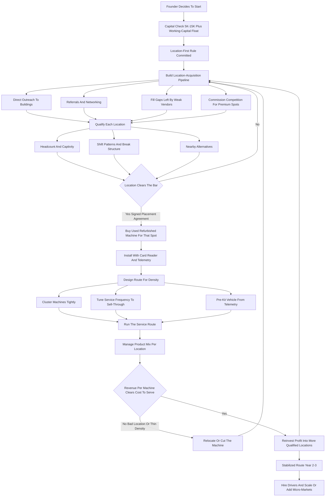
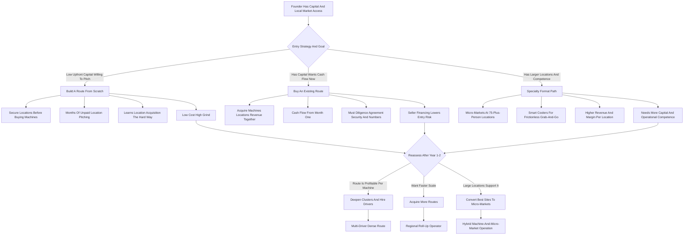

**TL;DR:** To start a vending machine business in 2027, you buy machines, secure the right to place them inside other people's buildings, stock them with product, and collect the spread between what you pay for inventory and what customers pay the machine -- a route of unattended retail micro-stores you service on a circuit. The model is **real, durable, and genuinely low-glamour, and it lives or dies on one number beginners almost never calculate before buying a machine: revenue per machine per month at a specific location.** The entire business is location arbitrage. The same combo snack-and-drink machine that grosses $150 a month in a quiet 12-person office grosses $1,200 a month in a 200-person warehouse with no nearby store -- identical equipment, identical product, an eight-fold difference driven entirely by foot traffic, captivity, and the absence of alternatives. The honest 2027 economics: a starting operator invests **$5,000-$35,000** to launch a small route of used or refurbished machines, runs at a **45-55% gross margin after cost of goods, and 25-40% net after fuel, commissions, shrink, and repairs**, and in a disciplined Year 1 generates **$15,000-$70,000 in revenue** against **$6,000-$28,000 in owner profit** -- nearly all of it determined by whether the locations are good. By Year 3-5 a well-run route of **25-60 machines** reaches **$120,000-$400,000 in revenue** with **$45,000-$150,000 in owner profit**, at which point the operator chooses between staying a lean owner-operated route, hiring drivers and scaling toward a few hundred machines, going deep on a higher-margin format (micro-markets, smart coolers, specialty), or buying up other operators' routes. The three things that kill vending startups: **(a) buying machines before securing locations** -- the cardinal sin -- so equipment sits in a garage earning nothing while the loan accrues; **(b) accepting bad, low-traffic locations** because they are the only ones that said yes, then servicing them at a loss in fuel and time; and **(c) underestimating the unglamorous grind** of driving a route, hauling product, fixing bill validators, and eating the shrink from theft, spoilage, and machines that ate a customer's dollar. Net: viable in 2027 as a disciplined, location-obsessed, route-efficient operation -- a legitimately good cash-flowing small business for the operator who treats it as a logistics-and-placement business, and a money-loser for anyone who buys the machine first and hopes a location appears.

## What A Vending Machine Business Actually Is In 2027

A vending machine business owns unattended retail equipment -- snack machines, drink machines, combo machines, coffee machines, and increasingly micro-markets and smart coolers -- places that equipment inside locations owned by other people, stocks it with product, and collects the money the machines take in. You are running a chain of tiny automated convenience stores, except you do not own the real estate, you do not staff the counter, and the "store" is a steel box that sells twenty-four hours a day whether you are there or not. The entire business is a single financial idea repeated across a route: you buy a candy bar for fifty cents and the machine sells it for a dollar fifty, you buy a bottled drink for forty cents and the machine sells it for two dollars, and you do that hundreds or thousands of times a week across a circuit of machines you service on a schedule. That spread, multiplied by volume, minus the cost of getting product into the machines and money out of them, is the business. Everything else in this guide -- machine selection, location acquisition, route design, product mix, cashless payment, commissions, shrink control -- is the machinery that lets you run that spread at scale without the machines sitting empty, breaking down, or being placed somewhere nobody buys. In 2027 the business is shaped by realities that did not fully exist a decade ago: cashless payment is now the majority of transactions in most locations, not a novelty, and an operator without card readers is leaving real money on the table; telemetry and remote-monitoring hardware let an operator see what sold and what is empty without driving to the machine; micro-markets and smart coolers have expanded what "vending" means at the higher end; and product costs and consumer price sensitivity both rose, squeezing the operator who does not manage the product mix carefully. The vending business is not passive and it is not glamorous. It is a route-logistics-and-placement business, and the operators who succeed understand that the candy bar is incidental; the business is locations, a service route, a van full of product, a spreadsheet of revenue per machine, and the relationships that keep the machines where the people are.

## The Location Is The Business: Why Placement Beats Everything

This is the single most important idea in vending and the one beginners most consistently fail to internalize: the machine is a commodity, the product is a commodity, and the only thing that is not a commodity is the location. A vending machine is a fixed cost that earns nothing on its own; it only earns when it is placed somewhere with enough of the right people walking past it with money and a reason to buy. The same machine, in three different locations, is three completely different businesses. In a quiet professional office of twelve people who can walk to a real store, that machine might gross $120-$200 a month -- barely worth the fuel to service it. In a 60-person medical clinic where staff cannot leave the floor, it might gross $400-$600. In a 200-person distribution warehouse running multiple shifts, with no store within ten minutes and workers who get short breaks, that same machine might gross $900-$1,400 a month. Nothing about the equipment changed. What changed is foot traffic, captivity (how trapped the buyer is, how inconvenient the alternatives are), shift patterns, demographics, and break structure. This is why the entire startup sequence must be built around location acquisition, not equipment acquisition. The operator who buys ten machines and then goes looking for homes for them has it exactly backwards -- they now have ten depreciating assets, possibly financed, sitting in a garage earning zero while they cold-call buildings. The disciplined operator secures the location first, with a signed placement agreement, and only then puts a machine in it. Every section that follows -- machine selection, product mix, route design, the financials -- is downstream of this one principle. A great location with a mediocre machine and an average product mix is a good business. A perfect machine with a perfect product mix in a dead location is a loss. Placement is not one factor among many in vending; placement is the business, and the operator's core skill is acquiring and keeping good locations.

## The Machine Types: What You Actually Buy And Why

A founder must understand every machine category before spending a dollar, because the format mix determines both the capital required and the kind of locations you can serve. **Snack machines** -- the glass-front spiral machines that vend chips, candy, pastries, and crackers -- are the workhorse of the industry, mechanically simple, durable, and they pair with nearly every location. **Drink machines** come in two styles: the older "drop" machines that drop cans and bottles, and glass-front drink machines that show the product; both vend bottled water, soda, sports drinks, juices, and energy drinks, which are the highest-velocity, most reliable sellers in most locations. **Combo machines** put snacks and drinks in one cabinet -- the right choice for smaller locations that cannot justify two separate machines, because one combo unit serving a 30-person office is more efficient than two half-empty machines. **Coffee and hot-beverage machines** brew on demand and serve break rooms and lobbies; they carry higher product margins but more mechanical complexity, more cleaning, and more service calls. **Micro-markets** are the higher-end evolution -- an unattended open-shelf store with coolers, racks, and a self-checkout kiosk, placed in larger break rooms; they sell far more SKUs, generate higher revenue per location, and command better margins, but they require a bigger location (typically 75-plus people), more capital, and more trust in the honor-system-plus-camera model. **Smart coolers** -- cooler units with camera or weight-sensor technology that let a customer open the door, take what they want, and get charged automatically -- are the newest format, expanding what unattended retail can do in offices and lobbies. **Specialty machines** -- fresh food, frozen, PPE, electronics, and others -- serve niches with their own economics. The capital ladder runs roughly from a used combo machine at the bottom to a full micro-market installation at the top. A starting operator almost always begins with used or refurbished snack, drink, and combo machines, because they are cheap, reliable, easy to learn on, and fit the small-to-mid locations a new operator can realistically win; micro-markets and smart coolers are a later move, made once the operator has the capital, the larger locations, and the operational competence to run them.

## New, Used, And Refurbished: The Machine-Buying Decision

The machine-buying decision is one of the most consequential early capital choices, and the right answer for almost every startup is **used or refurbished, not new.** A brand-new combo machine from a manufacturer can run $3,000-$6,000 or more; a comparable used machine in working condition can be had for $500-$1,500, and a professionally refurbished machine -- cleaned, tested, with a new control board and a modern card reader -- for $1,200-$2,500. The math is decisive for a startup: a vending machine is a mature, slow-changing piece of equipment, a used machine that has been maintained will run for many years, and the capital saved buying used can be spread across more machines and more locations -- and locations, not machine newness, are what generate revenue. New machines make sense in specific cases: when a high-value location's decision-maker expects pristine equipment, when financing terms on new equipment are unusually favorable, or when a specialty format is only available new. But the default startup move is to buy used and refurbished machines from reputable dealers, auctions, operators exiting the business, and the secondary market, inspecting carefully for working bill validators and coin mechanisms, functional refrigeration on drink machines, intact spirals and motors, and -- critically -- the ability to add or upgrade a modern cashless card reader, because a machine that cannot take cards is a machine losing the majority of its potential transactions in 2027. Buying an existing operator's whole route is a related and often smart entry: it delivers machines and the locations and revenue history together, which solves the cardinal location-first problem in one transaction, though it must be diligenced carefully on the quality and contract security of those locations.

## The Location Acquisition Playbook: How You Actually Get Placements

Because placement is the business, the location acquisition process deserves its own detailed playbook -- this is the skill the whole operation rests on. The operator is selling building owners and managers on a simple proposition: free vending service for their staff or customers, at no cost and no effort to them, and often with a commission paid back to the location on sales. The target locations, in rough order of desirability, are **manufacturing plants and distribution warehouses** (large headcounts, captive shift workers, often no nearby store -- the best vending locations in existence), **medical facilities** (hospitals, clinics, nursing homes -- staff who cannot leave, plus visitors), **large offices and corporate campuses**, **schools and universities** (with their own rules and seasonality), **auto dealerships and repair shops** (waiting customers), **hotels and motels**, **apartment complexes and laundromats**, **gyms and recreation centers**, **car washes**, and **government buildings**. The acquisition methods: **direct outreach** -- walking in, calling, emailing building managers and office managers and plant managers with a clear, professional pitch; **networking and referrals** -- one happy location manager refers another, and a reputation for reliable service compounds; **filling gaps** -- finding locations whose current vendor is unreliable, has old machines, or stocks poorly, and offering to do better; **buying routes** -- acquiring locations with the machines; and **commission competition** -- at desirable locations, offering the location a percentage of sales (commonly 5-25%, sometimes higher for premium spots) to win or keep the placement. The discipline that matters: **qualify the location before you commit a machine.** Ask about headcount, shift patterns, break structure, nearby alternatives, and whether the prior vendor (if any) was making money. A signed placement agreement should specify the term, the commission if any, the service commitment, who supplies electricity, liability and access terms, and an exit clause. The operator who masters location acquisition -- who can consistently find, win, and keep good placements -- has the entire business solved; the operator who cannot is stuck servicing whatever marginal locations said yes.

## The Core Unit Economics: Revenue Per Machine Per Month

This is the calculation the whole business runs on, and beginners almost never run it before buying. Every machine has a **revenue per machine per month** number, and that number -- against the cost to stock and service it -- tells you whether the machine is an asset or a liability. The realistic spread is wide. A poorly located snack machine in a small, low-traffic spot grosses **$100-$250 a month**; a solid mid-size location grosses **$300-$600**; a strong location -- big captive headcount, no alternatives -- grosses **$700-$1,400 or more**; and a busy combo or micro-market in an exceptional spot can run well beyond that. Now layer the costs. **Cost of goods** typically runs 45-55% of revenue -- you keep roughly half of the gross as gross margin. From that gross margin, subtract **fuel and vehicle cost** to drive the route, **commission** paid to the location (if any, 5-25% of sales), **shrink** -- theft, spoilage of perishables, machines that malfunction and eat money or give free product, expired stock pulled off the shelf -- which realistically runs 2-6% of revenue, **repairs and parts** -- bill validators, control boards, compressors, motors -- and your **time**, which is the cost beginners never price. Net it out and a well-run route nets **25-40% of revenue as owner profit** after all real costs. The brutal arithmetic of bad locations: a machine grossing $150 a month produces maybe $75 in gross margin, and after the fuel and time to drive to it, restock it, and collect from it -- a stop that might take 30-45 minutes round trip plus product cost float -- it can easily be a net loss. A machine grossing $800 a month produces $400 in gross margin from the same single service stop, and is a genuinely good asset. This is why route density and location quality are not separate concerns from the unit economics -- they ARE the unit economics. The operator must calculate, for every machine, the realistic monthly revenue, the cost to serve it, and the net -- and ruthlessly cut or relocate the machines that do not clear the bar.

## The Line-By-Line P&L Of A Vending Route

Beyond per-machine revenue, a founder must internalize the operating P&L of the whole route, because that is what turns activity into profit. Take a representative early route of 15 machines averaging $350 a month -- roughly $5,250 in monthly gross revenue, $63,000 a year. From that, the costs stack. **Cost of goods** at ~50% takes roughly $2,625 a month -- the single largest line. **Commissions** to locations, blended across the route at perhaps 8%, take ~$420. **Fuel and vehicle** -- driving the route weekly or twice-weekly, depending on volume and capacity -- might run $300-$600 a month depending on route geography and density. **Shrink** at ~4% takes ~$210. **Repairs, parts, and maintenance** average out to perhaps $150-$300 a month across the route, lumpy by nature. **Cashless processing fees** -- the card-reader transaction fees -- take a few percent of cashless sales. **Telemetry and software** subscriptions, **insurance**, **storage** for product and spare machines, **phone and admin**, and **licenses and permits** round out the fixed overhead. Net the route out and the owner-operator keeps roughly $1,300-$2,100 a month from a 15-machine route at this average -- real money for a side operation, modest for a full-time income, which is exactly why the route must grow and the average revenue per machine must rise. The leverage points are visible in the P&L: cost of goods is controlled by smart purchasing (warehouse clubs, wholesale, route-volume buying) and product-mix discipline; fuel is controlled by route density and service frequency tuned to telemetry; shrink is controlled by location selection, machine maintenance, and not over-stocking perishables; and the revenue line -- the one that matters most -- is controlled by location quality and pricing. The operators who fail at the P&L level almost always have the same problem: a route of low-average machines spread across too much geography, so the fuel and time costs eat a gross margin that was too thin to begin with.

## Route Design And Service Logistics

The route is the operational engine, and a founder must design it deliberately because route efficiency is a direct, large line in the P&L. A vending route is a circuit of machines serviced on a schedule -- the operator loads a vehicle with product, drives to each machine, restocks it, collects the cash, addresses any malfunctions, and moves to the next. **Service frequency** is set by how fast each machine sells through its capacity: a high-volume machine might need restocking twice a week, a low-volume one every two or three weeks. **Route density** -- how geographically clustered the machines are -- is the single biggest efficiency lever; ten machines within a tight radius are dramatically more profitable to service than ten machines scattered across a county, because the fuel and the windshield time are spread across more revenue. This is why a disciplined operator grows by **deepening clusters** -- adding machines near existing ones -- rather than chasing a great-sounding location an hour away. **Telemetry changes the logistics:** remote-monitoring hardware reports what each machine has sold and what is running low, so the operator can pre-kit the vehicle for exactly what each stop needs and skip machines that do not need service yet -- turning a blind, fixed-schedule route into a demand-driven one, cutting wasted trips and stockouts at the same time. **The vehicle** -- a van or box truck sized to the route -- carries product, a hand truck or cart, tools, a cash bag, and spare parts. **Pre-kitting** -- packing the product for each stop in advance, informed by telemetry or sales history -- makes the actual service stop fast. **The service stop itself** is a routine: restock to par, rotate stock so older product sells first, wipe down the machine, test the bill validator and card reader, clear any jams, collect cash, and note anything that needs a repair follow-up. The operators who run tight routes -- dense clusters, telemetry-informed, pre-kitted, efficient stops -- can serve far more machines per hour of work than those running scattered, blind, improvised routes, and that efficiency is profit.

## Product Selection, Pricing, And Margin Management

The product mix is where gross margin is made or lost, and a founder must manage it actively rather than just filling slots. **The product categories:** carbonated soft drinks, water, sports and energy drinks, juices (the drink machine); chips and salty snacks, candy and chocolate, pastries and baked goods, crackers and nuts, gum and mints (the snack machine); and in larger formats, fresh food, sandwiches, and a wider grocery range. **Velocity matters more than margin on any single item** -- a fast-selling water at a thin margin contributes more total dollars than a slow-moving specialty item at a fat margin that expires on the shelf. **The operator must know each location's preferences** -- a warehouse of shift workers buys differently than a medical office, which buys differently than a gym -- and tune the mix per location rather than running one identical planogram everywhere. **Pricing** in 2027 must reflect risen product costs and is most defensible in captive, high-convenience locations where the buyer has no nearby alternative; pricing too low leaves margin on the table in good locations, pricing too high in a location with alternatives kills volume. **Sourcing** is a margin lever -- buying from warehouse clubs and wholesale distributors, buying at route volume as the operation grows, watching for deals, and avoiding the trap of buying retail. **Shrink control on product** -- not over-stocking perishables, rotating stock so nothing expires, pulling slow movers -- protects the margin from the spoilage side. **Healthier and premium options** have grown as a real segment, and some locations (schools, certain workplaces) require or prefer them; carrying the right mix can win and keep those locations. The discipline: treat each machine's planogram as a living thing -- watch what sells via telemetry or manual sales tracking, cut the slow movers, deepen the fast ones, adjust pricing to the location's captivity, and source as cheaply as the operation's scale allows. A well-managed mix can lift a machine's revenue and margin meaningfully over a static, ignored one.

## Cashless Payment And Vending Technology In 2027

A founder launching in 2027 must treat technology as a baseline requirement, not an upgrade, because the business has changed. **Cashless payment is now the majority of transactions in most locations** -- card readers, tap-to-pay, and mobile wallets are what a large share of customers expect, and a cash-only machine in 2027 is simply not capturing a big slice of demand, especially among younger buyers and in office and medical settings. Every machine on a serious route needs a modern card reader; the hardware and the per-transaction processing fee are a real cost, but the lost sales from going cash-only are far larger. **Telemetry and remote monitoring** -- hardware and software that report each machine's sales, inventory levels, and malfunctions in near real time -- transform route logistics: the operator sees what to restock before driving out, catches a down machine immediately instead of on the next scheduled visit, and can analyze which products and locations perform. **Vending management software** ties it together -- inventory, route planning, sales reporting, commission tracking, and accounting -- and lets a small operator run a professional, data-driven operation. **Smart coolers and micro-market kiosks** represent the technology frontier, expanding unattended retail into formats and locations traditional machines cannot serve. **Energy-efficient machines** lower the operating cost (the location usually supplies electricity, but efficiency still matters for the relationship and for owned-location costs). The strategic point: the 2027 operator who skips the technology -- cash-only machines, blind fixed-schedule routes, paper records -- is running a 2010 business and will be out-competed on both customer capture and operating efficiency by operators who adopted the readers, the telemetry, and the software. The technology is not optional sophistication; it is the current baseline of a competitive route.

## The Commission Question: Paying Locations For Placement

A founder must understand the commission dynamic, because it is central to winning and keeping good locations. A commission is a percentage of the machine's sales paid back to the location owner or manager -- it is how an operator competes for desirable placements and how locations monetize the space they provide. **Commissions are not universal** -- many small and mid locations take vending service with no commission because the value to them is the convenience for their people, not the income -- but **at desirable, high-traffic locations, commission is often the price of entry**, and competing operators bid for the spot. Typical commission ranges run from 5% at the low end to 25% or more at premium, heavily-contested locations; the rate depends on the location's traffic, the competition for it, and the operator's margin room. **The strategic discipline:** commission comes straight out of the operator's net, so it must be priced into the location's economics before agreeing -- a 20% commission on a $1,000-a-month machine is $200 a month, and the location must still net well for the operator after that. A great location at a high commission can still be an excellent machine; a mediocre location at a high commission is a trap. **Some operators avoid commissioned locations entirely** and build routes of no-commission small-and-mid placements, accepting lower per-machine revenue for fuller margin retention. **Others compete aggressively on commission** for the big captive locations because even at 20% the absolute dollars are large. Both are valid; what is not valid is agreeing to a commission without running the post-commission net, or losing a great location to a competitor because you would not commission at all. The commission decision is a per-location economic calculation, and the operator who treats it that way -- rather than as a blanket policy -- builds a better route.

## Startup Cost Breakdown: The Honest All-In Number

A founder needs a clear-eyed total of what it costs to launch, because vending is sold as cheaper than it really is once you account for everything. The all-in startup cost breaks down as: **machines** -- the largest line -- a starting route of, say, 5-10 used or refurbished snack, drink, and combo machines at $500-$2,500 each runs $3,000-$20,000; **card readers** -- if not already installed -- $150-$400 per machine; **initial product inventory** to fill the machines -- $500-$2,000 depending on route size; **a vehicle** -- many start with a van or truck they already own, but if buying, a used cargo van runs $8,000-$25,000 (often the largest single line if a vehicle must be purchased); **telemetry and vending management software** -- hardware and subscription, modest, a few hundred to low thousands to start; **business formation, licenses, and permits** -- entity setup, vending and health permits which vary widely by state and locality, $200-$1,500; **insurance** -- general liability and commercial auto, first payment, $500-$2,000; **tools, hand truck, cash bags, locks, and supplies** -- $200-$800; **storage** -- if product and spare machines need a dedicated space, a small unit, $50-$200 a month; and **working capital** -- the float to buy product before the machines pay you back, plus a cushion for early repairs and slow locations -- a meaningful $2,000-$8,000. Totaled, a genuinely lean start using an owned vehicle and a handful of used machines can come in around **$5,000-$15,000**; a more substantial launch with more machines and a purchased vehicle runs **$20,000-$50,000+**; and buying an existing route is its own number, typically priced as a multiple of monthly revenue. The honest point: vending is more accessible than many capital-heavy businesses, but it is not the near-zero-cost passive-income business it is often marketed as -- and under-capitalization, especially skipping the working-capital float and the repair cushion, is a real way to stall a route before it gets dense enough to be profitable.

## The Year-One Operating Reality

A founder should walk into Year 1 with accurate expectations, because the gap between the marketed version of vending and the real version is where most quitting happens. Year 1 is **location-acquisition and route-building mode, not profit-extraction mode.** The first months are spent doing the unglamorous, rejection-heavy work of pitching buildings, getting machines placed, learning which locations actually produce, discovering the real cost of fuel and time on the route, and finding out where the operation is fragile -- the machine that breaks, the location that underperforms its promised headcount, the bill validator that keeps jamming. A disciplined Year 1 vending startup, launched with a real plan and a working-capital cushion, can realistically generate **$15,000-$70,000 in revenue** -- a wide range driven almost entirely by location quality and route size -- against **$6,000-$28,000 in owner profit**, real money but earned through hands-on route work and back-loaded as the route fills out. The work is genuinely physical and routine: the founder is driving the route, hauling product, restocking machines, fixing jams, collecting and counting cash, and doing the cold outreach for the next location. Year 1 is also when the founder discovers whether the locations were qualified properly -- a route of marginal, low-traffic placements shows up as long fuel-heavy days for thin collections, and the lesson is to relocate or cut the dead machines and pursue better spots. The founders who succeed treat Year 1 as paid tuition in a real route-logistics-and-placement business and use it to learn location qualification, route density, and product mix; the ones who fail expected a passive income stream and were unprepared for the driving, the lifting, the repairs, the shrink, and the rejection in location pitching.

## The Five-Year Revenue Trajectory

Mapping a realistic five-year arc helps a founder size the opportunity honestly. **Year 1:** small route, location-acquisition focus, 5-15 machines, $15K-$70K revenue, $6K-$28K owner profit, founder doing everything, learning location qualification and route discipline. **Year 2:** the route deepens using Year-1 cash flow and the lessons learned -- dead machines relocated, clusters tightened, better locations won, maybe 15-30 machines; revenue climbs to roughly **$50K-$150K** with owner profit around **$20K-$60K** as the average revenue per machine rises and the route gets denser and more efficient. **Year 3:** the operation is a real route -- 25-50 machines, possibly the first hired driver or part-time help, telemetry-driven service, refined product mix; revenue lands around **$120K-$300K** with owner profit roughly **$45K-$110K**, and the founder is shifting from doing every stop to managing the route and acquiring locations. **Year 4:** continued expansion, possible move into micro-markets or smart coolers at the larger locations, more drivers, tighter operations; revenue roughly **$200K-$450K**, owner profit **$70K-$160K**. **Year 5:** a mature route -- 40-80+ machines or a mix of machines and micro-markets, $300K-$600K revenue, **$100K-$220K owner profit** for a well-run operation, with the founder deciding whether to keep scaling toward a few hundred machines, go deep on micro-markets, acquire other operators' routes, or run a lean optimized route and harvest the cash. These numbers assume disciplined location qualification, route density, technology adoption, and product-mix management; they do not assume exponential growth, because vending scales with locations, route density, and service capacity, not magically. A mature vending business is a real small business with a fleet of placed assets, a service route, and a balance sheet of equipment in productive locations -- a genuinely good outcome, but earned through years of placement and logistics discipline.

## Buying An Existing Vending Route Instead Of Building One

A founder should seriously consider buying an existing route rather than building from zero, because it directly solves the hardest problem in vending -- location acquisition -- and it deserves a careful section. When an operator buys a route, they acquire the machines, the locations, the placement agreements, and the revenue history together, in one transaction. The advantages are real: immediate cash flow from day one rather than months of unpaid location pitching; proven locations with actual revenue numbers to diligence rather than promises; existing relationships with location managers; and a faster path to a profitable scale. The risks are equally real and must be diligenced hard: **location quality and security** -- are the placement agreements contractually solid, or month-to-month handshakes that walk the day the seller leaves; **revenue verification** -- are the claimed numbers real, supported by collection records and telemetry data, or seller optimism; **machine condition** -- is the equipment maintained or about to need a wave of repairs; **the reason for sale** -- a retiring operator is different from one fleeing declining locations; and **route geography** -- is it a dense efficient route or a scattered fuel-eater. Routes are typically priced as a multiple of monthly net revenue or monthly gross, and the multiple should reflect the security and quality of the locations. **Seller financing** is common and can lower the entry risk, aligning the seller's payout with the route's continued performance. The strategic point: building a route from scratch teaches the operator location acquisition the hard way and costs little upfront but months of unpaid grind; buying a route costs real capital but delivers cash flow and proven locations immediately. Many of the most successful operators do both -- buy a route to get to scale fast, then build and acquire from there.

## Scaling The Route: Hiring Drivers And Going Past Owner-Operated

The jump from a one-person owner-operated route to a multi-driver operation is its own distinct challenge, and a founder should approach it deliberately. The owner-operated route has a hard ceiling -- there are only so many machines one person can service well in a week, and past roughly 30-60 machines (depending on density and revenue) the founder is the bottleneck. **Scaling means hiring route drivers** -- people who run service circuits, restock, collect, and handle basic machine issues -- which changes the business from a job into a company. The prerequisites for scaling: the route must be genuinely profitable per machine (do not scale a route of marginal locations -- you just multiply the problem), the service process must be documented well enough that a driver can run it consistently, telemetry and software must be in place so the owner can see what drivers are doing without riding along, and cash-handling controls must be tight because cash collection by employees introduces a real shrink and trust risk that owner-operators do not face. **The scaling levers:** deepen existing clusters so drivers run dense efficient routes; add locations in step with service capacity; move into higher-revenue formats (micro-markets, smart coolers) at the larger locations; build the management layer -- a route supervisor, an inventory and purchasing function -- as machine count grows; and acquire other operators' routes to add density and scale faster than organic growth allows. **The constraints on scaling:** capital for more machines and product float, founder attention (solved by drivers and a supervisor), cash-handling integrity (solved by cashless-heavy routes, telemetry, and controls), and route density (solved by clustering rather than chasing distant locations). The founders who scale well share one trait: they proved per-machine profitability and documented the service process first, so that adding drivers multiplied a working machine rather than a broken one.

## Micro-Markets And Smart Coolers: The Higher-Margin Frontier

A founder should understand the micro-market and smart-cooler segment, because it is where the higher-revenue, higher-margin end of unattended retail has moved. **A micro-market** is an unattended open-format store -- coolers, shelving, racks, and a self-checkout kiosk -- placed in a larger break room, typically at a location with 75-plus people. Compared to a bank of vending machines, a micro-market sells far more SKUs (fresh food, a wider grocery range, more drink and snack variety), generates substantially higher revenue per location, and runs at better margins because the format supports a broader, fresher, higher-ticket mix. The trade-offs: it requires a larger location, more capital to install, more product management (including fresh food and its spoilage risk), and it relies on an honor-system-plus-camera model that works in the right environment and not in the wrong one. **Smart coolers** -- cooler units with camera or weight-sensor technology that charge a customer automatically when they take product -- bring a frictionless grab-and-go experience to offices, lobbies, and gyms, expanding placement options and capturing impulse buys traditional machines miss. The strategic point: micro-markets and smart coolers are generally not a Year-1 startup move -- they need capital, larger locations, and operational competence the new operator does not yet have -- but they are a powerful Year-2-and-beyond growth lever, letting an operator dramatically raise the revenue of its best larger locations without proportionally increasing the number of stops on the route. The operator who builds a solid traditional route first, then converts or adds micro-markets at the right large locations, is following the natural and profitable progression of the modern vending business.

## Five Named Real-World Operating Scenarios

Concrete scenarios make the model tangible. **Scenario one -- Marisol, the disciplined location-first operator:** starts with $9,000, buys six refurbished combo and drink machines, but does not place a single one until she has signed placement agreements -- she spends six weeks pitching and lands two warehouses, a clinic, and two mid-size offices, all qualified for headcount and break structure; her average machine grosses $480 a month from day one, she reinvests every dollar into more machines for similar locations, deepens her clusters, and reaches a 35-machine route netting solid profit by Year 3 because every machine was placed before it was bought. **Scenario two -- the cautionary tale, Greg:** sees a "passive income" pitch, finances twelve machines for $22,000, and then starts looking for locations -- he can only place seven, four of those in weak low-traffic spots that said yes because no one else wanted them, five machines sit in his garage, and the loan payment is due whether the machines earn or not; his route grosses too little to cover the fuel and the financing, and he sells the machines at a loss within a year. **Scenario three -- Priya, the route buyer:** instead of building from scratch, she buys a retiring operator's 28-machine route for a multiple of its verified monthly revenue with seller financing, diligences the placement agreements and collection records carefully, inherits proven locations and cash flow from month one, and spends Year 1 optimizing -- cutting three dead machines, upgrading card readers, tightening the product mix -- to lift the route's net rather than building it. **Scenario four -- the Okafor family, micro-market move:** runs a solid traditional route for two years, then converts their three largest warehouse locations to micro-markets, tripling the revenue at those sites without adding stops, and builds a hybrid route of machines plus micro-markets that out-earns a pure-machine route of the same stop count. **Scenario five -- Dwayne, the density failure:** wins locations enthusiastically but scattered across a wide region -- a great machine here, a good one forty minutes away, another across the county -- and even though his individual machines are decent, his route is a fuel-and-windshield-time disaster, his effective hourly earnings are poor, and he eventually has to cut the outliers and rebuild around tight clusters. These five span the realistic distribution: disciplined location-first success, buy-machines-first failure, the route-buyer's shortcut, the micro-market upgrade, and the density mistake.

## Risk Management And Insurance

The vending model carries specific risks, and the 2027 operator manages each deliberately rather than hoping. **Location loss risk** -- a location ends the placement, switches to a competitor, closes, or relocates -- is the single biggest structural risk, because the location is the business; it is mitigated by signed placement agreements with reasonable terms, genuine service reliability that gives the location no reason to switch, fair commissions at contested spots, and diversification so no single location dominates the route. **Theft and vandalism risk** -- machines broken into, tipped, or burglarized -- is mitigated by good locations (a machine inside a staffed building is far safer than one in an exposed public spot), sturdy machines and locks, security cameras at the location, and not leaving large amounts of cash in machines between collections. **Equipment failure risk** -- bill validators, control boards, compressors, and motors fail -- is mitigated by buying quality refurbished equipment, learning basic repairs, keeping spare parts and a spare machine or two, and budgeting for the inevitable repair drip. **Shrink risk** -- spoilage, expired product, machine malfunctions that give free product or eat customer money -- is mitigated by product-mix discipline, stock rotation, not over-stocking perishables, and machine maintenance. **Product cost and pricing risk** -- rising wholesale costs squeezing margin -- is mitigated by smart sourcing, route-volume buying, and disciplined pricing in captive locations. **Liability risk** -- a customer claims illness or injury related to a machine or product -- is mitigated by general liability insurance, proper food-handling and rotation practices, and health permits where required. **Vehicle and route risk** -- accidents, breakdowns -- is mitigated by commercial auto insurance and vehicle maintenance. **Cash-handling risk** -- especially once drivers are hired -- is mitigated by cashless-heavy routes, telemetry that shows expected versus collected, and clear controls. The throughline: every major risk in vending has a known mitigation built from good location selection, signed agreements, insurance, maintenance discipline, and -- as the route scales -- cash controls.

## The Competitor Landscape: Who You Are Up Against

A founder should understand the competitive field clearly. **The large regional and national vending operators** have big routes, full driver fleets, warehouse operations, established relationships with the biggest locations, and the capital for micro-markets and the newest technology; they dominate the largest corporate and institutional accounts and are hard to out-resource, but they can be slower to respond, less personal with mid-size locations, and willing to let smaller or more distant placements go underserved. **The long tail of small owner-operators and side hustlers** -- people with a handful of machines, part-timers, operators who bought a few machines from a pitch -- is large; many are under-capitalized, run cash-only old machines, service inconsistently, and stock poorly, which is precisely the gap a disciplined new operator exploits. **Existing operators with weak service** at otherwise-good locations are an opportunity -- a location manager frustrated with an unreliable vendor, empty machines, or ancient cash-only equipment is a location ready to be won. **The strategic reality for a 2027 entrant:** you generally cannot out-capitalize the regional giant for the biggest accounts, and you should not try to out-cheap the desperate side hustler -- you win by being the most reliable, best-stocked, technology-equipped, well-located operator in the underserved middle, taking the mid-size locations the giants neglect and out-professionalizing the weak small operators. The competitive moat in vending is not the machines -- anyone can buy a machine -- it is the **portfolio of good, contractually-secured locations, the reputation for reliable service, the route density, and the relationships with location managers**, all of which take time to build and are genuinely hard for a new entrant or a sloppy incumbent to copy.

## Financing The Business

Because vending requires real capital for machines, product float, and possibly a vehicle, a founder should understand the financing options. **Equipment financing** is the natural fit for the machines -- they are tangible assets a lender will finance, spreading the cost and matching the payment to the machines' earning life; the danger, as the Greg scenario shows, is financing machines before locations exist, so the discipline is to finance against placed, earning machines, not speculative inventory. **SBA and small-business loans** can fund a broader launch including a vehicle and working capital. **Seller financing** is common and often smart when buying an existing route -- the seller carries part of the price, which both lowers the buyer's upfront capital and aligns the seller's payout with the route continuing to perform, a genuine risk-reducer. **Reinvested cash flow** funds most healthy organic growth -- the disciplined operator plows route profit into more machines for more qualified locations, growing without debt. **Personal savings and lean bootstrapping** fund many startups, because the genuinely lean version of vending -- a few used machines, an owned vehicle, locations secured first -- has a low enough entry cost to self-fund. **The financing discipline:** it is reasonable to finance machines and a vehicle because they are productive assets, but only against real placements, and the operator must still hold working-capital cash for the product float and the early repair drip. The dangerous move is the leveraged speculative launch -- financing a pile of machines with no locations and no cushion -- which converts a low-risk business into a debt trap. Finance the earning assets, secure the locations first, and keep the float in cash.

## Taxes And Business Structure

A founder should set up the tax and legal structure deliberately, because vending has specific compliance dimensions. **Entity:** most vending operators form an LLC for liability protection and tax flexibility; the entity holds the placement agreements, the insurance, the vehicle, and signs with locations. **Depreciation matters** -- the machines and the vehicle are depreciable assets, and the depreciation schedules (and any available accelerated or first-year expensing) shape taxable income, especially in years of heavy machine buying; a knowledgeable accountant earns their fee here. **Sales tax on vending sales** is a real and sometimes complex obligation -- many jurisdictions tax vended product, sometimes at special vending rates or with specific rules, and the operator must collect and remit correctly from day one. **Licenses and permits** vary widely by state and locality -- vending machine licenses, health department permits (especially for any food beyond shelf-stable snacks), and sometimes per-machine decals or registrations; this is a research item the operator must handle before placing machines. **Cash income reporting** -- vending is a cash-heavy business and the IRS knows it; clean records of collections, deposits, and product purchases are essential, and shortcutting the bookkeeping invites trouble. **Deductible expenses** -- product cost, fuel and vehicle costs, machine repairs and parts, commissions paid, software and telemetry, insurance, storage, and licenses -- are all legitimate business deductions a clean bookkeeping system captures. The discipline: separate business banking from day one, a bookkeeping system that tracks each machine and the route's revenue and costs, rigorous cash-collection records, quarterly attention to sales tax and estimated taxes, and an accountant who understands cash-heavy equipment-based small businesses. Skipping this does not save money -- it converts a manageable compliance function into a year-end scramble and a tax-audit vulnerability.

## Owner Lifestyle: What Running This Business Actually Feels Like

A founder should know what daily life in this business is like before committing, because the lived reality is routine, physical, and unglamorous. In **Year 1**, running a lean route, the founder is genuinely in the business -- driving the circuit, loading and hauling product, restocking machines, kneeling to clear jams and swap bill validators, collecting and counting cash, and spending the non-route hours doing rejection-heavy cold outreach for the next location. It is physical, repetitive, and absorbing, closer to running a small delivery route than to managing a passive asset. By **Year 2-3**, with a denser route and possibly a part-time helper or first driver, the founder's role starts to shift toward managing the route, acquiring locations, and handling purchasing and the numbers -- though the business stays hands-on, and the founder is often still on the route. By **Year 3-5**, with drivers and a real route, the founder can move toward a managerial rhythm -- overseeing drivers, building location relationships, planning expansion and format upgrades -- though vending never becomes fully hands-off; the physical route, the cash, the repairs, and the location relationships are permanent features. The emotional texture: there is real, quiet satisfaction in a dense efficient route, a well-stocked machine in a great location reliably throwing off cash, and a collection day that comes in strong; and real grind in the driving, the lifting, the repairs, the shrink, the occasional vandalized machine, and the rejection in location pitching. The income is real and can become a genuinely good living, but it is earned through routine physical work and location hustle, not extracted passively. A founder who is comfortable with routine, physical work, driving, and persistent sales outreach will find vending a legitimately solid business; a founder who bought the passive-income marketing will be disappointed by how much of a job it is.

## Common Year-One Mistakes That Kill The Business

A founder can avoid most failure modes simply by knowing them in advance, because the mistakes in vending are remarkably consistent. **Buying machines before securing locations** -- the cardinal sin -- leaves the operator with depreciating, possibly financed assets sitting idle while they scramble for homes. **Accepting bad locations** because they are the only ones that said yes -- low headcount, light traffic, easy alternatives nearby -- builds a route that costs more in fuel and time than it earns. **Underestimating the grind** -- expecting passive income and being unprepared for the driving, lifting, repairs, and rejection. **Ignoring route density** -- winning scattered locations across a wide geography so the route bleeds fuel and windshield time. **Skipping cashless payment** -- running cash-only machines in 2027 and forfeiting the majority of potential transactions. **Mismanaging the product mix** -- running one static planogram everywhere, ignoring what sells, over-stocking perishables that spoil. **Under-pricing in captive locations** -- leaving real margin on the table where the buyer has no alternative. **Ignoring shrink** -- not tracking theft, spoilage, and malfunction losses until they quietly eat the margin. **Weak or no placement agreements** -- handshake placements that walk to a competitor the moment someone offers a better commission. **Skipping telemetry and software** -- running blind, fixed-schedule routes and paper records when the tools to run a data-driven route are cheap and available. **Under-capitalization** -- skipping the working-capital float and the repair cushion, then stalling before the route is dense enough to be profitable. **Over-committing on commission** -- agreeing to a high commission without running the post-commission net. Every one of these is avoidable; the founders who fail almost always made several of them, and the founders who succeed treated this list as a pre-launch checklist.

## A Decision Framework: Should You Actually Start This In 2027

A founder deciding whether to commit should run a structured self-assessment, because this model fits a specific person and badly misfits others. **Capital:** do you have $5,000-$15,000 for a genuinely lean location-first launch with a working-capital float, or more for a larger launch or a route purchase? If you have nothing, this is not your business yet -- it is more accessible than most, but not free. **Sales temperament:** are you willing to do the rejection-heavy work of cold-pitching buildings to acquire locations, on an ongoing basis? Location acquisition is the core skill, and an operator who will not pitch is stuck. **Physical and routine tolerance:** are you willing to drive a route, haul product, restock machines, and fix jams week after week? If you want a desk business or a passive one, vending is the wrong model. **Discipline to put locations first:** will you actually secure signed placements before buying machines, and qualify every location for headcount and traffic? The whole business rests on this and corner-cutters get wiped out. **Logistics orientation:** will you build dense clustered routes, adopt telemetry, and run the route as a designed system rather than an improvised circuit? **Local market fit:** are there enough good, underserved locations -- warehouses, clinics, mid-size offices -- in your service radius, and is the local competition leaving gaps? If a founder answers yes across capital, sales temperament, physical and routine tolerance, location-first discipline, logistics orientation, and local market fit, a vending machine business in 2027 is a legitimate and achievable path to a $120K-$400K small business with $45K-$150K in owner profit. If they answer no on the location-first discipline or the sales temperament, they should not start -- those are the two that most reliably separate the operators who make money from the ones who fill a garage with idle machines. The framework's purpose is to convert an attraction to the passive-income marketing of vending into an honest, structured decision about the route-logistics-and-placement business underneath.

## Niche And Specialty Paths Worth Considering

Beyond the standard snack-and-drink route, a founder should understand the specialty paths, because for some operators a focused format is the better business. **Micro-markets** -- covered above -- are the natural higher-revenue, higher-margin evolution for an operator serving larger locations. **Smart coolers** bring frictionless grab-and-go to offices, gyms, and lobbies. **Healthy and premium vending** -- machines stocked with better-for-you snacks, drinks, and fresh options -- serves workplaces, schools, gyms, and medical facilities that want or require it, and can be a differentiator. **Coffee and hot-beverage routes** focus on the break-room coffee category, with higher product margins and a different service rhythm. **Fresh food and frozen vending** -- sandwiches, meals, frozen items -- serves locations where workers cannot leave for a meal, with higher revenue but real spoilage and food-safety demands. **Specialty product vending** -- PPE, electronics and accessories, beauty products, even unconventional categories -- serves specific niches with their own placement logic. **Amusement and bulk vending** -- gumball and bulk-candy machines, toy and sticker machines, claw machines -- is a distinct lower-ticket sub-segment with very different economics. **Laundromat, gym, and apartment-focused routes** build a route around one location type and its buying patterns. The strategic point: the standard snack-and-drink route is the most accessible and the most common starting point, and most operators should start there to learn the fundamentals; the specialty paths can deliver higher margins or a defensible niche for an operator with the right locations and competence, and many mature operators run a standard core with one specialty format layered on top at the locations that support it. The mistake is not choosing a specialty; it is starting with an exotic format before learning the route-and-placement fundamentals on standard machines.

## Exit Strategies And The Long-Term Picture

Vending businesses can be exited, and a founder should build with the eventual exit in mind. **Sell the operating route** -- a vending business with a dense route of good, contractually-secured locations, well-maintained modern machines, verified revenue history, telemetry data, and clean books is a saleable asset; routes are typically valued as a multiple of monthly net or gross revenue, with the multiple driven by the security and quality of the locations, the condition of the equipment, the route's density and efficiency, and how owner-dependent the operation is. **Sell the assets** -- even absent a going-concern sale, the machines and the vehicle have real resale value, and machines can be sold to other operators; this is a genuine floor under the business. **Acquire and roll up** -- a mature operator can grow by buying smaller operators' routes and can position to be acquired by a regional consolidator. **Transition to family or a key employee** -- the route-based nature of the business makes an internal transition viable when a trained successor exists. **Run it as a lean cash cow** -- many operators simply keep a tight, optimized route and harvest the cash for years without ever selling. The honest long-term picture: vending is a durable, real business -- unattended retail is not going away, the assets hold value, and a well-run route produces real owner profit for years -- but it is a business, not a passive holding; it demands ongoing location relationship work, ongoing route logistics, ongoing machine maintenance, and adaptation to payment and format technology. A founder should think of a 2027 launch as building a tangible, asset-backed small business with multiple genuine exit paths -- sale of the route, sale of the machines, roll-up, internal transition, or a long-held cash cow -- which, because the equipment and the locations both hold value, makes it a more exit-flexible business than many service ventures.

## The 2027-2030 Outlook: Where This Model Is Heading

A founder committing capital should have a view on where the business goes next. Several trends are reasonably clear. **Unattended retail demand stays structurally healthy** -- people will keep buying snacks and drinks where they work, wait, and gather, and the convenience of point-of-need purchase does not disappear; the format evolves but the underlying demand is durable. **Cashless and mobile payment keep rising** -- the share of cashless transactions keeps climbing, and the operator who is not fully equipped falls further behind on customer capture. **Telemetry and route software keep professionalizing the small operator** -- the tools to run a data-driven, demand-responsive route keep getting better and cheaper, letting a disciplined small operation run like a much larger one and widening the gap with the blind-route incumbents. **Micro-markets and smart coolers keep expanding** -- the higher-margin, higher-SKU formats keep taking share at larger locations, and the operator who can deploy them has a real edge. **Product costs and price sensitivity both stay elevated** -- margin management, smart sourcing, and disciplined pricing in captive locations stay essential. **Consolidation continues at the regional level** -- well-run operators absorb the locations that under-capitalized side hustlers vacate. **Healthier-options demand grows modestly** -- more locations want better-for-you mixes, a small structural shift. **AI and tooling assist on the back office** -- demand forecasting, route optimization, dynamic pricing, and inventory planning get more automated, lowering operating cost for operators who adopt them. The net outlook: vending is **viable and durable through 2030 in its disciplined, location-obsessed, route-efficient, technology-equipped form.** The version that thrives is a professional operation that secures locations before buying machines, builds dense routes, runs full cashless and telemetry, manages the product mix, and moves into micro-markets where the locations support it. The version that struggles is the cash-only, blind-route, buy-machines-first, marginal-location operation chasing a passive-income fantasy. A 2027 founder who builds the former is building a real, asset-backed business with a multi-year runway.

## The Final Framework: Building It Right From Day One

Pulling the entire playbook into a single operating framework: a founder who wants to start a vending machine business in 2027 and actually succeed should execute in this order. **First, get honest about capital and temperament** -- confirm you have $5K-$15K for a lean location-first launch with a working-capital float (or more for a bigger launch or a route buy), and confirm you want a route-logistics-and-placement business, not a passive asset. **Second, learn and commit to the location-first rule** -- you secure signed, qualified placements before you buy the machine that goes in them, every time, with no exceptions. **Third, build the location-acquisition skill** -- direct outreach, referrals, filling gaps left by weak vendors, and commission competition for premium spots, all built around qualifying locations for headcount, captivity, shift patterns, and alternatives. **Fourth, buy used and refurbished machines** -- cheap, reliable, card-reader-equipped -- and put your capital into more placements rather than newer equipment. **Fifth, design the route for density** -- cluster machines, tune service frequency to sell-through, and grow by deepening clusters rather than chasing distant locations. **Sixth, run the unit economics on every machine** -- realistic revenue per machine per month against the cost to serve it, and ruthlessly cut or relocate the machines that do not clear the bar. **Seventh, adopt the technology** -- full cashless on every machine, telemetry for demand-driven service, and vending management software for a professional data-driven operation. **Eighth, manage the product mix actively** -- per-location planograms, velocity over single-item margin, smart sourcing, disciplined pricing in captive spots, and shrink control. **Ninth, secure placements with real agreements** -- term, commission, service commitment, electricity, access, and exit clauses in writing. **Tenth, capitalize properly** -- hold the working-capital float and the repair cushion so the route can get dense enough to be profitable. **Eleventh, scale deliberately** -- prove per-machine profitability and document the service process before hiring drivers, and consider buying a route to reach scale faster. **Twelfth, keep the exit options open** -- a dense route of secured locations, maintained machines, and clean books makes the business sellable. Do these twelve things in this order and a vending machine business in 2027 is a legitimate path to a $120K-$400K asset-backed small business. Skip the discipline -- especially the location-first rule, the route density, and the technology -- and it is a fast way to fill a garage with idle machines and lose money on fuel. The business is neither a passive goldmine nor a scam. It is a real, accessible, capital-light-to-moderate, route-logistics-and-placement small business, and in 2027 it rewards exactly one kind of founder: the disciplined, location-obsessed operator who treats it as the placement-and-logistics business it actually is.

## The Operating Journey: From Location Plan To Stabilized Route

## The Decision Matrix: Build A Route Vs Buy A Route Vs Specialty Format

## Sources

1. **National Automatic Merchandising Association (NAMA) -- Industry Data and Operating Benchmarks** -- The trade association for the convenience services and vending industry; industry size, segment data, and operating practices. https://www.namanow.org
2. **NAMA -- Census of the Industry / State of the Industry Reports** -- Annual industry revenue, machine population, and segment-level data for vending, micro-markets, and office coffee service.
3. **IBISWorld -- Vending Machine Operators Industry Report (US)** -- Industry revenue, growth, margin, and competitive-structure data for US vending operators. https://www.ibisworld.com
4. **US Small Business Administration -- Business Structures, Financing, and Equipment Loans** -- Reference for entity selection, SBA loans, and small-business financing. https://www.sba.gov
5. **US Bureau of Labor Statistics -- Occupational Data for Vending and Route Drivers** -- Wage and employment data relevant to route driver labor costs. https://www.bls.gov
6. **National Federation of Independent Business (NFIB) -- Small Business Operating and Cost Environment** -- Small-business cost, hiring, and economic-condition context. https://www.nfib.com
7. **Automatic Merchandiser / VendingMarketWatch -- Industry Trade Coverage** -- Ongoing trade journalism on vending operations, technology, micro-markets, and operator practices. https://www.vendingmarketwatch.com
8. **Vending Times -- Industry Trade Publication** -- Long-running trade coverage of the vending and unattended retail industry.
9. **Cantaloupe (formerly USA Technologies) -- Cashless Payment and Telemetry Hardware** -- Card readers, telemetry, and vending management technology for operators. https://www.cantaloupe.com
10. **Nayax -- Cashless Payment and Management Platform** -- Cashless payment hardware and route and inventory management software for unattended retail. https://www.nayax.com
11. **365 Retail Markets -- Micro-Market and Self-Checkout Technology** -- Micro-market kiosk and self-checkout platform for unattended retail. https://www.365retailmarkets.com
12. **Parlevel / VendSoft / Vending Management Software Providers** -- Route planning, inventory, telemetry, and sales-reporting software for vending operators.
13. **Crane Merchandising Systems -- Vending Machine Manufacturer** -- Snack, drink, and combo machine specifications and pricing references.
14. **AMS (Automatic Merchandiser Systems) -- Vending Machine Manufacturer** -- Combo and specialty machine specifications and references.
15. **Royal Vendors / Dixie-Narco -- Drink Machine Manufacturers** -- Drink machine specifications, refurbishment, and pricing references.
16. **Used and Refurbished Vending Machine Dealers and Auctions** -- Secondary-market pricing references for used and refurbished snack, drink, and combo machines.
17. **Warehouse-Club and Wholesale Product Sourcing References** -- Warehouse-club and wholesale sourcing references for vending product cost-of-goods.
18. **Vistar / Wholesale Vending Distributors** -- Vending-specific wholesale product distributors and route-volume pricing references.
19. **IRS -- Depreciation, Section 179, and Bonus Depreciation Guidance** -- Tax treatment of machines and vehicles as depreciable business assets. https://www.irs.gov
20. **State and Local Sales Tax Authorities -- Vending Transaction Taxability** -- Reference for sales tax collection and remittance on vended product, including special vending rates.
21. **State and Local Health Departments -- Vending Machine Permits and Food-Safety Rules** -- Reference for vending licenses, decals, and food-handling permits, which vary by jurisdiction.
22. **Insureon / Small-Business Insurance Resources** -- General liability and commercial auto coverage references for vending operators. https://www.insureon.com
23. **Equipment Leasing and Finance Association (ELFA)** -- Reference for equipment financing structures applicable to vending machines and vehicles. https://www.elfaonline.org
24. **BizBuySell -- Business Valuation and Sale Listings (Vending Routes)** -- Reference for vending-route valuations, revenue multiples, and exit pricing. https://www.bizbuysell.com
25. **SCORE -- Small Business Mentoring and Planning Resources** -- Business planning, cash-flow, and route-economics guidance for small businesses. https://www.score.org
26. **US Department of Labor -- Wage, Hour, and Payroll Obligations** -- Reference for route driver labor, payroll-tax, and employment obligations. https://www.dol.gov
27. **Federal Trade Commission -- Business Opportunity Rule and Vending Scheme Warnings** -- Consumer-protection guidance on fraudulent vending business-opportunity pitches. https://www.ftc.gov
28. **Amusement and Bulk Vending Industry References** -- References for the bulk and amusement vending sub-segment economics.
29. **Office Coffee Service Industry References (NAMA OCS Segment)** -- Operating references for the coffee and hot-beverage route segment.
30. **Micro-Market Operating and Shrink-Rate Industry Studies** -- Industry references on micro-market revenue, SKU breadth, and honor-system shrink rates.
31. **Commercial Vehicle and Cargo Van Buyer Guides** -- Vehicle specification and capacity references for vending route fleets.
32. **Vending Operator Forums and Industry Communities** -- Practitioner discussion of location acquisition, route density, commission rates, shrink, and machine repair.
33. **Healthy Vending and Better-For-You Product Segment References** -- Industry references on the healthier-options product segment and location requirements.
34. **Smart Cooler and Frictionless Retail Technology References** -- Vendor and industry references on camera and weight-sensor smart-cooler technology.
35. **State Business Licensing Portals -- Vending Business Registration** -- Reference for vending business registration and per-machine licensing requirements by state.

## Numbers

**Revenue Per Machine Per Month (The Core Metric)**

| Location quality | Typical monthly gross | Typical setting |
|---|---|---|
| Poor / low-traffic | $100-$250 | Small office, easy nearby alternatives, low headcount |
| Mid-range | $300-$600 | Mid-size office, clinic, dealership, gym |
| Strong | $700-$1,400+ | Large captive warehouse, hospital, multi-shift plant, no nearby store |
| Exceptional (combo / micro-market) | $1,400+ | Big headcount, high captivity, broad SKU format |

**Per-Machine Cost Stack (As Percent Of Revenue)**

| Cost line | Typical range | Notes |
|---|---|---|
| Cost of goods | 45-55% | Largest single line; controlled by sourcing and mix |
| Commission to location | 0-25% | Often 0 at small/mid spots; 5-25% at contested premium spots |
| Fuel and vehicle | varies with density | Route geography and density are the lever |
| Shrink (theft, spoilage, malfunction) | 2-6% | Controlled by location, maintenance, mix discipline |
| Repairs, parts, maintenance | lumpy, ~3-6% averaged | Bill validators, boards, compressors, motors |
| Cashless processing fees | a few % of cashless sales | The cost of capturing the majority of transactions |
| **Net owner profit** | **25-40% of revenue** | After all real costs on a well-run route |

**Machine Pricing (New Vs Used Vs Refurbished)**

| Machine type | New | Used | Refurbished |
|---|---|---|---|
| Snack machine | $3,000-$5,000 | $500-$1,200 | $1,000-$2,000 |
| Drink machine | $3,500-$6,000 | $600-$1,500 | $1,200-$2,200 |
| Combo machine | $3,000-$6,000+ | $500-$1,500 | $1,200-$2,500 |
| Card reader (add-on) | $150-$400 per machine | -- | often included refurbished |
| Micro-market install | $10,000-$30,000+ | -- | varies |

**Startup Cost Breakdown**
- Machines (5-10 used/refurbished snack, drink, combo): $3,000-$20,000
- Card readers (if not installed): $150-$400 per machine
- Initial product inventory: $500-$2,000
- Vehicle (used cargo van, if purchased): $8,000-$25,000 (often the largest single line)
- Telemetry and vending management software: a few hundred to low thousands to start
- Business formation, licenses, permits (vary widely by locality): $200-$1,500
- Insurance (general liability, commercial auto, first payment): $500-$2,000
- Tools, hand truck, cash bags, locks, supplies: $200-$800
- Storage (small unit, if needed): $50-$200/month
- Working capital / float and repair cushion: $2,000-$8,000
- Total (genuinely lean start, owned vehicle): ~$5,000-$15,000
- Total (larger launch with purchased vehicle): ~$20,000-$50,000+

**Five-Year Revenue Trajectory**

| Year | Machines | Revenue | Owner profit |
|---|---|---|---|
| Year 1 | 5-15 | $15,000-$70,000 | $6,000-$28,000 |
| Year 2 | 15-30 | $50,000-$150,000 | $20,000-$60,000 |
| Year 3 | 25-50 | $120,000-$300,000 | $45,000-$110,000 |
| Year 4 | 35-70 | $200,000-$450,000 | $70,000-$160,000 |
| Year 5 | 40-80+ | $300,000-$600,000 | $100,000-$220,000 |

**Representative 15-Machine Route P&L (Monthly, Avg $350/Machine)**
- Gross revenue: ~$5,250/month (~$63,000/year)
- Cost of goods (~50%): ~$2,625
- Commissions (blended ~8%): ~$420
- Fuel and vehicle: ~$300-$600
- Shrink (~4%): ~$210
- Repairs/parts (averaged): ~$150-$300
- Cashless fees, telemetry, insurance, storage, admin: remaining overhead
- Owner take-home: roughly $1,300-$2,100/month

**Operational Benchmarks**
- Gross margin after cost of goods: 45-55%
- Net owner profit after all costs: 25-40% of revenue
- Blended shrink: 2-6% of revenue
- Cashless share of transactions: now the majority in most locations
- Commission range at contested locations: 5-25%+
- Owner-operator route ceiling: roughly 30-60 machines before drivers needed
- Service frequency: twice weekly (high volume) to every 2-3 weeks (low volume)

**Location-Quality Discipline**
- Best location types: manufacturing plants, distribution warehouses, hospitals/clinics, large multi-shift workplaces
- Qualify before placing: headcount, captivity, shift patterns, break structure, nearby alternatives
- Cardinal rule: secure a signed placement agreement BEFORE buying the machine
- Route density beats location count: tight clusters out-earn scattered machines

**Exit**
- Going-concern route sale: multiple of monthly net or gross revenue, driven by location security/quality, equipment condition, route density, owner-dependence
- Asset sale: machines and vehicle retain real resale value (a floor pure-service businesses lack)
- Other paths: roll-up acquisition, internal transition, long-held cash cow

## Counter-Case: Why Starting A Vending Machine Business In 2027 Might Be A Mistake

The case above describes a viable business, but a serious founder must stress-test it against the conditions that make this model a bad bet. There are real reasons to walk away.

**Counter 1 -- It is sold as passive income, and it is not.** The vending business is marketed harder than almost any small business as a hands-off cash machine -- "the machines work while you sleep." The reality is a physical route: driving, hauling product, restocking, kneeling to clear jams and swap bill validators, collecting and counting cash, and doing rejection-heavy location pitching. A founder who buys the passive-income marketing is buying a job they did not expect, and the disappointment is a common reason operators quit in Year 1.

**Counter 2 -- The location-first rule is hard, and breaking it is fatal.** The entire business rests on securing good locations before buying machines, but locations are genuinely hard to get -- building managers say no, the good spots are taken, and the temptation to buy machines first "to be ready" is strong. An operator who breaks the rule ends up with idle, possibly financed assets in a garage. The discipline that the model demands is exactly the discipline that is hardest to maintain when you are eager to start.

**Counter 3 -- Bad locations are worse than no locations.** A founder under pressure to deploy machines accepts the low-traffic spots that say yes -- the 12-person office, the quiet shop. Those machines do not just earn little; they cost real fuel and time to service, so they are net-negative. A route of marginal locations is not a small business that will grow into a big one; it is a structurally unprofitable route, and the founder often cannot see it because the machines are technically "placed."

**Counter 4 -- Route density makes or breaks the economics, and beginners ignore it.** Winning a great location forty minutes from your other machines feels like progress, but the fuel and windshield time can erase the profit. Vending economics are route economics, and a scattered route bleeds money no matter how good the individual machines are. Beginners chase locations one at a time without thinking about the geography that ties them together.

**Counter 5 -- The vending "business opportunity" scam ecosystem is large.** The industry has a well-documented underbelly of fraudulent business-opportunity pitches -- companies that sell overpriced machines with promises of locations that never materialize or turn out to be worthless. The FTC has specific warnings about it. A founder entering vending must navigate an information environment full of bad actors, and the marketing that drew them in is often the problem.

**Counter 6 -- Shrink, repairs, and malfunctions are a constant drag.** Machines get broken into, product spoils, bill validators jam and eat customers' money or give free product, compressors fail. A blended 2-6% of revenue disappears into shrink, and repairs are a lumpy, unavoidable drip. The asset is the business, and the asset is constantly being chipped at -- and an operator who does not budget for it watches the margin quietly erode.

**Counter 7 -- Margins are real but thin enough that mistakes hurt.** After cost of goods, commissions, fuel, shrink, repairs, and processing fees, the net is 25-40% of revenue on a well-run route -- and a poorly-run one can net far less or nothing. The margin is not generous enough to absorb a sloppy product mix, a too-generous commission, a fuel-heavy route, and under-pricing all at once. Several small mistakes compound into an unprofitable route.

**Counter 8 -- Locations can walk, and the business walks with them.** A placement is only as secure as the agreement and the relationship behind it. A location can switch to a competitor offering a higher commission, get bought, close, or simply decide it does not want vending anymore -- and when a good location leaves, a chunk of the business leaves with it. The operator does not own the most valuable asset; they rent access to it.

**Counter 9 -- It is more capital than the marketing admits.** Vending is genuinely more accessible than many businesses, but the "start for almost nothing" pitch ignores the working-capital float to buy product before the machines pay back, the repair cushion, the card readers, the possible vehicle, and the months of unpaid location pitching. Under-capitalized operators stall before the route is dense enough to be profitable.

**Counter 10 -- The technology bar keeps rising.** Cashless payment, telemetry, and vending management software are no longer optional, and they are a real ongoing cost. An operator who tries to run the lean 2010 version -- cash-only, blind routes, paper records -- forfeits the majority of transactions and runs an inefficient route, and falls steadily behind the operators who invested in the tools.

**Counter 11 -- The big operators have the best locations locked up.** The largest, most lucrative captive locations -- the giant warehouses, the hospital systems, the corporate campuses -- are often already served by well-capitalized regional and national operators with contracts, fleets, and the ability to deploy micro-markets. The new entrant is competing for the underserved middle, which is real but smaller and less lucrative than the headline locations.

**Counter 12 -- Adjacent or different businesses may fit better.** A founder drawn to the idea of a route-based, asset-light cash business might find that other models -- or simply a different small business -- fit their temperament and capital better. Vending specifically rewards the operator who will do the physical route work and the relentless location hustle; a founder who wants either a true passive investment or a non-physical business is in the wrong model.

**The honest verdict.** Starting a vending machine business in 2027 is a reasonable choice for a founder who: (a) has $5K-$15K of genuine launch capital plus a working-capital float, (b) will hold the location-first rule with no exceptions, (c) will qualify every location and refuse the bad ones, (d) will build dense clustered routes rather than scattered ones, (e) will adopt cashless, telemetry, and software as baseline tools, and (f) is genuinely willing to do the physical route work and the ongoing rejection-heavy location hustle. It is a poor choice for anyone who bought the passive-income marketing, anyone who will not or cannot do the location-acquisition grind, anyone under-capitalized enough to skip the float and the repair cushion, and anyone who would relocate every machine they could not place rather than refusing the bad locations in the first place. The model is not a scam -- though it has a scam-heavy marketing ecosystem around it -- but it is more physical, more location-dependent, more route-logistics-driven, and less passive than its marketing suggests, and in 2027 the gap between the disciplined location-first version that works and the buy-machines-first version that fails is wide.

## Related Pulse Library Entries

- **q1145** -- What's the realistic monthly revenue per vending machine on a typical 20-machine route, and what makes the difference between $500/mo and $1,500/mo locations? (The deepest companion entry on the core revenue-per-machine metric and location quality.)
- **q1123** -- What's the realistic monthly cash flow for an unattended laundromat, and what kills it the fastest? (Adjacent unattended-retail asset model with similar location and shrink economics.)
- **q1121** -- How do you decide between a tunnel car wash and an in-bay automatic for a 0.75-acre suburban lot? (Unattended/semi-attended asset business with format-choice and capital-intensity parallels.)
- **q2074** -- How do you start a mobile car wash business in 2027? (Route-based owner-operated service business with similar logistics and density economics.)
- **q1965** -- How do you start a party rental business in 2027? (Asset-and-logistics business built on inventory-utilization and turns-style thinking.)
- **q1955** -- How do you start a vacation rental business in 2027? (Asset-utilization business with location-dependent revenue.)
- **q1958** -- How do you start a cleaning business in 2027? (Route-and-relationship service business; location-relationship parallels.)
- **q1959** -- How do you start a handyman business in 2027? (Owner-operated, truck-based, route-style small business.)
- **q1958b** -- How do you start a junk removal business in 2027? (Truck-and-route logistics business with similar operating bones.)
- **q1959b** -- How do you start a moving company in 2027? (Route-logistics-and-labor cousin; crew and vehicle economics.)
- **q1961** -- How do you start an Airbnb arbitrage business in 2027? (Asset-and-operations business with its own utilization economics.)
- **q1946** -- How do you start a real estate investing business in 2027? (Capital-and-asset business; depreciation and financing parallels.)
- **q1947** -- How do you start a property management business in 2027? (Relationship-and-operations service model.)
- **q1949** -- How do you start a short-term rental business in 2027? (Asset-utilization economics adjacent to revenue-per-unit thinking.)
- **q1962** -- How do you start a furnished apartment business in 2027? (Asset-as-yield model with location-driven revenue.)
- **q1960** -- How do you start a real estate photography business in 2027? (Route-based, owner-operated local service business.)
- **q1971** -- How do you start a bounce house rental business in 2027? (Equipment-rental business with placement-and-logistics parallels.)
- **q1970** -- How do you start a photo booth business in 2027? (Equipment-as-asset local business with placement economics.)
- **q9501** -- A company sells $100 group workshops teaching older adults how to use technology. What's the right next move? (Single-operator-ceiling and scaling-past-the-founder parallel.)
- **q9502** -- How do you scale a workshop-led senior tech-training business in 2027 past the single-operator ceiling? (Direct parallel on the hire-and-scale-past-the-owner transition.)
- **q9601** -- How do you start a fractional CFO business in 2027? (Financial discipline for managing route economics and capex.)
- **q9701** -- What is the best inventory and rental management software in 2027? (Adjacent to the vending management software and telemetry stack.)
- **q9702** -- How do you build standard operating procedures for a service business? (The service-route SOPs vending needs to scale past the owner.)
- **q9801** -- What is the future of the events and services industry in 2030? (Long-term outlook context for unattended retail and service trends.)
- **q1238** -- How'd you fix Hawthorne Machinery's revenue issues in 2026? (Equipment-business operations and revenue-diagnosis parallel.)

