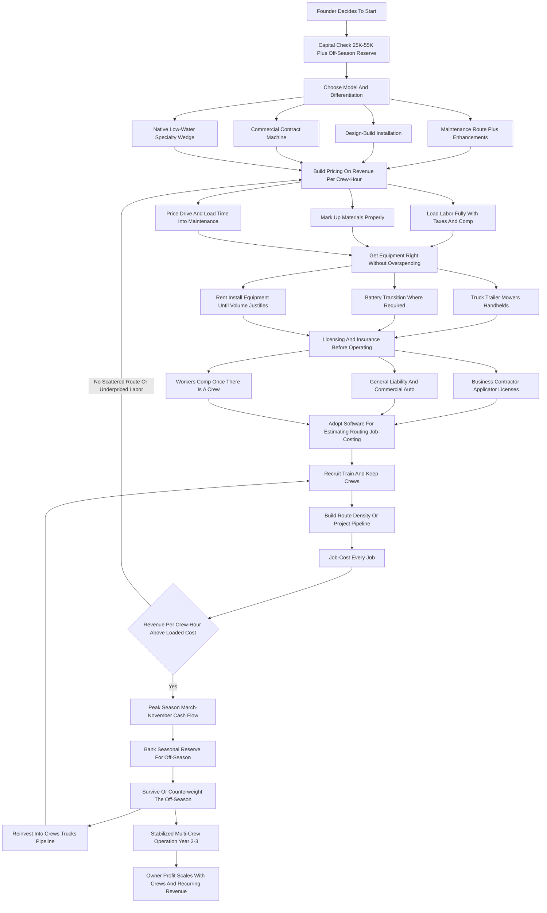
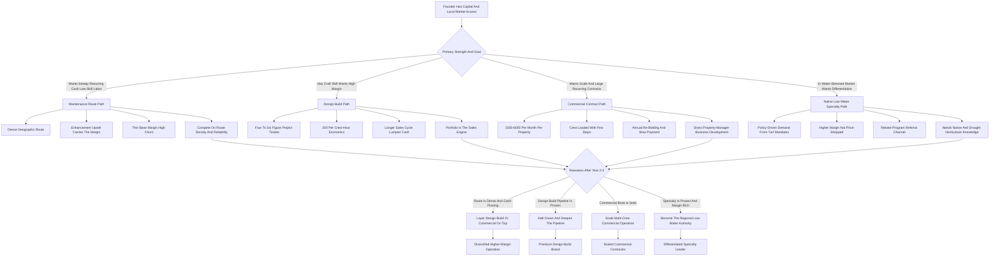

**TL;DR:** To start a landscaping business in 2027, you build a company that designs, installs, and maintains outdoor spaces -- mowing and maintenance, planting and softscape, hardscape and pavers and walls, irrigation, lighting, drainage, and increasingly native and low-water design -- for residential homeowners, commercial properties, and HOAs. The industry is **large, durable, and real** -- roughly a **$140B+ US market** spread across **600,000+ businesses** (US Census / IBISWorld / NALP) -- but it is also **fragmented, weather-exposed, labor-constrained, and brutally easy to enter and just as easy to fail at**. The single number that decides whether a landscaping business is a real company or a self-employed mowing job is **revenue per crew-hour** -- what one crew of two-to-three people, fully loaded with labor, fuel, equipment depreciation, and overhead, actually generates per hour on a job. A residential weekly mow priced at $45-$70 against 35-50 minutes of crew time plus drive time is a thin, commoditized $9-$18/crew-hour gross contribution; a design-build patio-and-planting install priced at $18,000 against 90 crew-hours is $200/crew-hour; a commercial maintenance contract at $2,500/month, routed efficiently, can run $80-$140/crew-hour. The honest 2027 economics: a focused startup invests **$25K-$110K** in a truck or two, a trailer, mowers and handhelds, and working capital, runs at a **45-58% gross margin on maintenance and 35-50% on installs after crew labor**, and in a disciplined Year 1 generates **$90K-$280K in revenue** against **$35K-$95K in owner profit** -- with the owner on a mower or a shovel most of that first year. By Year 3-5 a well-run operation reaches **$500K-$1.6M in revenue** with **$110K-$340K in owner profit**, at which point the founder chooses between staying a lean maintenance route operator, going deep on high-margin design-build installation, or building a commercial-maintenance contract machine. The three things that kill landscaping startups: **(a) competing as one more undifferentiated residential mowing operator** in a market with hundreds of thousands of them, where price is the only lever and the ceiling is a $60K-$160K solo job; **(b) underpricing labor, drive time, and equipment depreciation**, so a business that looks busy never converts revenue into profit; and **(c) ignoring the seasonality and the cash-flow gap** -- spending the summer money and getting crushed by a thin late-fall-through-early-spring stretch in most of the country. Net: viable in 2027 as a disciplined, revenue-per-crew-hour-obsessed operation built on recurring commercial and HOA contracts, high-margin design-build, and a defensible specialty wedge -- a poor fit for anyone who wants light work, fast scale without crews, or a business immune to weather, labor markets, and a physical truck-and-trailer reality.

## What A Landscaping Business Actually Is In 2027

A landscaping business designs, installs, and maintains the outdoor spaces around homes and buildings -- lawns, gardens, planting beds, trees and shrubs, patios and walkways, retaining walls, irrigation systems, outdoor lighting, drainage, and increasingly water-wise and native plantings. It is not one business; it is a family of related businesses that share a truck, a trailer, and a crew but have wildly different economics. On one end sits **maintenance** -- the recurring, route-based work of mowing, edging, blowing, pruning, fertilizing, mulching, leaf cleanup, and seasonal color rotations, billed weekly or monthly, the steady-cash backbone. On the other end sits **design-build installation** -- the project work of building a paver patio, a retaining wall, a fire pit, an irrigation system, a lighting package, or a full landscape renovation, billed per project at four-to-six-figure tickets, the high-margin engine. In between sit **enhancements** -- the upsell layer of mid-size planting jobs, sod, drainage fixes, and bed renovations sold to existing maintenance clients. In 2027 the business is shaped by a handful of realities that were not fully true a decade ago: clients find and compare companies online and expect a clean digital estimate and a professional crew; labor is genuinely scarce and more expensive, which makes crew productivity the central management problem; gas-powered handheld equipment faces bans and restrictions in a growing list of jurisdictions, forcing a battery-electric transition that is a real cost; and water scarcity plus state turf-replacement incentives in the West have created a structural demand wedge for native and low-water design that did not meaningfully exist before. The landscaping business is not passive and it is not easy. It is a logistics-labor-and-weather business: trucks and trailers, a crew you must recruit and keep, equipment that wears out, routes that must be tight, a season that compresses the money into part of the year, and a customer base that can drop a mowing service with one text. The founders who succeed understand that the green grass is the customer's; the business is crews, routes, equipment, a pricing spreadsheet built on crew-hours, and a book of recurring contracts that does not evaporate in a slow week.

## The Service Categories: What You Actually Sell And Why

The service menu is the business, and a founder must understand every category before deciding what to lead with, because the mix you sell determines your margin, your seasonality, and your ceiling. **Mowing and lawn maintenance** is the boring, low-margin, high-frequency core -- weekly or biweekly cuts, edging, string-trimming, blowing -- priced at $40-$80 per residential visit or rolled into a monthly commercial contract. It is the easiest work to sell and the easiest to lose, because every competitor offers it and clients price-shop it relentlessly. **Fertilization, weed control, and lawn treatment** -- the chemical-application side -- is higher-margin and stickier than mowing, often requires a pesticide applicator license, and is the category the national franchises (TruGreen, Weed Man, Lawn Doctor) dominate. **Pruning, trimming, and plant health care** -- shrubs, hedges, ornamental trees, seasonal cutbacks -- is skilled, mid-margin enhancement work. **Mulching, bed maintenance, and seasonal color** -- refreshing beds, installing annual flower rotations -- is reliable enhancement revenue, especially for commercial properties that want to look maintained. **Leaf and seasonal cleanup** -- spring and fall -- is concentrated, labor-heavy, and a real revenue spike in the right region. **Planting and softscape installation** -- installing trees, shrubs, perennials, sod, and ground cover -- is mid-to-high margin project work. **Hardscape installation** -- paver patios and walkways, retaining and seat walls, fire features, outdoor kitchens, steps -- is the highest-ticket, highest-margin, most-skill-intensive category, and the one that separates a real design-build company from a mowing crew. **Irrigation** -- installing and servicing sprinkler and drip systems, controllers, and now smart water management -- is technical, licensed in many states, and pairs with every install. **Outdoor lighting** -- low-voltage landscape lighting -- is a high-margin add-on with strong upsell economics. **Drainage** -- French drains, grading, regrading, downspout work -- is unglamorous, high-margin problem-solving work that homeowners pay real money to fix. **Snow and ice management** -- in snow regions -- is the off-season counterweight that keeps crews and trucks earning through winter. **Native, pollinator, and low-water design** -- xeriscape, turf replacement, drought-tolerant and habitat plantings -- is the fast-growing 2027 specialty wedge, driven by water cost and state incentive programs. A founder should think of the menu as a portfolio: low-margin high-frequency maintenance that generates recurring cash and customer relationships, mid-margin enhancements sold into that base, and high-margin design-build and specialty work that lifts the average ticket and the whole company's margin -- and the Year 1 mistake is leading with nothing but mowing, the most commoditized service on the list.

## The Three Models: Maintenance Route, Design-Build, And Commercial Contract

There are three distinct ways to build a landscaping business, and choosing deliberately is one of the most consequential early decisions. **The maintenance route model** builds a dense book of recurring residential and small-commercial maintenance accounts, tightly routed by geography, billed monthly, and run on crew efficiency. Its advantage is steady predictable cash, a low-skill labor model, and a business that compounds as the route fills in; its challenge is thin margins, relentless price competition, high client churn, and a real ceiling unless the route is genuinely dense and well-priced. This is the most common starting point and the most commoditized. **The design-build model** sells and builds landscape projects -- hardscape, planting, irrigation, lighting, full renovations -- at four-to-six-figure tickets, often with a design fee and a real creative process up front. Its advantage is high margins, large tickets, differentiation, and pricing power; its challenge is a longer sales cycle, lumpier cash flow, a need for skilled labor and real craft, and the project-pipeline anxiety of always having to sell the next job. **The commercial contract model** pursues recurring maintenance contracts with property managers, office parks, retail centers, multi-family communities, and HOAs -- larger contracts ($1,500-$6,000+/month per property), routed efficiently, bid annually. Its advantage is large recurring revenue per account, professional buyers, and the ability to load a crew with one stop; its challenge is competitive annual re-bidding, slow payment terms, demanding service-level expectations, and the need to win contracts against established incumbents. Many successful operators start with a maintenance route to build cash flow and crews, then deliberately layer design-build for margin or chase commercial contracts for scale -- but the founders who try to be all three in Year 1 with one crew end up mediocre at each. The deliberate choice -- which model leads, which follows -- is the strategic spine of the whole business.

## The 2027 Market Reality: Demand, Competition, And What Changed

A founder needs an accurate read of the 2027 landscape, because the business is neither the easy-money side hustle some claim nor a saturated dead end. **Demand is structurally healthy and durable.** Property owners -- residential and commercial -- consistently spend on outdoor space; the green industry is large and has grown steadily, lawns still need mowing, patios still get built, and water scarcity has if anything increased the design work. The market is roughly **$140B+ in the US** across landscaping and lawn care services (IBISWorld / Census), and it is not going away. **The competition is extreme and bifurcated.** There are **600,000+ landscaping businesses** in the US (Census), the overwhelming majority of them small, owner-operated, undifferentiated, and competing on price -- the easiest industry in the country to enter with a used truck and a mower. At the top sit a few large consolidators -- **BrightView** (the largest commercial landscaper in the US, roughly $2.7-$2.8B in revenue) and **TruGreen** (the dominant residential lawn-treatment company, roughly $1.4-$1.5B) -- plus franchise networks like **Weed Man** and **Lawn Doctor**. The opportunity for a new disciplined entrant is not to out-cheap the long tail or out-scale the consolidators; it is to be more professional, more reliable, and more differentiated than the swarm of undifferentiated small operators -- and to compete in the higher-margin design-build and specialty lanes the swarm cannot serve. **What changed by 2027:** labor scarcity and cost intensified, making crew productivity the central problem and pushing many operators toward the H-2B guest-worker program; gas-powered equipment restrictions spread (California's statewide small-off-road-engine rule and a growing list of city gas-leaf-blower bans), forcing a real battery-electric capital transition; water cost and Western drought drove state turf-replacement incentive programs and a structural low-water-design demand wedge; and software made it far easier for a small operator to run professional estimating, routing, scheduling, and invoicing than a decade ago. The net market reality: demand is real and large, the competition is the most crowded of almost any small business, and the winning 2027 entrant competes on professionalism, reliability, route or project discipline, and a differentiated higher-margin service mix rather than on being the cheapest mow in the neighborhood.

## The Core Unit Economics: Revenue Per Crew-Hour

This is the single most important section in the guide, because the entire business lives or dies on one number that beginners almost never calculate: **revenue per crew-hour.** A landscaping crew -- typically two to three people, a truck, a trailer, and equipment -- has a fully loaded cost per hour: wages plus payroll taxes for every crew member, fuel, equipment depreciation and maintenance, insurance, and an allocation of overhead. Realistically that loaded crew cost runs **$95-$170 per crew-hour** depending on crew size, wages, and region. Every job you price must be evaluated against that number -- and the difference between landscaping services is enormous. Consider the math concretely. A **residential weekly mow** priced at $55, against 40 minutes of on-site crew time plus 15 minutes of drive and load time, is roughly $60/crew-hour of revenue -- which, against a $110+ loaded crew cost, is *barely above break-even* and only works at all if the route is dense enough to eliminate most of the drive time. A **mulch install** priced at $1,400 against 9 crew-hours is about $155/crew-hour -- decent. A **paver patio** priced at $19,000 against 95 crew-hours is **$200/crew-hour** -- excellent, and the reason design-build is the margin engine. A **commercial maintenance contract** at $3,000/month, where one efficient visit covers a large property and the crew does several properties without re-loading, can run **$110-$150/crew-hour** -- which is why commercial routing beats scattered residential. An **irrigation install** priced at $4,500 against 22 crew-hours is about $205/crew-hour. A **lighting package** at $3,200 against 14 crew-hours is about $230/crew-hour. Now the trap: a scattered residential mowing route, where the crew drives 20 minutes between $50 lawns, can collapse to **$35-$45/crew-hour** -- below the loaded crew cost, meaning the harder the owner works, the more money the business loses. The discipline this imposes: **before quoting any job, estimate the realistic crew-hours including drive and load time, and compare the revenue-per-crew-hour to the loaded crew cost.** Route density is not a nicety -- it is the entire economics of maintenance. Design-build and specialty work earn their place by clearing $150-$230/crew-hour. The founder who prices by crew-hour builds a business that converts revenue to profit; the founder who prices by "what the neighbor charges" builds a busy, exhausting, unprofitable mowing job.

## The Line-By-Line Unit Economics And P&L

Beyond crew-hour pricing, a founder must internalize the operating P&L, because the gross margin and the hidden costs determine whether a busy schedule becomes real profit. Take the company-level picture. **Direct labor** is the largest cost in the business -- crew wages plus the payroll taxes, workers' compensation, and overtime that beginners forget to load -- and it typically runs **35-50% of revenue**. **Equipment** is a constant drip: mowers, trimmers, blowers, and now battery systems wear out and must be maintained, repaired, and replaced; commercial mowers are not cheap and they do not last forever. **Vehicles** -- fuel, maintenance, insurance, and depreciation on trucks and trailers -- allocate to every job. **Materials** -- on installs, the mulch, plants, pavers, base, sod, pipe, fixtures -- are a real pass-through cost that must be marked up correctly, not absorbed. **Insurance** -- general liability and commercial auto at a minimum, workers' comp once there is a crew -- is a non-trivial fixed cost. **Software, fuel, dump fees, licenses, marketing, and admin** round out the overhead. Net it out and a healthy landscaping operation runs a **45-58% gross margin on maintenance** and **35-50% on design-build installs** after crew labor and materials, with a **net owner profit margin of roughly 10-20%** in a well-run shop -- and a far thinner or negative margin in an underpriced one. At the business level, **seasonality dominates the annual P&L** across most of the country: revenue concentrates heavily in roughly March/April through October/November, with a thin or near-dead stretch in the deep off-season unless the operator carries snow-and-ice management or works in a year-round-mild climate. The disciplined operator treats the peak season as the period that must fund the entire year, building a reserve in summer that carries fixed costs -- truck payments, insurance, any year-round core staff, the shop -- through the lean months. The founders who fail at the P&L level almost always made the same errors: they priced labor as just the hourly wage instead of the fully loaded cost; they treated equipment as a one-time purchase instead of a continuous replacement drip; they marked up materials thinly or not at all; and they spent the summer cash instead of reserving it for the winter that was always coming.

## Choosing And Pricing The Service Mix

With the crew-hour discipline established, a founder needs a concrete plan for what to sell and how to price it, because the service mix is the strategic core. The principle is **lead with what differentiates and earns, not with what is easiest to sell.** Mowing is easy to sell and the worst-margin work on the menu; if a founder leads with nothing else, they have built a commodity. The better Year 1 approach depends on the chosen model. A **maintenance-route** founder should still build the route -- but build it *dense* (clustered by neighborhood so drive time collapses), *priced honestly* (every visit clearing the loaded crew cost with margin, not matching the cheapest competitor), and *with enhancements attached* (every maintenance client is a buyer of mulch, planting, cleanup, and small installs, and the enhancement upsell is where route-model margin actually comes from). A **design-build** founder should price projects on **crew-hours plus marked-up materials plus margin**, charge a real design fee for the design work, and build a portfolio of completed projects as the primary sales asset. A **commercial-contract** founder should price contracts on the **annualized crew-hours to service the property at the required standard**, build in the enhancement and seasonal-color revenue, and bid to win profitable contracts rather than to be the low number. Across all models, the pricing rules are constant: load labor fully, mark up materials properly (a real markup, not cost-plus-a-little), price drive and load time into maintenance, charge separately for the things beginners give away (cleanup hauling, dump fees, extra visits), and set minimums that protect against tiny jobs that cost more in mobilization than they earn. The founder who prices deliberately -- by crew-hour, with loaded labor and proper material markup -- builds a business with margin; the one who prices by feel and competitor-matching builds a business that is busy and broke.

## Equipment, Trucks, And The Battery-Electric Transition

The landscaping business runs on physical equipment, and a founder must plan it as a core, ongoing cost, not a one-time startup line. **The truck and trailer** are the foundation -- a pickup or work truck and an enclosed or open trailer sized to the equipment and the job type. A startup typically begins with one truck-and-trailer rig and adds as crew count grows; trucks carry fuel, maintenance, insurance, and depreciation that allocate to every job. **Mowers** are the workhorse capital -- a commercial zero-turn or stand-on mower for maintenance, plus push or walk-behind mowers for tight areas; commercial mowers are a real four-figure-plus expense each and they wear out under heavy use. **Handheld equipment** -- string trimmers, edgers, blowers, hedge trimmers, chainsaws -- is the constant-replacement category. **The battery-electric transition** is a genuine 2027 capital reality: California's statewide small-off-road-engine regulation effectively ended the sale of new gas-powered handheld equipment, and a growing list of cities have banned gas leaf blowers outright. An operator in or near these jurisdictions must budget for battery handheld systems and the batteries and chargers behind them -- a real incremental cost, though one that can often be passed to commercial buyers and that lowers fuel and maintenance over time. **Install equipment** -- for design-build, the skid steer, mini-excavator, plate compactor, and specialty tools, often rented per project early on and bought as project volume justifies. **Hand tools, safety gear, and consumables** round it out. The equipment discipline: build a replacement reserve from day one, because every mower and trimmer is a depreciating asset on a clock; rent the expensive install equipment until volume justifies buying; spec the battery transition into the plan rather than being surprised by it; and remember that equipment that sits idle in the off-season still cost money to buy and still depreciates -- which is exactly why the crew-hour utilization of that equipment, and the seasonal reserve, matter so much.

## Hiring And Building Crews: The Central Management Problem

A founder can run the smallest landscaping operation nearly solo, but the business does not scale past a one-person job without a crew -- and in 2027, **building and keeping crews is the single hardest management problem in the business.** Labor is scarce, the work is physical and weather-exposed, and turnover is a constant drag. The crew is the core hire: the people who mow, plant, build, prune, and load. A landscaping operation needs reliable crew members, ideally a **crew leader** who can run a crew without the owner present, and -- as the business grows -- skilled installers for design-build work, which is genuinely craft labor and harder to find than maintenance labor. **Crew quality directly drives margin and reputation:** efficient, careful crews clear more crew-hours of revenue, damage less, build better, and represent the company at the client's property; sloppy crews run long, damage property, and generate complaints. Training, checklists, and clear job-cost expectations turn a crew into a system. **The H-2B guest-worker program** is a major part of how the industry staffs the season -- a temporary-nonagricultural-worker visa that landscaping companies use heavily, but it is capped (66,000 visas per year, split across the fiscal year, with supplemental allocations in some years), competitive, administratively involved, and not a guaranteed source. Many operators stack labor sources: local hiring, returning seasonal crew, H-2B, and referrals. **Beyond the crew**, the hiring sequence typically adds an **operations or account manager** to run scheduling, estimating, and client communication as job volume grows, and eventually office and sales support. The cost structure: crew is the largest expense in the business and a mix of variable and seasonal; the year-round core that a snow operation or a warm-climate operation keeps is a fixed cost the reserve must cover. The strategic point: landscaping is a people business as much as a green business, and the operators who build durable, trained, well-treated crews -- and who solve the seasonal-labor puzzle deliberately -- have a real and hard-to-copy advantage over the swarm of operators constantly scrambling for help.

## Routing, Scheduling, And Crew Productivity

This is the operational heart of the maintenance side of the business, and a founder who does not master it will have a full schedule and an empty bank account. **Route density is the entire economics of maintenance.** A crew that does ten lawns clustered in two neighborhoods, with five-minute drives between stops, clears far more revenue per crew-hour than a crew doing the same ten lawns scattered across a metro with twenty-minute drives -- same revenue billed, wildly different cost. The discipline is to **build the route geographically**, taking clustered accounts and being willing to decline or reprice a profitable-looking account that sits alone far from the cluster. **Scheduling is a logistics puzzle** -- maintenance visits must be sequenced efficiently, install projects must be slotted around weather and crew availability, and a small operator must sequence the week so crews are loaded and not driving empty. **Job-costing every job** -- comparing the crew-hours a job actually took against the crew-hours it was priced for -- is how an operator learns which work is profitable and which is quietly losing money; the operators who do not job-cost are flying blind. **Software runs the modern operation** -- routing, scheduling, estimating, job-costing, and invoicing platforms let a small crew run a tight, professional operation, and the operators who adopt them early run more jobs with fewer errors than those on a paper calendar. **Weather** is the permanent variable -- rain days, frozen ground, heat -- and the schedule must have the flex to absorb it. The operators who win treat routing and scheduling as a designed system -- clustered routes, job-costed work, weather flex, and software backbone -- rather than as whatever happens after the trucks leave the shop. In maintenance landscaping, the routing *is* the business, and a tight route is the difference between a 55% gross margin and a negative one.

## Startup Cost Breakdown: The Honest All-In Number

A founder needs a clear-eyed total of what it costs to launch, because under-capitalization -- and over-capitalization on the wrong things -- both kill landscaping startups. The all-in startup cost breaks down as: **truck** -- a used work truck or pickup, $8,000-$45,000 depending on new versus used and whether it is financed; **trailer** -- open or enclosed, $2,000-$12,000; **mowers** -- a commercial zero-turn or stand-on plus a push mower, $4,000-$18,000; **handheld equipment** -- trimmers, edgers, blowers, hedge trimmers, including the battery transition where required, $2,000-$8,000; **hand tools, safety gear, and consumables** -- $500-$2,500; **insurance** -- general liability and commercial auto to start, plus workers' comp once there is a crew, $1,500-$6,000 for initial payments; **business formation, licensing, and any required applicator or contractor licensing** -- $300-$3,000 depending on state and the services offered; **website, branding, truck lettering, and initial marketing** -- $1,000-$6,000; **software** -- estimating, routing, and invoicing platforms, modest, a few hundred to low thousands to start; and a **working capital and off-season reserve** -- the buffer that covers fuel, payroll, and fixed costs before the route is full and through the first off-season -- which should be a meaningful $5,000-$25,000. Totaled, a **lean solo-to-small launch** can come in around **$25,000-$55,000**, and a **fuller launch** with a better truck, design-build capability, a crew from the start, and a real reserve runs **$60,000-$110,000+**. Financing softens the truck and mower lines -- equipment financing is common and reasonable for productive assets. The capital requirement is genuinely lower than many trades, which is exactly why the industry is so crowded -- but the founders who fail are usually not the under-equipped ones; they are the ones who spent everything on equipment and kept nothing as a reserve, then could not make payroll in a rainy April before the route filled in.

## The Year-One Operating Reality

A founder should walk into Year 1 with accurate expectations, because the gap between the marketed version and the real version of this business is where most quitting happens. Year 1 is **route-building, portfolio-building, and learning-the-real-costs mode -- not profit-extraction mode.** The first season is spent landing the first accounts and projects, discovering the real loaded cost of a crew-hour, learning which work actually clears margin and which quietly loses money, building the route density that makes maintenance profitable, and finding out where the operation is fragile -- the mower that breaks in peak season, the crew member who quits in July, the install that took 40% more crew-hours than it was priced for. A disciplined Year 1 landscaping startup, launched with real equipment and a reserve, can realistically generate **$90,000-$280,000 in revenue** -- the wide range driven by whether the founder is solo or running a crew and whether the mix includes design-build -- against **$35,000-$95,000 in owner profit**, with the owner physically in the work most of the year. The first off-season is the test: a founder who built the summer reserve carries the fixed costs and emerges ready for a stronger Year 2; one who spent the summer cash scrambles. Year 1 is also when the founder discovers whether the service mix and pricing were right -- a schedule full of underpriced scattered mowing shows up as exhaustion and an empty bank account, while a tighter route with enhancements and a few design-build jobs shows up as real profit. The work is genuinely hands-on: the founder is on the mower, in the truck, on the shovel, and on the phone selling the next job. The founders who succeed treat Year 1 as paid tuition in a real labor-and-logistics business and use it to refine the route, the pricing, the crew, and the mix; the ones who fail expected easy money and were unprepared for the labor, the weather, the seasonality, and the brutal price competition.

## The Five-Year Revenue Trajectory

Mapping a realistic five-year arc helps a founder size the opportunity honestly. **Year 1:** lean operation, route- and portfolio-building, $90K-$280K revenue, $35K-$95K owner profit, founder physically in the work, first off-season is the survival test. **Year 2:** the route deepens and the project portfolio grows using Year-1 cash flow, the first reliable crew leader comes on, the founder begins shifting from doing all the work to running the crews; revenue climbs to roughly **$200K-$500K** with owner profit around **$55K-$150K** as route density and pricing discipline improve. **Year 3:** the operation is a real business with a system -- multiple crews, a deeper route or a steady project pipeline or a book of commercial contracts, job-costing in place; revenue lands around **$400K-$900K** with owner profit roughly **$90K-$240K**, and the founder is managing rather than constantly on the mower. **Year 4:** continued growth -- another crew, a deeper commercial book, a stronger design-build pipeline, possibly a specialty arm; revenue roughly **$600K-$1.2M**, owner profit **$110K-$300K**. **Year 5:** a mature operation -- $800K-$1.6M revenue, **$140K-$340K owner profit** for a well-run shop, with the founder deciding whether to keep scaling, go deep on high-margin design-build, build the commercial-contract machine, expand geographically, or position for sale. These numbers assume disciplined crew-hour pricing, loaded labor costs, real material markups, route density, job-costing, and a respected seasonal reserve; they do not assume effortless growth, because landscaping scales with crews, equipment, and route or pipeline depth, not magically. A mature landscaping business is a real small business with trucks, crews, equipment, and recurring revenue -- a genuinely good outcome, but earned through years of operating discipline in a crowded, weather-exposed, labor-constrained industry.

## Five Named Real-World Operating Scenarios

Concrete scenarios make the model tangible. **Scenario one -- Marcus, the disciplined route-and-enhancement operator:** launches with $40K into one truck-and-trailer rig, builds a *dense* residential maintenance route clustered in three adjacent neighborhoods, prices every visit to clear his loaded crew cost, and -- critically -- treats every maintenance client as a buyer of mulch, planting, and cleanup; hits $180K revenue in Year 1 with the enhancement upsell carrying the margin, adds a second crew in Year 2, and reaches $620K by Year 3 because his routes are tight and his clients buy enhancements. **Scenario two -- the cautionary tale, Derek:** buys $60K of equipment, takes every mowing account he can get regardless of location, ends up with a scattered route averaging 20-minute drives between $50 lawns, works 60-hour weeks, never job-costs anything, and discovers in his second fall that his "busy" business cleared barely $30K in owner profit because his revenue-per-crew-hour was below his loaded crew cost the whole time. **Scenario three -- Priya, the design-build specialist:** skips the maintenance route entirely, builds a design-build company doing paver patios, retaining walls, planting, and lighting at $15K-$80K tickets, charges real design fees, rents her skid steer until Year 2, and builds a photographed portfolio that becomes her sales engine; smaller job count but $200+/crew-hour economics, and by Year 4 she is doing $850K at strong margins. **Scenario four -- the Okafor brothers, commercial-contract builders:** target property managers and HOAs from the start, win a handful of $2,000-$4,000/month commercial maintenance contracts that load a crew efficiently with few stops, layer in seasonal color and enhancement work, and grind through annual re-bidding; by Year 5 they run a multi-crew commercial operation near $1.3M in recurring-heavy revenue. **Scenario five -- Janelle, the seasonality casualty:** builds a solid Year-1 route grossing $210K through the summer, but spends the peak-season cash on a new truck and lifestyle, enters the off-season in a cold-winter market with no snow operation and no reserve, cannot cover the truck payment and insurance through January and February, and sells equipment at a loss in March -- the canonical illustration of disrespecting the seasonal reserve. These five span the realistic distribution: disciplined route success, undifferentiated price-competition failure, profitable design-build, scaled commercial contracting, and seasonality wipeout.

## Lead Generation: Where Landscaping Jobs Actually Come From

Landscaping is a local-marketing-and-reputation business, and a founder must understand where jobs actually come from, because the answer differs sharply by model. **For the maintenance-route model**, jobs come from **neighborhood density and word of mouth** -- one well-served lawn in a neighborhood generates neighbors, lawn signs and truck lettering build local visibility, and the route compounds geographically; door-hangers and targeted local digital ads work because the service area is small. **For the design-build model**, jobs come from a **photographed portfolio** -- completed projects on a website, on social platforms where homeowners look for design inspiration, and on home-services marketplaces -- plus **referrals from past clients** and **relationships with builders, remodelers, real estate agents, and architects** who specify or recommend landscape work. **For the commercial-contract model**, jobs come from **direct business development with property managers and management companies** -- CBRE, JLL, Cushman & Wakefield, and regional property managers; HOA boards and community management companies; and facility managers at office parks, retail centers, and multi-family communities -- a deliberate, relationship-led, bid-driven sales motion. **Across all models**, a professional online presence -- a clean website, real photos, genuine reviews, accurate service-area information -- is the baseline credibility check every modern client runs, and reviews on the major platforms are a real conversion lever. **The specialty wedge** -- native and low-water design -- has its own lead source: state and municipal turf-replacement-rebate programs often maintain contractor referral lists, and positioning as the local low-water-design expert pulls in the homeowners and HOAs chasing those rebates. The founder should match the lead-gen engine to the model -- route density and word of mouth for maintenance, portfolio and trade relationships for design-build, direct business development for commercial -- and treat lead generation as a core ongoing function, because in an industry with 600,000+ competitors, the operator who is invisible competes on price and the operator who is known and trusted does not.

## Licensing, Insurance, And Compliance

The landscaping business carries a real compliance layer, and a founder must handle it deliberately rather than discover it the hard way. **Business licensing** -- a basic business license and registration is required in essentially every jurisdiction. **Contractor licensing** -- many states require a contractor or landscape-contractor license for installation work above a dollar threshold, and the threshold and rules vary widely by state; design-build operators especially must verify their state's requirement. **Pesticide applicator licensing** -- applying fertilizers, herbicides, and pesticides commercially almost always requires a state applicator license or certification, and operating without it is a real legal exposure; this is why many maintenance operators either get licensed or subcontract the chemical work. **Irrigation licensing** -- some states license irrigation installation specifically. **Insurance** is non-negotiable: **general liability** covers property damage and injury claims (a thrown rock through a window, damage to a client's property, an injury on a job site); **commercial auto** covers the trucks and trailers; **workers' compensation** is legally required in most states once there are employees and is a meaningful cost; and an **inland marine or equipment** policy covers the mowers and equipment against theft and damage, which matters because landscaping equipment is a frequent theft target. **Employment compliance** -- proper worker classification (employee versus contractor, a real audit risk in this industry), payroll-tax compliance, and, for operators using the program, the H-2B visa process and its labor and wage rules. **Environmental and disposal rules** -- proper handling and disposal of green waste, and any local rules on chemical application near water. The compliance discipline: get the business and any required contractor and applicator licenses before operating, carry general liability and commercial auto from day one and workers' comp the moment there is a crew, classify workers correctly, and treat compliance as a fixed cost of being a real business -- because the operators who skip it are one claim, one audit, or one uninsured injury away from a business-ending event.

## Pricing And Seasonality: The Summer Engine

Pricing in landscaping has two layers -- the per-job pricing built on crew-hours, and the seasonal strategy -- and a founder must get both right because the business earns most of its money in a compressed window across most of the country. **Per-job pricing**, covered above, is anchored to revenue-per-crew-hour: every job priced against the fully loaded crew cost with margin, materials marked up properly, drive and load time built into maintenance, and minimums protecting against tiny jobs. **The seasonal layer is where the annual outcome is decided.** In most of the US, roughly **March/April through October/November** is the earning season -- mowing, planting, installs, cleanups, the bulk of the year's revenue -- and the deep off-season is thin or near-dead unless the operator carries **snow and ice management** or works in a year-round-mild climate. The disciplined operator does several things with this: prices the peak season firmly because demand is dense and crew time is the constraint; builds a cash reserve during the peak that explicitly funds fixed costs -- truck payments, insurance, year-round core staff, the shop -- through the trough; pursues off-season revenue (snow and ice in snow regions, leaf cleanup and dormant pruning and lighting installs in shoulder seasons, design and sales work in winter); and resists deep discounting in peak season when the calendar, not the price, is the constraint. The seasonality also shapes capex timing -- buying or servicing equipment in the off-season, prepping for the season opener -- and staffing, which flexes from a lean off-season core to a full peak-season crew. The founders who misjudge seasonality spend the summer money and then cannot make winter truck payments and insurance; the ones who get it right treat the peak as the engine that must be deliberately throttled to fund the whole year, and they build a real off-season revenue counterweight wherever the climate allows it.

## Risk Management: Weather, Labor, And The Things That Go Wrong

The landscaping model carries specific risks, and the 2027 operator manages each deliberately rather than hoping. **Weather risk** is structural and permanent -- rain days cost crew-hours, drought changes the work, an early freeze or a late spring compresses the season, and storms create both damage and opportunity. It is mitigated by schedule flexibility, a reserve that absorbs lost weeks, and -- where possible -- a weather-counterweight service like snow. **Labor risk** is the central operating risk -- the crew member who quits in peak season, the no-show, the injury, the H-2B allocation that does not come through. It is mitigated by stacking labor sources, treating and paying crews well to reduce turnover, cross-training, and building a crew-leader layer so the business does not depend on the owner being on every job. **Equipment risk** -- the mower that breaks in July, equipment theft (landscaping equipment is a frequent target) -- is mitigated by maintenance discipline, a replacement reserve, backup equipment, and an equipment insurance policy. **Pricing and job-cost risk** -- the install that runs 40% over the priced crew-hours, the route that quietly loses money -- is mitigated by rigorous job-costing and by pricing on loaded crew-hours rather than feel. **Client-concentration and churn risk** -- residential maintenance clients drop easily, and a commercial operator over-dependent on one property manager is exposed at re-bid time -- is mitigated by a diversified book and by service quality that makes clients hard to lose. **Liability risk** -- property damage, a thrown rock, an injury, a chemical-application mistake -- is mitigated by general liability insurance, applicator licensing and training, and careful crews. **Seasonality and cash-flow risk** -- the off-season gap, slow-paying commercial accounts -- is mitigated by the disciplined reserve, an off-season revenue stream, and tight invoicing and collections. **Compliance risk** -- worker misclassification, operating without a required license -- is mitigated by getting the licensing and classification right from the start. The throughline: every major risk in landscaping has a known mitigation built from insurance, reserves, operating discipline, and crew depth, and the operators who fail are usually the ones who carried thin insurance, never job-costed, depended entirely on themselves, or ignored the seasonal and weather risks they could see coming.

## The Specialty Wedge: Native, Low-Water, And Sustainable Design

Beyond the general models, a founder should understand the fastest-growing differentiated lane in 2027: **native, low-water, and sustainable landscape design.** The driver is structural -- water cost and scarcity, especially across the West, and a wave of state and municipal programs that pay property owners to replace turf with low-water landscaping. **California** has pursued large-scale turf-replacement and water-efficiency programs and has restricted irrigation of purely ornamental turf at commercial and institutional properties. **Nevada** enacted a law banning the use of Colorado River water to irrigate "nonfunctional" turf at commercial and common-area properties, with a multi-year removal timeline -- a genuine mandate, not a suggestion. **Colorado** created a statewide turf-replacement incentive program. Cities and water districts across the Southwest run their own per-square-foot turf-removal rebates. The effect is a real, policy-driven demand wedge: a meaningful and growing set of homeowners, HOAs, and commercial property owners who *need* turf removed and replaced with drought-tolerant, native, or xeriscape design -- and who often have rebate money to spend on it. For a founder, this specialty offers **higher margins** (design-driven work that is not price-shopped like mowing), **differentiation** (positioning as the local low-water and native-design expert), **a referral channel** (rebate-program contractor lists), and **durability** (the water pressure that drives it is not going away). The specialty is not for everyone or every region -- it is strongest where the water mandates and rebates are active -- and it requires genuine horticultural knowledge of native and drought-tolerant plants. But for a founder in or near a water-stressed market, leading with or layering in a native and low-water design specialty is one of the clearest ways to escape the commodity-mowing trap and build a differentiated, higher-margin business in 2027.

## Scaling Past The First Crew

The jump from a proven solo-or-one-crew operation to a multi-crew business is its own distinct challenge, and a founder should approach it deliberately. The prerequisites for scaling: the Year-1 pricing must be genuinely profitable (do not scale a business that loses money per crew-hour -- you just lose faster), the routing or project system must be documented well enough that a crew leader can run it without the owner, and the cash flow plus reserve must absorb the next truck, the next crew's payroll before they are billable, and the next off-season. The scaling levers: **add a crew leader before adding a crew** -- the constraint on multi-crew growth is leadership, not labor, and a business cannot run a second crew without someone trustworthy to run it; **deepen route density or project pipeline** before adding capacity, so the new crew has profitable work from day one; **add trucks and equipment in step with crews**, because a crew without a rig is idle payroll; **systematize estimating and job-costing** so pricing discipline survives the founder not personally quoting every job; **build the office layer** -- scheduling, invoicing, account management -- so the founder moves from doing the work to running the system; and **never stop lead generation** so the route or pipeline grows ahead of the capacity. The constraints on scaling: crew leadership is the first and hardest, labor availability is the second, capital for trucks and equipment is the third (solved by reinvested peak-season cash and equipment financing), and the founder's own attention is the fourth. The strategic decision that arrives around a mature multi-crew operation: keep scaling the general business, go deep on high-margin design-build, build the commercial-contract machine, expand into an adjacent geography or the specialty wedge, or position for sale. The founders who scale well share one trait -- they fixed the pricing and the systems before they added crews, so growth was the repetition of a profitable machine rather than the multiplication of a money-losing one.

## Taxes And Business Structure

A founder should set up the tax and legal structure deliberately, because the equipment-heavy, labor-heavy, seasonal nature of the business has specific implications. **Entity:** most landscaping operators form an LLC or elect S-corp treatment for liability protection and tax flexibility; the entity holds the truck titles, the equipment, the insurance, the contracts, and the payroll. **Depreciation matters** -- trucks, trailers, mowers, and equipment are depreciable assets, and the depreciation schedules (and any available accelerated or first-year expensing) materially shape taxable income, especially in heavy-equipment years; this is an area where a knowledgeable accountant earns the fee. **Payroll taxes** on the crew -- including seasonal labor and any H-2B workers -- are a real, non-optional cost that must be budgeted and remitted correctly, not discovered at year-end. **Worker classification** is a genuine audit risk in this industry -- treating crew members as independent contractors when they are functionally employees invites back taxes and penalties, and the safe path is correct classification from the start. **Sales tax** can apply to landscaping services and materials in some jurisdictions in ways that vary by state -- materials, installation, and maintenance can be treated differently -- and the operator must get the local rule right. **Estimated quarterly taxes** on owner profit, the deductibility of equipment, fuel, insurance, materials, and vehicle costs, and the cash-versus-accrual decision across a seasonal year all need attention. The discipline: separate business banking from day one, a bookkeeping system that tracks jobs and job-costs and equipment as assets, quarterly attention to payroll and estimated taxes, correct worker classification, and an accountant who understands equipment-heavy seasonal trades. Skipping this does not save money -- it converts a manageable compliance function into a year-end scramble, a misclassification exposure, and a missed depreciation opportunity that costs real cash.

## Owner Lifestyle: What Running This Business Actually Feels Like

A founder should know what daily life in this business is like before committing, because the lived reality is physical, seasonal, weather-driven, and -- in the early years -- relentless. In **Year 1**, running a lean operation, the founder is genuinely *in* the business -- on the mower, in the truck, on the shovel, building the patio, doing the estimates at night, answering the client calls, and working long peak-season weeks because the season is short and the money is in it. It is physical, outdoor, weather-exposed work, closer to running a hands-on trade than managing a company, and the season is intense: the spring-through-fall stretch is long days and full weeks, while the off-season is quieter -- equipment maintenance, planning, selling, and, in snow regions, plowing. By **Year 2-3**, with a crew leader running a crew and a system in place, the founder's role shifts toward management -- estimating, selling, running the crews, watching the job-costs and the numbers -- though the business is never desk-only and the founder is often still hands-on in peak season. By **Year 3-5**, with multiple crews and a mature system, the founder can run a larger operation with a more managerial rhythm, though landscaping never becomes hands-off the way some businesses do -- the seasonality, the weather, the physical crews, and the labor management are permanent features. The emotional texture: there is real satisfaction in a transformed yard, a beautifully built patio, a tight profitable route, a crew that runs well, and the tangible visible result of the work; and real stress in the weather days, the equipment that breaks in July, the crew member who quits in peak season, the underpriced job, and the off-season cash gap. The income is real and can become substantial, but it is earned through physical, outdoor, seasonal work and the hard ongoing problem of labor. A founder who genuinely enjoys outdoor work, the trades, building things, and the rhythm of a season will find it rewarding; a founder who wanted a clean, indoor, light-touch business will be exhausted and surprised.

## Common Year-One Mistakes That Kill The Business

A founder can avoid most failure modes simply by knowing them in advance, because the mistakes in this business are remarkably consistent. **Competing as one more undifferentiated mowing operator** -- leading with nothing but commodity weekly mowing in a market with hundreds of thousands of competitors, where price is the only lever and the ceiling is a low-five-figure-to-low-six-figure solo job -- is the single most common strategic error. **Underpricing labor** -- treating crew cost as just the hourly wage instead of the fully loaded cost with payroll taxes, workers' comp, and overtime -- makes a busy business unprofitable. **Building a scattered route** -- taking every account regardless of location, so drive time between stops collapses revenue-per-crew-hour below the loaded crew cost -- is the maintenance-model killer. **Not job-costing** -- never comparing the crew-hours a job took against the crew-hours it was priced for -- means losing money on whole categories of work without knowing it. **Thin or no material markup** -- passing mulch, plants, and pavers through at cost or near-cost -- gives away the install margin. **Spending the summer cash** -- not reserving peak-season profit for the off-season fixed costs -- is the classic seasonality wipeout. **Skipping insurance or licensing** -- operating without general liability, workers' comp, or a required applicator or contractor license -- turns one claim, injury, or audit into a business-ending event. **Misclassifying workers** -- calling employees "contractors" -- invites back taxes and penalties. **Buying too much equipment and keeping no reserve** -- spending the whole launch budget on trucks and mowers with nothing left for a rainy April before the route fills. **Saying yes to every job** -- taking tiny, far-flung, or underpriced jobs that cost more in mobilization than they earn. **Depending entirely on the owner** -- never building a crew leader, so the business cannot run, scale, or survive the owner being sick or selling. **Ignoring the off-season** -- in a snow or cold-winter region, having no snow operation, no shoulder-season work, and no plan for the dead months. Every one of these is avoidable; the founders who fail almost always made three or four of them, and the founders who succeed treated this list as a pre-launch checklist.

## A Decision Framework: Should You Actually Start This In 2027

A founder deciding whether to commit should run a structured self-assessment, because this model fits a specific person and badly misfits others. **Capital:** do you have $25,000-$55,000 for a lean disciplined launch with a real off-season reserve -- or access to equipment financing plus cash for the reserve? The capital bar is lower than many trades, but the reserve is non-negotiable. **Physical and outdoor temperament:** are you willing to run a physical, outdoor, weather-exposed business, on the mower and the shovel yourself in Year 1? If you want an indoor, light-touch business, this is the wrong model. **Differentiation plan:** do you have a real plan to be something other than one more mowing operator -- a dense well-priced route with enhancements, a design-build capability, a commercial-contract focus, or a specialty wedge? If your plan is "mow lawns cheaper," you have no plan. **Labor willingness:** are you willing to take on the hardest problem in the business -- recruiting, training, keeping, and leading crews in a tight labor market? If you cannot or will not build crews, the business is a solo job with a solo ceiling. **Pricing and operating discipline:** will you actually price on loaded crew-hours, mark up materials properly, build a dense route, job-cost every job, and respect the reserve? Corner-cutters get wiped out. **Seasonality tolerance:** can you operate a business that earns most of its money in a compressed season and demands the discipline to reserve summer cash for winter -- and, in cold regions, build an off-season counterweight? **Local market fit:** is there enough residential, commercial, and HOA work in your service radius, and -- if you are eyeing the specialty wedge -- are the water mandates and rebates active where you operate? If a founder answers yes across capital, physical temperament, a real differentiation plan, labor willingness, operating discipline, seasonality tolerance, and local market fit, a landscaping business in 2027 is a legitimate and achievable path to a $500K-$1.6M small business with $110K-$340K in owner profit. If they answer no on the differentiation plan or operating discipline, they should not start -- they will just be one more price-competing operator. If they answer no on labor willingness specifically, they should plan for a deliberately solo, capped operation and price it accordingly. The framework's purpose is to convert "I have a truck and a mower" into an honest, structured decision about the labor-logistics-and-weather business underneath.

## Exit Strategies And The Long-Term Picture

Landscaping businesses can be exited, and a founder should build with the eventual exit in mind. **Sell the operating business** -- a landscaping company with recurring maintenance contracts, a documented system, trained crews, owned equipment, and clean books is a saleable asset; valuations typically run as a multiple of stabilized earnings, with the multiple driven heavily by how much of the revenue is *recurring contract* revenue versus one-off project work, the durability of the contracts, the strength of the systems, and -- critically -- how owner-dependent the operation is. A business that cannot run without the founder sells for far less than one with a crew-leader layer and a self-running route. **Sell the contract book and equipment** -- even absent a full going-concern sale, a route of recurring maintenance accounts has real value to an operator expanding, and the trucks and equipment have resale value; this is a partial floor under the business. **Roll up or be rolled up** -- the industry is consolidating, and a well-run regional operator can grow by acquiring smaller competitors' routes and crews, or position to be acquired by a larger regional player or a consolidator. **Transition to a key employee or family** -- the operational, crew-driven nature of the business makes an internal transition viable when a trained successor exists. **Wind down** -- because the equipment holds value and routes can be sold, an operator can exit by selling the contract book and the equipment. The honest long-term picture: landscaping is a durable, real business -- properties always need outdoor work, the demand does not disappear, and a well-run operation produces real owner profit for years -- but it is a business, not a passive holding; it demands ongoing capital for equipment replacement, ongoing labor management, and ongoing operating discipline through every season. A founder should think of a 2027 launch as building a tangible, asset-and-contract-backed small business whose value at exit is determined above all by how much of its revenue is recurring and how little of its operation depends on the founder personally.

## The 2027-2030 Outlook: Where This Model Is Heading

A founder committing capital should have a view on where the business goes next. Several trends are reasonably clear. **Demand stays structurally healthy** -- residential and commercial properties keep needing maintenance, installation, and increasingly water-wise design; the green industry is large and durable, and outdoor space is not a discretionary purchase the way many things are. **Labor stays the central constraint** -- crew scarcity and cost are not resolving, which keeps crew productivity, retention, and the H-2B question at the center of the business and rewards operators who build durable, well-treated, well-led crews. **The equipment transition continues** -- gas-equipment restrictions spread to more jurisdictions, the battery-electric transition becomes the default, and operators who plan it as a managed capital cost fare better than those caught flat-footed. **Water drives a growing specialty market** -- Western water scarcity, turf mandates, and rebate programs keep expanding the native and low-water design wedge, and this is the clearest structural growth lane in the industry. **Software keeps professionalizing the small operator** -- estimating, routing, scheduling, job-costing, and CRM platforms keep getting better and more accessible, letting a disciplined small operation run like a much larger one and widening the gap between the professional operator and the swarm. **Consolidation continues** -- the large consolidators and regional roll-ups keep absorbing share, especially on the commercial side, while the residential long tail stays fragmented. **AI and tooling assist the back office** -- estimating, design visualization, routing optimization, and scheduling get more automated, lowering operating cost for operators who adopt them. The net outlook: landscaping is **viable and durable through 2030 in its disciplined, crew-hour-priced, differentiated, route-or-pipeline-dense form.** The version that thrives is a professional operation that prices on loaded crew-hours, differentiates beyond commodity mowing, builds and keeps real crews, runs tight routes or a real project pipeline, and -- where the market supports it -- leans into the low-water specialty wedge. The version that struggles is the undifferentiated, underpriced, scattered-route, no-reserve mowing operator competing on price alone in the most crowded small-business market in the country. A 2027 founder who builds the former is building a real, durable, asset-and-contract-backed business; the one who builds the latter has bought themselves a hard, capped job.

## The Final Framework: Building It Right From Day One

Pulling the entire playbook into a single operating framework: a founder who wants to start a landscaping business in 2027 and actually succeed should execute in this order. **First, get honest about capital and temperament** -- confirm you have $25K-$55K for a lean disciplined launch with a real off-season reserve (or financing plus reserve cash), and confirm you want a physical, outdoor, seasonal, crew-driven business, not a light-touch one. **Second, choose your model and your differentiation deliberately** -- a dense well-priced maintenance route with enhancements, a high-margin design-build company, a commercial-contract machine, or a low-water specialty -- and refuse to be one more undifferentiated mowing operator. **Third, build your pricing on revenue-per-crew-hour** -- load labor fully, mark up materials properly, price drive and load time into maintenance, set minimums, and know your loaded crew cost cold. **Fourth, get the equipment right without overspending** -- the truck, trailer, mowers, and handhelds you actually need, the battery transition where required, install equipment rented until volume justifies buying, and a replacement reserve from day one. **Fifth, handle licensing and insurance before you operate** -- business and any contractor and applicator licenses, general liability and commercial auto from day one, workers' comp the moment there is a crew. **Sixth, build route density or a real project pipeline** -- cluster the route geographically, or build the photographed portfolio and trade relationships, before adding capacity. **Seventh, adopt the software** -- estimating, routing, scheduling, job-costing, and invoicing -- so the operation runs professionally and you can see which work is profitable. **Eighth, make crews the priority** -- recruit, train, pay, and keep crew members, and build a crew-leader layer, because labor is the hardest problem and the constraint on everything. **Ninth, job-cost every job** -- compare priced crew-hours to actual, and kill or reprice the work that loses money. **Tenth, respect the seasonal reserve** -- bank the peak-season cash to fund the off-season, every year, and build an off-season revenue counterweight where the climate demands it. **Eleventh, generate leads relentlessly** through the channel that matches your model -- route density and word of mouth, portfolio and trade relationships, or direct commercial business development. **Twelfth, build for the exit from day one** -- maximize recurring contract revenue, document the systems, and build the crew-leader layer, because a recurring-heavy, system-run, low-owner-dependence business is worth a multiple of an owner-dependent one. Do these twelve things in this order and a landscaping business in 2027 is a legitimate path to a $500K-$1.6M asset-and-contract-backed small business. Skip the discipline -- especially on differentiation, crew-hour pricing, route density, and the reserve -- and it is the fastest way to buy yourself an exhausting, capped, price-competing job in the most crowded market there is. The business is neither easy money nor a dead end. It is a real, physical, seasonal, labor-constrained small business, and in 2027 it rewards exactly one kind of founder: the disciplined, differentiated, crew-hour-obsessed operator who treats it as the labor-logistics-and-weather business it actually is.

## The Operating Journey: From Launch To Stabilized Operation

## The Decision Matrix: Maintenance Route Vs Design-Build Vs Commercial Vs Specialty

## Sources

1. **National Association of Landscape Professionals (NALP)** -- The primary US trade association for the landscape industry; industry data, certification, labor and operating context. https://www.landscapeprofessionals.org
2. **US Bureau of Labor Statistics -- Occupational Employment and Wages, Landscaping and Groundskeeping Workers (37-3011)** -- Wage and employment data for landscape labor. https://www.bls.gov/oes/current/oes373011.htm
3. **US Bureau of Labor Statistics -- Grounds Maintenance Workers Occupational Outlook** -- Employment outlook and job-growth data for the occupation. https://www.bls.gov/ooh/building-and-grounds-cleaning/grounds-maintenance-workers.htm
4. **US Census Bureau -- County Business Patterns / NAICS 561730 Landscaping Services** -- Establishment counts and industry size data. https://www.census.gov/programs-surveys/cbp.html
5. **IBISWorld -- Landscaping Services in the US Industry Report** -- Market size, revenue, and structure data for the US landscaping industry. https://www.ibisworld.com
6. **US Small Business Administration -- Business Structures, Licensing, and Financing** -- Reference for entity selection, licensing, and equipment financing. https://www.sba.gov
7. **IRS -- Depreciation, Section 179, and Bonus Depreciation Guidance** -- Tax treatment of trucks and equipment as depreciable assets. https://www.irs.gov
8. **US Department of Labor -- H-2B Temporary Non-Agricultural Worker Program** -- Rules, caps, and process for the guest-worker visa landscaping relies on. https://www.dol.gov/agencies/eta/foreign-labor/programs/h-2b
9. **BrightView Holdings -- Investor Relations and 10-K Filings** -- Revenue and scale data for the largest US commercial landscaper. https://investor.brightview.com
10. **TruGreen -- Company Information** -- Scale context for the dominant US residential lawn-treatment company. https://www.trugreen.com/about
11. **Weed Man -- Franchise Information** -- Franchise-network scale and model context. https://www.weedman.com
12. **Lawn Doctor -- Franchise Information** -- Franchise-network scale and model context. https://www.lawndoctor.com
13. **California Air Resources Board (CARB) -- Small Off-Road Engine (SORE) Regulation** -- The state regulation effectively ending new gas-powered small off-road equipment sales. https://ww2.arb.ca.gov/our-work/programs/small-road-engines-sore
14. **California AB 1346 -- Small Off-Road Engines Legislation** -- The enabling legislation behind the California gas-equipment phase-out. https://leginfo.legislature.ca.gov/faces/billNavClient.xhtml?bill_id=202120220AB1346
15. **Nevada AB 356 (2021) -- Nonfunctional Turf Restriction** -- Nevada law restricting Colorado River water for nonfunctional turf irrigation, with a removal timeline. https://www.leg.state.nv.us
16. **Southern Nevada Water Authority -- Water Smart Landscapes Rebate** -- Per-square-foot turf-removal rebate program. https://www.snwa.com
17. **Colorado HB22-1151 -- Turf Replacement Program** -- Colorado's statewide turf-replacement incentive program. https://leg.colorado.gov
18. **Metropolitan Water District of Southern California -- Turf Replacement Program** -- Large regional turf-removal rebate program. https://www.mwdh2o.com
19. **California Model Water Efficient Landscape Ordinance (MWELO) and Ornamental Turf Restrictions** -- State water-efficiency landscaping rules and ornamental-turf irrigation restrictions. https://water.ca.gov
20. **Lawn & Landscape Magazine -- Industry Trade Coverage** -- Ongoing journalism on operations, labor, equipment, and business practices. https://www.lawnandlandscape.com
21. **Total Landscape Care -- Trade Publication** -- Operations and business coverage for landscape contractors. https://www.totallandscapecare.com
22. **Turf Magazine -- Green-Industry Trade Coverage** -- Industry news, equipment, and operating practices. https://www.turfmagazine.com
23. **Jobber -- Field Service Management Software** -- Estimating, scheduling, routing, and invoicing platform widely used by landscapers. https://www.getjobber.com
24. **LMN (Landscape Management Network) -- Landscaping Business Software** -- Estimating, job-costing, and budgeting software built for the landscape industry. https://www.golmn.com
25. **Aspire -- Landscape Business Management Software** -- Operations and job-costing platform for larger landscape operations. https://www.youraspire.com
26. **SingleOps -- Green-Industry Business Software** -- Estimating, scheduling, and CRM for landscape and tree-care businesses. https://www.singleops.com
27. **Equipment Leasing and Finance Association (ELFA)** -- Reference for equipment financing structures for trucks and mowers. https://www.elfaonline.org
28. **National Pesticide Information Center and State Departments of Agriculture -- Pesticide Applicator Licensing** -- Reference for commercial applicator licensing requirements. http://npic.orst.edu
29. **OSHA -- Landscaping and Horticultural Services Safety** -- Workplace safety standards relevant to landscape crews. https://www.osha.gov
30. **Contractor State Licensing Boards (e.g. California CSLB C-27 Landscaping Contractor)** -- Reference for state landscape-contractor licensing requirements. https://www.cslb.ca.gov
31. **SCORE -- Small Business Mentoring and Planning Resources** -- Business planning, cash-flow, and seasonality-management guidance. https://www.score.org
32. **BizBuySell -- Business Valuation and Sale Listings (Landscaping)** -- Reference for going-concern valuations and exit multiples in the category. https://www.bizbuysell.com
33. **National Federation of Independent Business (NFIB) -- Small Business Economic Trends** -- Small-business labor, hiring, and economic-condition data. https://www.nfib.com
34. **Snow & Ice Management Association (SIMA)** -- Reference for the off-season snow-and-ice service that counterweights landscaping seasonality. https://www.sima.org
35. **State and Local Water Districts -- Turf Rebate and Contractor Referral Programs** -- Reference for the rebate-driven specialty-wedge demand and contractor referral channels.

## Numbers

**Revenue Per Crew-Hour (The Core Metric)**

| Job Type | Representative Price | Crew-Hours (incl. drive/load) | Revenue / Crew-Hour |
|---|---|---|---|
| Residential weekly mow (dense route) | $55 | ~0.9 | ~$60 |
| Residential weekly mow (scattered route) | $50 | ~1.2 | ~$35-$45 (below cost) |
| Mulch / bed install | $1,400 | ~9 | ~$155 |
| Commercial maintenance visit (large property) | $3,000/mo contract | routed efficiently | ~$110-$150 |
| Irrigation install | $4,500 | ~22 | ~$205 |
| Outdoor lighting package | $3,200 | ~14 | ~$230 |
| Paver patio (design-build) | $19,000 | ~95 | ~$200 |
| Loaded crew cost (2-3 person crew) | -- | -- | $95-$170 (the break-even bar) |

**Per-Job And Company Economics**
- Direct crew labor: 35-50% of revenue
- Gross margin on maintenance (after crew labor): 45-58%
- Gross margin on design-build installs (after crew labor and materials): 35-50%
- Net owner profit margin (well-run shop): roughly 10-20%
- Materials on installs: real pass-through cost requiring proper markup, not cost-plus-a-little

**Startup Cost Breakdown**

| Line Item | Lean Launch | Fuller Launch |
|---|---|---|
| Truck (used to new, financed or cash) | $8,000-$20,000 | $20,000-$45,000 |
| Trailer (open or enclosed) | $2,000-$5,000 | $5,000-$12,000 |
| Mowers (commercial ZTR/stand-on + push) | $4,000-$9,000 | $9,000-$18,000 |
| Handheld equipment incl. battery transition | $2,000-$4,000 | $4,000-$8,000 |
| Hand tools, safety gear, consumables | $500-$1,200 | $1,200-$2,500 |
| Insurance (GL, commercial auto, initial WC) | $1,500-$3,000 | $3,000-$6,000 |
| Formation, licensing, applicator/contractor | $300-$1,200 | $1,200-$3,000 |
| Website, branding, truck lettering, marketing | $1,000-$3,000 | $3,000-$6,000 |
| Software (estimating, routing, invoicing) | a few hundred | low thousands |
| Working capital / off-season reserve | $5,000-$12,000 | $12,000-$25,000 |
| **Total** | **~$25,000-$55,000** | **~$60,000-$110,000+** |

**Five-Year Revenue Trajectory**

| Year | Revenue | Owner Profit | Operating Reality |
|---|---|---|---|
| Year 1 | $90K-$280K | $35K-$95K | Founder in the work; first off-season is the survival test |
| Year 2 | $200K-$500K | $55K-$150K | First crew leader; route/pipeline deepens |
| Year 3 | $400K-$900K | $90K-$240K | Multiple crews; founder managing not mowing |
| Year 4 | $600K-$1.2M | $110K-$300K | Added crew, deeper book, possible specialty arm |
| Year 5 | $800K-$1.6M | $140K-$340K | Mature multi-crew operation; strategic fork |

**Industry Scale And Structure**
- US landscaping / lawn-care services market: roughly $140B+ (IBISWorld / Census)
- US landscaping businesses: 600,000+ (US Census, NAICS 561730 and related)
- BrightView revenue: roughly $2.7-$2.8B (largest US commercial landscaper)
- TruGreen revenue: roughly $1.4-$1.5B (dominant residential lawn treatment)
- Landscaping and groundskeeping worker wages: roughly $17-$26/hr (BLS 37-3011, varies by region)
- H-2B annual visa cap: 66,000 (split across the fiscal year; supplemental allocations in some years)

**Seasonality**
- Peak earning window: roughly March/April through October/November in most of the US
- Thin window: deep off-season, unless snow-and-ice management or a year-round-mild climate
- Majority of annual revenue concentrated in the peak window
- Seasonal reserve must cover fixed costs (truck payments, insurance, core staff, shop) through the trough

**2027 Equipment Transition**
- California CARB SORE rule effectively ended new gas-powered small off-road equipment sales
- A growing list of cities ban gas leaf blowers outright
- Battery handheld systems: a real incremental capital cost, partially passable to commercial buyers, lower fuel/maintenance over time

**Specialty Wedge: Turf Replacement And Low-Water Design**
- Nevada: law restricting Colorado River water for nonfunctional turf, multi-year removal timeline
- Colorado: statewide turf-replacement incentive program
- California: ornamental-turf irrigation restrictions at commercial/institutional properties; large regional turf rebates
- Southwest water districts: per-square-foot turf-removal rebates (commonly $1-$5+/sq ft regionally)
- Specialty native/low-water design and install: higher margin, not price-shopped, rebate-program referral channel

**Operational Benchmarks**
- Loaded crew cost: $95-$170 per crew-hour (the break-even bar every job must clear)
- Crew size: typically 2-3 people per crew
- Route discipline: cluster geographically; decline or reprice isolated accounts
- Job-cost every job: compare priced crew-hours to actual
- Exit valuation: multiple of stabilized earnings, driven heavily by recurring-contract share and owner-dependence

## Counter-Case: Why Starting A Landscaping Business In 2027 Might Be A Mistake

The case above describes a viable business, but a serious founder must stress-test it against the conditions that make this model a bad bet. There are real reasons to walk away.

**Counter 1 -- It is the most crowded small-business market there is.** With 600,000+ landscaping businesses in the US and a near-zero barrier to entry -- a used truck and a mower -- the founder is walking into the single most saturated trade in the country. Most of those competitors compete on price because they have no other lever. A founder with no real differentiation plan is not entering a market; they are joining a crowd, and the crowd's defining feature is that nobody in it makes much money.

**Counter 2 -- Commodity mowing has a hard, low ceiling.** The default residential weekly-mowing business tops out as a $60K-$160K solo job. It is not a company; it is self-employment with a mower. A founder who leads with mowing and never builds enhancements, design-build, commercial contracts, or a specialty has bought themselves a physically punishing job with a ceiling, not a business with a future.

**Counter 3 -- Labor is the hardest problem in the business and it is getting harder.** Crews are scarce, the work is physical and weather-exposed, turnover is relentless, and the H-2B program that the industry leans on is capped, competitive, and administratively heavy. A founder who cannot recruit, train, lead, and keep crews -- or who underestimates how hard that is -- is permanently stuck at solo scale, because the entire growth story depends on labor the founder may not be able to get.

**Counter 4 -- Underpricing labor is a silent, fatal error.** The single largest cost is the fully loaded crew-hour -- wages plus payroll taxes plus workers' comp plus overtime -- and beginners price against the bare hourly wage. The result is a business that looks busy and feels successful while quietly running below break-even per crew-hour. The founder works harder, takes more jobs, and loses more money, and never understands why.

**Counter 5 -- Route economics punish the undisciplined.** Maintenance margin is entirely a function of route density. A scattered route with twenty-minute drives between $50 lawns collapses revenue-per-crew-hour below the loaded crew cost. A founder who takes every account regardless of geography -- which feels like growth -- is actually accumulating money-losing stops, and the more "successful" the account count looks, the worse the business performs.

**Counter 6 -- The seasonality is brutal in most of the country.** Outside year-round-mild climates, the business earns the large majority of its money in a compressed spring-to-fall window and then faces a thin or near-dead off-season while truck payments, insurance, and any core staff keep costing money. A founder who spends the summer cash cannot make off-season fixed costs, and selling equipment at a loss in late winter is a real and common failure mode.

**Counter 7 -- Weather is a permanent, uncontrollable variable.** Rain days cost crew-hours, drought changes the work, an early freeze or late spring compresses an already short season, and storms create both damage and schedule chaos. The operator lives with a variable they do not control and cannot fully insure against, and a bad-weather stretch in peak season hits the one window where the year's money is made.

**Counter 8 -- It is physically demanding and weekend-bound work.** This is a truck, trailer, mower, shovel, sun, and heat business. The founder is physically in it in Year 1 and often beyond, the season is long hours, and the body takes the wear. Anyone imagining a clean, light-touch business where the crews run themselves while the owner relaxes has misunderstood the model for years.

**Counter 9 -- The compliance load is real and the penalties are severe.** Contractor licensing, pesticide applicator licensing, workers' compensation, commercial auto, and -- the big one -- worker classification. Misclassifying employees as contractors is endemic in this industry and is a genuine audit and back-tax exposure. Operating an install business without a required contractor license, or applying chemicals without an applicator license, is a legal liability waiting to surface.

**Counter 10 -- Equipment is a constant, depreciating drip, not a one-time cost.** Mowers, trimmers, blowers, trucks -- they wear out, break in peak season, get stolen, and must be continuously maintained and replaced. A founder who treats equipment as a startup line item rather than a permanent replacement reserve is one July mower failure away from a cash crisis in the worst possible week.

**Counter 11 -- Client churn and concentration both bite.** Residential maintenance clients drop a service with a single text, so the route leaks constantly and must be continuously refilled. Commercial operators face annual competitive re-bidding and slow payment terms, and an operator over-dependent on one property manager is exposed at every renewal. Neither side offers the stickiness a founder might assume.

**Counter 12 -- Adjacent paths may fit better.** A founder drawn to outdoor work but not to the labor management, the seasonality, or the price competition might be better served by a more specialized, higher-margin niche from the start -- design-build only, irrigation only, the low-water specialty only -- or by a different trade entirely. The generic full-service landscaping startup is the most competitive expression of the interest; a narrower one is often the smarter one.

**The honest verdict.** Starting a landscaping business in 2027 is a reasonable choice for a founder who: (a) has $25K-$55K of genuine launch capital plus a real off-season reserve, (b) has a concrete plan to differentiate beyond commodity mowing -- a dense priced route with enhancements, design-build, commercial contracts, or a specialty wedge, (c) will price every job on loaded crew-hours rather than competitor-matching, (d) is willing to take on crew recruiting and leadership as the central problem of the business, (e) can run a physical, outdoor, seasonal, weather-exposed operation, and (f) will handle licensing, insurance, and worker classification correctly from day one. It is a poor choice for anyone who is entering with no differentiation plan, anyone who wants a light-touch or passive business, anyone who cannot or will not build crews, and anyone who underestimates the seasonality and the crowd. The model is not a scam, but it is more crowded, more labor-dependent, more seasonal, and more pricing-discipline-dependent than its low entry barrier suggests -- and in 2027 the gap between the disciplined, differentiated version that builds a real company and the undifferentiated, underpriced version that buys a hard capped job is enormous.

## Related Pulse Library Entries

- **q9612** -- How do you start a lawn care business in 2027? (The closest cousin; the recurring-maintenance side of the green industry in depth.)
- **q9613** -- How do you start a tree service business in 2027? (Adjacent green-services trade; overlapping crews, equipment, and seasonality.)
- **q9611** -- How do you start a pool service business in 2027? (Adjacent recurring-service business serving the same HOA and commercial buyers.)
- **q1958** -- How do you start a cleaning business in 2027? (Recurring-service, route-and-crew operating model with similar bones.)
- **q1959** -- How do you start a handyman business in 2027? (Truck-and-crew trade with project-and-service mix economics.)
- **q1958b** -- How do you start a junk removal business in 2027? (Truck-warehouse-crew logistics business with similar operating discipline.)
- **q1959b** -- How do you start a moving company in 2027? (Crew-and-truck physical-labor business; closest logistics cousin.)
- **q1960** -- How do you start a pressure washing business in 2027? (Lower-capital outdoor service business; adjacency and upsell partner.)
- **q1961** -- How do you start a pest control business in 2027? (Licensed, recurring-route service business with applicator-licensing parallels.)
- **q1962** -- How do you start a snow removal business in 2027? (The off-season counterweight that keeps landscaping crews and trucks earning through winter.)
- **q1964** -- How do you start a fencing business in 2027? (Adjacent outdoor install trade serving the same residential and commercial buyers.)
- **q1965** -- How do you start a party rental business in 2027? (Logistics-and-asset business; turns-and-utilization discipline parallels crew-hour discipline.)
- **q1966** -- How do you start an event venue business in 2027? (Commercial property buyer that maintains preferred-vendor landscape relationships.)
- **q1947** -- How do you start a property management business in 2027? (The property manager who is the key commercial-contract buyer for landscaping.)
- **q1946** -- How do you start a real estate investing business in 2027? (Property-owner buyer; capital and depreciation parallels.)
- **q1922** -- The D2C-to-B2B transition framework. (The strategic logic behind moving from commodity residential to higher-margin commercial work.)
- **q9501** -- How do you start a bookkeeping business in 2027? (The bookkeeping and job-costing discipline every landscaping operator must build or buy.)
- **q9601** -- How do you start a fractional CFO business in 2027? (Financial discipline for managing seasonality, equipment capex, and crew costs.)
- **q9701** -- What is the best field-service management software in 2027? (Deep dive on the estimating, routing, and job-costing software stack.)
- **q9702** -- How do you build standard operating procedures for a service business? (The route, crew-checklist, and job-cost SOPs landscaping runs on.)
- **q9703** -- How do you recruit and retain crews in a tight labor market? (The central management problem of the landscaping business.)
- **q9801** -- What is the future of the home and outdoor services industry in 2030? (Long-term outlook context for demand, labor, and equipment trends.)
- **q9802** -- How do water scarcity and turf mandates reshape landscaping? (Deep dive on the low-water specialty wedge driving 2027 differentiation.)
- **q1949** -- How do you price recurring-service contracts profitably? (The crew-hour and loaded-cost pricing logic central to maintenance margin.)
- **q1955** -- How do you scale a service business past the owner-operator ceiling? (The crew-leader-layer transition every landscaping founder must make.)

