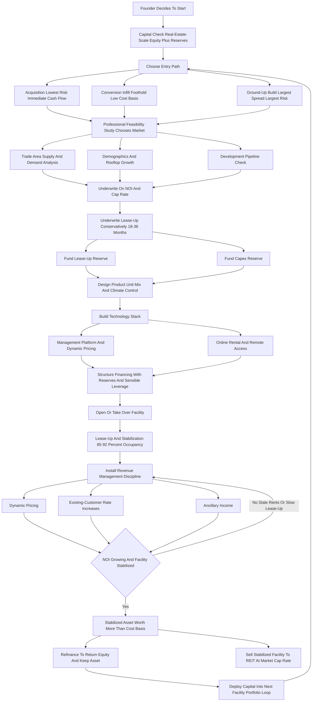
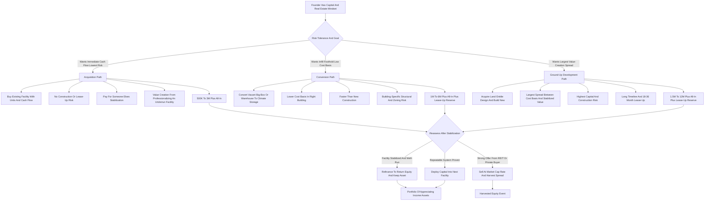

**TL;DR:** To start a self-storage business in 2027, you control a piece of real estate -- built new, bought existing, or converted from another use -- subdivide it into lockable units ranging from a 5x5 closet to a 10x30 two-car garage plus outdoor RV and boat spaces, and rent that space month-to-month at $40-$500 per unit while the underlying land and building appreciate and the operation runs on near-automated overhead. This is **not a storage business; it is a real estate business wearing a storage costume**, and every honest decision about it flows from that fact: you make money three ways at once -- monthly rental cash flow, the forced appreciation of net operating income you can raise rents into, and the eventual sale of a stabilized asset to a REIT or private buyer at a 6-8% cap rate. The honest 2027 economics: a **conversion or small-existing-facility entry runs $400K-$3M** all-in, a **ground-up build runs $1.5M-$12M+** depending on size and land cost, and a stabilized facility at 85-92% physical occupancy throws off a **62-75% net operating income margin** because a 300-500 unit site is often run by one or two people plus software. A single small facility realistically produces **$60K-$350K in Year 1 owner cash flow** while it lease-ups, climbing to **$250K-$900K by Year 3-5** once stabilized, with the larger prize being the equity event -- a $2M facility with $300K of NOI sells for $4M-$5M at a 6-7.5% cap, and that spread between your build cost and the stabilized value is the actual business. The institutional context matters: **Public Storage (NYSE: PSA), Extra Space Storage (NYSE: EXR), CubeSmart (NYSE: CUBE), and National Storage Affiliates (NYSE: NSA)** are publicly traded REITs collectively worth well over $100B who are perpetual buyers of stabilized independent facilities -- which means a disciplined builder has a real, liquid exit. The three things that kill self-storage startups: **(a) the wrong location** -- building where there is no rooftop growth, weak demographics, or a competitor adding supply two miles away; **(b) underwriting a fantasy lease-up** -- assuming you fill to 90% in twelve months when real lease-up takes 18-36 months and the loan still wants its payment; and **(c) treating it as a passive ATM** instead of a revenue-management discipline of dynamic pricing, delinquency control, ancillary income, and reinvestment. Net: viable and genuinely attractive in 2027 for a capitalized, patient, real-estate-minded operator who underwrites conservatively and treats the facility as an appreciating asset to be stabilized and harvested -- a poor fit for anyone who wants a cheap, fast, hands-off cash machine.

## What A Self-Storage Business Actually Is In 2027

A self-storage business owns or controls a parcel of real estate, divides the building and land into individually lockable units, and rents those units to households and small businesses on month-to-month agreements. The customer brings their own lock, accesses their space on their own schedule, and pays a recurring fee; you provide secured, often climate-controlled space, gated access, surveillance, and a management layer that handles billing, collections, and move-ins. That is the visible business. The actual business is real estate. You are buying or building an income-producing asset whose value is a direct multiple of its net operating income, and almost every strategic decision -- where to build, what unit mix to offer, how aggressively to raise rents, when to refinance, when to sell -- is a real estate decision, not a retail one. This distinction is the single most important thing a founder can internalize, because it reframes everything. A storage operator who thinks like a shopkeeper obsesses over occupancy and customer count; a storage operator who thinks like a real estate investor obsesses over net operating income, cap rate, and the gap between what the facility cost to create and what it is worth once stabilized. In 2027 the business is shaped by several realities that matured over the prior decade. The major operators -- Public Storage, Extra Space Storage, CubeSmart, National Storage Affiliates -- have professionalized the industry, normalized dynamic online pricing, and trained customers to rent, compare, and sometimes move in entirely online. Software runs the facility: a 400-unit site can be operated by one or two part-time people plus a management platform, a call center, and remote-access technology. Construction and land costs rose, which raised the bar to build but also constrained new supply in many good markets. And the customer base is durable because the demand drivers -- moving, downsizing, life transitions, small-business inventory, e-commerce overflow -- are structural, not faddish. Self-storage is not a trendy business and it is not a passive one. It is a real estate asset with an operating layer, and the founders who succeed treat the operating layer as the thing that builds the asset's value, and the asset as the thing that builds their wealth.

## The Three Ways You Actually Make Money

A founder must understand that self-storage pays in three distinct ways simultaneously, because most beginners see only the first and underwrite the whole venture on it. **The first is monthly rental cash flow** -- the spread between rental income plus ancillary revenue and the operating expenses of property tax, insurance, utilities, payroll, marketing, software, and maintenance. On a stabilized facility this cash flow is real and the margin is high, because the operating expense load is genuinely low relative to most businesses. **The second is forced appreciation through net operating income growth** -- and this is the lever beginners do not see. A self-storage facility is valued at a multiple of its NOI; raise NOI by $50,000 through rent increases, occupancy gains, ancillary income, or expense control, and at a 7% cap rate you have created roughly $710,000 of asset value. You do not wait for the market to appreciate the asset; you appreciate it yourself by managing the income. **The third is the equity event** -- the refinance or sale. Once a facility is stabilized, you can refinance to pull out tax-advantaged capital while keeping the asset, or sell the stabilized facility to a REIT or private buyer at a market cap rate. The spread between your all-in cost to create the facility and its stabilized market value is the largest single payday in the business, and it is the reason patient builders accept thin early cash flow. The discipline this imposes: a founder must underwrite all three, not just cash flow. The deal that looks mediocre on Year-1 cash flow can be excellent once you account for the NOI you will build and the value that NOI creates. The deal that looks fine on cash flow but sits in a market where you can never raise rents or sell to a credible buyer is a worse business than it appears. Self-storage is a three-engine business, and the founders who fly it on one engine consistently misjudge which deals are actually good.

## The Three Entry Paths: Build, Buy, Or Convert

There are three fundamentally different ways into self-storage, and choosing deliberately is the most consequential early decision a founder makes. **The ground-up build (development).** You acquire land, navigate zoning and entitlement, design the facility, and construct it new -- typically a single-story drive-up facility or a multi-story climate-controlled building depending on land cost and market. This path offers the largest value-creation spread, because you can build at a cost basis well below stabilized value, and it lets you put the right product in the right place. Its challenges are the largest: the highest capital requirement ($1.5M-$12M+), entitlement and construction risk, a long timeline before the first dollar of revenue, and an 18-36 month lease-up during which the loan still wants paying. **The acquisition of an existing facility.** You buy a facility that already has units, customers, and cash flow. This path offers immediate revenue, a known operating history, and far less construction and lease-up risk. Its challenges are that you pay for the stabilization someone else did (a higher cost basis relative to NOI), and the value-creation opportunity is narrower -- usually found in a poorly run facility you can improve through better revenue management, expense control, added units, or ancillary income. The classic acquisition play is the mom-and-pop facility run on autopilot with below-market rents, no dynamic pricing, no ancillary income, and deferred maintenance -- bought, professionalized, and re-stabilized at a higher NOI. **The conversion.** You take an existing building -- a vacant big-box retail store, a warehouse, an industrial building -- and convert it to climate-controlled storage. This path can offer a lower cost basis than ground-up in the right building, faster delivery than new construction, and a foothold in infill locations where land for new build is scarce or unaffordable. Its challenges are building-specific: structural fit, ceiling heights, column spacing, zoning for the use, and conversion costs that can surprise. Many disciplined founders start with an acquisition or a conversion to learn the operating business with less risk, then graduate to ground-up development once they understand lease-up, revenue management, and the local market. The wrong move is a first-time founder choosing ground-up development in an unfamiliar market with thin capital and an optimistic lease-up assumption.

## The 2027 Market Reality: Demand, Supply, And What Changed

A founder needs an accurate read of the 2027 landscape, because self-storage is neither the can't-lose asset its promoters claim nor the overbuilt trap its skeptics warn of -- it is intensely local. **Demand is structurally durable.** Roughly one in ten US households uses self-storage, and the demand drivers are life events and structural conditions, not discretionary wants: people move, downsize, inherit, renovate, divorce, deploy, go to college, run small businesses out of constrained space, and increasingly hold e-commerce and reseller inventory. These drivers do not disappear in a downturn; some of them intensify. **Supply is the variable that decides whether a market is good.** Self-storage demand is local -- customers rent within a few miles of where they live or work -- so a market is defined by a small trade area, and the question is whether that trade area is oversupplied or undersupplied relative to its rooftops and demographics. A market with strong housing growth, dense population, good demographics, and limited existing square footage per capita is attractive; the same market becomes unattractive the moment a competitor announces a new facility two miles away. The early-2020s saw a development wave that oversupplied some markets and left others still hungry. **The competitive structure is barbell-shaped.** At the top sit the public REITs -- Public Storage, Extra Space Storage, CubeSmart, National Storage Affiliates -- and large private operators, with professional revenue management, brand, scale, and capital. At the bottom sits a long tail of independent mom-and-pop facilities, many run on autopilot with stale rents and no technology. The opportunity for a disciplined 2027 entrant sits in two places: building or buying in genuinely undersupplied trade areas the REITs have not saturated, and acquiring and professionalizing the undermanaged independents. **What changed by 2027:** online rental and dynamic pricing became the norm; remote management and access technology made small facilities operable with minimal staff; construction and land costs rose, raising the build bar and constraining supply; the REITs became even more dominant as perpetual buyers, which strengthened the exit; and feasibility-study discipline became non-negotiable, because the markets where storage works and the markets where it does not are sharply divided and getting more so.

## The Core Unit Economics: NOI, Cap Rate, And The Value You Create

This is the most important section in the guide, because the entire business lives on a calculation beginners rarely run correctly. A self-storage facility's value is its **net operating income divided by the market cap rate**. NOI is rental income plus ancillary income minus operating expenses -- and critically, NOI excludes the mortgage payment, depreciation, and capital expenditures. The cap rate is the market's required yield; in 2027, stabilized self-storage trades in a broad band that varies by market quality, facility quality, and interest rates, with strong facilities in good markets commanding lower cap rates (higher prices) and weaker facilities in thin markets commanding higher cap rates (lower prices). Work a concrete example. A 400-unit facility with an average rent of $130/month and 88% physical occupancy generates roughly 400 x $130 x 0.88 x 12 = $549,000 of gross rental income; add $40,000 of ancillary income (tenant insurance commissions, late fees, retail) for $589,000 in total revenue; subtract operating expenses that on a well-run small facility run 30-40% of revenue -- say 35%, or $206,000 -- and you have an NOI of roughly $383,000. At a 7% cap rate that facility is worth about $5.47M; at a 6.5% cap rate it is worth $5.89M; at an 8% cap rate it is worth $4.79M. Now the lever that makes the business: raise the average rent 8% through disciplined revenue management and the gross rental income climbs about $44,000, NOI climbs roughly $44,000 (rent increases drop almost entirely to NOI), and at a 7% cap rate you just created about $629,000 of asset value with a pricing decision. That is forced appreciation, and it is why the business rewards revenue-management discipline over passive ownership. The discipline this imposes on a founder: **underwrite every deal on NOI and cap rate, not on gross revenue or unit count.** Know your stabilized NOI assumption and stress-test it. Know the cap rate a credible buyer would actually pay in that specific market. Know your all-in cost basis. The business is the spread between cost basis and stabilized value, and a founder who cannot articulate that spread for a specific deal is not ready to do that deal.

## The Line-By-Line Operating P&L

Beyond the NOI headline, a founder must internalize the actual expense lines, because self-storage's reputation as a low-overhead business is true but not automatic, and the lines are specific. **Property tax** is typically the single largest operating expense and it tends to rise -- assessors reassess improved and stabilized facilities upward, and a founder must underwrite tax growth, not a frozen number. **Insurance** -- property and liability coverage on the building and the operation -- has risen meaningfully and varies by region and risk exposure. **Payroll** is genuinely low relative to most businesses: a small-to-mid facility runs on one or two part-time people, or a part-timer plus a management company or call center, and remote-access technology continues to thin this line. **Utilities** are modest for drive-up facilities and meaningfully higher for climate-controlled buildings, where heating and cooling are a real cost. **Marketing** -- predominantly online: search, listing sites, the facility's own website -- is an ongoing cost that drives the lease-up and the replacement of natural tenant churn. **Software and technology** -- the management platform, access control, surveillance, payment processing -- is a modest but essential line. **Repairs and maintenance** -- doors, gates, paving, roofing, landscaping, snow removal, pest control -- is ongoing and underestimated by beginners who picture a building that just sits there. **Administrative, legal, and professional** rounds out the fixed overhead. Net these against revenue and a well-run small facility runs operating expenses around 30-40% of revenue, leaving a 60-70% NOI margin -- but that margin is earned through disciplined expense control, not gifted. Below NOI sit the lines that determine actual owner cash flow: the **mortgage payment** (principal and interest, sized by the loan and the rate), and **capital expenditures and reserves** (roof, paving, door replacement, gate systems -- real periodic costs the P&L must reserve for, not absorb by surprise). The founders who fail at the P&L level usually made the same errors: they underwrote property tax and insurance as static, they ignored the capex reserve, and they confused NOI with cash flow -- forgetting that the loan payment sits between them and the money.

## Site Selection: The Decision That Decides Everything

Location is the highest-stakes decision in self-storage, because a facility is fixed in place and a bad location cannot be fixed by good operation. The analysis is disciplined and specific. **The trade area is small.** Storage customers rent within roughly a three-to-five-mile radius of home or work, so the relevant market is not the metro -- it is a tight trade area, and a founder must analyze that specific ring. **Demand-side factors:** population and household count within the trade area, population and housing growth (rooftops being added drive storage demand), household income and demographics, renter percentage and apartment density (renters and apartment-dwellers use storage more), and the presence of demand generators (military bases, universities, areas of housing turnover, small-business density). **Supply-side factors:** the existing square footage of storage per capita within the trade area compared to a healthy benchmark, the occupancy and rental rates of existing facilities (high occupancy and rising rents signal undersupply), and -- critically -- the development pipeline, because a facility that pencils today is ruined by a competitor's facility announced tomorrow. **Site-specific factors:** visibility and traffic count (storage benefits from being seen), access and ingress/egress, zoning for the use, parcel size and shape, and land cost relative to what the market rents support. **The feasibility study** is the non-negotiable tool: a professional third-party feasibility study analyzes the trade area's supply and demand, models a realistic lease-up and rent structure, and tells a founder whether the market actually supports a facility -- and a founder who skips it to save the fee is gambling the entire capital stack on intuition. The discipline: self-storage is an intensely local business, the difference between a good trade area and a saturated one is stark, and a founder must let the feasibility analysis -- not enthusiasm for a particular piece of land -- decide whether and where to build or buy.

## Unit Mix, Climate Control, And Facility Design

The product a founder builds inside the real estate is the unit mix, and getting it right is a revenue decision that lasts the life of the facility. **Unit sizes** run from a 5x5 (a closet -- documents, seasonal items, a small apartment's overflow), through the workhorse 5x10 and 10x10 (the most-rented sizes -- a room or two of household goods), to the larger 10x15, 10x20 (a one-car garage -- a house worth of goods, small-business inventory), and 10x30 (a two-car garage). **The mix matters because smaller units rent for more per square foot** -- a 5x5 at $55/month earns far more per square foot than a 10x20 at $200/month -- but smaller units also turn over more and require more management touches, while larger units are stickier but earn less per square foot. A good mix balances per-square-foot revenue against demand depth and management load, and it should be informed by the feasibility study's read of what the specific market rents. **Climate control** is the major design fork. Climate-controlled units -- temperature and often humidity regulated, typically inside a building -- command a 20-40% rent premium, protect sensitive goods, and are increasingly expected in many markets; they also cost more to build and carry higher utility costs. Traditional drive-up units -- the customer pulls a vehicle to the door -- are cheaper to build and operate and remain in strong demand for vehicle-accessible, less-sensitive storage. Many facilities offer both. **Outdoor and vehicle storage** -- parking spaces for RVs, boats, trailers, and vehicles -- is a low-cost-to-create, steady-demand category that uses land efficiently. **Facility design** also encompasses security and access (gated access, individual unit alarms, surveillance, well-lit drive aisles, controlled entry), drive-aisle width and layout for vehicle access, single-story drive-up versus multi-story climate-controlled depending on land cost, and the office or kiosk. The discipline: the unit mix and the climate-control decision are long-lived revenue choices, they should follow the feasibility study and the local market's demonstrated demand, and a founder who builds the wrong mix -- too many large units in a market that wants small ones, or no climate control in a market that demands it -- has baked a revenue ceiling into the concrete.

## The Lease-Up: The Make-Or-Break First 18-36 Months

The lease-up is where new and converted facilities live or die, and a founder who underwrites it optimistically is underwriting a failure. A newly built or converted facility opens empty and must fill -- and filling is not fast. A realistic lease-up to stabilized occupancy (commonly 85-92% physical occupancy) takes **18 to 36 months** depending on the market's depth, the facility's size, the competitive landscape, and the marketing intensity. During that entire period the facility is generating partial revenue while carrying full operating expenses and full debt service -- which is precisely why the lease-up reserve is a non-negotiable line in the capital stack. **The lease-up math beginners get wrong:** they assume a steep fill curve (90% in twelve months) when the real curve is a gradual climb, and they assume the loan will be patient when the loan wants its full payment from month one. A facility that lease-ups slower than underwritten -- which is the common case for the optimistic underwriter -- burns through reserves and can default not because the business model is bad but because the capital plan was wrong. **Managing the lease-up:** aggressive online marketing (search, listing sites, the facility's website), introductory and promotional pricing to build occupancy momentum, and a deliberate revenue-management ramp that raises rates as occupancy climbs. **The acquisition advantage:** buying an existing stabilized facility skips the lease-up risk entirely -- the units are full and the cash flow exists -- which is a large part of why acquisition is the lower-risk entry path. The discipline a founder must impose: underwrite a conservative lease-up curve, fund a lease-up reserve sufficient to carry operating expenses and debt service through a slower-than-hoped fill, and treat the lease-up period as the riskiest phase of the entire venture. The business model of a stabilized facility is excellent; the path from empty building to stabilized facility is where the capital plan is tested, and the founders who fail here almost always failed in the underwriting, not the operating.

## Revenue Management: The Discipline That Builds The Asset

Revenue management is the operating discipline that separates a facility that compounds in value from one that merely sits there, and a founder must build it as a core function. **Dynamic pricing** is the modern standard the REITs normalized: rather than a static rate card, rents adjust based on occupancy, demand, season, competitor pricing, and unit-type availability -- a unit type at 95% occupancy can command more than the same type at 70%. Software runs this, and a 2027 operator who prices statically while competitors price dynamically is leaving NOI -- and therefore asset value -- on the table. **Existing-customer rate increases** are the quiet engine of forced appreciation: storage customers are notoriously sticky -- the cost and hassle of moving their belongings makes them tolerate periodic, reasonable rate increases -- and a disciplined program of regular existing-customer increases raises NOI substantially over time. This must be done thoughtfully (reasonable increments, good communication, attention to churn), but it is the single most powerful NOI lever an operator controls. **Ancillary income** is the underrated profit layer: tenant insurance or protection plans (the operator earns a commission or margin), administrative and late fees, retail sales of locks and packing supplies, and truck rental partnerships. Ancillary income can add a meaningful percentage to revenue and drops largely to NOI. **Occupancy versus rate** is the constant tension a revenue manager balances: chasing 100% occupancy by underpricing leaves money on the table, while pricing too aggressively raises vacancy -- the goal is the rate-and-occupancy combination that maximizes NOI, not either number alone. **Delinquency management** -- a disciplined process of late notices, lien procedures, and unit auctions under the state's self-storage lien law -- protects revenue and clears non-paying units for paying customers. The discipline: every dollar of NOI a founder builds through revenue management is worth roughly fourteen to sixteen dollars of asset value at a 6.5-7% cap rate, which makes revenue management not a back-office chore but the core wealth-building activity of the business.

## Technology, Automation, And Remote Management

In 2027 self-storage runs on technology, and a founder should design the technology stack early because it determines the staffing model and the operating margin. **The management platform** is the central system: it holds the unit inventory and availability, runs dynamic pricing, processes online rentals and payments, manages billing and delinquency workflows, and consolidates reporting. **Online rental and move-in** is now a baseline expectation -- a meaningful share of customers want to rent a unit, sign the agreement, and get access entirely online without ever speaking to a person -- and a facility that cannot offer this loses those customers to one that can. **Access control and security technology** -- electronic gate access, individual unit door alarms, app-based entry, surveillance with remote monitoring -- both secures the facility and enables the thin staffing model. **Remote and unmanned operation** is the structural shift that makes small facilities economically attractive: with online rental, app-based access, remote monitoring, and a call center or management company handling the rare phone interaction, a 300-500 unit facility can run with minimal or no on-site staff. **The management company option** -- third-party operators (including platforms affiliated with the major REITs) who run the facility's marketing, revenue management, and operations for a fee -- lets a founder own the real estate without building the operating apparatus, trading a slice of NOI for professional management and the REITs' pricing and marketing scale. The discipline: technology is what makes the low-overhead reputation real, but only if the founder actually builds the stack -- online rental, dynamic pricing software, remote access, surveillance -- rather than running a stale facility on a paper ledger. The technology decision directly sets the payroll line, the marketing effectiveness, and the revenue-management capability, which together set the NOI, which sets the asset value.

## Financing The Deal: The Capital Stack

Self-storage is capital-intensive, and a founder must understand the financing structures that make a deal possible and the ones that sink it. **SBA loans (7(a) and 504)** are widely used for self-storage acquisitions and some construction, offering lower down payments than conventional commercial loans -- valuable for a founder with limited capital, though with their own requirements and timelines. **Conventional commercial real estate loans** from banks and credit unions finance acquisitions and construction, typically requiring larger down payments (often 25-35%) and underwriting the property's income. **Construction loans** for ground-up development fund the build and the lease-up period, then convert to or are refinanced into permanent financing once the facility stabilizes -- and the lease-up reserve is built into this structure or it should be. **CMBS and life-company loans** serve larger, stabilized facilities. **Seller financing** appears in acquisitions, especially of mom-and-pop facilities, and can lower the cash required and ease the entry. **Private capital and partnerships** -- raising equity from investors who want exposure to the asset class -- is common for larger builds and for founders scaling beyond their own balance sheet, with the founder often contributing the deal, the expertise, and the operating sweat. **Refinancing** is a deliberate strategy, not just a fallback: once a facility is stabilized at a higher NOI, refinancing at the new value can return much or all of the original equity tax-efficiently while the founder keeps the appreciating asset. The discipline a founder must hold: the capital stack must include the lease-up reserve and the capex reserve, the debt must be sized so the facility can service it through a conservative lease-up, and the founder must avoid the over-leveraged structure that looks fine in the optimistic case and defaults in the realistic one. The financing is not a detail bolted onto the deal -- it is the structure that determines whether a slow lease-up is a manageable bump or a fatal one.

## Startup Cost Breakdown: The Honest All-In Number

A founder needs a clear-eyed total of what it costs to enter, because self-storage is capital-intensive and under-capitalization -- especially skipping the reserves -- is a top killer. The all-in cost varies enormously by entry path. **Ground-up development** stacks: land acquisition (highly market-dependent, from modest in rural markets to a major line in metros); site work, entitlement, and permitting; construction (commonly $30-$75+ per square foot depending on drive-up versus multi-story climate-controlled, region, and finish); fees (architectural, engineering, legal, feasibility study); equipment and technology (gates, doors, surveillance, management software, office); initial marketing; and the lease-up reserve to carry operating expenses and debt service through the 18-36 month fill. A ground-up facility commonly runs **$1.5M-$12M+ all-in** depending on size, land, and product type. **Acquisition of an existing facility** stacks: the purchase price (a function of the facility's NOI and the market cap rate), closing and due-diligence costs (including a quality feasibility or market study and a thorough physical inspection), any immediate capex to fix deferred maintenance, technology upgrades to professionalize an underrun facility, and working capital. A small-to-mid existing facility commonly runs **$500K-$3M+**, with the down payment and costs being the founder's actual cash requirement. **Conversion** stacks: the building acquisition, conversion construction (structural, climate systems, unit build-out, security), entitlement for the use, fees, technology, marketing, and a lease-up reserve. A conversion commonly runs **$1M-$6M+** depending on the building and market. **Across all paths**, the reserves are non-negotiable: a lease-up reserve for new and converted facilities, and a capex reserve for all facilities. The founder's actual cash requirement is the down payment plus closing costs plus reserves plus working capital -- often **$200K-$1.5M+** of genuine equity even when financing covers the rest. The capital requirement is the single biggest filter on who should start this business: it is real-estate-scale capital, and treating it as a small-business-scale venture -- entering with thin equity and no reserves -- is how a fundamentally good asset class produces a failed deal.

## The Year-One Operating Reality

A founder should walk into Year 1 with accurate expectations, because the gap between the marketed version and the real version of this business is where most disappointment lives. For an **acquisition**, Year 1 is a stabilization-and-professionalization year: taking over an existing facility, implementing dynamic pricing and a revenue-management discipline, cleaning up delinquency, adding ancillary income, upgrading technology, addressing deferred maintenance, and beginning the existing-customer rate-increase program. The cash flow exists from day one, and a well-bought, well-improved acquisition can produce **$60K-$350K in Year 1 owner cash flow** depending on size and how underrun the facility was when bought. For a **ground-up build or conversion**, Year 1 is partly or entirely a lease-up year: the facility opens empty or near-empty, carries full expenses and debt service, and fills gradually -- Year-1 owner cash flow is often thin or negative by design, with the lease-up reserve carrying the gap, and the real return arriving in Years 2-4 as the facility stabilizes. Across both paths, Year 1 is when the founder learns the local market's true demand depth, the real lease-up or churn rate, the actual operating expense load (property tax and insurance especially), and where the facility is operationally fragile. The work is real but not labor-intensive in the way a service business is -- it is revenue management, marketing oversight, expense control, delinquency discipline, and asset management, much of it doable remotely with the right technology and a management partner. The founders who succeed treat Year 1 as the year they install the operating discipline that will build NOI for years; the ones who struggle either bought in a bad market that no operation can fix, or underwrote a lease-up that the market was never going to deliver.

## The Five-Year Trajectory: From Entry To Stabilized Asset

Mapping a realistic five-year arc helps a founder size the opportunity honestly. **Year 1:** entry -- for an acquisition, stabilization and professionalization with $60K-$350K owner cash flow; for a build or conversion, lease-up with thin or negative cash flow carried by the reserve. **Year 2:** for the acquisition, the revenue-management discipline compounds -- dynamic pricing, existing-customer increases, and ancillary income lift NOI, and cash flow climbs; for the build, lease-up continues toward stabilization and cash flow turns meaningfully positive. **Year 3:** most well-run facilities reach or approach stabilization -- 85-92% occupancy, a mature revenue-management program, full ancillary income -- and owner cash flow commonly runs **$150K-$600K** depending on facility size and market, while the NOI built over three years has materially raised the asset's value above the cost basis. **Year 4:** the stabilized facility runs as an optimized asset; the founder faces the first major strategic decision -- refinance to pull out equity tax-efficiently and keep the asset, sell the stabilized facility to a REIT or private buyer at a market cap rate, or hold and acquire or build the next one. **Year 5:** a mature single facility produces **$250K-$900K of owner cash flow** at full stabilization for a well-run facility in a good market, and is worth materially more than it cost to create -- and many founders by this point are running a small portfolio, having used the refinance proceeds or sale proceeds of the first facility to fund the second and third. These numbers assume a good market chosen by feasibility study, a conservative lease-up underwriting, disciplined revenue management, and respected reserves; they do not assume a bad-market facility can be operated into success, because it cannot. A mature self-storage business is a portfolio of appreciating, income-producing real estate assets with a thin operating layer -- a genuinely excellent outcome, earned through capital discipline and revenue-management rigor, not through passivity.

## Five Named Real-World Operating Scenarios

Concrete scenarios make the model tangible. **Scenario one -- Diane, the disciplined acquirer:** buys a 320-unit mom-and-pop facility for $2.1M, the seller having run it for fifteen years on stale rents, no dynamic pricing, no tenant insurance program, and a paper ledger; in Year 1 Diane implements management software and dynamic pricing, adds a tenant-protection program, cleans up delinquency, raises stale rents toward market, and addresses deferred paving -- lifting NOI from roughly $135K to $210K within two years, which at a 7% cap rate added about $1.07M of value to a facility she has barely changed physically. **Scenario two -- the cautionary tale, Marcus:** builds a ground-up 450-unit facility, underwrites a 90%-in-twelve-months lease-up, and funds a thin lease-up reserve; the real lease-up curve is gradual, a competitor opens three miles away in month eight, and by month fourteen the facility is at 48% occupancy while the construction loan demands full payment -- Marcus burns the reserve, cannot make debt service, and is forced to sell the half-leased facility at a loss; the asset class was fine, the lease-up underwriting was fantasy. **Scenario three -- Priya, the converter:** buys a vacant 60,000-square-foot big-box retail building in an infill suburban location where land for new build is unavailable, converts it to climate-controlled storage, and because the trade area is genuinely undersupplied and she funded a real lease-up reserve, reaches stabilization in 28 months with a cost basis well below the stabilized value -- a clean forced-appreciation play. **Scenario four -- the Okafor family, the patient builder:** develops a facility, accepts thin Year-1 and Year-2 cash flow as the deliberate cost of the value-creation spread, stabilizes in Year 3, refinances at the new NOI to return most of their original equity, keeps the appreciating asset, and uses the returned capital to start facility number two -- the textbook portfolio-building loop. **Scenario five -- Rob, the passive-ATM casualty:** buys a facility, treats it as a hands-off cash machine, never implements dynamic pricing, never runs an existing-customer rate-increase program, lets delinquency drift, and skips ancillary income; five years later his NOI is roughly flat, his facility's value has barely moved, and a REIT that would have paid a premium for a professionally run asset passes on his stale one -- the canonical illustration of treating a revenue-management business as a passive holding. These five span the realistic distribution: disciplined acquisition success, lease-up fantasy failure, conversion forced-appreciation, patient portfolio-building, and passive-ownership underperformance.

## Marketing And Customer Acquisition

Self-storage customer acquisition in 2027 is predominantly digital, and a founder must understand the channels because marketing drives both the lease-up and the replacement of natural churn. **Search is the dominant channel** -- people who need storage search for it, locally and with intent ("storage near me," "climate controlled storage [city]"), so search visibility, both organic and paid, is the core of the marketing engine. **The facility's own website** -- with online rental, real-time availability, transparent pricing, and a clean mobile experience -- is both a marketing asset and the conversion point, and in 2027 it is a baseline expectation, not a luxury. **Third-party listing and aggregator sites** -- the marketplaces where customers compare storage options -- are a real channel that drives bookings, at the cost of a fee or commission. **Local visibility** -- signage, the physical presence on a high-traffic road, local presence in the trade area -- still matters because storage is hyper-local. **Reputation and reviews** drive conversion: a customer choosing between facilities leans heavily on ratings, so review management is a real function. **Referrals and repeat use** -- customers who had a good experience return for the next life transition and refer others. **The management-company channel:** for founders who use a third-party operator or a REIT-affiliated management platform, the operator's marketing scale and brand are part of what the fee buys. **Promotional pricing** -- introductory rates, first-month specials -- is a lease-up and churn-replacement tool, used deliberately to win the customer who is then retained and rate-managed over time. The discipline: marketing in self-storage is not a brand-building luxury, it is the demand engine that fills a lease-up and replaces the customers who naturally move out, and a founder must fund it, run it on the channels customers actually use (search, the website, listing sites), and treat conversion -- the website and the online-rental flow -- as seriously as the traffic.

## Legal, Lien Law, And Regulatory Reality

Self-storage operates inside a specific legal framework, and a founder must understand it because it governs the business's most important protections and risks. **The self-storage lien law** is the foundational statute: every state has a self-storage facility act that grants the operator a lien on the contents of a unit for unpaid rent and specifies the precise process -- notice requirements, timelines, advertising, and the auction or sale procedure -- by which an operator can sell the contents of a delinquent unit to recover unpaid rent. This process must be followed exactly; errors expose the operator to liability. **The rental agreement** is the core contract -- specifying rent, fees, the month-to-month term, the operator's lien rights, the customer's insurance obligations, access rules, and limitations of liability -- and a founder must use a thorough, state-compliant agreement, not a generic template. **Tenant insurance and protection programs** sit in a regulated space -- the operator typically cannot simply "insure" the customer's goods without appropriate licensing or a compliant protection-plan structure -- and a founder must set this up correctly because it is both a meaningful ancillary income line and a compliance area. **Zoning and land use** govern whether storage can be built or operated on a given parcel, and entitlement is a real part of the development and conversion paths. **Property and liability insurance** on the facility itself is essential and has risen in cost. **Value limitation and disclaimers** -- the standard practice of limiting the declared value of stored goods and disclaiming liability for customer property -- is built into the agreement and the operating practice. **ADA, environmental, and local regulatory compliance** apply as they do to any commercial real estate. The discipline: self-storage's legal framework is largely protective of a competent operator -- the lien law in particular is a powerful tool -- but only if the operator follows it precisely; a founder should engage counsel familiar with the state's self-storage act, use a compliant agreement, set up the tenant-protection program correctly, and treat the lien process as a procedure to execute exactly, not improvise.

## Risk Management And What Can Go Wrong

The self-storage model carries specific risks, and a disciplined 2027 operator manages each deliberately rather than assuming the asset class protects them. **Oversupply risk** is the defining risk: a market that pencils today is undermined by new competing supply tomorrow, and because storage demand is local and supply can be added, a founder must underwrite the development pipeline and accept that a trade area can shift from undersupplied to saturated. Mitigated by feasibility-study discipline, choosing genuinely undersupplied markets, and monitoring the pipeline. **Lease-up risk** -- the new or converted facility that fills slower than underwritten -- is mitigated by conservative lease-up underwriting and a real lease-up reserve. **Interest rate and refinance risk** -- the loan that must be refinanced into a higher-rate environment, or the cap rate that expands and compresses the asset's value -- is mitigated by sensible leverage, fixed-rate or appropriately structured debt, and not depending on an aggressive exit cap rate. **Concentration risk** -- a single facility in a single trade area -- is mitigated over time by building a small portfolio across markets. **Operational underperformance risk** -- the facility run passively, with stale rents and no revenue management -- is mitigated by treating revenue management as the core discipline. **Property risk** -- fire, weather, structural issues, environmental -- is mitigated by insurance, maintenance, and reserves. **Delinquency and economic risk** -- a downturn that raises non-payment -- is mitigated by disciplined lien-law collections and by the structural durability of storage demand, which historically holds up reasonably well in downturns. **Liability risk** -- claims related to stored goods, customer injury on site -- is mitigated by the agreement's value limitations and disclaimers, by property and liability insurance, and by safe-site practices. The throughline: the largest risks in self-storage -- oversupply and lease-up -- are underwriting risks, decided before the founder commits capital, which is exactly why the feasibility study and the conservative lease-up assumption are not optional; the operator who fails usually failed at the underwriting desk, not the operating desk.

## The Competitor Landscape: Who You Are Up Against

A founder should understand the competitive field clearly. **The public REITs** -- Public Storage (NYSE: PSA), Extra Space Storage (NYSE: EXR), CubeSmart (NYSE: CUBE), and National Storage Affiliates (NYSE: NSA) -- collectively own and operate thousands of facilities and are worth well over $100B combined; they bring professional revenue management, brand recognition, scale in marketing and pricing, and deep capital. They are formidable competitors and they are also the most important buyers of stabilized independent facilities, which makes them simultaneously the competition and the exit. **Large private operators and regional players** occupy the tier below the REITs with their own professional operations. **The long tail of independent mom-and-pop facilities** -- many run on autopilot, with stale rents, no dynamic pricing, no online rental, and deferred maintenance -- is both the competition a disciplined operator out-professionalizes and the primary acquisition target. **Third-party management platforms** -- including those affiliated with the major REITs -- offer independent owners access to professional revenue management and marketing scale for a fee, which both helps independents compete and extends the REITs' operating reach. The strategic reality for a 2027 entrant: you generally cannot out-scale or out-capitalize the REITs, so you win on two fronts -- choosing genuinely undersupplied trade areas the REITs have not saturated, where a well-built or well-bought facility competes on convenience and service; and acquiring and professionalizing the underrun independents, capturing the NOI gap between a passively run facility and a professionally run one. The competitive moat in self-storage is not the building -- anyone with capital can build one -- it is **the location in a genuinely good trade area, the revenue-management discipline that maximizes NOI, and the cost basis below stabilized value** -- a moat made of underwriting and operating discipline rather than of anything a competitor cannot also buy.

## Scaling Into A Portfolio

The jump from one facility to a portfolio is its own distinct challenge, and a founder should approach it deliberately because portfolio-building is where self-storage becomes a wealth machine rather than a single income stream. The prerequisites for scaling: the first facility must be genuinely stabilized and well-run (do not scale on top of an underperforming asset), the founder must have a repeatable underwriting and operating process, and the capital to fund the next deal -- typically from the first facility's refinance proceeds, its sale proceeds, retained cash flow, or outside equity. **The portfolio-building loop:** acquire or build a facility, stabilize it through revenue-management discipline, refinance at the higher stabilized NOI to return the original equity tax-efficiently while keeping the appreciating asset, and deploy the returned capital into the next facility -- repeating until the founder owns a portfolio of stabilized, income-producing, appreciating assets. **The scaling levers:** standardize the operating playbook (revenue management, technology stack, management approach) so each new facility runs on a proven system; use third-party or in-house centralized management so the founder's attention scales across facilities; diversify across trade areas to reduce single-market concentration risk; and build relationships with brokers, lenders, and the REITs so deal flow and the eventual exit are reliable. **The constraints on scaling:** capital is the first (solved by the refinance loop and outside equity), good deals in good markets are the second (solved by disciplined, patient deal sourcing -- never forcing a bad-market deal to keep growing), founder attention is the third (solved by centralized or third-party management and a standardized playbook), and financing conditions are the fourth (solved by sensible leverage and lender relationships). The strategic decision that arrives with a portfolio: keep building, sell individual facilities opportunistically, or assemble a portfolio of scale that itself becomes an acquisition target for a REIT or institutional buyer at a portfolio premium. The founders who scale well share one trait -- they treated the first facility as the proving ground for a repeatable underwriting-and-operating system, so that each subsequent facility is the disciplined repetition of a proven loop rather than a fresh gamble.

## Exit Strategies And The Long-Term Picture

Self-storage businesses have unusually strong and liquid exit paths, and a founder should build with the exit in mind from day one. **Sell the stabilized facility** -- a self-storage facility with a strong NOI, a clean operating history, professional revenue management, good physical condition, and a desirable location is a genuinely liquid asset; the public REITs and large private operators are perpetual, motivated buyers, and a stabilized facility sells at a market cap rate that translates the NOI directly into a sale price. The spread between cost basis and that sale price is the founder's largest payday. **Refinance and hold** -- rather than selling, the founder refinances the stabilized facility at its higher NOI-driven value, returns most or all of the original equity tax-efficiently, and keeps the appreciating, income-producing asset; this is the wealth-building choice and the engine of the portfolio loop. **Sell a portfolio** -- a portfolio of stabilized facilities can be sold as a package, often at a premium to the sum of the individual facilities, to a REIT or institutional buyer who values the scale. **The 1031 exchange** -- a founder can sell a facility and defer the capital gains tax by exchanging into a larger facility or a portfolio, compounding into bigger assets without the tax drag. **Transition or hold long-term** -- because a well-run facility is a low-management, durable income asset, a founder can simply hold it for the long-term cash flow, transition it to family, or place it under third-party management and treat it as a near-passive holding in maturity. The honest long-term picture: self-storage is a durable, real asset class -- the demand drivers are structural, the operating overhead is genuinely low, the legal framework protects competent operators, and the exit is unusually liquid because of the REIT buyer pool. But it is real estate, not a passive ATM: it demands real capital, disciplined underwriting, ongoing revenue management, and reserves for capex. A founder should think of a 2027 entry as building an appreciating, income-producing real estate asset -- or a portfolio of them -- with multiple genuine exit paths: sale to a REIT, refinance-and-hold, portfolio sale, 1031 exchange, or long-term low-management hold. Among small-business and real estate ventures, that combination of durable demand, low overhead, forced-appreciation upside, and a liquid institutional exit makes it one of the more structurally attractive paths -- for the founder with the capital and the discipline to do it right.

## The Final Framework: Building It Right From Day One

Pulling the entire playbook into a single operating framework: a founder who wants to start a self-storage business in 2027 and actually succeed should execute in this order. **First, get honest about capital and identity** -- confirm you have real-estate-scale capital (often $200K-$1.5M+ of genuine equity plus financing) including the lease-up and capex reserves, and accept that this is a real estate business, not a passive cash machine. **Second, choose your entry path deliberately** -- acquisition for the lowest risk and immediate cash flow, conversion for an infill foothold with a low cost basis, or ground-up development for the largest value-creation spread and the largest risk; a first-timer is usually better starting with acquisition or conversion. **Third, let a professional feasibility study choose the market** -- analyze the small local trade area's supply, demand, demographics, and development pipeline, and let the analysis, not enthusiasm for a parcel, decide whether and where to commit. **Fourth, underwrite on NOI and cap rate** -- know your stabilized NOI assumption, stress-test it, know the cap rate a credible buyer would actually pay in that specific market, know your all-in cost basis, and confirm the spread between cost basis and stabilized value is real. **Fifth, underwrite the lease-up conservatively** -- assume 18-36 months to stabilization, not twelve, and fund a lease-up reserve that carries operating expenses and debt service through a slower-than-hoped fill. **Sixth, design the right product** -- a unit mix and a climate-control decision driven by the feasibility study and the local market's demonstrated demand. **Seventh, build the technology stack** -- management platform, dynamic pricing, online rental, remote access, surveillance -- so the low-overhead model is real and the revenue-management capability exists. **Eighth, install revenue management as the core discipline** -- dynamic pricing, a disciplined existing-customer rate-increase program, full ancillary income, and the rate-versus-occupancy balance that maximizes NOI. **Ninth, structure the financing sensibly** -- include the reserves, size the debt to survive a conservative lease-up, and avoid the over-leveraged structure that defaults in the realistic case. **Tenth, run the legal framework precisely** -- a compliant rental agreement, a correctly structured tenant-protection program, and the state's lien process executed exactly. **Eleventh, build NOI relentlessly** -- because every dollar of NOI is worth roughly fourteen to sixteen dollars of asset value, revenue management is the core wealth-building activity, not a chore. **Twelfth, plan the exit and the portfolio loop** -- refinance to return equity and keep the asset, or sell the stabilized facility to a REIT, and use the proceeds to repeat. Do these twelve things in this order and a self-storage business in 2027 is a legitimate path to an appreciating real estate asset -- or a portfolio of them -- with strong cash flow and a liquid institutional exit. Skip the discipline -- especially on the feasibility study, the lease-up underwriting, and the revenue management -- and a fundamentally excellent asset class still produces a failed deal. Self-storage is neither a can't-lose asset nor an overbuilt trap. It is a real, capital-intensive, intensely local real estate business, and in 2027 it rewards exactly one kind of founder: the capitalized, patient, disciplined operator who underwrites conservatively, manages revenue rigorously, and treats the facility as the appreciating asset it actually is.

## The Operating Journey: From Capital Check To Stabilized Asset

## The Decision Matrix: Acquisition Vs Conversion Vs Ground-Up Development

## Sources

1. **Self Storage Association (SSA) -- Industry Data and Operating Benchmarks** -- The primary trade association for the self-storage industry; demand data, household penetration, supply metrics, and operating benchmarks. https://www.selfstorage.org
2. **Inside Self-Storage -- Industry Trade Publication** -- Ongoing journalism and operating guidance on development, acquisition, revenue management, and industry trends. https://www.insideselfstorage.com
3. **Public Storage (NYSE: PSA) -- Investor Relations and Annual Reports** -- The largest self-storage REIT; public financials, operating metrics, and market context. https://investors.publicstorage.com
4. **Extra Space Storage (NYSE: EXR) -- Investor Relations and Annual Reports** -- Major self-storage REIT (merged with Life Storage in 2023); public financials and operating data. https://ir.extraspace.com
5. **CubeSmart (NYSE: CUBE) -- Investor Relations and Annual Reports** -- Self-storage REIT; public financials, third-party management platform, and operating metrics. https://investors.cubesmart.com
6. **National Storage Affiliates Trust (NYSE: NSA) -- Investor Relations** -- Self-storage REIT with a participating-operator structure; public financials and operating context. https://www.nationalstorageaffiliates.com
7. **IBISWorld -- Storage and Warehouse Leasing Industry Reports** -- Industry revenue, growth, structure, and competitive-landscape data. https://www.ibisworld.com
8. **US Small Business Administration -- 7(a) and 504 Loan Programs** -- Financing programs widely used for self-storage acquisition and construction. https://www.sba.gov
9. **US Census Bureau -- Population, Housing, and Household Data** -- Demographic and rooftop-growth data underlying trade-area demand analysis. https://www.census.gov
10. **Bureau of Labor Statistics -- Construction Cost and Wage Data** -- Reference for construction labor, materials cost trends, and facility staffing wage context. https://www.bls.gov
11. **The Parham Group / Self-Storage Feasibility Study Providers** -- Reference for the professional third-party feasibility study process and trade-area analysis.
12. **Marcus & Millichap -- Self-Storage Research and Cap Rate Reports** -- Brokerage research on self-storage cap rates, transaction volume, and market conditions. https://www.marcusmillichap.com
13. **CBRE -- Self-Storage Capital Markets and Valuation Research** -- Commercial real estate research on self-storage valuation, cap rates, and investment trends. https://www.cbre.com
14. **Cushman & Wakefield -- Self-Storage Sector Reports** -- Commercial real estate research on self-storage supply, demand, and capital markets.
15. **Yardi Matrix -- Self-Storage National Reports** -- Data on self-storage rents, supply pipeline, and market-level performance. https://www.yardimatrix.com
16. **storEDGE / Storable -- Self-Storage Management Software** -- Management platform for inventory, dynamic pricing, online rental, and operations. https://www.storable.com
17. **SiteLink -- Self-Storage Management Software** -- Established management software for billing, delinquency, and facility operations.
18. **Sparefoot / Self-Storage Listing and Aggregator Marketplaces** -- Third-party listing channels that drive customer bookings.
19. **National Association of REALTORS / Commercial Real Estate Financing Guidance** -- Reference for commercial real estate loan structures applicable to acquisition and construction.
20. **State Self-Storage Facility Acts (Lien Law Statutes)** -- The state-by-state statutory framework governing the operator's lien, notice, and auction process.
21. **Self Storage Association -- Legal and Lien Law Resources** -- Industry guidance on rental agreements, lien-law compliance, and the unit-auction process.
22. **Tenant Insurance and Protection Plan Providers (e.g., Bader, MiniCo, SBOA)** -- Reference for compliant tenant-protection program structures and the ancillary income line.
23. **MiniCo / Self-Storage Specialty Insurance** -- Property and liability insurance references specific to self-storage facilities.
24. **Janus International Group (NYSE: JBI) -- Self-Storage Doors and Building Systems** -- Manufacturer of roll-up doors, hallway systems, and conversion components; construction-cost reference. https://www.janusintl.com
25. **Trachte / Steel Building Manufacturers for Self-Storage** -- Reference for single-story and multi-story self-storage building construction systems and costs.
26. **BizBuySell -- Self-Storage Business Listings and Valuation Data** -- Reference for acquisition pricing, cap rates, and going-concern valuations in the self-storage category. https://www.bizbuysell.com
27. **LoopNet / Commercial Real Estate Listing Platforms** -- Reference for self-storage facility and development-site listings and pricing. https://www.loopnet.com
28. **Internal Revenue Service -- Depreciation, Cost Segregation, and 1031 Exchange Guidance** -- Tax treatment of self-storage real estate, cost-segregation studies, and like-kind exchanges. https://www.irs.gov
29. **National Self Storage Operators Roundtable / Industry Operator Communities** -- Practitioner discussion of underwriting, lease-up, revenue management, and acquisition.
30. **Storage Asset Management / Third-Party Management Companies** -- Reference for the third-party facility management model and its fee structure.
31. **Federal Reserve -- Interest Rate and Commercial Lending Data** -- Reference for the rate environment that drives cap rates and refinance risk. https://www.federalreserve.gov
32. **Urban Land Institute -- Self-Storage Development and Land Use Research** -- Research on self-storage development, zoning, entitlement, and land-use trends. https://www.uli.org
33. **Mini-Storage Messenger / MSM -- Self-Storage Trade Publication** -- Operating and development journalism for the self-storage industry.
34. **Local Zoning and Land Use Authorities -- Self-Storage Entitlement** -- Reference for the zoning and entitlement process governing development and conversion.
35. **REIT Annual Reports (PSA, EXR, CUBE, NSA) -- Acquisition Activity and Cap Rate Disclosure** -- The public REITs' disclosed acquisition activity and cap rates, evidencing the institutional buyer pool and exit market.

## Numbers

**Pricing By Unit Size (Monthly, 2027 Ranges)**

| Unit Size | Typical Use | Monthly Rent |
|---|---|---|
| 5x5 | Closet / documents / small overflow | $40-$80 |
| 5x10 | One room of household goods | $60-$120 |
| 10x10 | One-to-two rooms of goods | $90-$180 |
| 10x15 | Large household / small-business inventory | $130-$250 |
| 10x20 | One-car garage equivalent | $150-$300 |
| 10x30 | Two-car garage equivalent | $250-$500 |
| Climate-controlled premium | Temperature/humidity regulated | +20-40% over comparable drive-up |
| Outdoor RV / boat / vehicle | Vehicle and trailer storage | $100-$300 |
| Drive-up access premium | Vehicle-to-door convenience | +10-20% |

**Representative 400-Unit Facility NOI Build**

| Line | Figure |
|---|---|
| Units x avg rent x occupancy x 12 (400 x $130 x 0.88 x 12) | ~$549,000 gross rental income |
| Ancillary income (tenant protection, fees, retail) | ~$40,000 |
| Total revenue | ~$589,000 |
| Operating expenses (~35% of revenue) | ~$206,000 |
| Net operating income (NOI) | ~$383,000 |
| Value at 6.5% cap rate | ~$5.89M |
| Value at 7.0% cap rate | ~$5.47M |
| Value at 8.0% cap rate | ~$4.79M |
| Value created by an 8% rent increase (~$44K NOI) at 7% cap | ~$629,000 |

**Operating Expense Lines (Share Of Revenue On A Well-Run Small Facility)**

| Expense | Notes |
|---|---|
| Property tax | Often the single largest line; tends to rise with reassessment |
| Insurance | Property and liability; risen meaningfully, varies by region |
| Payroll | Genuinely low; one-to-two part-timers or management company |
| Utilities | Modest for drive-up; meaningfully higher for climate-controlled |
| Marketing | Predominantly online search and listing sites |
| Software and technology | Management platform, access control, surveillance, payments |
| Repairs and maintenance | Doors, gates, paving, roofing, landscaping, snow removal |
| Administrative, legal, professional | Fixed overhead |
| Total operating expenses | ~30-40% of revenue (60-70% NOI margin) |

**Entry Cost By Path (All-In)**
- Acquisition of existing small-to-mid facility: $500K-$3M+ (founder cash = down payment + closing + reserves + working capital)
- Conversion of vacant big-box / warehouse to climate storage: $1M-$6M+ plus lease-up reserve
- Ground-up development: $1.5M-$12M+ depending on size, land, and product type
- Construction cost reference: ~$30-$75+ per square foot (drive-up vs multi-story climate-controlled)
- Founder genuine equity requirement across paths: often $200K-$1.5M+

**Five-Year Owner Cash Flow Trajectory (Single Facility)**
- Year 1: $60K-$350K (acquisition, stabilizing) OR thin/negative (build or conversion, leasing up)
- Year 2: rising as revenue management compounds / lease-up continues
- Year 3: $150K-$600K at or near stabilization
- Year 4: optimized stabilized asset; first major refinance-or-sell decision
- Year 5: $250K-$900K at full stabilization for a well-run facility in a good market

**Operating And Market Benchmarks**
- Stabilized physical occupancy: ~85-92%
- Realistic lease-up to stabilization: 18-36 months
- US household self-storage penetration: ~1 in 10 (~10%)
- US self-storage facilities: tens of thousands nationwide
- Customer trade area: ~3-5 mile radius from home or work
- NOI-to-value math: every $1 of NOI ~= $14-$16 of asset value at 6.5-7% cap rate

**The Public REIT Context (The Buyer Pool / Exit)**
- Public Storage (NYSE: PSA) -- the largest self-storage REIT
- Extra Space Storage (NYSE: EXR) -- merged with Life Storage in 2023
- CubeSmart (NYSE: CUBE) -- REIT and third-party management platform
- National Storage Affiliates Trust (NYSE: NSA) -- participating-operator REIT structure
- Major self-storage REITs collectively worth well over $100B; perpetual buyers of stabilized independents

**The Three Income Engines**
- Monthly rental cash flow: rental + ancillary income minus operating expenses minus debt service
- Forced appreciation: NOI growth capitalized into asset value at the market cap rate
- Equity event: refinance to return equity tax-efficiently, or sale to a REIT/private buyer at market cap rate

## Counter-Case: Why Starting A Self-Storage Business In 2027 Might Be A Mistake

The case above describes a structurally attractive business, but a serious founder must stress-test it against the conditions that make this model a bad bet. There are real reasons to walk away.

**Counter 1 -- The capital requirement is real-estate-scale, not small-business-scale.** Self-storage is sold as an accessible "passive income" path, but a genuinely competitive entry needs hundreds of thousands of dollars of equity even with financing -- $200K-$1.5M+ of real cash for the down payment, closing, and the non-negotiable reserves. A founder who treats it as a small-business-scale venture and enters with thin equity and no reserves has built a fragile deal regardless of how good the asset class is.

**Counter 2 -- Oversupply can ruin a good market overnight.** Storage demand is local and supply can be added. A trade area that pencils perfectly today is undermined the moment a competitor announces a facility two miles away, and the founder cannot move the building. Markets shift from undersupplied to saturated, and a founder who underwrites without analyzing the development pipeline is gambling the entire capital stack on a snapshot.

**Counter 3 -- The lease-up is long, expensive, and where deals actually die.** A new or converted facility opens empty and takes 18-36 months to stabilize while carrying full expenses and full debt service. Founders consistently underwrite a fantasy fill curve -- 90% in twelve months -- and fund a thin reserve. The realistic gradual curve burns the reserve, and the facility can default not because the model is bad but because the capital plan was optimistic fiction.

**Counter 4 -- It is not passive, and the passive version underperforms.** The "passive ATM" version -- stale rents, no dynamic pricing, no existing-customer increases, drifting delinquency, no ancillary income -- produces flat NOI, a stagnant asset value, and a facility no REIT wants to pay a premium for. The business rewards revenue-management discipline; the founder who wanted true passivity has chosen the wrong asset and will underperform the disciplined operator badly.

**Counter 5 -- Interest rates and cap rates can compress the whole thesis.** The value-creation spread depends on the cap rate at exit and the rate on the debt. A higher-rate environment raises debt service and expands cap rates, which compresses the asset's value and can turn a refinance from an equity-return event into a problem. A founder who underwrote an aggressive exit cap rate and floating-rate debt has built the optimistic case into the foundation.

**Counter 6 -- Property tax and insurance rise, and they are the biggest lines.** The two largest operating expenses both trend upward -- assessors reassess stabilized facilities, and insurance costs have climbed -- and a founder who underwrote them as static numbers will watch the NOI margin erode below the projection. The low-overhead reputation is real but it is not automatic or permanent.

**Counter 7 -- The REITs are formidable competitors, not just convenient buyers.** Public Storage, Extra Space, CubeSmart, and National Storage Affiliates bring professional revenue management, brand, marketing scale, and capital. A new independent in a market the REITs already serve well is competing against operators who can out-price, out-market, and out-wait them. The opportunity exists in undersupplied markets and underrun acquisitions -- not everywhere.

**Counter 8 -- Construction and conversion costs surprise on the downside.** Ground-up development carries entitlement risk, construction-cost inflation, and timeline risk; conversions carry building-specific surprises -- structural fit, ceiling heights, column spacing, zoning. A founder who underwrote a clean construction budget and a clean entitlement timeline is exposed to the overruns that are common, not rare.

**Counter 9 -- It is illiquid, slow, and patient capital.** Money in a self-storage facility is not quickly redeployable, and the value-creation timeline -- entitlement, construction, 18-36 month lease-up, stabilization -- is measured in years. A founder who needs flexible capital or near-term returns has tied money up in a multi-year real estate project that does not care about their timeline.

**Counter 10 -- The legal framework is protective only if executed precisely.** The lien law is a powerful tool, but the notice requirements, timelines, and auction procedures must be followed exactly; errors create liability. The tenant-protection program sits in a regulated space. A founder who improvises the legal layer instead of executing it precisely converts the model's protections into its risks.

**Counter 11 -- A single facility is concentration risk.** One facility in one trade area is exposed to that market's specific supply, demographics, and economy. The portfolio that diversifies this risk takes years and substantial capital to build, and until then the founder's outcome is bound to one local market that one competitor's announcement can damage.

**Counter 12 -- Other real estate or business paths may fit better.** A founder drawn to real estate but without the capital, patience, or appetite for the lease-up risk might be better served by a stabilized triple-net asset, a smaller multifamily property, or an operating business with faster payback. Self-storage specifically rewards the capitalized, patient, revenue-management-minded operator; for the founder who wants either lower capital or faster returns, it is the wrong expression of that interest.

**The honest verdict.** Starting a self-storage business in 2027 is a strong choice for a founder who: (a) has real-estate-scale capital -- often $200K-$1.5M+ of genuine equity -- including the lease-up and capex reserves, (b) will let a professional feasibility study choose the market and will check the development pipeline, (c) will underwrite the lease-up conservatively at 18-36 months and fund the reserve to match, (d) will treat revenue management as the core wealth-building discipline rather than seeking true passivity, (e) will underwrite property tax, insurance, and the exit cap rate honestly rather than optimistically, and (f) has the patience for a multi-year, illiquid, value-creation timeline. It is a poor choice for anyone who is under-capitalized, anyone who wants a cheap or fast or genuinely passive cash machine, anyone who will skip the feasibility study, and anyone who needs flexible or near-term capital. The model is not a scam -- it is one of the more structurally attractive real estate paths, with durable demand, low overhead, forced-appreciation upside, and a liquid institutional exit -- but it is real estate, and in 2027 the gap between the disciplined version that compounds into wealth and the under-capitalized, fantasy-underwritten version that defaults is wide.

## Related Pulse Library Entries

- **q1946** -- How do you start a real estate investing business in 2027? (The parent discipline; self-storage is a specialized real estate asset class.)
- **q1947** -- How do you start a property management business in 2027? (The operating-layer discipline that applies to running a stabilized facility.)
- **q1949** -- How do you start a short-term rental business in 2027? (Adjacent real estate income model with its own occupancy and revenue-management dynamics.)
- **q1955** -- How do you start a vacation rental business in 2027? (Real-estate-as-asset model; different demand drivers and seasonality.)
- **q1956** -- How do you start a corporate housing business in 2027? (Income-property model serving a specific demand niche.)
- **q1961** -- How do you start an Airbnb arbitrage business in 2027? (Asset-utilization economics adjacent to occupancy and rate management.)
- **q1962** -- How do you start a furnished apartment business in 2027? (Furniture-and-real-estate income model.)
- **q1963** -- How do you start a travel nurse housing business in 2027? (Adjacent furnished-rental demand model.)
- **q1964** -- How do you start a glamping business in 2027? (Land-and-structure income model with its own development and lease-up arc.)
- **q1965** -- How do you start a party rental business in 2027? (Asset-utilization business built on turns-per-item, an adjacent way to think about return on capital.)
- **q1966** -- How do you start an event venue business in 2027? (Real-estate-with-an-operating-layer business; similar build-stabilize-monetize logic.)
- **q1958b** -- How do you start a junk removal business in 2027? (A demand generator -- people clearing space often store the rest; operationally adjacent service.)
- **q1959b** -- How do you start a moving company in 2027? (The single most natural referral and partnership relationship for a storage facility.)
- **q1960** -- How do you start a real estate photography business in 2027? (The marketing-asset photography a facility's website needs to convert.)
- **q1970** -- How do you start a photo booth business in 2027? (Lighter-capital asset-rental adjacency for comparison of capital intensity.)
- **q1971** -- How do you start a bounce house rental business in 2027? (Low-capital asset-rental contrast to capital-heavy storage real estate.)
- **q9501** -- How do you start a bookkeeping business in 2027? (The bookkeeping and NOI tracking every real estate operator must build or buy.)
- **q9502** -- How do you scale a workshop-led senior tech-training business in 2027? (A scaling-discipline reference -- codify, systematize, repeat -- parallel to the portfolio loop.)
- **q9601** -- How do you start a fractional CFO business in 2027? (Financial discipline for underwriting, capital stacks, and refinance strategy.)
- **q9602** -- How do you raise capital for a real estate deal in 2027? (The private-capital and partnership financing path for larger builds and portfolio scaling.)
- **q9701** -- What is the best property and inventory management software in 2027? (The technology-stack deep dive central to a low-overhead facility.)
- **q9702** -- How do you build standard operating procedures for a service business? (The operating playbook a founder standardizes to scale into a portfolio.)
- **q9801** -- What is the future of real estate investing in 2030? (Long-term outlook context for cap rates, demand, and asset-class trends.)
- **q9802** -- How do cap rates and NOI drive commercial real estate value? (The core valuation mechanics the entire self-storage thesis rests on.)
- **q9803** -- What is a 1031 exchange and how does it work? (The tax-deferral tool central to compounding a self-storage portfolio.)

