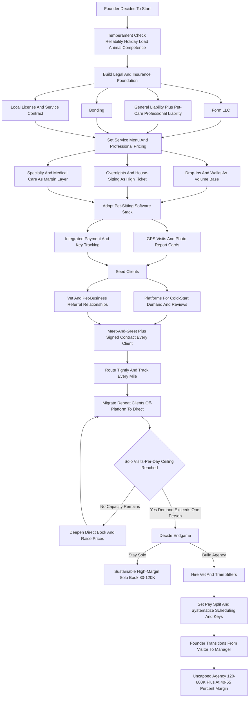
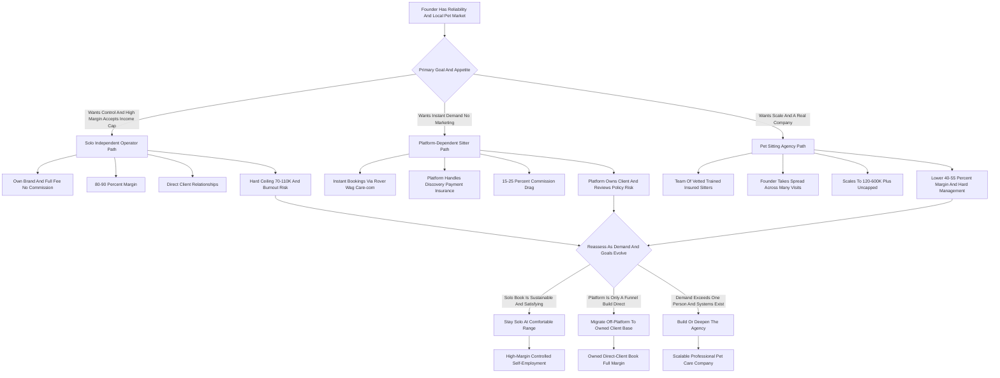

**TL;DR:** To start a pet sitting business in 2027, you provide in-home care for other people's animals -- dropping in on cats and dogs while owners travel, walking dogs midday for working clients, staying overnight in the client's home, and managing the feeding, medication, litter, exercise, and companionship that a pet needs when its person is away. The model is **real, low-capital, and genuinely accessible -- but it is a labor business, not an asset business, and the economics are capped by the simple fact that you can only be in one place at a time.** The honest 2027 numbers: a solo sitter charges roughly **$25-$55 per drop-in visit, $35-$90 per dog walk, $55-$150 per overnight, and $75-$200 per day for live-in house-sitting**, runs an **80-90% gross margin** because overhead is tiny, and in a disciplined Year 1 builds to **$30K-$90K in revenue** from a base of **40-150 repeat clients** -- earned through holidays, weekends, and the unglamorous reality of someone else's litter box at 7am. The genuine business question is not "can I get clients" -- it is **"how do I escape the single-sitter ceiling,"** because a solo operator physically maxes out around **$70K-$110K** before burning out, and the path past that runs through **hiring and managing a team of sitters**, which converts a self-employment job into an actual company at **$120K-$350K+ revenue by Year 2-3** at a thinner **40-55% margin**. The 2027 landscape is shaped by one dominant force: the **platforms** -- Rover (NASDAQ: ROVR), Wag! (NASDAQ: PET), Care.com, TrustedHousesitters -- which hand a beginner instant demand but take **15-25% commission**, control the client relationship, and own the review history. The central strategic move every serious operator makes is **migrating off-platform to direct, repeat, relationship-based clients** where the full fee is yours. The three things that kill pet sitting startups: **(a) underpricing** -- treating it as a hobby, charging neighbor rates, and never covering the holidays-and-weekends opportunity cost; **(b) skipping insurance, bonding, and a real contract** -- one dog bite, one lost pet, one house-flood from a sitter, and an uninsured operator is personally ruined; and **(c) staying solo too long or scaling too fast** -- never building a team and capping out, or hiring sitters before the systems, vetting, and key-management discipline exist. Net: viable in 2027 as a serious, insured, professionally run service business for someone who is genuinely reliable, comfortable with the holiday-and-weekend load, and willing to either accept a solid solo income or do the harder work of building and managing a team -- and a poor fit for anyone who thinks it is easy money for animal lovers, or who will not carry insurance and a contract.

## What A Pet Sitting Business Actually Is In 2027

A pet sitting business is the company a pet owner hires to care for their animal, in the animal's own home, when the owner cannot. You are not a boarding kennel -- the pet never leaves its house. You are not a groomer, a trainer, or a vet. You are the trusted person who holds the key, comes when the owner is at work or on a plane or in a hospital, and does the specific, repeatable, non-negotiable work a pet needs: feeding on schedule, fresh water, the walk or the yard time, the litter box, the medication at the right dose at the right hour, the play and the company that keeps an animal from being alone and anxious for days. The business sells, fundamentally, **trust and reliability** -- a client is handing a stranger the key to their home and the life of an animal they love, often a pet that is functionally a family member. Everything else in this guide -- pricing, insurance, software, hiring, marketing -- exists to build, protect, and scale that trust. In 2027 the business is shaped by a few realities. Pet ownership is broad and deep: roughly two-thirds of US households own a pet, and Americans collectively own well over 150 million dogs and cats. Owners increasingly treat pets as family and spend accordingly -- the pet care economy is large and durable. Travel rebounded fully after the early-2020s disruption, and the return-to-office trend revived the midday dog-walk need that work-from-home had briefly suppressed. And the **platform layer** -- Rover, Wag!, Care.com -- reshaped how clients and sitters find each other, lowering the barrier to entry while inserting a commission-taking intermediary into the relationship. The pet sitting business in 2027 is not a trend and it is not passive. It is a reliability-and-trust service business wearing an animal-lover's costume, and the operators who succeed understand that the love of animals is the qualification to enter, not the thing that makes the business work.

## The Service Menu: What You Actually Sell

A founder must understand every service line before setting prices, because the mix you offer shapes your schedule, your income ceiling, and your client base. **Drop-in visits** are the core of in-home pet sitting -- a 20-to-60-minute visit while the owner travels, covering feeding, water, litter or potty break, a short walk or play, medication, and a quick wellness check; they are usually sold in multiples (two or three a day for a dog, one or two for a cat). **Dog walking** is the recurring, weekday, work-driven service -- a 30-to-60-minute walk for a client who is at the office, often booked as a standing weekly schedule, and it is the closest thing to predictable recurring revenue in this business. **Overnight in-home sitting** is the sitter staying the night in the client's home, providing evening, overnight, and morning care -- it commands a much higher rate because it consumes the sitter's whole night. **House-sitting** extends the overnight into a multi-day live-in stay, where the sitter is essentially living in the home and caring for the pets continuously, often bundled with plant-watering, mail, and a lived-in-house security benefit. **Pet taxi / transport** -- driving a pet to the vet, the groomer, or daycare -- is a useful add-on. **Specialty care** is where margin lives: **medication administration** (pills, insulin injections, fluids), **senior and special-needs pet care**, **post-surgical care**, **puppy care** (more frequent visits), and **exotic and small-animal care** (birds, reptiles, rabbits, fish) for which there is real demand and little competition. **Add-ons** -- extra pets, holiday surcharges, key pickup, extended visits, last-minute booking fees, and waste cleanup -- round out the menu. The strategic point: drop-ins and walks are the volume base; overnights and house-sitting are the high-ticket lines; and specialty care is the margin and differentiation layer. A founder should decide deliberately which lines to offer, because a menu built only of cheap 20-minute drop-ins caps income brutally, while one anchored by overnights, house-sitting, and medical care lifts the average ticket and the whole business.

## The Three Models: Solo Operator, Platform Sitter, And Pet Sitting Agency

There are three distinct ways to build this business, and the choice shapes everything. **The solo independent operator** runs their own brand, sets their own prices, books their own clients (mostly direct and by referral), and personally performs every visit. The advantage is the full fee with no commission, total control of quality, and direct client relationships; the limit is the hard ceiling -- one person, one calendar, a physical cap on income around $70K-$110K and real burnout risk from the holiday-and-weekend load. This is where almost everyone starts and where many deliberately stay. **The platform-dependent sitter** works primarily through Rover, Wag!, Care.com, or TrustedHousesitters -- the platform supplies the demand, the booking, the payment processing, and the insurance umbrella, in exchange for a 15-25% commission and ownership of the client relationship and the reviews. The advantage is instant access to clients with zero marketing; the limit is the commission drag, the platform's control, the risk of a policy change or a deactivation, and the difficulty of ever owning the client. **The pet sitting agency** is the model that escapes the ceiling: the founder builds a team of vetted, trained, insured sitters, takes a cut of each visit (commonly a 50-60% sitter / 40-50% company split or a contractor model), and runs the business as a manager rather than a visitor. The advantage is real scalability into the $150K-$500K+ range and a business that can run without the founder doing every visit; the challenge is that it is a genuinely harder business -- hiring, vetting, training, scheduling, key management, quality control, and the liability of other people in clients' homes. The common and sensible arc: **start solo (often seeded by a platform), build a direct repeat-client base, then deliberately transition to an agency** once demand exceeds one person's capacity. The mistake is staying a platform-dependent sitter forever (capped and commission-bled) or jumping to an agency before the systems and the personal client base exist.

## The 2027 Market Reality: Demand, The Platforms, And What Changed

A founder needs an accurate read of the 2027 landscape, because pet sitting is neither the effortless animal-lover's dream nor a saturated dead end. **Demand is structurally strong and durable.** Pet ownership is broad, pets are increasingly treated as family, the pet care economy is large and growing, travel is fully back, and the return-to-office shift revived midday dog walking. People do not stop traveling, working, or having medical events, and they increasingly refuse to kennel a pet they consider family -- in-home care is the preferred option for a large and growing share of owners. **The platforms are the defining feature of the 2027 market.** Rover (NASDAQ: ROVR) is the dominant marketplace, was taken private by Blackstone in a deal valued around $2.3 billion in 2024, and connects owners with sitters and walkers for a commission. Wag! (NASDAQ: PET) is the other major public-market name in on-demand pet care. Care.com is a broad care marketplace that includes pet care. TrustedHousesitters runs a membership model that pairs travelers with home-and-pet sitters. These platforms genuinely lowered the barrier to entry -- a beginner can have bookings within days -- but they take **15-25% of every transaction**, control the client relationship, own the review history, and can change terms or deactivate an account. **What changed by 2027:** clients expect online booking, a professional digital presence, GPS-tracked visits, photo and report-card updates after each visit, and software-managed scheduling and payment; the bar for "professional" rose well above a phone number and a Facebook post. The competitive structure: at the top, the platforms and a handful of larger regional agencies; in the middle, professional independent sitters and small agencies; at the bottom, a long tail of casual, uninsured side-hustlers and teenagers. The opportunity for a serious 2027 entrant is to be **visibly more professional, more reliable, more insured, and more relationship-driven than the casual tail** -- and to deliberately build the direct-client base that the platforms make easy to start but hard to own.

## The Platform Question: Rover, Wag!, Care.com, And Going Direct

This is one of the most consequential strategic decisions in the business, and a founder should think it through deliberately rather than drifting. **The case for starting on a platform** is real: Rover and Wag! solve the cold-start problem. A brand-new sitter with no clients, no reviews, and no marketing can create a profile, get verified, and have paying bookings within days -- the platform handles discovery, booking, payment, and provides an insurance and guarantee layer. For learning the work, building a review history, and earning while you build, the platforms are a legitimate on-ramp. **The case against staying on a platform** is equally real: the **15-25% commission** is a permanent tax on every dollar; the platform owns the client relationship and the reviews, so you are building the platform's asset, not your own; the platform sets and changes the rules; and a policy change, an algorithm shift, or a deactivation can erase your income overnight. **The strategic move every serious operator makes is the migration off-platform.** The platform's own terms typically restrict soliciting clients off-platform while the relationship is active, so the migration is done carefully and over time: deliver excellent service, build genuine relationships, establish your own professional brand and booking system, and as clients become repeat clients they naturally want to book directly with the sitter they trust -- and a professional independent operation with its own insurance, contract, and software can take that relationship cleanly. The endgame for most successful sitters is a **hybrid then a direct book**: platforms for new-client flow early, a growing core of direct repeat clients who pay the full fee, and eventually a business that is mostly or entirely direct. The founder who never makes this transition stays a permanently-commissioned, platform-controlled contractor; the one who makes it deliberately builds an actual business asset.

## The Core Unit Economics: Visits Per Day And The Single-Sitter Ceiling

This is the single most important section in the guide, because the entire solo business lives or dies on one constraint that beginners never calculate: **you can only be in one place at a time, and the day has a fixed number of hours.** Pet sitting is a labor business, not an asset business -- there is no inventory turning while you sleep. Your income is **visits per day times revenue per visit, minus drive time.** Run the math concretely. A drop-in visit is 20-45 minutes of work, but with **drive time between clients** it realistically consumes 45-75 minutes of your day; a solo sitter doing back-to-back visits can physically complete perhaps **8-14 visits across a long day** if the route is tight, fewer if clients are spread out. At an average of, say, $35 per visit and 10 visits, that is $350 of gross revenue in a 10-12 hour working day -- excellent for the margin (overhead is tiny) but **hard-capped**: there are only so many days, the work clusters on holidays and weekends when everyone travels at once, and you cannot clone yourself. This is why a solo pet sitter, even a busy and well-priced one, tops out around **$70K-$110K in annual revenue** -- and the top of that range usually means a punishing schedule with no real time off, especially around the holidays when demand spikes exactly when the sitter would also like a life. **Drive time is the silent margin killer.** A sitter who books a geographically scattered client base spends half the working day in the car, unpaid; a sitter who deliberately builds a tight service zone -- a few neighborhoods, not a whole metro -- fits far more billable visits into the same hours. **Overnights and house-sitting change the math** because they bill a high rate for a block of time that overlaps with sleep, but they also consume the whole night and limit how many other visits can be done. The discipline this imposes: **a solo sitter must price well, route tightly, weight the menu toward higher-ticket overnight and specialty work, and -- critically -- recognize that real growth past the ceiling is not "work more hours," it is "add sitters."** The founder who understands the visits-per-day ceiling from day one builds toward an agency deliberately; the one who does not just works harder and harder until the holidays break them.

## The Line-By-Line Economics And Margin Reality

Beyond the visits-per-day ceiling, a founder must internalize where the money actually goes, because pet sitting's famous "80-90% margin" is true for a solo operator and badly misleading for an agency. **The solo P&L is genuinely lean.** Revenue is the sum of visits, walks, overnights, and add-ons. Costs are small: mileage and vehicle wear (the largest real cost, and the one most often ignored), insurance and bonding, software subscription, platform commission if applicable, marketing, supplies (leashes, bags, treats, basic first-aid), business licensing, payment processing fees, and the self-employment tax that a new operator routinely forgets to reserve for. Net the solo operator out and an **80-90% gross margin** is realistic -- which is the genuine appeal of the model: it converts revenue into take-home income at a high rate. **But two things shrink that headline number.** First, **the platform commission**: a 20% Rover commission alone takes the effective margin down meaningfully. Second, and far more important, **the agency model is a completely different P&L.** When the founder hires sitters, the largest cost in the business appears -- the **sitter pay**, which on a typical split is 50-60% of each visit's revenue. An agency's gross margin is therefore **40-55%, not 85%**, because the founder is now paying the people doing the visits. The agency founder's income comes from the **spread across many sitters' visits** plus the management layer, not from a high margin on their own labor. A founder must understand this before scaling: the solo business is a high-margin job; the agency is a lower-margin but uncapped business. **The hidden costs that quietly erode both models:** unbilled drive time, holiday and weekend opportunity cost that under-priced sitters give away, no-shows and last-minute cancellations without a cancellation policy, key management overhead, and the self-employment and quarterly tax burden. The founders who fail on economics almost always made the same errors: they priced like a hobbyist, never tracked mileage, gave away holiday premiums, and -- if they scaled -- were shocked that paying sitters cut their margin in half.

## Pricing Architecture: What To Charge In 2027

Pricing is where most pet sitting businesses quietly fail, because the founder treats it as a favor for friends rather than a professional service with real opportunity cost. The 2027 pricing architecture, for an independent professional operator (platforms typically run somewhat lower because of their commission and volume):

| Service | 2027 Price Range | Notes |
|---|---|---|
| Drop-in visit (20-30 min) | $22-$45 | The volume base; price by visit, sold in multiples |
| Drop-in visit (45-60 min) | $32-$60 | Longer visit, more play / multiple pets |
| Dog walk (30 min) | $25-$50 | Recurring weekday revenue |
| Dog walk (60 min) | $40-$90 | Longer / high-energy dogs |
| Overnight in-home sitting | $55-$150 | Sitter stays the night; covers evening + overnight + morning |
| House-sitting (multi-day live-in) | $75-$200 / day | Continuous live-in care, often + plants / mail |
| Pet taxi / transport | $25-$75 / trip | Vet, groomer, daycare runs |
| Medication administration | +$5-$25 / visit | Pills, injections, fluids -- a margin add-on |
| Additional pet | +$8-$25 / pet | Per extra animal |
| Holiday surcharge | +$10-$30 / visit or +25-50% | Thanksgiving, Christmas, July 4th, spring break |
| Last-minute booking fee | +$10-$25 | Bookings inside 24-48 hours |
| Key pickup / handoff | $0-$25 | Or free with a lockbox arrangement |

The pricing disciplines that separate professionals from hobbyists: **(1) Charge holiday premiums without apology** -- the holidays are when demand is highest, supply is shortest, and the sitter is giving up their own holiday; the surcharge is not greed, it is the price of the single most valuable inventory in the calendar. **(2) Price by the visit, not the hour, and bundle nothing for free** -- medication, extra pets, and longer visits are line items, not favors. **(3) Set a cancellation policy with teeth** -- a meaningful percentage charged for late cancellations, because a cancelled visit is a slot the sitter cannot resell. **(4) Raise prices annually** -- costs rise, skills deepen, and a sitter who never raises prices is quietly taking a pay cut every year. **(5) Do not anchor to the cheapest platform sitter or the neighbor's teenager** -- a professional, insured, reliable operator with a contract and a software-managed report card is a different product, and pricing should reflect that. The founder who prices like a professional builds a sustainable business; the one who prices like a favor builds a tiring hobby that resents its own clients.

## Insurance, Bonding, And The Legal Foundation

A founder must treat insurance, bonding, and a real contract as non-negotiable launch requirements, not optional upgrades, because the downside in this business is catastrophic and personal. The reality: a pet sitter is alone in clients' homes, holding keys, handling animals that can bite or bolt, near appliances and plumbing and valuables -- and a single bad event, uninsured, can end the operator's finances permanently. **General liability insurance** covers third-party bodily injury and property damage -- the dog that bites a passerby on a walk, the broken vase, the flooded bathroom. **Pet sitter / animal care professional liability** is the specialty coverage built for this work -- covering injury or illness to the pet in your care, lost or escaped pets, and care-related claims; specialty providers and programs (often available through professional associations like Pet Sitters International and NAPPS, and through specialty insurers) write policies built for exactly this exposure, and annual cost is typically modest, often in the few-hundred-dollar range for a solo operator. **Bonding** -- a surety bond -- protects clients against theft by the sitter or their employees; it is inexpensive and is a trust signal clients and especially agencies value. **The platforms provide their own guarantee or insurance layer for bookings made on-platform**, but that coverage does not extend to direct off-platform clients -- which is exactly why an operator going direct must carry their own. **The business structure:** most professional operators form an **LLC** for liability separation between the business and personal assets; this is standard and inexpensive. **Licensing:** requirements vary by state and city -- a general business license is common, and some jurisdictions have specific pet-care or kennel-related rules; the founder must check local requirements. **The service contract** is the other half of the legal foundation -- covered in its own section below -- specifying scope, rates, emergency authority, vet authorization, liability, and cancellation. **Certifications** -- pet first aid and CPR (offered by providers like Pet Tech and Walks 'N' Wags), and association membership -- are not legally required but are real trust and competence signals. The discipline: an operator launches with general liability, pet-care professional liability, a bond, an LLC, the right local license, and a signed contract for every client -- and the founder who skips these to "start lean" is one bad day away from a personal financial catastrophe.

## The Service Contract And Client Onboarding

A founder should build a thorough service agreement and a real onboarding process, because the contract and the meet-and-greet are where trust is established and risk is controlled. **The service contract** should specify: the exact services and visit schedule; rates, surcharges, and the cancellation policy; **veterinary authorization** -- naming the pet's vet and authorizing emergency care up to a dollar limit, which is critical because a sitter may have to make a medical decision for an animal whose owner is unreachable on a plane; **emergency contacts** and a backup person; **home access** terms (keys, lockbox, alarm codes); the pet's full profile -- feeding, medication, behavior, triggers, vet history, "my dog bolts at the door," "the cat hides but is fine"; liability terms and the limits of the sitter's responsibility; and photo/update consent. **The meet-and-greet** -- a pre-booking in-person visit -- is non-negotiable for new clients: it lets the sitter meet the animal, see the home, learn the routine, confirm the pet is safe to handle, and lets the client meet the person they are trusting; it also screens out the rare bad fit before it becomes a crisis. **Onboarding into the software** -- client profile, pet profile, schedule, payment method, key tracking -- turns the relationship into a managed record rather than a memory. The disciplines: never start service without a signed contract and a completed meet-and-greet; always have vet authorization in writing; always have a backup sitter or contact in case the operator is sick or in an accident; and keep the pet profile current. The founder who treats the contract and onboarding as bureaucratic friction will eventually face an emergency with no authority to act and no documentation; the one who treats them as the trust-and-safety core of the business handles the inevitable hard day calmly and professionally.

## Booking Software, Operations, And The 2027 Tech Stack

In 2027 a professional pet sitting business runs on software, and a founder should adopt the stack early because retrofitting it onto a paper-and-text-message operation is painful. **Pet-sitting business management software** -- purpose-built platforms such as **Time To Pet**, **Precise Petcare**, **Pet Sitter Plus**, and **Scout** -- is the central system. It holds client and pet profiles, manages the booking calendar, prevents scheduling conflicts, handles invoicing and payment, runs the **GPS-tracked visits and post-visit report cards with photos** that 2027 clients expect, manages the sitter team and their schedules and pay splits, and consolidates reporting. This is the first real paid tool a serious operation adopts, and for an agency it is indispensable -- it is how a founder coordinates a team of sitters across dozens of homes without dropping a visit. **The client-facing experience matters commercially**: a clean booking portal, automatic confirmations, and a photo report card after every visit ("here's your dog mid-walk, ate well, all good") is itself a retention and referral engine -- it is the single most loved feature in the business because it reassures an anxious owner. **GPS check-in/check-out** protects both the client (proof the visit happened, for the full duration) and the sitter (proof of work). **Key management software or a disciplined key system** tracks which key is where -- a real operational risk as the client base grows. **Payment processing** integrated into the software removes the awkward money conversation. **The broader stack**: a professional website with online inquiry/booking, a Google Business Profile, and a presence on the platforms if used for new-client flow. The discipline: adopt pet-sitting management software early, lean hard on the photo-report-card feature as a trust and retention tool, run GPS-verified visits, and treat the software as the system that lets a solo operator look fully professional and lets an agency coordinate a team without chaos.

## Marketing And Lead Generation: Building The Direct Client Base

Pet sitting is a local, trust-driven, referral-heavy business, and a founder must understand that the lead-generation engine is relationships and local visibility far more than broad advertising -- and that the goal is a **direct** client base, not a platform-rented one. **Veterinary clinics are the single most valuable referral relationship** -- vets are asked constantly "who do you recommend for pet sitting," and a professional, insured sitter who builds genuine relationships with local vet practices earns a stream of pre-qualified, trust-primed referrals. **Groomers, pet supply stores, doggy daycares, and dog trainers** form the rest of the local pet-business referral web -- they all serve the same pet owners and refer the partners who make their clients' lives easier. **The platforms** (Rover, Wag!, Care.com) are a deliberate, time-limited new-client funnel -- used to seed the business and build a review history, with the explicit plan of converting repeat clients to direct over time. **Local digital presence** matters: a Google Business Profile with reviews, a simple professional website, and visibility in **neighborhood channels -- Nextdoor, local Facebook groups, community boards** -- where pet owners actively ask for sitter recommendations. **Referrals from happy clients are the compounding core** -- a pet owner who trusts a sitter tells every other pet owner they know, and a referral arrives pre-trusted; a deliberate referral ask and even a referral incentive accelerates this. **Repeat clients are the real asset** -- a pet owner travels several times a year and works five days a week; one good client is a multi-year, multi-booking relationship, and retention is worth far more than constant new-client churn. **Niche visibility** -- being known as the sitter who handles diabetic cats, or senior dogs, or reptiles, or large multi-dog homes -- generates targeted, less price-sensitive demand. The discipline: build vet and pet-business referral relationships deliberately, use platforms as a funnel rather than a home, cultivate the neighborhood-channel and Google presence, ask for referrals, and obsess over retention -- because a pet sitting business with a deep base of direct repeat clients has a steady, defensible, full-margin book, while one renting its clients from a platform competes on price forever.

## The Holiday And Weekend Demand Pattern

A founder must understand the demand seasonality of pet sitting, because it is real, sharp, and shapes both income and lifestyle. **Demand concentrates hard around holidays and weekends** -- Thanksgiving, the December holidays, spring break, July 4th, and the summer travel months are peak, because that is when owners travel; weekends generate more travel-driven drop-in and overnight work than weekdays. **Weekday demand is driven by dog walking** -- the standing midday walk for working clients is the steady, recurring, predictable revenue that fills the weekday calendar between travel peaks. This pattern has several consequences. **The holidays are simultaneously the most lucrative and the most demanding time** -- the sitter earns the most exactly when they are giving up their own holiday, which is why holiday surcharges are non-negotiable and why burnout is a real risk for solo operators who never get a holiday off. **A solo sitter physically cannot serve every client who wants the same peak week** -- Thanksgiving week, every client travels at once, and one person can only cover so many homes; this is one of the clearest signals that the business has outgrown a single operator. **Off-peak weeks are quieter** -- which a solo operator can use for rest, admin, and marketing, but which also means income is uneven across the year and must be budgeted accordingly. **The agency model smooths this** -- a team of sitters can absorb the holiday peak that would break one person, which is part of why scaling to an agency is the answer to the demand pattern, not just the income ceiling. The disciplines: price the peaks, fill the weekday troughs with recurring dog-walk clients, budget for uneven income, build a backup-sitter relationship even as a solo operator so a peak week or a personal emergency does not mean failing a client, and read the recurring inability to serve peak demand as the signal to hire. The founder who understands the holiday-and-weekend pattern plans around it; the one who does not is overwhelmed every Thanksgiving and starving every February.

## The Solo Year-One Operating Reality

A founder should walk into Year 1 with accurate expectations, because the gap between the "get paid to play with puppies" fantasy and the real business is where most quitting happens. Year 1 solo is **trust-building and base-building mode.** The first months are spent getting insured and bonded, forming the LLC, setting up software, building a website and platform profiles, completing meet-and-greets, and earning the first reviews -- often seeded through a platform for the cold-start demand. The work itself is **reliable, physical, schedule-bound, and unglamorous in the parts that matter**: it is litter boxes and 6am potty breaks and a diabetic cat's injection on a rigid schedule and driving across town in the rain and being on call on Christmas morning. It is also genuinely rewarding for the right person -- real relationships with animals and the satisfaction of being trusted. The honest Year 1 solo numbers: a disciplined, well-priced, properly insured operator builds toward **$30,000-$90,000 in revenue** from a growing base of **40-150 repeat clients**, at an 80-90% gross margin -- a real income, but earned through the holiday-and-weekend load and capped by the visits-per-day ceiling. The first year is when the founder learns the true drive-time cost, discovers which services and clients are worth keeping, finds out whether they can sustain the holiday schedule, and -- critically -- starts building the **direct repeat-client base** that is the actual long-term asset. Year 1 is also when the founder should decide their endgame: a sustainable solo book at the comfortable middle of the range, or a deliberate build toward an agency. The founders who succeed treat Year 1 as building a real, insured, professional service business and a base of clients who trust them; the ones who fail expected easy money for animal lovers and were unprepared for the reliability demands, the holidays, the insurance need, and the income ceiling.

## Scaling Past The Single-Sitter Ceiling: Building An Agency

The jump from a solo operator to a pet sitting agency is the defining growth challenge of this business, and it is a genuine change in what the business *is* -- from a high-margin job to a lower-margin but uncapped company. A founder should approach it deliberately. **The prerequisites for scaling:** demand must consistently exceed one person's capacity (the founder is regularly turning away or struggling to cover peak bookings); the founder must have a base of direct clients and a real brand, not a platform-rented book; the operations -- software, contracts, key management, the visit standard -- must be documented well enough that someone else can execute them; and the founder must be genuinely willing to **stop doing every visit and start managing**. **The scaling levers:** **hire and vet sitters** -- background checks, in-person vetting, trial visits, reference checks, because the founder is now putting *other people* into clients' homes and the entire brand rests on their reliability; **train to a standard** -- a documented visit protocol, the photo-report-card discipline, emergency procedures, so every sitter delivers the same service; **set the pay split** -- commonly a 50-60% sitter / 40-50% company split, or a contractor model, with the founder's income coming from the spread across many sitters' visits; **systematize key management and scheduling** through the software, because coordinating a team across many homes is where an under-systematized agency drops visits and loses trust; **decide employee vs. independent contractor** carefully -- worker classification has real legal and tax stakes and the rules matter; and **build the management layer** -- a scheduler or operations lead as the team grows. **The economics of the transition:** the margin drops from ~85% to ~40-55% because the founder now pays the sitters, but the *income ceiling disappears* -- an agency with a team can reach **$120K-$350K+ in revenue** and beyond, with the founder's take-home coming from volume across the team rather than a high margin on personal labor. **The risks of scaling:** a bad-hire sitter is a brand and liability event; scaling before the systems exist creates chaos; and some founders discover they preferred the solo work to managing people. The founders who scale well treated their solo Year 1-2 as building both a client base and a documented system, so the agency is the repetition of a proven operation rather than an expensive experiment.

## Hiring, Vetting, And Managing Sitters

For the founder who chooses to scale, the sitter team becomes the entire business, and a founder must treat hiring and management as the core function it is. **Vetting is non-negotiable and thorough** -- the founder is handing strangers the keys to clients' homes and the lives of their pets. Real vetting includes background checks, in-person interviews, reference checks, a demonstrated comfort and competence with animals, reliability signals (does this person actually show up), and ideally trial or shadowed visits before solo assignment. **The brand rests entirely on the least reliable sitter** -- one no-show, one mishandled pet, one untrustworthy person in a client's home, and the trust the founder spent years building is damaged; this is why agency hiring is slower and more careful than ordinary hiring. **Training to a documented standard** turns a collection of individuals into a consistent service -- the visit protocol, the report-card discipline, feeding and medication procedures, emergency response, key handling, client communication. **The pay model** is typically a revenue split (commonly 50-60% to the sitter) or a per-visit rate; the founder must price client services with the split built in so the company margin survives. **Worker classification** -- employee versus independent contractor -- is a real legal decision with tax, control, and liability consequences, and the founder should get it right with professional advice rather than guess. **Retention matters** -- good sitters are the asset, the work is physical and holiday-bound, and an agency that treats sitters well, schedules fairly, and pays reliably keeps a stable team; one that churns sitters churns quality and trust. **Scheduling and coverage** is the daily management work -- matching sitters to clients and zones, covering the holiday peak, handling a sick sitter, managing the keys. The discipline: vet slowly and thoroughly, train to a written standard, classify workers correctly, build the pay split into pricing, treat sitters as the core asset they are, and recognize that the founder's job in an agency is no longer pet care -- it is hiring, training, scheduling, quality control, and trust management.

## Five Named Real-World Operating Scenarios

Concrete scenarios make the model tangible. **Scenario one -- Priya, the disciplined solo professional:** launches properly insured and bonded with an LLC, seeds her first clients on Rover to build reviews, but from day one focuses on converting repeat clients to direct; she prices at the professional end, charges holiday surcharges without apology, builds tight relationships with two local vet clinics, and deliberately keeps a small geographic service zone to kill drive time. By the end of Year 2 she has roughly 110 direct repeat clients, runs at an 87% margin, grosses about $85K solo, and chooses to stay solo at a sustainable level -- a high-margin job she controls completely. **Scenario two -- the cautionary tale, Brandon:** treats it as easy animal-lover money, skips insurance and a contract to "start lean," prices at neighbor rates with no holiday premium, takes every client across a whole sprawling metro; he spends half his day driving unpaid, resents the holiday work he gave away for free, and then a client's dog slips its collar and is injured on a walk -- uninsured, with no signed vet authorization, the incident is a financial and emotional disaster and he quits within the year. **Scenario three -- Denise, the medical-care specialist:** builds her whole brand around diabetic cats, senior dogs, and post-surgical care -- the work most casual sitters will not touch; she commands premium rates, gets a steady stream of vet referrals because clinics trust her with medical cases, faces little price competition, and runs a smaller but high-margin, deeply defensible solo book. **Scenario four -- the Okafor agency:** the founder spends two years building a 130-client direct base and a documented operating system, then deliberately transitions to an agency -- carefully vetting and training a team that grows to nine sitters on a 55/45 split; the company margin drops to about 45% but the revenue ceiling disappears, and by Year 4 the agency grosses around $310K with the founder running scheduling, hiring, and quality control rather than doing visits. **Scenario five -- Marcus, the platform-trapped sitter:** stays permanently dependent on Rover and Wag!, never builds a direct book, never gets his own insurance, never raises prices; the platforms take 20%+ of everything, a platform policy change cuts his visibility, and after three years he has a tiring, capped, commission-bled income and no business asset of his own to show for it. These five span the realistic distribution: disciplined solo success, the uninsured-hobbyist failure, the high-margin specialist, the deliberate agency build, and the platform-dependency trap.

## Specialty And Niche Paths Worth Considering

Beyond the general drop-in-and-walk model, a founder should understand the specialty paths, because for many operators a focused niche is the stronger, more defensible business. **Medical and special-needs pet care** -- diabetic and chronically ill animals, post-surgical recovery, senior pets, medication-intensive cases -- is the highest-value, lowest-competition niche: it commands premium rates, generates vet referrals, and most casual sitters will not or cannot do it. **Exotic and small-animal care** -- birds, reptiles, rabbits, fish, small mammals -- is a genuine underserved niche; these owners struggle to find competent care and value a sitter who knows their animals. **Overnight and house-sitting focus** -- specializing in the high-ticket live-in service rather than volume drop-ins -- builds a higher-revenue-per-client book. **Cat-only sitting** -- a deliberate specialty for a sitter who wants a calmer, lower-physical-demand book; cat owners specifically value a true cat person. **Multi-dog and large-breed homes** -- comfortable, skilled handling of demanding households. **Puppy care** -- the frequent-visit, training-aware care new-puppy owners need. **Dog-walking-led recurring books** -- building primarily around standing weekday walks for the predictable recurring revenue. **Luxury and concierge pet care** -- a premium, high-touch service for affluent clients who want the best. **Adjacent add-ons** -- some operators layer in pet taxi, basic grooming, or training, though each is a real additional skill and liability. The strategic point: the general model is the common starting point, but specialization -- especially in medical care or exotics -- delivers higher rates, less price competition, stronger referral flow, and a more defensible book. The mistake is not choosing a niche; it is being a generic, interchangeable, lowest-price drop-in sitter when a defensible specialty was available.

## Risk Management: Protecting The Pets, The Clients, And Yourself

The pet sitting model carries specific, real risks, and the 2027 operator manages each deliberately rather than hoping. **Pet injury, illness, or death in your care** is the gravest risk -- mitigated by competent handling, knowing each pet's profile and triggers, pet first-aid and CPR training, written vet authorization with an emergency-care dollar limit, a known emergency vet, and pet-care professional liability insurance. **A lost or escaped pet** -- the dog that bolts the door, slips a collar, or gets out of the yard -- is mitigated by careful handling protocols, secure leashing and door discipline, knowing which pets are flight risks, and insurance coverage for escape. **A dog bite -- to the sitter, to a passerby, to another animal** -- is mitigated by screening pets at the meet-and-greet, declining genuinely dangerous animals, careful walking practices, and general liability coverage. **Property damage in the client's home** -- the flooded bathroom, the broken item, the alarm triggered -- is mitigated by care, clear access procedures, and liability insurance. **Theft accusations** -- a sitter is alone in a home with the client's belongings -- are mitigated by bonding, trustworthy hiring, and clear documentation. **Key loss or a home-security lapse** is mitigated by a disciplined key-tracking system or lockboxes. **Sitter unavailability** -- the operator gets sick, is in an accident, or simply cannot cover a peak -- is mitigated by a backup-sitter relationship even for solo operators, because failing a client who is on a plane is a trust-ending event. **Worker-related risk in an agency** -- a sitter who is unreliable, untrustworthy, or causes an incident -- is mitigated by thorough vetting, training, correct classification, and the agency's own insurance. **Client disputes** -- over scope, damage, or charges -- are mitigated by a thorough signed contract. The throughline: every major risk in pet sitting has a known mitigation built from insurance, contracts, careful procedures, and a backup plan -- and the operators who fail are almost always the ones who carried no insurance, used no contract, had no vet authorization, or had no backup when the hard day inevitably came.

## Taxes, Bookkeeping, And Business Structure

A founder should set up the financial and legal structure deliberately from day one, because pet sitting's simple operations hide a few real tax and compliance traps. **Entity:** most professional operators form an **LLC** for the liability separation between business and personal assets -- inexpensive, standard, and meaningful given the business's risk profile. **Self-employment tax is the trap that catches every new solo operator** -- as a self-employed person the founder owes self-employment tax on top of income tax and must make **quarterly estimated tax payments**; a sitter who treats the full visit fee as take-home and does not reserve for taxes faces a brutal year-end bill. **Mileage is the single largest deduction and the most-ignored** -- a pet sitter drives constantly, and tracking every business mile (with an app or a log) converts a major real cost into a major real deduction; failing to track it is leaving money on the table every single day. **Other deductions** -- insurance, bonding, software subscriptions, supplies, licensing, platform fees, marketing, professional association dues, first-aid certification, a portion of phone -- all reduce taxable income when a clean bookkeeping system captures them. **Bookkeeping** -- separate business banking from day one, accounting software, and a system that tracks income by service line and expenses by category -- turns tax time from a scramble into a process and shows the founder which parts of the business actually make money. **Sales tax** on services varies by jurisdiction and should be checked locally. **For an agency, payroll and worker classification** become central -- employee versus contractor has real tax and legal consequences, and payroll taxes on employees are a real cost to budget. **Licensing** varies by state and city and must be confirmed locally. The discipline: form the LLC, separate the banking, reserve for and pay quarterly estimated taxes, track every mile, capture every deduction with real bookkeeping, and -- for an agency -- get worker classification and payroll right with professional help. Skipping this does not save money; it converts a manageable compliance function into a year-end crisis and a missed-deduction tax overpayment.

## The Five-Year Revenue Trajectory

Mapping a realistic five-year arc helps a founder size the opportunity honestly -- and the arc forks sharply depending on whether the founder stays solo or builds an agency. **Year 1 (solo):** get insured, bonded, and set up; seed clients (often via a platform) and build reviews and direct relationships; revenue **$30K-$90K** at an 80-90% margin from 40-150 repeat clients; founder doing every visit and learning the true drive-time and holiday reality. **Year 2 (solo path):** the direct repeat-client base deepens, referrals from clients and vets compound, pricing rises, the platform dependency shrinks; revenue climbs to roughly **$60K-$110K**, still solo, now bumping against the visits-per-day ceiling -- this is the decision point. **Year 2-3 (agency path):** the founder hires and vets the first sitters, the margin drops to **40-55%** as sitter pay enters the P&L, but the ceiling lifts; revenue reaches **$120K-$350K+** with the founder transitioning from visitor to manager. **Year 3-4 (agency path):** the team deepens, systems mature, a scheduling/operations layer is added, vet and referral relationships drive steady direct demand; revenue lands roughly **$250K-$600K** depending on market size and team depth, with the founder running the business rather than performing it. **Year 5:** a mature solo operator runs a sustainable, high-margin, controlled book in the $80K-$120K range and decides whether that is the desired endpoint; a mature agency runs **$400K-$900K+** at a 40-55% margin with a real team, a defensible direct-client base, and a business that has value independent of the founder's own labor. These numbers assume disciplined pricing, real insurance, deliberate off-platform migration, and -- for the agency -- careful hiring and systems; they do not assume exponential growth, because pet sitting scales with sitters, clients, and geographic density, not magically. The honest summary: the solo path is a good, high-margin, capped job; the agency path is a harder, lower-margin, uncapped business -- and both are legitimate, but the founder should choose deliberately.

## Common Year-One Mistakes That Kill The Business

A founder can avoid most failure modes simply by knowing them in advance, because the mistakes in pet sitting are remarkably consistent. **Skipping insurance, bonding, and a contract** -- "starting lean" by going uninsured -- is the single most dangerous error; one bad day ruins an uninsured operator personally. **Underpricing** -- charging neighbor rates, treating it as a hobby, never covering the real opportunity cost of the work -- builds a tiring business that resents its own clients. **Giving away holiday premiums** -- working Christmas and Thanksgiving for the regular rate -- sacrifices the most valuable inventory in the calendar and guarantees burnout. **Ignoring drive time** -- booking a geographically scattered client base -- means half the working day is unpaid time in the car. **Never tracking mileage** -- losing the single largest tax deduction every single day. **Forgetting self-employment tax** -- treating the full fee as take-home and facing a brutal year-end bill. **No meet-and-greet** -- starting service without meeting the pet and home, then discovering the dog is dangerous or the routine was misunderstood at the worst possible moment. **No vet authorization in writing** -- facing a pet medical emergency with no authority to act and an owner unreachable on a plane. **No backup plan** -- having no one to cover when the operator is sick or in an accident, and failing a client mid-trip. **Staying platform-dependent forever** -- never building a direct book, permanently bleeding 20%+ commission, and owning no business asset. **Scaling too fast** -- hiring sitters before the systems, vetting discipline, and direct-client base exist, creating chaos and brand risk. **Hiring carelessly** -- putting an unvetted sitter into a client's home and betting the entire brand on a stranger. **No cancellation policy** -- letting late cancellations destroy the schedule for free. Every one of these is avoidable; the founders who fail almost always made three or four of them, and the founders who succeed treated this list as a pre-launch checklist.

## A Decision Framework: Should You Actually Start This In 2027

A founder deciding whether to commit should run a structured self-assessment, because pet sitting fits a specific person and badly misfits others. **Reliability temperament:** are you genuinely, boringly reliable -- the kind of person who will absolutely show up at 6am, on a holiday, in the rain, because an animal is depending on you? If reliability is not your core trait, this is the wrong business -- the entire product is reliability. **Holiday and weekend tolerance:** can you accept that the work concentrates on holidays and weekends, that the busiest, highest-earning weeks are exactly when you might want time off? If a normal schedule is a requirement, the demand pattern will be painful. **Animal competence, not just animal love:** are you actually competent and calm with animals -- including the anxious dog, the medication schedule, the cat that hides, the pet that bolts -- not just fond of them? Love is the entry ticket; competence is the job. **Business seriousness:** will you actually carry insurance and a bond, form an LLC, use a contract, track mileage, pay quarterly taxes, and run real software -- or do you want a casual hobby? The casual version is the one that ends in a financial disaster. **Income-ceiling clarity:** do you understand that solo tops out around $70K-$110K, and have you decided whether you want a sustainable high-margin job or are willing to do the genuinely harder work of building and managing an agency? **Local market fit:** is there enough pet-owning, traveling, working population in a tight enough service zone to build a dense, low-drive-time book? If a founder answers yes across reliability, holiday tolerance, animal competence, business seriousness, income-ceiling clarity, and local fit, a pet sitting business in 2027 is a legitimate path -- to a $30K-$110K high-margin solo book, or with the harder agency work, a $120K-$600K+ company. If they answer no on reliability or business seriousness, they should not start. If they answer no specifically on the holiday-and-weekend load, an adjacent pet business (daytime-only dog walking, a pet product or grooming business) may fit better. The framework's purpose is to convert "I love animals and want to get paid for it" into an honest, structured decision about the reliability-and-trust service business underneath.

## The 2027-2030 Outlook: Where This Model Is Heading

A founder committing time and a small amount of capital should have a view on where the business goes next, and several trends are reasonably clear. **Demand stays structurally healthy** -- pet ownership is broad and durable, the humanization-of-pets trend keeps owners spending on quality care, travel is normalized, and the return-to-office shift sustains the midday dog-walking need; the pet care economy continues to grow through the decade. **The platforms remain dominant but contested** -- Rover (private under Blackstone) and Wag! continue to own the cold-start funnel, but professional operators keep building the off-platform direct channel, and the strategic tension between platform-rented and owned clients persists; expect the platforms to keep raising the bar on technology while professional independents and agencies compete on relationship and trust. **The professionalism bar keeps rising** -- GPS-verified visits, photo report cards, software-managed scheduling and payment, insurance, and bonding move from differentiators to baseline expectations, which structurally favors serious operators and squeezes the casual uninsured tail. **Technology assists the back office** -- scheduling, routing, client communication, and reporting get more automated, helping solo operators look professional and helping agencies coordinate larger teams; AI tooling will assist with admin, marketing copy, and scheduling optimization, modestly lowering operational friction. **Agencies consolidate the professional middle** -- as the bar rises, well-run agencies absorb the demand that casual sitters cannot serve to a professional standard, and the agency model becomes the clear scale path. **Specialty and medical care grow in value** -- an aging pet population and owners willing to spend on chronic and senior care expand the highest-margin niche. **Insurance and worker-classification scrutiny increase** -- as the industry professionalizes, the regulatory and liability environment tightens, rewarding operators who run it correctly. The net outlook: pet sitting is **viable and durable through 2030 in its professional, insured, relationship-driven, direct-client form** -- as a high-margin solo job or, for the founder willing to build a team, an uncapped agency. The version that thrives is the serious operator who prices professionally, carries real insurance, migrates off-platform, and either runs a sustainable solo book or builds a properly systematized agency. The version that struggles is the uninsured, underpriced, platform-dependent hobbyist competing on price. A 2027 founder who builds the former is building a real, defensible service business.

## The Final Framework: Building It Right From Day One

Pulling the entire playbook into a single operating framework: a founder who wants to start a pet sitting business in 2027 and actually succeed should execute in this order. **First, get honest about temperament** -- confirm you are genuinely reliable, can carry the holiday-and-weekend load, and are competent (not just affectionate) with animals; this is a reliability-and-trust business, and temperament is the real qualification. **Second, build the legal and insurance foundation before the first paid visit** -- form the LLC, get general liability and pet-care professional liability insurance, get bonded, confirm local licensing, and build a thorough service contract with vet authorization; this is non-negotiable, because the downside of skipping it is personal financial catastrophe. **Third, decide your service menu and price it like a professional** -- weight toward higher-ticket overnight, house-sitting, and specialty work; charge holiday premiums without apology; set a real cancellation policy; never bundle medication or extra pets for free. **Fourth, set up the software stack early** -- pet-sitting management software with GPS-verified visits and photo report cards, integrated payment, and key tracking. **Fifth, use platforms as a deliberate, time-limited funnel, not a home** -- seed clients and reviews on Rover or Wag! if useful, but plan the off-platform migration to direct clients from day one. **Sixth, build the local referral engine** -- veterinary clinics first, then groomers, daycares, and pet stores, plus a Google Business Profile and neighborhood-channel presence. **Seventh, run every new client through a meet-and-greet and a signed contract** -- never start service without both. **Eighth, route tightly and track every mile** -- a small dense service zone kills the drive-time margin leak, and mileage tracking captures the largest deduction. **Ninth, reserve for and pay quarterly self-employment taxes** -- and keep clean books from day one. **Tenth, obsess over retention and referrals** -- the direct repeat client is the real asset; treat them accordingly and ask for referrals. **Eleventh, build a backup-sitter relationship even as a solo operator** -- so a sick day or a peak week never means failing a client. **Twelfth, decide your endgame deliberately** -- a sustainable high-margin solo book, or the genuinely harder build of a properly vetted, trained, systematized agency that lifts the income ceiling. Do these twelve things in this order and a pet sitting business in 2027 is a legitimate path to a real income and, if the founder chooses, a real company. Skip the discipline -- especially on insurance, pricing, and the platform-to-direct migration -- and it is a fast way to build a tiring, uninsured, capped hobby. The business is neither easy money for animal lovers nor a saturated dead end. It is a real, low-capital, reliability-and-trust service business, and in 2027 it rewards exactly one kind of founder: the genuinely reliable, professionally run operator who treats it as the serious service business it actually is.

## The Operating Journey: From Launch Foundation To Stabilized Operation

## The Decision Matrix: Solo Operator Vs Platform Sitter Vs Pet Sitting Agency

## Sources

1. **American Pet Products Association (APPA) -- National Pet Owners Survey and Industry Spending Data** -- The primary US data source on pet ownership rates and pet-industry spending. https://www.americanpetproducts.org
2. **APPA Pet Industry Market Size and Ownership Statistics** -- Annual figures on US pet-industry revenue and the share of households owning pets.
3. **American Veterinary Medical Association (AVMA) -- Pet Ownership and Demographics Sourcebook** -- Data on US dog and cat populations and ownership demographics. https://www.avma.org
4. **Pet Sitters International (PSI) -- Professional Standards, Education, and Insurance Resources** -- The leading professional association for pet sitters; standards, certification, and member insurance programs. https://www.petsit.com
5. **National Association of Professional Pet Sitters (NAPPS) -- Professional Resources and Member Insurance** -- Professional association offering standards, education, and insurance access for pet-care businesses. https://www.petsitters.org
6. **Rover (NASDAQ: ROVR, taken private by Blackstone 2024) -- Pet-Care Marketplace** -- The dominant US marketplace connecting owners with sitters and walkers; commission and platform model reference. https://www.rover.com
7. **Wag! (NASDAQ: PET) -- On-Demand Pet-Care Platform** -- Public-market on-demand dog-walking and pet-care marketplace. https://wagwalking.com
8. **Care.com -- Care Marketplace Including Pet Care** -- Broad care marketplace that includes pet-care listings. https://www.care.com
9. **TrustedHousesitters -- Membership Home-and-Pet-Sitting Platform** -- Membership model pairing travelers with home and pet sitters. https://www.trustedhousesitters.com
10. **Time To Pet -- Pet-Sitting Business Management Software** -- Purpose-built software for scheduling, invoicing, GPS visits, report cards, and team management. https://www.timetopet.com
11. **Precise Petcare -- Pet-Sitting and Dog-Walking Management Software** -- Scheduling, client management, and team-coordination platform for pet-care businesses. https://www.precisepetcare.com
12. **Pet Sitter Plus -- Pet-Care Business Software** -- Booking, invoicing, and operations software for pet-sitting businesses. https://www.petsitterplus.com
13. **Scout -- Pet-Care Business Management App** -- Mobile-first pet-sitting and dog-walking business software with GPS and report cards.
14. **Pet Tech -- Pet First Aid and CPR Certification** -- Provider of pet first-aid and CPR training widely used by professional sitters. https://www.pettech.net
15. **Walks 'N' Wags Pet First Aid -- Certification Program** -- Pet first-aid and CPR certification program for pet-care professionals.
16. **US Small Business Administration (SBA) -- Business Structures, Licensing, and Startup Guidance** -- Reference for LLC formation, licensing, and small-business planning. https://www.sba.gov
17. **IRS -- Self-Employment Tax, Estimated Quarterly Payments, and the Standard Mileage Deduction** -- Tax treatment of self-employed pet sitters, including mileage and quarterly estimated taxes. https://www.irs.gov
18. **IRS -- Worker Classification: Independent Contractor vs. Employee** -- Guidance on classifying sitters correctly in an agency model. https://www.irs.gov
19. **US Department of Labor -- Worker Classification and Wage Guidance** -- Federal labor guidance relevant to agencies hiring sitters. https://www.dol.gov
20. **Business Insurers of the Carolinas / Pet-Care Specialty Insurance Programs** -- Specialty insurance and bonding programs written for pet-sitting and dog-walking businesses.
21. **Pet Care Insurance / PCI -- Specialty Liability and Bonding for Pet Professionals** -- Specialty general liability, animal-care professional liability, and bonding for pet-care operators. https://www.petcareins.com
22. **Insureon -- Small-Business Insurance Guides for Pet-Care Businesses** -- General liability and business-insurance reference for pet-care operators. https://www.insureon.com
23. **American Pet Products Association -- Pet Spending Trends and the Humanization-of-Pets Thesis** -- Data supporting durable, growing pet-care demand.
24. **Bureau of Labor Statistics -- Animal Care and Service Workers, Occupational Outlook** -- Federal occupational data and outlook for animal-care work. https://www.bls.gov
25. **Nextdoor and Local Community-Network Marketing References** -- Neighborhood digital channels where pet owners seek and recommend sitters. https://nextdoor.com
26. **Google Business Profile -- Local Service Business Visibility** -- The local-search and review platform central to a pet-sitting business's discoverability. https://www.google.com/business
27. **Blackstone -- Rover Acquisition Announcement (2024)** -- Reference for Rover's take-private transaction and approximate deal value. https://www.blackstone.com
28. **National Federation of Independent Business (NFIB) -- Small-Business Operating and Tax Resources** -- Small-business compliance, tax, and operations reference. https://www.nfib.com
29. **SCORE -- Small Business Mentoring and Service-Business Planning** -- Business planning, pricing, and cash-flow guidance for service businesses. https://www.score.org
30. **State and Local Business Licensing Authorities -- Pet-Care and General Business Licensing** -- Reference for jurisdiction-specific licensing and any pet-care-specific rules.
31. **Petfinder and Veterinary-Industry Referral-Network Context** -- Reference for the veterinary-clinic and pet-business referral web that drives pet-sitting leads.
32. **Pet-Sitting Industry Trade Coverage and Operator Communities** -- Practitioner discussion of pricing, drive-time routing, platform migration, and agency scaling.
33. **TrustedHousesitters and Membership-Model Market Data** -- Reference for the membership-based segment of the home-and-pet-sitting market.
34. **State Workers' Compensation Authorities -- Coverage Requirements for Businesses With Employees** -- Reference for agency employer obligations.
35. **Pet Industry Joint Advisory Council (PIJAC) -- Pet-Industry Standards and Advocacy** -- Industry-wide standards and regulatory context for pet-care businesses. https://www.pijac.org

## Numbers

**2027 Pricing Benchmarks (Independent Professional Operator)**

| Service | Price Range | Notes |
|---|---|---|
| Drop-in visit (20-30 min) | $22-$45 | Volume base, sold in multiples |
| Drop-in visit (45-60 min) | $32-$60 | Longer / multi-pet |
| Dog walk (30 min) | $25-$50 | Recurring weekday revenue |
| Dog walk (60 min) | $40-$90 | Longer / high-energy |
| Overnight in-home sitting | $55-$150 | Whole-night stay |
| House-sitting (multi-day live-in) | $75-$200 / day | Continuous live-in care |
| Pet taxi / transport | $25-$75 / trip | Vet / groomer / daycare |
| Medication administration | +$5-$25 / visit | Margin add-on |
| Additional pet | +$8-$25 / pet | Per extra animal |
| Holiday surcharge | +$10-$30 or +25-50% | Peak-demand premium |
| Last-minute booking fee | +$10-$25 | Inside 24-48 hours |

**The Solo Visits-Per-Day Ceiling**
- Drop-in work time: 20-45 minutes per visit
- Realistic time consumed with drive time: 45-75 minutes per visit
- Physical solo daily capacity: ~8-14 visits on a tight route, fewer if scattered
- Illustrative day: ~10 visits x ~$35 avg = ~$350 gross in a 10-12 hour working day
- Solo annual revenue ceiling: ~$70K-$110K (top of range = punishing schedule, no real time off)

**Margin Reality**
- Solo operator gross margin: 80-90% (overhead is tiny)
- Platform commission drag: 15-25% of each platform transaction
- Agency gross margin: 40-55% (sitter pay enters the P&L)
- Typical agency pay split: 50-60% to sitter / 40-50% to company

**Startup Cost Breakdown (Solo Launch)**

| Line Item | Cost | Notes |
|---|---|---|
| Business formation / LLC | $50-$500 | Varies by state |
| General liability + pet-care professional liability (annual) | ~$300-$800 | Non-negotiable; rises with revenue |
| Surety bond | ~$100-$300 | Theft protection; trust signal |
| Pet-sitting management software | ~$10-$75 / month | Time To Pet, Precise Petcare, etc. |
| Pet first aid + CPR certification | ~$100-$300 | Pet Tech, Walks 'N' Wags |
| Local business license | $0-$200+ | Jurisdiction-specific |
| Website + Google Business Profile setup | $0-$1,000 | DIY to professional |
| Supplies (leashes, bags, treats, first-aid kit) | $100-$400 | Ongoing low cost |
| Initial marketing | $200-$1,000 | Local + referral push |
| **Total realistic solo launch** | **~$1,000-$4,000** | Genuinely low-capital |

**Demand Context**
- US households owning a pet: roughly two-thirds
- US dogs and cats: well over 150 million combined
- Demand peaks: Thanksgiving, December holidays, spring break, July 4th, summer travel
- Weekday demand base: recurring midday dog walks (return-to-office driven)

**The Platforms (2027 Landscape)**
- Rover (NASDAQ: ROVR): dominant US marketplace; taken private by Blackstone in a deal valued ~$2.3B (2024); commission ~15-25%
- Wag! (NASDAQ: PET): public-market on-demand pet-care platform
- Care.com: broad care marketplace including pet care
- TrustedHousesitters: membership-model home-and-pet-sitting platform

**Five-Year Revenue Trajectory**

| Stage | Revenue | Margin | Notes |
|---|---|---|---|
| Year 1 (solo) | $30K-$90K | 80-90% | 40-150 repeat clients; founder does every visit |
| Year 2 (solo path) | $60K-$110K | 80-90% | Hitting the visits-per-day ceiling -- the decision point |
| Year 2-3 (agency path) | $120K-$350K+ | 40-55% | Sitter pay enters the P&L; founder turns manager |
| Year 3-4 (agency path) | ~$250K-$600K | 40-55% | Real team and systems; scheduling/ops layer added |
| Year 5 (mature solo) | ~$80K-$120K | 80-90% | Sustainable controlled high-margin book |
| Year 5 (mature agency) | ~$400K-$900K+ | 40-55% | Defensible team and direct-client base |

**Operational Benchmarks**
- Insurance to start: ~$300-$800/year solo; rises with employees and revenue
- Self-employment tax: paid via quarterly estimated payments -- reserve from day one
- Mileage: the single largest deduction -- track every business mile
- Cancellation policy: charge a meaningful percentage for late cancellations
- Meet-and-greet: required for every new client before service begins
- Backup sitter: a relationship every operator needs, even solo

**Service Mix Strategy**
- Volume base: drop-in visits and dog walks
- High-ticket lines: overnight in-home sitting and multi-day house-sitting
- Margin / differentiation layer: medication administration, senior and special-needs care, exotics
- Recurring revenue anchor: standing weekday dog walks

**Specialty Path Economics**
- Medical / special-needs care: premium rates, strong vet referrals, low competition
- Exotic and small-animal care: genuinely underserved niche
- Overnight / house-sitting focus: higher revenue per client
- The general lowest-price drop-in book is the least defensible position

## Counter-Case: Why Starting A Pet Sitting Business In 2027 Might Be A Mistake

The case above describes a viable business, but a serious founder must stress-test it against the conditions that make this model a bad bet. There are real reasons to walk away.

**Counter 1 -- It is a labor business with a hard, unbreakable income ceiling.** Pet sitting has no asset working while you sleep -- your income is visits per day times revenue per visit, and the day has a fixed number of hours. A solo operator, even a busy and well-priced one, physically tops out around $70K-$110K, and the top of that range means a punishing, no-time-off schedule. Anyone who needs the income to scale without managing a team has misunderstood the model -- the only real growth lever is hiring, and that is a different and harder business.

**Counter 2 -- The platforms hold real structural power over a beginner.** Rover, Wag!, and Care.com solve the cold-start problem, but they take 15-25% of every transaction, own the client relationship and the review history, and can change terms or deactivate an account. A sitter who never escapes the platform is building the platform's asset, not their own, and lives permanently exposed to a policy change they do not control.

**Counter 3 -- The downside is catastrophic and personal if you skip insurance.** A pet sitter is alone in clients' homes with their property, their pets, and their keys. One dog bite, one escaped pet, one flooded bathroom, one theft accusation -- uninsured and without a contract or vet authorization, a single bad event can financially ruin the operator personally. The "start lean by skipping insurance" instinct is the single most dangerous mistake in the business.

**Counter 4 -- The schedule is genuinely brutal, and it peaks on your holidays.** Demand concentrates on Thanksgiving, the December holidays, spring break, July 4th, and the summer -- exactly when the sitter might want their own life. The work is early mornings, weekends, holidays, and being on call. A founder imagining flexible, pleasant, play-with-puppies work has misread a reliability business that demands showing up at 6am on Christmas in the rain.

**Counter 5 -- The agency transition is a completely different, much harder business.** Escaping the solo ceiling means hiring, vetting, training, scheduling, classifying, and managing sitters -- and the margin drops from ~85% to ~40-55% because you now pay the people doing the visits. The founder stops doing pet care and starts doing HR, scheduling, and quality control. Many people who are excellent solo sitters discover they neither want nor are suited to running a team.

**Counter 6 -- A single bad sitter can destroy the brand.** In an agency, the entire reputation rests on the least reliable person on the team. One no-show, one mishandled pet, one untrustworthy individual in a client's home, and years of accumulated trust are damaged. The vetting and management burden is real and unending, and the liability of putting other people into clients' homes is a permanent exposure.

**Counter 7 -- Drive time silently eats the margin.** The famous 80-90% margin assumes a tight route. A sitter who books a geographically scattered client base spends half the working day in the car, unpaid, and the real effective hourly rate collapses. Beginners consistently underestimate this and accept clients across a whole sprawling metro, then wonder why the income is thin despite a full calendar.

**Counter 8 -- The tax and compliance reality catches the unprepared.** Self-employment tax, quarterly estimated payments, mileage tracking, LLC formation, local licensing, and -- for an agency -- payroll and worker classification are all real obligations. A founder who treats the full visit fee as take-home faces a brutal year-end tax bill, and an agency that misclassifies sitters faces real legal exposure.

**Counter 9 -- The casual competition makes price discipline hard.** A long tail of teenagers, neighbors, and uninsured side-hustlers will always charge less. A professional, insured operator with a contract and software is a genuinely different product, but the founder must hold pricing discipline against a flood of cheap casual supply -- and the temptation to compete on price quietly destroys the economics.

**Counter 10 -- Liability events are not rare enough to ignore.** Pets get sick, injure themselves, bolt, bite, and sometimes die -- including in competent care. Homes flood and items break. Over a multi-year career handling hundreds of animals and homes, something will go wrong; the question is only whether the operator built the insurance, contracts, vet authorization, and procedures to handle it, or is one event away from disaster.

**Counter 11 -- Income is uneven across the year.** The holiday-and-weekend concentration means revenue arrives in lumps -- big peak weeks and quiet stretches. A founder who needs a steady, predictable monthly income, or who does not budget for the troughs, will find the cash-flow pattern stressful even in an otherwise healthy business.

**Counter 12 -- Adjacent paths may fit better.** A founder who loves animals but not the holiday-and-weekend load, the income ceiling, or the trust-and-liability weight might be better suited to a weekday-only dog-walking focus, a pet-product business, grooming, or working as a W-2 employee for an established agency without the ownership risk. Pet sitting ownership specifically rewards the reliable, business-serious operator; for the casual animal lover, it is the wrong expression of that interest.

**The honest verdict.** Starting a pet sitting business in 2027 is a reasonable choice for a founder who: (a) is genuinely, boringly reliable and can carry the holiday-and-weekend load, (b) is competent and calm with animals, not just fond of them, (c) will carry real insurance and a bond, form an LLC, use a contract, and run it as a serious business, (d) understands the solo income ceiling and has deliberately chosen either a sustainable solo book or the harder agency build, (e) will route tightly, track mileage, and pay quarterly taxes, and (f) will use platforms as a funnel while building a direct, owned client base. It is a poor choice for anyone who wants easy money for animal lovers, anyone who will skip insurance and a contract to "start lean," anyone who cannot stomach the holiday schedule, and anyone who needs the income to scale without ever managing a team. The model is not a scam, but it is more demanding, more legally exposed, more schedule-punishing, and more income-capped than its puppy-cuddling surface suggests -- and in 2027 the gap between the professional version that works and the casual uninsured version that fails is wide.

## Related Pulse Library Entries

- **q1971** -- How do you start a bounce house rental business in 2027? (Adjacent low-capital local service business; the preceding library entry.)
- **q1973** -- How do you start a dog walking business in 2027? (The closest cousin; the recurring-weekday-revenue half of this same business.)
- **q1965** -- How do you start a party rental business in 2027? (Truck-and-logistics local service business; operating-discipline parallels.)
- **q1958** -- How do you start a cleaning business in 2027? (In-home, key-holding, trust-driven local service model with the same insurance and team-scaling logic.)
- **q1959** -- How do you start a handyman business in 2027? (Solo-to-team local service scaling and the same hiring-and-vetting challenge.)
- **q1960** -- How do you start a real estate photography business in 2027? (Solo high-margin local service business with a single-operator ceiling.)
- **q1947** -- How do you start a property management business in 2027? (Key-holding, trust-driven, recurring-relationship service business.)
- **q1955** -- How do you start a vacation rental business in 2027? (The traveling client whose pet needs care; adjacent travel-driven demand.)
- **q1949** -- How do you start a short-term rental business in 2027? (Cleaning-and-turnover-style trust services and platform-dependency parallels.)
- **q1961** -- How do you start an Airbnb arbitrage business in 2027? (Platform-dependency and off-platform-migration strategic parallels.)
- **q1962** -- How do you start a furnished apartment business in 2027? (Service-and-relationship operating model.)
- **q1968** -- How do you start a florist business in 2027? (Local, referral-driven small business with holiday demand spikes.)
- **q1969** -- How do you start a DJ business in 2027? (Solo service business with a weekend-concentrated demand pattern.)
- **q1970** -- How do you start a photo booth business in 2027? (Low-capital local service business with platform and referral lead-gen.)
- **q1946** -- How do you start a real estate investing business in 2027? (Capital-and-asset contrast to the labor-business model of pet sitting.)
- **q1956** -- How do you start a corporate housing business in 2027? (Travel-and-relocation demand adjacency.)
- **q1963** -- How do you start a travel nurse housing business in 2027? (The traveling-professional client base that needs in-home services.)
- **q1964** -- How do you start a glamping business in 2027? (Hospitality-adjacent service business with seasonal demand patterns.)
- **q9501** -- A company sells $100 group workshops teaching older adults technology -- what's the right next move? (Single-operator-ceiling and codify-then-scale parallels.)
- **q9502** -- How do you scale a workshop-led business past the single-operator ceiling? (The direct template for pet sitting's solo-to-agency transition.)
- **q9601** -- How do you start a fractional CFO business in 2027? (Financial discipline for managing uneven income and self-employment taxes.)
- **q9701** -- What is the best scheduling and booking software in 2027? (Deep dive on the software stack a pet-sitting operation runs on.)
- **q9702** -- How do you build standard operating procedures for a service business? (The visit-protocol and onboarding SOPs an agency needs to scale.)
- **q9801** -- What is the future of the pet care economy in 2030? (Long-term outlook context for demand, the platforms, and professionalization.)
- **q9901** -- How do you hire and manage your first employees in a service business? (The hiring-and-vetting discipline central to building a pet-sitting agency.)

