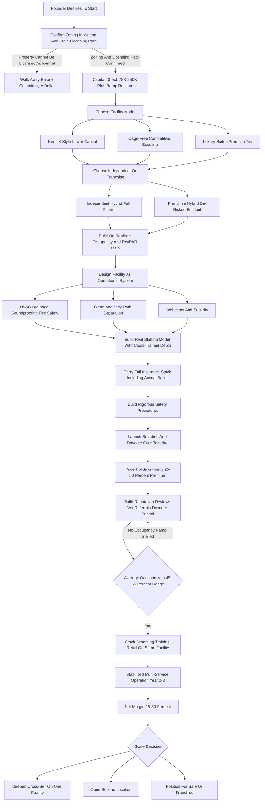
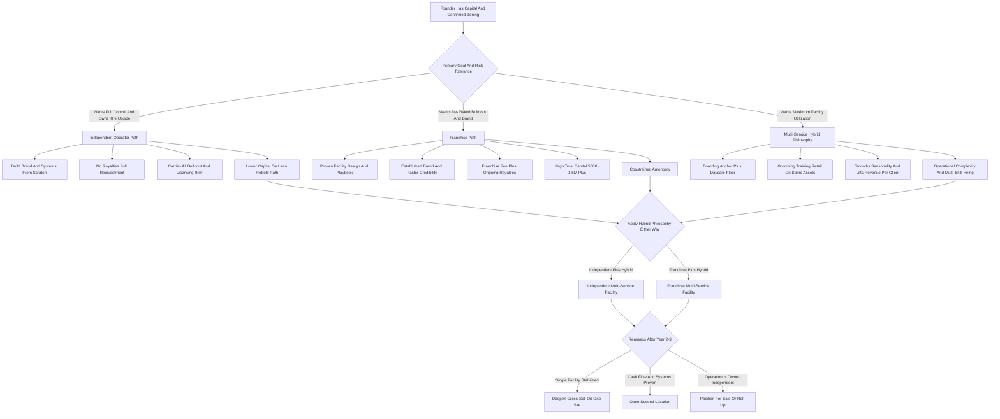

**TL;DR:** To start a dog boarding business in 2027, you build or lease a facility that houses dogs overnight while their owners travel, charging $40-$120 per dog per night, and you turn that base into a multi-revenue operation by stacking daycare, grooming, training, and retail on top of the same building, the same staff, and the same client list. The model is **real, demand-durable, and genuinely profitable -- but it is a real-estate, zoning, licensing, and labor business wearing a dog costume**, and the entire economics rest on three numbers most beginners never calculate: **occupancy rate** (the percentage of your kennel capacity actually filled, averaged across a wildly seasonal year), **revenue per available run per night** (RevPAR-style thinking borrowed from hotels -- what each dog run earns whether or not it is occupied), and **labor cost as a percentage of revenue** (the single largest operating expense, structurally 35-50% because dogs need care every hour of every day including holidays). The honest 2027 economics: a single facility with 20-50 dogs of capacity costs **$75K-$500K+ to open** depending on whether you lease and lightly retrofit an existing kennel or build a cage-free climate-controlled facility from the ground up, runs at a **15-30% net margin** once stabilized, and in a disciplined Year 1 generates **$150K-$450K in revenue** -- with a brutal concentration in the holiday and summer-vacation peaks, where Thanksgiving-through-New-Year alone can be 30-50% of annual revenue. By Year 2-3 a well-run operation reaches **$450K-$1.2M** by opening a second location or maturing the daycare-grooming-training cross-sell, at which point the founder chooses between staying a lean single-facility operator, scaling a small regional group, or buying into a franchise system (Dogtopia, Camp Bow Wow, K9 Resorts) that trades equity and royalties for a proven buildout and brand. The three things that kill dog boarding startups: **(a) signing a lease or buying land before confirming zoning and the state pet-care-facility license** -- the number-one fatal mistake, because kennels are a restricted land use almost everywhere; **(b) underestimating labor and never escaping the 24/7/365 staffing trap**, where the founder personally covers every holiday and burns out; and **(c) building a beautiful facility with no occupancy strategy** -- a 40-run kennel running at 25% average occupancy loses money no matter how nice the suites are. Net: viable and rewarding in 2027 as a disciplined, occupancy-obsessed, cross-sell-driven operation built on zoning certainty, a real staffing model, and a reputation that survives a single bad incident -- and a poor fit for anyone who wants light work, a clean schedule, fast payback, or a business without real estate, employees, and the permanent weight of being responsible for living animals.

## What A Dog Boarding Business Actually Is In 2027

A dog boarding business provides overnight care for dogs while their owners are away -- traveling for vacation, business, weddings, medical procedures, military deployment, home renovations, or family emergencies. You are not a groomer, not a vet, and not a dog walker; you are the operator of a facility that takes physical custody of someone's dog, feeds it, exercises it, monitors its health and behavior, and returns it safe, clean, and ideally happier than it arrived. The core transaction is simple -- a night of care for a price -- but the business underneath it is anything but. In 2027 the dog boarding business is shaped by a handful of realities that did not all exist a decade ago: pet owners increasingly treat dogs as family and expect a facility that looks and feels like a hotel, not a concrete kennel; the cage-free and climate-controlled model has moved from luxury differentiator to baseline expectation in competitive metros; clients want webcams, daily report cards, and digital booking; labor is more expensive and far harder to retain, which makes staffing the central operational problem; and the business has consolidated, with franchise systems and private-equity-backed groups setting the professional standard at the top of most markets. The dog boarding business is not passive and it is not trendy. It is a real-estate-and-labor business with an animal-welfare core, a brutal holiday-and-summer seasonality, and a 24/7/365 operating clock that never stops -- and the founders who succeed understand that the dogs are the customers' beloved family members, but the business is a building, a license, a payroll, an occupancy spreadsheet, and a reputation that one bad night can destroy.

## The Facility Models: Kennel-Style, Cage-Free, And Luxury Suite

The single most consequential early decision is what kind of facility you build, because it determines your capital, your capacity, your pricing power, and your labor model. **Kennel-style** is the traditional format -- individual runs or kennels, each dog in its own space, group play offered as an add-on or scheduled activity. It is the lowest-capital format, the easiest to retrofit into an existing building, and it still serves a large, price-sensitive segment of the market well; its limitation is that it competes increasingly on price because it reads as "the old way" to a family that wants their dog to have a good time. **Cage-free** is the format that defined the last decade of growth -- dogs are grouped by temperament and size into supervised play groups during the day and sleep in shared or semi-private quarters, with the selling point being that the dog is socializing and playing rather than sitting in a run. Cage-free commands higher prices, drives the daycare cross-sell naturally, and is what most competitive 2027 buildouts default to; its cost is far higher labor intensity, because supervised group play requires staff in the room at a strict dog-to-human ratio at all times. **Luxury suite** is the premium tier -- private rooms instead of runs, often with raised beds, televisions, webcam access for the owner, premium bedding, and individualized attention -- layered on top of either a kennel or cage-free base. Luxury suites command the highest per-night rates ($80-$200+) and the best margins per dog, but they consume the most square footage per dog and require a market with the income to support them. Most successful 2027 operators do not pick one purely -- they build a tiered facility: a cage-free core that drives volume and the daycare cross-sell, a set of private and luxury suites that lift the average ticket, and possibly a quiet kennel section for dogs that genuinely do not do group play. The mistake is building a single undifferentiated format and either leaving premium revenue on the table or pricing out the volume segment.

## The Three Business Models: Independent, Franchise, And Multi-Service Hybrid

Beyond the physical format, there are three distinct ways to structure the business itself. **The independent operator model** -- you build, brand, and run your own facility with full control over pricing, design, culture, and reinvestment. Its advantage is total ownership of the upside, no royalties, and the freedom to build exactly the operation you want; its challenge is that you build every system from scratch -- the booking software choice, the operating procedures, the marketing, the brand -- and you carry all the risk of the buildout and the licensing. **The franchise model** -- you buy into an established system like Dogtopia, Camp Bow Wow, or K9 Resorts, paying a franchise fee plus ongoing royalties (typically a percentage of revenue) in exchange for a proven facility design, established brand recognition, a tested operating playbook, training, and supply relationships. Its advantage is a de-risked buildout and faster credibility with customers; its challenge is high total capital (franchise buildouts frequently run $500K-$1.5M+ all-in), ongoing royalty drag on margin, and constrained autonomy. **The multi-service hybrid model** -- whether independent or franchised, this is the operating philosophy that wins in 2027: boarding is the anchor, but the facility, staff, and client list are leveraged across daycare, grooming, training, and retail, so the same building generates four or five revenue streams instead of one. Its advantage is dramatically better facility utilization, higher revenue per client, and resilience when any single line is soft; its challenge is operational complexity and the need to hire or develop genuine expertise in each added service. The strategic reality: nearly every durable 2027 operator runs the hybrid philosophy, and the real choice is independent-hybrid versus franchise-hybrid -- the pure single-service boarding kennel is the format most exposed to seasonality and price competition.

## The 2027 Market Reality: Demand, Competition, And What Changed

A founder needs an accurate read of the 2027 landscape, because the business is neither the recession-proof goldmine some claim nor a saturated dead end. **Demand is structurally healthy and growing.** The US dog population sits near 89-90 million, US pet-care spending crossed $150 billion, and the long-term trend of pet humanization -- owners treating dogs as family and spending accordingly -- is durable. Travel rebounded and normalized, dual-income households generate steady boarding need, and the willingness to pay for quality care rose meaningfully. **The competition is bifurcated and consolidating.** At the top of most metros sit franchise systems and private-equity-backed groups -- Dogtopia (290+ units, NorthStar-backed), Camp Bow Wow (200+ units, owned by Mars's VCA division since 2014), K9 Resorts (50+ units), PetSuites (35+ units, Mars Veterinary), Best Friends Pet Care (Petco-owned) -- setting a professional, branded standard. Below them is a long tail of independent kennels, in-home boarders, and side hustlers, plus the marketplace layer of Rover (NASDAQ: ROVR) and Wag! (NASDAQ: PET) connecting owners to in-home sitters. **What changed by 2027:** the cage-free, climate-controlled, hotel-style facility became the competitive baseline rather than the differentiator; webcams, digital booking, and daily report cards became table stakes; the marketplace platforms (Rover, Wag!) reshaped the low end by making in-home boarding easy to find and book, pressuring price-only kennels; labor cost and scarcity became the central operational constraint; and the multi-service model -- boarding plus daycare plus grooming plus training -- became the standard rather than the exception. The net market reality: demand is real and durable, the bar for facility quality rose, the marketplaces own the budget end, and the winning 2027 entrant competes on facility quality, the cross-sell, reliability, and reputation rather than on being the cheapest kennel in town.

## The Core Unit Economics: Occupancy, RevPAR, And The Capacity Math

This is the most important section in the guide, because the entire business lives or dies on metrics beginners almost never run. A dog boarding facility is, financially, a hotel for dogs -- and like a hotel, it has a **fixed capacity** (the number of runs, suites, or cage-free sleeping spots) and a **highly variable occupancy** (the percentage of that capacity actually filled). The fatal beginner error is thinking in terms of a full-house holiday weekend and ignoring the slow Tuesday in February. Run the math concretely. A facility with **40 runs** charging an average of **$65 per dog per night** is, at 100% occupancy, generating $2,600 per night -- but no boarding facility runs at 100% average occupancy. A realistic stabilized average occupancy across a full seasonal year is roughly **45-65%**, which means that 40-run facility actually generates somewhere around **$1,170-$1,690 per night on average**, or roughly **$427K-$617K annually** from boarding alone before the cross-sell. The metric that captures this is **revenue per available run per night** -- total boarding revenue divided by (runs x nights) -- which forces the founder to think about every run's earning power whether or not it is occupied, exactly as hotels think about RevPAR. The second metric is the **seasonality curve**: occupancy is not flat. The Thanksgiving-to-New-Year holiday window and the summer-vacation months run near or at capacity, while January-February and other shoulder periods can drop to 20-35%. This means the peaks must be priced firmly (holiday premiums of 25-50% are standard and correct) and the troughs must be filled with daycare, with discounted long-stay boarding, and with off-peak promotions. The third metric is **labor as a percentage of revenue**, which is structurally 35-50% because a facility full of living animals needs care every hour -- feeding, cleaning, exercising, monitoring, overnight coverage -- on Christmas Day exactly as much as on a normal Tuesday. The discipline this imposes: before signing a lease, model realistic average occupancy, not peak occupancy; price the peaks to carry the troughs; build the cross-sell specifically to fill the shoulder months; and staff to a labor model that survives 24/7/365 without the founder personally covering every holiday. A founder who builds by occupancy and RevPAR builds a facility that pencils; a founder who builds by counting holiday-weekend full houses builds a beautiful kennel that loses money ten months a year.

## Pricing Architecture: Boarding, Add-Ons, And Holiday Premiums

Pricing in dog boarding has multiple layers, and a founder must get all of them right because the headline per-night rate is only part of the revenue per dog. The **base overnight rate** is anchored to the facility tier and the local market -- a standard run or cage-free spot runs $40-$80 per night in most markets, while a private or luxury suite with webcam and premium amenities runs $80-$200+. **Multi-dog discounts** (15-25% off the second dog from the same household) win the family booking. **Holiday and peak premiums** of 25-50% are standard, correct, and essential -- the holiday weeks are when demand vastly exceeds supply, and pricing them firmly is how the peak funds the trough. **Long-stay discounts** of 10-20% for stays of seven nights or more fill capacity efficiently and reduce per-night labor intensity. Then the **add-on stack**, which is where boarding revenue per dog can grow 30-60%: a **daycare add-on during boarding** ($25-$50/day) for structured play; **grooming** -- a bath, nail trim, or full groom at checkout ($25-$150) so the dog goes home clean; **training during boarding** ($50-$150 for board-and-train sessions) so the owner returns to a better-behaved dog; **enrichment add-ons** -- one-on-one play sessions, extra walks, puzzle feeders, bedtime treats, "tuck-in" services; and **retail** -- selling the food, treats, and supplies the dog needs anyway. The pricing discipline: set the base rate to the facility tier and market, build a clear and richly priced holiday-premium calendar, use multi-dog and long-stay discounts to win volume bookings, and treat the add-on stack as deliberate revenue architecture rather than afterthoughts -- because the difference between a $65 boarding night and a $65 night plus a $35 daycare add-on plus an $80 exit groom is the difference between a thin-margin facility and a healthy one.

The pricing table below shows a representative 2027 structure for a mid-market facility:

| Service | Typical 2027 Price | Notes |
|---|---|---|
| Standard overnight (run / cage-free) | $40-$80/night | Base rate, market-dependent |
| Luxury suite (private + webcam) | $80-$200/night | Highest margin per dog |
| Multi-dog discount | 15-25% off 2nd dog | Wins the family booking |
| Holiday / peak premium | +25-50% | Essential -- peak funds the trough |
| Long-stay discount (7+ nights) | 10-20% off | Fills capacity, cuts per-night labor |
| Daycare add-on during boarding | $25-$50/day | Structured play, drives the cross-sell |
| Bath at checkout | $25-$80 | Dog goes home clean |
| Full groom add-on | $40-$150 | Higher-ticket exit service |
| Board-and-train session | $50-$150 | Owner returns to a better-behaved dog |
| Enrichment / one-on-one play | $10-$30 each | Easy, high-margin add-on |

## Zoning, Licensing, And The Number-One Fatal Mistake

This section exists because the single most common way founders destroy capital in this business is signing a lease or buying land before confirming the property can legally operate as a kennel -- and a founder who reads nothing else should read this. **A dog boarding facility is a restricted land use almost everywhere.** Kennels generate noise, odor, traffic, and waste, and municipalities regulate them tightly. Before any property is committed, the founder must confirm: that the zoning designation permits a commercial kennel or boarding use (often this requires a specific zoning category, a conditional use permit, or a special exception, and sometimes a public hearing with neighbors who can object); that the property meets any setback, acreage, or buffer requirements from residential properties; and that no covenants, deed restrictions, or HOA rules prohibit the use. **The state pet-care-facility license** is the second non-negotiable -- most states require a kennel, boarding, or animal-care-facility license, with requirements covering ventilation, drainage, square footage per animal, fire safety, sanitation, staffing, and inspection; some jurisdictions add county or city licenses on top. **Other approvals** include the general business license, an occupancy permit reflecting the kennel use, building permits for any construction, and sometimes USDA registration depending on the activities. The fatal pattern is consistent: an excited founder finds a perfect building, signs a lease or closes on the land, and only then discovers the zoning does not permit a kennel or that the conditional use permit will be denied -- and now there is a lease payment on a building that cannot legally do the business. The discipline is absolute: **confirm zoning in writing from the municipality and confirm the state licensing path before committing a dollar to a property**, ideally with a zoning attorney or land-use consultant, and write zoning-and-licensing contingencies into any lease or purchase agreement. The buildout, the staffing, and the marketing are all solvable problems; a building that cannot be legally licensed as a kennel is not.

## Facility Buildout, Layout, And Equipment

Once zoning and licensing are confirmed, the facility itself must be designed as an operational system, not just a nice space. **The core spaces** a boarding facility needs: the boarding area itself -- runs, suites, or cage-free sleeping quarters -- designed for the capacity and tiering chosen; indoor and outdoor **play and exercise areas**, ideally climate-controlled indoor space so weather never shuts down operations, with separate areas for size and temperament groups; a **lobby and check-in area** that makes the first impression and handles the holiday-rush traffic; **grooming space** if grooming is part of the model; **food prep and storage**, a **laundry** for the constant bedding and towel washing, and **isolation or medical space** for dogs that fall ill or arrive with issues; **staff areas** and overnight accommodation if a staff member sleeps on-site; and adequate **parking** for the peak. **The critical building systems** are where buildout budgets are won or lost: **drainage and flooring** must handle constant cleaning and be sealed, sloped, and sanitary; **ventilation and HVAC** must control odor, temperature, and air quality at a level a home system never contemplates -- this is a major and frequently underestimated cost; **soundproofing and acoustic treatment** controls the barking that drives both neighbor complaints and staff fatigue; **fire safety and sprinklers** are typically code-required; and **security and webcam systems** are both an operational tool and a 2027 customer expectation. **Equipment** includes kennel runs and suite fixtures, raised beds and bedding, gates and fencing for play yards, cleaning and sanitation equipment, food storage, laundry equipment, grooming equipment if applicable, and the webcam and camera infrastructure. The buildout cost spread is enormous and entirely driven by these choices: a light retrofit of an existing kennel building with good bones can run $75K-$200K, while a full ground-up cage-free climate-controlled facility -- or a franchise buildout to brand standard -- runs $300K-$1.5M+. The discipline: design the layout for efficient workflow (clean separation of clean and dirty paths, short staff travel distances, sightlines for supervision), do not underbudget HVAC, drainage, and soundproofing, and let the facility tier match the market the founder actually has.

## Staffing And The 24/7/365 Labor Problem

Labor is the largest operating cost and the hardest operational problem in dog boarding, and a founder who does not solve the staffing model will either burn out personally or run an unsafe facility. **The work never stops.** A facility full of living animals needs feeding, cleaning, exercise, monitoring, and overnight presence every single day -- including every holiday, which is precisely when the facility is fullest. This is not a business that closes for Christmas; Christmas is peak. **The core roles**: kennel technicians or attendants who do the feeding, cleaning, and direct dog care; play-group supervisors who must maintain strict dog-to-human ratios in cage-free settings (a real, non-negotiable safety requirement); overnight staff or an on-site caretaker for nighttime monitoring; a front-desk and customer-service team that carries the booking and check-in load, brutal during holiday rushes; groomers and trainers if those services are offered; and a facility manager as the operation grows. **The staffing challenges are structural**: the work is physically demanding and emotionally weighty, wages in the industry are not high which makes retention hard, the schedule includes early mornings, weekends, overnights, and holidays, and turnover is a constant drain. **The founder's trap** is personally covering every gap -- every holiday, every call-out, every overnight -- until burnout. The disciplined response: build a real staffing model from the start with enough cross-trained people that no single absence breaks the schedule, pay and treat staff well enough to retain them because turnover is more expensive than wages, document procedures so a new hire can be productive quickly, and explicitly plan holiday staffing -- with premium pay and advance scheduling -- because the holidays are simultaneously the revenue peak and the staffing crisis. Labor will run 35-50% of revenue; the founders who fail either understaff into an unsafe or low-quality operation, or never build past themselves and quit from exhaustion within two years.

## Insurance, Liability, And Animal-Care Risk

Dog boarding takes physical custody of living animals that can be injured, fall ill, escape, or die in your care -- and that custody is the central risk of the business, managed deliberately or it ends the business. **The liability scenarios are real and varied**: a dog injured in a play-group altercation, a dog that escapes the facility, a dog that falls ill or has a medical emergency overnight, a dog that dies of an undetected condition or heat or stress, a contagious illness (kennel cough, canine influenza, parvo) spreading through the facility, a staff member or visitor bitten, a slip-and-fall in the lobby, property damage. **The insurance stack** a 2027 facility carries: **general liability**; **animal bailee coverage** -- the specific and essential coverage for animals in your care, custody, and control, which standard general liability typically excludes; **professional liability** for the care decisions made; **commercial property** for the building, buildout, and equipment; **commercial auto** if the business transports dogs; **workers' compensation** for the staff doing physically risky work; and an **umbrella policy** over the top. **Beyond insurance, the operational risk controls** matter as much: a thorough intake process with vaccination requirements (rabies, distemper, bordetella at minimum), a temperament evaluation before any dog joins group play, strict dog-to-human ratios in cage-free settings, secure double-gated entry and escape-proof fencing, a clear emergency and veterinary protocol with an established relationship with a local vet and an after-hours emergency clinic, isolation space and a sick-dog protocol, detailed incident documentation, and a clear, thorough boarding contract that sets expectations and allocates responsibility. **Reputation is the uninsurable asset.** A single dog death, escape, or serious injury -- fairly or not -- can spread through a local community and online reviews fast enough to end a facility, regardless of insurance. The discipline: carry the full and correct insurance stack including animal bailee coverage, build the operational risk controls as core procedures rather than afterthoughts, and treat every dog as if its safe return is the only thing that matters -- because to the customer, and to the survival of the business, it is.

## The Daycare Cross-Sell: Filling The Trough

Doggy daycare is the single most important add-on to a boarding business, and a founder should understand why it is strategic rather than incidental. **Daycare solves the seasonality problem.** Boarding revenue is violently seasonal -- peaks at the holidays and in summer, troughs in the shoulder months. Daycare revenue is the opposite: it is steady, recurring, weekday-concentrated, and largely counter-cyclical, generated by working dog-owners who drop their dog off in the morning and pick it up at night, week in and week out, regardless of the travel calendar. A boarding facility that adds daycare uses the same building, the same play yards, the same staff, and the same client list to generate a smooth recurring revenue stream that fills the exact months boarding is weak. **Daycare also feeds the boarding funnel.** A dog that comes to daycare regularly is already temperament-evaluated, already comfortable in the facility, already known to the staff -- and its owner is the easiest possible boarding customer to convert when they travel, because the trust is already built. **The daycare model**: pricing runs day rates ($25-$45) and discounted multi-day packages and monthly memberships that lock in recurring revenue; the operational requirements are the supervised play groups, the staff ratios, and the temperament screening that cage-free boarding already requires, so the marginal operational lift for a cage-free facility is modest. The discipline: treat daycare not as a side service but as the structural counterweight to boarding seasonality and the top of the boarding-customer funnel -- a facility that does boarding alone rides the seasonal rollercoaster, while a facility that does boarding plus daycare has a recurring revenue floor and a built-in pipeline of pre-qualified boarding customers.

## Grooming, Training, And Retail: Stacking The Revenue

Beyond daycare, the multi-service model layers grooming, training, and retail onto the same facility, and a founder should understand the economics of each. **Grooming** is a natural and high-margin add-on -- the dog is already at the facility, the owner already wants it to come home clean, and a bath, nail trim, or full groom at checkout is an easy yes. Grooming can be offered as a boarding add-on, as a standalone service for the daycare and local client base, or both; it requires a groomer (employed or commission-based) and dedicated grooming space, and it generates strong per-service revenue with high margins. **Training** is the highest-expertise add-on -- board-and-train programs (the dog stays and is trained intensively), group classes, and private sessions -- and it commands premium pricing because skilled training is genuinely valuable and not commoditized. Training requires a qualified trainer and credibility, but it deepens the client relationship more than any other service and the board-and-train format pairs perfectly with the boarding base. **Retail** is the lowest-effort add-on -- selling the food, treats, supplements, toys, and supplies the customer's dog needs anyway -- generating incremental margin from the existing foot traffic with minimal operational complexity, especially the recurring food sales that bring clients back monthly. **The strategic logic of stacking**: each added service uses the same fixed assets -- the building, the location, the brand, the client list -- so the marginal cost of an additional revenue stream is far lower than starting it standalone, and each service makes the others stickier (the daycare client grooms there, the boarding client trains there, the training client buys food there). The discipline: do not try to launch all five services on day one -- start with the boarding-and-daycare core, add grooming once the base is stable, layer training when the right trainer is available, and run retail alongside throughout -- but design the facility and the business plan from the start for the full stack, because the single-service boarding kennel is the most fragile version of this business.

## Software, Booking, And Operations Systems

In 2027 a dog boarding facility runs on purpose-built software, and a founder should choose the stack early because the operation is too complex and date-sensitive to run on a paper calendar. **Pet-care facility management software** -- platforms built specifically for boarding, daycare, and grooming operations -- is the central system: it manages reservations and prevents overbooking against capacity, holds the client and pet records (vaccinations, temperament notes, feeding instructions, medications, emergency contacts), handles online booking and the customer portal, processes payments and deposits, manages the daycare check-in and check-out flow, runs the report cards and photo updates customers expect, and consolidates reporting on occupancy and revenue. This is the first serious software purchase and the one a facility cannot run without past a handful of dogs. **The booking experience matters commercially** -- 2027 customers expect to book online, see availability, manage their pet's profile, and receive digital report cards and photos; a facility still taking bookings by phone with a paper ledger loses customers to the one that does not. **The webcam system** -- letting owners watch their dog -- is both an operational tool and a marketing and trust asset that the software often integrates. **Operational systems beyond software**: documented procedures for intake, feeding, cleaning, play-group management, emergency response, and the post-stay handoff; checklists that make a new hire productive quickly; and the occupancy and revenue dashboards that let the founder manage the RevPAR and seasonality math rather than guess at it. The discipline: adopt the facility-management platform early, build the online booking and report-card experience to 2027 customer expectations, integrate the webcams, and document the operating procedures -- because a boarding facility is a high-volume, high-stakes, date-and-capacity-constrained operation, and the software and systems are what let a normal-sized team run it without dropping a reservation or losing track of a dog's medication.

## Startup Cost Breakdown: The Honest All-In Number

A founder needs a clear-eyed total of what it costs to open, because the range is enormous and under-capitalization is a top killer. The all-in startup cost breaks down as: **facility -- lease deposit and buildout, or land and construction** -- the largest and most variable line by far, from $50K-$150K for a light retrofit of an existing kennel building with good bones, to $250K-$1M+ for a ground-up cage-free climate-controlled facility or a franchise buildout to brand standard; **franchise fee**, if franchising, typically $40K-$70K on top of the buildout; **building systems** -- HVAC and ventilation, drainage and sealed flooring, soundproofing, fire safety -- often $30K-$200K+ and frequently underbudgeted; **kennel and play-yard equipment** -- runs, suite fixtures, beds, gates, fencing -- $15K-$100K; **grooming and other service equipment** if applicable, $5K-$30K; **webcam, camera, and security systems** $5K-$25K; **facility management software** -- setup and first months -- modest, a few hundred to low thousands; **insurance** -- general liability, animal bailee, property, workers' comp, first payments -- $3K-$15K to start; **licensing and permits** -- state pet-care-facility license, business license, occupancy and building permits, zoning application and any conditional-use-permit costs -- $1K-$10K plus professional fees; **legal and professional** -- entity formation, zoning attorney or land-use consultant, contract templates -- $2K-$15K; **initial marketing and website** -- a professional site with online booking, photography of the facility -- $3K-$15K; **initial staffing and pre-opening payroll** -- hiring and training the team before revenue starts -- $10K-$40K; and a **working capital and ramp-up reserve** -- the buffer that covers fixed costs through the occupancy ramp and the first slow season -- a meaningful $30K-$100K+. Totaled, a lean independent retrofit launch can come in around **$75K-$250K**, a fuller independent ground-up build runs **$300K-$700K**, and a franchise buildout frequently runs **$500K-$1.5M+** all-in. The capital requirement is the single biggest filter on who should start this business: financing through SBA loans, equipment financing, and real-estate financing is common and appropriate for the building and equipment lines, but the founder must still hold real cash for the ramp-up reserve, because a new facility takes months to build occupancy and the first slow season arrives before the client base is deep.

The startup cost ranges below show the three launch paths side by side:

| Cost Line | Lean Retrofit | Ground-Up Independent | Franchise Buildout |
|---|---|---|---|
| Facility (lease/buildout or land/construction) | $50K-$150K | $250K-$600K | $300K-$1M+ |
| Franchise fee | -- | -- | $40K-$70K |
| Building systems (HVAC, drainage, sound, fire) | $20K-$60K | $50K-$150K | included in buildout |
| Kennel & play-yard equipment | $15K-$40K | $30K-$80K | $30K-$100K |
| Webcam, camera, security | $5K-$15K | $10K-$25K | $10K-$25K |
| Insurance (GL, animal bailee, property, WC) | $3K-$8K | $5K-$12K | $5K-$15K |
| Licensing, permits, zoning | $1K-$5K | $3K-$10K | $3K-$10K |
| Legal & professional | $2K-$8K | $5K-$15K | $5K-$15K |
| Marketing & website | $3K-$8K | $5K-$15K | included or $5K-$15K |
| Pre-opening staffing & payroll | $10K-$25K | $20K-$40K | $20K-$50K |
| Working capital / ramp reserve | $30K-$60K | $50K-$100K+ | $75K-$150K+ |
| **Approximate all-in total** | **$75K-$250K** | **$300K-$700K** | **$500K-$1.5M+** |

## The Year-One Operating Reality

A founder should walk into Year 1 with accurate expectations, because the gap between the marketed version and the real version of this business is where most quitting happens. Year 1 is **occupancy-building and systems-shaking-out mode, not profit-extraction mode.** A new facility opens at low occupancy and ramps over months -- the client base does not exist yet, the reputation is unbuilt, and the temperament-evaluation pipeline that feeds safe group play is just starting. The first year is spent learning the real occupancy curve of the local market, discovering the true labor cost of 24/7/365 coverage, building the daycare base that will smooth the seasonality, establishing the vet relationship and the emergency protocols, and finding out where the facility and the procedures are fragile -- the holiday rush that overwhelmed the front desk, the play-group incident that tested the insurance, the staff turnover that broke the schedule. A disciplined Year 1 single-facility operation can realistically generate **$150K-$450K in revenue** -- the wide range driven by facility size, market, how fast occupancy ramps, and how quickly the cross-sell comes online -- against a thin or even negative net in the first months as the operation absorbs the buildout, the pre-opening costs, and the slow ramp. The first holiday season is both the revenue test and the operational test: a founder who staffed and priced the holidays well captures the peak that funds the year; one who did not gets overwhelmed. Year 1 is also when the founder discovers whether the occupancy assumptions were right -- a facility built on peak-weekend math instead of realistic average-occupancy math shows the gap fast. The work is genuinely hands-on and weighty: the founder is in the facility, covering shifts, making the care decisions, carrying the responsibility for living animals. The founders who succeed treat Year 1 as paid tuition in a real-estate-and-labor-and-animal-welfare business; the ones who fail expected a passive pet business and were unprepared for the building, the payroll, the holidays, and the permanent weight of custody.

## The Five-Year Revenue Trajectory

Mapping a realistic five-year arc helps a founder size the opportunity honestly. **Year 1:** facility opens, occupancy ramps, systems shake out, $150K-$450K revenue, thin-to-negative net as the buildout and ramp are absorbed, founder hands-on and covering shifts. **Year 2:** occupancy stabilizes toward the 45-65% average range, the daycare base builds into a recurring floor, grooming and the add-on stack come online, the staffing model matures; revenue climbs to roughly **$350K-$700K** with the net turning clearly positive into the 15-25% range as occupancy and the cross-sell mature. **Year 3:** the operation is a real business with a system -- a stable client base, a functioning staffing model, the full multi-service stack running; revenue lands around **$450K-$1.2M** -- the top of that range typically reflecting a second location or a notably strong single facility -- with net margin in the 15-30% range, and the founder managing rather than covering every shift. **Year 4:** continued maturation, possible second-location buildout or daycare-membership expansion, stronger off-peak programming; revenue roughly **$700K-$1.8M** depending on whether a second site is open. **Year 5:** a mature operation -- a strong single facility running $600K-$1.2M, or a two-to-three-location group running $1.5M-$3M+ -- with the founder deciding whether to stay a lean single-facility operator, scale a regional group, pursue or expand a franchise relationship, or position for sale. These numbers assume disciplined occupancy-based planning, a real staffing model that survives the 24/7/365 clock, a functioning cross-sell that smooths seasonality, and a clean safety record; they do not assume exponential growth, because dog boarding scales with facility capacity, occupancy, and the number of locations, not magically. A mature dog boarding business is a real small business with real estate, a payroll, a brand, and a balance sheet -- a genuinely good outcome, but earned through years of operational and animal-welfare discipline.

The five-year trajectory below assumes a disciplined single-facility operator with a maturing cross-sell:

| Year | Revenue Range | Net Margin | Operating Reality |
|---|---|---|---|
| Year 1 | $150K-$450K | Thin to negative | Occupancy ramp, founder covering shifts, systems shake out |
| Year 2 | $350K-$700K | 15-25% | Occupancy stabilizes, daycare base builds, staffing matures |
| Year 3 | $450K-$1.2M | 15-30% | Full multi-service stack, founder managing not covering |
| Year 4 | $700K-$1.8M | 15-30% | Possible 2nd location, off-peak programming matures |
| Year 5 | $600K-$3M+ | 15-30% | Mature single facility or 2-3 location group |

## Five Named Real-World Operating Scenarios

Concrete scenarios make the model tangible. **Scenario one -- Priya, the disciplined retrofit operator:** finds an existing kennel building with good bones and confirmed zoning, retrofits it cage-free for $190K all-in including a real ramp reserve, opens with boarding and daycare from day one, prices holidays firmly at a 40% premium, and builds the temperament-evaluation pipeline deliberately; her occupancy ramps to a 58% average by Year 2, the daycare floor smooths her shoulder months, and she reaches $620K revenue at a 24% net by Year 3 because she built on realistic occupancy math and the cross-sell was in the plan from the start. **Scenario two -- the cautionary tale, Brandon:** falls in love with a property and signs a five-year lease before confirming zoning, then discovers the parcel requires a conditional use permit that the planning commission denies after a neighbor objection over noise; he is now carrying lease payments on a building that cannot legally be a kennel, and the business never opens -- the canonical number-one fatal mistake. **Scenario three -- the Okafor family, the franchise route:** buys into an established boarding-and-daycare franchise, pays a $55K franchise fee and builds to brand standard for $850K all-in with SBA and equipment financing, and trades royalty drag and constrained autonomy for a proven facility design, a tested playbook, and faster customer credibility; they ramp faster than an independent would, hit $900K revenue by Year 3, but run a tighter net because of the royalty and the debt service. **Scenario four -- Marisol, the multi-service maximizer:** opens a cage-free facility and then deliberately stacks the revenue -- daycare from day one, grooming added in month eight, board-and-train launched in Year 2 when she finds the right trainer, retail running throughout -- so that by Year 3 boarding is only 55% of her revenue and the facility is far more resilient and far less seasonal than a boarding-only kennel; she reaches $780K at a 27% net. **Scenario five -- Derek, the labor-trap casualty:** builds a solid facility but never builds past himself on staffing -- he personally covers every overnight, every holiday, every call-out -- and by the middle of Year 2, after eighteen months of no real time off and a near-miss incident on a night he was exhausted, he burns out and sells the facility at a discount; the canonical illustration of the 24/7/365 staffing trap. These five span the realistic distribution: disciplined retrofit success, the zoning wipeout, the franchise tradeoff, the multi-service maximizer, and the labor-trap burnout.

## Lead Generation And Marketing

Dog boarding is a local, trust-and-reputation business, and a founder must understand that the lead-generation engine is reputation, local visibility, and the daycare funnel far more than broad advertising. **The daycare-to-boarding funnel** is the most valuable channel -- a regular daycare dog is temperament-evaluated, comfortable, and known, and its owner is the easiest boarding conversion there is, so the daycare base is itself a marketing engine. **Online reviews and reputation** are decisive -- prospective customers researching where to leave their beloved dog read reviews obsessively, and a strong, deep base of positive reviews is the single most powerful asset, while a cluster of negative ones is devastating; reputation management is a core function, not an afterthought. **Local search and the website** -- ranking for the local boarding and daycare searches, with a professional site that shows the facility, enables online booking, and conveys safety and quality -- converts the active-need searcher. **Veterinarian relationships** are a high-trust referral source -- vets are asked constantly where to board, and being the facility a respected local vet recommends is durable, qualified demand. **Other local referral sources**: groomers, dog trainers, pet stores, dog walkers, breeders, and rescue organizations form a referral web. **Social media** -- showing the dogs playing, the report cards, the facility, the staff who genuinely love the animals -- builds the trust and the emotional connection that converts, and is well-suited to the visual, heartwarming nature of the business. **Community presence** -- being visible at local pet events, partnering with rescues, sponsoring local activities -- builds the local brand. Paid advertising plays a supporting role, especially local search ads for the active-need customer, but the business is won on reputation, the daycare funnel, vet referrals, and a genuine local presence. The discipline: treat reputation management and the daycare funnel as core ongoing functions, build the vet and local-business referral web deliberately, and use social media to show the safety and the joy -- because a boarding facility with a thin reputation competes on price and fear, and one with a deep one has families who trust it with the thing they care about most.

## Risk Management Beyond Insurance

The dog boarding model carries specific risks beyond the insurable liability scenarios, and the 2027 operator manages each deliberately. **Reputation risk** is the largest and least insurable -- one dog death, escape, or serious injury, fairly attributed or not, can spread through a local community and online reviews fast enough to threaten the business; mitigated by rigorous safety procedures, transparent communication, deep operational discipline, and a review base strong enough to absorb a setback. **Disease-outbreak risk** -- kennel cough, canine influenza, parvo spreading through the facility -- is mitigated by strict vaccination requirements, intake screening, sanitation protocols, isolation space, and ventilation designed for air quality. **Staffing and burnout risk** -- the 24/7/365 clock breaking the founder or leaving the facility understaffed and unsafe -- is mitigated by a real staffing model with cross-trained depth, retention-focused pay and culture, and explicit holiday-staffing plans. **Seasonality risk** -- the shoulder-month occupancy troughs against the fixed costs of a building and a core staff -- is mitigated by the daycare floor, long-stay and off-peak promotions, and a ramp reserve that carries the first slow season. **Zoning and regulatory risk** -- not just at launch but ongoing, as a noise or odor complaint can trigger scrutiny of an existing operation -- is mitigated by good neighbor relations, soundproofing, odor control, and staying in clear compliance. **Concentration and capacity risk** -- a single facility is a single point of failure, and capacity is fixed -- is mitigated over time by a second location and by maximizing the cross-sell on the existing capacity. **Economic-sensitivity risk** -- boarding is somewhat discretionary and travel-linked, so a downturn or a travel disruption softens demand -- is mitigated by the recurring daycare base, which is far less discretionary than vacation boarding. The throughline: every major risk in dog boarding has a known mitigation built from procedures, insurance, staffing depth, the daycare counterweight, and neighbor and regulatory goodwill -- and the operators who fail are usually the ones who carried thin coverage, ran sloppy safety procedures, never escaped the labor trap, or ignored the seasonality and zoning risks they could see coming.

## Financing The Business

Because dog boarding is capital-intensive, a founder should understand the financing options that make the launch and the growth possible. **SBA loans** -- particularly the SBA 7(a) and 504 programs -- are a natural fit and widely used in this industry, because the business has real estate, equipment, and a buildout that lenders understand, and the SBA structure spreads a large capital need over a long term; the 504 program in particular is built for owner-occupied real estate and major equipment. **Real-estate financing** applies when the founder buys rather than leases the property -- a commercial mortgage on the building, sometimes combined with the SBA. **Equipment financing** covers the kennel runs, HVAC, grooming equipment, and other tangible assets, matching the payment to the earning life of the asset. **Franchise financing** -- franchise systems often have established lender relationships and financing programs that streamline funding a brand buildout. **Conventional commercial loans and lines of credit** fill in working capital and growth needs. **Seller financing** can apply when buying an existing boarding facility outright -- often a lower-risk entry, because the zoning is already proven, the facility exists, the license is in place, and there is an existing client base and cash flow. **Investor capital** is sometimes used for larger or multi-location plays. The financing discipline: it is reasonable and normal to finance the building, the buildout, and the equipment because they are productive assets, and the SBA programs exist precisely for this kind of business -- but the founder must still hold real cash for the ramp-up reserve, because a new facility takes months to build occupancy and no lender covers the gap between opening day and a stabilized client base. The dangerous move is over-leveraging the buildout and skipping the reserve, then hitting the first slow season with debt service and fixed costs and no occupancy yet. Finance the assets, but never finance away the ramp cushion. And the single best risk-reducer in financing this business is the one structural advantage of buying an existing facility: the zoning and the license -- the two things that kill startups -- already exist.

## Taxes And Business Structure

A founder should set up the tax and legal structure deliberately, because the asset-heavy, custody-driven, employee-heavy nature of the business has specific implications. **Entity:** most boarding operators form an LLC or S-corp for liability protection and tax flexibility -- and given the genuine custody-and-injury liability of the business, the liability shield matters; the entity holds the lease or the property, the license, the insurance, the employment relationships, and signs the boarding contracts. **Real estate and depreciation** are central to the tax picture if the founder owns the property -- the building, the buildout, and major equipment are depreciable assets, and depreciation schedules plus any available accelerated or first-year expensing materially shape taxable income, especially in the heavy-capex opening years; a cost-segregation study on a buildout can be worth real money, and this is an area where a knowledgeable accountant earns the fee. **Payroll taxes and employment compliance** are a major and unavoidable function -- this is a real-employee business with overnight, weekend, and holiday labor, and payroll taxes, workers' comp, wage-and-hour compliance, and overtime rules must be handled correctly from day one, not discovered. **Sales tax** treatment of boarding, daycare, grooming, training, and especially retail varies by jurisdiction and must be set up correctly. **Equipment purchases, financing interest, lease or mortgage costs, insurance, utilities, software, and supplies** are all deductible business expenses a clean bookkeeping system captures. The discipline: separate business banking from day one, a bookkeeping system that tracks the real estate and equipment as assets and the multi-service revenue streams cleanly, a payroll system that handles the complex schedule and stays compliant, quarterly attention to sales and estimated taxes, and an accountant who understands real-estate-heavy, employee-heavy small businesses and can optimize the depreciation strategy. Skipping this does not save money -- it converts a manageable compliance function into a year-end scramble, a payroll-compliance exposure, and a missed depreciation opportunity that costs real cash.

## Owner Lifestyle: What Running This Business Actually Feels Like

A founder should know what daily life in this business is like before committing, because the lived reality is physical, emotionally weighty, and tied to a clock that never stops. In **Year 1**, running a lean operation, the founder is genuinely in the business -- covering kennel shifts, doing intakes and temperament evaluations, making the care decisions, managing the front desk during the holiday rush, covering the overnights and the holidays nobody else will, and carrying the weight of being responsible for living animals around the clock. It is physically demanding, emotionally absorbing, and tethered -- the facility cannot simply close, and the founder feels that. By **Year 2-3**, with a facility manager and a real staffing model, the founder's role shifts toward management -- overseeing the team, managing the occupancy and the cross-sell, building the vet and referral relationships, watching the numbers -- though the business is never truly hands-off the way some businesses become, and the founder is still pulled in for the holiday peaks and the hard incidents. By **Year 3-5**, with a mature team and possibly multiple locations, the founder can run a larger operation with a more managerial rhythm, but the permanent features remain: the 24/7/365 clock, the seasonality, the emotional weight of custody, and the knowledge that one bad incident can hurt the business. The emotional texture: there is real and deep satisfaction in a facility full of happy dogs, in being the place a community trusts, in a flawless holiday season, in a dog that arrives anxious and leaves comfortable; and real stress in the overnight emergency, the play-group incident, the sick dog, the staff call-out on Christmas, and the permanent low-grade weight of responsibility for animals that cannot speak for themselves. The income is real and can become substantial, but it is earned through physical, emotional, and around-the-clock work, not extracted passively. A founder who genuinely loves dogs, can carry the weight of their care, and is willing to run a real-estate-and-labor business will find it deeply rewarding; a founder who wanted a fun, light pet business will be exhausted and surprised.

## Common Year-One Mistakes That Kill The Business

A founder can avoid most failure modes simply by knowing them in advance, because the mistakes in this business are remarkably consistent. **Committing to a property before confirming zoning and the state license** -- the number-one fatal mistake, signing a lease or buying land only to discover the kennel use is not permitted. **Building on peak-occupancy math instead of realistic average-occupancy math** -- a facility sized and financed on the fantasy of full holiday weekends that loses money in the real 45-65% average. **Never escaping the 24/7/365 labor trap** -- the founder personally covering every shift, overnight, and holiday until burnout, the classic Year-2 quit. **Underbudgeting the building systems** -- skimping on HVAC, ventilation, drainage, and soundproofing, then living with odor, neighbor complaints, and a facility that does not pass inspection or please customers. **Carrying the wrong insurance** -- general liability without animal bailee coverage, leaving the central risk of the business -- animals in your care -- uninsured. **Sloppy safety procedures** -- weak temperament evaluation, loose play-group ratios, escapable fencing, no emergency protocol -- the path to the incident that ends the reputation. **Skipping the daycare cross-sell** -- running boarding alone and riding the full violence of the seasonality with no recurring floor. **Underpricing the holidays** -- failing to set firm 25-50% peak premiums, leaving on the table the revenue that funds the year. **Under-capitalization** -- launching with no ramp reserve and hitting the first slow season before the client base exists. **Ignoring neighbor and regulatory relations** -- generating noise and odor complaints that trigger scrutiny of the operation. **Neglecting online reputation** -- not building the deep review base that converts customers and absorbs a setback. **Trying to launch all five services on day one** -- spreading thin instead of nailing the boarding-and-daycare core first. Every one of these is avoidable; the founders who fail almost always made three or four of them, and the founders who succeed treated this list as a pre-launch checklist.

## A Decision Framework: Should You Actually Start This In 2027

A founder deciding whether to commit should run a structured self-assessment, because this model fits a specific person and badly misfits others. **Capital:** do you have $75K-$250K for a lean retrofit launch with a real ramp reserve, or access to SBA and equipment financing plus cash for the reserve -- and understand that a ground-up or franchise build runs far higher? If not, this is not your business yet -- it is genuinely capital-intensive. **Zoning reality:** are you willing to do the unglamorous, essential work of confirming zoning and the state licensing path in writing before committing to any property? If you would rather skip that and find a building you love first, you are set up for the number-one fatal mistake. **Labor and the clock:** are you prepared to run a 24/7/365 business with real employees, overnight and holiday coverage, and the discipline to build a staffing model rather than personally covering every gap? If you want a clean schedule, this is the wrong model. **Emotional weight:** can you carry the genuine responsibility of having physical custody of living animals -- the sick dog, the emergency, the incident -- and the knowledge that one bad night can hurt the business? If that weight is not something you can hold, this business will grind you down. **Operational discipline:** will you actually run the occupancy and RevPAR math before building, price the holidays firmly, build the daycare floor, carry the right insurance, and run rigorous safety procedures? Corner-cutters get wiped out -- by the slow season, the incident, or both. **Local market fit:** is there enough dog-owning, travel-prone, quality-willing demand in your service radius, and is the competitive landscape -- including the franchises and the marketplaces -- one you can find a real position in? If a founder answers yes across capital, zoning diligence, labor readiness, emotional capacity, operational discipline, and local market fit, a dog boarding business in 2027 is a legitimate and achievable path to a $450K-$1.2M+ small business at a 15-30% net. If they answer no on capital or operational discipline, they should not start yet. If they answer no on the labor clock or the emotional weight specifically, an adjacent, less custody-heavy pet business -- daycare-only, grooming, training, a Rover-style in-home model -- may fit far better. The framework's purpose is to convert a love of dogs into an honest, structured decision about the real-estate-and-labor-and-animal-welfare business underneath.

## Niche And Specialty Paths Worth Considering

Beyond the standard model, a founder should understand the specialty paths, because for some operators a focused niche is the better business. **Luxury and premium boarding** -- a high-end facility built entirely around private suites, individualized attention, webcams, and amenities, serving an affluent market at $120-$250+ per night with the best margins per dog, in a metro with the income to support it. **Cat boarding or multi-species** -- many dog facilities ignore cats entirely, and a dedicated cat boarding area -- quiet, separate, vertical, stress-controlled -- serves a real underserved demand with very different facility requirements. **Breed-specific or special-needs boarding** -- facilities specializing in large breeds, senior dogs, dogs with medical needs, or behaviorally challenging dogs that mainstream facilities turn away, commanding premium pricing for genuine expertise. **In-home or small-scale boarding** -- the Rover/Wag model or a licensed small in-home operation, far lower capital, no commercial buildout, but capped capacity and a different regulatory and lifestyle profile. **Daycare-led with boarding secondary** -- inverting the standard model to lead with the steady recurring daycare revenue and offer boarding as the add-on, smoothing the seasonality from the start. **Boarding-and-training specialty** -- building the whole brand around board-and-train programs, where the boarding is the vehicle for high-value training revenue. **Mobile or concierge pet care** -- pet sitting and overnight in-home care as a service business with minimal capital. The strategic point: the standard cage-free multi-service facility is the most common and resilient model, but the specialty paths can deliver higher margins, less competition, or lower capital for a founder with the right expertise or the right market read -- and many mature operators run a standard core with a specialty edge (the luxury suites, the cat wing, the board-and-train arm). The mistake is not choosing a focus; it is being undifferentiated in a market that increasingly has franchises, marketplaces, and specialists in it.

## Scaling Past The First Facility

The jump from a proven single facility to a multi-location operation is its own distinct challenge, and a founder should approach it deliberately. The prerequisites for scaling: the first facility must be genuinely stabilized -- occupancy in the healthy range, the staffing model working without the founder covering shifts, the cross-sell running, a clean safety record, and documented operating procedures that someone other than the founder can run; and the cash flow plus reserve must absorb a second buildout and a second ramp. The scaling levers: **open a second location** -- the most direct lever, ideally far enough from the first to not cannibalize but close enough to share management and brand; **deepen the cross-sell on the existing facility** -- often the highest-return move, since adding grooming, training, and a stronger daycare membership base to an existing building lifts revenue with no new buildout; **build the management layer** -- a facility manager per site and a regional structure, so the founder moves from operator to owner; **standardize the operating playbook** -- documented procedures, training systems, and brand standards that make each new location a repetition rather than a fresh experiment; and **consider the franchise question from the other side** -- a successful independent operator can eventually franchise their own concept, though that is a different business. The constraints on scaling: capital is the first (each location is a major buildout, solved by reinvested cash flow and SBA financing), founder attention and the management layer is the second, the staffing challenge multiplies with each site, and zoning and licensing must be solved fresh for every new location -- the number-one fatal mistake does not go away, it repeats. The strategic decision that arrives around a stabilized operation: deepen the cross-sell on one excellent facility, build a small regional group, pursue a franchise relationship, or position for sale. The founders who scale well share one trait -- they stabilized and systematized the first facility completely, so growth was the repetition of a proven, documented machine rather than a series of expensive, risky experiments.

## Exit Strategies And The Long-Term Picture

Dog boarding businesses can be exited, and a founder should build with the eventual exit in mind. **Sell the operating business** -- a boarding facility with stabilized occupancy, a clean safety record, a real staffing model that is not founder-dependent, the multi-service cross-sell running, established vet and referral relationships, a deep review base, and clean books is a genuinely saleable asset; valuations typically run as a multiple of stabilized earnings, with the multiple driven by the strength of the systems, how owner-independent the operation is, the safety record, and the durability of the client base and reputation. **Sell the real estate separately or together** -- if the founder owns the property, it is an asset with value independent of the operating business, and the real estate plus the business can be sold together or the property held and leased to a buyer. **Sell to a strategic acquirer** -- the consolidation in the industry means private-equity-backed groups and larger operators actively acquire well-run independent facilities, and a clean, systematized operation is exactly what they look for. **Acquire and roll up** -- a mature operator can grow by buying other facilities, and can position to be acquired by a regional or national consolidator. **Transition to family or a key employee** -- the systematized, manager-run operation makes an internal transition viable when a trained successor exists. **Convert or franchise** -- a strong independent concept can be franchised, or an independent can convert into a franchise. The honest long-term picture: dog boarding is a durable, real business -- the dog population and pet humanization are not going away, the demand is structural, and a well-run multi-service operation produces real owner profit for years -- but it is a business, not a passive holding; it demands ongoing capital for facility maintenance and reinvestment, ongoing management of staffing and safety, and the permanent operational weight of the 24/7/365 clock and animal custody. A founder should think of a 2027 launch as building a tangible, asset-backed small business with multiple genuine exit paths -- sale of the going concern, sale of the real estate, strategic acquisition, roll-up, internal transition, or franchise conversion -- and the founder who builds it systematized and owner-independent builds the version that is actually sellable.

## The 2027-2030 Outlook: Where This Model Is Heading

A founder committing capital should have a view on where the business goes next. Several trends are reasonably clear. **Demand stays structurally healthy** -- the dog population is large and stable, pet humanization is a durable multi-decade trend, and the willingness to pay for quality care keeps rising; the seasonality persists but the underlying volume is reliable. **The facility-quality bar keeps rising** -- cage-free, climate-controlled, hotel-style facilities with webcams and digital report cards moved from differentiator to baseline, and the bar continues upward, which structurally favors well-built facilities and pressures the aging price-only kennels. **The multi-service model becomes the only model** -- boarding-only kennels are increasingly exposed to seasonality and marketplace price competition, and the boarding-plus-daycare-plus-grooming-plus-training-plus-retail stack is becoming the standard rather than the edge. **Consolidation continues** -- franchise systems and private-equity-backed groups keep expanding and acquiring, professionalizing the industry and raising the competitive standard, while also creating exit demand for well-run independents. **The marketplaces hold the budget end** -- Rover and Wag! continue to own the low-cost in-home segment, which means commercial facilities increasingly compete on facility quality and the cross-sell rather than price. **Labor stays the central constraint** -- wage pressure and retention difficulty in a 24/7/365 business remain the hardest operational problem, rewarding operators who build real staffing models and culture. **Technology keeps professionalizing operations** -- facility-management software, integrated webcams, online booking, and operational tooling keep improving, letting disciplined operators run complex multi-service facilities efficiently. **Health and safety expectations rise** -- vaccination requirements, disease protocols, and transparency expectations continue upward. The net outlook: dog boarding is **viable and durable through 2030 in its disciplined, occupancy-obsessed, multi-service, quality-facility, safety-first form.** The version that thrives is a professional operation that confirmed its zoning, built on realistic occupancy math, runs the full cross-sell, solved the staffing model, and protects its reputation. The version that struggles is the under-capitalized, boarding-only, peak-math, labor-trap kennel competing on price against franchises above and marketplaces below. A 2027 founder who builds the former is building a real, asset-backed business with a multi-year runway.

## The Final Framework: Building It Right From Day One

Pulling the entire playbook into a single operating framework: a founder who wants to start a dog boarding business in 2027 and actually succeed should execute in this order. **First, confirm zoning and licensing before anything else** -- get written confirmation that the property can legally operate as a kennel and confirm the state pet-care-facility licensing path, with a zoning attorney if needed, before committing a dollar to any property; this is the number-one fatal mistake and it is entirely preventable. **Second, get honest about capital and temperament** -- confirm you have $75K-$250K for a lean retrofit with a real ramp reserve (or financing plus reserve cash), and confirm you can run a 24/7/365 real-estate-and-labor business and carry the weight of animal custody. **Third, choose your facility model and tier** -- kennel, cage-free, or luxury suites, or a deliberate blend, matched to the market you actually have. **Fourth, choose independent or franchise** -- full ownership and control versus a de-risked buildout and brand for a fee and royalties -- and commit to the multi-service hybrid philosophy either way. **Fifth, build on realistic occupancy and RevPAR math** -- model the real 45-65% average occupancy and the seasonality curve, not the holiday-weekend fantasy. **Sixth, design the facility as an operational system** -- efficient workflow, clean and dirty path separation, and do not underbudget HVAC, drainage, and soundproofing. **Seventh, build a real staffing model from day one** -- enough cross-trained depth that no single absence breaks the schedule, retention-focused pay and culture, and an explicit holiday-staffing plan, so you escape the labor trap. **Eighth, carry the full and correct insurance stack** -- including animal bailee coverage -- and build rigorous safety procedures as core operations. **Ninth, launch the boarding-and-daycare core together** -- the daycare floor smooths the seasonality and feeds the boarding funnel from the start. **Tenth, price the holidays firmly** -- 25-50% peak premiums are correct and essential; the peak funds the year. **Eleventh, build reputation relentlessly** -- the deep review base, the vet referrals, the daycare funnel, the genuine local presence. **Twelfth, stack the remaining services and keep the exit options open** -- add grooming, training, and retail as the base stabilizes, systematize everything, and build the operation owner-independent so it is actually sellable. Do these twelve things in this order and a dog boarding business in 2027 is a legitimate path to a $450K-$1.2M+ asset-backed small business at a 15-30% net. Skip the discipline -- especially on the zoning confirmation, the occupancy math, and the staffing model -- and it is a fast way to a lease you cannot use, a facility that loses money ten months a year, or a burnout quit in Year 2. The business is neither a passive pet-lover's dream nor a saturated dead end. It is a real, capital-intensive, 24/7/365, real-estate-and-labor-and-animal-welfare business, and in 2027 it rewards exactly one kind of founder: the disciplined, occupancy-obsessed, safety-first operator who treats it as the serious operating business it actually is.

## The Operating Journey: From Zoning Confirmation To Stabilized Operation

## The Decision Matrix: Independent Vs Franchise Vs Multi-Service Hybrid

## Sources

1. **American Pet Products Association (APPA) -- National Pet Owners Survey and Industry Spending Data** -- Authoritative data on US pet population and the $150B+ annual pet-care spend. https://www.americanpetproducts.org
2. **American Veterinary Medical Association (AVMA) -- US Pet Ownership Statistics** -- Data on the US dog population (~89-90M) and ownership demographics. https://www.avma.org
3. **IBISWorld -- Pet Boarding and Grooming / Pet Care Industry Reports** -- Industry revenue, segmentation, margin, and competitive-structure data for US pet boarding. https://www.ibisworld.com
4. **International Boarding & Pet Services Association (IBPSA) -- Industry Standards and Operator Resources** -- Trade association for boarding and pet-services operators; operating standards, safety, and benchmarking. https://www.ibpsa.com
5. **Pet Care Services Association / Historical Kennel Industry Standards** -- Boarding-facility operating and accreditation standards background.
6. **US Small Business Administration -- SBA 7(a) and 504 Loan Programs** -- Financing programs widely used for owner-occupied facilities, buildouts, and equipment. https://www.sba.gov
7. **SBA -- Choose a Business Structure (LLC, S-Corp) Guidance** -- Reference for entity selection and liability structure. https://www.sba.gov/business-guide
8. **IRS -- Depreciation, Section 179, and Bonus Depreciation Guidance** -- Tax treatment of buildings, buildout, and equipment as depreciable assets. https://www.irs.gov
9. **US Bureau of Labor Statistics -- Animal Care and Service Workers Occupational Data** -- Wage, employment, and outlook data for kennel and animal-care labor. https://www.bls.gov/ooh/personal-care-and-service/animal-care-and-service-workers.htm
10. **National Federation of Independent Business (NFIB) -- Small Business Operating and Labor Data** -- Small-business labor cost, hiring, and operating-condition data. https://www.nfib.com
11. **Rover (NASDAQ: ROVR) -- Investor Relations and Annual Reports** -- Marketplace-segment context; in-home boarding and sitter platform data. https://investors.rover.com
12. **Wag! (NASDAQ: PET) -- Investor Relations and Filings** -- Marketplace-segment context for in-home pet care. https://investors.wag.co
13. **Dogtopia -- Franchise Disclosure and Company Information** -- Franchise-system reference; cage-free daycare-and-boarding model, ~290+ units, NorthStar-backed. https://www.dogtopia.com
14. **Camp Bow Wow -- Franchise and Company Information** -- Franchise-system reference; ~200+ units, owned by Mars's VCA division. https://www.campbowwow.com
15. **K9 Resorts Luxury Pet Hotel -- Franchise Information** -- Luxury boarding franchise reference; ~50+ units. https://www.k9resorts.com
16. **PetSuites -- Company Information (Mars Veterinary Health)** -- Boarding and daycare facility group reference; ~35+ units. https://www.petsuites.com
17. **Best Friends Pet Care (Petco) -- Company Information** -- Petco-owned boarding and daycare reference. https://www.bestfriendspetcare.com
18. **Gingr -- Pet-Care Business Management Software** -- Facility-management platform for boarding, daycare, and grooming. https://www.gingrapp.com
19. **PetExec -- Pet-Care Facility Software** -- Boarding, daycare, and grooming management platform. https://petexec.com
20. **Kennel Connection / Revelation Pets -- Boarding Software** -- Additional facility-management software references for reservations and records.
21. **State Departments of Agriculture -- Kennel and Animal-Care Facility Licensing** -- State-level pet-care-facility license requirements, inspections, and standards (varies by state).
22. **American Kennel Club (AKC) -- Boarding Kennel Guidance and Owner Resources** -- Background on boarding-facility standards and owner expectations. https://www.akc.org
23. **USDA APHIS -- Animal Welfare Act and Facility Registration Guidance** -- Federal animal-care registration context where applicable. https://www.aphis.usda.gov
24. **Insureon / Specialty Pet-Business Insurance Resources** -- General liability, animal bailee, and property coverage references for pet-care businesses. https://www.insureon.com
25. **Animal Care & Control / Local Zoning and Land-Use Ordinances** -- Municipal zoning, conditional-use-permit, and kennel land-use reference (varies by jurisdiction).
26. **SCORE -- Small Business Mentoring and Planning Resources** -- Business planning, cash-flow, and seasonality-management guidance. https://www.score.org
27. **BizBuySell -- Pet Boarding and Daycare Business Valuation and Sale Listings** -- Reference for going-concern valuations and exit multiples in the pet-care category. https://www.bizbuysell.com
28. **Pet Boarding & Daycare Magazine -- Industry Trade Publication** -- Operations-focused journalism on facility design, staffing, safety, and industry trends. https://petboardinganddaycare.com
29. **Veterinary Industry / AAHA Disease-Prevention and Vaccination Guidance** -- Reference for vaccination requirements and contagious-disease protocols in group-care settings.
30. **Equipment Leasing and Finance Association (ELFA)** -- Reference for equipment financing structures applicable to kennel and HVAC equipment. https://www.elfaonline.org
31. **US Travel Association -- Domestic Travel Volume and Seasonality Data** -- Travel-demand data underpinning the boarding seasonality and demand thesis. https://www.ustravel.org
32. **National Association of Professional Pet Sitters (NAPPS)** -- Reference for the in-home and pet-sitting adjacent service model. https://www.petsitters.org
33. **Commercial Real Estate and Kennel-Property Brokerage Resources** -- Reference for facility property acquisition, leasing, and buildout cost benchmarks.
34. **State and Local Sales Tax Authorities -- Pet Service and Retail Taxability** -- Reference for sales-tax treatment of boarding, daycare, grooming, and retail.
35. **US Department of Labor -- Wage, Hour, and Workers' Compensation Guidance** -- Reference for payroll, overtime, and workers' comp obligations in a 24/7 staffed facility. https://www.dol.gov

## Numbers

**Core Unit Economics (The Occupancy And RevPAR Math)**
- Realistic stabilized average occupancy across a full seasonal year: 45-65%
- Peak windows (Thanksgiving-New Year, summer vacation): near or at capacity
- Trough windows (January-February, shoulder months): 20-35%
- Thanksgiving-through-New-Year share of annual revenue: 30-50%
- Labor as a percentage of revenue (structural): 35-50%
- Net margin once stabilized: 15-30%

**Illustrative 40-Run Facility (Boarding Only, Before Cross-Sell)**

| Metric | At 100% Occupancy | At Realistic 45-65% Average |
|---|---|---|
| Average rate per dog per night | $65 | $65 |
| Revenue per night | $2,600 | $1,170-$1,690 |
| Annual boarding revenue | ~$949,000 | ~$427,000-$617,000 |
| Key takeaway | Fantasy math | Build the business on this |

**Pricing Architecture (2027)**

| Service | Typical Price |
|---|---|
| Standard overnight (run / cage-free) | $40-$80/night |
| Luxury suite (private + webcam) | $80-$200/night |
| Multi-dog discount | 15-25% off 2nd dog |
| Holiday / peak premium | +25-50% |
| Long-stay discount (7+ nights) | 10-20% off |
| Daycare add-on during boarding | $25-$50/day |
| Daycare standalone day rate | $25-$45/day |
| Bath at checkout | $25-$80 |
| Full groom add-on | $40-$150 |
| Board-and-train session | $50-$150 |

**Startup Cost Breakdown**

| Launch Path | Approximate All-In Range |
|---|---|
| Lean independent retrofit | $75,000-$250,000 |
| Ground-up independent build | $300,000-$700,000 |
| Franchise buildout | $500,000-$1,500,000+ |

- Facility (lease deposit + buildout, or land + construction): $50K-$1M+
- Franchise fee (if franchising): $40K-$70K
- Building systems (HVAC, drainage, soundproofing, fire safety): $30K-$200K+ (frequently underbudgeted)
- Kennel and play-yard equipment: $15K-$100K
- Webcam, camera, security systems: $5K-$25K
- Facility management software (setup + first months): a few hundred to low thousands
- Insurance (GL, animal bailee, property, workers' comp, first payments): $3K-$15K
- Licensing, permits, zoning application: $1K-$10K plus professional fees
- Legal and professional (entity, zoning attorney, contracts): $2K-$15K
- Marketing and website (with online booking): $3K-$15K
- Pre-opening staffing and payroll: $10K-$40K
- Working capital / ramp-up reserve: $30K-$100K+

**Five-Year Revenue Trajectory**

| Year | Revenue Range | Net Margin |
|---|---|---|
| Year 1 | $150,000-$450,000 | Thin to negative |
| Year 2 | $350,000-$700,000 | 15-25% |
| Year 3 | $450,000-$1,200,000 | 15-30% |
| Year 4 | $700,000-$1,800,000 | 15-30% |
| Year 5 | $600,000-$3,000,000+ | 15-30% |

**Industry Context**
- US dog population: ~89-90 million (AVMA)
- US pet-care spending: $150B+ annually (APPA)
- Dogtopia franchise units: ~290+ (NorthStar-backed)
- Camp Bow Wow franchise units: ~200+ (Mars / VCA, acquired 2014)
- K9 Resorts units: ~50+
- PetSuites units: ~35+ (Mars Veterinary Health)
- Best Friends Pet Care: Petco-owned
- Rover: NASDAQ: ROVR (in-home marketplace)
- Wag!: NASDAQ: PET (in-home marketplace)
- Average dog stay length: roughly 3-5 nights

**Operational Benchmarks**
- Dog-to-human ratio in cage-free play groups: a strict, non-negotiable safety requirement
- Vaccination requirements at intake: rabies, distemper, bordetella at minimum
- Temperament evaluation: required before any dog joins group play
- Add-on stack can lift boarding revenue per dog: 30-60%
- Daycare: counter-cyclical, weekday-concentrated recurring revenue floor

**Capital And Financing Discipline**
- Finance the building, buildout, and equipment (productive assets); hold cash for the ramp reserve
- SBA 7(a) and 504 programs: built for this kind of owner-occupied facility business
- Buying an existing facility: zoning and license already exist -- the two things that kill startups

## Counter-Case: Why Starting A Dog Boarding Business In 2027 Might Be A Mistake

The case above describes a viable business, but a serious founder must stress-test it against the conditions that make this model a bad bet. There are real reasons to walk away.

**Counter 1 -- Zoning can kill the business before it opens.** A dog boarding facility is a restricted land use almost everywhere, and the number-one fatal mistake is committing to a property before confirming the kennel use is permitted. Founders sign leases and buy land, then discover the zoning forbids a kennel or the conditional use permit gets denied after a neighbor objects to noise -- and now there is a lease or a mortgage on a building that can never legally do the business. No amount of operational skill recovers from that.

**Counter 2 -- It is far more capital-intensive than it looks.** "Just board some dogs" sounds low-capital, but a competitive 2027 facility needs $75K-$250K minimum for even a lean retrofit with a real reserve, a ground-up build runs into the hundreds of thousands, and a franchise buildout frequently exceeds $500K-$1.5M. The capital sits in real estate, buildout, and building systems -- HVAC, drainage, soundproofing -- that founders consistently underbudget.

**Counter 3 -- The 24/7/365 labor trap breaks founders.** A facility full of living animals needs care every hour of every day including every holiday -- and the holidays are peak. Labor is the largest cost at 35-50% of revenue, wages are not high so retention is hard, and the founder's trap is personally covering every overnight, every holiday, every call-out until burnout. The Year-2 exhaustion quit is one of the most common failure modes in this business.

**Counter 4 -- The seasonality is brutal.** The business earns a huge share of its revenue in the holiday and summer peaks -- Thanksgiving-to-New-Year alone can be 30-50% of the year -- and then faces shoulder months where occupancy can fall to 20-35% while the building, the core staff, the mortgage, and the insurance keep costing money. A founder who builds on peak-weekend math and ignores the real average occupancy builds a facility that loses money most of the year.

**Counter 5 -- You are responsible for living animals, and that weight never lifts.** Dogs in your custody can be injured, fall ill, escape, or die. The emotional weight of that responsibility is permanent, the overnight emergency is real, and the sick or injured dog is a genuine crisis -- not an abstraction. A founder who cannot carry that weight, or who underestimates it, will find the business grinding and frightening rather than rewarding.

**Counter 6 -- One bad incident can end the reputation.** Reputation is the uninsurable asset. A single dog death, escape, or serious play-group injury -- fairly attributed or not -- can spread through a local community and online reviews fast enough to threaten the business, regardless of how good the insurance is. The business is built on families trusting you with the thing they love most, and that trust is fragile.

**Counter 7 -- Disease outbreaks are a structural risk.** Kennel cough, canine influenza, and parvo can spread through a facility full of dogs, and an outbreak is both an animal-welfare crisis and a reputation event. Vaccination requirements, sanitation, isolation space, and ventilation help, but the operator lives with a permanent contagion risk inherent to group animal care.

**Counter 8 -- The competition squeezes from both ends.** Above sit franchise systems and private-equity-backed groups -- Dogtopia, Camp Bow Wow, K9 Resorts, PetSuites -- with brand recognition, capital, and professional playbooks. Below sits the marketplace layer of Rover and Wag! owning the budget in-home segment. A new independent facility has to find and defend a real position in the middle, and until the reputation is built, it competes on price against everyone.

**Counter 9 -- It is physically demanding and tethered.** This is a cleaning, lifting, early-morning, weekend, overnight, holiday business, and the facility cannot simply close. A founder imagining a fun, light business surrounded by happy dogs has misunderstood the model -- it is a physical real-estate-and-labor operation with an animal-welfare core, and the founder feels the tether constantly.

**Counter 10 -- Occupancy ramps slowly and the reserve runs thin.** A new facility opens nearly empty and builds occupancy over months -- the client base, the reputation, and the temperament-evaluation pipeline all have to be built from zero. A founder who under-capitalized the ramp-up reserve hits the first slow season with debt service and fixed costs and not enough occupancy yet, and runs out of cash before the business stabilizes.

**Counter 11 -- It does not scale easily.** Capacity is fixed by the building, a single facility is a single point of failure, and growth means a second location -- which means a second major buildout, a second zoning fight, a second ramp, and a multiplied staffing challenge. The number-one fatal mistake does not go away when you scale; it repeats at every new site.

**Counter 12 -- Adjacent pet businesses may fit better.** A founder who loves dogs but not the real estate, the 24/7 clock, or the custody weight might be far better suited to a daycare-only model, a grooming or training business, or a Rover-style in-home operation -- lower capital, less custody risk, no overnight clock. Dog boarding specifically rewards the operator who can run a real-estate-and-labor-and-animal-welfare business; for the founder who loves dogs but not that, the boarding model is the wrong expression of the interest.

**The honest verdict.** Starting a dog boarding business in 2027 is a reasonable choice for a founder who: (a) will confirm zoning and the state license in writing before committing to any property, (b) has $75K-$250K of genuine launch capital plus a real ramp reserve, or financing plus reserve cash, (c) can run a 24/7/365 business with a real staffing model rather than personally covering every gap, (d) can carry the permanent emotional weight of having custody of living animals, (e) will build on realistic average-occupancy math and run the full multi-service cross-sell, and (f) will run rigorous safety procedures and protect the reputation relentlessly. It is a poor choice for anyone who skips the zoning diligence, anyone who is under-capitalized, anyone who wants a clean schedule or a light-touch business, anyone who cannot carry the custody weight, and anyone whose real interest in dogs would be better served by a daycare, grooming, training, or in-home model. The business is not a scam, but it is more capital-hungry, more physically and emotionally demanding, more seasonal, and more regulation-dependent than its happy-dogs surface suggests -- and in 2027 the gap between the disciplined version that works and the under-capitalized, peak-math, labor-trap version that fails is wide.

## Related Pulse Library Entries

- **q1971** -- How do you start a bounce house rental business in 2027? (Asset-and-liability local-service business with overlapping insurance and safety mindset.)
- **q1970** -- How do you start a photo booth business in 2027? (Lighter-capital local-service adjacency.)
- **q1965** -- How do you start a party rental business in 2027? (Asset-utilization business with comparable seasonality and turns/occupancy economics.)
- **q1966** -- How do you start an event venue business in 2027? (Fixed-capacity, occupancy-driven, real-estate-heavy business with the same RevPAR-style math.)
- **q1955** -- How do you start a vacation rental business in 2027? (Occupancy-and-seasonality hospitality model with parallel revenue-management thinking.)
- **q1949** -- How do you start a short-term rental business in 2027? (Asset-utilization economics adjacent to occupancy-per-night thinking.)
- **q1962** -- How do you start a furnished apartment business in 2027? (Real-estate-as-asset model with occupancy-yield economics.)
- **q1964** -- How do you start a glamping business in 2027? (Fixed-capacity hospitality with seasonality, zoning, and buildout parallels.)
- **q1947** -- How do you start a property management business in 2027? (Operations-heavy, relationship-driven local-service model.)
- **q1958** -- How do you start a cleaning business in 2027? (Service-logistics mindset relevant to the constant facility sanitation function.)
- **q1959** -- How do you start a handyman business in 2027? (Skills-and-labor local-service operating model.)
- **q1960** -- How do you start a real estate photography business in 2027? (The visual-marketing the facility website and social presence need.)
- **q1967** -- How do you start a catering business in 2027? (Holiday-and-event-concentrated seasonality with comparable peak-funds-trough discipline.)
- **q1968** -- How do you start a florist business in 2027? (Local, reputation-driven, seasonally concentrated small business.)
- **q9501** -- A company sells $100 group workshops teaching older adults technology -- the friction point and next move. (Benchmark entry; unit-economics and scaling-discipline reference.)
- **q9502** -- How do you scale a workshop-led senior tech-training business past the single-operator ceiling? (Benchmark entry; the codify-and-scale logic parallel to the single-facility-to-multi-location jump.)
- **q9601** -- How do you start a fractional CFO business in 2027? (Financial discipline for managing seasonality, occupancy, and capex.)
- **q9701** -- What is the best inventory and rental management software in 2027? (Adjacent context for the facility-management software stack.)
- **q9702** -- How do you build standard operating procedures for a service business? (The intake, feeding, play-group, and emergency SOPs a boarding facility runs on.)
- **q9801** -- What is the future of the events and services industry in 2030? (Long-term outlook context for local-service demand and labor trends.)
- **q1946** -- How do you start a real estate investing business in 2027? (Capital-and-real-estate business; depreciation and SBA-financing parallels.)
- **q1961** -- How do you start an Airbnb arbitrage business in 2027? (Occupancy-driven asset-and-operations business.)
- **q1956** -- How do you start a corporate housing business in 2027? (Occupancy-and-seasonality hospitality model serving a steady demand base.)
- **q1963** -- How do you start a travel nurse housing business in 2027? (Recurring-demand housing model that smooths seasonality, parallel to the daycare floor.)
- **q1959b** -- How do you start a moving company in 2027? (Labor-heavy, physically demanding local-service operation with staffing-model parallels.)

