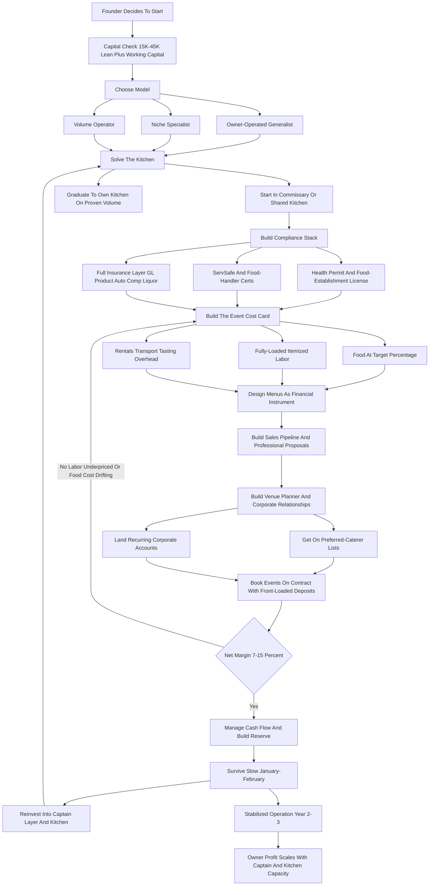
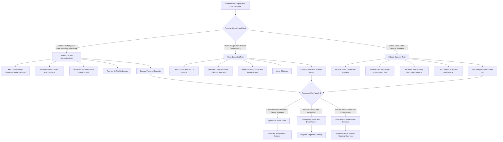

**TL;DR:** To start a catering business in 2027, you produce food in a licensed commercial kitchen and deliver it -- with or without service staff, rentals, and on-site cooking -- to events that happen somewhere else: weddings, corporate lunches, galas, conferences, funerals, graduations, and private parties. You charge per person, from roughly $15-$45 for drop-off platters to $60-$200+ for plated full-service dinners, and the same kitchen, the same vans, and largely the same crew produce that range. The model is **real, durable, and proven** -- people will always gather and gatherings need food -- but it is **operationally brutal and margin-thin**, and the entire business lives or dies on one number most beginners never calculate correctly: **fully-loaded food-and-labor cost as a percentage of the menu price**, event by event. Food runs 28-35% of revenue, direct event labor another 22-32%, rentals and disposables and transport another 8-15%, and what is left after fixed overhead is a **net margin of only 7-15%** in a healthy operation -- which means a caterer who misprices a single large wedding can erase the profit of three good corporate weeks. The honest 2027 economics: a focused startup invests **$15K-$120K** depending on whether it shares a commissary kitchen or builds its own, runs 30-90 events in a hard-fought Year 1, and generates **$90K-$400K in revenue** against **$25K-$80K in owner profit**, heavily weekend-loaded and seasonally lumpy. By Year 3-5 a well-run operation reaches **$500K-$1.5M+ in revenue** with **$70K-$220K in owner profit** running two to four event teams, at which point the founder chooses between staying a lean owner-operated caterer, going deep on a high-margin niche (weddings, corporate daily, nonprofit galas, ethnic-cuisine specialty), or building a multi-venue or ghost-kitchen operation. The three things that kill catering startups: **(a) mispricing events** -- quoting on food cost alone and forgetting that labor, rentals, transport, tasting costs, and overhead must all be inside the per-person number; **(b) underestimating labor** -- the servers, bartenders, captains, and kitchen prep crew that a full-service event devours, almost always more hours than the quote assumed; and **(c) cash-flow whiplash** -- floating deposits, payroll, and food purchases for events booked months out while a slow January drains the account. Net: viable in 2027 as a disciplined, cost-card-driven, relationship-fed operation built on venue and planner referrals -- a poor fit for anyone who wants predictable hours, fast payback, or a food business without weekends, vans, and a payroll.

## What A Catering Business Actually Is In 2027

A catering business produces food in one place and serves it in another, for events -- and that single sentence contains the entire operational challenge. You are not a restaurant, where the customer comes to a fixed kitchen, orders off a stable menu, and the food travels three feet to a table. You are a mobile food-production-and-service operation that quotes a bespoke menu, buys for it, preps it in a commercial kitchen, transports it -- hot, cold, and sometimes mid-cook -- to a church basement or a hotel ballroom or a backyard tent, finishes and plates it under conditions you do not control, serves it, and breaks down. In 2027 the business spans an enormous range under one roof. At the light end is **drop-off catering** -- platters, boxed lunches, buffet trays delivered and left, no staff, $15-$45 per person, the bread-and-butter of corporate-office accounts. In the middle is **buffet and family-style service** -- food set up on site, sometimes with a few staff to tend it, $35-$90 per person. At the heavy end is **full-service plated catering** -- on-site cooking or finishing, captains, servers, bartenders, rentals, the works, $60-$200+ per person, the domain of weddings and galas. The same business can do all three, and most do, because the kitchen, the vans, the insurance, and the core crew are shared overhead that more events amortize. What shapes the 2027 version specifically: corporate clients book and compare online and expect clean digital proposals and invoicing; office-lunch demand restructured around hybrid work into fewer-but-larger gathering days; commissary and shared commercial kitchens (and the rise of ghost-kitchen real estate) made it far cheaper to start without building your own kitchen; food and labor costs both ran up hard through the mid-2020s, compressing already-thin margins; and dietary complexity -- allergen, vegan, halal, kosher, gluten-free -- became a baseline expectation rather than a special request. Catering is not a glamorous food business. It is a logistics-and-labor business that happens to involve food, and the founders who succeed understand that the meal is the customer's memory; the business is vans, hotel pans, a prep schedule, a labor spreadsheet, a cost card, and a phone full of venue and planner relationships.

## The Service Tiers: Drop-Off, Buffet, Family-Style, And Full-Service Plated

A founder must understand the service tiers before pricing anything, because each tier has a completely different labor profile, margin structure, and customer. **Drop-off catering** is food delivered and left -- boxed lunches, sandwich and salad platters, hot buffet trays in disposable chafers, breakfast spreads. There is no on-site labor beyond the driver, disposables replace rentals, and the per-person price ($15-$45) is low but the margin can be surprisingly healthy because labor is minimal. It is the volume engine for corporate-office accounts and the easiest tier to start with. **Buffet service** sets the food up on site -- real chafing dishes, a serving line, sometimes one or two attendants to tend and replenish -- at $35-$75 per person; it needs some staff and some rentals but far fewer servers than plated service. **Family-style** brings platters and bowls to seated tables for guests to pass, at $50-$120 per person; it feels upscale, uses real tableware, and needs servers to deliver and clear, but fewer than full plated. **Full-service plated catering** is the heaviest and highest-ticket tier -- a course-by-course plated meal, often with on-site cooking or finishing, requiring a captain, a server for roughly every 15-25 guests, bartenders, kitchen staff on site, and a full rental package of china, glassware, flatware, and linens -- at $60-$200+ per person. The critical insight: the per-person price climbs across the tiers, but so does the labor and rental cost, and the *margin* does not climb the same way. A well-run drop-off program can out-margin a sloppily-priced plated wedding. A founder should choose a starting tier deliberately -- most start in drop-off and buffet because the labor and capital demands are manageable -- and add full-service plated only when the kitchen, the crew, and the cost discipline are ready, because plated service is where mispricing does the most damage.

## The Three Models: Owner-Operated Generalist, Niche Specialist, And Volume Operator

There are three distinct ways to build a catering business, and choosing deliberately is one of the most consequential early decisions. **The owner-operated generalist** does a bit of everything -- some corporate drop-off, some social events, the occasional wedding -- with the founder cooking, quoting, and often delivering. Its advantage is flexibility, low overhead, and a diversified book that no single client type can sink; its challenge is that the founder is the bottleneck and the business does not scale past their personal capacity. This is where most caterers start and many happily stay. **The niche specialist** goes deep on one segment -- weddings only, corporate daily-lunch contracts only, nonprofit galas and fundraisers, or a specific cuisine (authentic regional Mexican, South Asian, kosher, Southern barbecue) -- and becomes the obvious call for that need. Its advantage is referral compounding, pricing power, menu efficiency, and a reputation that markets itself; its challenge is concentration risk and a smaller addressable market. **The volume operator** runs multiple event teams, possibly multiple kitchens or a commissary plus satellites, and treats catering as a logistics company -- standardized menus, systematized prep, a hiring-and-scheduling machine, often anchored by recurring corporate contracts. Its advantage is scale economics and a less owner-dependent business that can eventually be sold; its challenge is that thin margins at scale punish every operational slip and the management layer is real. Many successful operators start as owner-operated generalists, discover which segment actually pays, and then specialize or scale into one of the other two. The wrong move is trying to be all three at once in Year 1 -- chasing every wedding, every corporate contract, and every scaling opportunity before the cost discipline and the core crew exist.

## The 2027 Market Reality: Demand, Competition, And What Changed

A founder needs an accurate read of the 2027 landscape, because catering is neither the easy-money food business some imagine nor a dying industry. **Demand is structurally healthy but restructured.** Weddings remain a large, durable market -- roughly two million-plus US weddings a year, the large majority using catering. Corporate catering rebounded but reshaped: hybrid work concentrated office food into fewer in-office days, making those days bigger catered events, and team offsites, client meetings, and recruiting events all reliably feed food. Galas, fundraisers, conferences, religious events, funerals, graduations, and milestone private parties round out a demand base that does not disappear because gathering is not discretionary. **The competition is layered.** At the top of most metros are the institutional players and their event arms -- Compass Group, Sodexo, Aramark, and venue-exclusive caterers at hotels and convention centers -- plus established independent caterers with reputations built over decades. In the middle is a band of professional independents. At the bottom is a long tail of home-kitchen cooks, restaurants doing catering as a side line, and underpriced operators who do not fully cost their labor. **What changed by 2027:** clients expect digital proposals, online booking flows, and clean e-invoicing; commissary and shared-kitchen availability lowered the startup capital barrier dramatically; food and labor inflation through the mid-2020s compressed margins and made cost discipline non-optional; dietary accommodation became baseline; and software for proposals, event management, and costing matured to where a small operator can run like a much larger one. The net market reality: demand is real and durable, the business is harder than it looks because of labor and margin, and the winning 2027 entrant competes on reliability, food quality, and relationships rather than on being the cheapest per-person number in the inbox.

## The Core Unit Economics: The Event Cost Card

This is the single most important section in the guide, because the entire business lives or dies on a calculation beginners routinely get wrong: the **fully-loaded cost of a single event as a percentage of what you charged for it.** Every event must have a cost card, built before the quote goes out, and it must capture every dollar. Walk a representative example: a 120-guest plated wedding at $95 per person -- a $11,400 food-and-service subtotal before tax and gratuity. The costs stack in an order beginners consistently under-count. **Food cost** -- raw ingredients including the waste, the overbuy, and the trim -- runs 28-35% of the food revenue; call it $3,300. **Direct event labor** -- the kitchen crew prepping and cooking, the captain, the servers (one per 15-25 guests for plated), the bartenders, the drivers, loaded with payroll taxes and travel time -- runs 22-32%; call it $3,000. **Rentals and disposables** -- china, glassware, flatware, linens, chafers, or the disposable equivalents -- another 6-12%; call it $900. **Transport** -- van fuel, mileage, maintenance allocation -- 2-4%. **Tasting cost** -- the free or discounted tasting that won the job, a real expense amortized across booked events. **Then fixed overhead** -- the commissary or kitchen rent, insurance, software, marketing, admin, the owner's base time -- has to be covered by the gross margin across all events. Net it out and a healthy catering operation runs a **gross margin of 30-45% after food, direct labor, and rentals**, which becomes a **net margin of only 7-15%** after fixed overhead. The discipline this imposes is absolute: **never quote a per-person price without a complete cost card behind it.** The beginner's fatal move is to price off food cost -- "ingredients are $28, I'll charge $60, that's a great margin" -- forgetting that labor will eat $20 of that, rentals $7, transport and tasting and overhead the rest, and the "great margin" is actually a loss. A caterer who builds a cost card for every event prices to a real margin; a caterer who eyeballs it from food cost is one big mispriced wedding away from a bad year.

## The Line-By-Line P&L: Food, Labor, Rentals, Overhead

Beyond the per-event cost card, a founder must internalize the business-level P&L, because the structure of catering costs is unforgiving and specific. **Food cost (28-35% of revenue)** is controlled through menu engineering -- designing menus around ingredients with stable pricing and good yield, portioning precisely, minimizing waste, buying well, and pricing menus to a target food-cost percentage rather than to a feeling. **Direct event labor (22-32%)** is the cost beginners most underestimate, because they price the obvious cooking hours and forget the load-out, the drive, the setup, the service, the breakdown, the drive back, and the post-event cleanup -- and they forget that weekend and event labor is premium-priced and getting harder to staff. **Rentals and disposables (6-15%)** are either passed through to the client with a margin or, dangerously, absorbed; the discipline is to itemize and mark up rentals, not bury them. **Transport, packaging, and equipment depreciation** allocate to every event. **Fixed overhead** -- commissary or kitchen rent, general liability and commercial auto and product insurance, event-management and accounting software, marketing, the owner's draw, vehicle payments -- exists every month whether or not there are events that week, which is exactly why slow months are dangerous. The healthy structure: roughly 30% food, 25-30% labor, 10% rentals and supplies, 15-20% fixed overhead, leaving a 7-15% net. The two errors that wreck the P&L: pricing menus without a food-cost target so the food line drifts to 40%+, and quoting labor as an afterthought so the labor line blows past 35%. Either one alone turns a thin-but-real margin into a loss, and catering does not have the margin cushion to absorb both.

## The Commercial Kitchen Question: Commissary, Shared, Or Build Your Own

A founder cannot legally cater from a home kitchen at any real scale, and the kitchen decision is the single biggest early capital choice. There are three paths. **Renting time in a commissary or shared commercial kitchen** -- a licensed facility that rents production time and storage by the hour, day, or month -- is how most 2027 caterers start: it converts a six-figure buildout into a manageable monthly cost, comes already health-department approved, and lets a founder validate the business before committing capital. The tradeoffs are scheduling competition with other users, limited storage, and a ceiling on how much volume you can run. **A shared-use or ghost-kitchen facility** with more dedicated space sits in the middle -- more control, more cost. **Building or leasing your own commercial kitchen** -- a dedicated licensed space with your own equipment, walk-ins, and prep areas -- gives full control, unlimited scheduling, and room to scale, but it is a major capital and lease commitment ($40K-$150K+ in buildout and equipment on top of rent) and it should generally come *after* the business has proven demand, not before. The licensing reality runs through whichever path: the kitchen must be inspected and permitted by the local health department, the business needs the state's food-establishment or caterer license, food-handler and manager certifications (ServSafe Manager is the common standard) are required, and serving alcohol requires separate licensing or a licensed bartending partner. The strategic sequencing: **start in a commissary, prove the demand and the cost discipline, and graduate to your own kitchen only when volume genuinely justifies the fixed cost** -- the founder who builds a kitchen first, on optimism, has converted a flexible cost into a fixed one before knowing whether the events will come.

## Licensing, Permits, Insurance, And Food Safety

Catering is a regulated food business, and a founder must treat compliance as a launch prerequisite, not a someday item. **The commercial kitchen** must be health-department inspected and permitted -- this is non-negotiable and gates everything. **The business license and the state food-establishment or caterer's license** register the operation to legally produce and sell food. **Food-safety certification** -- ServSafe Manager certification for at least the owner or a designated manager, food-handler cards for staff -- is required in most jurisdictions and is genuine risk management, not paperwork; foodborne illness at an event is a business-ending event. **Alcohol** is its own regime: catering and serving alcohol requires liquor liability coverage and either a caterer's liquor permit or working through a licensed bartending service, and the rules are state-specific and strict. **Insurance** is layered and essential: **general liability** for the obvious event risks, **product liability** specifically for food, **commercial auto** for the vans, **workers' compensation** for the crew, **liquor liability** if alcohol is involved, and often an umbrella policy -- and many venues require proof of specific coverage limits before they will let a caterer in the door. **Vehicle and transport compliance** -- proper food-safe transport, hot-holding and cold-holding through the journey -- is both a safety and a legal matter. **Local event permits** sometimes apply for large or public events. The discipline: build the compliance stack before the first paid event -- the kitchen permit, the licenses, the certifications, the full insurance layer -- because catering without it is not a lean startup, it is an uninsured liability waiting for one bad oyster, one van accident, or one over-served guest.

## Menu Design And Food Cost Engineering

The menu is not just what the food tastes like -- it is the primary lever on the largest controllable cost in the business, and a founder must design menus as a financial instrument as much as a culinary one. **Menu engineering for catering** means building dishes that hold up to the realities of off-site service: food that travels, that can be produced in volume, that finishes or holds well on site, that does not collapse in a chafing dish or wilt on a buffet line, and that uses ingredients with stable pricing and high usable yield. **Food-cost targeting** is the core discipline: each menu item is costed to the ingredient, including waste and trim, and priced so the menu hits a target food-cost percentage -- if the target is 30% and a dish costs $9 in ingredients, it must contribute at least $30 in menu price. **Portion control** is where food cost quietly leaks -- generous, inconsistent portioning can push a 30% food cost to 38% invisibly, so standardized recipes and portions are essential. **Menu tiering** -- offering good/better/best packages -- lets clients self-select a budget while keeping the caterer's costs predictable. **Dietary accommodation** -- vegan, gluten-free, nut-free, halal, kosher, allergen-aware options -- is a 2027 baseline expectation and must be designed in, not improvised, because allergen mistakes are dangerous and reputation-ending. **Seasonal menus** track ingredient cost and availability. **Tasting menus** -- the curated sample that wins the wedding -- are a real cost that must be priced into the business. The founders who treat the menu as art alone end up with beautiful food and a 40% food cost; the ones who treat it as art constrained by a cost card produce food that is both good and profitable -- and in a 7-15% net-margin business, the food-cost line is where discipline shows up directly in the owner's draw.

## Labor: The Cost That Eats Catering Alive

This is the operational heart of the business and the cost that most reliably destroys catering margins, and a founder who does not master labor will have revenue without profit. Catering labor comes in layers. **Kitchen production labor** -- the prep cooks and the chef preparing the food before the event, plus on-site cooking or finishing crew for plated service. **Event service labor** -- captains who run the floor, servers (one per roughly 15-25 guests for plated, fewer for buffet), bartenders, and the crew that sets up, serves, and breaks down. **Logistics labor** -- drivers and loaders for the load-out, transport, and load-back. The brutal arithmetic: a single full-service event consumes far more labor hours than the cooking time alone -- prep, load, drive, setup, service, breakdown, drive back, clean -- and weekend event labor is premium-priced and increasingly scarce. The discipline is to **price labor as a fully-loaded, distinct, itemized cost**: count every hour including travel and setup, load it with payroll taxes, and either bill it as a clear service-staff line or build it fully into the per-person price -- never "throw in" service. **Staffing the seasonal, weekend-concentrated peak** is its own puzzle: most caterers run a small reliable core and a larger flex pool of on-call event staff, often students and hospitality workers, with returning crew from prior seasons. **Crew quality drives margin and reputation directly** -- a trained captain runs an efficient floor and represents the business at the client's most important event; a sloppy crew runs long, breaks things, and generates complaints. The strategic point: catering is a labor business wearing a food costume, and the operators who win build trained, well-treated, properly-priced crews and count every labor hour into the quote -- while the ones who fail price the cooking and give away the service.

## Event Logistics: From Kitchen To Venue To Breakdown

A founder must master the logistics arc of an event, because catering is where food production meets a moving-parts delivery operation and the gap between the two is where events go wrong. The arc: **the prep schedule** -- working backward from event time to sequence purchasing, prep, and cooking in the commissary; **the pack-out** -- loading hot food in hot-holding, cold food in cold-holding, equipment, rentals, and supplies into the vans in the right sequence and at safe temperatures; **transport** -- driving to the venue maintaining the cold chain and the hot chain, a genuine food-safety obligation; **load-in and setup** -- getting into the venue (loading docks, timing windows, elevator access, the venue coordinator's rules), setting up the kitchen area, the buffet or the plating line, the service stations; **execution** -- finishing, plating, and serving the meal on the venue's timeline alongside the planner, the DJ, the photographer; **breakdown** -- clearing, packing out equipment and rentals, cleaning the space to the venue's standard, loading back; and **the return** -- unloading, cleaning, and resetting at the commissary. **Venue knowledge eases every step** -- knowing a venue's kitchen facilities (or lack of them), access, timing rules, and quirks makes an event run smoothly and is a major reason venue relationships are so valuable. **Equipment is the enabler** -- vans, hot boxes and cambros, cold transport, chafing dishes, portable cooking equipment, prep tables, the kit that makes off-site production possible. **Timing is unforgiving** -- a wedding meal is served on a schedule that does not move, and the entire logistics chain has to deliver hot food, on time, at temperature, every time. The operators who win treat logistics as a designed and checklisted system; the ones who improvise discover that a great kitchen and a bad load-out still produce a failed event.

## Sales, Proposals, And Booking

In 2027 the catering sales process is a structured pipeline, and a founder must build it deliberately because the proposal is where margin is set and jobs are won or lost. **The inquiry** comes in -- from the website, a venue referral, a planner, a repeat client, a directory -- and the speed and professionalism of the response is itself a competitive edge. **The consultation** scopes the event: guest count, date, venue, service tier, menu direction, budget, dietary needs, the client's vision. **The proposal** is the commercial document -- an itemized, clear, visually professional quote built on a real cost card, showing the menu, the service, the staffing, the rentals, and the all-in per-person number, increasingly delivered through catering-proposal software rather than a hand-typed email. **The tasting** -- for weddings especially -- is the conversion step, a curated sample that wins the booking and carries a real cost. **The contract and deposit** lock the date: a clear contract specifying the menu, count, deadlines, payment schedule, cancellation terms, and a deposit (commonly 25-50%) that secures the booking and funds the food purchasing. **Final details** -- the guest-count deadline, the final payment, the timeline -- are confirmed in the weeks before. The 2027 client expects this entire flow to be digital, clean, and fast: online inquiry, a professional proposal they can review and approve, e-signature, and online payment. The discipline: every proposal sits on a complete cost card, the contract protects against the count-drops and cancellations that wreck catering economics, and the deposit schedule is structured so the client's money -- not the caterer's -- funds the food. The founders who run a sloppy sales process underprice, over-promise, and get burned on cancellations; the ones who run a tight pipeline price to margin and book to a contract.

## Pricing Strategy And The Per-Person Number

Pricing in catering is the discipline that separates the operators who profit from the ones who merely stay busy, and a founder must build it on the cost card, not the competitor's number. **The per-person price** is the headline, and it must contain everything the cost card contains -- food at target percentage, fully-loaded labor, rentals with margin, transport, tasting amortization, and a contribution to overhead and profit -- which means a real plated per-person price is rarely the food cost times a comfortable multiple; it is the whole cost card divided by guests, plus margin. **Tiered packages** -- good/better/best -- let clients pick a budget while keeping the caterer's costs and margins predictable. **Itemized add-ons** -- bar service, additional staff, upgraded rentals, late-night snacks, specialty stations -- are margin opportunities priced individually. **Service charges and gratuity** are structured clearly and legally (the distinction matters and is regulated). **Minimums** -- guest-count minimums, weekend minimums, peak-date minimums -- protect against small events that cost more in fixed effort than they earn. **Seasonal and date pricing** reflects that peak wedding and holiday dates are scarce and should be priced firmly. **Deposit and payment schedules** are a pricing tool as much as a cash-flow tool. The cardinal rule: **price to your cost card and your margin, not to the cheapest quote in the client's inbox** -- catering's thin margins mean that winning a job by underpricing it is often worse than not winning it, because a mispriced large event can consume the profit of weeks of good ones. The founders who price on feeling or on competition race to the bottom of a 7% margin; the ones who price on the cost card protect the margin that becomes their income.

## Startup Cost Breakdown: The Honest All-In Number

A founder needs a clear-eyed total of what it costs to launch, because the range is wide and it depends almost entirely on the kitchen decision. The all-in startup cost breaks down as: **commercial kitchen** -- the largest swing variable -- a commissary membership and first months runs $500-$3,000 to start, while building or equipping your own kitchen runs $40,000-$150,000+; **equipment** -- chafing dishes, cambros and hot boxes, cold transport, prep tools, serving equipment, portable cooking gear -- $3,000-$25,000 depending on how much you own versus rent; **vehicle** -- a used cargo van to a new one, $8,000-$50,000, purchased or financed; **licensing, permits, and certifications** -- business license, food-establishment license, ServSafe and food-handler certs, health-department fees -- $500-$3,000; **insurance** -- general liability, product liability, commercial auto, workers' comp, liquor liability, first payments -- $2,000-$8,000 to start; **initial food and supply inventory** plus disposables and packaging -- $1,000-$5,000; **website, branding, photography, and proposal software** -- a professional site, food photography, event-management software setup -- $1,500-$8,000; **business formation and legal** -- entity setup, contract templates -- $500-$2,000; and **working capital** -- the buffer that floats food purchasing, payroll, and fixed costs through the booking-to-payment gap and the first slow stretch -- a meaningful $10,000-$40,000. Totaled, a **lean commissary-based launch can come in around $15,000-$45,000**, while a launch that builds its own kitchen runs **$70,000-$200,000+**. The strategic point embedded in the range: the commissary path is what makes catering a genuinely accessible startup in 2027, and the founder who starts lean -- commissary kitchen, a used van, rented equipment, and a real working-capital cushion -- can validate the business for a fraction of the cost of building a kitchen on optimism. Under-capitalization in catering usually is not the kitchen, it is the missing working capital that floats the gap between buying the food and getting paid.

## Cash Flow: The Hidden Killer

Catering has a cash-flow structure that quietly destroys otherwise-viable operations, and a founder must understand and manage it deliberately. The problem is timing. Events are booked weeks or months out; deposits come in at booking but the food, the rentals, and the payroll are spent in the days around the event; final payment may not clear until during or after; and meanwhile the fixed costs -- kitchen rent, insurance, the van payment, the owner's draw -- run every single month regardless of how many events that month holds. Layer on seasonality -- a heavy spring-and-fall wedding season and a busy December, with thin stretches in mid-summer and especially January and February -- and a caterer can be profitable on paper for the year while running out of cash in February. The disciplines that manage it: **structure deposits to front-load the client's money** so the client funds the food purchasing, not the caterer's bank account; **collect final payment before or at the event**, never on net-30 terms for social events; **build and hold a working-capital reserve** that explicitly covers fixed costs through the slow months; **manage the booking calendar** so deposits and events are spread, not bunched; **be disciplined about the owner's draw** in peak months, reserving rather than spending the seasonal surplus; and **watch corporate net-payment terms** carefully, because corporate accounts that pay on net-30 or net-60 create a real receivables gap that working capital must cover. The founders who ignore cash flow do the classic thing: a great fall season, the surplus spent, and then January arrives with kitchen rent due and no events booked. The ones who manage it treat the deposit structure and the reserve as core operating tools, not afterthoughts.

## Seasonality And The Catering Calendar

A founder must plan around the catering calendar, because the business is seasonally lumpy in ways that shape staffing, cash flow, and sanity. **The peak windows** are roughly spring (April-June) and fall (September-October) for weddings, plus December for holiday parties and corporate gatherings -- these months can hold the majority of the social-event revenue and they are intense, weekend-packed, and staffing-stretched. **The thinner windows** are mid-summer (heat suppresses some wedding demand in many regions) and especially January-February, the slowest stretch, when social events nearly stop. **Corporate catering smooths the curve** -- office lunches, meetings, and recurring corporate accounts run year-round and counter-cyclically to weddings, which is exactly why a mix of corporate and social work makes a more stable business than weddings alone. The disciplines the calendar imposes: **price peak dates firmly** because they are scarce; **build the working-capital reserve during peak to fund the trough**; **flex staffing** from a lean core in slow months to a full flex pool in peak; **pursue off-season demand deliberately** -- corporate, holiday, indoor social events, funeral catering, which does not follow the wedding calendar; and **use the slow months productively** for menu development, marketing, relationship-building, and equipment maintenance. The founders who misjudge seasonality staff and spend for a permanent peak and then get caught by February; the ones who get it right treat the calendar as a known shape and build a corporate-and-social mix plus a reserve that carries the business across the thin stretches.

## Staffing And Building Event Teams

A founder can run the smallest catering operation nearly solo, but the business does not scale without event teams, and the staffing model is shaped by the weekend-concentrated, seasonal nature of the work. **The kitchen core** -- a chef or lead cook and prep staff -- produces the food; in a small operation the founder often is the chef. **Event-service staff** -- captains, servers, bartenders -- are largely a flexible, on-call, event-by-event workforce: a small reliable core supplemented by a larger flex pool of trained on-call staff, often hospitality workers and students, with returning crew from prior seasons. **Captains are the key event hire** -- the person who runs the floor, manages the servers, and represents the business at the client's event; a strong captain is the difference between a smooth event and a chaotic one. **Drivers and logistics crew** handle the pack-out and transport. As the business grows, the hiring sequence typically adds an **event manager or sales coordinator** to run the proposal pipeline and the event scheduling, **kitchen management** as production volume grows, and eventually **multiple captains running parallel event teams** -- the structural step that lets the business do more than one event at a time, which is the real definition of scaling in catering. **Crew quality is margin and reputation** -- trained crews are efficient and represent the brand well; sloppy crews run long, cost labor hours, break rentals, and generate the complaints that kill referral flow. The cost structure: event-service labor is largely variable and scales with bookings, while the kitchen core, the managers, and the owner are fixed costs the slow months must carry. The strategic point: catering scales by building captains and event teams who can execute without the founder on site -- the founder who never builds that layer is permanently capped at the number of events they can personally run.

## Lead Generation: Venues, Planners, And Corporate Accounts

Catering is a relationship-and-referral business, and a founder must understand that the lead-generation engine is venues, planners, and corporate accounts far more than advertising. **Venues are a top relationship.** Event venues -- hotels, banquet halls, barns, estates, museums, breweries, country clubs -- are asked by every client "who caters here?" Getting onto a venue's **preferred-caterer list**, or becoming a venue's recommended caterer, is a durable, repeating source of qualified, pre-screened jobs, and it is earned by being reliable, easy for the venue staff to work with, and good at leaving the space clean. Some venues are exclusive (one caterer only) and some maintain open preferred lists; understanding the venues in your market is core business development. **Event planners and wedding planners** are the second pillar -- they specify a caterer for every event they run and value a partner who is responsive, professional, and makes them look good; a strong planner relationship is a stream of well-organized, higher-ticket bookings. **Corporate accounts** are the third and the most stabilizing -- offices, companies, and organizations that cater regularly, sometimes on standing schedules, providing the year-round recurring revenue that smooths the wedding seasonality; landing and keeping corporate accounts is a distinct, relationship-driven sales motion. **Other event vendors** -- florists, DJs, photographers, rental companies, bakeries -- form a referral web. **Repeat and referral clients** compound: a flawless wedding generates the bride's friends' weddings and her company's holiday party. **The website, directories (The Knot, WeddingWire, local listings), and food photography** convert the demand the relationships generate. Paid advertising plays a modest role. A founder should treat business development -- deliberately building venue, planner, and corporate relationships -- as a permanent core function, because a caterer with a thin relationship base competes on price in a 7% margin business, and one with a deep base has a steady flow of qualified, pre-warmed work.

## The Year-One Operating Reality

A founder should walk into Year 1 with accurate expectations, because the gap between the imagined catering business and the real one is where most quitting happens. Year 1 is **system-building and relationship-building mode, not profit-extraction mode.** The first year is spent learning the true labor cost of an event (almost always more than the first quotes assumed), refining the cost card until the quotes actually hold their margin, discovering which menus travel and produce well at volume, building the venue and planner and corporate relationships that generate repeat work, and finding where the operation is fragile -- the double-booked Saturday, the van that breaks on the way to a wedding, the count that dropped after the food was bought. A disciplined Year 1 catering startup, launched lean from a commissary with a real working-capital cushion, can realistically run **30-90 events** and generate **$90,000-$400,000 in revenue** against **$25,000-$80,000 in owner profit** -- meaningful but earned through intense weekend work and back-loaded into the peak seasons. The founder in Year 1 is genuinely in the business: cooking, quoting, often driving and captaining, doing the books late at night. The first slow January-February is the test: a founder who built and held the working-capital reserve carries the fixed costs; one who spent the fall surplus scrambles. Year 1 is also when the founder learns whether the pricing discipline is real -- a string of events that came in over on labor reveals a cost card that was too optimistic. The founders who succeed treat Year 1 as paid tuition in a logistics-and-labor business and use it to harden the cost card, the menus, and the crew; the ones who fail expected a food business and were unprepared for the labor math, the weekends, the cash-flow whiplash, and the seasonality.

## The Five-Year Revenue Trajectory

Mapping a realistic five-year arc helps a founder size the opportunity honestly. **Year 1:** lean commissary launch, 30-90 events, $90K-$400K revenue, $25K-$80K owner profit, founder cooking and quoting and captaining, the first slow winter is the survival test. **Year 2:** the cost card is hardened by real data, the venue and planner and corporate relationships start generating reliable repeat work, a second captain and a fuller flex crew come on, possibly a second van; revenue climbs to roughly **$250K-$700K** with owner profit around **$45K-$130K** as the operation runs more smoothly and books more confidently. **Year 3:** the operation is a real business with a system -- a hardened cost card, multiple captains running parallel event teams, possibly a graduation from commissary to a dedicated or larger kitchen, an event manager running the pipeline; revenue lands around **$450K-$1.1M** with owner profit roughly **$60K-$170K**, and the founder is managing more than cooking. **Year 4:** continued growth, possible niche specialization or a recurring corporate-contract book, stronger off-season programming; revenue roughly **$650K-$1.5M**, owner profit **$70K-$200K**. **Year 5:** a mature operation -- **$800K-$2M+ revenue, $90K-$220K owner profit** for a well-run independent caterer, with the founder deciding whether to keep scaling event teams, go deep on a high-margin niche, build a multi-kitchen or recurring-corporate operation, or position the business for sale. These numbers assume a disciplined hardened cost card, fully-loaded labor pricing, managed cash flow, and a real corporate-and-social mix; they do not assume exponential growth, because catering scales with kitchen capacity, captain capacity, and van capacity, not magically -- and the net margin stays thin (7-15%) at every stage, which is why operational discipline, not just revenue growth, is what actually grows the owner's income.

## Five Named Real-World Operating Scenarios

Concrete scenarios make the model tangible. **Scenario one -- Priya, the disciplined generalist:** launches from a commissary with $30K, a used van, and rented equipment, builds a real cost card from day one, deliberately mixes corporate drop-off (for year-round cash flow) with weekends of buffet and small plated social events; runs 70 events in Year 1 at $260K revenue, reinvests in a second captain and her own small kitchen by Year 3, and reaches $720K with a stable corporate-and-social book because her cost card actually holds. **Scenario two -- the cautionary tale, Marcus:** a talented chef who prices off food cost -- "ingredients are 30%, I charge a 3x multiple, great margin" -- and never builds a labor-loaded cost card; his food is excellent and he is always busy, but the plated weddings consistently run 35% over on labor he never quoted, he discovers at tax time that a busy year produced almost no profit, and he is one cancelled wedding away from a cash crisis. **Scenario three -- Elena, the wedding specialist:** goes niche from the start, building a focused wedding-catering operation with a tight tasting process, deep planner and venue relationships, and a hardened wedding cost card; smaller addressable market but compounding referrals and real pricing power -- by Year 4 she is a preferred caterer at six venues with $640K in revenue at a healthier-than-average margin. **Scenario four -- the Okafor family, corporate-contract operator:** builds the business around recurring corporate accounts -- standing weekly office lunches, regular client meetings, recruiting events -- which gives them year-round predictable revenue and cash flow, then layers weekend social events on top; by Year 5 they run multiple event teams off a recurring corporate base with revenue near $1.4M and far less seasonality stress than a weddings-only shop. **Scenario five -- Dana, the cash-flow casualty:** builds a solid book and a strong fall season grossing $310K, but takes a large owner's draw on the peak surplus, runs net-30 terms for corporate clients without a reserve, and enters January-February with kitchen rent and insurance due, no events booked, and a receivables gap -- profitable for the year on paper, but forced to take a personal loan to make February payroll. These five span the realistic distribution: disciplined generalist success, food-cost-only mispricing failure, profitable wedding niche, stabilizing corporate-contract model, and cash-flow wipeout.

## Risk Management And Insurance

The catering model carries specific risks, and the 2027 operator manages each deliberately rather than hoping. **Food-safety and liability risk** is the existential one: foodborne illness at an event can end a business and expose the owner to serious liability -- mitigated by ServSafe-level food-safety discipline, rigorous temperature control through prep, transport, and service, allergen protocols, and product-liability insurance. **Labor and execution risk** -- the no-show captain, the under-staffed event, the crew that runs long -- is mitigated by a trained core, a deep flex pool, clear event checklists, and fully-loaded labor pricing that does not punish proper staffing. **Cash-flow risk** -- the booking-to-payment gap, seasonality, corporate net terms -- is mitigated by front-loaded deposits, payment-before-event discipline, and a real working-capital reserve. **Cancellation and count risk** -- the wedding that cancels, the count that drops after the food is bought -- is mitigated by a clear contract with non-refundable deposits, guest-count deadlines, and cancellation terms. **Alcohol liability** -- the over-served guest -- is mitigated by liquor liability coverage and trained, certified bartending. **Vehicle and transport risk** is mitigated by commercial auto coverage and food-safe transport discipline. **Venue risk** -- the venue with no kitchen, the impossible timing window, the access nightmare -- is mitigated by venue site visits and venue relationships. **Concentration risk** -- over-dependence on one corporate account or one venue -- is mitigated by a diversified book across event types and clients. **Reputation risk** -- one bad event in a referral-driven business -- is mitigated by consistent execution, because in catering the reputation *is* the marketing. The throughline: every major catering risk has a known mitigation built from food-safety discipline, the right insurance layers, a protective contract, and cash-flow management, and the operators who fail are usually the ones who carried thin insurance, used a weak contract, ignored cash flow, or got sloppy on food safety.

## Competitor Landscape: Who You Are Up Against

A founder should understand the competitive field clearly. **The institutional players** -- Compass Group, Sodexo, Aramark and their catering and event arms -- dominate large-scale corporate, institutional, and convention catering with resources no startup matches; they set the high-volume end and are not where an independent competes. **Venue-exclusive caterers** -- the in-house or contracted-exclusive caterers at hotels, convention centers, and many event venues -- own the business at their specific venues. **Established independent caterers** -- the reputable operations built over years or decades in every metro -- hold the relationship-driven middle and high end; they are the real competitive set for a serious new entrant, and they are out-experienced rather than out-resourced. **Restaurants doing catering on the side** compete at the edges, often without fully costing their event labor. **The long tail of underpriced operators** -- home cooks, side-hustlers, and caterers who do not load labor into their pricing -- competes on price at the low end and is easy to out-professionalize on reliability and consistency. The strategic reality for a 2027 entrant: you cannot out-resource the institutional players or instantly out-relationship the decades-old independents, so you win by being the most reliable, most consistent, most relationship-attentive operator in a chosen segment -- a hardened cost card, food that genuinely travels and tastes good, flawless execution, and venue and planner and corporate relationships built deliberately over time. The competitive moat in catering is not the recipes -- anyone can cook well -- it is the **reputation for reliability, the venue and planner and corporate relationships, the trained captain layer, the operational systems, and the cost discipline** that lets the business price to a real margin, all of which take years to build.

## Financing The Business

Because catering's startup cost swings so widely, a founder should understand the financing options that fit each path. **The lean commissary launch barely needs financing** -- $15K-$45K is often within reach of personal savings, a modest loan, or a credit line, which is a real part of why commissary-based catering is an accessible 2027 startup. **Equipment financing** fits the van and the larger equipment purchases -- they are tangible assets a lender will finance, spreading the cost to match the earning life of the asset. **SBA and small-business loans** suit the larger launch, especially one that builds or equips its own kitchen, and they can fund working capital alongside the buildout. **A business line of credit** is genuinely useful in catering specifically because of the cash-flow structure -- it can bridge the booking-to-payment gap and the seasonal trough, though it must be managed, not lived on. **Equipment leasing** is an alternative to buying the kitchen build-out. **Reinvested cash flow** funds most healthy growth past Year 1 -- the peak-season surplus, disciplined and reserved, buys the second van and the dedicated kitchen. **Seller financing** can apply when buying an existing catering business, which is sometimes the lowest-risk entry because the kitchen, the relationships, the book, and the cost data already exist. The financing discipline: it is reasonable to finance the van and the equipment, and reasonable to use a credit line to bridge cash-flow timing, but the founder must still hold real working capital, because catering's structural booking-to-payment gap and seasonality mean a thin-cash launch fails on timing even when it is profitable on paper. Finance the assets, use a line of credit for the timing gap, but never launch without the working-capital cushion.

## Taxes And Business Structure

A founder should set up the tax and legal structure deliberately, because catering's regulated, labor-heavy, asset-touched nature has specific implications. **Entity:** most caterers form an LLC or S-corp for liability protection and tax flexibility -- important in a business with real food-safety and event-liability exposure -- and the entity holds the licenses, the leases, the insurance, and signs the client contracts. **Sales tax** on catering applies in most jurisdictions and the rules are specific -- catered food, service charges, and gratuities are taxed differently and a caterer must get the collection and remittance right from day one. **Payroll taxes** on the kitchen core and especially the variable event-service staff are a real, ongoing cost that must be budgeted; the proper classification of event staff (employee versus contractor) is a compliance matter that gets scrutinized. **Equipment and vehicle depreciation** -- the van, the kitchen equipment, the cambros -- are depreciable assets with tax treatment that a knowledgeable accountant optimizes, especially in heavy-purchase years. **Deductible expenses** -- kitchen or commissary rent, food and supplies, insurance, vehicle costs, software, marketing -- are captured by a clean bookkeeping system. **Cash-basis versus accrual** and the timing of deposits and final payments affect how income is recognized across the lumpy calendar. The discipline: separate business banking from day one, a bookkeeping system that tracks events as jobs with their cost cards, quarterly attention to sales tax and estimated taxes, careful payroll-tax handling for the flex crew, and an accountant who understands food businesses. Skipping this does not save money -- it converts a manageable compliance function into a year-end scramble, a payroll-tax exposure, and a missed depreciation opportunity, in a business that has no margin cushion to absorb avoidable costs.

## Owner Lifestyle: What Running This Business Actually Feels Like

A founder should know what daily life in this business is like before committing, because the lived reality is intense, weekend-bound, and seasonally cyclical. In **Year 1**, running a lean operation, the founder is genuinely in everything -- developing menus, costing and quoting, shopping and prepping in the commissary, loading the van, captaining the event, serving, breaking down, driving back, cleaning, and then doing the books and answering the next inquiry. The peak seasons are long hours and packed weekends -- Saturdays are wedding days, every week, for months -- and the slow January-February is quieter, spent on planning, marketing, menu work, and relationship-building. It is physical, high-pressure, and absorbing, far closer to running a logistics-and-hospitality operation than to a calm food business. By **Year 2-3**, with captains running event teams and an event manager handling the pipeline, the founder's role shifts toward managing -- overseeing the teams, building the venue and planner and corporate relationships, hardening the systems, watching the cost cards and the cash flow -- though the business is never desk-only and the founder is still hands-on in peak season. By **Year 3-5**, with a deeper team and a mature system, the founder can run a larger operation with a more managerial rhythm, though catering never becomes hands-off the way some businesses do -- the weekend concentration, the food-safety responsibility, and the seasonality are permanent features. The emotional texture: there is real satisfaction in a flawless event, a happy couple, a smoothly run season, and a cost card that holds; and real stress in the weekend grind, the cancelled wedding, the van that breaks, the count that drops, and the February cash gap. The income is real and can grow substantial, but it is earned through intense, physical, weekend-heavy work, not extracted passively. A founder who loves food, hospitality, the energy of events, and the logistics puzzle will find it genuinely rewarding; a founder who wanted a calm, predictable, weekday food business will be exhausted and surprised.

## Niche And Specialty Paths Worth Considering

Beyond the general model, a founder should understand the specialty paths, because for many operators a focused niche is the better business. **Wedding catering** -- specializing in the wedding market with a tight tasting process and deep planner and venue relationships -- is the classic high-ticket niche, with compounding referrals and real pricing power, though it is intensely seasonal and weekend-bound. **Corporate and office catering** -- standing accounts, daily and weekly office lunches, meetings, conferences -- is the year-round, cash-flow-stabilizing niche, less glamorous but far more predictable than weddings. **Nonprofit galas and fundraisers** -- a specialty in large seated benefit events -- is a distinct relationship market. **Ethnic and regional cuisine specialty** -- authentic regional Mexican, South Asian, Caribbean, Southern barbecue, Mediterranean, kosher, halal -- builds a defensible reputation and an addressable market that travels well beyond one neighborhood. **Drop-off and delivery-only catering** -- deliberately skipping the labor-heavy service tiers to run a higher-margin, lower-complexity operation built on platters and boxed meals -- is a real and underrated model. **Funeral and memorial catering** -- a steady, counter-seasonal, relationship-driven niche tied to funeral homes and churches. **Food-truck-plus-catering hybrids** and **micro-wedding and intimate-event specialists** round out the field. The strategic point: the generalist model is the most flexible starting point, but the specialty paths can deliver better margins, more predictable cash flow, menu efficiency, or compounding referrals for a founder with the right focus -- and many mature caterers run a core niche (often corporate for the cash flow) with other event types layered on. The mistake is not choosing a niche; it is staying a scattered generalist forever, mediocre and price-competitive across everything.

## Scaling Past The Owner-Operator Ceiling

The jump from a founder-dependent operation to a multi-team catering business is its own distinct challenge, and a founder should approach it deliberately. The single defining constraint of small catering is that the founder can only be at one event at a time -- so scaling, fundamentally, means **building captains and event teams who can execute a full event to standard without the founder on site.** The prerequisites: the cost card must be hardened by real data so quotes hold their margin without the founder's judgment on every one; the menus, the prep procedures, and the event-execution standards must be documented well enough that a captain and a crew can run them; and the cash flow plus reserve must absorb the larger payroll and the next kitchen. The scaling levers: **build and train the captain layer** -- this is the core scaling move, the people who run events in the founder's place; **document the systems** -- standardized recipes, prep schedules, pack-out checklists, event-execution playbooks; **graduate the kitchen** from commissary to dedicated space when volume genuinely justifies the fixed cost; **add an event manager** to run the proposal pipeline so the founder is not the sales bottleneck; **add vans and equipment in step with parallel-event capacity**; **anchor with recurring corporate accounts** to stabilize the cash flow that scaling stresses; and **never stop the relationship pipeline** so booking flow grows steadily. The constraints on scaling: captain capacity is the first and hardest (solved only by deliberate hiring and training), kitchen capacity is the second (solved by graduating the kitchen on proven volume), cash flow is the third (solved by the corporate base and the reserve), and the founder's own willingness to delegate execution of the client's most important event is a real fourth. The founders who scale well treated Year 1 and 2 as system-building -- so growth is the repetition of a documented machine, run by a trained captain layer, rather than the founder cloning themselves.

## Exit Strategies And The Long-Term Picture

Catering businesses can be exited, and a founder should build with the eventual exit in mind. **Sell the operating business** -- a catering company with a hardened book of repeat clients and corporate accounts, established venue and planner relationships, a trained captain layer, documented systems, owned or well-leased kitchen and equipment, and clean books is a saleable asset; valuations typically run as a multiple of stabilized earnings, with the multiple driven heavily by how owner-dependent the operation is -- a business that runs on captains and systems is worth far more than one that runs on the founder. **Sell the assets** -- the kitchen equipment, the vans, and the recurring-account relationships have real resale value even absent a full going-concern sale. **Acquire and roll up** -- a mature operator can grow by buying smaller caterers' books and relationships, or position to be acquired by a larger regional operation. **Transition to a key employee** -- a long-tenured executive chef or general manager who already runs the operation is a natural successor. **Wind down gracefully** -- fulfill the booked calendar, sell the equipment, let the relationships lapse, and exit. The honest long-term picture: catering is a durable, real business -- people will always gather and gatherings need food -- and a well-run operation produces real owner income for years; but it is a thin-margin, labor-intensive, weekend-bound, owner-attention-hungry business, and its sale value depends almost entirely on whether the founder built it into a systematized, captain-run operation or kept it a one-person show. A founder should think of a 2027 launch as building a real food-and-hospitality business with genuine exit paths -- but should build deliberately toward the owner-independent version, because that is the version that is both more livable to run and actually worth something to sell.

## Common Year-One Mistakes That Kill The Business

A founder can avoid most failure modes simply by knowing them in advance, because the mistakes in catering are remarkably consistent. **Pricing off food cost alone** -- quoting a comfortable multiple of ingredients and forgetting that labor, rentals, transport, tasting, and overhead all live inside the per-person number -- is the single most common margin-destroying error. **Underestimating labor** -- pricing the cooking hours and not the load, drive, setup, service, breakdown, and cleanup -- is a close second and turns thin-but-real margins into losses. **Ignoring cash flow** -- spending the peak surplus, running net terms without a reserve, and getting caught by a slow February with fixed costs due -- is the classic catering wipeout. **No real cost card** -- quoting from feeling or from the competitor's number instead of from a complete event cost card -- means the business never knows which events make money. **Weak contracts** -- no non-refundable deposit, no guest-count deadline, no cancellation terms -- leaves the caterer exposed when a wedding cancels or a count collapses after the food is bought. **Thin insurance** -- skimping on product liability, liquor liability, or commercial auto -- turns one bad event into a business-ending loss. **Building a kitchen too early** -- converting a flexible commissary cost into a fixed lease and buildout before demand is proven. **Saying yes to every event** -- taking tiny or badly-fitting events that cost more in fixed effort than they earn, and over-committing colliding dates. **Neglecting food-safety discipline** -- sloppy temperature control in transport and service, the risk that ends businesses. **Under-staffing events** to protect a too-low quote -- which produces the slow service and the complaints that kill referral flow. **Neglecting venue, planner, and corporate relationships** -- relying on advertising in a referral-driven business. Every one of these is avoidable; the founders who fail almost always made three or four of them, and the founders who succeed treated this list as a pre-launch checklist.

## A Decision Framework: Should You Actually Start This In 2027

A founder deciding whether to commit should run a structured self-assessment, because catering fits a specific person and badly misfits others. **Capital:** do you have $15K-$45K for a lean commissary launch including a real working-capital cushion, or financing plus cash for a larger one? The lean path is accessible, but the working capital is not optional. **Cost discipline:** will you actually build a complete cost card for every event -- food at target, fully-loaded labor, rentals, transport, tasting, overhead -- and price to a real margin? If you will price off food cost or off the competitor's number, catering's thin margin will not forgive you. **Physical and schedule tolerance:** are you willing to run a weekend-bound, physically intense, seasonally cyclical hospitality-logistics operation, often captaining events yourself in Year 1? If you want predictable weekday hours, this is the wrong business. **Cash-flow stomach:** can you manage a business where deposits, payroll, food purchasing, and final payments are all out of sync, and where January and February are thin while fixed costs are not? **Relationship orientation:** will you do the ongoing work of building venue, planner, and corporate relationships that generate the steady referral flow? If you would rather just advertise, you will compete on price. **Food-safety seriousness:** will you treat temperature control and allergen protocols as the non-negotiable discipline they are? If a founder answers yes across capital, cost discipline, physical and schedule tolerance, cash-flow stomach, relationship orientation, and food-safety seriousness, a catering business in 2027 is a legitimate and achievable path to a $500K-$1.5M+ business with $70K-$220K in owner profit. If they answer no on cost discipline or cash-flow stomach, they should not start -- those two kill catering businesses regardless of how good the food is. If they answer no on physical and schedule tolerance, an adjacent, less weekend-bound food business may fit better. The framework's purpose is to convert an attraction to cooking and hospitality into an honest, structured decision about the logistics-labor-and-margin business underneath.

## The 2027-2030 Outlook: Where This Model Is Heading

A founder committing capital should have a view on where the business goes next. Several trends are reasonably clear. **Demand stays structurally healthy** -- weddings, corporate gatherings, galas, and social events are durable, and the gathering economy does not disappear; the seasonality persists but the underlying volume is reliable. **The commissary and shared-kitchen infrastructure keeps improving** -- which keeps the startup barrier low and lets more disciplined operators enter without the kitchen-buildout gamble, while also raising competition at the lean end. **Food and labor cost pressure stays the central squeeze** -- both ran up hard and stay elevated, which keeps cost-card discipline and fully-loaded labor pricing non-optional and rewards the operators who have it. **Corporate catering keeps restructuring around hybrid work** -- fewer but larger in-office gathering days, more offsites and recruiting events, a demand pattern that favors caterers who build flexible corporate programs. **Software keeps professionalizing the small operator** -- proposal, event-management, and costing tools keep maturing, letting a disciplined small caterer run like a much larger one and price more precisely. **Dietary complexity keeps rising** -- allergen, vegan, halal, kosher, and gluten-free move further into baseline expectation, rewarding operators who design accommodation in. **AI and tooling assist the back office** -- costing, scheduling, proposal generation, demand forecasting, and inventory get more automated, lowering operational cost and helping operators price and staff more precisely, while modestly lowering the barrier for competent new entrants. **Consolidation continues at the regional level** -- well-run, systematized operators absorb the share that underpriced and undisciplined operators vacate. The net outlook: catering is **viable and durable through 2030 in its disciplined, cost-card-driven, fully-labor-priced, relationship-fed, cash-flow-managed form.** The version that thrives is a professional operation that costs every event, prices labor honestly, manages the cash-flow whiplash, builds deep venue and planner and corporate relationships, and runs on a trained captain layer. The version that struggles is the food-cost-priced, labor-underestimating, cash-flow-blind operation competing on the cheapest per-person number. A 2027 founder who builds the former is building a real, durable food-and-hospitality business with a multi-year runway.

## The Final Framework: Building It Right From Day One

Pulling the entire playbook into a single operating framework: a founder who wants to start a catering business in 2027 and actually succeed should execute in this order. **First, get honest about capital and discipline** -- confirm you have $15K-$45K for a lean commissary launch with a real working-capital cushion, and confirm you will run the cost-card discipline that thin-margin catering demands. **Second, choose your model deliberately** -- owner-operated generalist for flexibility, niche specialist for margin and referral compounding, volume operator for scale; do not chase all three in Year 1. **Third, solve the kitchen the lean way** -- start in a commissary or shared commercial kitchen, prove the demand, and graduate to your own kitchen only when volume justifies the fixed cost. **Fourth, build the compliance stack before the first paid event** -- the kitchen permit, the licenses, ServSafe and food-handler certs, and the full insurance layer. **Fifth, build a real event cost card** -- food at target percentage, fully-loaded labor, rentals with margin, transport, tasting amortization, overhead contribution -- and never quote without one. **Sixth, design menus as a financial instrument** -- food that travels and produces at volume, costed to a target food-cost percentage, with dietary accommodation built in. **Seventh, price labor as the fully-loaded, itemized cost it is** -- count every hour, never give away service. **Eighth, manage cash flow as a core tool** -- front-loaded deposits, payment before the event, and a working-capital reserve that funds the slow months. **Ninth, carry real insurance** -- general liability, product liability, commercial auto, workers' comp, and liquor liability. **Tenth, build the venue, planner, and corporate relationships relentlessly** -- this is the steady referral engine, and the corporate accounts are what stabilize the cash flow. **Eleventh, build the captain layer** -- train the people who run events without you, because that is the only real way catering scales. **Twelfth, keep the exit options open** -- a systematized, captain-run, clean-books operation is both more livable and actually worth selling. Do these twelve things in this order and a catering business in 2027 is a legitimate path to a $500K-$1.5M+ food-and-hospitality business. Skip the discipline -- especially on the cost card, the labor pricing, and the cash flow -- and it is a fast way to be exhausted, always busy, and somehow never profitable. The business is neither easy money nor a dying industry. It is a real, thin-margin, labor-intensive, logistics-heavy food business, and in 2027 it rewards exactly one kind of founder: the disciplined, cost-card-driven operator who treats it as the logistics-labor-and-margin business it actually is.

## The Operating Journey: From Kitchen Decision To Stabilized Operation

## The Decision Matrix: Generalist Vs Niche Specialist Vs Volume Operator

## Sources

1. **National Restaurant Association -- Industry Operations and Catering Data** -- Trade association data on food-service operations, labor and food cost benchmarks, and catering-segment trends. https://www.restaurant.org
2. **National Association for Catering and Events (NACE)** -- Professional association for caterers and event professionals; operating standards, education, and relationship-network context. https://www.nace.net
3. **International Caterers Association (ICA)** -- Industry group for catering professionals; best practices, benchmarking, and education. https://www.internationalcaterers.org
4. **ServSafe (National Restaurant Association)** -- Food-safety manager and food-handler certification, the common US standard for catering food-safety compliance. https://www.servsafe.com
5. **US Food and Drug Administration -- FDA Food Code** -- Model food-safety regulation underlying state and local food-establishment rules. https://www.fda.gov
6. **US Small Business Administration -- Starting and Financing a Food Business** -- Reference for business structure, licensing, SBA loans, and small-business financing. https://www.sba.gov
7. **SCORE -- Small Business Mentoring and Planning Resources** -- Business planning, cash-flow management, and seasonality guidance for small food businesses. https://www.score.org
8. **US Bureau of Labor Statistics -- Food Preparation and Serving Occupations** -- Wage and employment data for cooks, food-prep workers, and food-service staff. https://www.bls.gov/oes
9. **IBISWorld -- Caterers Industry Report (US)** -- Industry size, revenue, margin structure, and competitive-landscape data for the US catering industry.
10. **IRS -- Depreciation, Section 179, and Small-Business Tax Guidance** -- Tax treatment of kitchen equipment and vehicles as depreciable business assets. https://www.irs.gov
11. **State Department of Agriculture / Health Department Food-Establishment Licensing** -- State and local caterer and food-establishment licensing and inspection requirements (varies by state).
12. **Compass Group -- Corporate and Event Catering (LON: CPG)** -- Reference for the institutional catering competitive landscape. https://www.compass-group.com
13. **Sodexo -- Food Services and Catering** -- Reference for the institutional catering competitive landscape. https://www.sodexo.com
14. **Aramark -- Food and Event Services (NYSE: ARMK)** -- Reference for the institutional catering competitive landscape. https://www.aramark.com
15. **The Knot -- Wedding Industry and Spending Reports** -- Data on wedding volume, catering spend, and seasonality. https://www.theknot.com
16. **WeddingWire / Wedding Vendor Marketplace Data** -- Wedding-market demand, catering-spend, and vendor-relationship data. https://www.weddingwire.com
17. **National Association of Wedding Professionals** -- Industry context on the wedding-vendor ecosystem caterers operate within.
18. **Catersource / Catering Industry Trade Coverage** -- Ongoing journalism and education on catering operations, menus, and trends.
19. **Total Food Service / Food-Service Trade Press** -- Industry coverage of catering operations, equipment, and supply trends.
20. **Tripleseat -- Catering and Event Management Software** -- Event-management, proposal, and booking platform widely used by caterers. https://www.tripleseat.com
21. **HoneyBook -- Client Management and Proposal Software** -- Proposal, contract, and payment software used by event-service businesses. https://www.honeybook.com
22. **Curate (formerly Curate / catering proposal software)** -- Proposal and event-management software for the catering and events industry.
23. **FoodStorm / Catering Order Management Software** -- Catering order, production, and logistics management platform.
24. **The Food Corridor -- Shared and Commissary Kitchen Network** -- Reference for commissary and shared commercial kitchen access and the lean-startup kitchen path. https://www.thefoodcorridor.com
25. **Local Health Department Mobile and Catering Food Operation Guides** -- City and county guidance on catering permits, transport, and temperature-control requirements.
26. **Insureon / Specialty Catering and Food-Business Insurance Resources** -- General liability, product liability, commercial auto, workers' comp, and liquor liability coverage for caterers.
27. **Liquor Liability Insurance -- Coverage Guides for Caterers and Event Services** -- Coverage and licensing context for serving alcohol at catered events.
28. **Equipment Leasing and Finance Association (ELFA)** -- Reference for equipment financing structures applicable to kitchen equipment and vehicles. https://www.elfaonline.org
29. **BizBuySell -- Catering Business Valuation and Sale Listings** -- Reference for going-concern valuations and exit multiples in the catering category. https://www.bizbuysell.com
30. **US Foods / Sysco -- Foodservice Distribution and Cost References** -- Wholesale food-cost and supply references for menu costing. https://www.usfoods.com
31. **National Restaurant Association -- Food and Labor Cost Benchmark Studies** -- Reference for the food-cost and labor-cost percentage benchmarks used throughout.
32. **State Sales Tax Authorities -- Catering, Service Charge, and Gratuity Taxability** -- Reference for sales tax treatment of catered food, service charges, and gratuities.
33. **US Department of Labor -- Wage, Hour, and Worker Classification Guidance** -- Reference for payroll, overtime, and employee-versus-contractor classification of event staff. https://www.dol.gov
34. **NFIB -- Small Business Operating and Hiring Surveys** -- Small-business labor-cost, hiring, and operating-condition data relevant to catering. https://www.nfib.com
35. **Catering Operator Forums and Industry Communities** -- Practitioner discussion of cost cards, labor pricing, cash-flow management, and venue relationships.

## Numbers

**Per-Person Pricing By Service Tier (2027)**

| Service Tier | Per-Person Price | Labor Profile |
|---|---|---|
| Drop-off catering / boxed lunch | $15-$45 | Driver only |
| Corporate office daily | $12-$25 | Driver only |
| Buffet service | $35-$75 | 1-2 attendants |
| Family-style service | $50-$120 | Servers, fewer than plated |
| Cocktail reception / passed apps | $25-$80 | Passed-service staff |
| Full-service plated dinner | $60-$200+ | Captain + 1 server per 15-25 guests |
| Wedding full-service | $90-$300+ | Full crew + bartenders + kitchen |
| Bartending package | $25-$60 | Licensed bartenders |
| Service staff (servers, bartenders) | $35-$75/hour | -- |

**The Event Cost Card (Representative 120-Guest Plated Wedding At $95/Person)**

| Cost Line | % Of Revenue | Dollar Figure |
|---|---|---|
| Food-and-service subtotal | -- | ~$11,400 |
| Food cost (ingredients incl. waste/trim) | 28-35% | ~$3,300 |
| Direct event labor (kitchen, captain, servers, bar, drivers) | 22-32% | ~$3,000 |
| Rentals and disposables (china, glass, flatware, linens, chafers) | 6-12% | ~$900 |
| Transport (van fuel, mileage, maintenance) | 2-4% | ~$300 |
| Tasting cost | amortized | across booked events |
| Gross margin after food, labor, rentals | 30-45% | -- |
| Net margin after fixed overhead | 7-15% | -- |

**Business-Level P&L Structure (% of Revenue)**

| P&L Line | % Of Revenue |
|---|---|
| Food cost | 28-35% |
| Direct event labor | 22-32% |
| Rentals, disposables, packaging | 6-15% |
| Fixed overhead (kitchen rent, insurance, software, marketing, admin, owner base) | 15-20% |
| Net margin | 7-15% |

**Startup Cost Breakdown**
- Commercial kitchen -- commissary membership + first months: $500-$3,000
- Commercial kitchen -- build/equip your own: $40,000-$150,000+
- Equipment (chafers, cambros, cold transport, prep, serving): $3,000-$25,000
- Vehicle (used to new cargo van): $8,000-$50,000
- Licensing, permits, ServSafe and food-handler certs: $500-$3,000
- Insurance (GL, product, commercial auto, workers' comp, liquor, first payments): $2,000-$8,000
- Initial food, supply, disposable, packaging inventory: $1,000-$5,000
- Website, branding, food photography, proposal software: $1,500-$8,000
- Business formation and legal: $500-$2,000
- Working capital (floats food, payroll, fixed costs through booking-to-payment gap): $10,000-$40,000
- Total (lean commissary-based launch): ~$15,000-$45,000
- Total (own-kitchen build launch): ~$70,000-$200,000+

**Five-Year Revenue Trajectory (Owner Profit)**
- Year 1: $90,000-$400,000 revenue, $25,000-$80,000 owner profit, 30-90 events
- Year 2: $250,000-$700,000 revenue, $45,000-$130,000 owner profit
- Year 3: $450,000-$1,100,000 revenue, $60,000-$170,000 owner profit
- Year 4: $650,000-$1,500,000 revenue, $70,000-$200,000 owner profit
- Year 5: $800,000-$2,000,000+ revenue, $90,000-$220,000 owner profit

**Operational Benchmarks**
- Server ratio (plated service): 1 per 15-25 guests
- Deposit at booking: commonly 25-50% of contract
- Food-cost target: typically 28-32% of food revenue
- Net margin (healthy operation): 7-15%
- ServSafe Manager certification: required for owner/manager in most jurisdictions

**Seasonality**
- Peak windows: spring (April-June) and fall (September-October) for weddings; December for holiday/corporate
- Thin windows: mid-summer in many regions; January-February the slowest stretch
- Corporate catering runs year-round and counter-cyclically to weddings -- the cash-flow stabilizer
- Working-capital reserve must cover fixed costs through the January-February trough

**Demand Context**
- US weddings per year: ~2 million+, large majority using catering
- Hybrid work concentrated office catering into fewer, larger in-office gathering days
- Dietary accommodation (vegan, gluten-free, nut-free, halal, kosher) is a 2027 baseline expectation

**Institutional Competitive Landscape (Scale Reference)**
- Compass Group (LON: CPG): multi-billion global food-service and catering
- Sodexo: multi-billion global food services
- Aramark (NYSE: ARMK): multi-billion food and event services
- These dominate large institutional/convention catering -- not the independent's competitive set

## Counter-Case: Why Starting A Catering Business In 2027 Might Be A Mistake

The case above describes a viable business, but a serious founder must stress-test it against the conditions that make this model a bad bet. There are real reasons to walk away.

**Counter 1 -- The margin is genuinely thin and unforgiving.** Catering nets only 7-15% in a healthy operation, which means there is almost no cushion for error. A single mispriced large wedding, a single event that runs 40% over on labor, a single bad food-cost month can erase the profit of weeks of good work. Most businesses can absorb a mistake; catering's margin structure means a few mistakes compound straight into a losing year.

**Counter 2 -- Mispricing is the default failure, not the rare one.** The natural, intuitive way to price -- a comfortable multiple of food cost -- is wrong, and it is wrong in a way that feels right the whole time. The food looks profitable, the caterer stays busy, and the labor, rentals, transport, tasting, and overhead quietly eat the margin until tax time reveals a busy year produced almost no profit. Pricing catering correctly is counterintuitive and most beginners get it wrong by default.

**Counter 3 -- Labor eats the business alive.** A full-service event consumes far more labor hours than the cooking time -- prep, load, drive, setup, service, breakdown, drive back, clean -- and weekend event labor is premium-priced and increasingly hard to staff. The caterer who prices the cooking and underprices the service runs a losing operation while believing it is profitable, and the labor market is not getting easier.

**Counter 4 -- The cash flow is structurally treacherous.** Deposits, food purchasing, payroll, and final payments are all out of sync, fixed costs run every month, and the calendar is seasonally lumpy with a near-dead January-February. A caterer can be profitable for the year on paper and still run out of cash in February. This is a business where managing timing is as hard as managing the food, and it catches founders who never saw it coming.

**Counter 5 -- It is relentlessly weekend-bound and physically intense.** Weddings are on Saturdays, every Saturday, for months. The work is physical -- prep, loading, setup, service, breakdown, driving. A founder imagining a calm food business has misunderstood the model; in Year 1 the founder is cooking, captaining, serving, and cleaning, and the peak seasons have no weekends off.

**Counter 6 -- Food-safety liability is existential.** Foodborne illness at an event can end a business and expose the owner to serious liability. The cold chain and hot chain must be maintained through prep, transport, and service, every time, under conditions the caterer does not fully control. One bad event is not a setback -- it can be the end.

**Counter 7 -- Cancellations and count drops hit a business that already bought the food.** A wedding cancels, or the guest count drops from 150 to 110 after the food was purchased and the staff scheduled. Without an airtight contract -- non-refundable deposits, count deadlines, cancellation terms -- the caterer eats the loss, and even with a good contract, count volatility is a permanent friction in a thin-margin business.

**Counter 8 -- The competition squeezes from both ends.** Above sit institutional players and decades-old established independents with relationships a startup cannot quickly match; below sits a long tail of underpriced operators -- home cooks, side-hustlers, restaurants doing catering cheaply -- who do not fully cost their labor and drag the price expectation down. The new entrant occupies a middle that must be earned slowly.

**Counter 9 -- Reputation is fragile and the business is referral-driven.** Catering runs on venue, planner, and word-of-mouth referrals, which means one bad event -- a late meal, a food-safety scare, a chaotic floor -- does outsized damage. The marketing is the reputation, and the reputation can be damaged faster than it was built.

**Counter 10 -- Scaling is genuinely hard because the founder can only be at one event at a time.** Growth requires building a trained captain layer that can execute the client's most important event without the founder present -- and training captains, and trusting them, is slow and hard. Many caterers never break the owner-operator ceiling and stay permanently capped at their personal capacity.

**Counter 11 -- It is capital-light to start but capital-hungry to grow.** The commissary path makes launching cheap, but graduating to a real kitchen, adding vans, and funding a larger payroll all demand capital, and the thin margin makes self-funding that growth slow. The accessibility of the start can mask how hard the scale-up is.

**Counter 12 -- Adjacent food businesses may fit better.** A founder drawn to food but not to weekends, labor management, and cash-flow whiplash might be better suited to a different food business -- a bakery, a packaged-food product, a meal-prep operation, a food-truck with set hours. Catering specifically rewards the operator who loves the event-logistics-and-labor puzzle; for the founder who loves cooking but not that puzzle, it is the wrong expression of the interest.

**The honest verdict.** Starting a catering business in 2027 is a reasonable choice for a founder who: (a) has $15K-$45K of genuine launch capital plus a real working-capital cushion, (b) will build a complete cost card for every event and price to a real margin rather than off food cost, (c) will price labor as the fully-loaded cost it is, (d) can manage the structurally treacherous cash flow and the seasonal trough, (e) can run a weekend-bound, physically intense, food-safety-critical operation, and (f) will commit to the slow work of building venue, planner, and corporate relationships and a trained captain layer. It is a poor choice for anyone who will price off food cost, anyone who cannot stomach the cash-flow whiplash, anyone who wants predictable weekday hours, and anyone whose real interest in food would be better served by a different food business. The model is not a scam, but it is thinner-margined, more labor-intensive, more cash-flow-treacherous, and more weekend-bound than its appealing surface suggests -- and in 2027 the gap between the disciplined version that works and the food-cost-priced version that fails is wide.

## Related Pulse Library Entries

- **q9501** -- A company sells $100 group workshops teaching older adults technology -- what's the right next move? (Workshop-and-events service model; pricing-to-margin and scaling-past-the-founder parallels.)
- **q9502** -- How do you scale a workshop-led senior tech-training business in 2027? (The codify-and-build-a-trainer-layer move directly parallels building a captain layer in catering.)
- **q1965** -- How do you start a party rental business in 2027? (The closest event-industry cousin; the rental company a caterer partners with for china, linens, and tableware.)
- **q1966** -- How do you start an event venue business in 2027? (The venue relationship that is a top lead source and preferred-caterer gateway.)
- **q1967** -- How do you start a wedding planning business in 2027? (The planner relationship that drives catering bookings; the lower-capital event-industry alternative.)
- **q1968** -- How do you start a florist business in 2027? (Event-vendor referral-web partner.)
- **q1969** -- How do you start a DJ business in 2027? (Event-vendor referral-web partner.)
- **q1970** -- How do you start a photo booth business in 2027? (Event-vendor referral-web partner.)
- **q1971** -- How do you start a bounce house rental business in 2027? (Event-rental adjacency with its own insurance profile.)
- **q1955** -- How do you start a food truck business in 2027? (Closest mobile-food-production cousin; commissary kitchen, vans, and food-safety overlap.)
- **q1956** -- How do you start a meal prep business in 2027? (Adjacent food-production model with a different, less event-driven demand pattern.)
- **q1957** -- How do you start a bakery business in 2027? (Adjacent food business; a wedding-cake bakery is a catering referral partner.)
- **q1958** -- How do you start a cleaning business in 2027? (Service-logistics and crew-management mindset; venue-cleanup adjacency.)
- **q1959** -- How do you start a personal chef business in 2027? (The lighter-labor, non-event food-service cousin.)
- **q1960** -- How do you start a ghost kitchen business in 2027? (The shared-kitchen and commissary infrastructure catering increasingly launches from.)
- **q1961** -- How do you start a coffee cart business in 2027? (Lighter-capital mobile food-and-beverage event adjacency.)
- **q1962** -- How do you start a bartending service business in 2027? (The licensed bar partner caterers work with for alcohol service.)
- **q1946** -- How do you start a real estate investing business in 2027? (Capital and depreciation parallels for the kitchen-and-vehicle asset base.)
- **q1947** -- How do you start a property management business in 2027? (Operations-heavy, relationship-driven service-business parallels.)
- **q9601** -- How do you start a fractional CFO business in 2027? (Financial discipline for managing thin margins, cash flow, and seasonality.)
- **q9602** -- How do you start a bookkeeping business in 2027? (The bookkeeping and cost-tracking every caterer must build or buy.)
- **q9701** -- What is the best event and proposal management software in 2027? (Deep dive on the Tripleseat/HoneyBook software stack catering runs on.)
- **q9702** -- How do you build standard operating procedures for a service business? (The prep-schedule, pack-out, and event-execution SOPs catering scales on.)
- **q9801** -- What is the future of the events industry in 2030? (Long-term outlook context for demand, labor, and design trends.)
- **q9802** -- How do you price a service business for healthy margins? (The cost-card-and-margin discipline central to catering survival.)

