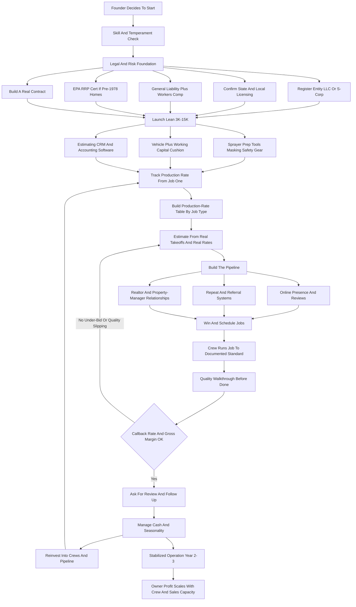
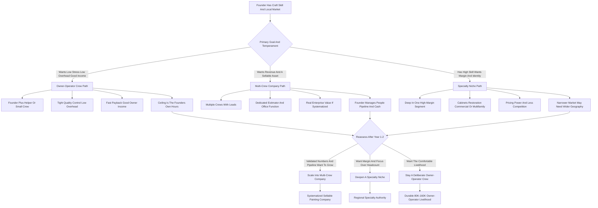

**TL;DR:** To start a painting business in 2027, you build a service company that prepares and coats surfaces -- interior walls and ceilings, exterior siding and trim, cabinets, decks, fences, and commercial spaces -- charging for labor and materials on a per-square-foot or per-project basis while the real money is made on **production rate** (square feet a crew covers per labor hour) and **repeat-and-referral density** rather than on chasing one-off jobs forever. The model is **genuinely low-barrier to enter and brutally easy to run badly**: a solo painter can start for **$3,000-$15,000** -- a sprayer, sanders, ladders, drop cloths, brushes, a used van, a $1M general liability policy, and a contractor registration where the state requires one -- and be billing within weeks, which is exactly why the trade is crowded with under-priced operators who confuse being busy with being profitable. The honest 2027 economics: a disciplined solo-plus-helper operation generates **$70K-$220K in revenue** in Year 1 at a **35-55% gross margin after paint and labor**, throwing off **$45K-$110K in owner pay**; by Year 2-3 an operator running 2-3 crews reaches **$300K-$900K in revenue** with **$90K-$260K in owner profit**, at which point the founder chooses between staying a lean owner-operator crew, scaling into a multi-crew residential-and-commercial company, or specializing into a high-margin niche (cabinet refinishing, historic restoration, commercial maintenance, multifamily turns). The three things that kill painting startups: **(a) pricing by gut instead of by production rate and material takeoff** -- bidding a job at a number that feels right and discovering the crew burned twice the labor hours; **(b) living job-to-job with no repeat-customer, realtor, property-manager, or HOA pipeline** -- so every Monday starts at zero; and **(c) under-managing crew quality and callbacks** -- because in painting the entire reputation rests on cut lines, coverage, and clean masking, and a sloppy crew converts a referral engine into a complaint engine. Real 2027 players span franchises -- **CertaPro Painters** (FirstService Brands, ~350+ units), **Five Star Painting** and **360° Painting** (Neighborly), **WOW 1 DAY Painting**, **Fresh Coat Painters** (Strategic Franchising) -- and tens of thousands of local independents, all buying from the same supply chain: **Sherwin-Williams** (NYSE: SHW), **Benjamin Moore** (Berkshire Hathaway), **Behr** (Home Depot exclusive, Masco / NYSE: MAS), **PPG**, and **Valspar** (Sherwin-Williams, 2017). Net: viable in 2027 as a disciplined, production-rate-obsessed, pipeline-driven service business with real owner income and clear paths to scale or sale -- a poor fit for anyone who wants to avoid sales, avoid managing labor, or treat "I can paint" as a substitute for "I can run a painting company."

## What A Painting Business Actually Is In 2027

A painting business is a surface-preparation and coating service company. You and your crews show up at a residential or commercial property, protect everything that should not get paint on it, prepare the surfaces that will -- scraping, sanding, patching, caulking, priming -- and then apply finish coats of paint or stain to a standard the customer can see and a competitor can be judged against. You are selling labor, expertise, materials, and a result, and the result is unusually visible: a homeowner stands six inches from your cut line at the ceiling and either trusts you or never calls you again. In 2027 the business is shaped by a handful of realities that did not fully exist a decade ago. Customers find and vet painters online -- Google reviews, Angi, Thumbtack, Nextdoor, and a company website are now the storefront, and a painter with no digital footprint is invisible to a large share of the market. Customers expect a clean, itemized, often digital estimate and the ability to pay by card or financing, not a number scrawled on a business card. Labor is more expensive and harder to find than it was, which makes crew retention and production efficiency the squeeze point. Paint chemistry and application tools kept improving -- better low-VOC and zero-VOC products, better sprayers, better masking systems -- which raised the floor on quality and the customer's baseline expectation. And the work itself splits cleanly into segments with very different economics: interior repaints, exterior repaints, new-construction work for builders, cabinet and specialty refinishing, and commercial and property-management maintenance. The painting business is not glamorous and it is not passive. It is a sales-estimating-and-labor-management business wearing coveralls, and the operators who succeed understand that knowing how to paint is the price of entry, not the business -- the business is bidding accurately, scheduling tightly, managing a crew to a quality standard, and building a pipeline so the phone rings without a fight every single week.

## The Service Segments: Interior, Exterior, New Construction, Cabinets, Commercial

A founder must understand the segments before choosing where to compete, because each has a distinct customer, sales cycle, margin profile, and seasonality. **Interior repainting** -- walls, ceilings, trim, doors in occupied homes -- is the bread-and-butter residential segment: year-round work, weather-independent, relationship-driven, with customers who care intensely about cleanliness, protecting their belongings, and tidy cut lines. **Exterior repainting** -- siding, trim, soffits, fascia, decks, fences -- is higher-ticket and more weather-dependent, concentrated in the warm-and-dry months in most climates, with heavier prep (power washing, scraping, priming bare wood) and real ladder-and-height labor. **New-construction and builder work** -- painting houses and units for production and custom builders -- is volume work at thinner margins, paid on builder timelines, valuable for keeping crews busy but dangerous to depend on because one builder slowdown can empty your schedule. **Cabinet and specialty refinishing** -- spraying kitchen cabinets, doors, built-ins, and furniture-grade finishes -- is a high-skill, high-margin niche that commands premium pricing because few crews do it well and the result is transformative. **Commercial and property-management maintenance** -- offices, retail, apartments, common areas, multifamily unit turns, HOA exteriors -- trades the emotional residential sale for contract-driven, repeatable, schedulable volume, often bid competitively but stabilizing once you are the known vendor. A founder should think of these as a portfolio with different risk and reward: interior repaints for steady year-round cash and referral density, exterior repaints for higher tickets in season, cabinets and specialty for margin, commercial and property management for predictable recurring volume. The Year-1 mistake is trying to chase all five at once with one solo crew, or worse, depending entirely on whichever segment happened to call first.

| Segment | Ticket size | Seasonality | Margin profile | Sales motion |
|---|---|---|---|---|
| Interior repaint | Low-mid | Year-round | Solid, referral-dense | Emotional, in-home |
| Exterior repaint | Higher | Warm/dry months | Strong in season | Emotional, curb-appeal |
| New construction | Volume, thin | Builder-driven | Thinnest, volume-dependent | Builder relationship |
| Cabinet / specialty | Mid-high | Year-round | Highest, premium-priced | Skill-and-portfolio |
| Commercial / property mgmt | Contract-based | Year-round | Moderate, recurring | Bid + vendor relationship |

## The Three Models: Owner-Operator Crew, Multi-Crew Company, And Specialty Niche

There are three distinct ways to build a painting business, and choosing deliberately shapes everything that follows. **The owner-operator crew model** is the founder plus a helper or two, with the founder estimating, selling, often painting, and managing the day. Its advantage is low overhead, tight quality control, fast payback, and a genuinely good owner income without the headaches of scale; its ceiling is the founder's own hours -- revenue is capped because the founder is the bottleneck on both sales and production. This is where most painting businesses start and where many deliberately, profitably stay. **The multi-crew company model** scales beyond the founder: multiple crews, a foreman or crew lead on each, a dedicated estimator (eventually the founder steps fully off the brush), an office function for scheduling and customer communication, and a marketing engine feeding the pipeline. Its advantage is real revenue and enterprise value -- a multi-crew company is a sellable business; its challenge is that it is a different job, where the founder manages people, pipeline, and cash flow instead of painting, and the margin can thin if production discipline slips across crews. **The specialty niche model** goes deep on one high-skill, high-margin segment -- cabinet refinishing, historic and restoration work, faux and decorative finishes, commercial coatings, multifamily turns at scale -- and becomes the regional go-to for that specific work. Its advantage is pricing power, less competition, and a clear identity; its challenge is a narrower market that may demand serving a wider geography. Many operators start as an owner-operator crew, prove they can estimate and manage, then choose whether to scale into a multi-crew company or specialize into a niche. The wrong move is staying an owner-operator crew by default -- never deciding -- and being permanently surprised that the income has a ceiling.

## The 2027 Market Reality: Demand, Competition, And What Changed

A founder needs an accurate read of the 2027 landscape, because painting is neither the effortless cash machine some pitch nor a saturated dead end. **Demand is large and structurally durable.** There are roughly 145 million housing units in the United States and a vast commercial building stock, and paint is a maintenance item, not a one-time purchase -- interiors get repainted on a rough 5-10 year cycle, exteriors on a 4-10 year cycle depending on climate and substrate, and the demand is renewed by home sales (pre-listing prep and new-owner refreshes), insurance and restoration work, new construction, and commercial tenant turnover. The work cannot be offshored, cannot be fully automated, and does not disappear in a downturn so much as shift (homeowners delay, but property managers and insurers keep going). **The competition is bifurcated and crowded at the bottom.** At the top of most metros sit established multi-crew companies and franchise units with real marketing budgets, professional estimating, and reputations; at the bottom is a vast long tail of solo painters, side hustlers, and unlicensed or uninsured operators competing almost entirely on price. The opportunity for a disciplined new entrant is to be visibly more professional than the long tail -- licensed and insured where required, responsive, clean, on-time, with a real estimate and a real warranty -- without needing the overhead of the regional giant. **What changed by 2027:** customers research and book through digital channels and reviews, so reputation is now a measurable, public asset; estimating and CRM software made it far easier for a small operator to bid accurately and follow up professionally; labor scarcity made crew retention a competitive advantage, not an afterthought; and the baseline quality expectation rose with better products and tools. The net market reality: demand is real and renewable, the bottom of the market is a price-war you should refuse to win, and the 2027 entrant who succeeds competes on professionalism, reliability, accurate bidding, and pipeline -- not on being the cheapest quote in the inbox.

## The Core Unit Economics: Production Rate

This is the single most important section in the guide, because the entire profitability of a painting business lives or dies on one number most beginners never track: **production rate** -- how much finished, acceptable work a painter completes per labor hour. Everything about pricing, bidding, scheduling, and profit flows from it. Consider it concretely. An experienced painter rolling and cutting interior walls in a typical occupied home might cover **150-250 square feet of wall per labor hour** on a standard repaint; trim and doors are far slower (a six-panel door, brushed two coats with prep, can eat 30-60 minutes); ceilings are slower than walls; heavy-prep exterior work (scrape, sand, prime, two coats) might run **60-120 square feet per labor hour**; cabinet spraying is measured in doors and drawer fronts per day, not square feet. The number that matters is not the published average -- it is *your crew's actual rate on this kind of job*, which you only know by tracking hours against completed scope on every job. Here is why it is everything: if you bid a 2,000-square-foot interior repaint assuming your crew covers 200 sq ft of wall per hour, and they actually cover 130 because of cut-heavy rooms and a slow helper, you have under-bid the labor by more than 50%, and labor is your largest cost. The job that "felt" profitable loses money, and you do not find out until payroll. The discipline this imposes: **track labor hours against scope on every single job, build a production-rate table for your crew across job types, and bid from that table -- never from a feeling.**

| Surface / task | Indicative production rate | Why it varies |
|---|---|---|
| Interior wall, standard repaint | ~150-250 sq ft of wall per labor hour | Cut-heavy rooms and helper speed |
| Interior ceiling | Slower than walls | Overhead work, more taping |
| Trim, doors, detail | A door = ~30-60 min, 2 coats with prep | Detail and dry-time between coats |
| Exterior, heavy prep + 2 coats | ~60-120 sq ft per labor hour | Scrape, sand, prime, height, access |
| Cabinet spraying | Measured in doors/drawer fronts per day | Furniture-grade finish, booth setup | A painter who knows their real production rate prices to a target gross margin and hits it; a painter who bids by gut is gambling on every job and calling the wins luck and the losses bad customers. The second core metric is **callback and rework rate** -- because every hour spent fixing holidays, drips, missed spots, and over-spray is unpaid labor that comes straight out of margin and reputation. Production rate tells you what to charge; callback rate tells you whether the crew is actually delivering what you charged for.

## The Line-By-Line Unit Economics And P&L

Beyond production rate, a founder must internalize the job-level and company-level P&L, because revenue is not profit and the gap is where painters quietly fail. Take a representative interior repaint -- a whole-floor refresh, walls and ceilings and some trim, billed at roughly **$4,500**. The costs stack in an order beginners underestimate. **Paint and materials** -- gallons of finish and primer, caulk, spackle, sandpaper, tape, masking film, plastic, blue tape, brushes and rollers and liners consumed -- run a real **10-20% of the job price**; quality paint is not cheap and a job like this can consume 15-30 gallons across coats and surfaces. **Labor** is the largest cost by far -- the painters' wages plus payroll taxes and any benefits, and on a properly bid job labor lands somewhere around **30-45% of price**; this is the line that production rate governs and the line that under-bidding destroys. **Job-specific costs** -- equipment rental for tall exteriors, dump fees, permits where required, sometimes a small subcontract for drywall repair or carpentry -- come off the top. **Then the overhead** the job must help carry: the truck or van (fuel, maintenance, insurance, depreciation), general liability and any workers' comp insurance, the estimating and CRM software, marketing spend, the phone, the office or home-office cost, and -- as you scale -- an estimator's or office manager's salary. Net the job out and a healthy painting operation runs a **35-55% gross margin after paint and labor**, with a **net margin to the owner-operator commonly in the 15-30% range** depending on overhead and how much the owner is also the labor. At the company level, the failure pattern is consistent: the painter who looks at a $4,500 job and a $700 paint bill and thinks they "made $3,800" forgot labor burden, the truck, the insurance, the no-show that cost a half-day, the gallon of the wrong sheen, and the marketing that bought the lead. The operators who survive run the full P&L on every job and every month -- price, materials, labor with burden, job costs, allocated overhead -- and know their real gross and net margin, not the fantasy version where revenue minus paint equals profit.

## Licensing, Insurance, And Legal Setup

A founder must get the legal and risk foundation right before the first paid job, because it is cheap to do upfront and ruinous to skip. **Licensing and registration** vary by state and locality and a founder must check their own jurisdiction directly: some states require a contractor's license for painting above a dollar threshold (often involving an exam, bond, and proof of insurance), some require only a registration, and some require nothing at the state level but a local business license. Lead-paint work on pre-1978 housing brings federal **EPA RRP (Renovation, Repair, and Painting) Rule** certification requirements into play -- a real, enforced obligation for anyone disturbing painted surfaces in older homes. **Insurance is non-negotiable.** A **general liability policy** -- commonly written at a $1M-per-occurrence level -- covers property damage and bodily injury claims, and in painting the realistic claims are over-spray on a neighbor's car, a ladder through a window, a spill on a hardwood floor, paint where it should not be. **Workers' compensation** is legally required in most states the moment you have employees and is strongly advisable even earlier; painting is a real injury trade (falls, fumes, repetitive strain). **Commercial auto** covers the work vehicle. Many general contractors, property managers, and commercial clients will not let you on site without certificates of insurance, so coverage is also a sales gate. **Business structure** -- most painters form an LLC or S-corp for liability separation and tax flexibility; the entity holds the insurance, signs the contracts, and separates business and personal risk. **Contracts** matter: a clear written agreement specifying scope, surfaces, number of coats, products, exclusions, change-order process, payment schedule, and warranty terms is what turns a vague customer expectation into an enforceable, dispute-resistant job. The discipline: confirm your state and local licensing requirements directly, carry general liability and workers' comp, register the entity, use a real contract on every job, and get EPA RRP certified if you will touch older homes -- this foundation is a few hundred to a few thousand dollars and it is the difference between a business and a liability.

## The Startup Cost Breakdown: The Honest All-In Number

A founder needs a clear-eyed total of what it costs to launch, because painting's famously low barrier is real but the "$0 to start" version is a fantasy that ends in a callback you cannot afford to fix. The all-in startup cost for a disciplined solo-plus-helper launch breaks down as: **spray equipment** -- a quality airless sprayer with hoses, guns, and tips, $400-$1,500 used to new; **prep and application tools** -- sanders, an extension pole set, ladders (step and extension), brushes, roller frames, buckets, caulk guns, scrapers, putty knives, work lights, $800-$2,500; **masking and protection** -- drop cloths, plastic sheeting, masking film and machines, tape in volume, $300-$800; **safety equipment** -- respirators, eye protection, harnesses for height work, first aid, $200-$600; **vehicle** -- a used cargo van or work truck is the single biggest variable, anywhere from using an existing vehicle to $5,000-$25,000 for a dedicated van; **insurance** -- general liability and the first workers' comp payment, $1,000-$4,000 to start depending on state and payroll; **licensing, registration, bond, and EPA RRP certification** -- $200-$2,000 depending on jurisdiction; **business formation and legal** -- entity setup and contract templates, $300-$1,500; **estimating, CRM, and accounting software** -- a few hundred dollars to start; **website, branding, and initial marketing** -- a real website, logo, yard signs, vehicle lettering, and first ad or lead spend, $1,000-$5,000; and a **working capital cushion** to float paint and payroll before customer payments land, a meaningful $3,000-$10,000. Totaled, a lean launch using an existing vehicle can come in around **$3,000-$8,000**, and a fuller launch with a dedicated van and real marketing runs **$12,000-$40,000**.

| Startup line item | Lean launch | Fuller launch |
|---|---|---|
| Spray equipment (airless, hoses, tips) | $400-$800 | $800-$1,500 |
| Prep and application tools | $800-$1,500 | $1,500-$2,500 |
| Masking, protection, safety gear | $500-$1,000 | $800-$1,400 |
| Vehicle | $0 (existing) | $5,000-$25,000 |
| Insurance (GL + first workers comp) | $1,000-$2,000 | $2,000-$4,000 |
| Licensing, registration, EPA RRP | $200-$1,000 | $1,000-$2,000 |
| Entity, legal, software | $400-$1,200 | $1,200-$3,000 |
| Website, branding, initial marketing | $1,000-$2,500 | $2,500-$5,000 |
| Working capital cushion | $3,000-$5,000 | $5,000-$10,000 |
| **Total** | **~$3,000-$8,000** | **~$12,000-$40,000** |

The point is not that painting is expensive to start -- it is genuinely one of the most accessible trades -- but that the version which skips insurance, skips the contract, skips the working capital cushion, and skips the marketing is not a cheaper business, it is a fragile one that one bad job or one slow month can end.

## Equipment And Materials: What You Actually Buy And Why

A founder should understand the tool and material kit because the wrong gear slows production (which destroys margin) and the wrong materials generate callbacks (which destroy reputation). **The airless sprayer** is the production multiplier -- it lays finish on exteriors, cabinets, fences, and large interior surfaces far faster than a brush and roller, and a quality sprayer with the right tips for the material is a core investment, not a luxury; learning to spray cleanly (controlling over-spray, back-rolling where needed) is a real skill. **Brushes and rollers** remain essential -- cut lines, trim, detail, and any job or surface that does not warrant spraying -- and good brushes meaningfully outperform cheap ones on cut quality and speed. **Prep tools** -- sanders (orbital and detail), scrapers, putty knives, caulk guns, heat guns, power washers for exteriors -- because prep is most of the labor and almost all of the durability of the result. **Ladders and access** -- step ladders, extension ladders, and as you scale, scaffolding or lifts for tall exteriors -- with the safety gear that goes with height. **Masking and protection** -- drop cloths, plastic, masking film and applicators, quality tape -- because the difference between a professional and an amateur is often the masking, and a job that gets paint where it should not is a callback. **The materials** are the paint itself -- and the discipline here is buying the right product for the substrate and exposure (kitchen and bath versus living room, exterior versus interior, the right primer for the situation) from a contractor account at a paint store, where you get pricing, color matching, advice, and a relationship that matters. The main brands a founder will work with: **Sherwin-Williams** (its own stores are a contractor backbone), **Benjamin Moore** (dealer network, premium positioning), **Behr** (Home Depot), **PPG**, and **Valspar**. The strategic point: tools are a production-rate investment and materials are a reputation investment -- cheap tools cost you labor hours and cheap or wrong materials cost you callbacks, and both come straight out of the margin the production-rate math worked so hard to protect.

## Pricing And Estimating: The Make-Or-Break Skill

Pricing is where painting businesses are won and lost, and a founder must treat estimating as the core professional skill, not a quick guess before a handshake. **The foundation is the takeoff** -- physically measuring or carefully assessing the job: wall and ceiling square footage, linear feet of trim, number and type of doors and windows, the condition and prep required, the substrate, the access difficulty, the number of colors and coats. **From the takeoff you build the bid in parts.** Materials: gallons needed across primer and finish and coats, plus consumables, at your cost. Labor: scope divided by your *real* production rate for that job type, times your fully-burdened labor cost -- this is the part the production-rate table makes possible and the part gut-bidding gets catastrophically wrong. Job costs: any rental, dump, permit, or subcontract. Then overhead and profit: a markup that covers the truck, insurance, software, marketing, office, and the owner's profit -- not an afterthought, a deliberate target margin. **The pricing model** can be presented to the customer as per-square-foot, per-room, or per-project, but it should be *built* from the takeoff and the production rate underneath, whatever format the customer sees. **The estimate itself is a sales document** -- in 2027 it should be clean, itemized, professional, often delivered digitally, specifying products, coats, surfaces, exclusions, and warranty, because a vague estimate invites disputes and a professional one wins jobs against the scribbled-number competitor. **Common estimating errors** are remarkably consistent: under-measuring prep, forgetting that trim and detail are far slower than open wall, ignoring access difficulty, not accounting for color changes and extra coats, forgetting consumables, and applying no real overhead markup. The discipline: do a real takeoff, bid labor from a real production rate, mark up for real overhead and profit, present a professional itemized estimate, and never let the desire to win a job push the number below the math -- a job won at a loss is worse than a job lost.

## Lead Generation: Building The Pipeline So Monday Is Not Zero

Painting is a sales business as much as a trade business, and a founder must build a deliberate lead-generation engine, because the operators who fail almost always fail at "where does the next job come from." The pipeline has layers. **Online presence and reviews** are the 2027 foundation -- a real website, a fully built-out Google Business Profile, and an active, growing base of genuine reviews on Google, and presence on Angi, Thumbtack, Nextdoor, and the local platforms customers actually use; reviews are now a public, compounding asset and the single most cost-effective trust signal. **Repeat and referral customers** are the highest-margin leads and the goal of the whole business -- a customer thrilled with a clean interior repaint calls again for the exterior and tells three neighbors, and a deliberate follow-up system (a thank-you, a check-in, a referral ask, a reminder when the next cycle is due) turns one job into a stream. **Realtor and home-stager relationships** generate pre-listing and post-sale work on a steady, professional cadence. **Property managers, multifamily owners, and HOAs** are the recurring-revenue pillar -- once you are the trusted vendor, unit turns and common-area and exterior work repeat on a schedule. **General contractors and builders** feed new-construction and remodel volume. **Local marketing** -- yard signs on completed jobs, vehicle lettering, neighborhood door-hangers around a job site, local sponsorships -- builds visible local presence cheaply. **Lead-generation platforms and paid ads** (Angi, Thumbtack, Google Local Services, targeted social) can prime the pump in the early days but are the most expensive and least loyal leads, useful as a supplement, dangerous as the whole strategy. The discipline: treat lead generation as a permanent core function with multiple channels, weight it toward the compounding sources -- reviews, referrals, realtor and property-manager relationships -- and never let the pipeline run dry while you are heads-down on a job, because the painter who only sells when they are not painting lives in a permanent feast-or-famine cycle.

## Hiring And Managing Crews: Where Quality And Margin Live

A founder can run a solo or solo-plus-helper operation alone, but the business does not scale -- and the income ceiling does not lift -- without a crew, and crew management is where both quality and margin are decided. **The first hire is usually a helper or apprentice** -- someone to handle prep, masking, cleanup, and the simpler application while the founder does the cut work, the customer-facing communication, and the estimating. **Scaling up** means building crews of two to four, each ideally with a lead or foreman who can run the job to standard without the founder present -- and that handoff, from founder-does-everything to crews-run-jobs, is the hardest and most important transition in the business. **Crew quality directly drives margin and reputation.** A skilled, careful crew hits the production rate you bid, masks cleanly, cuts sharp lines, leaves the site tidy, and represents the company in the customer's home; a sloppy or slow crew misses the production rate (turning a profitable bid into a loss), generates callbacks (unpaid rework), and turns a referral customer into a one-star review. **Painting labor is real labor** -- the work is physical, the good painters are in demand, and labor scarcity in 2027 makes retention a genuine competitive advantage; operators who pay fairly, keep crews busy and paid through the slow season where possible, treat people well, and offer a path to lead or foreman keep the talent that lets them bid confidently. **Pay structures** vary -- hourly, day-rate, piece-rate per job, or production-based -- and each has trade-offs between predictability for the worker and incentive alignment for production and quality. **Subcontracting versus employees** is a real decision with legal and tax implications a founder must get right rather than assume. **Systems make crews scalable** -- written prep and application standards, a job checklist, a quality walkthrough before "done," and a post-job cleanup standard -- because a crew running to a documented standard produces a consistent result, and consistency is the entire brand. The strategic point: painting is a labor-management business, and the operators who build trained, well-treated, systematized crews can scale; the ones who treat crew as interchangeable cheap labor stay small, fight callbacks, and never escape the founder-is-the-bottleneck trap.

## Scheduling, Workflow, And The Operational Engine

The day-to-day operational engine -- how jobs flow from sold to scheduled to done to paid -- determines whether a painting business runs smoothly or lurches from crisis to crisis, and a founder should design it deliberately. **The job lifecycle** runs: lead in, site visit and takeoff, estimate built and presented, job sold and scheduled, materials ordered and staged, crew dispatched with scope and instructions, prep, paint, quality walkthrough, customer walkthrough and sign-off, final invoice and payment, follow-up and review request. **Scheduling is a constant puzzle** -- interior work flexes year-round, exterior work compresses into the dry-and-warm window, weather moves exterior jobs on short notice, customers change timelines, and a job that runs long collides with the next one. The operator's job is to sequence work realistically, build buffer for weather and overruns, keep crews productive without gaps, and communicate proactively when things move. **Materials staging** -- having the right paint, in the right colors and sheens, in the right quantity, at the job before the crew -- prevents the single most common production-rate killer, the crew standing around or driving to the paint store. **Customer communication** is itself an operational deliverable -- confirming the start, explaining the process, managing expectations on dust and disruption and timeline, and the walkthrough at the end -- because in a business where the customer is often home during the work, communication quality is half the experience. **Software runs the modern engine** -- CRM and estimating platforms (the painting trade has purpose-built ones) hold the leads, build the estimates, schedule the crews, track job costs, and trigger the follow-ups; accounting software tracks the real P&L. The discipline: design the job lifecycle as a repeatable system, stage materials ahead of crews, schedule with realistic buffers, communicate proactively, and run it on software rather than memory and a paper calendar -- because operational chaos shows up directly as missed production rates, blown schedules, frustrated customers, and margin that leaks away in the gaps between jobs.

## Seasonality And Cash Flow Management

Painting has a real seasonal rhythm and a real cash-flow shape, and a founder must manage both deliberately or get caught by entirely predictable squeezes. **The seasonal pattern:** exterior work concentrates heavily in the warm, dry months -- roughly spring through fall in most climates, compressed further in harsh-winter regions -- while interior work is year-round but often peaks ahead of holidays and in the post-holiday stretch when people are inside looking at their walls. The net effect in most markets is a busy, cash-rich warm season and a thinner, tighter cold season. The disciplined operator does several things with this: leans into interior, cabinet, and commercial work to fill the cold months; builds a cash reserve during the busy season that explicitly carries fixed costs through the slow stretch; tries to keep core crew engaged and paid year-round to retain them; and schedules exterior backlog so the first warm weeks are already booked. **The cash-flow shape is its own challenge** -- a painter often buys the paint and pays the crew before the customer pays the invoice, so even a profitable, growing business can be cash-tight; this is why deposits, progress payments on larger jobs, prompt invoicing, and easy customer payment options matter, and why the working-capital cushion in the startup budget exists. **Growth itself consumes cash** -- adding a crew, a van, more upfront materials -- so scaling without a cash plan can strangle a profitable business. The discipline: know your seasonal pattern, fill the slow season deliberately with weather-independent work, structure payments so customer cash arrives before or alongside your costs rather than long after, hold a reserve, and never confuse a busy-season bank balance with year-round profitability -- the operators who get wiped out in February were usually profitable in July and just never planned for the gap.

## The Year-One Operating Reality

A founder should walk into Year 1 with accurate expectations, because the gap between the marketed version and the real version of this business is where most quitting happens. Year 1 is **skill-building on two fronts at once -- the trade and the business -- not profit-extraction mode.** The founder is simultaneously doing the painting (or closely supervising it), learning their real production rates by tracking hours against scope, discovering which bids were accurate and which lost money, building the first reviews and referral relationships, figuring out scheduling and weather, and handling every function from sales to invoicing personally. A disciplined Year-1 solo-plus-helper operation, launched with real insurance and a real pipeline effort, can realistically generate **$70,000-$220,000 in revenue**, against **$45,000-$110,000 in owner pay** -- a genuinely good first-year income for a low-capital start, but earned through long days that are part painting, part selling, part managing, and part paperwork. The first slow season is an early test: a founder who built a cash reserve and lined up interior and commercial work carries through; one who spent the busy-season cash scrambles. Year 1 is also when the founder discovers whether they actually enjoy *running a painting company* as opposed to *painting* -- because the estimating, the customer calls, the scheduling, the chasing of payment, and the marketing are now the job, and the brush is a shrinking fraction of it. The founders who succeed treat Year 1 as paid tuition: they track everything, learn their numbers, build the pipeline and the reviews, and emerge into Year 2 able to bid confidently and scale deliberately. The ones who fail expected the income without the business-building, under-bid their way through a busy year, and ended it exhausted and no further ahead.

## The Five-Year Revenue Trajectory

Mapping a realistic five-year arc helps a founder size the opportunity honestly. **Year 1:** solo-plus-helper, learning the trade and the business, $70K-$220K revenue, $45K-$110K owner pay, founder doing everything, first slow season is the early test. **Year 2:** with real production-rate data and an established pipeline, the founder can bid confidently and add a second crew; revenue climbs to roughly **$200K-$450K** with owner profit around **$70K-$160K** as the founder splits time between selling, estimating, and managing rather than only painting. **Year 3:** a real multi-crew operation -- 2-3 crews with leads, a dedicated estimating effort, an office or admin function, a working marketing engine; revenue lands around **$300K-$700K** with owner profit roughly **$90K-$220K**, and the founder is increasingly managing the business rather than working in it. **Year 4:** continued crew expansion, possibly a commercial or property-management division for recurring volume, or a specialty arm (cabinets) for margin; revenue roughly **$500K-$1.1M**, owner profit **$140K-$300K**. **Year 5:** a mature operation -- $700K-$1.5M revenue, **$180K-$380K owner profit** for a well-run multi-crew company, with the founder deciding whether to keep scaling, deepen a niche, or position for sale. These numbers assume disciplined production-rate-based bidding, a real pipeline, controlled callbacks, and managed cash flow; they do not assume magic growth, because painting scales with crew capacity, sales capacity, and management bandwidth, not on its own. They also branch sharply: the owner-operator who deliberately stays a one-crew operation can earn a very comfortable **$80K-$160K** indefinitely with low stress and low overhead -- a completely legitimate outcome -- while the founder who scales is building enterprise value and a sellable asset. The point is that both are real, and the trajectory you get depends on the model you chose on purpose.

## Five Named Real-World Operating Scenarios

Concrete scenarios make the model tangible. **Scenario one -- Marcus, the disciplined owner-operator:** launches for about $6,000 using his existing truck, carries proper general liability from day one, and from his very first jobs tracks labor hours against scope to build a real production-rate table; he prices every bid from that table, refuses the price-war jobs, builds a Google review base and two solid realtor relationships, and finishes Year 1 at $160K revenue with $95K in owner pay -- then deliberately stays a one-crew operation earning $120K-$150K a year with low stress, because he decided that scaling was not the life he wanted. **Scenario two -- the cautionary tale, Derek:** "knows how to paint" and starts with no insurance, no contract, and gut-based bidding; he wins a busy first summer on low prices, but his crew's real production rate is far below what he assumed, half his jobs lose money on labor he never tracked, an over-spray claim he cannot cover scares him, and he ends a busy year exhausted, behind on payment, and no richer -- the canonical "good painter, no business" failure. **Scenario three -- Priya, the cabinet specialist:** skips the general-repaint price war entirely and goes deep on cabinet refinishing -- a spray booth setup, furniture-grade finishes, a portfolio of dramatic before-and-afters -- becoming the regional go-to; smaller market, but premium pricing, less competition, and by Year 4 she is running a focused $480K business at margins a general painter cannot touch. **Scenario four -- the Okafor brothers, multi-crew scalers:** start as an owner-operator crew, prove they can estimate and manage, then scale deliberately -- three crews with leads, a dedicated estimator, an office manager, a property-management division feeding recurring unit-turn volume; Year 5 revenue near $1.2M, the founders off the brush and managing the company, building something sellable. **Scenario five -- Tanya, the seasonality casualty:** builds a solid business and a strong $90K-grossing summer, but treats the busy-season bank balance as profit, spends it, fills none of the cold months with interior or commercial work, and cannot make payroll and the van payment through a dead January-February -- a profitable operator wiped out by an entirely predictable, entirely unplanned-for seasonal gap. These five span the realistic distribution: disciplined owner-operator success, good-painter-no-business failure, profitable specialist, multi-crew scaler, and seasonality wipeout.

## Quality Control, Callbacks, And Reputation

In painting the product is visible, the customer is often standing right there, and the entire business model rests on a reputation that one sloppy job can dent and one great job can compound -- so a founder must build quality control as a core operating function, not a hope. **The callback is the enemy of margin.** Every return trip to fix holidays (thin or missed spots), drips and runs, fuzzy or crooked cut lines, over-spray, paint on trim or floors or fixtures, or a sheen or color mismatch is unpaid labor, lost scheduling time, and a customer whose confidence just dropped. A meaningful callback rate quietly eats the margin the production-rate math worked to build. **Quality is built in prep and process, not fixed at the end** -- thorough surface prep, clean and complete masking, the right product, correct application technique, adequate dry time between coats, and adequate coats are what produce a result that does not generate callbacks. **The walkthrough is the control point** -- a crew-lead quality check before "done," then a deliberate customer walkthrough where issues are caught and fixed on the spot rather than discovered later as a complaint. **Documentation protects both sides** -- the contract's spec (surfaces, coats, products, exclusions) and before-photos turn "I expected more" into a clear conversation. **Reviews are the scoreboard** -- in 2027 the quality of the work shows up publicly and permanently, and a deliberate, ethical practice of asking satisfied customers for honest reviews builds the compounding trust asset that lowers future marketing cost. **The warranty** -- a clear, reasonable workmanship warranty -- is both a sales tool and a forcing function for doing it right the first time. The discipline: build quality into prep and process, check it before the customer does, document the scope, ask for reviews, stand behind the work -- because in painting, quality control is not a department, it is the entire growth engine, and callbacks are the slow leak that sinks operators who treat "done" as the same thing as "done right."

## Risk Management And Insurance

The painting model carries specific risks, and the 2027 operator manages each deliberately rather than hoping. **Property damage risk** is the everyday exposure -- over-spray on a vehicle or neighboring property, a ladder through a window, paint on a hardwood floor or a fixture, a spill on carpet -- mitigated by careful masking and protection, trained crews, and the **general liability policy** that exists precisely for the claim that gets through. **Bodily injury risk to the crew** is real -- falls from ladders and heights, fume and chemical exposure, repetitive strain, equipment injuries -- mitigated by safety equipment, training, fall protection, proper ventilation, and the **workers' compensation** coverage that is legally required and financially essential. **Bodily injury risk to others** -- a customer or passerby hurt by equipment, a ladder, a slip -- sits under general liability. **Lead-paint risk** on pre-1978 housing is a regulatory and health exposure managed through **EPA RRP certification** and compliant practices. **Financial and cash-flow risk** -- the gap between paying for paint and crew and getting paid -- is mitigated by deposits, progress payments, prompt invoicing, and the working-capital reserve. **Bidding risk** -- the under-bid job that loses money -- is mitigated by production-rate-based estimating and tracking job costs. **Reputation risk** -- the bad review, the callback that becomes a complaint -- is mitigated by quality control and a real warranty. **Vehicle risk** sits under commercial auto. **Customer-dispute risk** -- scope and expectation disagreements -- is mitigated by the written contract, documented scope, and before-photos. **Concentration risk** -- over-dependence on one builder or one property-management client -- is mitigated by a diversified pipeline. The throughline: every major risk in painting has a known mitigation built from insurance, safety practice, contracts, and operating discipline, and the operators who fail are usually the ones who carried no general liability, skipped workers' comp, used no contract, or bet the whole schedule on one client.

## Franchise Versus Independent: A Real Decision

A founder choosing how to enter painting faces a genuine fork -- buy into a franchise system or build an independent brand -- and both are legitimate, with different trade-offs. **The franchise path** -- systems like CertaPro Painters, Five Star Painting, 360° Painting, WOW 1 DAY Painting, and Fresh Coat Painters -- provides a recognized brand, a proven operating and estimating system, training, marketing support, supplier relationships, and a defined playbook, in exchange for a franchise fee, ongoing royalties (commonly a percentage of revenue), and the loss of full independence and brand ownership. Its advantage is a faster, more structured start with fewer expensive first-year mistakes and a known model; its cost is the fees and the constraint, and the reality that you are building someone else's brand equity. **The independent path** means building your own name, your own systems, your own marketing, and your own reputation from zero -- more first-year uncertainty and self-taught lessons, lower ongoing cost, full control, and full ownership of the brand and enterprise value you create. The honest framing: the franchise can be the right choice for a founder who has capital, wants structure and a playbook, and values a faster ramp over full independence; the independent path can be the right choice for a founder who is comfortable building systems themselves, wants the lower cost structure, and wants to own everything they build. Neither is universally correct. What is universally true is that the franchise does not remove the core work -- you still have to estimate accurately, manage crews to a quality standard, build a local pipeline, and run the P&L -- and a founder who expects the franchise badge to substitute for those skills will struggle inside the system just as an independent would outside it.

## Taxes And Business Structure

A founder should set up the tax and legal structure deliberately, because the labor-and-materials, contract-driven nature of the business has specific implications. **Entity:** most painting businesses operate as an LLC or S-corp for liability separation and tax flexibility; the S-corp election in particular becomes worth examining as owner profit grows, for its treatment of owner compensation. **Payroll and worker classification** is a central, high-stakes issue -- whether crew members are employees or subcontractors has real legal and tax consequences, the rules are enforced, and misclassifying employees as contractors to dodge payroll taxes and workers' comp is a common, dangerous shortcut; a founder should get this right with professional advice from the start. **Payroll taxes** on employee crews are a real, budgetable cost, not a surprise. **Sales tax** treatment of painting -- whether labor and materials are taxable, and how -- varies by jurisdiction and must be confirmed locally. **Deductible expenses** are substantial in this business -- paint and materials, vehicle costs (fuel, maintenance, insurance, depreciation, or mileage), equipment, insurance premiums, software, marketing, the home office or shop, and crew wages -- and a clean bookkeeping system captures them. **Estimated quarterly taxes** apply to the owner's profit and should be planned, not scrambled for. **Equipment** -- sprayers, vehicles -- can be depreciated or in many cases expensed under available provisions, which matters in heavier-purchase years. The discipline: separate business banking from day one, run a real bookkeeping system that tracks job costs and the true P&L, get worker classification and payroll set up correctly with professional help, confirm local sales-tax treatment, plan for quarterly taxes, and work with an accountant who understands trade-and-labor businesses. Skipping this does not save money -- it converts a manageable compliance function into a year-end crisis and, in the case of worker misclassification, a genuine legal and financial exposure.

## Owner Lifestyle: What Running This Business Actually Feels Like

A founder should know what daily life in this business is like before committing, because the lived reality shifts dramatically as the business grows. In **Year 1**, running a solo-plus-helper operation, the founder is genuinely in the work -- on the brush and the ladder much of the day, then estimating in the evenings, returning customer calls between jobs, ordering paint, chasing invoices, and posting the job site for marketing. It is physical, long-houred, and absorbing, and the season has a rhythm: the warm months are packed, the cold months are quieter and spent on interior work, planning, and pipeline-building. By **Year 2-3**, with crews and crew leads, the founder's day shifts toward estimating, selling, scheduling, managing people, and watching the numbers -- less brush, more business -- and the transition is jarring for founders who got into painting because they liked painting and discover they have hired themselves out of it. By **Year 3-5**, running a multi-crew company, the founder is largely a manager and owner -- pipeline, people, cash flow, strategy -- with the painting fully delegated, which is the point of scaling but is genuinely a different job than the one they started. The emotional texture: real satisfaction in a transformed room, a flawless exterior, a thrilled customer, a smoothly run busy season, and a crew that takes pride in the work; real stress in the under-bid job, the callback, the no-show painter, the rained-out exterior week, the slow-season cash squeeze. The income is real and can become substantial, but it is earned -- through physical work early and management work later, never passively. A founder who enjoys the trade *and* is willing to grow into running a company will find it genuinely rewarding; a founder who loves painting but has no interest in selling, estimating, and managing should think hard about whether they want a painting *business* or just a painting *job*.

## Common Year-One Mistakes That Kill The Business

A founder can avoid most failure modes simply by knowing them in advance, because the mistakes in this business are remarkably consistent. **Gut-based bidding** -- pricing jobs by what feels right instead of from a real takeoff and a real production rate -- is the single most common money-losing error, and it is invisible until payroll because the job looked profitable the whole time. **Skipping insurance** -- no general liability, no workers' comp -- turns one over-spray claim or one ladder fall into a business-ending event, and locks you out of every commercial and property-management client who requires a certificate. **No contract** -- relying on a handshake and a verbal scope -- leaves the operator exposed on every expectation dispute, change order, and payment delay. **Living job-to-job with no pipeline** -- only selling when not painting -- creates the permanent feast-or-famine cycle and the Monday that starts at zero. **Under-managing crew quality** -- treating crew as cheap interchangeable labor -- produces missed production rates and callbacks that eat the margin and the reputation simultaneously. **Ignoring callbacks** -- treating rework as a cost of doing business rather than a leak to fix -- slowly bleeds margin and trust. **Confusing busy-season cash with profit** -- spending the summer balance and getting caught by the predictable winter gap. **Cutting materials quality** -- buying the cheap paint to win the bid -- generates callbacks and shortens the result's life, costing reputation for a small upfront saving. **No working-capital cushion** -- launching with nothing to float paint and payroll -- means one slow stretch or one slow-paying customer creates a crisis. **Misclassifying employees as subcontractors** -- a tax and legal shortcut that becomes a real exposure. **Depending on one builder or one client** -- concentration that empties the schedule when that client slows. **Confusing knowing how to paint with knowing how to run a painting company** -- the root mistake under most of the others. Every one of these is avoidable; the founders who fail almost always made several, and the founders who succeed treated this list as a pre-launch checklist.

## A Decision Framework: Should You Actually Start This In 2027

A founder deciding whether to commit should run a structured self-assessment, because this model fits a specific person and badly misfits others. **Skill:** can you (or a lead you hire) actually produce professional-quality work -- sharp cut lines, clean coverage, proper prep -- because the entire reputation engine depends on it? If the craft is not there, build it before you build the business. **Sales and estimating willingness:** are you willing to make estimating a core professional skill and to sell continuously -- because painting is a sales business, and a founder who will not sell will starve no matter how well they paint? **Business temperament:** are you prepared to run a P&L, manage cash flow, handle payroll and compliance, and manage people -- because by Year 2 that *is* the job? **Capital:** do you have $3,000-$15,000 for a lean disciplined launch including real insurance and a working-capital cushion? This is genuinely low, which is good, but the version with no insurance and no cushion is not cheaper, it is fragile. **Physical reality and seasonality:** are you ready for physical work, weather dependence on the exterior side, and a real seasonal cash rhythm? **Local market fit:** is there enough residential and commercial repaint volume in your service area, and are you willing to compete on professionalism rather than racing the price-war bottom? If a founder answers yes across craft, sales willingness, business temperament, capital, physical-and-seasonal reality, and market fit, a painting business in 2027 is a legitimate and achievable path -- to a comfortable $80K-$160K owner-operator income, or a $300K-$1.5M multi-crew company with $90K-$380K in owner profit and real enterprise value. If they answer no on sales willingness or business temperament specifically, they may want a painting *job* working for someone else rather than a painting *business*. If they answer no on capital, the gap is small and closable. The framework's purpose is to convert "I can paint, so I should start a painting company" into an honest, structured decision about the sales-estimating-and-management business underneath the brush.

## Scaling Past The First Crew

The jump from a proven owner-operator crew to a multi-crew company is its own distinct challenge, and a founder should approach it deliberately rather than by accident. The prerequisites for scaling: the founder must have a real, validated production-rate table and accurate bidding (do not scale a business that loses money per job -- you will just lose it faster), a documented prep-and-application-and-quality standard a crew can run without the founder present, a pipeline that generates more qualified leads than one crew can serve, and the cash flow plus reserve to float a second crew's materials and payroll before their jobs pay. The scaling levers: **promote or hire crew leads** who can run a job to standard -- this is the central unlock, because it is what lets the founder step off the brush; **systematize everything** -- estimating templates, job checklists, quality walkthroughs, onboarding -- so a second and third crew produce a consistent result; **hire a dedicated estimator** (often the founder's last painting-adjacent role before fully managing) so sales capacity grows with production capacity; **add an office or admin function** for scheduling, customer communication, and invoicing so the founder is not the bottleneck on operations; **build the marketing engine** so the pipeline grows ahead of crew capacity; and **consider a commercial or property-management division** for the recurring, schedulable volume that keeps multiple crews fed. The constraints on scaling: sales capacity is usually the first ceiling (solved by an estimator and a stronger pipeline), founder bandwidth is the second (solved by crew leads and an office function), cash flow is the third (solved by reserves and payment structure), and quality consistency across crews is the fourth (solved by systems and the quality walkthrough). The founders who scale well share one trait -- they treated the owner-operator year as a system-building and number-validating exercise, so growth was the repetition of a proven, profitable machine rather than the multiplication of an unexamined one.

## Niche And Specialty Paths Worth Considering

Beyond the general residential repaint model, a founder should understand the specialty paths, because for many operators a focused niche is the better business -- higher margin, less competition, a clearer identity. **Cabinet and millwork refinishing** -- spraying kitchen cabinets, built-ins, and furniture-grade finishes -- is a high-skill, high-margin niche; few crews do it to a true furniture standard, the result is transformative, and it commands premium pricing. **Historic and restoration painting** -- working on older and landmark properties with the prep, lead-safe practices, and period-appropriate techniques they require -- is specialized, well-paid work for operators who build the expertise. **Commercial and industrial coatings** -- offices, retail, warehouses, specialty coatings (epoxy floors, elastomeric exteriors) -- trades the residential emotional sale for contract-driven, schedulable volume and a different competitive set. **Multifamily and property-management turns** -- a focused operation built around fast, consistent, high-volume unit turns for apartment owners and managers -- is a recurring-revenue machine for operators who can systematize speed and consistency. **HOA and exterior-program work** -- the multi-year repainting of community exteriors -- is large-ticket, relationship-driven, recurring work. **New-construction specialization** -- becoming the reliable, fast painter builders depend on -- is volume work for operators who can manage thin margins with tight production. **Decorative and faux finishes, fine finishing, and specialty interior work** -- a craft-and-design niche for operators with genuine artistic skill. The strategic point: the general residential model is the most common starting point and a perfectly good business, but it competes in the most crowded part of the market, and the specialty paths can deliver materially better margins and pricing power for a founder with the right skill or willingness to build it -- and many mature operators run a general core with one specialty arm layered on top. The mistake is not choosing a focus; it is being mediocre and undifferentiated across everything and competing only on price.

## Exit Strategies And The Long-Term Picture

Painting businesses can be exited, and a founder should build with the eventual exit in mind even if it is years away. **Sell the operating business** -- a painting company with multiple crews, trained crew leads, a steady pipeline, recurring commercial or property-management contracts, documented systems, a strong review reputation, and clean books is a genuinely sellable asset; valuations typically run as a multiple of stabilized earnings, with the multiple driven heavily by how owner-dependent the business is -- a company that runs on systems and leads is worth far more than one that runs on the founder. **Transition to a key employee or family member** -- the relationship-and-systems nature of the business makes an internal transition viable when a trained successor (often a long-time crew lead or estimator) exists. **Sell to a regional consolidator or larger company** -- multi-crew painting companies with recurring revenue are acquisition targets. **Wind down by completing the backlog** -- a smaller owner-operator can simply finish committed work, sell the equipment and van, and exit, though without the enterprise value a built-up company carries. **The honest long-term picture:** painting is a durable, real service business -- surfaces always need maintaining, the work cannot be offshored or fully automated, and a well-run operation produces real owner income for years or decades -- but the *value* of the business at exit is almost entirely a function of how systematized and how owner-independent it is. An owner-operator crew is a good *job* that ends when the owner stops; a systematized multi-crew company is an *asset* that can be sold. A founder should decide early which they are building, because the daily choices -- whether to document systems, whether to develop crew leads, whether to build recurring contracts, whether to keep the books clean -- are the same choices that determine whether there is anything to sell at the end. Build deliberately, and a 2027 painting launch can be either a comfortable long-term livelihood or a sellable enterprise; build by accident, and it is a job that cannot be handed off.

## The 2027-2030 Outlook: Where This Model Is Heading

A founder committing to this business should have a view on where it goes next, and several trends are reasonably clear. **Demand stays structurally healthy** -- the housing and commercial building stock keeps aging, paint stays a recurring maintenance item, home sales and tenant turnover keep renewing the work, and the labor cannot be offshored or fully automated; this is a durable trade. **Digital reputation keeps getting more decisive** -- reviews, online presence, and the professionalism of the digital customer experience increasingly separate the winners from the price-war bottom, which structurally rewards operators who treat reputation and digital presence as core assets. **Labor scarcity persists** -- skilled painters remain in demand, which keeps crew retention a real competitive advantage and rewards operators who pay and treat people well; it also pressures margins and makes production efficiency more valuable, not less. **Software keeps professionalizing the small operator** -- estimating, CRM, scheduling, and job-costing platforms keep improving and getting more accessible, letting a disciplined small painter bid accurately and run professionally in a way that was once the preserve of larger companies, and narrowing the gap between the franchise system and the well-run independent. **Product chemistry keeps improving** -- lower-VOC and more durable coatings raise the quality floor and the customer's baseline expectation. **AI and tooling assist the back office and estimating** -- lead handling, follow-up, scheduling optimization, and aspects of measurement and estimating will get more automated, lowering operational cost and tightening bids, while also modestly lowering the barrier for competent new entrants. **Consolidation continues** -- well-run multi-crew companies and franchise systems absorb share from the disorganized long tail. The net outlook: painting is **viable and durable through 2030 in its disciplined, production-rate-driven, pipeline-fed, reputation-anchored form.** The version that thrives is a professional operation that bids from real numbers, builds a compounding review and referral engine, retains a quality crew, and runs on systems. The version that struggles is the uninsured, gut-bidding, no-pipeline, price-war operator -- and the gap between those two versions is wide and widening. A 2027 founder who builds the former is building a real, durable service business with genuine paths to a comfortable livelihood or a sellable company.

## The Final Framework: Building It Right From Day One

Pulling the entire playbook into a single operating framework: a founder who wants to start a painting business in 2027 and actually succeed should execute in this order. **First, get honest about skill and temperament** -- confirm you (or a lead you hire) can produce professional-quality work, and confirm you are willing to sell, estimate, and manage, because that becomes the job. **Second, set the legal and risk foundation** -- register the entity, confirm your state and local licensing requirements, get general liability and workers' comp, get EPA RRP certified if you will touch older homes, and build a real contract. **Third, launch lean but not fragile** -- $3,000-$15,000 covering the sprayer, prep and application tools, masking and safety gear, a vehicle, insurance, software, basic marketing, and a real working-capital cushion. **Fourth, track production rate from job one** -- log labor hours against scope on every job and build the production-rate table that makes accurate bidding possible. **Fifth, make estimating a core skill** -- real takeoffs, labor bid from real production rates, deliberate overhead and profit markup, professional itemized estimates. **Sixth, build the pipeline as a permanent function** -- online presence and reviews, repeat and referral systems, realtor and property-manager relationships, weighted toward the compounding sources. **Seventh, build quality control in** -- thorough prep, clean masking, quality walkthroughs, a real warranty, and treat the callback rate as a number to drive down. **Eighth, hire and systematize crews deliberately** -- start with a helper, develop crew leads, document the prep-application-quality standard, and treat retention as a competitive advantage. **Ninth, manage cash and seasonality** -- fill the slow season with interior and commercial work, structure payments so customer cash arrives with your costs, and never confuse a busy-season balance with profit. **Tenth, decide your model on purpose** -- comfortable owner-operator crew, scaled multi-crew company, or specialty niche -- and stop drifting by default. **Eleventh, if scaling, build for owner-independence** -- systems, crew leads, an estimator, an office function, recurring contracts -- so there is enterprise value at the end. **Twelfth, build with the exit in mind** -- documented systems and clean books make the difference between a job that ends and an asset that sells. Do these twelve things in this order and a painting business in 2027 is a legitimate path to a comfortable livelihood or a sellable company. Skip the discipline -- especially on insurance, production-rate-based bidding, the pipeline, and quality control -- and it is a fast way to be busy, exhausted, and no further ahead. The business is neither an effortless cash machine nor a saturated dead end. It is a real, low-capital, sales-and-labor-management service business, and in 2027 it rewards exactly one kind of founder: the disciplined operator who treats knowing how to paint as the price of entry and knowing how to run a painting company as the actual job.

## The Operating Journey: From Launch To Stabilized Operation

## The Decision Matrix: Owner-Operator Crew Vs Multi-Crew Company Vs Specialty Niche

## Sources

1. **Painting Contractors Association (PCA) -- Industry Standards and Operating Resources** -- The trade association for professional painting contractors; estimating, business, and quality-standard resources. https://www.pca.org
2. **PCA Estimating and Production Rate Resources** -- Industry guidance on production rates, estimating methodology, and job costing for painting contractors.
3. **US EPA -- Renovation, Repair and Painting (RRP) Rule** -- Federal lead-safe certification and work-practice requirements for pre-1978 housing. https://www.epa.gov/lead/renovation-repair-and-painting-program
4. **US Small Business Administration -- Business Structures, Licensing, and Financing** -- Reference for entity selection, licensing research, and small-business financing. https://www.sba.gov
5. **US Bureau of Labor Statistics -- Painters, Construction and Maintenance (Occupational Outlook)** -- Wage, employment, and outlook data for the painting trade. https://www.bls.gov/ooh/construction-and-extraction/painters-construction-and-maintenance.htm
6. **US Census Bureau -- Housing Units and Construction Data** -- US housing stock and new-construction figures underpinning repaint demand. https://www.census.gov
7. **Sherwin-Williams Company (NYSE: SHW) -- Contractor Products and Store Network** -- Major paint manufacturer and contractor supply backbone. https://www.sherwin-williams.com
8. **Benjamin Moore (Berkshire Hathaway) -- Premium Paint and Dealer Network** -- Premium paint manufacturer and dealer network. https://www.benjaminmoore.com
9. **Behr (Masco Corporation, NYSE: MAS) -- Home Depot Exclusive Paint Line** -- Paint manufacturer; Home Depot retail relationship. https://www.behr.com
10. **PPG Industries (NYSE: PPG) -- Architectural Coatings** -- Global coatings manufacturer with an architectural and contractor segment. https://www.ppg.com
11. **Valspar (Sherwin-Williams, acquired 2017) -- Paint and Coatings Brand** -- Paint brand and coatings line within Sherwin-Williams. https://www.valspar.com
12. **CertaPro Painters (FirstService Brands) -- Painting Franchise System** -- One of the largest residential and commercial painting franchise systems. https://www.certapro.com
13. **Five Star Painting (Neighborly) -- Painting Franchise System** -- Residential and commercial painting franchise under the Neighborly brand family. https://www.fivestarpainting.com
14. **360 Degree Painting (Neighborly) -- Painting Franchise System** -- Painting franchise system under the Neighborly brand family. https://www.360painting.com
15. **WOW 1 DAY Painting -- Painting Franchise System** -- Speed-focused residential and commercial painting franchise. https://www.wow1daypainting.com
16. **Fresh Coat Painters (Strategic Franchising Systems) -- Painting Franchise System** -- Residential and commercial painting franchise system. https://www.freshcoatpainters.com
17. **Graco Inc. -- Airless Sprayer Equipment** -- Manufacturer of airless paint sprayers and application equipment widely used by contractors. https://www.graco.com
18. **Titan Tool / Wagner -- Spray Equipment Manufacturers** -- Manufacturers of professional and prosumer paint spray equipment.
19. **Jobber -- Field Service Management Software** -- CRM, scheduling, estimating, and invoicing platform used by painting and trade contractors. https://getjobber.com
20. **Housecall Pro -- Field Service Management Software** -- Scheduling, estimating, CRM, and payments platform for home-service businesses. https://www.housecallpro.com
21. **PaintScout -- Painting-Specific Estimating and CRM Software** -- Estimating and customer-management software built for painting contractors. https://www.paintscout.com
22. **Angi (formerly Angie's List / HomeAdvisor) -- Home Services Marketplace and Lead Platform** -- Lead-generation and review platform for home-service contractors. https://www.angi.com
23. **Thumbtack -- Local Services Marketplace** -- Lead-generation platform connecting customers with local service providers. https://www.thumbtack.com
24. **Google Business Profile and Local Services Ads** -- Local search presence, reviews, and lead-generation channel for service businesses. https://www.google.com/business
25. **Nextdoor -- Neighborhood Network and Local Recommendations** -- Neighborhood platform where local contractor recommendations circulate. https://nextdoor.com
26. **National Association of Realtors (NAR) -- Home Sale and Pre-Listing Improvement Data** -- Data context for the realtor-referral and pre-listing-prep demand channel. https://www.nar.realtor
27. **Insureon / Next Insurance -- Small-Business Insurance for Painting Contractors** -- General liability, workers' compensation, and commercial auto coverage resources for painters.
28. **US Department of Labor -- Workers' Compensation and Worker Classification Guidance** -- Reference for workers' comp requirements and employee-versus-contractor classification. https://www.dol.gov
29. **IRS -- Independent Contractor vs Employee, Depreciation, and Section 179 Guidance** -- Worker classification rules and equipment depreciation and expensing guidance. https://www.irs.gov
30. **OSHA -- Fall Protection and Construction Safety Standards** -- Safety standards relevant to ladder, height, and chemical-exposure work in painting. https://www.osha.gov
31. **State Contractor Licensing Boards -- Painting Contractor Requirements** -- Jurisdiction-specific licensing, registration, bond, and exam requirements (varies by state).
32. **SCORE -- Small Business Mentoring and Cash-Flow Planning Resources** -- Business planning, cash-flow, and seasonality-management guidance for small businesses. https://www.score.org
33. **BizBuySell -- Business Valuation and Sale Listings (Painting Contractors)** -- Reference for going-concern valuations and exit multiples in the painting category. https://www.bizbuysell.com
34. **The Home Depot and Lowe's Pro -- Contractor Materials and Account Programs** -- Retail paint and materials supply and contractor account references. https://www.homedepot.com
35. **Painting Industry Trade Press and Contractor Communities** -- Practitioner discussion of production rates, estimating, crew management, and pricing.

## Numbers

**Pricing Benchmarks (2027, Indicative -- Varies By Market)**
- Interior repaint: roughly $2-$6 per square foot
- Exterior repaint: roughly $3-$8 per square foot
- Single room: roughly $400-$1,500
- Whole-house interior: roughly $4,000-$25,000
- Whole-house exterior: roughly $3,000-$15,000
- Cabinet refinishing: roughly $50-$150 per door/drawer front
- Commercial interior: roughly $1.50-$4 per square foot
- Hourly labor billing reference: roughly $25-$80 per hour depending on market and scope
- HOA / large exterior program contracts: $25K-$500K+

**The Core Metric: Production Rate (Indicative, Crew-Specific)**
- Interior wall, standard repaint: roughly 150-250 sq ft of wall per labor hour
- Exterior, heavy prep (scrape/sand/prime + 2 coats): roughly 60-120 sq ft per labor hour
- Trim and doors: far slower -- a six-panel door, 2 coats with prep, ~30-60 minutes
- Cabinet spraying: measured in doors/drawer fronts per day, not square feet
- The number that matters is YOUR crew's actual rate, learned by tracking hours against scope

**Job-Level P&L (Representative ~$4,500 Interior Repaint)**
- Paint and materials: ~10-20% of job price
- Labor (with payroll burden): ~30-45% of job price (governed by production rate)
- Job-specific costs (rental, dump, permits, sub): off the top as applicable
- Gross margin after paint and labor: ~35-55%
- Net margin to owner-operator: commonly ~15-30% depending on overhead

**Startup Cost Breakdown (Solo-Plus-Helper Launch)**
- Spray equipment (airless sprayer, hoses, guns, tips): $400-$1,500
- Prep and application tools (sanders, ladders, brushes, poles): $800-$2,500
- Masking and protection (drop cloths, film, tape, plastic): $300-$800
- Safety equipment (respirators, fall protection, first aid): $200-$600
- Vehicle (existing vehicle to dedicated used van/truck): $0-$25,000
- Insurance (general liability + first workers' comp payment): $1,000-$4,000
- Licensing, registration, bond, EPA RRP certification: $200-$2,000
- Business formation and legal (entity, contract templates): $300-$1,500
- Estimating, CRM, accounting software (to start): a few hundred dollars
- Website, branding, initial marketing (signs, lettering, ads): $1,000-$5,000
- Working capital cushion (float paint and payroll): $3,000-$10,000
- Total (lean launch, existing vehicle): ~$3,000-$8,000
- Total (fuller launch, dedicated van + real marketing): ~$12,000-$40,000

**Five-Year Revenue Trajectory (Owner Profit)**
- Year 1: $70,000-$220,000 revenue, $45,000-$110,000 owner pay (solo + helper)
- Year 2: $200,000-$450,000 revenue, $70,000-$160,000 owner profit (2 crews)
- Year 3: $300,000-$700,000 revenue, $90,000-$220,000 owner profit (2-3 crews)
- Year 4: $500,000-$1,100,000 revenue, $140,000-$300,000 owner profit
- Year 5: $700,000-$1,500,000 revenue, $180,000-$380,000 owner profit
- Deliberate owner-operator alternative: a stable $80,000-$160,000 owner income indefinitely

**Operational Benchmarks**
- Gross margin target (after paint and labor): 35-55%
- Paint and materials as share of job price: ~10-20%
- Labor as share of job price (well-bid): ~30-45%
- General liability policy: commonly written at $1M per occurrence
- Callback rate: drive toward minimal -- every callback is unpaid rework and reputation risk
- Interior repaint cycle: ~5-10 years; exterior cycle: ~4-10 years (climate/substrate dependent)

**Market Context**
- US housing units: roughly 145 million (Census)
- Paint is a recurring maintenance item, not a one-time purchase
- Demand renewed by: repaint cycles, home sales / pre-listing prep, insurance restoration, new construction, commercial tenant turnover
- Work cannot be offshored or fully automated

**Seasonality**
- Exterior work: concentrated in warm, dry months (compressed further in harsh-winter regions)
- Interior work: year-round, with pre-holiday and post-holiday peaks
- Cold-season fill: interior, cabinet, and commercial work
- Cash-flow shape: pay for paint and crew before customer pays -- deposits and progress payments matter

**Franchise vs Independent**
- Franchise: brand, system, training, marketing support; franchise fee + ongoing royalty (a % of revenue)
- Independent: full control and brand ownership; lower ongoing cost; self-built systems
- Either way the core work is the same: accurate estimating, crew management, pipeline, P&L discipline

## Counter-Case: Why Starting A Painting Business In 2027 Might Be A Mistake

The case above describes a viable business, but a serious founder must stress-test it against the conditions that make this model a bad bet. There are real reasons to walk away.

**Counter 1 -- The low barrier to entry is the problem, not the perk.** Painting is famously cheap and easy to start, which means the bottom of the market is flooded with under-priced solo operators, side hustlers, and uninsured competitors. A new entrant who has not figured out how to be visibly more professional is just one more low quote in a crowded inbox, competing in a price war that is structurally unwinnable and unprofitable.

**Counter 2 -- "I can paint" is not "I can run a painting company."** The single most common failure is the skilled painter who assumes craft skill is the business. It is not. The business is estimating, selling, scheduling, managing crews, managing cash, and handling compliance -- and a founder who got into this to paint and discovers they now spend their days on bids, customer calls, payroll, and marketing may have built themselves a job they actively dislike.

**Counter 3 -- Gut-based bidding loses money invisibly.** The whole P&L rests on production rate, and a founder who bids by feel rather than from tracked production data will under-bid labor on a meaningful share of jobs -- and never know it, because the job looked profitable the entire time. The losses hide inside "busy," and a packed, exhausting season can end with no money in the bank.

**Counter 4 -- It is a relentless sales business.** Painting jobs are mostly one-off, and without a deliberate, compounding pipeline -- reviews, referrals, realtor and property-manager relationships -- every Monday starts at zero. A founder who will not sell, or who only sells when they are not painting, lives in a permanent feast-or-famine cycle that no amount of craft skill fixes.

**Counter 5 -- Callbacks quietly destroy margin and reputation at once.** The product is visible and the customer is often standing right there. Sloppy cut lines, thin coverage, over-spray, drips -- each callback is unpaid rework, lost scheduling time, and a customer whose trust just dropped, and in a review-driven 2027 market the reputation damage compounds. The margin the production-rate math protected leaks straight out through rework.

**Counter 6 -- Labor is hard to find, hard to keep, and the whole quality bet rests on it.** Skilled, careful painters are in demand and the founder's entire reputation depends on crew output. A founder who cannot recruit, retain, train, and manage a quality crew will either stay capped as a solo operator forever or scale into a callback-generating mess -- and labor scarcity in 2027 makes this harder, not easier.

**Counter 7 -- The seasonality and cash-flow shape catch people who were genuinely profitable.** Exterior work compresses into the warm months, the cold season is thin, and the painter pays for paint and crew before the customer pays the invoice. A profitable July operator who spent the busy-season cash and filled none of the cold months with interior or commercial work cannot make February payroll -- a wipeout that has nothing to do with whether the business model worked.

**Counter 8 -- The income has a hard ceiling unless you become a manager.** The owner-operator crew model caps revenue at the founder's own hours on both sales and production. Lifting that ceiling means hiring crews, developing leads, and becoming a manager who no longer paints -- a different job that many founders neither want nor are suited for. If you want both a high income and to keep painting, those two goals are often in direct tension.

**Counter 9 -- Liability and compliance exposure is real and easy to get wrong.** Over-spray claims, ladder falls, lead-paint regulations on older homes, workers' comp requirements, and employee-versus-contractor classification are all genuine exposures. A founder who skips general liability, skips workers' comp, or misclassifies crew to save money is one bad job or one audit away from a business-ending problem.

**Counter 10 -- Franchise fees or independent self-teaching -- there is no free path.** The franchise route costs real fees and ongoing royalties and constrains your independence; the independent route costs you an expensive year of self-taught mistakes. Either way there is a real price to entry, and neither path removes the core requirement to estimate accurately, manage crews, and build a pipeline.

**Counter 11 -- Material and weather variables you do not control affect the result.** Wrong product for the substrate, a humid day, an exterior week rained out, a color that does not cover -- the physical realities of the work introduce variables that can generate callbacks and blow schedules even for a careful operator, and managing them is a permanent low-grade tax on the business.

**Counter 12 -- A painting job for someone else may be the better fit.** A founder who loves the craft but has no appetite for selling, estimating, managing people, and running a P&L might earn a solid, lower-stress living as a skilled painter or crew lead for an established company -- with none of the ownership headaches. Starting a business is the right move only if you actually want the business, not just the trade.

**The honest verdict.** Starting a painting business in 2027 is a reasonable choice for a founder who: (a) can produce or manage genuinely professional-quality work, (b) is willing to make estimating a core skill and bid from real production-rate data rather than gut, (c) will build and maintain a compounding pipeline rather than living job-to-job, (d) is prepared to recruit, retain, and manage a quality crew, (e) will carry real insurance, get compliance right, and use real contracts, and (f) actually wants to run a sales-estimating-and-management business, not just paint. It is a poor choice for anyone who thinks craft skill alone is the business, anyone who will not sell, anyone who bids by feel, anyone who skips insurance and compliance to save money, and anyone whose real love is the brush and not the business. The model is not a scam, and the barrier to entry is genuinely low -- but the barrier to *profitability* is not low at all, and in 2027 the gap between the disciplined version that builds a real livelihood or a sellable company and the gut-bidding, no-pipeline, uninsured version that ends a busy year exhausted and broke is as wide as it gets in the trades.

## Related Pulse Library Entries

- **q1958** -- How do you start a cleaning business in 2027? (Adjacent low-capital, labor-and-crew home-service model with similar pipeline and scheduling dynamics.)
- **q1959** -- How do you start a handyman business in 2027? (Closest skilled-trade cousin; truck, tools, estimating, and crew operating model.)
- **q1958b** -- How do you start a junk removal business in 2027? (Truck-and-crew home-service logistics business with similar operating bones.)
- **q1959b** -- How do you start a moving company in 2027? (Labor-and-logistics service business; crew management and seasonality parallels.)
- **q1960** -- How do you start a real estate photography business in 2027? (Realtor-relationship-driven lead channel that also feeds painting pre-listing work.)
- **q1947** -- How do you start a property management business in 2027? (The property-manager relationship that is a core recurring-revenue pillar for painters.)
- **q1949** -- How do you start a short-term rental business in 2027? (Property-owner segment that generates recurring repaint and turn work.)
- **q1965** -- How do you start a party rental business in 2027? (Adjacent logistics-and-labor small business; truck, crew, and seasonality discipline.)
- **q1966** -- How do you start an event venue business in 2027? (Commercial property owner; recurring maintenance-painting client type.)
- **q1946** -- How do you start a real estate investing business in 2027? (Investor-owner segment generating turn and renovation painting volume.)
- **q1962** -- How do you start a furnished apartment business in 2027? (Multifamily and furnished-unit owner; recurring unit-turn painting demand.)
- **q1955** -- How do you start a vacation rental business in 2027? (Property-owner client type with recurring refresh-painting needs.)
- **q1970** -- How do you start a pressure washing business in 2027? (Closely adjacent exterior-services trade; natural cross-sell and bundling partner.)
- **q1971** -- How do you start a drywall business in 2027? (The drywall-repair trade painters routinely subcontract or partner with.)
- **q1972** -- How do you start a flooring business in 2027? (Adjacent finish trade; overlapping remodel and pre-listing customer base.)
- **q1973** -- How do you start a remodeling business in 2027? (The general contractor and remodel channel that feeds painting subcontract work.)
- **q1974** -- How do you start a roofing business in 2027? (Adjacent exterior trade with comparable seasonality and crew-management challenges.)
- **q1975** -- How do you start a landscaping business in 2027? (Adjacent seasonal home-service business; pipeline and crew parallels.)
- **q9501** -- A company sells $100 group workshops -- next move past a growth friction point. (Friction-point and scaling-ceiling thinking applicable to the owner-operator ceiling.)
- **q9502** -- How do you scale a workshop-led business past the single-operator ceiling? (Directly relevant to scaling past the founder-is-the-bottleneck constraint.)
- **q9601** -- How do you start a fractional CFO business in 2027? (Financial discipline for managing job costing, margin, and seasonal cash flow.)
- **q9602** -- How do you start a bookkeeping business in 2027? (The bookkeeping and job-costing function every painting operation must build or buy.)
- **q9701** -- What is the best field service management software in 2027? (Deep dive on the CRM, estimating, and scheduling stack a painting business runs on.)
- **q9702** -- How do you build standard operating procedures for a service business? (The prep, application, and quality-walkthrough SOPs painting crews run on.)
- **q9801** -- How do you build a referral engine for a home-service business? (The compounding referral pipeline that is the highest-margin lead source in painting.)

