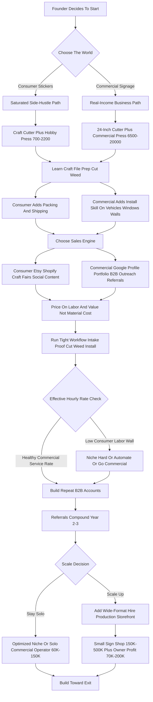
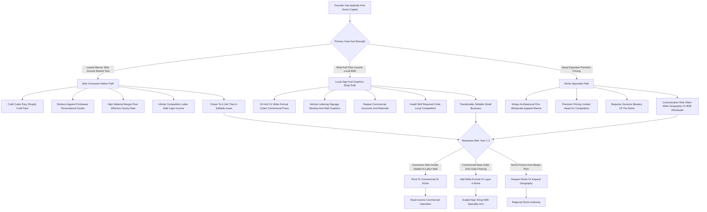

**TL;DR:** To start a vinyl decals business in 2027, you buy a vinyl cutter, a heat press, and rolls of adhesive and heat-transfer vinyl, then turn flat material that costs pennies per square foot into stickers, signage, apparel graphics, wall art, and vehicle decals that sell for **$5 to $2,500 per job**. The model is **real, low-barrier, and genuinely profitable on materials -- but crowded at the bottom and won or lost on which customer you choose to serve**. The entire economics rest on one distinction most beginners never make: the difference between selling **cheap commodity stickers to consumers** (a race to the bottom against a million Etsy sellers and Cricut hobbyists) and selling **applied signage and graphics to businesses** (vehicle lettering, storefront windows, wall murals, fleet decals, trade-show graphics) where the buyer is paying for a problem solved, not a sticker. A $40-$120 roll of Oracal 651 or Siser EasyWeed yields hundreds of decals; a single vehicle-lettering job billing $300-$900 consumes maybe $15 of vinyl. That gap is the business -- but only if you can install cleanly, sell to commercial buyers, and stop competing on a $4 die-cut sticker. The honest 2027 economics: a focused solo startup invests **$1,500-$15,000** in a cutter, press, software, vinyl inventory, and a basic web presence, runs at a **65-85% material margin** (far lower once you price your own labor honestly), and in a disciplined Year 1 generates **$15K-$70K in revenue** against **$8K-$40K in owner profit** -- thin if you chase consumer stickers, far healthier if you land recurring B2B sign work. By Year 2-3 a well-run operation reaches **$70K-$250K** with **$35K-$120K in owner profit**, at which point the founder chooses between staying a solo Etsy-and-craft-fair maker, building a local B2B sign-and-graphics shop with a wide-format printer, or going niche (wraps, architectural, decals-for-manufacturers wholesale). The three things that kill vinyl decal startups: **(a) competing on price in the consumer sticker market**, where margins are real per-unit but the volume to make a living is brutal and the competition is infinite; **(b) underpricing the design, weeding, and installation labor**, treating skilled hand-work as free because the vinyl is cheap; and **(c) never graduating from a Cricut hobby to an actual business** -- no commercial cutter, no B2B pipeline, no repeat accounts. Net: viable in 2027 as a disciplined, B2B-leaning, install-capable graphics operation -- a poor fit for anyone who thinks "I have a Cricut" is a business plan.

## What A Vinyl Decals Business Actually Is In 2027

A vinyl decals business takes thin, flexible, adhesive-backed plastic film and converts it -- by cutting, layering, weeding, and applying -- into a finished graphic that goes onto a surface and stays there. That surface might be a coffee mug, a laptop, a storefront window, a delivery van, a gym wall, a hard hat, a trade-show booth, a boat hull, a race car, a real-estate yard sign, or a t-shirt. You are not, fundamentally, in the sticker business; you are in the business of putting a customer's words, logo, or image onto a thing they own, durably and cleanly. The raw material is astonishingly cheap -- a 12-inch by 50-foot roll of quality outdoor sign vinyl runs $40 to $120 and yields hundreds of square feet of cut graphics -- which is why the business attracts a flood of entrants and why the material margin looks intoxicating on a spreadsheet. But the cheapness of the vinyl is also the trap. Because anyone can buy a $300 Cricut and a roll of vinyl, the consumer end of this market -- die-cut stickers, personalized tumblers, custom shirts sold on Etsy and at craft fairs -- is one of the most saturated small-business categories in existence, and the per-unit profit, while real, is measured in single dollars against hours of design, cutting, weeding, and packing. The version of this business that actually pays a living wage in 2027 is the version that sells to organizations: a plumber who needs his three trucks lettered, a new restaurant that needs window graphics and a menu board, a CrossFit gym that wants its logo eight feet wide on the wall, a manufacturer that needs ten thousand UL-spec warning labels, a realtor who needs fifty yard signs. Those buyers are not price-shopping a $4 sticker; they are buying a solved problem, on a deadline, and they will pay $150, $600, $2,000 for it -- and they come back. So the honest definition of a vinyl decals business in 2027 is this: it is a graphics-application service that happens to use cheap material, and the founders who succeed understand that the skill, the equipment quality, the install ability, and the customer relationships are the business -- the vinyl is just what it is printed and cut from.

## The Two Worlds: Consumer Stickers Versus Commercial Signage

The single most consequential decision a founder makes -- more than equipment, more than software -- is which of the two worlds of this business they are entering, because they have almost nothing in common except the raw material. **The consumer sticker world** is die-cut stickers, decals, personalized drinkware, custom apparel, wedding and party favors, laptop and water-bottle decals, and craft-fair goods. The buyer is an individual, the order is small, the price is $3 to $40, the sales channel is Etsy, Shopify, Amazon Handmade, Instagram, TikTok Shop, and in-person craft fairs and markets. The competition is effectively infinite -- millions of Cricut owners, established sticker shops with automated production, and overseas printers. The material margin is genuine (a sticker that costs $0.30 in material and sells for $5), but the labor is the whole story: every order must be designed or set up, cut, weeded, masked, packed, and shipped, and the realistic throughput of a solo maker caps the income hard. **The commercial signage world** is vehicle lettering and decals, storefront and window graphics, wall decals and murals, real-estate and yard signs, banners, trade-show and event graphics, fleet and equipment marking, safety and labeling decals, and wholesale cut vinyl for other sign shops. The buyer is a business, the order is $100 to $2,500-plus, the sales channel is local search, referrals, walk-ins, B2B outreach, and relationships with other trades. The competition is real but finite and local -- the established sign shops in your metro -- and crucially, the work is repeat: a business that gets its first truck lettered comes back for the second, the replacement, the new location's window. The labor here is also significant -- design, cut, weed, mask, and install -- but it is billed at service rates, not absorbed into a $5 price. The strategic reality: the consumer world is easy to enter and hard to make a living in; the commercial world is slightly harder to enter (you need install skill and a more capable cutter) and far easier to build a real income in. Most durable vinyl businesses are commercial-first, with consumer work as an optional, lower-priority add-on -- not the reverse.

## The Equipment: Cutters, Presses, And The Hobby-To-Business Line

The equipment a founder buys is the clearest signal of which business they are actually building, and the line between a hobby and a business runs straight through the cutter. **Entry-level craft cutters** -- the Cricut Maker 3, Cricut Explore 3, and Silhouette Cameo 5 -- cost roughly $250 to $450, cut vinyl up to about 12 to 13 inches wide off a roll, and are genuinely capable for stickers, apparel transfers, drinkware, and small decals. They are how most people start, and for a pure consumer-sticker side hustle they are sufficient. Their limits are real: cut width, durability under volume, software lock-in (Cricut Design Space ties you to Cricut's ecosystem and historically to subscription friction), and the simple fact that they are consumer appliances not built for all-day production. **Prosumer and entry-commercial cutters** -- the Silhouette Cameo 5 Pro (around 15 inches), USCutter and Vinyl Express machines, and the widely-recommended step-up, the Roland CAMM-1 GS-24 (about 24 inches wide, roughly $2,000-$2,500) -- are where the business gets serious. A 24-inch servo-driven cutter handles full rolls, cuts cleanly all day, manages contour-cut registration for printed-then-cut graphics, and opens vehicle and large-format work. **Wide-format print-and-cut systems** -- Roland's TrueVIS series, the Roland VersaSTUDIO BN2-20, the Roland CAMM-1 GR-640, Graphtec FC and CE plotters, and eco-solvent or latex printer-cutters -- run from several thousand to $20,000-plus and let a shop produce full-color printed graphics (photographic wraps, multi-color signage, printed stickers at scale) rather than only solid-color cut vinyl. **Heat presses** -- the Cricut EasyPress and AutoPress at the hobby end, and Stahls' Hotronix (the STX, the Fusion IQ, the MAXX) and Geo Knight at the commercial end -- are needed for any apparel and heat-transfer work; a clamshell commercial press runs $300-$1,500. Supporting gear: a laminator for protecting printed graphics, a weeding station and tools, application squeegees, a cutting mat and trimmer, transfer tape and application tape in volume, and eventually a wide-format laminator. The hobby-to-business line: if a founder is serious about commercial signage and vehicle work, the GS-24-class cutter is the real entry point, and trying to run a sign business off a 12-inch craft cutter is the single most common under-equipping mistake -- it caps the work you can take before you have even started.

## The Vinyl Itself: Materials, Brands, And Why Type Matters

A founder must understand vinyl as a materials category, because using the wrong film for the application is how decals fail, customers get angry, and a reputation dies young. **Adhesive (sign and craft) vinyl** is the pressure-sensitive film that goes onto hard surfaces -- windows, walls, vehicles, signs, drinkware, laptops. It splits into **calendared vinyl** (thicker, less conformable, lower cost, rated for a few years outdoors -- the workhorse for flat signage, lettering, and short-to-mid-term graphics; Oracal 651 is the industry-standard calendared film) and **cast vinyl** (thinner, highly conformable, longest outdoor life, the only correct choice for vehicle wraps and curved surfaces; Oracal 951, Avery Dennison, and 3M wrap films). It also splits by **permanent versus removable** adhesive -- removable for wall decals and short-term promotions, permanent for outdoor signage and vehicles. **Heat-transfer vinyl (HTV)**, also called iron-on, is the film that goes onto fabric with a heat press -- t-shirts, hoodies, bags, hats; Siser EasyWeed is the industry-standard HTV, with StarCraft, ThermoFlex, and specialty lines (stretch, glitter, holographic, reflective, printable HTV). **Specialty films** matter for differentiation and margin: reflective vinyl for safety and emergency-vehicle work, etched-glass and frosted film for office and storefront privacy graphics, perforated window film for one-way vehicle and storefront graphics, chrome and metallic, glow, color-change, and printable media for the print-and-cut shops. **Brands worth knowing:** Orafol (Oracal) and Avery Dennison and 3M dominate sign and wrap film; Siser, StarCraft, and ThermoFlex lead HTV; suppliers like USCutter, SignWarehouse, Specialty Graphics, and TheVinylStore are common B2B sources. The discipline this imposes: match the film to the job -- calendared 651 for a flat real-estate sign, cast 951 for a curved truck door, removable for a wall decal, reflective for a safety application -- because a founder who puts cheap calendared vinyl on a curved vehicle panel will watch it lift and fail within a season, and that one failed job costs more in reputation than the margin on twenty good ones.

| Vinyl type | Industry-standard product | Right use | Wrong use that fails |
|---|---|---|---|
| Calendared adhesive | Oracal 651 | Flat signs, lettering, windows, short-to-mid-term graphics | Curved vehicle panels and deep recesses |
| Cast adhesive | Oracal 951, Avery, 3M wrap film | Vehicle wraps, curved and contoured surfaces, long-term outdoor | Cheap flat jobs where calendared is enough |
| Removable adhesive | Oracal 631 and removable lines | Wall decals, short-term promos, interior graphics | Outdoor vehicle and permanent signage |
| Heat-transfer (HTV) | Siser EasyWeed, StarCraft, ThermoFlex | Apparel, bags, hats, fabric goods | Hard surfaces (it needs a heat press and fabric) |
| Specialty film | Reflective, etched-glass, perforated, chrome | Safety marking, privacy glass, one-way window graphics | Generic work where standard film is cheaper |

## The Core Unit Economics: Material Margin Versus Labor Reality

This is the section that separates founders who build a real income from founders who work for free, because the vinyl decals business has a seductive, misleading number at its center: the material margin. The material margin is genuinely high. A roll of Oracal 651 at roughly $0.20-$0.50 per square foot, or a sheet of Siser EasyWeed at well under a dollar, converts into product that sells for many multiples of the material cost -- a die-cut sticker costing $0.30 in material selling for $5, a vehicle lettering job consuming $15 of vinyl billing $400, a wall decal using $8 of film selling for $250. On materials alone, this looks like a 70-90% margin business. But the material is not the cost -- the labor is. Every single piece of work requires: design or file setup (artwork, vectorizing, layout, proofing), cutting, **weeding** (the slow, skilled, eye-straining hand-work of removing the negative vinyl from around the design -- this is the hidden time-sink of the entire industry), masking with transfer tape, and either packing-and-shipping (consumer) or driving-and-installing (commercial). For a $5 sticker, that labor might be ten to twenty minutes of cumulative human time across design, cut, weed, mask, pack -- which means the "70% margin" sticker is actually paying the maker something like $10-$20 an hour once labor is honestly counted, and that is before platform fees, shipping materials, and customer service. For a $400 vehicle job, the same labor stack -- but billed as a service -- might be three to five hours of skilled work, yielding a genuine $60-$100-plus per hour. **The unit economics lesson is brutal and clear:** the consumer-sticker business has a high material margin and a terrible effective hourly rate; the commercial-signage business has the same high material margin and a good effective hourly rate, because the price reflects the labor instead of hiding it. A founder who builds a P&L on material margin alone will conclude this is a goldmine; a founder who builds it on effective hourly rate will conclude they must either sell to businesses, automate consumer production heavily, or both.

| Job | Sale price | Material cost | Labor (design + cut + weed + mask + fulfill) | Effective hourly rate |
|---|---|---|---|---|
| Single $5 die-cut sticker | $5 | ~$0.30 | 10-20 min cumulative | ~$10-$20/hr (before platform fees) |
| Batch of 50 stickers | $250 | ~$20 | 5-10 hours | often below a regular-job wage after Etsy fees |
| Single-van door lettering | $450 | $15-$30 | 3-5 hours skilled work, billed as a service | ~$60-$100+/hr |
| Storefront window graphics | $100-$1,000+ | small | priced by size and complexity as a service | strong service-rate margin |

## The Line-By-Line Job Economics And P&L

A founder needs to internalize the real cost stack of a representative job, because the gross margin and the hidden costs determine whether revenue becomes profit. Take a representative commercial job: lettering a single contractor's work van -- company name, phone, services, license number on both doors and the rear -- billing roughly $450. The costs stack in an order beginners underestimate. **Material:** cast or quality calendared vinyl, transfer tape, application fluid -- genuinely small, perhaps $15-$30. **Design and file setup:** taking the customer's logo (often a low-resolution image that must be redrawn or vectorized), laying out the door copy, proofing -- one to two hours, and a real cost whether billed separately or absorbed. **Production:** cutting and weeding the lettering -- often the longest single block of hand-time, one to three hours for a full van. **Installation:** cleaning the panels, measuring and positioning, applying, squeegeeing out bubbles, post-heating where needed -- one to two hours on-site, plus drive time. **Overhead allocation:** the cutter and press depreciation, software subscriptions, the portion of shop rent or home-shop cost, vehicle and fuel for the install, insurance. Net the job out and a healthy commercial vinyl operation runs a **40-65% gross margin after all labor and overhead** -- nowhere near the 80%+ that material-margin math implies, but a genuinely strong service-business margin. Now the consumer comparison: a batch of fifty $5 die-cut stickers billing $250. Material maybe $20. But design, cutting, weeding fifty individual designs, masking, packing into fifty envelopes, printing fifty shipping labels, and managing fifty customer interactions and the inevitable shipping issues -- the labor can run five to ten hours, and after Etsy fees (listing, transaction, payment processing, and ad costs that effectively run 10-20%+ of revenue) and shipping materials, the effective hourly rate is often below what the same person could earn in a regular job. At the business level, the founders who fail at the P&L almost always made the same error: they priced off material cost, gave away design and weeding and install time, and never noticed that the labor -- not the vinyl -- was the entire cost structure of the business.

## The Three Models: Solo Maker, Local Sign Shop, And Niche Specialist

There are three distinct ways to build this business, and choosing deliberately shapes everything downstream. **The solo maker model** is the Etsy-and-craft-fair operation: a craft cutter, a heat press, a consumer storefront, and a focus on stickers, apparel, drinkware, and personalized goods. Its advantage is the lowest possible barrier to entry -- a few hundred dollars and a kitchen table -- and a genuine ability to earn side-hustle income and test the market. Its hard ceiling is the labor wall: a solo maker's income is capped by how many small orders one pair of hands can design, cut, weed, and ship, and the price points are low and competitive. This model works as a side income, a market test, or a stepping stone -- and works poorly as a sole full-time income unless it niches hard or automates. **The local sign-and-graphics shop model** is the commercial business: a 24-inch or wide-format cutter (often eventually a print-and-cut system), a commercial press, install capability, and a B2B focus on vehicle lettering, signage, window and wall graphics, banners, and yard signs. Its advantage is real revenue per job, repeat commercial accounts, finite local competition, and a clear path to a genuine full-time income and even employees. Its challenge is more equipment investment, the need for install skill, and learning to sell to businesses. This is the model that most reliably produces a living. **The niche specialist model** goes deep on one high-value category: vehicle wraps (a distinct, skill-intensive, high-ticket craft of its own), architectural and etched-glass film, boat and marine graphics, wholesale contour-cut decals for other sign shops and manufacturers, large-format wall murals, or a specific vertical like decals for breweries or gyms. Its advantage is premium pricing, deep expertise, less head-on competition, and often serving a wide geography or B2B-wholesale base. Its challenge is concentration risk and the need to genuinely master the niche. Many durable operators start as a solo maker to learn the craft and the equipment, build into a local sign shop for the steady income, and then layer a niche specialty on top for margin. The wrong move is staying a solo consumer maker by default and wondering why it never becomes a living.

## The 2027 Market Reality: Demand, Competition, And What Changed

A founder needs an accurate read of the 2027 landscape, because the business is neither the easy goldmine the YouTube tutorials imply nor a saturated dead end. **Demand is broad and durable.** Vehicle decals and fleet lettering, small-business signage, window and wall graphics, real-estate signage, event and trade-show graphics, apparel and team gear, and the steady consumer appetite for personalized stickers and drinkware -- these are not trends, they are permanent categories tied to the basic fact that businesses must mark their vehicles, storefronts, and products, and individuals like personalized things. The post-2020 surge in small-business formation kept the commercial-signage demand structurally healthy. **The competition is sharply bifurcated -- and this is the defining feature of the 2027 market.** The consumer end is saturated to an extreme degree: the democratization of cutting via Cricut and Silhouette (Cricut alone has had on the order of ten million-plus registered users) flooded Etsy and craft fairs with sticker and apparel sellers, and overseas and high-volume domestic print shops compete on price and speed. Margins per unit survive, but the volume to make a living against that competition is punishing. The commercial end is competitive but finite and local: every metro has its established sign shops, but it is a knowable competitive set, the work is relationship-and-reliability-driven, and there is real room for a responsive, well-equipped new entrant. **What changed by 2027:** cutting got radically more accessible, which saturated the consumer end and raised the bar for differentiation; print-and-cut technology got cheaper and better, lowering the barrier to full-color work; design tooling -- including AI-assisted vectorization, background removal, and layout -- sped up file prep and modestly lowered the skill barrier; e-commerce and print-on-demand made the consumer end even more crowded; and small-business buyers increasingly expect to find, quote, and order from a sign shop online. The net market reality: demand is real and broad, the consumer end is a brutal place to try to earn a full-time living, the commercial end is where a disciplined entrant builds a business, and the winning 2027 operator competes on equipment capability, install quality, turnaround, and B2B relationships rather than on being the cheapest sticker on Etsy.

## Design Software And The File-Prep Workflow

In 2027 a vinyl business runs on its design software and its file-prep discipline, and a founder should build this stack deliberately because sloppy file prep is a top source of wasted vinyl and failed jobs. **Vector design software is the core**, because cutting requires clean vector paths -- the cutter follows lines, not pixels. **Adobe Illustrator** is the industry standard for professional sign and graphics work, with the deepest toolset and universal file compatibility, on a subscription. **CorelDRAW** is the traditional sign-industry mainstay, especially in established sign shops, and remains widely used. **Affinity Designer** is a strong one-time-purchase alternative that has taken real share from subscription tools. **Inkscape** is the capable free, open-source vector editor -- genuinely usable for a startup minimizing cost. **Cutter-specific software** sits alongside: **Cricut Design Space** (free but ecosystem-locked to Cricut machines), **Silhouette Studio** (free basic tier, paid upgrades, for Silhouette machines), and professional cut software like **VinylMaster, SignCut, FlexiSIGN, and Roland's CutStudio/VersaWorks** that drives commercial cutters and RIP software for print-and-cut. **Canva** and similar template tools serve quick consumer-side layout but are not a substitute for vector cut-file prep. The file-prep workflow that disciplined shops run: receive or create artwork; vectorize and clean it (AI-assisted vectorization tools have made this faster, but a redrawn logo still often beats an auto-traced one); lay out for the material and the cut, accounting for weeding-friendliness (avoiding tiny fragile elements, adding weeding boxes); set cut parameters for the specific vinyl and blade; do a test cut; then run production. The strategic point: a founder can start cheap with Inkscape and the free cutter software, but the file-prep skill -- clean vectors, smart layout, correct cut settings -- is non-negotiable, because every shortcut at the file stage shows up as wasted material, bad cuts, and frustrating weeds at the production stage.

## Sales Channels: Where Vinyl Work Actually Comes From

A founder must understand that the sales channel is downstream of the model choice, and the two worlds sell in completely different places. **For the consumer-sticker side, the channels are e-commerce and in-person retail.** **Etsy** is the default marketplace -- enormous buyer traffic, but saturated, fee-heavy (listing, transaction, payment, and increasingly ad costs), and a race-to-the-bottom on price for generic designs. **Shopify** gives the maker an owned storefront with better margins but requires driving your own traffic. **Amazon Handmade, eBay, and TikTok Shop** are additional marketplaces, the last increasingly relevant for impulse and viral products. **Instagram and TikTok** are the discovery and marketing engine for consumer makers -- the business is as much content as product. **In-person craft fairs, markets, and pop-ups** are a genuine and underrated channel -- direct sales, no platform fee, immediate cash, and real customer feedback. **For the commercial-signage side, the channels are local and relationship-driven.** **Local search and a Google Business Profile** are the front door -- businesses searching "vehicle lettering near me" or "window graphics [city]" are high-intent buyers. **A professional website** with a portfolio of real installed work converts those searches. **Walk-in and drive-by** matter if there is a shop with signage of its own. **B2B outreach and relationships** are the core engine: relationships with other trades and businesses that constantly need signage -- contractors, real-estate agents and brokerages, property managers, fleet operators, restaurants and retailers, gyms, event companies, and crucially **other businesses in the trades referral web**. **Wholesale relationships with other sign shops** -- doing contour-cut or overflow work for shops without a certain capability -- is a quiet B2B channel. **Repeat and referral business** is the largest channel for an established commercial shop: a business that got its first van done comes back and tells the contractor next door. The strategic reality: a founder chasing the consumer model is signing up for a content-marketing-and-marketplace-fee grind; a founder building the commercial model is signing up for local-search, portfolio, and relationship work -- and the latter compounds while the former resets with every algorithm change.

## Pricing: How To Charge For Vinyl Work Without Working For Free

Pricing is where the vinyl business is most commonly broken, because the cheap material constantly tempts the founder to price low -- and a founder must build pricing on labor and value, not on material cost. **The wrong method, which nearly everyone starts with, is cost-plus on material** -- "the vinyl cost me $2, I'll charge $8." This ignores the design, cutting, weeding, masking, and install labor that is the actual cost of the business, and it produces prices that cannot pay a living wage. **The right methods layer together.** For consumer products, **price by product tier with the labor and platform fees built in** -- a small die-cut sticker at $4-$8, a medium decal at $10-$30, a custom drinkware piece at $15-$35, a custom shirt at $20-$40 -- and protect the bottom with **order minimums and bulk pricing** so a tiny order does not cost more in labor than it earns. For commercial work, **price by the job as a service**, with the components made explicit even if presented as one number: a **design/setup fee** ($25-$150-plus depending on whether artwork is print-ready or must be redrawn), the **production and material**, and the **installation** (priced by complexity, surface, size, and site -- a flat window is fast, a curved vehicle panel or a high wall is not). Representative 2027 commercial pricing: vehicle door lettering $150-$500, a full set of vehicle decals and lettering $300-$1,200, a vehicle partial graphics or simple wrap entering the four figures and a full wrap $2,000-$5,000-plus, storefront window graphics $100-$1,000-plus by size and complexity, a wall decal or mural $100-$2,500, a yard sign $15-$50 each with quantity breaks, a banner $50-$300. **Charge for design time** -- it is real, skilled work, and giving it away trains customers to expect free creative. **Charge for install time honestly** -- it is the part a competitor with only a craft cutter cannot do, and it is worth a premium, not a discount. The discipline: a founder who prices off material will always feel busy and broke; a founder who prices the design, the production, the install, and the value to the customer's business builds a margin that survives.

| Job type | Representative 2027 price | What the price is really for |
|---|---|---|
| Small die-cut sticker | $4-$8 | Material plus batched production labor and platform fees |
| Medium decal (8-12 in) | $10-$30 | Design setup plus cut, weed, mask |
| Custom apparel (HTV shirt) | $20-$40 | Garment, HTV, press time, design setup |
| Yard sign (each, with breaks) | $15-$50 | Substrate, print/cut, volume efficiency |
| Vehicle door lettering | $150-$500 | Design, vectorizing, cut, weed, on-site install |
| Full vehicle lettering set | $300-$1,200 | Multi-panel design, production, multi-hour install |
| Storefront / window graphics | $100-$1,000+ | Design, production, on-site install by size and height |
| Wall decal or mural | $100-$2,500 | Design, large-format production, skilled wall install |
| Vehicle partial / full wrap | $2,000-$5,000+ | Design, cast film, advanced conforming install |

## Installation: The Skill That Separates A Business From A Hobby

Installation is the single capability that most cleanly divides a vinyl hobby from a vinyl business, and a founder who wants commercial revenue must treat install as a core skill to be genuinely learned. Anyone can cut a decal; applying it cleanly to a real-world surface -- a dusty van panel in a parking lot, a tall storefront window, a textured wall, a curved boat hull -- is a craft. **The fundamentals:** surface preparation (cleaning, degreasing, sometimes addressing temperature and humidity), accurate measurement and positioning (a crooked logo on a customer's $40,000 van is a disaster), the application technique itself -- **wet application** with a slip solution for large flat graphics like windows, **dry application** for lettering and smaller pieces, **hinge methods** for positioning large graphics -- bubble and wrinkle removal with squeegees, edge sealing, and post-heating where the film and surface require it. **Vehicle work has its own depth:** conforming cast film into recesses and over curves, working around door handles and body lines, the difference between simple lettering and partial graphics and a full wrap (wraps are a distinct, advanced skill set worth treating as its own specialty). **Wall and architectural work** has its own challenges -- textured surfaces, paint adhesion, large-format positioning, removability for the customer later. **The business implications are direct:** install capability lets a founder charge service rates instead of product rates, take the high-ticket jobs, and build the repeat commercial accounts that are the heart of a durable shop; it is also where a job most visibly succeeds or fails in front of the customer. Install skill is built through practice, through manufacturer and industry training resources, and through doing -- and a founder serious about the commercial model should invest in learning it deliberately rather than hoping to wing it, because the install is, quite literally, the part of the business the customer watches happen.

## The Startup Cost Breakdown: The Honest All-In Number

A founder needs a clear-eyed total of what it costs to launch, and the honest answer is that it spans a wide range depending entirely on which business is being built. **The lean consumer-maker launch:** a craft cutter (Cricut Maker 3 or Silhouette Cameo 5) at $250-$450, a hobby heat press (Cricut EasyPress or similar) at $100-$300, starter vinyl and HTV inventory at $150-$400, transfer tape and tools at $50-$150, design software (Inkscape free, or a modest subscription) at $0-$300, an Etsy or Shopify presence and basic branding at $50-$400, and packaging and shipping supplies at $50-$200. **Total lean consumer launch: roughly $700-$2,200** -- genuinely one of the lowest-barrier businesses to enter, which is exactly why it is saturated. **The commercial sign-shop launch:** a 24-inch commercial cutter (Roland CAMM-1 GS-24 class) at $2,000-$2,500, a commercial heat press at $300-$1,000 (if doing apparel), professional design software at $300-$700 (or subscription), a substantial vinyl inventory across calendared, cast, HTV, and a few specialty films at $500-$1,500, transfer tape and application tools and a weeding station at $200-$600, a laminator if doing printed work at $500-$3,000, a professional website and branding and a Google Business Profile at $500-$3,000, install tools and supplies at $200-$600, business formation, licensing, and insurance at $500-$2,000, and working capital at $1,000-$5,000. **Total commercial launch: roughly $6,500-$20,000.** **The print-and-cut shop launch** adds a wide-format printer-cutter ($5,000-$25,000-plus) and a wide-format laminator, pushing the total well into five figures. Financing softens the equipment lines -- the cutter and printer are tangible assets that can be financed or leased -- but the founder still needs cash for inventory, software, the web presence, and working capital. The capital reality is the key filter: the consumer model is cheap enough that almost anyone can start, which is its blessing and its curse; the commercial model costs real money but buys a business with a real income ceiling. The dangerous middle is the founder who spends consumer-launch money, builds a consumer-launch capability, and then expects commercial-launch income.

## The Year-One Operating Reality

A founder should walk into Year 1 with accurate expectations, because the gap between the tutorial version and the real version of this business is where most quitting happens. Year 1 is **skill-building and pipeline-building, not profit-extraction.** The first months are spent learning the equipment (every cutter has a learning curve of blade depth, force, material settings, and the maddening art of a clean weed), learning the materials (which film for which job, how cast differs from calendared in the hand), learning the software and file prep, and -- for the commercial founder -- learning to install. It is also spent discovering where the work actually comes from: the consumer founder learns how brutal Etsy competition and fees are and how many hours a craft-fair weekend really takes; the commercial founder learns that B2B work comes from showing up, building a portfolio, and relationships, and that the first jobs are slow to land. A disciplined Year 1 realistically generates **$15,000-$70,000 in revenue** -- the low end for a consumer side hustle, the higher end for a focused commercial founder who lands a few recurring accounts -- against **$8,000-$40,000 in owner profit**, which is real but earned through a steep learning curve and a lot of unbilled practice. The consumer founder discovers the labor wall; the commercial founder discovers that the second and third jobs from the same customer are where the business gets good. The work is genuinely hands-on: the founder is the designer, the cutter operator, the weeder, the installer, the salesperson, and the bookkeeper. The founders who succeed treat Year 1 as paid tuition in a craft-and-sales business and use it to find their model, their niche, and their first repeat accounts; the ones who fail expected the material margin to be the business and were unprepared for the labor, the competition, and the slow build of a commercial pipeline.

## The Multi-Year Revenue Trajectory

Mapping a realistic multi-year arc helps a founder size the opportunity honestly. **Year 1:** equipment and skill learning, model-finding, first accounts, $15K-$70K revenue, $8K-$40K owner profit, founder doing everything, the consumer-versus-commercial path becoming clear. **Year 2:** the founder has a model, a portfolio, and -- if commercial -- a handful of repeat accounts and referral flow; equipment may step up (a GS-24 for the maker who went commercial, or a print-and-cut system); revenue climbs to roughly **$40K-$150K** with owner profit around **$25K-$80K** as pricing discipline improves and repeat work compounds. **Year 3:** a real business with a system -- a defined niche or a solid local commercial base, possibly a wide-format printer, possibly a first part-time helper for production or weeding; revenue lands around **$70K-$250K** with owner profit roughly **$35K-$120K**, and the founder is choosing whether to stay solo-and-optimized or build a small shop. **Years 4-5:** for those who scale, a small sign-and-graphics shop with employees, a wide-format and contour-cut capability, a B2B account base, and possibly a physical storefront can run **$150K-$500K-plus** in revenue with owner profit of **$70K-$200K**; for those who stay solo, a highly optimized niche specialist or a well-run solo commercial operator can sustainably earn **$60K-$150K** as an owner-operator. These numbers assume the founder priced labor honestly, leaned commercial or niched hard on the consumer side, built install capability, and developed repeat accounts; they do not assume a consumer-sticker side hustle magically becomes a six-figure business, because that path is capped by the labor wall and the competition. A mature vinyl business is a real small business -- a graphics-application service with equipment, a portfolio, and a customer base -- a genuinely good outcome, but one earned through craft skill and sales discipline, not through the cheapness of the vinyl.

## Five Named Real-World Operating Scenarios

Concrete scenarios make the model tangible. **Scenario one -- Marisol, the disciplined commercial founder:** launches with about $9,000 into a Roland GS-24, a commercial press, real vinyl inventory, and a portfolio website; deliberately skips the Etsy grind and focuses on vehicle lettering and small-business signage, learns install properly, and lands a property-management company and two contractors as repeat accounts in Year 1; hits $52,000 revenue in Year 1, reinvests into a print-and-cut system, and reaches $190,000 by Year 3 with a part-time helper -- because every commercial account came back and referred others. **Scenario two -- the cautionary tale, Brandon:** spends $1,400 on a Cricut and a hobby press, opens an Etsy shop selling generic die-cut stickers and "funny" decals, and competes head-on with millions of identical shops; he sells real volume but after Etsy fees, ad costs, shipping, and the hours of design-cut-weed-pack-ship, his effective hourly rate is under $14, he never builds install skill or a B2B pipeline, and he quietly concludes after a year that "the vinyl business doesn't pay" -- when in fact the consumer-sticker corner of it doesn't. **Scenario three -- Priya, the niche specialist:** starts with a craft cutter doing apparel, discovers she is good at it, invests into a print-and-cut setup, and goes deep on one vertical -- custom team and event apparel and decals for local sports leagues, schools, and gyms -- becoming the known go-to for that specific need; by Year 4 she runs $160,000 in revenue at strong margins from a niche that has limited head-on competition. **Scenario four -- the Okafor family shop:** starts as a husband-and-wife solo commercial operation, builds steadily into a small storefront sign shop with a wide-format printer, two employees, and a full B2B account base across contractors, real estate, restaurants, and fleet customers; Year 5 revenue near $420,000, with the founders managing rather than weeding. **Scenario five -- Dale, the under-equipped commercial wannabe:** wants the commercial business and its income but tries to run it off a 12-inch craft cutter, turning away every vehicle and large-format job because he cannot physically cut the width; he competes only for small decals and lettering, never builds the capability the good jobs require, and stalls -- the canonical illustration of under-equipping for the model you actually want. These five span the realistic distribution: disciplined commercial success, consumer-grind failure, profitable niche, scaled shop, and under-equipped stall.

## Niche And Specialty Paths Worth Considering

Beyond the general models, a founder should understand the specialty paths, because for many operators a focused niche is the better business. **Vehicle wraps** are the highest-ceiling specialty -- partial and full wraps are a distinct, skill-intensive craft commanding $2,000-$5,000-plus per vehicle and $10,000-plus for fleet work, with real demand from businesses and limited competition because the install skill is a genuine barrier. **Architectural and etched-glass film** -- frosted, decorative, and privacy films for office buildings, conference rooms, and storefronts -- is a B2B specialty with good margins and repeat commercial-property demand. **Custom apparel and team gear** -- HTV-based shirts, hoodies, and uniforms for sports leagues, schools, businesses, and events -- is a high-repeat niche with seasonal surges. **Wholesale contour-cut decals** -- producing cut or printed-and-cut decals in volume for other sign shops, promotional-product companies, and manufacturers -- is a quiet B2B-to-B2B specialty that trades retail margin for volume and consistency. **Boat, marine, and powersports graphics** -- a niche with affluent customers and specialized film needs. **Wall murals and large-format interior graphics** -- for offices, gyms, schools, and retail -- a design-forward specialty. **Industrial and safety labeling** -- decals, placards, and marking for equipment and facilities -- an unglamorous but steady B2B niche. **Real-estate and political/event signage** -- volume yard-sign and corrugated-sign work with predictable demand cycles. The strategic point: the general local-sign-shop model is the most resilient starting point, but the specialty paths can deliver premium pricing and less head-on competition for a founder who genuinely masters the niche -- and many mature operators run a general commercial base with one specialty arm layered on top. The mistake is not choosing a niche; it is defaulting into the most crowded consumer corner because it had the lowest entry cost.

## Marketing And Building A Local Reputation

A founder must treat marketing as an ongoing core function, and the right marketing depends entirely on the model. **For the commercial founder, local visibility and proof are everything.** A **Google Business Profile** with photos of real installed work, reviews, and accurate service info captures high-intent local search. A **portfolio website** -- real jobs, real before-and-afters, the categories of work offered -- converts those searches and gives B2B prospects confidence. **Your own vehicle and shopfront are billboards** -- a sign maker whose own van is unlettered is a walking counter-advertisement, and a well-lettered vehicle parked at job sites generates inquiries. **B2B outreach and relationships** -- introducing the shop to contractors, real-estate offices, property managers, restaurants, gyms, and event companies, and to other trades who refer -- is the steady engine. **Reviews and referrals** compound: commercial customers who had a clean job and an easy experience refer their network, and the referral is the cheapest, highest-trust lead there is. **For the consumer maker, the marketing is content and marketplace optimization.** **Instagram and TikTok** -- showing the process, the satisfying weed, the finished product -- is the discovery engine, and the business is genuinely part content creation. **Etsy SEO and listing quality** -- titles, tags, photography, reviews -- determines marketplace visibility. **Craft fairs and markets** are both sales and marketing, building a local following. **Email and repeat-customer cultivation** turns one-time buyers into repeat ones. The strategic reality: the commercial founder's marketing builds a compounding local asset -- a reputation, a portfolio, a referral network -- while the consumer maker's marketing is a continuous content treadmill subject to platform algorithms. A founder should choose the model knowing the marketing reality that comes with it, and in both cases should treat marketing as a permanent function, not a launch task.

## Operations, Workflow, And Avoiding Wasted Vinyl

A founder should design the production workflow deliberately, because a disorganized vinyl operation bleeds material, time, and quality. **The job workflow** runs: intake and quote (capturing exactly what the customer needs, the surface, the size, the deadline); artwork and file prep (vectorizing, laying out, proofing -- and getting customer sign-off on a proof before cutting, because a customer-approved proof is the single best protection against costly remakes); material selection and staging; cutting with correct, tested settings; weeding (the time-sink -- organized lighting, good tools, and weeding-friendly file layout matter enormously here); masking with transfer tape; quality check; and packing-and-ship or drive-and-install. **Material discipline** is its own operational function: vinyl is cheap per square foot but waste adds up, and a shop that nests cuts efficiently, tracks roll inventory, stores film properly (cool, dry, rolled not folded), and uses offcuts for small jobs runs materially leaner than one that does not. **Equipment maintenance** -- replacing blades before they drag, keeping the press calibrated, cleaning the cutter -- prevents the failed cuts and bad transfers that waste both material and customer goodwill. **Proofing and approval** is the operational habit that prevents the most expensive mistakes: a spelling error or wrong phone number cut, weeded, masked, and installed on a customer's van is a full remake plus a furious customer; the same error caught on an emailed proof costs nothing. **Turnaround discipline** -- realistic timelines, communicated and met -- is a major differentiator in commercial work where customers are often on a deadline. The strategic point: the vinyl business rewards operational tidiness disproportionately, because the material is cheap enough to be treated carelessly and the labor is expensive enough that carelessness is costly -- the operators who run a tight proof-cut-weed-install workflow simply make more money per hour than the ones who improvise.

## Equipment Maintenance, Consumables, And The Real Ongoing Costs

A founder should understand the ongoing cost structure, because the vinyl business has real recurring costs beyond the headline material. **Blades** are a true consumable -- cutter blades dull and must be replaced regularly, and a dull blade causes incomplete cuts and tearing that waste material; this is a small but constant cost. **Cutting strips, mats, and rollers** wear and need periodic replacement. **Transfer tape and application tape** are consumed on essentially every job and are a real line item -- a shop goes through transfer tape faster than beginners expect. **Heat press maintenance** -- platen care, calibration, replacement of worn parts -- keeps apparel work consistent. **Print-and-cut shops** have a heavier consumable load: ink (eco-solvent or latex ink is a significant ongoing cost), printheads (expensive and wear-prone), maintenance cartridges and cleaning supplies, and laminate film. **Software subscriptions** -- Illustrator, RIP software, design tools -- are a fixed monthly cost. **Application fluids, cleaners, and squeegee felts** are minor but recurring. **The vinyl inventory itself** is a working-capital commitment -- a serious commercial shop holds a meaningful inventory across calendared, cast, HTV, and specialty films, and that inventory must be replenished. **Equipment depreciation and eventual replacement** -- cutters and presses do not last forever under production use, and a print-and-cut system especially has a finite service life -- is a real cost that the P&L must reserve for, not be surprised by. The discipline: the founders who think the material is the only cost are repeatedly surprised by the blade-tape-ink-software-maintenance stack; the founders who budget the full consumable and maintenance load price their work to cover it and are not blindsided when a printhead fails or the inventory needs a $1,500 replenishment.

## Risk Management, Insurance, And Business Structure

The vinyl decals business carries specific risks, and the 2027 operator manages each deliberately. **The botched-job risk** -- a misspelled decal, a crooked install, a film that fails prematurely because the wrong type was used -- is the most common and is mitigated by proof approval, install skill, correct material selection, and a clear policy on remakes. **Property-damage and liability risk** is real in the commercial model: applying graphics to a customer's vehicle, climbing to install a high storefront sign, working on a customer's premises -- these create exposure, and a founder needs **general liability insurance**, and if installing on vehicles, an understanding of garage-keepers or care-custody-and-control coverage for customer property in the shop's possession. **Commercial auto** matters if a vehicle is used for installs. **Equipment** -- the cutter and especially a wide-format printer -- represents real capital that warrants coverage. **Intellectual-property risk** is a genuine and underappreciated exposure: a vinyl business is constantly handed logos, characters, sports-team marks, and copyrighted images to reproduce, and cutting or printing protected IP -- a major brand's logo, a licensed character, a team mark -- without authorization is infringement; the disciplined operator declines clearly infringing requests and works from customer-owned or properly licensed artwork. **Customer-payment risk** -- a custom job that the customer refuses on completion -- is mitigated by deposits on commercial work and payment-up-front on consumer work. **Business structure:** most operators form an **LLC** for liability protection and tax flexibility; **sales tax** applies to both product sales and, in many jurisdictions, the service components, and must be collected and remitted correctly; clean separate business banking and bookkeeping from day one capture the deductible equipment, material, software, and vehicle costs and make the depreciation of the cutter and printer a real tax benefit. The throughline: the risks are manageable with insurance, proofs, deposits, correct materials, and IP discipline -- and the operators who get hurt are usually the ones who skipped the insurance, skipped the proof, or cut a logo they had no right to reproduce.

## Owner Lifestyle: What Running This Business Actually Feels Like

A founder should know what daily life in this business is like before committing, because the lived reality differs sharply by model. In the **consumer-maker model**, the day is design work, batch cutting, long stretches of weeding (a quiet, repetitive, eye-and-hand-intensive task that some find meditative and others find grinding), masking, packing orders, managing marketplace messages and the occasional shipping complaint, photographing and listing products, and creating social content. It is largely solitary, indoor, screen-and-hands work, and the rhythm is set by order flow and craft-fair weekends. In the **commercial sign-shop model**, the day is more varied: customer intake and quoting, design and proofing at the screen, production (cutting and weeding), and then getting out -- driving to job sites, prepping surfaces, installing in parking lots and storefronts and on ladders, in varying weather and conditions. It is part desk work, part craft work, part fieldwork, and part sales. By Year 2-3, a commercial founder may add a helper for production or weeding, shifting more of their own time to sales, design, and install. The emotional texture: there is genuine satisfaction in a clean weed, a perfectly straight install, a customer seeing their lettered van for the first time, and a logo that came out crisp; and real frustration in a tearing cut, a bubble that will not squeegee out, a customer who changes the artwork after approval, and the slow grind of building a pipeline. The income is real and can become a solid living, especially in the commercial and niche models, but it is earned through craft skill, hands-on work, and sales -- not extracted passively from cheap material. A founder who enjoys design, hands-on craft, working with their hands and tools, and -- for the commercial path -- meeting customers and being out in the field will find it genuinely rewarding; a founder who imagined a cheap-material, high-margin, low-effort business will be surprised by how much skilled labor every dollar of revenue actually requires.

## Common Year-One Mistakes That Kill The Business

A founder can avoid most failure modes simply by knowing them in advance, because the mistakes in this business are remarkably consistent. **Defaulting into the saturated consumer-sticker market** -- because it had the lowest entry cost -- and then being unable to make a living against infinite competition is the single most common strategic error. **Pricing off material cost instead of labor** -- "the vinyl was $2 so I'll charge $8" -- builds prices that cannot pay a wage. **Giving away design time** -- treating artwork, vectorizing, and layout as free -- trains customers to expect free creative and erases a real revenue line. **Giving away install time** -- discounting or absorbing the one skill a craft-cutter competitor cannot offer -- throws away the commercial model's biggest advantage. **Under-equipping for the model you actually want** -- trying to run a commercial sign business off a 12-inch craft cutter and turning away every job that needs more width. **Using the wrong vinyl for the application** -- cheap calendared film on a curved vehicle panel, permanent adhesive where removable was needed -- producing failures that destroy reputation. **Skipping the proof** -- cutting and installing without written customer approval and eating expensive remakes for spelling and layout errors. **Cutting copyrighted IP** -- reproducing brand logos, licensed characters, and team marks without authorization, an infringement exposure many beginners do not even recognize. **No B2B pipeline** -- relying entirely on a marketplace or walk-ins and never building the commercial relationships and referrals that are the real engine. **Under-budgeting consumables and maintenance** -- being surprised by blades, transfer tape, ink, and printhead costs. **No deposit on custom commercial work** -- and getting stuck with a custom job a customer walks away from. **Treating it as a hobby that happens to take money** -- no separate banking, no real pricing, no sales effort, and then wondering why it never became a business. Every one of these is avoidable; the founders who fail almost always made three or four of them, and the founders who succeed treated this list as a pre-launch checklist.

## A Decision Framework: Should You Actually Start This In 2027

A founder deciding whether to commit should run a structured self-assessment, because this model fits a specific person and badly misfits others. **Model clarity:** are you clear-eyed that the consumer-sticker path is a saturated, labor-walled side hustle and the commercial-signage path is where a real income lives -- and are you choosing deliberately rather than defaulting to the cheapest entry point? If you think "I'll start on Etsy and it'll grow into a business," reconsider. **Capital:** for the commercial model, do you have $6,500-$20,000 for a proper cutter, press, inventory, web presence, and working capital? The lean consumer launch is cheap, but it buys a side hustle, not a business. **Craft and hands-on aptitude:** are you willing to learn the genuine craft -- file prep, clean cutting, the patience of weeding, and especially install -- as skills, not shortcuts? This is a skilled-trades business wearing a cheap-material costume. **Sales orientation (for the commercial path):** are you willing to do B2B outreach, build a portfolio, cultivate relationships with contractors and businesses, and chase referrals? If you only want to make things and never sell, the consumer model is your ceiling. **Install willingness:** for commercial revenue, will you actually learn to install on vehicles, windows, and walls -- the skill that separates the business from the hobby? **Pricing discipline:** will you price the design, the production, the install, and the value -- not the $2 of vinyl? Corner-cutters on pricing work for free. **Local market fit:** is there enough small-business, vehicle, and signage demand in your area, and is the local commercial sign market not so dominated that a responsive new entrant has no room? If a founder answers yes across model clarity, capital, craft aptitude, sales orientation, install willingness, pricing discipline, and local market fit, a vinyl decals business in 2027 -- built on the commercial or niche model -- is a legitimate path to a $70K-$250K-plus business with a real owner income. If they answer no on model clarity or pricing discipline, they will likely build a frustrating consumer side hustle and conclude the industry does not pay. The framework's purpose is to convert "I have a Cricut" into an honest, structured decision about which version of this business is actually being built.

## Scaling Past The Solo Operator

The jump from a proven solo operation to a small shop with employees and a wide-format capability is its own distinct challenge, and a founder should approach it deliberately. The prerequisites for scaling: the solo operation must be genuinely profitable and have a documented workflow (intake, proof, cut, weed, install) that someone else can be trained on, a steady enough B2B pipeline that added capacity will be used, and the cash flow or financing to absorb the equipment step. The scaling levers: **add a wide-format print-and-cut system** to take full-color signage, printed decals, and wrap work the cut-only shop must turn away; **hire for the labor-intensive steps first** -- a production helper for cutting, weeding, and basic install frees the founder for design, sales, and complex installs, the highest-value work; **add install capacity** so the shop is not bottlenecked on the founder's own hands and ladder; **build the B2B account base deliberately** -- recurring commercial customers and a referral network are what make added capacity pay; **consider a physical storefront** once walk-in and visibility justify the rent, turning the shop itself into a marketing asset; and **deepen into a niche or a wholesale relationship** that uses the new capacity at good margins. The constraints on scaling: capital is the first (a wide-format system is a real investment, solved by reinvested profit or equipment financing), founder time and the training of others is the second (solved by documented workflow and hiring for production first), pipeline is the third (a job you can now produce but cannot sell is wasted capacity), and the founder's own willingness to shift from maker to manager is the fourth -- many vinyl founders love the craft and must consciously decide whether they want to scale away from it. The founders who scale well share one trait: they treated the solo years as a system-building exercise, so that growth was the repetition of a proven workflow rather than a series of expensive improvisations.

## Exit Strategies And The Long-Term Picture

Vinyl and sign businesses can be exited, and a founder should build with the eventual exit in mind. **Sell the operating business** -- an established sign-and-graphics shop with a wide-format and contour-cut capability, a B2B account base, a portfolio and reputation, equipment, trained staff, and clean books is a saleable small business; valuations run as a multiple of stabilized earnings, with the multiple driven by how much of the revenue is recurring B2B accounts versus owner-dependent project work, the condition and capability of the equipment, the strength of the reputation, and how documented the systems are. **Sell the assets** -- even absent a going-concern sale, commercial cutters, presses, and especially a wide-format printer-cutter have real resale value, a floor that pure-service businesses lack. **Transition to a key employee** -- a trained production lead or install specialist can be a credible successor in a documented operation. **Acquire or merge** -- a healthy shop can grow by absorbing a competitor's accounts and equipment, or position to be acquired by a larger regional sign company. **Wind down gracefully** -- the equipment retains value and a solo operator can simply sell the gear and let the business close. The honest long-term picture: the consumer-maker version is genuinely hard to sell as a business -- it is largely the founder's hands, designs, and content, with little transferable beyond inexpensive equipment. The commercial sign-shop version, by contrast, is a real, transferable small business -- equipment, accounts, reputation, and systems that have value to a buyer. A founder should think of a 2027 launch on the commercial model as building a tangible small business with multiple genuine exit paths, and a launch on the pure consumer model as building a personal income stream that, while it can be a good one, is closer to a job than to a sellable asset. That difference -- between building a business and building a busy job -- is, in the end, the same fork the founder chose at the very start between the two worlds of vinyl.

## The Final Framework: Building It Right From Day One

Pulling the entire playbook into a single operating framework: a founder who wants to start a vinyl decals business in 2027 and actually succeed should execute in this order. **First, choose the world deliberately** -- consumer stickers as a saturated, labor-walled side hustle, or commercial signage as the path to a real income; do not default into the cheap entry point and hope it grows. **Second, equip for the model you chose** -- a craft cutter is fine for a consumer side hustle, but a commercial business needs a 24-inch-class cutter (Roland GS-24 or equivalent) and, eventually, a wide-format print-and-cut system; under-equipping caps the business before it starts. **Third, learn the craft as craft** -- file prep and clean vectors, tested cut settings, the patience of a good weed, correct material selection, and -- for commercial revenue -- genuine install skill on vehicles, windows, and walls. **Fourth, know your materials** -- calendared versus cast, permanent versus removable, sign vinyl versus HTV versus specialty films -- and match the film to the job every time. **Fifth, price on labor and value, never on material** -- charge for design, for production, for install, and for the value to the customer's business; the cheap vinyl is a trap, not a pricing basis. **Sixth, build the right sales engine** -- for commercial, a Google Business Profile, a real portfolio, a lettered vehicle, and relentless B2B relationship and referral work; for consumer, marketplace optimization and a content habit. **Seventh, run a tight workflow** -- intake, written proof approval, efficient cut and weed, quality install, met deadlines -- because operational tidiness is disproportionately profitable when material is cheap and labor is expensive. **Eighth, protect the business** -- LLC, general liability and care-custody coverage, sales-tax compliance, deposits on custom commercial work, and IP discipline that declines to cut what you have no right to reproduce. **Ninth, budget the real ongoing costs** -- blades, transfer tape, ink, maintenance, software, inventory replenishment, equipment replacement. **Tenth, build repeat B2B accounts** -- the second and third jobs from the same customer, and the referrals they generate, are the actual engine of a durable shop. **Eleventh, decide consciously whether to scale** -- add wide-format, hire for production first, build a storefront, and accept the shift from maker to manager, or stay an optimized solo niche operator. **Twelfth, build toward a real exit** -- the commercial model with accounts, equipment, reputation, and systems is a sellable business; the pure consumer model is closer to a job. Do these twelve things in this order and a vinyl decals business in 2027 is a legitimate path to a real small business with a real owner income. Skip the discipline -- especially on choosing the world, equipping for it, and pricing the labor -- and it is a fast way to own a Cricut, a saturated Etsy shop, and the conclusion that "the vinyl business doesn't pay." The business is neither an easy goldmine nor a dead end. It is a real, craft-and-sales-driven graphics-application business, and in 2027 it rewards exactly one kind of founder: the deliberate one who treats it as the skilled service business it actually is rather than the cheap-material side hustle it pretends to be.

## The Operating Journey: From Equipment Choice To Stabilized Operation

## The Decision Matrix: Consumer Maker Vs Local Sign Shop Vs Niche Specialist

## Sources

1. **Cricut, Inc. (NASDAQ: CRCT) -- Company and Product Information** -- Maker of the Cricut Maker 3 and Explore craft cutters and the EasyPress; investor reporting on user base and revenue. https://cricut.com
2. **Silhouette America -- Cameo Cutter Product Documentation** -- Maker of the Silhouette Cameo 5 and Cameo 5 Pro cutters and Silhouette Studio software. https://www.silhouetteamerica.com
3. **Roland DGA Corporation -- CAMM-1 GS-24 and TrueVIS / VersaSTUDIO Documentation** -- Commercial vinyl cutters and wide-format print-and-cut systems; the GS-24 is the common entry-commercial cutter. https://www.rolanddga.com
4. **Graphtec America -- FC and CE Series Cutting Plotters** -- Commercial cutting plotter specifications and capabilities. https://www.graphtecamerica.com
5. **Brother International -- ScanNCut Cutting Machines** -- Consumer and prosumer cutting machine documentation. https://www.brother-usa.com
6. **USCutter -- Vinyl Cutters, Materials, and Supplies** -- Major US distributor of cutters, vinyl, heat presses, and sign-shop supplies. https://www.uscutter.com
7. **SignWarehouse -- Sign-Making Equipment and Materials** -- Distributor of cutters, vinyl, and sign-industry supplies and training. https://www.signwarehouse.com
8. **Orafol / Oracal -- Sign and Wrap Vinyl Specifications** -- Manufacturer of Oracal 651 calendared and 951 cast vinyl, the industry-standard sign films. https://www.orafol.com
9. **Avery Dennison Graphics Solutions -- Sign and Wrap Film Documentation** -- Manufacturer of cast and calendared sign and vehicle-wrap films. https://graphics.averydennison.com
10. **3M Commercial Graphics -- Vinyl and Wrap Film Documentation** -- Manufacturer of sign and vehicle-wrap films and application guidance. https://www.3m.com
11. **Siser North America -- EasyWeed Heat-Transfer Vinyl** -- Manufacturer of the industry-standard Siser EasyWeed HTV and specialty heat-transfer films. https://www.siser.com
12. **Stahls' -- Hotronix Heat Presses and Heat-Transfer Materials** -- Manufacturer of commercial Hotronix heat presses (STX, Fusion IQ, MAXX) and transfer media. https://www.stahls.com
13. **Adobe -- Illustrator Vector Design Software** -- Industry-standard vector design application for sign and graphics file prep. https://www.adobe.com
14. **CorelDRAW -- Graphics Suite for Sign and Print** -- Traditional sign-industry vector design and layout software. https://www.coreldraw.com
15. **Serif -- Affinity Designer Vector Software** -- One-time-purchase professional vector design alternative. https://affinity.serif.com
16. **Inkscape -- Free Open-Source Vector Editor** -- Free vector design software usable for cut-file preparation. https://inkscape.org
17. **Etsy, Inc. (NASDAQ: ETSY) -- Seller Marketplace and Fee Structure** -- Primary consumer marketplace for stickers, decals, and personalized goods; listing, transaction, and payment-processing fee documentation. https://www.etsy.com
18. **Shopify Inc. (NYSE: SHOP) -- E-Commerce Platform** -- Owned-storefront e-commerce platform for direct-to-consumer sellers. https://www.shopify.com
19. **Amazon Handmade -- Artisan Marketplace** -- Amazon's marketplace category for handmade goods including decals and apparel. https://www.amazon.com/handmade
20. **US Bureau of Labor Statistics -- Sign, Printing, and Graphic Design Occupational Data** -- Wage and employment data for sign makers, printing workers, and graphic designers. https://www.bls.gov
21. **US Small Business Administration -- Business Structure and Financing Guidance** -- Reference for entity selection, licensing, and small-business financing including equipment loans. https://www.sba.gov
22. **IRS -- Equipment Depreciation and Section 179 Guidance** -- Tax treatment of cutters, presses, and printers as depreciable business assets. https://www.irs.gov
23. **International Sign Association (ISA) -- Industry Data and Standards** -- Trade association for the sign, graphics, and visual-communications industry. https://www.signs.org
24. **Specialty Graphic Imaging Association (SGIA / PRINTING United Alliance)** -- Industry association covering wide-format, print-and-cut, and graphics production. https://www.printing.org
25. **Sign Builder Illustrated / Sign and Digital Graphics -- Trade Press** -- Industry journalism on sign-making equipment, materials, and shop operations.
26. **StarCraft and ThermoFlex (Specialty Materials) -- HTV Product Documentation** -- Specialty and competitor heat-transfer vinyl product references.
27. **TheVinylStore / Specialty Vinyl Distributors** -- B2B distributors of sign vinyl, HTV, transfer tape, and application supplies.
28. **GerberTechnology / Sign-Industry RIP and Cut Software References** -- Documentation for FlexiSIGN, VinylMaster, SignCut, and RIP software driving commercial cutters.
29. **US Patent and Trademark Office / Copyright Office -- IP Basics** -- Reference for trademark and copyright considerations when reproducing logos and characters. https://www.uspto.gov
30. **Insureon / Small-Business Insurance Resources** -- General liability, commercial auto, and care-custody-and-control coverage for sign and install businesses. https://www.insureon.com
31. **Wrap Institute / Vehicle Wrap Training Resources** -- Training references for the vehicle-wrap specialty and advanced install technique.
32. **SCORE -- Small Business Mentoring and Planning Resources** -- Business planning, pricing, and cash-flow guidance for small businesses. https://www.score.org
33. **State and Local Sales Tax Authorities -- Product and Service Taxability** -- Reference for sales-tax collection on product sales and service components.
34. **Craft Fair and Maker-Market Organizer Resources** -- Reference for the in-person consumer sales channel and its economics.
35. **Vinyl-Industry Operator Forums and Communities** -- Practitioner discussion of pricing, weeding, install technique, material selection, and the consumer-versus-commercial divide.

## Numbers

**Equipment Costs (2027)**
- Entry craft cutter (Cricut Maker 3, Explore 3, Silhouette Cameo 5): $250-$450
- Prosumer cutter (Silhouette Cameo 5 Pro): roughly $400-$550
- Entry-commercial cutter (Roland CAMM-1 GS-24, ~24 inch): roughly $2,000-$2,500
- Wide-format print-and-cut system (Roland TrueVIS / VersaSTUDIO / GR-640 class): $5,000-$25,000+
- Hobby heat press (Cricut EasyPress / AutoPress): $100-$400
- Commercial heat press (Stahls' Hotronix STX / Fusion / MAXX, Geo Knight): $300-$1,500
- Laminator (for protecting printed graphics): $500-$3,000+

**Material Costs And Margins**
- Calendared sign vinyl (Oracal 651, 12in x 50ft roll): $40-$120 per roll; roughly $0.20-$0.50 per square foot
- Cast wrap vinyl (Oracal 951, Avery, 3M): meaningfully higher per square foot than calendared
- Heat-transfer vinyl (Siser EasyWeed, by the sheet or roll): well under $1 per typical sheet
- Material margin (material cost vs sale price): 65-85%+ on material alone
- Gross margin after honest labor and overhead: 40-65% (commercial); far lower effective rate on low-price consumer stickers

**Representative Pricing (2027)**
- Small die-cut sticker (3-4 in): $4-$8
- Medium decal (8-12 in): $10-$30
- Custom drinkware piece: $15-$35
- Custom apparel (HTV shirt): $20-$40
- Yard sign: $15-$50 each (quantity breaks)
- Banner: $50-$300
- Vehicle door lettering (single vehicle): $150-$500
- Full vehicle lettering and decal set: $300-$1,200
- Storefront / window graphics: $100-$1,000+
- Wall decal or mural: $100-$2,500
- Vehicle partial graphics / full wrap: $2,000-$5,000+
- Design / file-setup fee: $25-$150+

**Startup Cost Breakdown**
- Lean consumer-maker launch (craft cutter, hobby press, starter vinyl, tools, basic web/branding, packaging): ~$700-$2,200
- Commercial sign-shop launch (24-in cutter, commercial press, inventory, software, website, install tools, formation, insurance, working capital): ~$6,500-$20,000
- Print-and-cut shop launch (adds wide-format printer-cutter and wide-format laminator): well into five figures, $15,000-$40,000+

**Per-Job Economics (Representative Single-Van Lettering, ~$450)**
- Material (vinyl, transfer tape, fluid): $15-$30
- Design / file setup: 1-2 hours
- Production (cut and weed): 1-3 hours
- Installation (prep, position, apply, on-site): 1-2 hours plus drive time
- Gross margin after all labor and overhead: 40-65%

**Multi-Year Revenue Trajectory (Owner Profit)**
- Year 1: $15,000-$70,000 revenue, $8,000-$40,000 owner profit (low end consumer side hustle, high end focused commercial)
- Year 2: $40,000-$150,000 revenue, $25,000-$80,000 owner profit
- Year 3: $70,000-$250,000 revenue, $35,000-$120,000 owner profit
- Years 4-5 (scaled small shop): $150,000-$500,000+ revenue, $70,000-$200,000 owner profit
- Years 4-5 (optimized solo / niche): $60,000-$150,000 sustainable owner income

**Ongoing / Consumable Costs**
- Cutter blades: regular replacement, small but constant
- Transfer / application tape: consumed on essentially every job
- Cutting strips, mats, rollers: periodic replacement
- Print-and-cut consumables: ink (significant), printheads (expensive, wear-prone), maintenance supplies, laminate film
- Software subscriptions: fixed monthly (Illustrator, RIP software)
- Vinyl inventory replenishment: meaningful working-capital commitment for a commercial shop

**Market Context**
- Cricut (NASDAQ: CRCT): on the order of 10 million+ registered users -- the scale of consumer-end saturation
- Etsy (NASDAQ: ETSY): effective seller fees (listing + transaction + payment processing + ad costs) commonly run 10-20%+ of revenue
- Demand categories (durable, not trends): vehicle/fleet lettering, small-business signage, window/wall graphics, real-estate signage, event/trade-show graphics, apparel, consumer personalized goods

## Counter-Case: Why Starting A Vinyl Decals Business In 2027 Might Be A Mistake

The case above describes a viable business, but a serious founder must stress-test it against the conditions that make this model a bad bet. There are real reasons to walk away.

**Counter 1 -- The easy-entry version is a saturation trap.** The thing that makes a vinyl decals business attractive -- you can start with a $300 Cricut and a roll of vinyl -- is exactly what makes the consumer end nearly impossible to earn a living in. Cricut alone has on the order of ten million-plus users, Etsy is flooded with sticker and decal shops, and overseas printers compete on price. A founder who enters where entry is easy is entering the single most crowded corner of the business.

**Counter 2 -- The material margin is a misleading number.** "The vinyl costs pennies and sells for dollars" is true and irrelevant. The material is not the cost -- the design, cutting, weeding, masking, and install labor is. A founder who builds a business case on material margin will discover that a "70% margin" $5 sticker actually pays a sub-$15 effective hourly wage once the real labor is counted.

**Counter 3 -- Weeding is slow, skilled, unglamorous labor that never goes away.** Every cut decal must be weeded by hand -- the negative vinyl picked away from the design -- and it is eye-straining, repetitive, and time-consuming. It is the hidden labor sink of the entire industry, it does not scale without hiring, and a founder who finds it tedious has found a core daily task of the business tedious.

**Counter 4 -- The commercial model requires real capital and real skill, not a Cricut.** The version of this business that pays a living wage needs a 24-inch-class commercial cutter, eventually a wide-format system, and genuine install skill on vehicles, windows, and walls. That is $6,500-$20,000-plus and a real apprenticeship in a craft. A founder who wants the commercial income but only the consumer investment will stall.

**Counter 5 -- Install is a craft, and a botched install is public.** Applying graphics cleanly to a customer's $40,000 van, a tall storefront window, or a textured wall is a genuine skill. A crooked logo, a bubbled panel, or film that lifts within a season is a visible, reputation-damaging failure -- and the customer watches the install happen. The founder who cannot install well is locked out of the profitable work.

**Counter 6 -- Using the wrong vinyl fails publicly and slowly.** Calendared film on a curved vehicle panel, permanent adhesive where removable was needed -- these mistakes do not fail immediately, they fail weeks or months later, in front of the customer, and the founder owns the remake and the lost reputation. Material knowledge is not optional, and beginners routinely lack it.

**Counter 7 -- Marketplace fees and algorithms own the consumer maker.** The Etsy seller does not control their traffic, their fees, or the rules. Listing, transaction, payment-processing, and ad costs commonly eat 10-20%+ of revenue, and an algorithm change or a fee increase can erase a margin overnight. The consumer maker is a tenant on someone else's platform.

**Counter 8 -- IP exposure is real and widely ignored.** Customers constantly ask for brand logos, licensed characters, and sports-team marks. Cutting or printing those without authorization is infringement, and many beginners do not even recognize the exposure. A founder who says yes to every logo request is building a liability, not just a business.

**Counter 9 -- The consumer model is closer to a job than a sellable asset.** A consumer-sticker operation is largely the founder's hands, designs, and social-media presence. There is little to sell -- inexpensive equipment and a marketplace shop that does not transfer well. A founder building it imagining an eventual exit is building a busy job, not a business with a resale value.

**Counter 10 -- The ongoing costs are larger than the headline material.** Blades, transfer tape, mats, software subscriptions, and -- for print shops -- ink and printheads and laminate are a real recurring stack. A founder who budgeted only for vinyl is repeatedly surprised, and a single printhead failure can be a four-figure event.

**Counter 11 -- The commercial pipeline is slow to build.** B2B sign work comes from a portfolio, relationships, referrals, and reputation -- none of which exist on day one. The commercial founder faces months of slow, low-paid early work building proof and relationships before the repeat-account engine turns over, and many quit during that build.

**Counter 12 -- Adjacent or different businesses may fit better.** A founder who loves design but not hands-on production might prefer freelance graphic design; one who loves the trades and hands-on install might prefer a broader signage or wrap business; one who wants e-commerce might prefer print-on-demand without owning equipment. Vinyl decals specifically rewards the craft-plus-sales operator, and for others it is the wrong expression of the underlying interest.

**The honest verdict.** Starting a vinyl decals business in 2027 is a reasonable choice for a founder who: (a) chooses the commercial or niche model deliberately rather than defaulting into saturated consumer stickers, (b) has the $6,500-$20,000-plus and the willingness to learn the genuine craft for the commercial path, (c) will price design, production, and install as real labor rather than off the cheap material, (d) will actually learn to install cleanly on real-world surfaces, (e) will build a B2B pipeline and repeat accounts patiently, and (f) understands and respects IP and material-selection discipline. It is a poor choice for anyone who thinks a craft cutter is a business plan, anyone who wants the consumer-sticker corner to magically become a full-time income, anyone unwilling to learn install, and anyone whose real interest would be better served by graphic design, a broader signage business, or platform-based print-on-demand. The model is not a scam, but it is more skill-dependent, more sales-dependent, and more capital-dependent on the income-producing end than its cheap-material surface suggests -- and in 2027 the gap between the deliberate commercial version that works and the default consumer version that disappoints is wide.

## Related Pulse Library Entries

- **q1965** -- How do you start a party rental business in 2027? (Adjacent equipment-and-service small business; the event-vendor world a sign maker also serves.)
- **q1970** -- How do you start a photo booth business in 2027? (Lighter-capital event-and-equipment adjacency with overlapping local-B2B customers.)
- **q1958** -- How do you start a cleaning business in 2027? (Local service-business operating model; B2B-versus-consumer pricing parallels.)
- **q1959** -- How do you start a handyman business in 2027? (Skilled hands-on local trade; truck-and-tools, install-skill operating bones.)
- **q1960** -- How do you start a real estate photography business in 2027? (Local B2B creative service; portfolio-and-referral sales engine.)
- **q1968** -- How do you start a florist business in 2027? (Small-business with both consumer and event/B2B channels and a craft core.)
- **q1969** -- How do you start a DJ business in 2027? (Event-vendor referral-web peer; equipment-plus-skill service model.)
- **q1971** -- How do you start a bounce house rental business in 2027? (Equipment-rental adjacency reachable through the same local-event network.)
- **q1955** -- How do you start a vacation rental business in 2027? (Capital-and-asset small business; depreciation and financing parallels.)
- **q1962** -- How do you start a furnished apartment business in 2027? (Asset-and-operations small-business model.)
- **q1946** -- How do you start a real estate investing business in 2027? (Capital deployment and depreciation parallels for equipment-heavy businesses.)
- **q1947** -- How do you start a property management business in 2027? (A core B2B customer type for vehicle lettering and signage work.)
- **q9501** -- A company sells $100 group workshops teaching older adults to use technology -- what is the right next move? (Benchmark entry; friction-point and model-choice analysis structure.)
- **q9502** -- How do you scale a workshop-led senior tech-training business in 2027? (Benchmark entry; the proven-path-past-the-solo-ceiling scaling structure.)
- **q9601** -- How do you start a fractional CFO business in 2027? (Financial discipline for pricing, margin, and capex decisions.)
- **q9701** -- What is the best inventory and rental management software in 2027? (Software-stack thinking applicable to a sign shop's design and production tools.)
- **q9702** -- How do you build standard operating procedures for a service business? (The intake-proof-cut-weed-install workflow SOPs a vinyl shop runs on.)
- **q9801** -- What is the future of the events industry in 2030? (Demand context for the event-graphics and trade-show segment of vinyl work.)
- **q1949** -- How do you start a short-term rental business in 2027? (Owner-operator-to-small-business scaling decision parallels.)
- **q1961** -- How do you start an Airbnb arbitrage business in 2027? (Low-barrier-entry business with a saturation-and-differentiation challenge, like consumer stickers.)
- **q1967** -- How do you start a catering business in 2027? (Event-vendor peer and a B2B customer for menu boards, window graphics, and labeling.)
- **q1966** -- How do you start an event venue business in 2027? (A B2B customer for signage, wayfinding, and event graphics.)
- **q1959b** -- How do you start a moving company in 2027? (Fleet-lettering customer and a hands-on local-trade operating parallel.)
- **q1958b** -- How do you start a junk removal business in 2027? (Truck-lettering customer and a low-barrier local-trade comparison.)
- **q9901** -- How do you price creative and skilled-labor services without working for free? (Directly relevant to the price-on-labor-not-material discipline central to this entry.)

