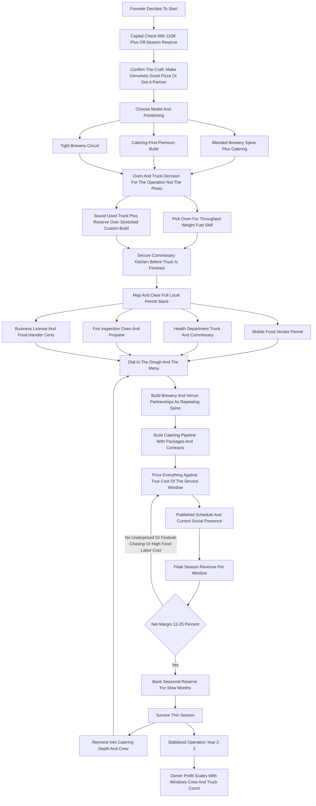
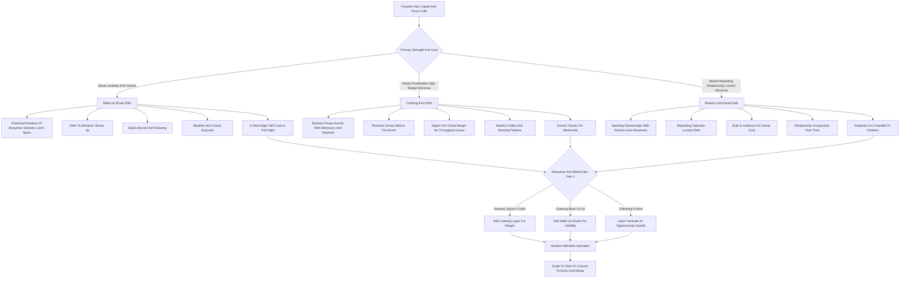

**TL;DR:** To start a pizza truck business in 2027, you build or buy a self-contained mobile kitchen built around a real pizza oven -- wood-fired, gas deck, or a high-output mobile unit -- secure a commissary kitchen and the stack of permits that mobile food requires, and then sell pizza two ways at once: **walk-up service** at breweries, festivals, farmers markets, and lunch spots, and **booked private catering** for weddings, corporate events, and parties. The model is **real and genuinely good, but it is a restaurant on wheels, not a passive cart**, and the entire economics rest on a number most beginners never calculate: **revenue per service window** -- how much you actually sell in the three-to-five-hour block a truck is open and staffed, against the fixed cost of being open at all. A pizza that costs $2.50-$4.00 in food and sells for $14-$26 looks like a 75-85% gross margin, and on the pizza alone it is -- but the truck payment, the commissary rent, the fuel, the insurance, the permits, and above all the **labor** turn that into a **12-25% net margin** for a disciplined operator and a negative one for an undisciplined one. The honest 2027 economics: a focused startup invests **$60K-$220K** in the truck build-out, equipment, permits, and working capital, runs at a **65-78% gross margin on food** but a **12-25% net margin** after all-in costs, and in a disciplined Year 1 generates **$120K-$320K in revenue** against **$25K-$75K in owner profit** -- heavily weighted toward whoever locks in repeating brewery slots and B2B catering instead of chasing one-off festival crowds. By Year 3-5 a well-run operation reaches **$350K-$900K in revenue** with **$70K-$220K in owner profit**, at which point the founder chooses between staying a lean single-truck operator, running a small fleet, or converting the proven concept and following into a brick-and-mortar pizzeria -- the path 800 Degrees, &pizza-adjacent concepts, and countless local operators actually walked. The three things that kill pizza truck startups: **(a) underpricing catering and walk-up against the true labor and commissary cost**, treating an 80% food margin as if it were the net; **(b) chasing festival and event spectacle instead of building boring, repeating brewery and corporate-lunch revenue**, which is where the steady money is; and **(c) under-capitalizing the build and the reserve**, then getting killed by a slow winter, a blown oven, or a truck breakdown. Net: viable in 2027 as a disciplined, throughput-obsessed, relationship-driven mobile restaurant -- a poor fit for anyone who wants light work, fast payback, or a food business without a truck, a commissary, late nights, and a crew.

## What A Pizza Truck Business Actually Is In 2027

A pizza truck business is a fully equipped mobile kitchen that produces and sells pizza at locations the customer comes to or that the customer hires you to come to. It is not a concession cart, it is not a catering company that happens to own a vehicle, and it is emphatically not a passive food brand -- it is a working restaurant compressed into a truck, with all of a restaurant's food cost, labor cost, health regulation, and nightly grind, minus the dining room and minus a fixed address. The core of the business is the oven. Everything else -- the dough process, the prep, the route, the booking calendar, the crew -- exists to feed a hot oven and move pizzas out of it as fast as quality allows. You make money two distinct ways, and the best operators run both: **walk-up service**, where you park at a brewery, a farmers market, a festival, an office park, or a busy corner and sell to whoever shows up; and **booked catering**, where a client -- a wedding, a corporate office, a birthday, a school -- pays a minimum and a per-guest rate to have you show up and feed their event. In 2027 the business is shaped by a few realities that did not fully exist a decade ago: customers find and follow trucks through social media and brewery event calendars rather than stumbling on them; breweries and taprooms without their own kitchens have become a structural, repeating revenue channel because they need food onsite and do not want to run a kitchen; corporate catering rebounded as offices brought people back and needed a reason to; mobile pizza oven technology -- from Ooni-scale units up through Forno Bravo, Marra Forni, and Gozney mobile builds -- made a genuinely good pizza achievable on a truck; and labor got more expensive and harder to find, which made throughput and crew efficiency the squeeze point. The pizza truck business is not trendy-passive and it is not easy. It is a logistics-and-throughput restaurant wearing a fun mobile costume, and the founders who succeed understand that the festival crowd is the customer's good time; the business is dough, a hot oven, a commissary, a route, a booking calendar, and a phone full of brewery and corporate relationships.

## Why Pizza Specifically Is The Right Mobile Food Bet

Among all mobile food cuisines, pizza occupies an unusually strong position, and a founder should understand why before committing. **The food cost is low and the perceived value is high.** A pizza's raw ingredients -- flour, water, salt, yeast, tomato, cheese, a few toppings -- cost $2.50-$4.00 for a personal-to-shareable pie that sells for $14-$26, a food-cost percentage at the favorable end of the entire food industry. **It is fast at the point of sale.** A properly run oven turns out a pizza in a handful of minutes, and a high-output oven plus a disciplined line can push real volume through a short service window -- throughput is the whole game in mobile food, and pizza is built for it. **It scales cleanly to catering.** A wedding or a corporate lunch is just many pizzas in sequence, and the per-guest economics of pizza catering are excellent because the food cost stays low while the per-guest price holds up. **It is universally appealing and low-friction.** Pizza does not require explaining, it feeds kids and adults and dietary ranges (a gluten-free crust, a vegan cheese), and it is the default crowd food -- which is exactly why breweries and events want it. **The dough is the moat and the constraint.** Great pizza is a craft -- the dough ferment, the oven management, the build -- and that craft is both the barrier that keeps the business from being trivially copied and the discipline a founder must actually master. The honest counterpoint: pizza's prep is real (the dough is made a day or more ahead, the ferment must be managed, the mise must be ready), the oven is the single most expensive and most failure-prone piece of equipment, and a bad pizza is obvious in a way a mediocre taco might not be. But weighed against other mobile cuisines, pizza's combination of low food cost, fast service, clean catering scaling, universal appeal, and a craft moat makes it one of the strongest mobile food bets in 2027 -- which is also why the space has competition.

## The Three Models: Walk-Up Route, Catering-First, And Brewery-Anchored

There are three distinct ways to build a pizza truck business, and choosing deliberately shapes the truck build, the staffing, and the calendar. **The walk-up route model** runs a published rotation -- this brewery Tuesday, that farmers market Wednesday, this office park Thursday, a festival Saturday -- and sells to whoever shows up. Its advantage is volume, brand visibility, and a following that compounds; its challenge is that revenue is weather-exposed and crowd-dependent, and a slow night still costs a full night of labor and fuel. **The catering-first model** treats walk-up as secondary and builds the business on booked private events -- weddings, corporate functions, parties, schools -- each with a minimum and a per-guest rate paid in advance. Its advantage is predictable revenue, higher per-event margin, no guessing at the crowd, and deposits that fund the operation; its challenge is that it is a sales-and-relationship business that needs a booking pipeline, and events cluster on weekends. **The brewery-anchored model** builds the spine of the week around standing partnerships with breweries and taprooms that have no kitchen and need reliable onsite food -- you become their regular pizza, week after week, and the brewery's own marketing pulls the crowd. Its advantage is repeating, relationship-locked revenue with a built-in audience and no venue cost; its challenge is dependence on a handful of partners and their foot traffic. In practice the strongest 2027 operators run a blend: brewery partnerships as the repeating spine of the week, catering as the higher-margin weekend and weekday-lunch layer, and walk-up festivals and markets as the visibility-and-volume opportunistic top. The wrong move is building the whole business on festivals -- the spectacle channel -- because festivals are expensive to enter, brutally weather- and crowd-dependent, and the opposite of repeating revenue.

## The 2027 Market Reality: Demand, Competition, And What Changed

A founder needs an accurate read of the 2027 landscape, because the pizza truck space is neither the easy-money play that social media suggests nor a saturated dead end. **Demand is structurally healthy and multi-channel.** The US food truck industry is a multi-billion-dollar category (IBISWorld tracks it well above $1.5B and growing), and pizza is consistently among the highest-margin and most-requested mobile cuisines. The demand drivers are durable: breweries and taprooms structurally need onsite food and increasingly do not run their own kitchens; corporate catering came back as offices reassembled; weddings and private events rebounded and normalized; festivals and farmers markets are a permanent fixture of local life. **The competition is real and bifurcated.** In most metros there is a long tail of food trucks of every cuisine competing for the same brewery slots and festival spots, plus established local pizza trucks with locked-in brewery relationships and a following, plus brick-and-mortar pizzerias that cater. The opportunity for a disciplined new entrant is to be more reliable, more consistent, and better at the dough than the long tail, and to lock in the repeating brewery and corporate relationships that the one-off festival operators never bother to build. **What changed by 2027:** mobile oven technology matured, so a genuinely good pizza on a truck is achievable; brewery-as-food-venue became a structural channel rather than an occasional gig; customers discover and follow trucks through social and brewery calendars, making consistency and a published schedule a real asset; POS and booking software (Square, Toast, event-booking tools) let a small operator run a professional booking, payment, and reporting operation; and labor cost and scarcity made crew efficiency and throughput the operational battleground. The net market reality: demand is real and multi-channel, the business is harder than the highlight reel because of the build cost, the regulation, and the labor, and the winning 2027 entrant competes on consistency, dough quality, and locked-in relationships rather than on novelty.

## The Core Unit Economics: Revenue Per Service Window

This is the single most important section in the guide, because the entire business lives or dies on a calculation beginners almost never run. A pizza truck is open for a **service window** -- a defined block of hours at a location -- and during that window it incurs the full cost of being open: a staffed crew, fuel to get there, the commissary and truck cost amortized, the food prepped whether or not it sells. The question that determines profitability is **how much revenue you actually generate per service window against that fixed cost of being open.** Consider the math concretely. A brewery night runs roughly four to five hours of service. The crew is two to four people for that window plus prep and drive and breakdown -- call it $200-$500 in fully loaded labor. Fuel, the amortized truck and commissary cost, supplies, and waste add another $80-$200. So the truck spends roughly **$280-$700 just to open** that night before a single pizza covers it. Now the revenue side: each pizza carries a **75-85% gross margin on food** -- a $2.50-$4.00 food cost on a $14-$26 pizza. If the truck sells 40 pizzas at an $18 average, that is $720 in revenue, maybe $560 in gross margin -- a thin or negative night after the cost of opening. If it sells 90 pizzas, that is $1,620 in revenue, roughly $1,250 in gross margin -- a genuinely good night. **The same truck, the same crew, the same cost of opening -- the difference between a loss and a strong profit is throughput and traffic.** This is why the channel mix matters so much: a brewery with a real crowd and the brewery's own marketing fills the window; a poorly chosen corner does not. It is why a published, consistent schedule that builds a following matters. It is why catering -- a booked event with a guaranteed minimum and a known guest count -- is so valuable: it removes the throughput guess. And it is why festival fees must be weighed against realistic per-window sales, not fantasy crowds. The discipline this imposes: **before committing to any location or gig, estimate the realistic revenue per service window and compare it to the full cost of opening.** A founder who books by revenue-per-window builds a calendar that compounds; a founder who books by what sounds fun books a calendar full of expensive, empty nights.

## The Line-By-Line Unit Economics And P&L

Beyond revenue per window, a founder must internalize the operating P&L, because the gap between an 80% food margin and a 15% net margin is where the business is actually won or lost. Take the costs in the order they stack. **Food cost** runs **28-35% of revenue** -- the flour, cheese (the single largest ingredient line and the most price-volatile), tomato, toppings, dough ingredients, and packaging; cheese price swings alone can move the whole food-cost number. **Labor** runs **25-32% of revenue** -- the crew on the line, prep labor at the commissary, the driver, and increasingly the owner's own paid time once the business can afford it; in mobile food, labor is the cost that quietly eats the margin because the crew is paid for the whole window whether it is busy or slow. **Commissary kitchen rent** is a fixed monthly cost most beginners forget entirely -- nearly every jurisdiction requires a licensed commercial commissary for prep, dough, storage, and truck cleaning, and that is $500-$2,500+ a month whether you serve one event or thirty. **The truck itself** -- the loan or lease payment, maintenance, and the genuinely expensive reality of repairs on a vehicle that also houses a kitchen -- is a fixed-plus-variable line. **Fuel** for the truck and often a generator. **Insurance** -- commercial auto, general liability, product liability, workers' comp -- is a real and non-optional line. **Permits and licenses** -- mobile food vendor permits, health department, fire inspection, business license, often per-event or per-jurisdiction fees -- recur and add up. **POS and software fees**, payment processing, marketing, and admin round out the overhead. **Equipment repair and replacement** -- and especially the oven, the most expensive and most failure-prone piece -- is an ongoing capital drip, not a one-time cost. Net it out and a disciplined pizza truck runs a **65-78% gross margin on food** but a **12-25% net margin** after everything, with the spread driven almost entirely by throughput per window, how honestly catering and walk-up are priced, and how tightly labor and waste are controlled. At the business level, seasonality compounds the P&L: most markets have a warm-season peak (festivals, weddings, outdoor brewery crowds) and a thin cold stretch, and the disciplined operator treats peak revenue as the reserve that funds the slow months' fixed costs -- commissary rent, truck payment, insurance -- that do not stop in January. The founders who fail at the P&L level almost always made the same errors: they treated the 80% food margin as the net, they forgot the commissary line entirely, and they spent the summer cash instead of reserving it for winter.

## The Pizza Oven Decision: Wood-Fired Vs Gas Deck Vs High-Output Mobile

The oven is the single most consequential equipment decision in the business, and a founder must understand the trade-offs before spending the largest chunk of the build budget. **Wood-fired ovens** -- brick or refractory domes, often from builders like Forno Bravo or in custom truck builds -- produce the highest-perceived-value pizza, the char and flavor customers and especially catering clients pay a premium for, and a genuine brand story. The trade-off: they are heavy (a structural consideration for the truck), they require fire management skill and ramp-up time, wood is a recurring cost and a storage and sourcing issue, and they can be slower to dial in. **Gas deck and gas-fired ovens** -- including gas-fired versions of dome ovens and purpose-built mobile deck ovens -- offer consistent, controllable heat, faster ramp-up, no fire-tending, and reliable throughput; the trade-off is a slightly less romantic story than live wood fire, though the pizza can be excellent. **High-output mobile pizza ovens** -- purpose-built units from makers like Marra Forni, Gozney's mobile and commercial line, and Ooni's larger Pro-scale units -- are engineered specifically for the throughput and space constraints of mobile service; they are the pragmatic throughput choice for a walk-up-heavy operation. The decision factors: **throughput needs** (a catering-heavy or festival operation needs raw output; a boutique brewery night can run a slower premium oven), **truck weight and space** (wood-fired domes are heavy and bulky), **fuel logistics** (wood sourcing and storage versus a gas hookup), **the brand story** (wood-fired commands a real premium in catering), and **the founder's skill** (fire management is a learnable but real craft). Many operators land on a gas-fired dome or a high-output gas unit as the throughput-and-consistency sweet spot, while wood-fired specialists lean into the premium story for catering-first models. The mistake is buying the oven for the Instagram photo rather than for the throughput, weight, fuel, and skill realities of the actual operation -- the oven that looks best on camera is not always the oven that makes the most money on a busy brewery night.

## The Truck Build-Out: What You Are Actually Buying

The truck build is the largest single capital decision after the oven, and a founder should understand what the money buys. A pizza truck build includes: **the vehicle itself** -- a step van, box truck, or trailer, new or used, sized to the oven and the line; **the oven installation** -- structurally mounted, ventilated, and fire-safe, the most specialized part of the build; **the commercial kitchen fit-out** -- prep counters, refrigeration (a reach-in or under-counter for dough and toppings, the cold chain is non-negotiable for health compliance), a three-compartment sink and handwash sink as code requires, dough storage, and a build station; **ventilation and fire suppression** -- a code-compliant hood, exhaust, and fire suppression system, a real cost and a hard inspection requirement; **power** -- a generator or a robust electrical system to run refrigeration, lights, and POS; **water** -- fresh and gray water tanks sized to code; **propane or fuel systems** for the oven, properly installed and inspected; and **the service window, signage, and exterior** that make the truck a brand. The build paths: **buy a turnkey used pizza truck** from an exiting operator -- the fastest and often cheapest entry, though you inherit someone else's layout and the condition of their equipment; **commission a custom build** from a food truck builder -- the most expensive and slowest, but specced to your operation; or **build it yourself or with a fabricator** -- the cheapest in cash and the most demanding in time and risk, with real exposure to failing inspection if the code work is wrong. The cost range runs widely -- a basic used trailer or truck build can start around **$30K-$70K**, a solid used pizza truck runs **$60K-$120K**, and a new custom build with a premium oven can reach **$120K-$220K+**. The discipline: the build must pass health and fire inspection, the oven and the cold chain are non-negotiable, and a founder is usually better served by a sound used truck plus a reserve than by a stretched custom build with no cash left -- because the build that bankrupts the working capital is the build that cannot survive its first slow month or its first oven repair.

## The Commissary Kitchen: The Cost Beginners Forget

Almost every jurisdiction in the US requires a mobile food business to operate out of a licensed commercial commissary kitchen, and a founder who does not plan for this is planning to fail inspection. The commissary is where you do the work a truck cannot legally or practically do: **dough production and fermentation** (the dough is made and proofed a day or more ahead in volume), **prep** (sauce, cheese, toppings, mise), **cold and dry storage** of ingredients, **truck cleaning and gray-water disposal**, and often **dishwashing and equipment storage**. Commissary arrangements vary: a dedicated shared commissary facility built for food trucks, a rented block of time in a restaurant or church or other licensed kitchen, or a kitchen you build out yourself if scale justifies it. The cost is real and fixed -- **$500-$2,500+ a month** depending on the market and the access level -- and it is owed every month regardless of how many events the truck serves, which is exactly why it belongs in the P&L from day one and why the seasonal reserve must cover it through the slow months. Beyond cost, the commissary is operationally central: a good commissary with reliable access, enough refrigeration, and a workable layout makes the daily prep-and-load rhythm efficient; a cramped or far-away or schedule-constrained commissary makes every single day harder. The discipline: secure the commissary before the truck is even finished, build its monthly cost into every projection, choose it for access and workability rather than only price, and understand that the commissary plus the truck together are the two-part physical plant of the business -- and both cost money in January whether or not the festivals are running.

## Permits, Licensing, And Health Regulation

The mobile food business is one of the more heavily regulated small businesses a founder can start, and the permit stack is non-optional, jurisdiction-specific, and a real part of the launch timeline and cost. The typical stack includes: a **business license and entity registration**; a **mobile food vendor or mobile food facility permit** from the city or county, the core operating permit; a **health department permit and inspection** of both the truck and the commissary, with the cold chain, handwash and three-compartment sinks, and food handling all scrutinized; a **fire department inspection and permit** focused on the oven, the propane or fuel system, the hood, and the fire suppression -- pizza ovens draw particular fire-marshal attention; **food handler and food manager certifications** for the owner and often the crew; **commissary documentation** proving a licensed base of operations; **commercial vehicle registration and licensing** for the truck; and a layer of **per-location, per-event, or per-jurisdiction permits** -- many cities require a separate permit or fee to vend in particular zones, at particular events, or on particular days, and a truck that crosses jurisdictions accumulates these. The realities a founder must absorb: the rules vary significantly between cities and counties, so the research must be local and specific; the inspection process takes time and the build must be done right to pass; the FDA Food Code sets the framework that states and localities adapt, so it is worth understanding the baseline; and the permits recur -- they are an ongoing cost and renewal calendar, not a one-time launch task. The discipline: map the full local permit stack before building the truck, budget both the fees and the timeline, build the truck to pass health and fire inspection the first time, keep the renewal calendar current, and treat compliance as a permanent operating function -- because a truck that loses a permit or fails an inspection is a truck that cannot legally make money.

## Catering: The Higher-Margin Engine

Catering is where a pizza truck business earns its best and most predictable money, and a founder should build it deliberately rather than treating it as occasional. A catering job is a booked private event -- a wedding, a corporate lunch or party, a birthday, a graduation, a school function, a community event -- where the client pays a **minimum** (commonly several hundred to a few thousand dollars) and typically a **per-guest rate** (often $15-$35 a head depending on the package), usually with a deposit in advance. The reasons catering is the higher-margin engine: the revenue is **known before the event** -- no throughput guessing, no weather risk to the sale itself; the **per-guest economics are excellent** because pizza's food cost stays low while the per-head price holds; the **deposit funds the operation** and the minimum guarantees the window is worth opening; and **wood-fired or premium positioning commands a real premium** in the catering context, where the experience and the show are part of what the client buys. The catering operation requires its own discipline: a clear package structure and pricing, contracts with deposits and cancellation terms, a booking calendar that prevents double-booking, the staffing to execute (a wedding is many pizzas in fast sequence), and the relationships that generate the bookings -- wedding venues, planners, corporate offices, and repeat clients. The seasonality of catering leans heavily on the warm-season wedding-and-event calendar, with corporate catering providing more year-round balance. The strategic point: a pizza truck that lives only on walk-up is exposed to weather, crowds, and slow nights; a pizza truck that builds a real catering pipeline on top of its walk-up route has a higher-margin, more predictable, deposit-funded revenue layer -- and the operators who reach the strong end of the five-year trajectory almost all got there by making catering a core channel, not an afterthought.

## Brewery, Taproom, And Venue Partnerships

The single most valuable repeating relationship in a 2027 pizza truck business is the brewery or taproom partnership, and a founder should treat building these as a core function. The structural logic: a great many breweries, taprooms, wineries, cideries, and distilleries pour drinks but run no kitchen, and they need food onsite to keep customers there longer and to comply with the expectations (and sometimes the regulations) around serving alcohol -- so they actively want a reliable food truck on a standing schedule. For the pizza truck, a brewery partnership delivers: a **repeating, calendar-locked revenue slot** -- the same brewery every Tuesday, week after week; a **built-in audience** the brewery's own marketing pulls in; **no venue cost** (the brewery wants you there); and a **relationship that compounds** as the brewery's regulars become the truck's regulars. The arrangements vary -- some are simple (the truck keeps its sales, the brewery provides the spot and the crowd), some involve a small fee or revenue share, some are exclusive -- but the core value is the repeating window with a reliable crowd. Beyond breweries, the same partnership logic applies to **other venues without kitchens** -- some event spaces, offices, markets, and recurring community gatherings. The discipline for building these: be relentlessly reliable (a brewery's customers are promised food; a no-show or a late truck breaks the relationship), be consistent (same quality, same schedule), be good to the brewery's staff and customers, and treat the partnership as a two-way relationship rather than a free parking spot. A pizza truck with a spine of three to five standing brewery nights a week has a predictable revenue base that the festival-chasing operator never builds -- and that base is what makes the catering layer and the occasional festival opportunistic upside rather than survival.

## Walk-Up Locations: Festivals, Markets, And The Lunch Route

Walk-up service -- selling to whoever shows up -- is the visibility-and-volume channel, and a founder must choose walk-up locations by revenue per service window rather than by spectacle. **Festivals and large events** can deliver huge single-day volume, but they come with real costs and risks: vendor fees (sometimes substantial), competition from many other trucks, brutal weather exposure, and the operational strain of a massive crowd on a small truck -- they can be excellent or they can be expensive disappointments, and they must be evaluated case by case against realistic sales, not fantasy ones. **Farmers markets and recurring community markets** offer a repeating, lower-intensity walk-up slot with a built-in crowd, often at modest cost. **Office park and business-district lunch service** is an underrated channel -- a consistent weekday-lunch location near offices can deliver reliable, repeating midday revenue that balances the evening brewery schedule. **Busy corners and high-traffic spots** can work where local permits allow, though the permit and zoning rules around street vending are strict in many cities and must be respected. **Private and semi-public recurring events** -- a regular spot at a sports complex, a campus, a market -- round out the options. The discipline across all of them: a **published, consistent schedule** so a following can form and plan around the truck; **honest evaluation** of each location's realistic revenue per window against the cost of opening; and a **mix** that does not over-rely on the weather-and-crowd-dependent spectacle of festivals. The walk-up channel builds the brand and the following, and the following feeds the catering inquiries -- but a founder who builds the whole business on hoped-for festival crowds builds a business on the least predictable revenue there is.

## Staffing And Building A Truck Crew

A founder can run the smallest pizza truck operation nearly solo for a short while, but the business does not work at real volume without a crew, and the staffing model is shaped by the throughput demands of the service window. **The line crew is the core need** -- the people who build pizzas, run the oven, handle the window and the POS, and execute the breakdown and cleanup. A busy brewery night or a catering event needs two to four people working in tight coordination, because the entire economics depend on pushing volume through a short window without quality slipping. **Prep labor** at the commissary -- making and managing the dough, prepping sauce and toppings, loading the truck -- is its own labor line, often the owner's in the early days. **A driver** with appropriate licensing for the truck. The work is physical, hot, late, weekend-heavy, and seasonal, which makes mobile food staffing a genuine challenge: the operation needs a reliable core and a flex pool for the busy season and big catering jobs. **Crew quality directly drives the margin and the brand** -- a fast, coordinated crew pushes more pizzas through the window (more revenue per window) and represents the truck at the customer's event; a slow or sloppy crew bottlenecks the oven, runs long, and generates complaints. Training, a clear line setup, and station discipline turn a crew into a throughput system. **Beyond the line crew**, the hiring sequence as the business grows typically adds a **lead or shift manager** to run nights the owner is not on, **catering coordination** as bookings grow, and eventually **a second truck's crew**. The cost structure: labor runs 25-32% of revenue and is the business's largest cost after food, the core crew is a fixed-ish cost the seasonal reserve must cover, and the owner's own labor is real even when unpaid. The strategic point: pizza truck is a throughput-and-people business as much as a food business, and the operators who build trained, fast, well-treated crews -- and who solve the seasonal-staffing puzzle -- have a real operational edge over those constantly scrambling for line cooks.

## Startup Cost Breakdown: The Honest All-In Number

A founder needs a clear-eyed total of what it costs to launch, because under-capitalization is a top killer of mobile food businesses. The all-in startup cost breaks down as: **the truck and build-out** -- the largest line by far -- $30,000-$220,000 depending on whether it is a used trailer, a solid used pizza truck, or a new custom build with a premium oven; **the oven**, if not included in a turnkey truck -- $5,000-$40,000+ depending on wood-fired versus gas versus high-output mobile; **additional kitchen equipment** -- refrigeration, prep stations, sinks, smallwares, POS hardware -- $3,000-$15,000; **the commissary kitchen** -- first month, deposit, and any setup -- $1,000-$6,000 to start; **permits and licenses** -- mobile food vendor, health, fire, business license, food handler and manager certifications -- $500-$5,000+ depending heavily on jurisdiction; **insurance** -- commercial auto, general and product liability, workers' comp, first payment -- $2,000-$8,000 to start; **initial inventory** -- flour, cheese, tomato, toppings, packaging, dough supplies -- $1,500-$5,000; **branding, website, and signage** -- truck wrap, logo, a simple booking-and-schedule website -- $2,000-$8,000; **POS and software setup** -- a few hundred to low thousands; **business formation and legal** -- entity, contracts, catering agreement templates -- $300-$2,000; and a **working capital and off-season reserve** -- the buffer that covers commissary rent, the truck payment, insurance, and a slow stretch or a major repair -- which should be a meaningful $10,000-$40,000. Totaled, a lean launch built on a sound used truck can come in around **$60,000-$110,000**, and a fuller launch with a new custom build and a premium oven runs **$140,000-$280,000+**. Financing softens the truck and equipment lines -- equipment financing, used-truck purchases from exiting operators, and SBA loans are all common -- but the founder still needs real cash for the reserve, because mobile food has a built-in seasonal cash gap and a built-in major-repair risk. The capital requirement is the single biggest filter on who should start: it is not a low-capital business, and treating it as one -- launching with a stretched build and no reserve -- is how operators end up unable to cover the commissary rent through a slow February.

## The Year-One Operating Reality

A founder should walk into Year 1 with accurate expectations, because the gap between the social-media version and the real version of this business is where most quitting happens. Year 1 is **route-building, recipe-dialing, and relationship-building mode, not profit-extraction mode.** The first year is spent learning which locations actually produce revenue per window, dialing in the dough and the oven for the realities of mobile service, building the brewery and catering relationships that generate repeating work, and discovering where the operation is fragile -- the oven that needs repair, the festival that lost money, the Saturday with a catering job and a brewery night colliding, the generator that failed. A disciplined Year 1 pizza truck startup, launched with a sound truck and a real reserve, can realistically generate **$120,000-$320,000 in revenue**, weighted toward the warm season, against **$25,000-$75,000 in owner profit** -- meaningful but earned through hot, late, physical work, and back-loaded into peak season. The first slow stretch is the test: a founder who built the reserve covers the commissary rent and the truck payment and emerges ready for a stronger Year 2; one who spent the summer cash scrambles. Year 1 is also when the founder discovers whether the channel mix was right -- a calendar full of expensive festivals and thin corners shows up as long hours and no profit, while a spine of solid brewery nights plus early catering shows up as a business. The work is genuinely hands-on: the founder is on the line, in the commissary at dawn making dough, driving the truck, and answering the catering inquiry. The founders who succeed treat Year 1 as paid tuition in a real mobile restaurant and use it to refine the route, the pricing, the recipe, and the crew; the ones who fail expected an easy fun food brand and were unprepared for the regulation, the build cost, the late nights, and the labor.

## The Five-Year Revenue Trajectory

Mapping a realistic five-year arc helps a founder size the opportunity honestly. **Year 1:** lean single truck, route- and recipe- and relationship-building, $120K-$320K revenue, $25K-$75K owner profit, founder hands-on across the commissary and the line, first slow season is the survival test. **Year 2:** the route stabilizes, the brewery partnerships become a reliable spine, the catering pipeline starts producing real bookings, a trained crew comes on; revenue climbs to roughly **$200K-$480K** with owner profit around **$45K-$130K** as the operation runs more smoothly and catering lifts the margin. **Year 3:** the operation is a real business with a system -- a locked brewery calendar, a steady catering book, a trained crew, possibly a second truck under consideration; revenue lands around **$300K-$650K** with owner profit roughly **$65K-$180K**, and the founder is managing more than line-cooking. **Year 4:** continued growth -- a second truck, a deeper catering operation, possibly the first move toward brick-and-mortar; revenue roughly **$400K-$800K**, owner profit **$80K-$210K**. **Year 5:** a mature operation -- $450K-$900K revenue (more for a small fleet or a truck-plus-brick-and-mortar hybrid), **$90K-$220K owner profit**, with the founder deciding whether to stay a lean single-truck operator, run a small fleet, or convert the proven concept and following into a brick-and-mortar pizzeria. These numbers assume disciplined revenue-per-window booking, honestly priced catering and walk-up, a controlled food and labor cost, and a respected seasonal reserve; they do not assume viral growth, because a pizza truck scales with service windows, crew capacity, and truck count, not magically. A mature pizza truck business is a real small restaurant business with a truck, a commissary, a crew, and a brand -- a genuinely good outcome, but earned through years of throughput discipline.

## Five Named Real-World Operating Scenarios

Concrete scenarios make the model tangible. **Scenario one -- Marco, the disciplined brewery-anchored operator:** launches with $95K into a sound used pizza truck with a gas-fired dome oven, spends Year 1 locking in four standing brewery nights a week and dialing in a dough he is genuinely proud of, prices catering as a real per-guest business, and builds a published schedule; hits $260K revenue in Year 1, reinvests into a catering-focused build-out and a second crew, and reaches $580K by Year 3 because his brewery spine is reliable and his catering book is full. **Scenario two -- the cautionary tale, Bryce:** spends $190K on a stunning custom wood-fired truck built for the Instagram photo, then builds his calendar around festivals because they feel like the business -- big crowds, big energy; the festival fees and weather days eat him alive, he never builds a brewery spine or a catering pipeline, the wood-fired oven is heavy and slow for the volume he chases, and he is cash-strapped by the first slow season because the spectacle calendar never produced reliable revenue per window. **Scenario three -- Priya, the catering-first operator:** treats walk-up as secondary from day one and builds the business on wedding and corporate catering, leaning into a premium wood-fired story that commands a real per-guest premium; her revenue is deposit-funded and predictable, her margins are strong, and by Year 4 she is the regional go-to for wedding pizza catering at $520K revenue with healthy margins and very little weather risk. **Scenario four -- the Okafor family, the multi-truck operators:** run a disciplined single truck for two years, prove the brewery-plus-catering model, then add a second and third truck on the same playbook -- same dough, same brewery-partnership approach, same catering structure -- and by Year 5 run a small fleet near $850K revenue with a lead manager on each truck. **Scenario five -- Dani, the seasonality casualty:** builds a solid truck and a good warm-season grossing $230K, but spends the peak cash on a second truck and lifestyle, enters the slow season with no reserve, cannot cover the commissary rent and the two truck payments through the thin months, and is forced to sell the second truck at a loss in February -- the canonical illustration of disrespecting the seasonal reserve. These five span the realistic distribution: disciplined brewery-anchored success, spectacle-chasing failure, profitable catering-first, multi-truck scale-up, and seasonality wipeout.

## Lead Generation And Building The Following

A pizza truck business generates revenue through two distinct demand engines, and a founder must build both. **For walk-up, the engine is the schedule and the following.** A published, consistent schedule -- the same breweries, markets, and lunch spots on the same days -- lets customers plan around the truck and turns first-timers into regulars. Social media is the discovery and reminder layer: customers find trucks and check where they will be through their feeds, so a current, well-run social presence showing the schedule and the pizza is a real operating asset, not a vanity project. The brewery and venue partnerships pull their own crowds. Festivals and markets build visibility that feeds the following. **For catering, the engine is relationships and inquiries.** Wedding venues and planners refer the caterers they trust; corporate offices and HR and office managers book the truck that made a good impression; repeat clients rebook; and a clean, professional booking experience -- a simple website with packages, pricing guidance, and an easy way to inquire -- converts the interest the walk-up brand generates. The two engines feed each other: the walk-up route builds the brand and the following, the following and the visibility generate catering inquiries, and the catering jobs put the truck in front of new audiences. The discipline: keep the schedule published and consistent, keep the social presence current, build deliberate relationships with breweries, wedding venues, planners, and corporate bookers, and make the catering inquiry-to-contract flow professional. Paid advertising plays a modest role; the pizza truck business is won through a consistent schedule, a real following, locked-in venue partnerships, and a reputation -- for the dough and for reliability -- that compounds.

## Risk Management And Insurance

The pizza truck model carries specific risks, and the 2027 operator manages each deliberately rather than hoping. **Equipment failure risk** -- the oven, the generator, the refrigeration, the truck itself -- is the most operationally disruptive; a dead oven or a broken-down truck is a cancelled night or a failed catering job, and it is mitigated by maintenance discipline, relationships with repair resources, and a reserve that can absorb a major repair. **Food safety and health-compliance risk** -- the cold chain, food handling, the commissary -- is mitigated by rigorous food-safety practice, certified staff, a sound build that passes inspection, and treating the health permit as a permanent operating function. **Fire risk** -- a pizza oven and a propane system in a vehicle is a genuine hazard -- is mitigated by code-compliant hood and suppression systems, fire inspection, propane discipline, and trained crew. **Liability risk** -- foodborne illness, an injury at an event, a vehicle incident -- is mitigated by general liability, product liability, and commercial auto insurance, plus operating discipline. **Weather and crowd risk** -- walk-up and festival revenue is exposed to bad weather and weak crowds -- is mitigated by the brewery spine, the catering layer (booked and deposit-funded regardless of weather), and honest revenue-per-window evaluation of every gig. **Seasonality risk** -- the built-in slow-season cash gap -- is mitigated by the disciplined reserve and by pursuing year-round corporate catering. **Food-cost volatility risk** -- cheese and other ingredient prices swing -- is mitigated by menu pricing with margin headroom and by watching the food-cost number monthly. **Labor risk** -- the no-show, the hard-to-fill line, the injury -- is mitigated by a trained core, a flex pool, and workers' coverage. **Permit and regulatory risk** -- a failed inspection, a lost permit, a jurisdiction change -- is mitigated by compliance discipline and a current renewal calendar. The throughline: every major risk in pizza truck has a known mitigation built from insurance, maintenance, compliance, and the channel discipline that reduces revenue volatility -- and the operators who fail are usually the ones who carried thin insurance, deferred maintenance, ignored the cold chain, or built on the weather-exposed channels alone.

## Taxes And Business Structure

A founder should set up the tax and legal structure deliberately, because the asset-heavy, multi-jurisdiction, food-regulated nature of the business has specific implications. **Entity:** most pizza truck operators form an LLC or S-corp for liability protection and tax flexibility; the entity holds the truck title, the commissary lease, the permits, the insurance, and signs the catering contracts. **The truck and equipment are depreciable assets** -- the truck, the oven, the refrigeration, and the build-out are capital assets, and the depreciation schedules (and any available accelerated or first-year expensing) materially shape taxable income, especially in the heavy-capex launch year; this is an area where a knowledgeable accountant earns the fee. **Sales tax** on food sales applies and varies, and a truck that crosses jurisdictions may face different rates and rules in different places -- it must be collected and remitted correctly. **Payroll taxes** on the crew, including seasonal flex labor, are a real cost to budget, not discover. **Multi-jurisdiction operation** complicates both sales tax and permitting, and the bookkeeping must track it. **Food cost, commissary rent, fuel, the truck payment and depreciation, insurance, permits, and software** are all deductible business expenses a clean bookkeeping system captures. **Catering deposits** raise revenue-recognition timing questions worth getting right. The discipline: separate business banking from day one, a bookkeeping system that tracks the truck and equipment as assets and the jobs and walk-up as revenue, quarterly attention to sales tax and estimated taxes across jurisdictions, and an accountant who understands equipment-heavy, seasonal, multi-jurisdiction food businesses. Skipping this does not save money -- it converts a manageable compliance function into a year-end scramble and a missed depreciation opportunity that costs real cash.

## Owner Lifestyle: What Running This Business Actually Feels Like

A founder should know what daily life in this business is like before committing, because the lived reality is hot, physical, late, and weekend-heavy. In **Year 1**, running a lean operation, the founder is genuinely in the business -- at the commissary at dawn making and managing dough, prepping and loading the truck, driving to the location, running the line through a hot service window, breaking down, driving back, cleaning, and doing it again, with the catering inquiries and the brewery scheduling and the books squeezed in between. It is physical and absorbing, closer to running a small restaurant than to managing a food brand, and the rhythm follows the channels: brewery nights run into the evening, catering clusters on weekends, festivals are full exhausting days, and the slow season is quieter -- spent on maintenance, planning, recipe work, and relationship-building. By **Year 2-3**, with a trained crew and a lead who can run nights, the founder's role shifts toward managing the team, building the brewery and catering relationships, planning the route, and watching the numbers -- though the business is never desk-only, and the founder is still on the line in the busy season and still in the commissary often. By **Year 3-5**, with a deeper team, a second truck, or a brick-and-mortar layer, the founder can run a larger operation with a more managerial rhythm, though pizza truck never becomes hands-off -- the heat, the hours, the equipment, and the weekend concentration are permanent features. The emotional texture: there is real satisfaction in a dough that comes out perfect, a slammed brewery night that ran clean, a wedding that loved the pizza, and a brand people follow; and real stress in the broken oven, the rained-out festival, the truck that would not start, and the slow-season cash gap. The income is real and can become substantial, but it is earned through hot, late, physical work, not extracted passively. A founder who loves the craft of pizza, the energy of a service rush, and the mobile-restaurant life will find it genuinely rewarding; a founder who wanted an easy, light-touch food brand will be exhausted and surprised.

## Common Year-One Mistakes That Kill The Business

A founder can avoid most failure modes simply by knowing them in advance, because the mistakes in this business are remarkably consistent. **Treating the food margin as the net margin** -- seeing an 80% gross margin on the pizza and pricing and spending as if that were the take-home, instead of understanding the 12-25% net after labor, commissary, truck, fuel, insurance, and permits -- is the foundational error. **Underpricing catering and walk-up** -- setting catering minimums and per-guest rates and walk-up prices that do not cover the true labor and cost of the service window -- turns busy days into unprofitable ones. **Chasing festivals and spectacle instead of building repeating revenue** -- filling the calendar with expensive, weather-exposed festival gigs while never building the brewery spine or the catering pipeline -- is the classic channel mistake. **Forgetting the commissary cost** -- not budgeting the fixed monthly commissary rent that is owed every month regardless of revenue -- blows up the P&L. **Buying the oven and the truck for the photo** -- a heavy wood-fired showpiece that is slow for the volume the operation actually needs, or a stretched custom build with no reserve left -- is a capital mistake. **Under-capitalizing** -- launching with no working capital and no off-season reserve -- leaves nothing to absorb a slow stretch, a major repair, or a thin winter. **Underestimating the permit and regulation stack** -- the time, the cost, the inspections, the renewals -- delays the launch and risks a truck that cannot legally operate. **Neglecting the dough** -- treating the actual pizza as secondary to the brand -- loses the one thing that makes customers come back. **Ignoring food and labor cost percentages** -- not watching the numbers monthly as cheese prices swing and labor creeps -- lets the margin quietly disappear. **Saying yes to every gig** -- taking low-revenue-per-window locations and colliding bookings -- burns the crew and the truck for no profit. **Spending the peak cash** -- not reserving the warm-season money for the slow season -- is the seasonality wipeout. Every one of these is avoidable; the founders who fail almost always made three or four of them, and the founders who succeed treated this list as a pre-launch checklist.

## A Decision Framework: Should You Actually Start This In 2027

A founder deciding whether to commit should run a structured self-assessment, because this model fits a specific person and badly misfits others. **Capital:** do you have $60,000-$110,000 for a lean launch on a sound used truck with a real off-season reserve, or access to equipment financing plus cash for the reserve? If no, this is not your business yet -- it is genuinely capital-intensive. **The craft:** are you willing to actually master pizza -- the dough, the ferment, the oven -- or partner with someone who will? A pizza truck that does not make genuinely good pizza has no moat and no repeat business. **Physical and operational temperament:** are you willing to run a hot, late, weekend-heavy mobile restaurant, on the line yourself in Year 1, in the commissary at dawn? If you want a light-touch business, this is the wrong model. **Channel discipline:** will you build the boring repeating revenue -- brewery partnerships, corporate catering -- instead of chasing the festival spectacle? The operators who chase spectacle fail. **Financial discipline:** will you price catering and walk-up against the true cost of the service window, watch food and labor cost monthly, budget the commissary line, and respect the seasonal reserve? Corner-cutters get wiped out. **Local market and regulation fit:** is there enough demand in your service radius -- breweries without kitchens, an event and wedding calendar, lunch traffic -- and have you mapped the local permit stack and confirmed you can actually operate? If a founder answers yes across capital, the craft, physical temperament, channel discipline, financial discipline, and local market and regulation fit, a pizza truck business in 2027 is a legitimate and achievable path to a $350K-$900K small business with $70K-$220K in owner profit, with a real option to convert into a brick-and-mortar pizzeria. If they answer no on capital or financial discipline, they should not start. If they answer no on the craft specifically, they need a pizza partner before anything else. The framework's purpose is to convert an attraction to the fun, mobile surface of the business into an honest, structured decision about the mobile restaurant underneath.

## Niche And Positioning Paths Worth Considering

Beyond the general model, a founder should understand the positioning paths, because for some operators a focused angle is the better business. **Premium wood-fired catering specialist** -- leaning fully into a wood-fired oven, a craft dough, and the wedding-and-corporate catering market, commanding a real per-guest premium and largely sidestepping weather-exposed walk-up. **Neapolitan or artisan-authenticity positioning** -- a tightly focused, high-craft pizza (a true Neapolitan, a particular regional style) that builds a connoisseur following and pricing power. **Detroit, Sicilian, or pan-style specialization** -- a thicker, pan-baked style that travels and holds well and differentiates from the round-pie crowd. **Brewery-circuit specialist** -- building the entire business around a tight, reliable circuit of brewery and taproom partnerships, optimizing the truck and the menu for that exact channel. **Corporate-lunch focused** -- optimizing for the weekday office-and-business-district lunch market, the most year-round-stable walk-up channel. **Event and festival specialist** -- for operators who genuinely understand the festival economics and can win at it, though this is the highest-risk positioning. **Multi-truck operator** -- proving the model on one truck and replicating it as a small fleet on the same playbook. **Truck-to-brick-and-mortar** -- explicitly treating the truck as the proving ground and the brand-builder for an eventual pizzeria, the path 800 Degrees and many local operators walked. The strategic point: the general blended model (brewery spine, catering layer, opportunistic walk-up) is the most resilient starting point, but a deliberate positioning -- especially premium wood-fired catering, or a distinctive pizza style, or a tight brewery circuit -- can deliver higher margins and a clearer brand. The mistake is not choosing a position; it is being a generic, undifferentiated pizza truck competing only on showing up.

## Scaling Past The First Truck

The jump from a proven single truck to a multi-truck operation or a brick-and-mortar conversion is its own distinct challenge, and a founder should approach it deliberately. The prerequisites for scaling: the single truck must be genuinely profitable and systematized (do not scale a money-losing or chaotic operation), the dough and the menu must be documented well enough that a crew the founder is not on can execute them consistently, the brewery and catering relationships must be real and repeating, and the cash flow plus reserve must absorb the next truck or the build-out and the next slow season. The scaling levers: **add a second truck on the proven playbook** -- same dough, same brewery-partnership approach, same catering structure -- rather than reinventing; **deepen the catering operation** with dedicated coordination, because catering is the higher-margin engine; **lock in more brewery and venue partnerships** to give each truck a reliable spine; **build the management layer** -- a lead per truck, catering coordination, commissary management -- so the founder moves from the line to the system; **consider the brick-and-mortar conversion** once the brand and the following are proven, treating the truck as the de-risked proof of concept; and **never stop the relationship and schedule discipline** that built the first truck's revenue. The constraints on scaling: capital is the first (solved by reinvested cash and equipment financing), founder attention is the second (solved by the management layer), crew and commissary capacity is the third (solved by adding in step with demand), and the temptation to scale before the first truck is genuinely systematized is the fourth -- and the most common cause of scale-up failure. The strategic decision that arrives at a proven single truck: stay lean and high-margin on one truck, replicate to a small fleet, or convert to brick-and-mortar. The founders who scale well share one trait -- they treated the first truck as a system-building exercise, so that growth was the repetition of a proven machine rather than a series of expensive experiments.

## Exit Strategies And The Long-Term Picture

Pizza truck businesses can be exited, and a founder should build with the eventual exit in mind. **Sell the operating business** -- a pizza truck with a sound, well-maintained truck and oven, locked-in brewery relationships, a steady catering book, a trained crew, a commissary arrangement, a real following, and clean books is a saleable asset; valuations typically run as a multiple of stabilized earnings, with the multiple driven by how transferable the relationships and the brand are and how owner-dependent the operation is. **Sell the assets** -- even absent a going-concern sale, the truck, the oven, and the equipment have real resale value, and a turnkey pizza truck is exactly what the next aspiring operator wants to buy; this is a genuine floor under the business. **Convert to brick-and-mortar** -- the most aspirational path, treating the truck as the proving ground and the brand-builder, then opening a pizzeria with a tested concept, a known following, and de-risked demand; many successful pizzerias started as trucks. **Scale and sell a small fleet** -- a multi-truck operation with systems and management is a more substantial and more saleable business than a single owner-operated truck. **Transition to a key employee or family** -- a trained lead who has run the operation can take it over. **Wind down gracefully** -- because the truck and equipment hold value, an operator can sell the truck, let the bookings lapse, and exit with the proceeds. The honest long-term picture: pizza truck is a durable, real business -- people will keep eating pizza, breweries will keep needing food, events will keep happening, and a well-run operation produces real owner profit for years -- but it is a mobile restaurant, not a passive holding; it demands ongoing capital for equipment, ongoing relationship work, and ongoing throughput discipline through every season. A founder should think of a 2027 launch as building a tangible, asset-backed mobile restaurant with multiple genuine exit paths -- sale of the going concern, sale of the truck, brick-and-mortar conversion, fleet scale-up, internal transition, or graceful wind-down -- which, given the truck itself retains value, makes it a more exit-flexible business than many ventures.

## The 2027-2030 Outlook: Where This Model Is Heading

A founder committing capital should have a view on where the business goes next. Several trends are reasonably clear. **Demand stays structurally healthy and multi-channel** -- breweries and taprooms keep needing onsite food and keep not running kitchens, corporate catering stays a real channel, weddings and events are durable, and the food truck category keeps growing; the seasonality persists but the underlying volume is reliable. **Brewery-as-food-venue stays a structural channel** -- the partnership logic that makes a brewery want a reliable pizza truck is not going away, and it remains the most valuable repeating relationship in the business. **Mobile oven technology keeps improving** -- ovens get more efficient, more consistent, and better suited to mobile throughput, which keeps raising the quality floor and rewarding operators who run them well. **Labor stays the squeeze point** -- line labor remains expensive and hard to staff, which keeps throughput and crew efficiency the operational battleground and rewards operators who price honestly and run tight crews. **Software keeps professionalizing the small operator** -- POS, booking, scheduling, and payment tools keep getting better and more accessible, letting a disciplined single-truck operation run like a much larger one. **Food-cost volatility stays a live risk** -- cheese and ingredient prices swing, and operators who price with margin headroom and watch the numbers absorb it while thin-margin operators do not. **Consolidation and the truck-to-brick pipeline continue** -- proven truck concepts keep converting to brick-and-mortar, and well-run operators keep absorbing the share that under-capitalized novelty trucks vacate. The net outlook: pizza truck is **viable and durable through 2030 in its disciplined, throughput-obsessed, relationship-driven, channel-balanced form.** The version that thrives is a professional operation that makes genuinely good pizza, prices against the true cost of the service window, builds a brewery spine and a catering layer, watches food and labor cost, and respects the seasonal reserve. The version that struggles is the under-capitalized, festival-chasing, food-margin-as-net, neglected-dough operation. A 2027 founder who builds the former is building a real, asset-backed mobile restaurant with a multi-year runway and a brick-and-mortar option.

## The Final Framework: Building It Right From Day One

Pulling the entire playbook into a single operating framework: a founder who wants to start a pizza truck business in 2027 and actually succeed should execute in this order. **First, get honest about capital and the craft** -- confirm you have $60K-$110K for a lean launch on a sound used truck with a real reserve (or financing plus reserve cash), and confirm you can make genuinely good pizza or have a partner who can. **Second, choose your model and positioning deliberately** -- a blended brewery-spine-plus-catering operation for resilience, a catering-first premium build for margin, or a tight brewery circuit -- and do not build the whole business on festivals. **Third, make the oven and truck decision for the operation, not the photo** -- pick the oven for throughput, weight, fuel, and skill realities; favor a sound used truck plus a reserve over a stretched custom build. **Fourth, secure the commissary** before the truck is finished, and build its fixed monthly cost into every projection. **Fifth, map and clear the full local permit stack** -- mobile food vendor, health, fire, business license, certifications -- and build the truck to pass inspection the first time. **Sixth, dial in the dough and the menu** -- the actual pizza is the moat and the repeat-business engine; do not treat it as secondary. **Seventh, build the brewery and venue partnerships** as the repeating spine of the week -- this is the most valuable revenue relationship in the business. **Eighth, build the catering pipeline** -- the higher-margin, deposit-funded, weather-independent engine -- with real packages, contracts, and venue and corporate relationships. **Ninth, price everything against the true cost of the service window** -- never treat the 80% food margin as the net. **Tenth, run a published, consistent schedule and a current social presence** so a following can form and feed the catering inquiries. **Eleventh, watch food and labor cost monthly, carry real insurance, maintain the equipment, and respect the seasonal reserve** -- bank the peak cash to fund the slow season, every year. **Twelfth, keep the exit options open** -- a sound truck, transferable relationships, a real following, clean books, and documented systems make the business sellable and the brick-and-mortar conversion achievable. Do these twelve things in this order and a pizza truck business in 2027 is a legitimate path to a $350K-$900K asset-backed mobile restaurant with $70K-$220K in owner profit. Skip the discipline -- especially on the pricing, the channel mix, the commissary cost, and the seasonal reserve -- and it is a fast way to run a hot, exhausting, money-losing operation into a slow February with no cash. The business is neither an easy fun food brand nor a saturated dead end. It is a real, capital-intensive, throughput-first, relationship-driven mobile restaurant, and in 2027 it rewards exactly one kind of founder: the disciplined, craft-serious, throughput-obsessed operator who treats it as the mobile restaurant it actually is.

## The Operating Journey: From Truck Build To Stabilized Operation

## The Decision Matrix: Walk-Up Route Vs Catering-First Vs Brewery-Anchored

## Sources

1. **FDA Food Code -- Retail and Mobile Food Establishment Framework** -- The federal model code that states and localities adapt for mobile food safety, the cold chain, and food handling. https://www.fda.gov/food/retail-food-protection/fda-food-code
2. **IBISWorld -- Food Trucks Industry Report (US)** -- Industry revenue, growth, and segment data for the US food truck category. https://www.ibisworld.com
3. **National Restaurant Association -- Restaurant Industry and Operations Data** -- Food-cost, labor-cost, and operating-benchmark context for restaurant and mobile food businesses. https://restaurant.org
4. **US Small Business Administration -- Business Structures and Equipment Financing** -- Reference for entity selection, SBA loans, and small-business financing. https://www.sba.gov
5. **IRS -- Depreciation, Section 179, and Bonus Depreciation Guidance** -- Tax treatment of the truck, oven, and build-out as depreciable business assets. https://www.irs.gov
6. **Ooni Pizza Ovens -- Mobile and Pro-Scale Oven Documentation** -- Specifications and pricing references for high-output mobile pizza ovens. https://ooni.com
7. **Forno Bravo -- Commercial and Mobile Wood-Fired Oven Documentation** -- Wood-fired and gas-fired dome oven specifications, weight, and pricing references. https://www.fornobravo.com
8. **Marra Forni -- Commercial and Mobile Pizza Oven Documentation** -- Purpose-built commercial and mobile oven specifications and throughput references. https://www.marraforni.com
9. **Gozney -- Commercial and Mobile Pizza Oven Documentation** -- Mobile and commercial oven specifications and pricing references. https://www.gozney.com
10. **Square -- Point-of-Sale and Payments for Mobile Food** -- POS hardware, payment processing, and reporting platform used by food trucks. https://squareup.com
11. **Toast -- Restaurant POS Platform (NYSE: TOST)** -- POS, payments, and operations software used by restaurants and mobile food operators. https://pos.toasttab.com
12. **National Association of Concessionaires / Mobile Food Vending Resources** -- Industry references for mobile food vending operations and event vending.
13. **Local and State Health Department Mobile Food Permit Documentation** -- Jurisdiction-specific mobile food vendor permit, inspection, and commissary requirements.
14. **National Fire Protection Association (NFPA) -- Mobile Cooking and Fire Suppression Standards** -- Fire-safety standards for mobile cooking operations, hoods, and suppression systems. https://www.nfpa.org
15. **Roadstoves / Prestige Food Trucks / Custom Food Truck Builders** -- Build-cost, layout, and equipment references for custom and turnkey food truck builds.
16. **Commissary Kitchen and Shared-Kitchen Operator Resources** -- References for commissary kitchen arrangements, costs, and requirements.
17. **The Knot -- Wedding Industry and Spending Reports** -- Data on wedding volume, catering spending, and seasonality relevant to pizza catering. https://www.theknot.com
18. **Brewers Association -- Craft Brewery Industry Data** -- Data on craft breweries and taprooms, the structural food-truck partnership channel. https://www.brewersassociation.org
19. **Restaurant Food-Cost and Cheese-Price Index References (USDA / Trade Press)** -- Reference for food-cost percentages and the volatility of cheese and ingredient pricing.
20. **Insureon / Food Truck Insurance Resources** -- General liability, product liability, commercial auto, and workers' comp coverage for mobile food businesses. https://www.insureon.com
21. **Commercial Auto Insurance Guides for Food Trucks** -- Coverage references for the vehicle and equipment risk specific to mobile food.
22. **Equipment Leasing and Finance Association (ELFA)** -- Reference for equipment financing structures applicable to trucks and ovens. https://www.elfaonline.org
23. **BizBuySell -- Business Valuation and Sale Listings (Food Trucks and Restaurants)** -- Reference for going-concern valuations and exit multiples in the mobile food category. https://www.bizbuysell.com
24. **SCORE -- Small Business Mentoring and Planning Resources** -- Business planning, cash-flow, and seasonality-management guidance for small businesses. https://www.score.org
25. **800 Degrees Pizza / 8 Degrees -- Mobile-to-Brick Pizza Concept Coverage** -- Industry reference for the truck-and-mobile-to-brick-and-mortar pizza expansion path.
26. **&pizza -- Multi-Unit Fast-Casual Pizza Concept Coverage** -- Industry reference for fast-casual pizza concept growth and operations.
27. **Roberta's (Brooklyn, NY) -- Pizzeria and Mobile Operation Coverage** -- Industry reference for a craft pizza concept with mobile and multi-unit operations.
28. **Food Handler and Food Manager Certification Programs (ServSafe and equivalents)** -- Certification references required for mobile food owners and crew. https://www.servsafe.com
29. **State and Local Sales Tax Authorities -- Mobile Food and Multi-Jurisdiction Tax** -- Reference for sales tax collection and remittance across jurisdictions for mobile food.
30. **US Department of Labor -- Payroll, Seasonal Labor, and Workers' Compensation Guidance** -- Reference for crew, seasonal labor, and payroll-tax obligations. https://www.dol.gov
31. **Farmers Market and Festival Vendor Program Documentation** -- References for market and festival vendor fees, applications, and rules.
32. **Restaurant Labor-Cost and Throughput Benchmarking (Trade Press)** -- References for labor-cost percentages and service-window throughput in food operations.
33. **Generator and Mobile Power System Guides for Food Trucks** -- Reference for the power systems that run mobile refrigeration, lights, and POS.
34. **Used Food Truck Marketplaces and Liquidation Listings** -- Sourcing references for turnkey used pizza trucks from exiting operators.
35. **Brewery and Taproom Food-Truck Partnership Program Documentation** -- References for how breweries structure standing food-truck partnerships and schedules.

## Numbers

**The Core Metric: Revenue Per Service Window**
- Service window length: roughly 3-5 hours of active service
- Cost to open a window (fully loaded labor): $200-$500
- Other cost to open (fuel, amortized truck and commissary, supplies, waste): $80-$200
- Total cost just to open a window: ~$280-$700 before any pizza covers it
- Weak night example: 40 pizzas at $18 avg = $720 revenue, ~$560 gross margin (thin or negative after cost of opening)
- Strong night example: 90 pizzas at $18 avg = $1,620 revenue, ~$1,250 gross margin (genuinely good night)

**Per-Pizza And Menu Economics**

| Item | Food Cost | Sale Price | Gross Margin On Food |
|---|---|---|---|
| Walk-up individual pizza (10-12") | $2.50-$4.00 | $14-$26 | 75-85% |
| Specialty pizza (truffle, prosciutto, premium toppings) | $3.50-$5.50 | $18-$28 | ~78-82% |
| Pizza by the slice | $0.60-$1.20 | $5-$12 | ~80-88% |
| Salad / sides | $1.00-$2.50 | $6-$12 | ~70-80% |
| Drinks | low | retail | 60-75% |

**Catering Economics**
- Event catering minimum: several hundred to a few thousand dollars
- Per-guest catering rate: $15-$35/guest depending on package
- Wedding (100-200 guests): roughly $2,500-$8,000
- Brewery partnership: often a standing slot; some involve a small fee or revenue share
- Deposits typically taken in advance, funding the operation

**Operating P&L (Percent Of Revenue)**

| Line | Percent Of Revenue | Notes |
|---|---|---|
| Food cost | 28-35% | Cheese is the largest and most volatile line |
| Labor | 25-32% | Crew paid for the whole window, busy or slow |
| Commissary, truck, fuel, insurance, permits, software, repairs | the remaining spread | Commissary and truck payment are fixed monthly |
| Gross margin on food | 65-78% | Before all-in operating costs |
| Net margin after all-in costs | 12-25% | Disciplined operator; negative for an undisciplined one |

**Startup Cost Breakdown**
- Truck and build-out: $30,000-$220,000 (used trailer to new custom build)
- Oven (if not included in turnkey truck): $5,000-$40,000+ (gas vs wood-fired vs high-output mobile)
- Additional kitchen equipment (refrigeration, prep, sinks, smallwares, POS hardware): $3,000-$15,000
- Commissary kitchen (first month, deposit, setup): $1,000-$6,000
- Permits and licenses (mobile food vendor, health, fire, business license, certs): $500-$5,000+
- Insurance (commercial auto, GL, product liability, workers' comp, first payment): $2,000-$8,000
- Initial inventory (flour, cheese, tomato, toppings, packaging): $1,500-$5,000
- Branding, website, signage, truck wrap: $2,000-$8,000
- POS and software setup: a few hundred to low thousands
- Business formation and legal: $300-$2,000
- Working capital / off-season reserve: $10,000-$40,000
- Total (lean launch on a sound used truck): ~$60,000-$110,000
- Total (fuller launch, new custom build, premium oven): ~$140,000-$280,000+

**Five-Year Revenue Trajectory (Owner Profit)**

| Year | Revenue | Owner Profit | Stage |
|---|---|---|---|
| Year 1 | $120,000-$320,000 | $25,000-$75,000 | Lean single truck, route- and recipe- and relationship-building |
| Year 2 | $200,000-$480,000 | $45,000-$130,000 | Brewery spine stabilizes, catering pipeline starts, trained crew |
| Year 3 | $300,000-$650,000 | $65,000-$180,000 | Real system, locked brewery calendar, steady catering book |
| Year 4 | $400,000-$800,000 | $80,000-$210,000 | Second truck or first brick-and-mortar move |
| Year 5 | $450,000-$900,000 | $90,000-$220,000 | Mature operation; fleet or truck-plus-brick hybrid runs higher |

**Seasonality**
- Peak window: warm season (festivals, weddings, outdoor brewery crowds)
- Thin window: cold season (carried by corporate catering and indoor events)
- Majority of walk-up and festival revenue concentrated in the warm season
- Seasonal reserve must cover fixed costs (commissary rent, truck payment, insurance) through the trough

**Operational Benchmarks**
- Crew per service window or catering job: 2-4 people
- Commissary kitchen rent: $500-$2,500+ per month, owed regardless of revenue
- Brewery spine target: roughly 3-5 standing brewery/venue nights per week
- Food-cost volatility: cheese is the largest and most price-volatile ingredient line
- Industry context: US food truck category well above $1.5B and growing (IBISWorld)

**Channel Discipline**
- Brewery and venue partnerships: the repeating, relationship-locked spine of the week
- Catering: the higher-margin, deposit-funded, weather-independent layer
- Walk-up markets and lunch routes: visibility and volume, evaluated by revenue per window
- Festivals: opportunistic upside only, evaluated case by case against realistic sales -- not the foundation

**Exit**
- Going-concern sale: multiple of stabilized earnings, driven by transferability of relationships and brand and owner-dependence
- Asset sale: the truck, oven, and equipment retain real resale value (a turnkey truck is what the next operator wants)
- Other paths: brick-and-mortar conversion, fleet scale-up, internal transition, graceful wind-down

## Counter-Case: Why Starting A Pizza Truck Business In 2027 Might Be A Mistake

The case above describes a viable business, but a serious founder must stress-test it against the conditions that make this model a bad bet. There are real reasons to walk away.

**Counter 1 -- It is a restaurant, not a passive food brand.** A pizza truck is sold as a fun, mobile, lifestyle food business, but it is a working restaurant with all of a restaurant's food cost, labor cost, health regulation, and nightly grind, compressed into a hot truck. Founders who imagine a light-touch food brand are unprepared for the dawn dough sessions, the hot service windows, the late breakdowns, and the weekend concentration.

**Counter 2 -- The 80% food margin is a trap.** The single most dangerous misunderstanding in this business is treating the 75-85% gross margin on the pizza as the take-home. After labor, the commissary, the truck, fuel, insurance, permits, and repairs, the real net margin is 12-25% for a disciplined operator -- and negative for one who priced and spent against the food margin instead.

**Counter 3 -- The build cost and the regulation are real barriers.** A genuinely competitive launch needs $60K-$110K minimum for a sound used truck with reserve, and a full custom build runs into the hundreds of thousands. On top of that sits a heavy, jurisdiction-specific permit stack -- mobile food vendor, health, fire, commissary documentation, certifications -- that takes time and money and can fail a poorly built truck. This is not a low-capital, low-friction business.

**Counter 4 -- The commissary cost is a fixed monthly bill beginners forget.** Almost every jurisdiction requires a licensed commissary, and that is $500-$2,500+ a month owed whether the truck serves one event or thirty. A founder who did not budget it discovers a fixed cost that eats the slow-season cash and the thin-night margin.

**Counter 5 -- Revenue per service window is brutally variable.** The truck costs $280-$700 just to open a window before a single pizza covers it. A weak crowd, bad weather, or a poorly chosen location turns a full night of labor and fuel into a loss. The same truck, the same crew, the same cost -- the difference between profit and loss is throughput the founder does not fully control.

**Counter 6 -- The festival dream is where operators bleed cash.** Festivals feel like the business -- big crowds, big energy -- but they carry real vendor fees, fierce truck-on-truck competition, and total weather exposure, and they are the opposite of repeating revenue. A founder who builds the calendar on festival spectacle instead of a boring brewery spine and a catering pipeline builds on the least predictable revenue there is.

**Counter 7 -- The oven is the expensive, failure-prone heart of the business.** The oven is the largest equipment cost and the most likely thing to go down, and a dead oven is a cancelled night or a failed catering job. Wood-fired ovens add weight, fuel logistics, and a fire-management skill curve; every oven choice is a real trade-off, and a founder who bought for the photo bought wrong.

**Counter 8 -- Labor is expensive, scarce, and the margin killer.** Line labor runs 25-32% of revenue, the crew is paid for the whole window busy or slow, and good line cooks are hard to find and keep. Mobile food's labor problem is structural, and an operator who cannot staff a fast, coordinated crew bottlenecks the oven and loses the throughput the whole model depends on.

**Counter 9 -- Seasonality is unforgiving.** Most markets have a warm-season peak and a thin cold stretch, while the commissary rent, the truck payment, and the insurance keep costing money year-round. A founder who spends the peak cash cannot cover the slow-season fixed costs, and selling the truck or a second truck at a loss in February is a real and common failure mode.

**Counter 10 -- Food-cost volatility is outside the operator's control.** Cheese -- the largest ingredient line -- and other inputs swing in price, and an operator who priced thin has no headroom to absorb it. The food-cost percentage that looked fine at launch can drift into trouble with a single bad cheese-price stretch.

**Counter 11 -- The dough is a real craft, and a bad pizza has no moat.** Great pizza is a genuine skill -- the ferment, the oven management, the build -- and a pizza truck that does not make genuinely good pizza has nothing that makes customers come back. A founder who treats the brand as the business and the dough as secondary has built a truck with no reason to exist.

**Counter 12 -- Adjacent paths may fit better.** A founder drawn to food but not to trucks, commissaries, and late nights might be better suited to a different food business -- catering from a fixed kitchen, a ghost kitchen, or eventually a brick-and-mortar -- with different cost and lifestyle profiles. Pizza truck specifically rewards the mobile-restaurant operator who loves the craft and the rush; for the founder who loves food but not the mobile grind, it is the wrong expression of that interest.

**The honest verdict.** Starting a pizza truck business in 2027 is a reasonable choice for a founder who: (a) has $60K-$110K of genuine launch capital plus a real off-season reserve, (b) can make genuinely good pizza or has a craft partner who can, (c) understands the 12-25% net margin and prices against the true cost of the service window, (d) will build a boring repeating brewery spine and a catering pipeline instead of chasing festivals, (e) can run a hot, late, weekend-bound mobile restaurant, and (f) will map the permit stack, budget the commissary, watch food and labor cost, and respect the seasonal reserve. It is a poor choice for anyone who is under-capitalized, anyone who wants a light-touch or passive food brand, anyone who cannot make or partner for genuinely good pizza, anyone who cannot stomach the seasonality and the late nights, and anyone whose real interest in food would be better served by a fixed-kitchen path. The model is not a scam, but it is more capital-hungry, more regulated, more physical, more seasonal, and more throughput-dependent than its fun mobile surface suggests -- and in 2027 the gap between the disciplined version that works and the under-capitalized, festival-chasing, food-margin-as-net version that fails is wide.

## Related Pulse Library Entries

- **q9501** -- A company sells $100 group workshops teaching older adults to use technology -- what's the right next move? (Benchmark deep-dive entry; the single-operator-ceiling and channel-discipline thinking parallels pizza truck's revenue-per-window discipline.)
- **q9502** -- How do you scale a workshop-led senior tech-training business in 2027 past the single-operator ceiling? (Benchmark deep-dive entry; the codify-and-replicate scaling logic parallels scaling a single proven truck to a fleet.)
- **q1965** -- How do you start a party rental business in 2027? (Adjacent event-industry asset-and-logistics business; shared seasonality, catering relationships, and turns-style asset thinking.)
- **q1966** -- How do you start an event venue business in 2027? (The venue relationship and the wedding-and-event calendar that drive pizza catering bookings.)
- **q1967** -- How do you start a catering business in 2027? (The closest food-business cousin; the catering pipeline pizza trucks build as their higher-margin engine.)
- **q1968** -- How do you start a florist business in 2027? (Event-vendor referral-web partner serving the same weddings and events.)
- **q1969** -- How do you start a DJ business in 2027? (Event-vendor referral-web partner serving the same weddings and events.)
- **q1970** -- How do you start a photo booth business in 2027? (Event-vendor referral-web partner; lighter-capital event adjacency.)
- **q1965b** -- How do you start a wedding planning business in 2027? (The planner relationship that refers pizza catering jobs.)
- **q1958** -- How do you start a cleaning business in 2027? (Service-logistics mindset and the daily operating discipline a mobile operation shares.)
- **q1959** -- How do you start a handyman business in 2027? (Truck-and-crew operating model and skills-based service adjacency.)
- **q1958b** -- How do you start a junk removal business in 2027? (Truck-warehouse-crew logistics business with similar operating bones.)
- **q1959b** -- How do you start a moving company in 2027? (Truck-and-labor logistics cousin; crew, vehicles, and physical operations.)
- **q1960** -- How do you start a real estate photography business in 2027? (The visual content and social presence a mobile brand needs to build a following.)
- **q9601** -- How do you start a fractional CFO business in 2027? (Financial discipline for managing seasonality, food-and-labor cost, and capex.)
- **q9701** -- What is the best inventory and rental management software in 2027? (Software-stack context; pizza truck runs on POS, booking, and scheduling tools.)
- **q9702** -- How do you build standard operating procedures for a service business? (The dough, line-setup, prep, and load SOPs a pizza truck must document to scale.)
- **q9801** -- What is the future of the events industry in 2030? (Long-term outlook context for the wedding, corporate, and event demand pizza catering depends on.)
- **q1946** -- How do you start a real estate investing business in 2027? (Capital-and-asset business; depreciation and financing parallels for the truck and equipment.)
- **q1947** -- How do you start a property management business in 2027? (Operations-heavy, relationship-driven service model.)
- **q1949** -- How do you start a short-term rental business in 2027? (Asset-utilization economics adjacent to revenue-per-window thinking.)
- **q1955** -- How do you start a vacation rental business in 2027? (Adjacent hospitality-and-asset model with its own seasonality.)
- **q1971** -- How do you start a bounce house rental business in 2027? (Event-industry rental adjacency serving the same party-and-event calendar.)
- **q1961** -- How do you start an Airbnb arbitrage business in 2027? (Asset-and-operations business with its own utilization economics.)
- **q1964** -- How do you start a glamping business in 2027? (Hospitality-and-operations business with overlapping seasonality and event exposure.)

