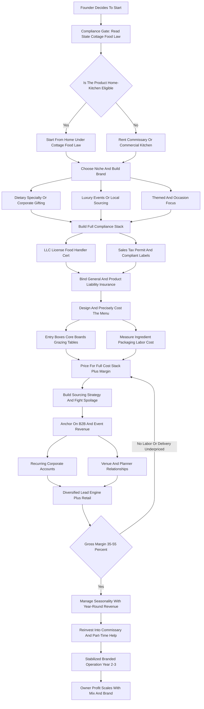
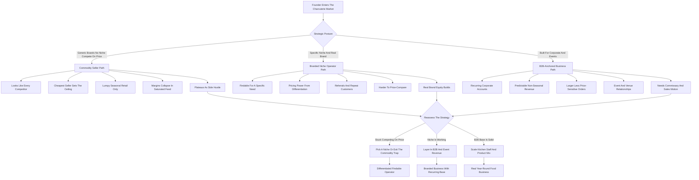

**TL;DR:** To start a charcuterie board business in 2027, you build a small food operation that assembles cheese, cured meats, fruit, nuts, crackers, dips, and accompaniments into visually striking boards, boxes, and grazing tables, then sells them for individual gifting, parties, weddings, and corporate events. The model is **real and reachable but no longer the easy money it looked like in 2021-2023**: social media -- TikTok and Instagram -- drove a demand explosion that pulled thousands of operators into the category, and by 2027 most major metros are **saturated with generic "cheese plate in a box" sellers competing on price**. The honest 2027 economics: a solo founder operating under a state **cottage food law** (or renting a commissary/commercial kitchen) invests **$2,000-$12,000** to launch -- ingredients, boards and packaging, a website, food-handler certification, insurance, and a little marketing -- runs at a **35-55% gross margin after ingredients**, and in a realistic Year 1 does **$15K-$70K in revenue** off 60-250 orders against **$8K-$45K in owner profit**, almost all of it part-time and seasonally lumpy around the November-December holiday peak. By Year 2-3 a focused operator who has escaped the commodity trap reaches **$80K-$300K in revenue** with **$35K-$140K in owner profit**, typically by moving into a commercial kitchen, hiring part-time assemblers, and anchoring the business on **recurring corporate accounts and booked event work** rather than one-off retail boxes. The three things that kill charcuterie startups: **(a) competing as an undifferentiated commodity** -- "a board is a board" -- in a saturated feed where the cheapest seller wins and margins collapse; **(b) ignoring food-safety law** -- assuming cottage food rules cover cured meats and refrigerated boards when they often do not, which is both a legal and an insurance exposure; and **(c) underpricing labor and design time**, treating a two-hour artful assembly as if the ingredients were the only cost. Net: viable in 2027 as a **branded, niche-focused, B2B-anchored** food business -- themed boards, dietary specialties, corporate gifting, wedding grazing tables -- and a poor fit for anyone who wants a quick passive side hustle selling generic boxes into an oversupplied Instagram market.

## What A Charcuterie Board Business Actually Is In 2027

A charcuterie board business is a small food operation that buys cheese, cured and cooked meats, fresh and dried fruit, nuts, olives, crackers, breads, jams, honey, spreads, chocolate, and edible garnishes, and assembles them into arranged, visually composed boards, boxes, cones, cups, and grazing tables that customers buy for gifting, hosting, celebrating, and corporate events. You are not inventing food and you are not a restaurant; you are a curator and an assembler -- the value you sell is selection, arrangement, presentation, convenience, and brand, layered on top of ingredients a customer could in theory buy themselves. The category exploded between roughly 2020 and 2024 because three things collided: people were hosting and gifting more, "grazing" and charcuterie became an aesthetic trend, and TikTok and Instagram made an artfully built board into shareable content that marketed itself. That wave pulled tens of thousands of home cooks, caterers, and side-hustlers into the business, and by 2027 the easy phase is over. The trend did not collapse -- charcuterie is now a normalized, durable part of how Americans entertain and gift -- but the category matured into a crowded, competitive market where a generic board is a commodity and the cheapest local seller sets the floor. In 2027 the business is shaped by realities that did not fully exist when the trend started: the feed is saturated, so organic discovery is harder and a real brand matters; customers expect online ordering, clean packaging, and a professional experience, not a DM and a Venmo request; food-safety regulators have caught up to the category, and cottage food law boundaries around cured meat and refrigerated products are actively enforced in many states; and ingredient costs -- cheese, meat, nuts -- rose meaningfully, compressing margins for operators who never raised prices. The charcuterie board business is not a passive aesthetic side hustle in 2027. It is a real, low-but-not-zero-capital food business, and the founders who succeed treat it as a branded operation with a niche, a compliance posture, a costed menu, and a deliberate plan to escape the commodity trap.

## Why The Charcuterie Category Is Both Real And Dangerously Crowded

A founder needs an honest read of the 2027 landscape, because the marketed version and the real version of this opportunity diverge sharply. **The demand is real and durable.** Charcuterie and grazing have become a default entertaining and gifting format -- weddings, baby showers, birthdays, holidays, game days, corporate functions, client gifts, real estate closing gifts, sympathy gifts. People who would once have ordered a fruit basket or a bottle of wine now order a board. That demand is not a fad that vanished; it normalized. **But the supply exploded faster than the demand.** The same low barrier to entry that makes this an accessible business -- you can start from a home kitchen with a few hundred dollars of ingredients -- means that in any given metro there are now dozens to hundreds of charcuterie sellers, ranging from serious branded operations down to a long tail of home cooks posting boards on Instagram. The result is a **saturated, commoditized market** in most populated areas: when a customer searches "charcuterie board near me," they get a wall of similar-looking offerings, and the undifferentiated ones compete on price, which crushes margin. **The trend's social-media engine cuts both ways.** TikTok and Instagram built the category and can still build a brand, but the feed is now crowded with charcuterie content, so a beautiful board is no longer automatically a discovery event -- it is table stakes. The strategic reality for a 2027 entrant: the demand will support a good business, but only for operators who refuse to be generic. The winners pick a niche, build a real brand, anchor on repeat and B2B revenue, and price for the labor and design they provide. The losers enter as one more "boards in a box" seller in a feed full of them and discover that the cheapest competitor sets their ceiling.

## The Cottage Food Law Question: The Single Most Important Compliance Issue

This is the most important regulatory section in the guide, because charcuterie sits in a genuinely tricky spot in US food law and a founder who gets it wrong faces both legal and insurance exposure. **Cottage food laws** are state laws that let individuals make and sell certain foods from a home kitchen without a licensed commercial facility -- but they were written for shelf-stable, low-risk foods, and they vary enormously by state. The problem for charcuterie is that the typical board is **not shelf-stable**: it contains cheese and cured or cooked meat, it must be refrigerated, and it is a "time/temperature control for safety" food. In many states, **refrigerated foods, cut cheese, and meat products are explicitly excluded from cottage food allowances**, which means a board built around them cannot legally be sold under cottage food rules at all -- the operator needs a licensed commercial kitchen or a rented commissary. Some states are more permissive, some allow certain dried or shelf-stable components, and some have raised cottage food sales caps that make a home-based start viable for compliant product lines. The practical path: **before buying a single ingredient, a founder must read their specific state's cottage food law** -- and check city and county rules on top of it -- to determine exactly what they can and cannot sell from home. Resources like Forrager publish state-by-state cottage food summaries, and every state's Department of Agriculture or health department publishes the actual rules. If the boards a founder wants to sell are excluded, the options are: rebuild the menu around what is allowed, rent time in a commissary or commercial kitchen, or partner with a licensed facility. **The federal layer matters too:** the FDA governs food safety broadly, and the USDA regulates meat -- an operator buying commercially produced, already-inspected cured meats and reselling them on a board is in a different position than one curing meat themselves, which is a regulated activity most charcuterie businesses correctly avoid. The discipline: treat the cottage food question as the first gate, not an afterthought. Operating outside the law is not a paperwork risk -- it voids insurance, exposes the founder personally, and ends the business if a customer gets sick.

## Licensing, Permits, And Food Handler Certification

Beyond the cottage food question, a founder must assemble the full compliance stack, because a food business touches several layers of government. **Business formation** comes first -- most charcuterie operators form an LLC for liability protection and to separate business and personal finances, register the business name, and get an EIN. **Local business license** -- the city or county business license or permit to operate, required almost everywhere. **Food handler / food safety certification** -- most jurisdictions require the person preparing food to hold a food handler card, and many operators go further and earn a **food manager certification** such as ServSafe, which is both a competence credential and a marketing trust signal; some states and counties require the manager-level certification for a food business. **Cottage food permit or registration** -- if operating under a state cottage food law, many states require the operator to register, take a specific cottage-food training, and sometimes pass a kitchen inspection. **Commercial kitchen / commissary** -- if the product is not cottage-food-eligible, the operator rents time in a licensed commercial kitchen or commissary and operates under that facility's permits, or obtains their own food establishment license. **Sales tax permit** -- prepared food is taxable in most jurisdictions; the operator registers to collect and remit sales tax. **Labeling requirements** -- cottage food sales typically require specific labels (ingredients, allergens, a "made in a home kitchen not subject to inspection" disclosure, the operator's name and address). **Liability insurance** -- general liability and product liability coverage is essential and is covered in its own section below; many venues and corporate clients will not work with an uninsured vendor. The practical sequence: form the entity, determine the cottage-food-versus-commercial-kitchen path, get the food handler and ideally manager certification, secure the local business license and any cottage food registration, register for sales tax, build compliant labels, and bind insurance -- all before the first paid order. None of this is expensive relative to the business, and skipping it converts a manageable startup task into an existential risk.

## The Product Line: Boards, Boxes, Cones, Grazing Tables, And Beyond

The charcuterie business is not one product -- it is a product line spanning price points and occasions, and a founder should design the menu deliberately. **Individual boxes and cups** -- single-serve or two-person portions, often the entry product and the most gift-friendly and shippable-adjacent; the volume product. **Small and medium boards** -- the 2-6 person and 6-12 person boards that serve households, small gatherings, and gifts; the core retail offering. **Large party boards and platters** -- 12-25 person boards for parties and events; higher ticket, more labor. **Grazing tables** -- the showpiece: a full table or section built out with boards, bowls, cascading fruit, breads, and garnish for 20-100+ guests at weddings, corporate events, and large parties; the highest-ticket, highest-margin, highest-labor product. **Grazing cones and cups** -- individually portioned servings, increasingly relevant in a hygiene-conscious market and convenient for corporate events. **Themed and seasonal boards** -- holiday boards, Valentine's, Halloween, Thanksgiving, game-day, baby shower, birthday; the differentiation engine. **Dessert and breakfast boards** -- chocolate, pastry, fruit, brunch components; menu extension into new occasions. **Corporate and bulk** -- individually boxed servings for offices and conferences, recurring monthly office boards, branded client gifts. **Add-ons and upsells** -- the board itself (a wooden board the customer keeps), drink pairings where legal, greeting cards, gift wrapping, delivery. A founder should think of the menu as a ladder: a high-volume entry product (boxes), a core mid-tier (boards), a high-ticket showpiece (grazing tables), a differentiation layer (themed and dietary), and a recurring B2B layer (corporate). The Year 1 mistake is offering only generic mid-size boards -- the same thing every competitor offers -- with no entry product to build volume, no showpiece to lift the average ticket, and no theme or niche to be found for.

## Pricing The Menu In 2027

Pricing is where charcuterie operators most often undervalue themselves, because the ingredients are visible and the labor and design are not. A founder must price for the full cost stack -- ingredients, packaging, labor, overhead, delivery -- plus margin, not just mark up the cheese. Here is a representative 2027 price architecture:

| Product | Typical 2027 Price | Serves | Notes |
|---|---|---|---|
| Individual box / cup | $18-$45 | 1-2 | Volume entry product, gift-friendly |
| Small board | $45-$90 | 2-4 | Core retail |
| Medium board | $85-$160 | 6-10 | Core retail, common gift size |
| Large party board | $150-$350 | 12-20 | Events, higher labor |
| Grazing table | $400-$2,500+ | 20-100+ | Showpiece, priced per guest ~$12-$30 |
| Wedding grazing spread | $1,200-$5,000+ | 50-200+ | Premium event work |
| Corporate monthly account | $300-$2,500/mo | office | Recurring revenue anchor |
| Themed / dietary specialty | +20-50% premium | varies | Differentiation pricing power |
| Delivery fee | $15-$75 | -- | Priced by distance, not absorbed |
| Setup fee (grazing table) | $75-$300 | -- | On-site styling labor |

The pricing discipline rests on a few rules. **Cost the ingredients per board precisely** -- weigh and price the actual cheese, meat, fruit, nuts, crackers, and garnish that go into each menu item, because guessing is how operators discover their "profitable" board barely covers food. **Add packaging as a real line** -- the box, the board, the wrap, the insert, the label all cost money. **Price the labor explicitly** -- an artfully built medium board can take 45-90 minutes including shopping, prep, assembly, and cleanup, and a grazing table is hours of skilled work; that time must be in the price. **Charge for delivery and setup separately** -- folding free delivery into the board price is how operators destroy their own margin, exactly as in any logistics-touching business. **Price themed and dietary specialties at a premium** -- they are harder to source and build, they are differentiated, and customers pay for them. The target after ingredients is a **35-55% gross margin**, with the spread driven by product mix (grazing tables and corporate accounts run richer than commodity boxes) and by how disciplined the labor and delivery pricing is. The founders who fail at pricing almost always made the same error: they priced against the cheapest Instagram competitor instead of pricing their actual cost stack plus a real margin, and they "threw in" the labor and delivery that were the largest hidden costs.

## The Unit Economics Of A Single Board

A founder must internalize the economics of one board before scaling, because the margin on the unit determines whether revenue becomes profit. Take a representative medium board priced at $120. The cost stack: **ingredients** -- cheeses, cured meats, fruit, nuts, crackers, jam, honey, garnish -- run roughly $35-$55 depending on how premium the selection is and how well the operator sources. **Packaging** -- the board or box, wrap, label, insert, ribbon -- runs $5-$15. **Labor** -- if the founder values their time at a real rate, 60-90 minutes of shopping, prep, assembly, and cleanup is a genuine cost even when "unpaid" in a solo operation, and it becomes an explicit cost the moment an assistant is hired. **Allocated overhead** -- commissary rent or home-kitchen utilities, insurance, software, marketing, spoilage on unsold ingredients -- spreads across every board. **Delivery** -- fuel and time, ideally charged separately to the customer. Net the board out and a well-priced medium board returns a **35-55% gross margin after ingredients and packaging**, before labor and overhead -- which means the operator's actual take-home depends heavily on labor efficiency and overhead discipline. The dangerous unit is the **underpriced commodity box**: a founder selling a $25 box that costs $14 in ingredients and $4 in packaging has $7 left to cover labor, overhead, delivery, and profit -- and an hour of assembly time eats all of it. The good unit is the **grazing table and the corporate account**: a $1,500 grazing table built from $450 in ingredients and $80 in packaging, even with four hours of skilled labor and a setup fee that covers on-site time, returns far more absolute profit per engagement than a dozen commodity boxes. The discipline this imposes: **know the per-unit cost and margin of every menu item, push the mix toward the high-margin products, and never sell a unit that does not cover its full cost stack plus margin.** Spoilage is the quiet margin leak unique to a perishable-ingredient business -- ingredients bought and not used before they turn are pure loss, which is why batch planning, order-driven purchasing, and menu design around versatile ingredients matter.

## Ingredient Sourcing And Supplier Strategy

Ingredients are the largest variable cost and a real lever on margin, so a founder must build a deliberate sourcing strategy rather than grabbing whatever is on the retail shelf. **Warehouse clubs** -- Costco and Sam's Club -- are the backbone for many operators: bulk cheese, nuts, crackers, and some meats at prices well below retail grocery, with the tradeoff of larger pack sizes that demand volume to use before spoilage. **Restaurant supply and wholesale** -- Restaurant Depot, US Foods, Sysco, Gordon Food Service, and regional foodservice distributors -- offer foodservice pricing and pack sizes once the operator has the volume and the business credentials to buy there; this is the margin upgrade that comes with scale. **Specialty cheese and meat distributors** -- regional specialty-food wholesalers and cheesemongers supply the differentiated, higher-end product that justifies premium pricing and that warehouse clubs do not carry. **Grocery and specialty retail** -- Whole Foods, Trader Joe's, and regional grocers fill gaps, supply fresh fruit and garnish, and are where many operators start before they have the volume for wholesale; the tradeoff is retail pricing that compresses margin. **Local makers** -- local cheesemakers, bakeries, jam and honey producers, and farms -- supply a local-sourcing story that is itself a marketing and differentiation asset, and can be a niche in its own right. **Direct and online specialty suppliers** round out hard-to-source items. The sourcing discipline has three parts. **First, match pack size to volume** -- buying Costco-size quantities only pays if the operator uses them before they spoil; an under-volume operator buying bulk is buying spoilage. **Second, graduate to wholesale as volume grows** -- the move from retail grocery to restaurant supply and specialty distributors is one of the biggest single margin improvements available, and it is gated by volume and business credentials. **Third, design the menu around sourcing reality** -- versatile ingredients that appear across multiple boards reduce spoilage and simplify purchasing; a menu where every item needs a unique specialty ingredient is a sourcing and spoilage nightmare. The operators who manage sourcing well treat it as an ongoing optimization; the ones who fail buy retail forever and wonder why a category with "cheap ingredients" has thin margins.

## The Home Kitchen Versus Commercial Kitchen Decision

Where a founder produces is a foundational decision with legal, cost, and scaling consequences. **The home kitchen path** -- operating under a state cottage food law -- is the lowest-cost start: no rent, no commute, immediate availability. But it is gated by whether the state's cottage food law actually allows the product (often it does not for refrigerated, meat-and-cheese boards), it usually carries sales caps that limit how big the business can get, it requires specific labeling and disclosures, and it has a hard ceiling -- a home kitchen cannot scale to serve large event volume or recurring corporate accounts. **The commercial kitchen / commissary path** -- renting time in a licensed shared commercial kitchen, a commissary, a church or community kitchen, or a restaurant's off-hours -- costs money (hourly or monthly rental) but removes the legal ambiguity, lifts the sales ceiling, often satisfies the requirement that lets the operator sell into venues and to corporate clients, and provides commercial-grade refrigeration and prep space. **The hybrid reality** for many operators is to start under cottage food law with a compliant product line to build cash and proof, then move into a commissary as volume justifies the rent and as the menu expands into products cottage food cannot cover. **The owned commercial kitchen or storefront** is a later-stage decision for a business that has outgrown shared space. The decision framework: if the state's cottage food law genuinely allows the intended product and the founder wants the lowest-risk smallest start, begin at home -- but read the law precisely. If the product is not cottage-food-eligible, or the founder wants to serve events and corporate clients from day one, the commissary is not optional, and its rent simply becomes a planned cost the pricing must cover. The mistake is assuming a home kitchen works without checking the law, then either operating illegally or hitting a wall the moment a corporate client or a wedding venue asks for proof of a licensed facility.

## Packaging, Boards, And Presentation Materials

Presentation is the product in this business, so packaging is not an afterthought -- it is part of what the customer is paying for and a real cost line. **The serving surface** -- wooden boards, slate, marble, bamboo, disposable kraft trays, or boxes -- ranges from inexpensive disposables to keepable wooden boards that become part of the gift and the price. Many operators offer both: a disposable-tray option at a lower price and a keep-the-board option at a premium. **Boxes and containers** -- kraft boxes, clear-lid containers, window boxes -- for individual servings and gift-oriented products; they must protect the arrangement in transit. **Wrapping and finishing** -- cellophane or compostable wrap, ribbon, twine, a branded label, a printed insert with ingredients and allergens and care instructions -- turns a tray of food into a finished, giftable, branded product. **Cold-chain materials** -- ice packs and insulated liners for longer deliveries, because the product is perishable and the operator is responsible for it arriving safe. **Branding elements** -- the label, the insert, the sticker, the card -- are cheap per unit and disproportionately important, because they are how a customer remembers and re-orders and how a gift recipient becomes a customer. The packaging discipline: cost it precisely per product, treat the keepable board as both a cost and an upsell, never skip the cold-chain materials on a perishable product, and treat the branded finishing as marketing spend that pays for itself in reorders. The operators who get packaging wrong either under-protect the product (it arrives looking nothing like the photo) or treat branding as optional (every board looks like every competitor's, and nothing drives a reorder).

## Building A Brand That Escapes The Commodity Trap

This is the strategic heart of a 2027 charcuterie business, because in a saturated market the brand is the difference between a real business and a price-taking commodity seller. The commodity trap is simple: if a customer cannot tell your board apart from the twenty other boards in their search results, the only variable left is price, and the cheapest operator -- often an under-costed home cook who does not know their real margin -- sets the ceiling for everyone. Escaping it requires deliberate differentiation. **A clear niche** -- not "charcuterie boards" but a specific identity: the dietary-specialty operator (keto, vegan, gluten-free, kosher, halal), the local-sourcing operator, the luxury-and-design operator, the themed-and-occasion operator, the corporate-gifting operator. A niche makes you findable, referable, and harder to price-compare. **A visual identity** -- a consistent style, color story, signature arrangement, and photography aesthetic that makes your boards recognizable as yours, not generic. **A real name and presence** -- a business name, a logo, a website with online ordering, professional photography, not a personal Instagram and a DM-and-Venmo flow. **A signature product** -- a board or table that is distinctly yours and that customers ask for by name. **A story** -- why this operator, what they stand for, the local makers they work with, the design philosophy; story is what social media rewards and what cannot be price-shopped. **Consistency** -- a brand is a promise kept repeatedly: same quality, same aesthetic, same experience every order. The strategic point: the demand in 2027 is real, but it flows to operators customers can identify and trust, not to the anonymous middle of the feed. A founder should decide their niche and brand before their first order, because retrofitting a brand onto an established commodity operation is far harder than building it in from the start. The commodity charcuterie seller competes on price forever; the branded niche operator builds pricing power, repeat customers, referrals, and a defensible position.

## The Corporate And B2B Opportunity: The Recurring Revenue Anchor

The single most important strategic move for a 2027 charcuterie business that wants to be more than a seasonal side hustle is to anchor on corporate and B2B revenue, because it solves the two structural weaknesses of the retail model: seasonality and one-off transactions. **The retail problem:** selling individual boards and boxes to consumers is lumpy (concentrated brutally around the holidays), one-off (every order is a fresh acquisition), and price-competitive (the saturated commodity market). **The B2B solution:** corporate clients buy differently. **Office and workplace accounts** -- HR and office managers order boards for team events, celebrations, client meetings, and increasingly as a recurring monthly or biweekly perk; a recurring office account is predictable revenue that does not have to be re-sold every time. **Conferences and corporate events** -- catering individually boxed servings or grazing tables for business functions; higher ticket, planned in advance. **Client and employee gifting** -- companies sending branded charcuterie gifts to clients, prospects, and staff, especially at the holidays but increasingly year-round for closings, onboarding, and milestones; this can be high-volume bulk work. **Real estate, financial, and professional services** -- agents and firms sending closing gifts and client gifts are a steady, referral-rich vertical. **Venue and planner relationships** -- wedding and event venues and planners who recommend a preferred charcuterie vendor deliver a stream of booked event work. The B2B advantages are structural: larger orders, planned in advance, less price-sensitive (a company values reliability and presentation over saving ten dollars), often recurring, and concentrated -- one corporate account can equal dozens of retail orders. The B2B requirements: a professional presentation (a real business, insurance, the ability to invoice, reliability), often a licensed commercial kitchen, and a sales motion that is relationship-and-outreach-driven rather than waiting for Instagram orders. The strategic verdict: a 2027 charcuterie business built purely on retail boxes is a seasonal side hustle competing on price; one anchored on recurring corporate accounts and booked event work, with retail as a complement, is a real business with predictable revenue.

## Niche Strategies: Themed, Dietary, Luxury, And Occasion-Based

Within the differentiation imperative, a founder should understand the specific niche paths, because choosing one deliberately is how the business becomes findable and defensible. **Dietary-specialty niches** -- keto and low-carb, vegan and plant-based, gluten-free, kosher, halal, dairy-free, nut-free -- serve customers who are actively searching for a provider who can meet their need and who cannot use a generic board at all; this is a high-pricing-power niche because the alternative for the customer is nothing. **Themed and occasion niches** -- holiday boards, baby and bridal showers, game day and sports, kids' party boards, romantic and date-night boards, sympathy and get-well boards, birthday boards -- align the product with the moments people actually buy for and make the operator the obvious choice for that occasion. **The luxury and design niche** -- premium ingredients, distinctive design, high-end presentation, the high-ticket grazing table -- competes on quality and aesthetics rather than price and serves weddings, upscale events, and discerning gifters. **The local and artisanal niche** -- boards built around local cheesemakers, bakeries, and producers -- offers a sourcing story that is itself the marketing and appeals to locavore customers and venues. **The corporate-gifting niche** -- a business built specifically around branded, bulk, professional client and employee gifting -- is effectively a B2B-only strategy. **The dessert and breakfast extension** -- chocolate boards, brunch boards, pastry boards -- opens new occasions and dayparts. **Seasonal and subscription models** -- a board-of-the-month or recurring delivery -- build the recurring revenue retail usually lacks. The strategic point: a niche is not a limitation, it is a position. A founder who is "a charcuterie business" is one of hundreds; a founder who is "the keto charcuterie specialist" or "the corporate gifting charcuterie company" or "the luxury wedding grazing table designer" is findable, referable, and priced for their specialty. Many mature operators run a primary niche with adjacent products layered on -- but they lead with the niche.

## Lead Generation: Social Media, Local SEO, And Relationships

A founder must understand how charcuterie customers are actually found in 2027, because the channel mix shifted as the category matured. **Instagram and TikTok** built the category and still matter -- a strong visual feed is table stakes and still generates discovery and reorders -- but the feed is now saturated, so social media works best as a brand and trust builder and a reorder driver rather than as a reliable cold-acquisition firehose the way it was in 2021. **Local SEO and Google** -- a Google Business Profile, a website that ranks for "charcuterie board [city]" and the occasion-and-niche searches, and reviews -- captures the high-intent customers who are actively searching to buy, and this is increasingly where serious orders come from. **The website with online ordering** -- a real ordering experience, not a DM flow -- both converts demand and signals a real business. **Referrals and word of mouth** -- a charcuterie board is a gift, which means every order is seen by people who are themselves potential customers; a great board at an event markets itself, and the recipient of a gift board is a warm lead. **Venue and planner relationships** -- as in any event-adjacent business, getting on a wedding venue's or planner's recommended-vendor list is a durable, repeating source of booked event work. **B2B outreach** -- direct relationship-building with office managers, HR teams, real estate offices, and event planners is how the recurring corporate revenue gets built, and it is proactive outreach, not inbound. **Local markets, pop-ups, and styled shoots** -- farmers markets, holiday markets, and collaboration with other event vendors build local visibility. **Email and SMS lists** -- capturing past customers for holiday and occasion remarketing is high-ROI because reorders are cheap relative to new acquisition. The lead-gen discipline: do not rely solely on Instagram the way the category's early entrants did, because that channel saturated. Build a real findable web presence for high-intent search, treat every gift order as a marketing impression, and proactively build the venue, planner, and corporate relationships that generate booked and recurring work. The operator with a diversified lead engine has a steady business; the one waiting for Instagram to deliver orders is fighting the whole saturated feed for attention.

## The Competitor Landscape: Who You Are Up Against

A founder should understand the competitive field clearly, because it is layered. **The DTC mail-order brands** -- companies like Boarderie ship shelf-stable-engineered, arrangeable charcuterie boards nationwide direct to consumers; they compete for the gifting dollar at scale with national marketing and logistics, and they are a real factor in the gift segment, though they do not do local fresh delivery or events. **The franchise operators** -- Graze Craze (under United Franchise Group) and similar concepts have built franchised charcuterie storefronts and catering operations in many markets, bringing brand recognition, systems, and capital to the local level. **Established local catering and event companies** -- caterers who added charcuterie and grazing tables to their menus compete for the event and corporate work with existing relationships and licensed kitchens. **Serious independent branded operators** -- the local charcuterie businesses that built real brands, websites, and corporate books are the direct competitors for a new branded entrant. **The long tail of home-based sellers** -- the large number of cottage-food and side-hustle operators posting boards on Instagram; they compete on price at the low end and are easy to out-professionalize on brand, reliability, and B2B capability, but they set the commodity floor. **Grocery and retail** -- Costco, Trader Joe's, Whole Foods, and supermarkets sell pre-made boards and the components, setting a commodity price floor for the undifferentiated product. **National gifting competitors** -- the broader gift-basket and food-gifting industry competes for the same gift occasions. The strategic reality for a 2027 entrant: you cannot out-scale the DTC brands or out-cheap the home-based long tail or the grocery store, so you win in the space they cannot serve well -- local fresh delivery, custom event and grazing-table work, recurring corporate accounts, and a specific niche -- where brand, reliability, design skill, relationships, and a licensed operation are the moat. The competitive moat in charcuterie is not the product, which anyone can assemble; it is the brand, the niche position, the B2B relationships, the reliability, and the professional operation.

## Startup Cost Breakdown: The Honest All-In Number

A founder needs a clear-eyed total of what it costs to launch, and the good news is that charcuterie is genuinely low-capital relative to most food businesses -- the risk is not the startup cost, it is the saturated market. The all-in startup cost breaks down as: **business formation, licensing, and permits** -- LLC setup, business license, cottage food registration or permit, sales tax registration -- roughly $100-$800 depending on state. **Food handler and food manager certification** -- a food handler card is inexpensive, a ServSafe manager certification runs more -- roughly $15-$200. **Initial ingredient inventory** -- the first stock of cheese, meat, fruit, nuts, crackers, and accompaniments to fulfill early orders -- roughly $300-$1,500 depending on launch volume. **Packaging and presentation materials** -- boards, boxes, wrap, labels, inserts, cold-chain materials -- roughly $300-$2,000. **Equipment** -- a good knife set, cutting boards, prep tools, storage containers, possibly a dedicated refrigerator or cooler, a label printer -- roughly $200-$2,500 depending on what the founder already owns. **Commercial kitchen / commissary** -- if the product is not cottage-food-eligible, first month and deposit of commissary rent -- roughly $0 (home/cottage) to $1,500+ to start. **Website and branding** -- domain, an e-commerce-capable website with online ordering, a logo, professional photography of the menu -- roughly $200-$2,500. **Insurance** -- general and product liability, first payment -- roughly $300-$1,000 to start. **Initial marketing** -- a small budget for local SEO setup, initial ads, market or pop-up fees, business cards -- roughly $100-$1,000. **Working capital** -- a small buffer for the gap before revenue and for ingredient purchasing -- roughly $500-$3,000. Totaled, a lean home-based cottage-food launch can come in around **$2,000-$5,000**, and a fuller launch with a commissary, stronger branding, and more inventory and equipment runs **$6,000-$15,000+**. The capital requirement is genuinely modest -- which is precisely why the market is saturated. The honest framing for a founder: the low startup cost is not the opportunity, it is the reason the opportunity is crowded; the real "investment" that determines success is the strategic work of niche, brand, B2B development, and disciplined pricing, none of which costs much money but all of which costs deliberate effort.

## The Year-One Operating Reality

A founder should walk into Year 1 with accurate expectations, because the gap between the marketed charcuterie side hustle and the real one is where most quitting happens. Year 1 is **brand-building, menu-calibration, and relationship-seeding mode, not profit-extraction mode.** The first year is spent learning which menu items actually sell and at what real margin, discovering the true labor cost of an artful build, calibrating sourcing and fighting spoilage, building the website and the visual brand, getting the compliance stack right, and starting the slow work of B2B and venue relationships. A realistic Year 1, run part-time by a solo founder out of a home kitchen or shared commissary, generates **$15,000-$70,000 in revenue** off roughly 60-250 orders, heavily concentrated around the November-December holiday peak, against **$8,000-$45,000 in owner profit** -- meaningful as a part-time income, modest as a full-time one, and lumpy across the calendar. The seasonality is the defining Year-1 experience: the holidays can be overwhelming and the late-winter and mid-summer stretches can be quiet, and a founder who built only a retail box business will feel the troughs sharply. Year 1 is also when the founder discovers whether the strategic choices were right -- a generic-board operator finds themselves price-competing in the feed, while a niche-and-B2B-focused operator finds the corporate accounts and event bookings starting to build a base. The work is genuinely hands-on and physical-adjacent: shopping, prepping, building under time pressure, delivering, managing a perishable inventory, and doing it on the customer's schedule (weekends, holidays, event dates). The founders who succeed treat Year 1 as paid tuition in a real food business and use it to calibrate the menu, lock in the compliance and pricing, and seed the relationships; the ones who fail expected passive aesthetic side-hustle income and were unprepared for the labor, the seasonality, the compliance, and the saturated market.

## The Three-Year Revenue Trajectory

Mapping a realistic arc helps a founder size the opportunity honestly. **Year 1:** part-time solo operation, home kitchen or shared commissary, menu and brand calibration, $15K-$70K revenue, $8K-$45K owner profit, holiday-concentrated, founder doing everything. **Year 2:** the operator who has chosen a niche and started building B2B begins to see it pay -- recurring corporate accounts, repeat customers, venue and planner referrals, possibly the move into a dedicated commissary, possibly the first part-time assembly help during peaks; revenue climbs to roughly **$60K-$180K** with owner profit around **$25K-$90K** as the business shifts from pure lumpy retail toward a more stable mix. **Year 3:** the operation that has executed well is a real business -- a recognized local brand in its niche, a book of recurring corporate accounts, steady event and wedding work, a commercial kitchen, part-time staff handling assembly so the founder can sell and manage; revenue lands around **$120K-$300K** with owner profit roughly **$45K-$140K**, and the founder is deciding whether to push toward a storefront, expand the catering and event side, build a shippable DTC line, or stay a lean high-margin operation. These numbers assume the founder escaped the commodity trap -- chose a niche, built a brand, anchored on B2B and event revenue, and priced with discipline. The operator who stayed a generic-box seller in a saturated feed sees a very different and flatter trajectory, often plateauing as a small seasonal side income because the price competition caps the margin and the retail-only model caps the predictability. The honest framing: charcuterie can become a real $120K-$300K small business by Year 3, but only on the branded, niche, B2B-anchored path; on the commodity path it tends to stay a seasonal side hustle.

## Five Named Real-World Operating Scenarios

Concrete scenarios make the model tangible. **Scenario one -- Priya, the corporate-gifting specialist:** launches from a rented commissary with $9K, deliberately ignores the retail-box price war, and spends Year 1 doing direct outreach to office managers, HR teams, and real estate offices; by Year 2 she has eight recurring monthly office accounts and a holiday client-gifting program, runs $150K in revenue with predictable monthly base, and barely touches the saturated Instagram retail market. **Scenario two -- the cautionary tale, Brandon:** starts from his home kitchen with $1,500, offers generic medium boards, and competes for orders on Instagram by being a few dollars cheaper than the next seller; he is busy every December and dead every February, never costed his boards precisely so his real margin is thin, never built a niche or a B2B book, and after eighteen months is still a break-even seasonal side hustle wondering why "everyone says charcuterie is a great business." **Scenario three -- Maria, the dietary-niche operator:** builds her entire brand around being the keto and gluten-free charcuterie specialist in her metro, ranks for those specific searches, becomes the referral every time a planner has a low-carb client, prices at a real premium because her customers have no generic alternative, and grows to $190K by Year 3 with strong margins. **Scenario four -- the Tran family, luxury wedding grazing tables:** focus exclusively on high-end grazing tables for weddings and upscale events, build relationships with a handful of premium venues and planners, do fewer but far larger jobs ($1,500-$5,000 each), invest in design skill and presentation, and reach $240K by Year 3 on event work alone with the best margins in the local market. **Scenario five -- Devon, the compliance casualty:** builds a real following and good product but never checked that his state's cottage food law excludes the refrigerated meat-and-cheese boards he sells; he operates technically illegally for a year, a corporate client asks for proof of a licensed kitchen he does not have, and a health department complaint forces him to shut down and rebuild from scratch in a commissary -- the canonical illustration of treating compliance as an afterthought. These five span the realistic distribution: B2B success, commodity-trap stagnation, profitable dietary niche, premium event specialization, and compliance failure.

## Food Safety, Spoilage, And Operational Discipline

A founder must build food safety and perishable-inventory discipline as a core operating function, because this is a business where a mistake can make someone sick and end the operation. **Food safety practices** -- proper refrigeration and cold-chain maintenance, safe handling and cross-contamination prevention, clean prep surfaces and tools, hand hygiene, time-and-temperature control, and following the food handler and manager training that the certification covers -- are not bureaucratic boxes, they are the difference between a safe business and a liability event. **The cold chain** is the specific vulnerability: a charcuterie board is a refrigerated, time-sensitive product, and it must stay cold from prep through delivery through the customer's handling -- which means insulated transport, ice packs on longer deliveries, clear customer care instructions, and honest guidance on how long a board is safe out. **Spoilage management** is the margin-side discipline: perishable ingredients bought and not used before they turn are pure loss, so the operator must purchase against actual orders where possible, design the menu around versatile ingredients that appear across multiple boards, plan batches, and rotate stock; an operator with sloppy spoilage discipline can lose a meaningful chunk of margin to the trash. **Allergen management** -- charcuterie boards are dense with common allergens (dairy, nuts, gluten, sometimes others), so clear allergen labeling, careful handling for dietary-specialty orders, and honest customer communication are both a safety and a legal requirement. **Labeling and disclosures** -- ingredient lists, allergen statements, cottage-food disclosures where required, and care instructions -- must be on every product. **Recordkeeping** -- sourcing records, prep logs where appropriate -- supports both safety and the ability to respond if an issue arises. The operators who get this wrong either cut corners on the cold chain and handling (and eventually have a sickness incident) or ignore spoilage (and bleed margin); the ones who get it right treat food safety as non-negotiable and spoilage control as a core profit lever.

## Insurance And Liability For A Food Business

The charcuterie model carries specific risks, and a 2027 operator manages them with real insurance rather than hope. **General liability insurance** covers the broad risks of operating a business -- a customer injured at an event, property damage, the ordinary liability exposures. **Product liability insurance** is the critical coverage for a food business -- it covers claims arising from the food itself, the foodborne-illness or allergen-reaction exposure that is the defining risk of selling things people eat; no charcuterie business should operate without it. **Commercial coverage considerations** -- if the operator uses a vehicle for delivery, commercial auto considerations apply; if they rent a commissary, the facility may require proof of insurance and the operator may need coverage naming the facility. **Why it is non-negotiable beyond the risk itself:** corporate clients, wedding and event venues, and planners routinely require proof of liability insurance before they will work with a vendor -- being uninsured does not just leave the founder exposed, it locks them out of the highest-value B2B and event work. **The cottage food interaction:** operating outside the law (selling non-cottage-eligible product under a cottage food assumption) can void insurance coverage, which is one more reason the compliance question is foundational. **Cost context:** liability coverage for a small charcuterie operation is genuinely affordable -- a few hundred dollars to start -- and is one of the highest-value dollars a founder spends. The discipline: bind general and product liability before the first paid order, keep coverage current, get proof-of-insurance documentation handy for B2B and venue clients, and never let a lapse in compliance void the policy. The founders who skip insurance are one allergen reaction or one foodborne-illness claim away from a personal financial catastrophe and a dead business; the ones who carry it have converted an existential risk into a small, manageable fixed cost.

## Scaling: Staffing, Kitchen, And Systems

The jump from a solo part-time operation to a real business with staff and a commercial kitchen is its own challenge, and a founder should approach it deliberately. **The first constraint is the founder's own hands and hours** -- a solo operator can only build so many boards, and the holiday peak exposes the ceiling hard. The first scaling move is usually **part-time assembly help** -- training assemblers to build to the brand's standard, initially for the peaks, eventually steady -- which frees the founder to sell, manage relationships, and design rather than spend every hour with a knife. **The second constraint is the kitchen** -- a home kitchen caps both legal capacity and physical throughput, so scaling typically means moving into or expanding commissary time, and eventually possibly a dedicated commercial kitchen or a storefront with a production kitchen behind it. **The third constraint is systems** -- a business doing real volume needs documented recipes and build standards (so any assembler produces a consistent board), an ordering system that captures orders cleanly and prevents overcommitment, a production and delivery schedule, sourcing relationships and purchasing routines, and the financial tracking to know per-product margins. **The fourth lever is the product mix** -- scaling profitably means pushing toward the higher-margin, higher-leverage products: recurring corporate accounts (predictable, efficient), grazing tables and events (high ticket), and away from the labor-intensive low-margin commodity box. **The fifth lever is potentially a shippable product line** -- engineering a shelf-stable-enough, well-packaged board that can ship beyond the local delivery radius opens a national gifting market, though it is a genuinely different operational and food-science challenge (the DTC brands have invested heavily there). **The strategic decision** that arrives for a successful operation: stay a lean, high-margin, founder-run niche business; build out catering and events; open a storefront; develop a DTC shippable line; or franchise the concept. The founders who scale well treated Year 1 as system-and-brand building, so growth is the repetition of a proven, documented operation rather than a scramble.

## Taxes And Business Structure

A founder should set up the tax and legal structure deliberately, because a food business has specific implications. **Entity:** most charcuterie operators form an LLC for liability protection and to cleanly separate business and personal finances; some elect S-corp treatment as profit grows. **Sales tax** is a central, easy-to-get-wrong issue -- prepared food is taxable in most jurisdictions, the operator must register for a sales tax permit and collect and remit correctly, and the rules can differ for retail sales versus catering versus delivery. **Deductible expenses** -- ingredients, packaging, commissary rent, equipment, insurance, software, website, marketing, mileage and vehicle costs for delivery, certification fees, and a home-office or home-kitchen allocation where applicable -- are all legitimate business deductions a clean bookkeeping system captures. **Cost of goods sold** -- the ingredient and packaging cost -- is tracked as COGS and is central to understanding the real margin. **Self-employment tax** applies to the owner's profit, and quarterly estimated tax payments are usually required. **Payroll and contractor rules** -- once the operator hires assembly help, payroll taxes (for employees) or correct contractor treatment apply, and misclassifying workers is a real risk. **Recordkeeping** -- separate business banking from day one, a bookkeeping system that tracks revenue by channel and COGS by product, and receipts for everything. **An accountant who understands small food businesses** is worth the fee, especially as the business adds a commissary, staff, and multiple revenue channels. The discipline is the same as any small business: separate finances from day one, track COGS precisely (it is also how you know your margins), stay current on sales tax and estimated taxes, and get professional help as complexity grows. Skipping this does not save money -- it converts a manageable compliance function into a year-end scramble and risks penalties on the sales tax that prepared-food businesses are specifically scrutinized on.

## Owner Lifestyle: What Running This Business Actually Feels Like

A founder should know what daily life in this business is like before committing, because the lived reality differs from the aesthetic Instagram version. In **Year 1**, running a lean solo operation, the founder does everything: sourcing and shopping, prepping ingredients, building boards under time pressure, packaging, delivering, photographing, posting, answering inquiries, doing the books, and managing a perishable inventory -- and doing it on the customer's calendar, which means weekends, holidays, and event dates are work days. The work is creative and can be genuinely satisfying -- there is real pleasure in a beautifully built board and a delighted customer -- but it is also physical-adjacent, time-pressured, and seasonally brutal: the November-December holiday stretch can be overwhelming, and the quiet stretches can be financially anxious. By **Year 2-3**, with part-time assembly help and a commissary, the founder's role shifts toward selling, managing relationships, designing, and running the operation rather than building every board personally -- though a food business is never fully hands-off, and peaks still pull the founder back to production. The emotional texture: real creative satisfaction and the pride of a brand and a delighted-customer base, against the stress of perishable inventory, the holiday crush, the saturated competitive market, the compliance weight of a food business, and the income lumpiness. The income is real -- a strong part-time income in Year 1, a real small-business income by Year 3 on the right path -- but it is earned through hands-on creative and logistical work, not extracted passively. A founder who enjoys food, design, hosting culture, and customer delight, and who can run a disciplined small operation, will find it genuinely rewarding; a founder who imagined a passive aesthetic side hustle will be surprised by the labor, the seasonality, and the compliance.

## Common Year-One Mistakes That Kill The Business

A founder can avoid most failure modes simply by knowing them in advance, because the mistakes in this business are remarkably consistent. **Competing as a commodity** -- entering as one more generic "boards in a box" seller in a saturated feed, with no niche and no brand, and discovering that the only lever left is price. **Ignoring or misreading the cottage food law** -- assuming a home kitchen works without checking whether the state actually allows refrigerated meat-and-cheese boards under cottage food rules, then operating illegally and uninsured. **Underpricing the labor and design** -- treating ingredients as the only cost and "throwing in" the hours of skilled assembly, which turns an apparently profitable board into a barely-break-even one. **Not costing the menu precisely** -- guessing at ingredient cost per board instead of weighing and pricing it, so the operator does not actually know their margin. **Skipping insurance** -- operating a food business with no product liability coverage, one allergen reaction away from catastrophe and locked out of B2B and venue work. **Building only a retail box business** -- ignoring the corporate and event B2B anchor and ending up with a lumpy, seasonal, one-off-transaction side hustle. **Letting spoilage bleed margin** -- buying ingredients without discipline and throwing away the difference between revenue and profit. **Relying solely on Instagram** -- treating the saturated feed as the whole lead engine instead of building local SEO, a real website, referrals, and B2B relationships. **Weak or no branding** -- looking exactly like every competitor, so nothing drives a reorder or a referral. **Saying yes to every tiny order** -- taking low-margin orders that cost more in labor and delivery than they earn. **Neglecting the compliance stack** -- skipping the license, the food handler card, the sales tax permit, the labels. **Ignoring seasonality** -- spending the holiday cash and being unprepared for the slow stretches. Every one of these is avoidable, and the founders who fail almost always made several; the founders who succeed treated this list as a pre-launch checklist.

## A Decision Framework: Should You Actually Start This In 2027

A founder deciding whether to commit should run a structured self-assessment, because this model fits a specific person and badly misfits others. **Differentiation willingness:** are you willing to pick a real niche and build an actual brand, rather than being one more generic seller? If you plan to just "sell charcuterie boards," the saturated market will cap you -- this is the single most important question. **Compliance diligence:** will you read your state's cottage food law precisely, get the food handler and manager certification, secure the licenses, and carry product liability insurance? If you would rather skip the paperwork, a food business is the wrong choice -- the downside is existential. **B2B and relationship orientation:** are you willing to do proactive outreach to office managers, planners, and venues to build recurring and event revenue, rather than waiting for Instagram orders? If not, you will have a lumpy seasonal side hustle. **Pricing discipline:** will you cost your menu precisely and price for labor, packaging, overhead, and margin -- not against the cheapest competitor? Corner-cutters on pricing run busy break-even operations. **Tolerance for hands-on, seasonal work:** can you handle the holiday crush, the weekend and event-date work, the perishable-inventory pressure, and the income lumpiness? If you wanted passive aesthetic income, the reality will surprise you. **Local market read:** is there room in your specific market for another branded operator in a specific niche, given how crowded the generic middle is? If a founder answers yes across differentiation willingness, compliance diligence, B2B orientation, pricing discipline, tolerance for hands-on seasonal work, and local market fit, a charcuterie board business in 2027 is a legitimate path to a real $120K-$300K small business by Year 3. If they answer no on differentiation or compliance specifically, they should not start as currently planned -- those two are the difference between a business and either a stagnant side hustle or a legal liability. The framework's purpose is to convert an attraction to the aesthetic, trendy surface of charcuterie into an honest decision about the branded, compliant, B2B-anchored food business underneath.

## Financing And Bootstrapping The Business

Because charcuterie is genuinely low-capital, financing is a smaller issue than in most businesses -- but a founder should still understand the options. **Bootstrapping** is the norm and is entirely realistic: a lean home-based cottage-food launch costs $2,000-$5,000, an amount most founders can self-fund, and the business can generate cash from the first orders to fund its own modest growth. **Reinvested cash flow** funds most healthy growth -- the move into a commissary, the first part-time help, better equipment, stronger branding -- because the business is not capital-intensive enough to require outside money for organic growth. **Small business credit and microloans** -- a small business credit card, a microloan, or an SBA microloan -- can bridge the launch or the move into a commercial kitchen for a founder without the cash on hand. **Equipment financing** is rarely needed at the scale most charcuterie businesses operate. **A franchise route** -- buying into an established charcuterie franchise -- is a different capital profile entirely, requiring a franchise fee and buildout capital, and trading independence for a brand and a system. The financing discipline: charcuterie is one of the few food businesses a founder can realistically start with savings and grow with its own cash flow, which is part of its appeal -- but the founder should still hold a small working-capital buffer for the gap before revenue and for ingredient purchasing, and should resist the temptation to scale faster than cash flow supports. The real "investment" in this business is not capital, it is the unpaid strategic and relationship-building work; a founder who is looking for the cheapest possible business to start has found one, but should remember that the low barrier is exactly why the market is crowded.

## Seasonality And Building Year-Round Revenue

Seasonality is a defining structural feature of the charcuterie business, and a founder must plan for it rather than be surprised by it. **The peak is the November-December holiday stretch** -- holiday parties, corporate gifting, family gatherings, hostess gifts -- and it can be genuinely overwhelming for a solo operator; it is also when a large share of annual retail revenue is earned. **Secondary peaks** cluster around Valentine's Day, Mother's Day, graduation season, and the spring-summer wedding and shower season. **The troughs** are typically the post-holiday January-February stretch and parts of mid-summer. A retail-box-only business feels this seasonality sharply -- feast and famine. The disciplined operator does several things to smooth it. **Anchor on recurring corporate accounts** -- a monthly office board account generates revenue in February exactly as in December, which is the single most effective seasonality smoother. **Pursue event and wedding work** -- weddings and events spread across the spring, summer, and fall, filling the calendar between retail peaks. **Build occasion products for every season** -- a themed-board strategy that has a product for Valentine's, spring showers, summer entertaining, game day, and the fall holidays keeps the brand relevant year-round. **Develop a subscription or board-of-the-month** -- recurring retail revenue that does not depend on a holiday. **Manage cash across the year** -- treat the holiday peak's cash as funding the quiet stretches, the same reserve discipline any seasonal business needs. **Plan capacity for the peak** -- line up part-time help and ingredient sourcing before the holiday crush, not during it. The strategic point: pure retail charcuterie is inherently seasonal and lumpy, and a founder who builds only that has built a seasonal side income; a founder who deliberately layers in recurring corporate accounts, event work, year-round occasion products, and possibly a subscription has converted a feast-or-famine trend business into a year-round operation.

## The 2027-2030 Outlook: Where This Model Is Heading

A founder committing time and money should have a view on where the business goes next. Several trends are reasonably clear. **Demand stays normalized and durable** -- charcuterie and grazing have settled in as a default entertaining and gifting format rather than a fad, so the underlying demand is real and persistent, even though the explosive-growth phase is over. **The market stays saturated and continues to consolidate at the quality end** -- the low barrier to entry keeps the long tail of home-based sellers large, but customers and especially B2B buyers increasingly gravitate to branded, reliable, professional operators, so the serious branded businesses take share from the anonymous middle. **B2B and corporate gifting keep growing as a share of the category** -- the recurring office-perk and client-gifting use cases are expanding, which rewards operators built for B2B over pure retail. **Food-safety enforcement stays active** -- regulators have caught up to the category, so the compliance gap between legal and illegal operators is a real and widening divide. **Ingredient cost pressure persists** -- cheese, meat, and nut costs remain a margin variable, rewarding operators with disciplined sourcing and honest pricing and squeezing those who never raised prices. **The DTC shippable segment keeps maturing** -- national mail-order brands keep investing in shelf-stable-engineered, shippable boards, owning more of the long-distance gifting market while local fresh delivery and events remain the independent operator's defensible territory. **Differentiation pressure intensifies** -- as the generic product fully commoditizes, niche, brand, and design skill become more, not less, important. The net outlook: charcuterie is **viable and durable through 2030 in its branded, niche-focused, B2B-anchored, compliant form** -- a real small business for the operator who treats it as one. The version that struggles is the undifferentiated, compliance-casual, retail-only, Instagram-dependent side hustle competing on price in a saturated feed. A 2027 founder who builds the former is building a real food business with a multi-year runway; one who builds the latter is entering a crowded market with no edge.

## The Final Framework: Building It Right From Day One

Pulling the entire playbook into a single operating framework: a founder who wants to start a charcuterie board business in 2027 and actually succeed should execute in this order. **First, settle the compliance question** -- read your specific state's cottage food law precisely, determine whether your intended product is home-kitchen-eligible or requires a commissary, and plan accordingly; this is the first gate, not an afterthought. **Second, choose a niche and build a brand** -- decide whether you are the dietary specialist, the corporate-gifting company, the luxury wedding-grazing designer, the local-sourcing operator, or another specific identity, and build a real name, visual identity, and website around it; do not enter as a generic seller. **Third, build the full compliance stack** -- LLC, business license, food handler and ideally manager certification, cottage food registration or commissary arrangement, sales tax permit, compliant labels. **Fourth, carry real insurance** -- general and product liability, bound before the first paid order. **Fifth, design and precisely cost the menu** -- a ladder from entry boxes through core boards to high-ticket grazing tables, with the ingredient, packaging, and labor cost of each item actually measured. **Sixth, price for the full cost stack plus margin** -- never against the cheapest competitor, never giving away labor or delivery. **Seventh, build the sourcing strategy** -- start where volume allows, plan to graduate to wholesale, design the menu around versatile ingredients to fight spoilage. **Eighth, anchor on B2B and event revenue** -- proactively build recurring corporate accounts, venue and planner relationships, and event work, with retail as the complement, not the whole business. **Ninth, build a diversified lead engine** -- local SEO and a real website for high-intent search, social for brand and reorders, referrals, and B2B outreach. **Tenth, run food safety and spoilage discipline as core operations** -- the cold chain, allergen management, and order-driven purchasing. **Eleventh, plan for seasonality** -- layer in year-round occasion products, recurring accounts, and event work so the business is not feast-or-famine. **Twelfth, scale deliberately** -- part-time help, a commissary, documented build standards, and a push toward the high-margin product mix, treating Year 1 as system-and-brand building. Do these twelve things in this order and a charcuterie board business in 2027 is a legitimate path to a real $120K-$300K branded small business. Skip the discipline -- especially on compliance, niche and brand, pricing, and B2B -- and it is a fast way to become one more anonymous, under-priced, seasonal seller in a saturated feed. The business is neither a passive aesthetic goldmine nor a dead trend. It is a real, low-capital, compliance-sensitive, hands-on food business, and in 2027 it rewards exactly one kind of founder: the branded, niche-focused, B2B-anchored, compliant operator who treats it as the real food business it actually is.

## The Operating Journey: From Compliance Gate To Stabilized Operation

## The Decision Matrix: Commodity Seller Vs Branded Niche Operator Vs B2B-Anchored Business

## Sources

1. **FDA -- Food Safety and Cottage Food / Home-Based Business Guidance** -- Federal food-safety framework and resources relevant to home-based and small food producers. https://www.fda.gov
2. **USDA -- Meat and Poultry Regulation** -- Federal regulation of meat products, relevant to the cured-meat components of charcuterie boards. https://www.usda.gov
3. **Forrager -- Cottage Food Laws By State** -- State-by-state summaries of cottage food laws, sales caps, and allowed and excluded foods. https://forrager.com
4. **State Departments of Agriculture and Health -- Cottage Food and Food Establishment Rules** -- The authoritative source for each state's specific cottage food allowances, registration, and food establishment licensing.
5. **ServSafe (National Restaurant Association) -- Food Handler and Food Manager Certification** -- Food safety certification widely required or recommended for food businesses. https://www.servsafe.com
6. **US Small Business Administration -- Business Structures, Licensing, and Financing** -- Reference for entity selection, licensing, microloans, and small-business financing. https://www.sba.gov
7. **IRS -- Self-Employment Tax, Cost of Goods Sold, and Small Business Deductions** -- Tax treatment of a small food business including COGS and deductible expenses. https://www.irs.gov
8. **Boarderie -- Direct-to-Consumer Mail-Order Charcuterie** -- National DTC charcuterie brand; reference for the shippable-gifting competitive segment. https://www.boarderie.com
9. **Graze Craze (United Franchise Group) -- Charcuterie Franchise** -- Franchised charcuterie storefront and catering concept; reference for the franchise competitive segment. https://www.grazecraze.com
10. **United Franchise Group -- Franchise Brand Portfolio** -- Parent company of Graze Craze and other franchise concepts. https://www.unitedfranchisegroup.com
11. **Costco Wholesale (NASDAQ: COST) -- Warehouse Club Sourcing** -- Bulk ingredient sourcing reference for cheese, meats, nuts, and crackers. https://www.costco.com
12. **Restaurant Depot -- Foodservice Wholesale Supplier** -- Wholesale foodservice sourcing reference for scaled operators. https://www.restaurantdepot.com
13. **Sam's Club -- Warehouse Club Sourcing** -- Bulk ingredient sourcing alternative. https://www.samsclub.com
14. **US Foods -- Foodservice Distribution** -- National foodservice distributor reference for wholesale sourcing at scale. https://www.usfoods.com
15. **Sysco -- Foodservice Distribution** -- National foodservice distributor reference. https://www.sysco.com
16. **Gordon Food Service -- Foodservice Distribution** -- Regional foodservice distributor reference. https://www.gfs.com
17. **Whole Foods Market (Amazon) -- Specialty Grocery Sourcing** -- Specialty and fresh-ingredient sourcing reference. https://www.wholefoodsmarket.com
18. **Trader Joe's -- Specialty Grocery Sourcing** -- Specialty and value ingredient sourcing reference. https://www.traderjoes.com
19. **Insureon -- Small Business and Food Business Insurance** -- General liability and product liability coverage reference for food businesses. https://www.insureon.com
20. **Next Insurance / Thimble -- Small Food Business Liability Coverage** -- Small-business and event-based liability insurance references for food vendors.
21. **National Restaurant Association -- Food Safety and Foodservice Operating Standards** -- Industry food-safety and operating-standard reference. https://restaurant.org
22. **SCORE -- Small Business Mentoring and Planning Resources** -- Business planning, pricing, and cash-flow guidance for small food businesses. https://www.score.org
23. **The Knot / WeddingWire -- Wedding Vendor and Catering Market Data** -- Wedding-market demand context for grazing tables and event work. https://www.theknot.com
24. **Local Health Departments -- Temporary Food Vendor and Event Permitting** -- Reference for permits required to sell at markets, pop-ups, and events.
25. **Square / Shopify -- E-Commerce and Online Ordering Platforms** -- Online ordering and payment platform references for a charcuterie storefront. https://squareup.com
26. **Google Business Profile -- Local Search and Discovery** -- Local SEO and discovery reference for a location-based food business. https://www.google.com/business
27. **IBISWorld -- Catering and Specialty Food Industry Reports** -- Industry-level data on catering and specialty food market size and trends. https://www.ibisworld.com
28. **NFIB -- Small Business Operating and Regulatory Resources** -- Small-business operating, regulatory, and advocacy reference. https://www.nfib.com
29. **State Cottage Food Training Programs** -- State-administered food-safety training often required to operate under a cottage food law.
30. **Commercial Kitchen and Commissary Networks (e.g., The Kitchen Door, local shared kitchens)** -- Reference for finding licensed shared commercial kitchen space.

## Numbers

**2027 Price Architecture**
- Individual box / cup: $18-$45 (serves 1-2)
- Small board: $45-$90 (serves 2-4)
- Medium board: $85-$160 (serves 6-10)
- Large party board: $150-$350 (serves 12-20)
- Grazing table: $400-$2,500+ (serves 20-100+, roughly $12-$30 per guest)
- Wedding grazing spread: $1,200-$5,000+ (serves 50-200+)
- Corporate monthly account: $300-$2,500/month (recurring)
- Themed / dietary specialty: +20-50% premium over base
- Delivery fee: $15-$75 (priced by distance)
- Grazing table setup fee: $75-$300 (on-site styling labor)

**Unit Economics Of A Representative Medium Board ($120)**
- Ingredients (cheese, meat, fruit, nuts, crackers, garnish): $35-$55
- Packaging (board/box, wrap, label, insert): $5-$15
- Labor: 60-90 minutes shopping, prep, assembly, cleanup
- Gross margin after ingredients and packaging: 35-55%
- Spoilage: a real margin leak unique to perishable inventory

**Startup Cost Breakdown**
- Business formation, licensing, permits: $100-$800
- Food handler / food manager certification: $15-$200
- Initial ingredient inventory: $300-$1,500
- Packaging and presentation materials: $300-$2,000
- Equipment (knives, boards, prep tools, storage, label printer): $200-$2,500
- Commercial kitchen / commissary (first month + deposit, if needed): $0-$1,500+
- Website and branding: $200-$2,500
- Insurance (general + product liability, first payment): $300-$1,000
- Initial marketing: $100-$1,000
- Working capital buffer: $500-$3,000
- Total (lean home-based cottage-food launch): ~$2,000-$5,000
- Total (fuller launch with commissary and stronger branding): ~$6,000-$15,000+

**Three-Year Revenue Trajectory (Owner Profit)**
- Year 1: $15,000-$70,000 revenue, $8,000-$45,000 owner profit (part-time, holiday-concentrated, 60-250 orders)
- Year 2: $60,000-$180,000 revenue, $25,000-$90,000 owner profit (niche + B2B starting to pay, possible commissary move)
- Year 3: $120,000-$300,000 revenue, $45,000-$140,000 owner profit (recognized niche brand, recurring corporate book, part-time staff)

**Margin Benchmarks**
- Gross margin after ingredients: 35-55%
- Commodity box: lowest margin, labor eats the thin spread
- Grazing tables and corporate accounts: highest absolute profit per engagement
- Wholesale sourcing graduation (retail grocery to restaurant supply / foodservice distributors): one of the largest single margin improvements available

**Seasonality**
- Primary peak: November-December holiday stretch (large share of annual retail revenue)
- Secondary peaks: Valentine's Day, Mother's Day, graduation season, spring-summer weddings and showers
- Troughs: January-February post-holiday, parts of mid-summer
- Smoothers: recurring corporate accounts, event/wedding work, year-round occasion products, subscription/board-of-the-month

**Compliance Stack**
- Cottage food law: state-specific; refrigerated, cut-cheese, and meat products are excluded in many states
- Required commonly: business license, food handler card (often food manager certification), sales tax permit, compliant labels, liability insurance
- Federal layer: FDA (food safety broadly), USDA (meat regulation)

**Competitor Reference Points**
- Boarderie: national DTC mail-order charcuterie brand (shippable gifting segment)
- Graze Craze (United Franchise Group): franchised charcuterie storefronts and catering, ~100+ units reported
- Long tail: large number of home-based / cottage-food Instagram sellers setting the commodity price floor
- Retail floor: Costco, Trader Joe's, Whole Foods pre-made boards and components

## Counter-Case: Why Starting A Charcuterie Board Business In 2027 Might Be A Mistake

The case above describes a viable business, but a serious founder must stress-test it against the conditions that make this model a bad bet. There are real reasons to walk away.

**Counter 1 -- The market is genuinely saturated.** The same low barrier to entry that makes charcuterie accessible means every populated metro now has dozens to hundreds of sellers. A new generic entrant is not entering an open market -- they are entering a crowded feed where the cheapest seller sets the price. The demand is real, but so is the oversupply, and "low startup cost" and "saturated market" are the same fact viewed from two sides.

**Counter 2 -- The commodity trap is the default outcome, not the exception.** Escaping it requires deliberate niche and brand work that most entrants do not do. The marketed version of this business -- "just make pretty boards and post them" -- is precisely the path into the commodity trap. A founder who is not genuinely committed to differentiation is statistically likely to end up as one more anonymous price-taker.

**Counter 3 -- The cottage food law often does not cover the product.** Many founders assume a home kitchen is fine, but in a large number of states, refrigerated meat-and-cheese boards are explicitly excluded from cottage food allowances. That means the home-based start many founders are counting on is either illegal or requires a commissary they did not budget for -- and operating illegally voids insurance and exposes the founder personally.

**Counter 4 -- The margins are thinner than they look.** "Cheap ingredients marked up" sounds like a great margin, but cheese, cured meat, and nuts are not cheap, ingredient costs rose, packaging is real, spoilage is constant, and the labor of an artful build is hours that beginners do not price. An operator who does not cost precisely often discovers their "profitable" board barely clears break-even after the real cost stack.

**Counter 5 -- It is a real food business with real liability.** This is not a craft side hustle -- it is selling perishable food that people eat, with foodborne-illness and allergen-reaction exposure. That means mandatory food safety discipline, certification, compliant labeling, a cold chain, and product liability insurance. A founder who wanted a low-stakes creative hobby has instead taken on the compliance weight and liability tail of a food business.

**Counter 6 -- The revenue is lumpy and seasonal.** A retail-box business earns a large share of its money in a brutal November-December crush and can be near-dead in February. Without the deliberate work of building recurring corporate accounts and event work, the founder has a feast-or-famine seasonal side income, not a stable business -- and building that B2B base is proactive sales work many founders are not inclined to do.

**Counter 7 -- The labor does not scale gracefully.** Every board is hand-built, and an artful build takes real time. Unlike a product business, there is no easy leverage -- more revenue means more hours of skilled assembly, either the founder's or paid staff's. The business scales by adding labor and a commissary, not by magic, and the labor-intensity caps how profitable it can be without careful product-mix management.

**Counter 8 -- Social media no longer reliably delivers customers.** The Instagram-and-TikTok engine that built the category is now saturated with charcuterie content. A beautiful board is no longer automatically a discovery event -- it is table stakes. Founders counting on the social-media firehose that worked in 2021 are entering a fundamentally different and harder acquisition environment.

**Counter 9 -- National DTC brands and franchises own real territory.** Boarderie and similar DTC brands have national marketing and shippable-gifting logistics; Graze Craze and franchise concepts bring brand and capital to local markets; grocery stores sell a commodity floor. An independent operator is squeezed between well-funded national gifting players above and a price-cutting home-based long tail below.

**Counter 10 -- It rewards a specific operator and punishes others.** This business genuinely rewards the founder who will do niche and brand work, proactive B2B outreach, precise costing, and compliance diligence. The founder who wanted a passive, low-effort, purely creative aesthetic side hustle -- which is how the business is often marketed -- is exactly the founder most likely to end up stuck. Wanting the aesthetic surface is not the same as wanting the business.

**The honest verdict.** Starting a charcuterie board business in 2027 is a reasonable choice for a founder who: (a) will pick a real niche and build an actual brand rather than selling generic boards, (b) will read their state's cottage food law precisely and build the full compliance and insurance stack, (c) will cost the menu precisely and price for the full cost stack plus margin, (d) will do the proactive B2B and relationship work to anchor on recurring and event revenue, (e) can handle a hands-on, seasonal, perishable-inventory food business, and (f) has room in their specific market for another branded operator in a specific niche. It is a poor choice for anyone who wants a passive aesthetic side hustle, anyone unwilling to differentiate, anyone who treats the compliance and liability casually, and anyone entering as one more generic seller in a saturated feed. The model is not a scam, but it is more crowded, more compliance-sensitive, more labor-bound, and more seasonal than its trendy, aesthetic surface suggests -- and in 2027 the gap between the disciplined branded version that works and the generic version that stagnates is wide.

## Related Pulse Library Entries

- **q9501** -- A company sells $100 group workshops teaching older adults how to use technology -- what's the right next move? (Benchmark deep-dive on a traction-but-friction service business; the niche-and-scaling discipline parallels.)
- **q9502** -- How do you scale a workshop-led business past the single-operator ceiling? (The codify-and-staff scaling path that a charcuterie operation moving past the solo founder must run.)
- **q1965** -- How do you start a party rental business in 2027? (Event-vendor adjacency; the venue and planner relationships that drive grazing-table work overlap directly.)
- **q1966** -- How do you start an event venue business in 2027? (The venue relationship that is a key lead source for charcuterie event and wedding work.)
- **q1967** -- How do you start a catering business in 2027? (The closest food-business cousin; commercial kitchen, food safety, and event-catering operating model.)
- **q1965b** -- How do you start a wedding planning business in 2027? (The planner relationship that drives charcuterie grazing-table bookings.)
- **q1968** -- How do you start a florist business in 2027? (Event-vendor referral-web partner with similar perishable-inventory and occasion-driven dynamics.)
- **q1970** -- How do you start a photo booth business in 2027? (Lighter-capital event-vendor adjacency sharing the venue-and-planner referral web.)
- **q1958** -- How do you start a cleaning business in 2027? (Service-business operating discipline; the licensing, insurance, and pricing mindset parallels.)
- **q1946** -- How do you start a real estate investing business in 2027? (Real estate agents and closing gifts are a steady B2B charcuterie vertical.)
- **q1947** -- How do you start a property management business in 2027? (Relationship-driven local service business with comparable bones.)
- **q9601** -- How do you start a fractional CFO business in 2027? (Financial discipline for managing seasonality, COGS, and pricing.)
- **q9701** -- What is the best inventory and ordering software in 2027? (The ordering, e-commerce, and inventory stack a charcuterie storefront runs on.)
- **q9702** -- How do you build standard operating procedures for a service business? (The build standards and recipe documentation that let a charcuterie operation add assembly staff.)
- **q9801** -- What is the future of the events industry in 2030? (Long-term outlook context for the event and wedding demand charcuterie serves.)
- **q1948** -- How do you start a home bakery business in 2027? (The closest cottage-food cousin; identical cottage food law, labeling, and home-kitchen-versus-commissary questions.)
- **q1949** -- How do you start a meal prep business in 2027? (Adjacent food business with shared food-safety, commissary, and perishable-inventory dynamics.)
- **q1950** -- How do you start a personal chef business in 2027? (Food-business adjacency with overlapping licensing, insurance, and client-relationship model.)
- **q1951** -- How do you start a coffee cart business in 2027? (Low-capital food-and-beverage business with shared permitting and event-vending dynamics.)
- **q1952** -- How do you start a food truck business in 2027? (Mobile food business; shared food-safety, permitting, and seasonality lessons at a higher capital tier.)
- **q1953** -- How do you start a gift basket business in 2027? (The closest direct competitor category; overlapping gifting occasions, B2B corporate-gifting strategy, and DTC-shippable dynamics.)
- **q1954** -- How do you start an Etsy or e-commerce product business in 2027? (The branding, niche, and online-storefront discipline a charcuterie business needs.)
- **q1971** -- How do you start a subscription box business in 2027? (The board-of-the-month recurring-revenue model a charcuterie operation can layer in.)
- **q9602** -- How do you price a service business for profit in 2027? (The cost-stack-plus-margin pricing discipline central to charcuterie unit economics.)
- **q9802** -- How do you build a local brand that beats commodity competitors? (The escape-the-commodity-trap brand strategy that defines a successful charcuterie business.)

