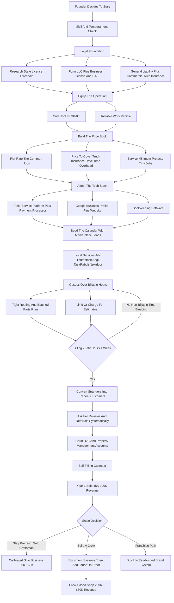
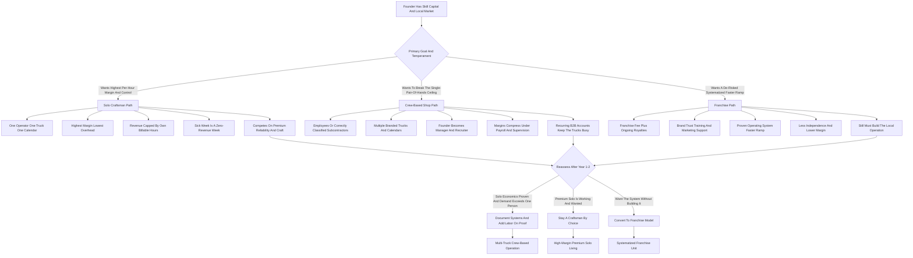

**TL;DR:** To start a handyman business in 2027, you turn a truck, a set of tools, and a working knowledge of residential repair into a service company that fixes the long tail of small jobs homeowners and property managers cannot or will not do themselves -- mounting TVs, patching drywall, replacing faucets and garbage disposals, hanging doors, repairing decks and fences, installing ceiling fans, swapping light fixtures, assembling furniture, caulking, weatherproofing, and the endless punch list of a 145-million-unit housing stock that is aging faster than the skilled-trade workforce can keep up with. The model is **real, durable, and unusually low-barrier**, but it is governed by one number most beginners never track: **billable hours per week**, the count of hours actually invoiced to a customer versus hours lost to driving, quoting, buying parts, and chasing payment. A solo handyman who bills 25-32 hours a week at $75-$150/hour runs a quietly excellent business; one who bills 12-15 because the day is eaten by windshield time, hardware-store runs, and unpaid estimates is working full time for part-time money. The honest 2027 economics: a solo operator launches for **$8K-$30K** in tools, a reliable vehicle, a state license where required, and $1M general-liability insurance, runs at a **60-75% labor margin**, and in a disciplined Year 1 generates **$45K-$120K in revenue** against **$30K-$85K in owner take-home** -- the spread driven almost entirely by billable-hour discipline and tight job routing. By Year 2-4, an operator who adds 2-4 employees or subcontractors and lands recurring property-management and B2B accounts reaches **$200K-$650K in revenue** with **$70K-$200K in owner profit**, at which point the founder chooses between staying a premium solo craftsman, building a small crew-based shop, or franchising into a brand like Mr. Handyman or Ace Handyman Services. The three things that kill handyman startups: **(a) underpricing the job** -- quoting like an hourly laborer instead of a businessperson carrying insurance, a truck, drive time, and overhead; **(b) losing the day to non-billable time** -- driving, estimating, buying parts, and bookkeeping that no one pays for; and **(c) staying a pure stranger-lead business** -- living on Thumbtack and TaskRabbit leads forever instead of building the repeat-customer and property-manager base that makes the calendar fill itself. Net: viable in 2027 as a disciplined, billable-hour-obsessed, repeat-customer-driven operation -- a poor fit for anyone who wants to scale fast, avoid physical work, or run a business without a truck, a license check, and a calendar packed with small jobs.

## What A Handyman Business Actually Is In 2027

A handyman business sells skilled labor to fix, install, maintain, and improve the small stuff in residential and light-commercial property -- the jobs too small for a specialized contractor to want and too involved for the average homeowner to do well. You are not a plumber, an electrician, or a general contractor, and in most states you are legally not allowed to call yourself one or do work that requires their license; you are the capable generalist who handles the vast middle ground -- mounting a television, patching and texturing drywall, replacing a faucet or a garbage disposal, hanging a door, fixing a fence, replacing rotted deck boards, installing a ceiling fan, swapping a light fixture, assembling furniture, re-caulking a tub, sealing a window, repairing trim, fixing a sticking gate, mounting shelves, childproofing, and the hundred other items that pile up on a homeowner's list. The entire business is a single idea executed thousands of times: you convert an hour of skilled, insured, reliable labor into $75-$150 of billed revenue, and you do it efficiently enough -- with enough billable hours in the week and enough of the day actually spent working rather than driving and quoting -- that the revenue comfortably clears the cost of the truck, the tools, the insurance, the fuel, and your time. Everything else in this guide -- licensing, pricing, the tech stack, lead generation, hiring, the counter-case -- is the machinery that lets you run that hour-into-revenue engine at a high rate of utilization without getting buried in non-billable time, underpriced jobs, or one-off strangers who never call again. In 2027 the business is shaped by a few realities that barely existed a decade ago: homeowners book, compare, and review online and expect a digital quote and a card-on-file payment; the skilled-trade labor shortage is structural and getting worse, which pushes more demand toward capable generalists; the housing stock is old and getting older, generating a permanent stream of repair work; and software has made it genuinely easy for a one-person operation to run a professional scheduling, invoicing, and customer-management system. The handyman business is not trendy and it is not passive. It is a skilled-labor-and-logistics business, and the founders who succeed understand that the customer is buying reliability and a finished job, while the business is a truck, a tool inventory, an insurance policy, a calendar, and a spreadsheet of billable hours.

## Why The Handyman Model Is Structurally Strong In 2027

A founder needs an accurate read of why this business is durable, because the tailwinds are real and they are not a fad. The United States has roughly 145 million housing units, and the median owner-occupied home is over 40 years old -- an aging stock that generates a permanent, non-discretionary stream of small repairs that only grows as houses get older. At the same time, the skilled-trade workforce is shrinking relative to demand: the Bureau of Labor Statistics and industry groups have documented for years that tradespeople are retiring faster than they are being replaced, and the workers who remain increasingly concentrate on the larger, higher-ticket jobs that pay best, leaving the small-repair middle underserved. Layer on top of that several demand drivers that compound: a generation of homeowners who are time-poor and DIY-fatigued and would rather pay than spend a weekend on a project; an aging population of seniors who physically cannot get on a ladder or under a sink and whose adult children will pay for someone reliable to help; a steady churn of new homeowners working through inspection punch lists; a large and growing rental and property-management sector that needs a dependable repair partner for unit turns and maintenance tickets; insurance-restoration overflow work that larger contractors do not want; and realtors who need pre-listing repairs done fast. None of these drivers is cyclical hype -- they are structural features of an aging housing stock, a shrinking trade workforce, and a time-pressed population. The handyman business does not depend on a boom; it depends on houses breaking and people being unwilling or unable to fix them, which is a permanent condition. That is why the model is genuinely strong in 2027: not because it is exciting, but because the demand is structural, the barrier to entry is low enough for a disciplined operator to clear, and the supply of reliable, professional, properly insured handymen has never caught up with the need.

## The Three Models: Solo Craftsman, Crew-Based Shop, And Franchise

There are three distinct ways to build this business, and choosing deliberately is one of the most consequential early decisions. **The solo craftsman model** is one skilled operator with a truck, a tool kit, and a calendar, doing every job personally and charging a premium for reliability and quality. Its advantage is the highest margin per hour, the lowest overhead, total control over quality, and the fastest path to profitability; its ceiling is the founder's own two hands -- revenue is capped by billable hours, and a sick week is a zero-revenue week. This is the most common starting point and a genuinely good permanent business for a craftsman who does not want to manage people. **The crew-based shop model** adds employees or subcontractors -- two, three, five capable handymen running their own trucks and calendars under one brand, one insurance umbrella, one scheduling system, and one set of standards. Its advantage is breaking the single-pair-of-hands ceiling, serving more customers, and building an asset that runs without the founder on every job; its challenge is that the founder becomes a manager, recruiter, and quality controller rather than a craftsman, and margins compress because employees must be paid, insured, and supervised. **The franchise model** -- buying into an established brand like Mr. Handyman, Ace Handyman Services, or HandyPro -- trades a franchise fee and ongoing royalties for a recognized name, a proven operating system, marketing support, training, and a faster ramp. Its advantage is a de-risked, systematized launch with brand trust built in; its challenge is the cost of the fee and royalties, less independence, and the reality that you still have to do the physical work of building a local operation. Many operators start solo to learn the trade economics and build cash and reputation, then deliberately decide whether to stay solo, build a crew, or convert to a franchise model. The wrong move is drifting -- staying accidentally solo when you wanted to scale, or hiring a crew before the solo economics and systems are proven.

## Licensing, Legal Requirements, And The State-By-State Reality

A founder must get the licensing question right before taking a single paid job, because it varies enormously by state and getting it wrong is a fast way to fines, liability, and an uninsurable business. The core reality: most states regulate handyman work by a **dollar-value threshold** -- below a certain per-job or per-project value, you can do general repair work without a contractor's license; above it, you need a license. The thresholds vary widely. Some states are permissive, with thresholds in the high hundreds to low thousands or with a general handyman registration; others, like California, set a low threshold (work over $1,000 in combined labor and materials generally requires a contractor's license) and enforce it; a handful require a specific handyman or home-improvement license or registration regardless of job size. The universal rule that does not vary: **handymen cannot do work that requires a specialized trade license** -- significant electrical, plumbing, HVAC, or structural work belongs to licensed electricians, plumbers, and contractors, and crossing that line is both illegal and a liability catastrophe if something goes wrong. Beyond the contractor question, every operator needs a **business entity** (most form an LLC for liability protection), a **business license or registration** with the city or county, an **EIN**, **general liability insurance** (a $1M policy is the practical standard, and many customers and all property managers will require proof of it), and **workers' compensation** the moment there is an employee. Operators who use a vehicle for work should carry **commercial auto insurance**, because a personal policy may not cover a work-related accident. Bonding is required or expected in some markets. The discipline here is simple and non-negotiable: research your specific state and city rules before launch, stay scrupulously within the license threshold and the trade-license boundary, carry real insurance, and treat the legal setup as the foundation the whole business sits on -- because one uninsured accident or one unlicensed job gone wrong can end the business and follow the founder personally.

## The Core Unit Economics: Billable Hours Per Week

This is the single most important section in the guide, because the entire business lives or dies on one number beginners almost never track: **billable hours per week** -- the count of hours actually invoiced to a paying customer, as opposed to the hours the workday is full but no one is paying. A handyman's day is full of non-billable time: driving between jobs, driving to and from the hardware store, walking jobs to write estimates that may never convert, buying and organizing parts, answering calls and texts, sending invoices, chasing payment, and doing the books. A full ten-hour workday can easily yield only five or six billed hours if the routing is bad and the day is fragmented. Run the math concretely. A solo operator who bills **30 hours a week at $100/hour** for 48 working weeks grosses $144,000; the same operator billing only **15 hours a week** -- same long days, same effort, same exhaustion -- grosses $72,000, and after the truck, fuel, tools, insurance, and software, that is a thin living. The difference between those two operators is not skill or hours worked; it is **billable-hour discipline**: clustering jobs geographically to cut windshield time, batching parts runs, quoting efficiently or charging for estimates, using flat-rate pricing so a fast worker is not penalized, scheduling tightly so there are no dead gaps, and offloading bookkeeping and scheduling to software so the workday is spent working. The implication for every decision in the business: pricing must cover the non-billable time, not just the billable hour; routing and scheduling are not administrative afterthoughts but the core profit lever; and the founder must track, every week, how many hours actually got billed against how many were worked. A handyman who treats billable hours as the central metric builds a business that pays well on reasonable hours; one who ignores it works himself ragged for a fraction of the revenue and never understands why.

## Pricing: Hourly Versus Flat-Rate, And How To Quote Like A Business

Pricing is where most handyman startups quietly destroy their own income, and a founder must understand both the structure and the psychology. There are two pricing models, and mature operators use both deliberately. **Hourly pricing** -- charging $75-$150 per hour depending on the market, skill, and job type -- is simple and transparent but has a hidden flaw: it penalizes speed and skill, because the faster and better you get, the less you earn per job, and it makes customers anxious about an open-ended meter. **Flat-rate pricing** -- quoting a fixed price for a defined job: $150-$500 to mount a TV, $200-$500 for a ceiling fan, $150-$500 for a drywall patch, $250-$500 for a dishwasher install, $300-$800 to hang a door -- rewards efficiency, gives the customer certainty, and lets a skilled fast operator earn an effective hourly rate well above the nominal one. Most successful operators move toward flat-rate for common jobs and use hourly for genuinely unpredictable work. Underneath both is the discipline beginners miss: **the price must cover far more than the labor hour.** It must absorb drive time to and from the job, the parts run, the unpaid estimate, the truck and fuel, the tools and their replacement, the insurance, the software, the bookkeeping time, the self-employment tax, and a real profit on top -- not just a wage. A handyman who quotes "$60 an hour, that seems fair" is quoting a laborer's wage and forgetting he is also the business; a handyman who understands that a $100-$150 effective rate is what it takes to cover a real cost structure and earn a living is quoting like a businessperson. Two more pricing tools matter: a **service-call minimum or trip charge** ($75-$300) so a tiny job is still worth the trip, and a policy on **estimates** -- many operators charge for detailed estimates or quote common jobs over the phone, because walking unpaid estimates is one of the largest non-billable time drains. The pricing rule for 2027: quote flat-rate where you can, price to cover the whole cost structure and not just the wage, protect against tiny jobs with a minimum, and never let the customer's anchor of "what a handyman should cost" drag the price below what the business actually needs to survive.

## The Tools, The Truck, And The Startup Capital

A founder needs a concrete, honest picture of what it costs to launch, because under-buying tools cripples the operation and over-buying drains the reserve. The handyman business is unusually low-barrier on capital, but it is not zero. **Tools** are the largest startup line and they accumulate over time: a competent launch kit -- a quality cordless drill and impact driver and a set of bits, a circular saw and a reciprocating saw, an oscillating multi-tool, a level, a stud finder, a good ladder, hand tools, a shop vacuum, drywall and painting tools, plumbing basics, a tool bag and organization system, and safety gear -- runs **$3,000-$8,000** for a serious starter set, and a well-equipped veteran's truck holds $15,000-$30,000 of tools accumulated over years. The discipline is to buy quality where it matters (the tools used daily) and add specialized tools as the jobs that need them appear, rather than buying everything up front. **The vehicle** is the other major piece: a reliable truck, van, or SUV with cargo capacity is non-negotiable, and many founders start with a vehicle they already own and upgrade to a dedicated work van or truck as cash flow allows; a used work vehicle runs anywhere from a few thousand to $30,000-plus depending on condition and choice. **The rest of the startup stack** is modest: business formation and licensing ($100-$1,000+ depending on state), general liability insurance (first payment, often $500-$2,000 to start), commercial auto insurance, a starter inventory of common consumables and fasteners, a phone and a basic website, the field-service software subscription, branding and a vehicle decal, and a working-capital cushion. Totaled, a lean solo launch using an already-owned vehicle can come in around **$8,000-$15,000**; a fuller launch with a dedicated work vehicle and a complete tool kit runs **$20,000-$40,000+**. The capital reality is the good news of this business: compared with a party rental or a restaurant, the barrier is low, which is exactly why so many people try it -- and why the operators who win are not the ones with the most capital but the ones with the pricing, the billable-hour discipline, and the customer base.

## The Field-Service Tech Stack For 2027

In 2027 a handyman business runs on software, and a founder should choose the stack early because retrofitting it later is painful. The center of the stack is a **field-service management platform** -- Jobber, Housecall Pro, ServiceTitan for larger operations, or a comparable tool -- that holds the customer database, schedules and dispatches jobs, generates professional quotes, sends invoices, processes payments, and consolidates the calendar so the operator is not running the business out of a notebook and a memory. This is the first paid subscription a serious operation cannot skip past a handful of jobs, because it is what turns a chaotic, fragmented workday into a routed, scheduled, invoiced system -- which directly drives the billable-hours number. **Payment processing** -- Square, Stripe, or the processor built into the field-service platform -- lets the customer pay by card on the spot, which radically improves cash flow versus mailing invoices and waiting; card-on-file and instant payment are a 2027 customer expectation. **The lead-generation layer** sits on top: a **Google Business Profile** (free and essential -- the first thing local customers see), **Google Local Services Ads** with the "Google Guaranteed" badge (pay-per-lead, high-intent, and increasingly the dominant local channel), and the lead marketplaces -- **Thumbtack**, **Angi**, **TaskRabbit**, and **Nextdoor** -- which deliver volume but at a cost and with stranger customers. **A simple professional website** converts the demand these channels generate and is itself a trust signal. **Bookkeeping software** -- QuickBooks or a comparable tool -- tracks income, expenses, mileage, and the data the accountant and the tax return need. **Review management** matters because local search and customer choice in 2027 are driven by ratings, and a systematic ask-for-the-review habit is a real growth lever. The discipline: adopt the field-service platform and a payment processor on day one, claim and optimize the Google Business Profile immediately, use the paid lead channels deliberately as a startup bridge rather than a permanent dependency, and treat the software stack as the system that lets one person run a professional operation that bills more hours and drops fewer jobs than a competitor working off paper.

## Lead Generation: From Stranger Marketplaces To A Self-Filling Calendar

Lead generation is where the handyman business is won or lost over time, and a founder must understand the arc: you start by buying stranger leads and you graduate to a calendar that fills itself. **In the early days**, with no reputation and no customer base, the paid and marketplace channels are the bridge: **Google Local Services Ads** deliver high-intent local leads with the trust of the Google Guaranteed badge; **Thumbtack, Angi, TaskRabbit, and Nextdoor** deliver volume; a claimed and optimized **Google Business Profile** captures organic local search; and a basic website converts. These channels work, but they are expensive per job, they deliver one-off strangers, and a business that lives on them forever is renting its customer flow at a permanent margin cost. **The transition that defines a sustainable handyman business is the move from stranger leads to a self-filling calendar**, and it runs on three engines. First, **repeat customers** -- a homeowner who has a good experience has a near-endless list of future small jobs, and the operator who does great work, communicates well, shows up when promised, and asks "what else is on your list?" converts a one-time stranger into a multi-year account. Fifty to one hundred genuinely loyal repeat customers is the backbone of a solo operation. Second, **referrals and reviews** -- happy customers tell neighbors, and a systematic habit of asking for a Google review and a referral compounds; in a relationship-and-trust business, word of mouth is the highest-quality, lowest-cost lead there is. Third, **B2B and property-management accounts** -- covered in its own section -- which deliver recurring volume that does not have to be re-won every time. The strategic point: paid stranger leads are a legitimate and necessary startup tool, but they are scaffolding, not the building. The operators who stay stuck are the ones still buying every job from a marketplace in Year 3; the ones who build a real business are the ones who used the early stranger jobs to seed a repeat-customer base, a referral engine, and a set of recurring accounts that make the marketplace optional.

## The B2B And Property-Management Wedge

The single highest-leverage move available to a handyman business is landing recurring business-to-business and property-management accounts, and a founder should pursue it deliberately from early on. The reason is structural: a residential customer generates a job now and maybe another in six months, and every residential job has to be marketed for, quoted, and won individually. A **property-management company**, by contrast, manages dozens or hundreds of rental units, every one of which generates a steady stream of maintenance tickets and a recurring need for unit-turn work between tenants -- and once you are the trusted repair partner, that volume comes to you without per-job marketing, on a predictable cadence, often with a standing relationship and net-terms billing. The same logic applies to other B2B customers: **real estate agents and brokerages** need fast, reliable pre-listing repairs and post-inspection punch-list work and will refer a dependable handyman to every seller; **small commercial property owners and offices** need ongoing minor repairs; **insurance restoration companies** have overflow small-repair work that does not fit their larger crews; **HOAs** need common-area maintenance; **larger general contractors** subcontract punch-list and small-finish work. Landing these accounts is a different sales motion than residential -- it is relationship-driven business development: identifying the property managers, realtors, and restoration firms in the service area, reaching out professionally, demonstrating reliability and proof of insurance, and proving yourself on a first job. It rewards exactly the traits the residential side also rewards -- showing up, communicating, doing clean work, billing professionally -- but it pays them back in recurring volume rather than one-off jobs. The discipline: from the first months, while the residential and marketplace leads pay the bills, deliberately court two or three property-management or realtor relationships, because a single good property-management account can stabilize a calendar that residential one-offs never will, and a handful of them can carry an entire crew-based operation.

## Hiring, Subcontractors, And Breaking The Solo Ceiling

A founder who wants to grow past the solo ceiling must eventually add labor, and the hiring decision is shaped by the economics of the trade. The solo operator's revenue is capped by his own billable hours -- there is a hard ceiling, and a sick week or a vacation is a zero-revenue week. Breaking that ceiling means **employees or subcontractors**, and the choice between them matters. **Employees** -- W-2 handymen on the payroll -- give the founder control over quality, scheduling, and standards, and let the brand promise consistency; they also bring payroll, payroll taxes, workers' compensation, supervision, training, and the risk of paying for hours that are not billed. **Subcontractors** -- 1099 handymen who run their own businesses and take overflow work -- are more flexible and lower fixed cost, but the founder has less control over quality and scheduling, and the worker-classification rules are strict: a worker treated like an employee but paid as a contractor is a legal and tax liability, so the classification has to be genuinely correct. Whichever path, the hard part of hiring in this trade is that **a good handyman is hard to find** -- the skilled-trade shortage that creates the business's demand also makes its labor scarce -- and a bad hire damages customers' homes and the brand's reputation. The operators who hire well are deliberate: they hire for reliability and customer manner as much as raw skill, they document the standards and the systems so a new hire can be trained into them, they pay well enough to keep good people, and they grow the crew in step with proven demand rather than ahead of it. The sequencing that works: prove the solo economics and build a repeat-and-B2B base first, document how the work and the systems run, then add the first employee or subcontractor against demand that already exists -- and only then keep adding. Hiring before the demand and the systems are real just multiplies chaos and converts a profitable solo business into an unprofitable small one.

## The Year-One Operating Reality

A founder should walk into Year 1 with accurate expectations, because the gap between the imagined version and the real version of this business is where most quitting happens. Year 1 is **base-building mode, not peak-earning mode.** The first year is spent learning which jobs are actually profitable and which are time sinks, discovering the real non-billable-time drain and fixing the routing and quoting that cause it, calibrating prices upward from the too-low numbers most beginners start with, building the Google Business Profile and the review base, working the expensive marketplace leads, and -- most importantly -- converting those first stranger jobs into the seed of a repeat-customer base and courting the first property-management or realtor relationship. A disciplined Year 1 solo handyman can realistically generate **$45,000-$120,000 in revenue** with **$30,000-$85,000 in owner take-home**, and the wide range is almost entirely explained by billable-hour discipline and pricing: the operator who prices properly, routes tightly, and bills 28-32 hours a week lands at the top; the one who underprices, drives all day, and bills 15 hours lands at the bottom for the same effort. Year 1 is genuinely hands-on and physical -- the founder is the technician, the estimator, the scheduler, the bookkeeper, and the marketer, all of it. It is also the year the founder discovers whether the pricing was right: jobs that felt fine but lost money once drive time and parts runs were counted are the signal to raise rates. The founders who succeed treat Year 1 as paid tuition in the real economics of the trade and use it to fix pricing, tighten routing, and seed the repeat-and-B2B base; the ones who fail expected the revenue to show up on effort alone and never did the unglamorous work of pricing, routing, and base-building.

## The Multi-Year Revenue Trajectory

Mapping a realistic multi-year arc helps a founder size the opportunity honestly. **Year 1:** solo, base-building, learning the real economics, $45K-$120K revenue, $30K-$85K owner take-home, founder doing everything, the year of fixing pricing and routing and seeding the repeat base. **Year 2:** the repeat-customer base and reviews compound, the marketplace dependency starts to ease, the first property-management or realtor account may land, prices are calibrated; a still-solo operator reaches roughly **$90K-$160K revenue** with **$60K-$110K take-home**, or an operator adding a first employee or subcontractor pushes revenue toward **$150K-$280K** with the owner profit depending on how well the new labor is utilized. **Year 3:** a deliberate crew-based operation with 2-4 handymen, recurring B2B accounts carrying a meaningful share of the calendar, the founder shifting from full-time technician toward scheduling, sales, and quality control; revenue lands around **$250K-$500K** with owner profit roughly **$70K-$160K**. **Year 4-5:** a mature small shop -- 3-6 handymen, a stable base of property-management and realtor accounts, a self-filling residential calendar, possibly a second territory or a franchise conversion; revenue roughly **$400K-$650K+** with owner profit **$120K-$220K**, the founder now running a business rather than working in it. These numbers assume disciplined pricing, real billable-hour and routing discipline, a deliberate move off pure marketplace dependency, and the patient build of a repeat-and-B2B base; they do not assume explosive growth, because a handyman business scales with trucks, trained labor, and recurring accounts, not magically. A mature handyman business is a real small business with vehicles, a crew, a customer base, and clean books -- a genuinely good outcome, earned through years of operational discipline.

## Five Named Real-World Operating Scenarios

Concrete scenarios make the model tangible. **Scenario one -- Marcus, the disciplined solo craftsman:** launches with $14K -- a complete tool kit, a used cargo van, an LLC, and a $1M GL policy -- prices common jobs flat-rate from day one, clusters jobs by zip code to kill windshield time, claims and works his Google Business Profile relentlessly, and asks every happy customer for a review and "what else is on your list?"; he bills 30 hours a week, grosses $115K in Year 1, and by Year 3 has 120 loyal repeat customers and two small property-management accounts, running a $150K solo business with no marketplace spend. **Scenario two -- the cautionary tale, Derek:** is a genuinely skilled tradesman but quotes "$55 an hour, cash is fine," walks every estimate unpaid, takes jobs across the whole metro with no routing, and never sends a review request; he works brutal ten-hour days, bills 14 of them, grosses $58K, and after the van and fuel and no insurance he is exhausted and broke -- skill was never his problem, the business was. **Scenario three -- Yvonne, the property-management specialist:** spends her first six months courting three property-management companies, proves herself on unit turns and maintenance tickets, and builds a calendar that is 70% recurring B2B work; smaller average ticket than premium residential, but a calendar that fills itself without marketing spend, and by Year 3 the recurring volume supports her plus two employees at $320K revenue. **Scenario four -- the Castillo brothers, the crew-based shop:** start solo, prove the economics for a year, document their systems, then add a handyman every time demand is genuinely there; by Year 4 they run five branded vans, a mix of repeat residential and realtor and property-management accounts, and a $560K operation where the brothers manage and sell rather than turn every wrench. **Scenario five -- the franchise route, Priya:** buys into an established handyman franchise, pays the fee and royalties, and trades independence and margin for a proven system, brand trust, training, and marketing support; she ramps faster than a from-scratch launch and by Year 3 runs a multi-van franchise unit, having decided the systematized de-risked path was worth the royalty. These five span the realistic distribution: disciplined solo success, underpricing-and-non-billable-time failure, the B2B-wedge specialist, the deliberate crew build, and the franchise path.

## Damage, Liability, And Doing The Job Right

A handyman works inside customers' homes with tools that can cause real damage, and a founder must build quality and liability control as a core operating function, not a hope. The risks are concrete: drilling into a pipe or a wire behind a wall, a TV mount that fails and takes the television down with it, a water leak from a faucet install that damages a floor, a ladder fall, a job done wrong that the customer has to pay someone else to redo. Every one of these is both a financial exposure and a reputation event in a business that runs on trust and reviews. The mitigations stack. **General liability insurance** -- the $1M policy -- is the financial backstop for property damage and injury claims, and it is non-negotiable. **Staying within competence and the trade-license line** is the single biggest preventive control: a handyman who declines the job that really needs a licensed electrician or a structural fix is protecting both the customer and the business. **Doing the job right** -- using the correct materials and methods, checking for pipes and wires before cutting, testing the work before leaving, cleaning up -- is what prevents the claim in the first place, and it is also what generates the review and the repeat call. **Clear communication and written scope** -- a simple agreement on what the job is, what it costs, and what is and is not included -- prevents the dispute that turns into a bad review or a chargeback. **Knowing when to call it** -- recognizing mid-job that something is beyond the original scope or the handyman's competence, and pausing to communicate rather than pushing through -- separates the professional from the operator who creates an expensive mess. The founders who get this wrong treat liability as paperwork and quality as speed; the ones who get it right understand that in a trust-and-review business, doing the job right and carrying real insurance are not overhead -- they are the product.

## Cash Flow, Payment Collection, And Getting Paid

A handyman business can be profitable on paper and still fail on cash flow, and a founder must run the money side as deliberately as the trade side. The good news in 2027 is that residential handyman work is largely **paid on completion** -- the job is done, the customer pays by card on the spot through the field-service app, and the cash-flow cycle is short and clean. The discipline that makes that work: take payment at the job, card-on-file or tap-to-pay, before leaving; do not drift into mailing invoices and waiting, which is how a profitable business ends up cash-starved. **Deposits on larger jobs** -- a portion of the price up front to cover materials and secure the booking -- protect against the customer who cancels after parts are bought. **Net terms on B2B and property-management accounts** are the trade-off of that recurring volume: a property manager pays on net-15 or net-30, which means the operator is effectively financing that work for a few weeks, so the cash cushion has to be sized for it and the invoicing has to be prompt and professional. **The parts-and-materials question** matters for cash flow: some operators mark up materials and bill them through, some have the customer buy them, and the choice affects both cash flow and margin -- a clear, consistent policy beats improvising. **A working-capital cushion** is what carries the business through a slow stretch, a truck repair, or the gap while a big B2B invoice clears, and a founder who launched with no reserve is one bad week from a crisis. **Bookkeeping discipline** -- separate business banking from day one, every expense and mile tracked, money set aside for self-employment and income tax -- is what keeps the cash picture honest and prevents the year-end tax surprise. The throughline: get paid at the job, take deposits on big work, size the cushion for the B2B net terms, have a clear materials policy, and keep clean books -- because the handyman business does not usually fail on demand, it fails on a founder who did great work and never built the discipline to convert it reliably into collected, retained cash.

## Taxes And Business Structure

A founder should set up the tax and legal structure deliberately, because the self-employed, vehicle-heavy, tool-heavy nature of the business has specific implications. **Entity:** most handyman operators form an **LLC** for liability protection and simplicity, and many elect **S-corp taxation** once profit is high enough that the payroll-tax savings outweigh the added complexity -- a conversation worth having with an accountant once the business is clearing real money. **Self-employment tax** is the line beginners forget: as a sole proprietor or LLC owner, the operator pays both halves of Social Security and Medicare on net profit, and money must be set aside for it from every job, along with federal and state income tax, through **quarterly estimated payments**. **Vehicle deductions** are significant in this business -- either the standard mileage rate or actual expenses, tracked rigorously, because the truck is driven constantly for work. **Tools and equipment** are deductible, often immediately expensed, which materially shapes taxable income in a heavy-tool-buying year. **The home office, the phone, the software subscriptions, insurance, supplies, and continuing education** are all deductible business expenses a clean bookkeeping system captures. **Sales tax** on materials -- and in some jurisdictions on labor -- has to be handled correctly depending on state rules. **Payroll taxes** arrive with the first employee. The discipline: separate business banking and a business card from day one, a bookkeeping system (QuickBooks or similar) running from the first job, religious mileage and expense tracking, quarterly estimated tax payments so there is no April catastrophe, and an accountant who understands trades and self-employment and can advise on the S-corp election and the depreciation and expensing strategy. Skipping this does not save money -- it converts a manageable, deduction-rich tax situation into a year-end scramble and a missed-deduction overpayment that costs real cash.

## The Competitor Landscape: Who You Are Up Against

A founder should understand the competitive field clearly, because the handyman market is crowded but bifurcated, and the opportunity is in the middle. **The franchise brands** sit at the organized top of the market: **Mr. Handyman**, part of Neighborly Brands, runs roughly 400-plus franchise locations; **Ace Handyman Services**, owned by Ace Hardware, runs roughly 125-plus units; **HandyPro** runs roughly 80-plus units. These brands bring marketing, systems, and brand trust, and they compete on professionalism and reliability rather than price -- they are beatable on price and personal relationship, but they have set the customer's expectation for what a professional handyman operation looks like. **The lead-marketplace platforms** are a different kind of competitor and channel at once: **Thumbtack**, **Angi** (NASDAQ: ANGI), **TaskRabbit** (owned by IKEA since 2017), and **Handy** (acquired by Angi in 2018) aggregate demand and sell it to operators -- they are where stranger leads come from, and they also commoditize the low end by making every job a price-comparison. **The vast informal market** -- the long tail of unlicensed, uninsured side-hustlers, the "guy with a truck," the moonlighting tradesman -- competes hard on price at the bottom and is easy to out-professionalize on reliability, insurance, communication, and a real warranty, but a founder must understand that a meaningful share of customers will always choose the cheapest option. **Specialized trades** take the higher-ticket work at the top. The strategic reality for a 2027 entrant: you generally cannot out-market the franchise or out-cheap the informal operator, so you win in the underserved middle -- more professional, more reliable, more communicative, and more properly insured than the long tail, more personal and more flexible and often better-priced than the franchise. The moat in this business is not tools or skill, which anyone can acquire; it is the **repeat-customer base, the property-management and realtor relationships, the review reputation, and the operating reliability** that take years to build and are genuinely hard for a new entrant to copy.

## Owner Lifestyle: What Running This Business Actually Feels Like

A founder should know what daily life in this business is like before committing, because the lived reality is physical, hands-on, and customer-facing. In **Year 1**, running solo, the founder is genuinely in the business -- on the ladder, under the sink, in the truck driving between jobs, at the hardware store, writing quotes in the driveway, sending invoices at night, and answering the phone all day. It is physical work, real days on your feet and your knees, and the founder is also the entire back office. The texture is varied -- a different house, a different problem, a different customer every few hours -- which many people in the trade genuinely love, and there is real, immediate satisfaction in a job done well and a customer visibly relieved. By **Year 2-3**, with a calibrated price book, a repeat base, and possibly a first employee or subcontractor, the founder's days get a little less fragmented and a little more profitable, though still hands-on. By **Year 3-5**, an operator who built a crew-based shop shifts toward scheduling, estimating, selling, and quality control -- still close to the work, but increasingly running the business rather than performing every job, while a deliberate premium solo operator stays a craftsman by choice. The emotional texture: real satisfaction in fixing things, in a grateful repeat customer, in a calendar that fills itself, in being genuinely good at a useful trade; and real stress in the underpriced job discovered too late, the damage claim, the no-show customer, the slow week, the truck that breaks on a full day. The income is real and can become substantial, but it is earned through physical work and operating discipline, not extracted passively. A founder who likes working with their hands, solving concrete problems, meeting people, and the independence of running their own calendar will find it genuinely rewarding; a founder who wanted a desk business or a passive one will be tired and surprised.

## Common Year-One Mistakes That Kill The Business

A founder can avoid most failure modes simply by knowing them in advance, because the mistakes in this business are remarkably consistent. **Underpricing the job** -- quoting a laborer's wage instead of a businessperson's rate that covers the truck, the insurance, the drive time, the parts runs, the overhead, and a real profit -- is the single most common income-destroying error. **Losing the day to non-billable time** -- bad routing, all-day windshield time, unpaid estimates, fragmented scheduling, and back-office work that no one pays for -- turns a full workday into a half-paid one. **Skipping insurance and the license check** -- working uninsured or over the state's contractor-license threshold -- is a bet-the-business gamble that ends the operation when one accident or one unlicensed job goes wrong. **Living on marketplace leads forever** -- staying dependent on Thumbtack, Angi, and TaskRabbit instead of using those early jobs to build a repeat-and-referral base -- means renting the customer flow at a permanent margin cost. **Never building B2B accounts** -- ignoring the property-management and realtor relationships that deliver recurring volume -- leaves the calendar dependent on re-won one-off jobs. **Taking work beyond competence or the trade-license line** -- the electrical or structural job that should have been declined -- creates expensive messes and liability. **No deposit on big jobs, no payment at completion** -- drifting into mailed invoices and slow pay -- starves a profitable business of cash. **No bookkeeping and no tax reserve** -- the year-end self-employment-tax surprise. **Saying yes to every tiny job with no minimum** -- taking jobs that cost more in drive time than they earn. **Poor communication** -- the missed call, the late arrival, the vague scope -- which generates the bad review that a trust-and-review business cannot afford. **Hiring before the demand and systems are proven** -- adding payroll to a business that has not earned it. Every one of these is avoidable; the founders who fail almost always made three or four of them, and the founders who succeed treated this list as a pre-launch checklist.

## A Decision Framework: Should You Actually Start This In 2027

A founder deciding whether to commit should run a structured self-assessment, because this model fits a specific person and badly misfits others. **Skill:** do you have genuine, broad repair competence -- enough to do a wide range of jobs well, and the judgment to know what is beyond your competence or your license? If the skill is thin, the business starts as paid practice on customers' homes, which is a slow and risky way in. **Capital:** do you have $8,000-$40,000 for tools, a reliable work vehicle, licensing, and insurance, plus a small working-capital cushion? This is a genuinely low-barrier business, so the capital filter is soft, but it is not zero. **Physical temperament:** are you willing to do real physical work -- ladders, crawl spaces, lifting, your knees and your back -- for years? If you want a desk business, this is the wrong model. **Business discipline:** will you actually price to cover the whole cost structure, track billable hours, route jobs tightly, charge for or limit estimates, carry insurance, and keep books -- or will you just do the work and hope? Corner-cutters on the business side get worked ragged for thin money. **Customer orientation:** are you willing to communicate well, show up when promised, ask for reviews and referrals, and court property-management and realtor relationships? This is a trust-and-relationship business, and the calendar fills itself only for operators who earn it. **Local market:** is there enough housing density and enough underserved middle in your service radius? If a founder answers yes across skill, capital, physical temperament, business discipline, customer orientation, and local market, a handyman business in 2027 is a legitimate and achievable path to a $200K-$650K small business with $70K-$200K in owner profit -- or a genuinely good solo living. If they answer no on business discipline specifically, the trade skill alone will not save them. If they answer no on skill, the honest move is to build the competence first. The framework's purpose is to convert "I'm handy and I want to be my own boss" into an honest, structured decision about the skilled-labor-and-logistics business underneath.

## Niche And Specialty Paths Worth Considering

Beyond the general-repair model, a founder should understand the specialty paths, because for some operators a focused niche is the better business. **The property-management and unit-turn specialist** builds the whole operation around recurring B2B accounts -- a calendar of maintenance tickets and between-tenant turns that fills itself without residential marketing; smaller average ticket, but predictable volume. **The senior-focused handyman** specializes in aging-in-place and mobility work -- grab bars, ramps, railings, lever handles, fall-prevention modifications -- serving an aging population and the adult children who pay for it, often a higher-trust, higher-loyalty, premium-priced niche. **The realtor and pre-listing specialist** builds around real estate agents -- fast punch-list and pre-listing repairs on a tight timeline -- a referral-rich niche with built-in repeat volume from every agent relationship. **The smart-home and TV-mount installer** focuses on the high-demand, high-margin technology jobs -- mounts, fixtures, fans, doorbells, smart devices -- cleaner work, repeatable, and well-suited to flat-rate pricing. **The drywall-and-paint specialist** goes deep on the most common interior repair. **The deck, fence, and exterior-repair specialist** focuses on the outdoor side. **The furniture-assembly and move-in specialist** serves a steady, simple, schedulable demand. **The small-commercial maintenance specialist** serves offices and small businesses on recurring contracts. The strategic point: the general model is the most flexible and the most common starting point, but a specialty can deliver more predictable volume, higher margins, or a clearer marketing message for a founder with the right inclination -- and many operators run a general core with one specialty wedge, especially the property-management or realtor relationship, layered on top. The mistake is not choosing a niche; it is failing to differentiate at all and being an undifferentiated "guy with a truck" in a market full of them.

## Scaling Past The Solo Operation

The jump from a proven solo operation to a multi-truck crew-based business is its own distinct challenge, and a founder should approach it deliberately. The prerequisites for scaling: the solo economics must be genuinely proven (do not scale a business that is not yet profitable solo), the pricing must be calibrated and the work systematized well enough that someone other than the founder can be trained into it, there must be a base of repeat and recurring B2B demand that exceeds what one person can serve, and the cash flow plus a real cushion must absorb the payroll, the second vehicle, and the inevitable lag before a new hire is fully productive. The scaling levers: **document the systems first** -- how a job is quoted, scheduled, performed to standard, billed, and followed up -- because you cannot delegate what is only in the founder's head; **add the first labor against demand that already exists**, employee or correctly classified subcontractor, and prove that the added pair of hands bills enough to cover its cost and more; **lean hard on the B2B and property-management accounts**, because recurring volume is what reliably keeps multiple trucks busy; **build the management layer** -- scheduling, dispatch, quality control, recruiting -- so the founder moves from turning wrenches to running the business; **keep the lead engine diversified** so growth is not hostage to one channel; and **add trucks and hires in step with proven demand**, never ahead of it. The constraints on scaling: finding good skilled labor is the first and hardest (the trade shortage cuts both ways); founder attention is the second (solved by the management layer and documented systems); cash flow through the hiring lag and the B2B net terms is the third; and quality control across people the founder is not personally watching is the fourth and the one most likely to damage the brand. The franchise path is a structured alternative to building all of this from scratch. The founders who scale well share one trait: they treated the solo year as a system-building and economics-proving exercise, so that growth was the repetition of a proven, documented machine rather than a series of expensive, chaotic experiments.

## Exit Strategies And The Long-Term Picture

A handyman business can be built with an eventual exit in mind, and a founder should understand the options. **Sell the operating business** -- a handyman company with a stable base of repeat residential customers, recurring property-management and realtor accounts, trained employees, branded vehicles, documented systems, a strong review reputation, and clean books is a saleable asset; valuations typically run as a multiple of stabilized earnings, with the multiple driven by how much of the revenue is recurring, how owner-dependent the operation is, the strength of the B2B contracts, and the quality of the systems and the books -- which is exactly why the recurring-account and documented-systems work pays off twice. **Sell the assets and the customer list** -- even absent a going-concern sale, the vehicles and tools have resale value and the customer list and B2B relationships have real value to an operator expanding into the territory. **Convert to or sell as a franchise unit** -- an operator who built into a franchise has a defined resale path within the franchise system. **Transition to a key employee** -- the relationship-driven, systems-driven nature of a mature shop makes an internal sale to a trusted lead handyman viable. **Wind down gracefully** -- a solo craftsman can simply retire, sell the truck and tools, and hand the customer list to a trusted peer. The honest long-term picture: a handyman business is a durable, real business -- houses will keep aging and breaking, the trade shortage is structural, and a well-run operation produces real owner income for years -- but it is a business, not a passive holding; it demands ongoing physical work or ongoing management, ongoing customer-relationship and reputation work, and ongoing operational discipline. A founder should think of a 2027 launch as building a tangible small business with multiple genuine exit paths -- sale of the going concern, sale of the assets and customer list, a franchise resale, an internal transition, or a graceful solo wind-down -- and the operators who build the recurring accounts, the documented systems, and the clean books are the ones who get to choose among those paths rather than just stopping.

## The 2027-2030 Outlook: Where This Model Is Heading

A founder committing to this business should have a view on where it goes next, and several trends are reasonably clear. **Demand stays structurally strong** -- the housing stock keeps aging, the skilled-trade workforce keeps shrinking relative to need, the population keeps aging into mobility-limited years, and the time-poor homeowner keeps choosing to pay rather than DIY; none of this reverses by 2030. **The professionalism bar keeps rising** -- customers increasingly expect online booking, digital quotes, card payment, real insurance, and a review reputation, which structurally favors the disciplined operator with a real tech stack and punishes the informal "guy with a truck." **Software keeps leveling up the small operator** -- field-service platforms, payment processing, and AI-assisted scheduling, quoting, and customer communication keep getting better and cheaper, letting a one-person or small-crew operation run like a much larger one and bill more of its hours. **The lead-channel landscape keeps shifting** -- Google Local Services Ads and the search-and-review ecosystem keep gaining share, the marketplaces keep commoditizing the low end, and the operators who build owned demand (repeat customers, B2B accounts, referrals) keep their margins while the marketplace-dependent keep renting theirs. **AI assists the back office, not the wrench** -- quoting, scheduling, routing, customer follow-up, and bookkeeping get more automated, which lowers the non-billable-time drain and modestly lowers the barrier for competent new entrants, but the physical work itself stays human and stays in demand. **Consolidation continues** -- franchises and well-run crew-based shops absorb the share that informal operators vacate. **The B2B and property-management channel keeps growing** as the rental sector grows and as professional property managers increasingly want insured, reliable, systematized repair partners. The net outlook: the handyman business is **viable and durable through 2030 in its disciplined, billable-hour-obsessed, repeat-customer-and-B2B-driven, properly-insured, professionally-run form.** The version that thrives is the operator who prices like a business, routes like a logistician, builds owned demand, carries real insurance, and runs a real tech stack. The version that struggles is the underpriced, non-billable-time-bleeding, marketplace-dependent, uninsured "guy with a truck" -- and the gap between the two only widens as the professionalism bar rises.

## The Final Framework: Building It Right From Day One

Pulling the entire playbook into a single operating framework: a founder who wants to start a handyman business in 2027 and actually succeed should execute in this order. **First, get honest about skill and temperament** -- confirm you have broad, genuine repair competence and the judgment to know your limits, and confirm you want a physical, hands-on, customer-facing trade business. **Second, set up the legal foundation** -- research your specific state and city licensing rules, form the LLC, get the business license and EIN, and put real general-liability insurance and commercial auto coverage in place before the first paid job. **Third, equip yourself sensibly** -- a quality core tool kit and a reliable work vehicle, buying quality where it matters and adding specialized tools as the jobs appear, for a lean $8K-$15K or a fuller $20K-$40K launch. **Fourth, price like a business, not a laborer** -- flat-rate the common jobs, build a price book that covers the truck, insurance, drive time, parts runs, overhead, and a real profit, and protect against tiny jobs with a service minimum. **Fifth, adopt the tech stack on day one** -- a field-service platform, a payment processor, a claimed and optimized Google Business Profile, bookkeeping software, and a simple professional website. **Sixth, obsess over billable hours** -- route jobs tightly, batch parts runs, limit or charge for estimates, schedule without dead gaps, and track every week how many hours got billed against how many got worked. **Seventh, use the marketplaces as a bridge, not a home** -- run Local Services Ads and Thumbtack and Angi and TaskRabbit to seed the early calendar, but treat every stranger job as a chance to start a repeat relationship. **Eighth, build owned demand relentlessly** -- convert customers into repeat accounts, ask for reviews and referrals systematically, and make the calendar fill itself. **Ninth, court the B2B and property-management wedge** -- from the early months, deliberately build two or three property-management or realtor relationships for recurring volume. **Tenth, do the job right and communicate** -- stay within competence and the license line, do clean work, test it, and communicate clearly, because in a trust-and-review business that is the product. **Eleventh, run the money** -- get paid at the job, take deposits on big work, keep a cushion for the B2B net terms, and keep clean books with a tax reserve. **Twelfth, scale only on proof** -- document the systems, prove the solo economics, then add labor and trucks in step with demand that already exists, or take the structured franchise path. Do these twelve things in this order and a handyman business in 2027 is a legitimate path to a $200K-$650K small business or a genuinely good solo living. Skip the discipline -- especially on pricing, billable hours, and building owned demand -- and it is a fast way to work brutal physical days for part-time money. The business is neither a get-rich-quick scheme nor a dying trade. It is a real, low-barrier, structurally-strong, skilled-labor-and-logistics business, and in 2027 it rewards exactly one kind of founder: the disciplined operator who treats it as the business it actually is, not just the trade it looks like.

## The Operating Journey: From Tool Kit To Stabilized Operation

## The Decision Matrix: Solo Craftsman Vs Crew-Based Shop Vs Franchise

## Sources

1. **US Bureau of Labor Statistics -- Construction and Extraction Occupations / Construction Laborers and Helpers** -- Wage, employment, and outlook data for the trades that underlie handyman work. https://www.bls.gov/ooh/construction-and-extraction/
2. **US Bureau of Labor Statistics -- Occupational Outlook: General Maintenance and Repair Workers** -- Employment, pay, and projected demand for general repair workers. https://www.bls.gov/ooh/installation-maintenance-and-repair/general-maintenance-and-repair-workers.htm
3. **US Census Bureau -- American Community Survey, Housing Characteristics and Age of Housing Stock** -- Data on the roughly 145M US housing units and the age of the owner-occupied stock. https://www.census.gov/programs-surveys/acs
4. **US Census Bureau -- American Housing Survey** -- Detailed data on home repair, maintenance, and improvement activity. https://www.census.gov/programs-surveys/ahs.html
5. **US Small Business Administration -- Choose a Business Structure and Get Licenses and Permits** -- Reference for LLC formation, licensing, and small-business setup. https://www.sba.gov/business-guide
6. **US Small Business Administration -- Fund Your Business and Small-Business Loans** -- Financing references for tool and vehicle purchase and working capital. https://www.sba.gov
7. **Internal Revenue Service -- Self-Employed Individuals Tax Center** -- Self-employment tax, quarterly estimated payments, and deductions for the self-employed. https://www.irs.gov/businesses/small-businesses-self-employed
8. **Internal Revenue Service -- Business Use of Car and Section 179 / Depreciation Guidance** -- Vehicle and tool/equipment deduction and expensing rules. https://www.irs.gov
9. **National Association of Home Builders (NAHB) -- Remodeling and Home Improvement Industry Data** -- Industry data on the residential repair and remodeling market. https://www.nahb.org
10. **Joint Center for Housing Studies of Harvard University -- Improving America's Housing / LIRA Remodeling Report** -- Authoritative data and forecasts on home improvement and repair spending. https://www.jchs.harvard.edu
11. **National Federation of Independent Business (NFIB) -- Small Business Economic Trends and Hiring Data** -- Small-business conditions and the skilled-labor hiring difficulty trades face. https://www.nfib.com
12. **IBISWorld -- Handyman Services in the US Industry Report** -- Market size, segmentation, and competitive structure for the handyman services industry.
13. **Contractors State License Board (California) -- Licensing Requirements and the $1,000 Threshold** -- Example of a state's contractor-license threshold and handyman boundary rules. https://www.cslb.ca.gov
14. **State Contractor Licensing Boards (Various) -- Handyman and Home-Improvement Registration Rules** -- State-by-state contractor and handyman licensing thresholds and registration requirements.
15. **Mr. Handyman (Neighborly Brands) -- Franchise Disclosure and Operations** -- Roughly 400-plus-location handyman franchise; brand, system, and competitive reference. https://www.mrhandyman.com
16. **Ace Handyman Services (Ace Hardware) -- Franchise Information** -- Roughly 125-plus-unit handyman franchise owned by Ace Hardware. https://www.acehandymanservices.com
17. **HandyPro -- Franchise Information** -- Roughly 80-plus-unit handyman and accessibility-modification franchise. https://www.handypro.com
18. **Angi (NASDAQ: ANGI) -- Investor Relations and Platform Data** -- Lead-marketplace platform; competitor and channel reference; owner of Handy (2018). https://www.angi.com
19. **Thumbtack -- Pro Resources and Platform Data** -- Lead-marketplace platform for service professionals. https://www.thumbtack.com
20. **TaskRabbit (IKEA) -- Platform and Tasker Data** -- Task and handyman marketplace owned by IKEA since 2017. https://www.taskrabbit.com
21. **Handy (Angi) -- Platform Information** -- Home-services marketplace acquired by Angi in 2018. https://www.handy.com
22. **Google -- Local Services Ads and Google Guaranteed Program** -- Pay-per-lead local advertising channel and the Google Guaranteed badge. https://ads.google.com/local-services-ads/
23. **Google Business Profile -- Local Search and Listing Management** -- The free local-search listing central to handyman lead generation. https://www.google.com/business/
24. **Jobber -- Field Service Management Software** -- Scheduling, quoting, invoicing, and payment platform for home-service businesses. https://getjobber.com
25. **Housecall Pro -- Field Service Management Software** -- Scheduling, dispatch, invoicing, and payment platform for service trades. https://www.housecallpro.com
26. **ServiceTitan -- Field Service Management Platform** -- Operations platform for larger home-service and trade businesses. https://www.servicetitan.com
27. **Square -- Payments and Point-of-Sale for Service Businesses** -- Card processing and on-site payment for field-service work. https://squareup.com
28. **QuickBooks -- Small Business Accounting and Bookkeeping** -- Bookkeeping, expense and mileage tracking, and tax-prep data. https://quickbooks.intuit.com
29. **Insureon / Next Insurance -- General Liability and Commercial Auto for Handyman Businesses** -- Small-business insurance references for GL, commercial auto, and workers' compensation. https://www.insureon.com
30. **The Home Depot Pro and Home Depot Pro Xtra** -- Pro purchasing, materials, and tool sourcing for trade operators. https://www.homedepot.com/c/Pro_Xtra
31. **Lowe's Pro -- Pro Purchasing and Materials** -- Pro materials and tool sourcing reference. https://www.lowes.com/l/Pro.html
32. **SCORE -- Small Business Mentoring, Pricing, and Planning Resources** -- Business planning, pricing, and cash-flow guidance for service-business founders. https://www.score.org
33. **National Association of Realtors (NAR) -- Housing and Home-Repair Data** -- Context on pre-listing repair demand and the realtor referral relationship. https://www.nar.realtor
34. **National Apartment Association (NAA) / Institute of Real Estate Management (IREM)** -- Context on the property-management maintenance and unit-turn demand that drives the B2B wedge. https://www.naahq.org
35. **US Department of Labor -- Worker Classification (Employee vs Independent Contractor) Guidance** -- Reference for correctly classifying employees versus 1099 subcontractors. https://www.dol.gov

## Numbers

**Core Pricing (2027)**

| Service | 2027 Price Range | Pricing Model |
|---|---|---|
| Hourly labor | $75-$150/hour | Hourly |
| Service-call minimum / trip charge | $75-$300 | Fixed |
| TV mounting | $150-$500 | Flat-rate |
| Ceiling fan install | $200-$500 | Flat-rate |
| Light fixture swap | $125-$350 | Flat-rate |
| Faucet replacement | $150-$400 | Flat-rate |
| Garbage disposal install | $200-$450 | Flat-rate |
| Dishwasher install | $250-$500 | Flat-rate |
| Drywall patch and texture | $150-$500 | Flat-rate |
| Interior door hanging | $300-$800 | Flat-rate |
| Deck board replacement | $30-$80/board | Per unit |
| Fence repair | $200-$1,500 | Flat-rate or hourly |
| Furniture assembly | $75-$250/item | Per unit |
| Caulking / weatherproofing | $150-$400 | Flat-rate |

**The Core Metric: Billable Hours Per Week**
- Disciplined solo operator: 25-32 billable hours/week
- Undisciplined operator (windshield time, unpaid estimates, fragmented schedule): 12-15 billable hours/week
- Same long workdays, same effort -- the gap is routing, quoting, and scheduling discipline
- 30 hrs/week x $100 x 48 weeks = ~$144,000 gross
- 15 hrs/week x $100 x 48 weeks = ~$72,000 gross

**Startup Cost Breakdown**
- Core tool kit (serious starter set): $3,000-$8,000
- Veteran's accumulated truck inventory: $15,000-$30,000 (built over years)
- Work vehicle (used, varies widely): a few thousand to $30,000+
- Business formation and licensing: $100-$1,000+
- General liability insurance (first payment to start): $500-$2,000
- Commercial auto insurance: varies by vehicle and market
- Field-service software, website, branding, consumables, cushion: low thousands
- Total (lean solo launch, already-owned vehicle): ~$8,000-$15,000
- Total (fuller launch, dedicated work vehicle, complete kit): ~$20,000-$40,000+

**Margin And Economics**
- Labor margin (solo): 60-75%
- Margin compresses with employees (payroll, taxes, workers' comp, supervision)
- Pricing must cover: drive time, parts runs, unpaid estimates, truck, fuel, tools, insurance, software, bookkeeping, self-employment tax, and real profit -- not just the wage

**Multi-Year Revenue Trajectory (Owner Take-Home / Profit)**

| Stage | Structure | Revenue | Owner Take-Home / Profit |
|---|---|---|---|
| Year 1 | Solo, base-building | $45,000-$120,000 | $30,000-$85,000 |
| Year 2 | Solo, calibrated pricing | $90,000-$160,000 | $60,000-$110,000 |
| Year 2 | First employee/sub added | $150,000-$280,000 | Depends on labor utilization |
| Year 3 | Crew of 2-4 handymen | $250,000-$500,000 | $70,000-$160,000 |
| Year 4-5 | Mature small shop, 3-6 handymen | $400,000-$650,000+ | $120,000-$220,000 |

**The Market**
- US housing units: ~145 million
- Median owner-occupied home age: 40+ years (and rising)
- Structural skilled-trade labor shortage: tradespeople retiring faster than replaced
- Demand drivers: DIY-fatigued homeowners, aging/mobility-limited population, new-homeowner punch lists, property-management unit turns and tickets, insurance-restoration overflow, realtor pre-listing prep

**Competitor Landscape**

| Player | Type | Scale / Key Fact |
|---|---|---|
| Mr. Handyman (Neighborly Brands) | Franchise | ~400+ franchise locations |
| Ace Handyman Services (Ace Hardware) | Franchise | ~125+ units |
| HandyPro | Franchise | ~80+ units |
| Angi (NASDAQ: ANGI) | Lead marketplace | Acquired Handy in 2018 |
| TaskRabbit | Task/handyman marketplace | Acquired by IKEA in 2017 |
| Thumbtack | Lead marketplace | Pay-per-lead, commoditizes low end |
| Nextdoor | Local channel | Neighborhood referral and visibility |
| Informal market | Unlicensed/uninsured operators | The vast "guy with a truck" long tail |

**The Tech Stack**
- Field-service platform: Jobber, Housecall Pro, ServiceTitan
- Payments: Square, Stripe, or platform-native
- Lead gen: Google Business Profile (free), Google Local Services Ads, Thumbtack, Angi, TaskRabbit, Nextdoor
- Bookkeeping: QuickBooks or comparable

**Licensing Reality**
- Most states regulate by a per-job/per-project dollar threshold (commonly high hundreds to low thousands)
- California: work over ~$1,000 in combined labor and materials generally requires a contractor's license
- Universal rule: handymen cannot do work requiring a specialized trade license (significant electrical, plumbing, HVAC, structural)
- Required regardless: business entity (usually LLC), business license, EIN, ~$1M general liability insurance, workers' comp once there is an employee, commercial auto for work vehicles

## Counter-Case: Why Starting A Handyman Business In 2027 Might Be A Mistake

The case above describes a viable business, but a serious founder must stress-test it against the conditions that make this model a bad bet. There are real reasons to walk away.

**Counter 1 -- The low barrier to entry is also the problem.** The same low capital requirement that makes this business attractive means the market is flooded -- franchises at the organized top, an enormous informal market of unlicensed side-hustlers at the bottom, and everyone in between. Anyone with a truck and a drill calls themselves a handyman. A founder who has no real differentiation beyond "I'm handy" is entering one of the most crowded service markets there is.

**Counter 2 -- Underpricing is nearly universal and self-inflicted.** The single most common failure is quoting a laborer's wage instead of a businessperson's rate. The customer's mental anchor for "what a handyman costs" is low, the informal competition reinforces it, and most founders cave to it -- pricing jobs that lose money once drive time, parts runs, insurance, and overhead are honestly counted. The business does not usually fail on lack of work; it fails on work priced below what it costs to deliver.

**Counter 3 -- Non-billable time silently eats the income.** A full ten-hour day can yield five or six billed hours. Driving between scattered jobs, hardware-store runs, walking unpaid estimates, answering the phone, invoicing, bookkeeping -- none of it is paid, and a founder with bad routing and loose scheduling works himself exhausted for half the revenue. The metric that matters is invisible to beginners until they finally do the math.

**Counter 4 -- Revenue is capped by a single pair of hands.** A solo handyman's income has a hard ceiling -- there are only so many billable hours in a week -- and a sick week, an injury, or a vacation is a zero-revenue week with the truck and insurance still costing money. Breaking the ceiling means hiring, which means becoming a manager and recruiter in a trade where good labor is genuinely scarce, and margins compress under payroll the moment you do.

**Counter 5 -- It is physically demanding and the body has a clock.** This is ladders, crawl spaces, lifting, kneeling, awkward positions, year after year. It is hard on the knees, the back, and the shoulders, and an operator who has not built a crew or a transition plan is one injury away from a stopped business. The "be your own boss" appeal does not change that the work is physical and the body ages.

**Counter 6 -- The licensing and liability exposure is real and personal.** Step over the state's contractor-license threshold or do work that needed a licensed electrician or plumber, and a founder is exposed to fines, an uninsurable position, and personal liability if something goes wrong. Work uninsured to save money and one accident -- a fall, a flood, a fire from bad work -- can end the business and follow the founder personally. The downside is not abstract.

**Counter 7 -- Marketplace dependency is a margin trap.** The easy way to start is buying leads from Thumbtack, Angi, and TaskRabbit -- and the trap is never leaving. Those leads are expensive per job, deliver one-off strangers, and a business still renting its entire customer flow from a marketplace in Year 3 is permanently giving away margin and has built no durable asset.

**Counter 8 -- Customers can be difficult and the work is judged.** Handyman work happens in people's homes, on their personal lists, judged by their standards, and reviewed publicly. The unreasonable customer, the scope dispute, the "while you're here" creep, the chargeback, the unfair one-star review -- these are routine, and in a trust-and-review business a few bad interactions cause real damage. It is a high-touch, emotionally-taxing customer business, not just a technical one.

**Counter 9 -- Income is lumpy and cash flow is fragile.** Slow weeks happen, the truck breaks on a full day, a big B2B invoice sits on net-30, a job goes long and unpaid. A founder who launched with no cushion and no payment discipline is always one bad stretch from a crisis, and the feast-and-famine rhythm is hard on anyone who needs steady income.

**Counter 10 -- The skilled-trade shortage cuts both ways.** It creates the demand -- but it also means that when the founder wants to hire and break the solo ceiling, good handymen are hard to find and expensive to keep, and a bad hire damages customers' homes and the brand. The labor scarcity that is the tailwind for demand is the headwind for scaling.

**Counter 11 -- The franchise path costs real money and independence.** Buying into Mr. Handyman or Ace Handyman Services de-risks the launch, but the franchise fee and ongoing royalties are a permanent claim on the revenue, the operator gives up independence and pricing freedom, and the brand still does not do the physical work of building a local operation -- it is a real cost for a real benefit, not a free ramp.

**Counter 12 -- Adjacent paths may fit better.** A founder who is skilled but does not want to run a business at all may be better off as a well-paid employee for a franchise or a crew-based shop. A founder drawn to property work but not the physical grind might fit better in property management, inspection, or real estate. The handyman business specifically rewards the operator who wants both the trade and the business; for anyone who wants only one of the two, it is the wrong expression of that interest.

**The honest verdict.** Starting a handyman business in 2027 is a reasonable choice for a founder who: (a) has genuine broad repair skill and the judgment to know their limits, (b) will price like a business that carries a truck, insurance, and overhead -- not like a laborer, (c) will obsess over billable hours and route and schedule to protect them, (d) will set up the license and insurance correctly and stay within the trade-license line, (e) will use marketplaces as a bridge and then build owned demand and B2B accounts, and (f) can do physically demanding, customer-facing work for years. It is a poor choice for anyone who has no differentiation, anyone who will cave to the customer's low price anchor, anyone who wants a desk or passive business, anyone who will skip insurance or the license check, and anyone whose real interest would be better served as an employee or in an adjacent property field. The model is not a scam, and the demand is genuinely structural -- but it is more crowded, more physical, more pricing-sensitive, and more discipline-dependent than its low barrier to entry suggests, and in 2027 the gap between the disciplined version that works and the underpriced, non-billable-time-bleeding version that fails is wide.

## Related Pulse Library Entries

- **q1958** -- How do you start a cleaning business in 2027? (Adjacent low-barrier home-service model with the same repeat-customer and B2B-account dynamics.)
- **q1958b** -- How do you start a junk removal business in 2027? (Truck-and-labor home-service logistics business with similar operating bones.)
- **q1959b** -- How do you start a moving company in 2027? (Crew, trucks, and physical-labor service operation; closest logistics cousin.)
- **q1947** -- How do you start a property management business in 2027? (The property-management company that is the handyman's highest-leverage B2B account.)
- **q1949** -- How do you start a short-term rental business in 2027? (Generates unit-turn and maintenance work; an adjacent B2B customer.)
- **q1955** -- How do you start a vacation rental business in 2027? (Another property-operations model that needs a reliable repair partner.)
- **q1960** -- How do you start a real estate photography business in 2027? (Realtor-relationship-driven service business; shares the pre-listing referral web.)
- **q1965** -- How do you start a party rental business in 2027? (Truck-warehouse-crew logistics business; shares the utilization-rate discipline.)
- **q1966** -- How do you start an event venue business in 2027? (Facility operator that needs ongoing small-repair and maintenance support.)
- **q1971** -- How do you start a bounce house rental business in 2027? (Low-barrier equipment-and-service business with marketplace-lead dynamics.)
- **q9501** -- A company sells $100 group workshops teaching older adults to use technology -- what's the right next move? (Adjacent senior-serving service model; the aging-population demand driver overlaps.)
- **q9502** -- How do you scale a workshop-led senior tech-training business in 2027? (Single-operator-ceiling and train-the-trainer scaling parallels the handyman crew build.)
- **q9601** -- How do you start a fractional CFO business in 2027? (Financial discipline for managing lumpy cash flow and pricing.)
- **q9701** -- What is the best field-service and scheduling software in 2027? (Deep dive on the Jobber / Housecall Pro / ServiceTitan stack central to a handyman operation.)
- **q9702** -- How do you build standard operating procedures for a service business? (The documented systems a handyman shop needs before it can hire and scale.)
- **q9801** -- What is the future of the home-services industry in 2030? (Long-term outlook context for demand, professionalism, and labor trends.)
- **q1946** -- How do you start a real estate investing business in 2027? (Investor-owners are a B2B customer; capital-and-asset parallels.)
- **q1959** -- How do you start a landscaping business in 2027? (Adjacent recurring home-service model with route-density and crew economics.)
- **q1962** -- How do you start a furnished apartment business in 2027? (Property-operations model that needs furniture assembly and repair support.)
- **q9602** -- How do you price a service business in 2027? (Deep dive on the flat-rate-versus-hourly and cover-the-whole-cost-structure pricing problem.)

