> ### 🎯 Bottom Line
> - **[Capital]** $35K-$95K to start with a Bosch DAS 3000 or Autel IA-900 calibration system + scan tools + LED targets + van + insurance; $150K-$300K for a full 2-3 tech regional operation with multi-OEM coverage.
> - **[Margins]** Per-calibration revenue $350-$1,200 (static + dynamic combo on a luxury vehicle), gross margin 60-75% once techs are productive; mature 2-tech operation does $250K-$750K/yr at 30-45% net.
> - **[Hardest part]** OEM-procedure compliance + insurance billing — wrong procedure = liability exposure on a $50K+ ADAS-equipped vehicle, and the insurance carriers (State Farm, Allstate, GEICO, Progressive) audit aggressively. AS-OEM (Automotive Service Association) certification + I-CAR ProLevel 2/3 + ASE L1 are table stakes.

A **mobile ADAS windshield calibration business in 2027** is a field-deployed automotive service operation that travels to auto-glass shops, body shops, dealerships, fleet yards, and end-customer driveways to perform **static and dynamic recalibration of forward-facing cameras, radar, LiDAR, and ultrasonic sensors** following windshield replacement, bumper repair, suspension work, or collision repair on vehicles equipped with **ADAS (Advanced Driver Assistance Systems)** — lane-keep assist, adaptive cruise control, automatic emergency braking, blind-spot monitoring, parking sensors, and the rest of the SAE Level 1-2 driver-assist stack now standard on **94%+ of new US vehicles sold 2024-2026** per IIHS data.

The business sells **calibration services priced at $200-$1,200 per vehicle** plus **diagnostic scan reports** to auto-glass shops (Safelite, Glass America, Auto Glass Now, regional independents) and body shops (Caliber Collision, Gerber Collision, Crash Champions, ABRA, regional independents) who would otherwise have to subcontract calibration to a dealer at higher cost and slower turnaround, or risk completing a glass / body job without OEM-required recalibration and exposing themselves to liability on the next collision. The recurring-revenue moat is the **OEM-procedure-compliant calibration with documented pre/post scan reports** — every windshield replacement on a 2018-and-newer vehicle equipped with a forward-facing camera (now ~92% of US fleet new sales) requires calibration per the OEM position statement, and insurance carriers increasingly audit for documented compliance.

**TL;DR:** To start a mobile ADAS windshield calibration business in 2027 — the **post-2018 OEM-position-statement era field-calibration model that grew out of the 2010-2015 ADAS rollout in luxury vehicles (Mercedes Distronic, Volvo City Safety, Subaru EyeSight first-gen), the 2016 NHTSA-IIHS voluntary commitment that AEB would be standard on 99% of new US vehicles by September 2022, the 2018-2020 mass-market ADAS standardization (Toyota Safety Sense, Honda Sensing, Hyundai SmartSense, GM Super Cruise, Ford Co-Pilot360), and the 2022-2025 NHTSA AEB final rule (FMVSS 127 finalized April 2024, compliance phase-in through September 2029 requiring AEB with pedestrian detection on essentially all light vehicles)** — you build a **mobile calibration operation** anchored on **(a) calibration equipment investment (Bosch ADAS DAS 3000 / Autel IA900 / Texa RCCS / Hella Gutmann CSC-Tool / Snap-on John Bean V3300 Tru-Point / OPUS IVS / TopDon Phoenix Smart / Launch X-431 ADAS Pro $25K-$85K per platform), (b) OEM-compliant scan tool inventory (Autel MaxiSys Ultra, Snap-on Zeus, Bosch ADS 625x, Launch X-431 Pros, plus OEM-specific GM MDI 2 / Ford VCM 3 / BMW ICOM Next / Mercedes XENTRY / Toyota TIS Techstream / Subaru SSM4 / Stellantis wiTECH 2 — $8K-$45K bench), (c) I-CAR ProLevel 2/3 + ASE A6/L1 technician certification + AGSC auto-glass certification + manufacturer-specific OEM training (Toyota T-TEN, Honda PACT, GM ASEP, Subaru SCAT, BMW STEP), (d) OEM-procedure documentation subscription (ALLDATA, Mitchell1 ProDemand, OEC RepairLogic, asTech remote diagnostic, ADAS Map, OEM1Stop position statement repository), (e) van or box-truck mobile setup with calibration bay capability (level surface, controlled lighting, 18-25 feet of clear measurement space, indoor or weather-protected for static targets), and (f) auto-glass / body-shop partnership network or direct insurance-billing setup via Mitchell / CCC / Audatex platforms**. Service revenue is **$200-$450 for static-only calibration, $250-$500 for dynamic-only (road-drive), $450-$1,200 for static + dynamic combo on a luxury vehicle, plus $75-$200 mobile premium for on-site work and $85-$185 for documented pre/post scan reports**. Mature unit economics deliver **60-75% gross margin on calibration revenue once techs are productive, 35-50% net margin at the mature 2-3 tech operation level**, with **single-tech mobile operator at $185K-$385K annual revenue**, **2-3 tech operation at $250K-$750K**, and **regional 4-6 tech multi-van operation at $750K-$2.4M** at mature scale. The category sits inside a **dense OEM-procedure and insurance-billing perimeter**: federal **NHTSA FMVSS standards (FMVSS 126 ESC, FMVSS 127 AEB final rule effective September 2029, FMVSS 138 TPMS, FMVSS 208 occupant crash protection covering airbag-trigger sensor systems)**, **OEM position statements (every major OEM publishes mandatory calibration procedures — Toyota, Honda, Subaru, GM, Ford, Stellantis, BMW, Mercedes, Hyundai/Kia, Nissan, Mazda, VW/Audi, Tesla, Volvo all have published positions aggregated by OEM1Stop / I-CAR RTS Repairability Technical Support / SCRS Society of Collision Repair Specialists)**, **I-CAR (Inter-Industry Conference on Auto Collision Repair) curriculum (ProLevel 1/2/3, ADAS-specific courses, OEM-specific specialty training, Gold Class shop credential)**, **AGSC (Auto Glass Safety Council) ANSI/AGSC/AGRSS 003-2015 standard for auto-glass replacement including calibration sub-standards**, **ASE (Automotive Service Excellence) A6 Electrical/Electronic, L1 Advanced Engine Performance, ADAS-specific certification**, and **state-by-state collision repair / auto-glass regulation (most states light-touch, but California Bureau of Automotive Repair BAR-licensed shops, Florida MVR motor vehicle repair registration, Texas TDLR-licensed body shops, New York DMV-registered repair shops have meaningful compliance obligations)**. The operating model centers on **(a) the OEM-procedure-compliance reality** (every windshield replacement on a 2018+ vehicle with forward-facing camera requires camera recalibration per OEM position; failure to recalibrate or to recalibrate incorrectly creates **liability exposure on subsequent collision under product liability / negligence theories** — the 2017 John Eagle Collision Center lawsuit in Texas resulted in a **$31.5M jury verdict** against a body shop that used non-OEM adhesive on a roof repair, establishing the precedent that **deviation from OEM repair procedures creates legal liability**), **(b) the static-vs-dynamic calibration reality** (static calibration requires vehicle stationary in shop / bay with manufacturer-specific physical targets at precise distances and angles — toes set, ride height verified, exact target placement per OEM procedure typically 1.5-4.5 meters from windshield camera; dynamic calibration requires driving the vehicle on highway at specified speeds — typically 35-65 mph for 15-90 minutes on most makes — with scan tool monitoring camera convergence; **most modern systems require BOTH static AND dynamic procedures in sequence**, with the static establishing the baseline target geometry and the dynamic confirming real-world performance), **(c) the equipment vendor reality** (calibration platforms from **Bosch ADAS DAS 3000 ($45K-$65K new — the legacy dealer-grade platform), Autel IA900 / MaxiSys ADAS A20 / MA600 ($25K-$45K — strong aftermarket adoption), Texa RCCS 3 ($35K-$55K — European-favored), Hella Gutmann CSC-Tool ($28K-$45K), OPUS IVS ($35K-$55K), Snap-on John Bean V3300 Tru-Point ($45K-$65K), TopDon Phoenix Smart ($22K-$38K — budget aftermarket), Launch X-431 ADAS Pro ($25K-$42K), Hunter Quick-ID Cam ($55K-$85K — premium with wheel alignment integration), asTech remote ($185-$485/month subscription plus per-event for remote OEM-tool access**); each platform covers different OEM brand sets and procedure versions; serious operators run **2-3 platforms minimum** for OEM coverage breadth), **(d) the scan tool inventory reality** (calibration platform alone is insufficient — operators need **OEM-specific scan tools** for actual ECU programming, fault clearing, post-cal verification: **Autel MaxiSys Ultra ($4.5K-$6.5K), Snap-on Zeus ($12K-$15K), Bosch ADS 625x ($5K-$7K), Launch X-431 Pros V ($2.5K-$4.5K), OEM tools — GM MDI 2 ($1.8K-$3.5K), Ford VCM 3 ($3.5K-$5.5K), BMW ICOM Next ($3.5K-$5.5K) + $2K-$3K/yr ISTA/ISPI subscription, Mercedes XENTRY Pass-Thru ($3.5K-$8.5K) + $4K-$8K/yr subscription, Toyota TIS Techstream ($1.5K-$2.5K), Subaru SSM4 ($1.8K-$3.5K) + $3K-$5K/yr subscription, Stellantis wiTECH 2 ($1.5K-$3K) + $2K-$4K/yr subscription**; total scan-tool inventory for OEM-coverage-complete operator $25K-$45K capex plus $8K-$18K/yr subscription stack), and **(e) the insurance-billing reality** (calibration work is increasingly billed through **collision-repair estimating platforms — Mitchell (Enlyte), CCC ONE / CCC Intelligent Solutions, Audatex (Solera)** — with **State Farm Premier Service / Allstate GHRN Good Hands Repair Network / GEICO ARX Auto Repair Xpress / Progressive Service Center / USAA Stars** preferred-shop programs setting calibration line-item rates; carriers routinely **audit calibration line items, supplement supplemental requests, and dispute calibration sublet pricing** — operators must run disciplined documentation including pre-scan report + OEM procedure printout + calibration in-progress photos + post-scan verification report to defend invoiced amounts). The four things that kill mobile ADAS calibration operations: **(a) OEM-procedure non-compliance creating product-liability exposure** — the 2017 John Eagle Collision precedent plus increasing aggressive plaintiff-attorney targeting of ADAS-equipped vehicle accidents post-2020 means that **a mobile calibration operator that performs an incorrect procedure, skips a static step, fails to verify post-cal scan codes, or uses non-OEM target geometry creates direct legal exposure** when the calibrated vehicle is involved in a subsequent AEB / lane-keep / blind-spot incident; the disciplined operator runs **OEM-procedure printout for every job + pre-scan report + post-scan report + calibration session photos archived 7+ years + $2M-$5M professional liability / garage keepers / errors & omissions insurance**; **(b) insurance-carrier payment friction and slow-pay cycles destroy cash flow** — auto-glass and collision claims processed through Mitchell / CCC / Audatex routinely take **30-90 days from invoice to payment**, with carrier supplements / line-item disputes / sublet-pricing reductions removing **15-35% of invoiced calibration revenue** in adverse cases; the disciplined operator either **prices in carrier payment friction (charge 15-25% above target net), operates on cash / credit-card payment from the shop client rather than direct insurance billing (auto-glass shop bills the carrier, operator invoices the shop on net-15 or net-30), or maintains a working-capital line of credit to absorb the cash-flow gap**; **(c) high-quality ADAS technician turnover creates persistent labor-cost pressure** — qualified ADAS techs with I-CAR ProLevel 2/3 + ASE L1 + manufacturer-specific OEM training are **$65K-$120K/yr W-2 + benefits, with $15K-$45K signing bonuses common in dense metro markets** (Houston, Dallas, Atlanta, Phoenix, Charlotte, Nashville, Denver, Los Angeles); training a junior tech to independent calibration capability takes **12-24 months of mentored work plus $8K-$25K of formal training spend**; turnover at industry-average **22-38% annually** for collision-repair-adjacent technicians means **persistent 15-25% labor-cost premium vs general auto-repair labor**; the disciplined operator builds **2-3 senior tech bench plus 1-2 junior tech apprenticeship pipeline plus W-2 retention via above-market base + profit-sharing + tool-allowance + paid OEM-certification programs**; **(d) equipment capex plus OEM-tool subscription stack creates persistent capital intensity** — full calibration capability requires **$45K-$185K capex Year 1 (calibration platforms + scan tools + OEM tools + targets + alignment-verification + van outfitting) plus $12K-$35K/yr OEM-tool subscription stack (BMW ISTA/ISPI, Mercedes XENTRY, Subaru SSM, Stellantis wiTECH, Ford IDS / FDRS, GM SI / Tech2Win, Toyota TIS, plus shared platforms ALLDATA + Mitchell1 + OEC RepairLogic + asTech subscription)** plus **technology refresh cycle every 4-7 years as OEM procedure complexity rises (especially Tesla / Rivian / Lucid / BYD / VinFast EV-specific procedures plus increasing EV-OEM third-party access restrictions)**; the disciplined operator **finances calibration platforms via equipment lease lines from Direct Capital / Marlin Capital / Crest Capital at $1.5K-$3.5K/month per platform, prioritizes OEM coverage breadth in early capex (Toyota / Honda / GM / Ford / Stellantis / Subaru = ~75% of US vehicle parc, then adds BMW / Mercedes / Hyundai / Kia / Tesla as cash flow allows), and avoids the trap of single-platform single-OEM specialization that limits addressable shop-client base**. Net: viable in 2027 as a **OEM-procedure-disciplined, scan-tool-current, insurance-billing-savvy B2B field service** built on the structural reality that **94%+ of new US vehicles ship with ADAS, the 2018-2026 fleet (the bulk of windshields replaced annually under the 14-15M US auto-glass claims per year per IIHS / Safelite data) requires calibration after every windshield replacement, body shops and auto-glass shops generally lack in-house calibration capability and prefer mobile subcontract over dealer-channel calibration that costs more and turns slower, and the NHTSA AEB final rule plus IIHS Top Safety Pick + criteria pushes ADAS hardware deeper into the mass-market parc through 2029**. But a poor fit for anyone who underestimates **OEM-procedure compliance discipline, the operational tedium of pre-scan / post-scan documentation, the certification renewal cycle (I-CAR annual updates, ASE 5-year recert, manufacturer-specific OEM training annual refresh), the labor cost of building a qualified ADAS tech bench, the indemnification exposure when a calibrated vehicle is in a subsequent ADAS-involved accident, or the relentless route-business reality of vehicle wear, fuel, time-on-road, and the operational complexity of static-calibration setup at every shop or driveway location**.

## 🗺️ Table of Contents

**Part 1 — Foundations**
- [Market size & opportunity](#market-size--opportunity)
- [OEM-procedure & regulatory landscape](#oem-procedure--regulatory-landscape)
- [Business structure & insurance](#business-structure--insurance)

**Part 2 — Build-Out & Capital**
- [Calibration platforms & scan tools](#calibration-platforms--scan-tools)
- [Targets, alignment & verification gear](#targets-alignment--verification-gear)
- [Mobile vehicle & bay setup](#mobile-vehicle--bay-setup)

**Part 3 — Operations**
- [Technician certification & training](#technician-certification--training)
- [Pricing, service mix & insurance billing](#pricing-service-mix--insurance-billing)
- [Client acquisition: glass shops, body shops, dealers](#client-acquisition-glass-shops-body-shops-dealers)
- [Calibration cadence & documentation discipline](#calibration-cadence--documentation-discipline)

**Part 4 — Growth & Exit**
- [Marketing & territory expansion](#marketing--territory-expansion)
- [Scale milestones](#scale-milestones)
- [PE / strategic exit math](#pe--strategic-exit-math)
- [Counter-case & risks](#counter-case--risks)

---

## 📐 PART 1 — FOUNDATIONS

### Market size & opportunity

A mobile ADAS windshield calibration business in 2027 is a **field-deployed automotive service operation** that travels to auto-glass shops, body shops, dealerships, fleet yards, and end-customer driveways to perform **static and dynamic recalibration of forward-facing cameras, radar sensors, LiDAR units, and ultrasonic sensors** following windshield replacement, bumper repair, suspension work, or collision repair on vehicles equipped with **ADAS (Advanced Driver Assistance Systems)**. Revenue comes from **per-calibration service fees ($200-$450 static-only, $250-$500 dynamic-only road-drive, $450-$1,200 static + dynamic combo on luxury vehicle, plus $75-$200 mobile premium, plus $85-$185 pre/post scan report documentation)** plus **scan-tool diagnostic services, ADAS programming services (post-collision sensor replacement / module programming), wheel-alignment-adjacent verification, and increasingly carrier-billed direct insurance calibration revenue**. The category was structurally created by the **2010-2015 ADAS rollout in luxury vehicles (Mercedes Distronic, Volvo City Safety, Subaru EyeSight first-gen)**, the **2016 NHTSA-IIHS voluntary commitment by 20 major automakers that AEB (Automatic Emergency Braking) would be standard on 99% of new US light vehicles by September 2022**, the **2018-2020 mass-market ADAS standardization across Toyota Safety Sense, Honda Sensing, Hyundai SmartSense, GM Super Cruise / Driver Assist Package, Ford Co-Pilot360, Stellantis Active Driving Assist, Nissan ProPILOT, Mazda i-Activsense**, and the **NHTSA FMVSS 127 AEB Final Rule (issued April 29, 2024, compliance phase-in beginning September 2025 with full compliance by September 2029)** requiring AEB with pedestrian detection on essentially all light vehicles. The honest 2027 demand reality: per the **IIHS Highway Loss Data Institute reporting, the Auto Glass Safety Council annual market data, the NHTSA FARS Fatality Analysis Reporting System data, and the Mitchell / CCC / Audatex annual claims volume reports**, US annual **windshield replacement volume sits at approximately 14-15 million units per year**, with **approximately 92% of replacements on 2018-and-newer vehicles requiring some form of forward-camera calibration** per OEM position statements — generating approximately **12.8-13.8 million calibration opportunities annually**. Total US ADAS calibration market sized at **$3.5-$5.5B annually in 2026-2027** per industry estimates, growing **22-35% year-over-year** as the ADAS-equipped vehicle parc expands (94%+ of new US vehicles 2024-2026 ship with at least one calibration-requiring ADAS feature per IIHS data). Mobile calibration captures approximately **45-65% of independent (non-dealer) calibration volume** — auto-glass shops (especially mobile-glass operators) and small / mid-size body shops generally lack the floor space, lighting, level surface, and OEM-procedure documentation required for in-house calibration and prefer mobile subcontract; dealers capture the high-end OEM-warranty work plus complex multi-system collision repairs. Geographic density matters: dense metro markets (Houston, Dallas-Fort Worth, Atlanta, Charlotte, Nashville, Phoenix, Denver, Los Angeles, Chicago, Tampa) with 50+ active auto-glass shops + 200+ body shops + 30+ dealers per metro support **3-8 competitive mobile calibration operators per million population**; underserved markets (rural Texas, Oklahoma, Kansas, Nebraska, Iowa, Arkansas, Mississippi, Alabama, West Virginia, rural Pennsylvania / New York) with limited dealer-channel calibration access where mobile operators can charge **$485-$985 per static + dynamic combo without competitive pricing pressure**. The **profitable-per-calibration margin threshold** sits at approximately **$145-$385 net per calibration** after technician labor ($55-$145), vehicle / fuel ($15-$35), scan-tool subscription allocation ($8-$22), insurance allocation ($12-$28), platform / OEM-tool amortization ($25-$65), and overhead ($15-$35). A single-technician mobile operator typically reaches **35-85 calibrations per month at mature single-vehicle pace** generating **$185K-$385K annual gross revenue at $65K-$145K annual net** to the owner-operator. Multi-tech regional operators with 2-3 vans operate **85-225 calibrations per month** at **$485K-$985K annual gross revenue at $185K-$385K net**. Large multi-state operators with 5-12 vans operate **285-685 calibrations per month** at **$1.4M-$4.2M annual gross revenue at $385K-$1.4M annual EBITDA**. The strong tailwinds: **NHTSA AEB final rule plus IIHS Top Safety Pick + push ADAS deeper into the parc, the EV transition adds calibration complexity per vehicle (Tesla / Rivian / Lucid / Ford Mach-E / Hyundai Ioniq 5 / Kia EV6 / GM Ultium all have ADAS calibration requirements), insurance carriers increasingly mandate documented calibration on glass and collision claims, and the labor / capex barrier to entry favors established operators over new garage-shop entrants**.

### OEM-procedure & regulatory landscape

The mobile ADAS calibration compliance stack is dense and the **single most consequential 2024-2027 trend is the NHTSA FMVSS 127 AEB Final Rule finalized April 2024 plus the post-2017 John Eagle Collision precedent establishing OEM-procedure deviation as a legal liability source**. The federal regulatory baseline includes **NHTSA FMVSS (Federal Motor Vehicle Safety Standards)** governing vehicle safety equipment performance: **FMVSS 126 — Electronic Stability Control** (in force since 2012, requires ESC functionality affecting calibration of yaw-rate sensors and steering-angle sensors after suspension or steering work); **FMVSS 127 — Automatic Emergency Braking** (finalized April 29, 2024, requires AEB with pedestrian detection on light vehicles ≤10,000 lbs GVWR with phase-in beginning September 1, 2025 and full compliance by September 1, 2029; this is the regulatory driver for ADAS-hardware standardization across the new-vehicle parc); **FMVSS 138 — Tire Pressure Monitoring** (calibration of TPMS sensors after wheel/tire work); **FMVSS 208 — Occupant Crash Protection** (covering airbag-trigger sensor systems including pre-collision sensor functions); **FMVSS 111 — Rearward Visibility** (back-up camera requirements since May 2018). The dominant **OEM position statement** repository is **OEM1Stop (oem1stop.com)** — a free industry resource maintained by participating OEMs that aggregates **manufacturer-published calibration procedures, repair restrictions, and position statements**; all 14 dominant US-market OEMs (Toyota, Honda, Subaru, GM, Ford, Stellantis, BMW, Mercedes, Hyundai, Kia, Nissan, Mazda, VW/Audi, Volvo) plus Tesla and growing EV-OEM coverage (Rivian, Lucid) publish position statements requiring **specific procedures for ADAS calibration post windshield replacement, post collision, post suspension work, post wheel-alignment, and post battery disconnect**. The **2017 John Eagle Collision Center v. Seebachan** Texas jury verdict ($31.5M against a body shop that used non-OEM 3M 8115 adhesive instead of Honda-specified Sika adhesive on a 2010 Honda Fit roof repair) established the legal precedent that **deviation from OEM repair procedures creates direct product-liability exposure**; post-2017 plaintiff attorneys aggressively target ADAS-equipped vehicle accidents where calibration documentation is incomplete or non-compliant. **I-CAR (Inter-Industry Conference on Auto Collision Repair — i-car.com)** is the dominant collision-repair training organization with **ProLevel 1/2/3 curriculum (ProLevel 1 foundational with 28-32 hours of coursework, ProLevel 2 advanced specialty with 18 hours per specialty including ADAS-specific role, ProLevel 3 master role), Gold Class shop credential (requires all production techs at ProLevel 3 in their roles plus annual recurring training)**; I-CAR has published **dedicated ADAS curriculum since 2018** covering camera calibration, radar calibration, LiDAR introduction, and post-2024 EV-ADAS specifics. **ASE (Automotive Service Excellence — ase.com)** offers **A6 Electrical / Electronic Systems**, **L1 Advanced Engine Performance Specialist**, and **dedicated ADAS-specific certification** introduced 2018-2020 plus L4 ADAS Specialist test introduced 2021; ASE certifications require **2 years of relevant experience + passing exam, recertification every 5 years**. **AGSC (Auto Glass Safety Council — agsc.org)** maintains the **ANSI/AGSC/AGRSS 003-2015 Standard for Automotive Glass Replacement** including **calibration sub-standards requiring documented OEM-procedure compliance for any windshield replacement on calibration-required vehicle**; AGSC-registered shops (Safelite, Glass America, JN Phillips, Auto Glass Now, Diamond Auto Glass, many regional independents) are bound to AGSC standards. **OEM-specific manufacturer training**: **Toyota T-TEN (Technician Training and Education Network), Honda PACT (Professional Automotive Career Training), GM ASEP (Automotive Service Educational Program), Subaru SCAT (Subaru College Automotive Technology), BMW STEP (Service Technician Education Program), Mercedes ELITE Program, Stellantis CAP (College Automotive Program), Hyundai-Kia HMC Master Tech Training**; manufacturer training is **highly OEM-specific, expensive ($1.5K-$8.5K per course track), often dealer-only access, but required for OEM-warranty calibration work and increasingly mandated by collision-repair OEM-certified-shop programs**. The **OEM-certified collision repair program** universe includes **Ford Certified Collision Network, GM Genuine Parts / GM Certified Collision Repair, Honda ProFirst, Toyota Certified Collision Centers, Subaru Certified Collision Centers, BMW Certified Collision Repair, Mercedes Certified Collision Repair, Tesla Approved Body Shop Network, Rivian Certified Collision**; OEM-certified shops are required to maintain **specific OEM-tool inventory, OEM-procedure subscription, ongoing technician OEM-training currency, and increasingly OEM-specific calibration capability** — driving demand for mobile calibration partners who can deliver OEM-procedure-compliant work without the shop carrying full calibration capex. **State-level collision-repair regulation** varies significantly: **California BAR (Bureau of Automotive Repair, bar.ca.gov)** requires **smog technician license + automotive repair dealer registration for collision shops** plus **invoice-disclosure requirements for parts / labor**; **Florida MVR (Motor Vehicle Repair) registration** through DACS Department of Agriculture; **Texas TDLR Auto Body Shop license**; **New York DMV-registered repair shop**; **Massachusetts MA RMV / Class III dealer**; most other states light-touch with general business license + sales tax registration. **Insurance-billing regulatory** layer: **state Department of Insurance regulations on third-party billing, sublet billing, supplement requests, and consumer-disclosure on insurance-paid repair** vary by state; **Pennsylvania PA Auto Body Bill of Rights**, **Texas Insurance Code Chapter 1952 on insurance steering and shop choice**, **California Department of Insurance regulations on labor rate surveys** all affect calibration billing. Disciplined mobile calibration operator runs **OEM-procedure-printout-per-job + I-CAR ProLevel 2/3 + ASE A6/L1 + AGSC for any direct-glass work + manufacturer-specific OEM training for top-5 OEM coverage + state-specific shop registration where required + insurance-billing compliance + 7+ year documentation retention**.

### Business structure & insurance

Entity structure for mobile ADAS calibration operators follows small-business norms but the **insurance and bonding stack is meaningfully different from non-collision-repair-adjacent service businesses** because product liability exposure on ADAS-equipped vehicle subsequent accidents, professional services exposure on OEM-procedure compliance, garage keepers liability on customer vehicles, and equipment floater on $45K-$185K capital equipment create distinct insurance needs. **Entity**: most operators form an **LLC** (single-member or multi-member) taxed as **S-corporation** for owner-operators paying themselves a reasonable salary plus distributions (S-corp election typically advantageous around $75K-$135K of net business income because of FICA tax savings on distributions). **Sole proprietorship** is workable for very small single-operator startup but exposes the owner to **personal liability on OEM-procedure non-compliance claims, indemnification on subsequent vehicle accidents involving calibrated ADAS systems, motor vehicle accidents while driving to shop sites, customer-vehicle damage during calibration, and equipment damage / loss**. **Multi-member LLC with operating agreement** is standard for partnerships, with provisions for capital contributions, sweat equity, draw vs distribution mechanics, buy-sell, deadlock resolution. **Personal guarantee reality**: virtually every vehicle financing (for service van), equipment lease (for calibration platforms / scan tools), commercial lease (if office / bay rented), and insurance / surety obligation will require **personal guarantee** from the founder. The LLC entity does NOT insulate the founder from personal liability on these obligations regardless of entity structure. **Insurance stack components specific to mobile ADAS calibration operations**: **Commercial General Liability (CGL) at $1M occurrence / $2M aggregate** is the baseline for general slip-and-fall and operational liability at shop / customer sites; Year 1 CGL premium for typical small mobile calibration operator runs **$1,500-$4,500 annually** depending on calibration volume and claim history. **Garage Keepers Liability at $100K-$500K** for damage to customer vehicles in operator's care, custody, and control during calibration — critical because operator routinely has $35K-$95K customer vehicles in calibration position; Year 1 premium **$1,200-$4,500 annually** for $250K-$500K coverage typical for small operator. **Professional Liability / Errors & Omissions (E&O) plus Product Liability at $2M-$5M coverage** is CRITICAL for OEM-procedure compliance errors, calibration errors causing subsequent ADAS system malfunction, and indemnification claims when calibrated vehicle is involved in subsequent accident; premium **$3,500-$12,500 annually at $2M / $5M coverage** for typical small operator, scaling to **$12,500-$45,000** for regional multi-tech operator. **This E&O / product liability coverage is the single most important insurance line for mobile ADAS calibration — the post-2017 John Eagle precedent plus aggressive plaintiff-attorney targeting of ADAS-equipped vehicle accidents means even a single negligent calibration on a vehicle subsequently involved in AEB-failure accident creates $1M-$15M+ potential exposure**. **Inland Marine / Equipment Floater** covers calibration platforms, scan tools, OEM tools, targets, laptops, and tools at shop / customer sites and in transit; **$2,500-$8,500 annually** for typical $65K-$185K equipment value. **Commercial Auto** for service vehicles transporting technicians, equipment, and calibration platforms; **$2,500-$12,500 annually** depending on fleet size and vehicle class (cargo vans, sprinters, box trucks). **Workers Compensation** for technician employees classified under **NCCI 8380 Automobile Service or Repair Center** or **NCCI 8748 Auto Body Repair** depending on state classification and technician job description; **$3,500-$12,500 annually** depending on payroll and state experience modifier. **Employment Practices Liability Insurance (EPLI)** at $1M $1,500-$5,500 annually as soon as the operator has W-2 employees. **Cyber Liability** at $1M-$2M for breach of customer vehicle data (some calibration platforms store VIN / ECU programming data); **$2,500-$8,500 annually**. **Umbrella Liability at $5M-$10M** $2,500-$8,500 annually layered above CGL / auto / workers comp / E&O — important given the size of potential ADAS-accident product-liability exposure. **Surety bond for state collision-repair registration**: some states (California BAR, Florida MVR) require $5K-$25K surety bond at $50-$250 annual cost. **Total Year 1 insurance load**: **$17,500-$65,000** for typical single-operator mobile ADAS calibration operation scaling to **$45,000-$165,000** for multi-tech regional operator with 3+ vehicles and dedicated office / bay infrastructure. **Independent contractor / W-2 classification**: ADAS technicians should generally be W-2 because of the operator-supplied platforms / scan tools / OEM-procedure training / specific work scheduling — using 1099 ADAS technicians creates significant misclassification audit exposure under **DOL 2024 Final Rule, IRS 20-factor test, CA AB5, NJ ABC test, MA ABC test** with $50K-$285K+ back-tax assessments common in audited cases.

---

## 🧱 PART 2 — BUILD-OUT & CAPITAL

### Calibration platforms & scan tools

Equipment selection drives mobile ADAS calibration unit economics because **per-calibration platform amortization plus scan-tool subscription cost plus OEM-tool subscription cost directly determines per-calibration profitability and OEM-coverage breadth — which in turn determines addressable shop-client base**. The **dominant calibration platforms** in 2027: **(1) Bosch ADAS DAS 3000 (boschdiagnostics.com) — the legacy dealer-grade calibration platform, dominant in OEM-warranty work and high-end body-shop installations, $45K-$65K new, covers Bosch-OEM relationships (BMW / Mercedes / VW / Audi / Stellantis strong) plus expanded GM / Ford / Toyota coverage**; **(2) Autel IA900 / MaxiSys ADAS A20 / MA600 (autel.com) — strong aftermarket adoption, IA900 $35K-$45K with integrated wheel alignment, MaxiSys ADAS A20 $25K-$35K, MA600 portable $18K-$28K, broadest OEM coverage among aftermarket platforms with quarterly software updates including Tesla / Rivian / Lucid EV-OEM additions**; **(3) Texa RCCS 3 (texa.com) — Italian-engineered European-favored, $35K-$55K, strong BMW / Mercedes / VW / Audi / Volvo coverage plus Asian-market coverage**; **(4) Hella Gutmann CSC-Tool (hella-gutmann.com) — German parent, $28K-$45K, OEM-precise target geometry plus strong European coverage**; **(5) OPUS IVS (opusivs.com) — combined platform + remote-OEM-tool access subscription, $35K-$55K hardware plus $385-$985/month remote diagnostic subscription**; **(6) Snap-on John Bean V3300 Tru-Point (johnbean.com — Snap-on subsidiary) — $45K-$65K with optional integrated wheel alignment / pre-cal measurement, strong dealer-channel adoption**; **(7) TopDon Phoenix Smart (topdon.com) — budget aftermarket, $22K-$38K, growing OEM coverage with 2024-2025 software updates, popular with small / startup operators**; **(8) Launch X-431 ADAS Pro (launchtechusa.com) — $25K-$42K, strong Asian-OEM coverage (Hyundai / Kia / Toyota / Honda / Subaru) plus expanding domestic coverage**; **(9) Hunter Quick-ID Cam (hunter.com) — premium platform $55K-$85K with integrated wheel alignment and pre-cal pre-alignment, dealer-channel and high-end multi-bay operations**; **(10) asTech remote (astech.com) — not a physical calibration platform but a **remote scan + OEM-tool subscription service** where operator captures vehicle data on-site and asTech remote-OEM-certified-tech performs ECU programming / module calibration via remote pass-thru; $185-$485/month base plus per-event fee — popular with small operators lacking full OEM-tool inventory**. Serious mobile operators run **2-3 calibration platforms minimum for OEM coverage breadth** — typical pattern is **(a) Autel IA900 or MaxiSys ADAS A20 as primary aftermarket workhorse covering 70-85% of US parc, (b) Bosch DAS 3000 or Hella Gutmann CSC for German / European OEM precision, (c) asTech remote subscription as fallback for rare OEM coverage gaps and OEM-tool access without buying every OEM tool**. The **scan tool inventory** layered on top of calibration platforms: **(1) Autel MaxiSys Ultra ($4.5K-$6.5K) — flagship aftermarket scan tool with broad coverage plus J2534 pass-thru capability for OEM-tool flash programming**; **(2) Snap-on Zeus ($12K-$15K) — premium scan tool with deep coverage and strong shop-management integration**; **(3) Bosch ADS 625x ($5K-$7K) — Bosch-OEM-precise diagnostic platform**; **(4) Launch X-431 Pros V ($2.5K-$4.5K) — budget aftermarket workhorse**; **(5) OEM-specific scan tools — GM MDI 2 with TIS2Web ($1.8K-$3.5K), Ford VCM 3 with FDRS ($3.5K-$5.5K) + $4K-$8K/yr subscription, BMW ICOM Next with ISTA ($3.5K-$5.5K hardware) + $2.5K-$4K/yr ISTA/ISPI subscription, Mercedes XENTRY Pass-Thru with XDOS ($3.5K-$8.5K hardware) + $4K-$8K/yr subscription, Toyota TIS Techstream Mongoose Pro ($1.5K-$2.5K) + $1.5K-$3K/yr subscription, Subaru SSM4 ($1.8K-$3.5K) + $3K-$5K/yr subscription, Stellantis wiTECH 2 ($1.5K-$3K) + $2K-$4K/yr subscription, Hyundai-Kia GDS ($1.5K-$3K) + $1.5K-$3K/yr subscription, Honda HDS ($1.5K-$2.5K) + $1.5K-$3K/yr subscription**. The **OEM-procedure documentation subscription** stack: **(1) ALLDATA (alldata.com) — dominant US automotive repair information database, $1,800-$3,500/yr per shop**; **(2) Mitchell1 ProDemand (mitchell1.com) — competing database with strong collision-repair integration, $1,800-$3,500/yr**; **(3) OEC RepairLogic (oeconnection.com) — OEM-direct procedure repository with auto-update from manufacturer, $1,500-$3,500/yr**; **(4) ADAS Map (adasmap.com) — calibration-specific documentation and pre-cal pre-checklist subscription, $585-$1,485/yr**; **(5) I-CAR RTS — Repairability Technical Support (rts.i-car.com) — free OEM position statement aggregator with active research support**; **(6) OEM1Stop (oem1stop.com) — free industry-association OEM position statement repository**. Total scan-tool plus OEM-tool plus procedure-documentation subscription stack for OEM-coverage-complete mobile calibration operator: **$25K-$45K capex (scan tools + OEM hardware) plus $12K-$25K/yr ongoing subscription** — this is a recurring operating expense floor below which OEM-procedure compliance becomes impossible.

### Targets, alignment & verification gear

Calibration platforms require **OEM-specific physical targets** at precise distances, angles, and heights — and target inventory plus alignment verification gear is the second-largest capex category after the platforms themselves. **Static calibration targets**: each OEM specifies **unique target patterns (printed boards, LED matrices, retroreflective patterns) at specific distances from vehicle centerline** — Toyota uses a flat board with specific pattern at typically 1.5-2.5 meters; Honda uses a tall narrow target at 4-6 meters; Subaru uses a wide rectangular pattern at 2-3 meters; GM uses specific reflector arrays; Ford uses TSB-specified target boards; BMW uses precise multi-target arrays; Mercedes uses calibration boards with active LED elements; Stellantis uses brand-specific targets per Dodge / Jeep / Chrysler / Ram. Most calibration platforms (Autel, Bosch, Texa, Hella Gutmann) **ship with starter target packages plus subscription-based ongoing target updates** ($2,500-$8,500 target package per platform plus $585-$1,485/yr target subscription for software updates including new vehicle releases). **LED active-element targets** (used for some Mercedes / BMW / Audi models) require **calibrated LED matrix hardware** ($1,500-$4,500 per active target). **Wheel alignment verification gear**: ADAS calibration assumes vehicle is at **factory-spec ride height and wheel alignment** — pre-calibration verification of these conditions is required by most OEM procedures. **Hunter Quick-ID with integrated alignment ($55K-$85K)** or **John Bean Tru-Point with alignment ($45K-$65K)** integrate wheel alignment into the calibration platform; alternatively operators use **standalone alignment racks (Hunter HawkEye Elite at $45K-$85K, John Bean V3300 at $35K-$55K)** for pre-cal alignment verification, or partner with shop-client's existing alignment rack for verification. **Ride-height measurement tools**: ride-height gauges $250-$685, laser ride-height verification $1,500-$4,500. **Tire pressure and tread depth verification gear**: TPMS sensor activators / programmers (ATEQ VT56 at $785-$1,485, Bartec Tech500SDE at $585-$985, Autel MaxiTPMS TS608 at $585-$1,285), digital tire-pressure gauges and tread-depth gauges as basic shop tools. **Lighting verification gear**: ADAS calibration requires **controlled ambient lighting (typically 250-650 lux measured at calibration target distance) and absence of direct sunlight / reflective surfaces in the calibration bay** — light meter ($85-$285), portable LED lighting for low-light shop environments ($385-$985 per fixture), light-control curtains / screens for shop lighting management ($585-$2,485 for shop-grade kit). **Surface verification gear**: laser leveling for floor flatness verification ($185-$485), bubble levels for vehicle position verification, parking-position marking aids (tape, paint, floor mats) for repeatable target distance setup. **Pre-cal and post-cal documentation gear**: tablet or laptop with calibration-platform software, scan-tool integration for pre-scan / post-scan report generation, digital camera for in-progress calibration photos (smartphone sufficient for documentation), label printer for VIN / job-ticket tracking. Total target + alignment + verification + documentation gear capex for OEM-coverage-complete mobile calibration operator: **$8K-$28K Year 1** (typical target subscription updates $1,500-$3,500/yr ongoing); operators offering wheel-alignment-verification add another **$35K-$85K for alignment rack** (significant capex but generates additional service revenue at $85-$185 per alignment). The disciplined operator prioritizes **(a) target completeness for top-5 OEM coverage (Toyota / Honda / GM / Ford / Stellantis covering ~75% of US parc) before adding rare-OEM target packages, (b) lighting control gear before any specialty target investment (improper lighting causes more failed calibrations than missing target packages), (c) digital documentation discipline (calibration-platform-generated pre/post scan reports + smartphone in-progress photos archived to cloud) for liability defense, (d) partnership with shop-client alignment rack rather than buying alignment capability initially (alignment rack capex / footprint not justified for early operator)**.

### Mobile vehicle & bay setup

The mobile ADAS calibration vehicle determines route capacity, on-site calibration capability, and brand presentation to shop / dealer clients. The dominant vehicle formats: **(1) Cargo van with calibration-bay conversion** — **Ford Transit (148" wheelbase mid-roof or high-roof), Mercedes Sprinter (170" wheelbase high-roof preferred), Ram ProMaster (159" or 178" wheelbase high-roof), GMC Savana / Chevrolet Express**; purchase price **$32K-$65K new gas, $42K-$85K new diesel Sprinter, $18K-$42K used with 50K-120K miles**; outfitted with **calibration platform storage / mounting (some platforms break down to fit in van, some require dedicated platform vehicle), scan-tool storage and charging stations, target storage racks, OEM-tool inventory storage, mobile workbench with lighting, generator or auxiliary power (Honda EU2200 inverter generator at $1,485-$2,485 for parked-vehicle electrical), GPS tracking, dashcam, branded exterior wrap ($2,500-$6,500), and increasingly photo-documentation lighting (LED light bars for in-vehicle inspection)**. **(2) Box truck calibration unit** — **Isuzu NPR HD or Ford F-650 with 14-18 ft box body**; purchase price **$65K-$185K new, $35K-$95K used**; outfitted with **integrated calibration bay (level floor, controlled lighting, climate control, side-door access for vehicle entry), fold-out target setup arms, integrated power generation, integrated scan-tool and OEM-tool workstation**; used for **on-site calibration at dealer / large body-shop sites where operator can pull the calibration-equipped vehicle alongside the customer vehicle and perform calibration in the controlled box-truck bay**; popular for high-volume operations serving multi-shop accounts. **(3) Pickup truck with trailer** — **F-250 / F-350 with enclosed trailer (16-20 ft)**; purchase price **$45K-$85K truck + $15K-$45K trailer**; provides **larger calibration bay than van, separates calibration platform from driving cabin, easier loading / unloading at shop sites**; popular for operators offering integrated calibration + wheel-alignment service. **(4) Service car for documentation-only / remote-OEM-tool work** — **Honda Civic / Toyota Camry / Subaru Outback**; purchase price **$18K-$32K used**; used for **operators relying on asTech remote subscription model where operator captures vehicle data + photos on-site, sends to remote OEM-certified tech for actual programming, returns to vehicle for verification**; lower capex / lower per-job capability. **Mobile calibration site requirements**: most static calibrations require **(a) level floor (within 1-2 degrees of true level), (b) 18-25 feet of clear measurement space behind / in front of vehicle for target placement, (c) controlled lighting (no direct sunlight, no fluorescent flicker, 250-650 lux ambient), (d) climate (most procedures fail above 100°F or below 32°F ambient), (e) vehicle parked on standard tires at factory ride height with full fuel tank (some procedures specify fuel-tank fill state for ride-height compliance)**. Mobile operators serving auto-glass shops increasingly **bring portable lighting + portable level-floor verification + portable curtains / target screens** to enable calibration in suboptimal shop environments; some calibrations simply cannot be performed at customer driveway / underground parking / shop-floor-with-skylights and require **either tow to operator's dedicated bay OR appointment at shop with controlled calibration corner**. **Vehicle operating cost**: fuel $0.18-$0.32/mile depending on vehicle class and fuel price, insurance $2,500-$12,500/year (higher for branded calibration-equipped van given equipment value), maintenance $0.08-$0.15/mile, depreciation $0.15-$0.25/mile per IRS standard rates; total operating cost $0.41-$0.85/mile. **Route geography**: single-technician daily route typically covers **45-125 mile radius** from home base, with **3-6 calibrations per day at urban density and 2-4 at rural density**; longer routes (185+ mile radius) require **dedicated multi-shop visit blocks** with multi-calibration efficiency. Typical calibration takes **45-120 minutes per vehicle** for standard static-only or dynamic-only, **2-4 hours for static + dynamic combo with documentation**, **4-6 hours for complex multi-system collision-repair calibration with diagnostic troubleshooting**.

---

## ⚙️ PART 3 — OPERATIONS

### Technician certification & training

Technician certification is the operational bottleneck for scaling mobile ADAS calibration operations. The **I-CAR ProLevel 2/3** curriculum (icar.com) plus **ASE A6 / L1 / L4 ADAS Specialist** certification (ase.com) plus **AGSC certification for any direct-glass work** (agsc.org) plus **manufacturer-specific OEM training** for top-5 OEM coverage represents the **professional baseline for independent ADAS calibration capability**. **I-CAR ProLevel 1** is foundational with **28-32 hours of online + classroom coursework** covering collision-repair fundamentals, vehicle construction, structural / non-structural repair, refinishing; per-technician cost **$485-$985 plus 28-32 hours of paid training time**. **I-CAR ProLevel 2** is advanced specialty with **18 hours per specialty role (refinishing, non-structural, structural, mechanical/electrical, estimator, ADAS)** — the ADAS specialty role covers **camera calibration, radar calibration, LiDAR introduction, scan-tool integration, pre-scan / post-scan documentation, OEM-procedure compliance**; per-technician cost **$985-$1,485 plus 18 hours of paid training time**. **I-CAR ProLevel 3** is **master role** requiring **completion of all relevant specialties plus 5+ years experience**; per-technician cost **$1,485-$2,985 plus 60+ hours of paid training time across multiple courses**. **Annual I-CAR continuing education** ($485-$985 per technician per year) maintains current ProLevel status. **I-CAR Gold Class shop credential** requires **all production technicians at ProLevel 3 in their roles plus annual recurring training plus on-site audit**; Gold Class status is **frequently required by OEM-certified collision repair programs (Ford Certified Collision Network, Honda ProFirst, Toyota Certified, Subaru Certified, BMW Certified, Mercedes Certified) and increasingly required by State Farm Select Service / Allstate GHRN / GEICO ARX preferred-shop programs**. **ASE A6 Electrical / Electronic Systems** plus **ASE L1 Advanced Engine Performance Specialist** are foundational for ADAS technician credibility (calibration techs frequently work on electrical / electronic systems beyond pure calibration); each test costs **$45-$95 plus 2 years relevant experience requirement plus recertification every 5 years**. **ASE L4 ADAS Specialist** (introduced 2021) is the dedicated ADAS certification covering **camera systems, radar systems, LiDAR systems, ultrasonic systems, calibration types and procedures, diagnostic procedures, pre-scan / post-scan documentation, OEM-procedure compliance**; per-test **$45-$95**. **AGSC certification** is required for any direct-glass-replacement work (operators offering integrated glass + calibration service); AGSC-AGRSS certification is **$485-$1,485 plus annual recertification $185-$385**. **Manufacturer-specific OEM training**: per-technician cost **$1,485-$8,485 per OEM track** with annual refresh **$485-$1,485 per OEM track**; serious operators train technicians in **top-5 OEM tracks (Toyota T-TEN, Honda PACT, GM ASEP, Ford ATR / Senior Master Tech, Stellantis CAP)** covering ~75% of US parc, then expand to **BMW STEP, Mercedes ELITE, Subaru SCAT, Hyundai-Kia HMC Master Tech, Tesla T-TEC** as cash flow allows. **Total Year 1 training spend per junior technician hired**: **$8K-$25K** to bring technician from "auto-repair tech with no ADAS experience" to **independent calibration capability on top-5 OEM brands**; typical timeline **12-24 months of mentored work**. **Ongoing annual training spend per technician at mature operator**: **$2,500-$8,500/yr** for I-CAR ProLevel maintenance + ASE recertification + OEM-specific annual refresh + new-vehicle / new-procedure training. The disciplined operator builds **(a) 2-3 senior tech bench with full ProLevel 3 + ASE L1 / L4 + top-5 OEM coverage as the primary calibration workforce, (b) 1-2 junior tech apprenticeship pipeline with structured 12-24 month training plan + paid certification + mentoring, (c) tech retention via above-market base ($65K-$120K senior tech, $45K-$75K mid-level, $32K-$55K junior tech) + profit-sharing or per-calibration bonus + paid tool allowance + paid OEM-certification programs**. Tech turnover at **industry-average 22-38% annually** is the operational reality; operators who pay below-market on senior techs or fail to invest in formal certification programs face **persistent recruiting cost + training-investment loss when techs leave**.

### Pricing, service mix & insurance billing

Mobile ADAS calibration pricing varies meaningfully by service complexity, vehicle make/model, geographic market, and billing channel (direct shop vs insurance direct vs end-customer). **Typical 2026-2027 per-calibration pricing**: **(1) Static-only forward camera calibration (most basic, e.g., post-windshield-replacement on common Toyota / Honda / Subaru model)**: client-billed **$200-$450 with operator net $135-$285** after labor / vehicle / overhead. **(2) Dynamic-only forward camera calibration (highway road-drive, typically 30-60 min)**: client-billed **$250-$500 with operator net $145-$285** (lower per-cal time but higher fuel / vehicle wear). **(3) Static + dynamic combo (most modern systems require both, e.g., post-windshield on BMW / Mercedes / Audi)**: client-billed **$450-$1,200 with operator net $285-$685**; this is the dominant high-margin service. **(4) Multi-sensor calibration post-collision (forward camera + front radar + corner radar + blind-spot radar)**: client-billed **$685-$2,485 with operator net $385-$1,485**; complex multi-system jobs justify premium pricing. **(5) Radar-only calibration (post-bumper-replacement)**: client-billed **$185-$485 with operator net $115-$285**. **(6) LiDAR calibration (rare, post-luxury-vehicle collision)**: client-billed **$485-$1,485 with operator net $285-$985**. **(7) Pre-scan diagnostic report (often required by insurance carrier)**: client-billed **$45-$125 with operator net $25-$85**. **(8) Post-scan diagnostic report**: client-billed **$45-$125 with operator net $25-$85**. **(9) Combined pre/post scan report bundle**: client-billed **$85-$185 with operator net $55-$125**. **(10) ADAS module programming (post-collision sensor / module replacement)**: client-billed **$185-$485 with operator net $115-$285** plus pass-through OEM-tool / asTech remote subscription cost. **(11) Wheel alignment verification (pre-cal requirement, sublet or in-house if operator has alignment rack)**: client-billed **$85-$185 with operator net $45-$125**. **(12) TPMS sensor programming (after wheel/tire work)**: client-billed **$85-$185 with operator net $45-$125**. **(13) Mobile premium (on-site at customer driveway vs shop)**: **+$75-$200** added to base calibration price. **(14) Emergency / same-day response surcharge**: **+$125-$385** for after-hours or same-day-of-claim response. **(15) Multi-vehicle batch discount (auto-glass shop with 3+ vehicles staged)**: **-$25-$95 per vehicle** for batched on-site visit. **Insurance billing reality**: most calibration work is billed through **Mitchell (Enlyte mitchell.com), CCC ONE / CCC Intelligent Solutions (cccis.com), Audatex (Solera audatex.com)** estimating platforms — either directly by the operator (if registered with carrier programs) or indirectly through the shop client who passes operator invoice as sublet line item. **Preferred-shop programs**: **State Farm Premier Service / Select Service, Allstate Good Hands Repair Network (GHRN), GEICO Auto Repair Xpress (ARX), Progressive Service Center Network, USAA STARS, Liberty Mutual Liberty Guard, Farmers Direct Repair, Nationwide Express Repair Network** all set calibration line-item rates and audit calibration billing. Operators billing direct to carrier face **30-90 day payment cycles, supplement requests on disputed line items, sublet-pricing reductions of 15-35%, and aggressive audit on multiple-calibration-per-vehicle billing**; many small operators **bill the shop client (auto-glass shop or body shop) on net-15 or net-30 and let the shop bill the carrier** — accepting slightly lower margin in exchange for predictable cash flow and shop-client relationship-management benefit. **Service mix concentration**: most mature operators run **(a) 45-65% windshield-replacement-driven calibration (auto-glass shop client base, highest volume, lowest per-job revenue), (b) 25-40% body-shop collision-repair calibration (lower volume but higher per-job revenue on multi-system jobs), (c) 5-15% dealer / fleet calibration (high-end OEM-warranty work or fleet-vehicle calibration programs), (d) 3-12% pre/post scan diagnostic reports and ADAS programming**. Revenue per technician per year at mature pace: **$285K-$485K gross revenue per technician** with **$65K-$120K technician compensation** plus overhead = **$95K-$185K margin contribution per tech**. Geographic concentration: dense urban markets have **$285-$485 per static + dynamic combo** competitive pricing; rural / underserved markets command **$485-$985 per static + dynamic combo plus mileage** premium.

### Client acquisition: glass shops, body shops, dealers

Client acquisition is the dominant growth driver for mobile ADAS calibration operators and the bottleneck for scaling. The disciplined operator runs **systematic prospecting across three primary channels**: **auto-glass shops (highest volume, lower per-job revenue), body shops (moderate volume, higher per-job revenue), and dealers / fleet operators (lower volume, mixed revenue)**. **Channel 1 — Auto-glass shop direct outreach**: **Safelite (the giant — Belron parent, safelite.com, ~30% US market share, primarily in-house calibration at high-volume shops but mobile-route subcontract for spillover), Glass America (Crawford-owned, glassamerica.com), Auto Glass Now (Driven Brands subsidiary, autoglassnow.com), JN Phillips (jnphillips.com), Diamond Auto Glass (diamondautoglass.com), regional independents (Lloyd's Glass, Express Glass, Junior's Glass, Action Auto Glass, ~5,500 US regional / independent shops)**; outreach via **AGSC member directory + regional auto-glass association events + direct shop visits + LinkedIn outreach to shop owners and operations managers**. **Channel 2 — Body shop direct outreach**: **Caliber Collision (largest US MSO with ~1,900 shops, caliber.com), Crash Champions (formerly Service King, crashchampions.com, ~750 shops), Gerber Collision & Glass (Boyd Group, gerbercollision.com, ~600 shops), Classic Collision (PE-backed roll-up, classiccollision.com), Joe Hudson's Collision Center, Maaco (Driven Brands, maaco.com), CARSTAR (Driven Brands subsidiary, carstar.com), regional independents (~30,000 US body shops total)**; outreach via **I-CAR Gold Class shop directory + SCRS (Society of Collision Repair Specialists, scrs.com) member network + ASA (Automotive Service Association, asashop.org) chapters + direct shop visits**. **Channel 3 — Dealer service department outreach**: **dealer service managers handle ADAS calibration for OEM-warranty work in-house but frequently sublet specific OEM brands they don't carry or overflow capacity**; outreach via **NADA (National Automobile Dealers Association, nada.org) state association chapters + AIADA (American International Automobile Dealers Association) + dealer-group operations managers**. **Channel 4 — OEM-certified collision repair program network**: **Ford Certified Collision Network, GM Certified Collision Repair, Honda ProFirst, Toyota Certified, Subaru Certified, BMW Certified, Mercedes Certified, Tesla Approved Body Shop Network, Rivian Certified Collision** all maintain shop directories; OEM-certified shops have OEM-tool inventory and procedure-subscription obligations but often sublet specific OEM brands or specialty calibrations. **Channel 5 — Insurance carrier preferred-shop directory targeting**: shops in **State Farm Select Service, Allstate GHRN, GEICO ARX, Progressive Service Center, USAA STARS** preferred programs handle high claims volume and frequently sublet calibration; operator registration with carrier programs (direct billing) or shop-introduction (sublet billing) opens this channel. **Channel 6 — Trade event presence**: **SEMA Show (Las Vegas, November, semashow.com), AAPEX Show (Las Vegas, November, aapexshow.com), NACE Automechanika (Atlanta, August, naceautomechanika.com), I-CAR Industry Conference, SCRS Repairer Driven Education (RDE), regional collision-repair association events**; booth or exhibitor cost **$3,500-$15,500 per event** with typical **15-65 qualified leads per event**. **Channel 7 — Google Local SEO + Google Business Profile + Google Ads**: **"[city] ADAS calibration", "[city] windshield calibration", "[city] mobile ADAS", "[city] dynamic recalibration"** search queries via Google Business Profile optimization plus Google Ads at **$3.50-$12.50 CPC**. **Channel 8 — asTech / OPUS IVS / sublet-platform referrals**: remote-OEM-tool service providers (asTech, OPUS IVS) maintain networks of mobile calibration operators they refer specific OEM-coverage gap jobs to; operator partnership with these platforms generates inbound referral volume at platform-set pricing. **Channel 9 — Insurance broker / claims-adjuster referrals**: claims adjusters and insurance brokers at carrier offices often refer specific calibration vendors when shop networks lack capacity; relationship-building with claims adjusters at State Farm / Allstate / GEICO / Progressive / USAA regional offices generates referral volume. **Channel 10 — Direct cold visits to auto-glass + body-shop clusters**: physical door-to-door visits to auto-glass shop clusters (typically along auto-row commercial corridors) and body-shop concentrations (typically near insurance-claims-center areas); high-touch but high-conversion approach for solo operators. Disciplined operators maintain a **prospect pipeline of 50-150 raw leads + 15-35 active conversations + 3-12 contract negotiations + 1-4 monthly signings** as territory-expansion engine. **Sales cycle**: typical **30-60 days from first contact to first calibration order** for auto-glass shops and small body shops, **60-120 days for large MSO body-shop groups (Caliber, Crash Champions, Gerber)** with formal vendor-approval and pricing-negotiation cycles, **90-180 days for OEM-certified-program inclusion or insurance-carrier direct-billing approval**.

### Calibration cadence & documentation discipline

Calibration cadence is the operational discipline that separates profitable mobile ADAS calibration operations from cash-bleeding ones. The disciplined operator runs **systematic route planning, OEM-procedure compliance per job, and audit-ready documentation discipline**. **Daily route**: technician typically runs **3-6 scheduled calibrations per day across geographic territory**, with **1-2 on-call / same-day slots reserved for urgent post-collision or emergency-replacement glass jobs**. **Pre-arrival preparation**: dispatcher / operator confirms **vehicle VIN + year/make/model + service required (windshield replacement / bumper replacement / suspension work / collision repair) + OEM procedure version + required tools (which calibration platform + which scan tool + which OEM-tool + which target package)**; pre-pulls **OEM procedure printout from OEM1Stop / I-CAR RTS / ALLDATA / Mitchell1 / OEC RepairLogic** for technician reference. **On-site procedure**: technician **(1) confirms vehicle VIN matches work order, (2) performs pre-scan diagnostic report capturing existing DTCs (diagnostic trouble codes), (3) verifies pre-cal conditions per OEM procedure (ride height, tire pressure, fuel level, wheel alignment status, ambient lighting, floor level, target distance / angle), (4) sets up calibration platform and targets per OEM-specific procedure, (5) executes static calibration steps (if required) with calibration platform managing target sequencing, (6) executes dynamic calibration steps (if required) via road-drive with scan-tool monitoring camera convergence, (7) performs post-scan diagnostic report verifying calibration completion and no new DTCs, (8) provides shop / customer with completion documentation including pre/post scan reports + OEM procedure printout + calibration in-progress photos**. **Typical calibration time**: **45-90 minutes static-only, 60-120 minutes dynamic-only (including road-drive), 2-4 hours static + dynamic combo with full documentation, 4-6 hours multi-system post-collision calibration with troubleshooting**. **OEM-procedure compliance discipline**: each calibration job generates a **documented file containing (a) work order with VIN / vehicle details / service required, (b) OEM procedure printout from authoritative source, (c) pre-scan diagnostic report with timestamp, (d) calibration platform session log / printout, (e) calibration in-progress photos (target placement, vehicle position, scan-tool screen captures), (f) post-scan diagnostic report with timestamp, (g) technician completion sign-off**; entire file archived to **cloud-based storage (Google Drive / Dropbox / dedicated shop-management software) with 7+ year retention** for liability defense. **Insurance billing documentation**: for direct-carrier billing, the documented file plus invoice plus Mitchell / CCC / Audatex line-item codes plus OEM-procedure-required-recalibration justification (e.g., "Toyota TI Bulletin T-SB-0098-21 requires forward camera calibration post windshield replacement on all 2018+ RAV4") supports invoice defense against carrier audit. **Quality assurance**: mature operators run **monthly internal QA audit (random pull of 5-15 completed calibration files per technician per month) for OEM-procedure compliance verification, documentation completeness, and post-cal verification**; **quarterly customer-shop satisfaction review** with top-10 shop clients for service-quality feedback and pricing review. **Recall / re-calibration response**: when OEM publishes calibration-procedure updates or vehicle recalls affecting ADAS systems, operator dispatches **proactive customer outreach to previously calibrated vehicles offering re-calibration at preferential rate** — both for liability mitigation (operator demonstrates procedure-update awareness) and recurring revenue generation.

### Build cycle & delivery cadence (territory expansion velocity)

Territory expansion at mobile ADAS calibration operator scale typically follows: **Year 1 build to 5-15 active shop accounts with 25-65 calibrations/month** (founder doing 90-100% of calibration work personally, 20-30 hours/week prospecting, 20-35 hours/week service + documentation), **Year 2 scale to 15-45 accounts with 85-185 calibrations/month** (transition to first hired technician to free founder for prospecting + dispatch + documentation review), **Year 3 stabilize at 45-95 accounts with 185-385 calibrations/month** (full-time technician team of 2-3 plus founder), **Year 4-5 expand to 95-185 accounts with 385-685 calibrations/month** (technician team of 4-6 plus dedicated sales rep plus operations manager plus documentation specialist). New account onboarding takes **15-45 days** from first contact to first calibration order. Technician hire-to-independent-calibration-capability cycle creates pacing constraint at **6-12 months for experienced collision-repair tech with I-CAR ProLevel 1 baseline transitioning to ADAS specialty, 12-24 months for junior tech without prior collision-repair experience requiring full ProLevel 1 + 2 + ASE A6/L1 + OEM-specific training pipeline**.

---

## 📈 PART 4 — GROWTH & EXIT

### Marketing & territory expansion

Marketing for mobile ADAS calibration is **primarily B2B** rather than consumer. The operator marketing stack: **Google Business Profile + Google Maps optimization for "[city] ADAS calibration" / "[city] mobile ADAS" / "[city] windshield calibration" / "[city] dynamic recalibration" search queries**, **website with service overview / OEM coverage positioning / calibration platform inventory / technician certifications / shop-client testimonials / service area map / online estimate request**, **LinkedIn Company Page with OEM-procedure-compliance content marketing**, **industry-publication digital advertising (CollisionWeek, Body Shop Business, Auto Glass Journal, Repairer Driven News, ABRN Auto Body Repair Network)**, **trade-event presence (SEMA / AAPEX / NACE Automechanika / I-CAR Industry Conference / SCRS RDE / AGSC Annual Conference)**, **referral program with $75-$485 commission per signed shop account**, **strategic alliance with auto-glass franchise networks + body-shop MSO operations teams + insurance-broker / claims-adjuster relationships**. **SEO content marketing**: blog content on **"Toyota Safety Sense 3.0 calibration procedure", "BMW i-camera static + dynamic calibration walkthrough", "Tesla forward-camera calibration limitations in 2027", "EV-specific ADAS calibration challenges", "Pre-scan / post-scan documentation for insurance billing", "OEM-procedure compliance for Ford Co-Pilot360"** attracts shop owners and insurance claims teams researching OEM-compliance topics. **Google Ads** spend typically **$2,500-$8,500/month at $3.50-$12.50 CPC** for high-intent calibration keywords. **Email marketing** to shop client and prospect lists $185-$485/month via HubSpot / Mailchimp with monthly OEM-procedure-update newsletter. **Conversion benchmarks**: raw inbound lead to first calibration order **22-45%**, cold outreach to first order **8-18%**, trade event lead to first order **15-35%**, referral to first order **45-65%** (highest conversion channel).

### Scale milestones

**Year 1 single-operator**: 5-15 active shop accounts, 25-65 calibrations/month, $85K-$185K annual revenue, $35K-$85K annual founder net income, founder doing 90-100% of calibration work personally. **Year 2-3**: 15-45 accounts, 85-185 calibrations/month, $185K-$485K annual revenue, $85K-$185K annual founder net, transition to 2-3 technician team. **Year 4-5**: 45-95 accounts, 185-385 calibrations/month, $485K-$985K annual revenue, $185K-$385K annual founder net, full-time technician team of 4-6 plus dedicated sales rep plus operations manager. **Year 6-10**: 95-185 accounts, 385-685 calibrations/month, $985K-$2.4M annual revenue, $385K-$985K annual founder net or distributable cash, multi-region expansion via regional sub-operators or subcontracted field technicians. **Multi-state regional operator (185-485 accounts)**: $2.4M-$8.5M annual revenue, $685K-$2.4M annual EBITDA, multi-state technician crews + dedicated sales team + operations leadership + OEM-coverage specialists + documentation manager; **strong PE-acquirer profile at this scale**. **Capital requirements for scaling**: **SBA 7(a) loan up to $5M** for working capital + equipment + vehicle fleet + acquisition; **regional bank business line of credit** at SOFR + 2-4% for working capital; **equipment lease lines** for calibration platforms from Direct Capital / Marlin Capital / Crest Capital. **Strategic case studies**: **Caliber Collision (PE-backed, ~1,900 shops, increasingly in-house ADAS calibration capability via Caliber Collision Calibration Centers)**; **Crash Champions (PE-backed, ~750 shops, in-house ADAS calibration program)**; **Gerber Collision & Glass (Boyd Group public, ~600 shops, mixed in-house / sublet calibration)**; **Classic Collision (PE-backed roll-up)**; **asTech (Repairify-owned, dominant US remote-OEM-tool service consolidator)**; **Driven Brands (NYSE: DRVN, ~5,000 service-center brand portfolio including Auto Glass Now, Maaco, CARSTAR, Take 5 Glass acquired 2022)**; **OPUS IVS (PE-backed remote-OEM-tool plus calibration platform)** as consolidator examples.

### PE / strategic exit math

Exit multiples for mobile ADAS calibration operations vary by scale and OEM-coverage breadth. **Single-operator small territory (5-25 accounts)**: **1.5-2.5x SDE (Seller Discretionary Earnings) or 2-3x discretionary cash flow**; typically sold to another small operator in geographic territory consolidation or to founder family member / employee succession. **Regional operator (25-95 accounts)**: **2.5-4x SDE or 3-4x adjusted EBITDA**; sold to regional PE-backed roll-up or to one of the active consolidators (asTech / Repairify, OPUS IVS, Driven Brands subsidiary). **Mid-scale regional operator (95-185 accounts)**: **4-6x EBITDA**; strong PE-acquirer profile, active acquirers include **asTech (Repairify-owned consolidator), OPUS IVS (PE-backed), Caliber Collision (in-house calibration expansion), Crash Champions (in-house calibration expansion), Driven Brands (multi-service-brand portfolio consolidator), Gerber Collision (Boyd Group)**. **Large multi-state operator (185-485 accounts)**: **5-8x EBITDA**; sold to major PE strategic or to one of the dominant national platforms (Caliber, Crash Champions, asTech, Driven Brands). The dominant **strategic acquirers** in 2027: **asTech / Repairify (Dallas TX-based, PE-backed remote-OEM-tool plus calibration consolidator, asTech is the dominant US remote-OEM-tool subscription service); OPUS IVS (PE-backed combination calibration platform + remote service); Caliber Collision (PE-backed ~1,900-shop MSO with in-house Calibration Center expansion strategy); Crash Champions (PE-backed ~750-shop MSO with in-house calibration build-out); Driven Brands (NYSE: DRVN, multi-brand portfolio including Auto Glass Now, Maaco, CARSTAR — adding calibration capability across brands); Gerber Collision & Glass (Boyd Group, ~600 shops); Classic Collision (PE-backed roll-up); regional PE-backed collision MSO platforms**. **PE-backed roll-up consolidators** include **asTech / Repairify, OPUS IVS, Caliber Collision, Crash Champions, Classic Collision, regional MSO platforms**. **Exit valuation drivers**: **(1) OEM coverage breadth** (operators with top-10 OEM coverage command premium vs single-OEM specialists); **(2) recurring shop-account revenue concentration** (higher recurring shop relationships = higher multiple via revenue-quality premium); **(3) insurance-billing direct-carrier registration status** (direct billing with State Farm / Allstate / GEICO / Progressive carriers increases multiple via revenue stickiness); **(4) technician bench depth and ASE / I-CAR certification levels** (Gold Class shop equivalent technician bench with ProLevel 3 + ASE L1/L4 increases multiple, junior-tech-heavy bench creates discount); **(5) documentation discipline and audit-ready file completeness** (clean documentation history with no insurance audit deductions increases multiple); **(6) geographic territory density and route efficiency** (denser territories with better unit economics command premium); **(7) equipment fleet currency and OEM-tool subscription completeness** (current calibration platform inventory with active subscription stack commands premium vs aging equipment with subscription gaps); **(8) E&O / product liability claims history** (clean claims history is critical given ADAS product-liability exposure profile). **Owner-operator continuation path**: many mobile ADAS calibration operators choose to **continue operating at owner-operator scale rather than pursuing exit**, capturing $85K-$485K annual owner net income at 25-95 account scale with manageable operational footprint and territory-focused flexibility.

### Counter-case & risks (forward reference -- detailed in dedicated Counter-Case section below)

The four highest-impact risk vectors covered in detail: **OEM-procedure non-compliance creating product-liability exposure on subsequent vehicle accidents, insurance-carrier payment friction and slow-pay cycles destroying cash flow, high-quality ADAS technician turnover creating persistent labor-cost pressure, and equipment capex plus OEM-tool subscription stack creating persistent capital intensity**. See dedicated Counter-Case section for 12-element analysis plus 6-condition verdict.


## The Operating Journey: From OEM-Procedure Training To Stabilized Multi-Tech Mobile Calibration Operation

```mermaid
flowchart TD
  A[Founder Decides To Start Mobile ADAS Calibration Business] --> B[Format Decision Based On Capital Plus OEM Coverage Plus Service Mix]
  B --> B1{Capital Plus Background Plus Service Mix Preference}
  B1 -->|$35K-$95K Single-Tech Solo Calibration Kit + Van| C1[Solo Mobile Calibration Operator]
  B1 -->|$95K-$185K Single-Van Multi-Platform Equipped| C2[Single-Van Multi-Platform Operator]
  B1 -->|$150K-$300K Multi-Van 2-3 Tech Regional Operation| C3[Multi-Van Regional Operator]
  B1 -->|$300K-$1.2M+ Multi-State 5-12 Vehicle Operation| C4[Multi-State Regional Operator]
  C1 --> D[I-CAR ProLevel 2/3 Plus ASE A6/L1/L4 Plus AGSC Plus OEM-Specific Training]
  C2 --> D
  C3 --> D
  C4 --> D
  D --> D1[I-CAR ProLevel 1 28-32 Hours Plus ProLevel 2 ADAS Specialty 18 Hours]
  D --> D2[ASE A6 Electrical / L1 Engine Performance / L4 ADAS Specialist Certification]
  D --> D3[Manufacturer-Specific OEM Training Toyota T-TEN / Honda PACT / GM ASEP / Ford ATR / Stellantis CAP]
  D --> D4[AGSC AGRSS Certification If Offering Direct-Glass Work]
  D1 --> E[Calibration Platform Plus Scan Tool Plus OEM-Tool Setup]
  D2 --> E
  D3 --> E
  D4 --> E
  E --> E1[Primary Platform Autel IA900 Or Bosch DAS 3000 Or Texa RCCS 3 Or Hella Gutmann CSC]
  E --> E2[Secondary Platform For European OEM Coverage Plus asTech Remote Subscription Fallback]
  E --> E3[Scan Tool Bench Autel MaxiSys Ultra Plus Snap-on Zeus Plus OEM-Specific Tools]
  E --> E4[Procedure Documentation ALLDATA Plus Mitchell1 ProDemand Plus OEC RepairLogic Plus OEM1Stop Plus I-CAR RTS]
  E1 --> F[Business Formation Plus State Licensing Plus Insurance Stack]
  E2 --> F
  E3 --> F
  E4 --> F
  F --> F1[LLC With S-Corp Election Plus Operating Agreement Plus Federal EIN]
  F --> F2[State Business License Plus Local Permits Plus Sales Tax Plus State Collision-Repair Registration Where Required]
  F --> F3[CGL $1M/$2M Plus Garage Keepers $250K Plus E&O Product Liability $2M-$5M Plus Cyber Plus Workers Comp]
  F --> F4[Inland Marine Equipment Floater Plus Commercial Auto Plus EPLI Plus Umbrella $5M-$10M]
  F1 --> G[Vehicle Plus Target Plus Verification Gear Setup]
  F2 --> G
  F3 --> G
  F4 --> G
  G --> G1[Cargo Van Ford Transit Or Mercedes Sprinter Or Ram ProMaster $32K-$85K Plus Branded Wrap]
  G --> G2[OEM Target Packages Plus LED Active Targets For European OEMs]
  G --> G3[Pre-Cal Verification Gear Light Meter Plus Floor Level Plus Ride Height Plus Lighting Curtains]
  G --> G4[Documentation Gear Tablet Plus Cloud Storage Plus Photo Documentation Plus Label Printer]
  G1 --> H[Client Acquisition Pipeline]
  G2 --> H
  G3 --> H
  G4 --> H
  H --> H1[Auto-Glass Shop Direct Outreach Safelite Glass America Auto Glass Now JN Phillips Regional Independents]
  H --> H2[Body Shop Direct Outreach Caliber Crash Champions Gerber Classic Collision Regional Independents]
  H --> H3[OEM-Certified Collision Program Plus Insurance Preferred-Shop Directory Targeting]
  H --> H4[Trade Events SEMA AAPEX NACE Automechanika I-CAR Industry Conference SCRS RDE]
  H1 --> I[Run First Calibrations And Operational Discipline]
  H2 --> I
  H3 --> I
  H4 --> I
  I --> I1[Founder 90-100% Of Calibration Work First 25-65 Calibrations/Month]
  I --> I2[Pre-Scan Plus OEM-Procedure Compliance Plus Calibration Execution Plus Post-Scan]
  I --> I3[Documentation Discipline Per Job Cloud-Archived 7+ Year Retention]
  I --> I4[Daily Route 3-6 Calibrations Scheduled Plus 1-2 On-Call Slots]
  I1 --> J{Client Profitability Plus Margin Reality}
  J -->|Under 5 Calibrations/Month Per Account Low-Margin| K[Reposition Or Convert To Per-Request Pricing]
  J -->|15-45 Calibrations/Month Profitable Recurring Shop| L[Stabilize Account Plus Pursue Multi-Service Bundle Pre/Post Scan Programming]
  J -->|45+ Calibrations/Month Marquee Multi-Shop MSO| M[Premium Client Reinvest Into Dedicated Tech Plus On-Site Setup]
  K --> H
  L --> M
  M --> N[Technician Bench Expansion Plus W-2 Vs 1099 Discipline Plus Geographic Territory Expansion]
  N --> O[Survive ADAS Liability Claim Or Insurance Audit Or Technology Migration]
  O --> P{Scale To Regional Multi-Tech Or Focus On Owner-Operator Single-Territory?}
  P -->|45-95 Accounts Document Systems| Q[Add Technician Bench Plus Sales Rep Plus Operations Manager Plus Documentation Specialist]
  P -->|Quality-Leader Single-Operator Owner-Net Income| R[Premium Owner-Operator 25-65 Accounts]
  Q --> S[Multi-State Operator Year 5-10]
  R --> S
  S --> T[Owner Net Income Plus EBITDA Scales With Account Density Plus OEM Coverage Breadth Plus Recurring Revenue]
```



## The Decision Matrix: Format Selection And Strategic Position

```mermaid
flowchart TD
  A[Founder Has Capital Plus OEM Knowledge Plus Geographic Territory] --> B{Capital Plus Background Plus Risk Tolerance}
  B -->|$35K-$95K First-Time Solo Limited Capital| C[Solo Mobile Calibration Operator 5-25 Accounts]
  B -->|$95K-$185K Single-Van Multi-Platform| D[Single-Van Multi-Platform Operator 15-45 Accounts]
  B -->|$150K-$300K Multi-Van Mid-Scale| E[Multi-Van Regional Operator 45-95 Accounts]
  B -->|$300K-$1.2M Multi-State Plus Multi-OEM Coverage| F[Multi-State Regional Operator 95-185 Accounts]
  B -->|$1.2M-$8M+ PE-Backed Roll-Up Position| G[PE-Backed Consolidator Strategic Position]
  C --> C1[Personal Vehicle Or Cargo Van Plus 1 Calibration Platform Plus Basic Scan Tool Plus Top-3 OEM Coverage]
  C --> C2[asTech Remote Subscription For OEM Coverage Gaps]
  C --> C3[$85K-$185K Year 2 Revenue 25-65 Calibrations/Month]
  C --> C4[40-55% Net Margin Plus $35K-$85K Owner Net Income]
  C --> C5[Auto-Glass Shop Direct Plus Sublet Through Body Shops]
  D --> D1[Outfitted Cargo Van Plus 2-3 Calibration Platforms Plus Multi-OEM Scan Tools Plus Branded Wrap]
  D --> D2[Direct Body-Shop Client Plus Insurance-Carrier Direct Billing Registration]
  D --> D3[$185K-$485K Year 2 Revenue 85-185 Calibrations/Month]
  D --> D4[35-48% Net Margin Plus $85K-$185K Owner Net Income]
  D --> D5[Multi-Service Bundle Calibration Plus Pre/Post Scan Plus Module Programming]
  E --> E1[2-3 Vehicles Plus 4-6 Technician Bench Plus Dedicated Bay Or Office]
  E --> E2[Full OEM Coverage Top-10 OEMs Plus E&O $5M Plus Documentation Discipline]
  E --> E3[$485K-$985K Year 2-3 Revenue 185-385 Calibrations/Month]
  E --> E4[28-38% Net Margin Plus $185K-$485K Owner Net Income]
  E --> E5[Regional Bank LOC Plus SBA 7(a) Plus Equipment Lease Lines For Platforms]
  F --> F1[Multi-State Vehicle Fleet Plus 8-15 Technician Bench Plus Operations Manager Plus Documentation Specialist]
  F --> F2[Multi-State State-Collision-Repair Registration Plus In-House QA Audit Function]
  F --> F3[$985K-$2.4M Year 3-5 Revenue 385-685 Calibrations/Month]
  F --> F4[22-32% Net Margin Plus $385K-$985K Annual EBITDA]
  F --> F5[PE-Backed Acquisition Path Plus Strategic Acquirer asTech Or OPUS IVS Or Caliber Or Crash Champions]
  G --> G1[PE Capital Plus Multi-Operator Acquisition Plus Platform Integration]
  G --> G2[National Multi-State Plus Compliance Infrastructure Plus Documentation Standardization]
  G --> G3[$2.4M-$25M+ Year 3-7 Revenue 685-3500+ Calibrations/Month]
  G --> G4[18-28% EBITDA Margin Plus Roll-Up Platform Economics]
  G --> G5[Strategic Sale To Caliber Or Crash Champions Or asTech Or Driven Brands Or Continued PE Hold]
  C5 --> H{Reassess After Year 2}
  D5 --> H
  E5 --> H
  F5 --> H
  G5 --> H
  H -->|Single-Operator Stable Add EV-OEM Specialty Tesla Rivian Lucid| I[Specialty Niche Single-Operator Premium]
  H -->|Demand Exceeds Capacity Add Technician Bench| J[Regional Multi-Tech Field Service]
  H -->|Mature Reputation Pursue High-Margin Insurance Direct Billing| K[Premium Direct-Carrier Operator With Recurring Revenue Mix]
  H -->|Reach Mature EBITDA Profile For PE Exit| L[Position For Roll-Up Acquisition By asTech Or OPUS IVS Or Caliber Or Crash Champions At 4-6x EBITDA]
  I --> M[Diversified Single-Operator Lifestyle Business]
  J --> N[Multi-Tech Regional Operator]
  K --> O[Direct-Carrier-Billing Defended Niche]
  L --> P[Strategic Exit To asTech Or OPUS IVS Or Caliber Or Crash Champions Or PE Roll-Up At 4-6x EBITDA Or Continued Owner-Operator $185K-$985K Annual Net]
```


## Sources

1. **I-CAR (Inter-Industry Conference on Auto Collision Repair)** -- The dominant US collision-repair training organization with ProLevel 1/2/3 curriculum, Gold Class shop credential, and dedicated ADAS curriculum since 2018. https://www.i-car.com
2. **I-CAR RTS (Repairability Technical Support)** -- Free OEM position statement aggregator with active research support for collision-repair and ADAS calibration procedures. https://rts.i-car.com
3. **OEM1Stop** -- Free industry-association OEM position statement repository covering all major US-market OEMs' published calibration procedures, repair restrictions, and position statements. https://www.oem1stop.com
4. **AGSC (Auto Glass Safety Council)** -- Maintains the ANSI/AGSC/AGRSS 003-2015 Standard for Automotive Glass Replacement including calibration sub-standards. https://www.agsc.org
5. **ASE (Automotive Service Excellence)** -- Certification body for A6 Electrical/Electronic, L1 Advanced Engine Performance, and L4 ADAS Specialist (introduced 2021). https://www.ase.com
6. **NHTSA FMVSS 127 -- Automatic Emergency Braking Final Rule** -- Federal regulation finalized April 29, 2024 requiring AEB with pedestrian detection on light vehicles with phase-in beginning September 2025. https://www.nhtsa.gov/laws-regulations/fmvss
7. **NHTSA FARS (Fatality Analysis Reporting System)** -- Federal vehicle crash data including ADAS-equipped vehicle accident analytics. https://www.nhtsa.gov/research-data/fatality-analysis-reporting-system-fars
8. **IIHS (Insurance Institute for Highway Safety)** -- Highway Loss Data Institute reporting plus Top Safety Pick + criteria driving ADAS standardization. https://www.iihs.org
9. **SCRS (Society of Collision Repair Specialists)** -- Collision repair industry trade association with Repairer Driven Education (RDE) annual conference and OEM-procedure advocacy. https://www.scrs.com
10. **ASA (Automotive Service Association)** -- Automotive service industry trade association with regional chapter networks for shop owner outreach. https://www.asashop.org
11. **Bosch Automotive Service Solutions (DAS 3000)** -- Legacy dealer-grade ADAS calibration platform dominant in OEM-warranty work and high-end body shops, $45K-$65K new. https://www.boschdiagnostics.com
12. **Autel (IA900 / MaxiSys ADAS A20 / MA600)** -- Strong aftermarket ADAS calibration platform with broadest OEM coverage and quarterly software updates including Tesla / Rivian / Lucid EV-OEM additions. https://www.autel.com
13. **Texa (RCCS 3)** -- Italian-engineered European-favored ADAS calibration platform with strong BMW / Mercedes / VW / Audi / Volvo coverage. https://www.texa.com
14. **Hella Gutmann (CSC-Tool)** -- German parent ADAS calibration platform with OEM-precise target geometry and strong European coverage. https://www.hella-gutmann.com
15. **OPUS IVS** -- Combined ADAS calibration platform plus remote-OEM-tool access subscription service, PE-backed consolidator. https://www.opusivs.com
16. **Snap-on John Bean (V3300 Tru-Point)** -- Premium ADAS calibration platform with optional integrated wheel alignment, dealer-channel adoption. https://www.johnbean.com
17. **TopDon (Phoenix Smart)** -- Budget aftermarket ADAS calibration platform popular with small and startup operators. https://www.topdon.com
18. **Launch Tech USA (X-431 ADAS Pro)** -- Aftermarket ADAS calibration platform with strong Asian-OEM coverage (Hyundai / Kia / Toyota / Honda / Subaru). https://www.launchtechusa.com
19. **Hunter Engineering (Quick-ID Cam)** -- Premium ADAS calibration platform with integrated wheel alignment for dealer-channel and high-end multi-bay operations. https://www.hunter.com
20. **asTech (Repairify-owned)** -- Dominant US remote-OEM-tool subscription service for ADAS calibration and post-collision scan / programming, PE-backed consolidator. https://www.astech.com
21. **ALLDATA** -- Dominant US automotive repair information database with OEM procedures, $1,800-$3,500/yr per shop. https://www.alldata.com
22. **Mitchell1 (ProDemand)** -- Competing automotive repair information database with strong collision-repair integration. https://www.mitchell1.com
23. **OEC RepairLogic** -- OEM-direct procedure repository with auto-update from manufacturer for collision repair and ADAS calibration. https://www.oeconnection.com
24. **ADAS Map** -- Calibration-specific documentation and pre-cal pre-checklist subscription service. https://www.adasmap.com
25. **Mitchell (Enlyte)** -- Collision repair estimating platform used for ADAS calibration billing to insurance carriers. https://www.mitchell.com
26. **CCC ONE / CCC Intelligent Solutions** -- Collision repair estimating platform used for ADAS calibration billing and direct-carrier integration. https://www.cccis.com
27. **Audatex (Solera)** -- Collision repair estimating platform used for ADAS calibration billing to insurance carriers. https://www.audatex.com
28. **Safelite (Belron parent)** -- Dominant US auto-glass replacement chain with ~30% market share and in-house ADAS calibration program. https://www.safelite.com
29. **Glass America (Crawford-owned)** -- Major US auto-glass replacement network. https://www.glassamerica.com
30. **Auto Glass Now (Driven Brands subsidiary)** -- Auto-glass replacement franchise network under Driven Brands NYSE: DRVN portfolio. https://www.autoglassnow.com
31. **Caliber Collision** -- Largest US body-shop MSO with ~1,900 locations and increasingly in-house ADAS calibration capability via Caliber Collision Calibration Centers. https://www.caliber.com
32. **Crash Champions (formerly Service King)** -- PE-backed body-shop MSO with ~750 locations and in-house ADAS calibration program. https://www.crashchampions.com
33. **Gerber Collision & Glass (Boyd Group)** -- Public-traded body-shop network with ~600 locations and mixed in-house / sublet calibration. https://www.gerbercollision.com
34. **Driven Brands (NYSE: DRVN)** -- Public-traded multi-brand service-center portfolio including Auto Glass Now, Maaco, CARSTAR, Take 5 Glass (acquired 2022) -- adding ADAS calibration capability across brands. https://www.drivenbrands.com
35. **SEMA Show / AAPEX Show** -- Annual Las Vegas automotive industry trade shows where ADAS calibration platform vendors plus body-shop / glass-shop decision-makers gather. https://www.semashow.com
36. **NACE Automechanika Atlanta** -- Annual collision-repair industry trade show in Atlanta focused on body shop owners and operations leaders. https://www.naceautomechanika.com
37. **NADA (National Automobile Dealers Association)** -- US dealer trade association with state chapters for dealer service-department outreach. https://www.nada.org
38. **California BAR (Bureau of Automotive Repair)** -- California state collision-repair shop licensing authority requiring automotive repair dealer registration. https://www.bar.ca.gov


## Numbers

**Industry Size And Demand Reality (IIHS, AGSC, NHTSA, Mitchell/CCC/Audatex)**
- US annual windshield replacement volume: approximately 14-15 million units per year
- Percentage of replacements on 2018+ vehicles requiring forward-camera calibration: approximately 92%
- Annual US ADAS calibration opportunities: approximately 12.8-13.8 million
- US ADAS calibration market size 2026-2027: $3.5-$5.5B annually
- Year-over-year market growth: 22-35%
- New US vehicles 2024-2026 shipping with at least one calibration-requiring ADAS feature: 94%+
- Mobile calibration share of independent (non-dealer) calibration volume: 45-65%
- US active mobile ADAS calibration operators: estimated 1,500-3,500 in 2025-2026
- NHTSA FMVSS 127 AEB full-compliance deadline: September 1, 2029
- John Eagle Collision Center v. Seebachan 2017 jury verdict: $31.5M

**Build-Out Cost Stack By Operator Format**

| Format | Calibration platforms + scan tools | Vehicle | Insurance Year 1 | Working capital | Total all-in Year 1 |
|---|---|---|---|---|---|
| Solo mobile calibration operator 5-25 accounts | $25K-$45K (1 platform + scan tool + OEM coverage) | $18K-$45K (van + wrap) | $17K-$35K | $5K-$15K | $35K-$95K |
| Single-van multi-platform operator 15-45 accounts | $45K-$95K (2-3 platforms + multi-OEM scan tools) | $35K-$65K | $25K-$55K | $15K-$35K | $95K-$185K |
| Multi-van regional 45-95 accounts | $85K-$165K (3-5 platforms + full OEM coverage) | $65K-$185K (2-3 vehicles) | $35K-$85K | $25K-$65K | $150K-$300K |
| Multi-state regional 95-185 accounts | $165K-$385K (5-8 platforms + EV-OEM coverage) | $185K-$485K (5-8 vehicles + box truck) | $65K-$165K | $65K-$285K | $300K-$1.2M |

**Total Startup Investment By Format**

| Format | Disciplined launch target |
|---|---|
| Solo mobile calibration operator (5-25 accounts) | $35K-$95K |
| Single-van multi-platform operator (15-45 accounts) | $95K-$185K |
| Multi-van regional operator (45-95 accounts) | $150K-$300K |
| Multi-state regional operator (95-185 accounts) | $300K-$1.2M |

**Insurance Stack (Annual Year 1)**

| Coverage | Single-operator 5-25 accounts | Regional / multi-state 95+ accounts |
|---|---|---|
| Commercial General Liability $1M occ / $2M agg | $1,500-$4,500 | $4,500-$15,000 |
| Garage Keepers Liability $250K-$500K | $1,200-$4,500 | $4,500-$15,000 |
| Professional Liability E&O + Product Liability $2M-$5M (CRITICAL for ADAS) | $3,500-$12,500 | $12,500-$45,000 |
| Inland Marine / Equipment Floater | $2,500-$8,500 | $8,500-$25,000 |
| Commercial Auto | $2,500-$12,500 | $12,500-$45,000 |
| Workers Compensation NCCI 8380 / 8748 | $3,500-$12,500 | $12,500-$45,000 |
| Cyber Liability | $2,500-$8,500 | $5,500-$18,500 |
| EPLI | $1,500-$5,500 | $4,500-$15,000 |
| Umbrella Liability $5M-$10M | $2,500-$8,500 | $8,500-$25,000 |
| **Total Year 1 insurance load** | **$17,500-$65,000** | **$45,000-$165,000** |

**Per-Calibration Pricing And Revenue Economics By Service Type**

| Service type | Client-billed | Cost stack (labor + vehicle + OEM-tool + overhead) | Operator net per calibration |
|---|---|---|---|
| Static-only forward camera calibration | $200-$450 | $65-$165 | $135-$285 |
| Dynamic-only forward camera calibration | $250-$500 | $105-$215 | $145-$285 |
| Static + dynamic combo (luxury / European) | $450-$1,200 | $165-$515 | $285-$685 |
| Multi-sensor post-collision calibration | $685-$2,485 | $300-$1,000 | $385-$1,485 |
| Radar-only calibration (post-bumper) | $185-$485 | $70-$200 | $115-$285 |
| LiDAR calibration (rare luxury) | $485-$1,485 | $200-$500 | $285-$985 |
| Pre-scan diagnostic report | $45-$125 | $20-$40 | $25-$85 |
| Post-scan diagnostic report | $45-$125 | $20-$40 | $25-$85 |
| Combined pre/post scan bundle | $85-$185 | $30-$60 | $55-$125 |
| ADAS module programming (post-collision) | $185-$485 | $70-$200 | $115-$285 |
| Wheel alignment verification | $85-$185 | $40-$60 | $45-$125 |
| TPMS sensor programming | $85-$185 | $40-$60 | $45-$125 |
| Mobile on-site premium | +$75-$200 | +$15-$45 | +$60-$155 |
| Emergency / same-day surcharge | +$125-$385 | +$25-$85 | +$100-$300 |
| Multi-vehicle batch discount per vehicle | -$25-$95 | -$10-$25 | -$15-$70 |

**Customer Acquisition Cost Reality By Channel**

| Channel | Cost per signed shop account | Conversion benchmark | Typical time to close |
|---|---|---|---|
| Direct B2B outreach to auto-glass + body shop | $385-$1,485 | 8-18% raw cold-to-contract | 30-60 days |
| SEMA / AAPEX / NACE trade events | $585-$2,485 | 15-35% event-to-contract | 60-120 days |
| I-CAR / SCRS / AGSC industry network referral | $185-$685 | 35-55% network-referral-to-contract | 30-90 days |
| Insurance broker / claims-adjuster referral | $50-$485 (referral commission only) | 45-65% referral-to-contract | 30-60 days |
| Google Local SEO + Google Business Profile (organic) | $25-$285 (SEO + tooling) | 22-45% organic-inbound-to-contract | 30-90 days |
| Google Ads ($3.50-$12.50 CPC) | $285-$985 per signed | 12-28% paid-inbound-to-contract | 30-60 days |
| OEM-certified collision program inclusion | $1,485-$8,500 (program qualification cost) | 35-55% program-inclusion-to-account | 90-180 days |
| asTech / OPUS IVS platform referral | $0 direct (platform-driven) | 100% (platform assignment) | Immediate volume but platform-set pricing |
| Direct cold visits to shop clusters | $285-$885 | 12-25% cold-visit-to-contract | 30-60 days |

**Equipment Acquisition Financing By Format**

| Equipment acquisition path | Typical APR | Typical term | Down payment | Use case |
|---|---|---|---|---|
| Cash purchase calibration platform plus scan tools | n/a | n/a | 100% | Solo operator with capital reserve |
| Vehicle financing (dealer or bank) | 6-12% | 60-84 months | 10-25% | Most common van purchase |
| SBA 7(a) loan up to $5M | SBA prime + 2-3% | 5-10 years | 10-20% | Regional operator scaling 45-95 accounts |
| Regional bank business line of credit | SOFR + 2-4% | Revolving | n/a (collateralized) | Working capital + inventory + receivables |
| Equipment lease (calibration platform) | $1,500-$3,500/month per platform | 36-60 months | $0-$2,500 first/last | Capital-light expansion |
| Vehicle lease (commercial) | $485-$1,485/month/vehicle | 36-60 months | $0-$1,500 first/last | Fleet expansion |
| PE-backed roll-up capital | n/a (equity) | n/a | n/a | $1.2M-$25M+ platform companies |

**Cost Stack Per Calibration (Static + Dynamic Combo Mid-Tier)**

| Component | Cost per calibration |
|---|---|
| Technician labor (loaded $48-$95/hour at 2-4 hours) | $96-$380 |
| Vehicle operating cost (fuel + maintenance + depreciation) | $15-$55 |
| Calibration platform amortization | $15-$45 |
| Scan tool + OEM tool subscription allocation | $15-$45 |
| Targets / consumables allocation | $5-$15 |
| Insurance allocation (CGL + Garage Keepers + E&O + Cyber + Auto) | $25-$65 |
| Office / dispatch / admin overhead allocation | $15-$45 |
| Documentation / cloud storage / shop-management software allocation | $5-$15 |
| **Total cost per static + dynamic combo calibration** | **$191-$665** |
| **Client-billed price per static + dynamic combo** | **$450-$1,200** |
| **Operator net per calibration** | **$165-$385** at lower client-billed end, **$385-$685** at higher end |

**Per-Format Mature Year 3 P&L Summary**

| Format | Active shop accounts | Calibrations/month | Gross revenue | Net margin | Owner net income |
|---|---|---|---|---|---|
| Solo mobile calibration operator | 15-35 | 65-145 | $185K-$385K | 40-55% | $65K-$145K |
| Single-van multi-platform operator | 35-65 | 145-285 | $385K-$685K | 35-48% | $145K-$285K |
| Multi-van regional operator | 65-125 | 285-485 | $685K-$1.4M | 28-38% | $215K-$485K |
| Multi-state regional operator | 125-285 | 485-985 | $1.4M-$3.5M | 22-32% | $485K-$1.4M EBITDA |
| Large multi-state platform | 285-685 | 985-2,485 | $3.5M-$8.5M | 18-28% | $985K-$2.8M EBITDA |

**Five-Year Revenue Trajectory By Format**

| Format | Year 1 | Year 3 | Year 5 |
|---|---|---|---|
| Solo mobile calibration operator | $85K-$185K | $185K-$385K | $285K-$485K |
| Single-van multi-platform operator | $185K-$385K | $385K-$685K | $585K-$985K |
| Multi-van regional operator | $385K-$685K | $685K-$1.4M | $1.2M-$2.4M |
| Multi-state regional operator | $685K-$1.4M | $1.4M-$3.5M | $2.8M-$6.5M |

**Operational Benchmarks**

- Profitable per-calibration net threshold: $145-$385 net per static + dynamic combo
- Break-even per-calibration threshold: $65-$95 net per calibration (with high-volume scale)
- Single-technician daily calibration capacity: 3-6 calibrations/day urban, 2-4 rural
- Single-technician monthly capacity: 65-145 calibrations at sustained pace
- Single-technician annual revenue capacity: $285K-$485K gross
- Mature operator gross margin on calibration: 60-75% once techs are productive
- I-CAR ProLevel 1 cost: $485-$985 + 28-32 hours training
- I-CAR ProLevel 2 ADAS specialty: $985-$1,485 + 18 hours
- I-CAR ProLevel 3 master role: $1,485-$2,985 + 60+ hours
- I-CAR annual continuing education: $485-$985 per tech per year
- ASE A6 / L1 / L4 test fee: $45-$95 per test
- ASE recertification cycle: every 5 years
- AGSC AGRSS certification: $485-$1,485 + annual recert $185-$385
- Manufacturer-specific OEM training: $1,485-$8,485 per OEM track + $485-$1,485 annual refresh
- Total Year 1 training spend per junior tech: $8K-$25K
- Ongoing annual training spend per tech at mature operator: $2,500-$8,500/yr
- Calibration time static-only: 45-90 minutes
- Calibration time dynamic-only: 60-120 minutes (including road-drive)
- Calibration time static + dynamic combo: 2-4 hours with documentation
- Calibration time multi-system post-collision: 4-6 hours with troubleshooting
- Technician hire-to-independent-cal capability: 6-12 months experienced collision tech, 12-24 months junior
- Tech turnover annual rate: 22-38% industry average
- Account onboarding cycle: 15-45 days first contact to first calibration
- Insurance carrier payment cycle: 30-90 days
- Insurance carrier supplement / sublet pricing reduction: 15-35% in adverse cases
- Documentation retention: 7+ years for liability defense
- Internal QA audit cadence: monthly random pull of 5-15 files per tech
- Mobile route radius: 45-125 miles single-tech daily

**OEM Coverage Priority Reality**

| OEM | US parc share | Calibration platform coverage | OEM-specific scan tool required | Training track |
|---|---|---|---|---|
| Toyota / Lexus | ~14% | All major platforms | TIS Techstream | T-TEN |
| GM (Chevrolet / GMC / Buick / Cadillac) | ~15% | All major platforms | MDI 2 + TIS2Web | GM ASEP |
| Ford / Lincoln | ~13% | All major platforms | VCM 3 + FDRS | Ford ATR / Senior Master |
| Stellantis (Chrysler / Dodge / Jeep / Ram) | ~12% | All major platforms | wiTECH 2 | Stellantis CAP |
| Honda / Acura | ~10% | All major platforms | HDS | Honda PACT |
| Hyundai / Kia | ~9% | All major platforms | GDS | HMC Master Tech |
| Subaru | ~5% | All major platforms | SSM4 | Subaru SCAT |
| BMW / Mini | ~3% | Bosch / Hella / Texa strong | ICOM Next + ISTA | BMW STEP |
| Mercedes / Smart | ~2% | Bosch / Hella / Texa strong | XENTRY Pass-Thru + XDOS | Mercedes ELITE |
| Tesla | ~3% | Limited (proprietary restrictions) | Tesla Toolbox (restricted) | Tesla T-TEC |
| Nissan / Infiniti | ~6% | All major platforms | CONSULT-III plus | Nissan Master |

**Wage And Labor Cost Data (BLS Auto Service Wage Data)**

- Founder / owner-operator: $65K-$485K depending on scale and net income capture
- Senior ADAS tech (I-CAR ProLevel 3 + ASE L1/L4 + top-5 OEM): $65K-$120K + $15K-$45K signing bonus in dense metros
- Mid-level ADAS tech (I-CAR ProLevel 2 + ASE A6): $45K-$75K
- Junior tech in apprenticeship pipeline: $32K-$55K
- Sales representative / business development: $50K-$95K base + $25K-$185K commission
- Operations manager (regional): $65K-$125K salary
- Documentation specialist / QA coordinator: $45K-$75K
- Bookkeeper / accountant: $35K-$85K salary or $185-$485/month outsourced
- BLS auto service tech wage growth: 4-7% annually 2020-2026

**Exit Multiples By Format**

| Operator scale | Typical exit multiple | Likely acquirer |
|---|---|---|
| Solo mobile small territory (5-25 accounts) | 1.5-2.5x SDE or 2-3x discretionary cash flow | Another small operator, family succession |
| Regional operator (25-95 accounts) | 2.5-4x SDE or 3-4x adjusted EBITDA | Regional PE-backed roll-up or asTech / OPUS IVS strategic |
| Mid-scale regional (95-185 accounts) | 4-6x EBITDA | asTech (Repairify), OPUS IVS, Caliber Collision, Crash Champions, Driven Brands |
| Large multi-state (185-485 accounts) | 5-8x EBITDA | asTech, OPUS IVS, Caliber, Crash Champions, Gerber, Driven Brands, major PE |
| Owner-operator continuation | n/a (no sale) | Owner net income $85K-$985K annual at 25-185 account scale |

**Strategic Acquirers**

- **asTech (Repairify-owned)** -- Dallas TX-based, PE-backed remote-OEM-tool plus calibration consolidator, dominant US remote-OEM-tool subscription service
- **OPUS IVS** -- PE-backed combination calibration platform plus remote service consolidator
- **Caliber Collision** -- PE-backed ~1,900-shop MSO with in-house Calibration Center expansion strategy
- **Crash Champions** -- PE-backed ~750-shop MSO with in-house calibration build-out
- **Driven Brands (NYSE: DRVN)** -- Multi-brand portfolio including Auto Glass Now, Maaco, CARSTAR, Take 5 Glass adding calibration capability
- **Gerber Collision & Glass (Boyd Group)** -- Public-traded ~600-shop network with mixed in-house / sublet calibration
- **Classic Collision** -- PE-backed roll-up


## Counter-Case: Why Starting A Mobile ADAS Windshield Calibration Business In 2027 Might Be A Mistake

A serious founder must stress-test the case above against the conditions that make this model a bad bet.

**Counter 1 — OEM-procedure non-compliance creates direct product-liability exposure when calibrated vehicle is involved in subsequent ADAS-related accident.** The **2017 John Eagle Collision Center v. Seebachan** Texas jury verdict ($31.5M against a body shop that used non-OEM 3M 8115 adhesive instead of Honda-specified Sika adhesive on a 2010 Honda Fit roof repair) established the legal precedent that **deviation from OEM repair procedures creates direct product-liability exposure**. Post-2017 plaintiff attorneys aggressively target ADAS-equipped vehicle accidents where calibration documentation is incomplete or non-compliant. **A mobile calibration operator that performs an incorrect procedure, skips a static step, fails to verify post-cal scan codes, or uses non-OEM target geometry creates direct legal exposure when the calibrated vehicle is involved in a subsequent AEB / lane-keep / blind-spot incident** — potential damages $1M-$15M+ depending on accident severity. The disciplined operator runs **OEM-procedure printout for every job + pre-scan report + post-scan report + calibration session photos archived 7+ years + $2M-$5M professional liability / errors & omissions / product liability insurance specifically scoped to ADAS work**; documents every deviation from OEM procedure with customer / shop acknowledgment; refuses jobs where vehicle pre-cal conditions cannot meet OEM specifications (e.g., damaged windshield prevents proper camera mounting, vehicle pre-existing alignment issues, environmental conditions outside OEM specification).

**Counter 2 — Insurance-carrier payment friction and slow-pay cycles destroy cash flow for operators billing direct to carriers.** Auto-glass and collision claims processed through **Mitchell / CCC / Audatex** routinely take **30-90 days from invoice to payment**, with carrier supplements / line-item disputes / sublet-pricing reductions removing **15-35% of invoiced calibration revenue** in adverse cases. **State Farm Premier Service, Allstate Good Hands Repair Network, GEICO Auto Repair Xpress, Progressive Service Center, USAA STARS** all audit calibration line items aggressively and routinely reduce sublet calibration pricing toward "prevailing rate" surveys. Operators that build business model around direct-carrier billing face **persistent receivables aging, supplement-request administrative burden, and unpredictable cash flow**. The disciplined operator either **prices in carrier payment friction (charge 15-25% above target net), operates on cash / credit-card payment from the shop client rather than direct insurance billing (auto-glass shop or body shop bills the carrier, operator invoices the shop on net-15 or net-30), or maintains a working-capital line of credit at SOFR+2-4% to absorb the cash-flow gap**; routinely documents calibration justification with OEM-procedure citation and bulletin number to defend invoice line items against carrier audit.

**Counter 3 — High-quality ADAS technician turnover creates persistent labor-cost pressure and scalability ceiling.** Qualified ADAS technicians with **I-CAR ProLevel 2/3 + ASE L1/L4 + manufacturer-specific OEM training** are **$65K-$120K/yr W-2 + benefits, with $15K-$45K signing bonuses common in dense metro markets** (Houston, Dallas, Atlanta, Phoenix, Charlotte, Nashville, Denver, Los Angeles). Training a junior tech to independent calibration capability takes **12-24 months of mentored work plus $8K-$25K of formal training spend**. Turnover at **industry-average 22-38% annually** for collision-repair-adjacent technicians means **persistent 15-25% labor-cost premium vs general auto-repair labor**. The disciplined operator builds **2-3 senior tech bench plus 1-2 junior tech apprenticeship pipeline plus W-2 retention via above-market base + profit-sharing + tool-allowance + paid OEM-certification programs + clear advancement path**; treats certification investment as recurring operating cost not one-time expense; structures **non-compete / non-solicit agreements where state law allows** to protect training investment.

**Counter 4 — Equipment capex plus OEM-tool subscription stack creates persistent capital intensity and technology-refresh cycles.** Full calibration capability requires **$45K-$185K capex Year 1 (calibration platforms + scan tools + OEM tools + targets + alignment-verification + van outfitting) plus $12K-$35K/yr OEM-tool subscription stack (BMW ISTA/ISPI, Mercedes XENTRY, Subaru SSM, Stellantis wiTECH, Ford IDS / FDRS, GM SI / Tech2Win, Toyota TIS, plus shared platforms ALLDATA + Mitchell1 + OEC RepairLogic + asTech subscription)** plus **technology refresh cycle every 4-7 years as OEM procedure complexity rises** (especially Tesla / Rivian / Lucid / BYD / VinFast EV-specific procedures plus increasing EV-OEM third-party access restrictions — Tesla limits Toolbox 3 access to Tesla-approved body shop network, Rivian restricts diagnostic to certified network, Lucid similarly). The disciplined operator **finances calibration platforms via equipment lease lines from Direct Capital / Marlin Capital / Crest Capital at $1.5K-$3.5K/month per platform, prioritizes OEM coverage breadth in early capex (Toyota / Honda / GM / Ford / Stellantis / Subaru = ~75% of US vehicle parc, then adds BMW / Mercedes / Hyundai / Kia / Tesla as cash flow allows), uses asTech remote subscription as fallback for OEM-coverage gaps without buying every OEM tool, and budgets technology refresh at 15-25% of annual revenue for sustainable platform currency**.

**Counter 5 — Shop-account concentration and account churn destroy operator stability when single large MSO accounts represent 25%+ of revenue.** Many small mobile calibration operators land **1-3 large body-shop MSO or auto-glass franchise accounts that quickly grow to 35-55% of total revenue concentration**, creating existential dependence on those relationships. **MSO consolidations / acquisitions / in-house calibration build-outs / strategic decisions to switch to dominant national competitor (asTech / OPUS IVS / Caliber in-house) produce revenue cliff scenarios where 40-65% of revenue disappears in a single quarter**. Caliber Collision's progressive in-house calibration build-out via Caliber Collision Calibration Centers has displaced regional mobile calibration vendors in multiple metros; Crash Champions has followed similar pattern. The disciplined operator runs **systematic account diversification (no single account over 15-20% of revenue, target 25+ active accounts before scaling), balances auto-glass shop vs body shop vs dealer client mix, pursues direct-carrier-billing registration to diversify away from shop-sublet dependency, and continuously prospects new accounts at 1-3 monthly signing pace to maintain account-base velocity**.

**Counter 6 — Tesla / Rivian / Lucid / Chinese EV-OEM access restrictions and proprietary calibration requirements limit addressable market.** **Tesla limits Toolbox 3 access to Tesla-approved body shop network with strict OEM-warranty work restrictions**; **Rivian restricts diagnostic and calibration to Rivian Certified Collision network**; **Lucid similarly restricts third-party access**; **BYD, Nio, XPeng, VinFast** (entering US market 2025-2027) are following Tesla model. As **EV share of US new vehicle sales grows from ~9% in 2024 to projected 22-35% by 2030**, mobile calibration operators face **persistent addressable-market limitation on the fastest-growing vehicle segment**. The disciplined operator either **specializes in non-EV / ICE vehicle parc which remains 65-78% of US fleet through 2030, pursues partnerships with EV-OEM-approved networks where available (Tesla approved body shop relationships, Rivian Certified Collision sublet opportunities), or invests in EV-OEM-specific certification programs as access opens (Tesla T-TEC for Tesla approved shops, Rivian certified network applications)**.

**Counter 7 — Subcontractor classification trap under DOL 2024 Final Rule plus state misclassification laws has bankrupted operators using 1099 ADAS techs as primary workforce.** ADAS technicians using operator-supplied calibration platforms / scan tools / OEM-procedure training / operator-scheduled work cannot generally meet independent-contractor classification under **DOL 2024 Final Rule (effective March 11, 2024) economic-reality test heavily weighting control, investment, and integration into operator's business**; **CA AB5, NJ ABC test, MA ABC test** apply even stricter ABC test where worker must operate independent business with multiple customers. **Misclassification audits have produced $50K-$285K+ back-tax assessments** for operators using 1099 ADAS technicians as primary workforce. The disciplined operator structures **W-2 employment for all primary calibration technicians (no 1099 exceptions for core workforce), 1099 only for genuinely independent surge / specialty contractors (own equipment, own insurance, multiple clients, independent scheduling)**, with **clear contractor agreement documenting independent business operation** to defend against misclassification audit; budgets workers comp + payroll tax + benefits at **22-32% premium over base wage** as true labor cost.

**Counter 8 — Capital intensity of calibration platforms plus vehicle fleet plus OEM-tool inventory plus working capital creates persistent cash-flow pressure for scaling operators.** A typical 4-tech regional operation requires **$85K-$165K calibration platform + scan tool capex + $65K-$185K vehicle fleet investment (2-3 cargo vans + branding) + $35K-$95K target + verification gear + $25K-$65K working capital for tech payroll + insurance + receivables financing + $12K-$35K/yr ongoing OEM-tool subscription**. Receivables typically run **30-60 days from calibration completion to shop-client payment** with direct-carrier billing arrangements having longer settlement cycles (45-90 days); operator must front tech labor, OEM-tool subscription, and overhead while waiting for payment. Undercapitalized operators face cash-flow stress during tech hire-up cycle or shop-account onboarding ramp. The disciplined operator maintains **3-6 months operating reserve plus working capital line of credit at SOFR + 2-4% from regional bank** to absorb operational pressure.

**Counter 9 — Competitor pricing compression from large consolidators (asTech, OPUS IVS, Caliber in-house, Crash Champions in-house) creates persistent margin pressure on small operators.** Large national consolidators negotiate **bulk calibration platform pricing 15-30% below dealer retail, bulk OEM-tool subscription pricing 20-35% below independent operator retail, bulk insurance pricing through captive insurance or large-group policies, and bulk eCCF / shop-management software 30-55% below SaaS retail**. **asTech / Repairify provides remote OEM-tool access at sublet pricing that small operators struggle to match without owning full OEM-tool inventory**. Caliber Collision's in-house Calibration Centers displace regional mobile operators in metros where Caliber has 25+ shops with calibration center capability. The disciplined small operator either **specializes in geographic territory where consolidators have limited coverage (rural / underserved markets), specializes in service quality differentiation (better response time, dedicated shop-client relationships, multi-OEM coverage at competitive pricing), partners as preferred sublet vendor with consolidators where their internal capacity is constrained, or positions for early roll-up acquisition rather than long-term independent competition**.

**Counter 10 — ADAS technology evolution outpaces operator training and equipment investment cycles.** OEM-procedure complexity increases annually as new vehicle features deploy: **Toyota Safety Sense 3.0 (2023+) added new calibration steps, Honda Sensing 360 (2024+) requires updated procedures, GM Super Cruise + hands-free Super Cruise + Ultra Cruise add LiDAR-specific calibration, Ford BlueCruise updates, Tesla FSD Beta evolution, Hyundai Highway Driving Pilot (Genesis G90)**. Each technology generation requires **technician retraining ($485-$2,485 per OEM track per tech), updated calibration platform software ($585-$1,485/yr per platform subscription), updated OEM-tool subscriptions, updated target packages, updated procedure documentation**. Operators with stale equipment / stale training lose addressable market as shops demand current-generation capability. The disciplined operator **tracks OEM Technical Service Bulletin (TSB) cycles quarterly via OEM1Stop / I-CAR RTS / ALLDATA / Mitchell1 update feeds, subscribes to OEM training annual refresh programs, budgets 12-18% of annual revenue for ongoing technology + training investment, and prioritizes OEM coverage currency over OEM coverage breadth (better to be fully current on top-10 OEMs than partially current on all 14)**.

**Counter 11 — State-by-state collision-repair and auto-glass regulation creates compliance complexity for multi-state operators.** **California BAR (Bureau of Automotive Repair)** requires **smog technician license + automotive repair dealer registration for collision shops plus invoice-disclosure requirements**; **Florida MVR registration through DACS**; **Texas TDLR Auto Body Shop license**; **New York DMV-registered repair shop**; **Massachusetts MA RMV / Class III dealer**; **Pennsylvania PA Auto Body Bill of Rights regulating insurance steering**; **Texas Insurance Code Chapter 1952 on shop choice**; **California Department of Insurance labor rate surveys**. Multi-state operators face **state-specific licensing applications, ongoing regulatory monitoring, and state-specific insurance billing compliance**. The disciplined multi-state operator **maintains state-by-state regulatory compliance matrix, uses local registered agent service in each state of operation, and budgets $5K-$25K/yr per state for regulatory compliance plus per-state legal review when expanding territory**.

**Counter 12 — Adjacent businesses may fit better for founders attracted to automotive-services / route-business model but not to ADAS-specific OEM-procedure / insurance-billing / product-liability burden.** **Mobile auto-glass replacement service** (similar B2B field service to auto-glass shops + dealers + insurance carriers, AGSC-certified, lower OEM-procedure complexity than ADAS calibration but adjacent market — operators sometimes layer in calibration as upsell); **mobile mechanical service / mobile auto repair franchise (Wrench, RepairSmith / now Mobile Mechanic, YourMechanic)** (lower compliance burden, broader addressable market across all vehicle ages, no ADAS product-liability exposure); **mobile fleet maintenance service** (B2B field service to commercial fleets including DOT-regulated equipment, less consumer-facing complexity); **mobile detailing / mobile ceramic coating** (lower capex, lower compliance burden, higher consumer-facing component); **mobile tire service / mobile tire shop** (similar route model, lower equipment capex, no OEM-procedure liability); **mobile dent repair / paintless dent removal (PDR) franchise** (low capex, established franchise systems, lower compliance burden); **mobile mechanical diagnostic / pre-purchase inspection service** (low capex, growing consumer demand for used-car pre-purchase inspection, no calibration liability); **mobile windshield repair (rock chip repair, not full replacement)** (very low capex, high-volume low-ticket, AGSC-aligned but no calibration liability); **DOT compliance consulting for fleet operators** (similar B2B sales motion, no field-service capital intensity); **traditional fixed body shop or auto-glass franchise** (Maaco / CARSTAR / Auto Glass Now franchise alternatives with brand recognition and operations playbook, higher capex but established demand).

**The honest verdict.** Starting a mobile ADAS windshield calibration business in 2027 is a reasonable choice for a founder who: **(a)** has matched capital to format ($35K-$95K for solo calibration operator 5-25 accounts, $95K-$185K for single-van multi-platform 15-45 accounts, $150K-$300K for multi-van regional 45-95 accounts, $300K-$1.2M for multi-state 95-185 accounts); **(b)** has completed or hired bench with **I-CAR ProLevel 2/3 + ASE A6/L1/L4 + AGSC for any direct-glass work + manufacturer-specific OEM training for top-5 OEM coverage (Toyota T-TEN, Honda PACT, GM ASEP, Ford ATR, Stellantis CAP)** plus established lab / scan-tool / OEM-tool stack; **(c)** has **OEM-procedure-compliance discipline with per-job OEM procedure printout + pre-scan report + calibration session photos + post-scan verification + 7+ year documentation retention + $2M-$5M professional liability / E&O / product liability insurance specifically scoped to ADAS work**; **(d)** has proper insurance stack (CGL $1M/$2M, Garage Keepers $250K-$500K, E&O + Product Liability $2M-$5M CRITICAL for ADAS exposure, Inland Marine / Equipment Floater, Commercial Auto, Workers Comp, EPLI, Umbrella $5M-$10M); **(e)** has **systematic account diversification (no single account over 15-20% of revenue, target 25+ active accounts before scaling) plus auto-glass / body-shop / dealer client mix balancing plus direct-carrier-billing registration with State Farm / Allstate / GEICO / Progressive / USAA programs**; **(f)** has chosen geographic territory with **dense auto-glass shop + body shop + dealer concentration** AND clear local regulatory framework (avoiding excessive state-collision-repair regulatory complexity at startup). It is a poor choice for anyone treating it as "easy field service business" without committing to OEM-procedure compliance, anyone uncomfortable with the certification renewal and operational compliance burden, anyone underestimating insurance-carrier payment friction and supplement-request administrative load, anyone unable to build qualified ADAS tech bench under W-2 discipline, anyone in markets without auto-glass + body-shop density, and anyone whose real interest would be better served by **mobile auto-glass replacement / mobile mechanical service / mobile fleet maintenance / mobile detailing / mobile tire service / mobile dent repair / mobile windshield rock-chip repair / mobile pre-purchase inspection / DOT compliance consulting / traditional Maaco or CARSTAR or Auto Glass Now franchise** adjacent formats. The model is not a scam, but it is more OEM-procedure-burdened, more product-liability-significant, more insurance-billing-complex, and more capital-intensive than its "field service business" surface suggests — and in 2027 the gap between the disciplined version that works and the OEM-procedure-naive, certification-skimping, documentation-skipping, insurance-billing-uninformed version that fails is wide. q1942 q1946 q1947 q1948 q1949 q1950 q1951 q1952 q1953 q1954 q1962 q1965 q1966 q1975 q2075 q2097 q2117 q2150 q9576 q9601 q9620 q9630 q9640 q9645 q9649


## Related Pulse Library Entries


